## Instability
----
**283** best fit

#### YakushevVladimir-BibleQuote-for-Android
* Feature: Type Inference
* Function: 
* R_Squared: 1.0
 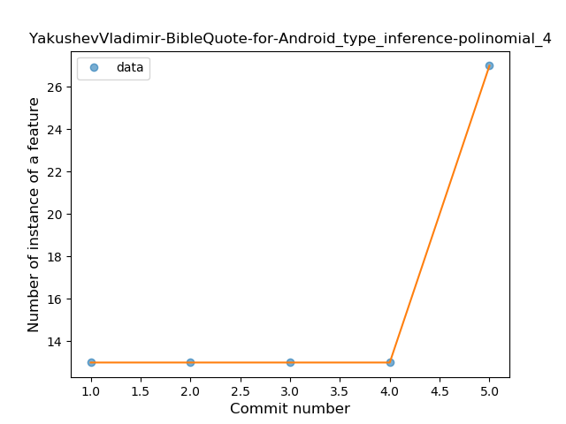

#### YakushevVladimir-BibleQuote-for-Android
* Feature: Lambda
* Function: 
* R_Squared: 1.0
 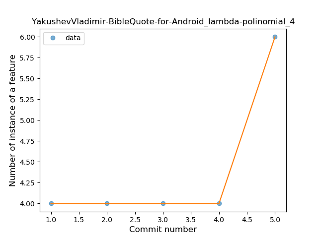

#### MrBIMC-SELinuxModeChanger
* Feature: When expression
* Function: 
* R_Squared: 1.0
 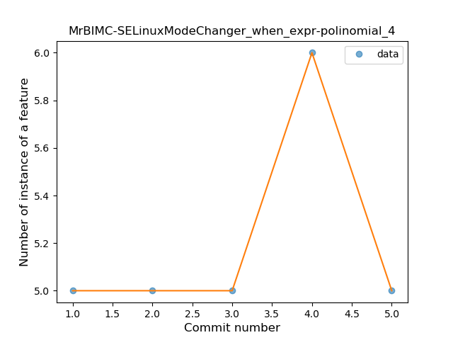

#### ids1024-lsdict-android
* Feature: String Template
* Function: 
* R_Squared: 1.0
 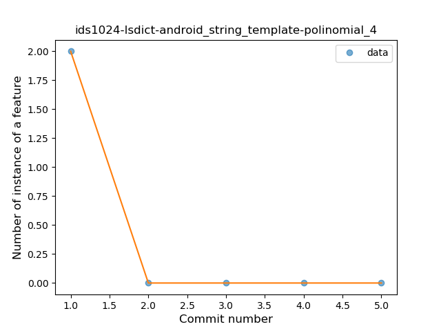

#### ianhanniballake-LocalStorage
* Feature: When expression
* Function: 
* R_Squared: 0.9952381
 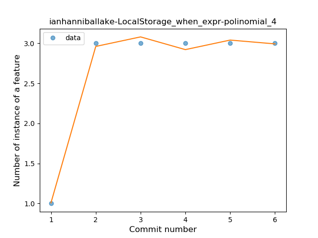

#### ianhanniballake-LocalStorage
* Feature: Companion Object
* Function: 
* R_Squared: 0.9952381
 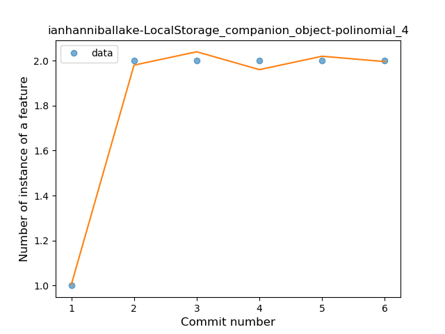

#### LittleLightCz-SheepsGoHome
* Feature: Lambda
* Function: )
* R_Squared: 0.99463247
 

#### jqno-remindermail
* Feature: Safe Call
* Function: 
* R_Squared: 0.98920184
 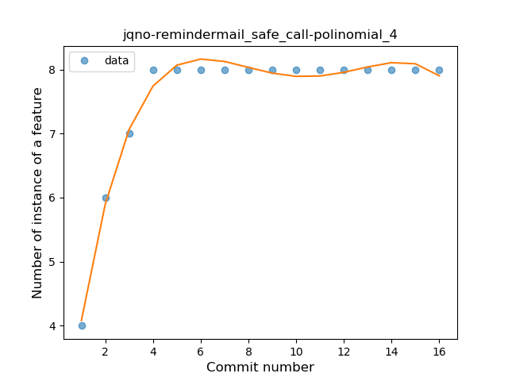

#### mbarta-scr-redesign
* Feature: Type Inference
* Function: 
* R_Squared: 0.98749607
 

#### MrBIMC-SELinuxModeChanger
* Feature: Lambda
* Function: )
* R_Squared: 0.98214286
 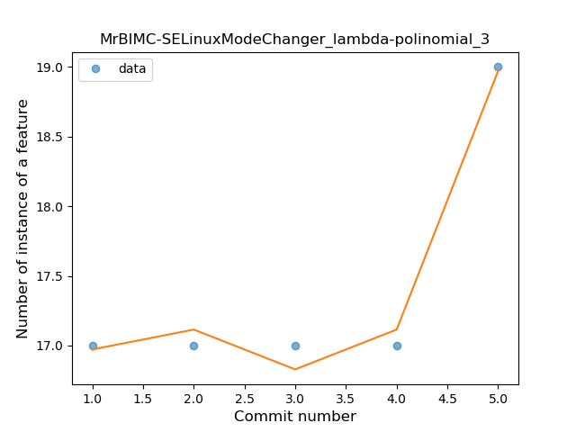

#### 39aldo39-DecSyncCC
* Feature: Safe Call
* Function: )
* R_Squared: 0.98214286
 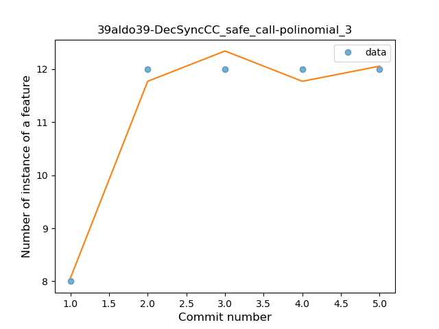

#### danirod-rectball
* Feature: Singleton
* Function: )
* R_Squared: 0.98214286
 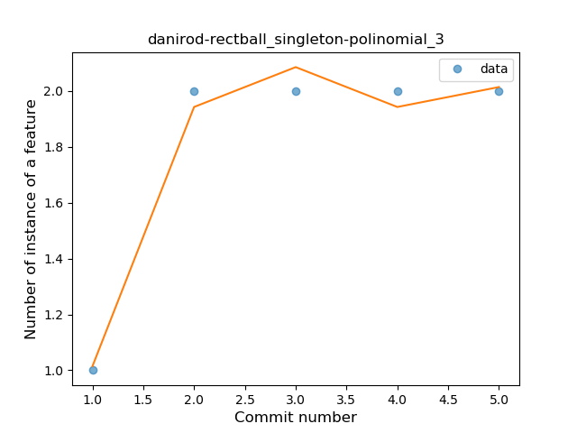

#### jqno-remindermail
* Feature: Type Inference
* Function: 
* R_Squared: 0.98142973
 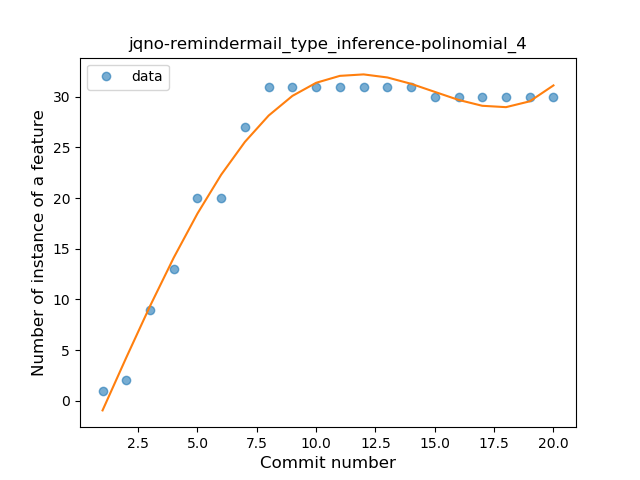

#### johnperry-math-Chinese-Remainder-Clock
* Feature: Type Inference
* Function: 
* R_Squared: 0.98138839
 

#### johnperry-math-Chinese-Remainder-Clock
* Feature: Unsafe Call
* Function: 
* R_Squared: 0.97557407
 

#### jqno-remindermail
* Feature: Lambda
* Function: )
* R_Squared: 0.97236725
 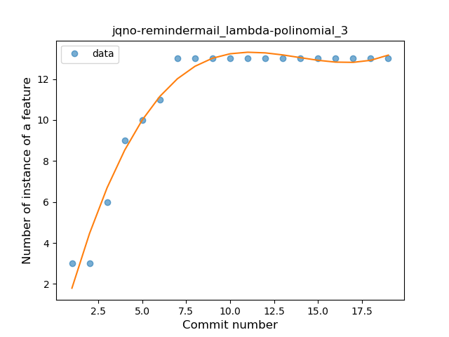

#### caarmen-poet-assistant
* Feature: Type Inference
* Function: )
* R_Squared: 0.97163998
 

#### caarmen-poet-assistant
* Feature: Lambda
* Function: )
* R_Squared: 0.9714
 

#### AIDEA775-UNCmorfi
* Feature: Type Inference
* Function: 
* R_Squared: 0.96945127
 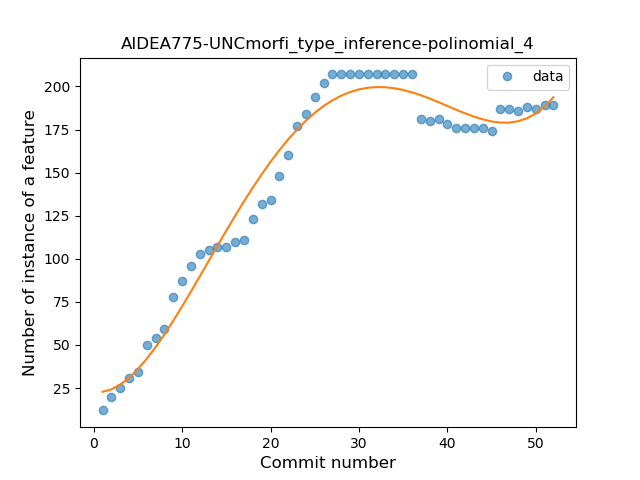

#### sjnyag-stamp
* Feature: Lambda
* Function: )
* R_Squared: 0.96874191
 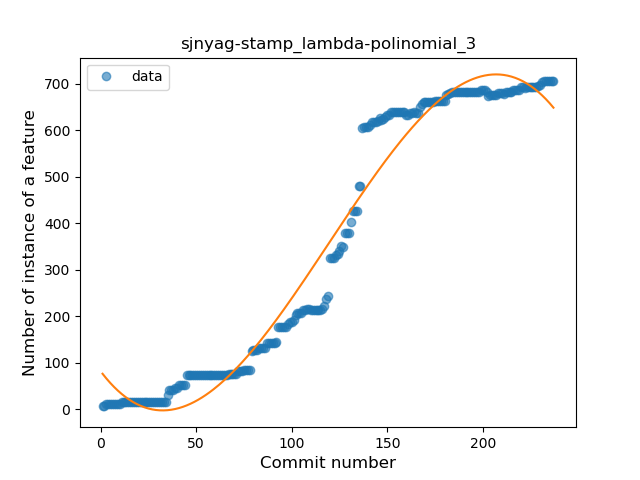

#### AkshayChordiya-gofun-android
* Feature: Lambda
* Function: )
* R_Squared: 0.96631988
 

#### thanksmister-androidthings-mqtt-alarm-panel
* Feature: Safe Call
* Function: )
* R_Squared: 0.96380046
 

#### dkrivoruchko-ScreenStream
* Feature: Property Delegation
* Function: 
* R_Squared: 0.96378843
 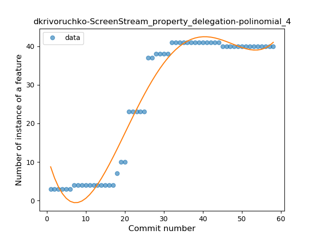

#### nathanj-ogsdroid
* Feature: Safe Call
* Function: )
* R_Squared: 0.96232764
 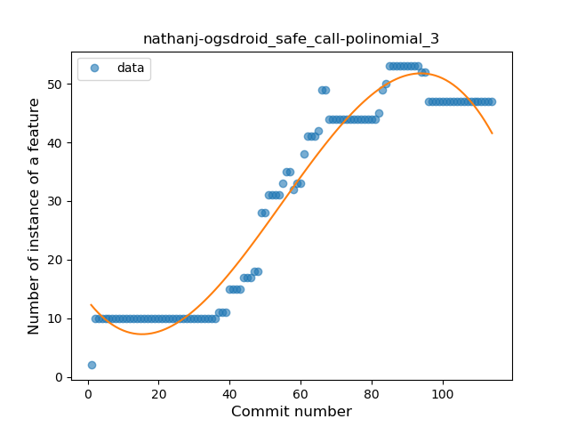

#### erickok-borefts2015
* Feature: When expression
* Function: )
* R_Squared: 0.96199886
 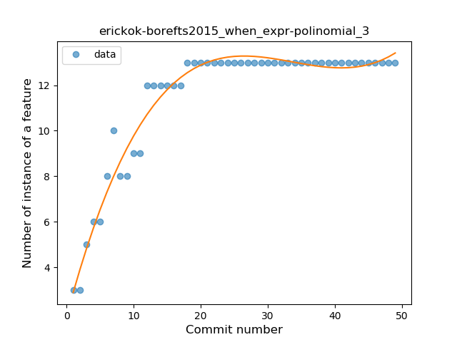

#### robnixon-ComputingTutorAndroidApp
* Feature: Type Inference
* Function: 
* R_Squared: 0.96074101
 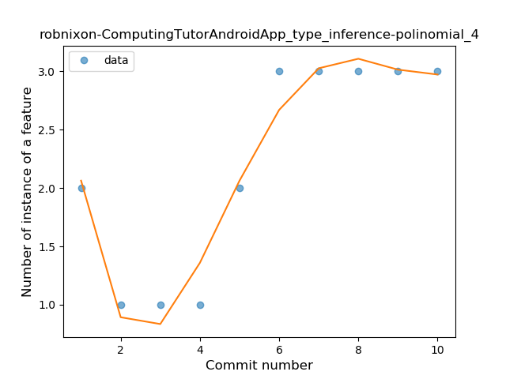

#### wanbok-Monger-Android
* Feature: Type Inference
* Function: )
* R_Squared: 0.96049996
 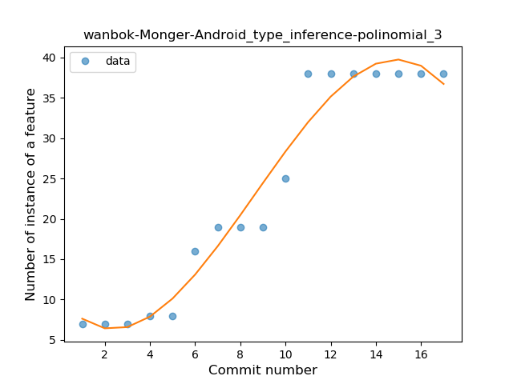

#### FengMoeTeam-NHentai-android
* Feature: Companion Object
* Function: 
* R_Squared: 0.96048842
 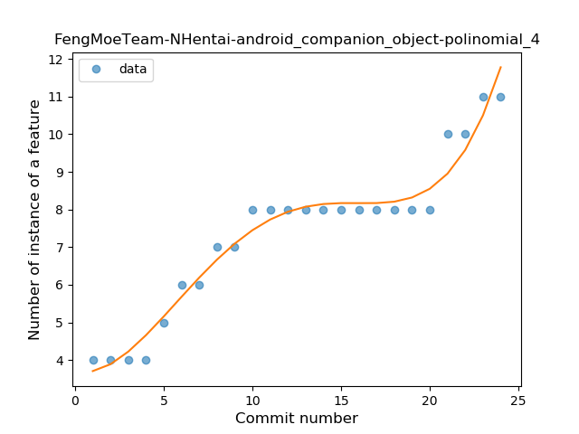

#### erickok-borefts2015
* Feature: Extension Function
* Function: )
* R_Squared: 0.96023355
 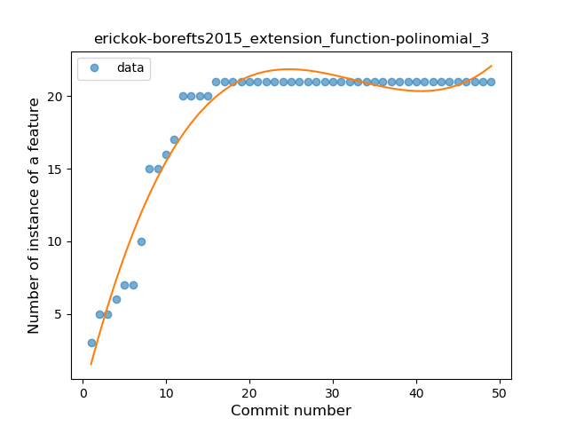

#### marcelgross90-Cineaste
* Feature: Data Class
* Function: )
* R_Squared: 0.95844418
 

#### esafirm-android-playground
* Feature: String Template
* Function: 
* R_Squared: 0.95842938
 

#### hidroh-materialistic
* Feature: Unsafe Call
* Function: 
* R_Squared: 0.95661746
 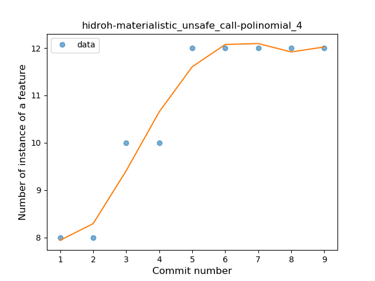

#### grote-Transportr
* Feature: Lambda
* Function: )
* R_Squared: 0.95644502
 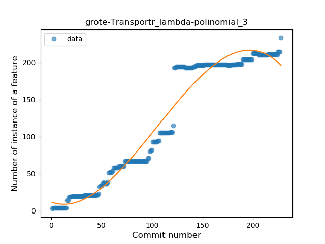

#### marcelgross90-Cineaste
* Feature: Function with Default Value
* Function: )
* R_Squared: 0.95580133
 

#### caarmen-FRCAndroidWidget
* Feature: String Template
* Function: 
* R_Squared: 0.95104895
 

#### sjnyag-stamp
* Feature: Safe Call
* Function: )
* R_Squared: 0.94976081
 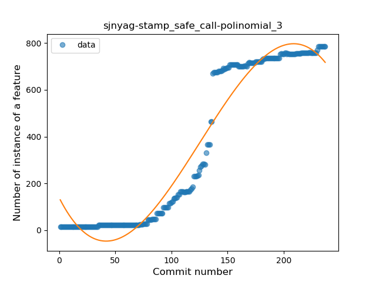

#### Waboodoo-Status-Bar-Tachometer
* Feature: Unsafe Call
* Function: 
* R_Squared: 0.94968301
 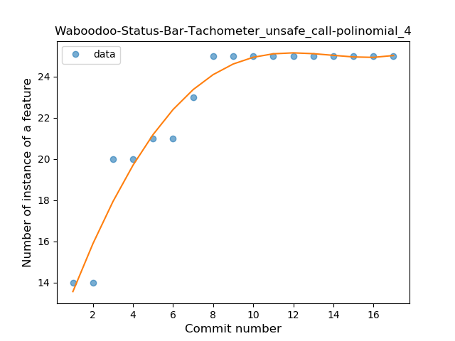

#### sjnyag-stamp
* Feature: Type Inference
* Function: )
* R_Squared: 0.9492477
 

#### ianhanniballake-LocalStorage
* Feature: Type Inference
* Function: )
* R_Squared: 0.94831759
 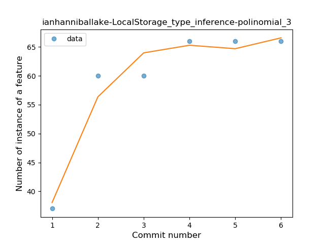

#### bnlrnz-MandelGL
* Feature: Safe Call
* Function: 
* R_Squared: 0.94348644
 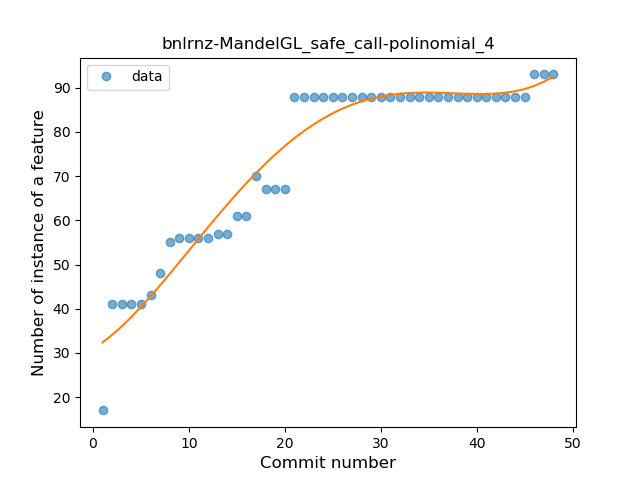

#### hidroh-materialistic
* Feature: Type Inference
* Function: 
* R_Squared: 0.94335054
 

#### Streetwalrus-android_usb_msd
* Feature: Type Inference
* Function: )
* R_Squared: 0.94207752
 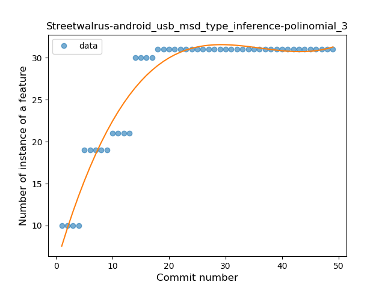

#### marcelgross90-Cineaste
* Feature: Type Inference
* Function: 
* R_Squared: 0.94191737
 

#### hyst329-OpenFool
* Feature: Type Inference
* Function: )
* R_Squared: 0.93902472
 

#### bassph-bassph-app-android
* Feature: Type Inference
* Function: )
* R_Squared: 0.93897012
 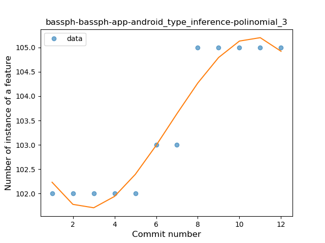

#### impalex-knockonports
* Feature: Type Inference
* Function: 
* R_Squared: 0.93886394
 

#### peppercarrot-e-reader
* Feature: Type Inference
* Function: )
* R_Squared: 0.93773084
 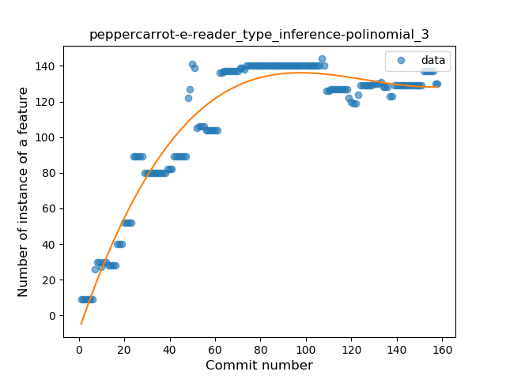

#### danirod-rectball
* Feature: String Template
* Function: 
* R_Squared: 0.93644415
 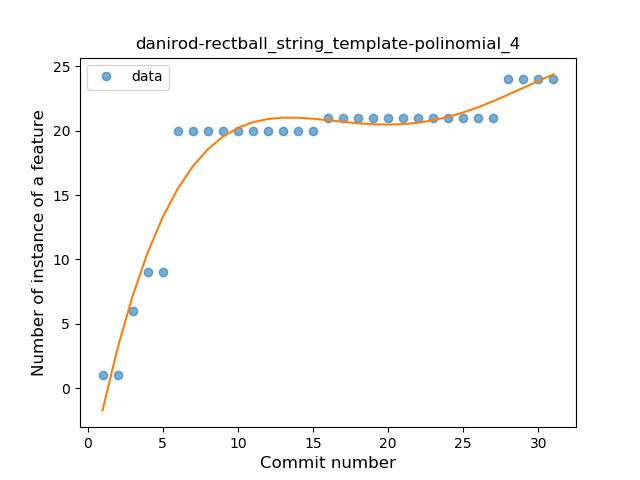

#### AkshayChordiya-gofun-android
* Feature: Extension Function
* Function: )
* R_Squared: 0.93585017
 

#### Waboodoo-Status-Bar-Tachometer
* Feature: Type Inference
* Function: )
* R_Squared: 0.93398046
 

#### Jizzu-SimpleToDo
* Feature: String Template
* Function: 
* R_Squared: 0.93179756
 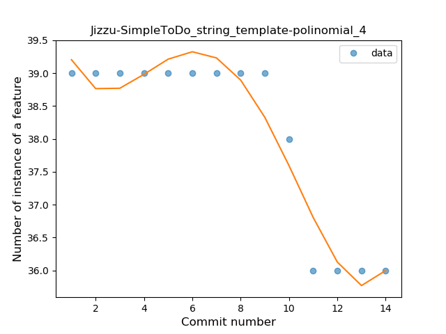

#### carlphilipp-chicago-commutes
* Feature: Type Inference
* Function: )
* R_Squared: 0.93168517
 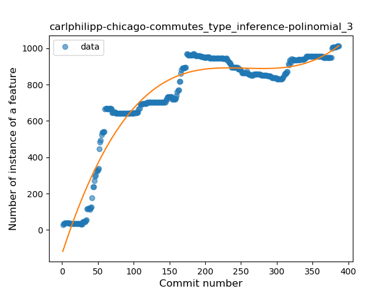

#### robnixon-ComputingTutorAndroidApp
* Feature: Unsafe Call
* Function: 
* R_Squared: 0.93006993
 

#### syncthing-syncthing-lite
* Feature: Lambda
* Function: )
* R_Squared: 0.929711
 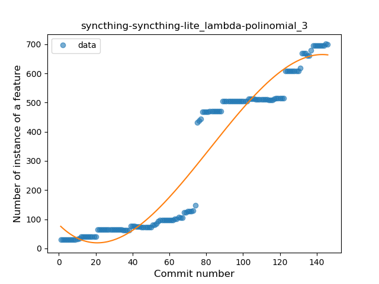

#### pflammertsma-cryptogram
* Feature: Lambda
* Function: )
* R_Squared: 0.92904633
 

#### Streetwalrus-android_usb_msd
* Feature: String Template
* Function: )
* R_Squared: 0.92841332
 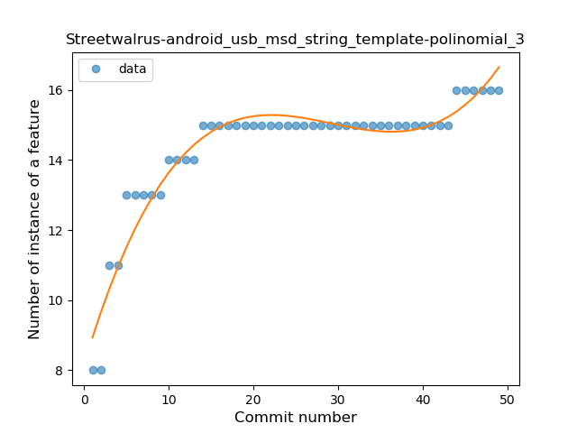

#### sreich-android-count-the-days
* Feature: Property Delegation
* Function: 
* R_Squared: 0.92660206
 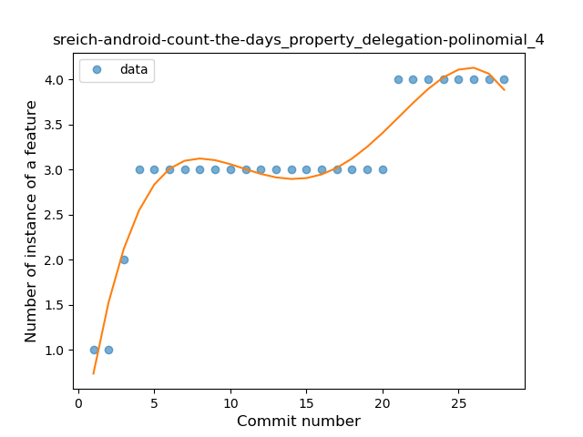

#### lenchan139-NCBookmark
* Feature: Type Inference
* Function: 
* R_Squared: 0.92645672
 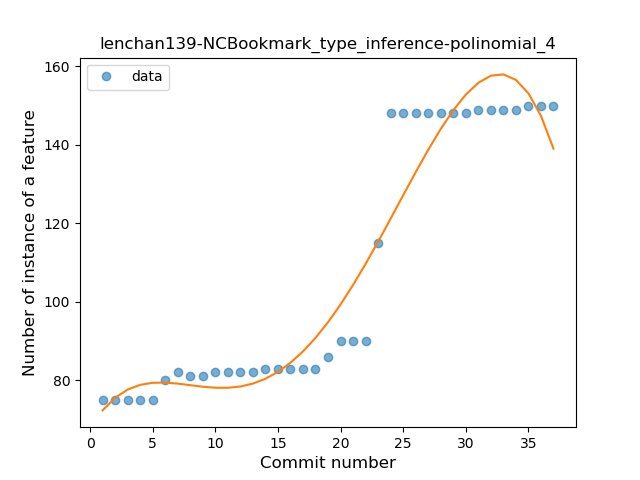

#### impalex-knockonports
* Feature: Safe Call
* Function: 
* R_Squared: 0.92526894
 

#### xgouchet-Stanley
* Feature: String Template
* Function: 
* R_Squared: 0.92163749
 

#### jpeddicord-speedofsound
* Feature: Unsafe Call
* Function: 
* R_Squared: 0.92043278
 

#### hidroh-materialistic
* Feature: Lambda
* Function: 
* R_Squared: 0.91922584
 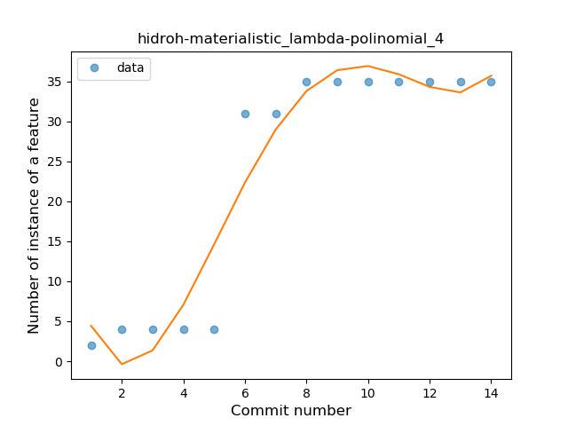

#### ManojMadanmohan-dlt
* Feature: Type Inference
* Function: 
* R_Squared: 0.91871846
 

#### nao20010128nao-DroidComplex
* Feature: Unsafe Call
* Function: 
* R_Squared: 0.9185372
 

#### bnlrnz-MandelGL
* Feature: Type Inference
* Function: 
* R_Squared: 0.91851142
 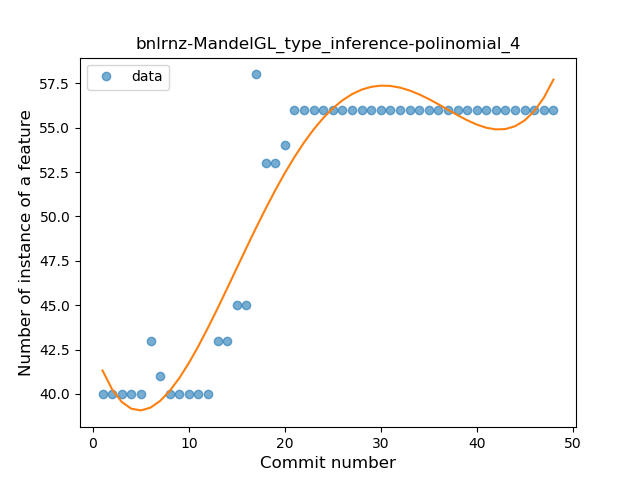

#### impalex-knockonports
* Feature: Property Delegation
* Function: 
* R_Squared: 0.91849353
 

#### danvratil-FBEventSync
* Feature: Type Inference
* Function: )
* R_Squared: 0.91775958
 

#### joaomneto-TitanCompanion
* Feature: Unsafe Call
* Function: )
* R_Squared: 0.91730462
 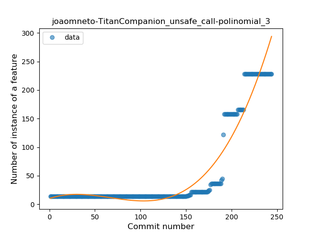

#### impalex-knockonports
* Feature: Unsafe Call
* Function: 
* R_Squared: 0.91624519
 

#### WYKCode-WYK-Android
* Feature: Unsafe Call
* Function: )
* R_Squared: 0.91381575
 

#### ohmae-DmsExplorer
* Feature: Type Inference
* Function: )
* R_Squared: 0.91361131
 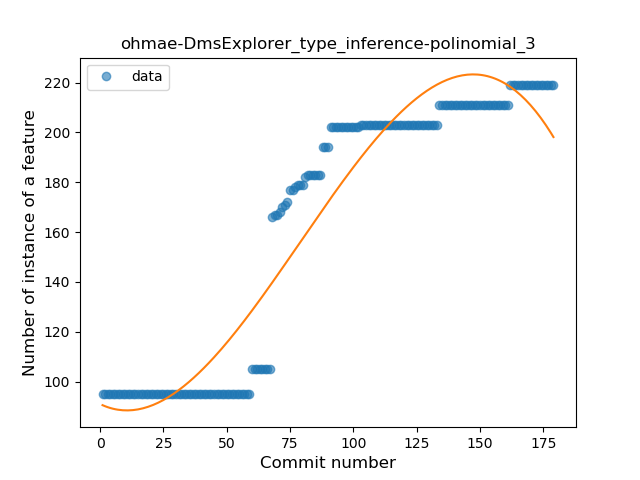

#### syncthing-syncthing-lite
* Feature: Companion Object
* Function: )
* R_Squared: 0.91266747
 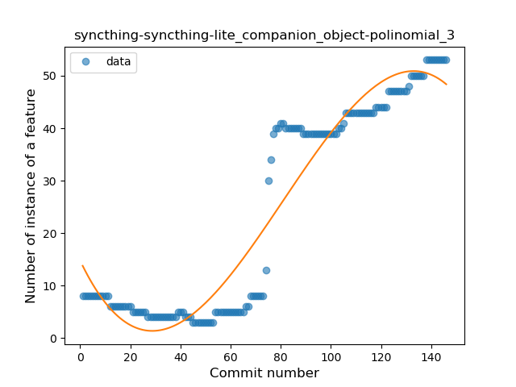

#### michaelkourlas-voipms-sms-client
* Feature: String Template
* Function: )
* R_Squared: 0.91247803
 

#### lenchan139-NCBookmark
* Feature: Lambda
* Function: 
* R_Squared: 0.91198324
 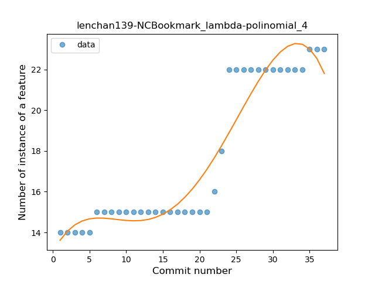

#### includex-LineageWatcher
* Feature: Type Inference
* Function: )
* R_Squared: 0.91057692
 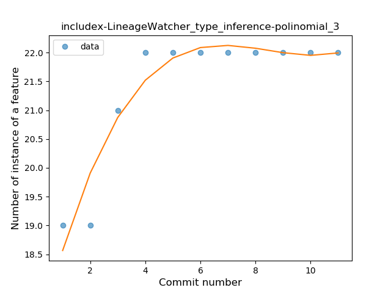

#### marcelgross90-Cineaste
* Feature: Safe Call
* Function: )
* R_Squared: 0.91035993
 

#### nathanj-ogsdroid
* Feature: Unsafe Call
* Function: )
* R_Squared: 0.91026538
 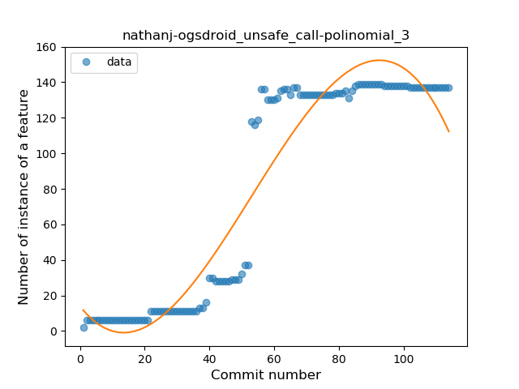

#### ManojMadanmohan-dlt
* Feature: Companion Object
* Function: 
* R_Squared: 0.90603429
 

#### wanbok-Monger-Android
* Feature: Safe Call
* Function: )
* R_Squared: 0.90517314
 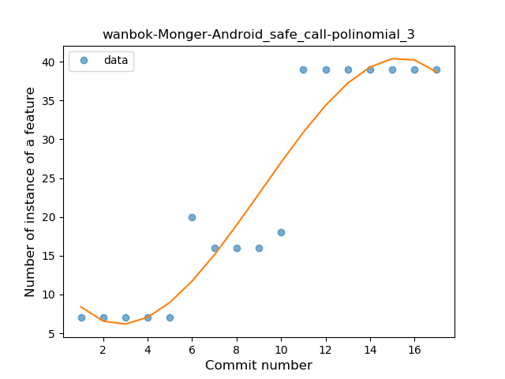

#### impalex-knockonports
* Feature: Smart Cast
* Function: 
* R_Squared: 0.90474599
 

#### impalex-knockonports
* Feature: Lambda
* Function: 
* R_Squared: 0.90451399
 

#### camsteffen-polite
* Feature: Companion Object
* Function: 
* R_Squared: 0.90431643
 

#### devmil-PaperLaunch
* Feature: Unsafe Call
* Function: 
* R_Squared: 0.90344391
 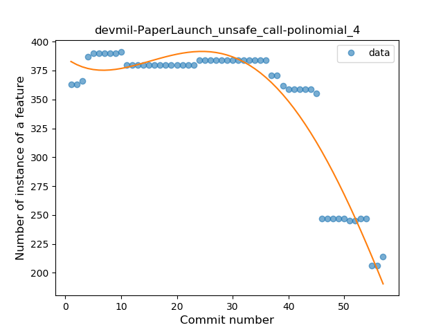

#### dkrivoruchko-ScreenStream
* Feature: Singleton
* Function: 
* R_Squared: 0.90225913
 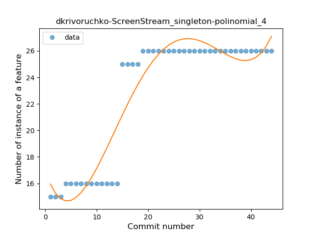

#### jpeddicord-speedofsound
* Feature: String Template
* Function: )
* R_Squared: 0.90066771
 

#### Maxr1998-home-assistant-Android
* Feature: Type Inference
* Function: )
* R_Squared: 0.89997218
 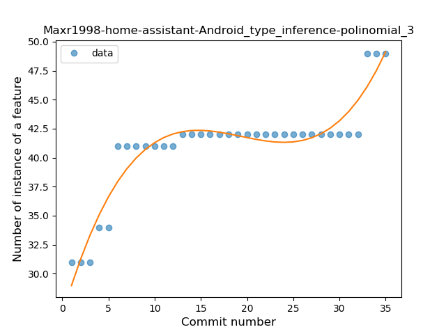

#### pennlabs-penn-mobile-android
* Feature: Type Inference
* Function: 
* R_Squared: 0.89937013
 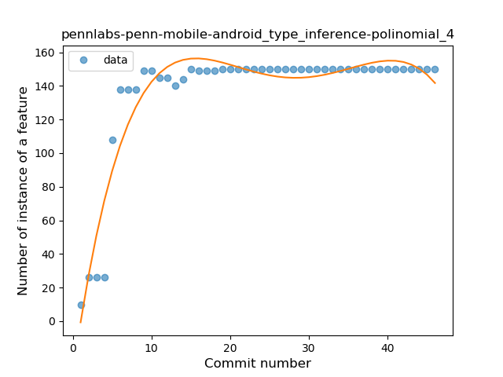

#### devmil-muzei-bingimageoftheday
* Feature: Unsafe Call
* Function: 
* R_Squared: 0.89752009
 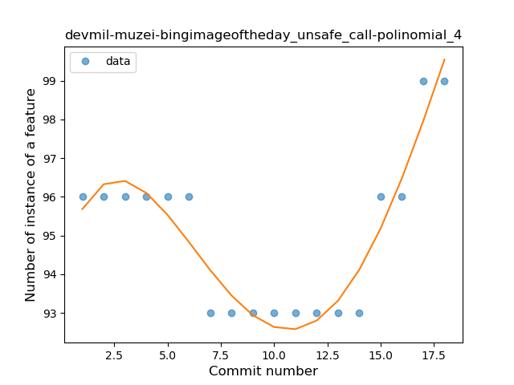

#### syncthing-syncthing-lite
* Feature: Type Inference
* Function: )
* R_Squared: 0.89721988
 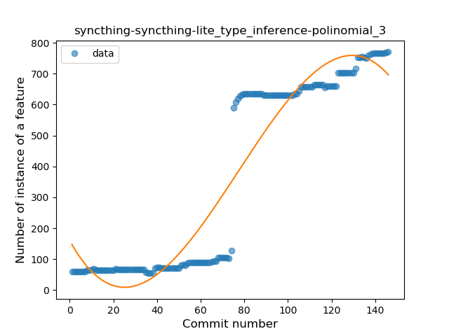

#### michaelkourlas-voipms-sms-client
* Feature: Unsafe Call
* Function: )
* R_Squared: 0.89342134
 

#### FengMoeTeam-NHentai-android
* Feature: Extension Function
* Function: 
* R_Squared: 0.89340759
 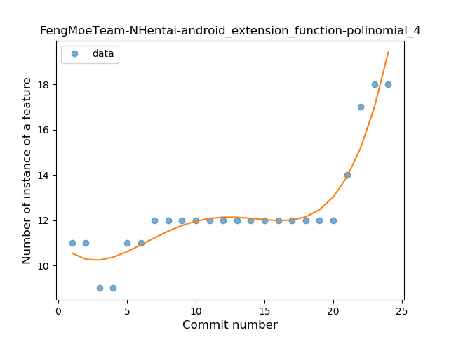

#### AIDEA775-UNCmorfi
* Feature: Function with Default Value
* Function: )
* R_Squared: 0.89336821
 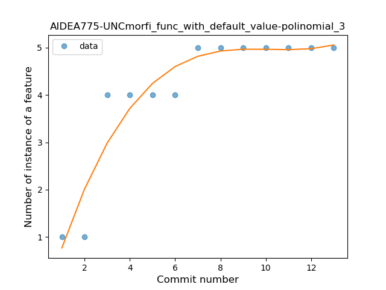

#### erickok-borefts2015
* Feature: Safe Call
* Function: )
* R_Squared: 0.89331879
 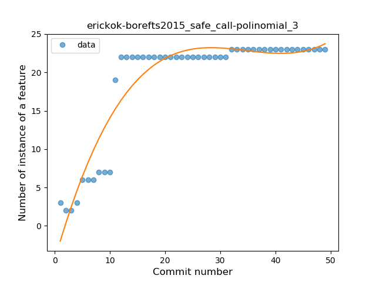

#### kamgurgul-cpu-info
* Feature: Lambda
* Function: )
* R_Squared: 0.89304379
 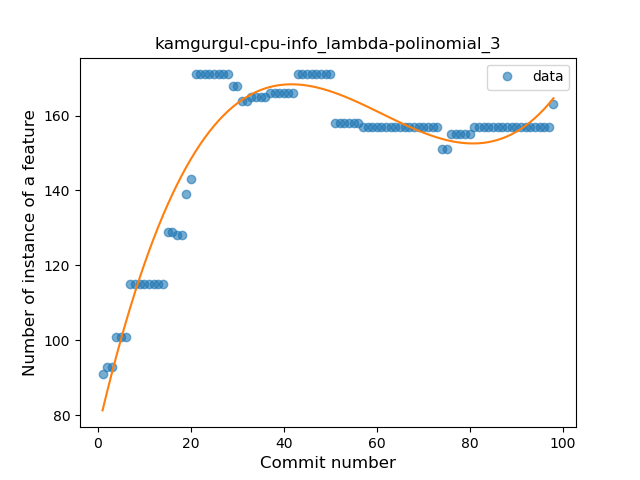

#### thiolliere-YouTubeStream
* Feature: Type Inference
* Function: 
* R_Squared: 0.89277389
 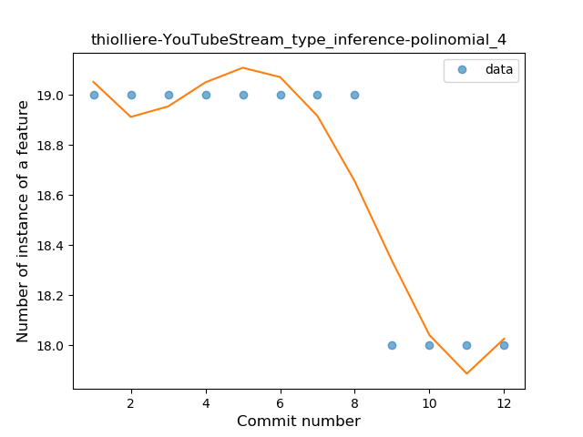

#### johnjohndoe-Umweltzone
* Feature: Type Inference
* Function: )
* R_Squared: 0.8916166
 

#### erickok-borefts2015
* Feature: Data Class
* Function: )
* R_Squared: 0.89135716
 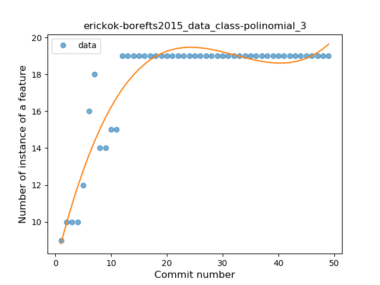

#### systemallica-ValenBisi
* Feature: Unsafe Call
* Function: )
* R_Squared: 0.8913408
 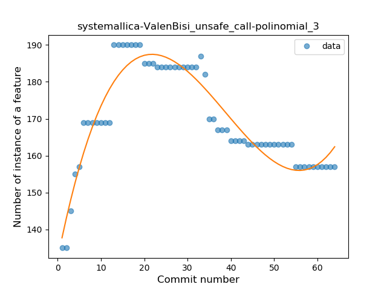

#### joaomneto-TitanCompanion
* Feature: Type Inference
* Function: )
* R_Squared: 0.89126611
 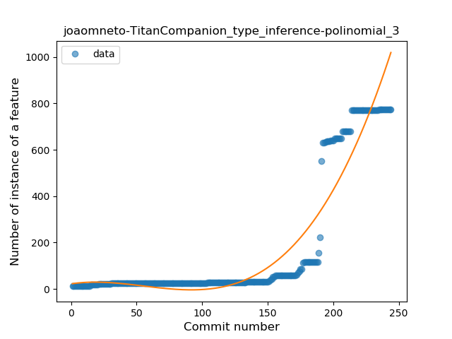

#### Jizzu-SimpleToDo
* Feature: Unsafe Call
* Function: 
* R_Squared: 0.89055944
 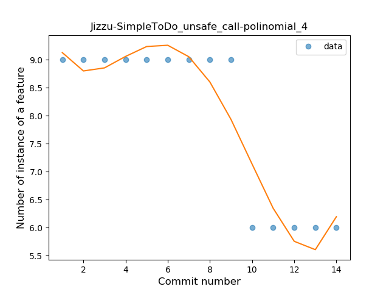

#### Jizzu-SimpleToDo
* Feature: Property Delegation
* Function: 
* R_Squared: 0.89055944
 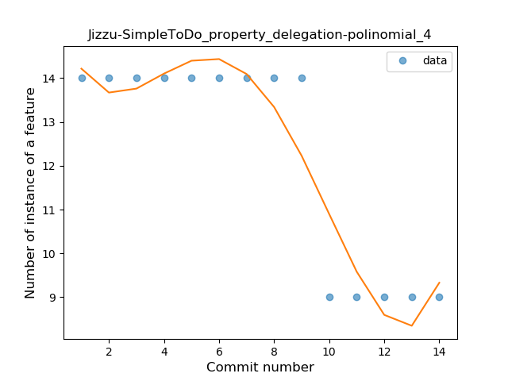

#### plusCubed-velociraptor
* Feature: Type Inference
* Function: 
* R_Squared: 0.89037822
 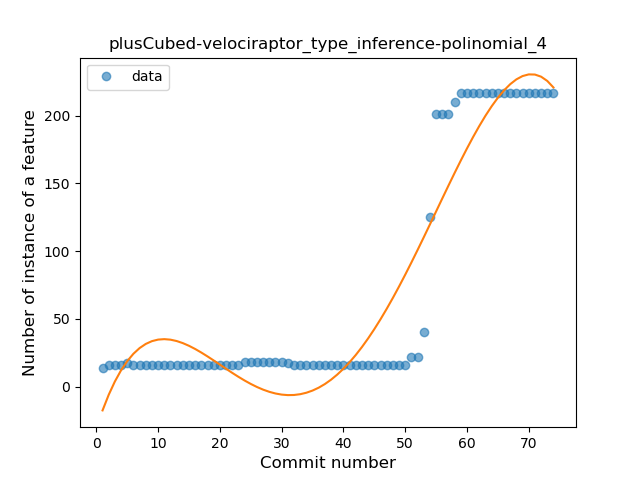

#### fvasco-pinpoi
* Feature: Unsafe Call
* Function: )
* R_Squared: 0.89021252
 

#### johnjohndoe-Umweltzone
* Feature: Lambda
* Function: )
* R_Squared: 0.88945694
 

#### ironjan-MensaUPB
* Feature: Type Inference
* Function: 
* R_Squared: 0.88927739
 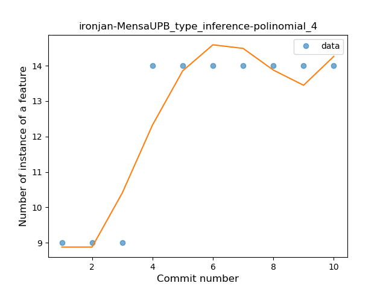

#### dbrant-unitconverter-android
* Feature: Unsafe Call
* Function: 
* R_Squared: 0.88927739
 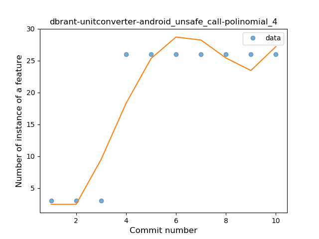

#### hyst329-OpenFool
* Feature: String Template
* Function: )
* R_Squared: 0.88903253
 

#### caarmen-FRCAndroidWidget
* Feature: Lambda
* Function: 
* R_Squared: 0.88671329
 

#### BenAlderfer-hand-and-foot-scores
* Feature: Type Inference
* Function: 
* R_Squared: 0.88636495
 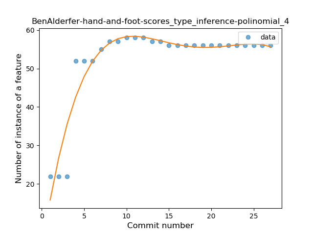

#### helloworld1-FreeOTPPlus
* Feature: Type Inference
* Function: 
* R_Squared: 0.88461538
 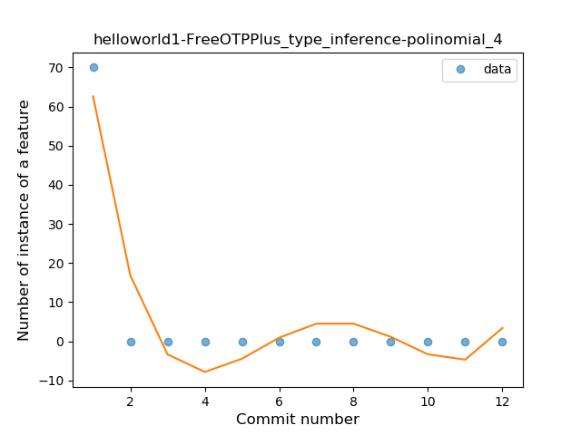

#### helloworld1-FreeOTPPlus
* Feature: Lambda
* Function: 
* R_Squared: 0.88461538
 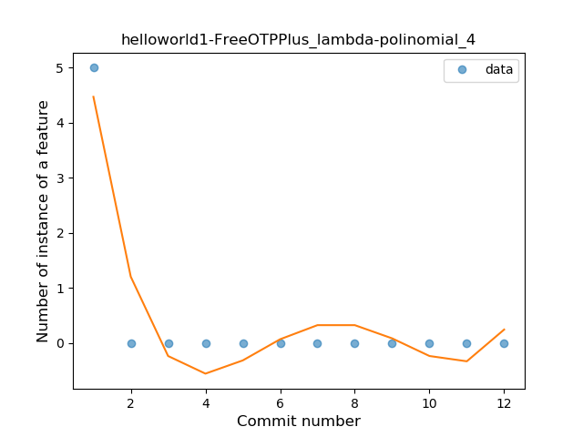

#### helloworld1-FreeOTPPlus
* Feature: When expression
* Function: 
* R_Squared: 0.88461538
 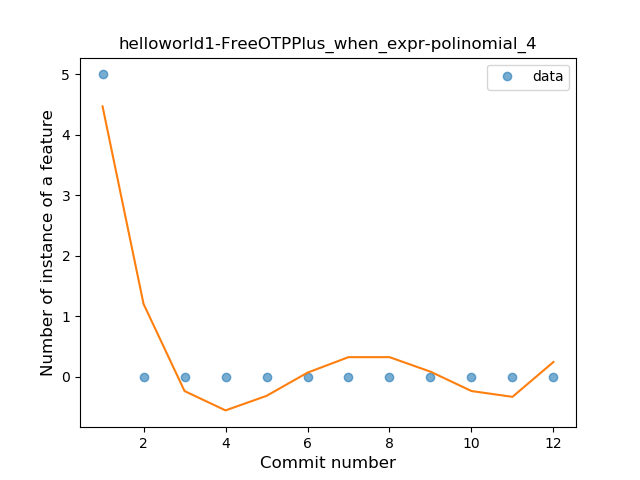

#### helloworld1-FreeOTPPlus
* Feature: Companion Object
* Function: 
* R_Squared: 0.88461538
 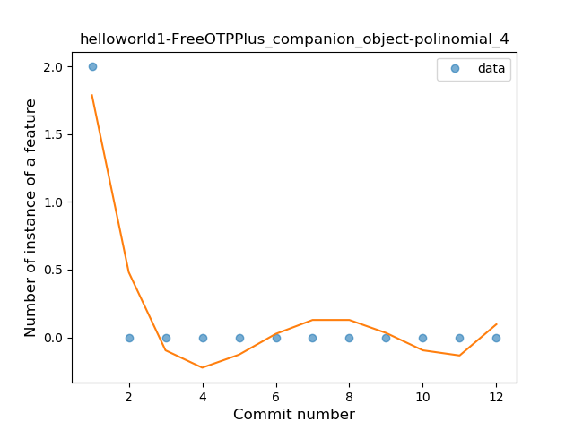

#### johnjohndoe-Umweltzone
* Feature: Companion Object
* Function: 
* R_Squared: 0.88461538
 

#### helloworld1-FreeOTPPlus
* Feature: Unsafe Call
* Function: 
* R_Squared: 0.88461538
 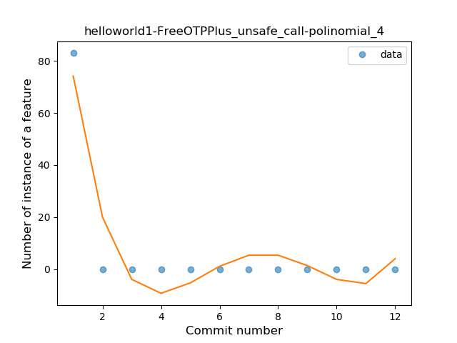

#### johnjohndoe-Umweltzone
* Feature: Singleton
* Function: 
* R_Squared: 0.88461538
 

#### helloworld1-FreeOTPPlus
* Feature: Range Expression
* Function: 
* R_Squared: 0.88461538
 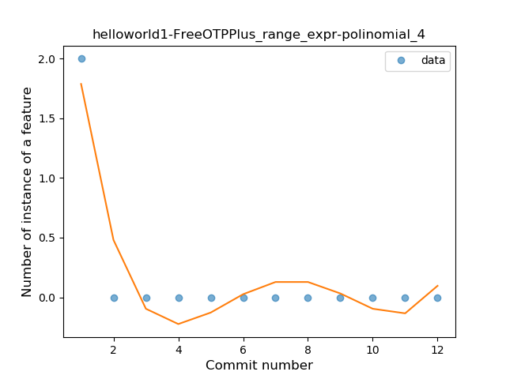

#### johnjohndoe-Umweltzone
* Feature: Function call with Named Argument
* Function: 
* R_Squared: 0.88461538
 

#### johnjohndoe-Umweltzone
* Feature: Data Class
* Function: 
* R_Squared: 0.88461538
 

#### bassph-bassph-app-android
* Feature: Unsafe Call
* Function: 
* R_Squared: 0.88438228
 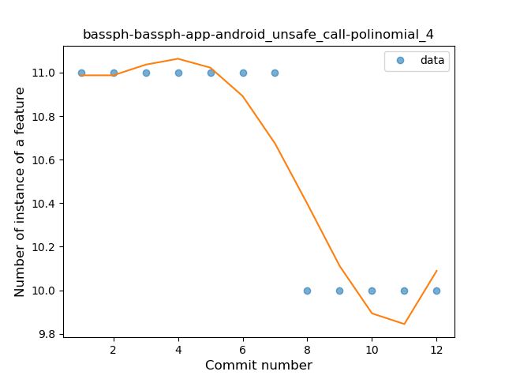

#### bassph-bassph-app-android
* Feature: Function call with Named Argument
* Function: 
* R_Squared: 0.88438228
 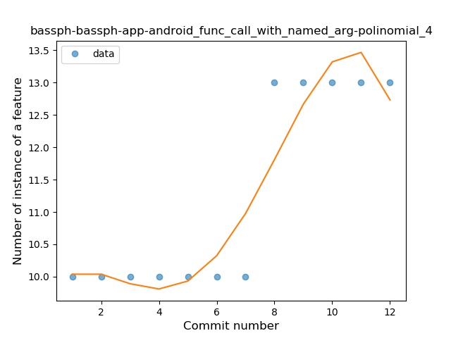

#### devmil-muzei-bingimageoftheday
* Feature: Lambda
* Function: 
* R_Squared: 0.88432311
 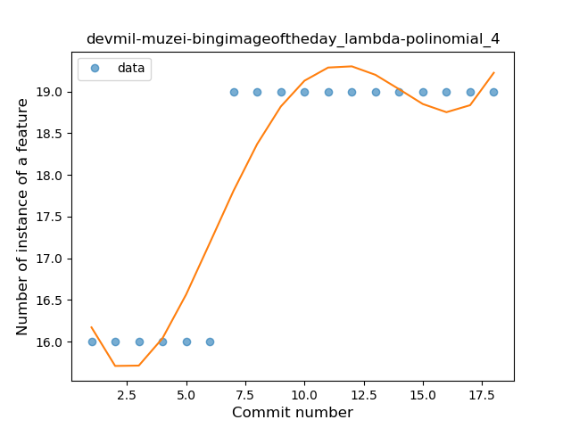

#### impalex-knockonports
* Feature: Data Class
* Function: 
* R_Squared: 0.88349885
 

#### marcelgross90-Cineaste
* Feature: Unsafe Call
* Function: 
* R_Squared: 0.883384
 

#### pistatium-mahougen
* Feature: Type Inference
* Function: 
* R_Squared: 0.88179121
 

#### pennlabs-penn-mobile-android
* Feature: Lambda
* Function: )
* R_Squared: 0.88012153
 

#### WYKCode-WYK-Android
* Feature: Property Delegation
* Function: )
* R_Squared: 0.87795544
 

#### teamblueridge-PasteIt
* Feature: Safe Call
* Function: 
* R_Squared: 0.87787512
 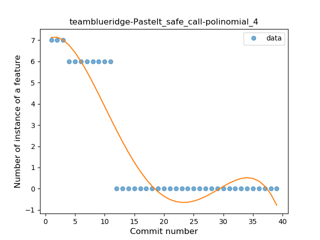

#### bottiger-SoundWaves
* Feature: Type Inference
* Function: )
* R_Squared: 0.87762662
 

#### FengMoeTeam-NHentai-android
* Feature: String Template
* Function: )
* R_Squared: 0.8768191
 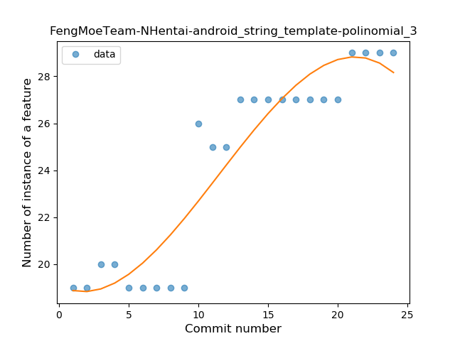

#### bassph-bassph-app-android
* Feature: Lambda
* Function: )
* R_Squared: 0.87115799
 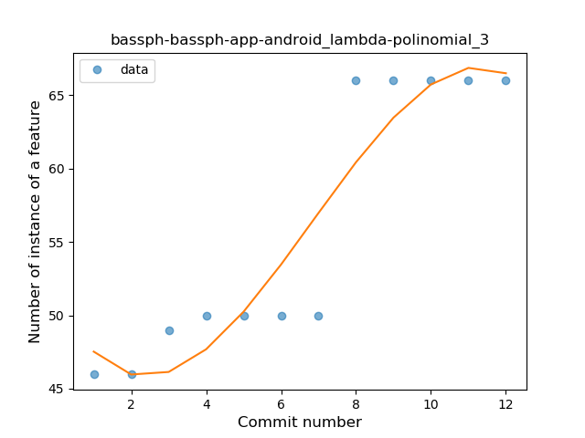

#### WilderPereira-lmgtfyGen
* Feature: Companion Object
* Function: 
* R_Squared: 0.87044221
 

#### WYKCode-WYK-Android
* Feature: Data Class
* Function: 
* R_Squared: 0.86975542
 

#### Maxr1998-home-assistant-Android
* Feature: Safe Call
* Function: )
* R_Squared: 0.86840643
 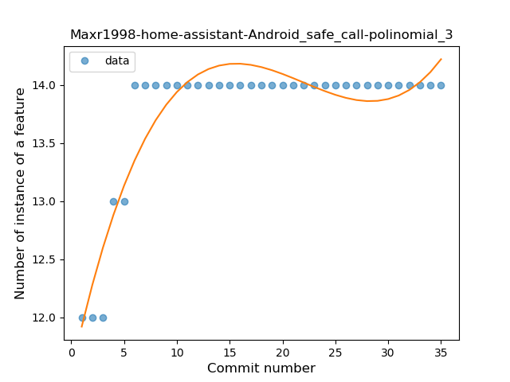

#### GreenLionSoft-madrid-pollution-android-app
* Feature: Type Inference
* Function: 
* R_Squared: 0.86836586
 

#### JanYoStudio-WhatAnime
* Feature: When expression
* Function: )
* R_Squared: 0.86767006
 

#### marcelgross90-Cineaste
* Feature: When expression
* Function: )
* R_Squared: 0.86754335
 

#### camsteffen-polite
* Feature: String Template
* Function: 
* R_Squared: 0.86733515
 

#### pflammertsma-cryptogram
* Feature: Type Inference
* Function: )
* R_Squared: 0.86675113
 

#### Jizzu-SimpleToDo
* Feature: When expression
* Function: )
* R_Squared: 0.86672151
 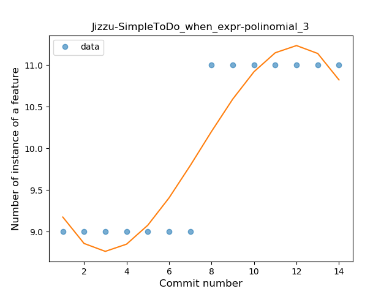

#### Jizzu-SimpleToDo
* Feature: Companion Object
* Function: )
* R_Squared: 0.86672151
 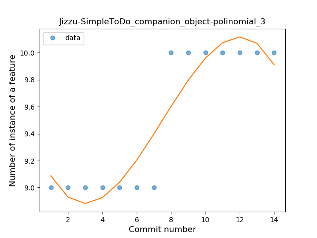

#### pennlabs-penn-mobile-android
* Feature: Safe Call
* Function: 
* R_Squared: 0.86471201
 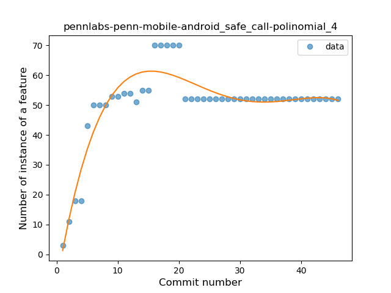

#### LISTEN-moe-android-app
* Feature: String Template
* Function: )
* R_Squared: 0.8639126
 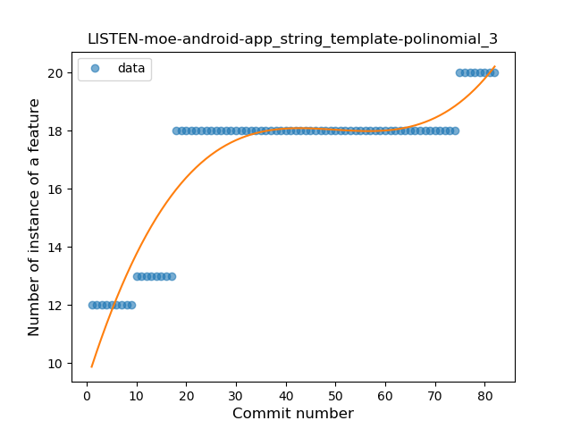

#### impalex-knockonports
* Feature: String Template
* Function: 
* R_Squared: 0.86349896
 

#### impalex-knockonports
* Feature: Function call with Named Argument
* Function: 
* R_Squared: 0.86134454
 

#### ianmcxa-vortaro
* Feature: Type Inference
* Function: 
* R_Squared: 0.86040108
 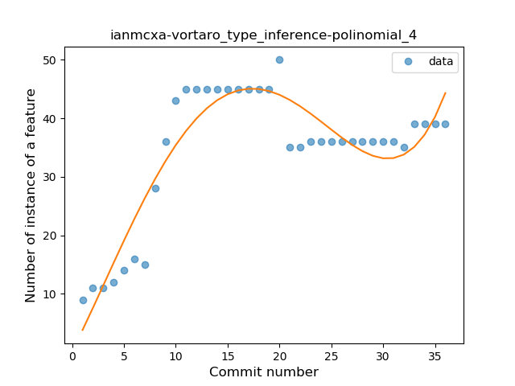

#### garmax1-material-flashlight
* Feature: Unsafe Call
* Function: )
* R_Squared: 0.85972291
 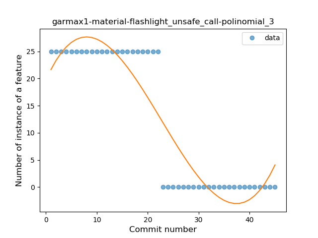

#### rosenpin-QuickDrawEverywhere
* Feature: Function with Default Value
* Function: )
* R_Squared: 0.85885812
 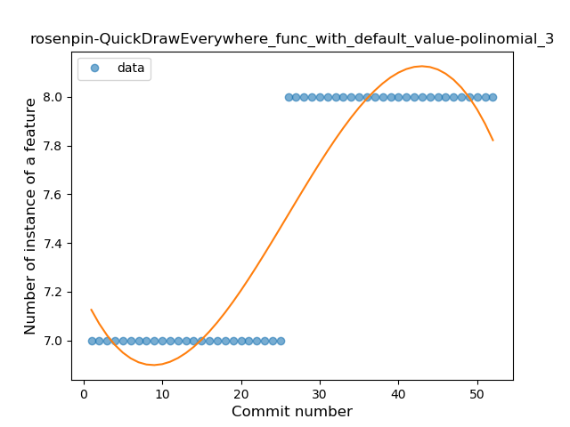

#### ManojMadanmohan-dlt
* Feature: Singleton
* Function: )
* R_Squared: 0.85756743
 

#### jkennethcarino-AnkiEditor
* Feature: Lambda
* Function: 
* R_Squared: 0.85664336
 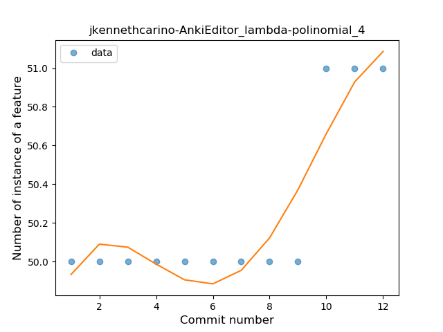

#### devmil-muzei-bingimageoftheday
* Feature: Type Inference
* Function: 
* R_Squared: 0.85631548
 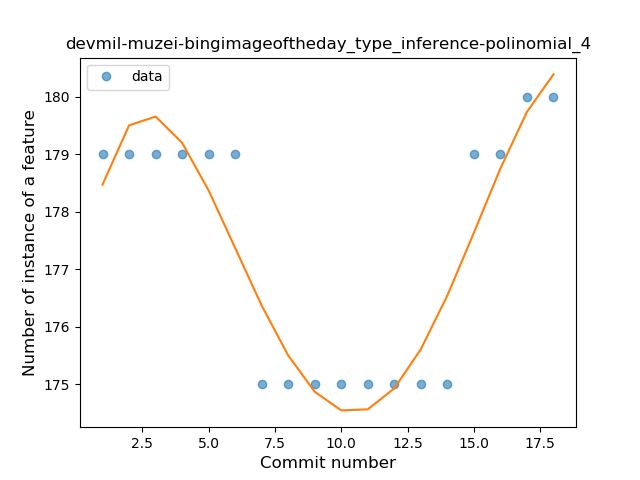

#### camsteffen-polite
* Feature: Type Inference
* Function: )
* R_Squared: 0.85522259
 

#### mecid-BakuBus
* Feature: Safe Call
* Function: 
* R_Squared: 0.85396082
 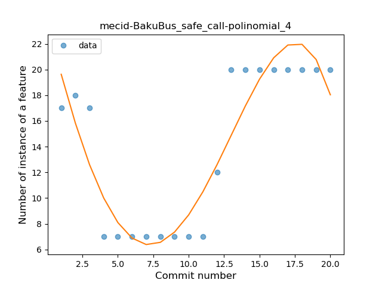

#### LaurentTreguier-deck
* Feature: Safe Call
* Function: )
* R_Squared: 0.85359093
 

#### bassph-bassph-app-android
* Feature: Safe Call
* Function: )
* R_Squared: 0.85341098
 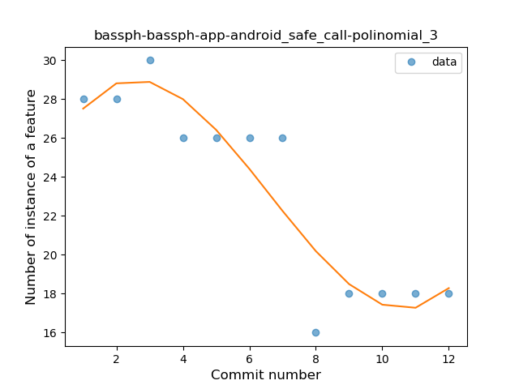

#### kamgurgul-cpu-info
* Feature: Property Delegation
* Function: )
* R_Squared: 0.85315194
 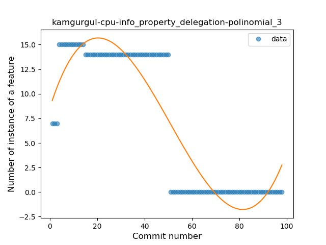

#### JanYoStudio-WhatAnime
* Feature: Unsafe Call
* Function: 
* R_Squared: 0.85103091
 

#### LISTEN-moe-android-app
* Feature: Type Inference
* Function: 
* R_Squared: 0.84892091
 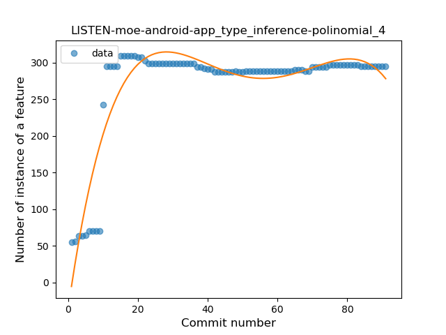

#### BenAlderfer-hand-and-foot-scores
* Feature: Safe Call
* Function: 
* R_Squared: 0.84847026
 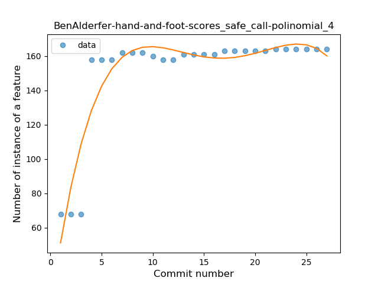

#### LISTEN-moe-android-app
* Feature: Lambda
* Function: )
* R_Squared: 0.84698633
 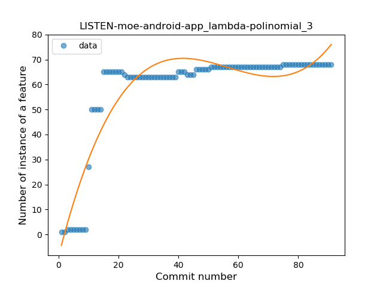

#### camsteffen-polite
* Feature: Unsafe Call
* Function: 
* R_Squared: 0.84643275
 

#### saschpe-PlanningPoker
* Feature: Type Inference
* Function: 
* R_Squared: 0.84641344
 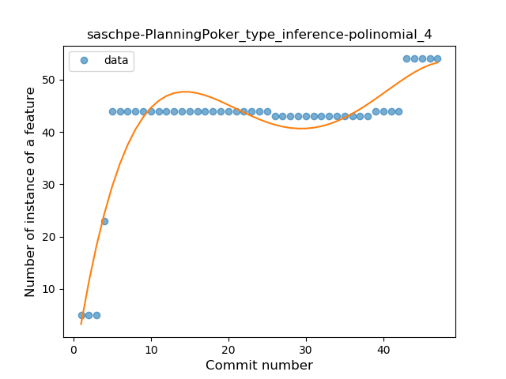

#### JanYoStudio-WhatAnime
* Feature: Lambda
* Function: 
* R_Squared: 0.84628005
 

#### thiolliere-YouTubeStream
* Feature: Unsafe Call
* Function: 
* R_Squared: 0.84447034
 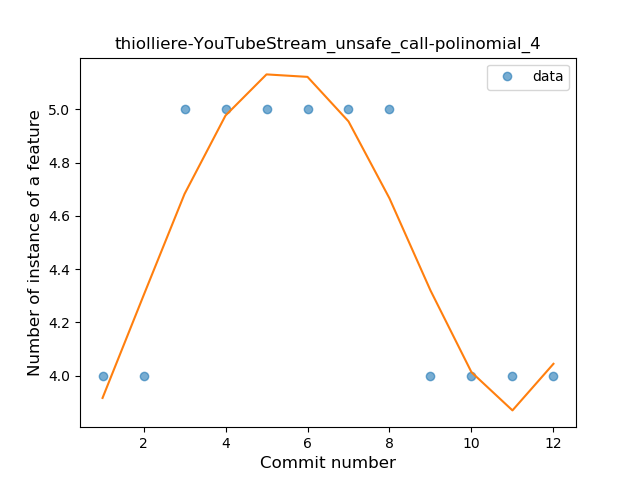

#### mkg20001-aruba-networks-login
* Feature: Lambda
* Function: )
* R_Squared: 0.8440351
 

#### die-tageszeitung-tazapp-android
* Feature: Property Delegation
* Function: 
* R_Squared: 0.84249699
 

#### Waboodoo-Status-Bar-Tachometer
* Feature: Lambda
* Function: 
* R_Squared: 0.84210526
 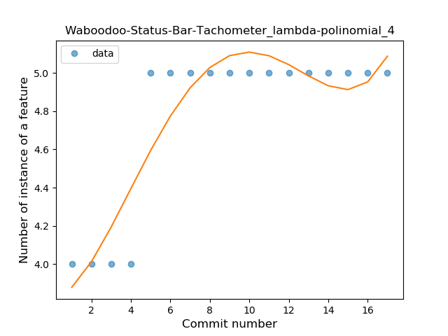

#### impalex-knockonports
* Feature: When expression
* Function: 
* R_Squared: 0.84142111
 

#### CzBiX-v2ex-android
* Feature: Unsafe Call
* Function: )
* R_Squared: 0.84119336
 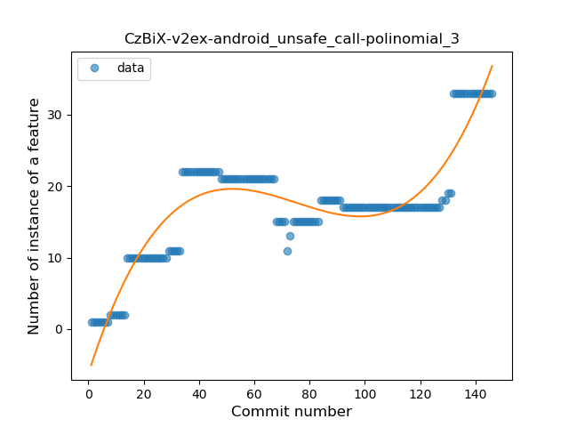

#### WYKCode-WYK-Android
* Feature: Companion Object
* Function: 
* R_Squared: 0.83873518
 

#### WYKCode-WYK-Android
* Feature: Function with Default Value
* Function: 
* R_Squared: 0.83873518
 

#### Maxr1998-home-assistant-Android
* Feature: Lambda
* Function: )
* R_Squared: 0.83769726
 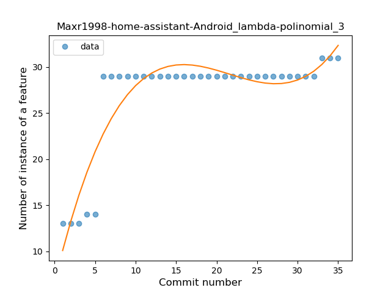

#### LittleLightCz-SheepsGoHome
* Feature: Property Delegation
* Function: )
* R_Squared: 0.83406973
 

#### zeapo-Android-Password-Store
* Feature: Safe Call
* Function: )
* R_Squared: 0.83206931
 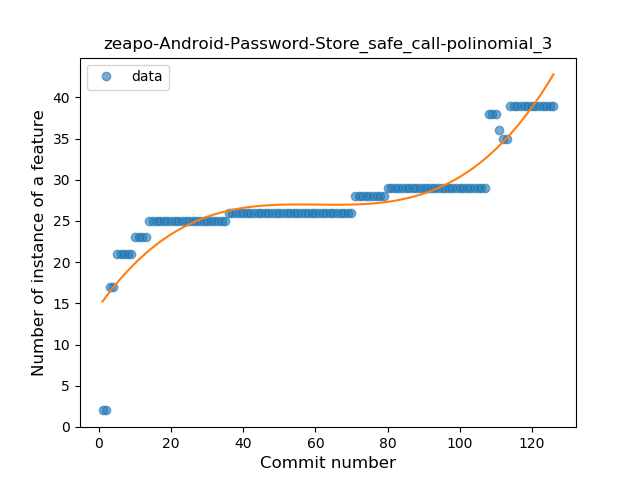

#### WYKCode-WYK-Android
* Feature: Safe Call
* Function: 
* R_Squared: 0.83185768
 

#### veniosg-JustSearch
* Feature: Singleton
* Function: )
* R_Squared: 0.83184976
 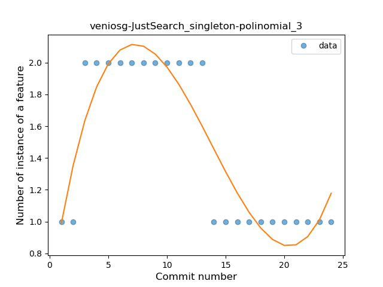

#### Gark-bassblog_kotlin
* Feature: Unsafe Call
* Function: )
* R_Squared: 0.83040004
 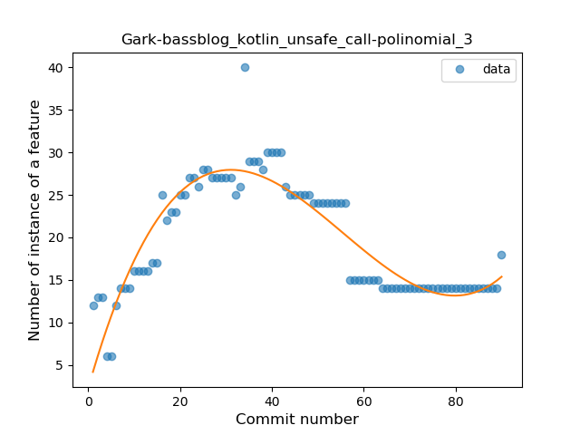

#### grote-Transportr
* Feature: Function call with Named Argument
* Function: )
* R_Squared: 0.82939951
 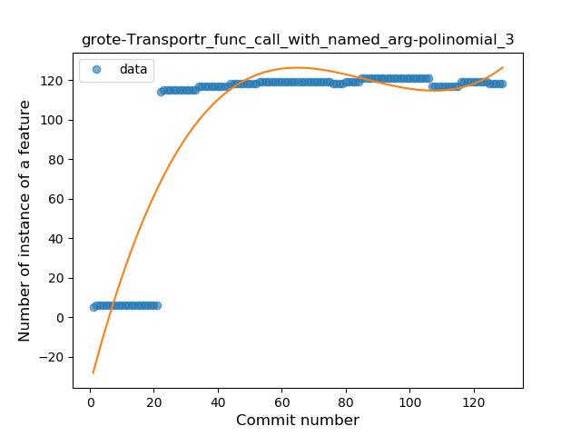

#### JanYoStudio-WhatAnime
* Feature: Property Delegation
* Function: )
* R_Squared: 0.82894737
 

#### garmax1-material-flashlight
* Feature: Companion Object
* Function: )
* R_Squared: 0.82617065
 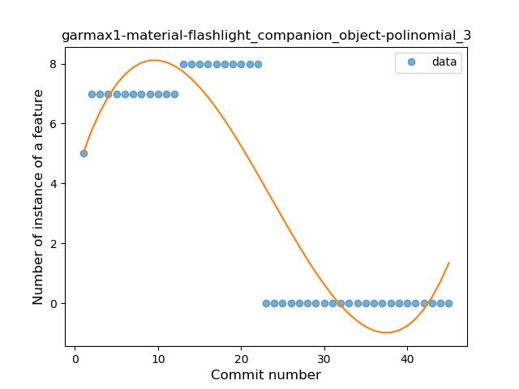

#### die-tageszeitung-tazapp-android
* Feature: Lambda
* Function: 
* R_Squared: 0.82481084
 

#### marcelgross90-Cineaste
* Feature: Companion Object
* Function: )
* R_Squared: 0.82368688
 

#### mecid-BakuBus
* Feature: Range Expression
* Function: )
* R_Squared: 0.8229566
 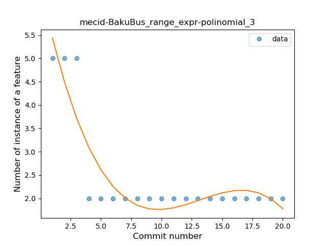

#### mecid-BakuBus
* Feature: Destructuring Declaration
* Function: )
* R_Squared: 0.8229566
 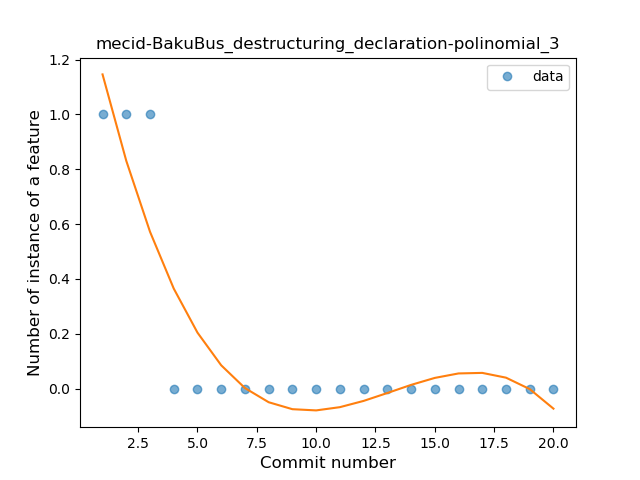

#### ontherunvaro-adb-awake
* Feature: Safe Call
* Function: )
* R_Squared: 0.82281004
 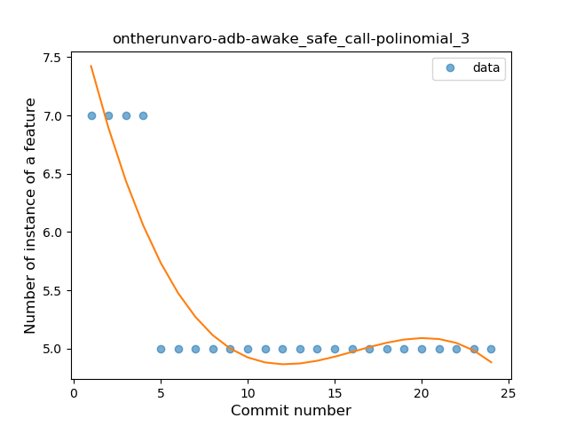

#### ontherunvaro-adb-awake
* Feature: Companion Object
* Function: )
* R_Squared: 0.82281004
 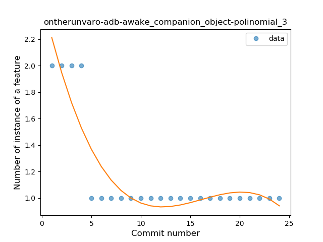

#### LISTEN-moe-android-app
* Feature: Unsafe Call
* Function: 
* R_Squared: 0.82204899
 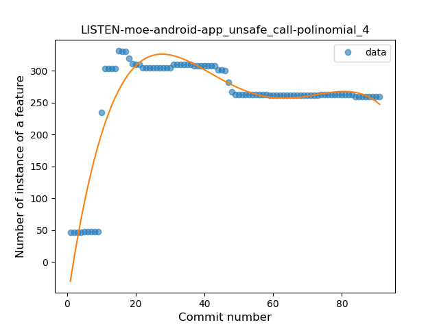

#### LISTEN-moe-android-app
* Feature: Companion Object
* Function: )
* R_Squared: 0.82179786
 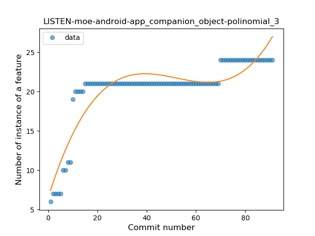

#### howard-e-just-quotes-kt
* Feature: Lambda
* Function: )
* R_Squared: 0.82161498
 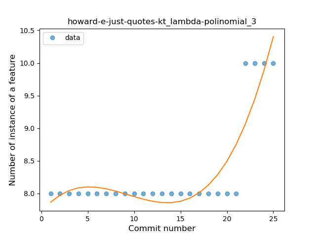

#### marcelgross90-Cineaste
* Feature: Range Expression
* Function: )
* R_Squared: 0.82000004
 

#### xgouchet-Stanley
* Feature: Smart Cast
* Function: )
* R_Squared: 0.81983949
 

#### zeapo-Android-Password-Store
* Feature: Type Inference
* Function: )
* R_Squared: 0.81962008
 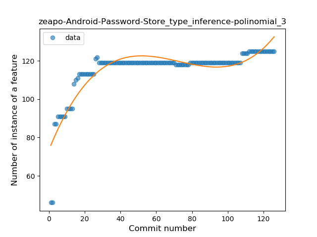

#### camsteffen-polite
* Feature: Lambda
* Function: )
* R_Squared: 0.81935977
 

#### die-tageszeitung-tazapp-android
* Feature: Type Inference
* Function: 
* R_Squared: 0.81737161
 

#### herbeth1u-VNDB-Android
* Feature: Destructuring Declaration
* Function: )
* R_Squared: 0.81642582
 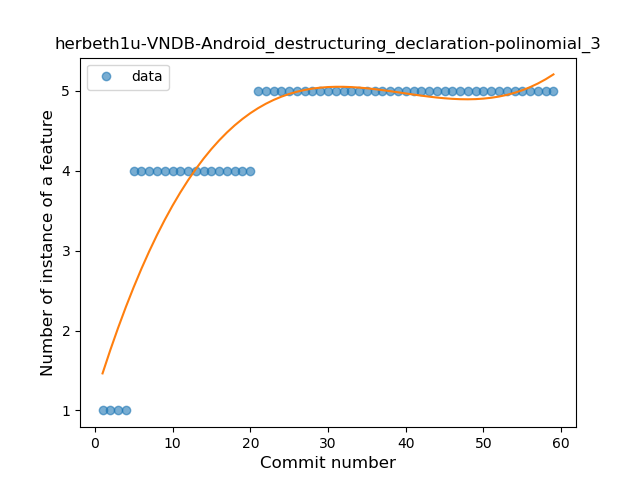

#### ontherunvaro-adb-awake
* Feature: When expression
* Function: )
* R_Squared: 0.81581703
 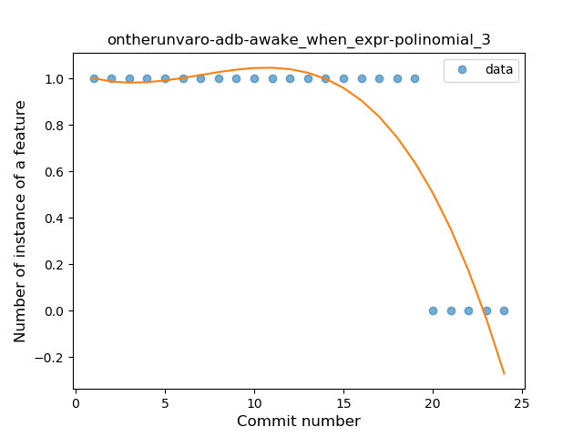

#### enjoyingfoss-om
* Feature: Companion Object
* Function: )
* R_Squared: 0.81468506
 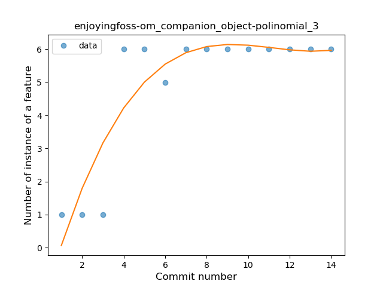

#### ManojMadanmohan-dlt
* Feature: Unsafe Call
* Function: 
* R_Squared: 0.81267879
 

#### mecid-BakuBus
* Feature: Type Inference
* Function: )
* R_Squared: 0.81176656
 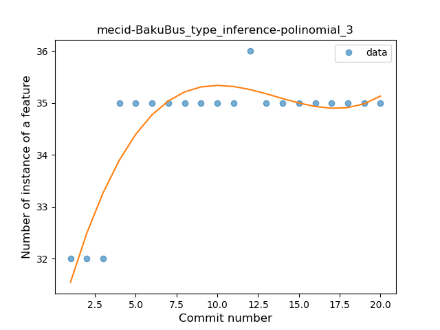

#### jidogoon-RoundedScreen
* Feature: Unsafe Call
* Function: 
* R_Squared: 0.8105442
 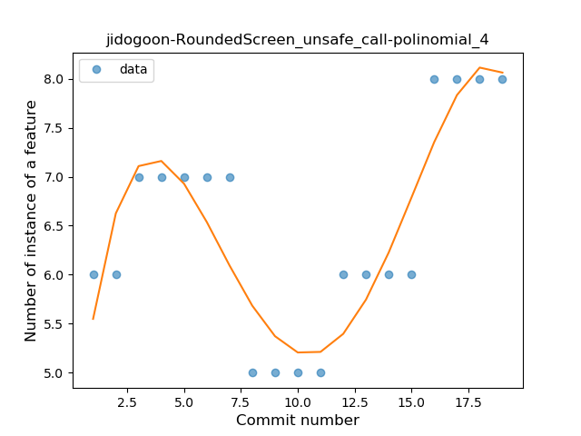

#### equeim-tremotesf-android
* Feature: Type Inference
* Function: )
* R_Squared: 0.80691266
 

#### plusCubed-velociraptor
* Feature: String Template
* Function: 
* R_Squared: 0.80681306
 

#### umren-Watcher
* Feature: String Template
* Function: )
* R_Squared: 0.80674605
 

#### mkg20001-aruba-networks-login
* Feature: String Template
* Function: 
* R_Squared: 0.80315737
 

#### LittleLightCz-SheepsGoHome
* Feature: Smart Cast
* Function: )
* R_Squared: 0.80179345
 

#### erickok-borefts2015
* Feature: Smart Cast
* Function: )
* R_Squared: 0.80160709
 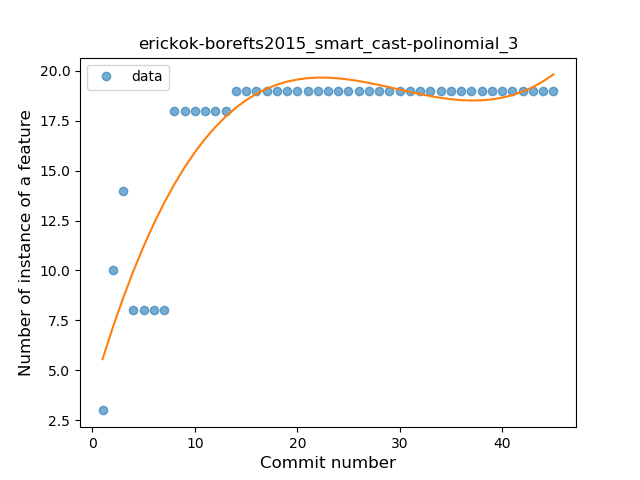

#### calintat-units
* Feature: Type Inference
* Function: )
* R_Squared: 0.79266938
 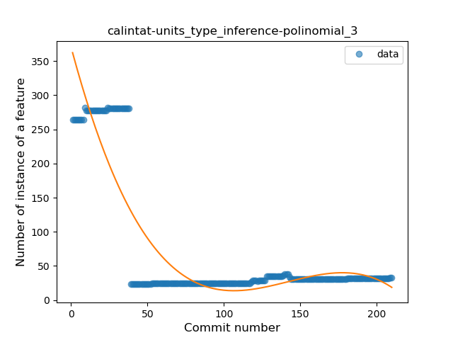

#### syncthing-syncthing-lite
* Feature: Function with Default Value
* Function: )
* R_Squared: 0.79256879
 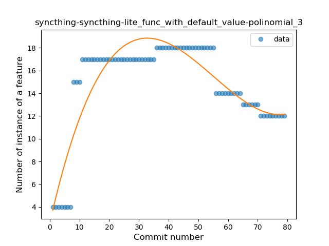

#### saschpe-PlanningPoker
* Feature: Unsafe Call
* Function: 
* R_Squared: 0.79199677
 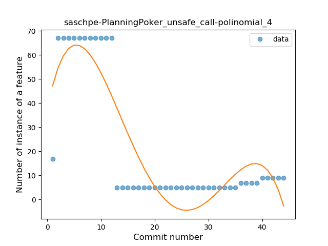

#### JanYoStudio-WhatAnime
* Feature: String Template
* Function: 
* R_Squared: 0.78858977
 

#### thaapasa-jalkametri-android
* Feature: Unsafe Call
* Function: )
* R_Squared: 0.78623246
 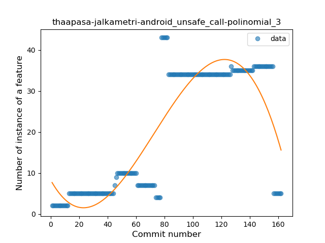

#### ronocod-bus
* Feature: Lambda
* Function: )
* R_Squared: 0.78351518
 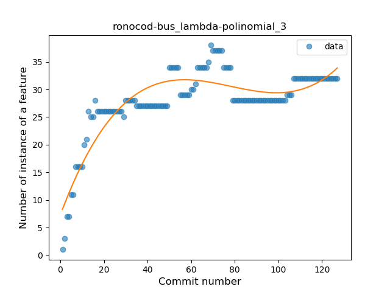

#### systemallica-ValenBisi
* Feature: Type Inference
* Function: )
* R_Squared: 0.78193157
 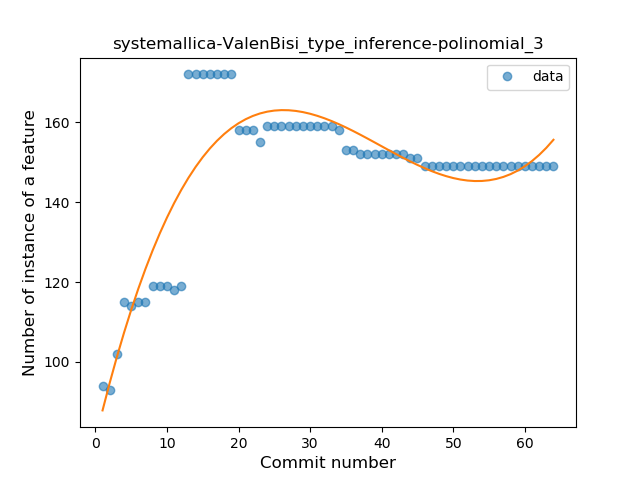

#### Agusyc-DayCounter
* Feature: Lambda
* Function: 
* R_Squared: 0.77666415
 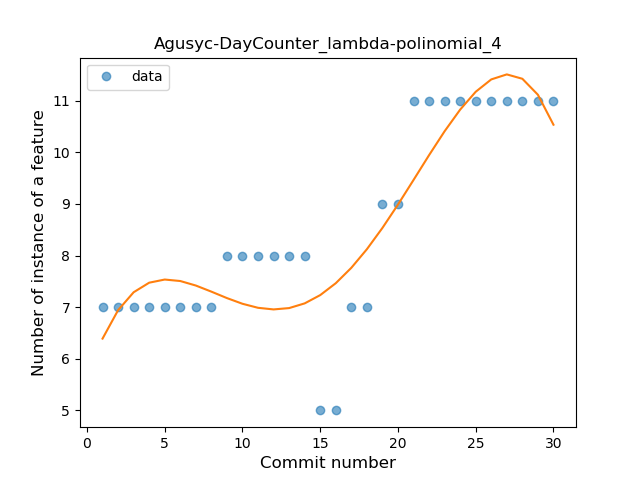

#### GreenLionSoft-madrid-pollution-android-app
* Feature: Lambda
* Function: 
* R_Squared: 0.77580923
 

#### OpenLauncherTeam-openlauncher
* Feature: Type Inference
* Function: )
* R_Squared: 0.77372312
 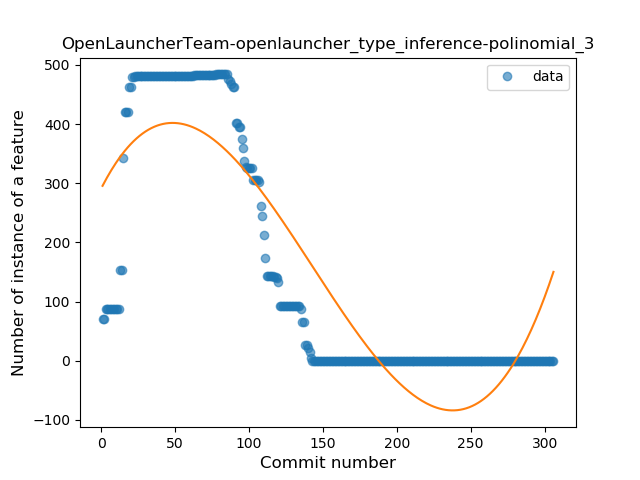

#### sandy-8925-Checklist
* Feature: When expression
* Function: )
* R_Squared: 0.77275046
 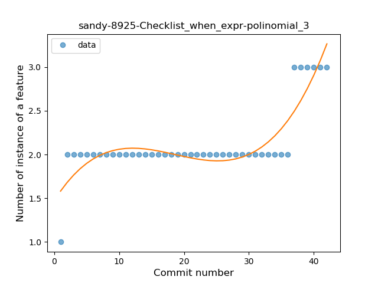

#### exviva-stew
* Feature: Unsafe Call
* Function: )
* R_Squared: 0.77268743
 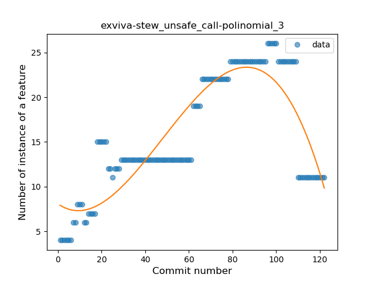

#### OpenLauncherTeam-openlauncher
* Feature: Unsafe Call
* Function: )
* R_Squared: 0.77184457
 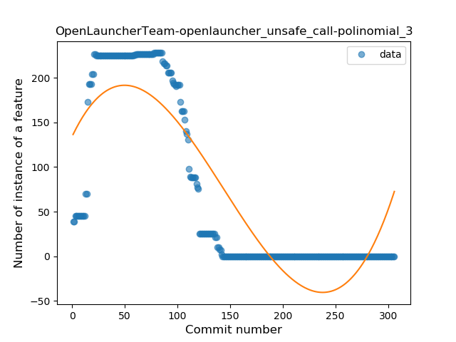

#### marcelgross90-Cineaste
* Feature: String Template
* Function: )
* R_Squared: 0.76921449
 

#### garmax1-material-flashlight
* Feature: Type Inference
* Function: )
* R_Squared: 0.76395748
 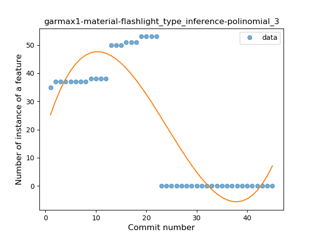

#### dkrivoruchko-ScreenStream
* Feature: String Template
* Function: )
* R_Squared: 0.76262639
 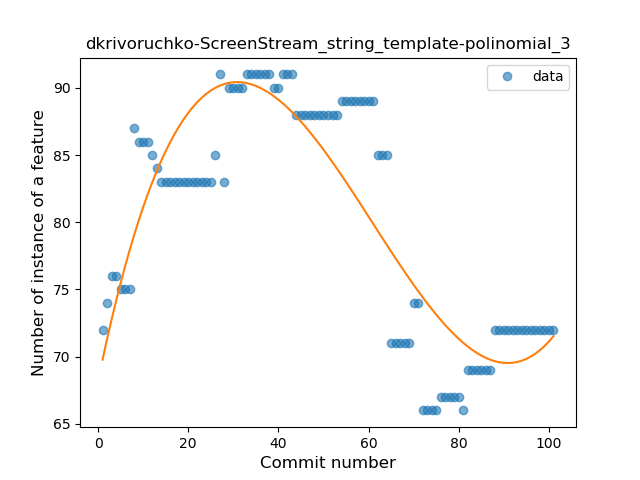

#### ManojMadanmohan-dlt
* Feature: Lambda
* Function: 
* R_Squared: 0.76003945
 

#### bitfireAT-icsdroid
* Feature: Type Inference
* Function: 
* R_Squared: 0.75895179
 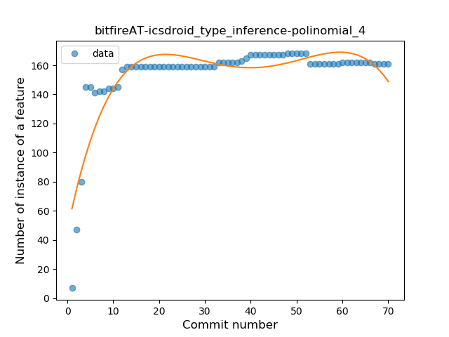

#### syncthing-syncthing-lite
* Feature: Unsafe Call
* Function: )
* R_Squared: 0.75872544
 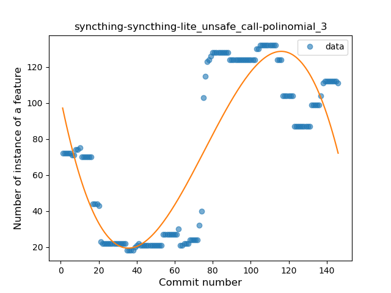

#### ianmcxa-vortaro
* Feature: String Template
* Function: 
* R_Squared: 0.75389378
 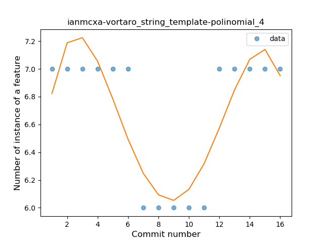

#### ronocod-bus
* Feature: Type Inference
* Function: )
* R_Squared: 0.75126673
 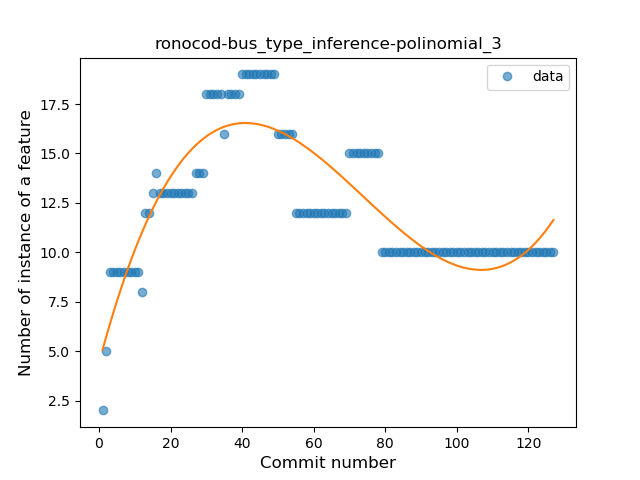

#### jkennethcarino-AnkiEditor
* Feature: Safe Call
* Function: 
* R_Squared: 0.74686819
 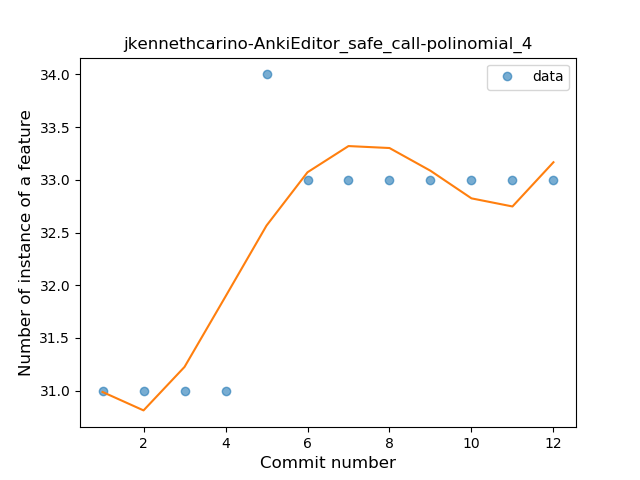

#### bitfireAT-icsdroid
* Feature: String Template
* Function: )
* R_Squared: 0.74265181
 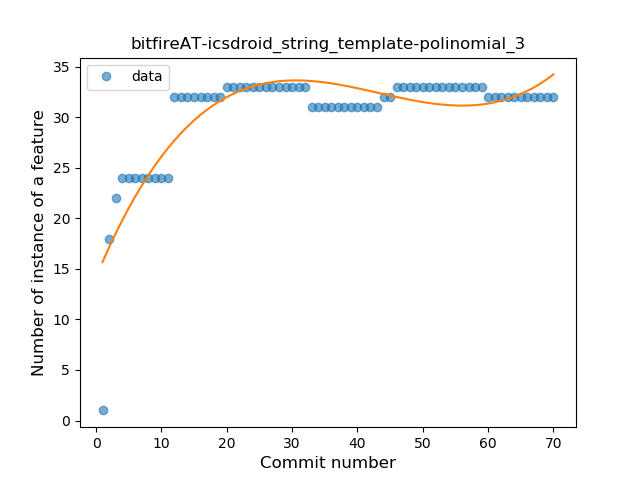

#### rosenpin-QuickDrawEverywhere
* Feature: Safe Call
* Function: 
* R_Squared: 0.73803065
 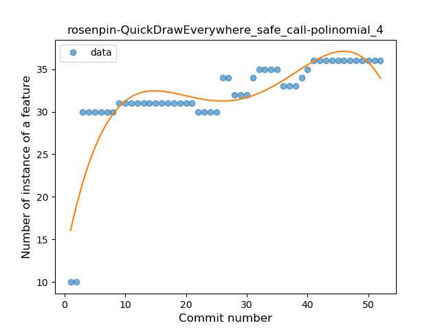

#### ianmcxa-vortaro
* Feature: Data Class
* Function: )
* R_Squared: 0.73541792
 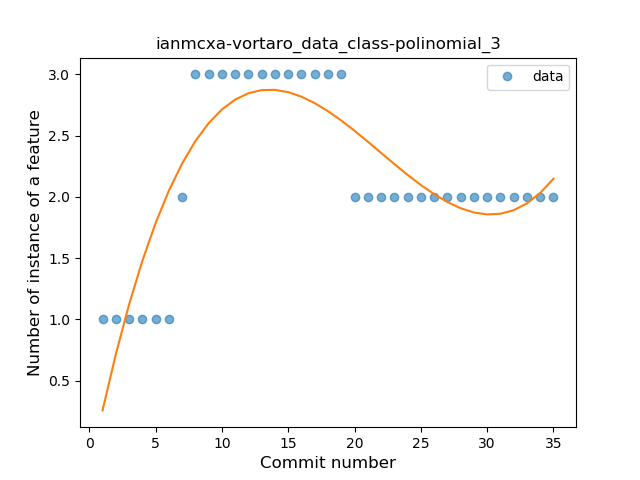

#### pennlabs-penn-mobile-android
* Feature: Unsafe Call
* Function: 
* R_Squared: 0.73286434
 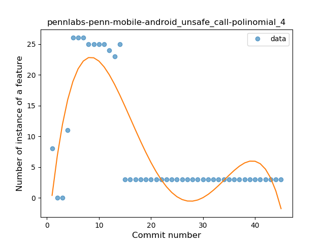

#### JanYoStudio-WhatAnime
* Feature: Type Inference
* Function: 
* R_Squared: 0.73192525
 

#### michaelkourlas-voipms-sms-client
* Feature: Function call with Named Argument
* Function: )
* R_Squared: 0.72748912
 

#### LittleLightCz-SheepsGoHome
* Feature: Range Expression
* Function: )
* R_Squared: 0.7264818
 

#### bitfireAT-icsdroid
* Feature: Unsafe Call
* Function: )
* R_Squared: 0.72578544
 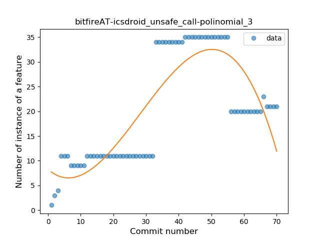

#### jpeddicord-speedofsound
* Feature: Type Inference
* Function: )
* R_Squared: 0.72510844
 

#### sreich-android-count-the-days
* Feature: String Template
* Function: )
* R_Squared: 0.71940939
 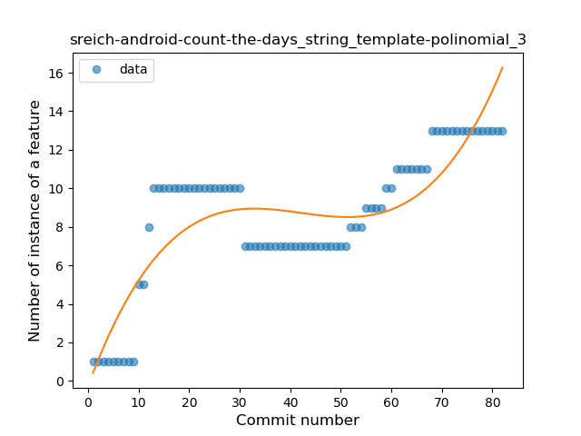

#### teamblueridge-PasteIt
* Feature: Type Inference
* Function: 
* R_Squared: 0.71931162
 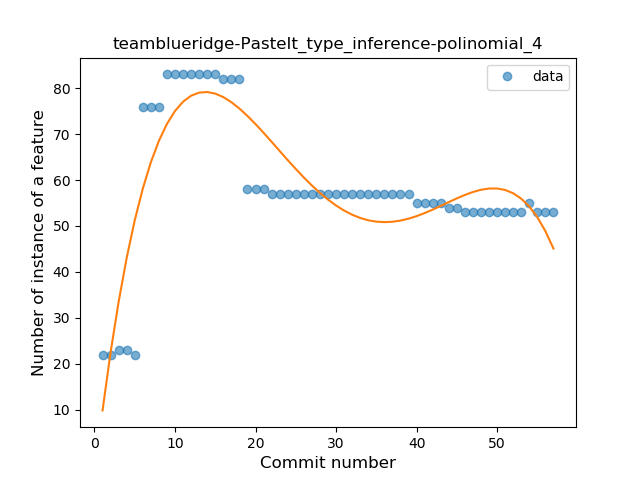

#### LittleLightCz-SheepsGoHome
* Feature: Safe Call
* Function: )
* R_Squared: 0.71617316
 

#### rosenpin-QuickDrawEverywhere
* Feature: When expression
* Function: )
* R_Squared: 0.70977091
 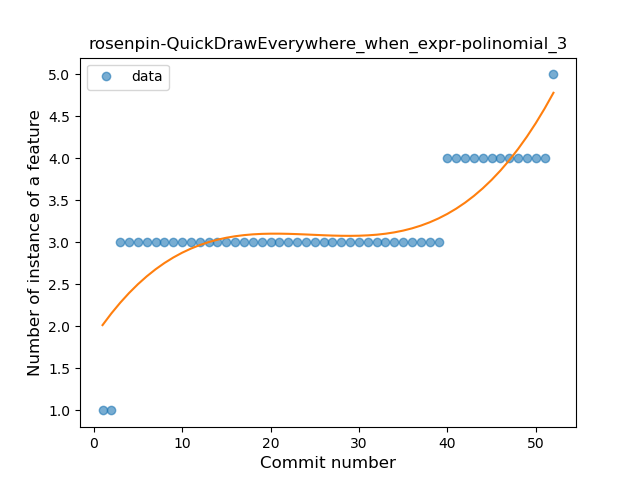

#### ianmcxa-vortaro
* Feature: Unsafe Call
* Function: )
* R_Squared: 0.70570412
 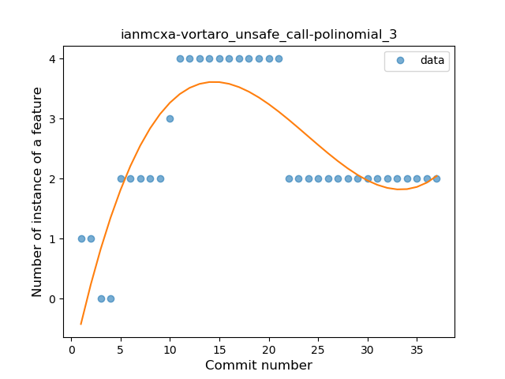

#### umren-Watcher
* Feature: Type Inference
* Function: 
* R_Squared: 0.70097019
 

#### rosenpin-QuickDrawEverywhere
* Feature: Type Inference
* Function: )
* R_Squared: 0.69733457
 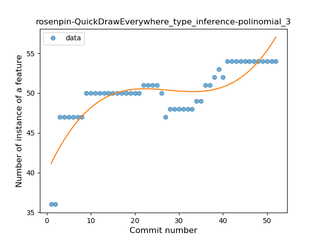

#### Doctoror-ParticleConstellationsLiveWallpaper
* Feature: Property Delegation
* Function: )
* R_Squared: 0.69278787
 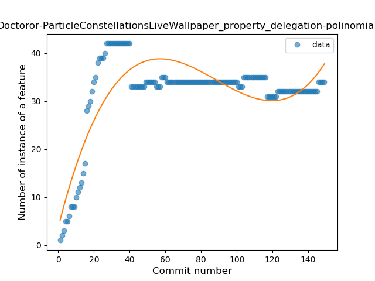

#### howard-e-just-quotes-kt
* Feature: Type Inference
* Function: 
* R_Squared: 0.67816232
 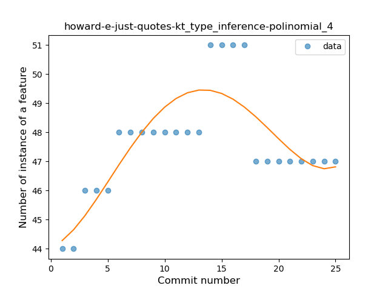

#### die-tageszeitung-tazapp-android
* Feature: Function call with Named Argument
* Function: 
* R_Squared: 0.67052192
 

#### equeim-tremotesf-android
* Feature: Unsafe Call
* Function: )
* R_Squared: 0.66378256
 

#### pistatium-mahougen
* Feature: Companion Object
* Function: 
* R_Squared: 0.65897436
 

#### enjoyingfoss-om
* Feature: Function call with Named Argument
* Function: 
* R_Squared: 0.63601476
 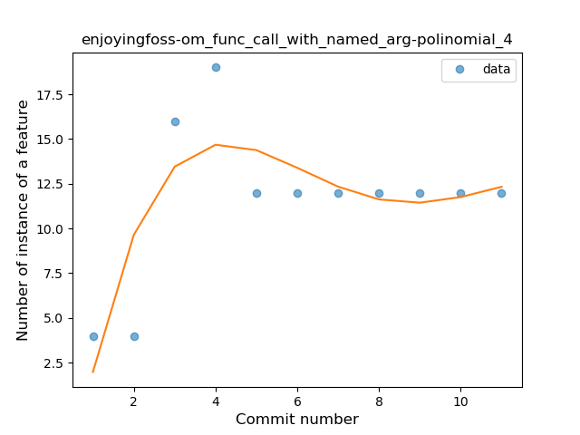

#### impalex-knockonports
* Feature: Function with Default Value
* Function: 
* R_Squared: 0.63383308
 

#### saschpe-PlanningPoker
* Feature: Companion Object
* Function: )
* R_Squared: 0.63073565
 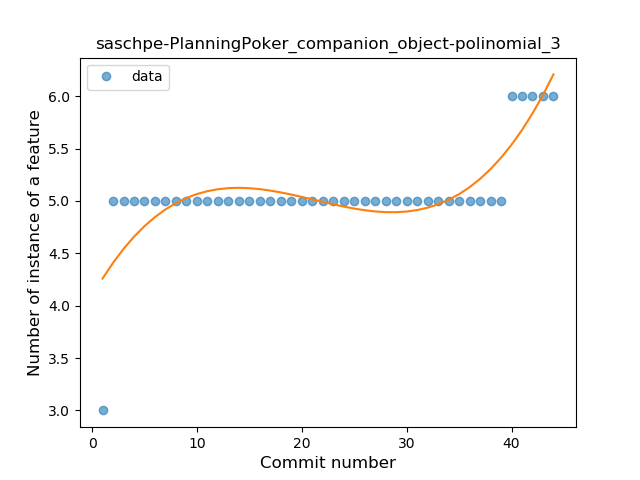

#### sandy-8925-Checklist
* Feature: Type Inference
* Function: 
* R_Squared: 0.62741768
 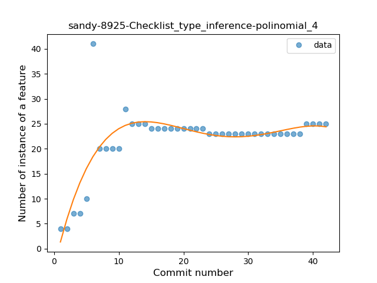

#### fvasco-pinpoi
* Feature: Type Inference
* Function: )
* R_Squared: 0.62485275
 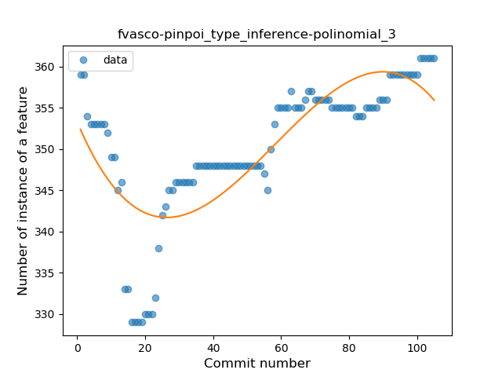

#### bitfireAT-icsdroid
* Feature: Lambda
* Function: )
* R_Squared: 0.62249353
 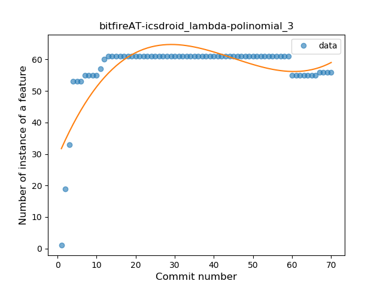

#### mbarta-scr-redesign
* Feature: String Template
* Function: 
* R_Squared: 0.61451514
 

#### Depau-EtchDroid
* Feature: Unsafe Call
* Function: )
* R_Squared: 0.61071743
 

#### enjoyingfoss-om
* Feature: Singleton
* Function: 
* R_Squared: 0.60719814
 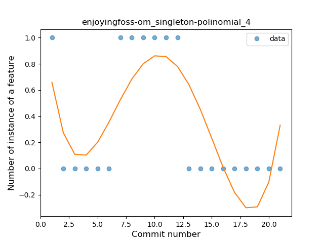

#### anthonycr-Lightning-Browser
* Feature: Destructuring Declaration
* Function: )
* R_Squared: 0.60463784
 

#### enjoyingfoss-om
* Feature: Unsafe Call
* Function: 
* R_Squared: 0.59888294
 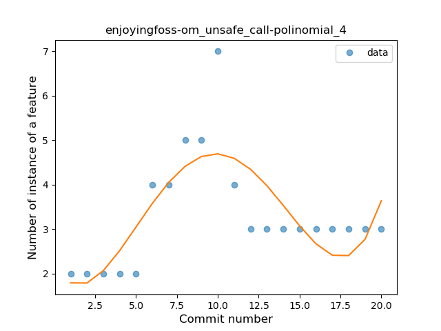

#### LISTEN-moe-android-app
* Feature: Singleton
* Function: )
* R_Squared: 0.5842663
 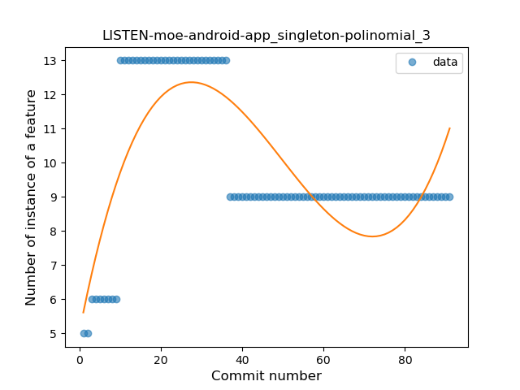

#### mecid-BakuBus
* Feature: Unsafe Call
* Function: 
* R_Squared: 0.58188006
 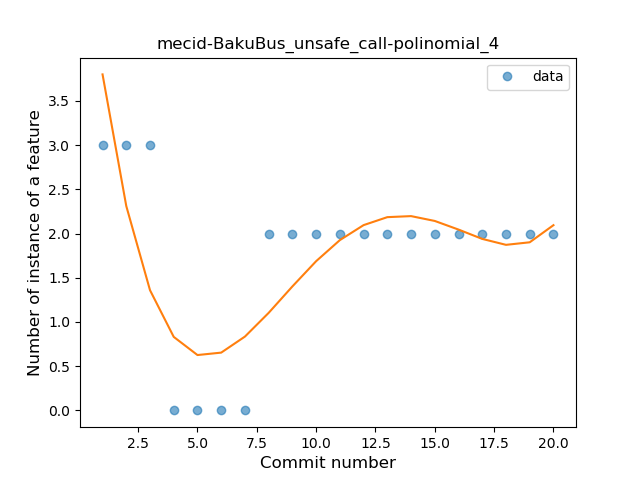

#### danirod-rectball
* Feature: Property Delegation
* Function: )
* R_Squared: 0.57174533
 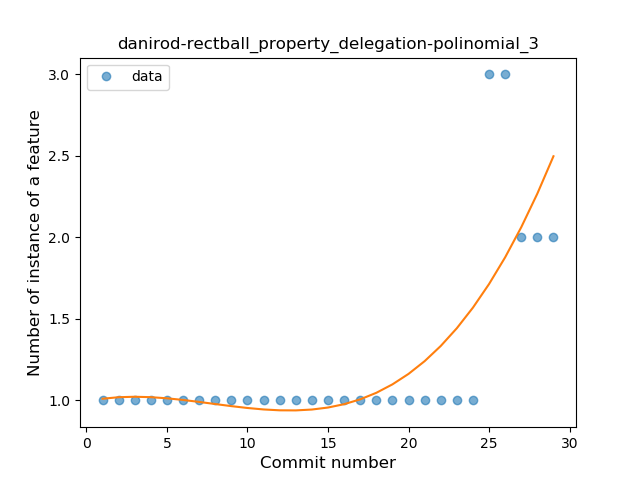

#### Jizzu-SimpleToDo
* Feature: Type Inference
* Function: 
* R_Squared: 0.54318421
 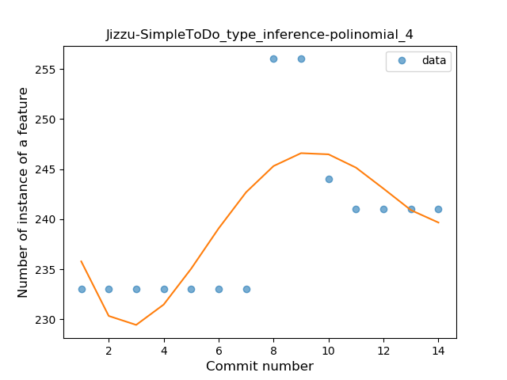

#### Waboodoo-HTTP-Shortcuts
* Feature: Unsafe Call
* Function: )
* R_Squared: 0.53507949
 

#### devmil-PaperLaunch
* Feature: Companion Object
* Function: )
* R_Squared: 0.52579099
 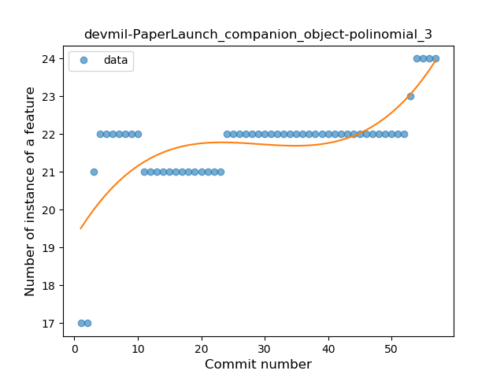

#### Agusyc-DayCounter
* Feature: Unsafe Call
* Function: 
* R_Squared: 0.51400034
 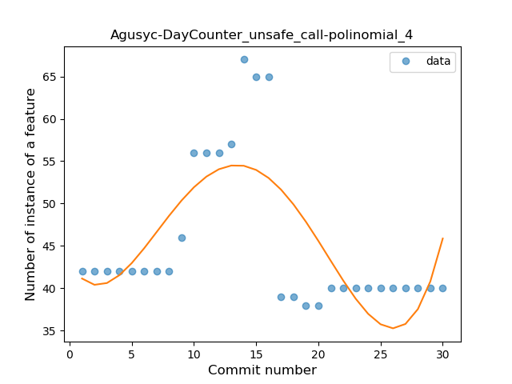

#### ids1024-whitakers-words-android
* Feature: Unsafe Call
* Function: )
* R_Squared: 0.4968856
 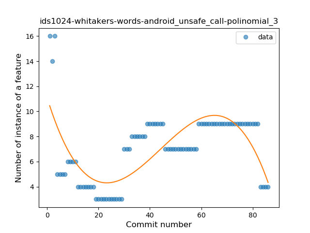

#### sandy-8925-Checklist
* Feature: Unsafe Call
* Function: 
* R_Squared: 0.48296633
 

#### saschpe-PlanningPoker
* Feature: When expression
* Function: )
* R_Squared: 0.47313544
 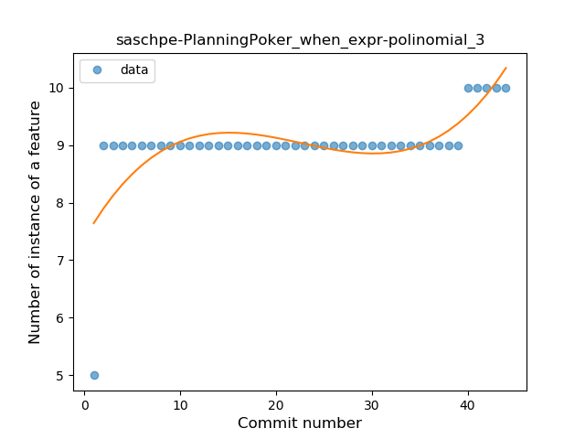

#### michaelkourlas-voipms-sms-client
* Feature: Lambda
* Function: )
* R_Squared: 0.41927989
 

#### ligi-MaterialTeaTimer
* Feature: Type Inference
* Function: )
* R_Squared: 0.39166522
 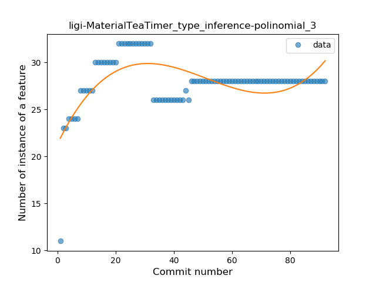

#### pacien-tincapp
* Feature: Overloaded Operator
* Function: )
* R_Squared: 0.34522377
 

#### Gark-bassblog_kotlin
* Feature: String Template
* Function: )
* R_Squared: 0.31495574
 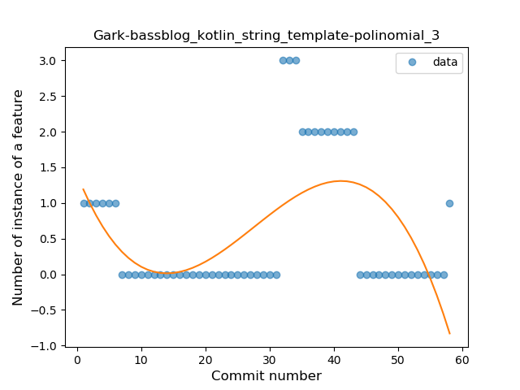

#### johnjohndoe-Umweltzone
* Feature: String Template
* Function: 
* R_Squared: 0.31246027
 

#### JanYoStudio-WhatAnime
* Feature: Companion Object
* Function: )
* R_Squared: 0.27902922
 

#### Agusyc-DayCounter
* Feature: Smart Cast
* Function: 
* R_Squared: 0.26913578
 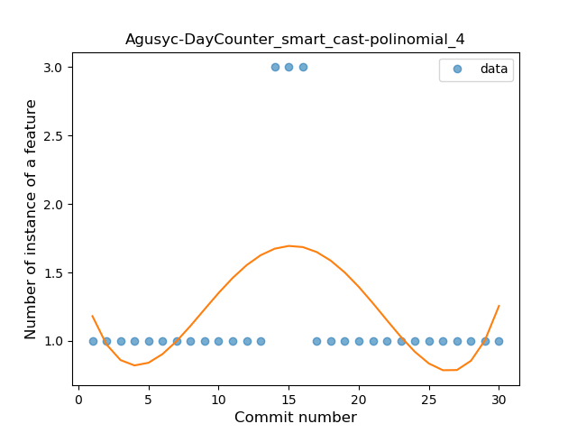

#### enjoyingfoss-om
* Feature: Safe Call
* Function: 
* R_Squared: 0.26264053
 

#### Jizzu-SimpleToDo
* Feature: Lambda
* Function: 
* R_Squared: 0.25745111
 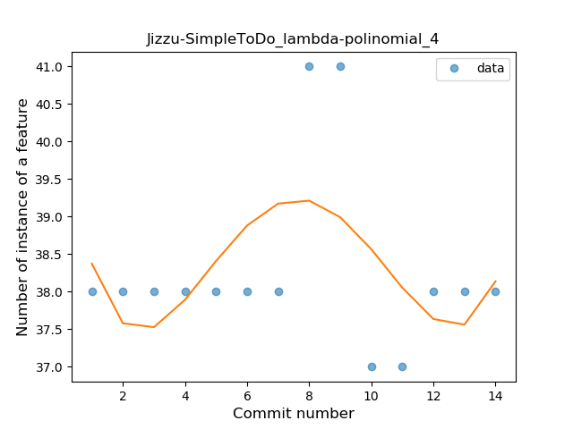

#### AkshayChordiya-gofun-android
* Feature: Companion Object
* Function: )
* R_Squared: 0.21297611
 

#### milosmns-Timecrypt
* Feature: Extension Function
* Function: )
* R_Squared: 0.1999552
 

#### xgouchet-Stanley
* Feature: Function with Default Value
* Function: )
* R_Squared: 0.16803973
 

#### erickok-borefts2015
* Feature: Destructuring Declaration
* Function: )
* R_Squared: 0.06784606
 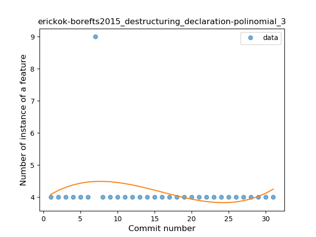

