## Instability
----
**485** best fit

#### com-mrbimc-selinux
* Feature: When expression
* Function: 
* R_Squared: 1.0
 

#### com-androidheads-vienna-escalero
* Feature: Function with Default Value
* Function: 
* R_Squared: 1.0
 

#### com-androidheads-vienna-escalero
* Feature: Data Class
* Function: 
* R_Squared: 1.0
 

#### com-bracketcove-postrainer
* Feature: Function call with Named Argument
* Function: 
* R_Squared: 0.99957161
 

#### com-bracketcove-postrainer
* Feature: Lambda
* Function: 
* R_Squared: 0.99925502
 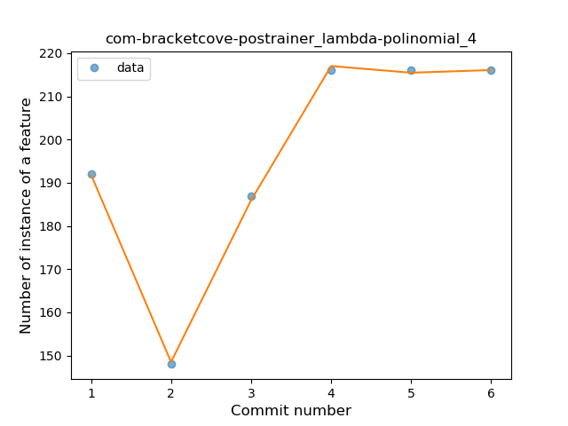

#### com-bracketcove-postrainer
* Feature: Function with Default Value
* Function: 
* R_Squared: 0.9985348
 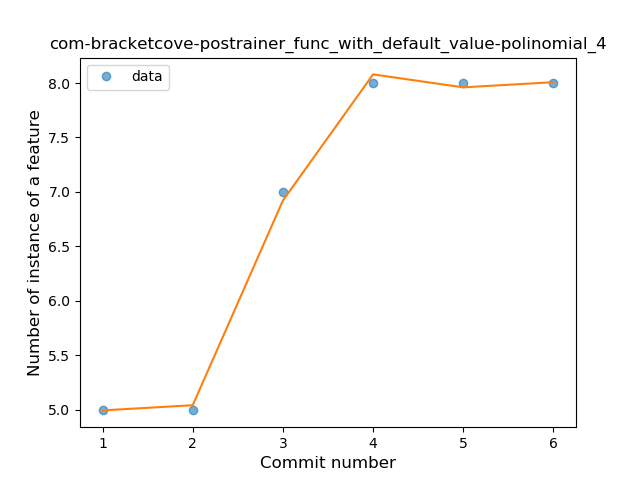

#### com-bracketcove-postrainer
* Feature: Coroutine
* Function: 
* R_Squared: 0.9985348
 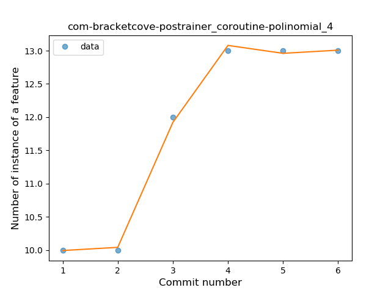

#### com-bracketcove-postrainer
* Feature: Extension Function
* Function: 
* R_Squared: 0.99608396
 

#### com-bracketcove-postrainer
* Feature: String Template
* Function: 
* R_Squared: 0.9952381
 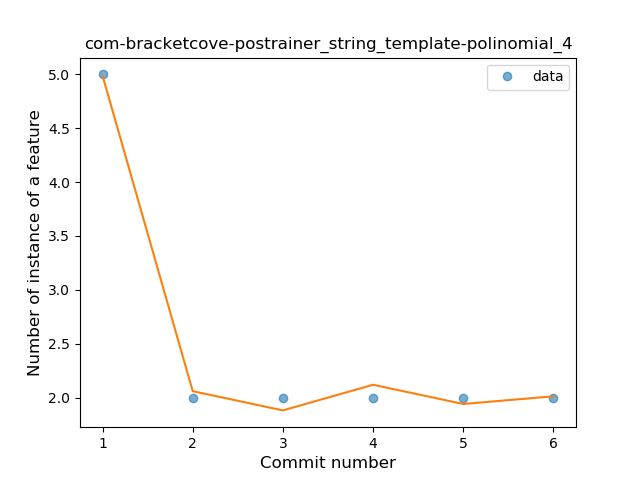

#### com-ids1024-lsdict
* Feature: String Template
* Function: 
* R_Squared: 0.9952381
 

#### com-bracketcove-postrainer
* Feature: Data Class
* Function: 
* R_Squared: 0.9952381
 

#### com-bracketcove-postrainer
* Feature: Property Delegation
* Function: 
* R_Squared: 0.9952381
 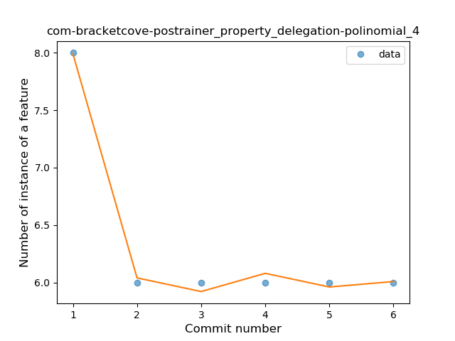

#### com-firstrowria-pushnotificationtester
* Feature: Coroutine
* Function: 
* R_Squared: 0.9952381
 

#### com-tumblr-svetylk0-sheepsgohome-android
* Feature: Lambda
* Function: )
* R_Squared: 0.99463247
 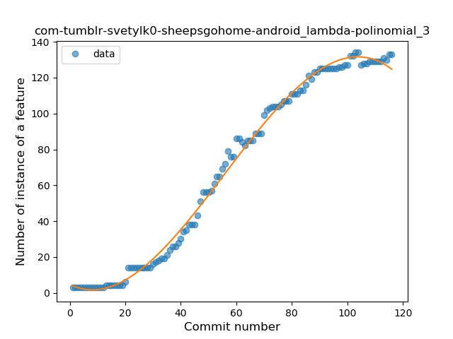

#### com-bracketcove-postrainer
* Feature: When expression
* Function: 
* R_Squared: 0.98824101
 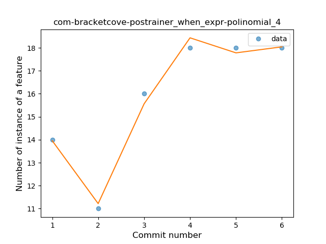

#### me-barta-stayintouch
* Feature: Type Inference
* Function: 
* R_Squared: 0.98749607
 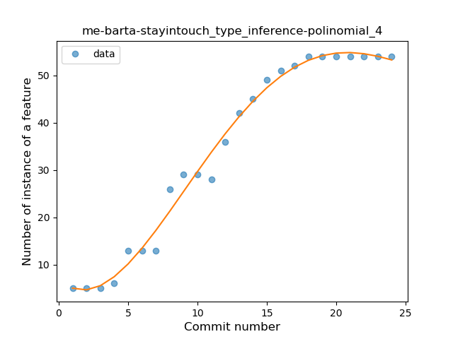

#### nl-jqno-remindermail
* Feature: Safe Call
* Function: 
* R_Squared: 0.98556049
 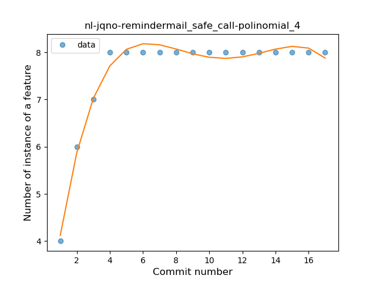

#### es-danirod-rectball-android
* Feature: Singleton
* Function: 
* R_Squared: 0.98484848
 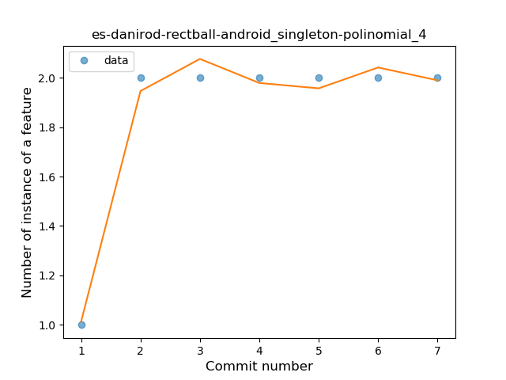

#### com-skydoves-waterdays
* Feature: When expression
* Function: 
* R_Squared: 0.98386229
 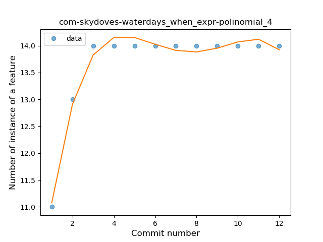

#### com-mrbimc-selinux
* Feature: Lambda
* Function: )
* R_Squared: 0.98214286
 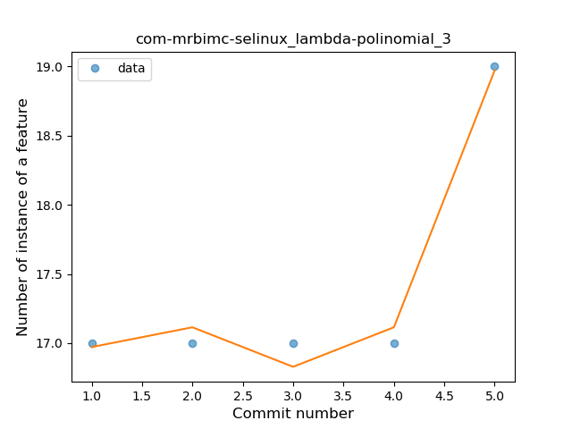

#### quickbeer-android
* Feature: Type Inference
* Function: )
* R_Squared: 0.98196997
 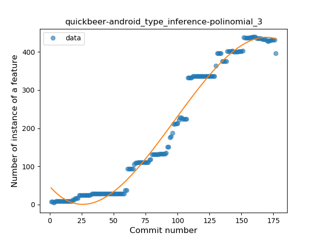

#### com-fallgamlet-dnestrcinema
* Feature: Lambda
* Function: 
* R_Squared: 0.98166297
 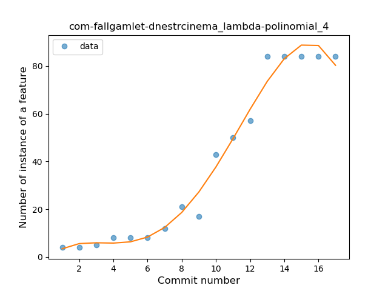

#### quickbeer-android
* Feature: Lambda
* Function: )
* R_Squared: 0.98154306
 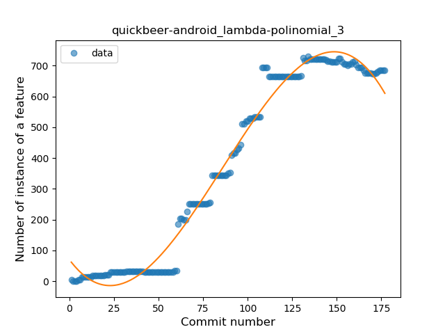

#### com-rohitsuratekar-NCBSinfo
* Feature: Lambda
* Function: 
* R_Squared: 0.98132381
 

#### com-ianhanniballake-contractiontimer
* Feature: Function with Default Value
* Function: 
* R_Squared: 0.97993311
 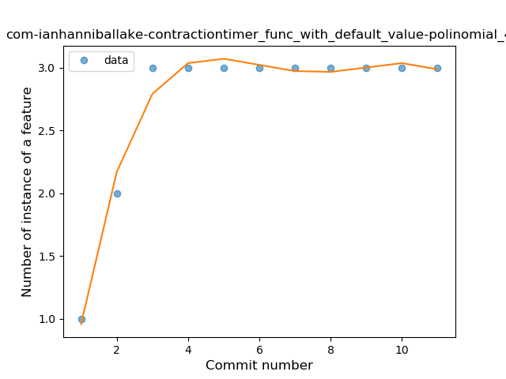

#### com-benoitletondor-easybudgetapp
* Feature: Lambda
* Function: )
* R_Squared: 0.97890633
 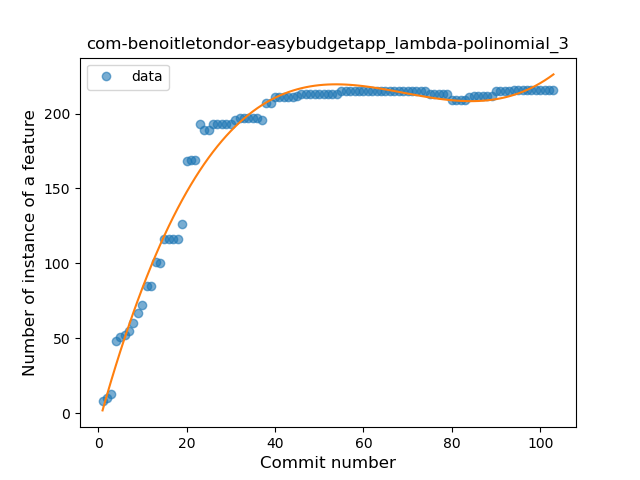

#### com-wbrawner-simplemarkdown
* Feature: Type Inference
* Function: )
* R_Squared: 0.97684896
 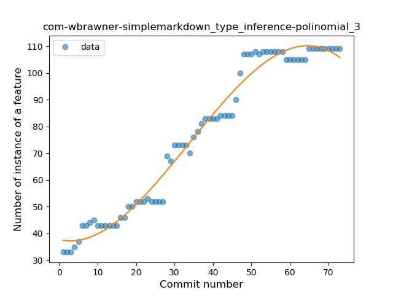

#### com-benoitletondor-easybudgetapp
* Feature: Property Delegation
* Function: )
* R_Squared: 0.97678444
 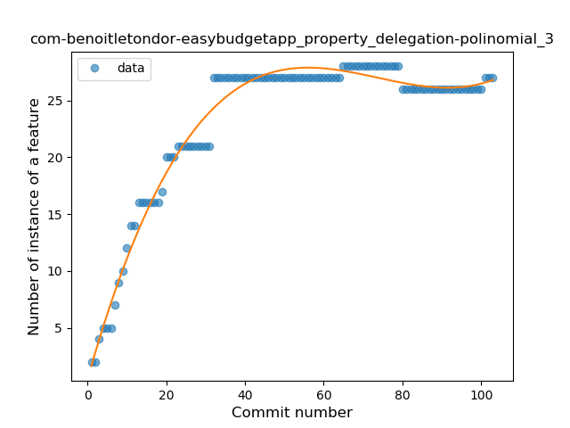

#### net-stew-stew
* Feature: Type Inference
* Function: )
* R_Squared: 0.97627886
 

#### com-adityakamble49-ttl
* Feature: Lambda
* Function: )
* R_Squared: 0.97382191
 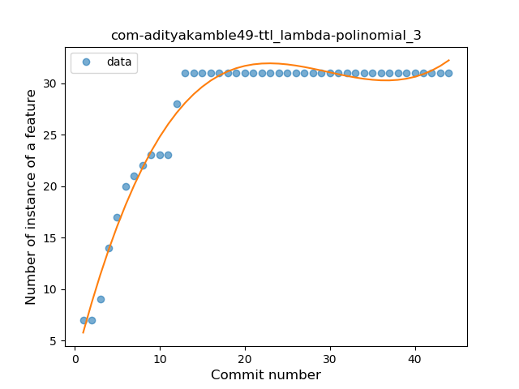

#### nl-jqno-remindermail
* Feature: Type Inference
* Function: )
* R_Squared: 0.97329466
 

#### com-rhm-pwn
* Feature: Smart Cast
* Function: 
* R_Squared: 0.97277758
 

#### nl-jqno-remindermail
* Feature: Lambda
* Function: )
* R_Squared: 0.97205073
 

#### com-guardafilme
* Feature: Lambda
* Function: )
* R_Squared: 0.97138373
 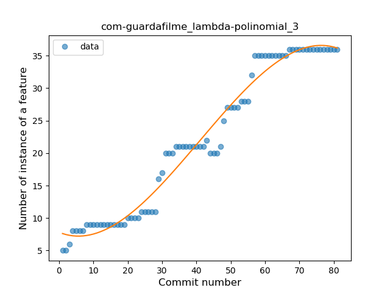

#### com-rohitsuratekar-NCBSinfo
* Feature: When expression
* Function: 
* R_Squared: 0.97111123
 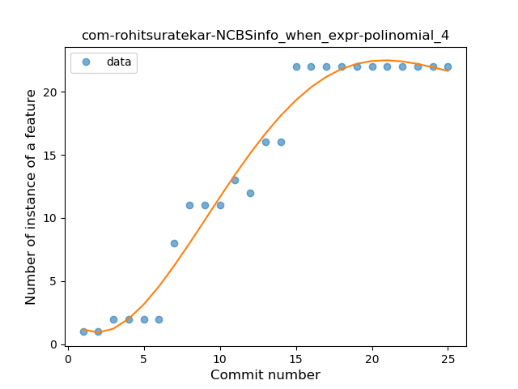

#### com-gimranov-zandy-app
* Feature: Type Inference
* Function: 
* R_Squared: 0.97065006
 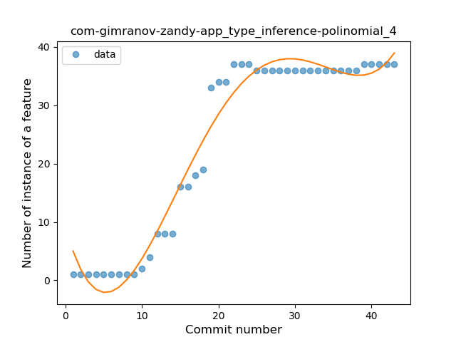

#### net-syncthing-lite
* Feature: Coroutine
* Function: )
* R_Squared: 0.97058445
 

#### ru-nsu-bobrofon-easysshfs
* Feature: Unsafe Call
* Function: 
* R_Squared: 0.97046693
 

#### com-benny-pxerstudio
* Feature: Type Inference
* Function: 
* R_Squared: 0.96969697
 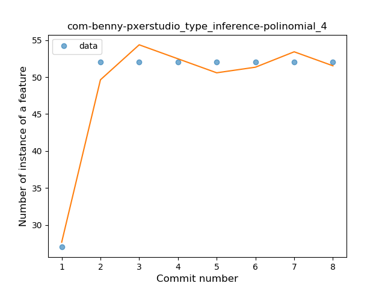

#### com-benny-pxerstudio
* Feature: Lambda
* Function: 
* R_Squared: 0.96969697
 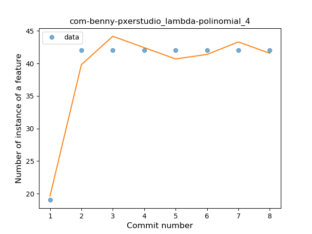

#### com-benny-pxerstudio
* Feature: When expression
* Function: 
* R_Squared: 0.96969697
 

#### com-ianhanniballake-localstorage
* Feature: When expression
* Function: 
* R_Squared: 0.96969697
 

#### com-benny-pxerstudio
* Feature: Unsafe Call
* Function: 
* R_Squared: 0.96969697
 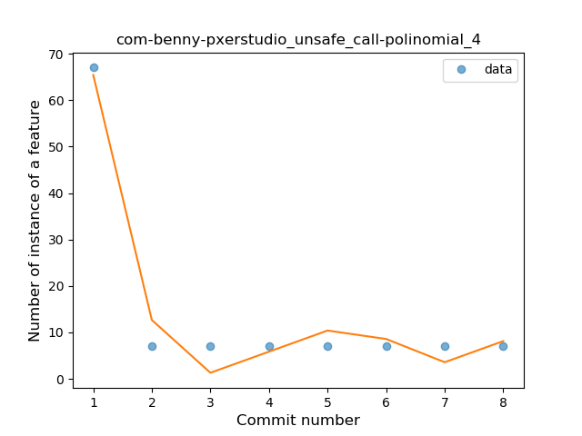

#### com-ianhanniballake-localstorage
* Feature: Companion Object
* Function: 
* R_Squared: 0.96969697
 

#### ru-nsu-bobrofon-easysshfs
* Feature: Property Delegation
* Function: 
* R_Squared: 0.96969697
 

#### com-bracketcove-postrainer
* Feature: Safe Call
* Function: 
* R_Squared: 0.9696841
 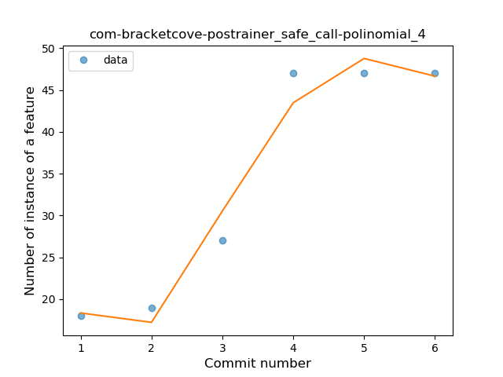

#### com-ahorcado
* Feature: Type Inference
* Function: )
* R_Squared: 0.96890846
 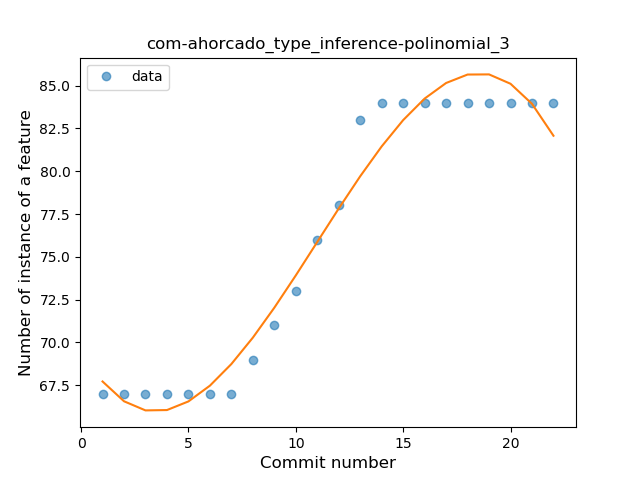

#### com-sjn-stamp
* Feature: Lambda
* Function: )
* R_Squared: 0.96850823
 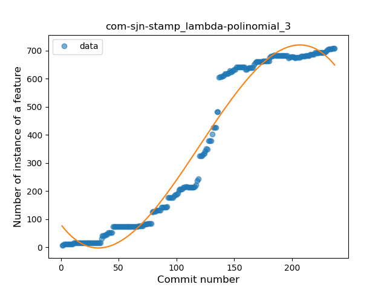

#### io-github-z3r0c00l
* Feature: Type Inference
* Function: 
* R_Squared: 0.96573617
 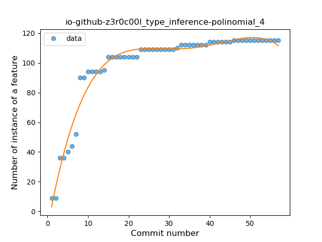

#### io-github-benoitduffez-cupsprint
* Feature: String Template
* Function: )
* R_Squared: 0.96533735
 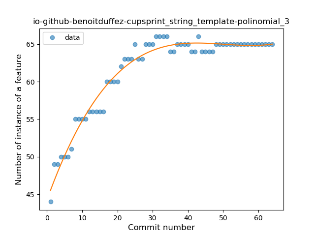

#### org-liberty-android-freeotpplus
* Feature: Lambda
* Function: )
* R_Squared: 0.96521894
 

#### com-rohitsuratekar-NCBSinfo
* Feature: Safe Call
* Function: 
* R_Squared: 0.96475439
 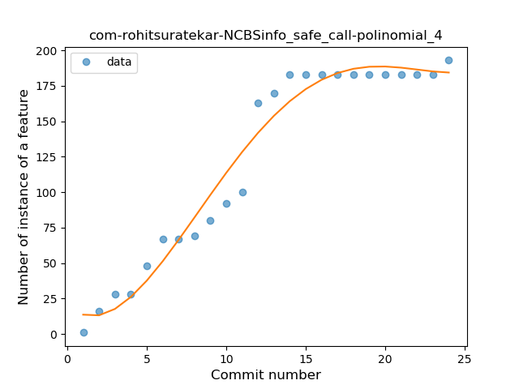

#### de-r4md4c-gamedealz
* Feature: Safe Call
* Function: )
* R_Squared: 0.96451651
 

#### com-thanksmister-iot-mqtt-alarmpanel
* Feature: Safe Call
* Function: )
* R_Squared: 0.96380046
 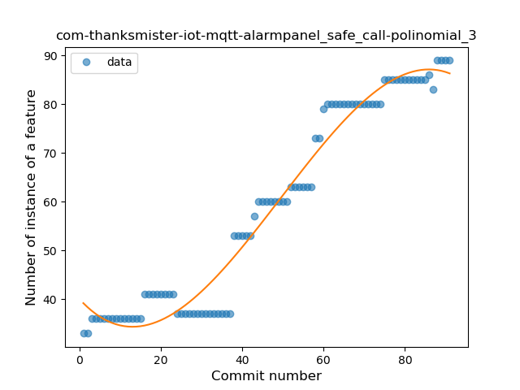

#### net-syncthing-lite
* Feature: Function call with Named Argument
* Function: )
* R_Squared: 0.96379122
 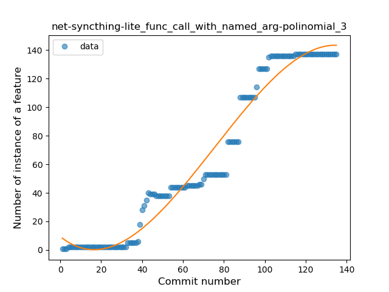

#### com-rohitsuratekar-NCBSinfo
* Feature: Data Class
* Function: 
* R_Squared: 0.96272004
 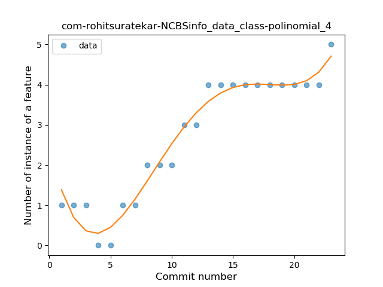

#### com-ogsdroid
* Feature: Safe Call
* Function: )
* R_Squared: 0.96232764
 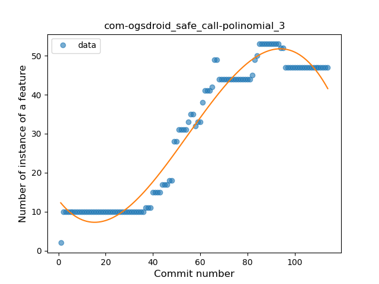

#### com-atanana-sicounter
* Feature: Coroutine
* Function: 
* R_Squared: 0.96074326
 

#### net-computingtutor-robert-computingtutor
* Feature: Type Inference
* Function: 
* R_Squared: 0.96074101
 

#### moe-feng-nhentai
* Feature: Companion Object
* Function: 
* R_Squared: 0.96048842
 

#### com-emmanuelmess-simplecleanup
* Feature: Type Inference
* Function: 
* R_Squared: 0.95954886
 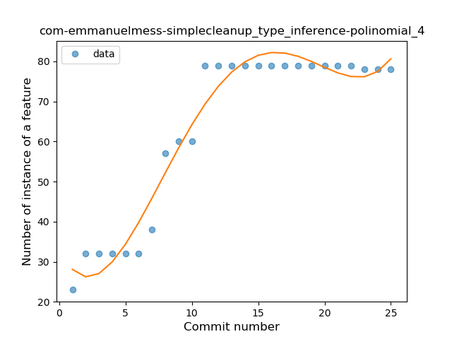

#### com-bracketcove-postrainer
* Feature: Smart Cast
* Function: 
* R_Squared: 0.95892109
 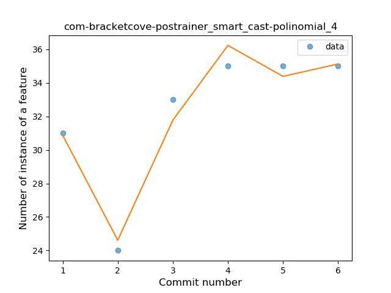

#### de-r4md4c-gamedealz
* Feature: Function call with Named Argument
* Function: )
* R_Squared: 0.95788954
 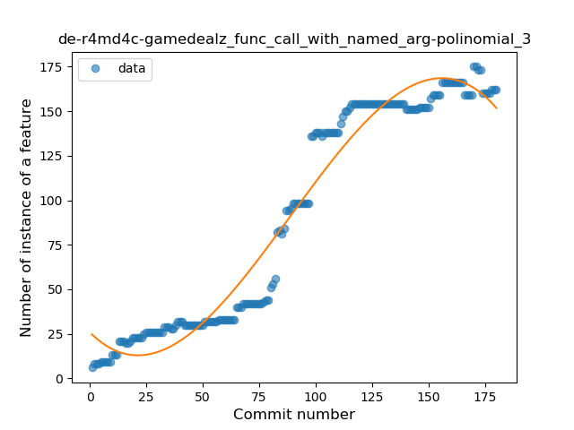

#### com-emmanuelmess-simplecleanup
* Feature: Lambda
* Function: 
* R_Squared: 0.95698384
 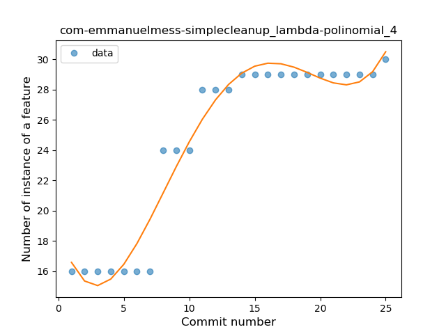

#### ru-nsu-bobrofon-easysshfs
* Feature: Safe Call
* Function: 
* R_Squared: 0.95679527
 

#### com-wanbok-monger
* Feature: Type Inference
* Function: )
* R_Squared: 0.95636297
 

#### com-benoitletondor-easybudgetapp
* Feature: When expression
* Function: )
* R_Squared: 0.95533686
 

#### com-stevenschoen-putionew
* Feature: Type Inference
* Function: )
* R_Squared: 0.95500963
 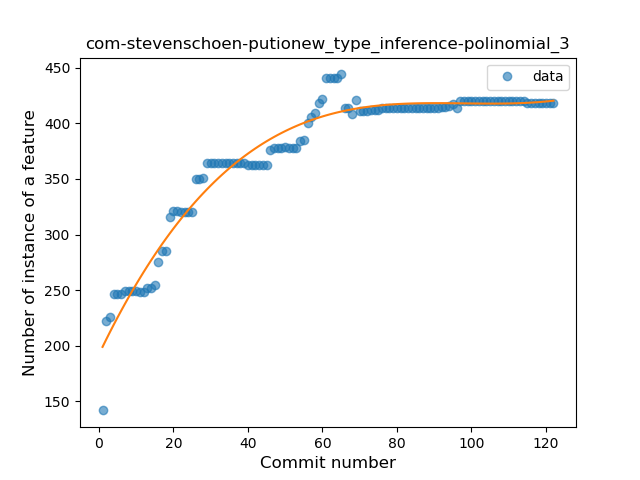

#### de-devmil-paperlaunch
* Feature: Safe Call
* Function: )
* R_Squared: 0.95411579
 

#### com-benoitletondor-easybudgetapp
* Feature: Type Inference
* Function: )
* R_Squared: 0.95407877
 

#### de-devmil-paperlaunch
* Feature: Lambda
* Function: )
* R_Squared: 0.95398659
 

#### fi-kroon-vadret
* Feature: Lambda
* Function: )
* R_Squared: 0.95386364
 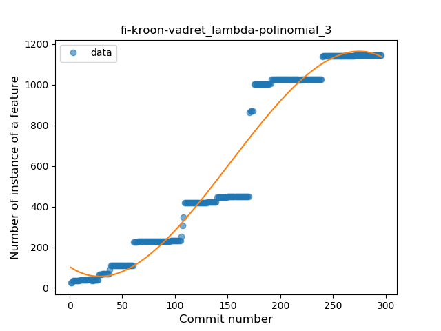

#### me-camsteffen-polite
* Feature: Lambda
* Function: )
* R_Squared: 0.95323031
 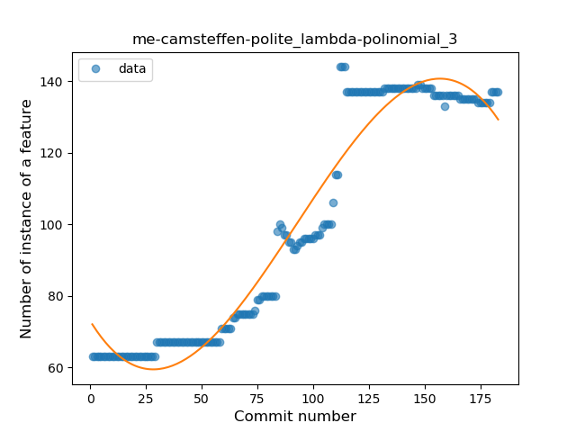

#### jp-org-example-geckour-glyph
* Feature: Companion Object
* Function: )
* R_Squared: 0.95268459
 

#### jp-org-example-geckour-glyph
* Feature: Lambda
* Function: )
* R_Squared: 0.95243889
 

#### de-cineaste-android
* Feature: Lambda
* Function: )
* R_Squared: 0.95147823
 

#### com-ofalvai-bpinfo
* Feature: Type Inference
* Function: )
* R_Squared: 0.95092967
 

#### com-bracketcove-postrainer
* Feature: Singleton
* Function: )
* R_Squared: 0.95014006
 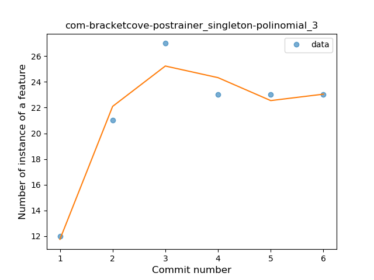

#### net-syncthing-lite
* Feature: Smart Cast
* Function: )
* R_Squared: 0.94996447
 

#### ch-rmy-android-statusbar_tacho
* Feature: Unsafe Call
* Function: 
* R_Squared: 0.94968301
 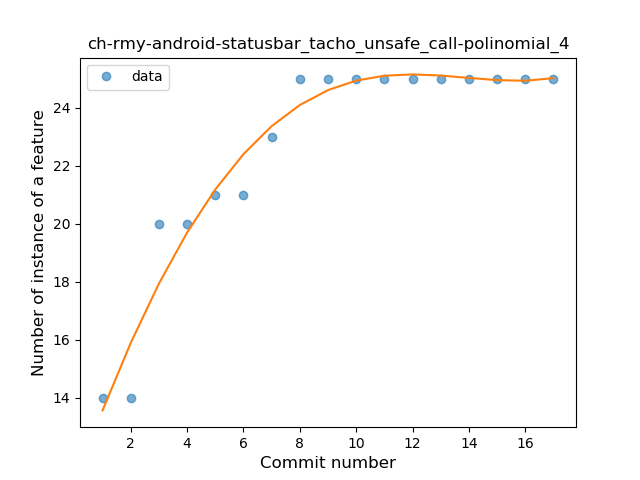

#### com-sjn-stamp
* Feature: Type Inference
* Function: )
* R_Squared: 0.94951066
 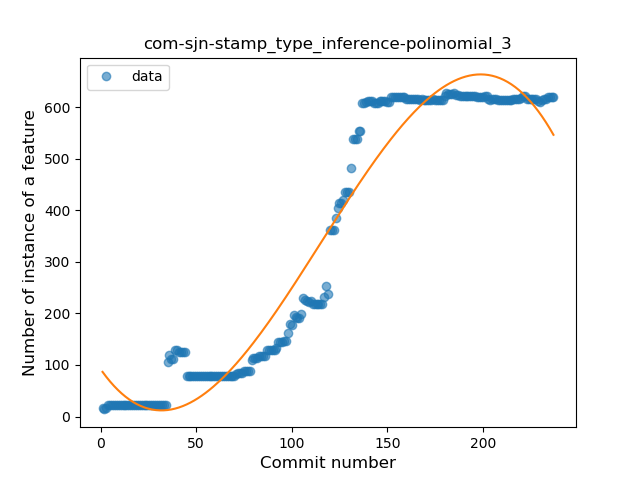

#### net-syncthing-lite
* Feature: Lambda
* Function: )
* R_Squared: 0.94949834
 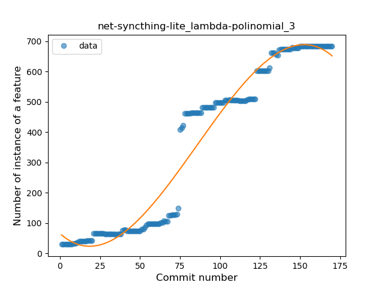

#### com-sjn-stamp
* Feature: Safe Call
* Function: )
* R_Squared: 0.94936819
 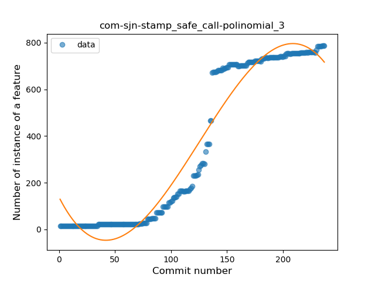

#### net-kourlas-voipms
* Feature: Lambda
* Function: )
* R_Squared: 0.948629
 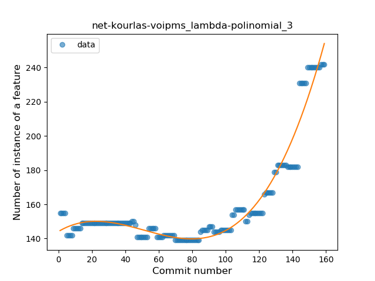

#### jp-cordea-mackerelclient
* Feature: Sealed Class
* Function: 
* R_Squared: 0.94834881
 

#### com-bracketcove-postrainer
* Feature: Type Inference
* Function: )
* R_Squared: 0.94700548
 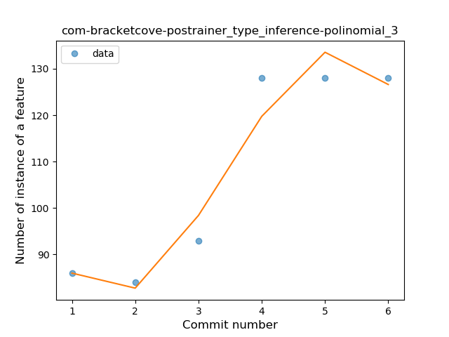

#### nl-brouwerijdemolen-borefts2013
* Feature: Singleton
* Function: )
* R_Squared: 0.94584728
 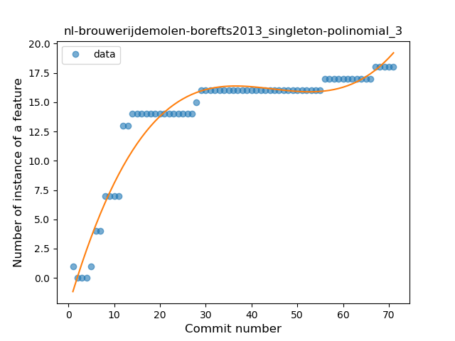

#### com-rhm-pwn
* Feature: Singleton
* Function: 
* R_Squared: 0.94583593
 

#### com-jim-sharetocomputer
* Feature: String Template
* Function: 
* R_Squared: 0.94487564
 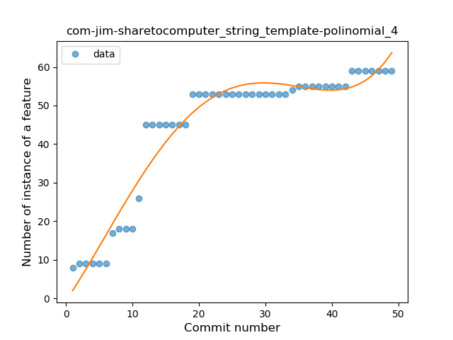

#### me-camsteffen-polite
* Feature: Function call with Named Argument
* Function: )
* R_Squared: 0.94418617
 

#### fi-kroon-vadret
* Feature: Function call with Named Argument
* Function: )
* R_Squared: 0.94365169
 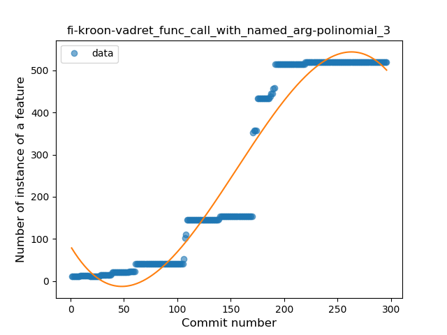

#### de-ironjan-mensaupb
* Feature: Type Inference
* Function: )
* R_Squared: 0.94361159
 

#### de-tubaf-mandelGL
* Feature: Safe Call
* Function: 
* R_Squared: 0.94348644
 

#### streetwalrus-usbmountr
* Feature: Type Inference
* Function: )
* R_Squared: 0.94237188
 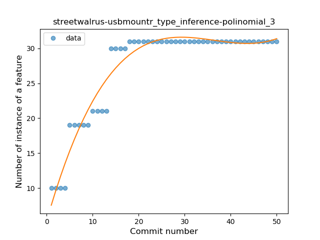

#### me-impa-knockonports
* Feature: Unsafe Call
* Function: 
* R_Squared: 0.94125562
 

#### de-thecode-android-tazreader
* Feature: Safe Call
* Function: )
* R_Squared: 0.94002003
 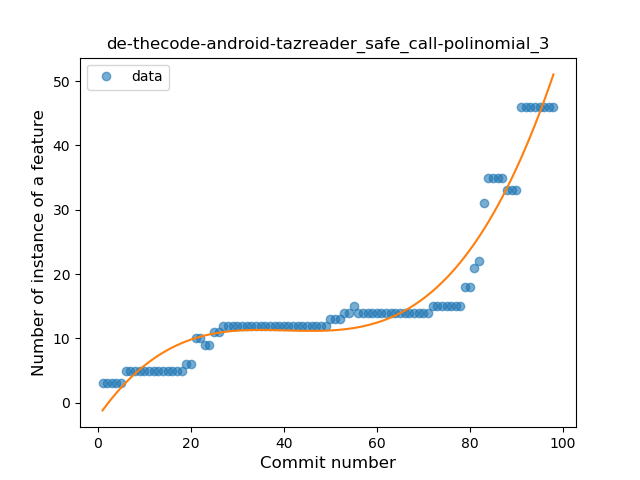

#### de-avpptr-umweltzone
* Feature: Type Inference
* Function: )
* R_Squared: 0.93986175
 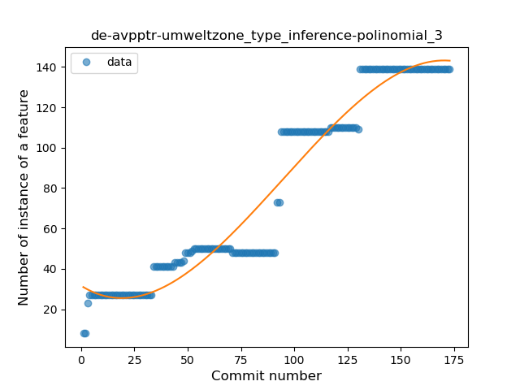

#### com-rubenwardy-minetestmodmanager
* Feature: Type Inference
* Function: )
* R_Squared: 0.93952943
 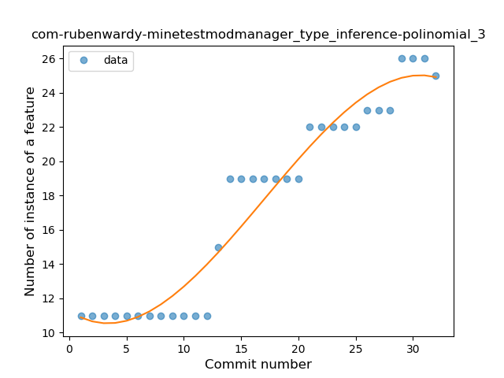

#### es-danirod-rectball-android
* Feature: String Template
* Function: 
* R_Squared: 0.93901463
 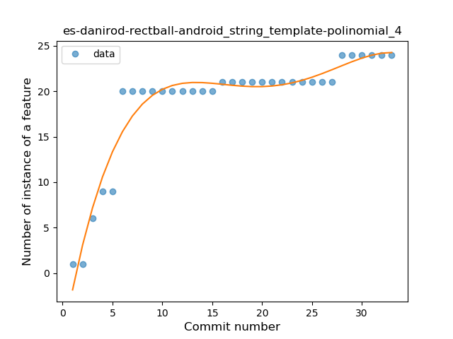

#### org-projectbass-bass
* Feature: Type Inference
* Function: )
* R_Squared: 0.93897012
 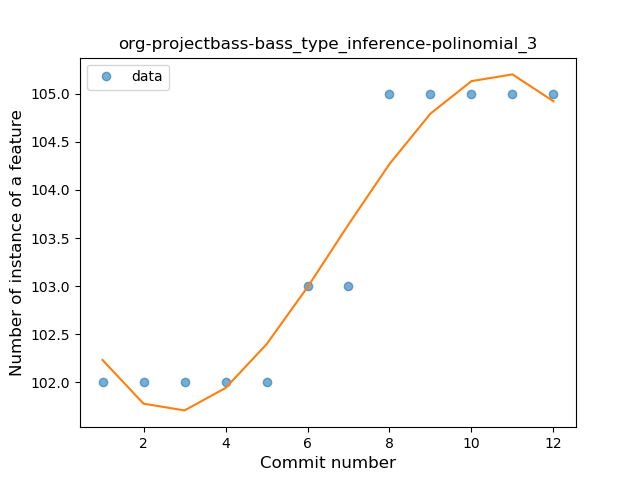

#### jp-org-example-geckour-glyph
* Feature: When expression
* Function: )
* R_Squared: 0.93787935
 

#### net-kourlas-voipms
* Feature: Safe Call
* Function: )
* R_Squared: 0.93755207
 

#### com-rhm-pwn
* Feature: Function call with Named Argument
* Function: 
* R_Squared: 0.93710768
 

#### com-benoitletondor-easybudgetapp
* Feature: Destructuring Declaration
* Function: )
* R_Squared: 0.93669616
 

#### com-ianhanniballake-localstorage
* Feature: Lambda
* Function: 
* R_Squared: 0.93592191
 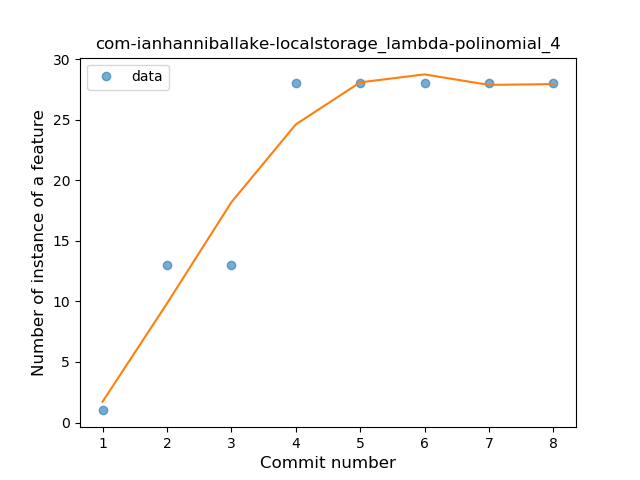

#### com-jkcarino-ankieditor
* Feature: Unsafe Call
* Function: )
* R_Squared: 0.9354616
 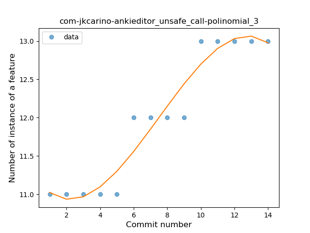

#### com-ianhanniballake-localstorage
* Feature: Type Inference
* Function: )
* R_Squared: 0.93495792
 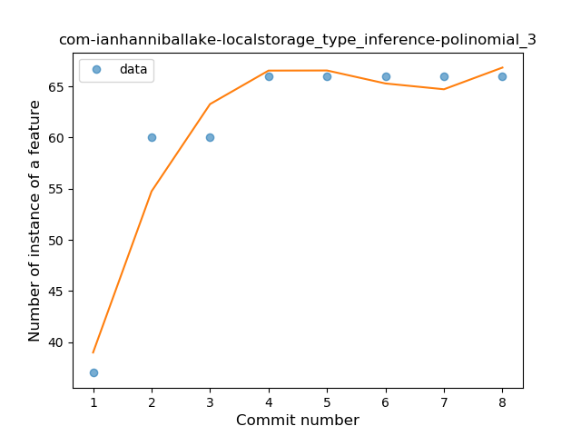

#### fr-jnda-android-ipcalc
* Feature: Type Inference
* Function: 
* R_Squared: 0.93479686
 

#### info-papdt-express-helper
* Feature: Coroutine
* Function: )
* R_Squared: 0.93432021
 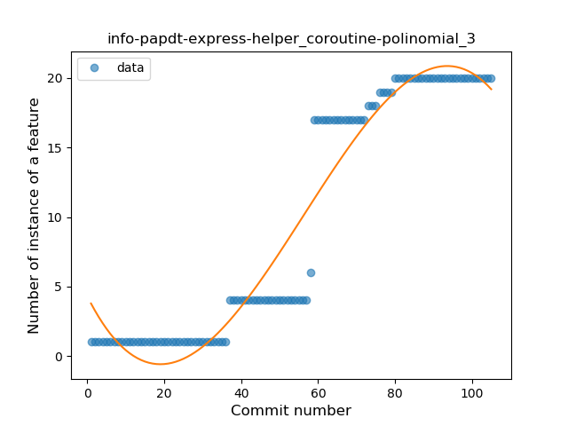

#### ch-rmy-android-statusbar_tacho
* Feature: Type Inference
* Function: )
* R_Squared: 0.93398046
 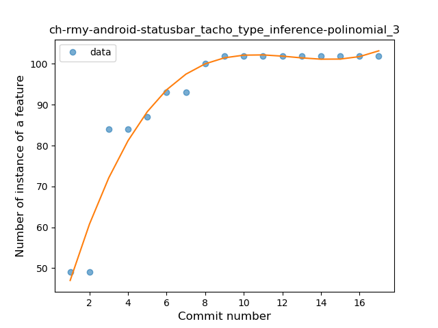

#### com-pluscubed-velociraptor
* Feature: Type Inference
* Function: )
* R_Squared: 0.93277689
 

#### com-BibleQuote
* Feature: Type Inference
* Function: 
* R_Squared: 0.93227084
 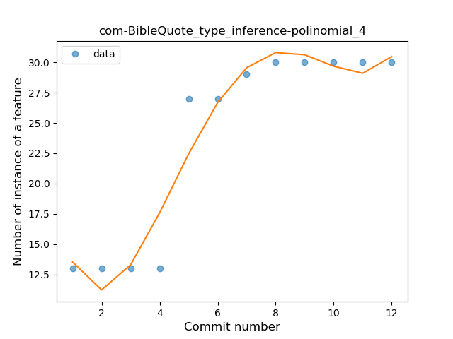

#### app-opass-ccip
* Feature: Type Inference
* Function: )
* R_Squared: 0.93192824
 

#### com-benoitletondor-easybudgetapp
* Feature: String Template
* Function: )
* R_Squared: 0.93176348
 

#### com-fallgamlet-dnestrcinema
* Feature: Safe Call
* Function: 
* R_Squared: 0.93138875
 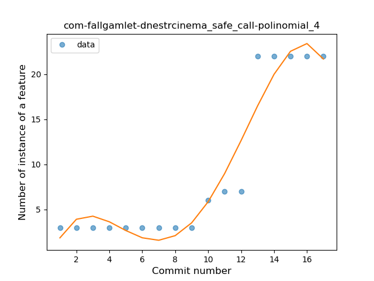

#### nightlock-peppercarrot
* Feature: Type Inference
* Function: )
* R_Squared: 0.93078699
 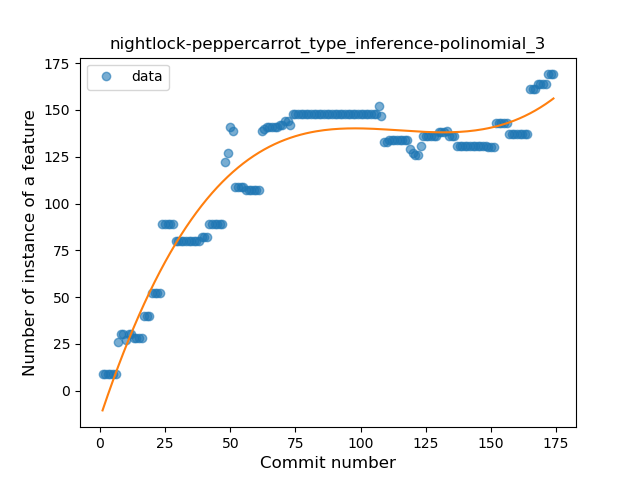

#### net-syncthing-lite
* Feature: Data Class
* Function: )
* R_Squared: 0.93062088
 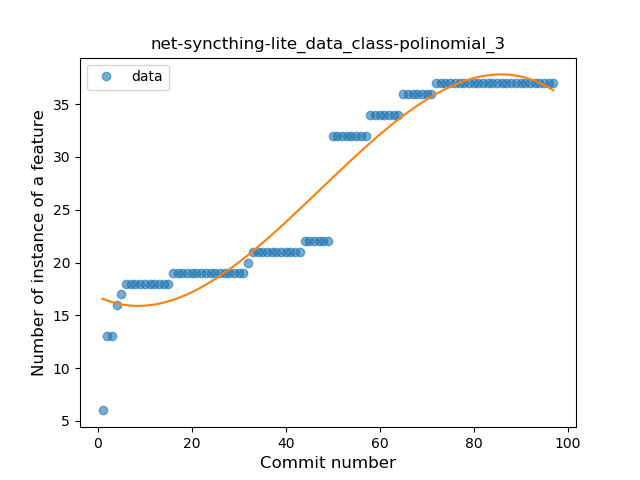

#### com-github-fractals
* Feature: Type Inference
* Function: 
* R_Squared: 0.93047924
 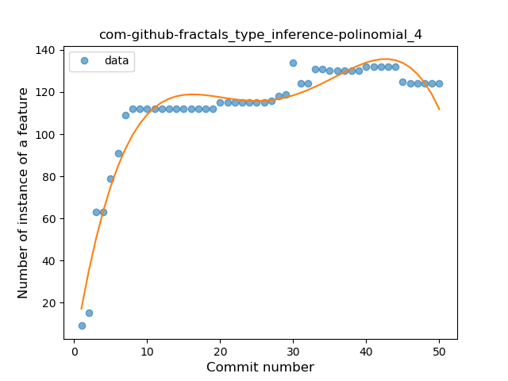

#### net-computingtutor-robert-computingtutor
* Feature: Unsafe Call
* Function: 
* R_Squared: 0.93006993
 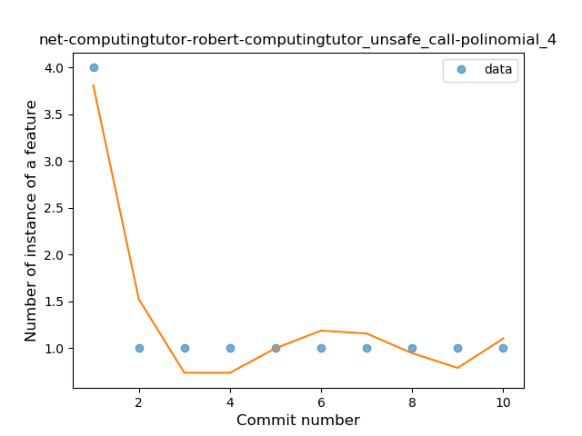

#### ru-nsu-bobrofon-easysshfs
* Feature: Destructuring Declaration
* Function: 
* R_Squared: 0.93006993
 

#### com-github-fractals
* Feature: Lambda
* Function: )
* R_Squared: 0.92995174
 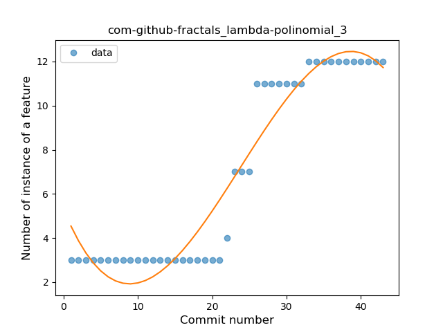

#### nl-brouwerijdemolen-borefts2013
* Feature: When expression
* Function: )
* R_Squared: 0.92991593
 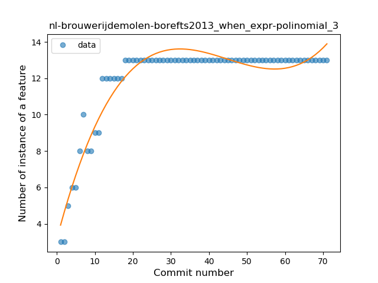

#### com-esafirm-androidplayground
* Feature: Function call with Named Argument
* Function: 
* R_Squared: 0.9294421
 

#### com-jim-sharetocomputer
* Feature: When expression
* Function: )
* R_Squared: 0.9277385
 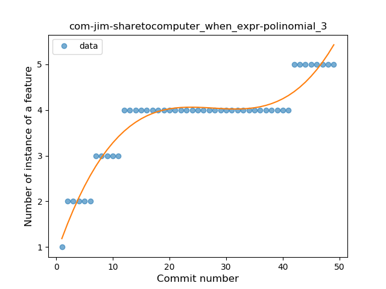

#### com-rohitsuratekar-NCBSinfo
* Feature: String Template
* Function: 
* R_Squared: 0.92758373
 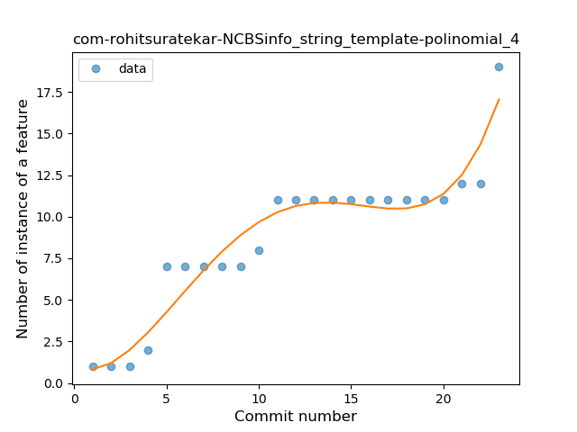

#### net-syncthing-lite
* Feature: Companion Object
* Function: )
* R_Squared: 0.9270029
 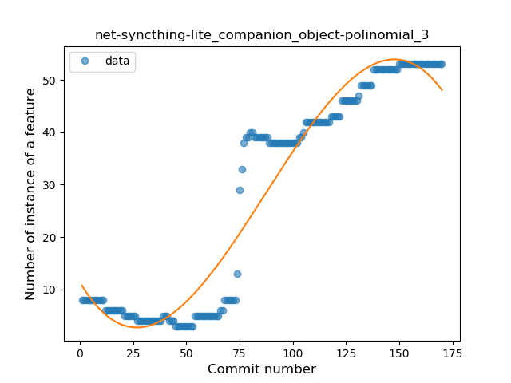

#### sreich-countthedays
* Feature: Property Delegation
* Function: 
* R_Squared: 0.92660206
 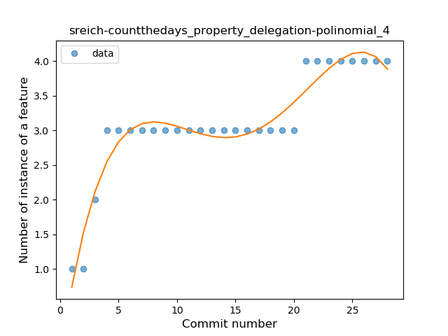

#### org-lenchan139-ncbookmark
* Feature: Type Inference
* Function: 
* R_Squared: 0.92645672
 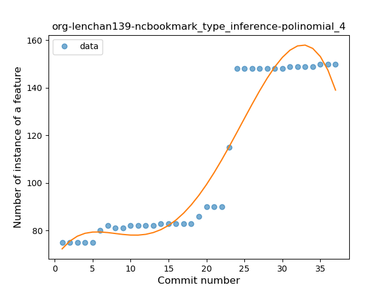

#### com-phicdy-totoanticipation
* Feature: Type Inference
* Function: )
* R_Squared: 0.92561817
 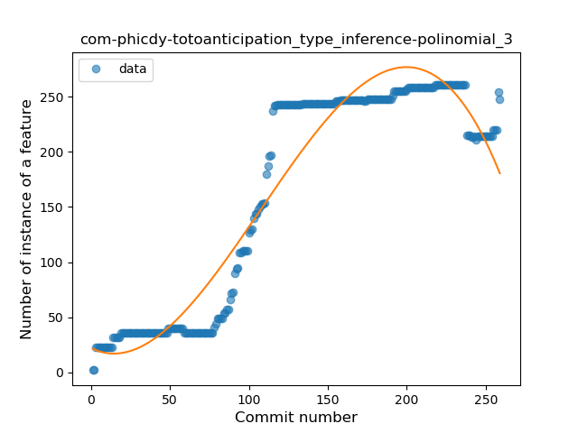

#### com-ianhanniballake-contractiontimer
* Feature: Unsafe Call
* Function: 
* R_Squared: 0.92484829
 

#### streetwalrus-usbmountr
* Feature: String Template
* Function: )
* R_Squared: 0.92447789
 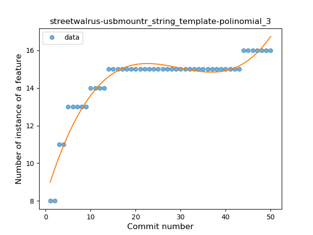

#### com-defianttech-convertme
* Feature: Type Inference
* Function: 
* R_Squared: 0.92217361
 

#### com-enjoyingfoss-om
* Feature: Type Inference
* Function: 
* R_Squared: 0.92200333
 

#### ru-hyst329-openfool
* Feature: Safe Call
* Function: )
* R_Squared: 0.92135775
 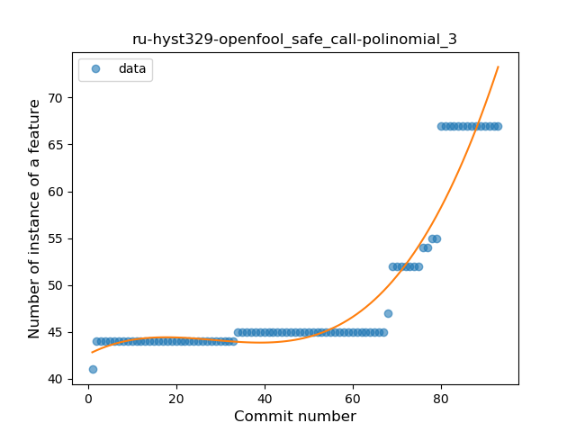

#### ru-nsu-bobrofon-easysshfs
* Feature: Lambda
* Function: 
* R_Squared: 0.92052429
 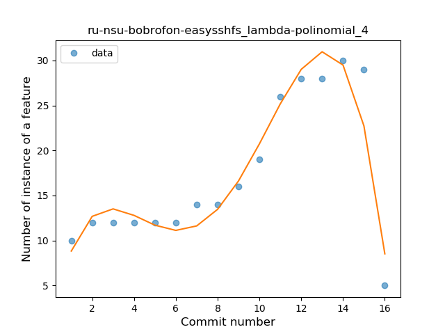

#### org-decsync-cc
* Feature: Lambda
* Function: )
* R_Squared: 0.91941606
 

#### com-manoj-dlt
* Feature: Type Inference
* Function: 
* R_Squared: 0.91871846
 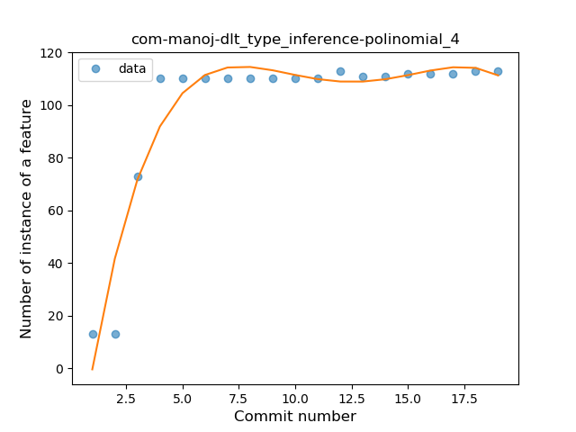

#### com-nao20010128nao-DroidComplex
* Feature: Unsafe Call
* Function: 
* R_Squared: 0.9185372
 

#### de-tubaf-mandelGL
* Feature: Type Inference
* Function: 
* R_Squared: 0.91851142
 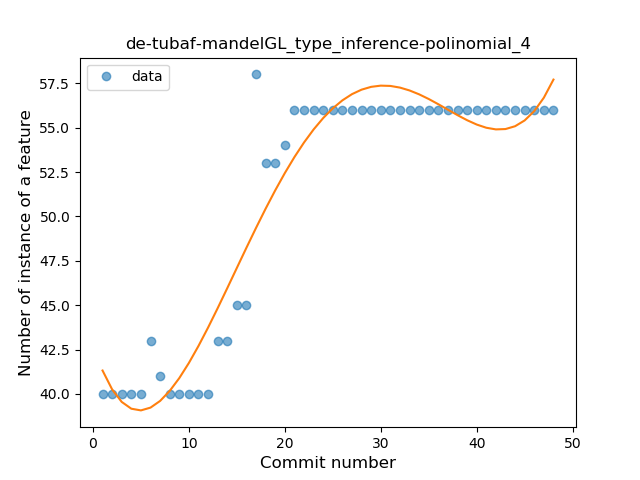

#### me-impa-knockonports
* Feature: Property Delegation
* Function: 
* R_Squared: 0.91845039
 

#### nl-brouwerijdemolen-borefts2013
* Feature: Extension Function
* Function: )
* R_Squared: 0.91510869
 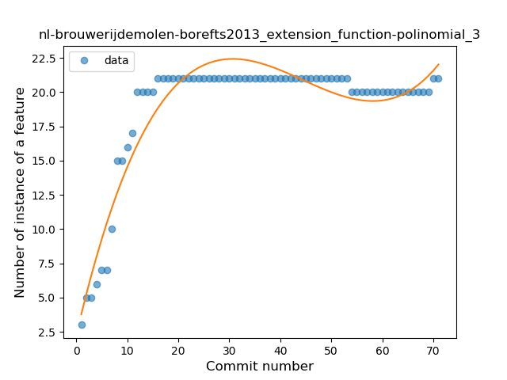

#### com-kgurgul-cpuinfo
* Feature: Type Inference
* Function: )
* R_Squared: 0.91400838
 

#### college-wyk-app
* Feature: Unsafe Call
* Function: )
* R_Squared: 0.91381575
 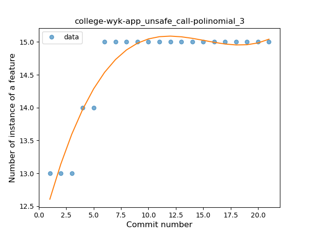

#### org-mcxa-softsound
* Feature: Safe Call
* Function: )
* R_Squared: 0.91375949
 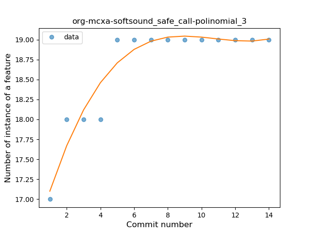

#### com-ninjahoahong-unstoppable
* Feature: Type Inference
* Function: )
* R_Squared: 0.91323295
 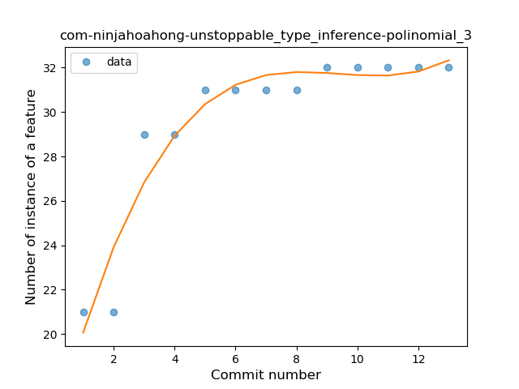

#### de-devmil-paperlaunch
* Feature: Unsafe Call
* Function: )
* R_Squared: 0.91317769
 

#### net-codechunk-speedofsound
* Feature: Unsafe Call
* Function: 
* R_Squared: 0.91251919
 

#### com-fake-android-torchlight
* Feature: Singleton
* Function: )
* R_Squared: 0.91203632
 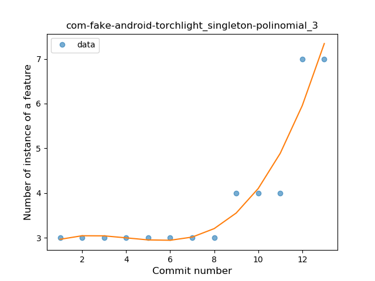

#### com-wanbok-monger
* Feature: Safe Call
* Function: )
* R_Squared: 0.91199935
 

#### org-lenchan139-ncbookmark
* Feature: Lambda
* Function: 
* R_Squared: 0.91198324
 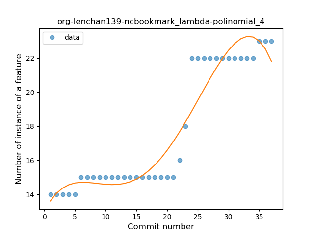

#### com-stolineage-lineagewatcher
* Feature: Type Inference
* Function: )
* R_Squared: 0.91057692
 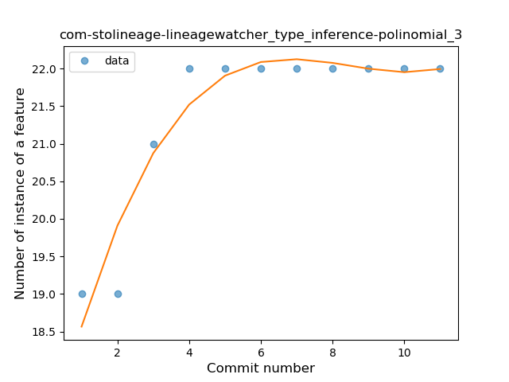

#### com-ogsdroid
* Feature: Unsafe Call
* Function: )
* R_Squared: 0.91026538
 

#### net-syncthing-lite
* Feature: Type Inference
* Function: )
* R_Squared: 0.90969001
 

#### io-wookey-wallet
* Feature: Type Inference
* Function: 
* R_Squared: 0.90790086
 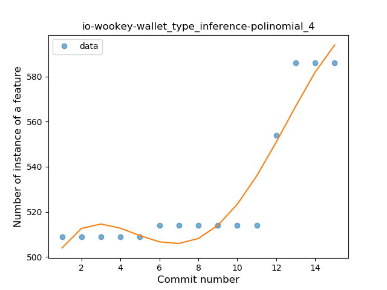

#### com-physphil-android-unitconverterultimate
* Feature: Type Inference
* Function: )
* R_Squared: 0.90784427
 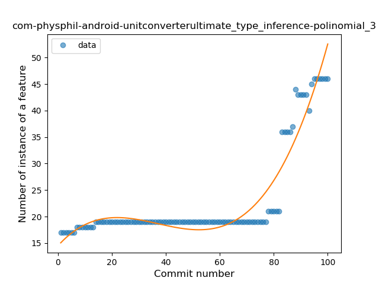

#### io-wookey-wallet
* Feature: Lambda
* Function: 
* R_Squared: 0.90779067
 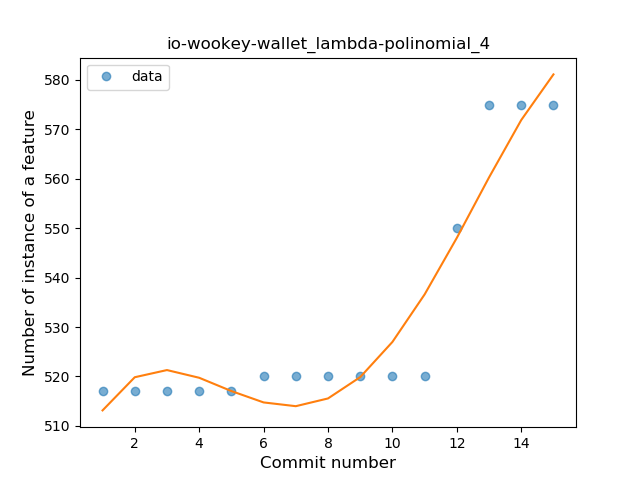

#### ca-rmen-android-frenchcalendar
* Feature: String Template
* Function: 
* R_Squared: 0.90769231
 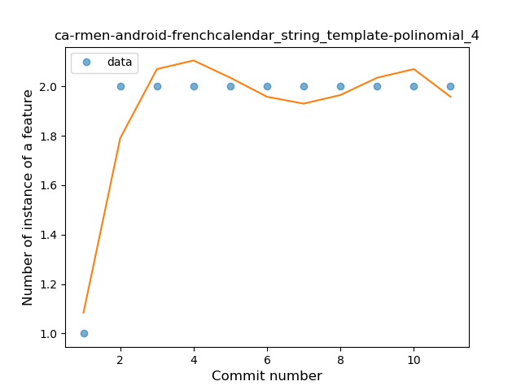

#### com-ahorcado
* Feature: Unsafe Call
* Function: )
* R_Squared: 0.90735506
 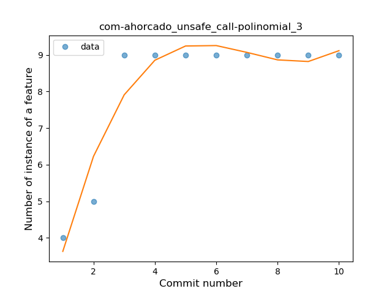

#### me-impa-knockonports
* Feature: Companion Object
* Function: 
* R_Squared: 0.90683679
 

#### de-msal-muzei-nationalgeographic
* Feature: Type Inference
* Function: 
* R_Squared: 0.906792
 

#### io-wookey-wallet
* Feature: When expression
* Function: 
* R_Squared: 0.90670091
 

#### com-androidheads-vienna-escalero
* Feature: When expression
* Function: 
* R_Squared: 0.90667659
 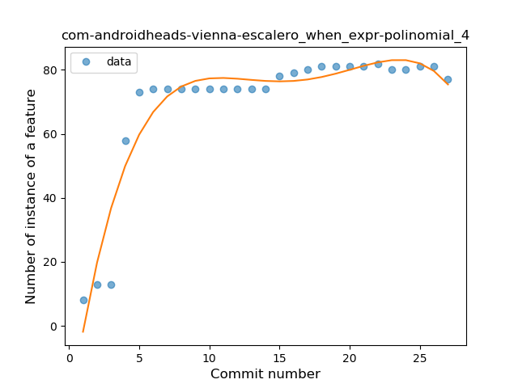

#### com-commit451-gitlab
* Feature: Data Class
* Function: 
* R_Squared: 0.90606061
 

#### net-codechunk-speedofsound
* Feature: String Template
* Function: 
* R_Squared: 0.90603797
 

#### com-manoj-dlt
* Feature: Companion Object
* Function: 
* R_Squared: 0.90603429
 

#### com-pluscubed-velociraptor
* Feature: Unsafe Call
* Function: )
* R_Squared: 0.90551435
 

#### de-micmun-android-deufeitage
* Feature: Type Inference
* Function: )
* R_Squared: 0.90507163
 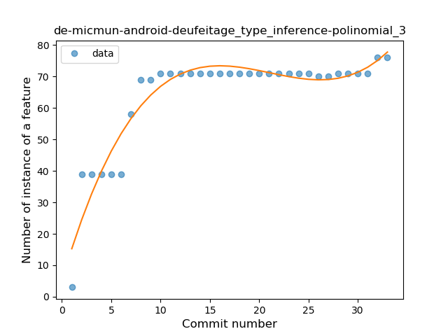

#### me-murks-feedwatcher
* Feature: Type Inference
* Function: )
* R_Squared: 0.90506984
 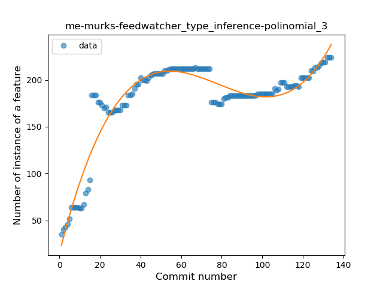

#### com-androidheads-vienna-escalero
* Feature: Unsafe Call
* Function: )
* R_Squared: 0.90405317
 

#### net-stew-stew
* Feature: Smart Cast
* Function: )
* R_Squared: 0.90315816
 

#### org-mcxa-softsound
* Feature: Lambda
* Function: 
* R_Squared: 0.90298965
 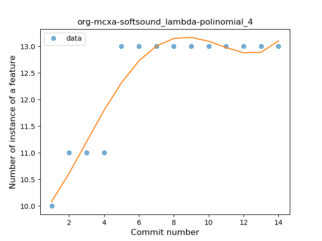

#### co-timecrypt-android
* Feature: Companion Object
* Function: )
* R_Squared: 0.90275287
 

#### io-github-hidroh-materialistic
* Feature: Type Inference
* Function: )
* R_Squared: 0.90242993
 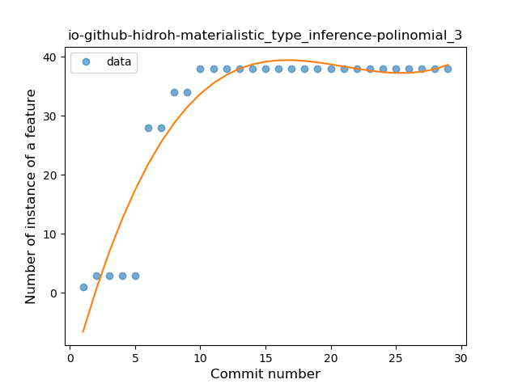

#### io-homeassistant-android
* Feature: Type Inference
* Function: )
* R_Squared: 0.89997218
 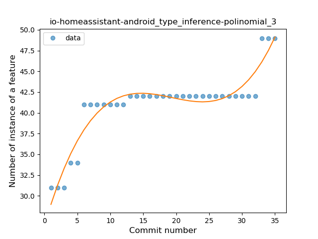

#### me-impa-knockonports
* Feature: Lambda
* Function: 
* R_Squared: 0.89793567
 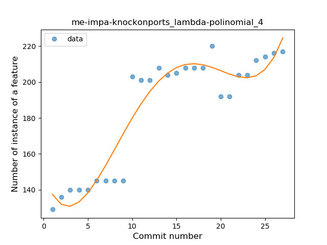

#### fr-jnda-android-ipcalc
* Feature: Safe Call
* Function: 
* R_Squared: 0.8974359
 

#### fr-jnda-android-ipcalc
* Feature: String Template
* Function: 
* R_Squared: 0.8974359
 

#### io-wookey-wallet
* Feature: Coroutine
* Function: 
* R_Squared: 0.8962384
 

#### ru-nsu-bobrofon-easysshfs
* Feature: Singleton
* Function: 
* R_Squared: 0.89505326
 

#### fr-chenry-android-freshrss
* Feature: Property Delegation
* Function: )
* R_Squared: 0.89430101
 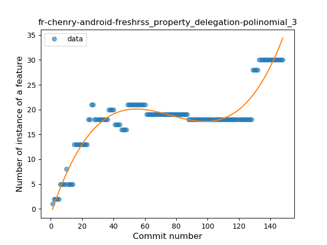

#### com-androidheads-vienna-escalero
* Feature: Range Expression
* Function: 
* R_Squared: 0.89413873
 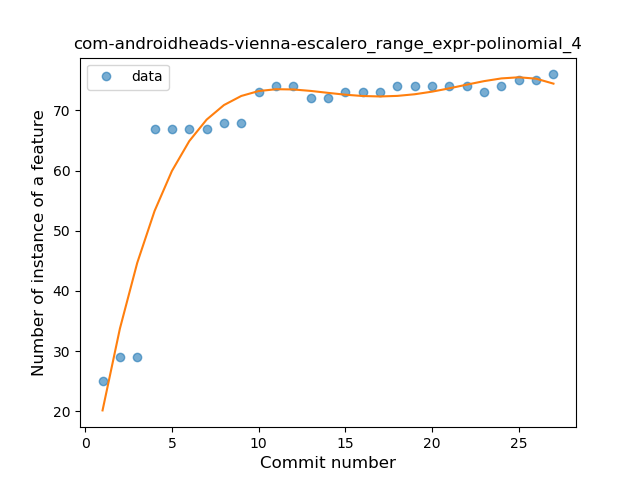

#### moe-feng-nhentai
* Feature: Extension Function
* Function: 
* R_Squared: 0.89340759
 

#### jp-takke-cpustats
* Feature: Type Inference
* Function: )
* R_Squared: 0.89304444
 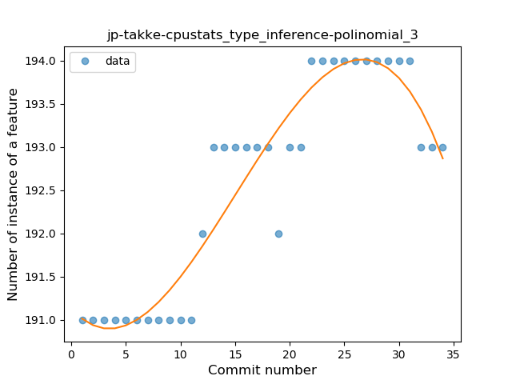

#### com-esafirm-androidplayground
* Feature: Coroutine
* Function: )
* R_Squared: 0.89202267
 

#### com-physphil-android-unitconverterultimate
* Feature: Function call with Named Argument
* Function: 
* R_Squared: 0.89092509
 

#### com-jkcarino-ankieditor
* Feature: Lambda
* Function: 
* R_Squared: 0.89055944
 

#### bteelse-com-br-amipyscho
* Feature: Type Inference
* Function: 
* R_Squared: 0.88980035
 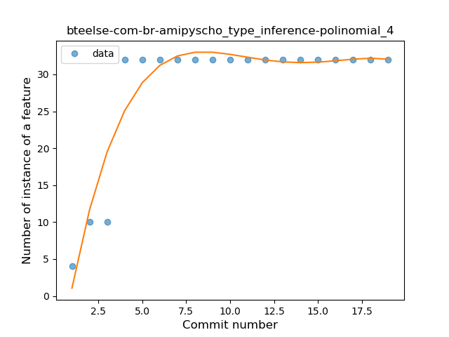

#### me-impa-knockonports
* Feature: String Template
* Function: )
* R_Squared: 0.88932826
 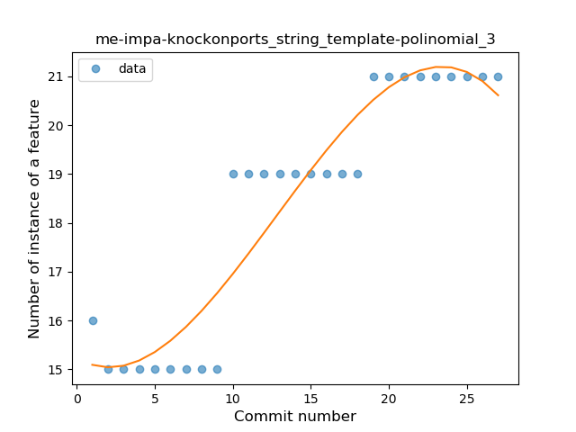

#### jp-cordea-mackerelclient
* Feature: Property Delegation
* Function: )
* R_Squared: 0.8884687
 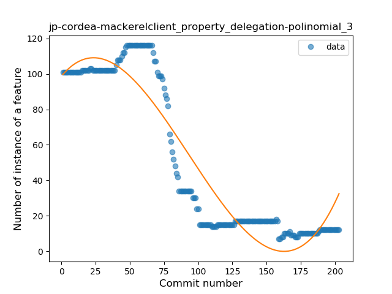

#### com-wbrawner-simplemarkdown
* Feature: Coroutine
* Function: )
* R_Squared: 0.88669236
 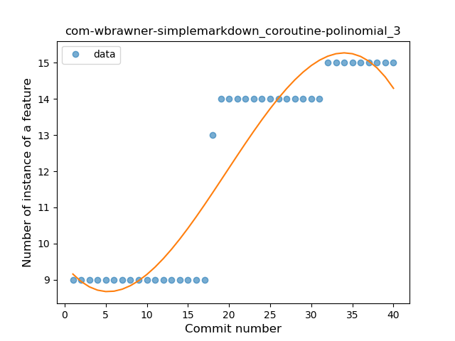

#### com-alderferstudios-handandfootscores
* Feature: Type Inference
* Function: 
* R_Squared: 0.88636495
 

#### io-wookey-wallet
* Feature: Safe Call
* Function: )
* R_Squared: 0.88607168
 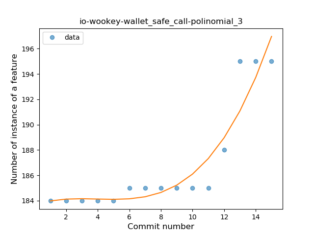

#### com-skydoves-waterdays
* Feature: Lambda
* Function: 
* R_Squared: 0.88461538
 

#### com-skydoves-waterdays
* Feature: Safe Call
* Function: 
* R_Squared: 0.88461538
 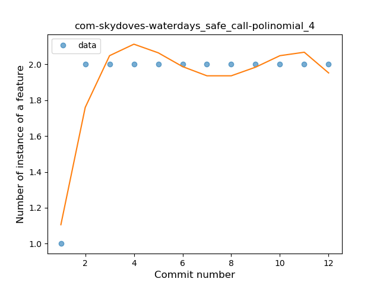

#### com-skydoves-waterdays
* Feature: String Template
* Function: 
* R_Squared: 0.88461538
 

#### com-skydoves-waterdays
* Feature: Range Expression
* Function: 
* R_Squared: 0.88461538
 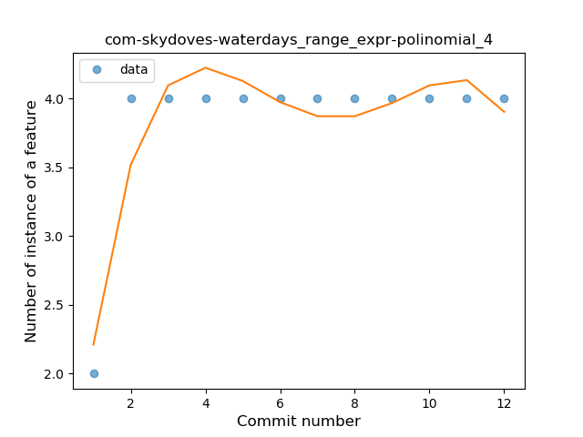

#### org-projectbass-bass
* Feature: Unsafe Call
* Function: 
* R_Squared: 0.88438228
 

#### org-projectbass-bass
* Feature: Function call with Named Argument
* Function: 
* R_Squared: 0.88438228
 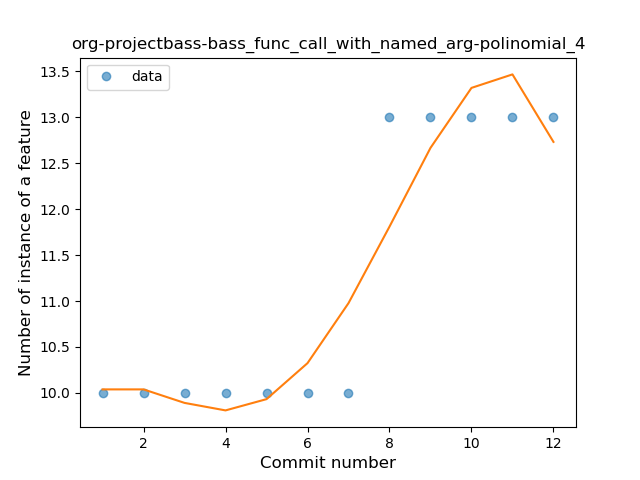

#### tw-shounenwind-kmnbottool
* Feature: Extension Function
* Function: 
* R_Squared: 0.88410368
 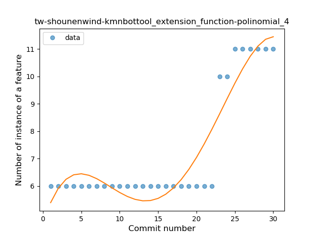

#### com-androidheads-vienna-escalero
* Feature: Destructuring Declaration
* Function: 
* R_Squared: 0.88349885
 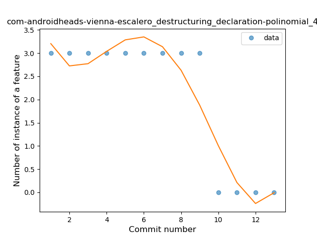

#### org-decsync-cc
* Feature: When expression
* Function: )
* R_Squared: 0.88321264
 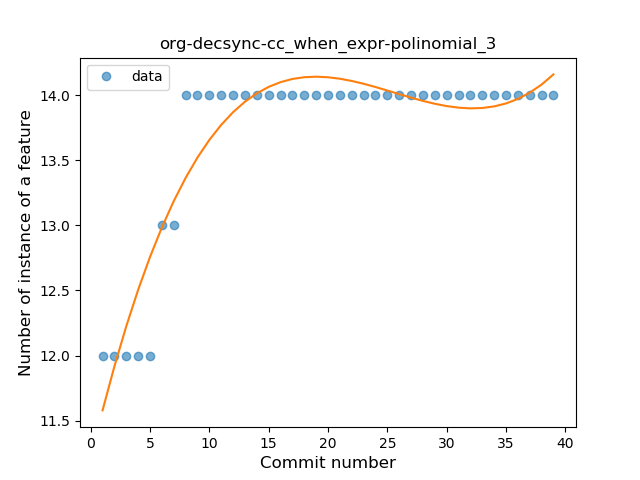

#### com-ahorcado
* Feature: Lambda
* Function: )
* R_Squared: 0.88297235
 

#### org-thiolliere-youtubestream
* Feature: Type Inference
* Function: 
* R_Squared: 0.88273392
 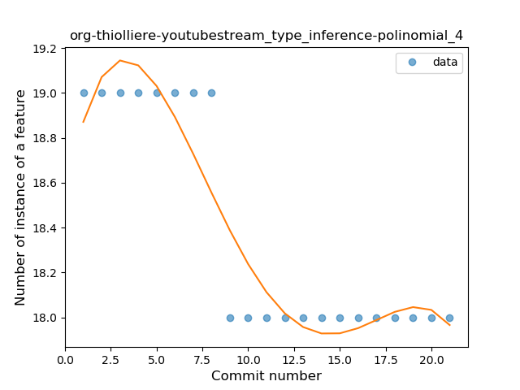

#### com-fake-android-torchlight
* Feature: Type Inference
* Function: )
* R_Squared: 0.88126928
 

#### com-emmanuelmess-simplecleanup
* Feature: Safe Call
* Function: )
* R_Squared: 0.88072021
 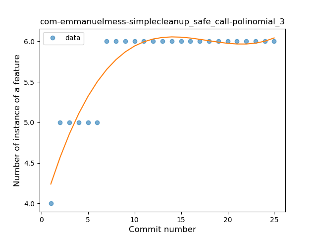

#### es-danirod-rectball-android
* Feature: Destructuring Declaration
* Function: )
* R_Squared: 0.8806434
 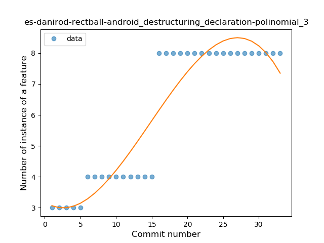

#### com-androidheads-vienna-escalero
* Feature: Companion Object
* Function: 
* R_Squared: 0.87922342
 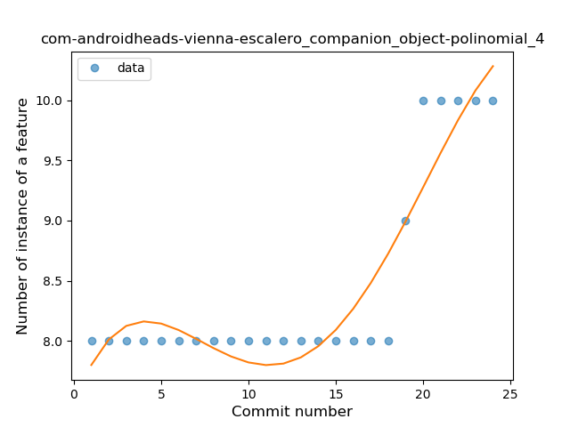

#### com-ahorcado
* Feature: String Template
* Function: 
* R_Squared: 0.87879599
 

#### college-wyk-app
* Feature: Property Delegation
* Function: )
* R_Squared: 0.87795544
 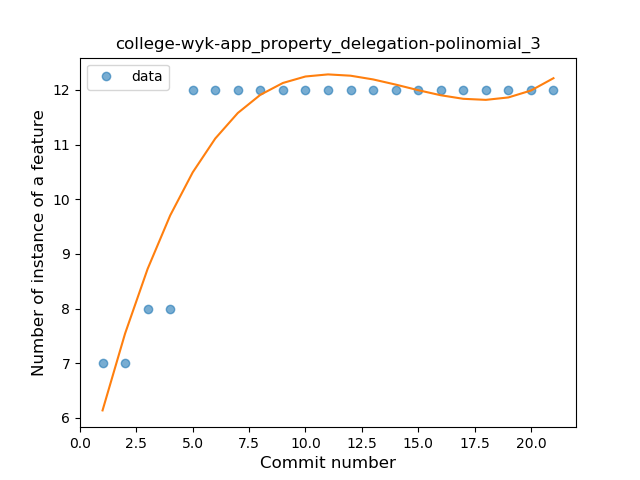

#### org-teamblueridge-pasteitapp
* Feature: Safe Call
* Function: 
* R_Squared: 0.87787512
 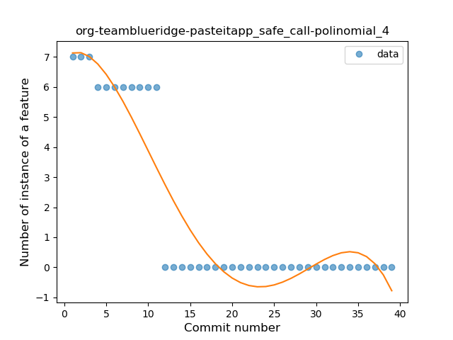

#### org-bottiger-podcast
* Feature: Type Inference
* Function: )
* R_Squared: 0.87762662
 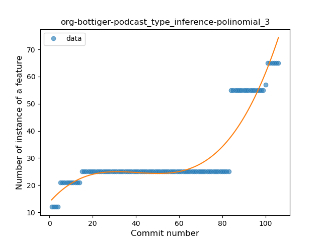

#### com-firstrowria-pushnotificationtester
* Feature: Type Inference
* Function: 
* R_Squared: 0.87692308
 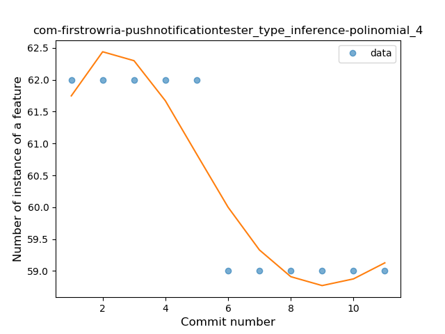

#### ca-rmen-android-frenchcalendar
* Feature: Lambda
* Function: 
* R_Squared: 0.87692308
 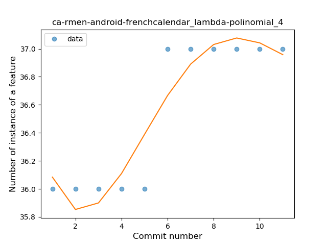

#### com-firstrowria-pushnotificationtester
* Feature: Companion Object
* Function: 
* R_Squared: 0.87692308
 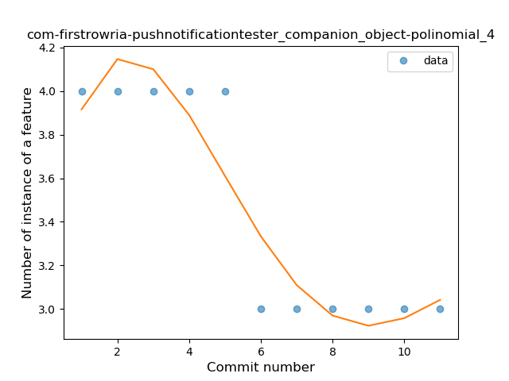

#### com-firstrowria-pushnotificationtester
* Feature: Property Delegation
* Function: 
* R_Squared: 0.87692308
 

#### moe-feng-nhentai
* Feature: String Template
* Function: )
* R_Squared: 0.8768191
 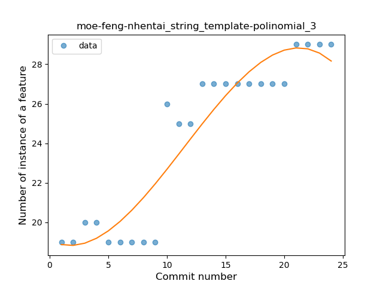

#### io-github-fvasco-pinpoi
* Feature: Unsafe Call
* Function: )
* R_Squared: 0.87564648
 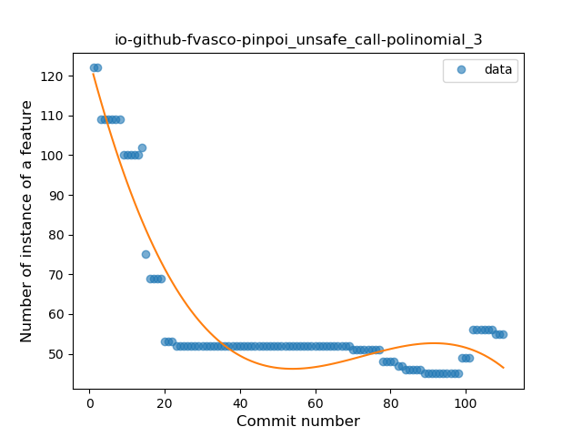

#### pro-rudloff-muzei-commons
* Feature: Safe Call
* Function: 
* R_Squared: 0.87553282
 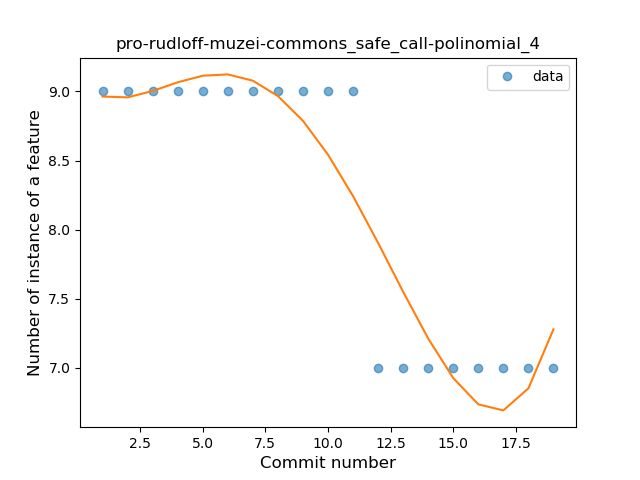

#### de-msal-muzei-nationalgeographic
* Feature: Safe Call
* Function: 
* R_Squared: 0.87278694
 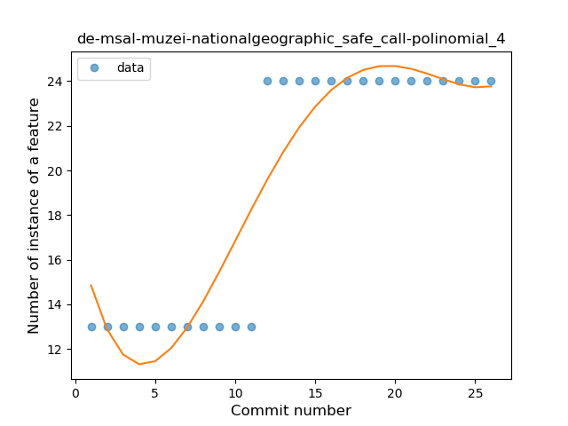

#### org-decsync-sparss-floss
* Feature: String Template
* Function: 
* R_Squared: 0.87188833
 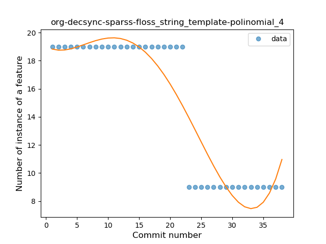

#### ru-nsu-bobrofon-easysshfs
* Feature: Companion Object
* Function: 
* R_Squared: 0.87143362
 

#### com-manichord-mgit
* Feature: Type Inference
* Function: )
* R_Squared: 0.87142133
 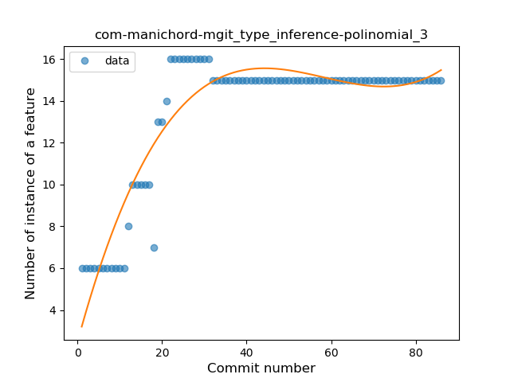

#### org-projectbass-bass
* Feature: Lambda
* Function: )
* R_Squared: 0.87115799
 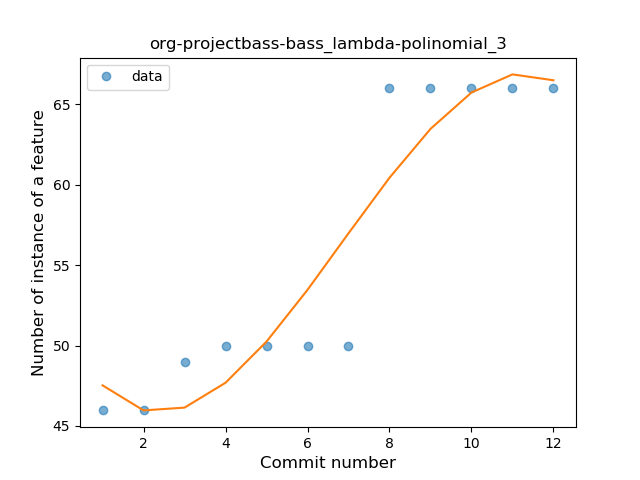

#### com-wilderpereira-lmgtfygen
* Feature: Companion Object
* Function: 
* R_Squared: 0.87044221
 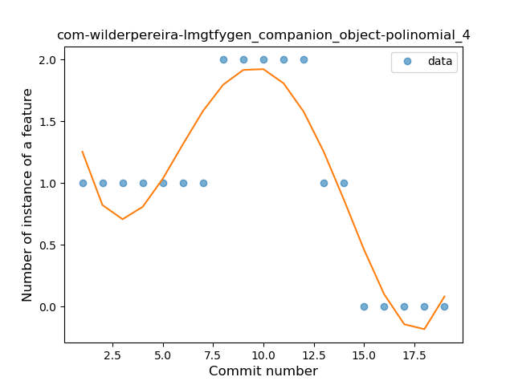

#### com-emmanuelmess-simplecleanup
* Feature: Extension Function
* Function: 
* R_Squared: 0.87033749
 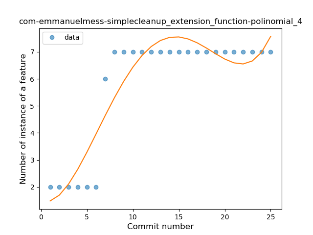

#### de-ironjan-mensaupb
* Feature: Unsafe Call
* Function: )
* R_Squared: 0.87008356
 

#### college-wyk-app
* Feature: Data Class
* Function: 
* R_Squared: 0.86975542
 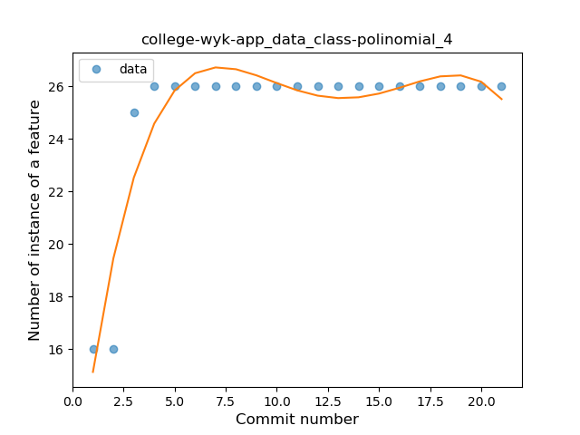

#### com-gimranov-zandy-app
* Feature: Unsafe Call
* Function: 
* R_Squared: 0.86945298
 

#### me-jfenn-alarmio
* Feature: Type Inference
* Function: )
* R_Squared: 0.86899147
 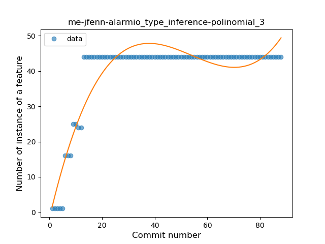

#### de-blankedv-lanbahnpanel
* Feature: Lambda
* Function: )
* R_Squared: 0.86889203
 

#### nl-brouwerijdemolen-borefts2013
* Feature: Safe Call
* Function: )
* R_Squared: 0.86874884
 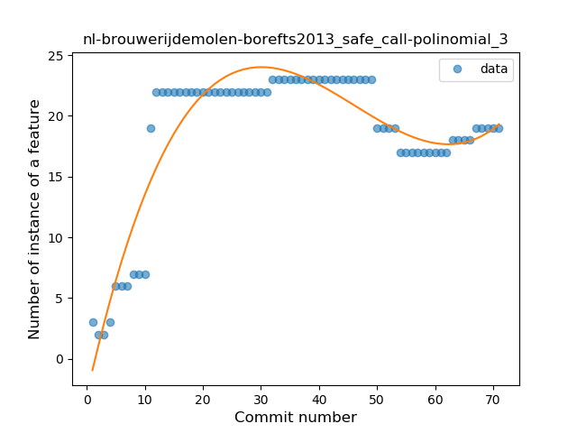

#### io-homeassistant-android
* Feature: Safe Call
* Function: )
* R_Squared: 0.86840643
 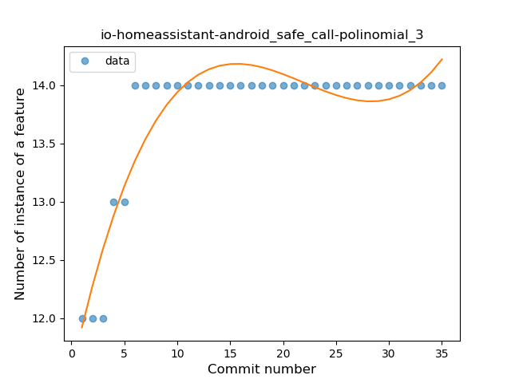

#### com-greenlionsoft-pollution-madrid
* Feature: Type Inference
* Function: 
* R_Squared: 0.86836586
 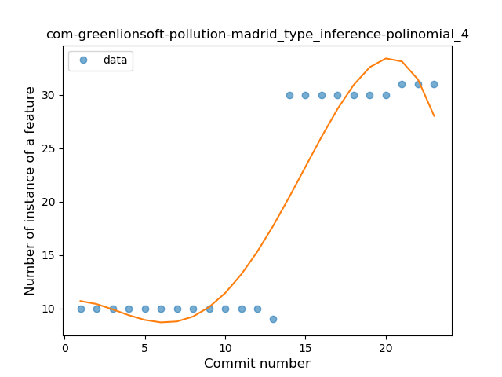

#### quickbeer-android
* Feature: String Template
* Function: )
* R_Squared: 0.86744311
 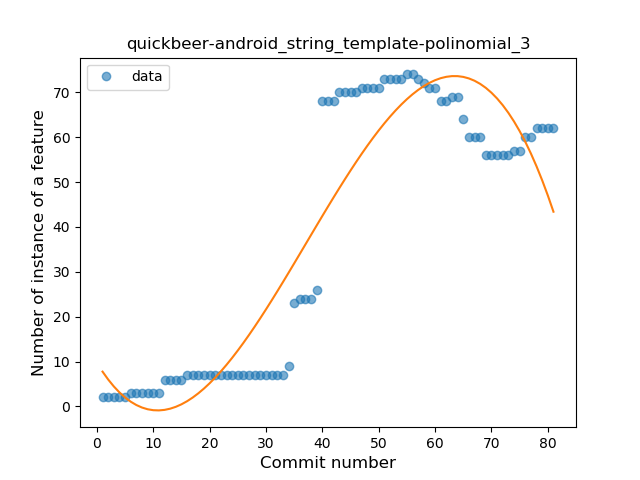

#### com-github-fractals
* Feature: Unsafe Call
* Function: 
* R_Squared: 0.86556076
 

#### com-uncmorfi
* Feature: Type Inference
* Function: )
* R_Squared: 0.86520215
 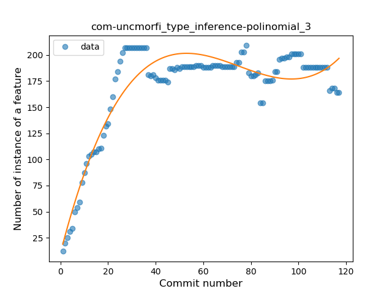

#### com-kgurgul-cpuinfo
* Feature: Lambda
* Function: )
* R_Squared: 0.86516555
 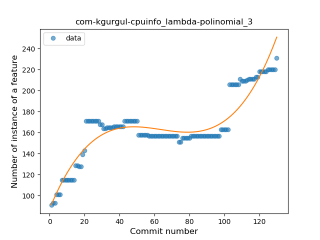

#### com-example-forgottenumbrella-cardboardmuseum
* Feature: String Template
* Function: )
* R_Squared: 0.86444932
 

#### io-github-hidroh-materialistic
* Feature: Lambda
* Function: )
* R_Squared: 0.86376652
 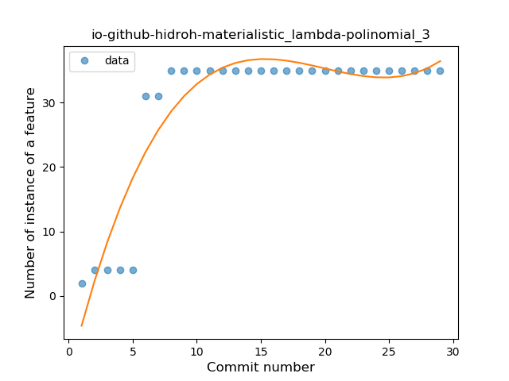

#### me-camsteffen-polite
* Feature: String Template
* Function: )
* R_Squared: 0.86352161
 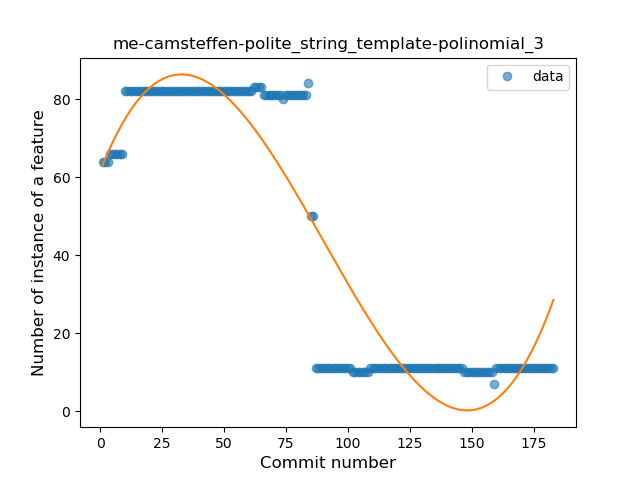

#### com-brentpanther-bitcoinwidget
* Feature: Unsafe Call
* Function: )
* R_Squared: 0.86283848
 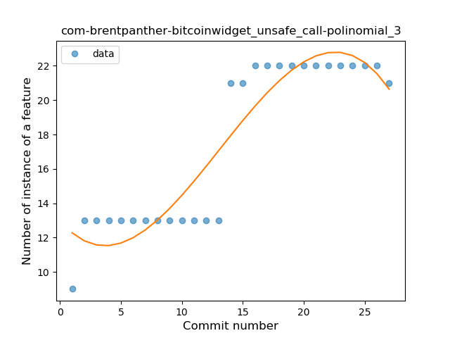

#### com-emmanuelmess-simplecleanup
* Feature: String Template
* Function: 
* R_Squared: 0.86249008
 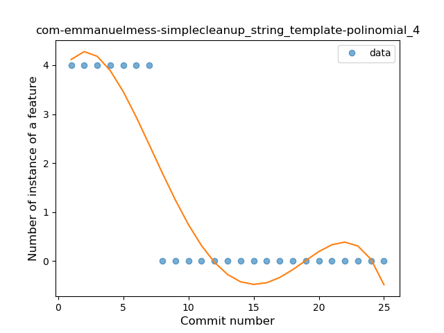

#### io-wookey-wallet
* Feature: Unsafe Call
* Function: 
* R_Squared: 0.86090793
 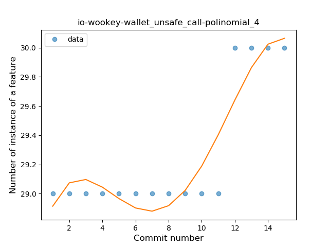

#### io-wookey-wallet
* Feature: Function call with Named Argument
* Function: 
* R_Squared: 0.86090793
 

#### org-mcxa-vortaro
* Feature: Type Inference
* Function: 
* R_Squared: 0.86040108
 

#### com-tomer-draw
* Feature: Function with Default Value
* Function: )
* R_Squared: 0.85885812
 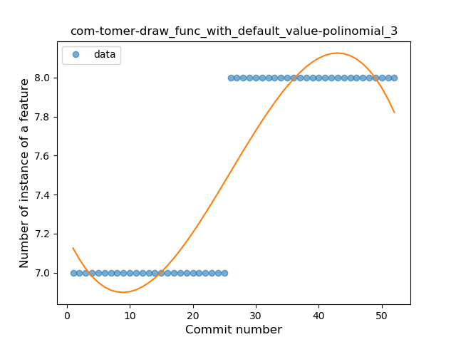

#### quickbeer-android
* Feature: Extension Function
* Function: )
* R_Squared: 0.85881224
 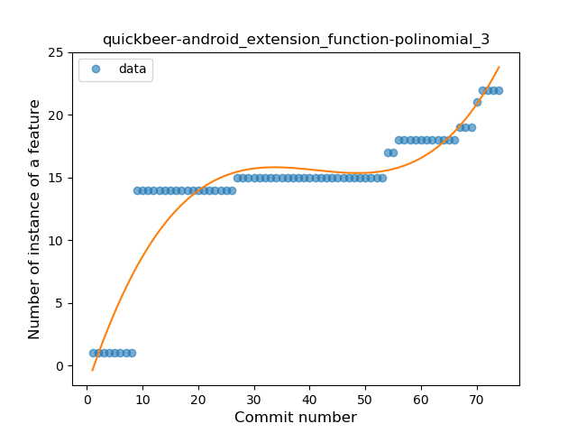

#### com-github-fractals
* Feature: Safe Call
* Function: )
* R_Squared: 0.85833956
 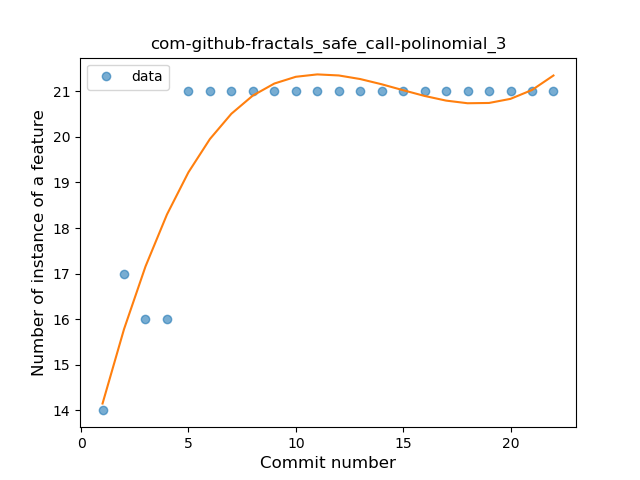

#### com-manoj-dlt
* Feature: Singleton
* Function: )
* R_Squared: 0.85756743
 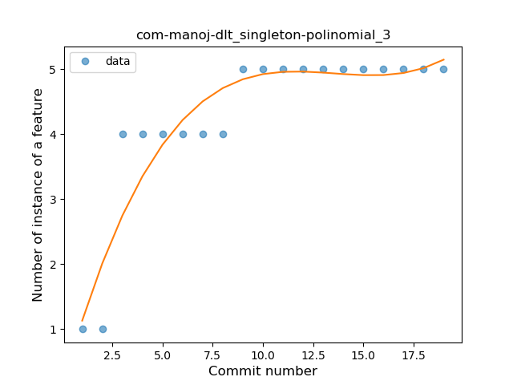

#### co-garmax-materialflashlight
* Feature: Unsafe Call
* Function: )
* R_Squared: 0.85717983
 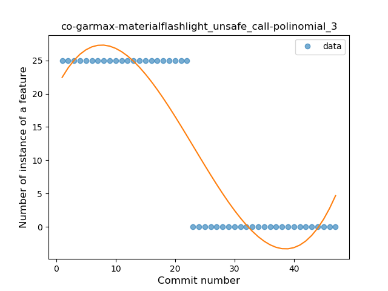

#### pl-poznajapp
* Feature: When expression
* Function: )
* R_Squared: 0.85708865
 

#### nl-brouwerijdemolen-borefts2013
* Feature: Function with Default Value
* Function: )
* R_Squared: 0.85669415
 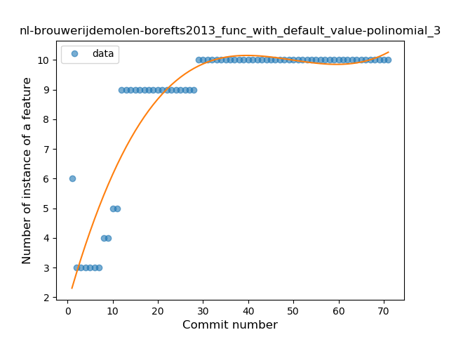

#### com-example-forgottenumbrella-cardboardmuseum
* Feature: Function call with Named Argument
* Function: )
* R_Squared: 0.85642066
 

#### co-timecrypt-android
* Feature: Lambda
* Function: )
* R_Squared: 0.85571322
 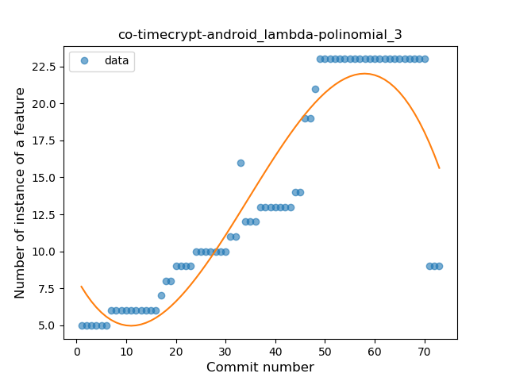

#### jp-org-example-geckour-glyph
* Feature: Unsafe Call
* Function: )
* R_Squared: 0.85474723
 

#### com-aaplab-bakubus
* Feature: Safe Call
* Function: 
* R_Squared: 0.85396082
 

#### com-github-laurenttreguier-deck
* Feature: Safe Call
* Function: )
* R_Squared: 0.85359093
 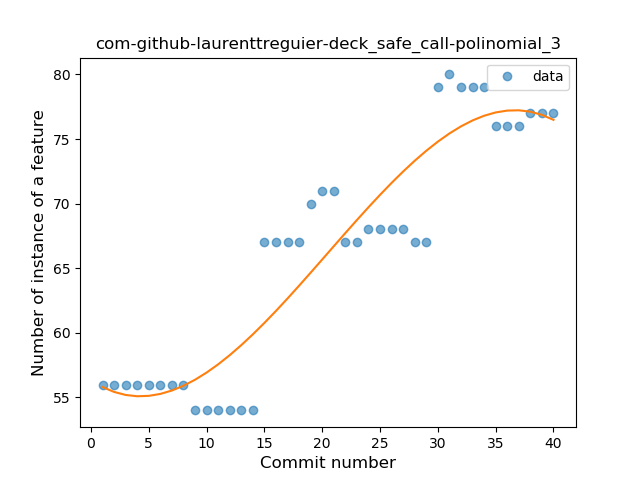

#### org-projectbass-bass
* Feature: Safe Call
* Function: )
* R_Squared: 0.85341098
 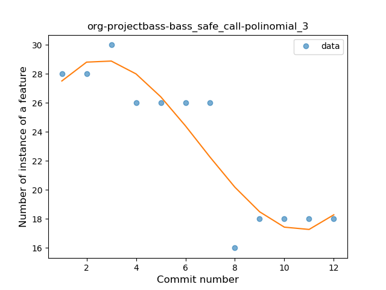

#### xyz-koleno-sunwidget
* Feature: Lambda
* Function: 
* R_Squared: 0.85175439
 

#### de-micmun-android-deufeitage
* Feature: Range Expression
* Function: )
* R_Squared: 0.85098663
 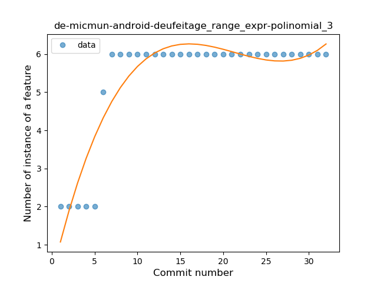

#### pt-joaomneto-titancompanion
* Feature: String Template
* Function: )
* R_Squared: 0.85062945
 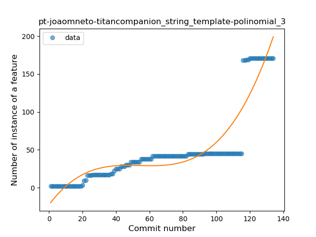

#### com-rhm-pwn
* Feature: Sealed Class
* Function: )
* R_Squared: 0.85059652
 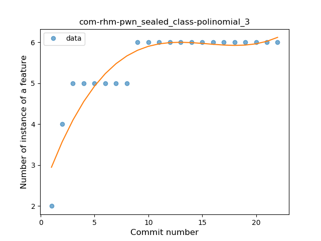

#### by-toggi-rxbsuir
* Feature: Data Class
* Function: )
* R_Squared: 0.84913773
 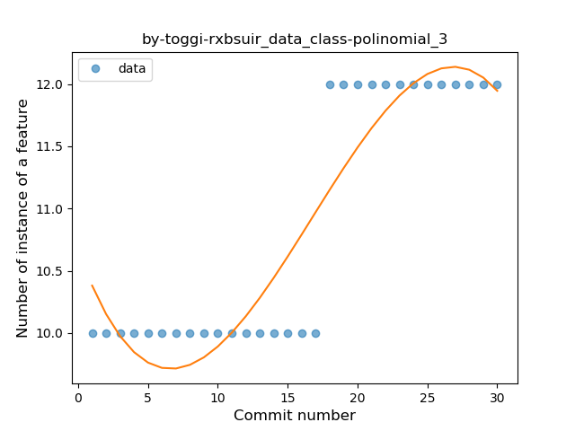

#### com-alderferstudios-handandfootscores
* Feature: Safe Call
* Function: 
* R_Squared: 0.84847026
 

#### ru-nsu-bobrofon-easysshfs
* Feature: String Template
* Function: 
* R_Squared: 0.84721963
 

#### me-impa-knockonports
* Feature: Extension Function
* Function: 
* R_Squared: 0.84698653
 

#### saschpe-poker
* Feature: Type Inference
* Function: 
* R_Squared: 0.84632782
 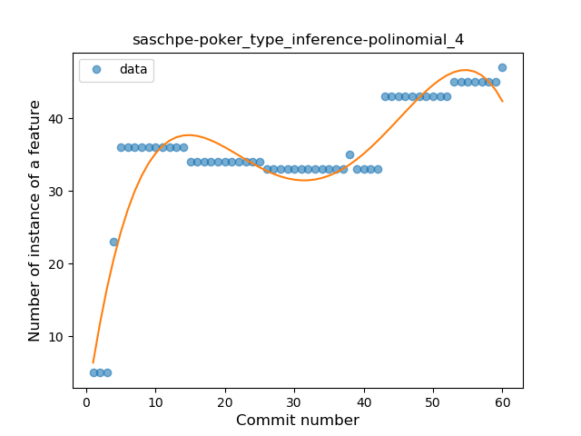

#### com-kanedias-vanilla-metadata
* Feature: Type Inference
* Function: )
* R_Squared: 0.84615385
 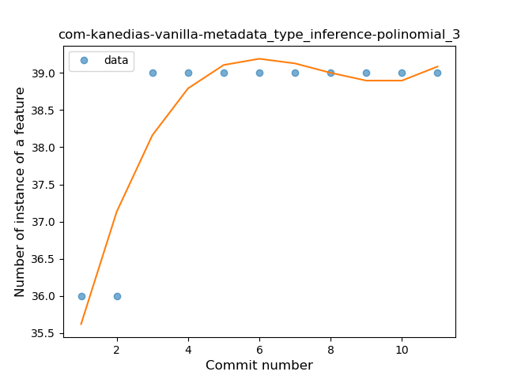

#### com-kanedias-vanilla-metadata
* Feature: Lambda
* Function: )
* R_Squared: 0.84615385
 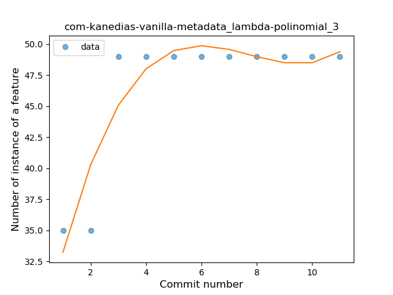

#### com-kanedias-vanilla-metadata
* Feature: Safe Call
* Function: )
* R_Squared: 0.84615385
 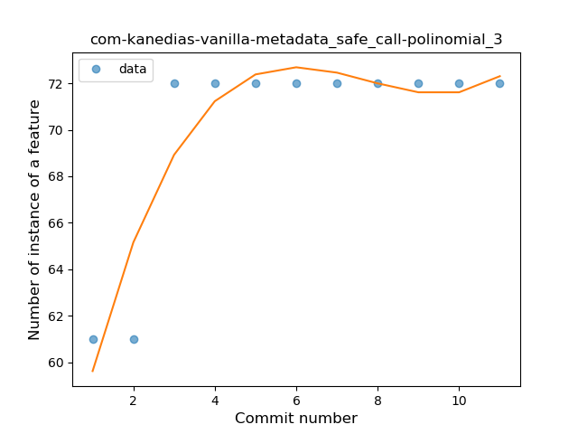

#### co-garmax-materialflashlight
* Feature: Safe Call
* Function: )
* R_Squared: 0.84562418
 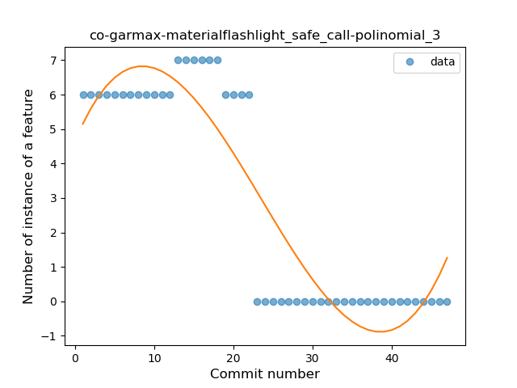

#### org-decsync-sparss-floss
* Feature: Lambda
* Function: )
* R_Squared: 0.84429458
 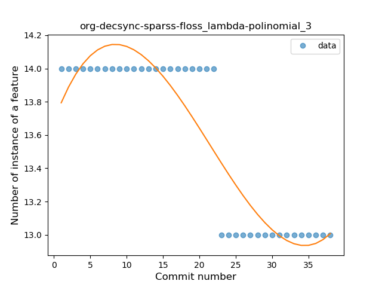

#### org-decsync-sparss-floss
* Feature: When expression
* Function: )
* R_Squared: 0.84429458
 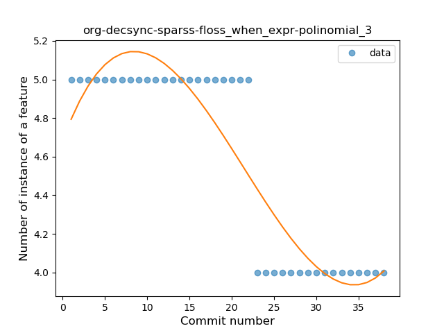

#### de-cineaste-android
* Feature: Coroutine
* Function: )
* R_Squared: 0.84404093
 

#### io-mkg20001-arubanetworkslogin
* Feature: Lambda
* Function: )
* R_Squared: 0.8440351
 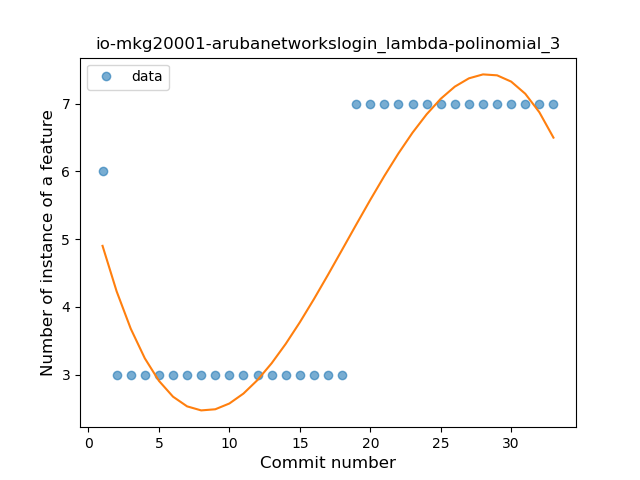

#### jp-org-example-geckour-glyph
* Feature: Function with Default Value
* Function: )
* R_Squared: 0.84359537
 

#### nl-brouwerijdemolen-borefts2013
* Feature: Data Class
* Function: )
* R_Squared: 0.84259209
 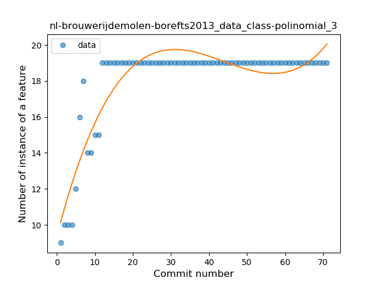

#### me-siketyan-silicagel
* Feature: Type Inference
* Function: 
* R_Squared: 0.84210526
 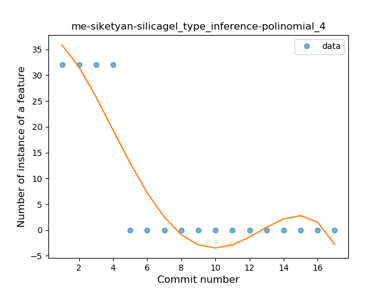

#### ch-rmy-android-statusbar_tacho
* Feature: Lambda
* Function: 
* R_Squared: 0.84210526
 

#### me-siketyan-silicagel
* Feature: Lambda
* Function: 
* R_Squared: 0.84210526
 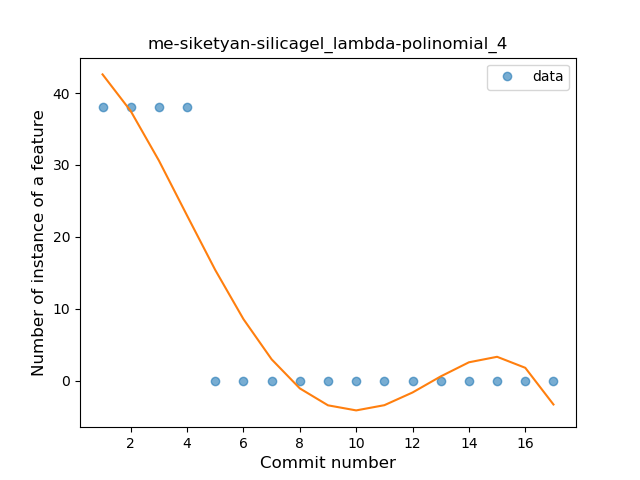

#### me-siketyan-silicagel
* Feature: Safe Call
* Function: 
* R_Squared: 0.84210526
 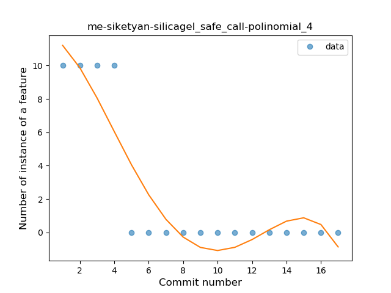

#### me-siketyan-silicagel
* Feature: String Template
* Function: 
* R_Squared: 0.84210526
 

#### me-siketyan-silicagel
* Feature: Function with Default Value
* Function: 
* R_Squared: 0.84210526
 

#### me-siketyan-silicagel
* Feature: Extension Function
* Function: 
* R_Squared: 0.84210526
 

#### me-siketyan-silicagel
* Feature: Inline Function
* Function: 
* R_Squared: 0.84210526
 

#### com-njlabs-showjava
* Feature: Smart Cast
* Function: )
* R_Squared: 0.84205956
 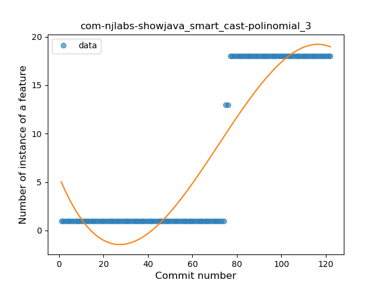

#### org-anibyl-slounik
* Feature: Unsafe Call
* Function: )
* R_Squared: 0.84174958
 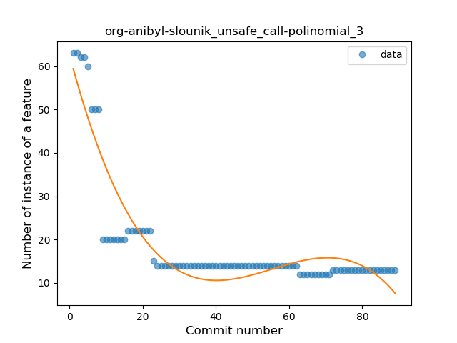

#### com-emmanuelmess-simplecleanup
* Feature: Companion Object
* Function: 
* R_Squared: 0.84130954
 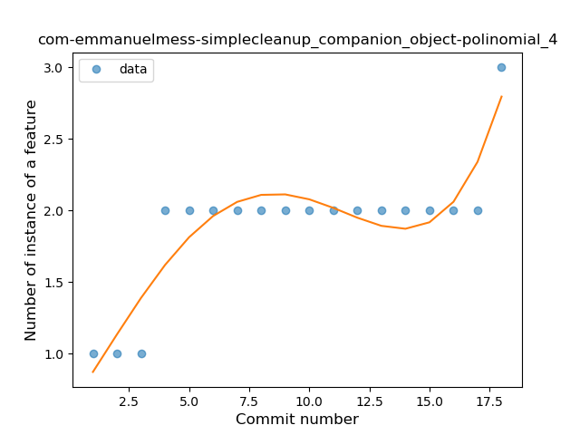

#### com-ninjahoahong-unstoppable
* Feature: Range Expression
* Function: )
* R_Squared: 0.83928571
 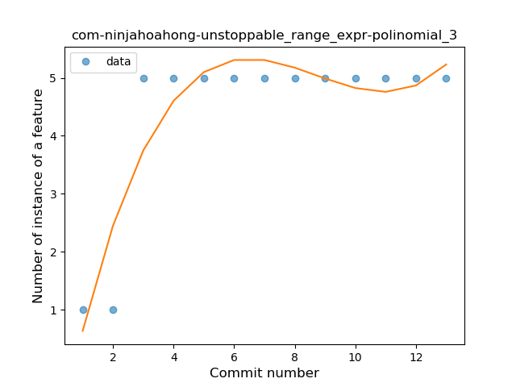

#### college-wyk-app
* Feature: Companion Object
* Function: 
* R_Squared: 0.83873518
 

#### college-wyk-app
* Feature: Function with Default Value
* Function: 
* R_Squared: 0.83873518
 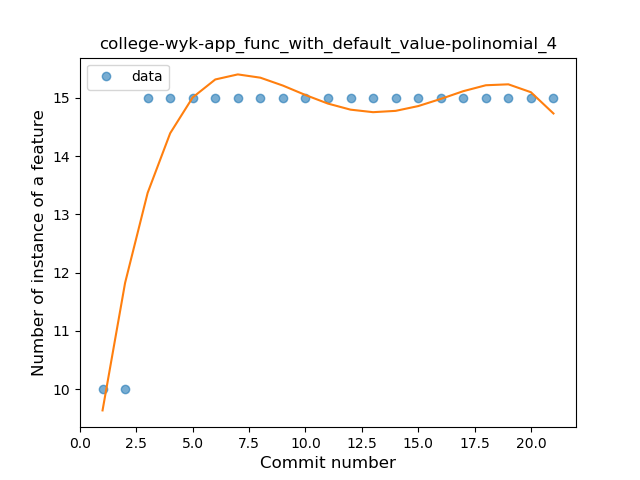

#### com-physphil-android-unitconverterultimate
* Feature: Sealed Class
* Function: 
* R_Squared: 0.83823529
 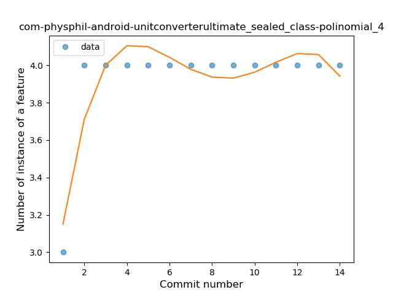

#### io-homeassistant-android
* Feature: Lambda
* Function: )
* R_Squared: 0.83769726
 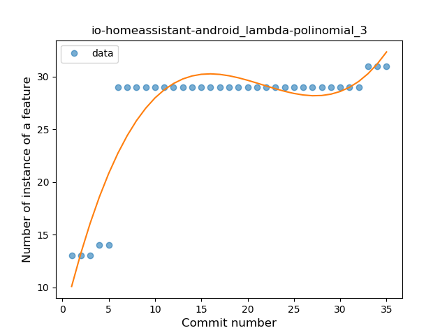

#### fr-insapp-insapp
* Feature: Range Expression
* Function: )
* R_Squared: 0.8362252
 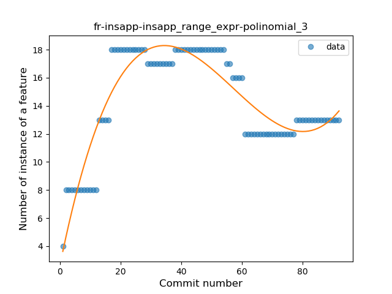

#### me-impa-knockonports
* Feature: Range Expression
* Function: )
* R_Squared: 0.83593423
 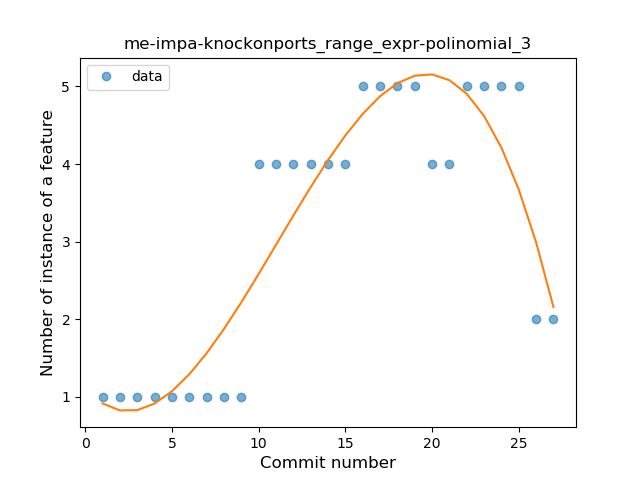

#### io-homeassistant-android
* Feature: Singleton
* Function: )
* R_Squared: 0.8341639
 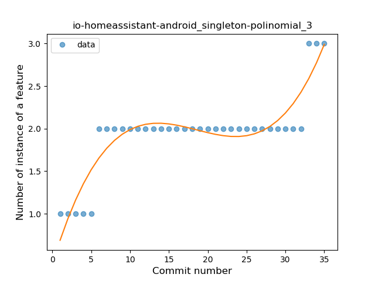

#### com-tumblr-svetylk0-sheepsgohome-android
* Feature: Property Delegation
* Function: )
* R_Squared: 0.83406973
 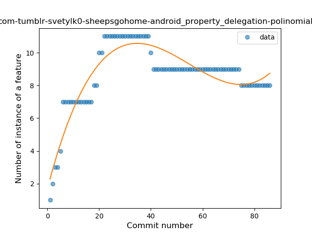

#### com-defianttech-convertme
* Feature: Unsafe Call
* Function: 
* R_Squared: 0.83307676
 

#### college-wyk-app
* Feature: Safe Call
* Function: 
* R_Squared: 0.83185768
 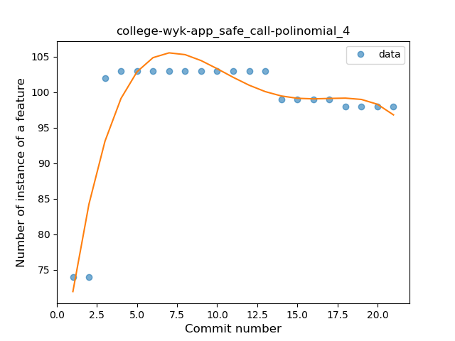

#### pixel-kotlin-bassblog
* Feature: Unsafe Call
* Function: )
* R_Squared: 0.83040004
 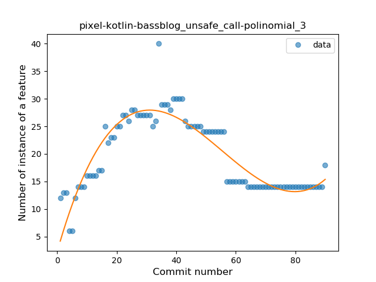

#### com-systemallica-valenbisi
* Feature: Unsafe Call
* Function: )
* R_Squared: 0.8303912
 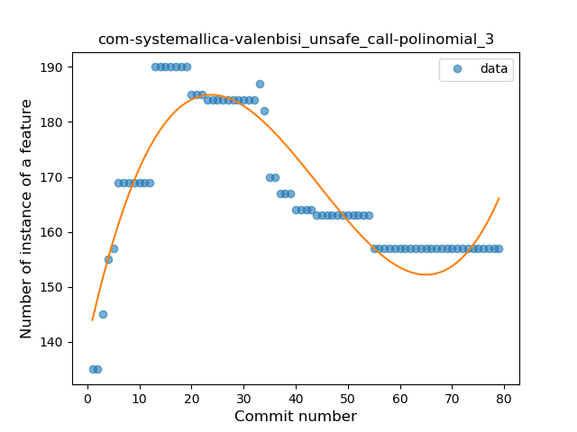

#### com-jim-sharetocomputer
* Feature: Data Class
* Function: )
* R_Squared: 0.83020828
 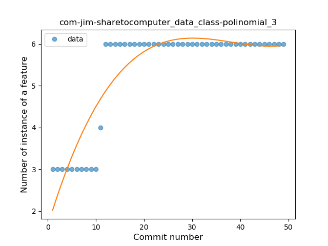

#### jp-org-example-geckour-glyph
* Feature: String Template
* Function: )
* R_Squared: 0.82804538
 

#### jp-org-example-geckour-glyph
* Feature: Property Delegation
* Function: )
* R_Squared: 0.82781285
 

#### science-apolline
* Feature: Function call with Named Argument
* Function: )
* R_Squared: 0.82757456
 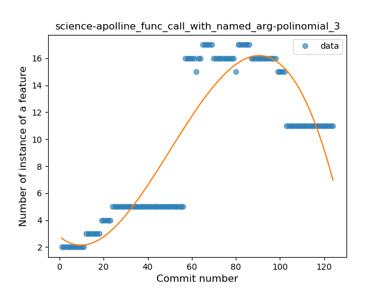

#### io-wookey-wallet
* Feature: Function with Default Value
* Function: )
* R_Squared: 0.82653254
 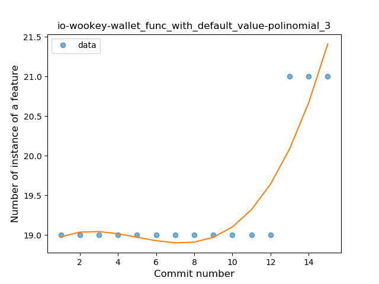

#### io-wookey-wallet
* Feature: Range Expression
* Function: )
* R_Squared: 0.82653254
 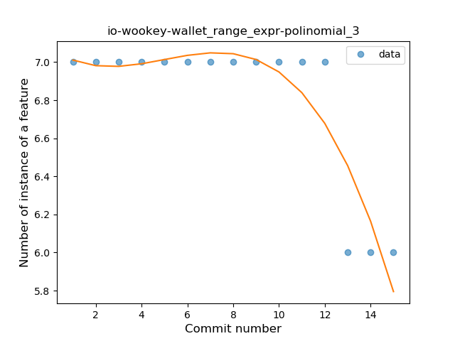

#### io-wookey-wallet
* Feature: Data Class
* Function: )
* R_Squared: 0.82653254
 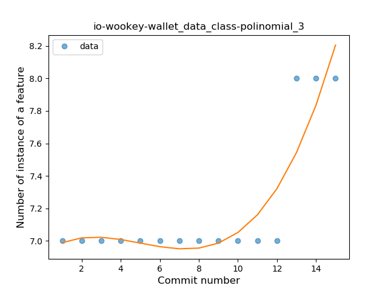

#### io-wookey-wallet
* Feature: Extension Function
* Function: )
* R_Squared: 0.82653254
 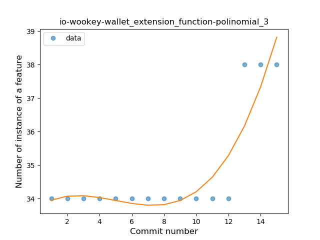

#### pw-janyo-whatanime
* Feature: Coroutine
* Function: 
* R_Squared: 0.82438914
 

#### org-thiolliere-youtubestream
* Feature: Unsafe Call
* Function: 
* R_Squared: 0.82335068
 

#### co-garmax-materialflashlight
* Feature: Companion Object
* Function: )
* R_Squared: 0.82295895
 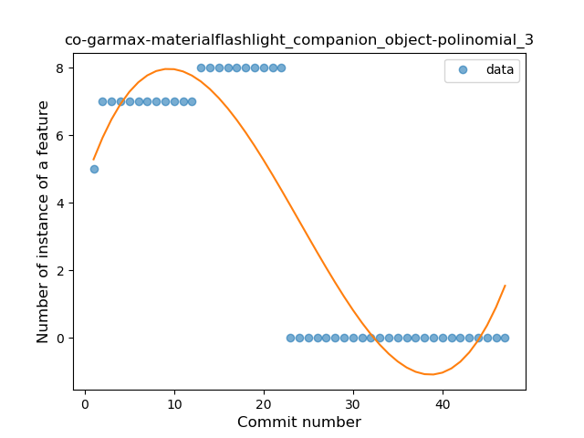

#### com-aaplab-bakubus
* Feature: Range Expression
* Function: )
* R_Squared: 0.8229566
 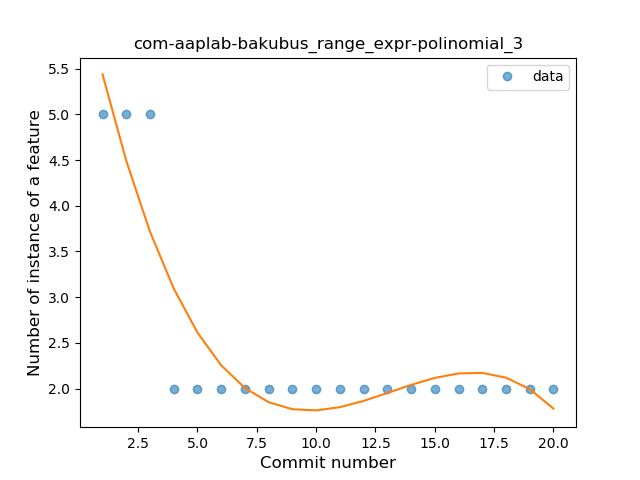

#### com-aaplab-bakubus
* Feature: Destructuring Declaration
* Function: )
* R_Squared: 0.8229566
 

#### nl-renedegroot-android-adbawake
* Feature: Safe Call
* Function: )
* R_Squared: 0.82281004
 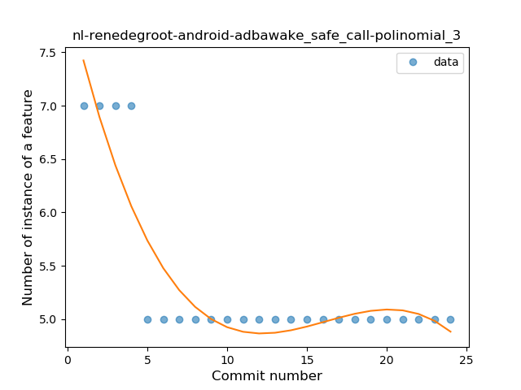

#### nl-renedegroot-android-adbawake
* Feature: Companion Object
* Function: )
* R_Squared: 0.82281004
 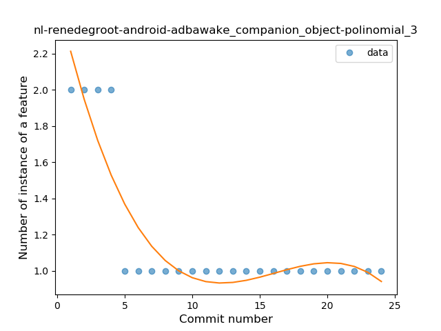

#### com-heed-justquotes
* Feature: Lambda
* Function: )
* R_Squared: 0.82161498
 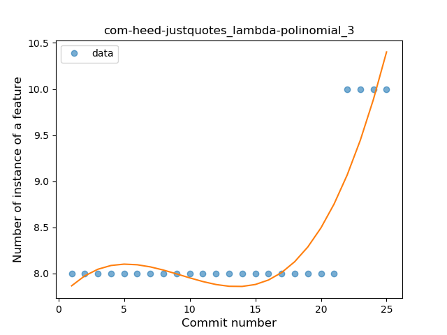

#### com-cookiegames-smartcookie
* Feature: Function call with Named Argument
* Function: 
* R_Squared: 0.82050585
 

#### de-micmun-android-deufeitage
* Feature: Unsafe Call
* Function: )
* R_Squared: 0.81837217
 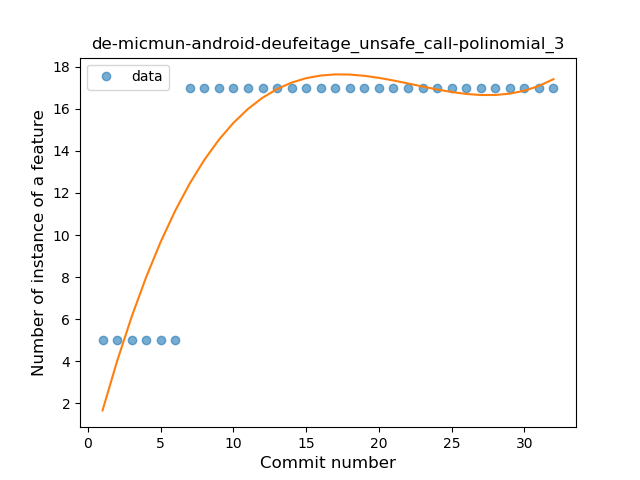

#### de-grobox-liberario
* Feature: Function call with Named Argument
* Function: )
* R_Squared: 0.81799352
 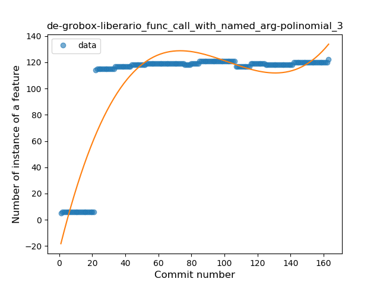

#### com-rhm-pwn
* Feature: Unsafe Call
* Function: )
* R_Squared: 0.81728875
 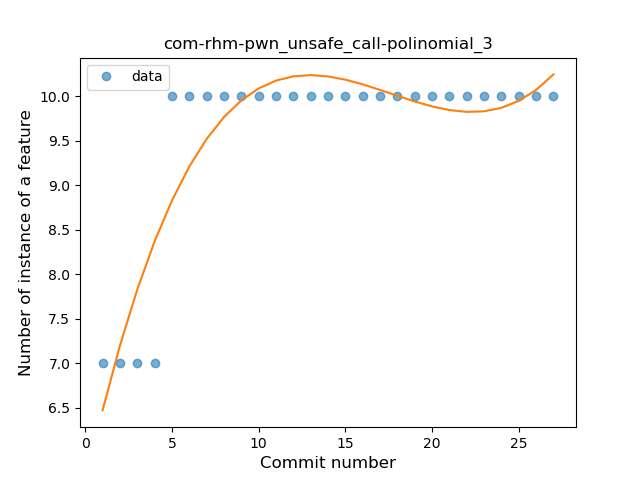

#### de-devmil-muzei-bingimageofthedayartsource
* Feature: Lambda
* Function: )
* R_Squared: 0.81713505
 

#### nl-renedegroot-android-adbawake
* Feature: When expression
* Function: )
* R_Squared: 0.81581703
 

#### com-brentpanther-bitcoinwidget
* Feature: Safe Call
* Function: 
* R_Squared: 0.81318616
 

#### org-anibyl-slounik
* Feature: Property Delegation
* Function: )
* R_Squared: 0.81279175
 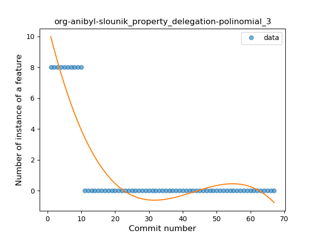

#### com-manoj-dlt
* Feature: Unsafe Call
* Function: 
* R_Squared: 0.81267879
 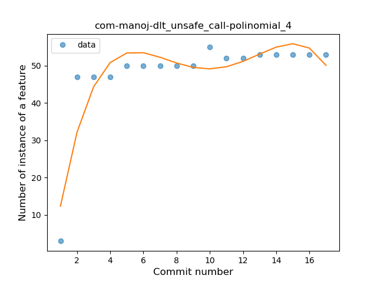

#### de-micmun-android-deufeitage
* Feature: When expression
* Function: 
* R_Squared: 0.81223915
 

#### com-pixplicity-cryptogram
* Feature: Type Inference
* Function: )
* R_Squared: 0.81177643
 

#### com-aaplab-bakubus
* Feature: Type Inference
* Function: )
* R_Squared: 0.81176656
 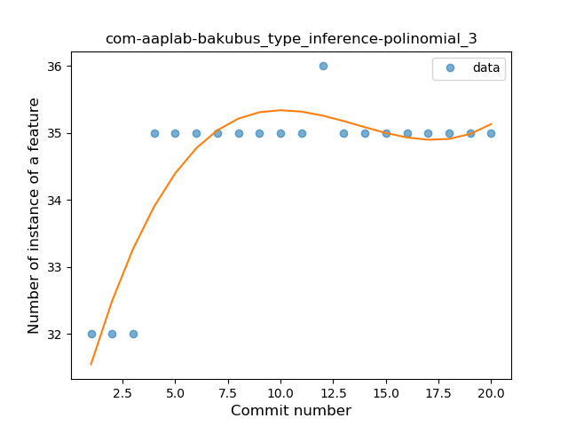

#### com-example-forgottenumbrella-cardboardmuseum
* Feature: Inline Function
* Function: )
* R_Squared: 0.81124232
 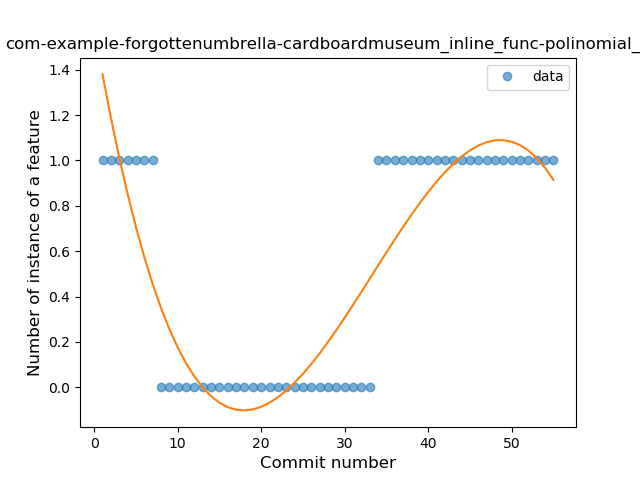

#### me-impa-knockonports
* Feature: Function with Default Value
* Function: 
* R_Squared: 0.81113851
 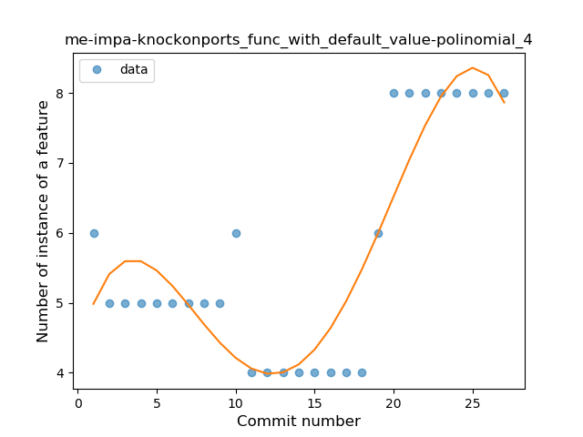

#### co-pxhouse-sas
* Feature: Singleton
* Function: )
* R_Squared: 0.81061596
 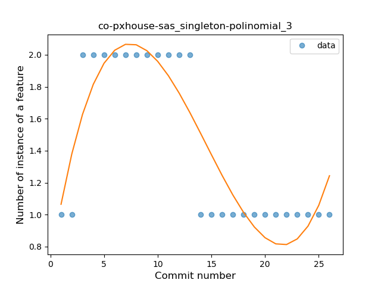

#### com-jidogoon-roundedscreen
* Feature: Unsafe Call
* Function: 
* R_Squared: 0.8105442
 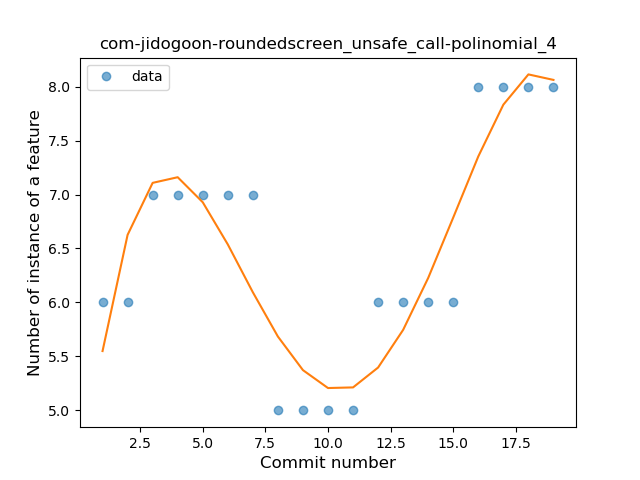

#### pl-poznajapp
* Feature: Lambda
* Function: 
* R_Squared: 0.80943925
 

#### com-cookiegames-smartcookie
* Feature: Extension Function
* Function: 
* R_Squared: 0.80854449
 

#### de-devmil-muzei-bingimageofthedayartsource
* Feature: Unsafe Call
* Function: )
* R_Squared: 0.80824608
 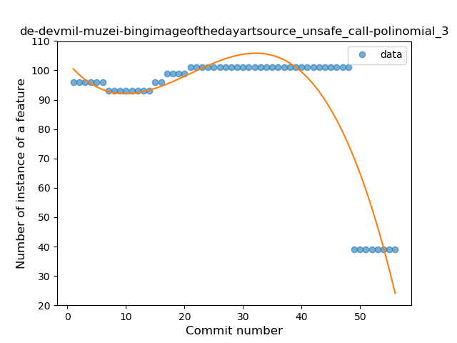

#### me-impa-knockonports
* Feature: Data Class
* Function: 
* R_Squared: 0.80769228
 

#### io-github-umren-watcher
* Feature: String Template
* Function: )
* R_Squared: 0.80674605
 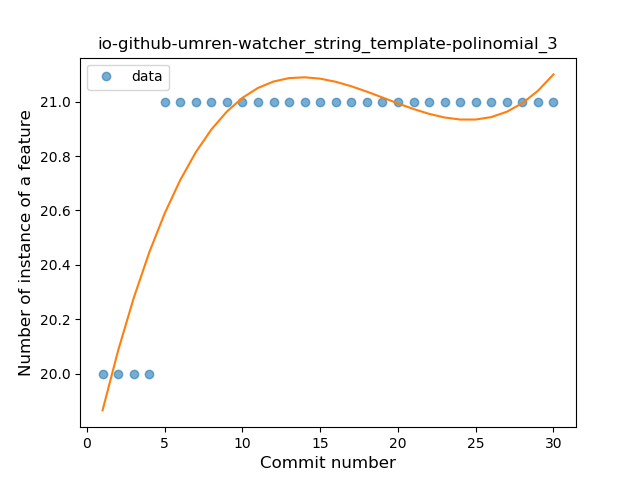

#### com-kgurgul-cpuinfo
* Feature: Property Delegation
* Function: )
* R_Squared: 0.80673721
 

#### io-mkg20001-arubanetworkslogin
* Feature: String Template
* Function: 
* R_Squared: 0.80315737
 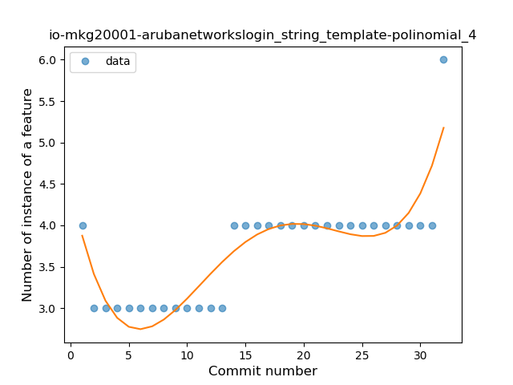

#### com-tumblr-svetylk0-sheepsgohome-android
* Feature: Smart Cast
* Function: )
* R_Squared: 0.80179345
 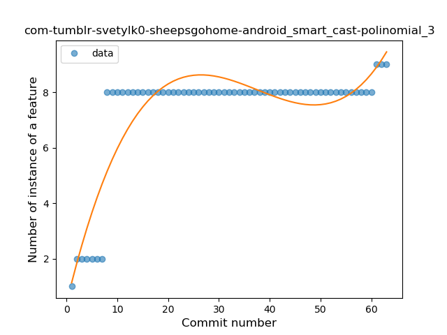

#### me-rei_m-hyakuninisshu
* Feature: Companion Object
* Function: )
* R_Squared: 0.80175685
 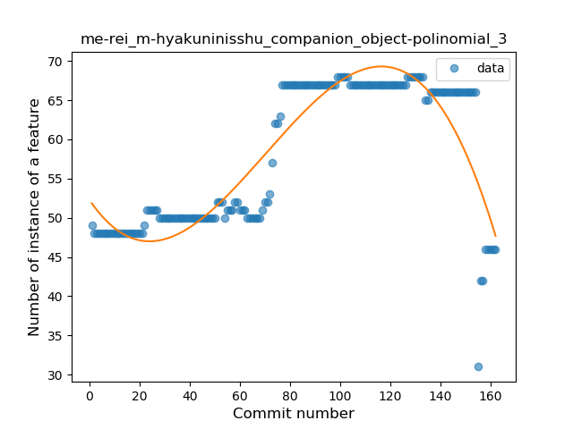

#### de-devmil-muzei-bingimageofthedayartsource
* Feature: Type Inference
* Function: 
* R_Squared: 0.80089981
 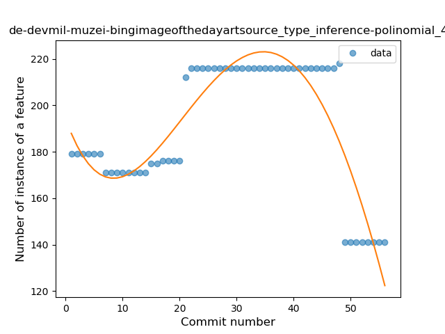

#### org-decsync-cc
* Feature: Singleton
* Function: )
* R_Squared: 0.79967965
 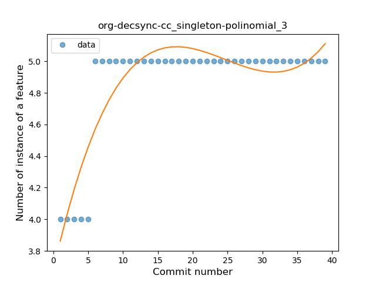

#### com-benoitletondor-easybudgetapp
* Feature: Extension Function
* Function: )
* R_Squared: 0.79715892
 

#### danbroid-searchview
* Feature: String Template
* Function: 
* R_Squared: 0.79645914
 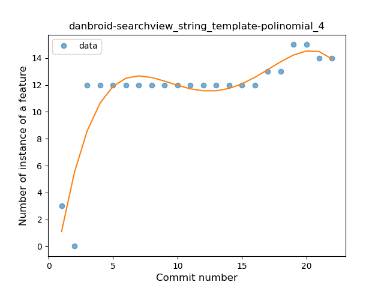

#### de-devmil-muzei-bingimageofthedayartsource
* Feature: Safe Call
* Function: )
* R_Squared: 0.79629849
 

#### ru-nsu-bobrofon-easysshfs
* Feature: Range Expression
* Function: 
* R_Squared: 0.79339525
 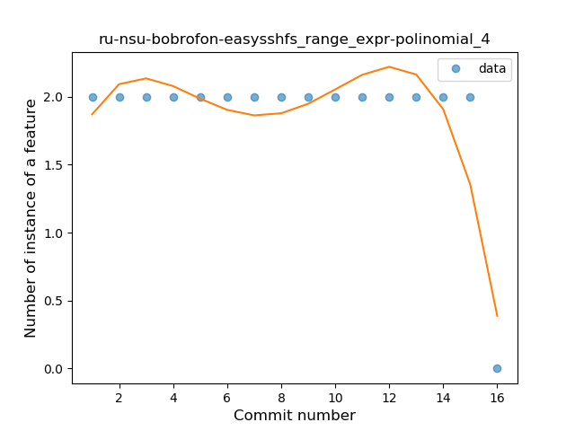

#### ru-nsu-bobrofon-easysshfs
* Feature: Smart Cast
* Function: 
* R_Squared: 0.79339525
 

#### ru-nsu-bobrofon-easysshfs
* Feature: Function call with Named Argument
* Function: 
* R_Squared: 0.79339525
 

#### com-calintat-units
* Feature: Type Inference
* Function: )
* R_Squared: 0.79233119
 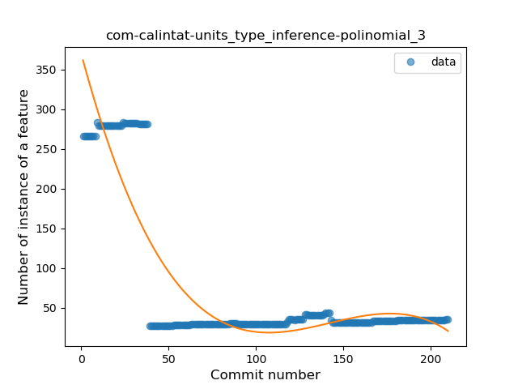

#### net-syncthing-lite
* Feature: Function with Default Value
* Function: )
* R_Squared: 0.79178583
 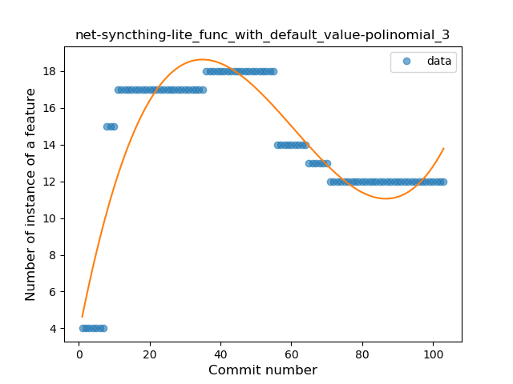

#### org-mattvchandler-a2050
* Feature: When expression
* Function: )
* R_Squared: 0.7874625
 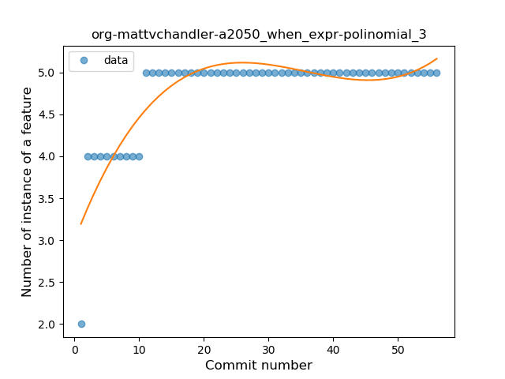

#### com-example-forgottenumbrella-cardboardmuseum
* Feature: Lambda
* Function: )
* R_Squared: 0.78724468
 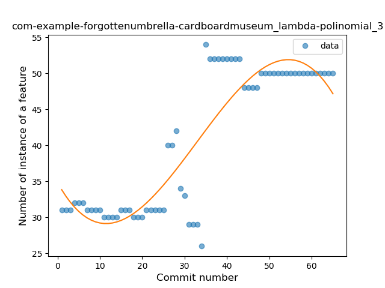

#### fi-tuska-jalkametri
* Feature: Unsafe Call
* Function: )
* R_Squared: 0.78623246
 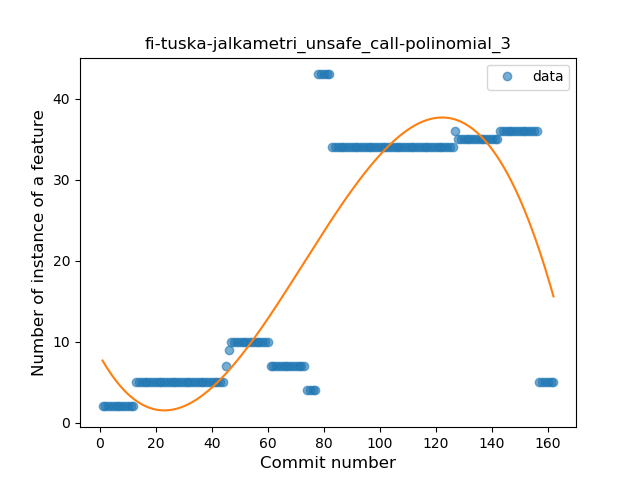

#### com-brentpanther-bitcoinwidget
* Feature: Type Inference
* Function: 
* R_Squared: 0.78619148
 

#### ru-nsu-bobrofon-easysshfs
* Feature: Type Inference
* Function: 
* R_Squared: 0.7853917
 

#### ru-nsu-bobrofon-easysshfs
* Feature: When expression
* Function: )
* R_Squared: 0.78266009
 

#### com-agusyc-daycounter
* Feature: Lambda
* Function: 
* R_Squared: 0.77666415
 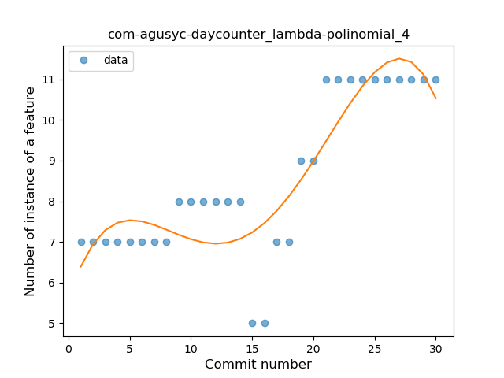

#### de-devmil-muzei-bingimageofthedayartsource
* Feature: Companion Object
* Function: )
* R_Squared: 0.77621305
 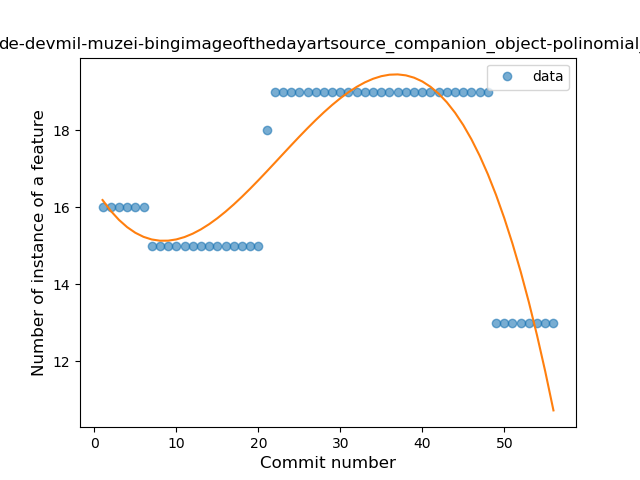

#### com-greenlionsoft-pollution-madrid
* Feature: Lambda
* Function: 
* R_Squared: 0.77580923
 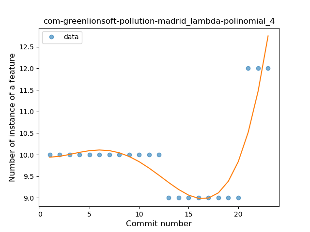

#### com-appspot-pistatium-mahougen
* Feature: String Template
* Function: )
* R_Squared: 0.77209718
 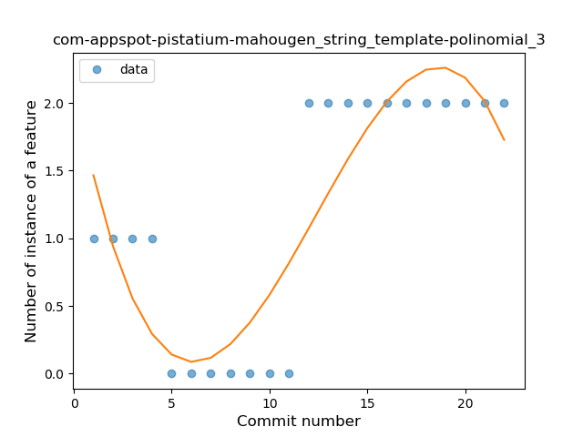

#### xyz-koleno-sunwidget
* Feature: Type Inference
* Function: 
* R_Squared: 0.77164701
 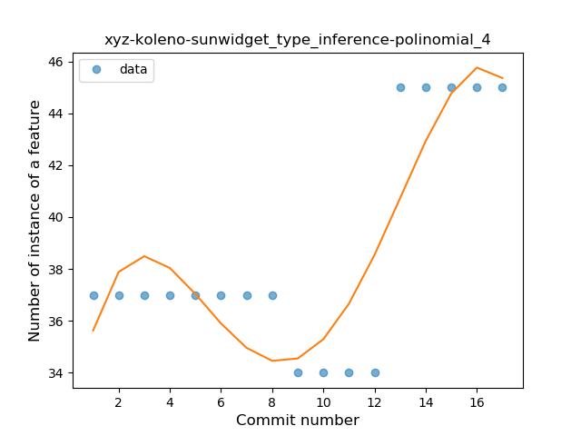

#### jp-org-example-geckour-glyph
* Feature: Type Inference
* Function: )
* R_Squared: 0.77044961
 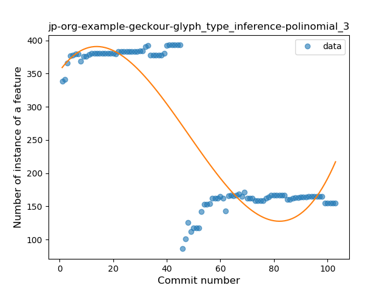

#### danbroid-searchview
* Feature: Property Delegation
* Function: 
* R_Squared: 0.7668603
 

#### com-pyamsoft-homebutton
* Feature: Sealed Class
* Function: )
* R_Squared: 0.76655206
 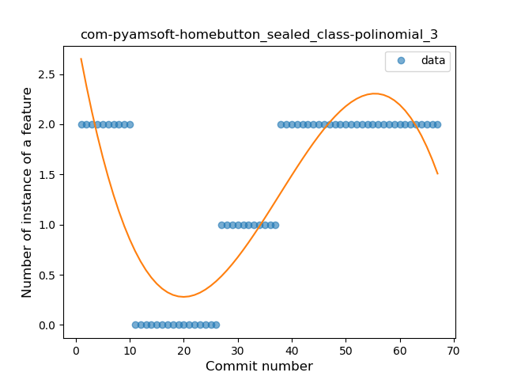

#### de-csicar-mensaplan
* Feature: Lambda
* Function: )
* R_Squared: 0.76586406
 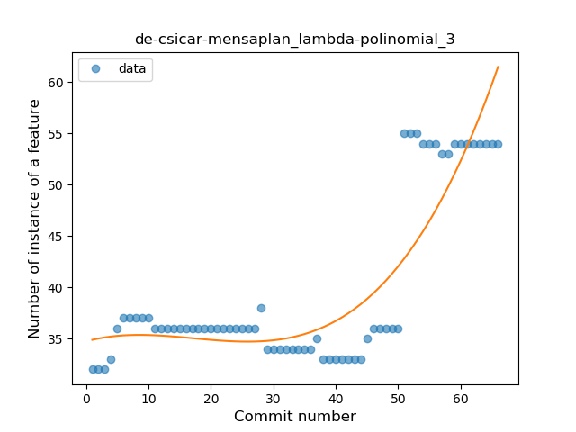

#### co-garmax-materialflashlight
* Feature: Type Inference
* Function: )
* R_Squared: 0.76444721
 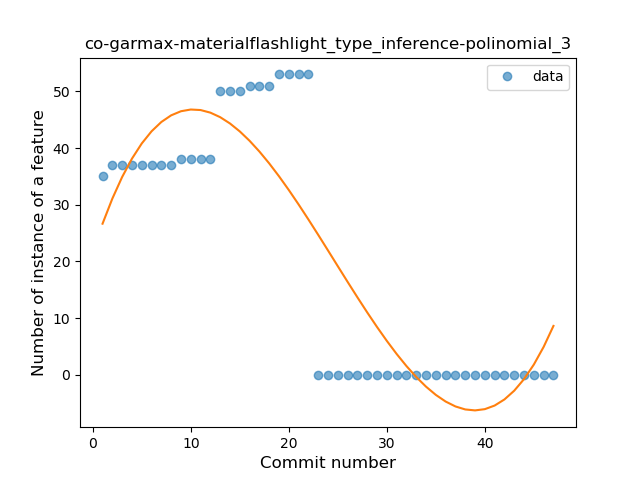

#### com-manoj-dlt
* Feature: Lambda
* Function: 
* R_Squared: 0.76003945
 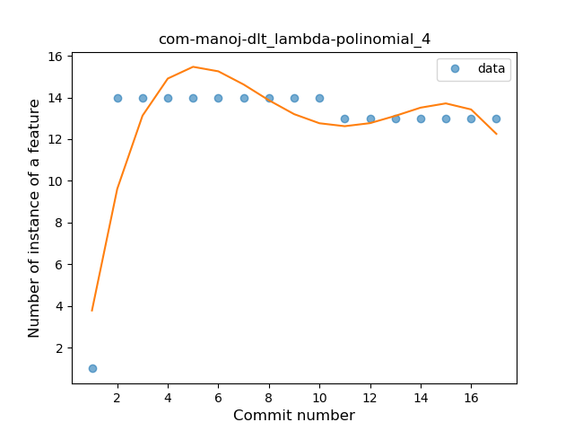

#### fr-insapp-insapp
* Feature: Data Class
* Function: 
* R_Squared: 0.75792138
 

#### io-github-z3r0c00l
* Feature: Unsafe Call
* Function: 
* R_Squared: 0.7558191
 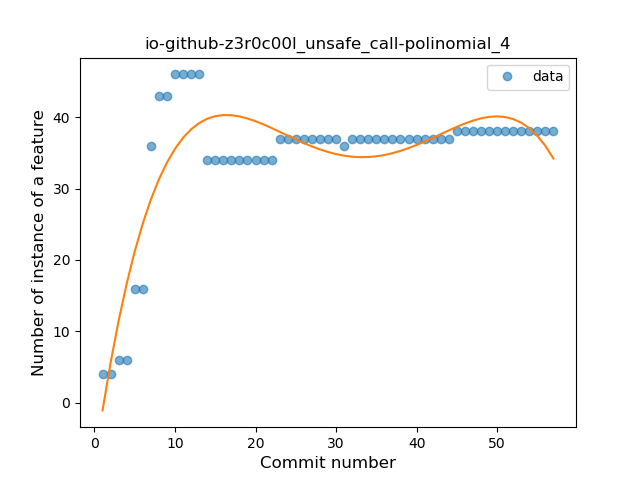

#### org-mcxa-vortaro
* Feature: String Template
* Function: 
* R_Squared: 0.75389378
 

#### com-brentpanther-bitcoinwidget
* Feature: Lambda
* Function: 
* R_Squared: 0.75231063
 

#### co-timecrypt-android
* Feature: Unsafe Call
* Function: )
* R_Squared: 0.75089764
 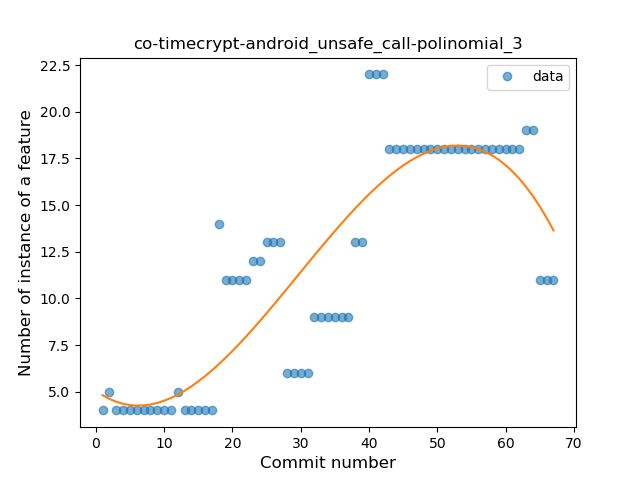

#### net-codechunk-speedofsound
* Feature: Type Inference
* Function: 
* R_Squared: 0.75053973
 

#### danbroid-searchview
* Feature: Lambda
* Function: 
* R_Squared: 0.7475203
 

#### app-opass-ccip
* Feature: Smart Cast
* Function: )
* R_Squared: 0.74400742
 

#### com-tomer-draw
* Feature: Safe Call
* Function: 
* R_Squared: 0.7437263
 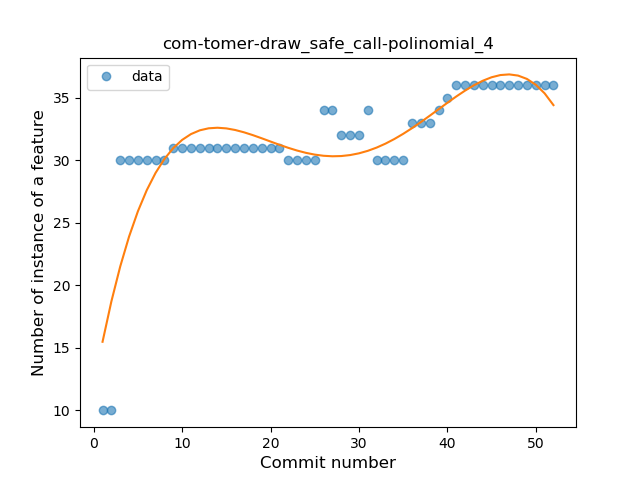

#### saschpe-poker
* Feature: Unsafe Call
* Function: 
* R_Squared: 0.74282883
 

#### danbroid-searchview
* Feature: When expression
* Function: 
* R_Squared: 0.74037672
 

#### de-micmun-android-deufeitage
* Feature: String Template
* Function: )
* R_Squared: 0.73602279
 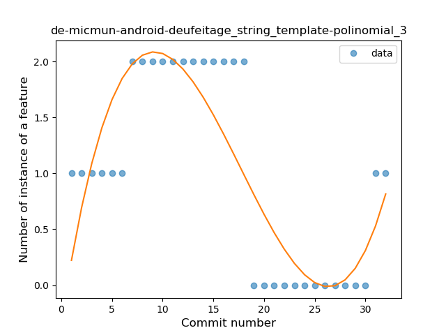

#### org-mcxa-vortaro
* Feature: Data Class
* Function: )
* R_Squared: 0.73541792
 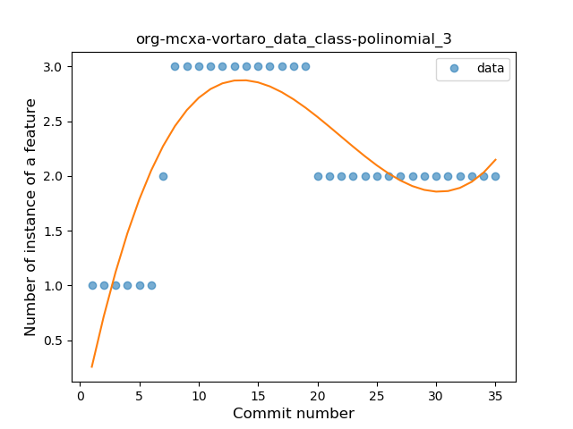

#### de-cineaste-android
* Feature: Type Inference
* Function: )
* R_Squared: 0.73176071
 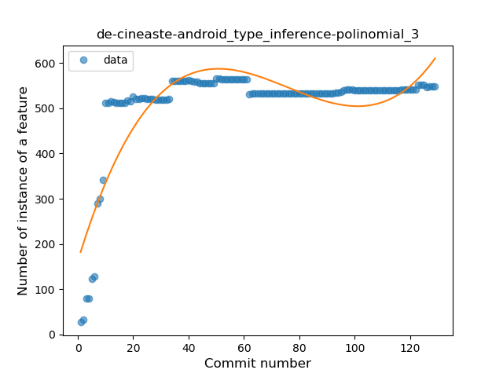

#### fr-xgouchet-packageexplorer
* Feature: Function call with Named Argument
* Function: )
* R_Squared: 0.72884872
 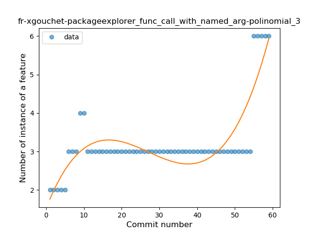

#### at-bitfire-icsdroid
* Feature: Safe Call
* Function: )
* R_Squared: 0.72702047
 

#### com-tumblr-svetylk0-sheepsgohome-android
* Feature: Range Expression
* Function: )
* R_Squared: 0.7264818
 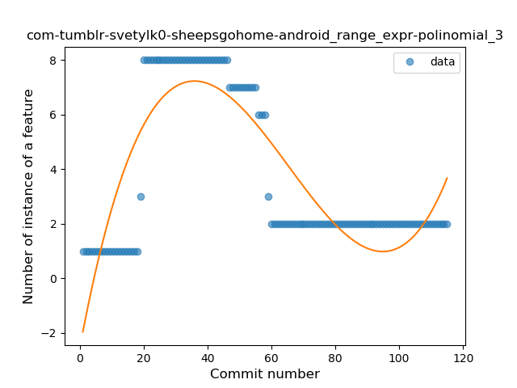

#### me-murks-feedwatcher
* Feature: String Template
* Function: )
* R_Squared: 0.72419554
 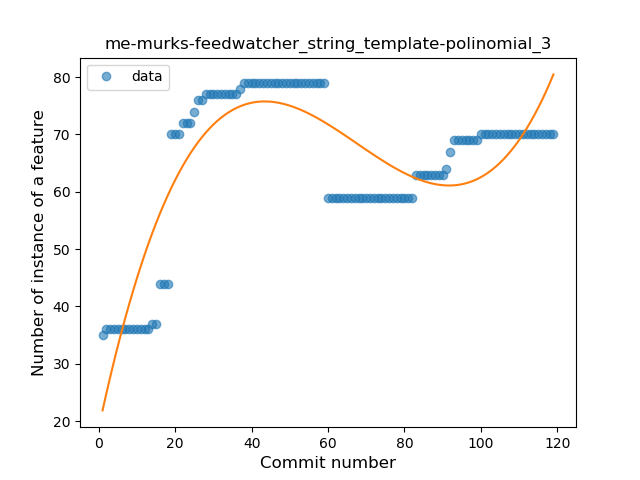

#### com-appspot-pistatium-mahougen
* Feature: Type Inference
* Function: 
* R_Squared: 0.72181957
 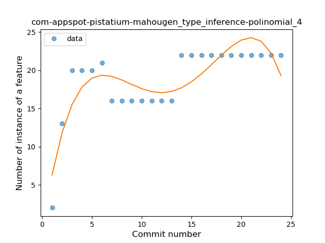

#### org-mattvchandler-a2050
* Feature: Lambda
* Function: )
* R_Squared: 0.7200302
 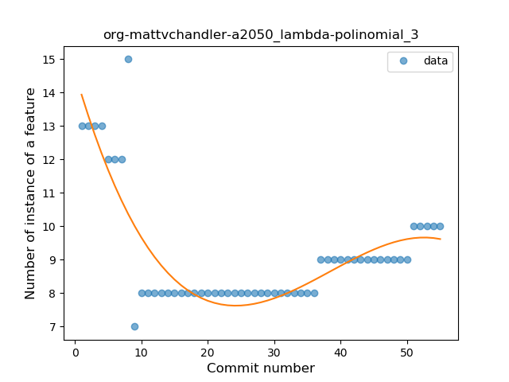

#### com-systemallica-valenbisi
* Feature: Type Inference
* Function: )
* R_Squared: 0.71989154
 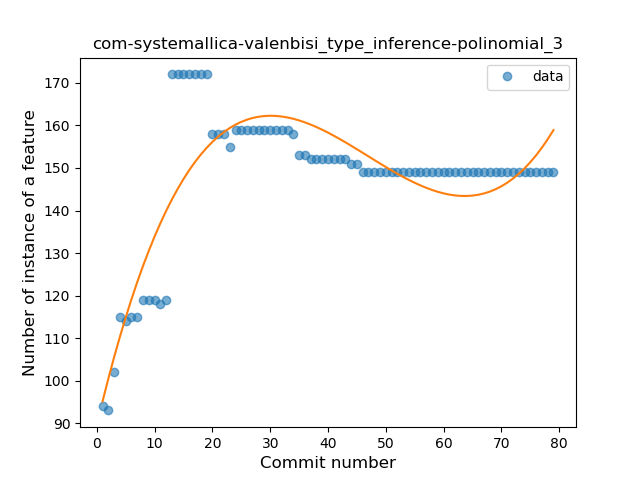

#### sreich-countthedays
* Feature: String Template
* Function: )
* R_Squared: 0.71940939
 

#### io-trewartha-positional
* Feature: Type Inference
* Function: )
* R_Squared: 0.71939126
 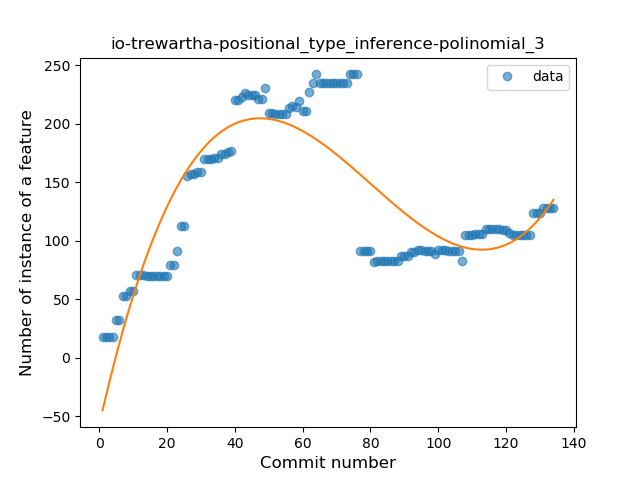

#### org-teamblueridge-pasteitapp
* Feature: Type Inference
* Function: 
* R_Squared: 0.71931162
 

#### com-jkcarino-ankieditor
* Feature: Safe Call
* Function: 
* R_Squared: 0.71815929
 

#### com-tumblr-svetylk0-sheepsgohome-android
* Feature: Safe Call
* Function: )
* R_Squared: 0.71617316
 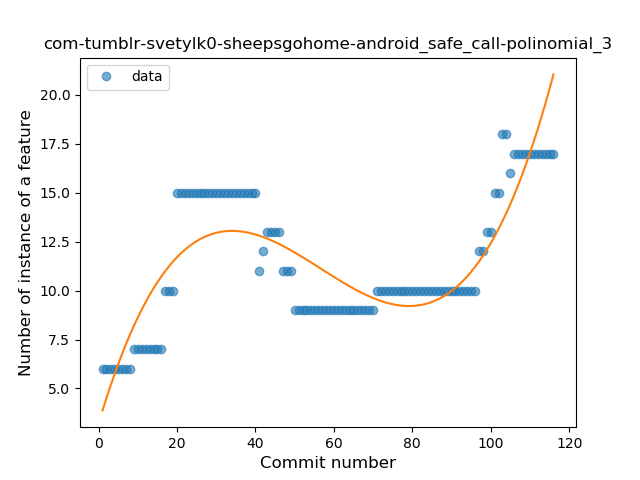

#### io-trewartha-positional
* Feature: Companion Object
* Function: )
* R_Squared: 0.71595155
 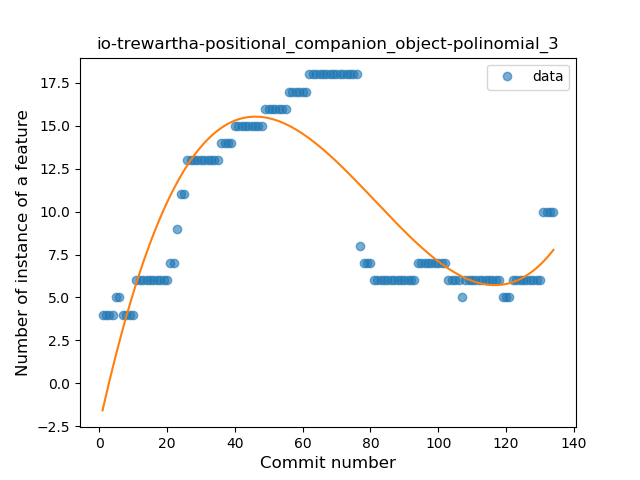

#### de-csicar-mensaplan
* Feature: When expression
* Function: )
* R_Squared: 0.71128918
 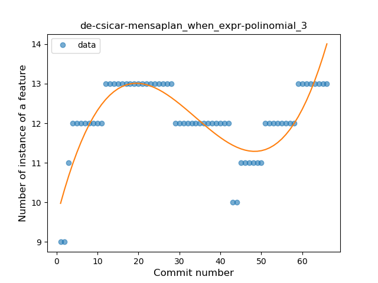

#### com-cookiegames-smartcookie
* Feature: Function with Default Value
* Function: )
* R_Squared: 0.71019481
 

#### com-cookiegames-smartcookie
* Feature: Inline Function
* Function: )
* R_Squared: 0.71019481
 

#### com-tomer-draw
* Feature: When expression
* Function: )
* R_Squared: 0.70977091
 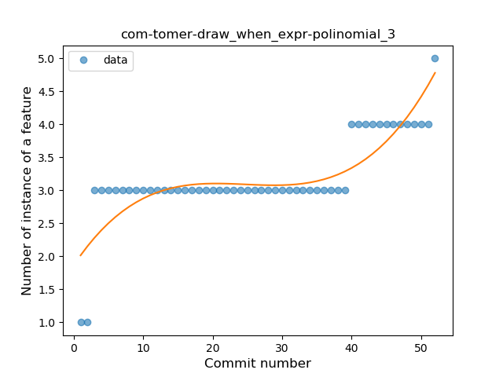

#### org-decsync-cc
* Feature: String Template
* Function: )
* R_Squared: 0.70662167
 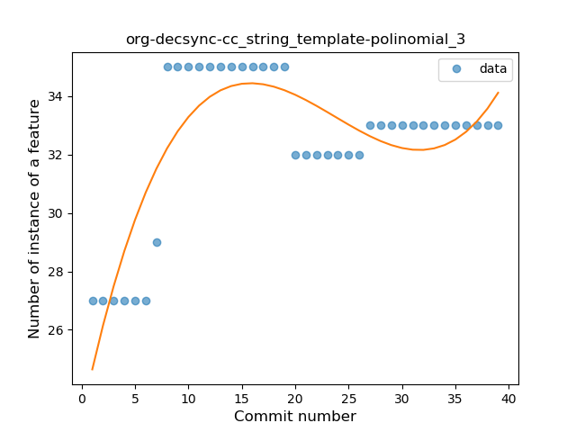

#### com-wbrawner-simplemarkdown
* Feature: Function with Default Value
* Function: )
* R_Squared: 0.70612679
 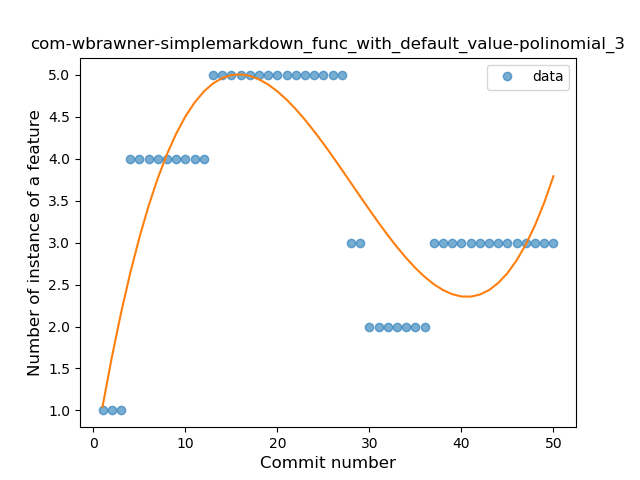

#### org-mcxa-vortaro
* Feature: Unsafe Call
* Function: )
* R_Squared: 0.70570412
 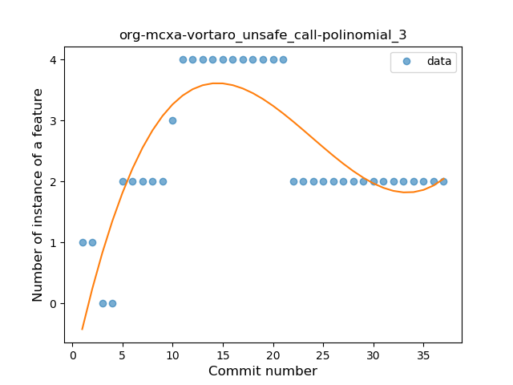

#### com-wbrawner-simplemarkdown
* Feature: Property Delegation
* Function: 
* R_Squared: 0.70260668
 

#### jp-org-example-geckour-glyph
* Feature: Safe Call
* Function: )
* R_Squared: 0.7015285
 

#### io-github-umren-watcher
* Feature: Type Inference
* Function: 
* R_Squared: 0.70097019
 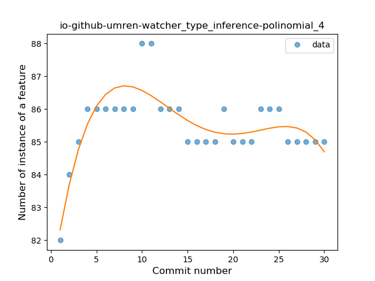

#### com-kgurgul-cpuinfo
* Feature: Companion Object
* Function: )
* R_Squared: 0.6940186
 

#### me-jfenn-alarmio
* Feature: Lambda
* Function: )
* R_Squared: 0.69396533
 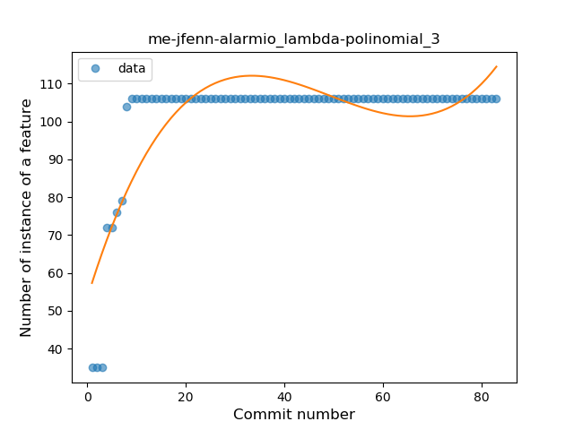

#### org-decsync-sparss-floss
* Feature: Type Inference
* Function: )
* R_Squared: 0.69115225
 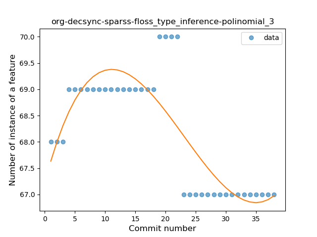

#### org-poul-bits-android
* Feature: Function with Default Value
* Function: )
* R_Squared: 0.67947676
 

#### com-heed-justquotes
* Feature: Type Inference
* Function: 
* R_Squared: 0.67816232
 

#### uk-colessoft-android-hilllist
* Feature: Inline Function
* Function: 
* R_Squared: 0.67250909
 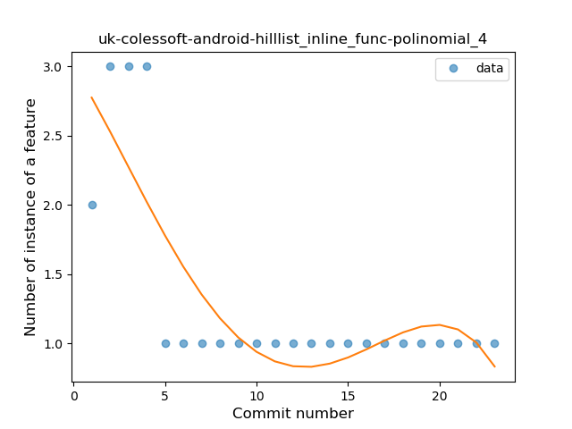

#### name-cantanima-chineseremainderclock
* Feature: Unsafe Call
* Function: 
* R_Squared: 0.67039312
 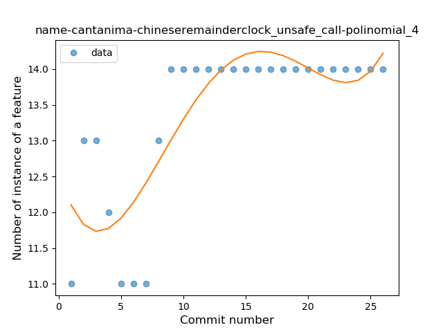

#### com-ahorcado
* Feature: Safe Call
* Function: 
* R_Squared: 0.66808807
 

#### net-syncthing-lite
* Feature: Unsafe Call
* Function: )
* R_Squared: 0.66680516
 

#### co-timecrypt-android
* Feature: Function with Default Value
* Function: )
* R_Squared: 0.66524871
 

#### com-appspot-pistatium-mahougen
* Feature: Companion Object
* Function: 
* R_Squared: 0.65897436
 

#### com-androidheads-vienna-escalero
* Feature: Smart Cast
* Function: 
* R_Squared: 0.65897436
 

#### me-jfenn-alarmio
* Feature: Safe Call
* Function: )
* R_Squared: 0.65684164
 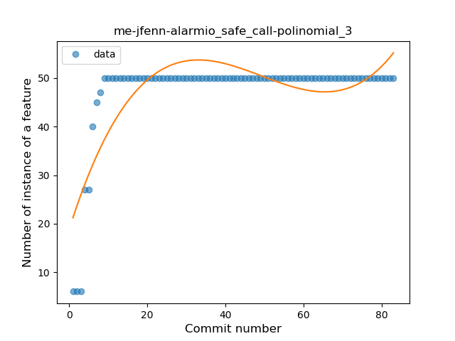

#### at-bitfire-icsdroid
* Feature: Unsafe Call
* Function: )
* R_Squared: 0.65172029
 

#### de-blankedv-lanbahnpanel
* Feature: Unsafe Call
* Function: )
* R_Squared: 0.65144086
 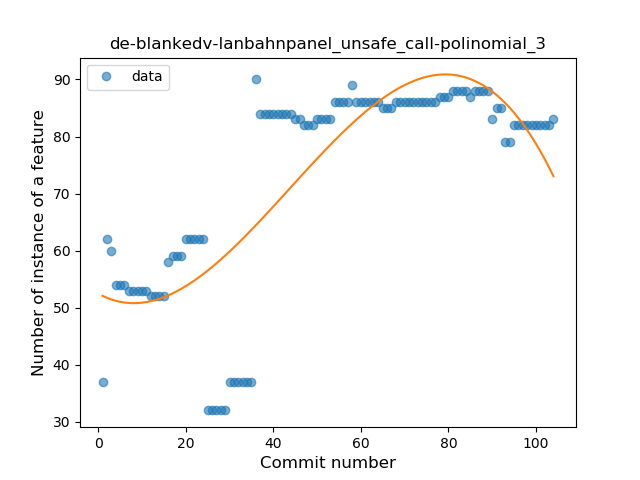

#### com-atanana-sicounter
* Feature: Lambda
* Function: )
* R_Squared: 0.65106463
 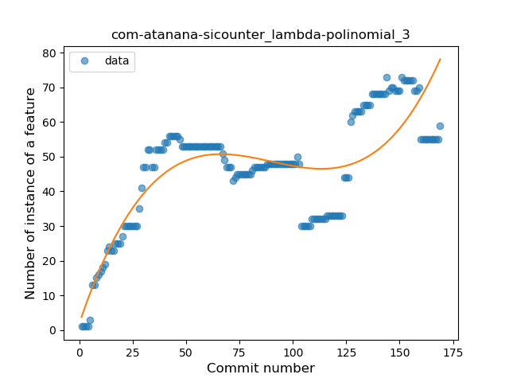

#### io-trewartha-positional
* Feature: Safe Call
* Function: )
* R_Squared: 0.64564521
 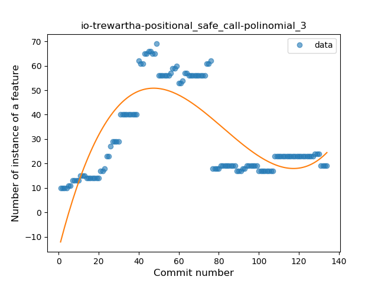

#### fr-rhaz-ipfs-sweet
* Feature: Lambda
* Function: 
* R_Squared: 0.64373769
 

#### net-stew-stew
* Feature: Property Delegation
* Function: 
* R_Squared: 0.64037329
 

#### pw-janyo-whatanime
* Feature: Unsafe Call
* Function: )
* R_Squared: 0.63861826
 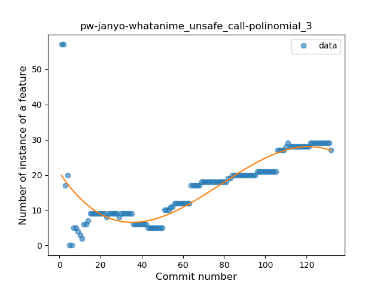

#### com-tomer-draw
* Feature: Type Inference
* Function: )
* R_Squared: 0.63447289
 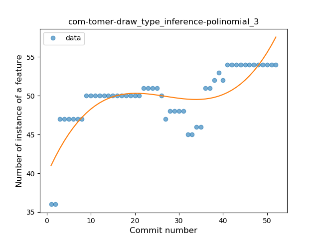

#### io-github-fvasco-pinpoi
* Feature: Type Inference
* Function: )
* R_Squared: 0.6336987
 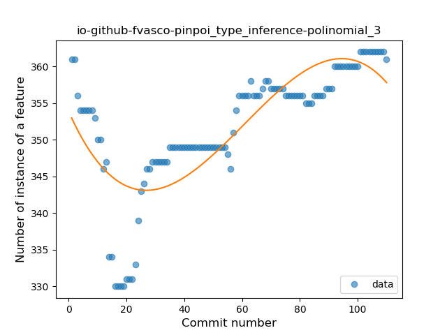

#### me-impa-knockonports
* Feature: Safe Call
* Function: 
* R_Squared: 0.633582
 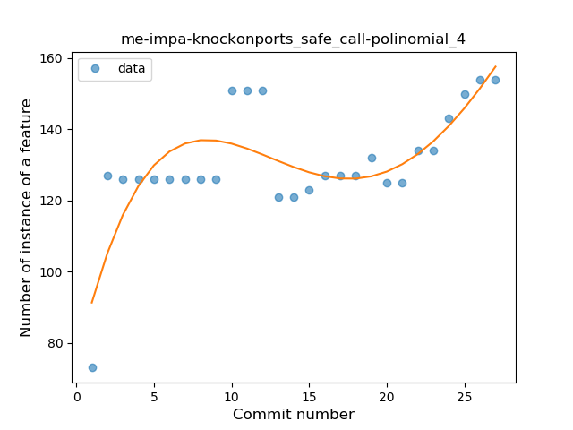

#### com-enjoyingfoss-om
* Feature: Function call with Named Argument
* Function: 
* R_Squared: 0.63083334
 

#### com-physphil-android-unitconverterultimate
* Feature: Singleton
* Function: 
* R_Squared: 0.6236781
 

#### me-barta-stayintouch
* Feature: String Template
* Function: 
* R_Squared: 0.61451514
 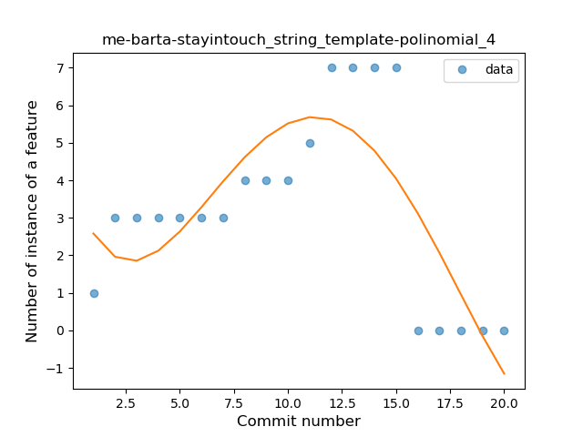

#### org-liberty-android-freeotpplus
* Feature: Safe Call
* Function: 
* R_Squared: 0.61111475
 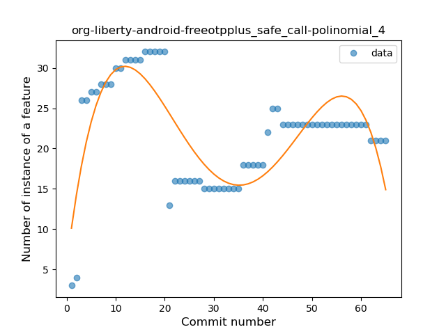

#### me-impa-knockonports
* Feature: Function call with Named Argument
* Function: 
* R_Squared: 0.59796599
 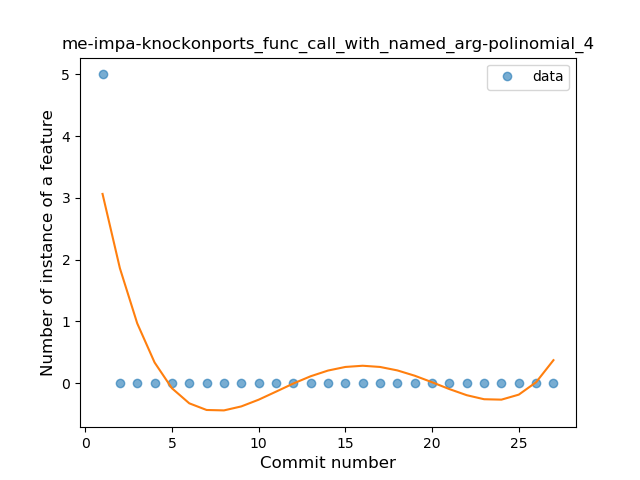

#### com-booboot-vndbandroid
* Feature: Coroutine
* Function: )
* R_Squared: 0.58538519
 

#### com-aaplab-bakubus
* Feature: Unsafe Call
* Function: 
* R_Squared: 0.58188006
 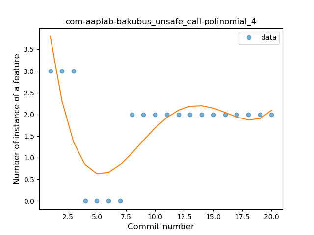

#### io-github-benoitduffez-cupsprint
* Feature: Type Inference
* Function: )
* R_Squared: 0.55941373
 

#### com-amar-NoteDirector
* Feature: Type Inference
* Function: )
* R_Squared: 0.55565863
 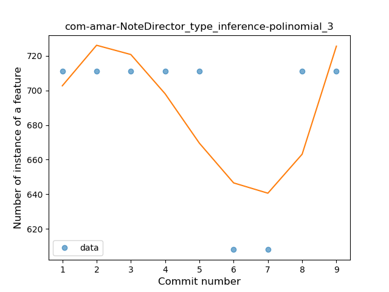

#### com-amar-NoteDirector
* Feature: Lambda
* Function: )
* R_Squared: 0.55565863
 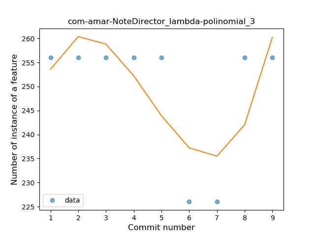

#### com-amar-NoteDirector
* Feature: Safe Call
* Function: )
* R_Squared: 0.55565863
 

#### com-amar-NoteDirector
* Feature: When expression
* Function: )
* R_Squared: 0.55565863
 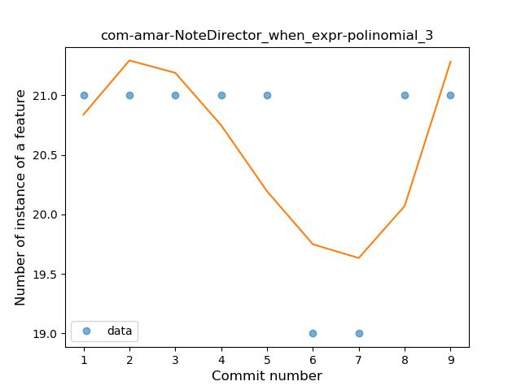

#### com-amar-NoteDirector
* Feature: Unsafe Call
* Function: )
* R_Squared: 0.55565863
 

#### com-amar-NoteDirector
* Feature: Singleton
* Function: )
* R_Squared: 0.55565863
 

#### com-amar-NoteDirector
* Feature: Range Expression
* Function: )
* R_Squared: 0.55565863
 

#### com-amar-NoteDirector
* Feature: Function call with Named Argument
* Function: )
* R_Squared: 0.55565863
 

#### fr-xgouchet-packageexplorer
* Feature: Property Delegation
* Function: )
* R_Squared: 0.54868247
 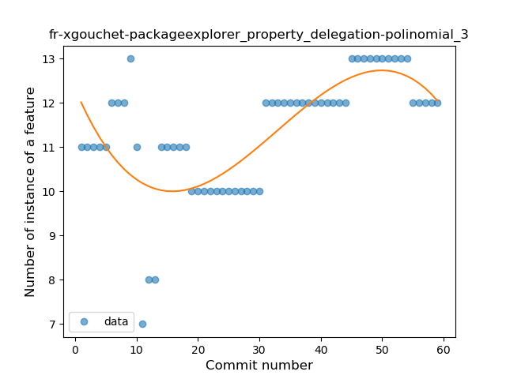

#### io-trewartha-positional
* Feature: Lambda
* Function: )
* R_Squared: 0.54324685
 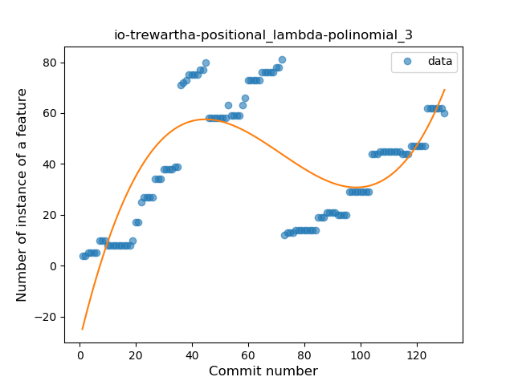

#### com-enjoyingfoss-om
* Feature: Unsafe Call
* Function: 
* R_Squared: 0.52789537
 

#### com-agusyc-daycounter
* Feature: Unsafe Call
* Function: 
* R_Squared: 0.51400034
 

#### at-bitfire-icsdroid
* Feature: Type Inference
* Function: )
* R_Squared: 0.51141673
 

#### fr-rhaz-ipfs-sweet
* Feature: String Template
* Function: 
* R_Squared: 0.50201929
 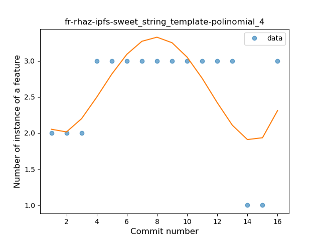

#### uk-colessoft-android-hilllist
* Feature: Extension Function
* Function: 
* R_Squared: 0.47901321
 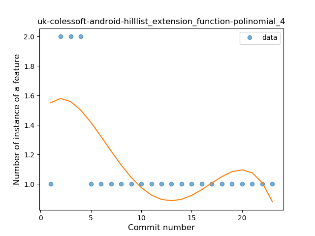

#### fr-rhaz-ipfs-sweet
* Feature: Type Inference
* Function: 
* R_Squared: 0.47511442
 

#### com-pyamsoft-homebutton
* Feature: Data Class
* Function: )
* R_Squared: 0.46733735
 

#### jp-org-example-geckour-glyph
* Feature: Range Expression
* Function: )
* R_Squared: 0.46437193
 

#### fr-rhaz-ipfs-sweet
* Feature: Safe Call
* Function: 
* R_Squared: 0.45186496
 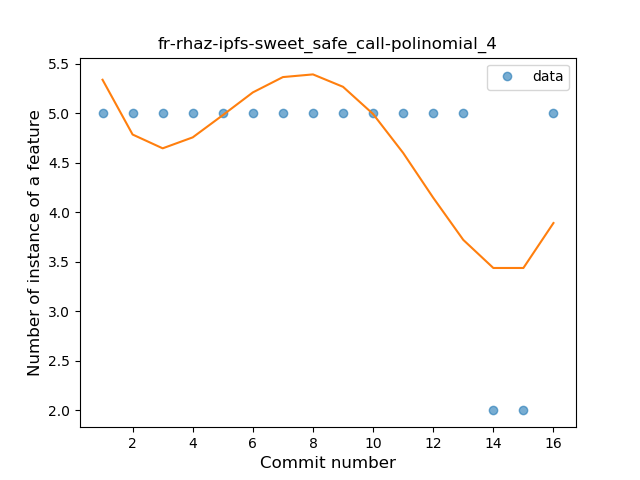

#### fr-rhaz-ipfs-sweet
* Feature: Function with Default Value
* Function: 
* R_Squared: 0.45186496
 

#### fr-rhaz-ipfs-sweet
* Feature: Inline Function
* Function: 
* R_Squared: 0.45186496
 

#### fr-rhaz-ipfs-sweet
* Feature: Overloaded Operator
* Function: 
* R_Squared: 0.45186496
 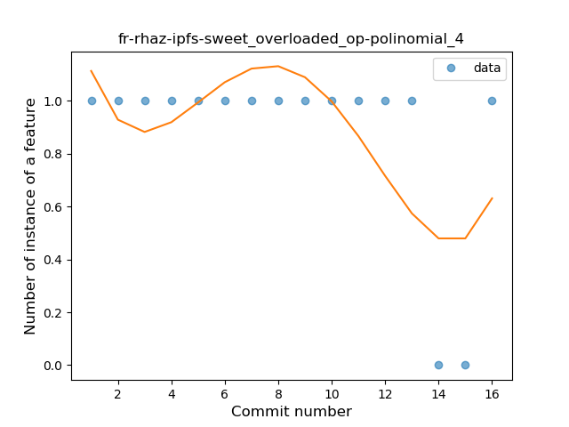

#### fr-rhaz-ipfs-sweet
* Feature: Coroutine
* Function: 
* R_Squared: 0.45186496
 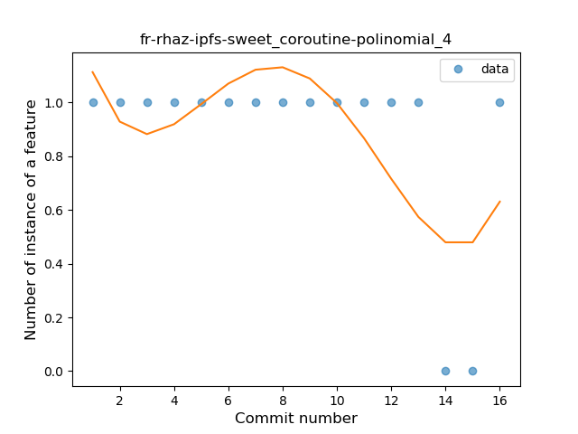

#### fr-rhaz-ipfs-sweet
* Feature: Extension Function
* Function: 
* R_Squared: 0.44124123
 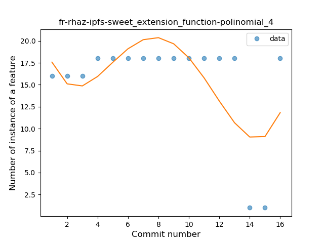

#### org-mattvchandler-progressbars
* Feature: Type Inference
* Function: )
* R_Squared: 0.4388021
 

#### saschpe-poker
* Feature: Safe Call
* Function: )
* R_Squared: 0.43591766
 

#### com-enjoyingfoss-om
* Feature: Singleton
* Function: 
* R_Squared: 0.43361015
 

#### com-brentpanther-bitcoinwidget
* Feature: Companion Object
* Function: )
* R_Squared: 0.43349754
 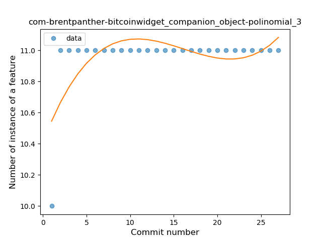

#### org-weilbach-splitbills
* Feature: Unsafe Call
* Function: )
* R_Squared: 0.42971947
 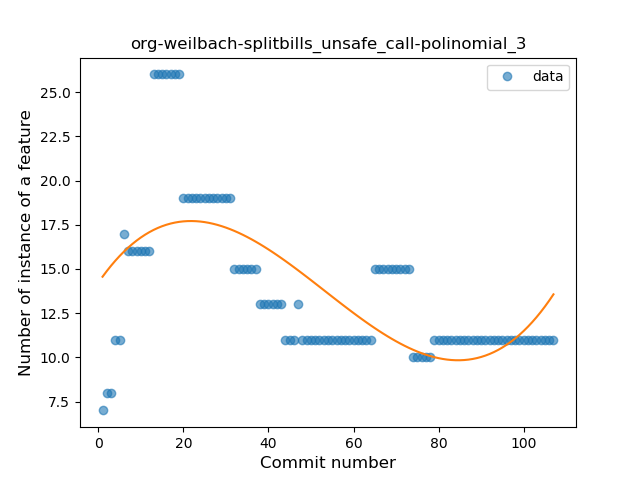

#### me-kirimin-mitsumine
* Feature: Type Inference
* Function: )
* R_Squared: 0.42808594
 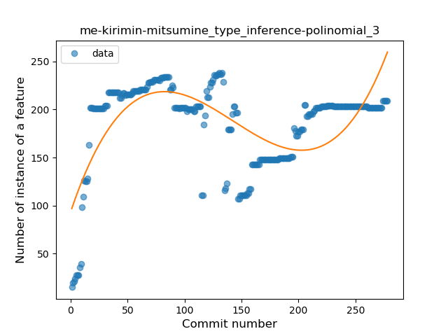

#### com-physphil-android-unitconverterultimate
* Feature: Extension Function
* Function: 
* R_Squared: 0.42509897
 

#### apps-jizzu-simpletodo
* Feature: Type Inference
* Function: )
* R_Squared: 0.42101176
 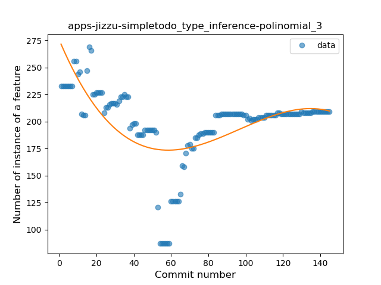

#### org-ligi-materialteatimer
* Feature: Type Inference
* Function: )
* R_Squared: 0.41919487
 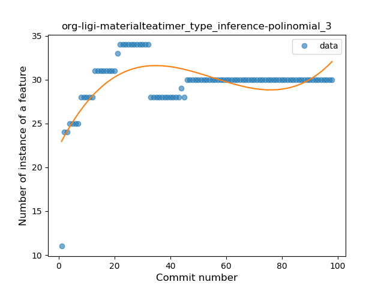

#### com-brentpanther-bitcoinwidget
* Feature: String Template
* Function: )
* R_Squared: 0.41190761
 

#### com-nononsenseapps-feeder
* Feature: Super Delegation
* Function: )
* R_Squared: 0.38127558
 

#### com-utazukin-ichaival
* Feature: Extension Function
* Function: )
* R_Squared: 0.36164736
 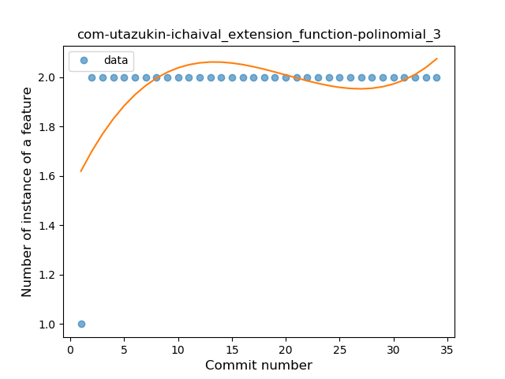

#### fr-xgouchet-packageexplorer
* Feature: Function with Default Value
* Function: )
* R_Squared: 0.34223967
 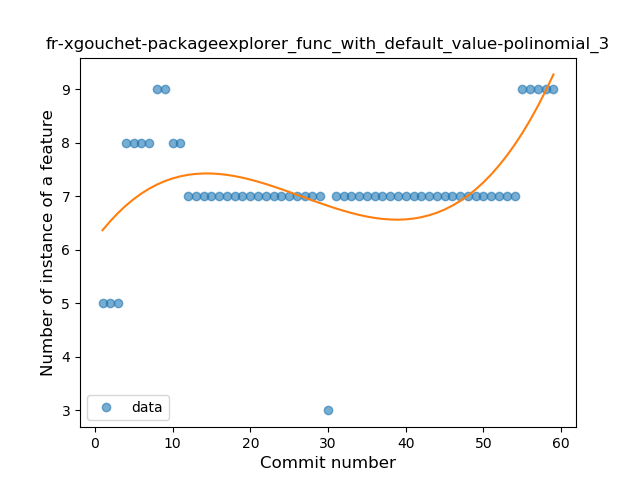

#### org-liberty-android-freeotpplus
* Feature: Coroutine
* Function: )
* R_Squared: 0.32146509
 

#### pixel-kotlin-bassblog
* Feature: String Template
* Function: )
* R_Squared: 0.31495574
 

#### com-agusyc-daycounter
* Feature: Smart Cast
* Function: 
* R_Squared: 0.26913578
 

#### com-enjoyingfoss-om
* Feature: Safe Call
* Function: 
* R_Squared: 0.26591056
 

#### com-skydoves-waterdays
* Feature: Type Inference
* Function: 
* R_Squared: 0.25949726
 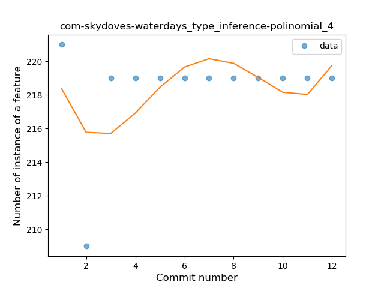

#### io-wookey-wallet
* Feature: String Template
* Function: 
* R_Squared: 0.23579553
 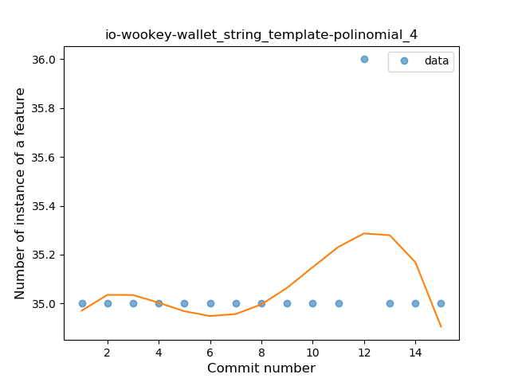

#### com-adityakamble49-ttl
* Feature: Companion Object
* Function: )
* R_Squared: 0.232717
 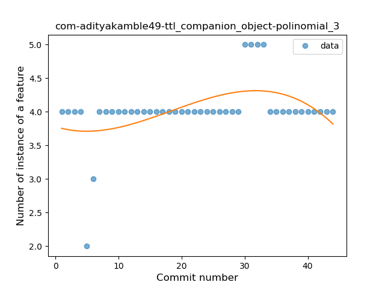

#### co-timecrypt-android
* Feature: Extension Function
* Function: )
* R_Squared: 0.22598644
 

#### org-sanpra-checklist
* Feature: Unsafe Call
* Function: )
* R_Squared: 0.21657509
 

#### me-rei_m-hyakuninisshu
* Feature: Coroutine
* Function: )
* R_Squared: 0.20156177
 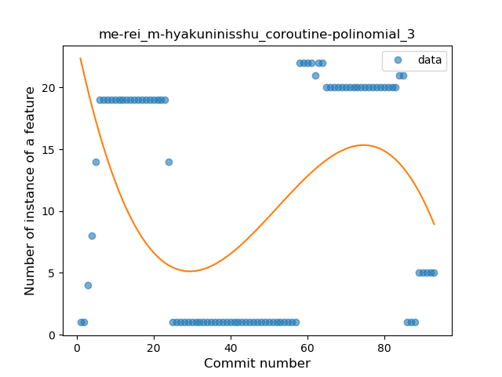

#### org-liberty-android-freeotpplus
* Feature: Unsafe Call
* Function: )
* R_Squared: 0.18130023
 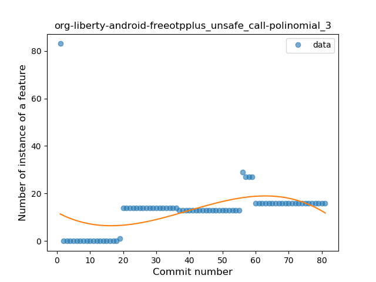

