## Constant Decline
----
**69** best fit

#### SpiritCroc-DefaultDarkTheme-oms
* Feature: Unsafe Call
* Function: 
* R_Squared: 0.86475897
 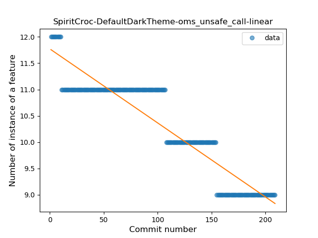

#### equeim-tremotesf-android
* Feature: String Template
* Function: 
* R_Squared: 0.83198067
 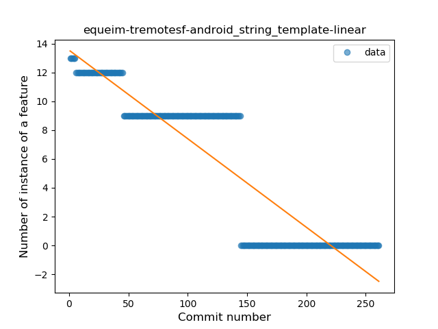

#### equeim-tremotesf-android
* Feature: Smart Cast
* Function: 
* R_Squared: 0.81734053
 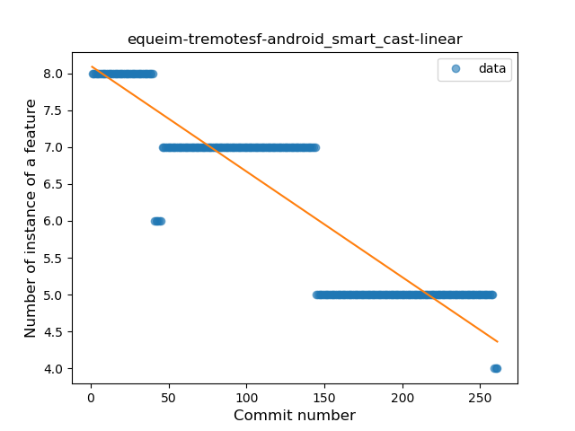

#### equeim-tremotesf-android
* Feature: Property Delegation
* Function: 
* R_Squared: 0.74198473
 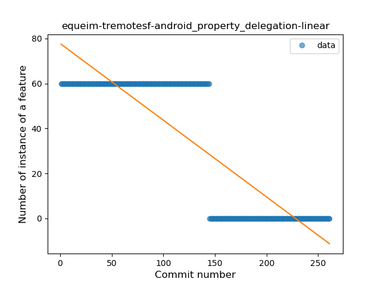

#### equeim-tremotesf-android
* Feature: Overloaded Operator
* Function: 
* R_Squared: 0.74198473
 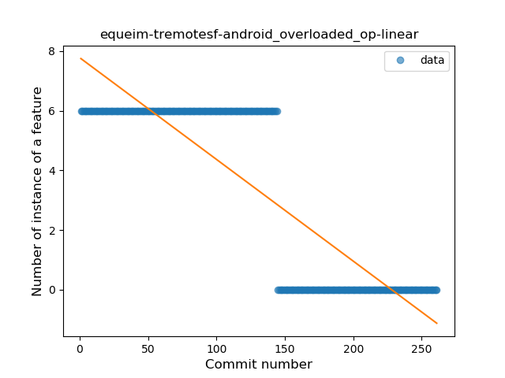

#### nicorsm-S3-16-simone
* Feature: Extension Function
* Function: 
* R_Squared: 0.703346
 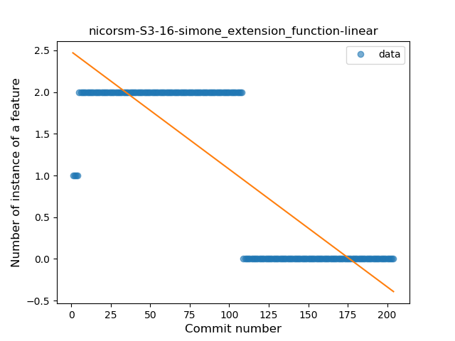

#### chrsep-Kingfish
* Feature: Property Delegation
* Function: 
* R_Squared: 0.68380919
 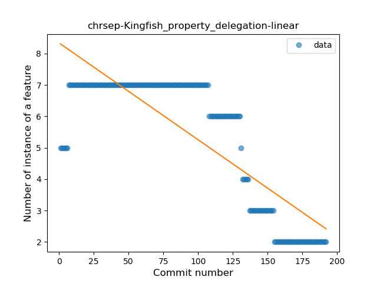

#### michaelkourlas-voipms-sms-client
* Feature: Smart Cast
* Function: 
* R_Squared: 0.66640394
 

#### hyst329-OpenFool
* Feature: Unsafe Call
* Function: 
* R_Squared: 0.66456873
 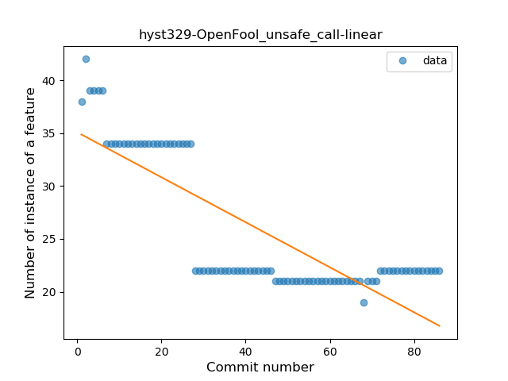

#### SimpleMobileTools-Simple-Camera
* Feature: Companion Object
* Function: 
* R_Squared: 0.64519844
 

#### bubelov-coins-android
* Feature: Singleton
* Function: 
* R_Squared: 0.59189075
 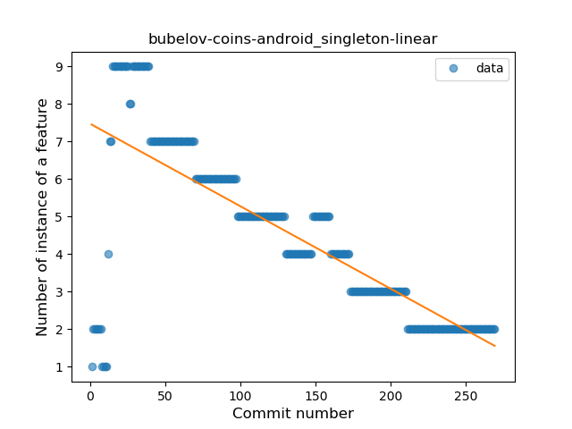

#### FredJul-Flym
* Feature: Companion Object
* Function: 
* R_Squared: 0.58712782
 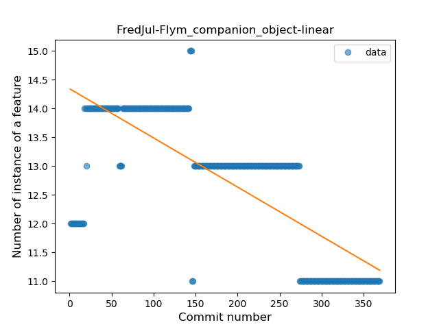

#### OpenLauncherTeam-openlauncher
* Feature: Function with Default Value
* Function: 
* R_Squared: 0.57918333
 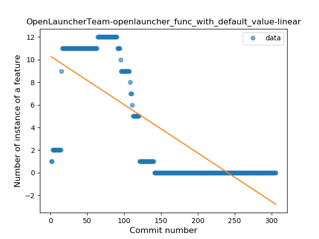

#### OpenLauncherTeam-openlauncher
* Feature: When expression
* Function: 
* R_Squared: 0.5740776
 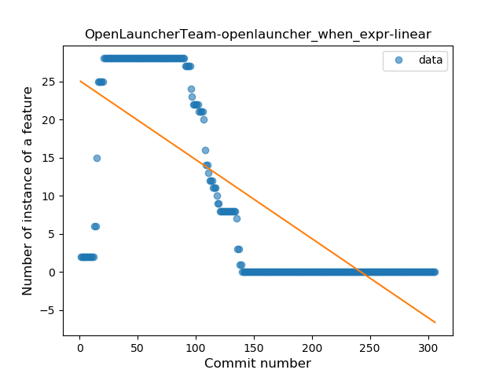

#### calintat-units
* Feature: When expression
* Function: 
* R_Squared: 0.53039367
 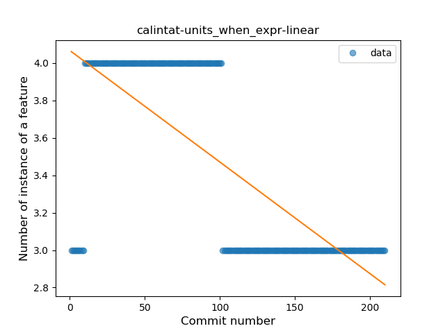

#### bubelov-coins-android
* Feature: Unsafe Call
* Function: 
* R_Squared: 0.51707309
 

#### premnirmal-StockTicker
* Feature: Destructuring Declaration
* Function: 
* R_Squared: 0.51662234
 

#### SimpleMobileTools-Simple-App-Launcher
* Feature: Destructuring Declaration
* Function: 
* R_Squared: 0.51050495
 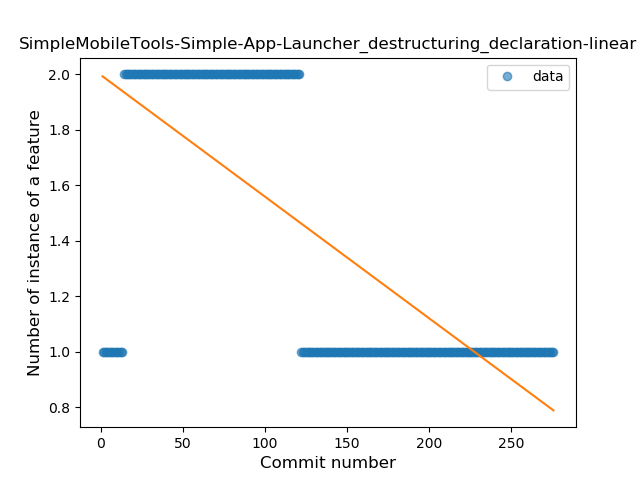

#### dkrivoruchko-ScreenStream
* Feature: Data Class
* Function: 
* R_Squared: 0.49851273
 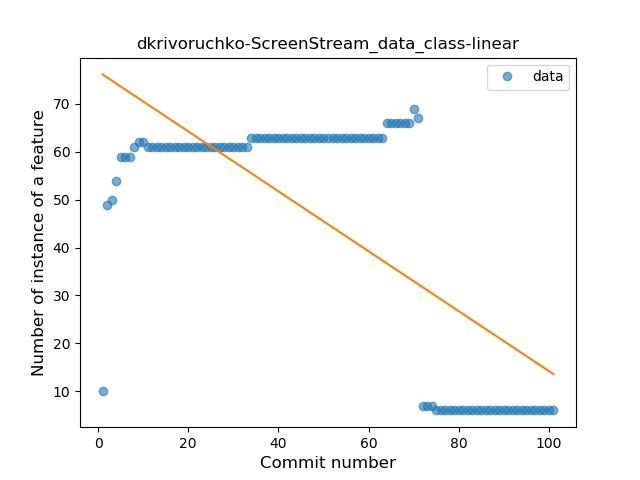

#### ykrank-S1-Next
* Feature: Extension Function
* Function: 
* R_Squared: 0.40127108
 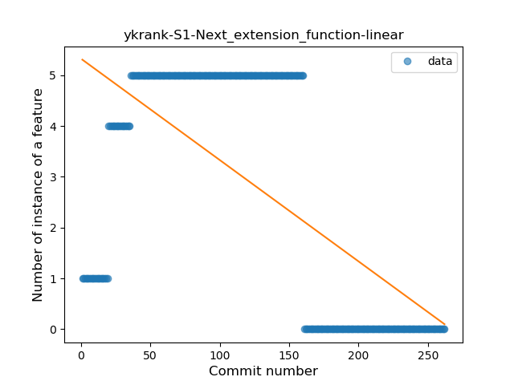

#### ids1024-whitakers-words-android
* Feature: Safe Call
* Function: 
* R_Squared: 0.36234016
 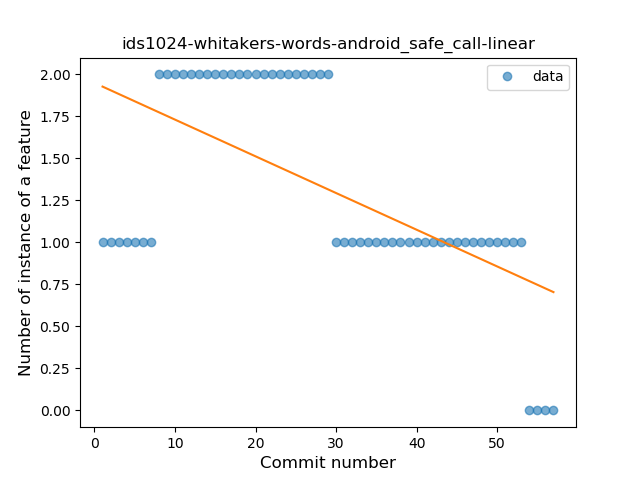

#### fvasco-pinpoi
* Feature: Property Delegation
* Function: 
* R_Squared: 0.36225679
 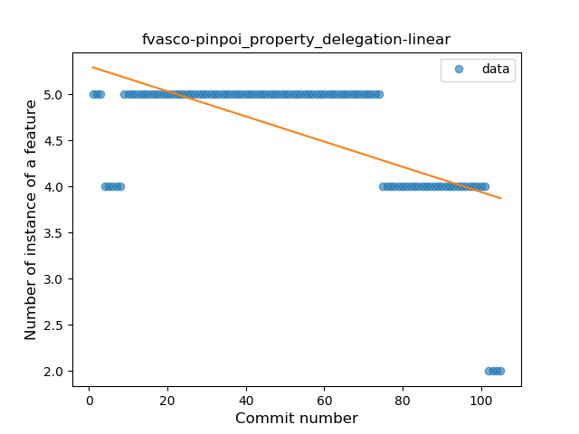

#### raatmarien-red-moon
* Feature: Type Inference
* Function: 
* R_Squared: 0.34265385
 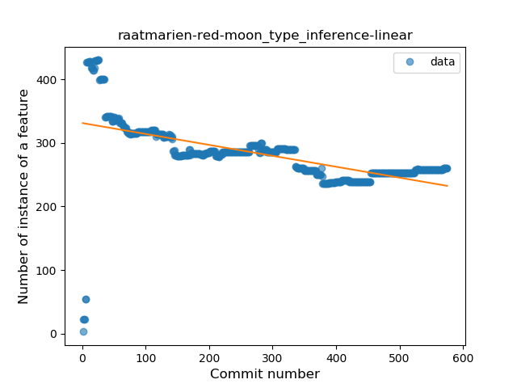

#### SimpleMobileTools-Simple-Music-Player
* Feature: Companion Object
* Function: 
* R_Squared: 0.34132943
 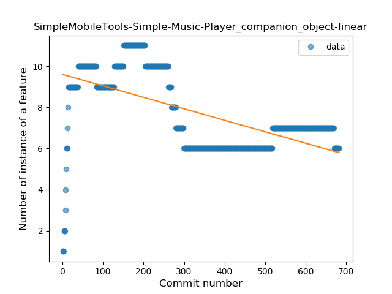

#### blastrock-kaqui
* Feature: Function call with Named Argument
* Function: 
* R_Squared: 0.3405637
 

#### moko256-twitlatte
* Feature: Range Expression
* Function: 
* R_Squared: 0.3361873
 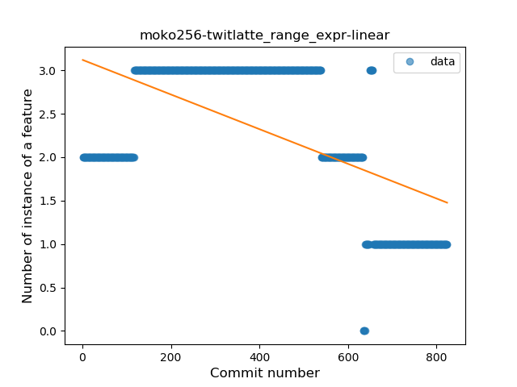

#### dkrivoruchko-ScreenStream
* Feature: Type Inference
* Function: 
* R_Squared: 0.30905278
 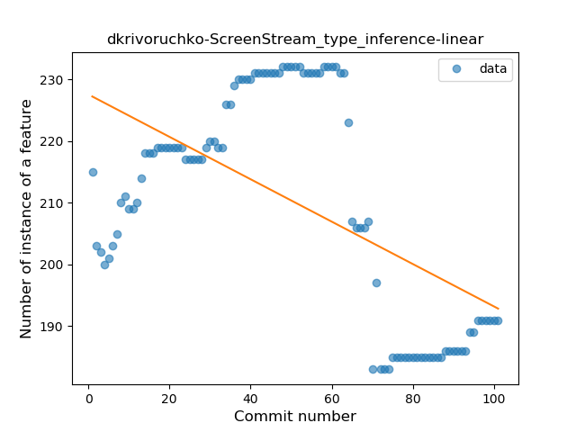

#### ofalvai-BPInfo
* Feature: Extension Function
* Function: 
* R_Squared: 0.30753493
 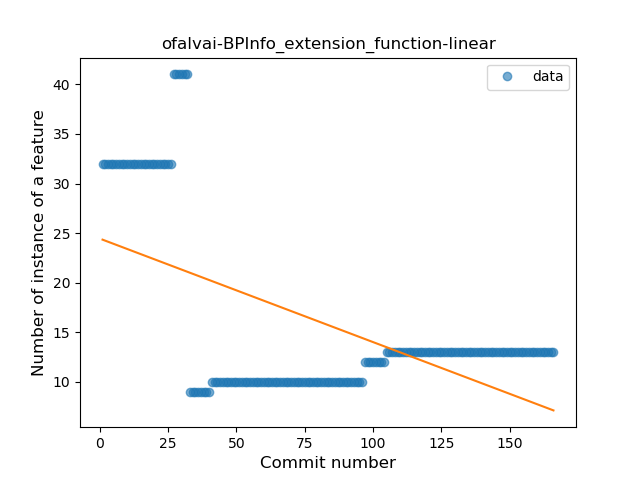

#### nonylene-PhotoLinkViewer
* Feature: String Template
* Function: 
* R_Squared: 0.30578846
 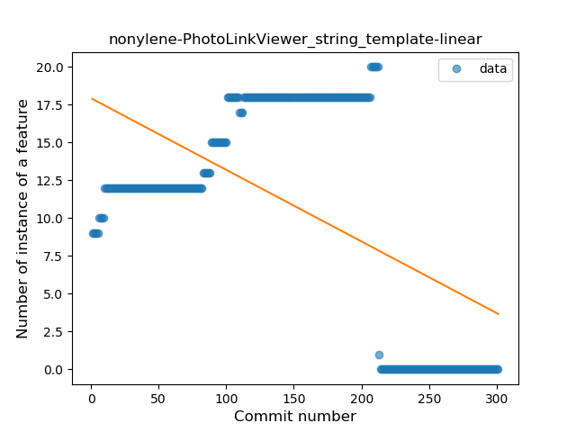

#### glodanif-BluetoothChat
* Feature: Unsafe Call
* Function: 
* R_Squared: 0.29676698
 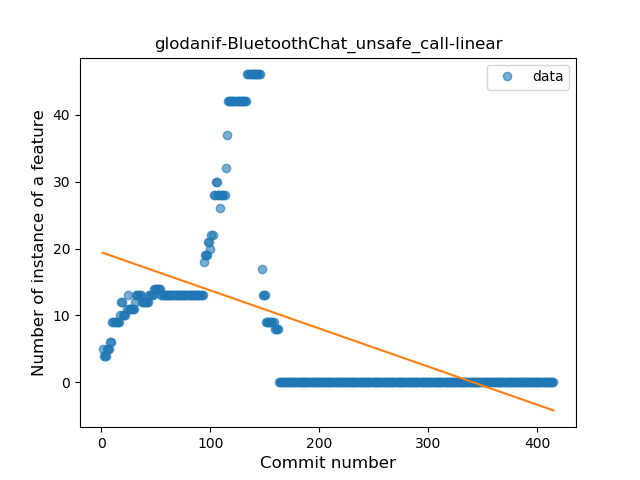

#### AIDEA775-UNCmorfi
* Feature: Property Delegation
* Function: 
* R_Squared: 0.29520413
 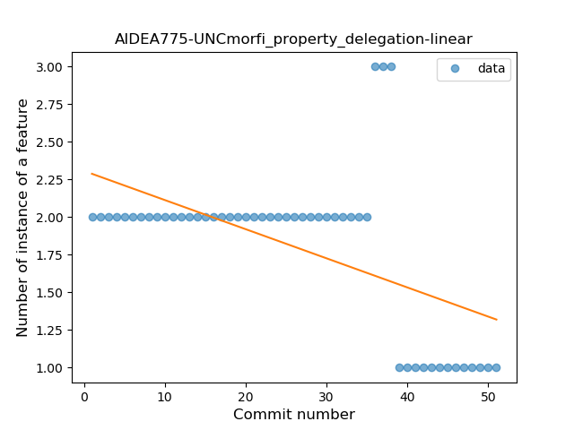

#### equeim-tremotesf-android
* Feature: When expression
* Function: 
* R_Squared: 0.29314046
 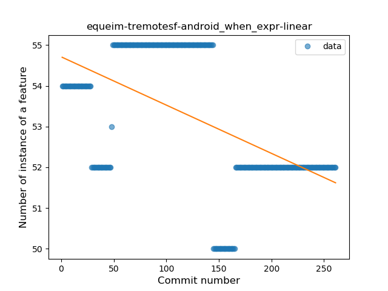

#### dkrivoruchko-ScreenStream
* Feature: Safe Call
* Function: 
* R_Squared: 0.29036714
 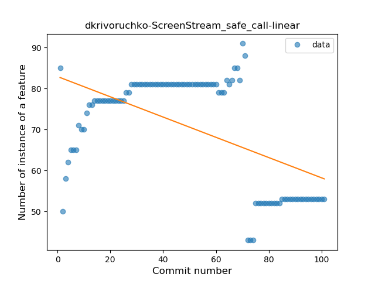

#### premnirmal-StockTicker
* Feature: String Template
* Function: 
* R_Squared: 0.25514557
 

#### SimpleMobileTools-Simple-Notes
* Feature: Extension Function
* Function: 
* R_Squared: 0.2536888
 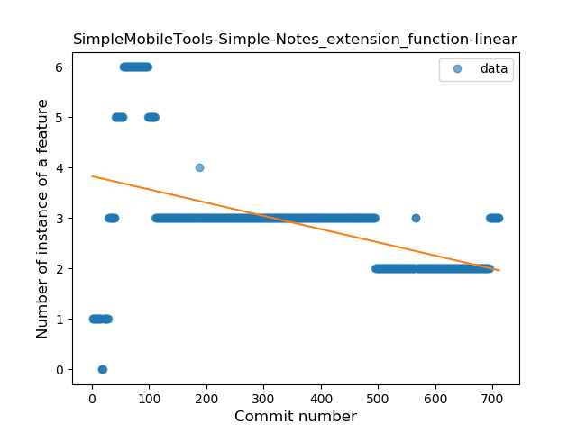

#### AIDEA775-UNCmorfi
* Feature: Singleton
* Function: 
* R_Squared: 0.25368729
 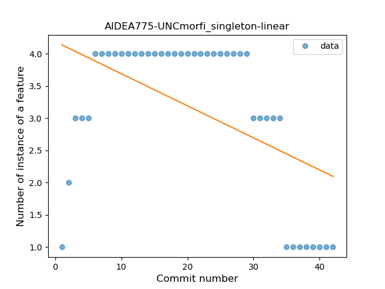

#### LISTEN-moe-android-app
* Feature: Extension Function
* Function: 
* R_Squared: 0.24845679
 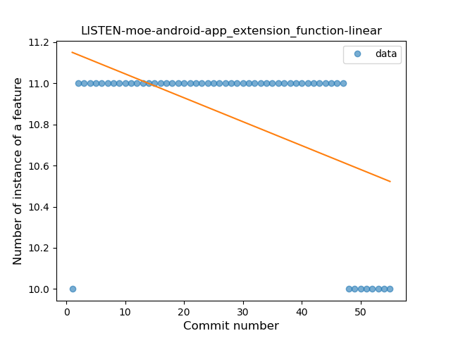

#### kirimin-mitsumine
* Feature: Companion Object
* Function: 
* R_Squared: 0.22439963
 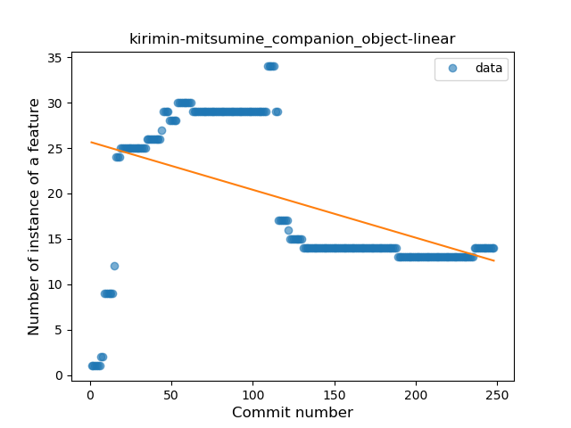

#### SimpleMobileTools-Simple-File-Manager
* Feature: Companion Object
* Function: 
* R_Squared: 0.20972616
 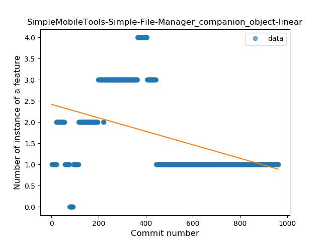

#### blastrock-kaqui
* Feature: Destructuring Declaration
* Function: 
* R_Squared: 0.19999614
 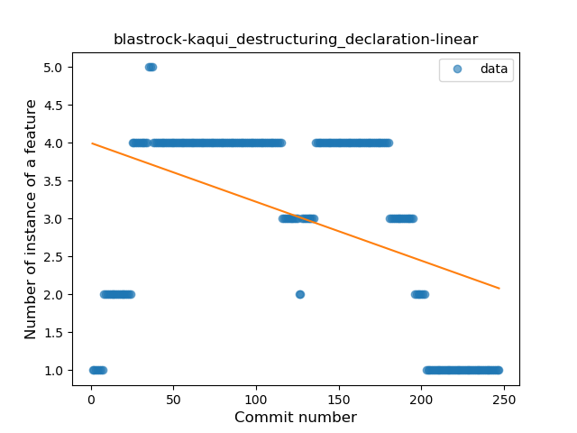

#### nonylene-PhotoLinkViewer
* Feature: When expression
* Function: 
* R_Squared: 0.19957339
 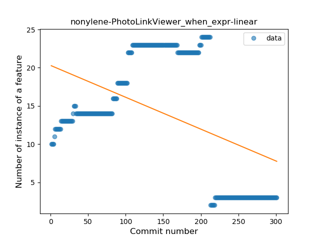

#### SimpleMobileTools-Simple-Calendar
* Feature: Companion Object
* Function: 
* R_Squared: 0.17484692
 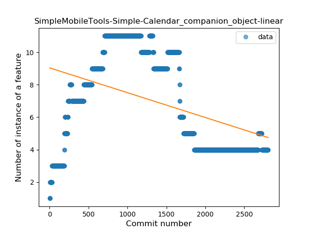

#### kirimin-mitsumine
* Feature: Range Expression
* Function: 
* R_Squared: 0.1574523
 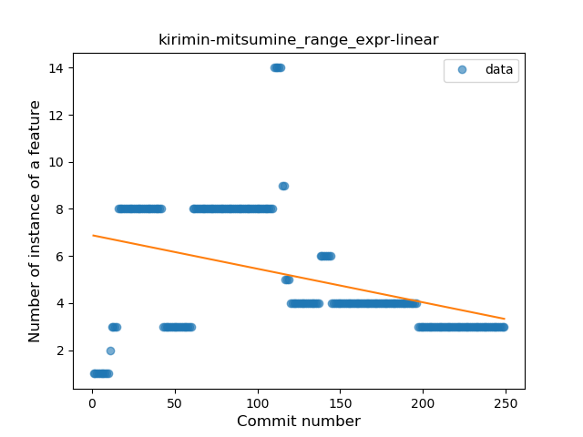

#### eurofurence-ef-app_android
* Feature: Unsafe Call
* Function: 
* R_Squared: 0.15445799
 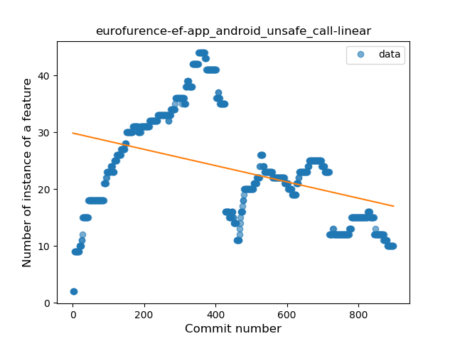

#### SimpleMobileTools-Simple-Calendar
* Feature: Destructuring Declaration
* Function: 
* R_Squared: 0.15107176
 

#### thermatk-FastHub-Libre
* Feature: Property Delegation
* Function: 
* R_Squared: 0.13831783
 

#### SimpleMobileTools-Simple-App-Launcher
* Feature: Function with Default Value
* Function: 
* R_Squared: 0.13654013
 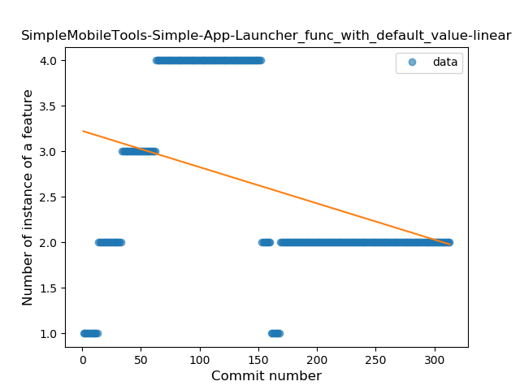

#### SpiritCroc-DarkCroc-Android-theme
* Feature: Type Inference
* Function: 
* R_Squared: 0.13605988
 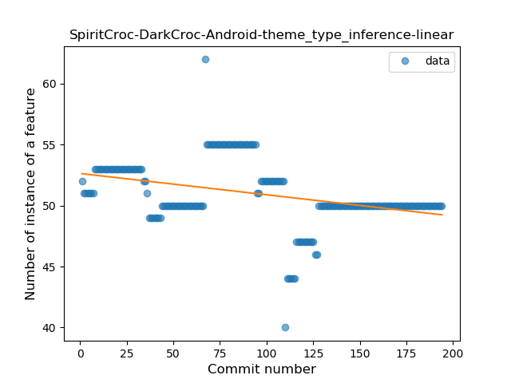

#### Mystery00-JanYoShare
* Feature: Unsafe Call
* Function: 
* R_Squared: 0.10605217
 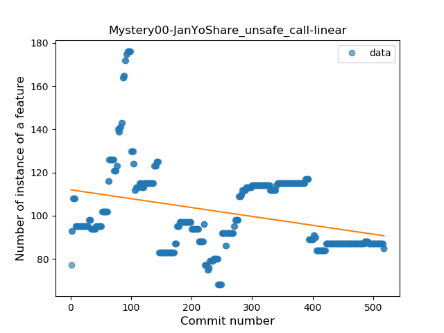

#### SimpleMobileTools-Simple-Music-Player
* Feature: Unsafe Call
* Function: 
* R_Squared: 0.07553662
 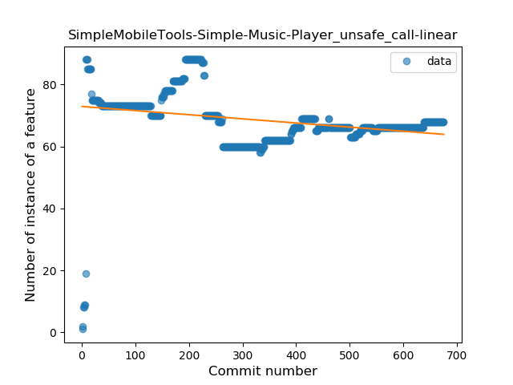

#### SimpleMobileTools-Simple-Gallery
* Feature: Range Expression
* Function: 
* R_Squared: 0.0631682
 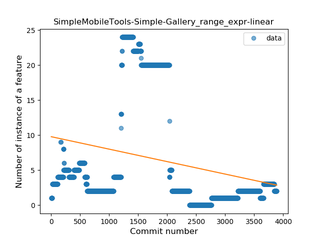

#### darshanparajuli-LogcatReader
* Feature: Inline Function
* Function: 
* R_Squared: 0.06309887
 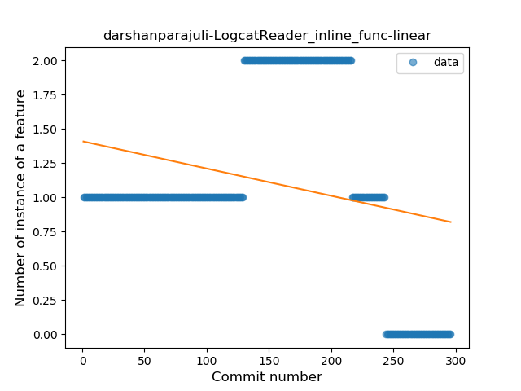

#### calintat-units
* Feature: Property Delegation
* Function: 
* R_Squared: 0.06275485
 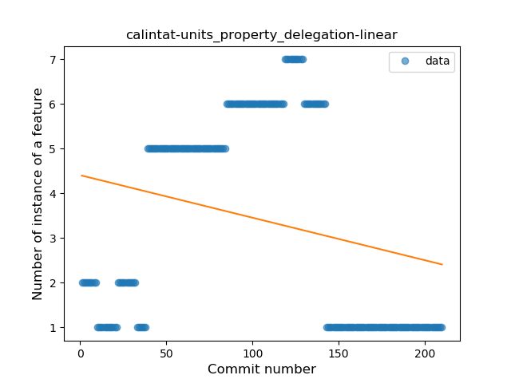

#### ligi-IPFSDroid
* Feature: Property Delegation
* Function: 
* R_Squared: 0.06211742
 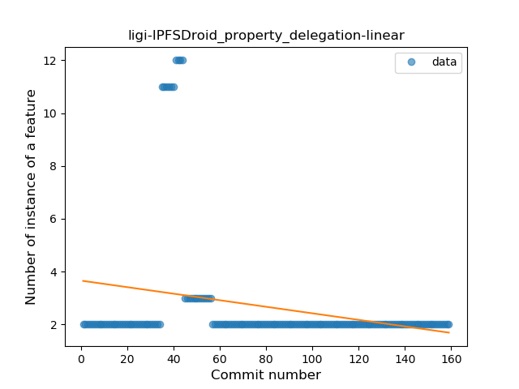

#### kirimin-mitsumine
* Feature: Unsafe Call
* Function: 
* R_Squared: 0.06064976
 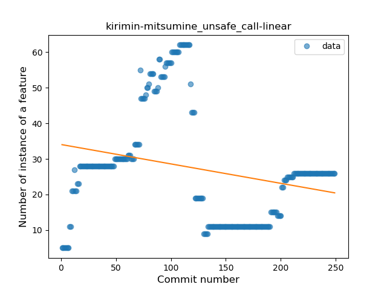

#### loloof64-BasicChessEndGamesTrainer
* Feature: Destructuring Declaration
* Function: 
* R_Squared: 0.05678594
 

#### joaomneto-TitanCompanion
* Feature: Range Expression
* Function: 
* R_Squared: 0.05357143
 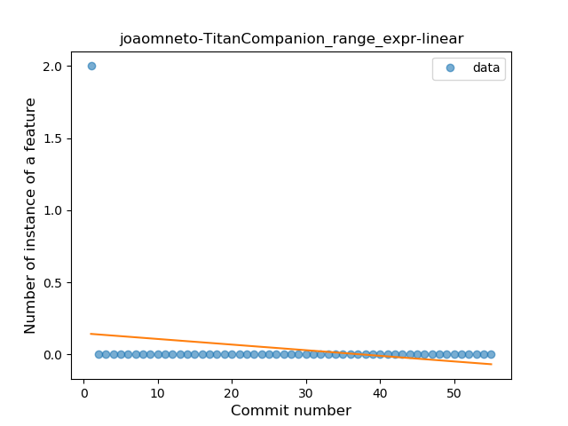

#### citiususc-calendula
* Feature: Function with Default Value
* Function: 
* R_Squared: 0.05263158
 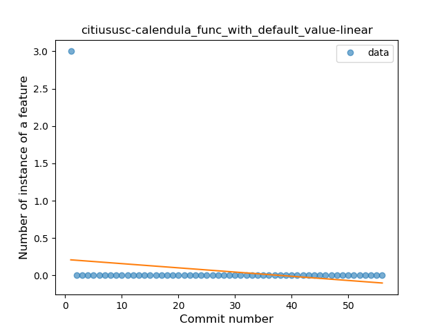

#### dkrivoruchko-ScreenStream
* Feature: Smart Cast
* Function: 
* R_Squared: 0.04057493
 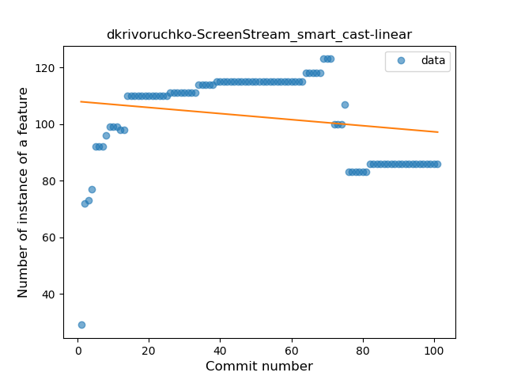

#### MartinStyk-AndroidApkAnalyzer
* Feature: Unsafe Call
* Function: 
* R_Squared: 0.03650608
 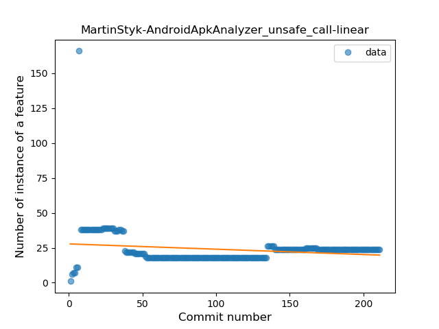

#### ligi-SurvivalManual
* Feature: Function call with Named Argument
* Function: 
* R_Squared: 0.03373221
 

#### spacecowboy-Feeder
* Feature: Inline Function
* Function: 
* R_Squared: 0.03232935
 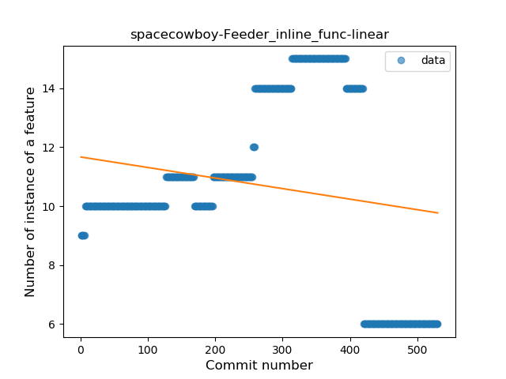

#### nonylene-PhotoLinkViewer
* Feature: Unsafe Call
* Function: 
* R_Squared: 0.03197015
 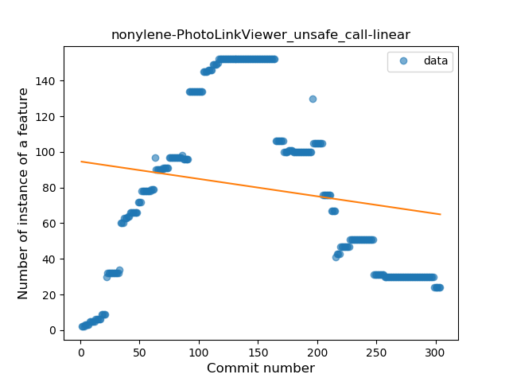

#### chrsep-Kingfish
* Feature: Singleton
* Function: 
* R_Squared: 0.02940532
 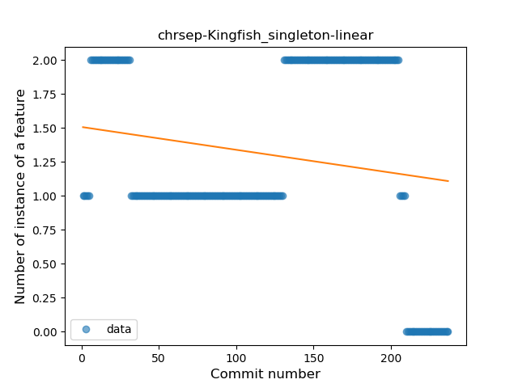

#### premnirmal-StockTicker
* Feature: Function call with Named Argument
* Function: 
* R_Squared: 0.0275046
 

#### WYKCode-WYK-Android
* Feature: When expression
* Function: 
* R_Squared: 0.02626042
 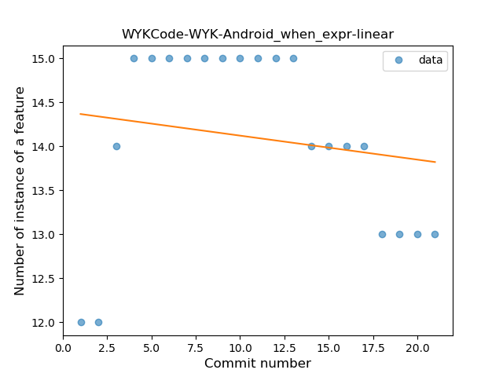

#### bnlrnz-MandelGL
* Feature: Range Expression
* Function: 
* R_Squared: 0.01546073
 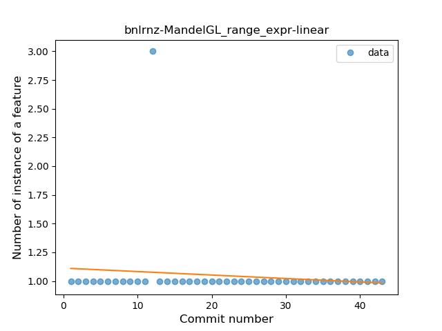

#### SimpleMobileTools-Simple-File-Manager
* Feature: Range Expression
* Function: 
* R_Squared: 0.0105532
 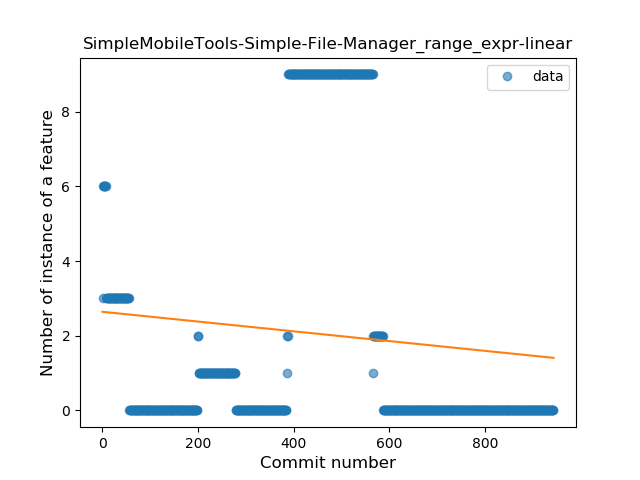

#### Gark-bassblog_kotlin
* Feature: Smart Cast
* Function: 
* R_Squared: 0.00738149
 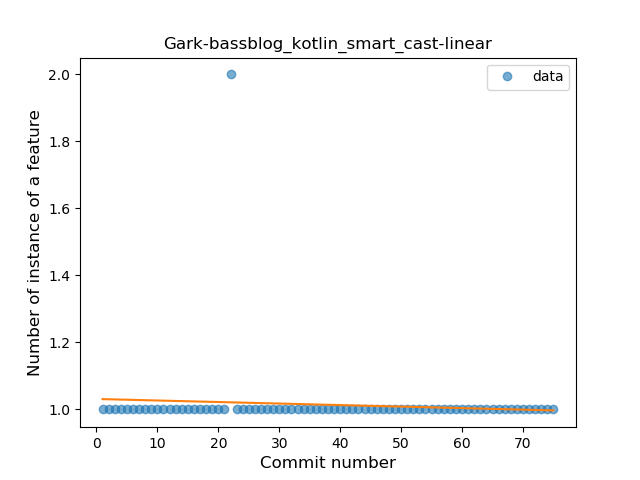

