## Constant Decline
----
**136** best fit

#### de-spiritcroc-defaultdarktheme
* Feature: Unsafe Call
* Function: 
* R_Squared: 0.87063991
 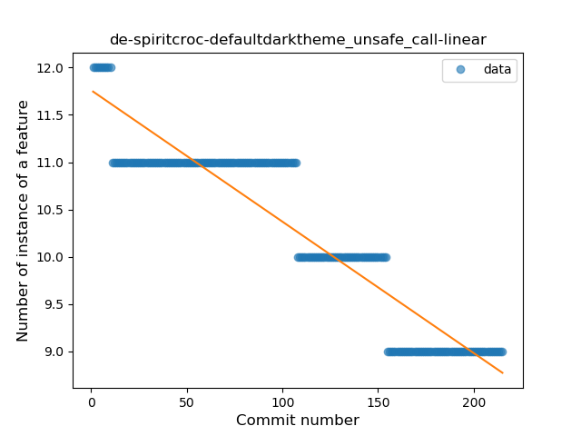

#### jp-takke-cpustats
* Feature: Unsafe Call
* Function: 
* R_Squared: 0.80987901
 

#### tw-shounenwind-kmnbottool
* Feature: Range Expression
* Function: 
* R_Squared: 0.79621638
 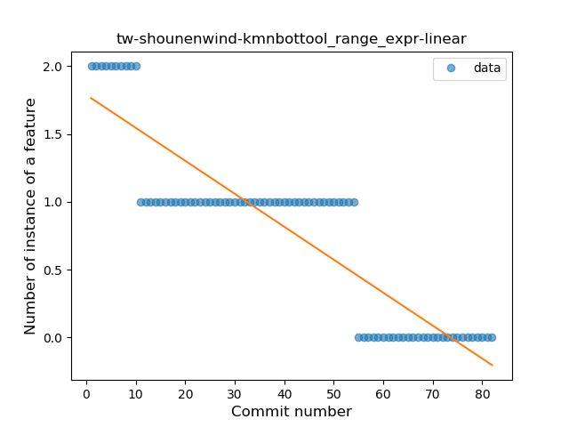

#### com-zacharee1-systemuituner
* Feature: Singleton
* Function: 
* R_Squared: 0.77603228
 

#### io-github-benoitduffez-cupsprint
* Feature: Unsafe Call
* Function: 
* R_Squared: 0.71049264
 

#### app-simone
* Feature: Extension Function
* Function: 
* R_Squared: 0.703346
 

#### net-kourlas-voipms
* Feature: Destructuring Declaration
* Function: 
* R_Squared: 0.68449367
 

#### net-frju-flym
* Feature: Companion Object
* Function: 
* R_Squared: 0.68240009
 

#### com-zacharee1-systemuituner
* Feature: Range Expression
* Function: 
* R_Squared: 0.65825553
 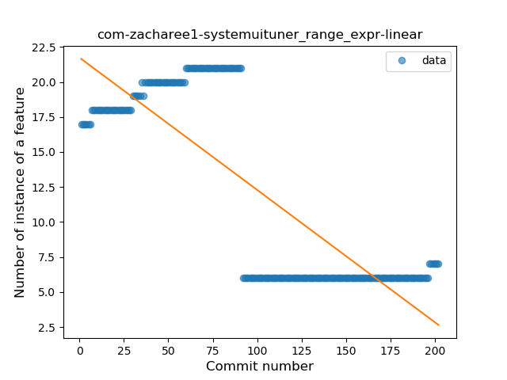

#### com-atanana-sicounter
* Feature: Singleton
* Function: 
* R_Squared: 0.64293112
 

#### com-simplemobiletools-camera
* Feature: Companion Object
* Function: 
* R_Squared: 0.64253064
 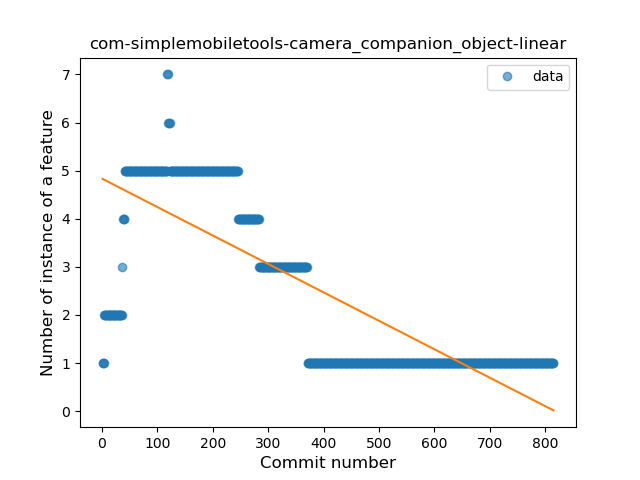

#### com-bubelov-coins
* Feature: Singleton
* Function: 
* R_Squared: 0.64133199
 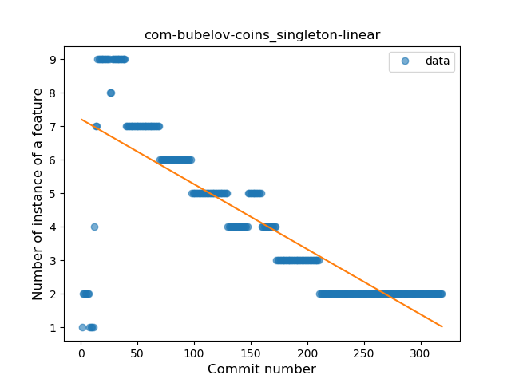

#### cz-dvratil-fbeventsync
* Feature: Smart Cast
* Function: 
* R_Squared: 0.62888987
 

#### com-bubelov-coins
* Feature: Unsafe Call
* Function: 
* R_Squared: 0.61971369
 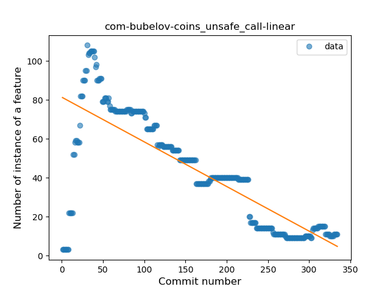

#### ru-hyst329-openfool
* Feature: Unsafe Call
* Function: 
* R_Squared: 0.61633919
 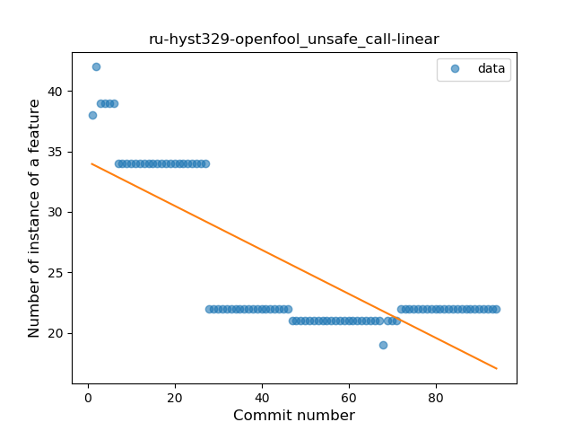

#### org-blitzortung-android-app
* Feature: Unsafe Call
* Function: 
* R_Squared: 0.59495897
 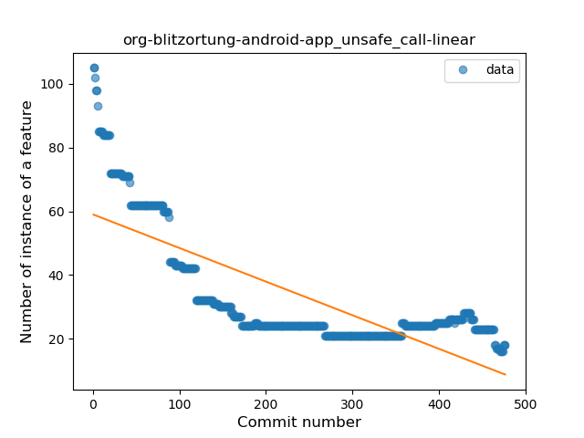

#### com-wbrawner-simplemarkdown
* Feature: Unsafe Call
* Function: 
* R_Squared: 0.59107439
 

#### com-simplemobiletools-clock
* Feature: Range Expression
* Function: 
* R_Squared: 0.57341977
 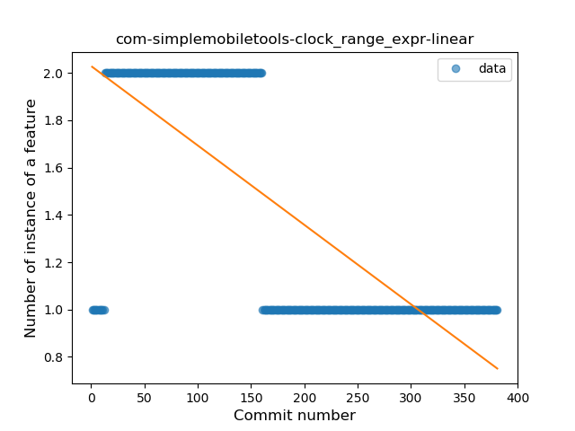

#### com-simplemobiletools-gallery
* Feature: Smart Cast
* Function: 
* R_Squared: 0.57270415
 

#### com-github-fields-electric
* Feature: Unsafe Call
* Function: 
* R_Squared: 0.54755192
 

#### apps-jizzu-simpletodo
* Feature: Property Delegation
* Function: 
* R_Squared: 0.54707549
 

#### com-bernaferrari-changedetection
* Feature: Unsafe Call
* Function: 
* R_Squared: 0.53913703
 

#### com-bubelov-coins
* Feature: Range Expression
* Function: 
* R_Squared: 0.53879005
 

#### com-benny-openlauncher
* Feature: Type Inference
* Function: 
* R_Squared: 0.53220576
 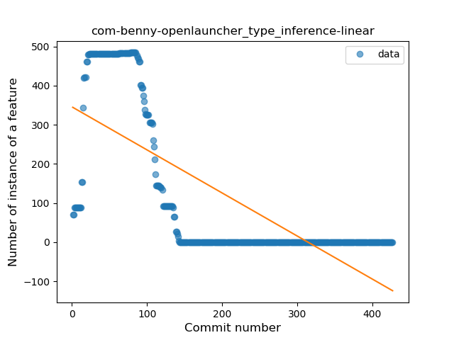

#### com-calintat-units
* Feature: When expression
* Function: 
* R_Squared: 0.53039367
 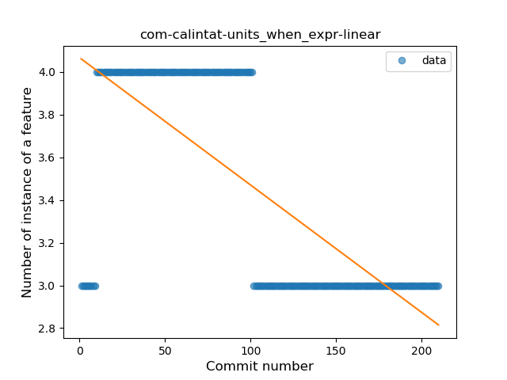

#### com-benny-openlauncher
* Feature: Unsafe Call
* Function: 
* R_Squared: 0.5289138
 

#### org-mifos-mobile
* Feature: Data Class
* Function: 
* R_Squared: 0.52577456
 

#### com-simplemobiletools-applauncher
* Feature: Destructuring Declaration
* Function: 
* R_Squared: 0.51553702
 

#### eu-the4thfloor-msync
* Feature: Companion Object
* Function: 
* R_Squared: 0.51264006
 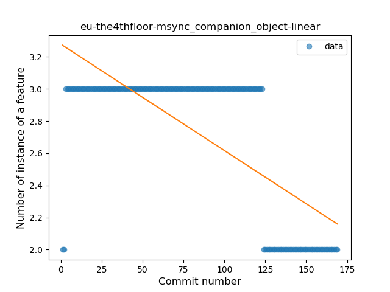

#### com-loloof64-android-basicchessendgamestrainer
* Feature: Type Alias
* Function: 
* R_Squared: 0.50154061
 

#### jp-cordea-mackerelclient
* Feature: Safe Call
* Function: 
* R_Squared: 0.49487951
 

#### com-motion-stage1
* Feature: Extension Function
* Function: 
* R_Squared: 0.49061665
 

#### org-isoron-uhabits
* Feature: Smart Cast
* Function: 
* R_Squared: 0.48459234
 

#### com-corphish-nightlight-generic
* Feature: Smart Cast
* Function: 
* R_Squared: 0.47469745
 

#### at-bitfire-icsdroid
* Feature: Smart Cast
* Function: 
* R_Squared: 0.46855205
 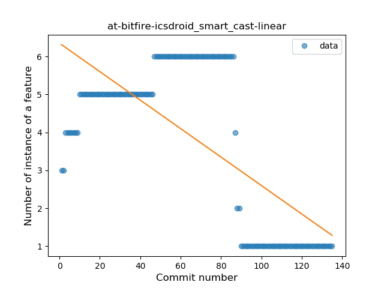

#### com-dozingcatsoftware-vectorcamera
* Feature: Inline Function
* Function: 
* R_Squared: 0.45963086
 

#### tw-shounenwind-kmnbottool
* Feature: Unsafe Call
* Function: 
* R_Squared: 0.45401411
 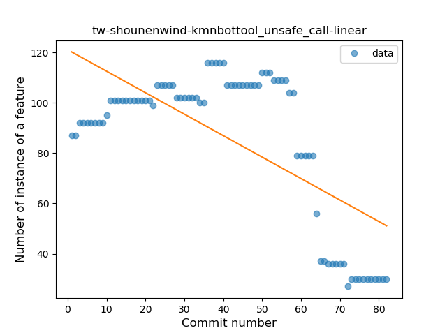

#### io-github-fvasco-pinpoi
* Feature: Property Delegation
* Function: 
* R_Squared: 0.44044303
 

#### org-mifos-mobile
* Feature: Companion Object
* Function: 
* R_Squared: 0.43188382
 

#### com-github-moko256-twitlatte
* Feature: Destructuring Declaration
* Function: 
* R_Squared: 0.42521245
 

#### at-bitfire-davdroid
* Feature: Destructuring Declaration
* Function: 
* R_Squared: 0.41339134
 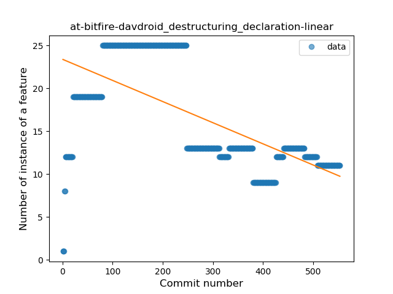

#### com-booboot-vndbandroid
* Feature: Unsafe Call
* Function: 
* R_Squared: 0.41195217
 

#### com-simplemobiletools-musicplayer
* Feature: Companion Object
* Function: 
* R_Squared: 0.40405277
 

#### org-ligi-passandroid
* Feature: Smart Cast
* Function: 
* R_Squared: 0.3977627
 

#### com-simplemobiletools-gallery
* Feature: Companion Object
* Function: 
* R_Squared: 0.38017056
 

#### com-corphish-nightlight-generic
* Feature: Unsafe Call
* Function: 
* R_Squared: 0.35929536
 

#### de-cineaste-android
* Feature: Unsafe Call
* Function: 
* R_Squared: 0.35783247
 

#### tw-shounenwind-kmnbottool
* Feature: Smart Cast
* Function: 
* R_Squared: 0.34850513
 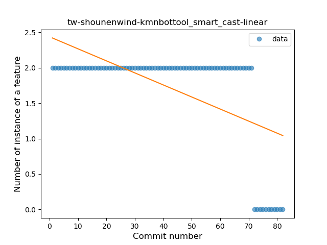

#### com-bijoysingh-quicknote
* Feature: Property Delegation
* Function: 
* R_Squared: 0.34608209
 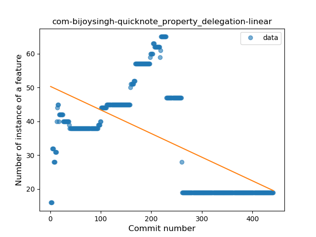

#### apps-jizzu-simpletodo
* Feature: String Template
* Function: 
* R_Squared: 0.32809407
 

#### org-poul-bits-android
* Feature: Inline Function
* Function: 
* R_Squared: 0.31767127
 

#### me-murks-feedwatcher
* Feature: Data Class
* Function: 
* R_Squared: 0.30715731
 

#### net-nonylene-photolinkviewer
* Feature: String Template
* Function: 
* R_Squared: 0.30578846
 

#### com-glodanif-bluetoothchat
* Feature: Unsafe Call
* Function: 
* R_Squared: 0.30060395
 

#### fr-insapp-insapp
* Feature: Unsafe Call
* Function: 
* R_Squared: 0.28540011
 

#### de-cineaste-android
* Feature: Range Expression
* Function: 
* R_Squared: 0.28232886
 

#### me-kirimin-mitsumine
* Feature: Companion Object
* Function: 
* R_Squared: 0.28220529
 

#### com-nononsenseapps-feeder
* Feature: Inline Function
* Function: 
* R_Squared: 0.26894716
 

#### net-syncthing-lite
* Feature: Extension Function
* Function: 
* R_Squared: 0.26332654
 

#### me-kirimin-mitsumine
* Feature: Range Expression
* Function: 
* R_Squared: 0.2623018
 

#### com-bernaferrari-changedetection
* Feature: Sealed Class
* Function: 
* R_Squared: 0.26128996
 

#### com-simplemobiletools-calendar-pro
* Feature: Companion Object
* Function: 
* R_Squared: 0.25349498
 

#### com-simplemobiletools-filemanager-pro
* Feature: Companion Object
* Function: 
* R_Squared: 0.25077688
 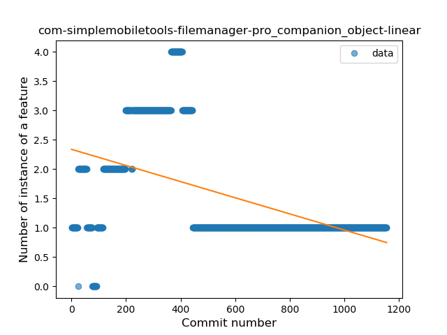

#### ch-rmy-android-http_shortcuts
* Feature: Unsafe Call
* Function: 
* R_Squared: 0.2350546
 

#### com-etesync-syncadapter
* Feature: Smart Cast
* Function: 
* R_Squared: 0.22569609
 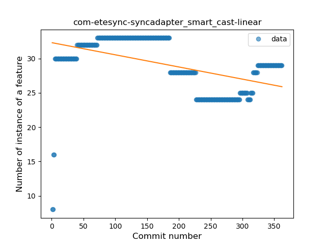

#### de-ironjan-mensaupb
* Feature: Destructuring Declaration
* Function: 
* R_Squared: 0.2227853
 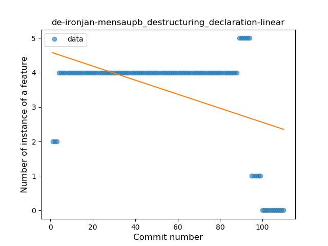

#### apps-jizzu-simpletodo
* Feature: Unsafe Call
* Function: 
* R_Squared: 0.22156338
 

#### com-atanana-sicounter
* Feature: Smart Cast
* Function: 
* R_Squared: 0.2039939
 

#### net-nonylene-photolinkviewer
* Feature: When expression
* Function: 
* R_Squared: 0.19957339
 

#### com-uncmorfi
* Feature: String Template
* Function: 
* R_Squared: 0.19721477
 

#### com-atanana-sicounter
* Feature: Property Delegation
* Function: 
* R_Squared: 0.19653158
 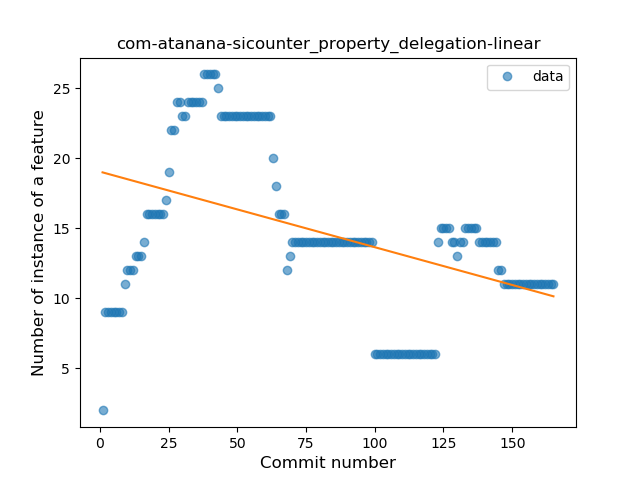

#### me-rei_m-hyakuninisshu
* Feature: Lambda
* Function: 
* R_Squared: 0.18366427
 

#### com-simplemobiletools-applauncher
* Feature: Function with Default Value
* Function: 
* R_Squared: 0.17770238
 

#### xyz-hisname-fireflyiii
* Feature: Unsafe Call
* Function: 
* R_Squared: 0.1755049
 

#### org-sanpra-checklist
* Feature: Companion Object
* Function: 
* R_Squared: 0.16248096
 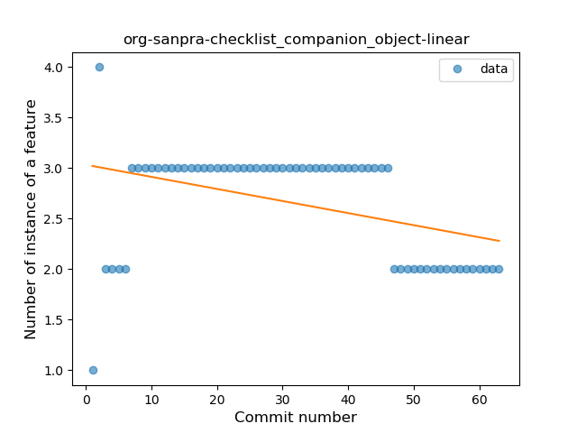

#### ch-rmy-android-http_shortcuts
* Feature: Range Expression
* Function: 
* R_Squared: 0.16056831
 

#### com-motion-stage1
* Feature: Function with Default Value
* Function: 
* R_Squared: 0.14855767
 

#### ch-abertschi-adfree
* Feature: Singleton
* Function: 
* R_Squared: 0.14022489
 

#### ch-abertschi-adfree
* Feature: Property Delegation
* Function: 
* R_Squared: 0.14022489
 

#### com-fastaccess-github-libre
* Feature: Property Delegation
* Function: 
* R_Squared: 0.13818377
 

#### de-spiritcroc-darkcroc-substratum
* Feature: Type Inference
* Function: 
* R_Squared: 0.13691937
 

#### com-jmstudios-redmoon
* Feature: Type Inference
* Function: 
* R_Squared: 0.12634391
 

#### com-simplemobiletools-gallery-pro
* Feature: Range Expression
* Function: 
* R_Squared: 0.12086908
 

#### me-echeung-moemoekyun-fdroid
* Feature: Unsafe Call
* Function: 
* R_Squared: 0.11796321
 

#### ai-susi
* Feature: Unsafe Call
* Function: 
* R_Squared: 0.10963454
 

#### pw-janyo-janyoshare
* Feature: Unsafe Call
* Function: 
* R_Squared: 0.10605217
 

#### org-mifos-mobile
* Feature: Unsafe Call
* Function: 
* R_Squared: 0.09978081
 

#### com-simplemobiletools-notes-pro
* Feature: String Template
* Function: 
* R_Squared: 0.09831859
 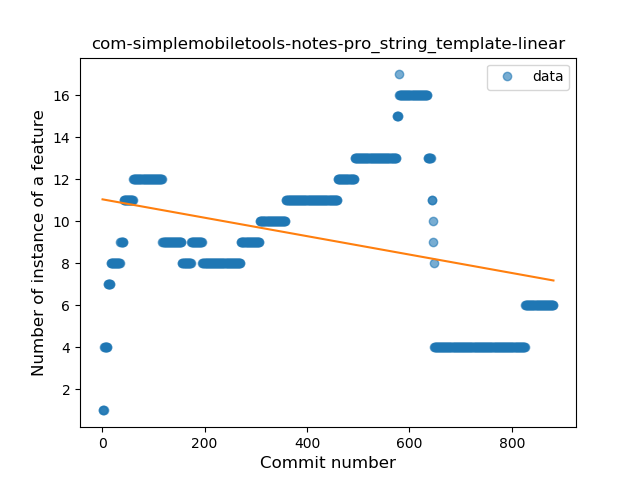

#### me-kirimin-mitsumine
* Feature: Unsafe Call
* Function: 
* R_Squared: 0.09179516
 

#### at-bitfire-icsdroid
* Feature: Companion Object
* Function: 
* R_Squared: 0.08995027
 

#### info-papdt-express-helper
* Feature: Unsafe Call
* Function: 
* R_Squared: 0.0792022
 

#### com-directdev-portal
* Feature: Singleton
* Function: 
* R_Squared: 0.0755027
 

#### org-liberty-android-freeotpplus
* Feature: Overloaded Operator
* Function: 
* R_Squared: 0.07057362
 

#### com-simplemobiletools-musicplayer
* Feature: Unsafe Call
* Function: 
* R_Squared: 0.06785051
 

#### com-pixplicity-cryptogram
* Feature: Unsafe Call
* Function: 
* R_Squared: 0.06371567
 

#### com-calintat-units
* Feature: Property Delegation
* Function: 
* R_Squared: 0.06275485
 

#### org-ligi-ipfsdroid
* Feature: Property Delegation
* Function: 
* R_Squared: 0.06211742
 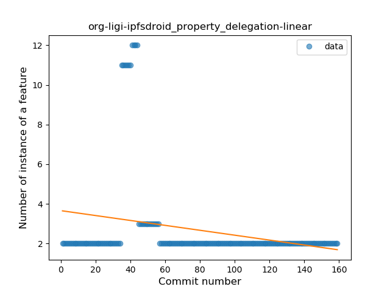

#### ai-susi
* Feature: Range Expression
* Function: 
* R_Squared: 0.06203122
 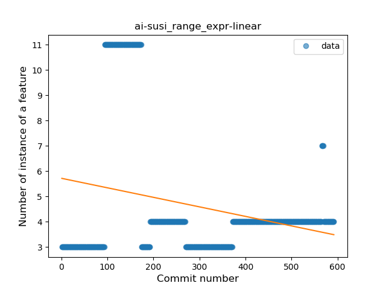

#### org-equeim-tremotesf
* Feature: Unsafe Call
* Function: 
* R_Squared: 0.05839027
 

#### com-loloof64-android-basicchessendgamestrainer
* Feature: Destructuring Declaration
* Function: 
* R_Squared: 0.05783244
 

#### es-usc-citius-servando-calendula
* Feature: Function with Default Value
* Function: 
* R_Squared: 0.05172414
 

#### me-rei_m-hyakuninisshu
* Feature: Safe Call
* Function: 
* R_Squared: 0.04989035
 

#### com-simplemobiletools-filemanager-pro
* Feature: Range Expression
* Function: 
* R_Squared: 0.04755773
 

#### sk-styk-martin-apkanalyzer
* Feature: Sealed Class
* Function: 
* R_Squared: 0.04191101
 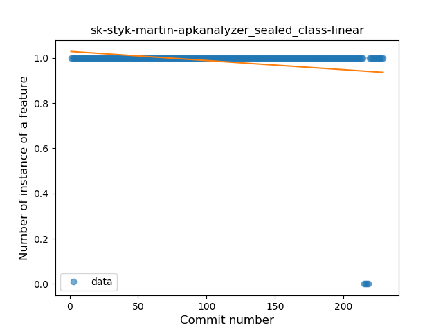

#### com-github-cvzi-screenshottile
* Feature: Property Delegation
* Function: 
* R_Squared: 0.03683809
 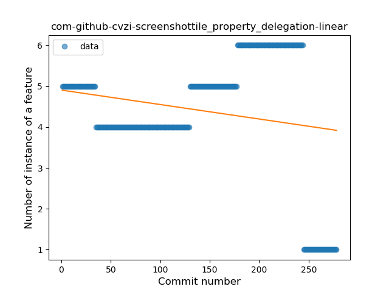

#### org-ligi-survivalmanual
* Feature: Function call with Named Argument
* Function: 
* R_Squared: 0.03373221
 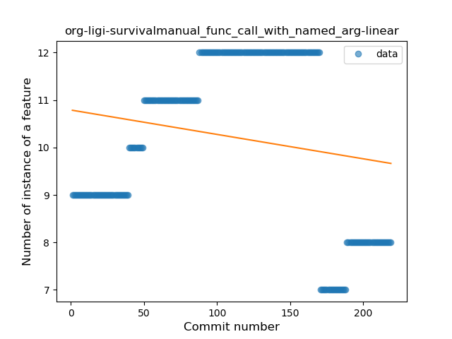

#### com-commit451-gitlab
* Feature: Smart Cast
* Function: 
* R_Squared: 0.03288698
 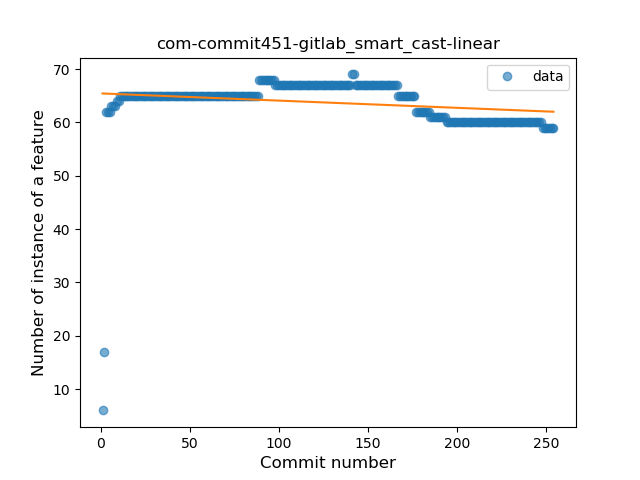

#### nl-brouwerijdemolen-borefts2013
* Feature: Destructuring Declaration
* Function: 
* R_Squared: 0.03287311
 

#### net-nonylene-photolinkviewer
* Feature: Unsafe Call
* Function: 
* R_Squared: 0.03197015
 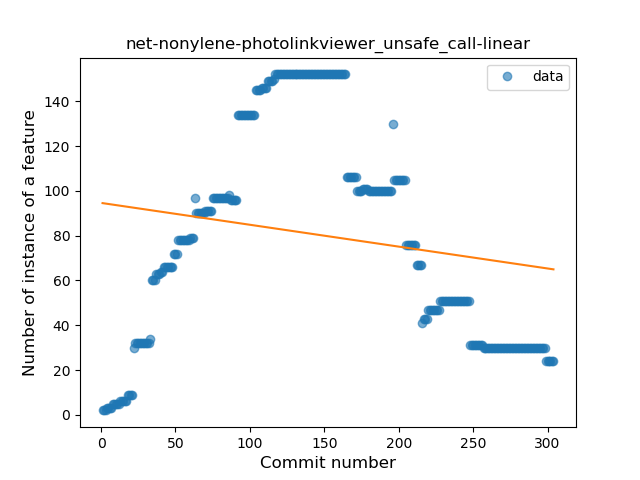

#### org-mosad-seil0-projectlaogai
* Feature: Coroutine
* Function: 
* R_Squared: 0.03125
 

#### me-rei_m-hyakuninisshu
* Feature: Overloaded Operator
* Function: 
* R_Squared: 0.02814017
 

#### com-ianhanniballake-contractiontimer
* Feature: Property Delegation
* Function: 
* R_Squared: 0.02809098
 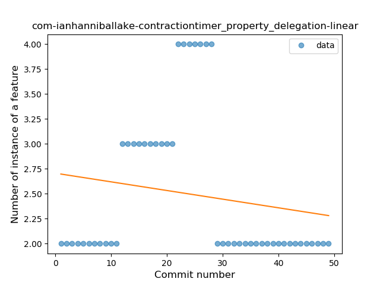

#### pl-temomuko-autostoprace
* Feature: String Template
* Function: 
* R_Squared: 0.02770624
 

#### college-wyk-app
* Feature: When expression
* Function: 
* R_Squared: 0.02626042
 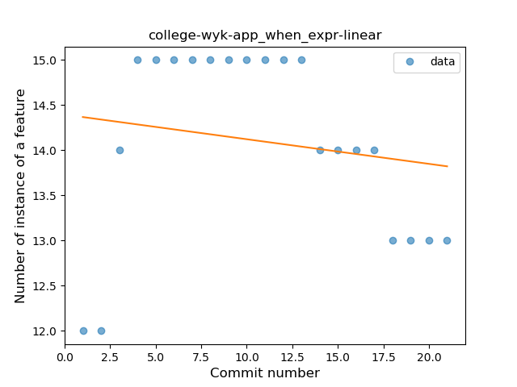

#### org-blokada-alarm
* Feature: Property Delegation
* Function: 
* R_Squared: 0.02110515
 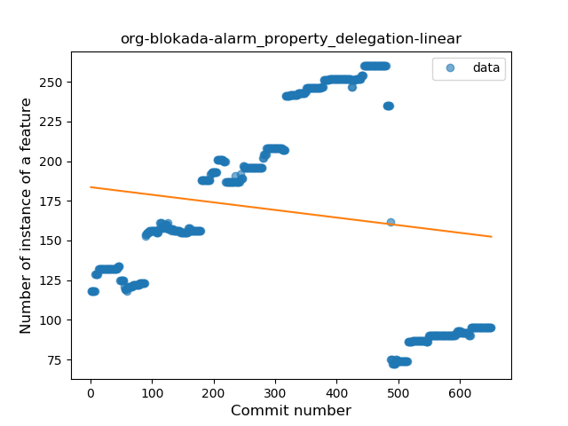

#### com-simplemobiletools-applauncher
* Feature: Range Expression
* Function: 
* R_Squared: 0.02018857
 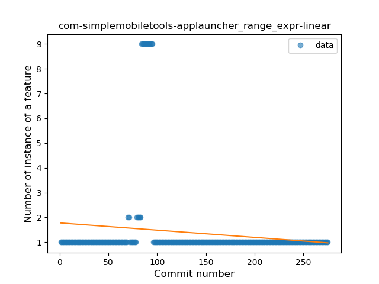

#### xyz-hisname-fireflyiii
* Feature: Smart Cast
* Function: 
* R_Squared: 0.01816045
 

#### com-guardafilme
* Feature: Function call with Named Argument
* Function: 
* R_Squared: 0.0156
 

#### de-tubaf-mandelGL
* Feature: Range Expression
* Function: 
* R_Squared: 0.01546073
 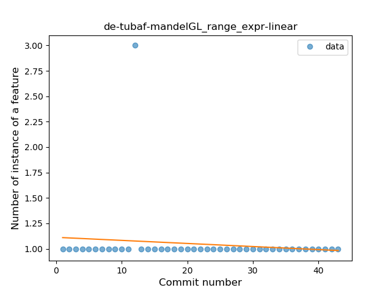

#### org-eurofurence-connavigator
* Feature: Unsafe Call
* Function: 
* R_Squared: 0.01497977
 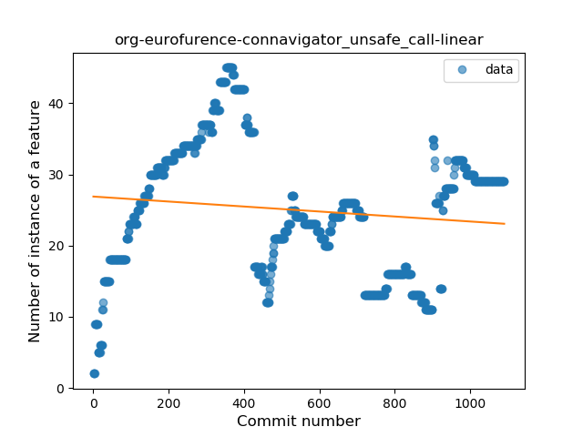

#### tk-superl2-xwifi
* Feature: Unsafe Call
* Function: 
* R_Squared: 0.01465824
 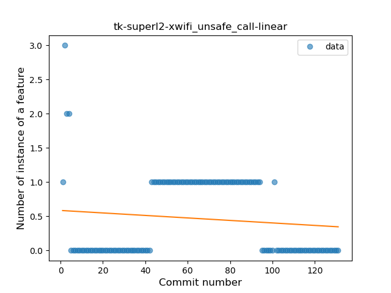

#### nl-brouwerijdemolen-borefts2013
* Feature: Inline Function
* Function: 
* R_Squared: 0.01192731
 

#### pl-org-seva-navigator
* Feature: Range Expression
* Function: 
* R_Squared: 0.01130895
 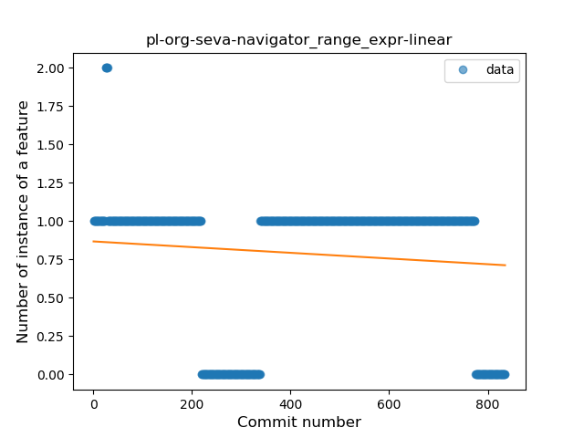

#### com-github-premnirmal-tickerwidget
* Feature: Extension Function
* Function: 
* R_Squared: 0.00904344
 

#### pixel-kotlin-bassblog
* Feature: Smart Cast
* Function: 
* R_Squared: 0.00738149
 

#### com-simplemobiletools-clock
* Feature: Smart Cast
* Function: 
* R_Squared: 0.00661162
 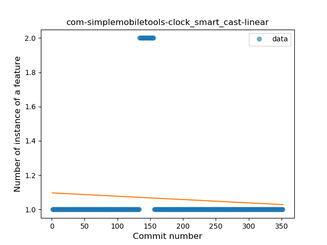

#### me-kirimin-mitsumine
* Feature: Lambda
* Function: 
* R_Squared: 0.00626561
 

#### com-guerinet-mymartlet
* Feature: Inline Function
* Function: 
* R_Squared: 0.00529338
 

#### at-bitfire-icsdroid
* Feature: Destructuring Declaration
* Function: 
* R_Squared: 0.00139364
 

#### com-github-moko256-twitlatte
* Feature: Range Expression
* Function: 
* R_Squared: 0.00060497
 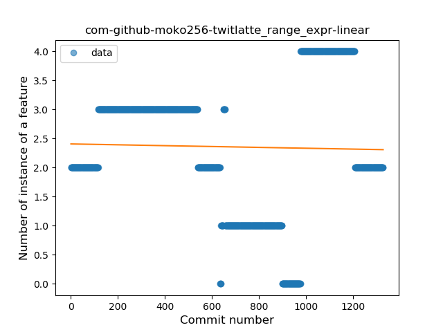

#### io-github-feelfreelinux-wykopmobilny
* Feature: Overloaded Operator
* Function: 
* R_Squared: 0.00041037
 

#### com-simplemobiletools-calendar-pro
* Feature: Destructuring Declaration
* Function: 
* R_Squared: 0.00016752
 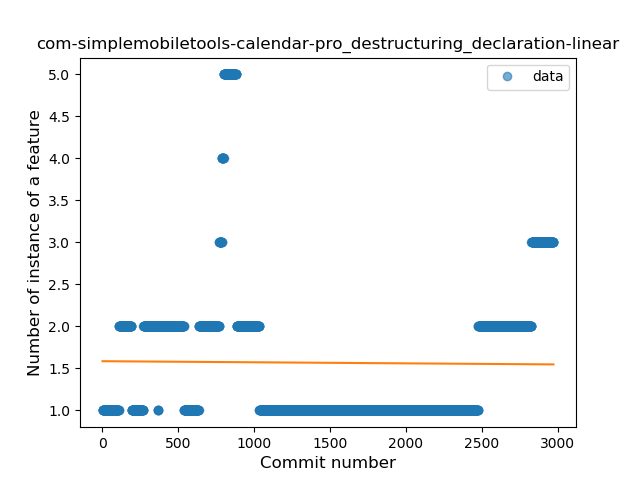

#### com-glodanif-bluetoothchat
* Feature: Singleton
* Function: 
* R_Squared: 5.857e-05
 

#### com-bernaferrari-changedetection
* Feature: Smart Cast
* Function: 
* R_Squared: 2.06e-05
 

#### pl-org-seva-texter
* Feature: Unsafe Call
* Function: 
* R_Squared: 9.7e-07
 

#### fr-xgouchet-packageexplorer
* Feature: Sealed Class
* Function: 
* R_Squared: 0.0
 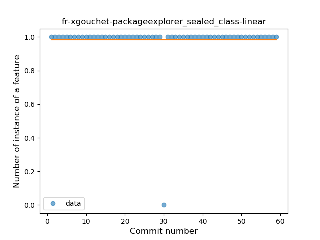

