## Sudden Rise
----
**377** best fit

#### 39aldo39-DecSyncCC
* Feature: Type Inference
* Function: 
* R_Squared: 1.0
 

#### colesadam-hill-lists
* Feature: Type Inference
* Function: 
* R_Squared: 1.0
 

#### 39aldo39-DecSyncCC
* Feature: Lambda
* Function: 
* R_Squared: 1.0
 

#### iPoli-iPoli-android
* Feature: Function call with Named Argument
* Function: 
* R_Squared: 0.99449478
 

#### iPoli-iPoli-android
* Feature: Lambda
* Function: 
* R_Squared: 0.99449307
 

#### iPoli-iPoli-android
* Feature: Type Inference
* Function: 
* R_Squared: 0.99402818
 

#### iPoli-iPoli-android
* Feature: String Template
* Function: 
* R_Squared: 0.99141284
 

#### iPoli-iPoli-android
* Feature: Function with Default Value
* Function: 
* R_Squared: 0.99095397
 

#### kaeptmblaubaer1000-android-torchlight
* Feature: Type Inference
* Function: 
* R_Squared: 0.98934511
 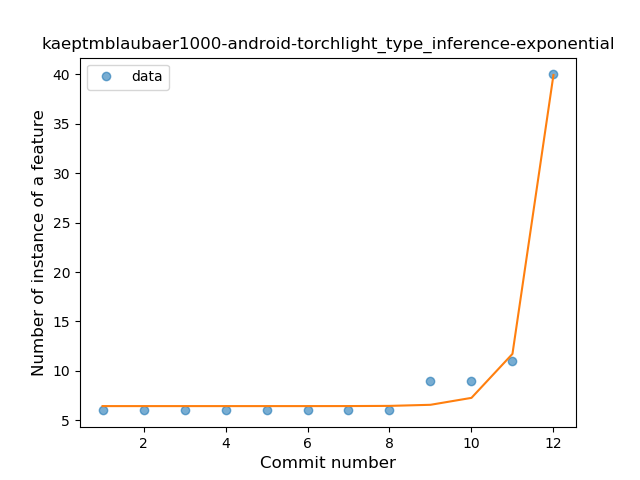

#### k9mail-k-9
* Feature: Type Inference
* Function: 
* R_Squared: 0.9889068
 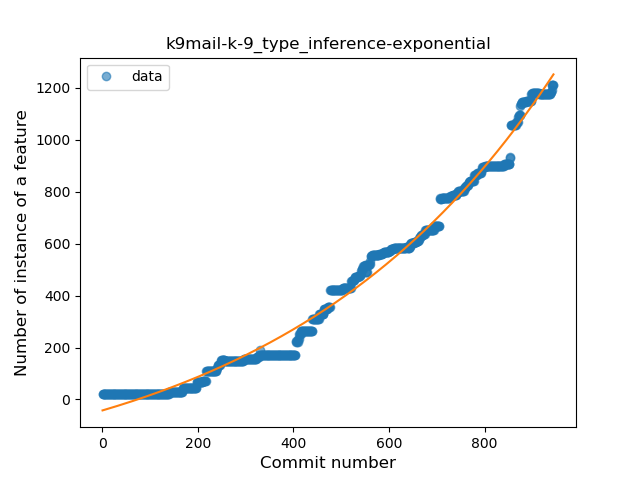

#### esafirm-android-playground
* Feature: Type Inference
* Function: 
* R_Squared: 0.98883006
 

#### iPoli-iPoli-android
* Feature: Data Class
* Function: 
* R_Squared: 0.98870478
 

#### esafirm-android-playground
* Feature: Lambda
* Function: 
* R_Squared: 0.98869464
 

#### CypherpunkArmory-UserLAnd
* Feature: Type Inference
* Function: 
* R_Squared: 0.98774292
 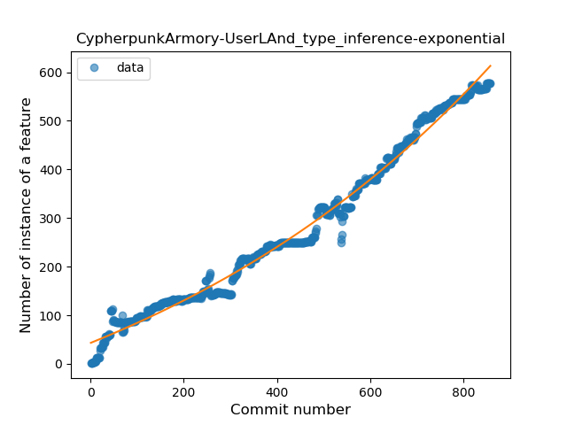

#### orgzly-orgzly-android
* Feature: Companion Object
* Function: 
* R_Squared: 0.98691528
 

#### TwidereProject-Twidere-Android
* Feature: String Template
* Function: 
* R_Squared: 0.98691298
 

#### iPoli-iPoli-android
* Feature: When expression
* Function: 
* R_Squared: 0.98673898
 

#### iPoli-iPoli-android
* Feature: Unsafe Call
* Function: 
* R_Squared: 0.98615676
 

#### iPoli-iPoli-android
* Feature: Property Delegation
* Function: 
* R_Squared: 0.98467334
 

#### mozilla-mobile-focus-android
* Feature: When expression
* Function: 
* R_Squared: 0.98394441
 

#### iPoli-iPoli-android
* Feature: Singleton
* Function: 
* R_Squared: 0.98368069
 

#### iPoli-iPoli-android
* Feature: Smart Cast
* Function: 
* R_Squared: 0.98326608
 

#### Apolline-Lille-apolline-android
* Feature: Lambda
* Function: 
* R_Squared: 0.98251516
 

#### mozilla-mobile-focus-android
* Feature: Safe Call
* Function: 
* R_Squared: 0.98221293
 

#### qklabs-qksms
* Feature: Safe Call
* Function: 
* R_Squared: 0.98212271
 

#### qklabs-qksms
* Feature: String Template
* Function: 
* R_Squared: 0.9811311
 

#### SimpleMobileTools-Simple-Gallery
* Feature: Lambda
* Function: 
* R_Squared: 0.9811054
 

#### mozilla-mobile-focus-android
* Feature: Lambda
* Function: 
* R_Squared: 0.97882923
 

#### iPoli-iPoli-android
* Feature: Safe Call
* Function: 
* R_Squared: 0.97864408
 

#### mozilla-mobile-focus-android
* Feature: Companion Object
* Function: 
* R_Squared: 0.97847988
 

#### inorichi-tachiyomi
* Feature: Extension Function
* Function: 
* R_Squared: 0.97749712
 

#### orgzly-orgzly-android
* Feature: Type Inference
* Function: 
* R_Squared: 0.97717863
 

#### iPoli-iPoli-android
* Feature: Extension Function
* Function: 
* R_Squared: 0.97656821
 

#### TwidereProject-Twidere-Android
* Feature: Destructuring Declaration
* Function: 
* R_Squared: 0.97641722
 

#### thaapasa-jalkametri-android
* Feature: Type Inference
* Function: 
* R_Squared: 0.97413051
 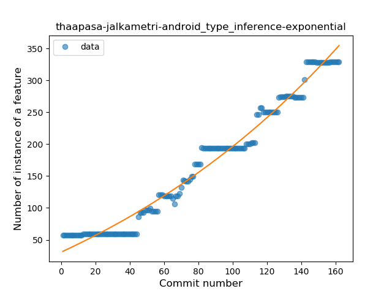

#### ligi-PassAndroid
* Feature: Function call with Named Argument
* Function: 
* R_Squared: 0.97385702
 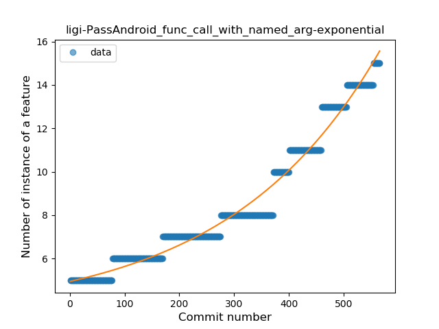

#### peterLaurence-TrekAdvisor
* Feature: Lambda
* Function: 
* R_Squared: 0.97310275
 

#### hypeapps-episodie
* Feature: Function call with Named Argument
* Function: 
* R_Squared: 0.97279367
 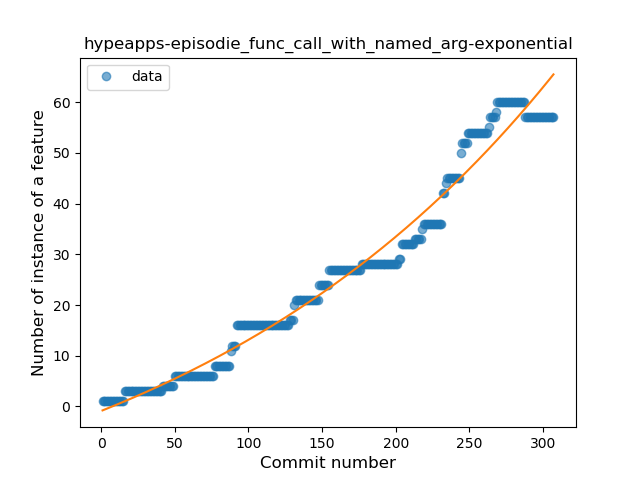

#### hypeapps-episodie
* Feature: Safe Call
* Function: 
* R_Squared: 0.97278353
 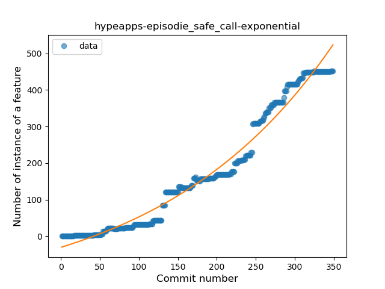

#### AllanWang-Frost-for-Facebook
* Feature: Type Inference
* Function: 
* R_Squared: 0.97245012
 

#### iPoli-iPoli-android
* Feature: Companion Object
* Function: 
* R_Squared: 0.97190085
 

#### BijoySingh-Material-Notes-Android-App
* Feature: Safe Call
* Function: 
* R_Squared: 0.97056948
 

#### PaulWoitaschek-Voice
* Feature: Function call with Named Argument
* Function: 
* R_Squared: 0.9704958
 

#### eurofurence-ef-app_android
* Feature: Lambda
* Function: 
* R_Squared: 0.9701468
 

#### Mygod-VPNHotspot
* Feature: Companion Object
* Function: 
* R_Squared: 0.96996194
 

#### blastrock-kaqui
* Feature: String Template
* Function: 
* R_Squared: 0.96980238
 

#### Doctoror-ParticleConstellationsLiveWallpaper
* Feature: Lambda
* Function: 
* R_Squared: 0.96957204
 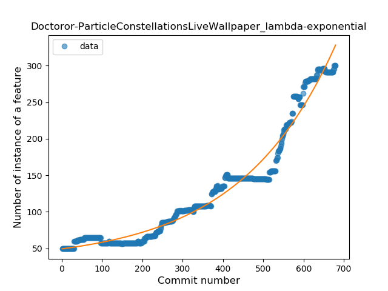

#### hypeapps-episodie
* Feature: Lambda
* Function: 
* R_Squared: 0.96953567
 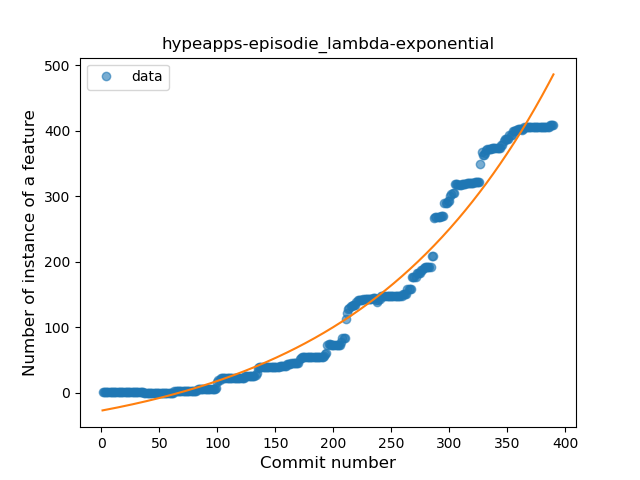

#### moko256-twitlatte
* Feature: Lambda
* Function: 
* R_Squared: 0.9692751
 

#### inorichi-tachiyomi
* Feature: Function with Default Value
* Function: 
* R_Squared: 0.96831433
 

#### iPoli-iPoli-android
* Feature: Destructuring Declaration
* Function: 
* R_Squared: 0.96757739
 

#### peterLaurence-TrekAdvisor
* Feature: Extension Function
* Function: 
* R_Squared: 0.96562541
 

#### SimpleMobileTools-Simple-Notes
* Feature: Lambda
* Function: 
* R_Squared: 0.96557538
 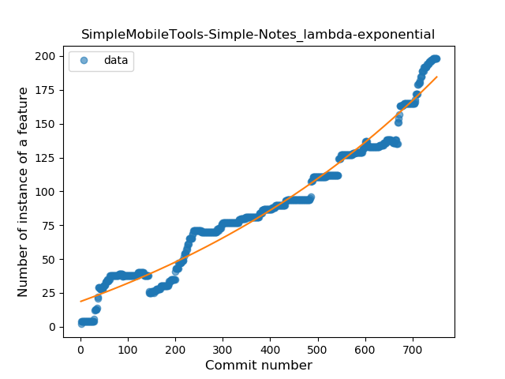

#### ccomeaux-boardgamegeek4android
* Feature: When expression
* Function: 
* R_Squared: 0.96547085
 

#### apoi-quickbeer-android
* Feature: Type Inference
* Function: 
* R_Squared: 0.96523869
 

#### BijoySingh-Material-Notes-Android-App
* Feature: When expression
* Function: 
* R_Squared: 0.96480429
 

#### BijoySingh-Material-Notes-Android-App
* Feature: Lambda
* Function: 
* R_Squared: 0.96468819
 

#### premnirmal-StockTicker
* Feature: Lambda
* Function: 
* R_Squared: 0.96437342
 

#### mozilla-mobile-focus-android
* Feature: Type Inference
* Function: 
* R_Squared: 0.96396412
 

#### hypeapps-episodie
* Feature: Data Class
* Function: 
* R_Squared: 0.96382197
 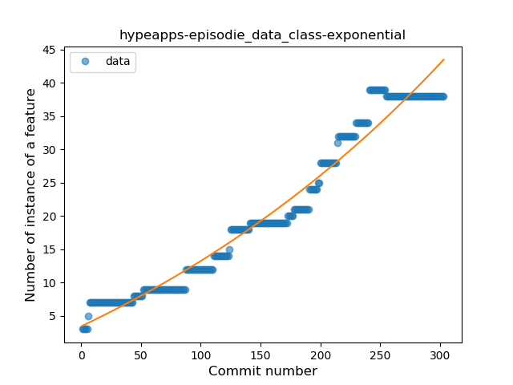

#### ykrank-S1-Next
* Feature: Safe Call
* Function: 
* R_Squared: 0.96294861
 

#### esafirm-android-playground
* Feature: Extension Function
* Function: 
* R_Squared: 0.96242967
 

#### ykrank-S1-Next
* Feature: String Template
* Function: 
* R_Squared: 0.96181391
 

#### apoi-quickbeer-android
* Feature: Lambda
* Function: 
* R_Squared: 0.9618066
 

#### syncthing-syncthing-lite
* Feature: Function call with Named Argument
* Function: 
* R_Squared: 0.96116636
 

#### PaulWoitaschek-Voice
* Feature: Function with Default Value
* Function: 
* R_Squared: 0.96104751
 

#### corphish-NightLight
* Feature: Type Inference
* Function: 
* R_Squared: 0.96093975
 

#### TeMoMuKo-AutoStopRace
* Feature: Type Inference
* Function: 
* R_Squared: 0.95963202
 

#### johnperry-math-Chinese-Remainder-Clock
* Feature: When expression
* Function: 
* R_Squared: 0.9594233
 

#### inorichi-tachiyomi
* Feature: Data Class
* Function: 
* R_Squared: 0.95872946
 

#### eurofurence-ef-app_android
* Feature: Safe Call
* Function: 
* R_Squared: 0.95780385
 

#### k9mail-k-9
* Feature: Lambda
* Function: 
* R_Squared: 0.95741746
 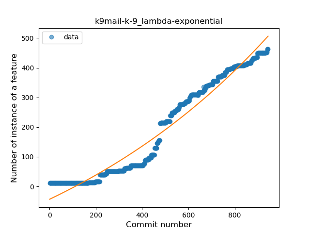

#### TwidereProject-Twidere-Android
* Feature: Overloaded Operator
* Function: 
* R_Squared: 0.95714012
 

#### proxer-ProxerAndroid
* Feature: Extension Function
* Function: 
* R_Squared: 0.95706419
 

#### SimpleMobileTools-Simple-Notes
* Feature: Safe Call
* Function: 
* R_Squared: 0.95701333
 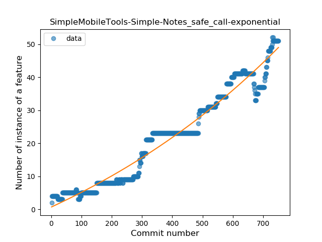

#### CypherpunkArmory-UserLAnd
* Feature: Function with Default Value
* Function: 
* R_Squared: 0.95691932
 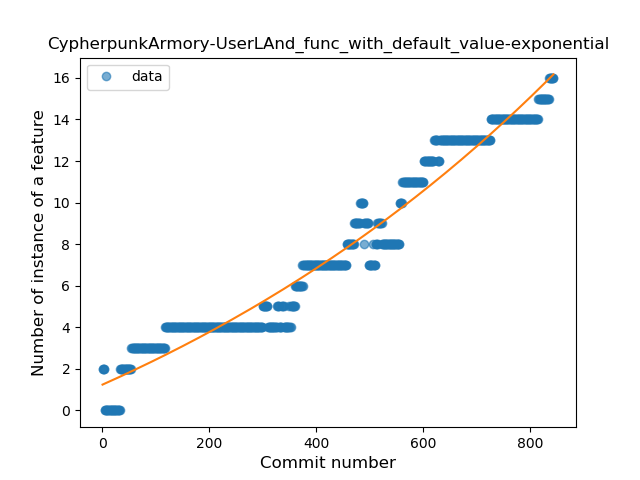

#### ScreamingHawk-phone-saver
* Feature: String Template
* Function: 
* R_Squared: 0.95678528
 

#### BijoySingh-Material-Notes-Android-App
* Feature: Function with Default Value
* Function: 
* R_Squared: 0.95660024
 

#### moko256-twitlatte
* Feature: Type Inference
* Function: 
* R_Squared: 0.95629165
 

#### aminecmi-ReaderforSelfoss
* Feature: Lambda
* Function: 
* R_Squared: 0.95597166
 

#### thanksmister-androidthings-mqtt-alarm-panel
* Feature: Type Inference
* Function: 
* R_Squared: 0.9551462
 

#### SimpleMobileTools-Simple-Contacts
* Feature: Function call with Named Argument
* Function: 
* R_Squared: 0.95432148
 

#### anthonycr-Lightning-Browser
* Feature: Inline Function
* Function: 
* R_Squared: 0.95420394
 

#### LaurentTreguier-deck
* Feature: Lambda
* Function: 
* R_Squared: 0.95291549
 

#### thanksmister-androidthings-mqtt-alarm-panel
* Feature: Companion Object
* Function: 
* R_Squared: 0.9528415
 

#### premnirmal-StockTicker
* Feature: Function with Default Value
* Function: 
* R_Squared: 0.95281823
 

#### AIDEA775-UNCmorfi
* Feature: Lambda
* Function: 
* R_Squared: 0.95127895
 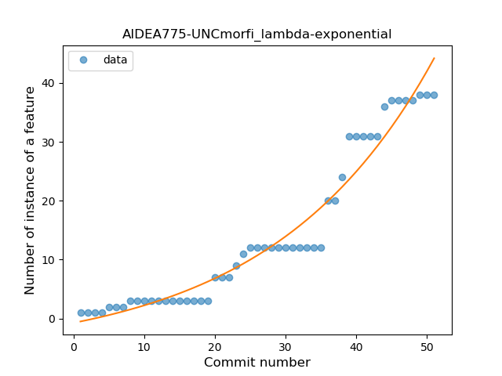

#### herbeth1u-VNDB-Android
* Feature: Safe Call
* Function: 
* R_Squared: 0.95091204
 

#### thanksmister-androidthings-mqtt-alarm-panel
* Feature: Lambda
* Function: 
* R_Squared: 0.94831031
 

#### SimpleMobileTools-Simple-Gallery
* Feature: Safe Call
* Function: 
* R_Squared: 0.9475656
 

#### proxer-ProxerAndroid
* Feature: Lambda
* Function: 
* R_Squared: 0.9475466
 

#### herbeth1u-VNDB-Android
* Feature: Property Delegation
* Function: 
* R_Squared: 0.94716259
 

#### inorichi-tachiyomi
* Feature: Function call with Named Argument
* Function: 
* R_Squared: 0.94636448
 

#### MGaetan89-ShowsRage
* Feature: Lambda
* Function: 
* R_Squared: 0.94562325
 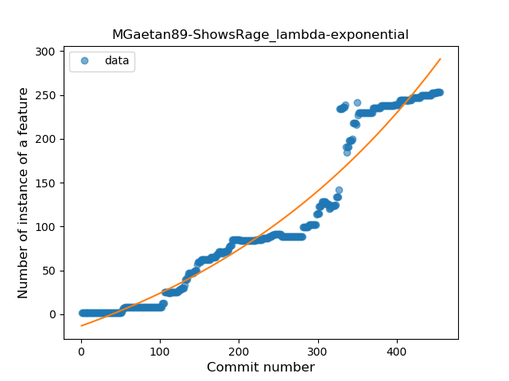

#### apoi-quickbeer-android
* Feature: Companion Object
* Function: 
* R_Squared: 0.94546417
 

#### peterLaurence-TrekAdvisor
* Feature: Function with Default Value
* Function: 
* R_Squared: 0.94532541
 

#### proxer-ProxerAndroid
* Feature: Safe Call
* Function: 
* R_Squared: 0.94413017
 

#### ligi-gobandroid
* Feature: Companion Object
* Function: 
* R_Squared: 0.94327176
 

#### devmil-PaperLaunch
* Feature: Safe Call
* Function: 
* R_Squared: 0.94306854
 

#### ccomeaux-boardgamegeek4android
* Feature: Lambda
* Function: 
* R_Squared: 0.94304455
 

#### fedepaol-BikeSharing
* Feature: Type Inference
* Function: 
* R_Squared: 0.94220521
 

#### SimpleMobileTools-Simple-Calendar
* Feature: Smart Cast
* Function: 
* R_Squared: 0.94211156
 

#### k9mail-k-9
* Feature: Function call with Named Argument
* Function: 
* R_Squared: 0.94153245
 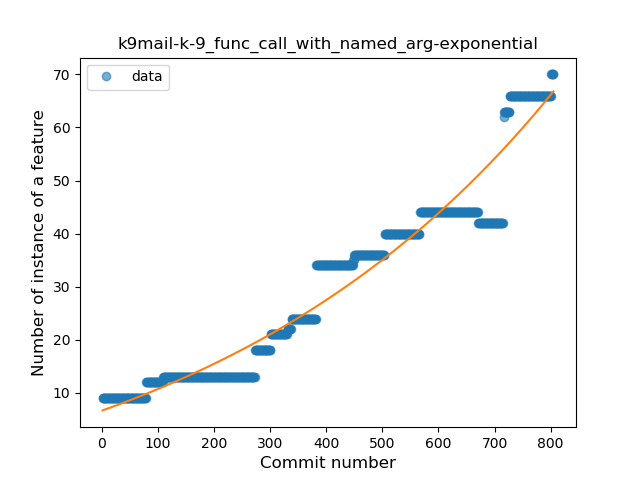

#### baz8080-folkets_android
* Feature: Type Inference
* Function: 
* R_Squared: 0.94128005
 

#### DSteve595-Put.io
* Feature: Smart Cast
* Function: 
* R_Squared: 0.94099614
 

#### charlesmadere-smash-ranks-android
* Feature: Function with Default Value
* Function: 
* R_Squared: 0.94060179
 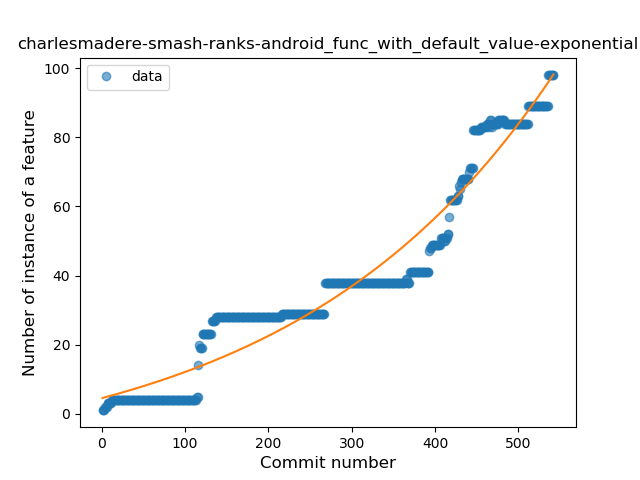

#### syncthing-syncthing-lite
* Feature: Singleton
* Function: 
* R_Squared: 0.94058161
 

#### k9mail-k-9
* Feature: Smart Cast
* Function: 
* R_Squared: 0.94055534
 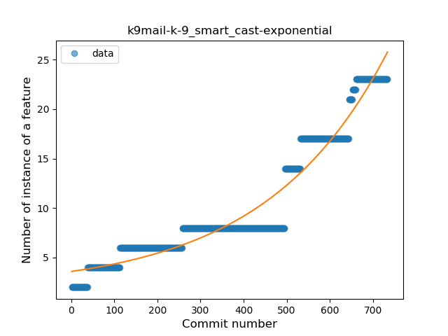

#### AllanWang-Frost-for-Facebook
* Feature: Smart Cast
* Function: 
* R_Squared: 0.94043219
 

#### apoi-quickbeer-android
* Feature: When expression
* Function: 
* R_Squared: 0.94006181
 

#### sjnyag-stamp
* Feature: Extension Function
* Function: 
* R_Squared: 0.93973916
 

#### hyst329-OpenFool
* Feature: Safe Call
* Function: 
* R_Squared: 0.9387216
 

#### AllanWang-Frost-for-Facebook
* Feature: String Template
* Function: 
* R_Squared: 0.93818556
 

#### orgzly-orgzly-android
* Feature: When expression
* Function: 
* R_Squared: 0.93792473
 

#### jereksel-Bucket
* Feature: Singleton
* Function: 
* R_Squared: 0.93725033
 

#### WilderPereira-lmgtfyGen
* Feature: Lambda
* Function: 
* R_Squared: 0.93702632
 

#### inorichi-tachiyomi
* Feature: Smart Cast
* Function: 
* R_Squared: 0.9369925
 

#### ccomeaux-boardgamegeek4android
* Feature: Safe Call
* Function: 
* R_Squared: 0.9364141
 

#### sreich-android-count-the-days
* Feature: Lambda
* Function: 
* R_Squared: 0.93601312
 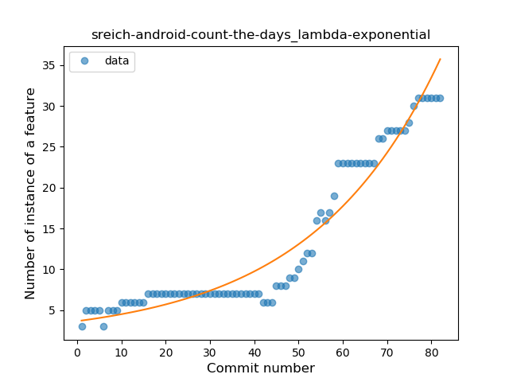

#### Maxr1998-MaxLock
* Feature: Type Inference
* Function: 
* R_Squared: 0.93467907
 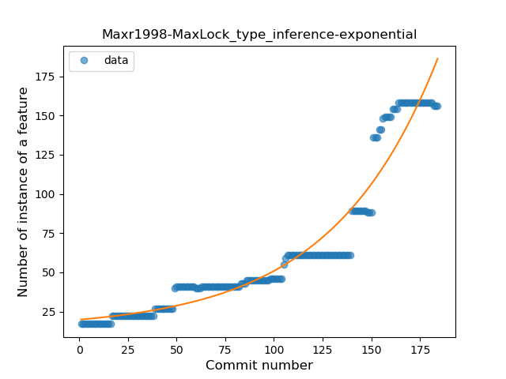

#### moko256-twitlatte
* Feature: Extension Function
* Function: 
* R_Squared: 0.93235378
 

#### kaeptmblaubaer1000-android-torchlight
* Feature: Singleton
* Function: 
* R_Squared: 0.93230227
 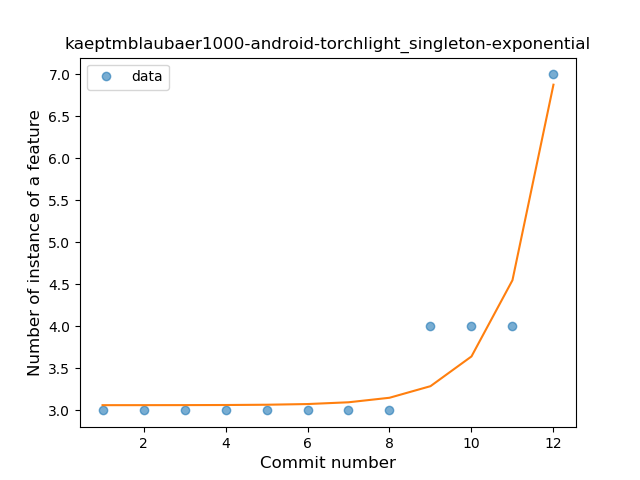

#### hyst329-OpenFool
* Feature: Lambda
* Function: 
* R_Squared: 0.93218004
 

#### ofalvai-BPInfo
* Feature: Singleton
* Function: 
* R_Squared: 0.93210968
 

#### syrop-Wiktor-Navigator
* Feature: Companion Object
* Function: 
* R_Squared: 0.93191648
 

#### Maxr1998-MaxLock
* Feature: Lambda
* Function: 
* R_Squared: 0.93104063
 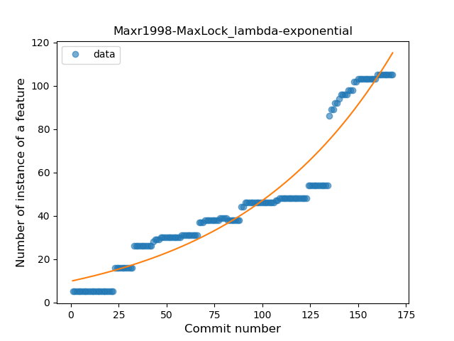

#### MrBIMC-SELinuxModeChanger
* Feature: Type Inference
* Function: 
* R_Squared: 0.9308057
 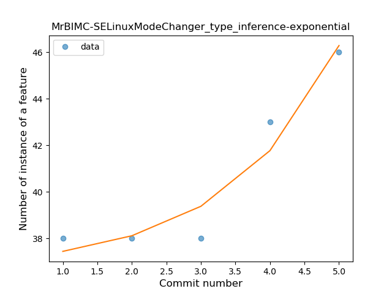

#### SimpleMobileTools-Simple-File-Manager
* Feature: Type Inference
* Function: 
* R_Squared: 0.93065246
 

#### hyst329-OpenFool
* Feature: Range Expression
* Function: 
* R_Squared: 0.9302629
 

#### proxer-ProxerAndroid
* Feature: Inline Function
* Function: 
* R_Squared: 0.9293949
 

#### shymmq-librus-client-kotlin
* Feature: Range Expression
* Function: 
* R_Squared: 0.92935144
 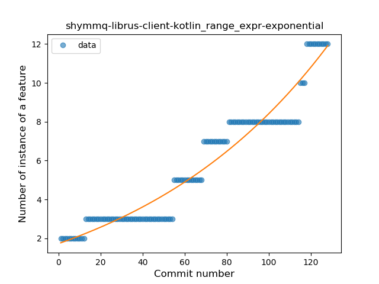

#### LISTEN-moe-android-app
* Feature: Safe Call
* Function: 
* R_Squared: 0.92900658
 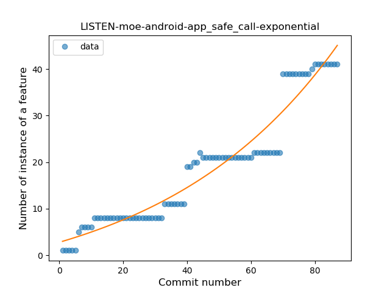

#### hypeapps-episodie
* Feature: Unsafe Call
* Function: 
* R_Squared: 0.92869805
 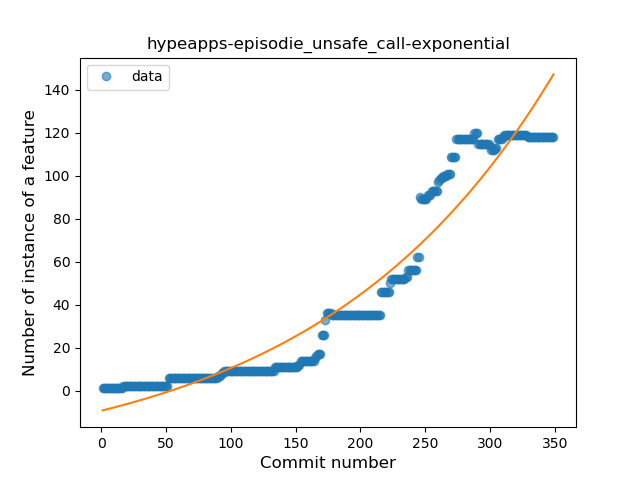

#### peterLaurence-TrekAdvisor
* Feature: Safe Call
* Function: 
* R_Squared: 0.92837583
 

#### proxer-ProxerAndroid
* Feature: Destructuring Declaration
* Function: 
* R_Squared: 0.92814855
 

#### iPoli-iPoli-android
* Feature: Range Expression
* Function: 
* R_Squared: 0.92775357
 

#### ccomeaux-boardgamegeek4android
* Feature: Function call with Named Argument
* Function: 
* R_Squared: 0.92639365
 

#### ligi-gobandroid
* Feature: Lambda
* Function: 
* R_Squared: 0.9263354
 

#### loloof64-BasicChessEndGamesTrainer
* Feature: Unsafe Call
* Function: 
* R_Squared: 0.92604757
 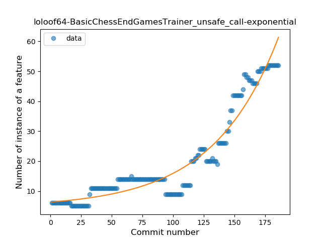

#### blokadaorg-blokada
* Feature: Function with Default Value
* Function: 
* R_Squared: 0.92583471
 

#### TwidereProject-Twidere-Android
* Feature: Inline Function
* Function: 
* R_Squared: 0.92391848
 

#### anthonycr-Lightning-Browser
* Feature: Extension Function
* Function: 
* R_Squared: 0.92374714
 

#### joaomneto-TitanCompanion
* Feature: Lambda
* Function: 
* R_Squared: 0.92347839
 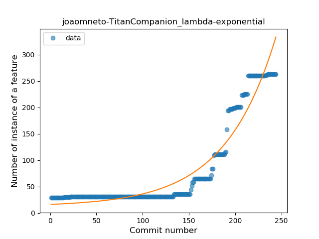

#### PaulWoitaschek-Voice
* Feature: Singleton
* Function: 
* R_Squared: 0.92326317
 

#### loloof64-BasicChessEndGamesTrainer
* Feature: Extension Function
* Function: 
* R_Squared: 0.92253969
 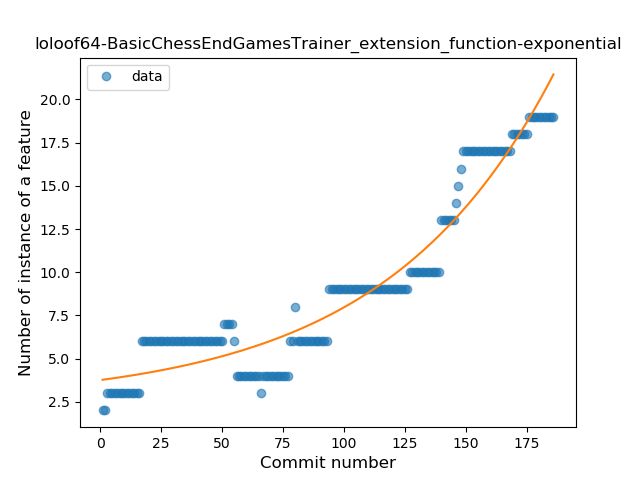

#### commons-app-apps-android-commons
* Feature: Lambda
* Function: 
* R_Squared: 0.9223149
 

#### SimpleMobileTools-Simple-Gallery
* Feature: Function with Default Value
* Function: 
* R_Squared: 0.92222054
 

#### emansih-FireflyMobile
* Feature: Function with Default Value
* Function: 
* R_Squared: 0.92154037
 

#### Apolline-Lille-apolline-android
* Feature: Type Inference
* Function: 
* R_Squared: 0.92128715
 

#### sjnyag-stamp
* Feature: Smart Cast
* Function: 
* R_Squared: 0.92082411
 

#### ligi-gobandroid
* Feature: Type Inference
* Function: 
* R_Squared: 0.91978435
 

#### fvasco-pinpoi
* Feature: Safe Call
* Function: 
* R_Squared: 0.91839515
 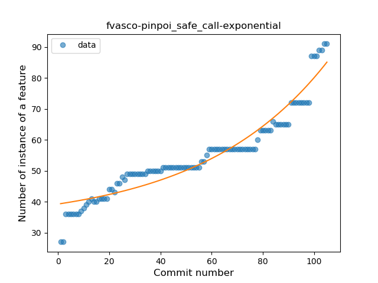

#### vector-im-riot-android
* Feature: Singleton
* Function: 
* R_Squared: 0.91818474
 

#### mozilla-mobile-focus-android
* Feature: Function with Default Value
* Function: 
* R_Squared: 0.91788814
 

#### loloof64-BasicChessEndGamesTrainer
* Feature: Safe Call
* Function: 
* R_Squared: 0.91749516
 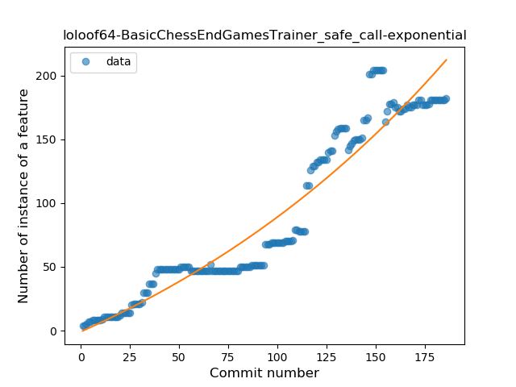

#### ohmae-VoiceMessageBoard
* Feature: Smart Cast
* Function: 
* R_Squared: 0.91688529
 

#### apoi-quickbeer-android
* Feature: Safe Call
* Function: 
* R_Squared: 0.91617899
 

#### enjoyingfoss-om
* Feature: Lambda
* Function: 
* R_Squared: 0.91586982
 

#### Commit451-LabCoat
* Feature: Safe Call
* Function: 
* R_Squared: 0.91545841
 

#### k9mail-k-9
* Feature: Destructuring Declaration
* Function: 
* R_Squared: 0.91532252
 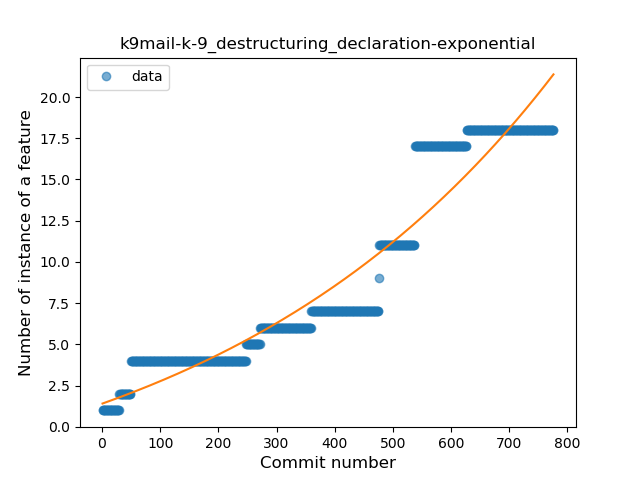

#### ligi-gobandroid
* Feature: Property Delegation
* Function: 
* R_Squared: 0.9148276
 

#### loloof64-BasicChessEndGamesTrainer
* Feature: Function call with Named Argument
* Function: 
* R_Squared: 0.91477499
 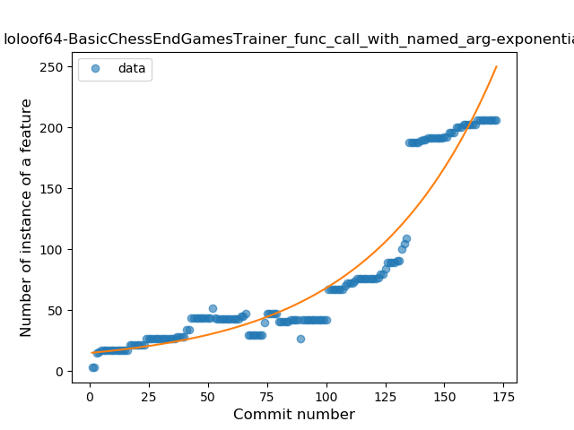

#### rosenpin-QuickDrawEverywhere
* Feature: Lambda
* Function: 
* R_Squared: 0.91471004
 

#### ccomeaux-boardgamegeek4android
* Feature: Extension Function
* Function: 
* R_Squared: 0.91389119
 

#### aminecmi-ReaderforSelfoss
* Feature: Extension Function
* Function: 
* R_Squared: 0.91372087
 

#### loloof64-BasicChessEndGamesTrainer
* Feature: Type Inference
* Function: 
* R_Squared: 0.91306767
 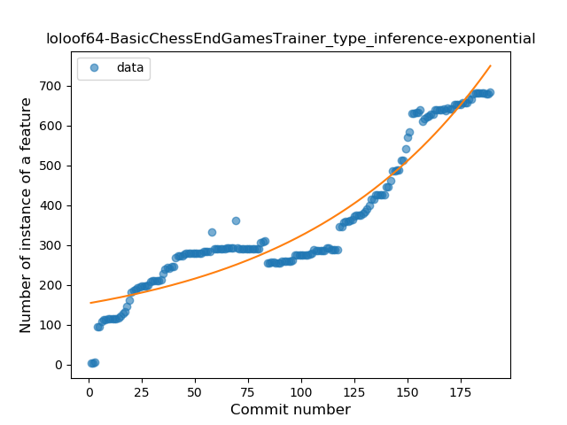

#### proxer-ProxerAndroid
* Feature: Data Class
* Function: 
* R_Squared: 0.9128756
 

#### devmil-PaperLaunch
* Feature: Lambda
* Function: 
* R_Squared: 0.91271147
 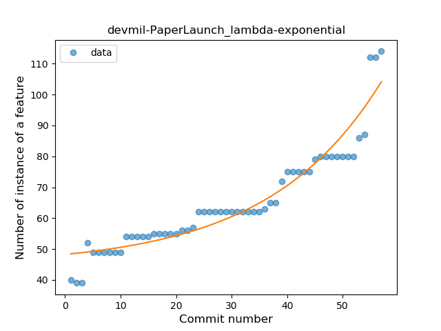

#### CypherpunkArmory-UserLAnd
* Feature: Destructuring Declaration
* Function: 
* R_Squared: 0.91263543
 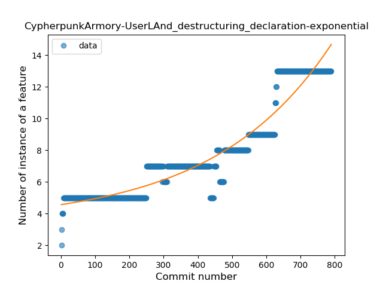

#### k9mail-k-9
* Feature: Safe Call
* Function: 
* R_Squared: 0.9125301
 

#### fvasco-pinpoi
* Feature: Range Expression
* Function: 
* R_Squared: 0.91235843
 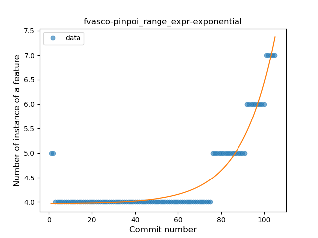

#### ligi-gobandroid
* Feature: Unsafe Call
* Function: 
* R_Squared: 0.91235144
 

#### walleth-walleth
* Feature: Function with Default Value
* Function: 
* R_Squared: 0.91220002
 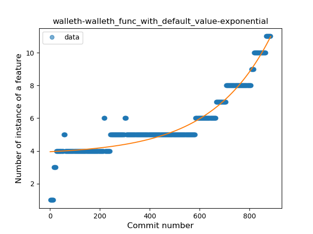

#### moko256-twitlatte
* Feature: Data Class
* Function: 
* R_Squared: 0.911988
 

#### qklabs-qksms
* Feature: Unsafe Call
* Function: 
* R_Squared: 0.91120122
 

#### SimpleMobileTools-Simple-File-Manager
* Feature: String Template
* Function: 
* R_Squared: 0.91108874
 

#### nibarius-opera-park-android
* Feature: Safe Call
* Function: 
* R_Squared: 0.91088577
 

#### anthonycr-Lightning-Browser
* Feature: Function with Default Value
* Function: 
* R_Squared: 0.91084846
 

#### PaulWoitaschek-Voice
* Feature: Data Class
* Function: 
* R_Squared: 0.90993817
 

#### mastizada-focus-android
* Feature: Type Inference
* Function: 
* R_Squared: 0.90902239
 

#### Valodim-Stratum0Widget
* Feature: When expression
* Function: 
* R_Squared: 0.90892848
 

#### mozilla-mobile-focus-android
* Feature: Property Delegation
* Function: 
* R_Squared: 0.90817102
 

#### LawnchairLauncher-Lawnchair
* Feature: When expression
* Function: 
* R_Squared: 0.90798242
 

#### SimpleMobileTools-Simple-Flashlight
* Feature: Lambda
* Function: 
* R_Squared: 0.90759844
 

#### apoi-quickbeer-android
* Feature: Unsafe Call
* Function: 
* R_Squared: 0.90738309
 

#### MGaetan89-ShowsRage
* Feature: String Template
* Function: 
* R_Squared: 0.90642802
 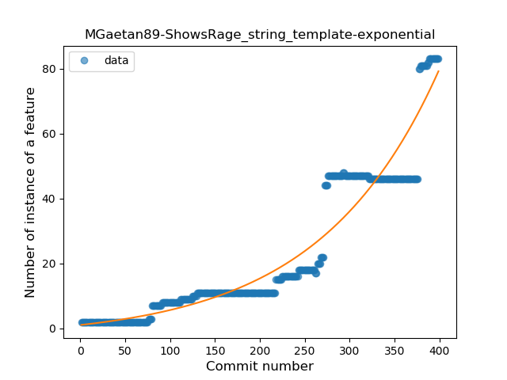

#### ligi-gobandroid
* Feature: Safe Call
* Function: 
* R_Squared: 0.90530826
 

#### ligi-PassAndroid
* Feature: Companion Object
* Function: 
* R_Squared: 0.90514827
 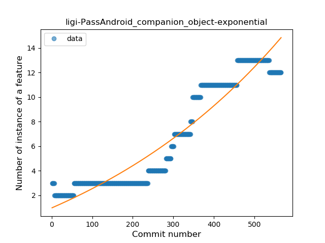

#### bottiger-SoundWaves
* Feature: Lambda
* Function: 
* R_Squared: 0.90476171
 

#### proxer-ProxerAndroid
* Feature: Property Delegation
* Function: 
* R_Squared: 0.9028402
 

#### BijoySingh-Material-Notes-Android-App
* Feature: Smart Cast
* Function: 
* R_Squared: 0.9011184
 

#### AllanWang-Frost-for-Facebook
* Feature: Function with Default Value
* Function: 
* R_Squared: 0.90003718
 

#### AllanWang-Frost-for-Facebook
* Feature: Companion Object
* Function: 
* R_Squared: 0.89893046
 

#### jereksel-Bucket
* Feature: Inline Function
* Function: 
* R_Squared: 0.8985021
 

#### syncthing-syncthing-lite
* Feature: Data Class
* Function: 
* R_Squared: 0.89844514
 

#### loloof64-BasicChessEndGamesTrainer
* Feature: When expression
* Function: 
* R_Squared: 0.89830127
 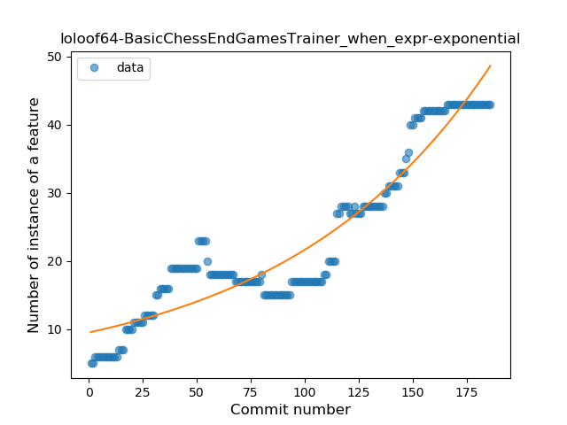

#### shymmq-librus-client-kotlin
* Feature: Unsafe Call
* Function: 
* R_Squared: 0.89748829
 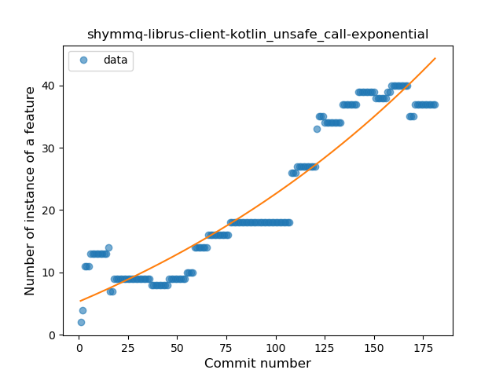

#### jkennethcarino-AnkiEditor
* Feature: Unsafe Call
* Function: 
* R_Squared: 0.89590257
 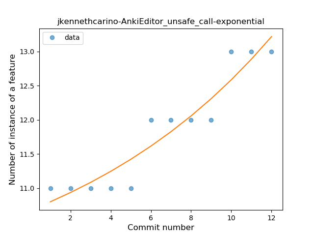

#### SimpleMobileTools-Simple-Notes
* Feature: Unsafe Call
* Function: 
* R_Squared: 0.89553092
 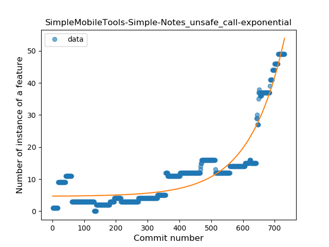

#### moko256-twitlatte
* Feature: Function call with Named Argument
* Function: 
* R_Squared: 0.89413933
 

#### ultrasonic-ultrasonic
* Feature: Singleton
* Function: 
* R_Squared: 0.89078761
 

#### SimpleMobileTools-Simple-Notes
* Feature: Function with Default Value
* Function: 
* R_Squared: 0.88903726
 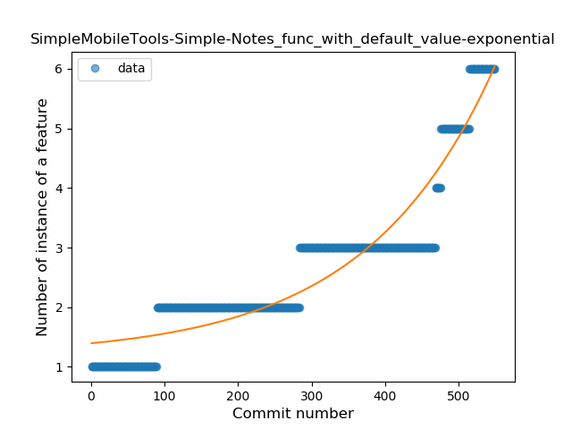

#### eurofurence-ef-app_android
* Feature: Destructuring Declaration
* Function: 
* R_Squared: 0.88880477
 

#### danirod-rectball
* Feature: Type Inference
* Function: 
* R_Squared: 0.88829035
 

#### LawnchairLauncher-Lawnchair
* Feature: Property Delegation
* Function: 
* R_Squared: 0.88775404
 

#### AllanWang-Frost-for-Facebook
* Feature: Overloaded Operator
* Function: 
* R_Squared: 0.88733434
 

#### citiususc-calendula
* Feature: Unsafe Call
* Function: 
* R_Squared: 0.88647797
 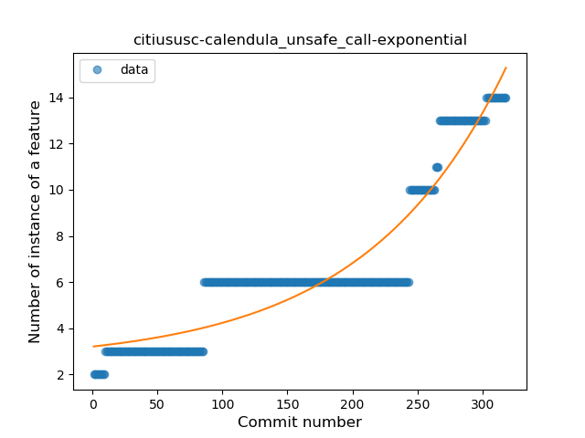

#### emansih-FireflyMobile
* Feature: String Template
* Function: 
* R_Squared: 0.88488348
 

#### thanksmister-androidthings-mqtt-alarm-panel
* Feature: When expression
* Function: 
* R_Squared: 0.88438868
 

#### kamgurgul-cpu-info
* Feature: Range Expression
* Function: 
* R_Squared: 0.88395936
 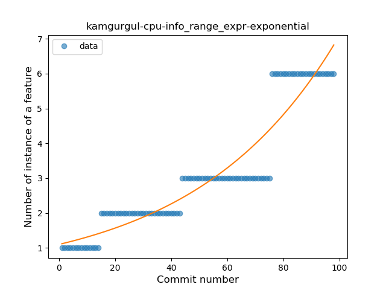

#### ccomeaux-boardgamegeek4android
* Feature: Smart Cast
* Function: 
* R_Squared: 0.88333543
 

#### SimpleMobileTools-Simple-Calendar
* Feature: Unsafe Call
* Function: 
* R_Squared: 0.88241362
 

#### walleth-walleth
* Feature: Data Class
* Function: 
* R_Squared: 0.88037776
 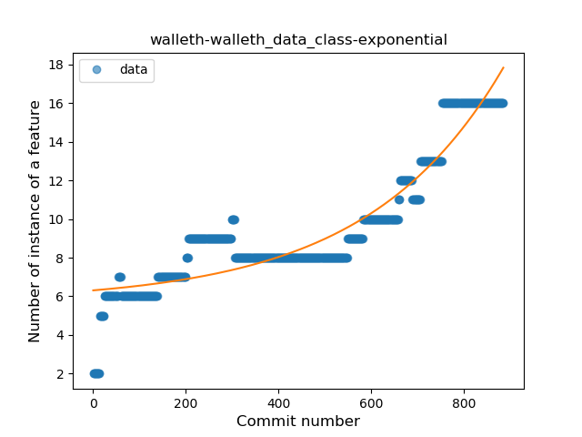

#### Apolline-Lille-apolline-android
* Feature: String Template
* Function: 
* R_Squared: 0.88016613
 

#### carlphilipp-chicago-commutes
* Feature: String Template
* Function: 
* R_Squared: 0.87976227
 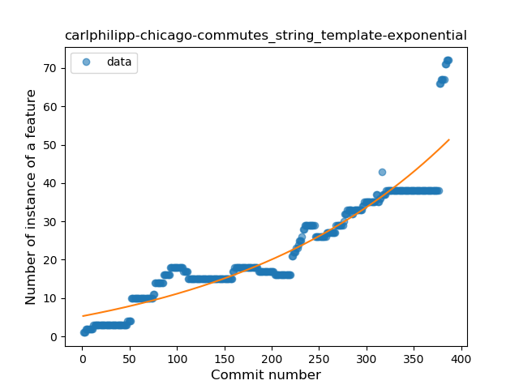

#### lenchan139-NCBookmark
* Feature: Unsafe Call
* Function: 
* R_Squared: 0.87947766
 

#### CypherpunkArmory-UserLAnd
* Feature: Safe Call
* Function: 
* R_Squared: 0.87846776
 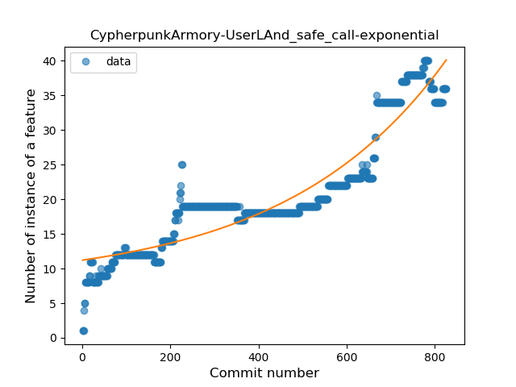

#### apiote-Bimba
* Feature: Function with Default Value
* Function: 
* R_Squared: 0.87837935
 

#### Mygod-VPNHotspot
* Feature: Destructuring Declaration
* Function: 
* R_Squared: 0.87632815
 

#### romannurik-muzei
* Feature: Smart Cast
* Function: 
* R_Squared: 0.87513442
 

#### LiMium-mini-vector-android
* Feature: Singleton
* Function: 
* R_Squared: 0.87477548
 

#### CypherpunkArmory-UserLAnd
* Feature: Smart Cast
* Function: 
* R_Squared: 0.87185564
 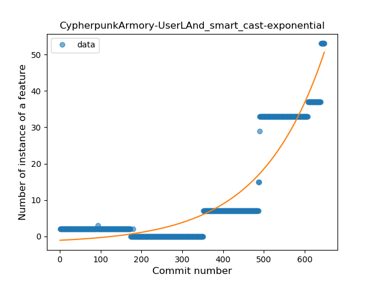

#### Doctoror-ParticleConstellationsLiveWallpaper
* Feature: Function call with Named Argument
* Function: 
* R_Squared: 0.8716069
 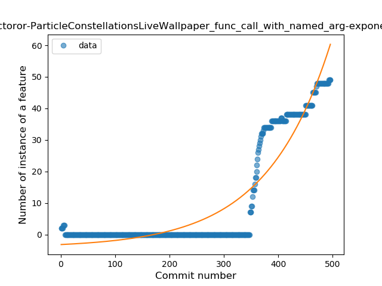

#### premnirmal-StockTicker
* Feature: Property Delegation
* Function: 
* R_Squared: 0.87056421
 

#### Doctoror-ParticleConstellationsLiveWallpaper
* Feature: Range Expression
* Function: 
* R_Squared: 0.86599126
 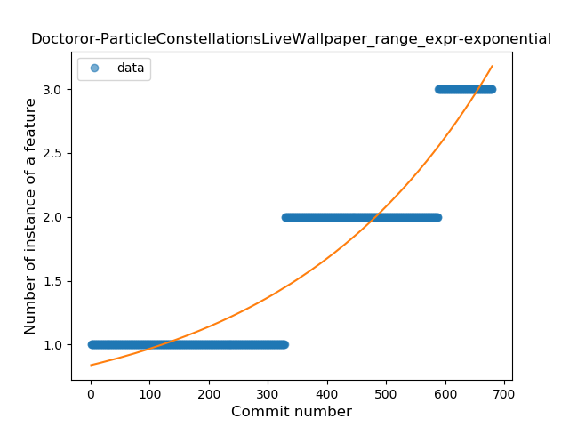

#### mastizada-focus-android
* Feature: Lambda
* Function: 
* R_Squared: 0.86590591
 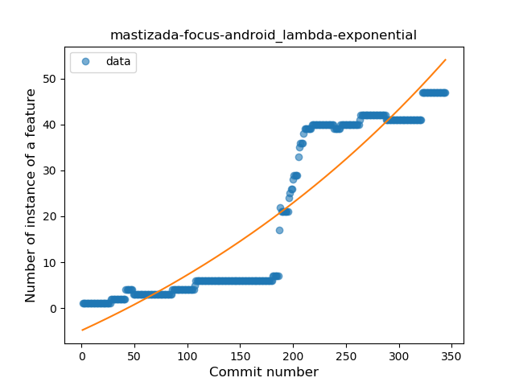

#### yshrsmz-monotweety
* Feature: Property Delegation
* Function: 
* R_Squared: 0.86490721
 

#### Mystery00-JanYoShare
* Feature: Safe Call
* Function: 
* R_Squared: 0.86473068
 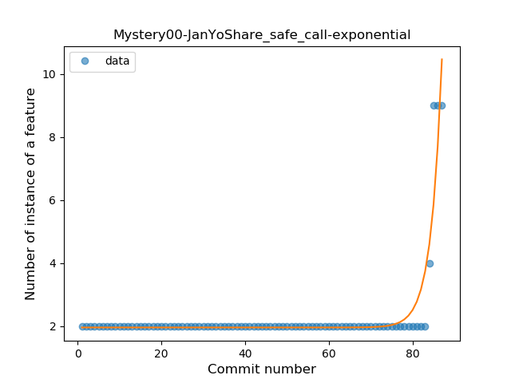

#### joaomneto-TitanCompanion
* Feature: Companion Object
* Function: 
* R_Squared: 0.86365934
 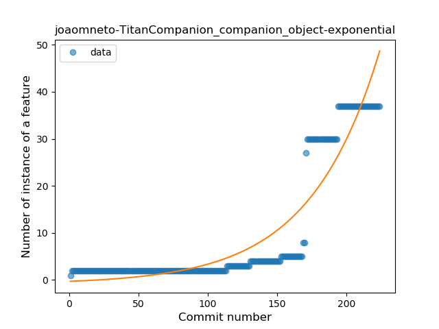

#### carlphilipp-chicago-commutes
* Feature: Property Delegation
* Function: 
* R_Squared: 0.8622986
 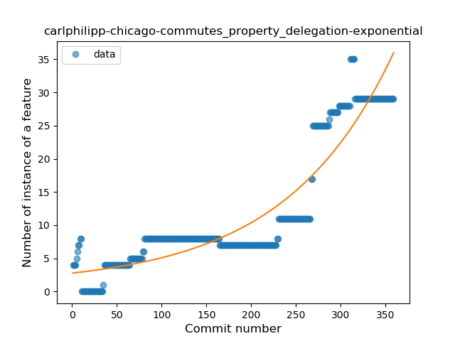

#### walleth-walleth
* Feature: String Template
* Function: 
* R_Squared: 0.86161096
 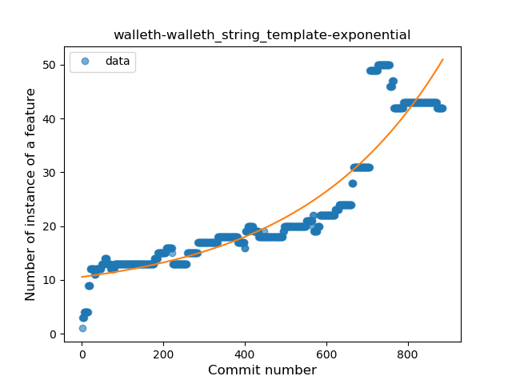

#### SimpleMobileTools-Simple-Gallery
* Feature: Data Class
* Function: 
* R_Squared: 0.8608556
 

#### proxer-ProxerAndroid
* Feature: Type Inference
* Function: 
* R_Squared: 0.85902316
 

#### orgzly-orgzly-android
* Feature: Unsafe Call
* Function: 
* R_Squared: 0.85855564
 

#### SimpleMobileTools-Simple-File-Manager
* Feature: Unsafe Call
* Function: 
* R_Squared: 0.85623308
 

#### proxer-ProxerAndroid
* Feature: Function call with Named Argument
* Function: 
* R_Squared: 0.85513616
 

#### Mygod-VPNHotspot
* Feature: Extension Function
* Function: 
* R_Squared: 0.85347163
 

#### thaapasa-jalkametri-android
* Feature: Safe Call
* Function: 
* R_Squared: 0.85324272
 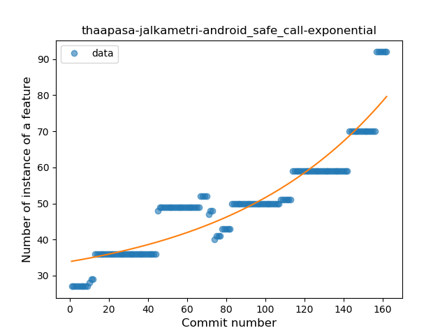

#### hyst329-OpenFool
* Feature: Destructuring Declaration
* Function: 
* R_Squared: 0.84992413
 

#### AllanWang-Frost-for-Facebook
* Feature: Extension Function
* Function: 
* R_Squared: 0.84758333
 

#### FengMoeTeam-NHentai-android
* Feature: Property Delegation
* Function: 
* R_Squared: 0.84724004
 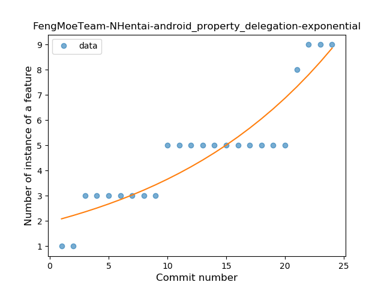

#### sjnyag-stamp
* Feature: String Template
* Function: 
* R_Squared: 0.84559186
 

#### mozilla-mobile-focus-android
* Feature: Function call with Named Argument
* Function: 
* R_Squared: 0.8436095
 

#### bubelov-coins-android
* Feature: Property Delegation
* Function: 
* R_Squared: 0.84324075
 

#### MGaetan89-ShowsRage
* Feature: Companion Object
* Function: 
* R_Squared: 0.84234298
 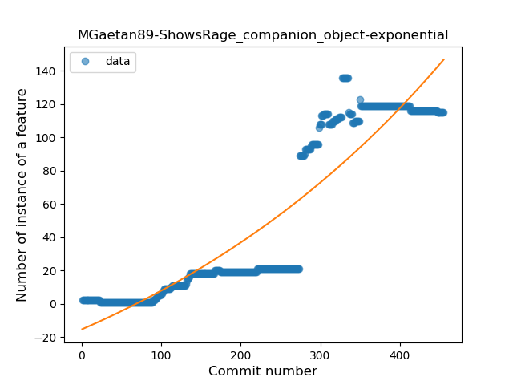

#### qklabs-qksms
* Feature: Singleton
* Function: 
* R_Squared: 0.83879221
 

#### hyst329-OpenFool
* Feature: Smart Cast
* Function: 
* R_Squared: 0.83794086
 

#### apiote-Bimba
* Feature: Overloaded Operator
* Function: 
* R_Squared: 0.83685149
 

#### bitfireAT-davdroid
* Feature: Smart Cast
* Function: 
* R_Squared: 0.83571959
 

#### blokadaorg-blokada
* Feature: Safe Call
* Function: 
* R_Squared: 0.83549043
 

#### quarck-CalendarNotification
* Feature: Extension Function
* Function: 
* R_Squared: 0.83455132
 

#### anthonycr-Lightning-Browser
* Feature: Range Expression
* Function: 
* R_Squared: 0.83405217
 

#### jereksel-Bucket
* Feature: Function call with Named Argument
* Function: 
* R_Squared: 0.83284289
 

#### nibarius-opera-park-android
* Feature: String Template
* Function: 
* R_Squared: 0.83157011
 

#### MGaetan89-ShowsRage
* Feature: Range Expression
* Function: 
* R_Squared: 0.83112933
 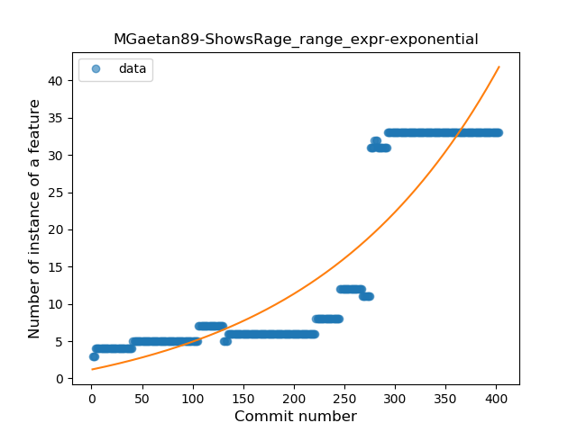

#### moko256-twitlatte
* Feature: String Template
* Function: 
* R_Squared: 0.83050997
 

#### jereksel-Bucket
* Feature: Destructuring Declaration
* Function: 
* R_Squared: 0.83019453
 

#### LaurentTreguier-deck
* Feature: When expression
* Function: 
* R_Squared: 0.83019415
 

#### blokadaorg-blokada
* Feature: Lambda
* Function: 
* R_Squared: 0.8263285
 

#### RocketChat-Rocket.Chat.Android
* Feature: Singleton
* Function: 
* R_Squared: 0.825697
 

#### rectangle-dbmi-Realtime-Port-Authority
* Feature: Function call with Named Argument
* Function: 
* R_Squared: 0.82483785
 

#### hsson-card-balance-app
* Feature: String Template
* Function: 
* R_Squared: 0.82355784
 

#### syncthing-syncthing-lite
* Feature: When expression
* Function: 
* R_Squared: 0.82290712
 

#### milosmns-Timecrypt
* Feature: Safe Call
* Function: 
* R_Squared: 0.82223793
 

#### loloof64-BasicChessEndGamesTrainer
* Feature: String Template
* Function: 
* R_Squared: 0.8220661
 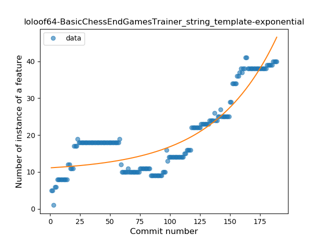

#### dkrivoruchko-ScreenStream
* Feature: Companion Object
* Function: 
* R_Squared: 0.82105785
 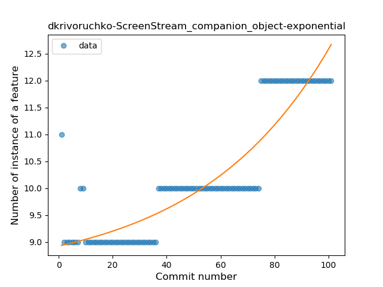

#### moko256-twitlatte
* Feature: Unsafe Call
* Function: 
* R_Squared: 0.82082841
 

#### Waboodoo-HTTP-Shortcuts
* Feature: Companion Object
* Function: 
* R_Squared: 0.82031541
 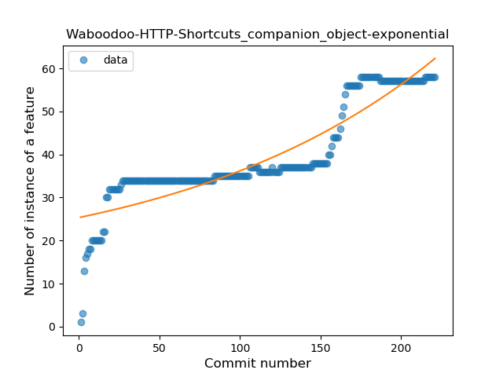

#### CypherpunkArmory-UserLAnd
* Feature: When expression
* Function: 
* R_Squared: 0.82001461
 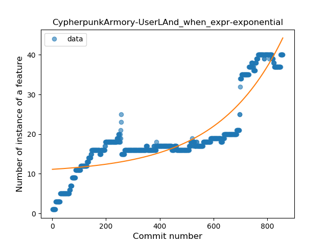

#### fvasco-pinpoi
* Feature: Extension Function
* Function: 
* R_Squared: 0.81916731
 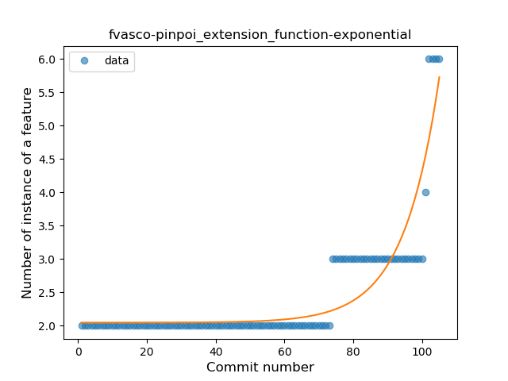

#### SimpleMobileTools-Simple-Flashlight
* Feature: Type Inference
* Function: 
* R_Squared: 0.81655264
 

#### anthonycr-Lightning-Browser
* Feature: Smart Cast
* Function: 
* R_Squared: 0.81504343
 

#### nibarius-opera-park-android
* Feature: Unsafe Call
* Function: 
* R_Squared: 0.81429429
 

#### tuskyapp-Tusky
* Feature: Unsafe Call
* Function: 
* R_Squared: 0.81276221
 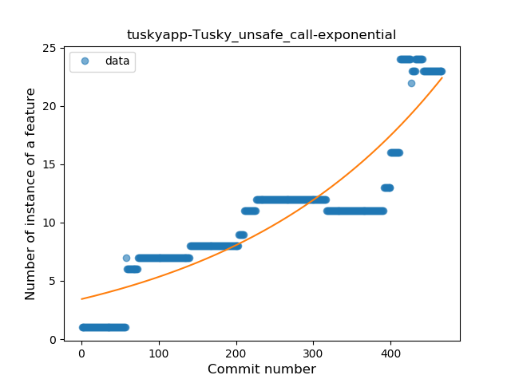

#### equeim-tremotesf-android
* Feature: Lambda
* Function: 
* R_Squared: 0.80950946
 

#### mozilla-mobile-focus-android
* Feature: Unsafe Call
* Function: 
* R_Squared: 0.80928262
 

#### xgouchet-Stanley
* Feature: Singleton
* Function: 
* R_Squared: 0.80810196
 

#### raatmarien-red-moon
* Feature: Range Expression
* Function: 
* R_Squared: 0.8070014
 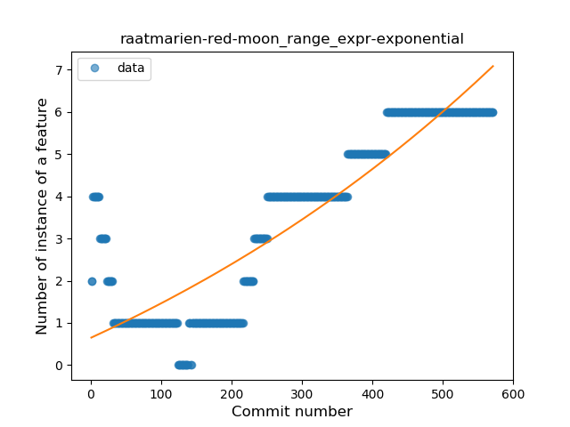

#### plusCubed-velociraptor
* Feature: Lambda
* Function: 
* R_Squared: 0.80698604
 

#### SimpleMobileTools-Simple-Calendar
* Feature: Function call with Named Argument
* Function: 
* R_Squared: 0.80591114
 

#### blokadaorg-blokada
* Feature: Type Inference
* Function: 
* R_Squared: 0.79836853
 

#### mpcjanssen-simpletask-android
* Feature: Smart Cast
* Function: 
* R_Squared: 0.79483535
 

#### SimpleMobileTools-Simple-Music-Player
* Feature: Extension Function
* Function: 
* R_Squared: 0.79270699
 

#### mpcjanssen-simpletask-android
* Feature: Destructuring Declaration
* Function: 
* R_Squared: 0.78975324
 

#### albertolalanda-new-ultrasonic-fork-for-MyMusicQoE
* Feature: Unsafe Call
* Function: 
* R_Squared: 0.78914756
 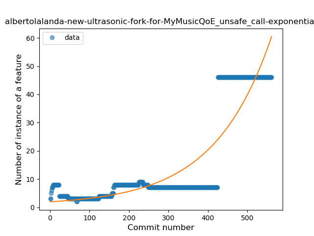

#### nibarius-opera-park-android
* Feature: When expression
* Function: 
* R_Squared: 0.78744947
 

#### ronocod-bus
* Feature: Function call with Named Argument
* Function: 
* R_Squared: 0.78665319
 

#### blokadaorg-blokada
* Feature: Function call with Named Argument
* Function: 
* R_Squared: 0.78651479
 

#### carlphilipp-chicago-commutes
* Feature: Safe Call
* Function: 
* R_Squared: 0.78552652
 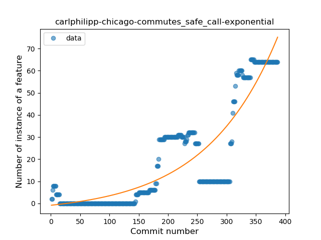

#### mpcjanssen-simpletask-android
* Feature: Property Delegation
* Function: 
* R_Squared: 0.7849501
 

#### iSoron-uhabits
* Feature: Companion Object
* Function: 
* R_Squared: 0.78281721
 

#### Doctoror-ParticleConstellationsLiveWallpaper
* Feature: Safe Call
* Function: 
* R_Squared: 0.78205048
 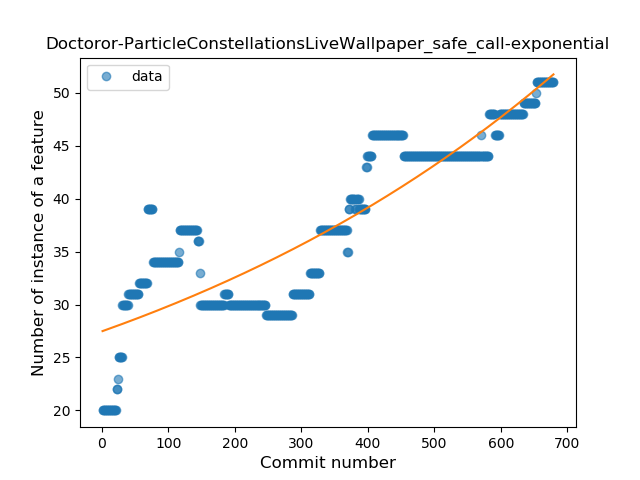

#### anthonycr-Lightning-Browser
* Feature: Property Delegation
* Function: 
* R_Squared: 0.78183245
 

#### openium-auvergne-webcams-droid
* Feature: Smart Cast
* Function: 
* R_Squared: 0.77743021
 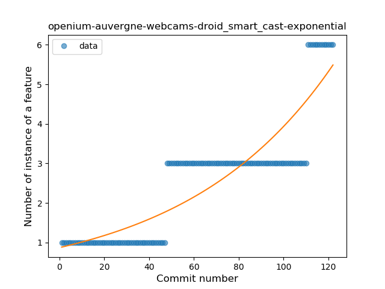

#### AllanWang-Frost-for-Facebook
* Feature: When expression
* Function: 
* R_Squared: 0.77592671
 

#### blokadaorg-blokada
* Feature: Unsafe Call
* Function: 
* R_Squared: 0.77398425
 

#### aminecmi-ReaderforSelfoss
* Feature: Type Inference
* Function: 
* R_Squared: 0.76735776
 

#### dkrivoruchko-ScreenStream
* Feature: Function call with Named Argument
* Function: 
* R_Squared: 0.76235838
 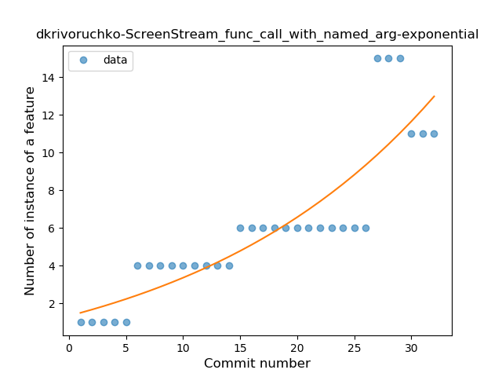

#### erickok-borefts2015
* Feature: String Template
* Function: 
* R_Squared: 0.76150269
 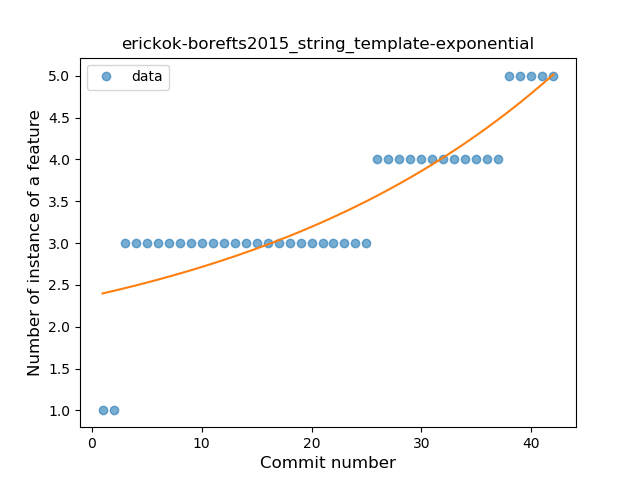

#### proxer-ProxerAndroid
* Feature: Singleton
* Function: 
* R_Squared: 0.75935554
 

#### eurofurence-ef-app_android
* Feature: Range Expression
* Function: 
* R_Squared: 0.75737343
 

#### sjnyag-stamp
* Feature: Function with Default Value
* Function: 
* R_Squared: 0.75680466
 

#### pacien-tincapp
* Feature: Data Class
* Function: 
* R_Squared: 0.75498079
 

#### SimpleMobileTools-Simple-Calculator
* Feature: Type Inference
* Function: 
* R_Squared: 0.75153699
 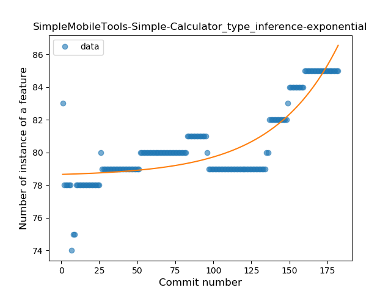

#### ohmae-VoiceMessageBoard
* Feature: Singleton
* Function: 
* R_Squared: 0.75115759
 

#### CypherpunkArmory-UserLAnd
* Feature: Singleton
* Function: 
* R_Squared: 0.7509031
 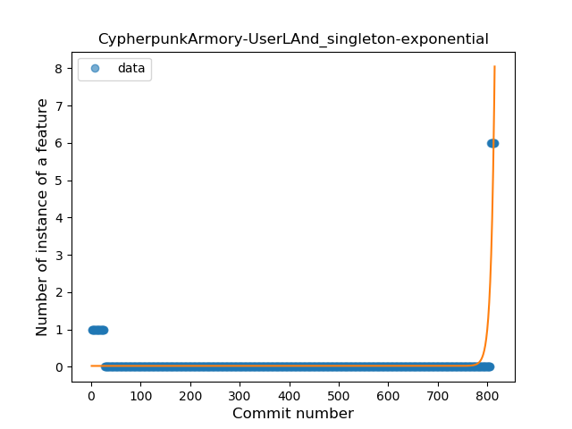

#### SimpleMobileTools-Simple-Flashlight
* Feature: Safe Call
* Function: 
* R_Squared: 0.74742581
 

#### Mygod-VPNHotspot
* Feature: Unsafe Call
* Function: 
* R_Squared: 0.74666819
 

#### peterLaurence-TrekAdvisor
* Feature: Function call with Named Argument
* Function: 
* R_Squared: 0.74652996
 

#### Doctoror-ParticleConstellationsLiveWallpaper
* Feature: When expression
* Function: 
* R_Squared: 0.74534485
 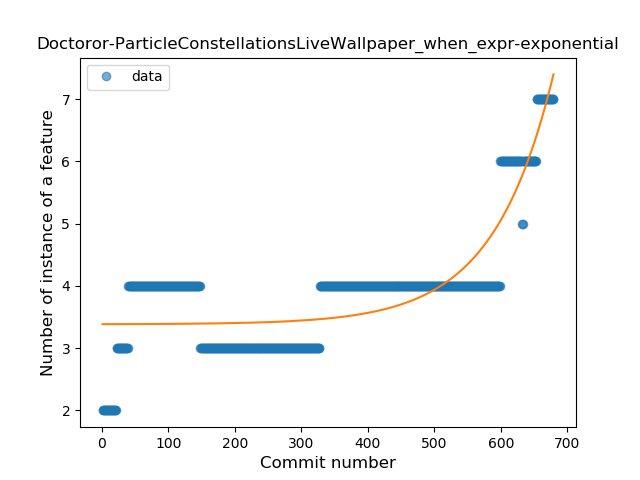

#### PaulWoitaschek-Voice
* Feature: Inline Function
* Function: 
* R_Squared: 0.74209959
 

#### thanksmister-androidthings-mqtt-alarm-panel
* Feature: String Template
* Function: 
* R_Squared: 0.74060096
 

#### ligi-gobandroid
* Feature: Range Expression
* Function: 
* R_Squared: 0.73952475
 

#### zoenb-log28
* Feature: Companion Object
* Function: 
* R_Squared: 0.73809137
 

#### zeapo-Android-Password-Store
* Feature: Lambda
* Function: 
* R_Squared: 0.72928317
 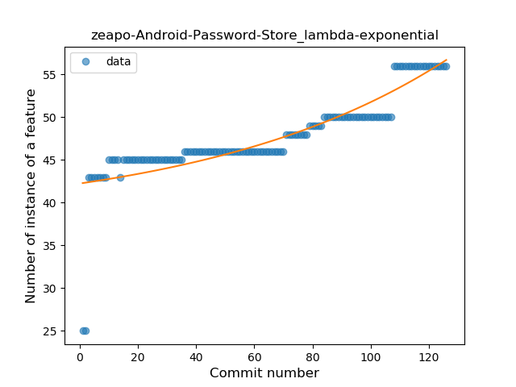

#### corphish-NightLight
* Feature: Extension Function
* Function: 
* R_Squared: 0.72805449
 

#### jereksel-Bucket
* Feature: Data Class
* Function: 
* R_Squared: 0.72135729
 

#### dkrivoruchko-ScreenStream
* Feature: When expression
* Function: 
* R_Squared: 0.71976975
 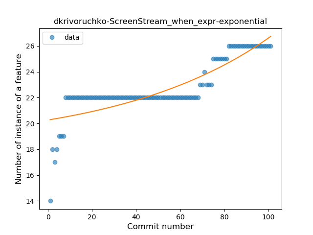

#### shymmq-librus-client-kotlin
* Feature: Property Delegation
* Function: 
* R_Squared: 0.71812552
 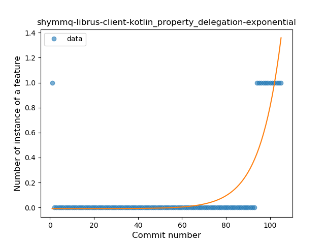

#### darshanparajuli-LogcatReader
* Feature: Function call with Named Argument
* Function: 
* R_Squared: 0.71672681
 

#### blokadaorg-blokada
* Feature: When expression
* Function: 
* R_Squared: 0.69963118
 

#### LawnchairLauncher-Lawnchair
* Feature: String Template
* Function: 
* R_Squared: 0.69016442
 

#### blokadaorg-blokada
* Feature: Range Expression
* Function: 
* R_Squared: 0.67684557
 

#### kamgurgul-cpu-info
* Feature: Extension Function
* Function: 
* R_Squared: 0.66787071
 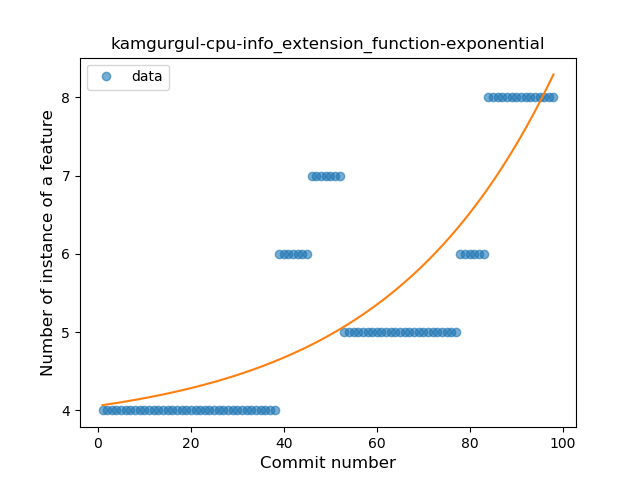

#### zoenb-log28
* Feature: Function call with Named Argument
* Function: 
* R_Squared: 0.65029143
 

#### zoenb-log28
* Feature: Data Class
* Function: 
* R_Squared: 0.64961849
 

#### blokadaorg-blokada
* Feature: Extension Function
* Function: 
* R_Squared: 0.64234549
 

#### ligi-gobandroid
* Feature: Extension Function
* Function: 
* R_Squared: 0.64159539
 

#### ultrasonic-ultrasonic
* Feature: Companion Object
* Function: 
* R_Squared: 0.64023402
 

#### CypherpunkArmory-UserLAnd
* Feature: Unsafe Call
* Function: 
* R_Squared: 0.6344108
 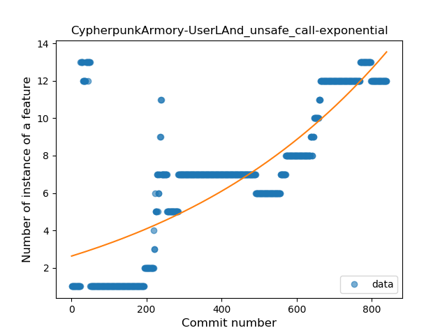

#### PaulWoitaschek-Voice
* Feature: When expression
* Function: 
* R_Squared: 0.61779132
 

#### blastrock-kaqui
* Feature: Function with Default Value
* Function: 
* R_Squared: 0.61268646
 

#### rectangle-dbmi-Realtime-Port-Authority
* Feature: Lambda
* Function: 
* R_Squared: 0.60619057
 

#### Mygod-VPNHotspot
* Feature: Range Expression
* Function: 
* R_Squared: 0.5966256
 

#### carlphilipp-chicago-commutes
* Feature: Smart Cast
* Function: 
* R_Squared: 0.59655866
 

#### JanYoStudio-WhatAnime
* Feature: Safe Call
* Function: 
* R_Squared: 0.5839405
 

#### iSoron-uhabits
* Feature: Safe Call
* Function: 
* R_Squared: 0.54458708
 

#### syrop-Wiktor-Navigator
* Feature: String Template
* Function: 
* R_Squared: 0.51992602
 

#### shymmq-librus-client-kotlin
* Feature: Companion Object
* Function: 
* R_Squared: 0.51573573
 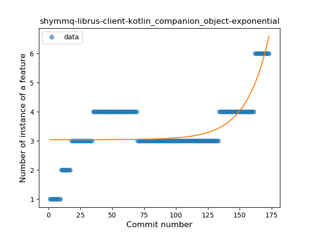

#### peppercarrot-e-reader
* Feature: Unsafe Call
* Function: 
* R_Squared: 0.50853403
 

#### calintat-units
* Feature: Companion Object
* Function: 
* R_Squared: 0.50284551
 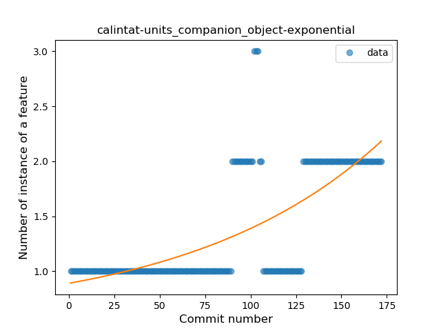

#### pyamsoft-home-button
* Feature: Type Inference
* Function: 
* R_Squared: 0.48560998
 

#### rectangle-dbmi-Realtime-Port-Authority
* Feature: Type Inference
* Function: 
* R_Squared: 0.45313306
 

#### proxer-ProxerAndroid
* Feature: Range Expression
* Function: 
* R_Squared: 0.45033494
 

#### SimpleMobileTools-Simple-Calendar
* Feature: Singleton
* Function: 
* R_Squared: 0.44995017
 

#### SimpleMobileTools-Simple-Gallery
* Feature: Singleton
* Function: 
* R_Squared: 0.44981487
 

#### exviva-stew
* Feature: When expression
* Function: 
* R_Squared: 0.44826987
 

#### zeapo-Android-Password-Store
* Feature: Property Delegation
* Function: 
* R_Squared: 0.42930022
 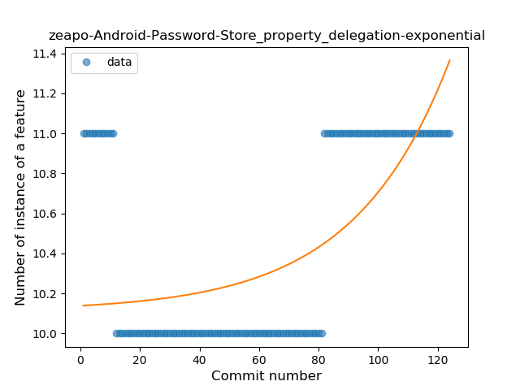

#### hypeapps-episodie
* Feature: Property Delegation
* Function: 
* R_Squared: 0.398182
 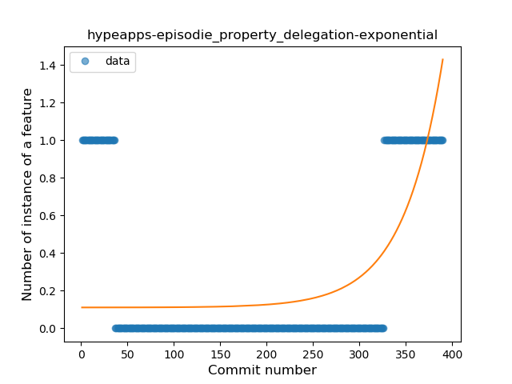

#### nibarius-opera-park-android
* Feature: Property Delegation
* Function: 
* R_Squared: 0.39263405
 

#### emansih-FireflyMobile
* Feature: Companion Object
* Function: 
* R_Squared: 0.39021246
 

#### calintat-units
* Feature: Unsafe Call
* Function: 
* R_Squared: 0.3723295
 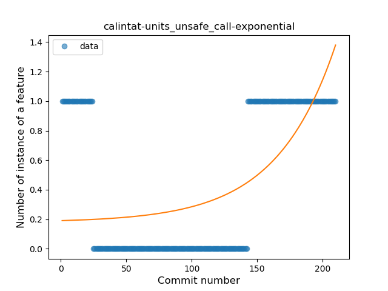

#### calintat-sensors
* Feature: Singleton
* Function: 
* R_Squared: 0.36813113
 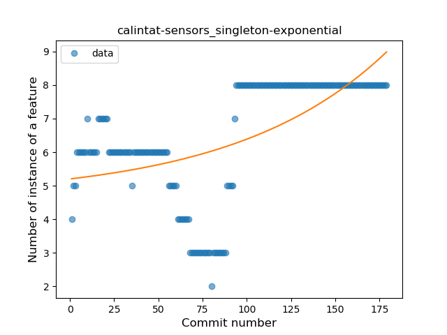

#### blokadaorg-blokada
* Feature: Data Class
* Function: 
* R_Squared: 0.35608966
 

#### Mygod-VPNHotspot
* Feature: Function call with Named Argument
* Function: 
* R_Squared: 0.33320526
 

#### ccomeaux-boardgamegeek4android
* Feature: Unsafe Call
* Function: 
* R_Squared: 0.33178536
 

#### jereksel-Bucket
* Feature: Range Expression
* Function: 
* R_Squared: 0.33114966
 

#### FredJul-Flym
* Feature: Type Inference
* Function: 
* R_Squared: 0.32473524
 

#### nicorsm-S3-16-simone
* Feature: Unsafe Call
* Function: 
* R_Squared: 0.31687842
 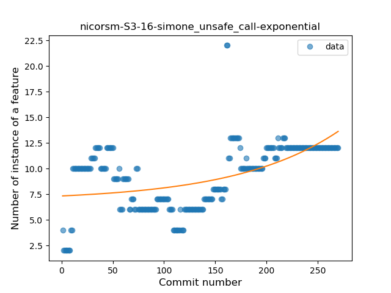

#### chrsep-Kingfish
* Feature: Function call with Named Argument
* Function: 
* R_Squared: 0.27267993
 

#### xgouchet-Stanley
* Feature: Data Class
* Function: 
* R_Squared: 0.25389361
 

#### kamgurgul-cpu-info
* Feature: Safe Call
* Function: 
* R_Squared: 0.2401987
 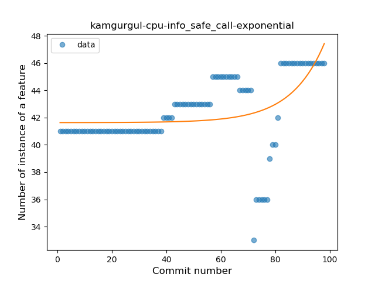

#### blokadaorg-blokada
* Feature: Smart Cast
* Function: 
* R_Squared: 0.23032212
 

#### fvasco-pinpoi
* Feature: Singleton
* Function: 
* R_Squared: 0.22054775
 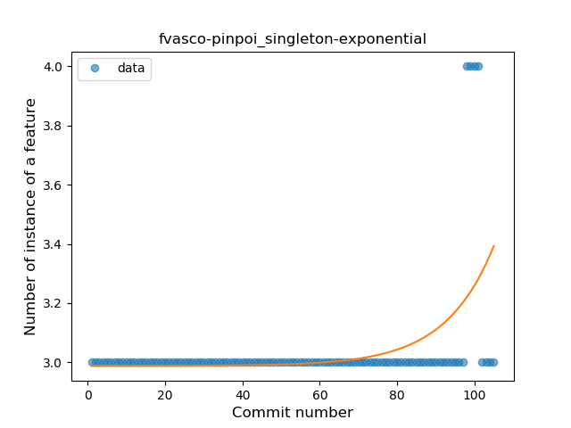

#### darshanparajuli-LogcatReader
* Feature: Destructuring Declaration
* Function: 
* R_Squared: 0.17552351
 

#### milosmns-Timecrypt
* Feature: Singleton
* Function: 
* R_Squared: 0.16407257
 

#### rectangle-dbmi-Realtime-Port-Authority
* Feature: String Template
* Function: 
* R_Squared: 0.16352949
 

#### apiote-Bimba
* Feature: Function call with Named Argument
* Function: 
* R_Squared: 0.14570593
 

#### loloof64-BasicChessEndGamesTrainer
* Feature: Property Delegation
* Function: 
* R_Squared: 0.14297037
 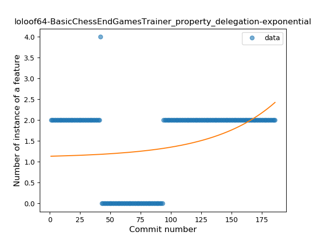

#### rectangle-dbmi-Realtime-Port-Authority
* Feature: Unsafe Call
* Function: 
* R_Squared: 0.13593605
 

#### jereksel-Bucket
* Feature: Overloaded Operator
* Function: 
* R_Squared: 0.12151267
 

#### PaulWoitaschek-Voice
* Feature: Property Delegation
* Function: 
* R_Squared: 0.08954954
 

#### blokadaorg-blokada
* Feature: Overloaded Operator
* Function: 
* R_Squared: 0.08912237
 

#### syrop-Wiktor-Navigator
* Feature: Range Expression
* Function: 
* R_Squared: 0.06222653
 

#### PaulWoitaschek-Voice
* Feature: Range Expression
* Function: 
* R_Squared: 0.05813806
 

#### SimpleMobileTools-Simple-Thank-You
* Feature: Lambda
* Function: 
* R_Squared: 0.02954208
 

#### Doctoror-ParticleConstellationsLiveWallpaper
* Feature: Singleton
* Function: 
* R_Squared: 0.01620101
 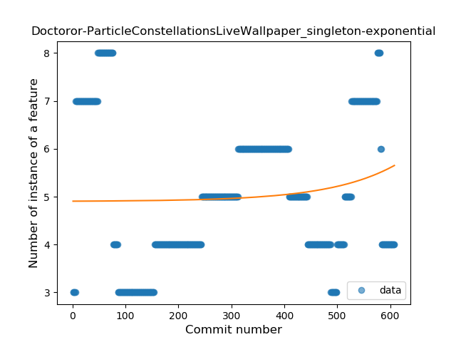

