## Sudden Rise
----
**700** best fit

#### com-skydoves-waterdays
* Feature: Property Delegation
* Function: 
* R_Squared: 1.0
 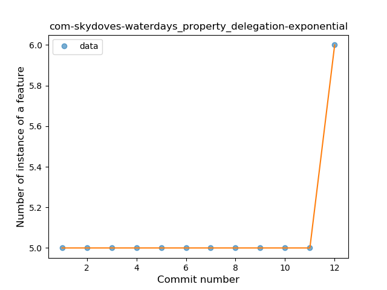

#### ch-deletescape-lawnchair-plah
* Feature: Type Inference
* Function: 
* R_Squared: 0.99474562
 

#### org-mozilla-rocket
* Feature: Type Inference
* Function: 
* R_Squared: 0.99258525
 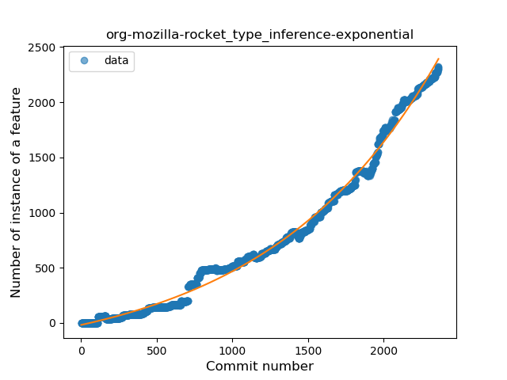

#### ch-deletescape-lawnchair-plah
* Feature: Companion Object
* Function: 
* R_Squared: 0.9919612
 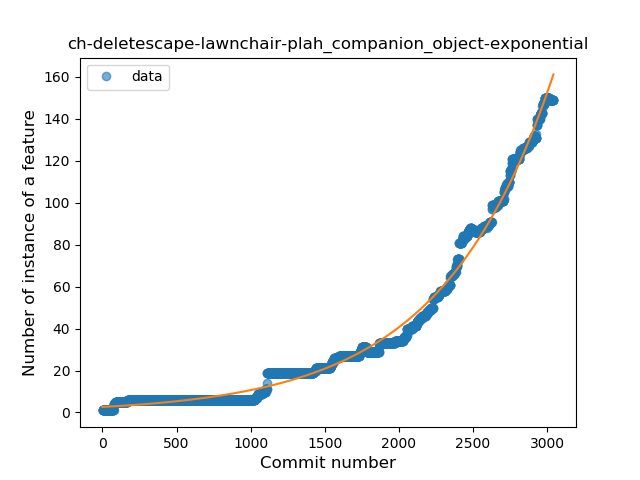

#### ch-deletescape-lawnchair-plah
* Feature: Lambda
* Function: 
* R_Squared: 0.99137449
 

#### com-dp-logcatapp
* Feature: Lambda
* Function: 
* R_Squared: 0.99020833
 

#### ch-deletescape-lawnchair-plah
* Feature: Safe Call
* Function: 
* R_Squared: 0.98975327
 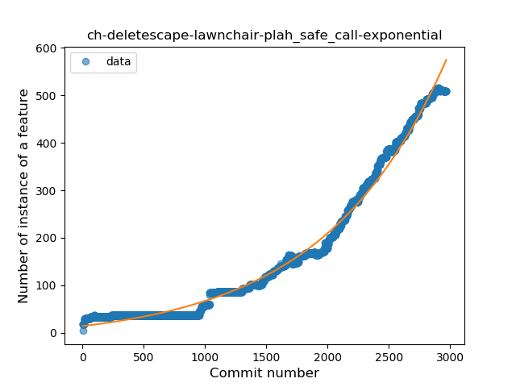

#### org-mozilla-rocket
* Feature: Lambda
* Function: 
* R_Squared: 0.98889341
 

#### com-fsck-k9
* Feature: Type Inference
* Function: 
* R_Squared: 0.9888269
 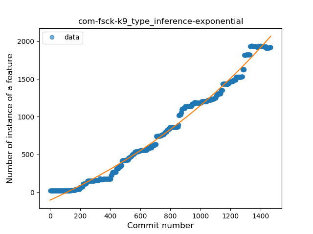

#### com-boardgamegeek
* Feature: Companion Object
* Function: 
* R_Squared: 0.98875571
 

#### org-mozilla-rocket
* Feature: Companion Object
* Function: 
* R_Squared: 0.98820192
 

#### com-boardgamegeek
* Feature: Lambda
* Function: 
* R_Squared: 0.98791579
 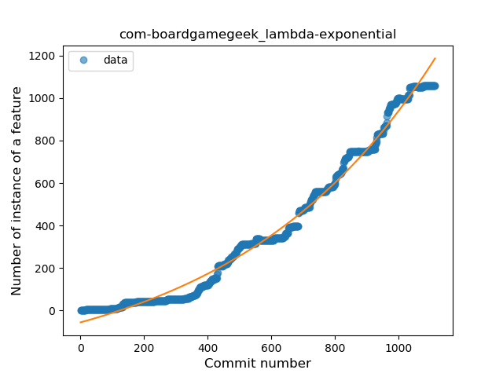

#### io-ipoli-android
* Feature: String Template
* Function: 
* R_Squared: 0.98775853
 

#### org-mozilla-rocket
* Feature: Safe Call
* Function: 
* R_Squared: 0.98772266
 

#### ch-deletescape-lawnchair-plah
* Feature: Range Expression
* Function: 
* R_Squared: 0.98748336
 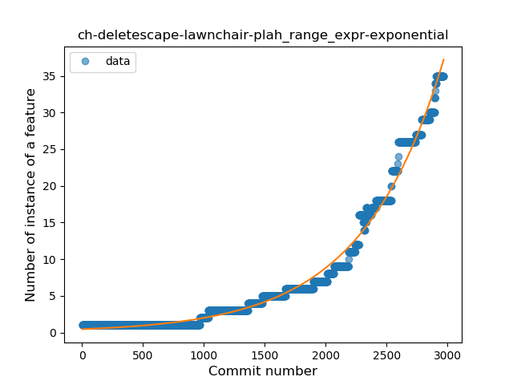

#### ch-deletescape-lawnchair-plah
* Feature: When expression
* Function: 
* R_Squared: 0.98715455
 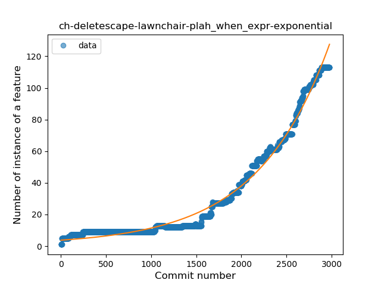

#### ch-deletescape-lawnchair-plah
* Feature: Property Delegation
* Function: 
* R_Squared: 0.98664912
 

#### com-bijoysingh-quicknote
* Feature: When expression
* Function: 
* R_Squared: 0.9865208
 

#### ch-rmy-android-http_shortcuts
* Feature: Safe Call
* Function: 
* R_Squared: 0.9859693
 

#### com-simplemobiletools-gallery-pro
* Feature: Lambda
* Function: 
* R_Squared: 0.98476696
 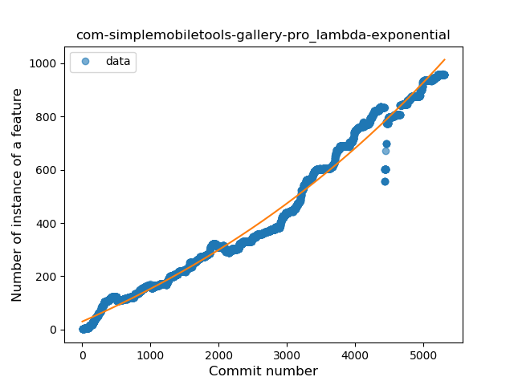

#### ch-deletescape-lawnchair-plah
* Feature: Smart Cast
* Function: 
* R_Squared: 0.98408052
 

#### org-mozilla-rocket
* Feature: Function with Default Value
* Function: 
* R_Squared: 0.98372338
 

#### io-ipoli-android
* Feature: When expression
* Function: 
* R_Squared: 0.98263768
 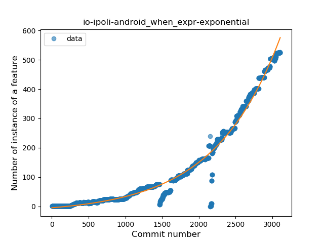

#### com-utazukin-ichaival
* Feature: Lambda
* Function: 
* R_Squared: 0.98226984
 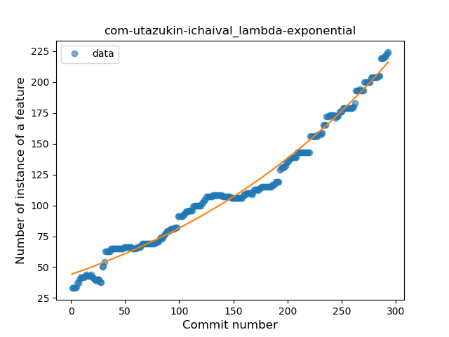

#### im-vector-alpha
* Feature: When expression
* Function: 
* R_Squared: 0.98223202
 

#### ch-rmy-android-http_shortcuts
* Feature: Function call with Named Argument
* Function: 
* R_Squared: 0.9822307
 

#### com-boardgamegeek
* Feature: When expression
* Function: 
* R_Squared: 0.9821404
 

#### eu-kanade-tachiyomi
* Feature: Extension Function
* Function: 
* R_Squared: 0.98162653
 

#### org-mozilla-focus
* Feature: When expression
* Function: 
* R_Squared: 0.98145791
 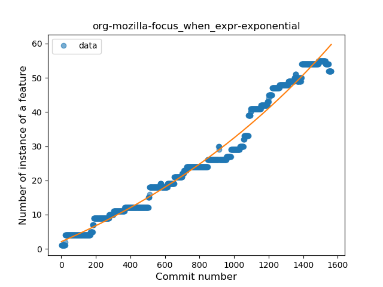

#### org-mozilla-klar
* Feature: When expression
* Function: 
* R_Squared: 0.98145791
 

#### io-ipoli-android
* Feature: Data Class
* Function: 
* R_Squared: 0.98123978
 

#### com-lavadip-miniVector
* Feature: When expression
* Function: 
* R_Squared: 0.9812019
 

#### com-boardgamegeek
* Feature: Data Class
* Function: 
* R_Squared: 0.98100627
 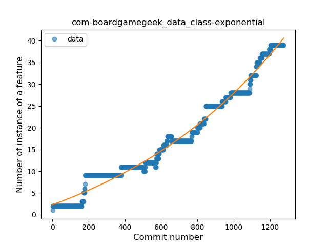

#### ch-deletescape-lawnchair-plah
* Feature: Function with Default Value
* Function: 
* R_Squared: 0.98092083
 

#### org-mozilla-rocket
* Feature: When expression
* Function: 
* R_Squared: 0.98077562
 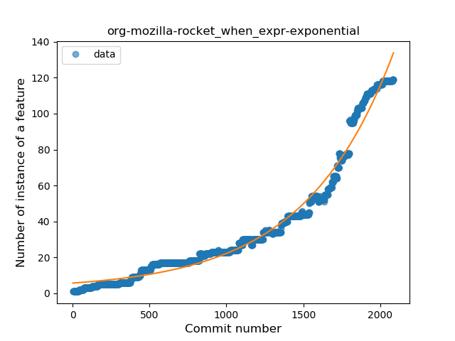

#### net-bible-android-activity
* Feature: String Template
* Function: 
* R_Squared: 0.98039696
 

#### de-ph1b-audiobook
* Feature: Function call with Named Argument
* Function: 
* R_Squared: 0.98034907
 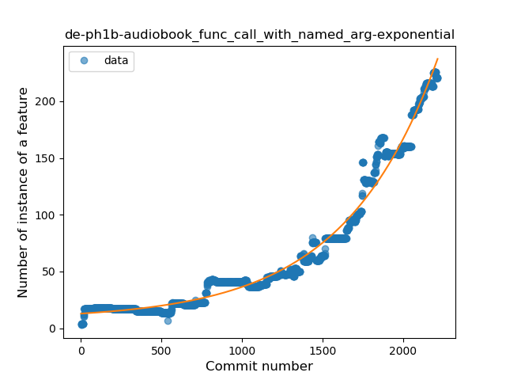

#### io-ipoli-android
* Feature: Smart Cast
* Function: 
* R_Squared: 0.97979449
 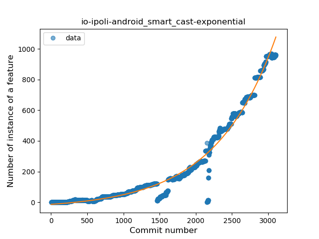

#### com-github-premnirmal-tickerwidget
* Feature: Lambda
* Function: 
* R_Squared: 0.97967892
 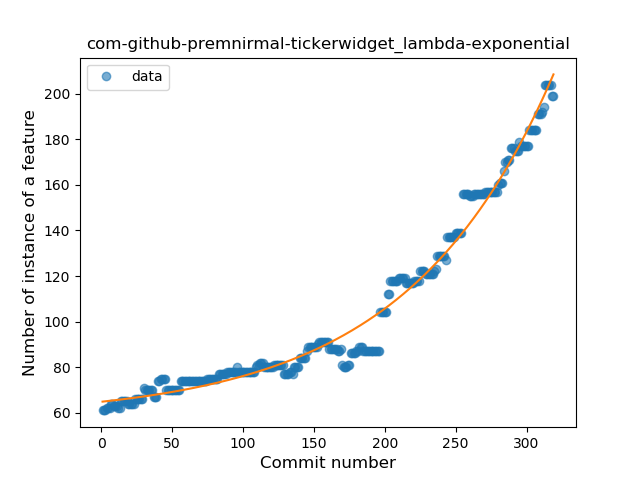

#### ch-deletescape-lawnchair-plah
* Feature: String Template
* Function: 
* R_Squared: 0.97954871
 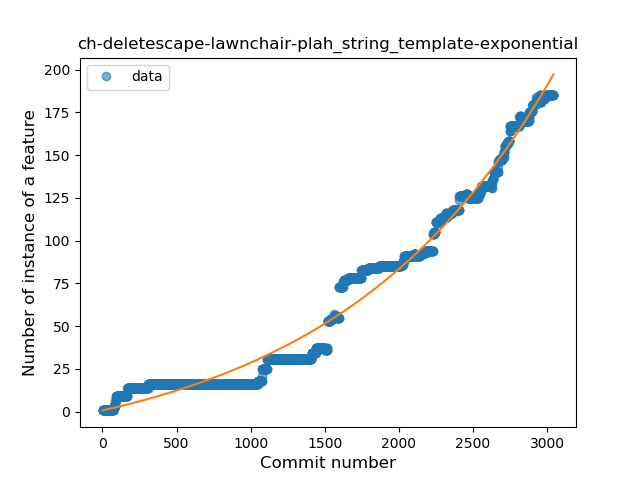

#### com-motion-stage1
* Feature: String Template
* Function: 
* R_Squared: 0.9786431
 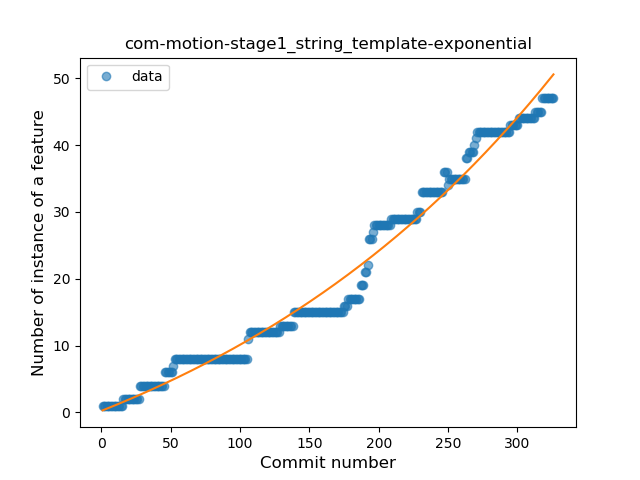

#### ca-josephroque-bowlingcompanion
* Feature: Coroutine
* Function: 
* R_Squared: 0.97845583
 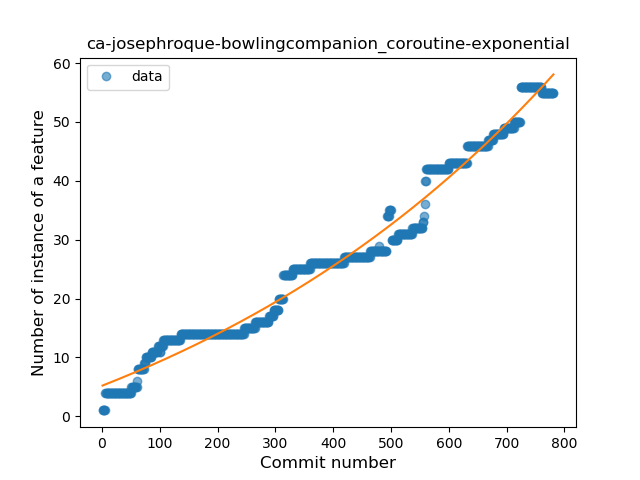

#### de-markusfisch-android-binaryeye
* Feature: Type Inference
* Function: 
* R_Squared: 0.97836246
 

#### org-mozilla-focus
* Feature: Lambda
* Function: 
* R_Squared: 0.97831201
 

#### org-mozilla-klar
* Feature: Lambda
* Function: 
* R_Squared: 0.97831201
 

#### com-bijoysingh-quicknote
* Feature: Lambda
* Function: 
* R_Squared: 0.9782985
 

#### com-utazukin-ichaival
* Feature: String Template
* Function: 
* R_Squared: 0.97766964
 

#### io-ipoli-android
* Feature: Lambda
* Function: 
* R_Squared: 0.97753183
 

#### com-simplemobiletools-notes-pro
* Feature: Safe Call
* Function: 
* R_Squared: 0.97741583
 

#### pl-hypeapp-episodie
* Feature: Type Inference
* Function: 
* R_Squared: 0.9770068
 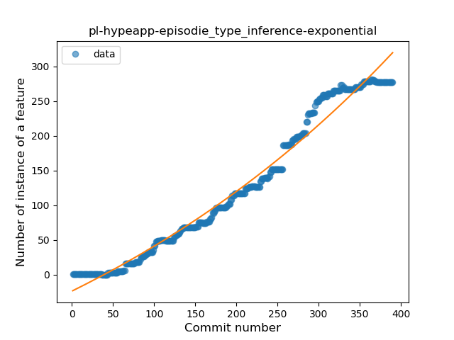

#### ch-rmy-android-http_shortcuts
* Feature: String Template
* Function: 
* R_Squared: 0.9769135
 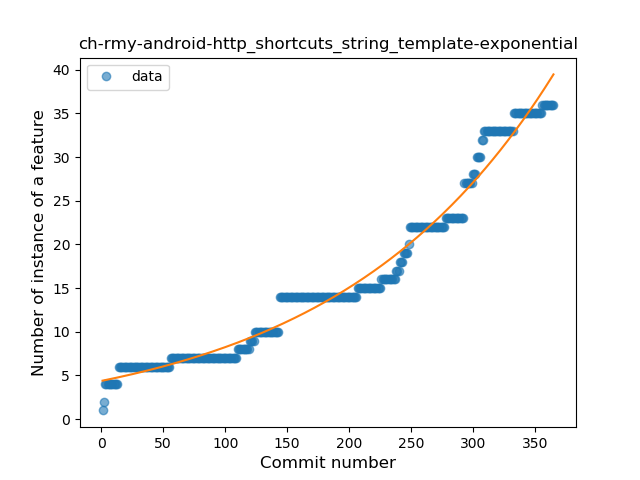

#### im-vector-alpha
* Feature: Companion Object
* Function: 
* R_Squared: 0.97690466
 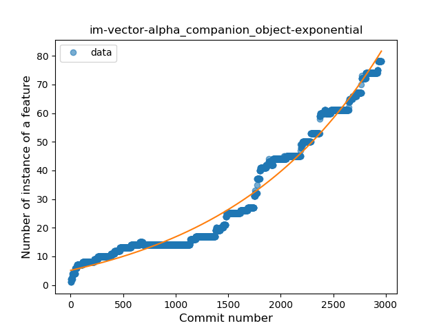

#### com-simplemobiletools-notes-pro
* Feature: Lambda
* Function: 
* R_Squared: 0.97671206
 

#### org-mariotaku-twidere
* Feature: Destructuring Declaration
* Function: 
* R_Squared: 0.97613311
 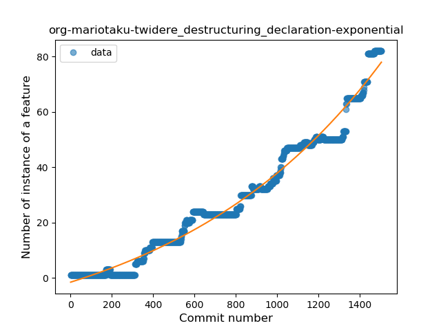

#### one-librem-social
* Feature: Lambda
* Function: 
* R_Squared: 0.97584068
 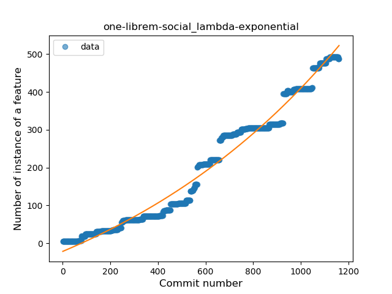

#### com-lavadip-miniVector
* Feature: Companion Object
* Function: 
* R_Squared: 0.97523212
 

#### me-anon-grow
* Feature: Safe Call
* Function: 
* R_Squared: 0.97461942
 

#### com-keylesspalace-tusky
* Feature: Lambda
* Function: 
* R_Squared: 0.9743113
 

#### fi-tuska-jalkametri
* Feature: Type Inference
* Function: 
* R_Squared: 0.97413051
 

#### com-github-cvzi-screenshottile
* Feature: Safe Call
* Function: 
* R_Squared: 0.97388894
 

#### com-doctoror-particleswallpaper
* Feature: Lambda
* Function: 
* R_Squared: 0.9737244
 

#### acr-browser-lightning
* Feature: Function with Default Value
* Function: 
* R_Squared: 0.97361009
 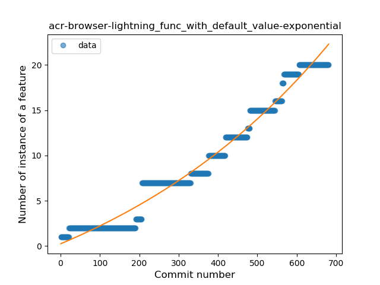

#### com-duckduckgo-mobile-android
* Feature: Lambda
* Function: 
* R_Squared: 0.97335432
 

#### im-vector-alpha
* Feature: Function with Default Value
* Function: 
* R_Squared: 0.97333805
 

#### org-mozilla-focus
* Feature: Companion Object
* Function: 
* R_Squared: 0.97281328
 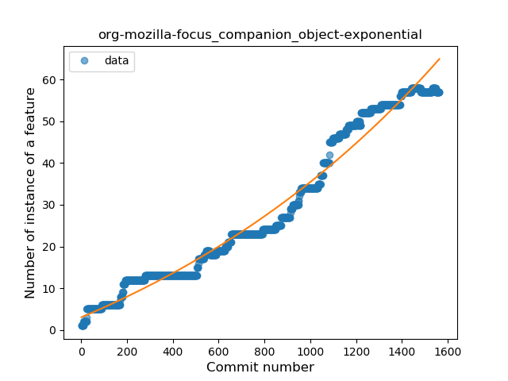

#### org-mozilla-klar
* Feature: Companion Object
* Function: 
* R_Squared: 0.97281328
 

#### net-bible-android-activity
* Feature: Lambda
* Function: 
* R_Squared: 0.9725071
 

#### de-westnordost-streetcomplete
* Feature: Lambda
* Function: 
* R_Squared: 0.97235143
 

#### com-lavadip-miniVector
* Feature: Function with Default Value
* Function: 
* R_Squared: 0.97214557
 

#### com-bijoysingh-quicknote
* Feature: Function with Default Value
* Function: 
* R_Squared: 0.97131381
 

#### io-ipoli-android
* Feature: Function call with Named Argument
* Function: 
* R_Squared: 0.97099718
 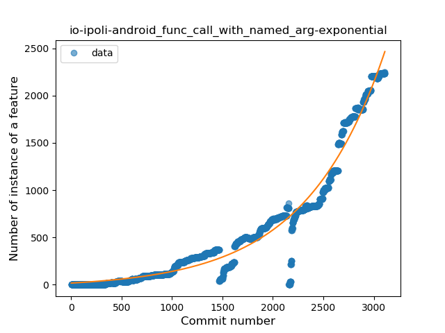

#### ca-josephroque-bowlingcompanion
* Feature: Singleton
* Function: 
* R_Squared: 0.970378
 

#### net-bible-android-activity
* Feature: Type Inference
* Function: 
* R_Squared: 0.97033097
 

#### io-ipoli-android
* Feature: Function with Default Value
* Function: 
* R_Squared: 0.96987796
 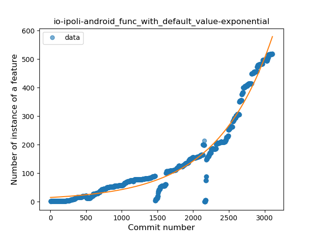

#### io-ipoli-android
* Feature: Safe Call
* Function: 
* R_Squared: 0.96937952
 

#### io-ipoli-android
* Feature: Property Delegation
* Function: 
* R_Squared: 0.96933805
 

#### com-nextcloud-talk2
* Feature: Type Inference
* Function: 
* R_Squared: 0.96922351
 

#### de-westnordost-streetcomplete
* Feature: Type Inference
* Function: 
* R_Squared: 0.96906838
 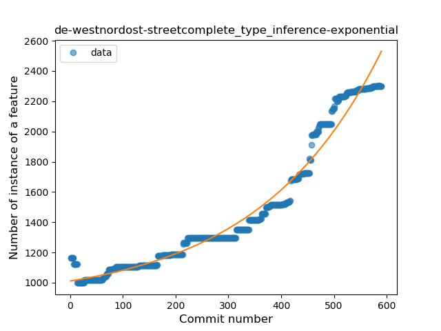

#### quickbeer-android
* Feature: Safe Call
* Function: 
* R_Squared: 0.96895037
 

#### com-eventyay-attendee
* Feature: Singleton
* Function: 
* R_Squared: 0.96870235
 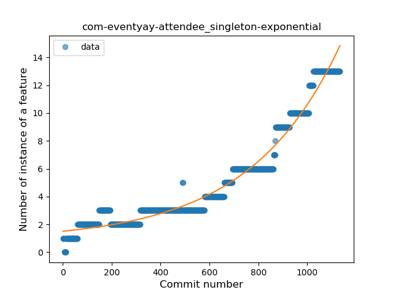

#### io-ipoli-android
* Feature: Sealed Class
* Function: 
* R_Squared: 0.9685406
 

#### ch-deletescape-lawnchair-plah
* Feature: Extension Function
* Function: 
* R_Squared: 0.96841939
 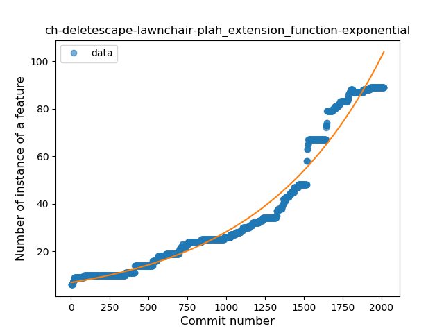

#### eu-kanade-tachiyomi
* Feature: Data Class
* Function: 
* R_Squared: 0.96724155
 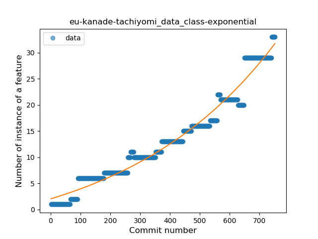

#### com-czbix-v2ex
* Feature: String Template
* Function: 
* R_Squared: 0.96651333
 

#### com-github-premnirmal-tickerwidget
* Feature: Type Inference
* Function: 
* R_Squared: 0.96647644
 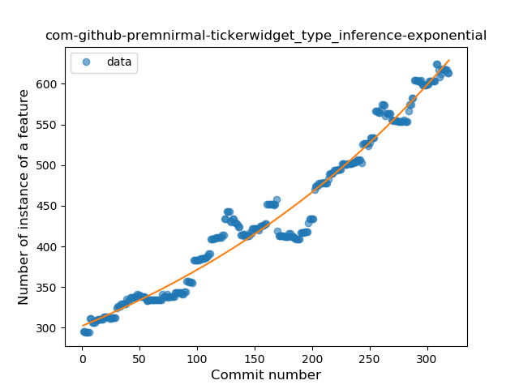

#### de-westnordost-streetcomplete
* Feature: Function with Default Value
* Function: 
* R_Squared: 0.96626752
 

#### org-mozilla-rocket
* Feature: Data Class
* Function: 
* R_Squared: 0.96621948
 

#### link-standen-michael-phonesaver
* Feature: String Template
* Function: 
* R_Squared: 0.96596154
 

#### org-mozilla-rocket
* Feature: Function call with Named Argument
* Function: 
* R_Squared: 0.96593305
 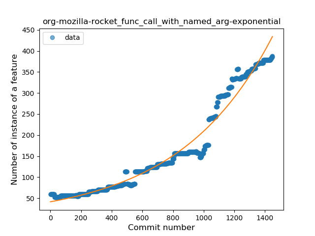

#### io-ipoli-android
* Feature: Unsafe Call
* Function: 
* R_Squared: 0.96528476
 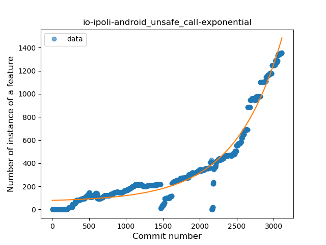

#### im-vector-alpha
* Feature: Data Class
* Function: 
* R_Squared: 0.96510891
 

#### com-lavadip-miniVector
* Feature: Data Class
* Function: 
* R_Squared: 0.96510319
 

#### org-mozilla-focus
* Feature: Type Inference
* Function: 
* R_Squared: 0.96493056
 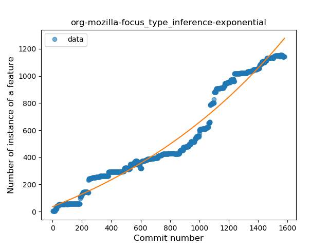

#### org-mozilla-klar
* Feature: Type Inference
* Function: 
* R_Squared: 0.96493056
 

#### xyz-hisname-fireflyiii
* Feature: Extension Function
* Function: 
* R_Squared: 0.96492524
 

#### net-bible-android-activity
* Feature: Companion Object
* Function: 
* R_Squared: 0.96472244
 

#### com-github-cvzi-screenshottile
* Feature: Lambda
* Function: 
* R_Squared: 0.96426454
 

#### acr-browser-lightning
* Feature: Extension Function
* Function: 
* R_Squared: 0.96396618
 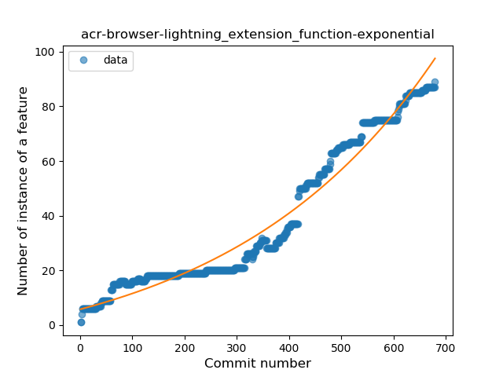

#### quickbeer-android
* Feature: Function with Default Value
* Function: 
* R_Squared: 0.96389443
 

#### quickbeer-android
* Feature: Companion Object
* Function: 
* R_Squared: 0.96348782
 

#### jp-toastkid-yobidashi
* Feature: Type Inference
* Function: 
* R_Squared: 0.96346058
 

#### eu-kanade-tachiyomi
* Feature: Function with Default Value
* Function: 
* R_Squared: 0.9629612
 

#### pl-hypeapp-episodie
* Feature: Lambda
* Function: 
* R_Squared: 0.96226565
 

#### org-walleth
* Feature: Smart Cast
* Function: 
* R_Squared: 0.962096
 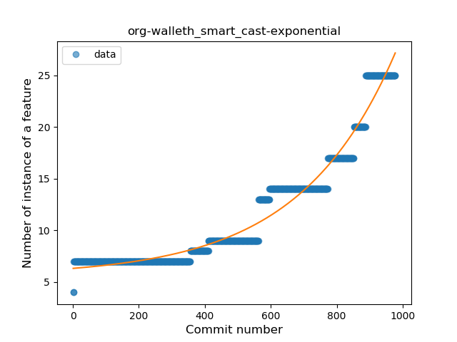

#### ch-deletescape-lawnchair-plah
* Feature: Function call with Named Argument
* Function: 
* R_Squared: 0.96193269
 

#### io-ipoli-android
* Feature: Type Inference
* Function: 
* R_Squared: 0.96166187
 

#### ch-rmy-android-http_shortcuts
* Feature: Function with Default Value
* Function: 
* R_Squared: 0.96149781
 

#### im-vector-alpha
* Feature: Safe Call
* Function: 
* R_Squared: 0.96124476
 

#### com-uncmorfi
* Feature: Lambda
* Function: 
* R_Squared: 0.96122396
 

#### apps-amine-bou-readerforselfoss
* Feature: Lambda
* Function: 
* R_Squared: 0.96121425
 

#### de-Maxr1998-xposed-maxlock
* Feature: Lambda
* Function: 
* R_Squared: 0.9607428
 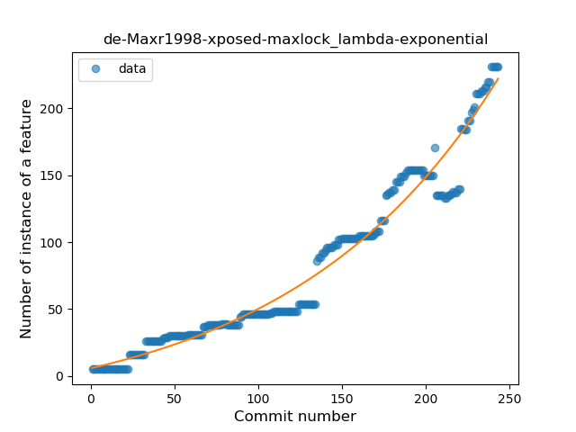

#### de-westnordost-streetcomplete
* Feature: When expression
* Function: 
* R_Squared: 0.96061338
 

#### im-vector-alpha
* Feature: Extension Function
* Function: 
* R_Squared: 0.95999829
 

#### com-fsck-k9
* Feature: Smart Cast
* Function: 
* R_Squared: 0.95997279
 

#### science-apolline
* Feature: Type Inference
* Function: 
* R_Squared: 0.95995181
 

#### me-anon-grow
* Feature: Unsafe Call
* Function: 
* R_Squared: 0.95981637
 

#### com-lavadip-miniVector
* Feature: Safe Call
* Function: 
* R_Squared: 0.95958419
 

#### be-mygod-vpnhotspot
* Feature: Singleton
* Function: 
* R_Squared: 0.95956079
 

#### eu-kanade-tachiyomi
* Feature: Function call with Named Argument
* Function: 
* R_Squared: 0.95945712
 

#### tech-ula
* Feature: Type Inference
* Function: 
* R_Squared: 0.9593494
 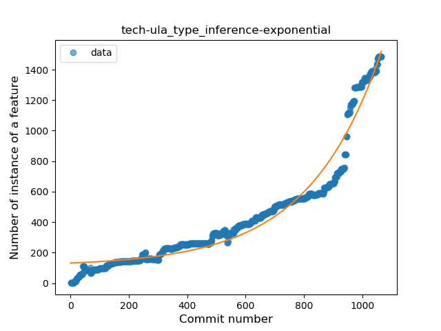

#### tech-ula
* Feature: Lambda
* Function: 
* R_Squared: 0.95902065
 

#### com-simplemobiletools-gallery-pro
* Feature: Function with Default Value
* Function: 
* R_Squared: 0.9589246
 

#### org-mariotaku-twidere
* Feature: Overloaded Operator
* Function: 
* R_Squared: 0.95872928
 

#### com-github-vase4kin-teamcityapp
* Feature: When expression
* Function: 
* R_Squared: 0.95860504
 

#### com-lavadip-miniVector
* Feature: Extension Function
* Function: 
* R_Squared: 0.9585338
 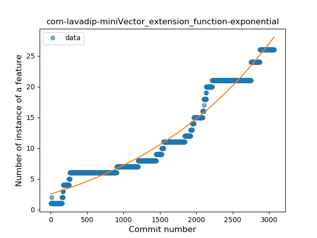

#### im-vector-alpha
* Feature: Lambda
* Function: 
* R_Squared: 0.95848079
 

#### im-vector-alpha
* Feature: Smart Cast
* Function: 
* R_Squared: 0.95822449
 

#### de-Maxr1998-xposed-maxlock
* Feature: Type Inference
* Function: 
* R_Squared: 0.95812671
 

#### io-ipoli-android
* Feature: Singleton
* Function: 
* R_Squared: 0.95688407
 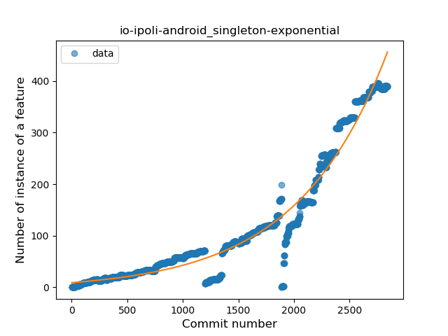

#### org-pacien-tincapp
* Feature: Type Inference
* Function: 
* R_Squared: 0.95677134
 

#### com-lavadip-miniVector
* Feature: Smart Cast
* Function: 
* R_Squared: 0.95676803
 

#### com-lavadip-miniVector
* Feature: Lambda
* Function: 
* R_Squared: 0.95656395
 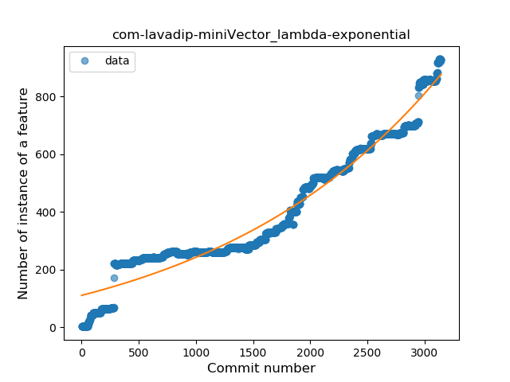

#### ch-deletescape-lawnchair-plah
* Feature: Unsafe Call
* Function: 
* R_Squared: 0.95649634
 

#### com-peterlaurence-trekme
* Feature: Safe Call
* Function: 
* R_Squared: 0.9560756
 

#### fr-insapp-insapp
* Feature: String Template
* Function: 
* R_Squared: 0.95566275
 

#### me-anon-grow
* Feature: Lambda
* Function: 
* R_Squared: 0.95543372
 

#### app-opass-ccip
* Feature: Lambda
* Function: 
* R_Squared: 0.95518174
 

#### com-thanksmister-iot-mqtt-alarmpanel
* Feature: Type Inference
* Function: 
* R_Squared: 0.9551462
 

#### se-barsk-park
* Feature: Safe Call
* Function: 
* R_Squared: 0.95437837
 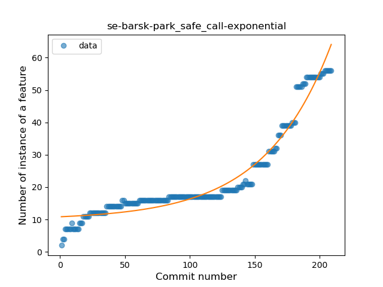

#### tech-ula
* Feature: Function call with Named Argument
* Function: 
* R_Squared: 0.95402888
 

#### tech-ula
* Feature: Coroutine
* Function: 
* R_Squared: 0.95365111
 

#### com-eventyay-attendee
* Feature: Function with Default Value
* Function: 
* R_Squared: 0.95342797
 

#### com-nextcloud-talk2
* Feature: Lambda
* Function: 
* R_Squared: 0.95330996
 

#### org-eurofurence-connavigator
* Feature: Safe Call
* Function: 
* R_Squared: 0.95329565
 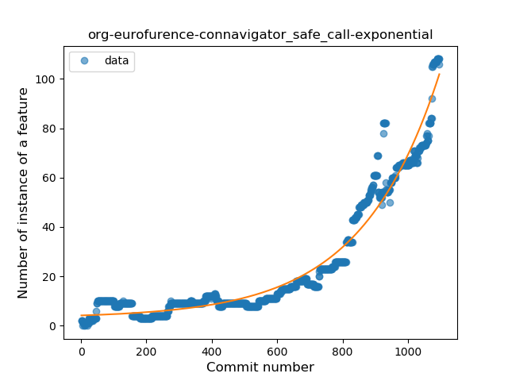

#### com-github-laurenttreguier-deck
* Feature: Lambda
* Function: 
* R_Squared: 0.95291549
 

#### com-thanksmister-iot-mqtt-alarmpanel
* Feature: Companion Object
* Function: 
* R_Squared: 0.9528415
 

#### org-mozilla-rocket
* Feature: Inline Function
* Function: 
* R_Squared: 0.95274976
 

#### com-duckduckgo-mobile-android
* Feature: Smart Cast
* Function: 
* R_Squared: 0.95244437
 

#### me-anon-grow
* Feature: When expression
* Function: 
* R_Squared: 0.95234163
 

#### com-motion-stage1
* Feature: When expression
* Function: 
* R_Squared: 0.95231702
 

#### de-Maxr1998-xposed-maxlock
* Feature: When expression
* Function: 
* R_Squared: 0.95194919
 

#### org-mozilla-rocket
* Feature: Range Expression
* Function: 
* R_Squared: 0.95125812
 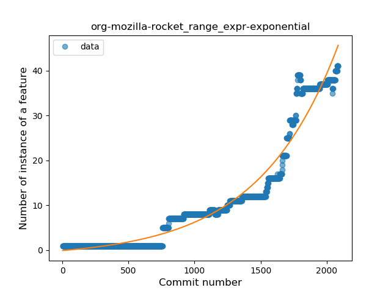

#### de-westnordost-streetcomplete
* Feature: String Template
* Function: 
* R_Squared: 0.95118981
 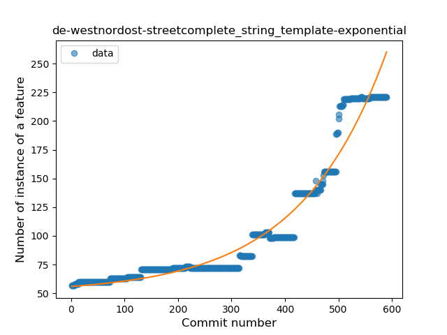

#### tech-ula
* Feature: When expression
* Function: 
* R_Squared: 0.95085885
 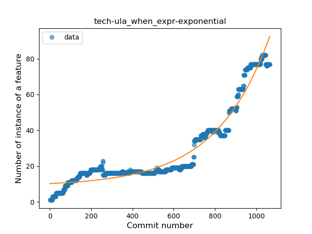

#### com-ruuvi-station
* Feature: When expression
* Function: 
* R_Squared: 0.95068611
 

#### com-esafirm-androidplayground
* Feature: Companion Object
* Function: 
* R_Squared: 0.95031262
 

#### org-mozilla-focus
* Feature: Coroutine
* Function: 
* R_Squared: 0.94996529
 

#### org-mozilla-klar
* Feature: Coroutine
* Function: 
* R_Squared: 0.94996529
 

#### org-kaqui
* Feature: Companion Object
* Function: 
* R_Squared: 0.94994389
 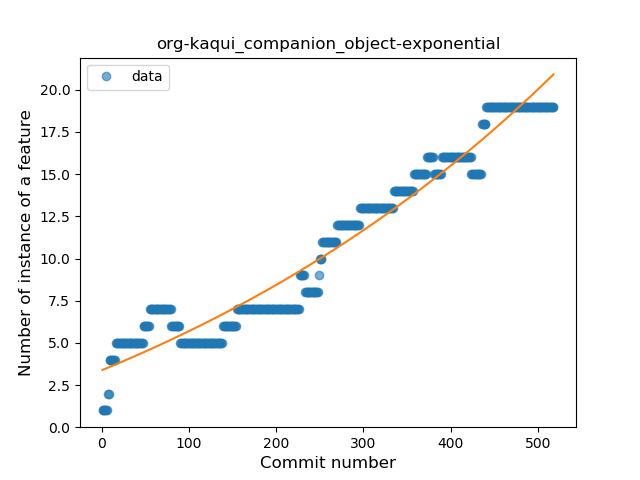

#### com-eventyay-attendee
* Feature: Lambda
* Function: 
* R_Squared: 0.94986027
 

#### com-eventyay-attendee
* Feature: Function call with Named Argument
* Function: 
* R_Squared: 0.94897476
 

#### com-github-cvzi-screenshottile
* Feature: String Template
* Function: 
* R_Squared: 0.94896289
 

#### org-walleth
* Feature: Coroutine
* Function: 
* R_Squared: 0.94891424
 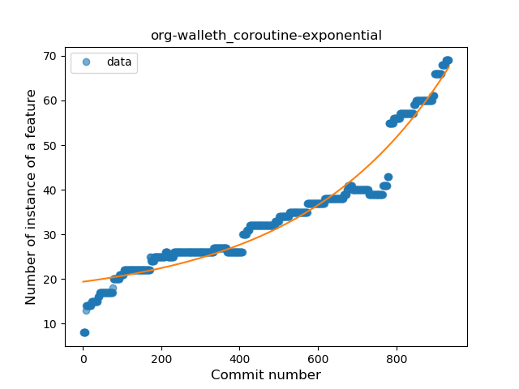

#### de-westnordost-streetcomplete
* Feature: Extension Function
* Function: 
* R_Squared: 0.94868085
 

#### me-anon-grow
* Feature: Smart Cast
* Function: 
* R_Squared: 0.9486212
 

#### com-zeapo-pwdstore
* Feature: Type Inference
* Function: 
* R_Squared: 0.94832203
 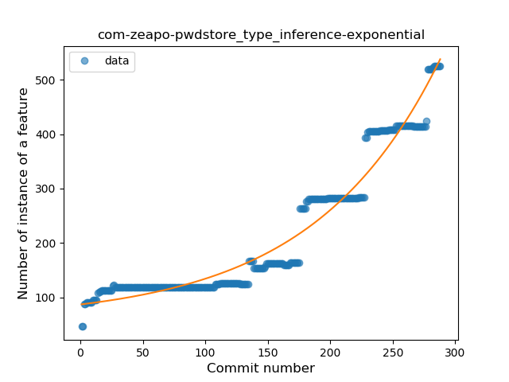

#### com-thanksmister-iot-mqtt-alarmpanel
* Feature: Lambda
* Function: 
* R_Squared: 0.94831031
 

#### com-zeapo-pwdstore
* Feature: Lambda
* Function: 
* R_Squared: 0.94790872
 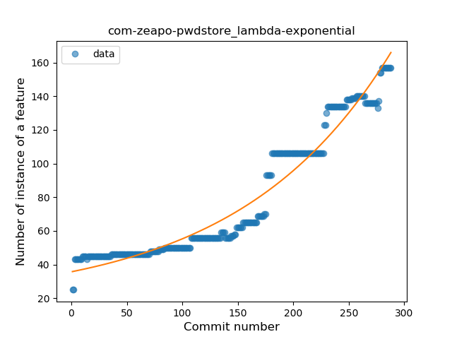

#### ca-fuwafuwa-kaku
* Feature: Lambda
* Function: 
* R_Squared: 0.94772474
 

#### de-markusfisch-android-binaryeye
* Feature: Function with Default Value
* Function: 
* R_Squared: 0.94733469
 

#### com-duckduckgo-mobile-android
* Feature: Data Class
* Function: 
* R_Squared: 0.94730622
 

#### info-papdt-express-helper
* Feature: String Template
* Function: 
* R_Squared: 0.9472042
 

#### uk-colessoft-android-hilllist
* Feature: When expression
* Function: 
* R_Squared: 0.94685393
 

#### com-lavadip-miniVector
* Feature: Type Inference
* Function: 
* R_Squared: 0.94681051
 

#### me-proxer-app
* Feature: Type Inference
* Function: 
* R_Squared: 0.9466898
 

#### com-eventyay-attendee
* Feature: Extension Function
* Function: 
* R_Squared: 0.94653888
 

#### com-utazukin-ichaival
* Feature: Function with Default Value
* Function: 
* R_Squared: 0.94640712
 

#### com-github-vase4kin-teamcityapp
* Feature: Type Inference
* Function: 
* R_Squared: 0.94634146
 

#### com-android-gpstest-osmdroid
* Feature: Type Inference
* Function: 
* R_Squared: 0.94619834
 

#### de-markusfisch-android-binaryeye
* Feature: Lambda
* Function: 
* R_Squared: 0.94598056
 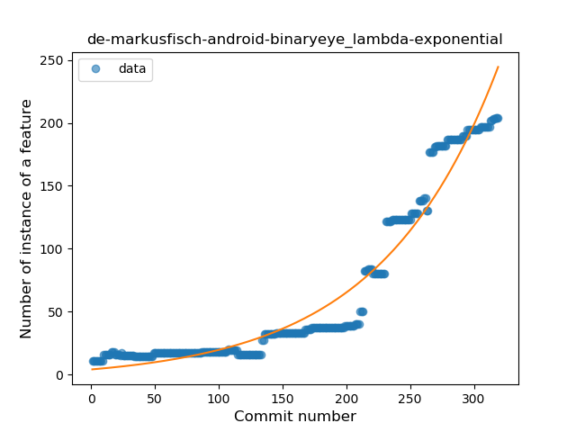

#### org-mozilla-rocket
* Feature: Singleton
* Function: 
* R_Squared: 0.94569752
 

#### com-mgaetan89-showsrage
* Feature: Lambda
* Function: 
* R_Squared: 0.94562325
 

#### org-mozilla-rocket
* Feature: Smart Cast
* Function: 
* R_Squared: 0.94560424
 

#### org-mozilla-rocket
* Feature: String Template
* Function: 
* R_Squared: 0.94508624
 

#### me-anon-grow
* Feature: String Template
* Function: 
* R_Squared: 0.94425797
 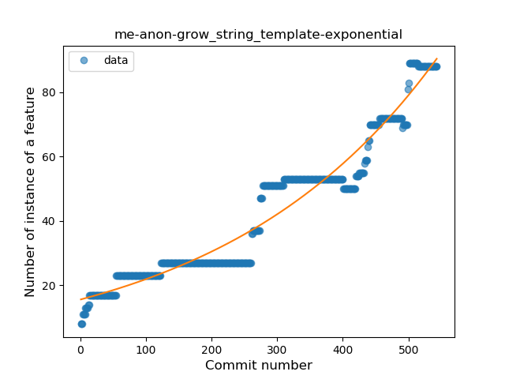

#### de-ph1b-audiobook
* Feature: Singleton
* Function: 
* R_Squared: 0.94420257
 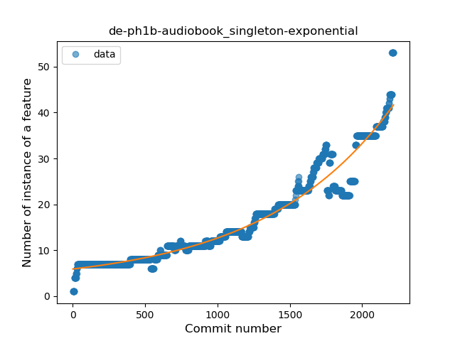

#### io-github-feelfreelinux-wykopmobilny
* Feature: Smart Cast
* Function: 
* R_Squared: 0.9442005
 

#### me-anon-grow
* Feature: Type Inference
* Function: 
* R_Squared: 0.94416624
 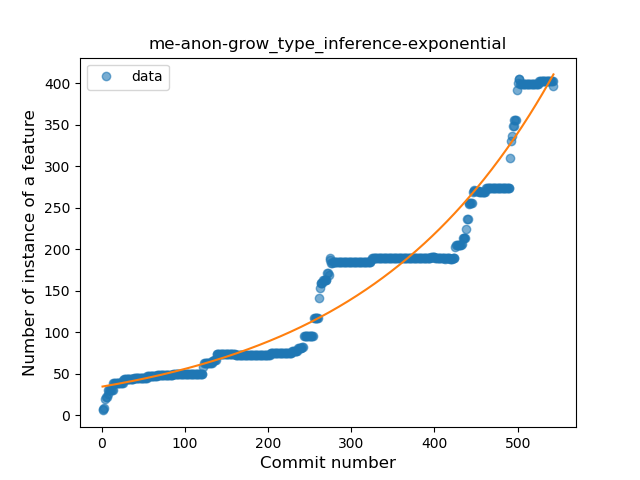

#### pl-hypeapp-episodie
* Feature: Safe Call
* Function: 
* R_Squared: 0.94388349
 

#### me-proxer-app
* Feature: Function call with Named Argument
* Function: 
* R_Squared: 0.9435392
 

#### se-barsk-park
* Feature: Function with Default Value
* Function: 
* R_Squared: 0.94225576
 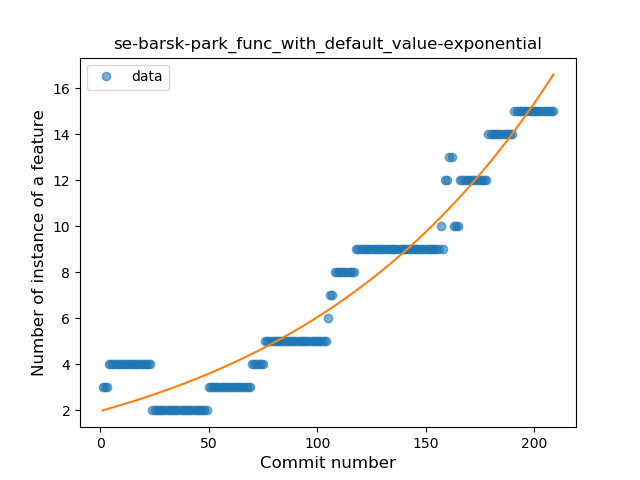

#### me-blog-korn123-easydiary
* Feature: Type Inference
* Function: 
* R_Squared: 0.9421046
 

#### com-mbcdev-folkets
* Feature: Type Inference
* Function: 
* R_Squared: 0.94128005
 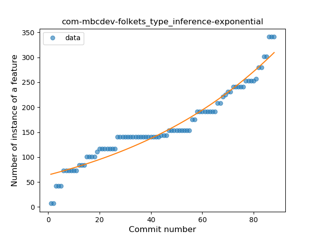

#### com-github-moko256-twitlatte
* Feature: Lambda
* Function: 
* R_Squared: 0.94116983
 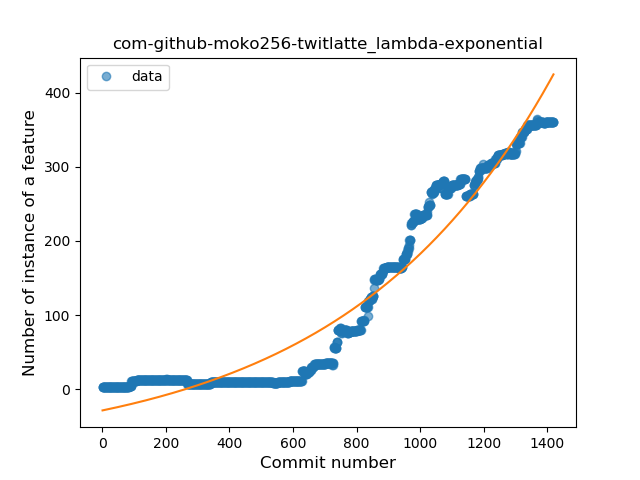

#### com-whiterabbit-pisabike
* Feature: Type Inference
* Function: 
* R_Squared: 0.94080739
 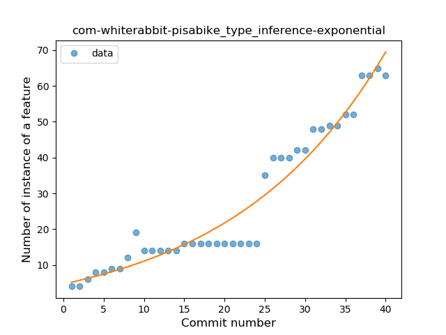

#### tech-ula
* Feature: Function with Default Value
* Function: 
* R_Squared: 0.94063627
 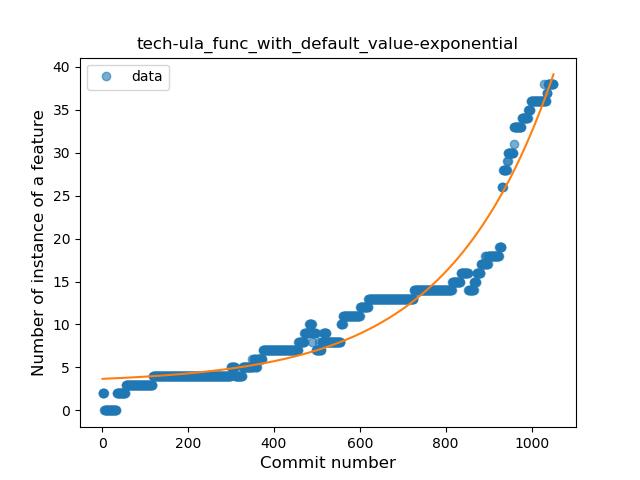

#### link-standen-michael-phonesaver
* Feature: Safe Call
* Function: 
* R_Squared: 0.94055067
 

#### com-github-vase4kin-teamcityapp
* Feature: Lambda
* Function: 
* R_Squared: 0.9403327
 

#### com-fsck-k9
* Feature: Function call with Named Argument
* Function: 
* R_Squared: 0.94015276
 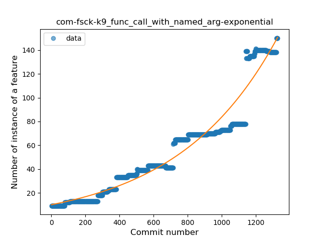

#### com-sjn-stamp
* Feature: Extension Function
* Function: 
* R_Squared: 0.93973916
 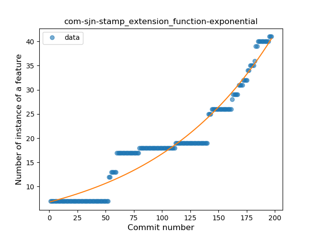

#### ryey-easer-beta
* Feature: Safe Call
* Function: 
* R_Squared: 0.93973526
 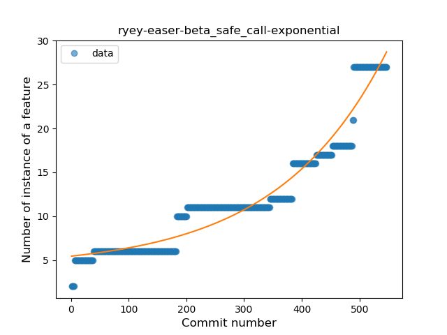

#### com-utazukin-ichaival
* Feature: Companion Object
* Function: 
* R_Squared: 0.93967884
 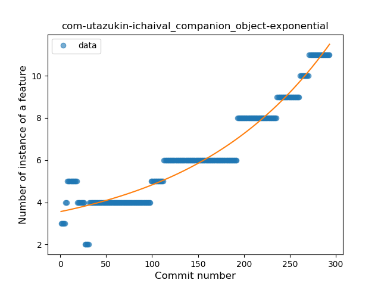

#### com-jereksel-libresubstratum
* Feature: Singleton
* Function: 
* R_Squared: 0.93915882
 

#### com-loloof64-android-basicchessendgamestrainer
* Feature: Unsafe Call
* Function: 
* R_Squared: 0.93876554
 

#### com-github-moko256-twitlatte
* Feature: Type Inference
* Function: 
* R_Squared: 0.93817639
 

#### com-wbrawner-simplemarkdown
* Feature: Lambda
* Function: 
* R_Squared: 0.93809909
 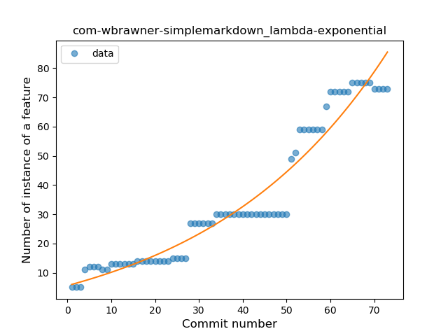

#### com-github-cvzi-screenshottile
* Feature: Type Inference
* Function: 
* R_Squared: 0.93788229
 

#### com-github-quarck-calnotify
* Feature: Range Expression
* Function: 
* R_Squared: 0.93775631
 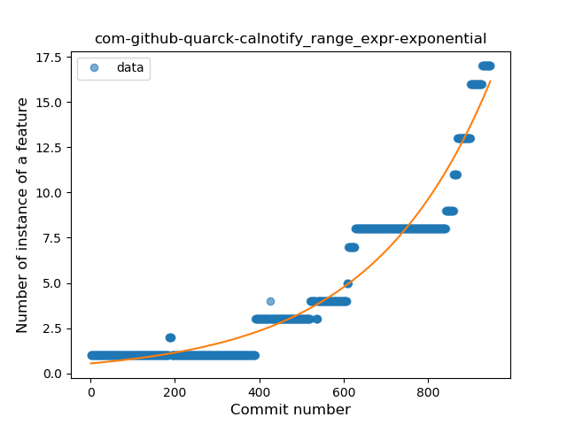

#### com-wilderpereira-lmgtfygen
* Feature: Lambda
* Function: 
* R_Squared: 0.93702632
 

#### io-github-fvasco-pinpoi
* Feature: Safe Call
* Function: 
* R_Squared: 0.93676311
 

#### org-zimmob-zimlx
* Feature: Lambda
* Function: 
* R_Squared: 0.93670993
 

#### io-ipoli-android
* Feature: Destructuring Declaration
* Function: 
* R_Squared: 0.93640189
 

#### org-equeim-tremotesf
* Feature: Lambda
* Function: 
* R_Squared: 0.93639111
 

#### com-orgzly
* Feature: Lambda
* Function: 
* R_Squared: 0.93629403
 

#### com-czbix-v2ex
* Feature: Property Delegation
* Function: 
* R_Squared: 0.93624682
 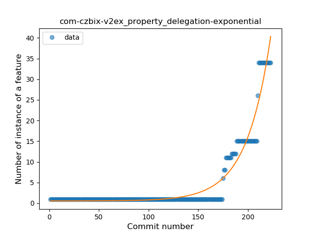

#### sreich-countthedays
* Feature: Lambda
* Function: 
* R_Squared: 0.93601312
 

#### org-walleth
* Feature: Function with Default Value
* Function: 
* R_Squared: 0.93583513
 

#### org-kaqui
* Feature: Extension Function
* Function: 
* R_Squared: 0.93543061
 

#### org-mozilla-focus
* Feature: String Template
* Function: 
* R_Squared: 0.93516582
 

#### org-mozilla-klar
* Feature: String Template
* Function: 
* R_Squared: 0.93516582
 

#### com-czbix-v2ex
* Feature: Safe Call
* Function: 
* R_Squared: 0.9348097
 

#### com-eventyay-attendee
* Feature: Type Inference
* Function: 
* R_Squared: 0.93475227
 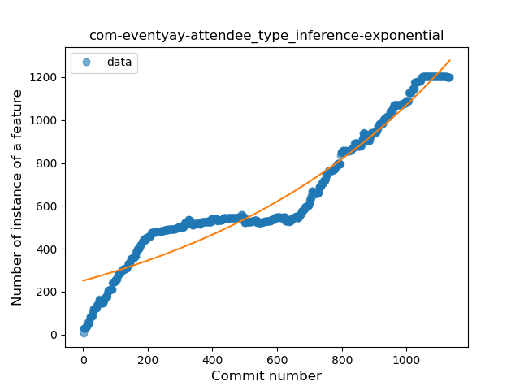

#### uk-co-richyhbm-monochromatic
* Feature: When expression
* Function: 
* R_Squared: 0.93392272
 

#### tech-ula
* Feature: Safe Call
* Function: 
* R_Squared: 0.93390414
 

#### me-blog-korn123-easydiary
* Feature: Unsafe Call
* Function: 
* R_Squared: 0.93388342
 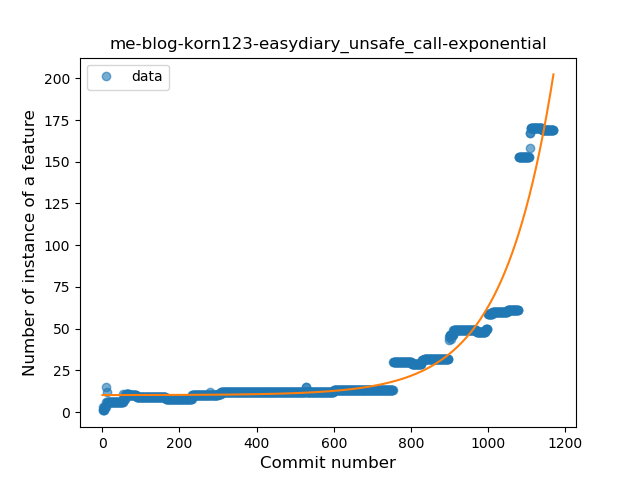

#### com-zeapo-pwdstore
* Feature: Safe Call
* Function: 
* R_Squared: 0.93384206
 

#### de-ph1b-audiobook
* Feature: Data Class
* Function: 
* R_Squared: 0.93372451
 

#### net-bible-android-activity
* Feature: Singleton
* Function: 
* R_Squared: 0.93357541
 

#### net-bible-android-activity
* Feature: Range Expression
* Function: 
* R_Squared: 0.93310262
 

#### com-ianhanniballake-contractiontimer
* Feature: Coroutine
* Function: 
* R_Squared: 0.93310165
 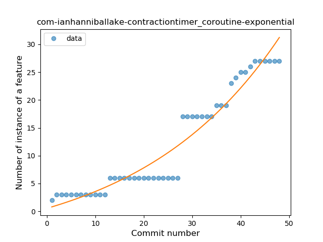

#### com-github-moko256-twitlatte
* Feature: Safe Call
* Function: 
* R_Squared: 0.9328306
 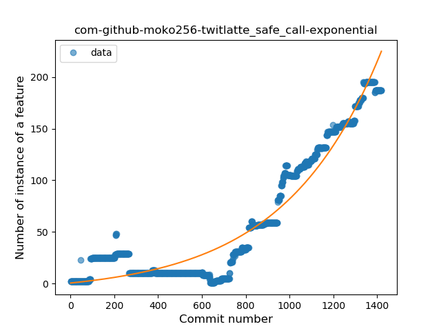

#### me-proxer-app
* Feature: Destructuring Declaration
* Function: 
* R_Squared: 0.93244129
 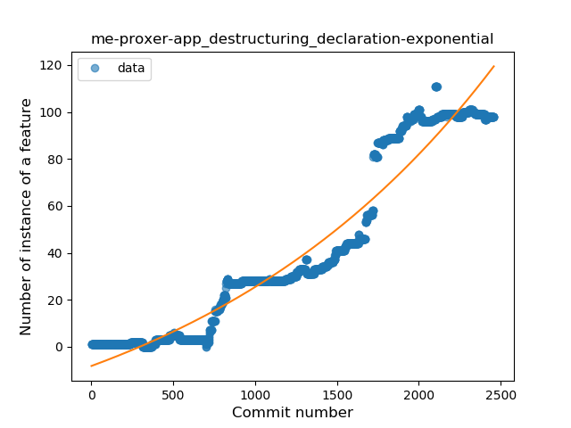

#### it-diab
* Feature: Singleton
* Function: 
* R_Squared: 0.93169215
 

#### is-xyz-mpv
* Feature: Function with Default Value
* Function: 
* R_Squared: 0.93164292
 

#### im-vector-alpha
* Feature: Function call with Named Argument
* Function: 
* R_Squared: 0.93138707
 

#### apps-amine-bou-readerforselfoss
* Feature: Extension Function
* Function: 
* R_Squared: 0.9310642
 

#### org-kaqui
* Feature: Lambda
* Function: 
* R_Squared: 0.93093273
 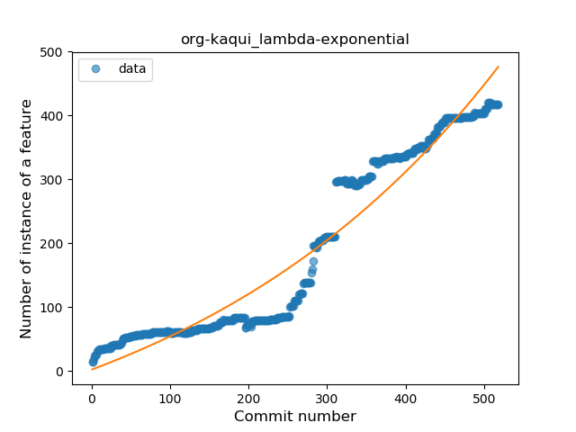

#### com-mrbimc-selinux
* Feature: Type Inference
* Function: 
* R_Squared: 0.9308057
 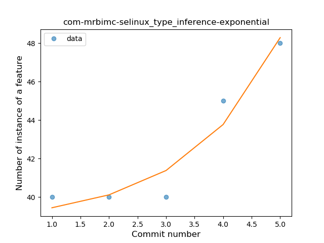

#### com-lavadip-miniVector
* Feature: Function call with Named Argument
* Function: 
* R_Squared: 0.93072502
 

#### science-apolline
* Feature: String Template
* Function: 
* R_Squared: 0.9305277
 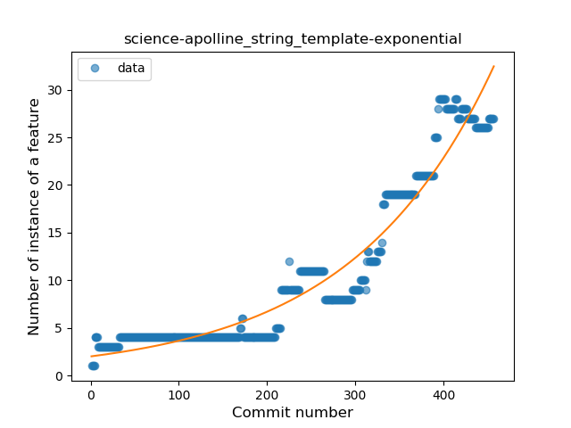

#### org-kaqui
* Feature: Function with Default Value
* Function: 
* R_Squared: 0.93008122
 

#### com-wabadaba-dziennik
* Feature: Range Expression
* Function: 
* R_Squared: 0.92935144
 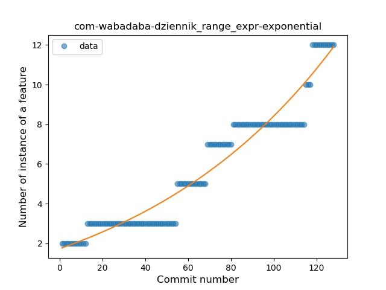

#### com-github-vase4kin-teamcityapp
* Feature: Companion Object
* Function: 
* R_Squared: 0.92924327
 

#### net-mm2d-dmsexplorer
* Feature: Lambda
* Function: 
* R_Squared: 0.9291755
 

#### org-isoron-uhabits
* Feature: Lambda
* Function: 
* R_Squared: 0.92839403
 

#### com-simplemobiletools-gallery
* Feature: When expression
* Function: 
* R_Squared: 0.9282797
 

#### com-breadwallet
* Feature: Data Class
* Function: 
* R_Squared: 0.92796126
 

#### org-ligi-gobandroid
* Feature: Companion Object
* Function: 
* R_Squared: 0.92673901
 

#### com-esafirm-androidplayground
* Feature: Extension Function
* Function: 
* R_Squared: 0.92647206
 

#### tech-ula
* Feature: String Template
* Function: 
* R_Squared: 0.92644412
 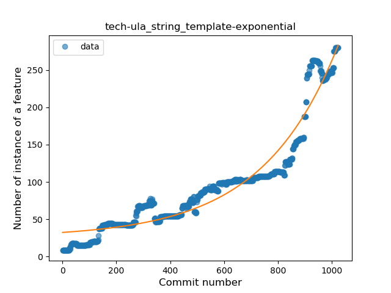

#### uk-colessoft-android-hilllist
* Feature: Lambda
* Function: 
* R_Squared: 0.92628447
 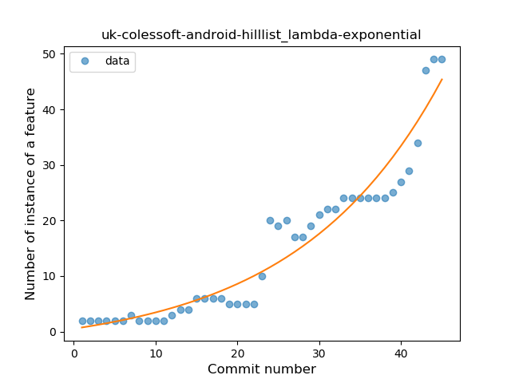

#### tech-ula
* Feature: Sealed Class
* Function: 
* R_Squared: 0.92613691
 

#### ch-deletescape-lawnchair-plah
* Feature: Inline Function
* Function: 
* R_Squared: 0.92610897
 

#### com-simplemobiletools-flashlight
* Feature: Type Inference
* Function: 
* R_Squared: 0.92610601
 

#### org-equeim-tremotesf
* Feature: Data Class
* Function: 
* R_Squared: 0.92599359
 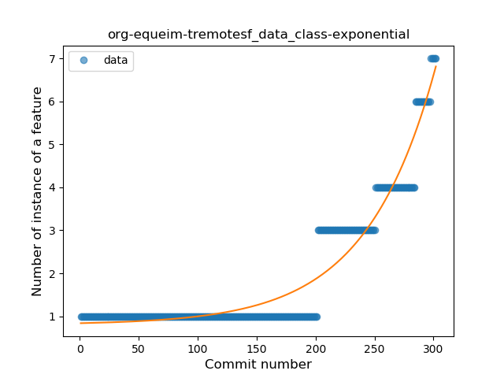

#### ru-hyst329-openfool
* Feature: Lambda
* Function: 
* R_Squared: 0.92520575
 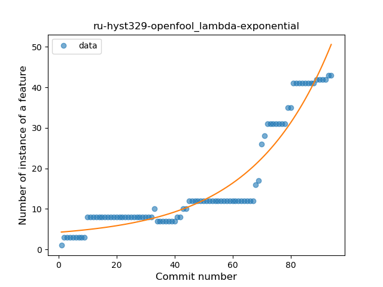

#### ca-fuwafuwa-kaku
* Feature: Unsafe Call
* Function: 
* R_Squared: 0.92493333
 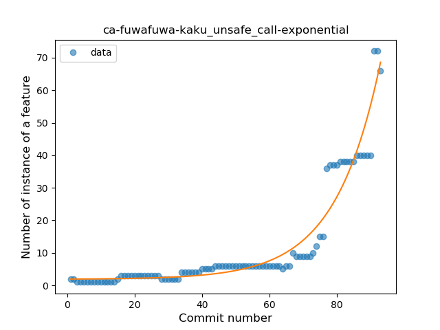

#### com-peterlaurence-trekme
* Feature: Smart Cast
* Function: 
* R_Squared: 0.92443228
 

#### com-loloof64-android-basicchessendgamestrainer
* Feature: Extension Function
* Function: 
* R_Squared: 0.92437737
 

#### ryey-easer-beta
* Feature: Unsafe Call
* Function: 
* R_Squared: 0.9243237
 

#### org-ligi-gobandroid
* Feature: Lambda
* Function: 
* R_Squared: 0.92329685
 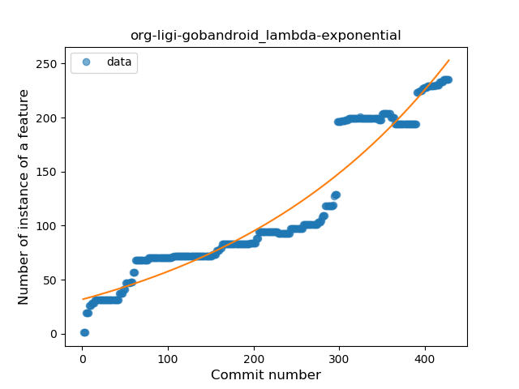

#### org-kaqui
* Feature: Unsafe Call
* Function: 
* R_Squared: 0.92299967
 

#### app-opass-ccip
* Feature: Safe Call
* Function: 
* R_Squared: 0.92151982
 

#### de-Maxr1998-xposed-maxlock
* Feature: Property Delegation
* Function: 
* R_Squared: 0.92107739
 

#### com-motion-stage1
* Feature: Property Delegation
* Function: 
* R_Squared: 0.92104764
 

#### ch-deletescape-lawnchair-plah
* Feature: Overloaded Operator
* Function: 
* R_Squared: 0.92073242
 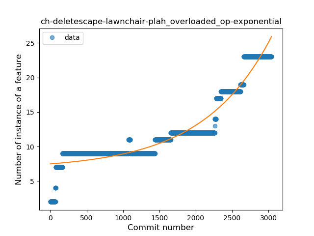

#### net-mm2d-dmsexplorer
* Feature: Safe Call
* Function: 
* R_Squared: 0.92065593
 

#### com-orgzly
* Feature: Data Class
* Function: 
* R_Squared: 0.92033355
 

#### net-syncthing-lite
* Feature: Singleton
* Function: 
* R_Squared: 0.92010794
 

#### com-fsck-k9
* Feature: Sealed Class
* Function: 
* R_Squared: 0.92003068
 

#### com-github-vase4kin-teamcityapp
* Feature: Unsafe Call
* Function: 
* R_Squared: 0.91975263
 

#### science-apolline
* Feature: Companion Object
* Function: 
* R_Squared: 0.91936409
 

#### ai-susi
* Feature: Lambda
* Function: 
* R_Squared: 0.91908418
 

#### tk-superl2-xwifi
* Feature: Lambda
* Function: 
* R_Squared: 0.91902505
 

#### org-eurofurence-connavigator
* Feature: Function call with Named Argument
* Function: 
* R_Squared: 0.91897421
 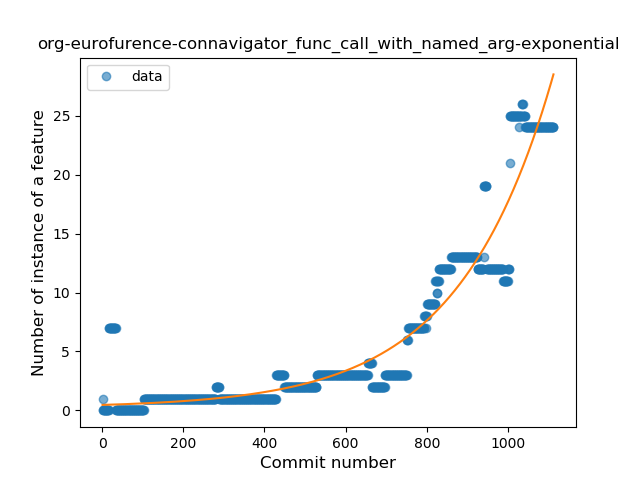

#### com-garpr-android
* Feature: Function call with Named Argument
* Function: 
* R_Squared: 0.91824799
 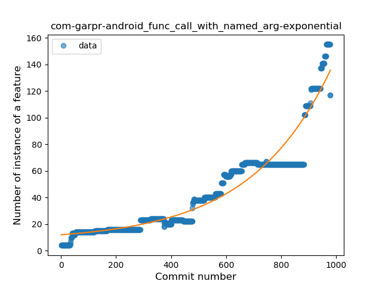

#### net-mm2d-dmsexplorer
* Feature: Function with Default Value
* Function: 
* R_Squared: 0.91814422
 

#### com-loloof64-android-basicchessendgamestrainer
* Feature: Type Inference
* Function: 
* R_Squared: 0.91781392
 

#### io-github-fvasco-pinpoi
* Feature: Range Expression
* Function: 
* R_Squared: 0.91578836
 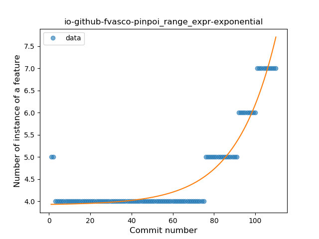

#### com-zeapo-pwdstore
* Feature: String Template
* Function: 
* R_Squared: 0.91551699
 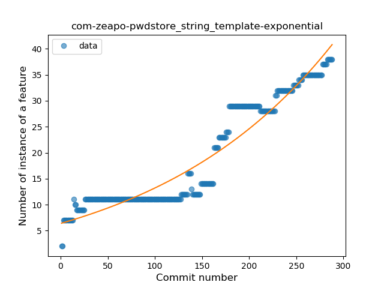

#### com-simplemobiletools-calendar-pro
* Feature: Unsafe Call
* Function: 
* R_Squared: 0.91509146
 

#### org-ligi-gobandroid
* Feature: Property Delegation
* Function: 
* R_Squared: 0.9148276
 

#### com-bubelov-coins
* Feature: Coroutine
* Function: 
* R_Squared: 0.91455486
 

#### org-isoron-uhabits
* Feature: String Template
* Function: 
* R_Squared: 0.91426228
 

#### com-bernaferrari-changedetection
* Feature: Inline Function
* Function: 
* R_Squared: 0.91383059
 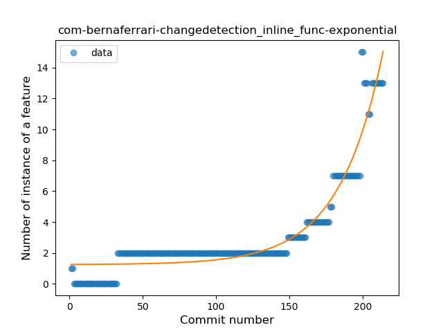

#### org-isoron-uhabits
* Feature: When expression
* Function: 
* R_Squared: 0.91378202
 

#### com-example-harisont-librery
* Feature: Lambda
* Function: 
* R_Squared: 0.9137567
 

#### eu-kanade-tachiyomi
* Feature: Smart Cast
* Function: 
* R_Squared: 0.91352472
 

#### com-czbix-v2ex
* Feature: Lambda
* Function: 
* R_Squared: 0.91313106
 

#### com-moez-QKSMS
* Feature: Safe Call
* Function: 
* R_Squared: 0.91271439
 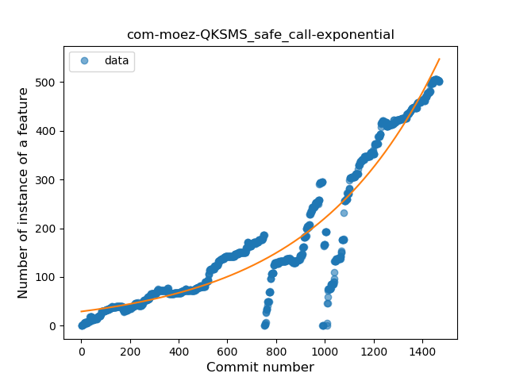

#### com-breadwallet
* Feature: Safe Call
* Function: 
* R_Squared: 0.91260997
 

#### pt-joaomneto-titancompanion
* Feature: Lambda
* Function: 
* R_Squared: 0.91242193
 

#### com-commit451-gitlab
* Feature: Safe Call
* Function: 
* R_Squared: 0.91183705
 

#### me-anon-grow
* Feature: Range Expression
* Function: 
* R_Squared: 0.91140907
 

#### org-ligi-gobandroid
* Feature: Type Inference
* Function: 
* R_Squared: 0.91116782
 

#### de-ph1b-audiobook
* Feature: Sealed Class
* Function: 
* R_Squared: 0.91080961
 

#### org-isoron-uhabits
* Feature: Safe Call
* Function: 
* R_Squared: 0.91077371
 

#### com-loloof64-android-basicchessendgamestrainer
* Feature: Function call with Named Argument
* Function: 
* R_Squared: 0.91065074
 

#### uk-colessoft-android-hilllist
* Feature: Unsafe Call
* Function: 
* R_Squared: 0.90929094
 

#### com-breadwallet
* Feature: String Template
* Function: 
* R_Squared: 0.90902558
 

#### com-breadwallet
* Feature: Type Inference
* Function: 
* R_Squared: 0.90895511
 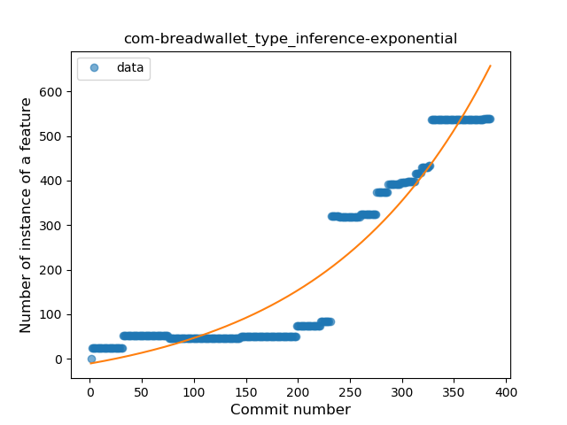

#### horse-amazin-my-stratum0-statuswidget
* Feature: When expression
* Function: 
* R_Squared: 0.90892848
 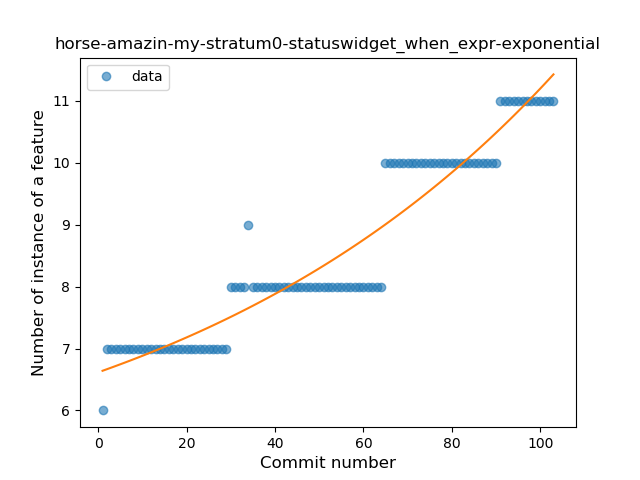

#### tech-ula
* Feature: Unsafe Call
* Function: 
* R_Squared: 0.90868041
 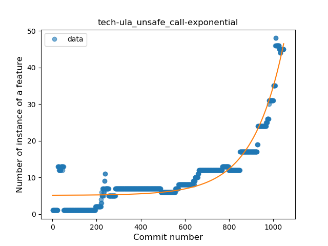

#### fr-jnda-android-flashalert
* Feature: Safe Call
* Function: 
* R_Squared: 0.90848467
 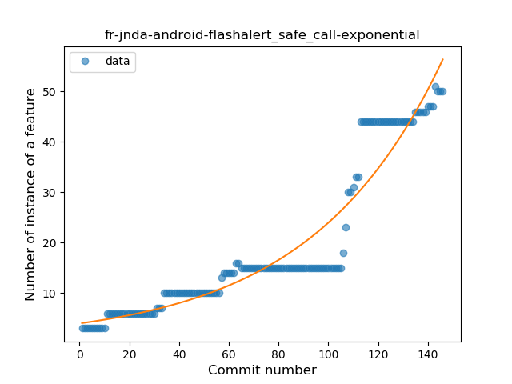

#### ru-hyst329-openfool
* Feature: Range Expression
* Function: 
* R_Squared: 0.9084316
 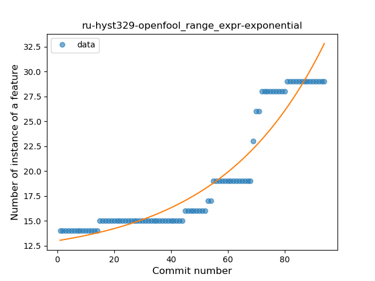

#### ai-susi
* Feature: Type Inference
* Function: 
* R_Squared: 0.9078489
 

#### at-bitfire-davdroid
* Feature: Function call with Named Argument
* Function: 
* R_Squared: 0.9077706
 

#### com-androidheads-vienna-escalero
* Feature: Coroutine
* Function: 
* R_Squared: 0.90691229
 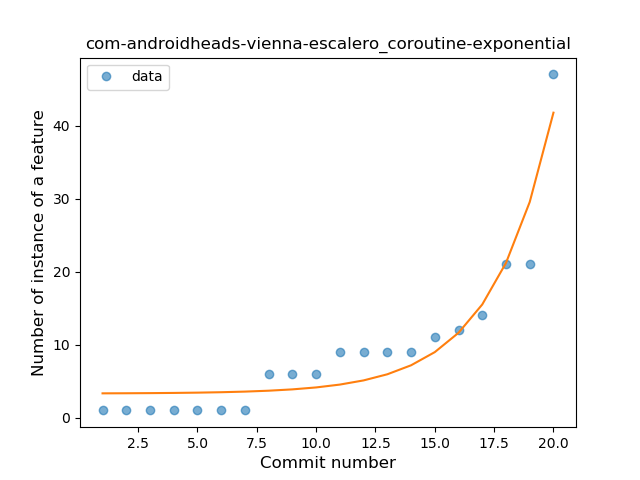

#### de-westnordost-streetcomplete
* Feature: Smart Cast
* Function: 
* R_Squared: 0.90670555
 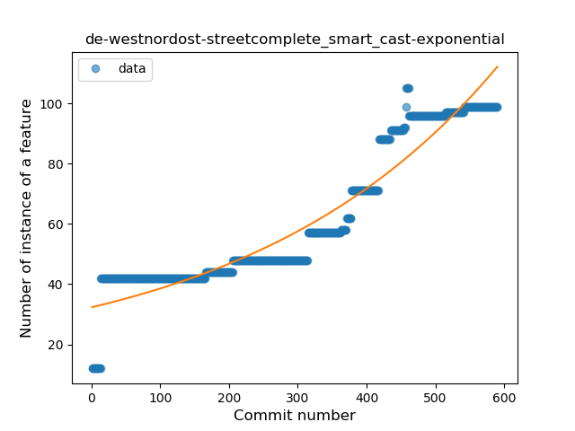

#### com-mgaetan89-showsrage
* Feature: String Template
* Function: 
* R_Squared: 0.90642802
 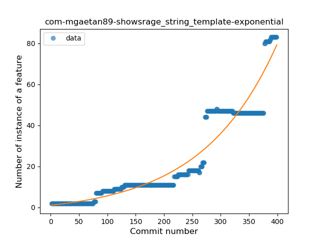

#### org-equeim-tremotesf
* Feature: Function with Default Value
* Function: 
* R_Squared: 0.9063402
 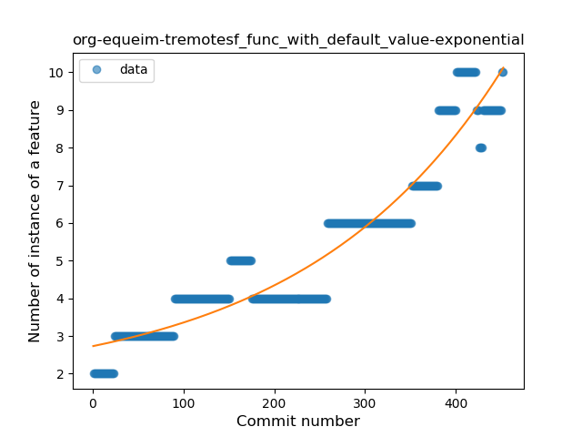

#### com-sjn-stamp
* Feature: Smart Cast
* Function: 
* R_Squared: 0.90571891
 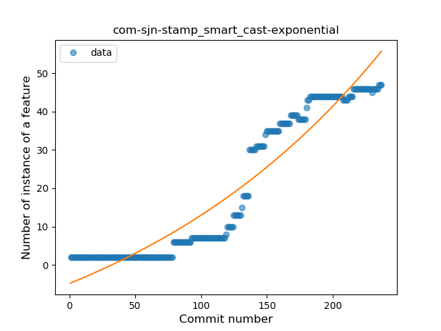

#### org-zimmob-zimlx
* Feature: Safe Call
* Function: 
* R_Squared: 0.90546438
 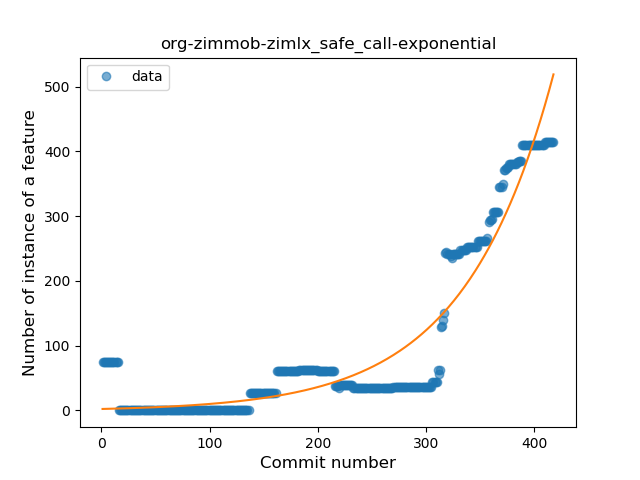

#### org-ligi-gobandroid
* Feature: Safe Call
* Function: 
* R_Squared: 0.90530826
 

#### org-ligi-passandroid
* Feature: Safe Call
* Function: 
* R_Squared: 0.90529768
 

#### org-mozilla-focus
* Feature: Property Delegation
* Function: 
* R_Squared: 0.90514764
 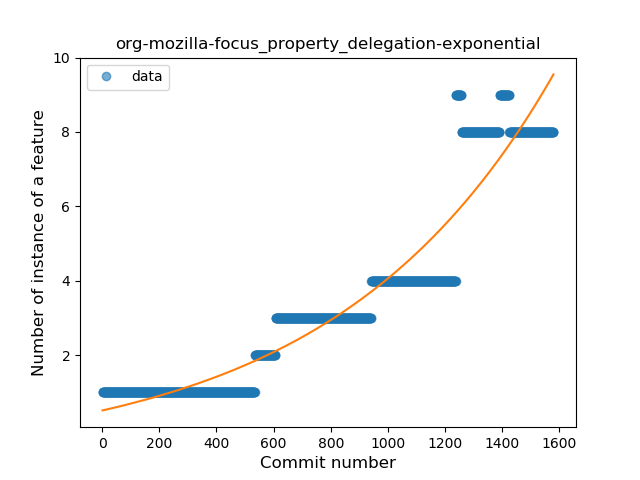

#### org-mozilla-klar
* Feature: Property Delegation
* Function: 
* R_Squared: 0.90514764
 

#### quickbeer-android
* Feature: Unsafe Call
* Function: 
* R_Squared: 0.90476413
 

#### org-bottiger-podcast
* Feature: Lambda
* Function: 
* R_Squared: 0.90476171
 

#### com-guardafilme
* Feature: Safe Call
* Function: 
* R_Squared: 0.90465151
 

#### fr-free-nrw-commons
* Feature: Safe Call
* Function: 
* R_Squared: 0.90461486
 

#### com-orgzly
* Feature: Companion Object
* Function: 
* R_Squared: 0.90440532
 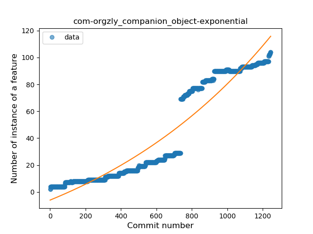

#### ru-hyst329-openfool
* Feature: String Template
* Function: 
* R_Squared: 0.90420066
 

#### com-doctoror-particleswallpaper
* Feature: Function call with Named Argument
* Function: 
* R_Squared: 0.90316263
 

#### fr-corenting-edcompanion
* Feature: Type Inference
* Function: 
* R_Squared: 0.90309633
 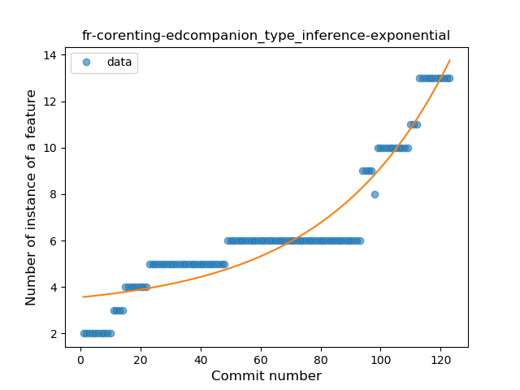

#### de-markusfisch-android-binaryeye
* Feature: Safe Call
* Function: 
* R_Squared: 0.90306636
 

#### eu-kanade-tachiyomi
* Feature: Sealed Class
* Function: 
* R_Squared: 0.90272105
 

#### com-moez-QKSMS
* Feature: Smart Cast
* Function: 
* R_Squared: 0.9026413
 

#### com-bernaferrari-changedetection
* Feature: Safe Call
* Function: 
* R_Squared: 0.90250842
 

#### ru-hyst329-openfool
* Feature: Type Inference
* Function: 
* R_Squared: 0.90220554
 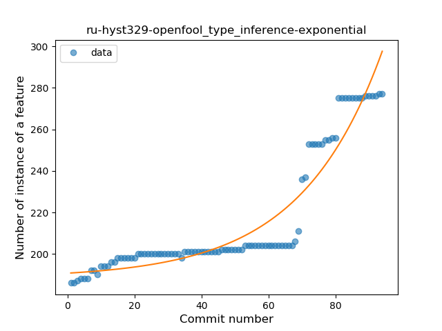

#### net-mm2d-dmsexplorer
* Feature: Type Inference
* Function: 
* R_Squared: 0.90064363
 

#### me-proxer-app
* Feature: Function with Default Value
* Function: 
* R_Squared: 0.89998262
 

#### acr-browser-lightning
* Feature: Smart Cast
* Function: 
* R_Squared: 0.89994588
 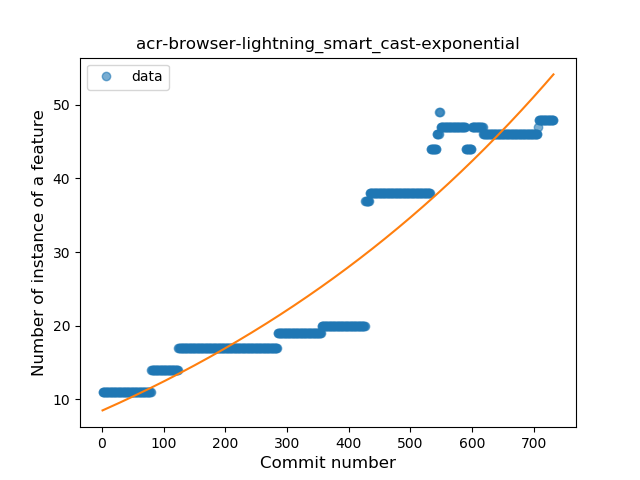

#### com-loloof64-android-basicchessendgamestrainer
* Feature: When expression
* Function: 
* R_Squared: 0.89880899
 

#### com-jereksel-libresubstratum
* Feature: Inline Function
* Function: 
* R_Squared: 0.8985021
 

#### com-wabadaba-dziennik
* Feature: Unsafe Call
* Function: 
* R_Squared: 0.89748829
 

#### com-loloof64-android-basicchessendgamestrainer
* Feature: Data Class
* Function: 
* R_Squared: 0.89745799
 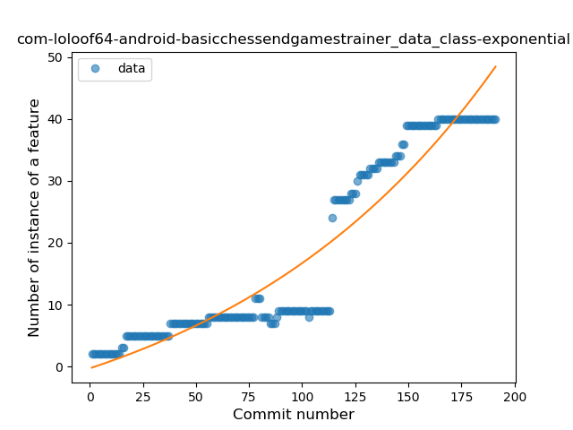

#### com-github-premnirmal-tickerwidget
* Feature: Function with Default Value
* Function: 
* R_Squared: 0.89721437
 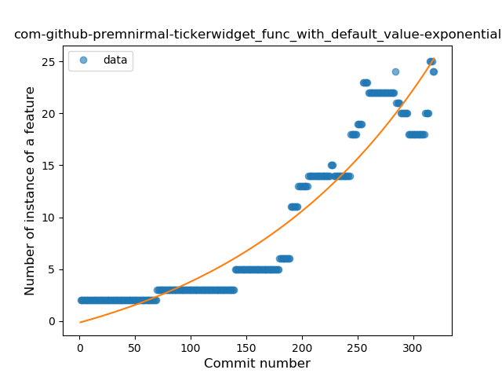

#### de-westnordost-streetcomplete
* Feature: Singleton
* Function: 
* R_Squared: 0.89673095
 

#### fr-cph-chicago-foss
* Feature: Function with Default Value
* Function: 
* R_Squared: 0.89613213
 

#### com-tomer-draw
* Feature: Lambda
* Function: 
* R_Squared: 0.89533399
 

#### com-github-vase4kin-teamcityapp
* Feature: Safe Call
* Function: 
* R_Squared: 0.89501922
 

#### com-nextcloud-talk2
* Feature: Unsafe Call
* Function: 
* R_Squared: 0.89452
 

#### ca-josephroque-bowlingcompanion
* Feature: Unsafe Call
* Function: 
* R_Squared: 0.89419803
 

#### de-westnordost-streetcomplete
* Feature: Unsafe Call
* Function: 
* R_Squared: 0.89415069
 

#### com-zeapo-pwdstore
* Feature: When expression
* Function: 
* R_Squared: 0.89405
 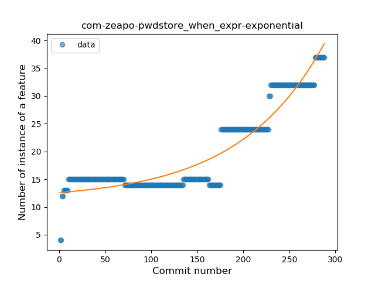

#### it-diab
* Feature: When expression
* Function: 
* R_Squared: 0.8935618
 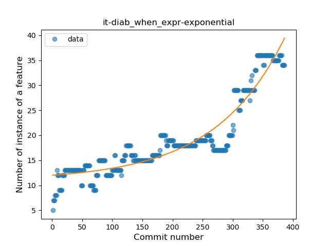

#### me-camsteffen-polite
* Feature: When expression
* Function: 
* R_Squared: 0.89341716
 

#### es-danirod-rectball-android
* Feature: Type Inference
* Function: 
* R_Squared: 0.89319276
 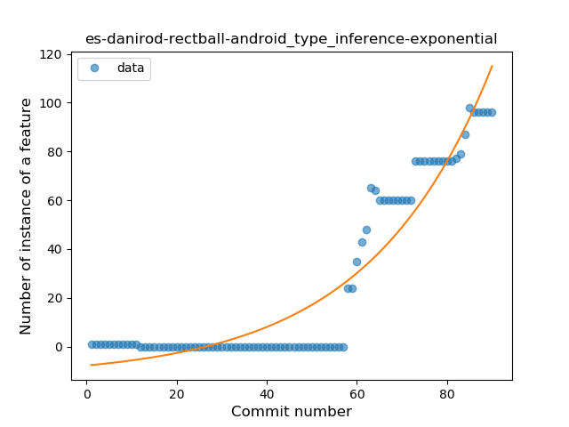

#### org-ligi-gobandroid
* Feature: Unsafe Call
* Function: 
* R_Squared: 0.89275824
 

#### ch-deletescape-lawnchair-plah
* Feature: Singleton
* Function: 
* R_Squared: 0.89244905
 

#### ca-fuwafuwa-kaku
* Feature: Safe Call
* Function: 
* R_Squared: 0.89160053
 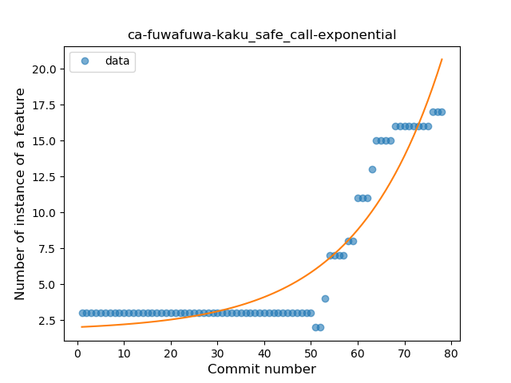

#### com-czbix-v2ex
* Feature: Unsafe Call
* Function: 
* R_Squared: 0.89158504
 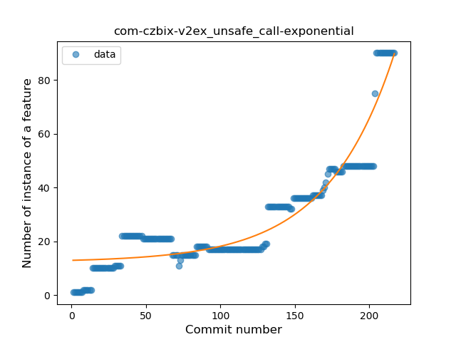

#### ch-deletescape-lawnchair-plah
* Feature: Data Class
* Function: 
* R_Squared: 0.89113666
 

#### com-jim-sharetocomputer
* Feature: Type Inference
* Function: 
* R_Squared: 0.89097289
 

#### org-zimmob-zimlx
* Feature: When expression
* Function: 
* R_Squared: 0.89082675
 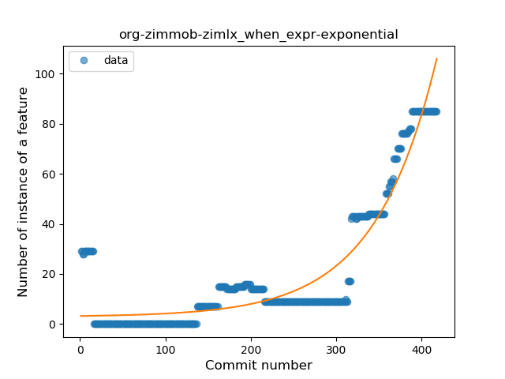

#### de-westnordost-streetcomplete
* Feature: Range Expression
* Function: 
* R_Squared: 0.89072428
 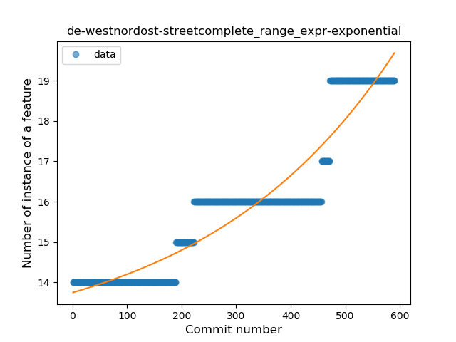

#### org-zimmob-zimlx
* Feature: Companion Object
* Function: 
* R_Squared: 0.89058662
 

#### io-trewartha-positional
* Feature: Property Delegation
* Function: 
* R_Squared: 0.89047035
 

#### com-peterlaurence-trekme
* Feature: Property Delegation
* Function: 
* R_Squared: 0.8899765
 

#### com-simplemobiletools-notes-pro
* Feature: Unsafe Call
* Function: 
* R_Squared: 0.88927411
 

#### io-ipoli-android
* Feature: Extension Function
* Function: 
* R_Squared: 0.88852164
 

#### io-github-fvasco-pinpoi
* Feature: Extension Function
* Function: 
* R_Squared: 0.88843327
 

#### link-standen-michael-phonesaver
* Feature: Singleton
* Function: 
* R_Squared: 0.88819616
 

#### com-loloof64-android-basicchessendgamestrainer
* Feature: Companion Object
* Function: 
* R_Squared: 0.887983
 

#### tw-shounenwind-kmnbottool
* Feature: Safe Call
* Function: 
* R_Squared: 0.88786934
 

#### es-usc-citius-servando-calendula
* Feature: Unsafe Call
* Function: 
* R_Squared: 0.88755984
 

#### com-utazukin-ichaival
* Feature: Coroutine
* Function: 
* R_Squared: 0.88640483
 

#### com-tasomaniac-openwith-floss
* Feature: Inline Function
* Function: 
* R_Squared: 0.88577046
 

#### com-thanksmister-iot-mqtt-alarmpanel
* Feature: When expression
* Function: 
* R_Squared: 0.88438868
 

#### io-ipoli-android
* Feature: Range Expression
* Function: 
* R_Squared: 0.88431027
 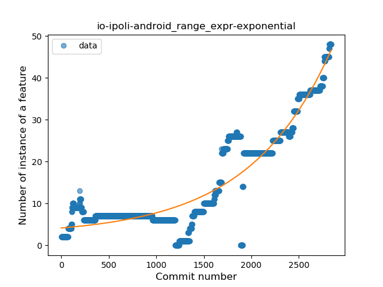

#### org-eurofurence-connavigator
* Feature: Range Expression
* Function: 
* R_Squared: 0.8842994
 

#### net-bible-android-activity
* Feature: Destructuring Declaration
* Function: 
* R_Squared: 0.88420222
 

#### com-github-fractals
* Feature: Companion Object
* Function: 
* R_Squared: 0.88402299
 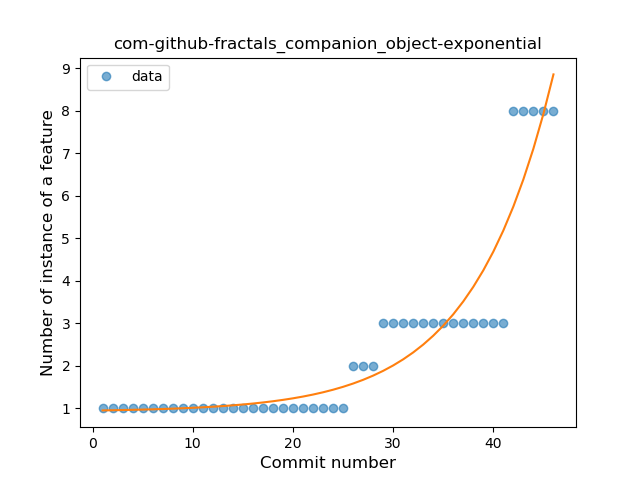

#### org-moire-ultrasonic
* Feature: Singleton
* Function: 
* R_Squared: 0.88388978
 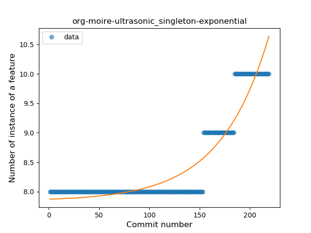

#### org-zimmob-zimlx
* Feature: Type Inference
* Function: 
* R_Squared: 0.8838029
 

#### fi-kroon-vadret
* Feature: Property Delegation
* Function: 
* R_Squared: 0.88341956
 

#### com-motion-stage1
* Feature: Smart Cast
* Function: 
* R_Squared: 0.88328091
 

#### ai-susi
* Feature: Smart Cast
* Function: 
* R_Squared: 0.88306392
 

#### chat-rocket-android
* Feature: Property Delegation
* Function: 
* R_Squared: 0.88282086
 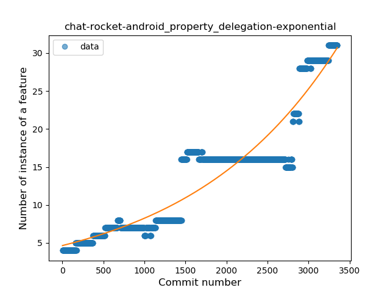

#### org-anibyl-slounik
* Feature: String Template
* Function: 
* R_Squared: 0.88247992
 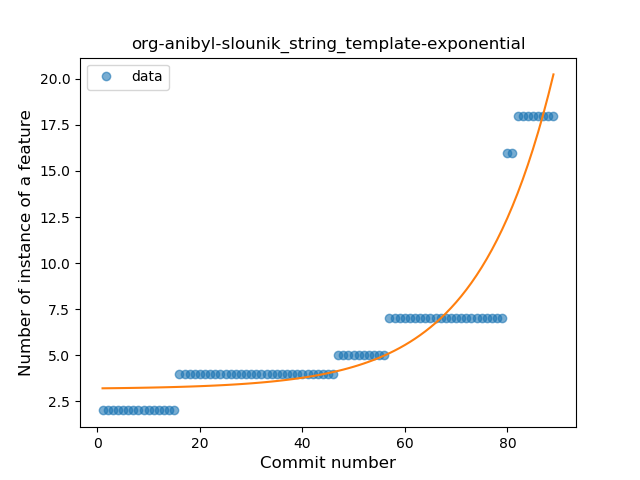

#### org-equeim-tremotesf
* Feature: Safe Call
* Function: 
* R_Squared: 0.882013
 

#### com-bijoysingh-quicknote
* Feature: Safe Call
* Function: 
* R_Squared: 0.88191346
 

#### de-Maxr1998-xposed-maxlock
* Feature: Extension Function
* Function: 
* R_Squared: 0.8814051
 

#### me-anon-grow
* Feature: Extension Function
* Function: 
* R_Squared: 0.88093972
 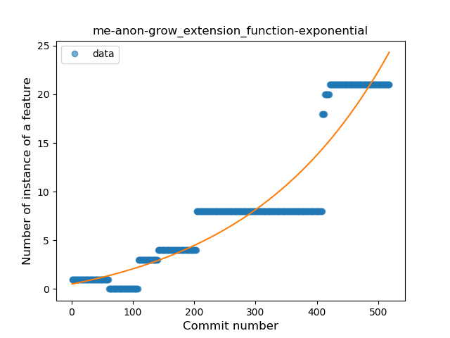

#### com-czbix-v2ex
* Feature: Smart Cast
* Function: 
* R_Squared: 0.88046169
 

#### net-mm2d-dmsexplorer
* Feature: Companion Object
* Function: 
* R_Squared: 0.88039218
 

#### com-duckduckgo-mobile-android
* Feature: When expression
* Function: 
* R_Squared: 0.87970804
 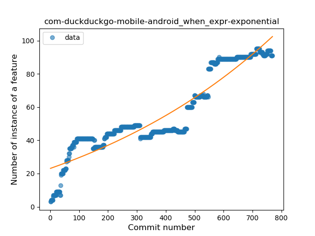

#### org-lenchan139-ncbookmark
* Feature: Unsafe Call
* Function: 
* R_Squared: 0.87947766
 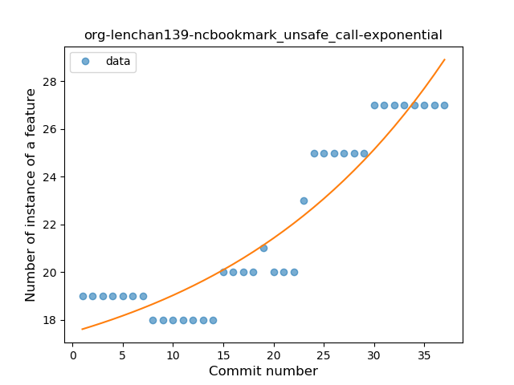

#### eu-kanade-tachiyomi
* Feature: Inline Function
* Function: 
* R_Squared: 0.87943236
 

#### com-nextcloud-talk2
* Feature: Safe Call
* Function: 
* R_Squared: 0.87918141
 

#### com-doctoror-particleswallpaper
* Feature: Range Expression
* Function: 
* R_Squared: 0.87889659
 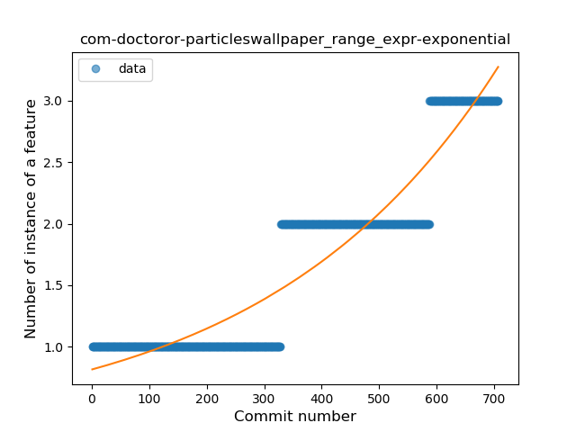

#### org-eurofurence-connavigator
* Feature: Destructuring Declaration
* Function: 
* R_Squared: 0.87803933
 

#### me-echeung-moemoekyun-fdroid
* Feature: Extension Function
* Function: 
* R_Squared: 0.87746151
 

#### se-creotec-chscardbalance2
* Feature: String Template
* Function: 
* R_Squared: 0.87698553
 

#### net-osmand-plus
* Feature: Function call with Named Argument
* Function: 
* R_Squared: 0.87669229
 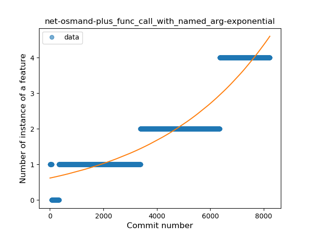

#### sk-styk-martin-apkanalyzer
* Feature: Lambda
* Function: 
* R_Squared: 0.87557318
 

#### com-stevenschoen-putionew
* Feature: Data Class
* Function: 
* R_Squared: 0.87533257
 

#### com-moez-QKSMS
* Feature: String Template
* Function: 
* R_Squared: 0.87496484
 

#### ru-hyst329-openfool
* Feature: Destructuring Declaration
* Function: 
* R_Squared: 0.87495655
 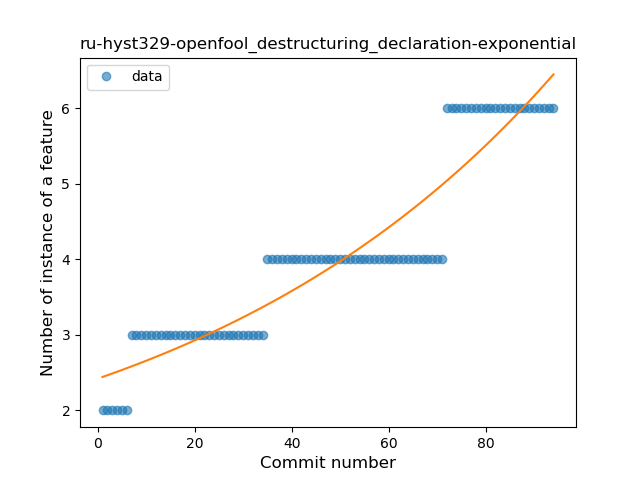

#### com-jim-sharetocomputer
* Feature: Companion Object
* Function: 
* R_Squared: 0.87459835
 

#### org-zimmob-zimlx
* Feature: Function with Default Value
* Function: 
* R_Squared: 0.87437529
 

#### se-barsk-park
* Feature: When expression
* Function: 
* R_Squared: 0.87399456
 

#### tw-shounenwind-kmnbottool
* Feature: Inline Function
* Function: 
* R_Squared: 0.87341478
 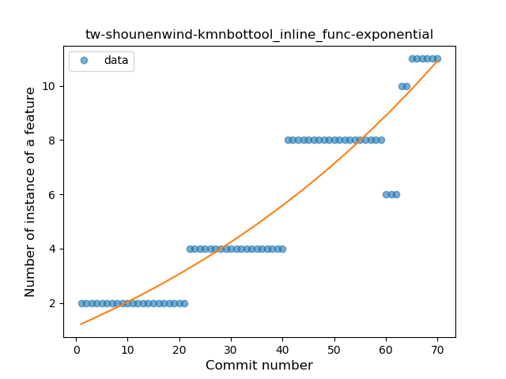

#### com-bernaferrari-changedetection
* Feature: Function with Default Value
* Function: 
* R_Squared: 0.87279437
 

#### org-equeim-tremotesf
* Feature: Inline Function
* Function: 
* R_Squared: 0.87273306
 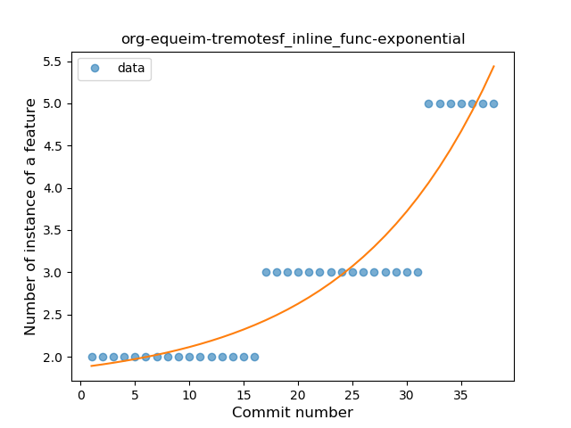

#### io-ipoli-android
* Feature: Companion Object
* Function: 
* R_Squared: 0.87159561
 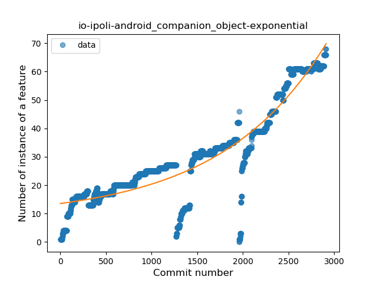

#### com-czbix-v2ex
* Feature: Function call with Named Argument
* Function: 
* R_Squared: 0.87004305
 

#### com-github-quarck-calnotify
* Feature: Extension Function
* Function: 
* R_Squared: 0.86991743
 

#### me-camsteffen-polite
* Feature: Data Class
* Function: 
* R_Squared: 0.86649964
 

#### com-orgzly
* Feature: Function call with Named Argument
* Function: 
* R_Squared: 0.86638417
 

#### link-standen-michael-phonesaver
* Feature: Data Class
* Function: 
* R_Squared: 0.86607394
 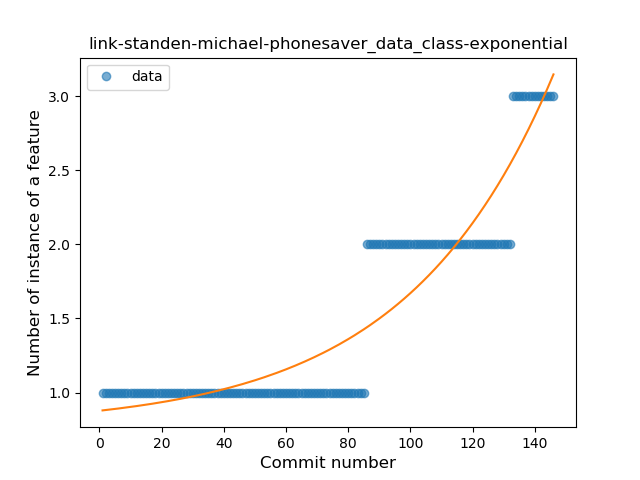

#### org-mosad-seil0-projectlaogai
* Feature: String Template
* Function: 
* R_Squared: 0.86556172
 

#### at-bitfire-davdroid
* Feature: Singleton
* Function: 
* R_Squared: 0.86551304
 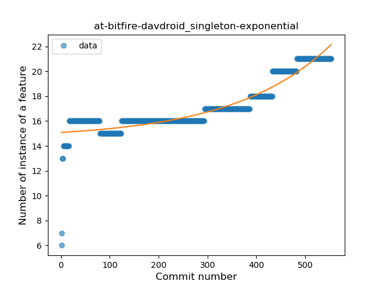

#### com-moez-QKSMS
* Feature: When expression
* Function: 
* R_Squared: 0.86520708
 

#### pw-janyo-janyoshare
* Feature: Safe Call
* Function: 
* R_Squared: 0.86473068
 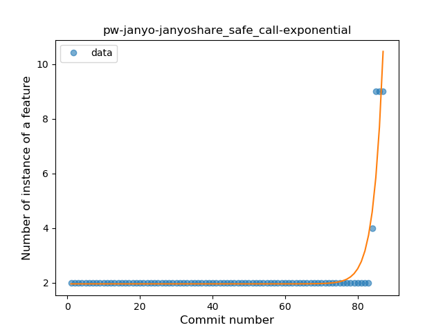

#### fr-jnda-android-flashalert
* Feature: Lambda
* Function: 
* R_Squared: 0.86472082
 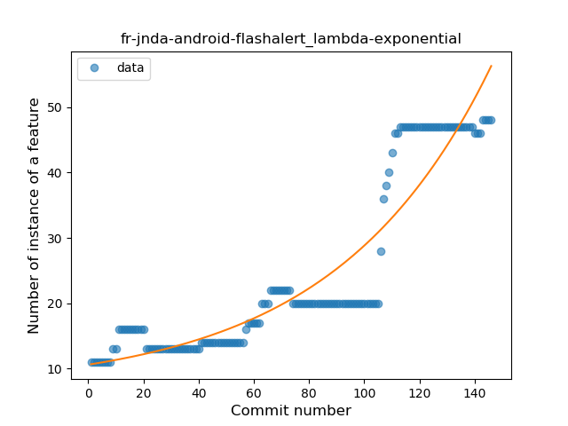

#### com-orgzly
* Feature: Safe Call
* Function: 
* R_Squared: 0.86392571
 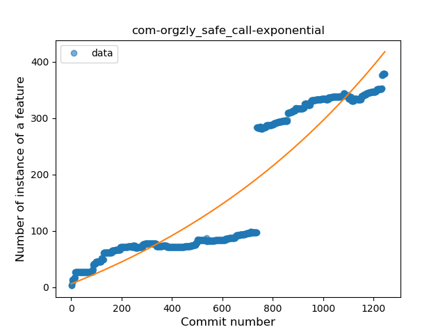

#### ch-rmy-android-http_shortcuts
* Feature: Singleton
* Function: 
* R_Squared: 0.86313595
 

#### com-github-vase4kin-teamcityapp
* Feature: Singleton
* Function: 
* R_Squared: 0.86184827
 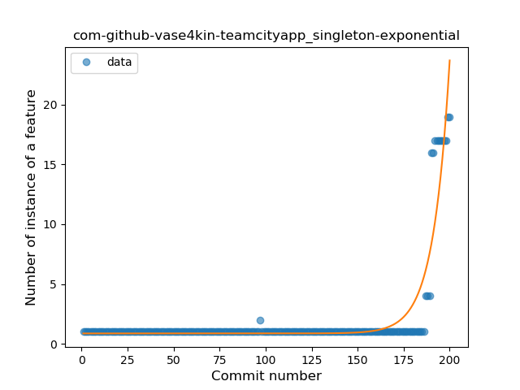

#### org-blokada-alarm
* Feature: Coroutine
* Function: 
* R_Squared: 0.86144663
 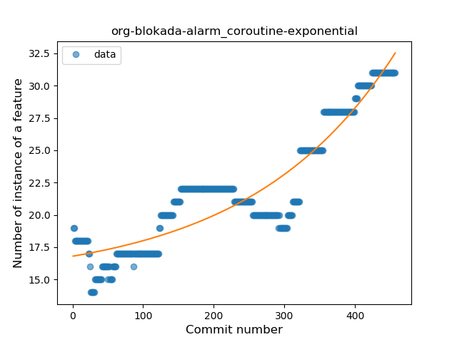

#### com-breadwallet
* Feature: Unsafe Call
* Function: 
* R_Squared: 0.86140205
 

#### me-proxer-app
* Feature: Singleton
* Function: 
* R_Squared: 0.86138479
 

#### quickbeer-android
* Feature: Function call with Named Argument
* Function: 
* R_Squared: 0.86120985
 

#### com-guerinet-mymartlet
* Feature: Function call with Named Argument
* Function: 
* R_Squared: 0.86083249
 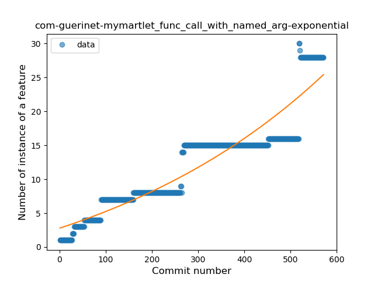

#### com-simplemobiletools-gallery
* Feature: Unsafe Call
* Function: 
* R_Squared: 0.86068532
 

#### ml-adamsprogs-bimba
* Feature: Smart Cast
* Function: 
* R_Squared: 0.86040493
 

#### app-opass-ccip
* Feature: When expression
* Function: 
* R_Squared: 0.86039061
 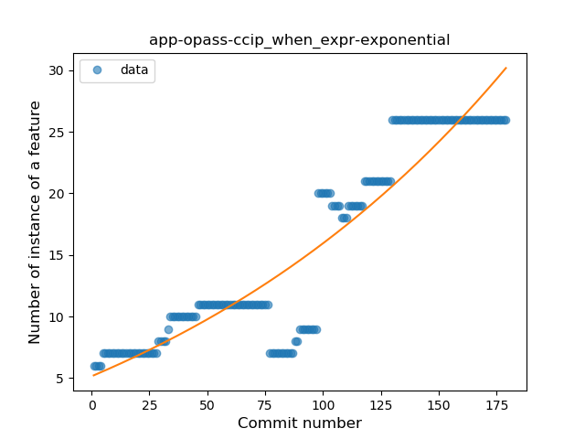

#### de-westnordost-streetcomplete
* Feature: Data Class
* Function: 
* R_Squared: 0.8586133
 

#### net-yslibrary-monotweety
* Feature: Property Delegation
* Function: 
* R_Squared: 0.85841347
 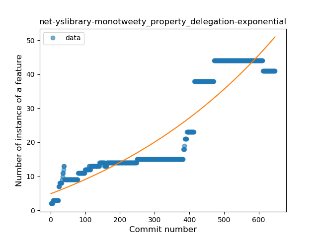

#### science-apolline
* Feature: Unsafe Call
* Function: 
* R_Squared: 0.85839772
 

#### ca-josephroque-bowlingcompanion
* Feature: Function with Default Value
* Function: 
* R_Squared: 0.85766156
 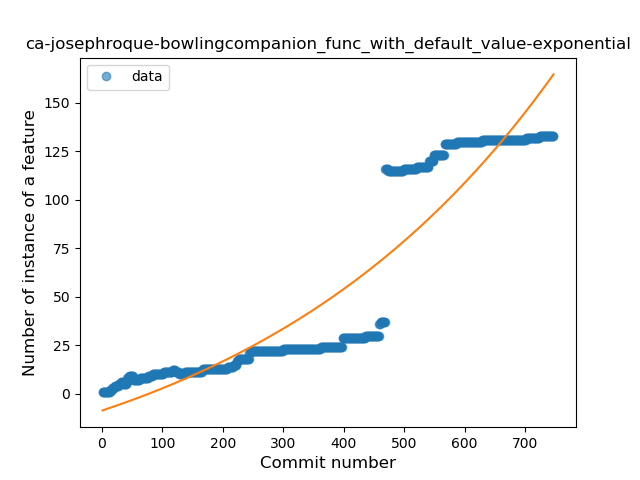

#### io-github-wulkanowy
* Feature: Unsafe Call
* Function: 
* R_Squared: 0.85744677
 

#### com-czbix-v2ex
* Feature: Data Class
* Function: 
* R_Squared: 0.8550459
 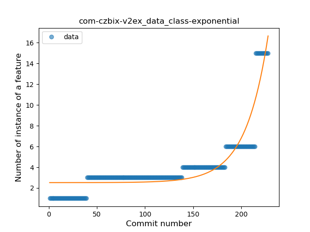

#### org-pacien-tincapp
* Feature: When expression
* Function: 
* R_Squared: 0.85465934
 

#### pt-joaomneto-titancompanion
* Feature: Type Inference
* Function: 
* R_Squared: 0.8545685
 

#### net-mm2d-dmsexplorer
* Feature: Property Delegation
* Function: 
* R_Squared: 0.8545268
 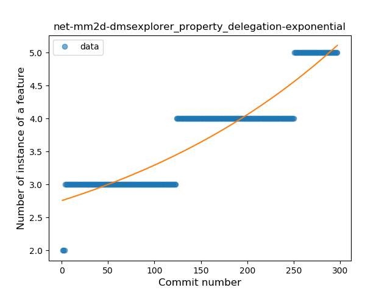

#### co-timecrypt-android
* Feature: Safe Call
* Function: 
* R_Squared: 0.85347905
 

#### net-mm2d-dmsexplorer
* Feature: Range Expression
* Function: 
* R_Squared: 0.85325397
 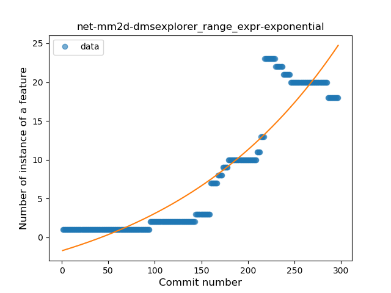

#### fi-tuska-jalkametri
* Feature: Safe Call
* Function: 
* R_Squared: 0.85324272
 

#### pt-joaomneto-titancompanion
* Feature: Function with Default Value
* Function: 
* R_Squared: 0.85313458
 

#### li-klass-fhem
* Feature: Extension Function
* Function: 
* R_Squared: 0.85289413
 

#### org-emunix-insteadlauncher
* Feature: Safe Call
* Function: 
* R_Squared: 0.8520104
 

#### app-opass-ccip
* Feature: Singleton
* Function: 
* R_Squared: 0.85065774
 

#### com-jim-sharetocomputer
* Feature: Property Delegation
* Function: 
* R_Squared: 0.85046622
 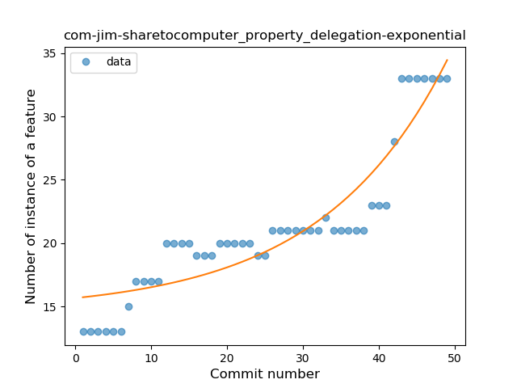

#### io-github-benoitduffez-cupsprint
* Feature: Safe Call
* Function: 
* R_Squared: 0.85015535
 

#### net-syncthing-lite
* Feature: When expression
* Function: 
* R_Squared: 0.85002505
 

#### com-bernaferrari-changedetection
* Feature: String Template
* Function: 
* R_Squared: 0.8473748
 

#### de-csicar-mensaplan
* Feature: Type Inference
* Function: 
* R_Squared: 0.84736982
 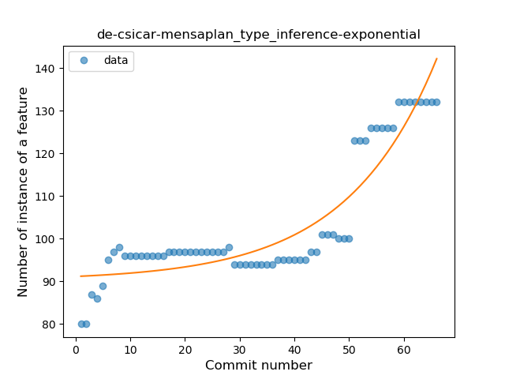

#### apps-amine-bou-readerforselfoss
* Feature: Type Inference
* Function: 
* R_Squared: 0.84736568
 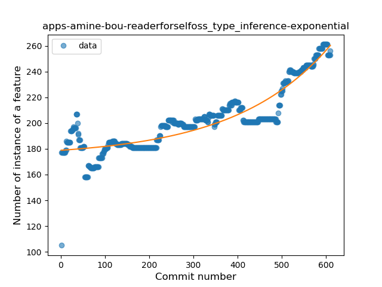

#### moe-feng-nhentai
* Feature: Property Delegation
* Function: 
* R_Squared: 0.84724004
 

#### com-sjn-stamp
* Feature: String Template
* Function: 
* R_Squared: 0.84559186
 

#### com-slash-batterychargelimit
* Feature: Safe Call
* Function: 
* R_Squared: 0.84507397
 

#### com-bernaferrari-changedetection
* Feature: Extension Function
* Function: 
* R_Squared: 0.84489394
 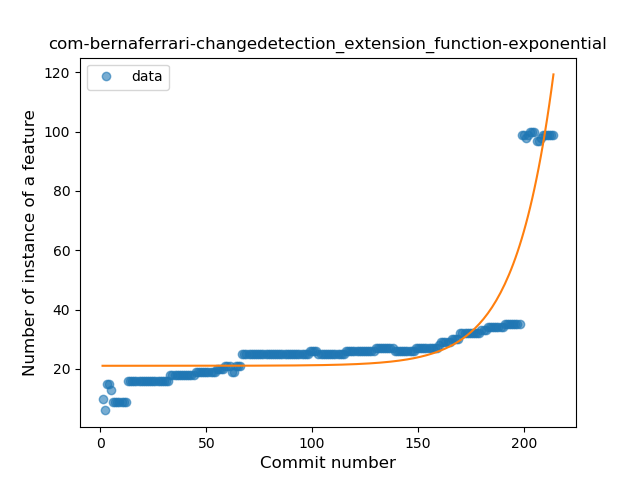

#### org-commcare-dalvik
* Feature: Type Inference
* Function: 
* R_Squared: 0.84461384
 

#### org-equeim-tremotesf
* Feature: Companion Object
* Function: 
* R_Squared: 0.84353239
 

#### fr-chenry-android-freshrss
* Feature: Safe Call
* Function: 
* R_Squared: 0.84343074
 

#### org-mozilla-focus
* Feature: Function call with Named Argument
* Function: 
* R_Squared: 0.84334743
 

#### org-mozilla-klar
* Feature: Function call with Named Argument
* Function: 
* R_Squared: 0.84334743
 

#### com-mgaetan89-showsrage
* Feature: Companion Object
* Function: 
* R_Squared: 0.84234298
 

#### com-slash-batterychargelimit
* Feature: Property Delegation
* Function: 
* R_Squared: 0.84226209
 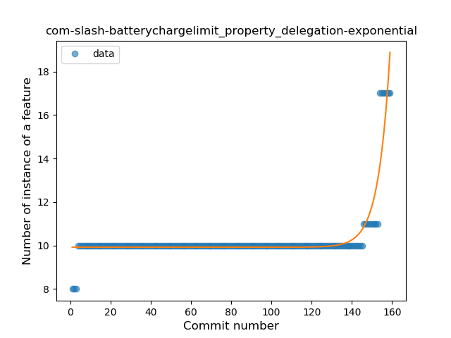

#### com-simplemobiletools-gallery-pro
* Feature: Function call with Named Argument
* Function: 
* R_Squared: 0.84217817
 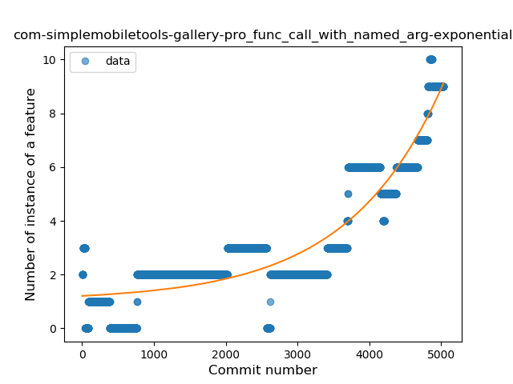

#### org-zimmob-zimlx
* Feature: Smart Cast
* Function: 
* R_Squared: 0.84213851
 

#### com-fsck-k9
* Feature: String Template
* Function: 
* R_Squared: 0.84191488
 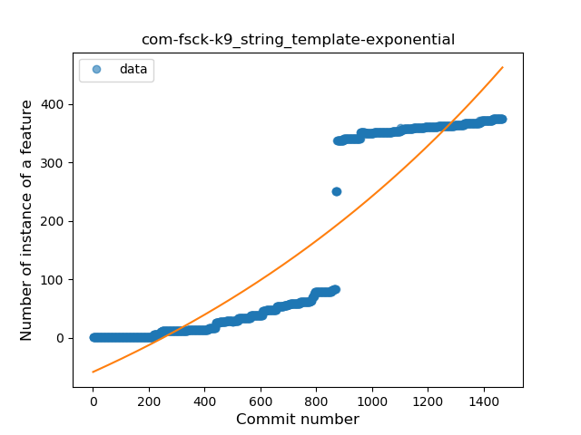

#### com-loloof64-android-basicchessendgamestrainer
* Feature: Smart Cast
* Function: 
* R_Squared: 0.84145812
 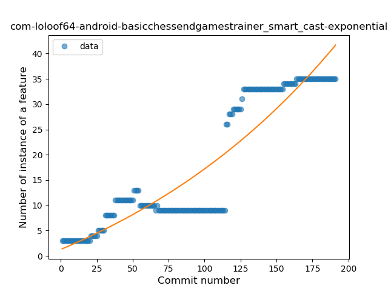

#### pw-janyo-whatanime
* Feature: Safe Call
* Function: 
* R_Squared: 0.83822532
 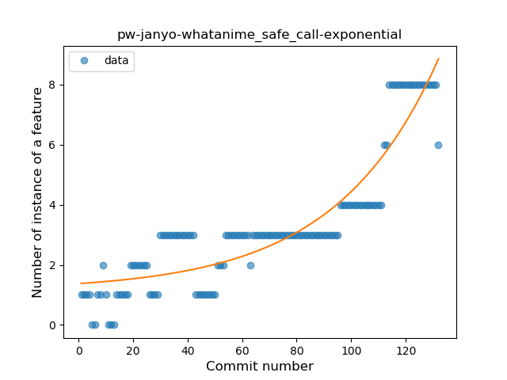

#### me-murks-feedwatcher
* Feature: When expression
* Function: 
* R_Squared: 0.83792193
 

#### com-brentpanther-bitcoinwidget
* Feature: Singleton
* Function: 
* R_Squared: 0.83613749
 

#### com-fsck-k9
* Feature: Inline Function
* Function: 
* R_Squared: 0.83584238
 

#### net-kourlas-voipms
* Feature: Function call with Named Argument
* Function: 
* R_Squared: 0.83492729
 

#### com-czbix-v2ex
* Feature: Function with Default Value
* Function: 
* R_Squared: 0.83399986
 

#### com-jereksel-libresubstratum
* Feature: Function call with Named Argument
* Function: 
* R_Squared: 0.83284289
 

#### chat-rocket-android
* Feature: Singleton
* Function: 
* R_Squared: 0.83213608
 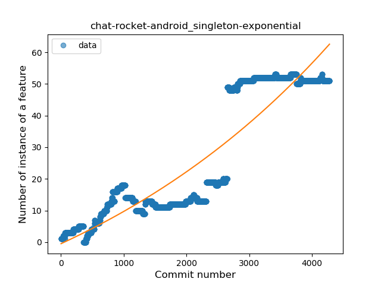

#### com-jim-sharetocomputer
* Feature: Unsafe Call
* Function: 
* R_Squared: 0.83132374
 

#### com-mgaetan89-showsrage
* Feature: Range Expression
* Function: 
* R_Squared: 0.83112933
 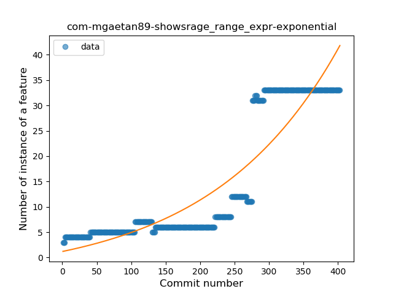

#### com-jereksel-libresubstratum
* Feature: Destructuring Declaration
* Function: 
* R_Squared: 0.83019453
 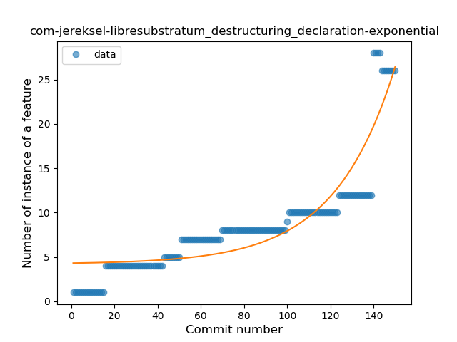

#### com-github-laurenttreguier-deck
* Feature: When expression
* Function: 
* R_Squared: 0.83019415
 

#### ca-fuwafuwa-kaku
* Feature: Function with Default Value
* Function: 
* R_Squared: 0.82976813
 

#### com-nononsenseapps-feeder
* Feature: Property Delegation
* Function: 
* R_Squared: 0.82826796
 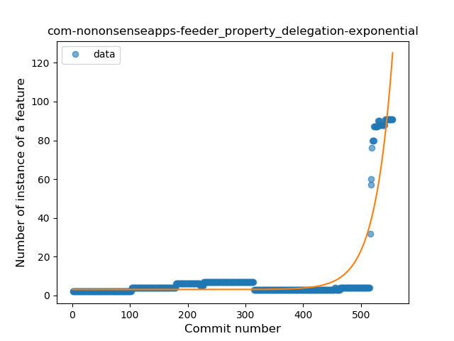

#### org-ligi-passandroid
* Feature: String Template
* Function: 
* R_Squared: 0.82796821
 

#### com-kgurgul-cpuinfo
* Feature: When expression
* Function: 
* R_Squared: 0.82690093
 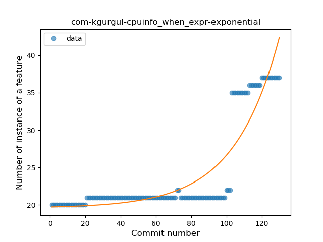

#### pt-joaomneto-titancompanion
* Feature: Unsafe Call
* Function: 
* R_Squared: 0.82539538
 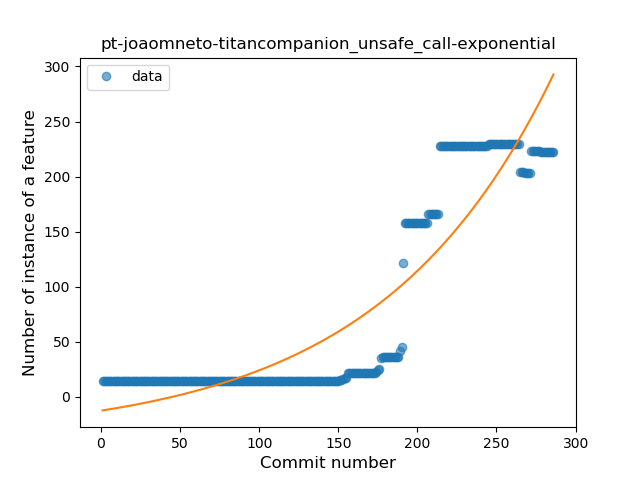

#### com-loloof64-android-basicchessendgamestrainer
* Feature: String Template
* Function: 
* R_Squared: 0.82523205
 

#### de-westnordost-streetcomplete
* Feature: Destructuring Declaration
* Function: 
* R_Squared: 0.82501497
 

#### com-github-premnirmal-tickerwidget
* Feature: Function call with Named Argument
* Function: 
* R_Squared: 0.82452201
 

#### de-r4md4c-gamedealz
* Feature: Smart Cast
* Function: 
* R_Squared: 0.82446781
 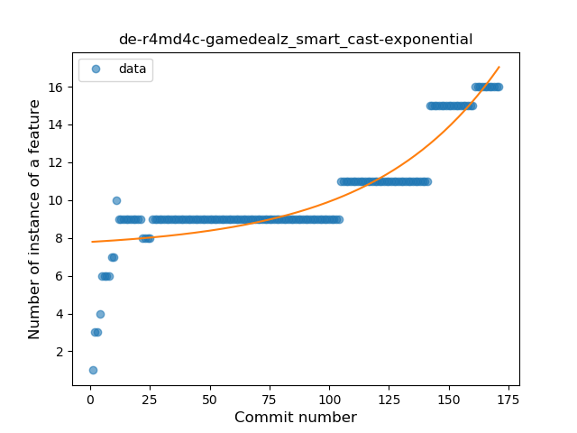

#### org-zimmob-zimlx
* Feature: Property Delegation
* Function: 
* R_Squared: 0.82373404
 

#### com-boardgamegeek
* Feature: Unsafe Call
* Function: 
* R_Squared: 0.8231022
 

#### jp-cordea-mackerelclient
* Feature: Lambda
* Function: 
* R_Squared: 0.82268881
 

#### com-bernaferrari-changedetection
* Feature: Coroutine
* Function: 
* R_Squared: 0.82121675
 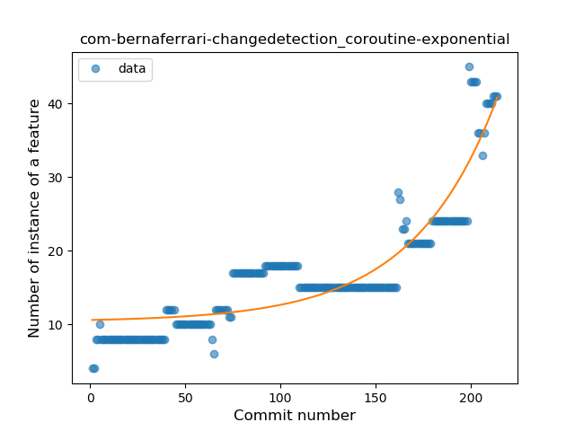

#### me-murks-feedwatcher
* Feature: Unsafe Call
* Function: 
* R_Squared: 0.82102437
 

#### com-pyamsoft-homebutton
* Feature: Type Inference
* Function: 
* R_Squared: 0.82061756
 

#### is-xyz-mpv
* Feature: Lambda
* Function: 
* R_Squared: 0.82023919
 

#### saschpe-poker
* Feature: When expression
* Function: 
* R_Squared: 0.81965744
 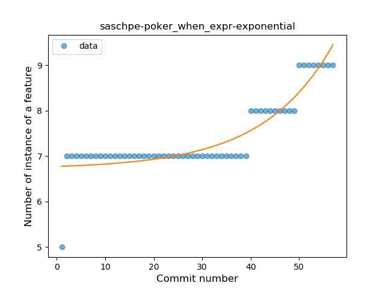

#### de-westnordost-streetcomplete
* Feature: Function call with Named Argument
* Function: 
* R_Squared: 0.81761009
 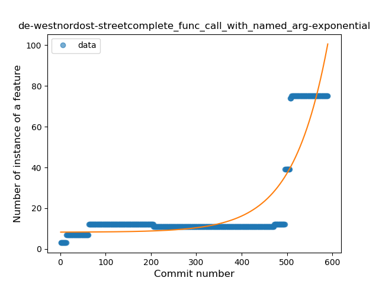

#### org-walleth
* Feature: Unsafe Call
* Function: 
* R_Squared: 0.81740236
 

#### info-papdt-express-helper
* Feature: Function with Default Value
* Function: 
* R_Squared: 0.81338958
 

#### ryey-easer-beta
* Feature: Lambda
* Function: 
* R_Squared: 0.81322247
 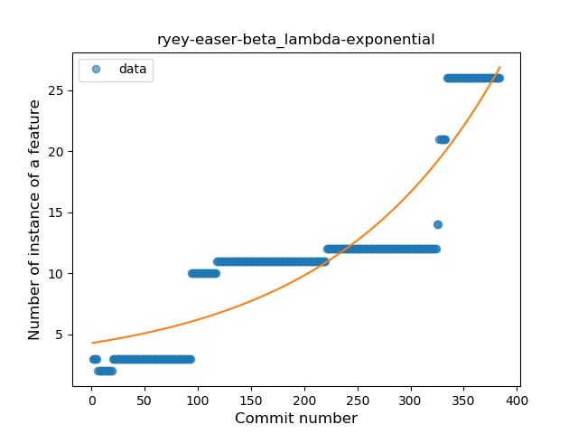

#### tech-ula
* Feature: Range Expression
* Function: 
* R_Squared: 0.8128032
 

#### com-moez-QKSMS
* Feature: Type Inference
* Function: 
* R_Squared: 0.81081624
 

#### org-pacien-tincapp
* Feature: Data Class
* Function: 
* R_Squared: 0.81054331
 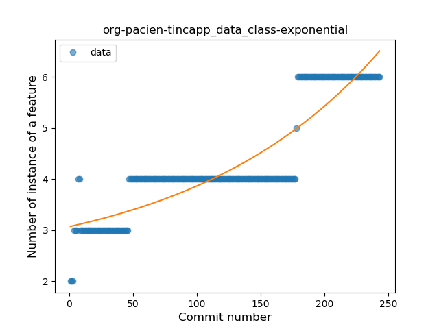

#### com-breadwallet
* Feature: Lambda
* Function: 
* R_Squared: 0.80801018
 

#### com-phicdy-totoanticipation
* Feature: Safe Call
* Function: 
* R_Squared: 0.80789632
 

#### com-orgzly
* Feature: Sealed Class
* Function: 
* R_Squared: 0.8075323
 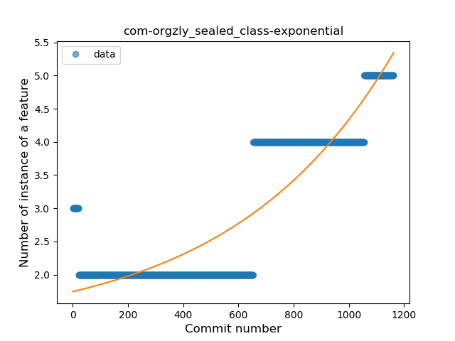

#### com-bernaferrari-changedetection
* Feature: Singleton
* Function: 
* R_Squared: 0.80725407
 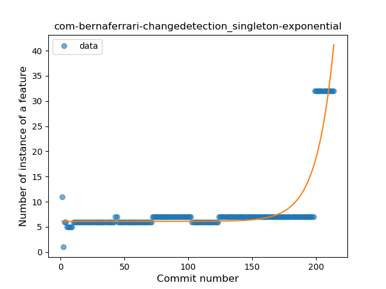

#### org-zimmob-zimlx
* Feature: Extension Function
* Function: 
* R_Squared: 0.80711475
 

#### org-mozilla-focus
* Feature: Unsafe Call
* Function: 
* R_Squared: 0.8071065
 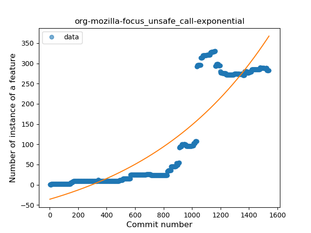

#### org-mozilla-klar
* Feature: Unsafe Call
* Function: 
* R_Squared: 0.8071065
 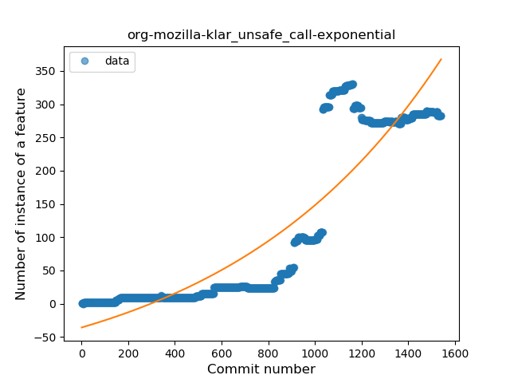

#### com-bernaferrari-changedetection
* Feature: When expression
* Function: 
* R_Squared: 0.80682175
 

#### org-zimmob-zimlx
* Feature: Function call with Named Argument
* Function: 
* R_Squared: 0.80636435
 

#### org-mosad-seil0-projectlaogai
* Feature: Type Inference
* Function: 
* R_Squared: 0.80264271
 

#### org-isoron-uhabits
* Feature: Extension Function
* Function: 
* R_Squared: 0.80003908
 

#### com-phicdy-totoanticipation
* Feature: Lambda
* Function: 
* R_Squared: 0.79892408
 

#### com-doctoror-particleswallpaper
* Feature: Safe Call
* Function: 
* R_Squared: 0.79888314
 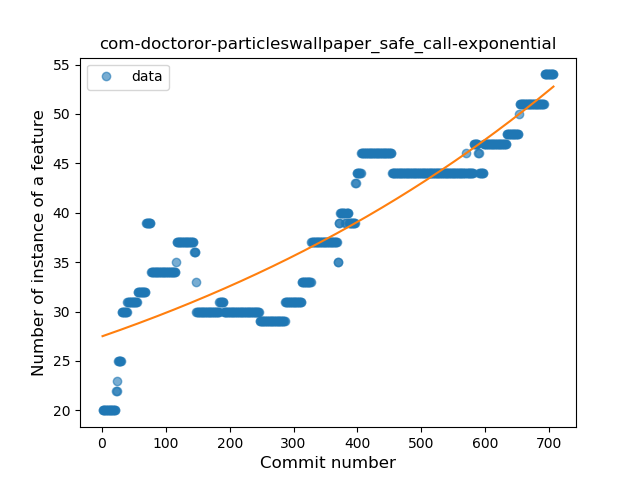

#### org-poul-bits-android
* Feature: Data Class
* Function: 
* R_Squared: 0.79877752
 

#### com-dozingcatsoftware-vectorcamera
* Feature: Smart Cast
* Function: 
* R_Squared: 0.79708984
 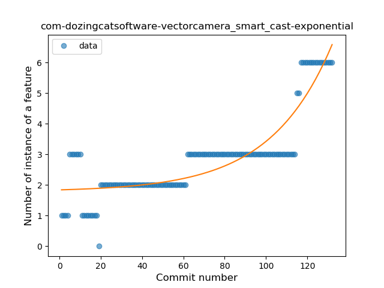

#### jp-toastkid-yobidashi
* Feature: Function call with Named Argument
* Function: 
* R_Squared: 0.79482405
 

#### ca-fuwafuwa-kaku
* Feature: Range Expression
* Function: 
* R_Squared: 0.79414634
 

#### info-dvkr-screenstream
* Feature: Type Inference
* Function: 
* R_Squared: 0.79113456
 

#### nl-mpcjanssen-simpletask
* Feature: Destructuring Declaration
* Function: 
* R_Squared: 0.78967532
 

#### com-kgurgul-cpuinfo
* Feature: Safe Call
* Function: 
* R_Squared: 0.78956918
 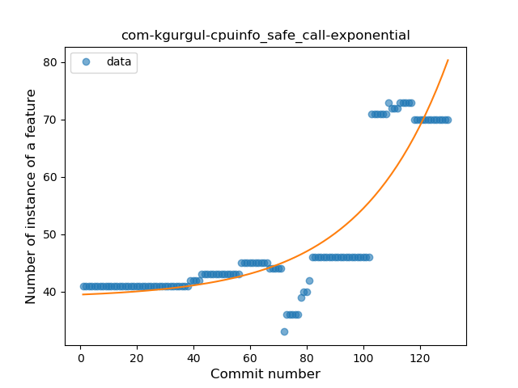

#### pt-ipleiria-mymusicqoe
* Feature: Unsafe Call
* Function: 
* R_Squared: 0.78843974
 

#### pl-org-seva-texter
* Feature: Property Delegation
* Function: 
* R_Squared: 0.78531777
 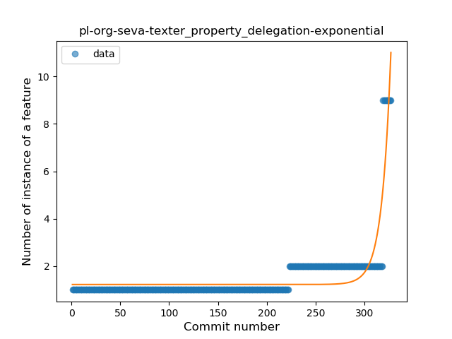

#### com-cookiegames-smartcookie
* Feature: Type Inference
* Function: 
* R_Squared: 0.78382484
 

#### de-westnordost-streetcomplete
* Feature: Sealed Class
* Function: 
* R_Squared: 0.78181534
 

#### org-mozilla-focus
* Feature: Type Alias
* Function: 
* R_Squared: 0.78139014
 

#### org-mozilla-klar
* Feature: Type Alias
* Function: 
* R_Squared: 0.78139014
 

#### com-cookiegames-smartcookie
* Feature: Lambda
* Function: 
* R_Squared: 0.78109054
 

#### com-pluscubed-velociraptor
* Feature: Safe Call
* Function: 
* R_Squared: 0.77963733
 

#### com-breadwallet
* Feature: Function with Default Value
* Function: 
* R_Squared: 0.77665806
 

#### com-cookiegames-smartcookie
* Feature: Smart Cast
* Function: 
* R_Squared: 0.77462287
 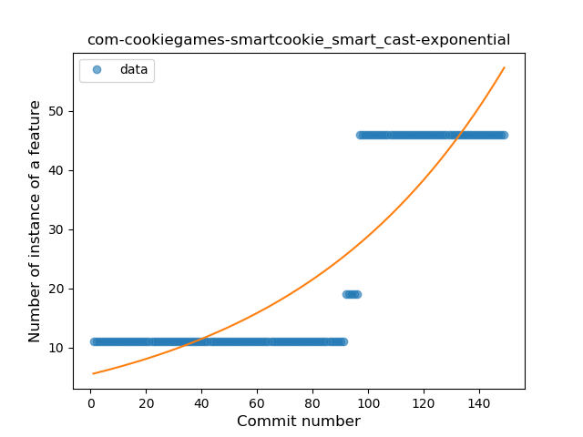

#### me-kirimin-mitsumine
* Feature: Function call with Named Argument
* Function: 
* R_Squared: 0.77422338
 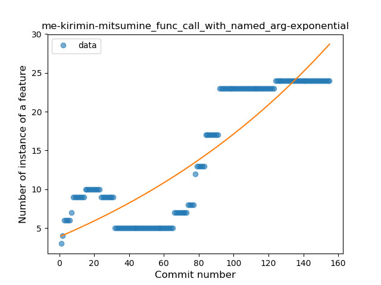

#### ai-susi
* Feature: Singleton
* Function: 
* R_Squared: 0.77393398
 

#### com-doctoror-particleswallpaper
* Feature: When expression
* Function: 
* R_Squared: 0.77316682
 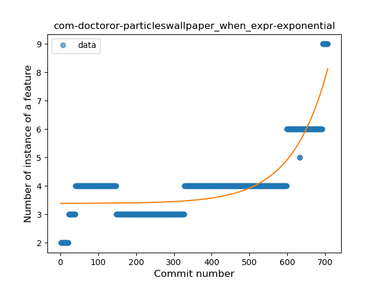

#### org-isoron-uhabits
* Feature: Type Inference
* Function: 
* R_Squared: 0.77107462
 

#### tw-shounenwind-kmnbottool
* Feature: Companion Object
* Function: 
* R_Squared: 0.76955774
 

#### com-cookiegames-smartcookie
* Feature: Companion Object
* Function: 
* R_Squared: 0.76954515
 

#### com-cookiegames-smartcookie
* Feature: Safe Call
* Function: 
* R_Squared: 0.76945834
 

#### com-cookiegames-smartcookie
* Feature: When expression
* Function: 
* R_Squared: 0.7682204
 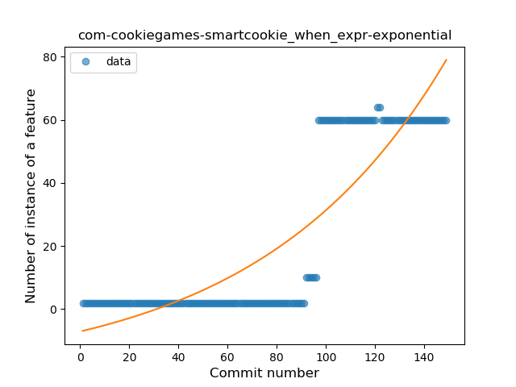

#### org-zimmob-zimlx
* Feature: Range Expression
* Function: 
* R_Squared: 0.76659004
 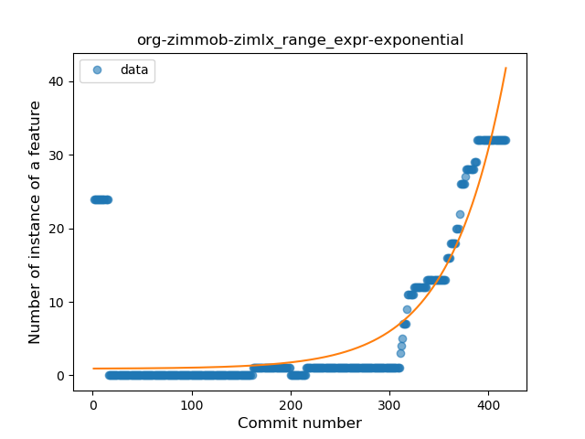

#### apps-jizzu-simpletodo
* Feature: Extension Function
* Function: 
* R_Squared: 0.7657238
 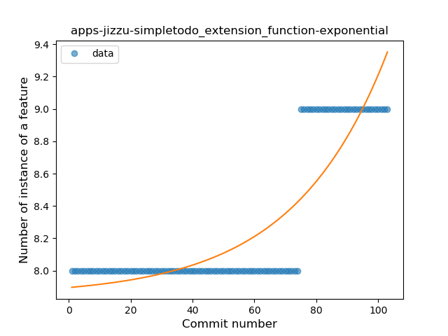

#### de-csicar-mensaplan
* Feature: Companion Object
* Function: 
* R_Squared: 0.76533951
 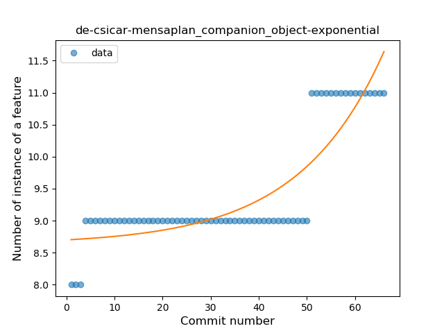

#### com-manichord-mgit
* Feature: Safe Call
* Function: 
* R_Squared: 0.76217383
 

#### uk-co-richyhbm-monochromatic
* Feature: Companion Object
* Function: 
* R_Squared: 0.76156415
 

#### cz-dvratil-fbeventsync
* Feature: Function with Default Value
* Function: 
* R_Squared: 0.75988052
 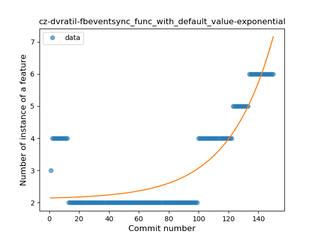

#### com-conorodonnell-bus
* Feature: Function call with Named Argument
* Function: 
* R_Squared: 0.75790577
 

#### com-github-fields-electric
* Feature: Safe Call
* Function: 
* R_Squared: 0.75784109
 

#### com-github-cvzi-screenshottile
* Feature: Companion Object
* Function: 
* R_Squared: 0.75682952
 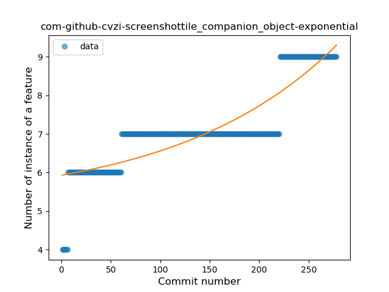

#### com-sjn-stamp
* Feature: Function with Default Value
* Function: 
* R_Squared: 0.75680466
 

#### de-avpptr-umweltzone
* Feature: Function call with Named Argument
* Function: 
* R_Squared: 0.75613533
 

#### com-cookiegames-smartcookie
* Feature: String Template
* Function: 
* R_Squared: 0.75373907
 

#### com-github-vase4kin-teamcityapp
* Feature: String Template
* Function: 
* R_Squared: 0.75326795
 

#### com-brentpanther-bitcoinwidget
* Feature: When expression
* Function: 
* R_Squared: 0.7522851
 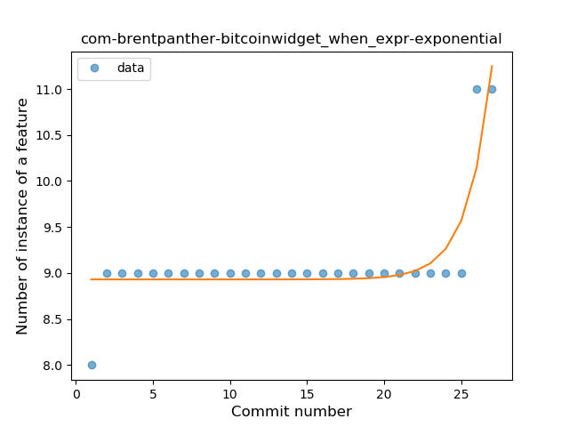

#### com-brentpanther-bitcoinwidget
* Feature: Function with Default Value
* Function: 
* R_Squared: 0.7522851
 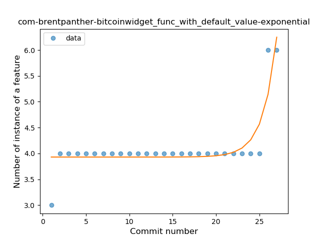

#### org-eurofurence-connavigator
* Feature: Companion Object
* Function: 
* R_Squared: 0.75090902
 

#### com-dozingcatsoftware-vectorcamera
* Feature: Range Expression
* Function: 
* R_Squared: 0.75043703
 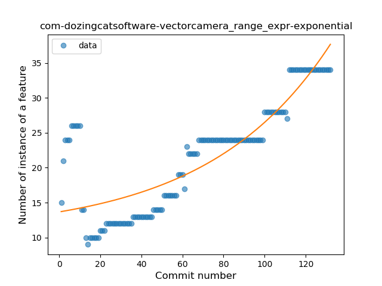

#### org-eurofurence-connavigator
* Feature: Data Class
* Function: 
* R_Squared: 0.747785
 

#### nl-mpcjanssen-simpletask
* Feature: Smart Cast
* Function: 
* R_Squared: 0.74311024
 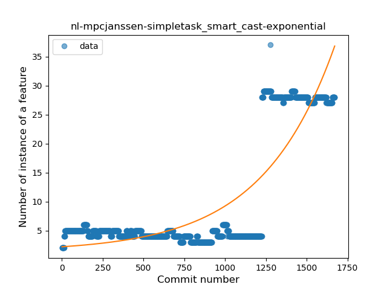

#### fr-jnda-android-flashalert
* Feature: Coroutine
* Function: 
* R_Squared: 0.74237768
 

#### link-standen-michael-phonesaver
* Feature: Smart Cast
* Function: 
* R_Squared: 0.74229638
 

#### com-thanksmister-iot-mqtt-alarmpanel
* Feature: String Template
* Function: 
* R_Squared: 0.74060096
 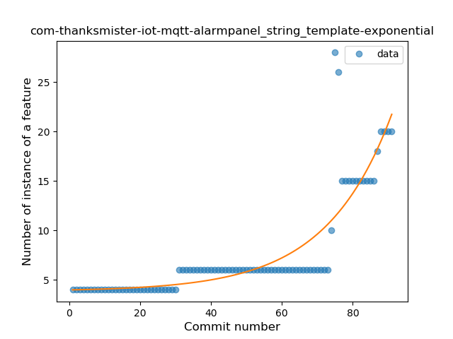

#### org-ligi-gobandroid
* Feature: Range Expression
* Function: 
* R_Squared: 0.73952475
 

#### com-commit451-gitlab
* Feature: Function with Default Value
* Function: 
* R_Squared: 0.73893797
 

#### com-log28
* Feature: Companion Object
* Function: 
* R_Squared: 0.73809137
 

#### com-uwetrottmann-wpdisplay
* Feature: Range Expression
* Function: 
* R_Squared: 0.73554987
 

#### nl-brouwerijdemolen-borefts2013
* Feature: String Template
* Function: 
* R_Squared: 0.7240033
 

#### it-diab
* Feature: Overloaded Operator
* Function: 
* R_Squared: 0.72291306
 

#### com-ofalvai-bpinfo
* Feature: Smart Cast
* Function: 
* R_Squared: 0.72260984
 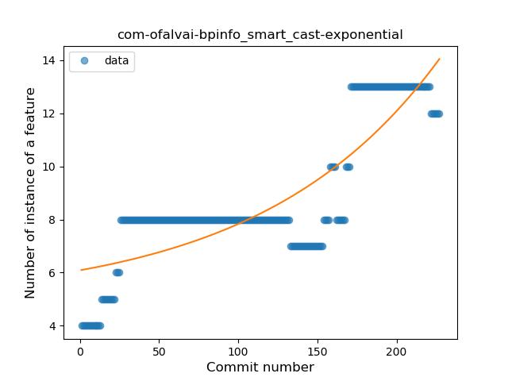

#### is-xyz-mpv
* Feature: Safe Call
* Function: 
* R_Squared: 0.72030775
 

#### com-wabadaba-dziennik
* Feature: Property Delegation
* Function: 
* R_Squared: 0.71812552
 

#### io-github-wulkanowy
* Feature: Singleton
* Function: 
* R_Squared: 0.71313341
 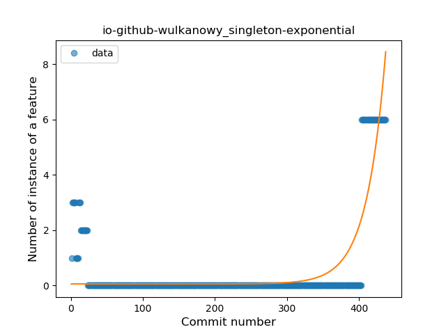

#### com-jereksel-libresubstratum
* Feature: Data Class
* Function: 
* R_Squared: 0.7094223
 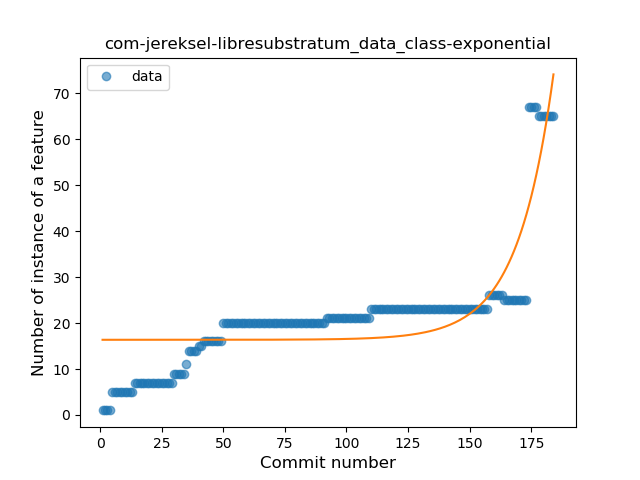

#### it-diab
* Feature: Safe Call
* Function: 
* R_Squared: 0.708516
 

#### pl-poznajapp
* Feature: Type Inference
* Function: 
* R_Squared: 0.70691325
 

#### com-eventyay-attendee
* Feature: Companion Object
* Function: 
* R_Squared: 0.70248957
 

#### org-emunix-insteadlauncher
* Feature: Singleton
* Function: 
* R_Squared: 0.6963262
 

#### pl-org-seva-navigator
* Feature: Property Delegation
* Function: 
* R_Squared: 0.69590788
 

#### com-slash-batterychargelimit
* Feature: String Template
* Function: 
* R_Squared: 0.69571538
 

#### com-bernaferrari-changedetection
* Feature: Property Delegation
* Function: 
* R_Squared: 0.69482421
 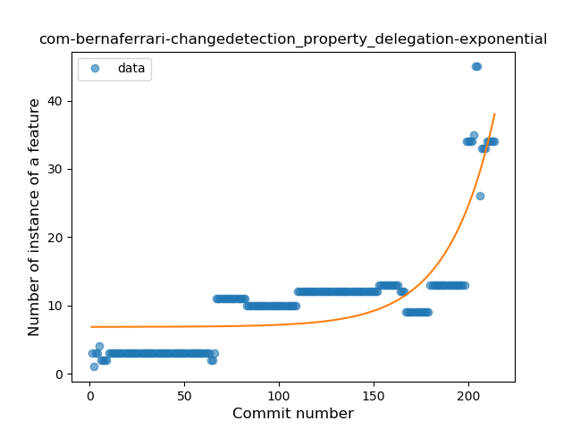

#### tech-ula
* Feature: Extension Function
* Function: 
* R_Squared: 0.69464685
 

#### net-stew-stew
* Feature: Safe Call
* Function: 
* R_Squared: 0.68184499
 

#### me-camsteffen-polite
* Feature: Singleton
* Function: 
* R_Squared: 0.68040032
 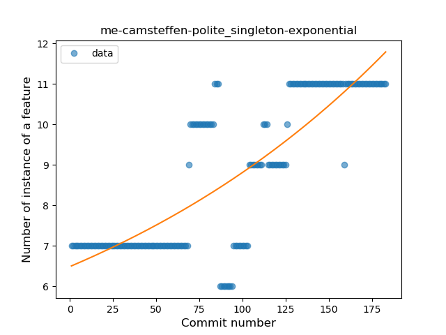

#### com-bernaferrari-changedetection
* Feature: Type Inference
* Function: 
* R_Squared: 0.67689138
 

#### com-eventyay-attendee
* Feature: Destructuring Declaration
* Function: 
* R_Squared: 0.67226294
 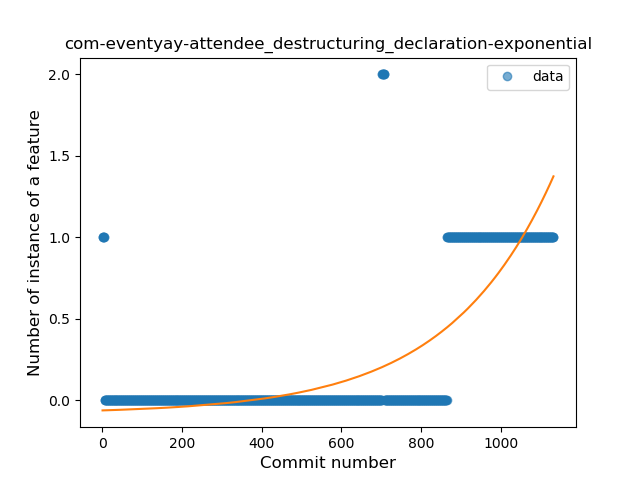

#### fr-chenry-android-freshrss
* Feature: Extension Function
* Function: 
* R_Squared: 0.67197823
 

#### rectangledbmi-com-pittsburghrealtimetracker
* Feature: Lambda
* Function: 
* R_Squared: 0.67092612
 

#### com-doctoror-particleswallpaper
* Feature: Extension Function
* Function: 
* R_Squared: 0.66968407
 

#### com-czbix-v2ex
* Feature: Destructuring Declaration
* Function: 
* R_Squared: 0.66777925
 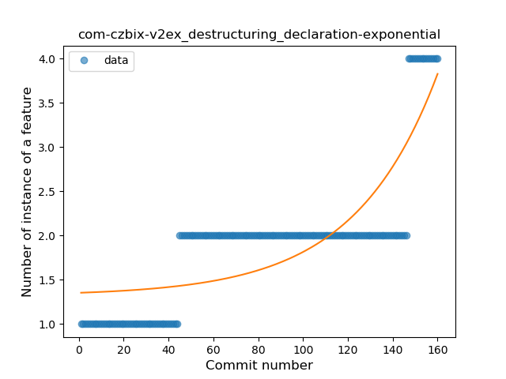

#### org-zimmob-zimlx
* Feature: Singleton
* Function: 
* R_Squared: 0.66762891
 

#### pw-janyo-janyoshare
* Feature: Smart Cast
* Function: 
* R_Squared: 0.66755666
 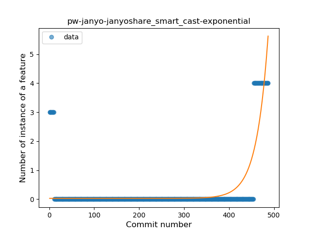

#### me-proxer-app
* Feature: Range Expression
* Function: 
* R_Squared: 0.66218251
 

#### com-tutpro-baresip
* Feature: Unsafe Call
* Function: 
* R_Squared: 0.66197245
 

#### com-github-fractals
* Feature: Function with Default Value
* Function: 
* R_Squared: 0.65646963
 

#### com-log28
* Feature: Function call with Named Argument
* Function: 
* R_Squared: 0.65029143
 

#### com-moez-QKSMS
* Feature: Unsafe Call
* Function: 
* R_Squared: 0.64981856
 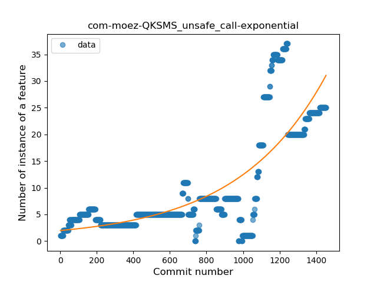

#### com-log28
* Feature: Data Class
* Function: 
* R_Squared: 0.64961849
 

#### com-github-vase4kin-teamcityapp
* Feature: Extension Function
* Function: 
* R_Squared: 0.64348463
 

#### com-slash-batterychargelimit
* Feature: Unsafe Call
* Function: 
* R_Squared: 0.64253228
 

#### org-ligi-gobandroid
* Feature: Extension Function
* Function: 
* R_Squared: 0.64159539
 

#### org-eurofurence-connavigator
* Feature: Super Delegation
* Function: 
* R_Squared: 0.64059964
 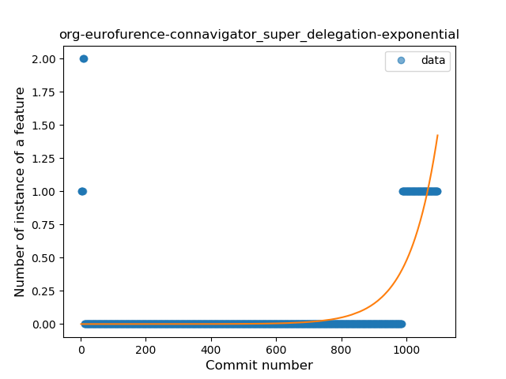

#### com-moez-QKSMS
* Feature: Sealed Class
* Function: 
* R_Squared: 0.6318707
 

#### de-ph1b-audiobook
* Feature: When expression
* Function: 
* R_Squared: 0.62651858
 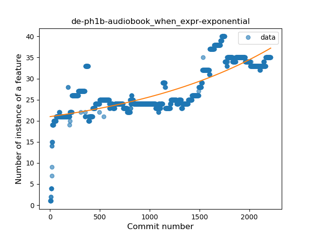

#### app-opass-ccip
* Feature: Property Delegation
* Function: 
* R_Squared: 0.61223851
 

#### net-stew-stew
* Feature: Function call with Named Argument
* Function: 
* R_Squared: 0.6095425
 

#### ffc-app
* Feature: Inline Function
* Function: 
* R_Squared: 0.60715268
 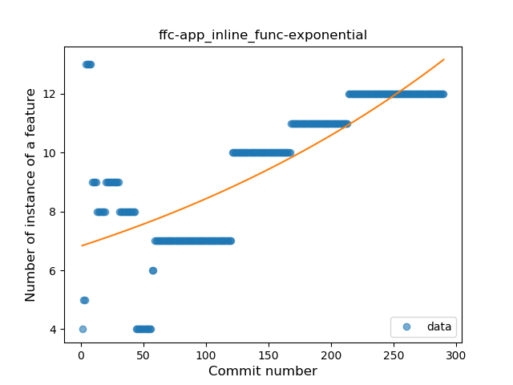

#### com-tasomaniac-openwith-floss
* Feature: Property Delegation
* Function: 
* R_Squared: 0.6031706
 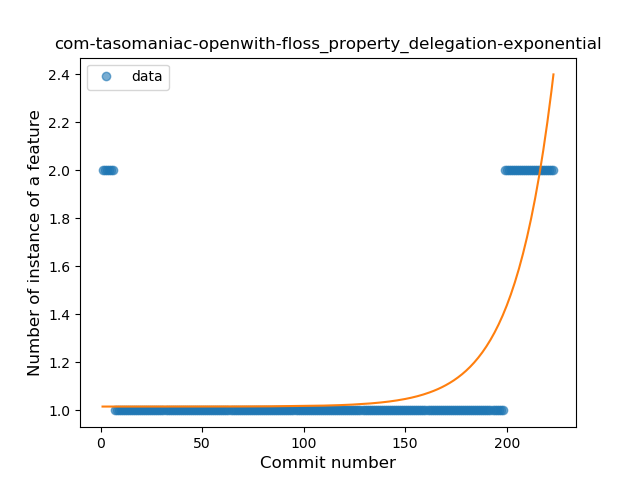

#### org-mifos-mobile
* Feature: Type Inference
* Function: 
* R_Squared: 0.60205645
 

#### me-murks-feedwatcher
* Feature: Smart Cast
* Function: 
* R_Squared: 0.59281172
 

#### me-anon-grow
* Feature: Function call with Named Argument
* Function: 
* R_Squared: 0.58687476
 

#### org-mattvchandler-a2050
* Feature: Safe Call
* Function: 
* R_Squared: 0.5858681
 

#### info-dvkr-screenstream
* Feature: When expression
* Function: 
* R_Squared: 0.58220462
 

#### cat-pantsu-nyaapantsu
* Feature: Smart Cast
* Function: 
* R_Squared: 0.57559626
 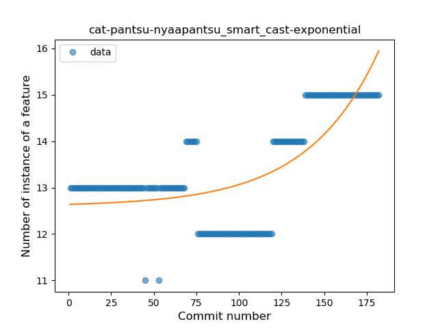

#### org-emunix-insteadlauncher
* Feature: Function call with Named Argument
* Function: 
* R_Squared: 0.56155777
 

#### pl-org-seva-texter
* Feature: Function with Default Value
* Function: 
* R_Squared: 0.55816213
 

#### com-github-premnirmal-tickerwidget
* Feature: Unsafe Call
* Function: 
* R_Squared: 0.55565862
 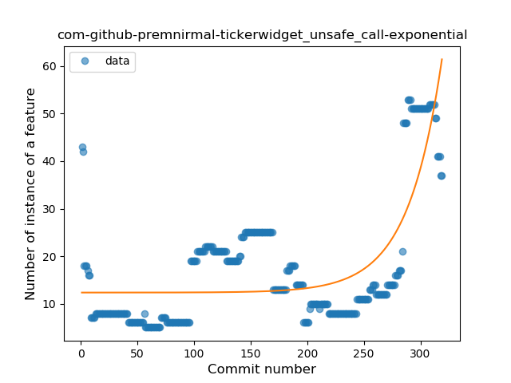

#### nightlock-peppercarrot
* Feature: Unsafe Call
* Function: 
* R_Squared: 0.55474131
 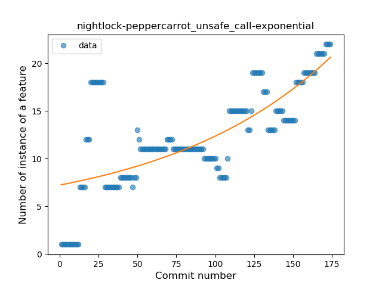

#### com-simplemobiletools-gallery-pro
* Feature: Singleton
* Function: 
* R_Squared: 0.55093856
 

#### rectangledbmi-com-pittsburghrealtimetracker
* Feature: Type Inference
* Function: 
* R_Squared: 0.55028338
 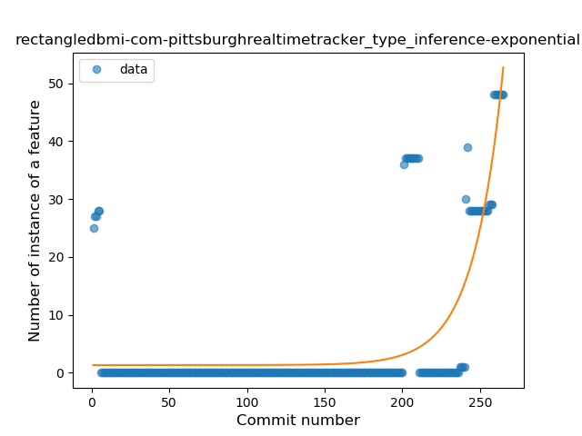

#### com-ofalvai-bpinfo
* Feature: Extension Function
* Function: 
* R_Squared: 0.53584968
 

#### me-camsteffen-polite
* Feature: Function with Default Value
* Function: 
* R_Squared: 0.53164772
 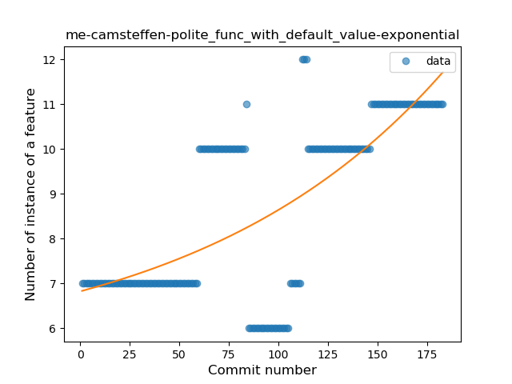

#### org-blokada-alarm
* Feature: Sealed Class
* Function: 
* R_Squared: 0.5301215
 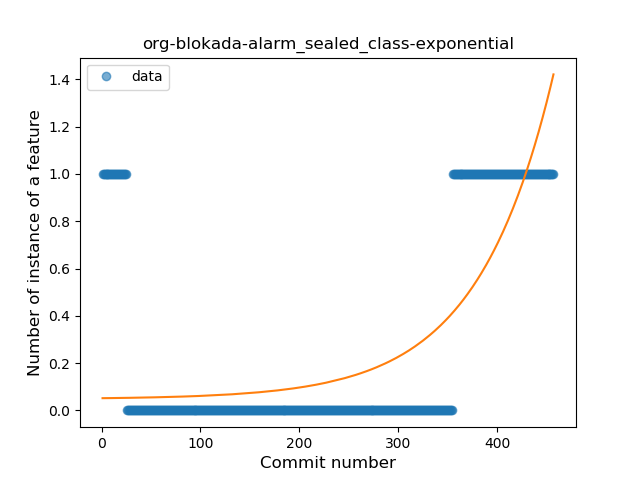

#### net-frju-flym
* Feature: Type Inference
* Function: 
* R_Squared: 0.52664139
 

#### me-echeung-moemoekyun-fdroid
* Feature: Smart Cast
* Function: 
* R_Squared: 0.52350737
 

#### com-slash-batterychargelimit
* Feature: When expression
* Function: 
* R_Squared: 0.52269185
 

#### pt-ipleiria-mymusicqoe
* Feature: Type Alias
* Function: 
* R_Squared: 0.52105579
 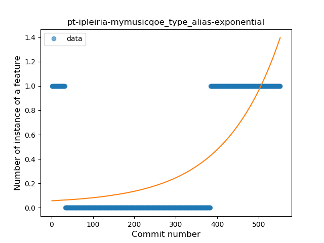

#### com-wabadaba-dziennik
* Feature: Companion Object
* Function: 
* R_Squared: 0.51573573
 

#### org-zimmob-zimlx
* Feature: Unsafe Call
* Function: 
* R_Squared: 0.51509433
 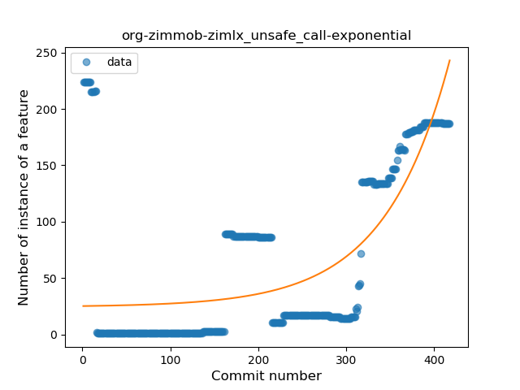

#### se-barsk-park
* Feature: Property Delegation
* Function: 
* R_Squared: 0.50796041
 

#### com-calintat-units
* Feature: Companion Object
* Function: 
* R_Squared: 0.50284551
 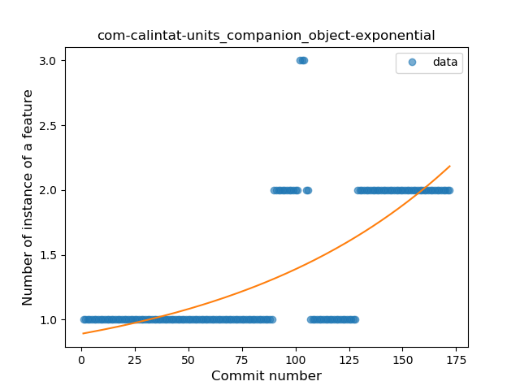

#### org-moire-ultrasonic
* Feature: Type Alias
* Function: 
* R_Squared: 0.5025968
 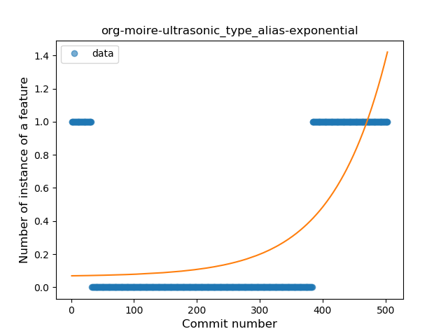

#### rectangledbmi-com-pittsburghrealtimetracker
* Feature: When expression
* Function: 
* R_Squared: 0.50248137
 

#### com-corphish-nightlight-generic
* Feature: Singleton
* Function: 
* R_Squared: 0.49505892
 

#### jp-cordea-mackerelclient
* Feature: Companion Object
* Function: 
* R_Squared: 0.49310667
 

#### is-xyz-omw
* Feature: Singleton
* Function: 
* R_Squared: 0.49305603
 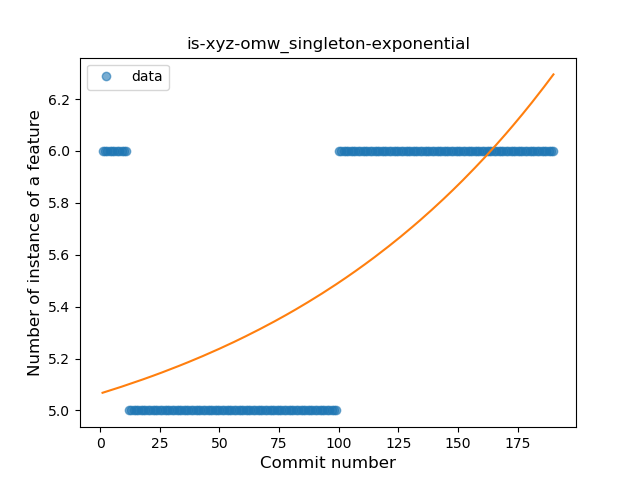

#### com-moez-QKSMS
* Feature: Range Expression
* Function: 
* R_Squared: 0.48284668
 

#### ryey-easer-beta
* Feature: Smart Cast
* Function: 
* R_Squared: 0.47551257
 

#### fr-chenry-android-freshrss
* Feature: Singleton
* Function: 
* R_Squared: 0.47032261
 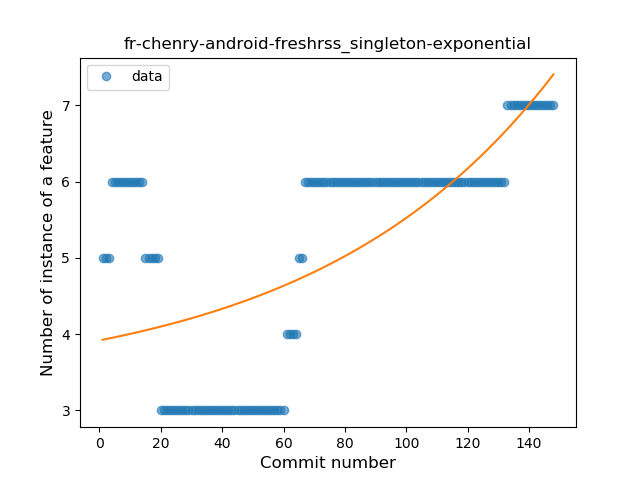

#### info-dvkr-screenstream
* Feature: Sealed Class
* Function: 
* R_Squared: 0.46398996
 

#### jp-toastkid-yobidashi
* Feature: Data Class
* Function: 
* R_Squared: 0.45570028
 

#### com-bernaferrari-changedetection
* Feature: Data Class
* Function: 
* R_Squared: 0.45481769
 

#### com-pyamsoft-homebutton
* Feature: When expression
* Function: 
* R_Squared: 0.44246278
 

#### net-nurik-roman-muzei
* Feature: Unsafe Call
* Function: 
* R_Squared: 0.44069591
 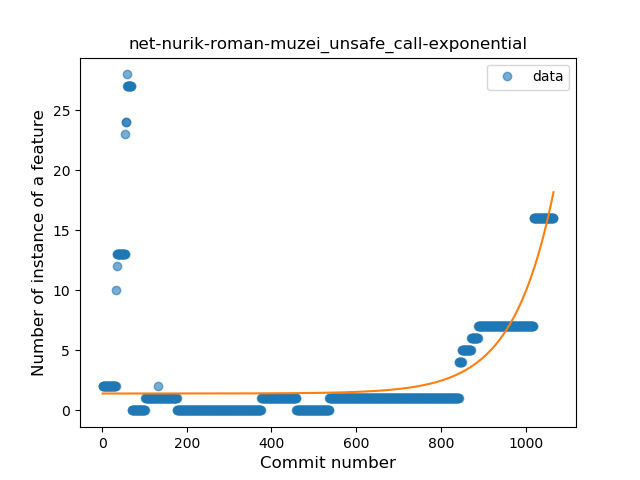

#### com-github-moko256-twitlatte
* Feature: Singleton
* Function: 
* R_Squared: 0.43810448
 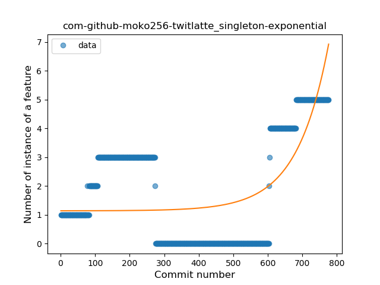

#### fr-jnda-android-flashalert
* Feature: Companion Object
* Function: 
* R_Squared: 0.42427339
 

#### org-mattvchandler-progressbars
* Feature: Range Expression
* Function: 
* R_Squared: 0.40438117
 

#### pl-hypeapp-episodie
* Feature: Property Delegation
* Function: 
* R_Squared: 0.398182
 

#### me-camsteffen-polite
* Feature: Type Inference
* Function: 
* R_Squared: 0.37869323
 

#### com-calintat-units
* Feature: Unsafe Call
* Function: 
* R_Squared: 0.3723295
 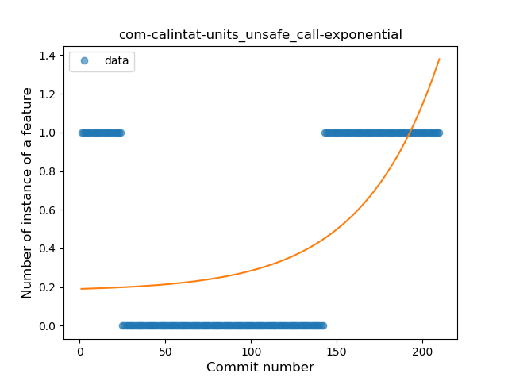

#### com-calintat-sensors
* Feature: Singleton
* Function: 
* R_Squared: 0.36813113
 

#### org-blokada-alarm
* Feature: Smart Cast
* Function: 
* R_Squared: 0.36149058
 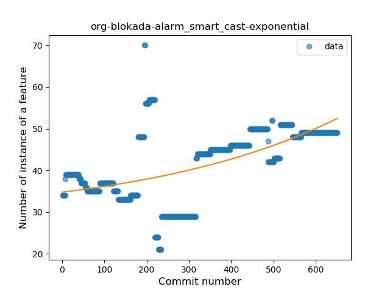

#### io-trewartha-positional
* Feature: Data Class
* Function: 
* R_Squared: 0.35556673
 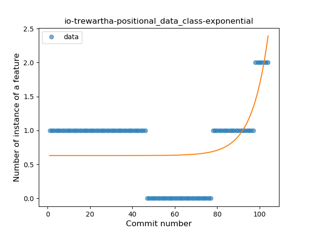

#### org-walleth
* Feature: Singleton
* Function: 
* R_Squared: 0.35447112
 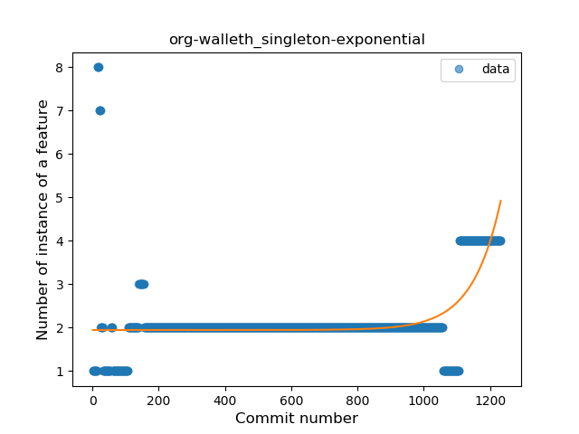

#### com-github-moko256-twitlatte
* Feature: Inline Function
* Function: 
* R_Squared: 0.34706198
 

#### com-directdev-portal
* Feature: Function call with Named Argument
* Function: 
* R_Squared: 0.34594309
 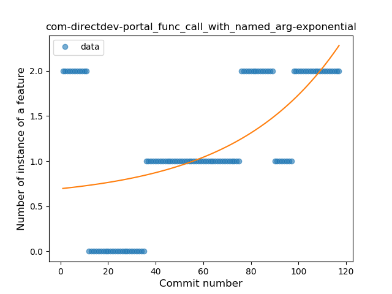

#### io-trewartha-positional
* Feature: Unsafe Call
* Function: 
* R_Squared: 0.34225866
 

#### com-jereksel-libresubstratum
* Feature: Range Expression
* Function: 
* R_Squared: 0.33114966
 

#### org-liberty-android-freeotpplus
* Feature: Range Expression
* Function: 
* R_Squared: 0.32065046
 

#### com-simplemobiletools-flashlight
* Feature: Unsafe Call
* Function: 
* R_Squared: 0.31795768
 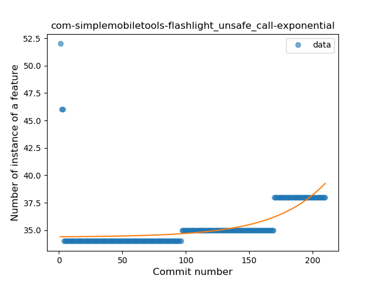

#### com-moez-QKSMS
* Feature: Extension Function
* Function: 
* R_Squared: 0.31557561
 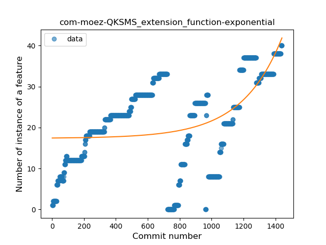

#### pw-janyo-whatanime
* Feature: Function with Default Value
* Function: 
* R_Squared: 0.31491155
 

#### app-simone
* Feature: Unsafe Call
* Function: 
* R_Squared: 0.31349718
 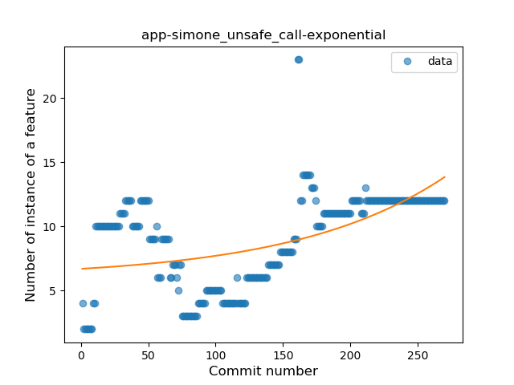

#### com-bernaferrari-changedetection
* Feature: Destructuring Declaration
* Function: 
* R_Squared: 0.30922004
 

#### jp-toastkid-yobidashi
* Feature: Range Expression
* Function: 
* R_Squared: 0.30712712
 

#### org-mattvchandler-progressbars
* Feature: Data Class
* Function: 
* R_Squared: 0.30234724
 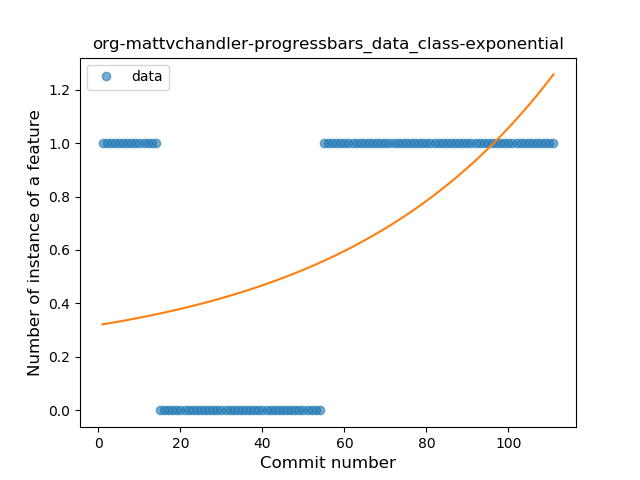

#### com-zacharee1-systemuituner
* Feature: Unsafe Call
* Function: 
* R_Squared: 0.28899511
 

#### com-njlabs-showjava
* Feature: Property Delegation
* Function: 
* R_Squared: 0.27193444
 

#### com-ids1024-whitakerswords
* Feature: Lambda
* Function: 
* R_Squared: 0.25834189
 

#### me-blog-korn123-easydiary
* Feature: Function call with Named Argument
* Function: 
* R_Squared: 0.24399982
 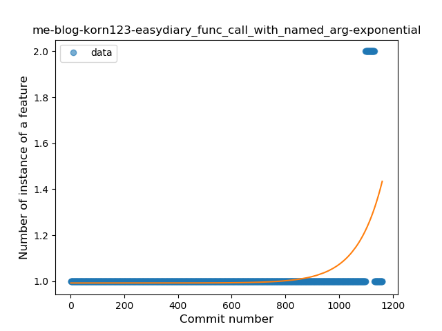

#### me-blog-korn123-easydiary
* Feature: Smart Cast
* Function: 
* R_Squared: 0.22782676
 

#### superustats-tool-android
* Feature: Unsafe Call
* Function: 
* R_Squared: 0.22562946
 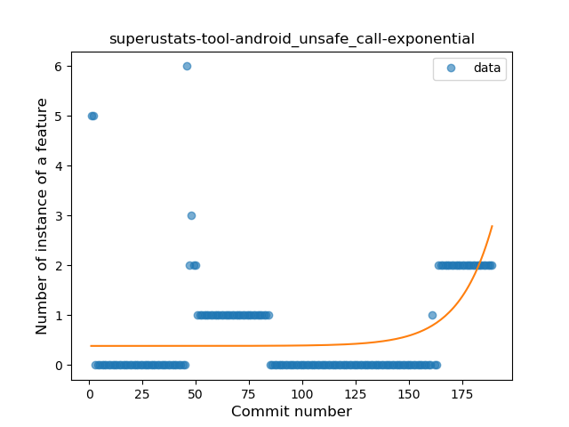

#### me-proxer-app
* Feature: Overloaded Operator
* Function: 
* R_Squared: 0.22055571
 

#### apps-amine-bou-readerforselfoss
* Feature: Unsafe Call
* Function: 
* R_Squared: 0.2167185
 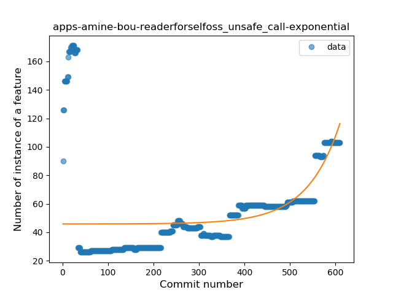

#### com-simplemobiletools-camera
* Feature: String Template
* Function: 
* R_Squared: 0.2117743
 

#### ai-susi
* Feature: Companion Object
* Function: 
* R_Squared: 0.18591314
 

#### rectangledbmi-com-pittsburghrealtimetracker
* Feature: String Template
* Function: 
* R_Squared: 0.1856736
 

#### org-anibyl-slounik
* Feature: Safe Call
* Function: 
* R_Squared: 0.1829035
 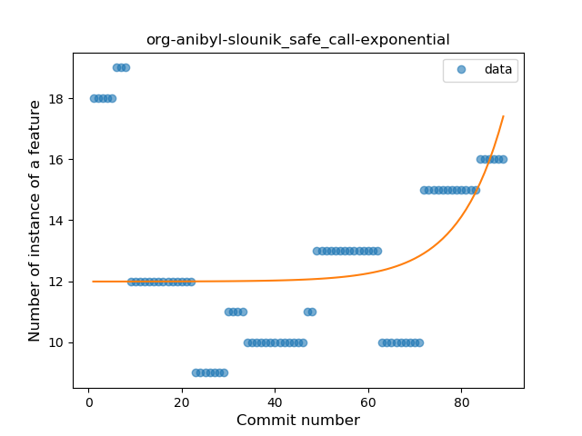

#### org-equeim-tremotesf
* Feature: When expression
* Function: 
* R_Squared: 0.17606064
 

#### com-sduduzog-slimlauncher
* Feature: Range Expression
* Function: 
* R_Squared: 0.16960509
 

#### org-equeim-tremotesf
* Feature: Destructuring Declaration
* Function: 
* R_Squared: 0.16154666
 

#### io-github-feelfreelinux-wykopmobilny
* Feature: Type Alias
* Function: 
* R_Squared: 0.1504022
 

#### com-loloof64-android-basicchessendgamestrainer
* Feature: Property Delegation
* Function: 
* R_Squared: 0.1447141
 

#### com-adityakamble49-dcipher
* Feature: Singleton
* Function: 
* R_Squared: 0.13191398
 

#### superustats-tool-android
* Feature: Destructuring Declaration
* Function: 
* R_Squared: 0.1307606
 

#### com-jereksel-libresubstratum
* Feature: Overloaded Operator
* Function: 
* R_Squared: 0.12151267
 

#### net-mm2d-android-vmb
* Feature: Data Class
* Function: 
* R_Squared: 0.11478862
 

#### de-ph1b-audiobook
* Feature: Unsafe Call
* Function: 
* R_Squared: 0.11266188
 

#### de-avpptr-umweltzone
* Feature: Safe Call
* Function: 
* R_Squared: 0.11133041
 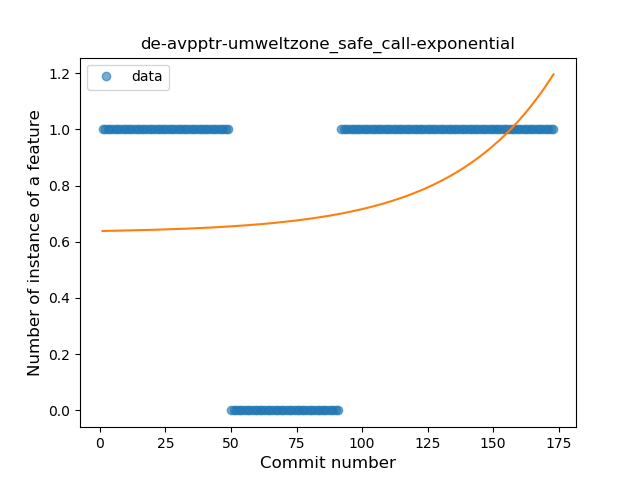

#### com-corphish-nightlight-generic
* Feature: Safe Call
* Function: 
* R_Squared: 0.10781357
 

#### io-github-fvasco-pinpoi
* Feature: Singleton
* Function: 
* R_Squared: 0.10559099
 

#### jp-cordea-mackerelclient
* Feature: Unsafe Call
* Function: 
* R_Squared: 0.10475696
 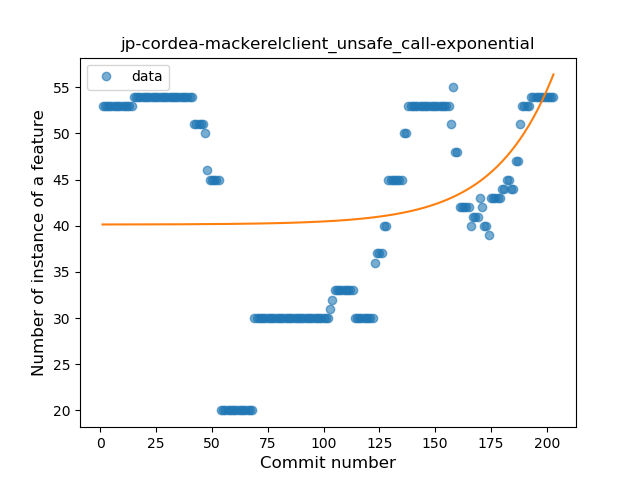

#### de-ph1b-audiobook
* Feature: Property Delegation
* Function: 
* R_Squared: 0.10403579
 

#### de-ph1b-audiobook
* Feature: Range Expression
* Function: 
* R_Squared: 0.09235504
 

#### org-fossasia-badgemagic
* Feature: Property Delegation
* Function: 
* R_Squared: 0.0865725
 

#### net-frju-flym
* Feature: Unsafe Call
* Function: 
* R_Squared: 0.07188545
 

#### com-simplemobiletools-filemanager-pro
* Feature: Extension Function
* Function: 
* R_Squared: 0.05883669
 

#### org-anibyl-slounik
* Feature: Type Inference
* Function: 
* R_Squared: 0.05821154
 

#### com-simplemobiletools-draw
* Feature: Unsafe Call
* Function: 
* R_Squared: 0.05820269
 

#### com-simplemobiletools-draw-pro
* Feature: Unsafe Call
* Function: 
* R_Squared: 0.05820269
 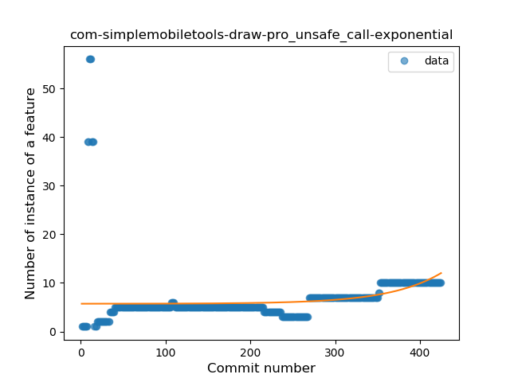

#### fr-cph-chicago-foss
* Feature: Unsafe Call
* Function: 
* R_Squared: 0.0390628
 

#### io-ipoli-android
* Feature: Type Alias
* Function: 
* R_Squared: 0.02247772
 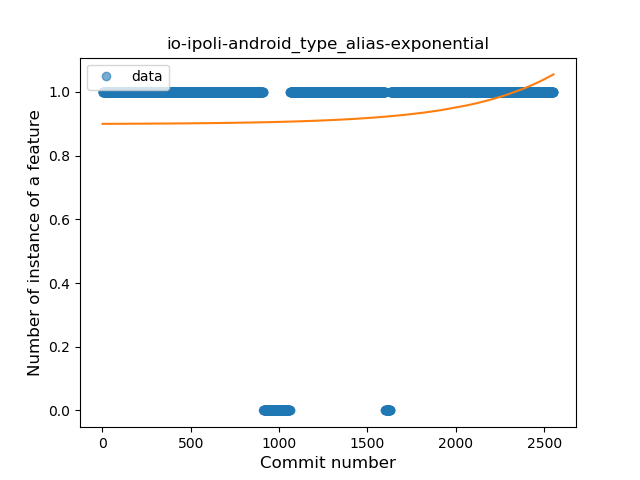

