## Sudden Decline
----
**76** best fit

#### maks-MGit
* Feature: Safe Call
* Function: 
* R_Squared: 1.0
 

#### mkg20001-aruba-networks-login
* Feature: Safe Call
* Function: 
* R_Squared: 1.0
 

#### zeapo-Android-Password-Store
* Feature: Unsafe Call
* Function: 
* R_Squared: 1.0
 

#### SimpleMobileTools-Simple-Calculator
* Feature: String Template
* Function: 
* R_Squared: 1.0
 

#### SimpleMobileTools-Simple-Flashlight
* Feature: String Template
* Function: 
* R_Squared: 1.0
 

#### sandy-8925-Checklist
* Feature: String Template
* Function: 
* R_Squared: 1.0
 

#### ronocod-bus
* Feature: Function with Default Value
* Function: 
* R_Squared: 1.0
 

#### exviva-stew
* Feature: Singleton
* Function: 
* R_Squared: 1.0
 

#### sreich-android-count-the-days
* Feature: Smart Cast
* Function: 
* R_Squared: 1.0
 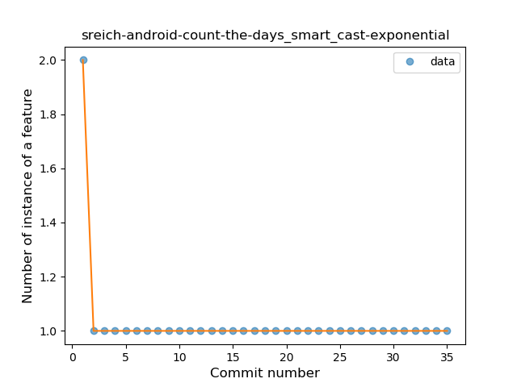

#### milosmns-Timecrypt
* Feature: Function call with Named Argument
* Function: 
* R_Squared: 1.0
 

#### plusCubed-velociraptor
* Feature: Function call with Named Argument
* Function: 
* R_Squared: 1.0
 

#### BenAlderfer-hand-and-foot-scores
* Feature: Data Class
* Function: 
* R_Squared: 1.0
 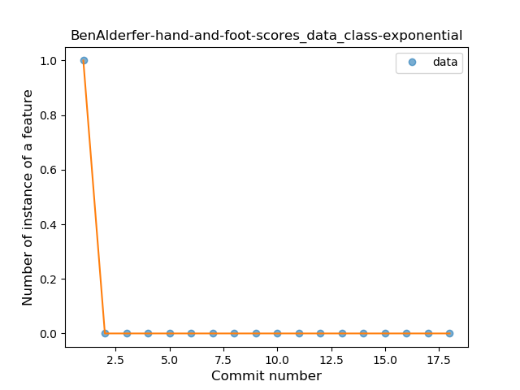

#### FengMoeTeam-NHentai-android
* Feature: Destructuring Declaration
* Function: 
* R_Squared: 1.0
 

#### helloworld1-FreeOTPPlus
* Feature: Overloaded Operator
* Function: 
* R_Squared: 1.0
 

#### wuan-bo-android
* Feature: Unsafe Call
* Function: 
* R_Squared: 0.96751081
 

#### danvratil-FBEventSync
* Feature: Unsafe Call
* Function: 
* R_Squared: 0.96714673
 

#### SimpleMobileTools-Simple-Flashlight
* Feature: Companion Object
* Function: 
* R_Squared: 0.94158648
 

#### corphish-NightLight
* Feature: Unsafe Call
* Function: 
* R_Squared: 0.90387513
 

#### TwidereProject-Twidere-Android
* Feature: Unsafe Call
* Function: 
* R_Squared: 0.89664296
 

#### SpiritCroc-DarkCroc-Android-theme
* Feature: Unsafe Call
* Function: 
* R_Squared: 0.88694152
 

#### pyamsoft-home-button
* Feature: Unsafe Call
* Function: 
* R_Squared: 0.85818073
 

#### SimpleMobileTools-Simple-Flashlight
* Feature: Unsafe Call
* Function: 
* R_Squared: 0.85642325
 

#### calintat-sensors
* Feature: Function with Default Value
* Function: 
* R_Squared: 0.84943046
 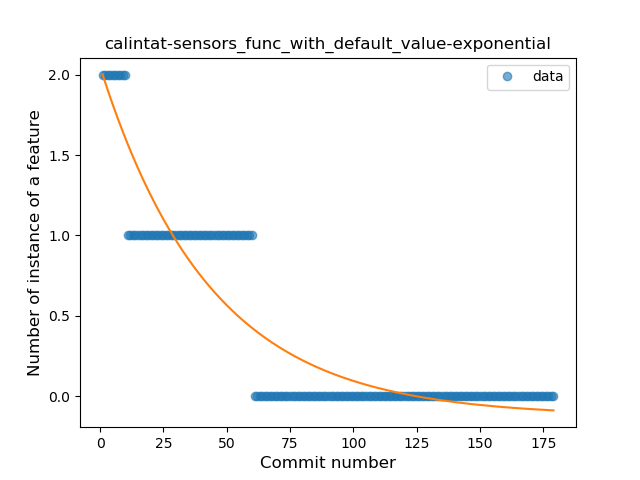

#### Mystery00-JanYoShare
* Feature: String Template
* Function: 
* R_Squared: 0.84283555
 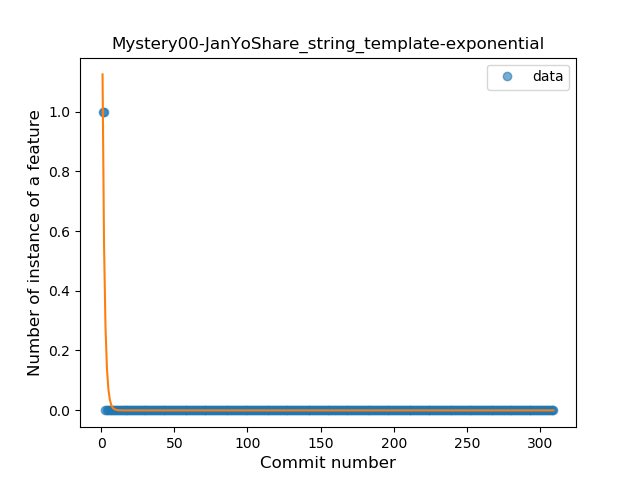

#### carlphilipp-chicago-commutes
* Feature: Extension Function
* Function: 
* R_Squared: 0.84057493
 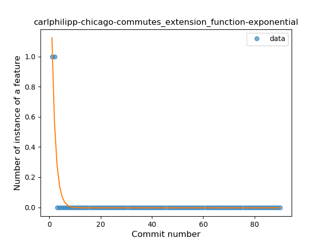

#### thermatk-FastHub-Libre
* Feature: Extension Function
* Function: 
* R_Squared: 0.8357338
 

#### danirod-rectball
* Feature: Inline Function
* Function: 
* R_Squared: 0.832346
 

#### mastizada-focus-android
* Feature: Destructuring Declaration
* Function: 
* R_Squared: 0.82544293
 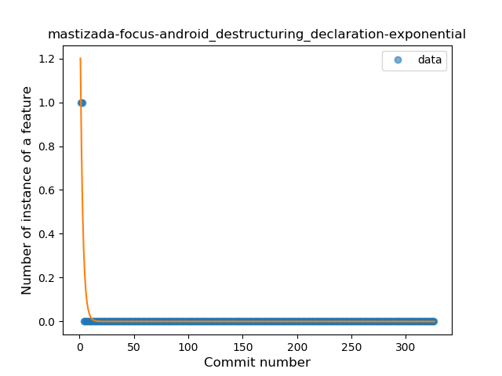

#### thaapasa-jalkametri-android
* Feature: Range Expression
* Function: 
* R_Squared: 0.82239643
 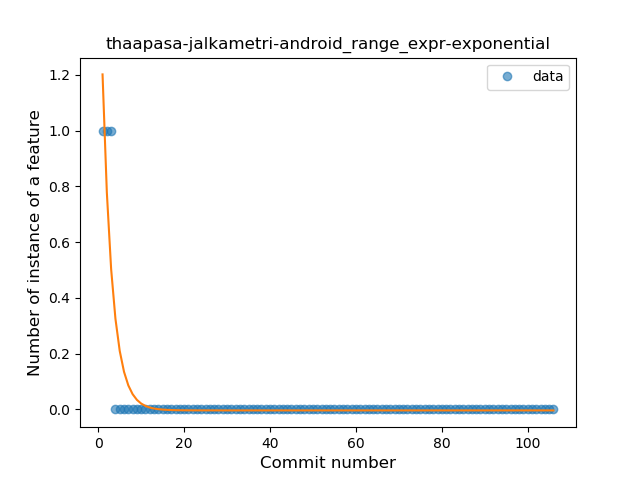

#### alessio-b-zak-myRivers
* Feature: Smart Cast
* Function: 
* R_Squared: 0.82057835
 

#### dimagi-commcare-android
* Feature: Unsafe Call
* Function: 
* R_Squared: 0.8196959
 

#### LittleLightCz-SheepsGoHome
* Feature: Destructuring Declaration
* Function: 
* R_Squared: 0.81824738
 

#### danvratil-FBEventSync
* Feature: Inline Function
* Function: 
* R_Squared: 0.81824738
 

#### ianmcxa-vortaro
* Feature: Range Expression
* Function: 
* R_Squared: 0.81140237
 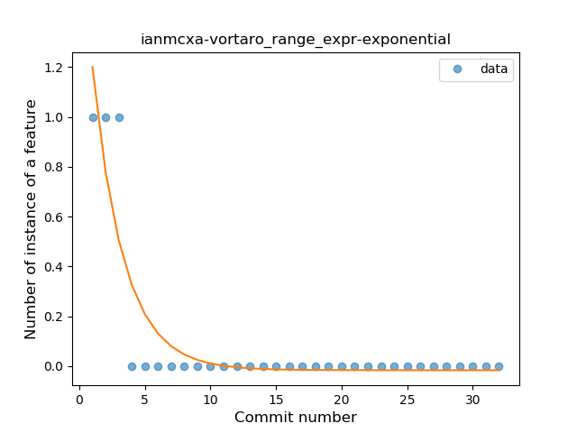

#### SimpleMobileTools-Simple-Calculator
* Feature: Unsafe Call
* Function: 
* R_Squared: 0.80741913
 

#### fvasco-pinpoi
* Feature: Companion Object
* Function: 
* R_Squared: 0.79311697
 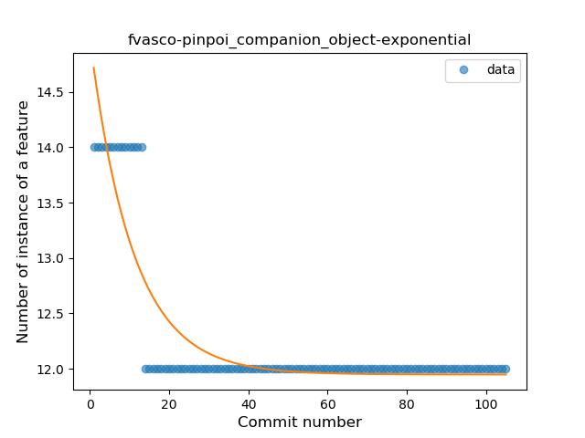

#### ligi-FAST
* Feature: Lambda
* Function: 
* R_Squared: 0.76566091
 

#### ligi-FAST
* Feature: Property Delegation
* Function: 
* R_Squared: 0.76566091
 

#### OpenLauncherTeam-openlauncher
* Feature: Data Class
* Function: 
* R_Squared: 0.75724467
 

#### calintat-sensors
* Feature: Type Inference
* Function: 
* R_Squared: 0.7441424
 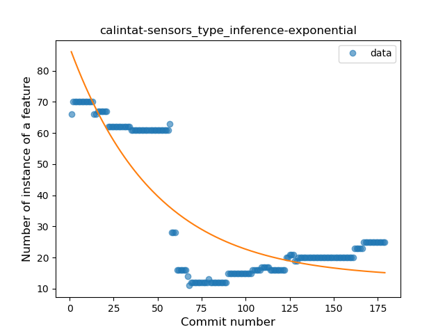

#### nibarius-opera-park-android
* Feature: Data Class
* Function: 
* R_Squared: 0.71569928
 

#### OpenLauncherTeam-openlauncher
* Feature: Extension Function
* Function: 
* R_Squared: 0.71079517
 

#### teamblueridge-PasteIt
* Feature: Unsafe Call
* Function: 
* R_Squared: 0.71072133
 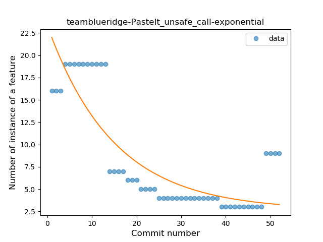

#### OpenLauncherTeam-openlauncher
* Feature: Range Expression
* Function: 
* R_Squared: 0.7025778
 

#### calintat-sensors
* Feature: Property Delegation
* Function: 
* R_Squared: 0.7020882
 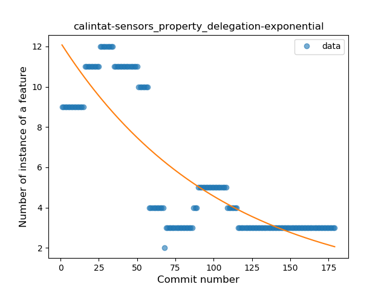

#### ids1024-lsdict-android
* Feature: Lambda
* Function: 
* R_Squared: 0.68682805
 

#### calintat-sensors
* Feature: Data Class
* Function: 
* R_Squared: 0.63689599
 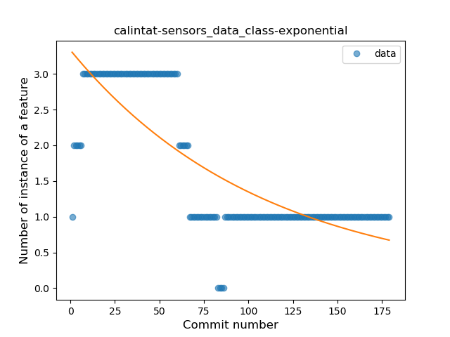

#### OpenLauncherTeam-openlauncher
* Feature: Lambda
* Function: 
* R_Squared: 0.63434806
 

#### kirimin-mitsumine
* Feature: Extension Function
* Function: 
* R_Squared: 0.59928498
 

#### eurofurence-ef-app_android
* Feature: Super Delegation
* Function: 
* R_Squared: 0.59776251
 

#### proxer-ProxerAndroid
* Feature: Unsafe Call
* Function: 
* R_Squared: 0.59400013
 

#### calintat-sensors
* Feature: When expression
* Function: 
* R_Squared: 0.57036919
 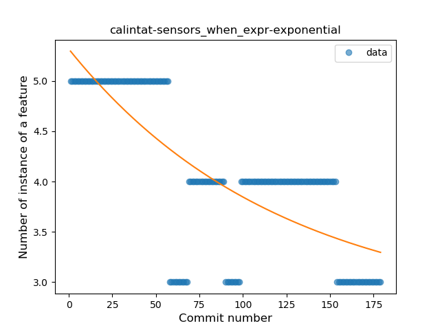

#### charlesmadere-smash-ranks-android
* Feature: Unsafe Call
* Function: 
* R_Squared: 0.56990942
 

#### OpenLauncherTeam-openlauncher
* Feature: Safe Call
* Function: 
* R_Squared: 0.56872913
 

#### raatmarien-red-moon
* Feature: Unsafe Call
* Function: 
* R_Squared: 0.56443305
 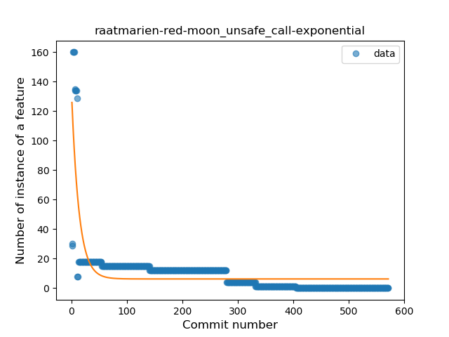

#### alessio-b-zak-myRivers
* Feature: Extension Function
* Function: 
* R_Squared: 0.52764407
 

#### FredJul-Flym
* Feature: Unsafe Call
* Function: 
* R_Squared: 0.52527548
 

#### rectangle-dbmi-Realtime-Port-Authority
* Feature: Safe Call
* Function: 
* R_Squared: 0.48665796
 

#### proxer-ProxerAndroid
* Feature: Overloaded Operator
* Function: 
* R_Squared: 0.35733178
 

#### Valodim-Stratum0Widget
* Feature: Unsafe Call
* Function: 
* R_Squared: 0.32517282
 

#### syrop-Wiktor-Navigator
* Feature: Unsafe Call
* Function: 
* R_Squared: 0.32047451
 

#### juha-h-baresip-studio
* Feature: Unsafe Call
* Function: 
* R_Squared: 0.31120237
 

#### syrop-Wiktor-Navigator
* Feature: Property Delegation
* Function: 
* R_Squared: 0.31076807
 

#### SimpleMobileTools-Simple-Gallery
* Feature: Companion Object
* Function: 
* R_Squared: 0.27195141
 

#### romannurik-muzei
* Feature: Unsafe Call
* Function: 
* R_Squared: 0.22398619
 

#### TeMoMuKo-AutoStopRace
* Feature: Safe Call
* Function: 
* R_Squared: 0.20505147
 

#### nonylene-PhotoLinkViewer
* Feature: Function with Default Value
* Function: 
* R_Squared: 0.19322671
 

#### SimpleMobileTools-Simple-File-Manager
* Feature: Extension Function
* Function: 
* R_Squared: 0.18140411
 

#### blastrock-kaqui
* Feature: Unsafe Call
* Function: 
* R_Squared: 0.15130956
 

#### SimpleMobileTools-Simple-Calculator
* Feature: Companion Object
* Function: 
* R_Squared: 0.134415
 

#### SimpleMobileTools-Simple-Draw
* Feature: Unsafe Call
* Function: 
* R_Squared: 0.13437197
 

#### sjnyag-stamp
* Feature: Function call with Named Argument
* Function: 
* R_Squared: 0.13029862
 

#### corphish-NightLight
* Feature: Safe Call
* Function: 
* R_Squared: 0.12918581
 

#### PaulWoitaschek-Voice
* Feature: Unsafe Call
* Function: 
* R_Squared: 0.10313943
 

#### Depau-EtchDroid
* Feature: Safe Call
* Function: 
* R_Squared: 0.0354552
 

#### moko256-twitlatte
* Feature: Safe Call
* Function: 
* R_Squared: 0.02294675
 

