## Sudden Decline
----
**112** best fit

#### io-mkg20001-arubanetworkslogin
* Feature: Safe Call
* Function: 
* R_Squared: 1.0
 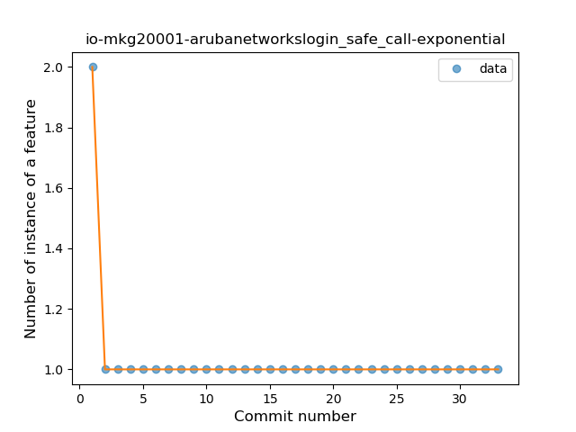

#### fr-jnda-android-ipcalc
* Feature: Companion Object
* Function: 
* R_Squared: 1.0
 

#### com-simplemobiletools-calculator
* Feature: String Template
* Function: 
* R_Squared: 1.0
 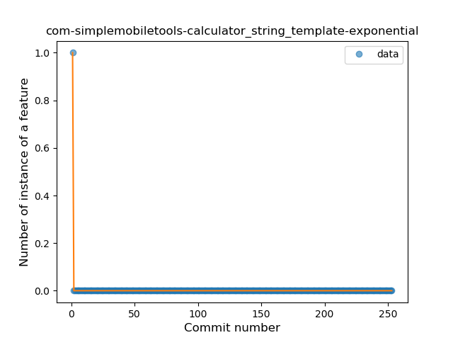

#### com-simplemobiletools-flashlight
* Feature: String Template
* Function: 
* R_Squared: 1.0
 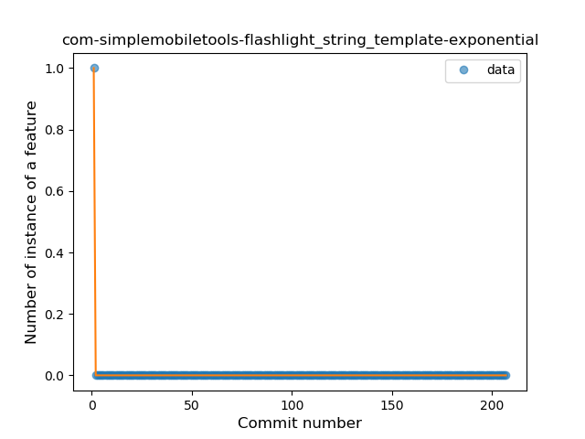

#### com-conorodonnell-bus
* Feature: Function with Default Value
* Function: 
* R_Squared: 1.0
 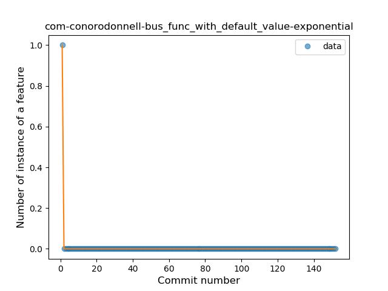

#### io-github-benoitduffez-cupsprint
* Feature: Singleton
* Function: 
* R_Squared: 1.0
 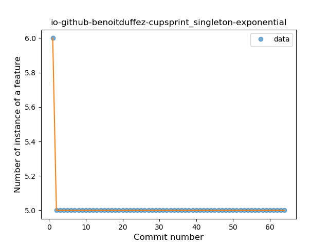

#### net-stew-stew
* Feature: Singleton
* Function: 
* R_Squared: 1.0
 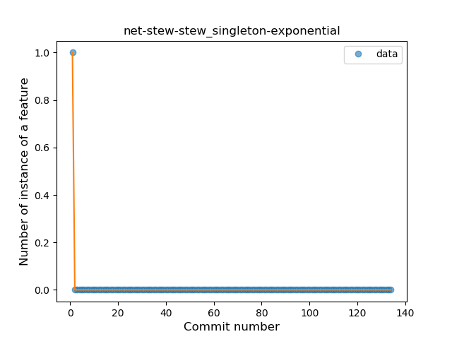

#### sreich-countthedays
* Feature: Smart Cast
* Function: 
* R_Squared: 1.0
 

#### com-alderferstudios-handandfootscores
* Feature: Data Class
* Function: 
* R_Squared: 1.0
 

#### co-timecrypt-android
* Feature: Function call with Named Argument
* Function: 
* R_Squared: 1.0
 

#### com-njlabs-showjava
* Feature: Function call with Named Argument
* Function: 
* R_Squared: 1.0
 

#### danbroid-searchview
* Feature: Extension Function
* Function: 
* R_Squared: 1.0
 

#### uk-colessoft-android-hilllist
* Feature: Property Delegation
* Function: 
* R_Squared: 1.0
 

#### moe-feng-nhentai
* Feature: Destructuring Declaration
* Function: 
* R_Squared: 1.0
 

#### com-skydoves-waterdays
* Feature: Unsafe Call
* Function: 
* R_Squared: 0.98507646
 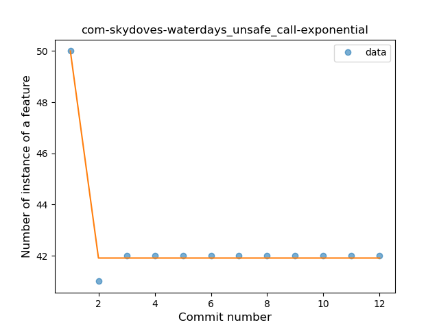

#### com-bracketcove-postrainer
* Feature: Unsafe Call
* Function: 
* R_Squared: 0.98320041
 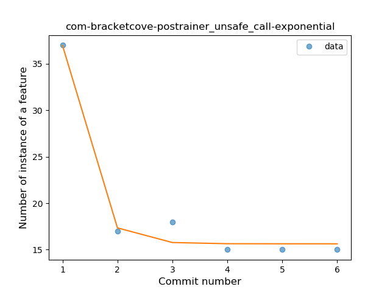

#### com-phicdy-totoanticipation
* Feature: Unsafe Call
* Function: 
* R_Squared: 0.98307734
 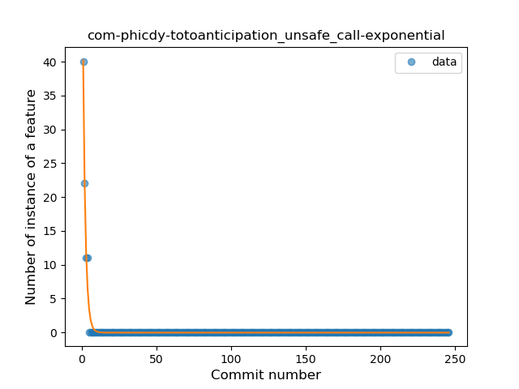

#### jp-toastkid-yobidashi
* Feature: Unsafe Call
* Function: 
* R_Squared: 0.94615514
 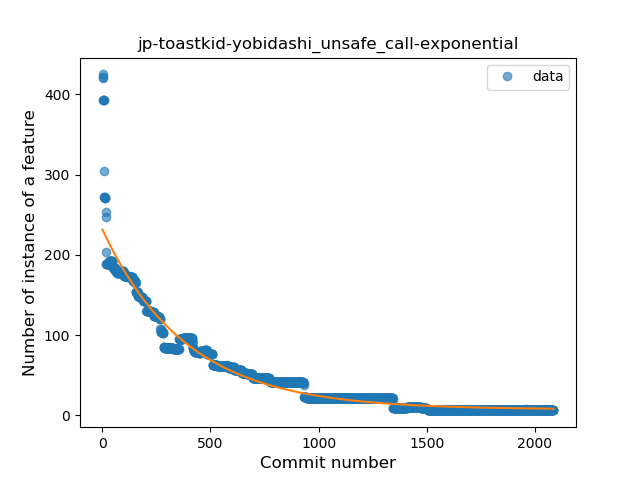

#### com-simplemobiletools-flashlight
* Feature: Companion Object
* Function: 
* R_Squared: 0.94199144
 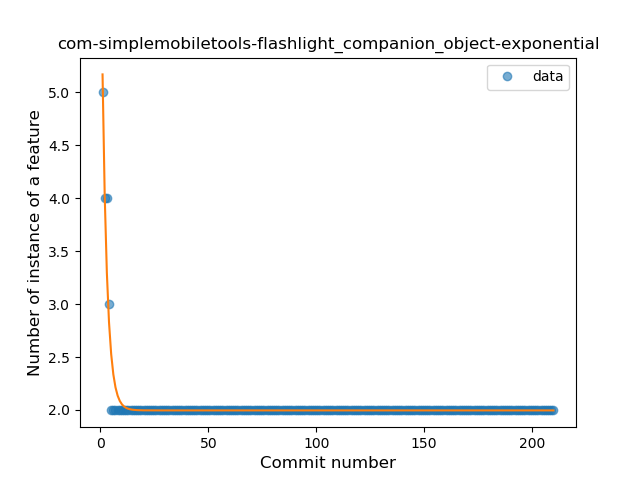

#### org-anibyl-slounik
* Feature: Singleton
* Function: 
* R_Squared: 0.92568396
 

#### cz-dvratil-fbeventsync
* Feature: Unsafe Call
* Function: 
* R_Squared: 0.92369059
 

#### io-github-benoitduffez-cupsprint
* Feature: Companion Object
* Function: 
* R_Squared: 0.90799085
 

#### org-anibyl-slounik
* Feature: Overloaded Operator
* Function: 
* R_Squared: 0.90674059
 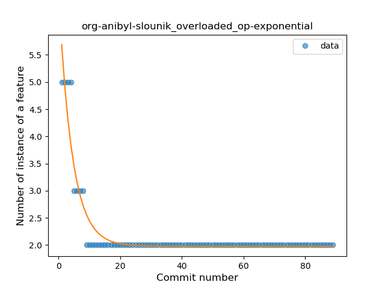

#### org-mariotaku-twidere
* Feature: Unsafe Call
* Function: 
* R_Squared: 0.8980148
 

#### de-spiritcroc-darkcroc-substratum
* Feature: Unsafe Call
* Function: 
* R_Squared: 0.88739834
 

#### io-trewartha-positional
* Feature: Extension Function
* Function: 
* R_Squared: 0.88129288
 

#### com-pyamsoft-homebutton
* Feature: Unsafe Call
* Function: 
* R_Squared: 0.87776072
 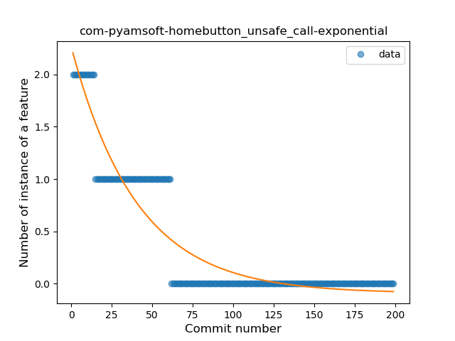

#### com-conorodonnell-bus
* Feature: Inline Function
* Function: 
* R_Squared: 0.87717116
 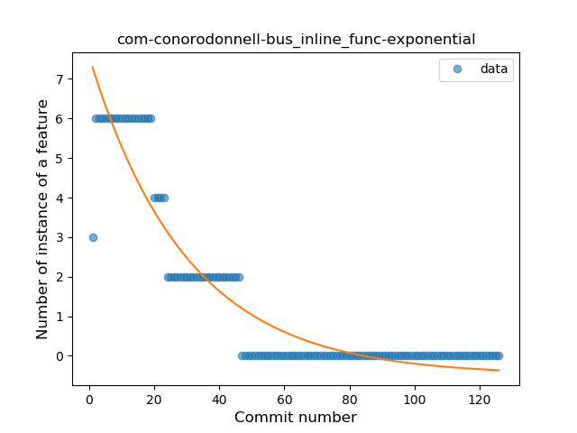

#### com-calintat-sensors
* Feature: Function with Default Value
* Function: 
* R_Squared: 0.84943046
 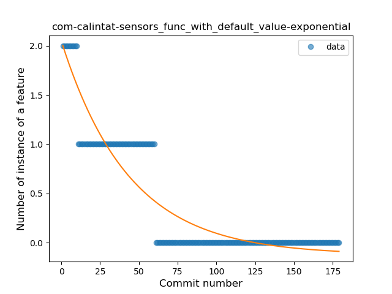

#### com-simplemobiletools-musicplayer
* Feature: Smart Cast
* Function: 
* R_Squared: 0.8430461
 

#### pw-janyo-janyoshare
* Feature: String Template
* Function: 
* R_Squared: 0.84283555
 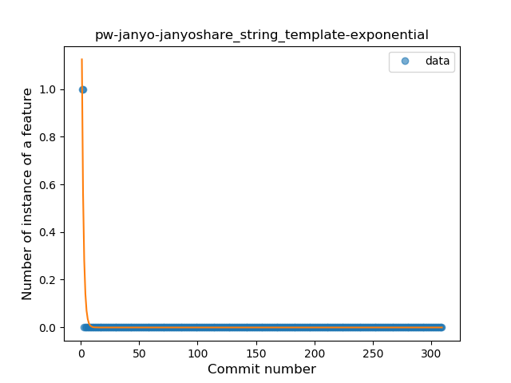

#### ch-rmy-android-http_shortcuts
* Feature: Type Alias
* Function: 
* R_Squared: 0.84280163
 

#### net-yslibrary-monotweety
* Feature: Super Delegation
* Function: 
* R_Squared: 0.8421661
 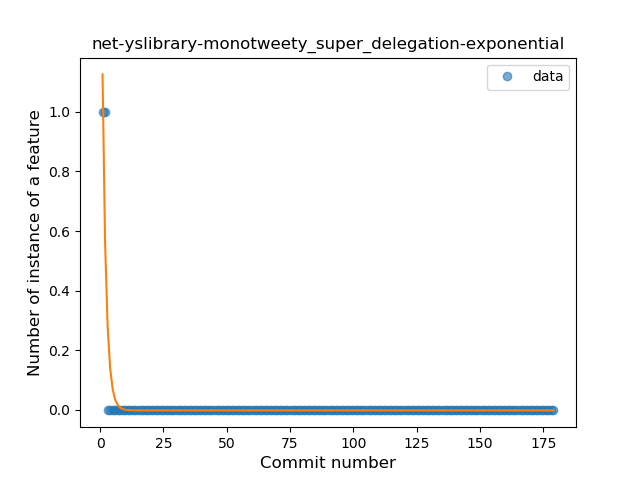

#### me-jfenn-alarmio
* Feature: Unsafe Call
* Function: 
* R_Squared: 0.84057822
 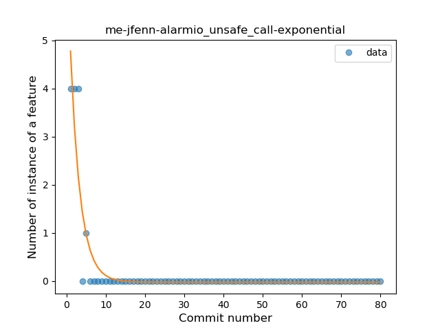

#### ca-fuwafuwa-kaku
* Feature: Function call with Named Argument
* Function: 
* R_Squared: 0.83840302
 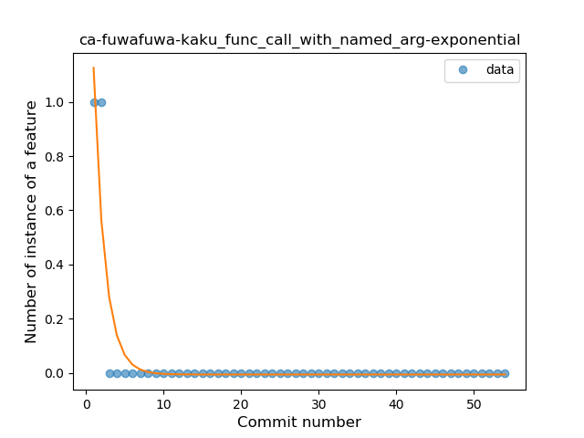

#### ca-fuwafuwa-kaku
* Feature: Property Delegation
* Function: 
* R_Squared: 0.83699129
 

#### com-fastaccess-github-libre
* Feature: Extension Function
* Function: 
* R_Squared: 0.8357338
 

#### jp-toastkid-yobidashi
* Feature: Inline Function
* Function: 
* R_Squared: 0.83396016
 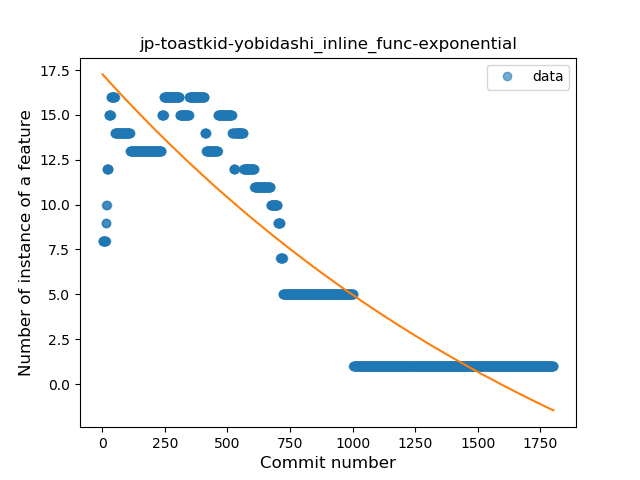

#### es-danirod-rectball-android
* Feature: Inline Function
* Function: 
* R_Squared: 0.83319755
 

#### com-github-moko256-twitlatte
* Feature: Super Delegation
* Function: 
* R_Squared: 0.82375148
 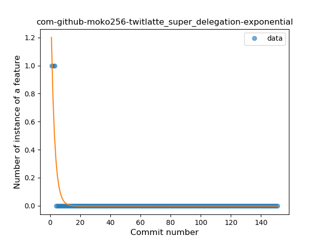

#### cz-dvratil-fbeventsync
* Feature: Inline Function
* Function: 
* R_Squared: 0.82345211
 

#### me-rei_m-hyakuninisshu
* Feature: Singleton
* Function: 
* R_Squared: 0.82301228
 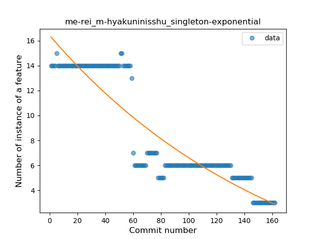

#### fi-tuska-jalkametri
* Feature: Range Expression
* Function: 
* R_Squared: 0.82239643
 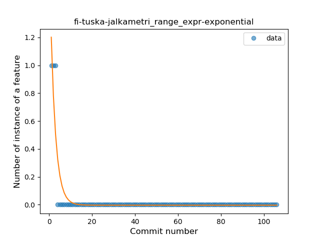

#### com-epimorphics-android-myrivers
* Feature: Smart Cast
* Function: 
* R_Squared: 0.82057835
 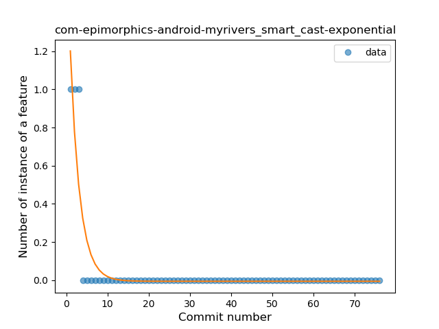

#### org-commcare-dalvik
* Feature: Unsafe Call
* Function: 
* R_Squared: 0.82057794
 

#### com-example-forgottenumbrella-cardboardmuseum
* Feature: Property Delegation
* Function: 
* R_Squared: 0.81947884
 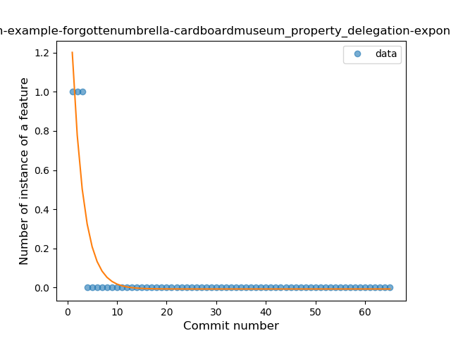

#### io-github-benoitduffez-cupsprint
* Feature: Smart Cast
* Function: 
* R_Squared: 0.81905231
 

#### com-tumblr-svetylk0-sheepsgohome-android
* Feature: Destructuring Declaration
* Function: 
* R_Squared: 0.81824738
 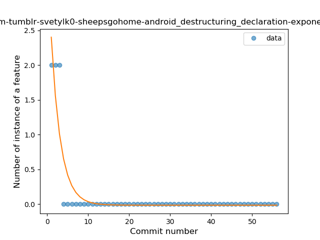

#### org-mcxa-vortaro
* Feature: Range Expression
* Function: 
* R_Squared: 0.81140237
 

#### com-simplemobiletools-calculator
* Feature: Unsafe Call
* Function: 
* R_Squared: 0.8100525
 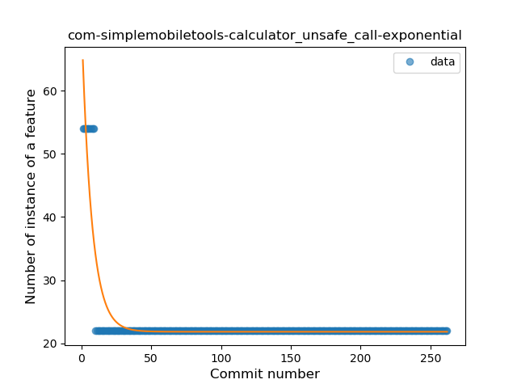

#### io-github-feelfreelinux-wykopmobilny
* Feature: Destructuring Declaration
* Function: 
* R_Squared: 0.796152
 

#### pl-org-seva-texter
* Feature: Range Expression
* Function: 
* R_Squared: 0.79544288
 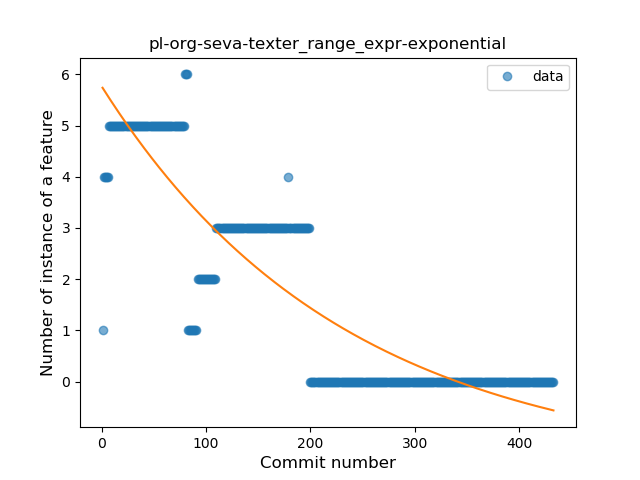

#### net-kourlas-voipms
* Feature: Smart Cast
* Function: 
* R_Squared: 0.78078007
 

#### com-benny-openlauncher
* Feature: Data Class
* Function: 
* R_Squared: 0.77058145
 

#### org-ligi-fast
* Feature: Lambda
* Function: 
* R_Squared: 0.76566091
 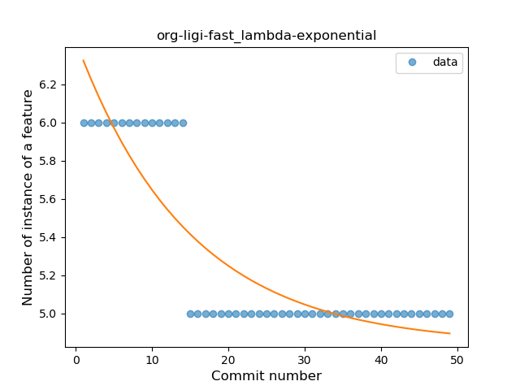

#### org-ligi-faster
* Feature: Lambda
* Function: 
* R_Squared: 0.76566091
 

#### org-ligi-fast
* Feature: Property Delegation
* Function: 
* R_Squared: 0.76566091
 

#### org-ligi-faster
* Feature: Property Delegation
* Function: 
* R_Squared: 0.76566091
 

#### org-equeim-tremotesf
* Feature: Overloaded Operator
* Function: 
* R_Squared: 0.76083162
 

#### org-equeim-tremotesf
* Feature: Property Delegation
* Function: 
* R_Squared: 0.74666303
 

#### net-mm2d-dmsexplorer
* Feature: Destructuring Declaration
* Function: 
* R_Squared: 0.74081779
 

#### com-benny-openlauncher
* Feature: Extension Function
* Function: 
* R_Squared: 0.72653143
 

#### se-barsk-park
* Feature: Data Class
* Function: 
* R_Squared: 0.72421247
 

#### com-benny-openlauncher
* Feature: Range Expression
* Function: 
* R_Squared: 0.71707435
 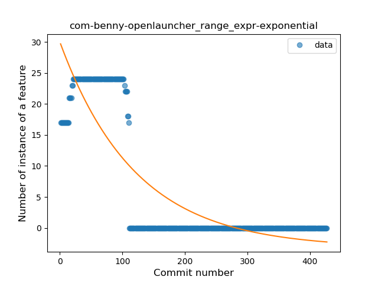

#### com-benny-openlauncher
* Feature: Smart Cast
* Function: 
* R_Squared: 0.71435997
 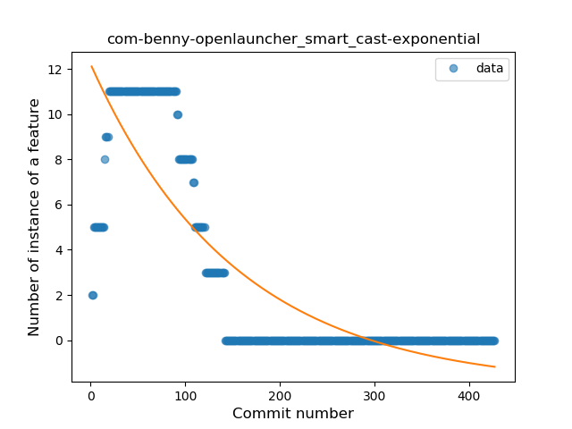

#### me-kirimin-mitsumine
* Feature: Extension Function
* Function: 
* R_Squared: 0.71433064
 

#### org-teamblueridge-pasteitapp
* Feature: Unsafe Call
* Function: 
* R_Squared: 0.71072133
 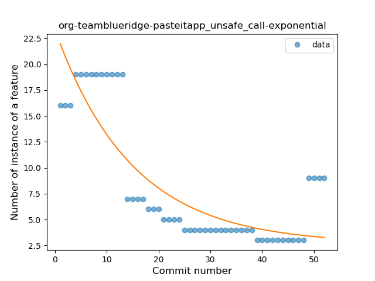

#### com-calintat-sensors
* Feature: Property Delegation
* Function: 
* R_Squared: 0.7020882
 

#### com-uncmorfi
* Feature: Singleton
* Function: 
* R_Squared: 0.70073586
 

#### org-equeim-tremotesf
* Feature: Type Inference
* Function: 
* R_Squared: 0.67926502
 

#### info-dvkr-screenstream
* Feature: Coroutine
* Function: 
* R_Squared: 0.66546619
 

#### com-benny-openlauncher
* Feature: Companion Object
* Function: 
* R_Squared: 0.66128439
 

#### org-fossasia-badgemagic
* Feature: Function call with Named Argument
* Function: 
* R_Squared: 0.66038674
 

#### de-blankedv-lanbahnpanel
* Feature: Smart Cast
* Function: 
* R_Squared: 0.65613362
 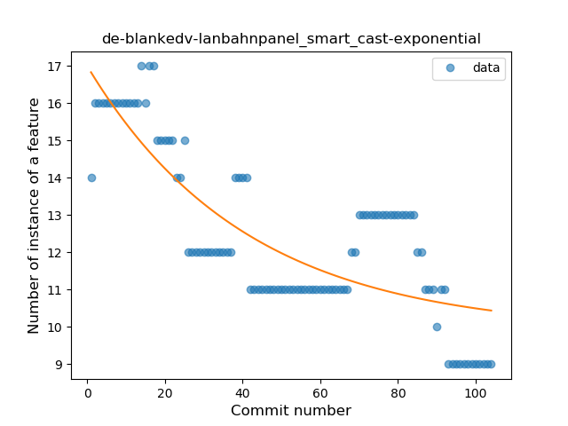

#### info-dvkr-screenstream
* Feature: String Template
* Function: 
* R_Squared: 0.63920447
 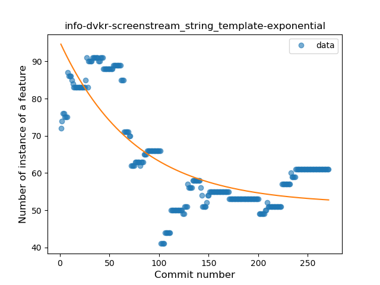

#### info-dvkr-screenstream
* Feature: Smart Cast
* Function: 
* R_Squared: 0.63866326
 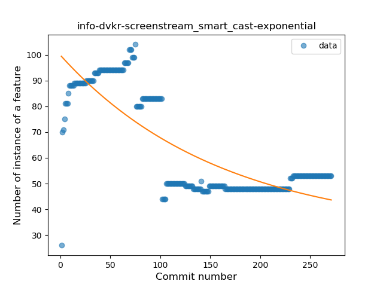

#### com-calintat-sensors
* Feature: Data Class
* Function: 
* R_Squared: 0.63689599
 

#### com-ids1024-lsdict
* Feature: Lambda
* Function: 
* R_Squared: 0.61670076
 

#### com-benny-openlauncher
* Feature: Function with Default Value
* Function: 
* R_Squared: 0.60701086
 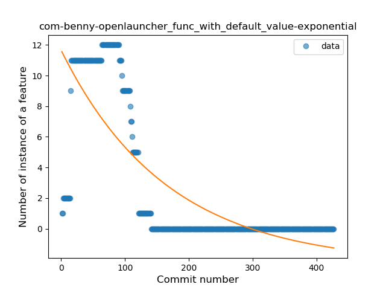

#### com-garpr-android
* Feature: Unsafe Call
* Function: 
* R_Squared: 0.60637036
 

#### com-benny-openlauncher
* Feature: When expression
* Function: 
* R_Squared: 0.59882591
 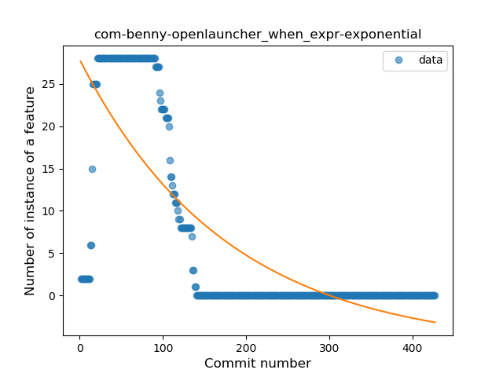

#### saschpe-poker
* Feature: Lambda
* Function: 
* R_Squared: 0.59799444
 

#### me-proxer-app
* Feature: Unsafe Call
* Function: 
* R_Squared: 0.59733317
 

#### com-benny-openlauncher
* Feature: Safe Call
* Function: 
* R_Squared: 0.58937966
 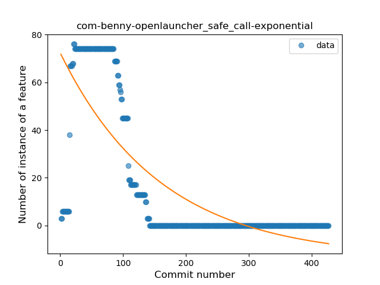

#### io-github-wulkanowy
* Feature: Property Delegation
* Function: 
* R_Squared: 0.58872039
 

#### info-dvkr-screenstream
* Feature: Data Class
* Function: 
* R_Squared: 0.58185601
 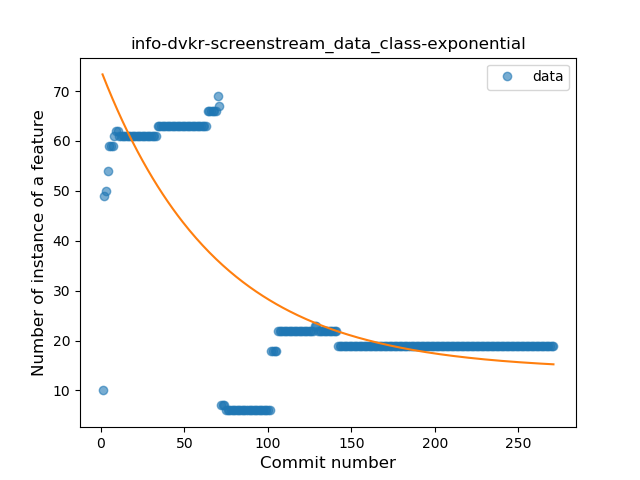

#### com-calintat-sensors
* Feature: When expression
* Function: 
* R_Squared: 0.57036919
 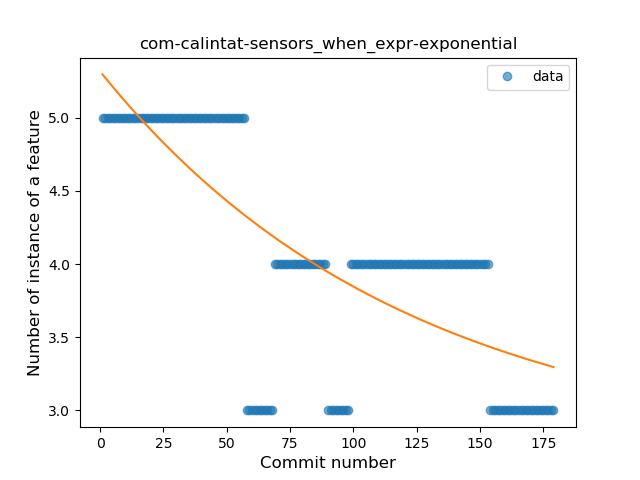

#### com-jmstudios-redmoon
* Feature: Unsafe Call
* Function: 
* R_Squared: 0.56386335
 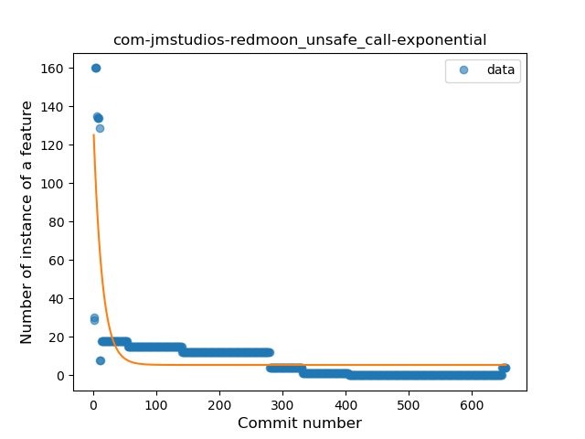

#### nightlock-peppercarrot
* Feature: Function call with Named Argument
* Function: 
* R_Squared: 0.56339696
 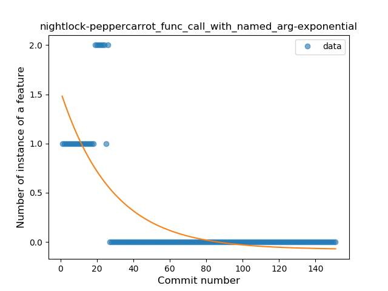

#### io-github-fvasco-pinpoi
* Feature: Companion Object
* Function: 
* R_Squared: 0.55229624
 

#### it-diab
* Feature: Unsafe Call
* Function: 
* R_Squared: 0.54436845
 

#### com-epimorphics-android-myrivers
* Feature: Extension Function
* Function: 
* R_Squared: 0.52764407
 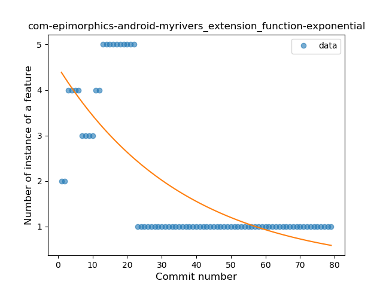

#### rectangledbmi-com-pittsburghrealtimetracker
* Feature: Safe Call
* Function: 
* R_Squared: 0.48686707
 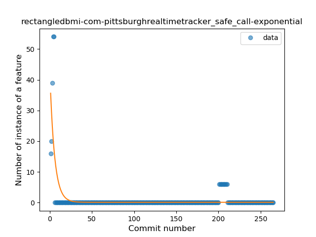

#### me-kirimin-mitsumine
* Feature: Singleton
* Function: 
* R_Squared: 0.4693307
 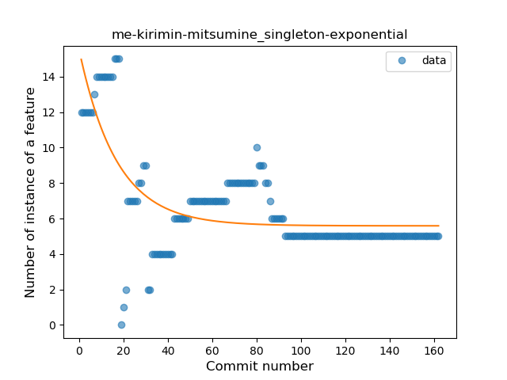

#### org-weilbach-splitbills
* Feature: Inline Function
* Function: 
* R_Squared: 0.4562746
 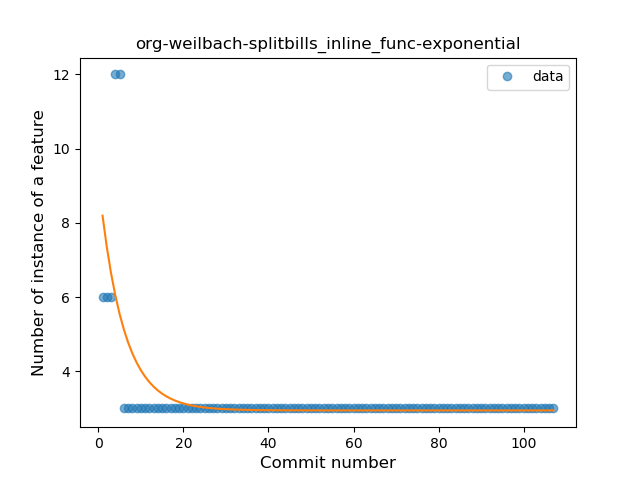

#### com-tutpro-baresip
* Feature: Range Expression
* Function: 
* R_Squared: 0.43732125
 

#### org-equeim-tremotesf
* Feature: String Template
* Function: 
* R_Squared: 0.42957488
 

#### nightlock-peppercarrot
* Feature: Singleton
* Function: 
* R_Squared: 0.40965454
 

#### com-simplemobiletools-gallery-pro
* Feature: Companion Object
* Function: 
* R_Squared: 0.40045019
 

#### horse-amazin-my-stratum0-statuswidget
* Feature: Unsafe Call
* Function: 
* R_Squared: 0.32517282
 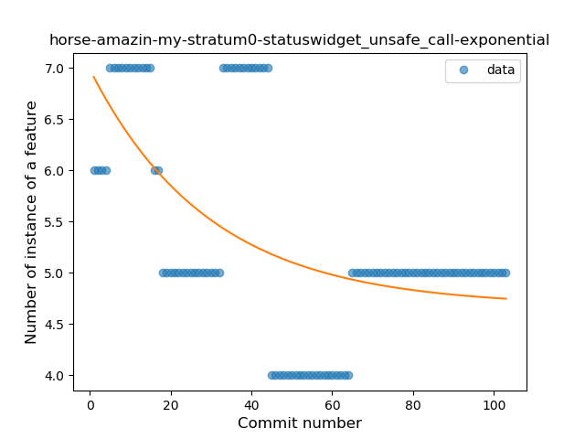

#### info-dvkr-screenstream
* Feature: Destructuring Declaration
* Function: 
* R_Squared: 0.31878792
 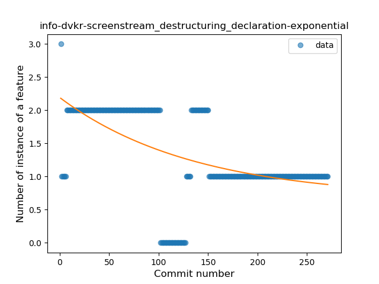

#### at-bitfire-davdroid
* Feature: Super Delegation
* Function: 
* R_Squared: 0.26529957
 

#### pl-org-seva-navigator
* Feature: Unsafe Call
* Function: 
* R_Squared: 0.24348824
 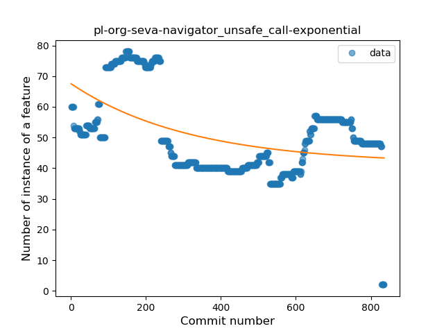

#### net-nonylene-photolinkviewer
* Feature: Function with Default Value
* Function: 
* R_Squared: 0.19322671
 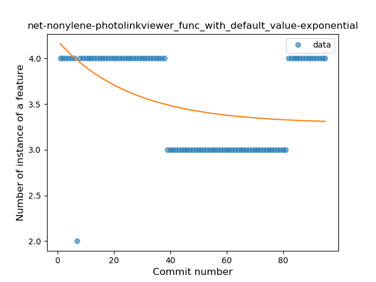

#### com-simplemobiletools-notes-pro
* Feature: Extension Function
* Function: 
* R_Squared: 0.14958891
 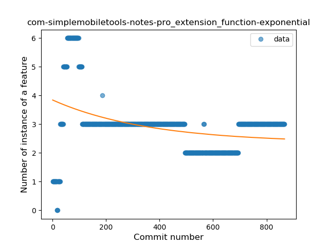

#### com-sjn-stamp
* Feature: Function call with Named Argument
* Function: 
* R_Squared: 0.13029862
 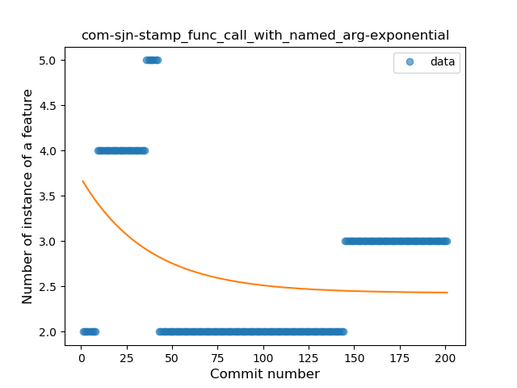

#### me-proxer-app
* Feature: Sealed Class
* Function: 
* R_Squared: 0.1254801
 

#### me-murks-feedwatcher
* Feature: Companion Object
* Function: 
* R_Squared: 0.11215914
 

#### com-glodanif-bluetoothchat
* Feature: Infix Function
* Function: 
* R_Squared: 0.09986302
 

#### com-eventyay-attendee
* Feature: Unsafe Call
* Function: 
* R_Squared: 0.09708244
 

#### com-github-premnirmal-tickerwidget
* Feature: String Template
* Function: 
* R_Squared: 0.05293199
 

#### tk-superl2-xwifi
* Feature: Companion Object
* Function: 
* R_Squared: 0.0177727
 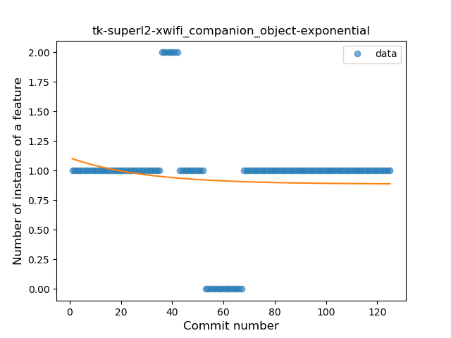

