## Sudden Rise Plateau
----
**259** best fit

#### FengMoeTeam-NHentai-android
* Feature: Lambda
* Function: 
* R_Squared: 0.95278781
 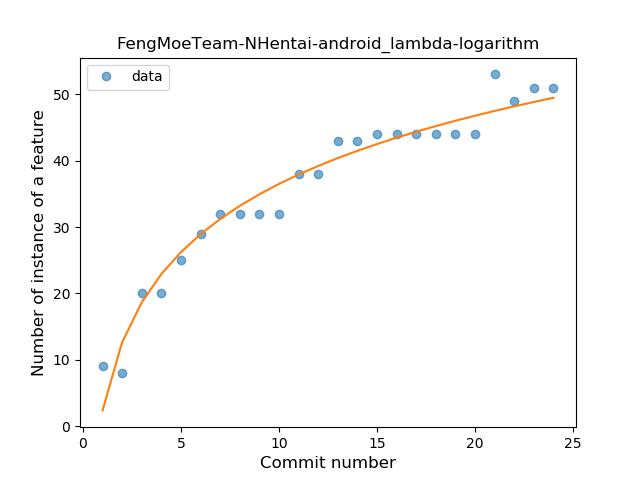

#### SimpleMobileTools-Simple-Draw
* Feature: Type Inference
* Function: 
* R_Squared: 0.93923487
 

#### wuan-bo-android
* Feature: Data Class
* Function: 
* R_Squared: 0.93267613
 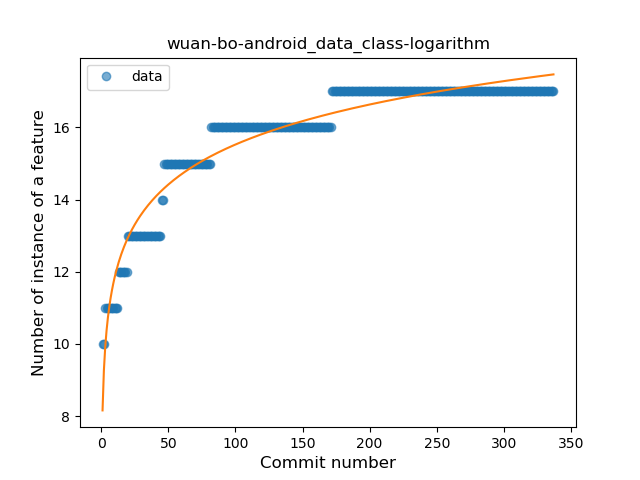

#### DSteve595-Put.io
* Feature: When expression
* Function: 
* R_Squared: 0.93031151
 

#### nibarius-opera-park-android
* Feature: Range Expression
* Function: 
* R_Squared: 0.92857813
 

#### fvasco-pinpoi
* Feature: Lambda
* Function: 
* R_Squared: 0.92561222
 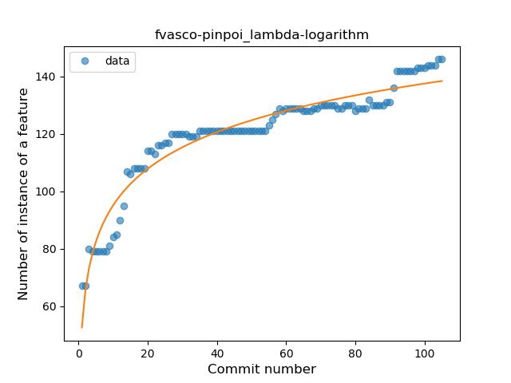

#### bitfireAT-davdroid
* Feature: Safe Call
* Function: 
* R_Squared: 0.92172178
 

#### mbarta-scr-redesign
* Feature: Lambda
* Function: 
* R_Squared: 0.92002637
 

#### erickok-borefts2015
* Feature: Lambda
* Function: 
* R_Squared: 0.91980437
 

#### ianhanniballake-LocalStorage
* Feature: Safe Call
* Function: 
* R_Squared: 0.91974604
 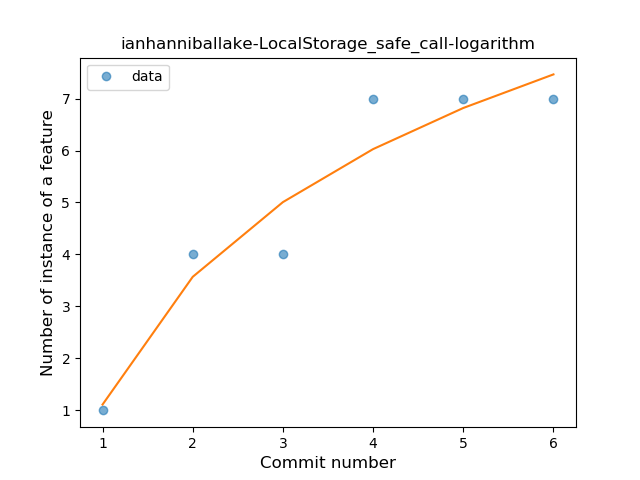

#### FengMoeTeam-NHentai-android
* Feature: Type Inference
* Function: 
* R_Squared: 0.91881418
 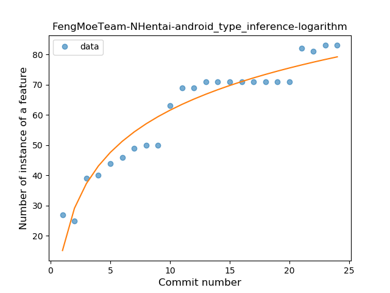

#### FengMoeTeam-NHentai-android
* Feature: Safe Call
* Function: 
* R_Squared: 0.91796526
 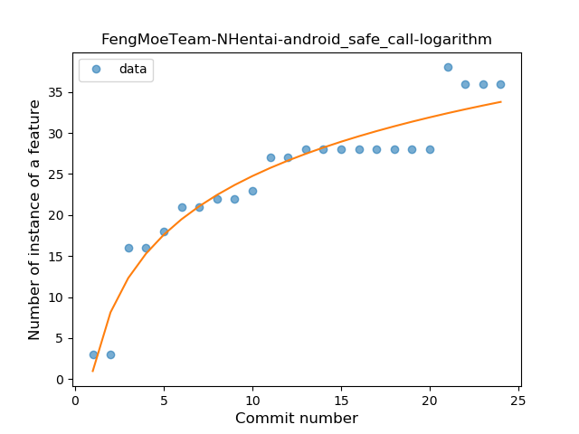

#### DSteve595-Put.io
* Feature: Type Inference
* Function: 
* R_Squared: 0.9145533
 

#### systemallica-ValenBisi
* Feature: Lambda
* Function: 
* R_Squared: 0.91262045
 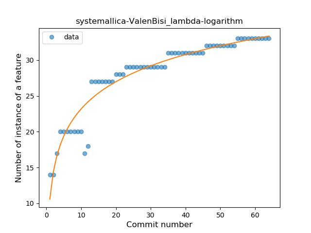

#### hsson-card-balance-app
* Feature: Companion Object
* Function: 
* R_Squared: 0.91139288
 

#### exviva-stew
* Feature: Lambda
* Function: 
* R_Squared: 0.91125605
 

#### bitfireAT-davdroid
* Feature: Companion Object
* Function: 
* R_Squared: 0.91075566
 

#### danirod-rectball
* Feature: Lambda
* Function: 
* R_Squared: 0.91069261
 

#### SimpleMobileTools-Simple-Calculator
* Feature: Lambda
* Function: 
* R_Squared: 0.91046515
 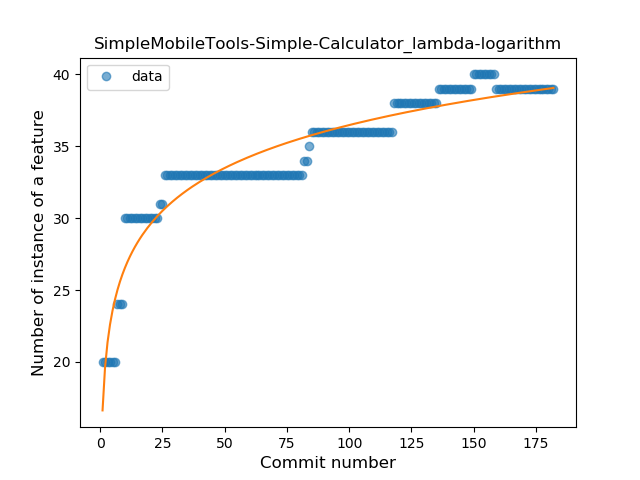

#### MartinStyk-AndroidApkAnalyzer
* Feature: Safe Call
* Function: 
* R_Squared: 0.90846163
 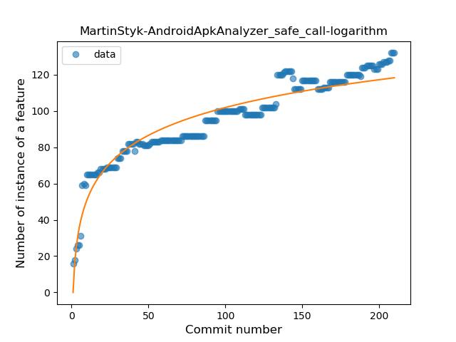

#### exviva-stew
* Feature: Type Inference
* Function: 
* R_Squared: 0.90749897
 

#### ianhanniballake-LocalStorage
* Feature: Lambda
* Function: 
* R_Squared: 0.90685137
 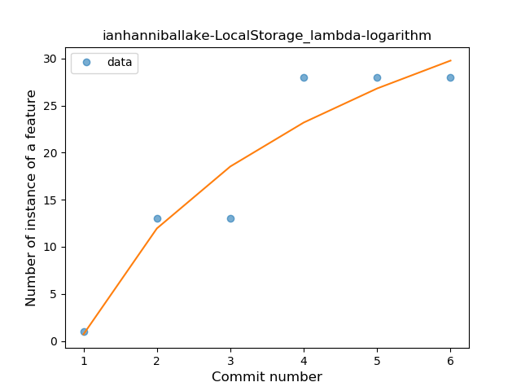

#### fedepaol-BikeSharing
* Feature: Safe Call
* Function: 
* R_Squared: 0.90543143
 

#### Depau-EtchDroid
* Feature: Type Inference
* Function: 
* R_Squared: 0.90007002
 

#### nao20010128nao-DroidComplex
* Feature: Extension Function
* Function: 
* R_Squared: 0.89740522
 

#### MartinStyk-AndroidApkAnalyzer
* Feature: Lambda
* Function: 
* R_Squared: 0.89657883
 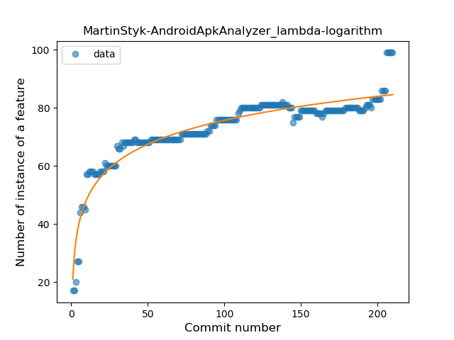

#### blastrock-kaqui
* Feature: Lambda
* Function: 
* R_Squared: 0.8952544
 

#### thaapasa-jalkametri-android
* Feature: Singleton
* Function: 
* R_Squared: 0.89049344
 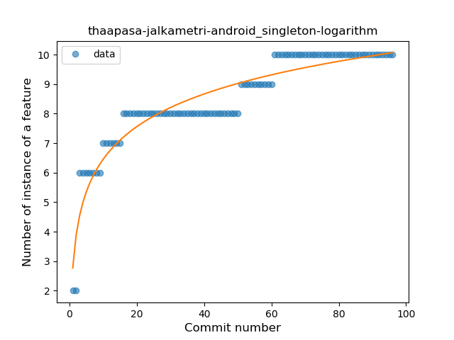

#### danvratil-FBEventSync
* Feature: When expression
* Function: 
* R_Squared: 0.89036343
 

#### DSteve595-Put.io
* Feature: Companion Object
* Function: 
* R_Squared: 0.88942287
 

#### inorichi-tachiyomi
* Feature: Companion Object
* Function: 
* R_Squared: 0.88835899
 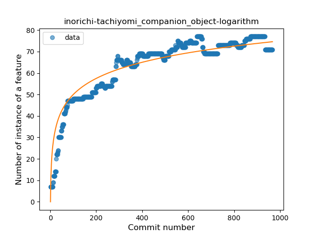

#### charlesmadere-smash-ranks-android
* Feature: Property Delegation
* Function: 
* R_Squared: 0.88835875
 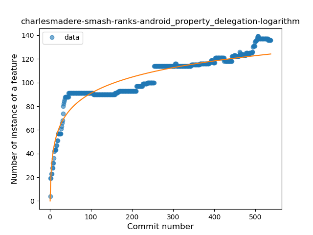

#### bitfireAT-davdroid
* Feature: String Template
* Function: 
* R_Squared: 0.88766747
 

#### milosmns-Timecrypt
* Feature: String Template
* Function: 
* R_Squared: 0.88742549
 

#### Maxr1998-MaxLock
* Feature: String Template
* Function: 
* R_Squared: 0.88729474
 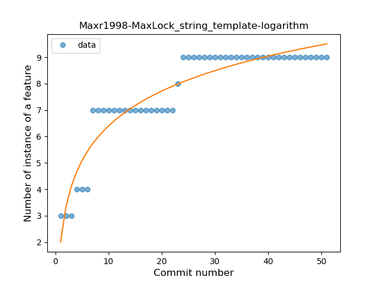

#### Waboodoo-HTTP-Shortcuts
* Feature: Type Inference
* Function: 
* R_Squared: 0.8847448
 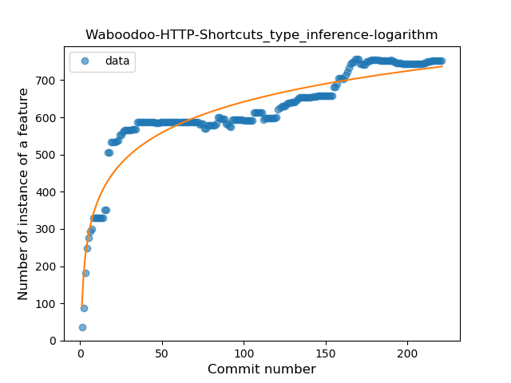

#### AkshayChordiya-gofun-android
* Feature: Type Inference
* Function: 
* R_Squared: 0.88221551
 

#### Commit451-LabCoat
* Feature: Type Inference
* Function: 
* R_Squared: 0.88201214
 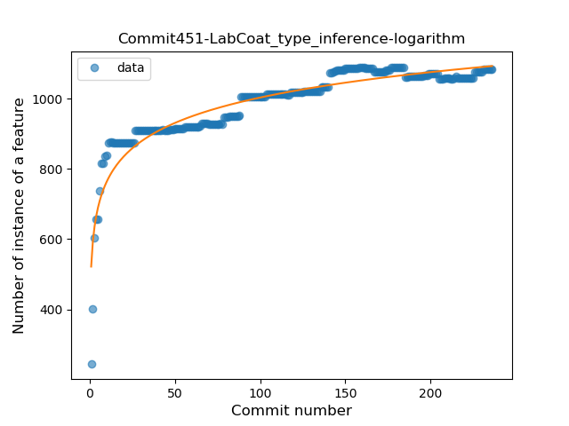

#### DSteve595-Put.io
* Feature: Safe Call
* Function: 
* R_Squared: 0.88097689
 

#### ianmcxa-Soft-Sound
* Feature: Safe Call
* Function: 
* R_Squared: 0.87921802
 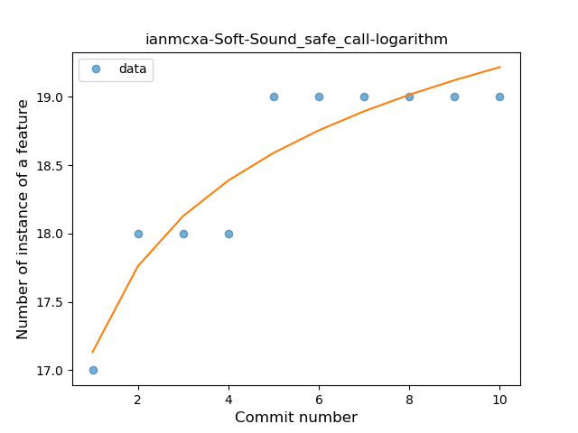

#### nao20010128nao-DroidComplex
* Feature: Lambda
* Function: 
* R_Squared: 0.87779987
 

#### caarmen-poet-assistant
* Feature: When expression
* Function: 
* R_Squared: 0.87579814
 

#### ohmae-DmsExplorer
* Feature: Function with Default Value
* Function: 
* R_Squared: 0.86988944
 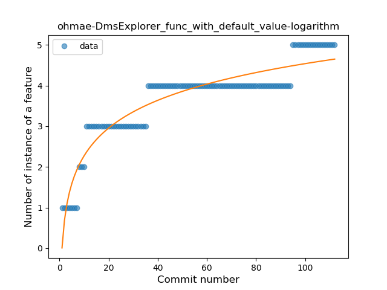

#### aminecmi-ReaderforSelfoss
* Feature: Function call with Named Argument
* Function: 
* R_Squared: 0.86626159
 

#### dbrant-unitconverter-android
* Feature: Type Inference
* Function: 
* R_Squared: 0.8661913
 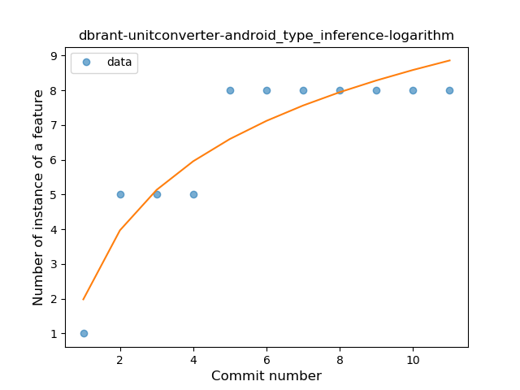

#### kamgurgul-cpu-info
* Feature: String Template
* Function: 
* R_Squared: 0.86537685
 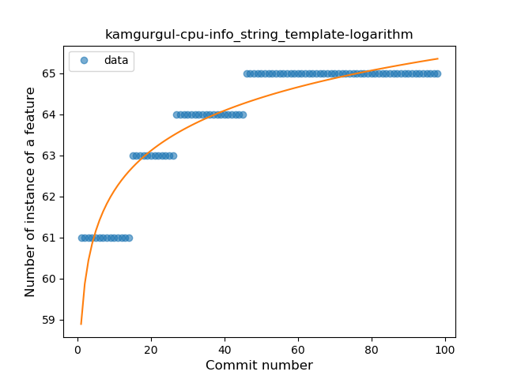

#### pacien-tincapp
* Feature: Singleton
* Function: 
* R_Squared: 0.86353406
 

#### devmil-PaperLaunch
* Feature: Type Inference
* Function: 
* R_Squared: 0.86313363
 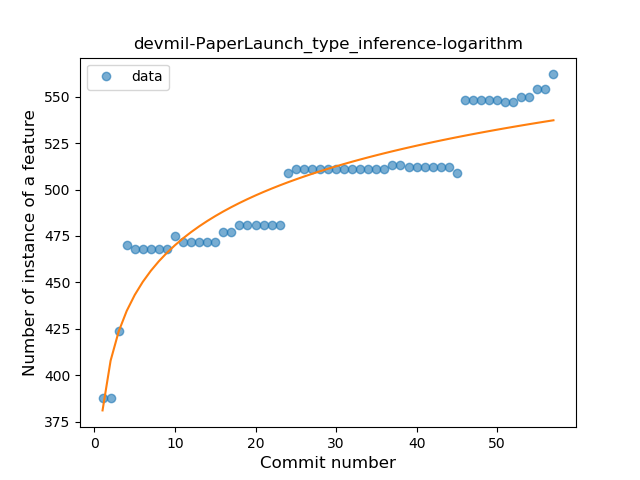

#### bubelov-coins-android
* Feature: Data Class
* Function: 
* R_Squared: 0.86171341
 

#### Waboodoo-Status-Bar-Tachometer
* Feature: Singleton
* Function: 
* R_Squared: 0.86019302
 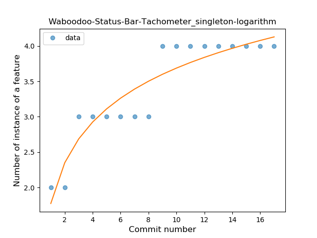

#### raatmarien-red-moon
* Feature: Function call with Named Argument
* Function: 
* R_Squared: 0.85789464
 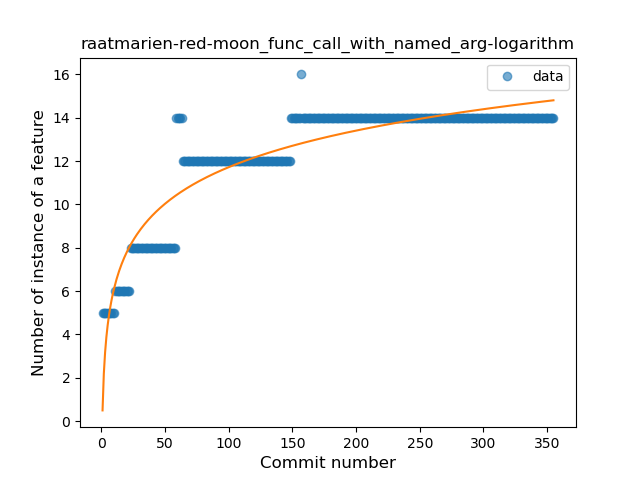

#### ids1024-lsdict-android
* Feature: Type Inference
* Function: 
* R_Squared: 0.85085637
 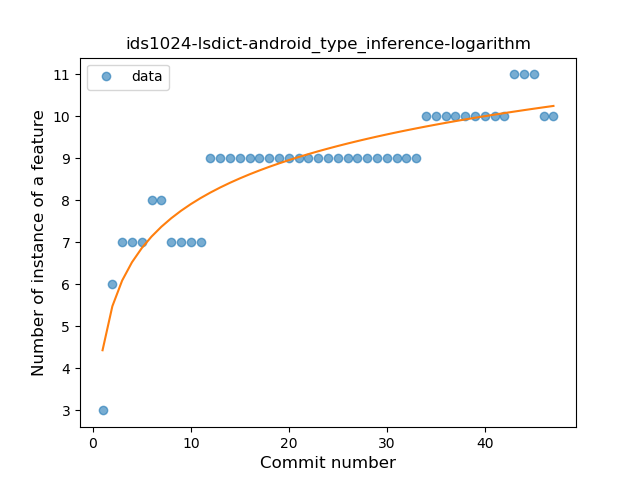

#### herbeth1u-VNDB-Android
* Feature: String Template
* Function: 
* R_Squared: 0.84976549
 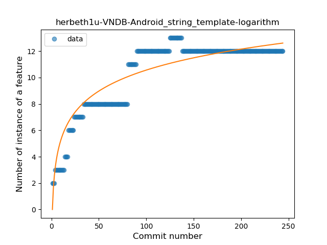

#### ligi-IPFSDroid
* Feature: Safe Call
* Function: 
* R_Squared: 0.84956946
 

#### Mystery00-JanYoShare
* Feature: When expression
* Function: 
* R_Squared: 0.84610079
 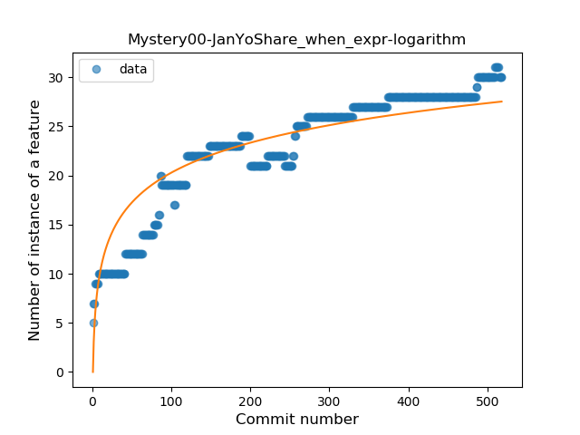

#### yshrsmz-monotweety
* Feature: Smart Cast
* Function: 
* R_Squared: 0.84473467
 

#### danvratil-FBEventSync
* Feature: String Template
* Function: 
* R_Squared: 0.84470261
 

#### Valodim-Stratum0Widget
* Feature: Property Delegation
* Function: 
* R_Squared: 0.84227247
 

#### michaelkourlas-voipms-sms-client
* Feature: Safe Call
* Function: 
* R_Squared: 0.84165726
 

#### jidogoon-RoundedScreen
* Feature: Type Inference
* Function: 
* R_Squared: 0.84025426
 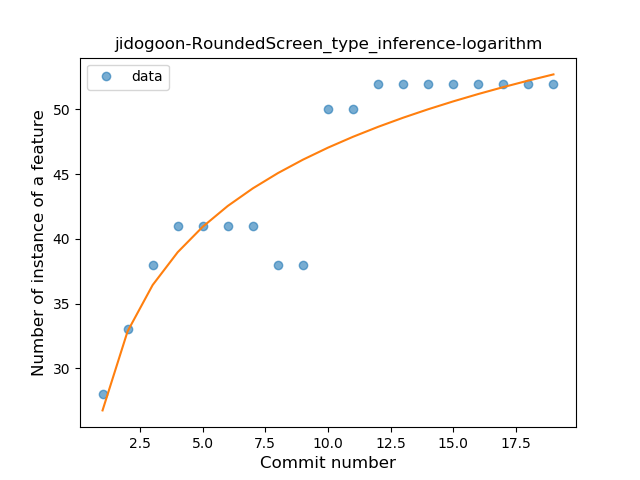

#### Waboodoo-HTTP-Shortcuts
* Feature: Singleton
* Function: 
* R_Squared: 0.84003283
 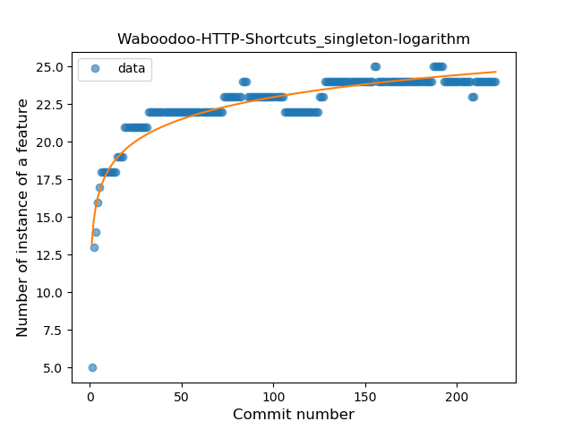

#### ianmcxa-Soft-Sound
* Feature: Lambda
* Function: 
* R_Squared: 0.83975451
 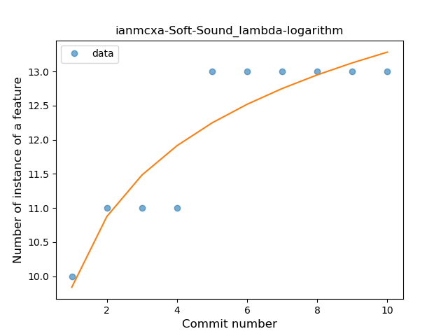

#### quarck-CalendarNotification
* Feature: Singleton
* Function: 
* R_Squared: 0.83946786
 

#### apiote-Bimba
* Feature: Smart Cast
* Function: 
* R_Squared: 0.83930913
 

#### loloof64-BasicChessEndGamesTrainer
* Feature: Overloaded Operator
* Function: 
* R_Squared: 0.83914147
 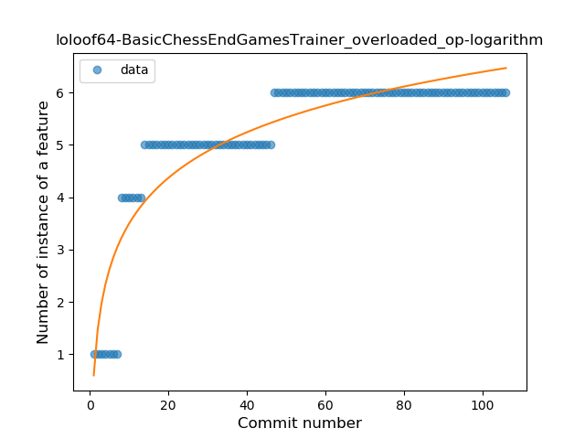

#### wuan-bo-android
* Feature: Function with Default Value
* Function: 
* R_Squared: 0.83735361
 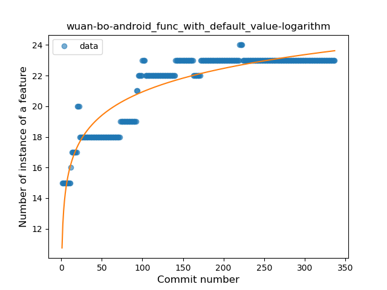

#### SimpleMobileTools-Simple-Music-Player
* Feature: Type Inference
* Function: 
* R_Squared: 0.83708025
 

#### LawnchairLauncher-Lawnchair
* Feature: Unsafe Call
* Function: 
* R_Squared: 0.83665997
 

#### chrsep-Kingfish
* Feature: Safe Call
* Function: 
* R_Squared: 0.83478853
 

#### WilderPereira-lmgtfyGen
* Feature: Type Inference
* Function: 
* R_Squared: 0.8316355
 

#### charlesmadere-smash-ranks-android
* Feature: Extension Function
* Function: 
* R_Squared: 0.82904896
 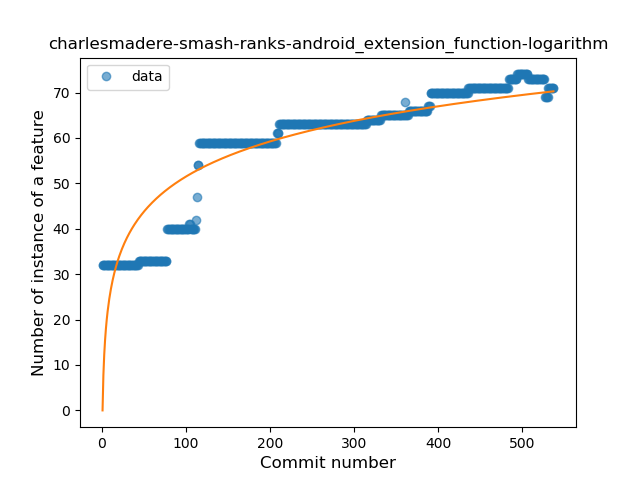

#### Depau-EtchDroid
* Feature: Extension Function
* Function: 
* R_Squared: 0.82865101
 

#### die-tageszeitung-tazapp-android
* Feature: Companion Object
* Function: 
* R_Squared: 0.82683887
 

#### ofalvai-BPInfo
* Feature: When expression
* Function: 
* R_Squared: 0.82486717
 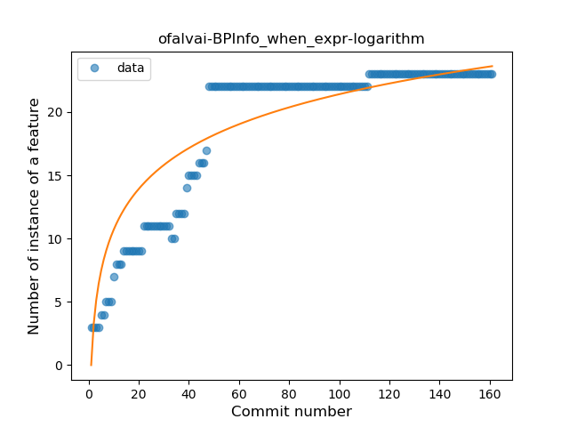

#### DSteve595-Put.io
* Feature: Unsafe Call
* Function: 
* R_Squared: 0.82398389
 

#### LiMium-mini-vector-android
* Feature: Companion Object
* Function: 
* R_Squared: 0.82355896
 

#### CzBiX-v2ex-android
* Feature: Safe Call
* Function: 
* R_Squared: 0.8228827
 

#### SimpleMobileTools-Simple-Clock
* Feature: String Template
* Function: 
* R_Squared: 0.82037161
 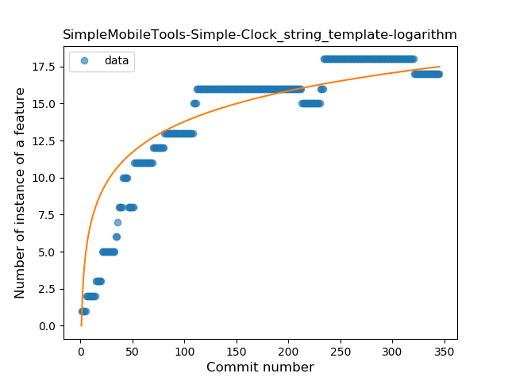

#### ofalvai-BPInfo
* Feature: Smart Cast
* Function: 
* R_Squared: 0.81888791
 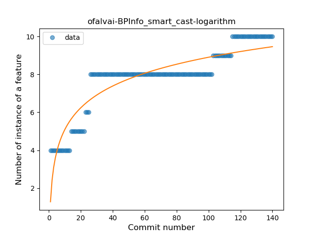

#### wuan-bo-android
* Feature: When expression
* Function: 
* R_Squared: 0.81718541
 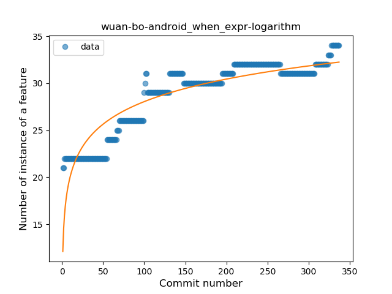

#### SimpleMobileTools-Simple-App-Launcher
* Feature: Type Inference
* Function: 
* R_Squared: 0.8160426
 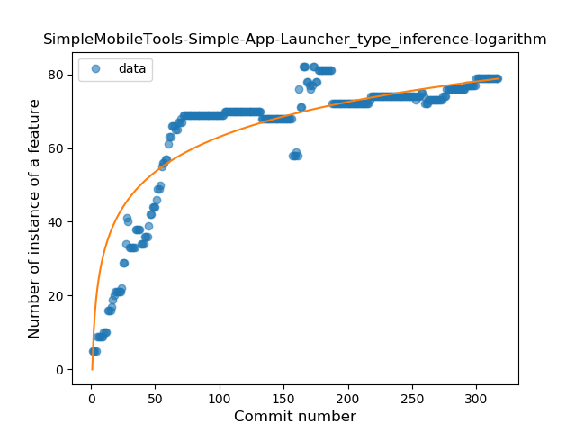

#### carlphilipp-chicago-commutes
* Feature: Singleton
* Function: 
* R_Squared: 0.81450147
 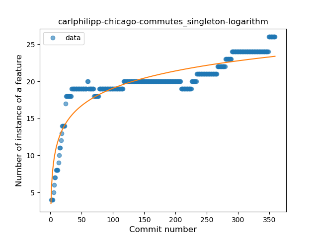

#### SimpleMobileTools-Simple-Clock
* Feature: Lambda
* Function: 
* R_Squared: 0.8135954
 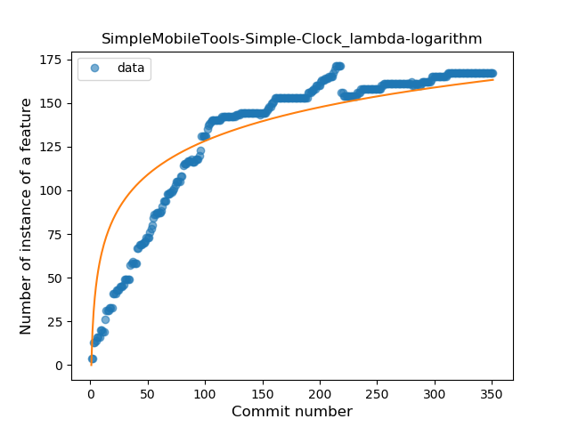

#### Depau-EtchDroid
* Feature: Function with Default Value
* Function: 
* R_Squared: 0.81246783
 

#### SimpleMobileTools-Simple-Draw
* Feature: When expression
* Function: 
* R_Squared: 0.81241735
 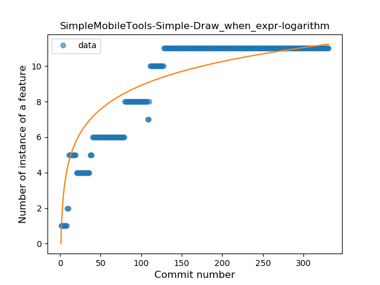

#### corenting-EDCompanion
* Feature: Data Class
* Function: 
* R_Squared: 0.81223538
 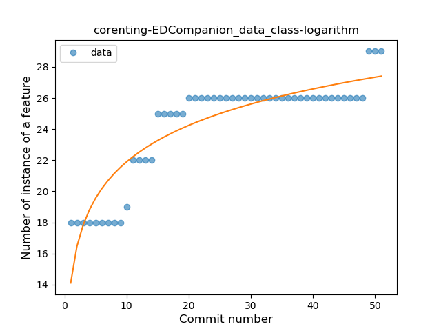

#### romannurik-muzei
* Feature: Companion Object
* Function: 
* R_Squared: 0.81110834
 

#### SimpleMobileTools-Simple-Clock
* Feature: Type Inference
* Function: 
* R_Squared: 0.81074878
 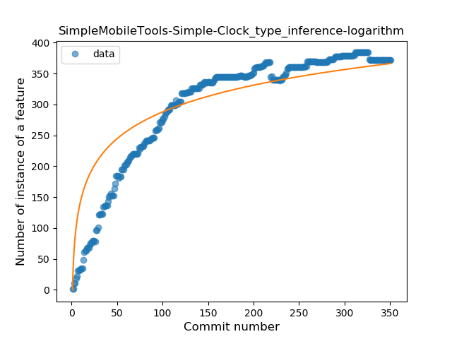

#### wuan-bo-android
* Feature: Function call with Named Argument
* Function: 
* R_Squared: 0.8105358
 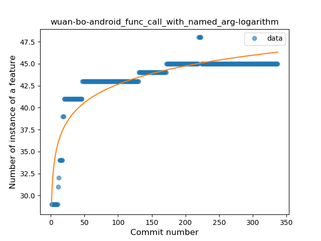

#### devmil-PaperLaunch
* Feature: Smart Cast
* Function: 
* R_Squared: 0.80939686
 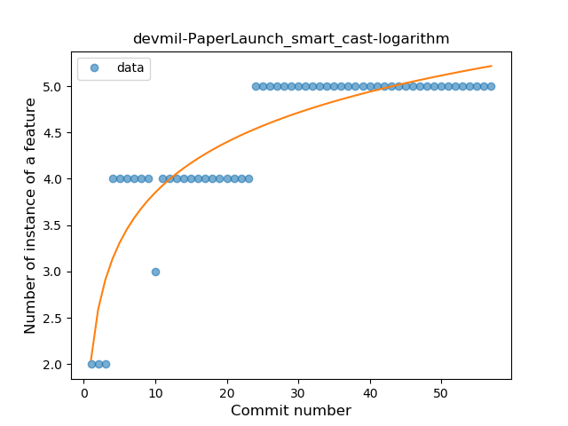

#### bitfireAT-icsdroid
* Feature: Smart Cast
* Function: 
* R_Squared: 0.80905788
 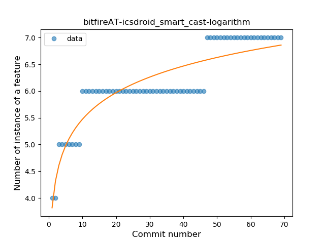

#### raatmarien-red-moon
* Feature: Data Class
* Function: 
* R_Squared: 0.80839364
 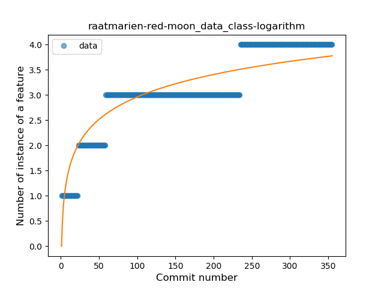

#### bitfireAT-icsdroid
* Feature: Singleton
* Function: 
* R_Squared: 0.80782223
 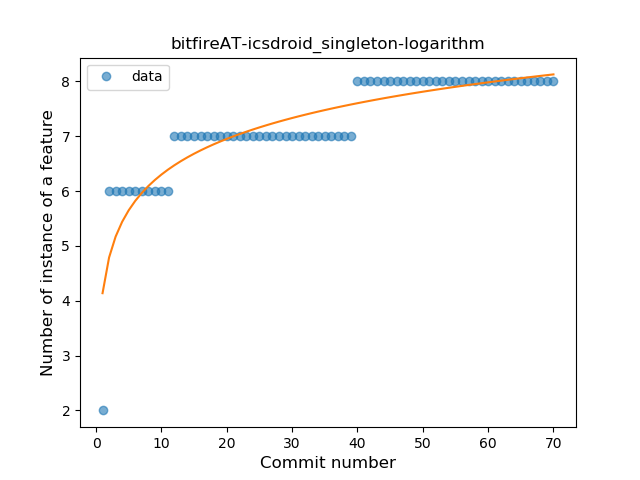

#### ohmae-VoiceMessageBoard
* Feature: Companion Object
* Function: 
* R_Squared: 0.80675145
 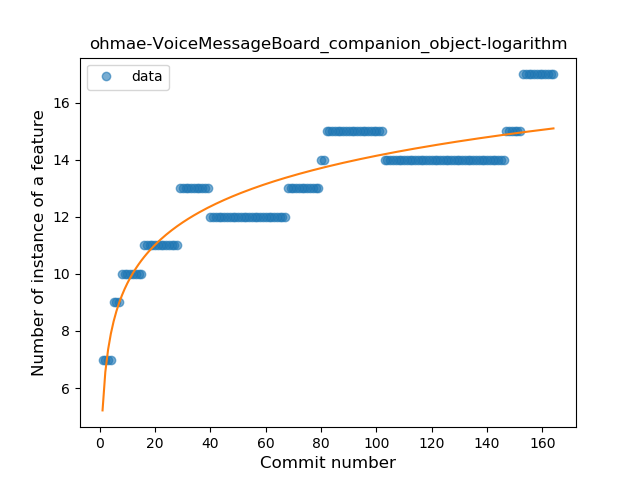

#### bitfireAT-icsdroid
* Feature: Safe Call
* Function: 
* R_Squared: 0.80671792
 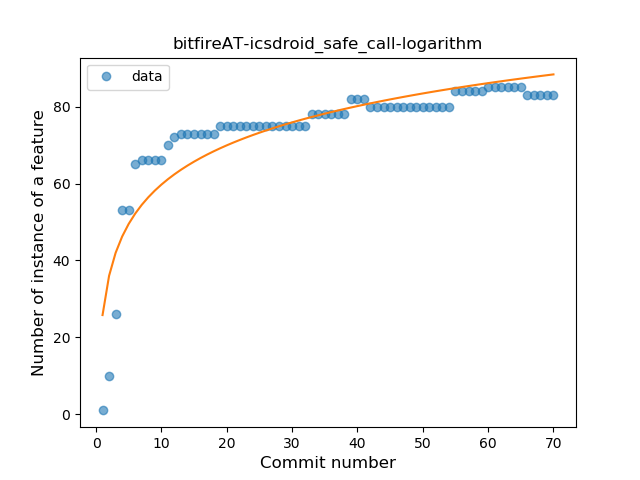

#### SimpleMobileTools-Simple-Draw
* Feature: String Template
* Function: 
* R_Squared: 0.80549837
 

#### mjdenham-and-bible
* Feature: Function call with Named Argument
* Function: 
* R_Squared: 0.80530262
 

#### k9mail-k-9
* Feature: Inline Function
* Function: 
* R_Squared: 0.80501372
 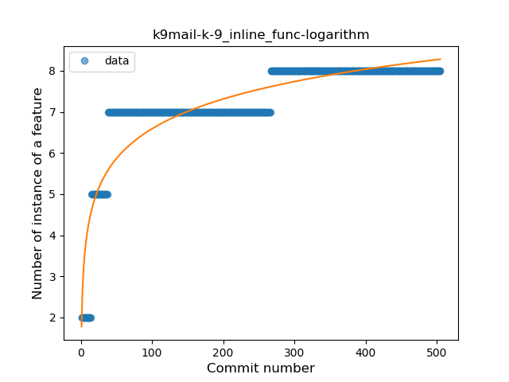

#### kamgurgul-cpu-info
* Feature: Type Inference
* Function: 
* R_Squared: 0.80483685
 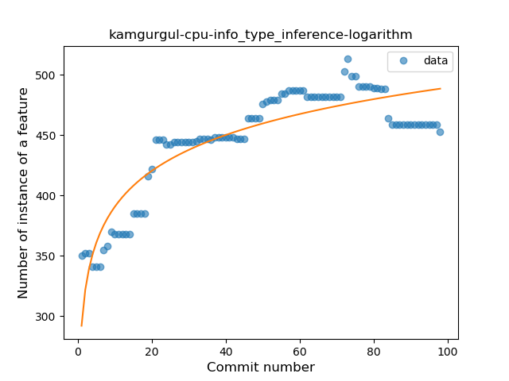

#### peppercarrot-e-reader
* Feature: Companion Object
* Function: 
* R_Squared: 0.8047484
 

#### Commit451-LabCoat
* Feature: Lambda
* Function: 
* R_Squared: 0.80426942
 

#### LittleLightCz-SheepsGoHome
* Feature: Type Inference
* Function: 
* R_Squared: 0.80393627
 

#### sriharshaarangi-BatteryChargeLimit
* Feature: Type Inference
* Function: 
* R_Squared: 0.80226079
 

#### eurofurence-ef-app_android
* Feature: Overloaded Operator
* Function: 
* R_Squared: 0.80125347
 

#### glodanif-BluetoothChat
* Feature: Safe Call
* Function: 
* R_Squared: 0.79988972
 

#### bubelov-coins-android
* Feature: Type Inference
* Function: 
* R_Squared: 0.79424966
 

#### wuan-bo-android
* Feature: Smart Cast
* Function: 
* R_Squared: 0.7930366
 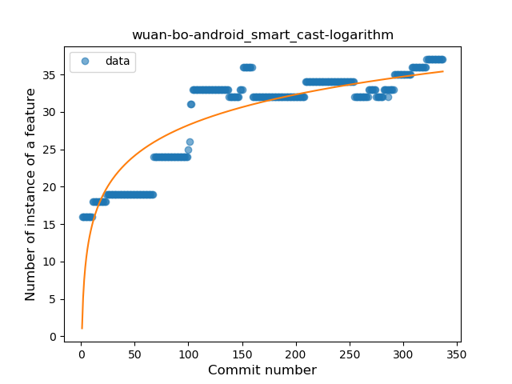

#### bitfireAT-davdroid
* Feature: Type Inference
* Function: 
* R_Squared: 0.79038295
 

#### AIDEA775-UNCmorfi
* Feature: String Template
* Function: 
* R_Squared: 0.78989365
 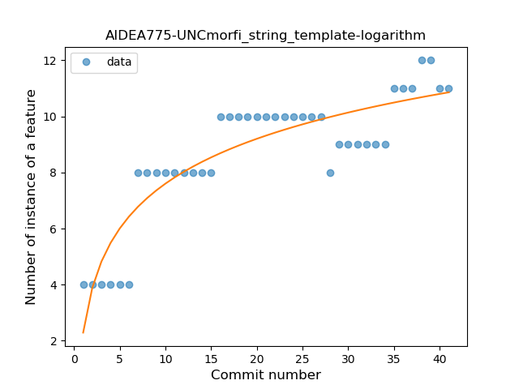

#### grote-Transportr
* Feature: Smart Cast
* Function: 
* R_Squared: 0.78476171
 

#### pacien-tincapp
* Feature: Companion Object
* Function: 
* R_Squared: 0.78329643
 

#### LawnchairLauncher-Lawnchair
* Feature: Type Inference
* Function: 
* R_Squared: 0.78316421
 

#### blastrock-kaqui
* Feature: Range Expression
* Function: 
* R_Squared: 0.78239538
 

#### romannurik-muzei
* Feature: Property Delegation
* Function: 
* R_Squared: 0.78197679
 

#### emansih-FireflyMobile
* Feature: Data Class
* Function: 
* R_Squared: 0.7797212
 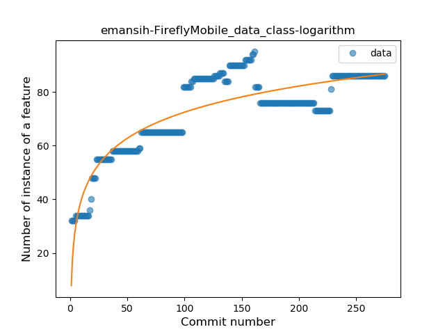

#### romannurik-muzei
* Feature: Type Inference
* Function: 
* R_Squared: 0.77572931
 

#### duckduckgo-Android
* Feature: When expression
* Function: 
* R_Squared: 0.77445761
 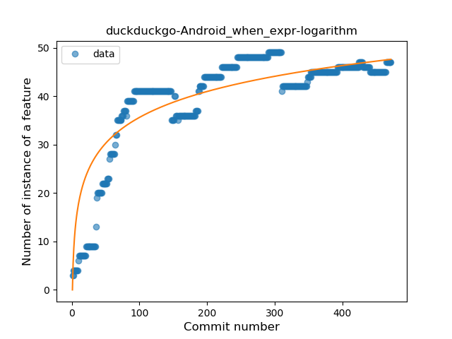

#### MGaetan89-ShowsRage
* Feature: Smart Cast
* Function: 
* R_Squared: 0.77082134
 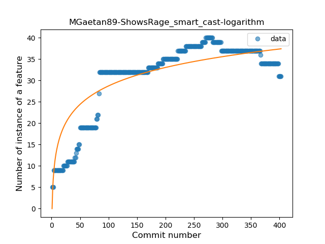

#### Depau-EtchDroid
* Feature: String Template
* Function: 
* R_Squared: 0.76917897
 

#### mastizada-focus-android
* Feature: String Template
* Function: 
* R_Squared: 0.76788724
 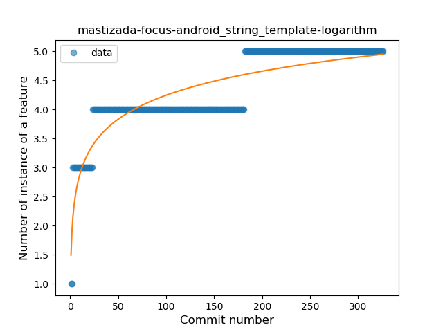

#### glodanif-BluetoothChat
* Feature: Smart Cast
* Function: 
* R_Squared: 0.76785058
 

#### Commit451-LabCoat
* Feature: Singleton
* Function: 
* R_Squared: 0.76556588
 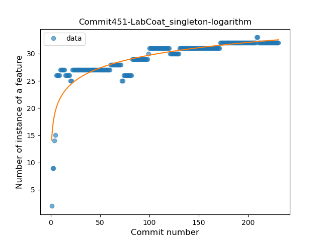

#### yshrsmz-monotweety
* Feature: Extension Function
* Function: 
* R_Squared: 0.76303294
 

#### Mygod-VPNHotspot
* Feature: When expression
* Function: 
* R_Squared: 0.76211121
 

#### mpcjanssen-simpletask-android
* Feature: Data Class
* Function: 
* R_Squared: 0.7598753
 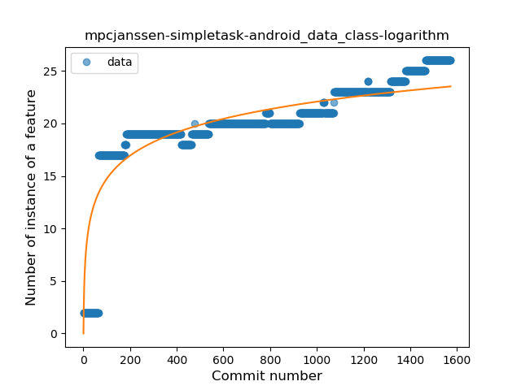

#### albertolalanda-new-ultrasonic-fork-for-MyMusicQoE
* Feature: Property Delegation
* Function: 
* R_Squared: 0.75911219
 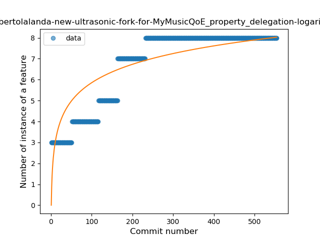

#### bitfireAT-icsdroid
* Feature: Companion Object
* Function: 
* R_Squared: 0.75903722
 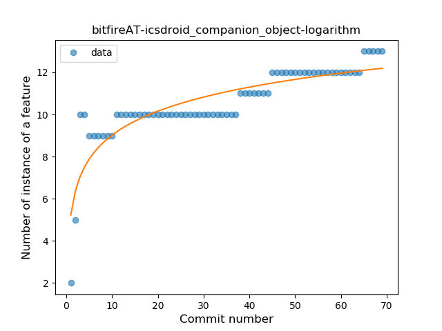

#### ohmae-VoiceMessageBoard
* Feature: Safe Call
* Function: 
* R_Squared: 0.75323775
 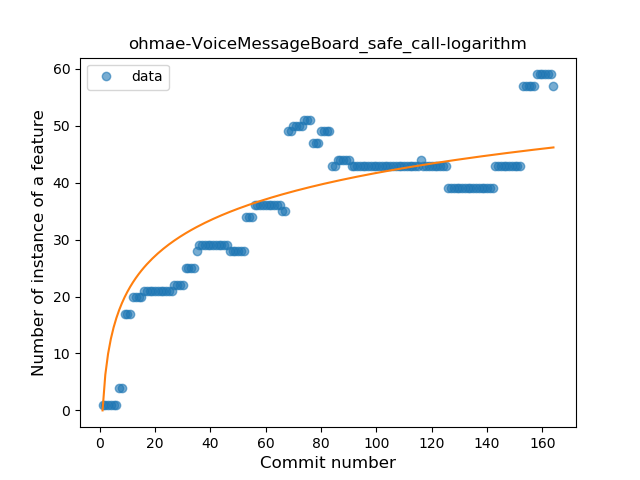

#### ohmae-VoiceMessageBoard
* Feature: Type Inference
* Function: 
* R_Squared: 0.75303385
 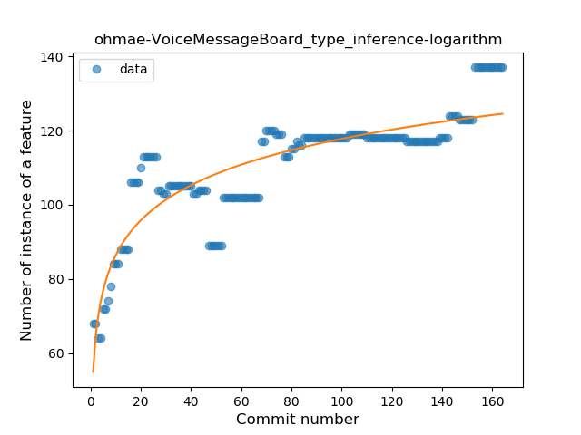

#### joan-domingo-Podcasts-RAC1-Android
* Feature: Type Inference
* Function: 
* R_Squared: 0.7529809
 

#### jeeb-mpv-android
* Feature: Lambda
* Function: 
* R_Squared: 0.74890074
 

#### zeapo-Android-Password-Store
* Feature: String Template
* Function: 
* R_Squared: 0.74800031
 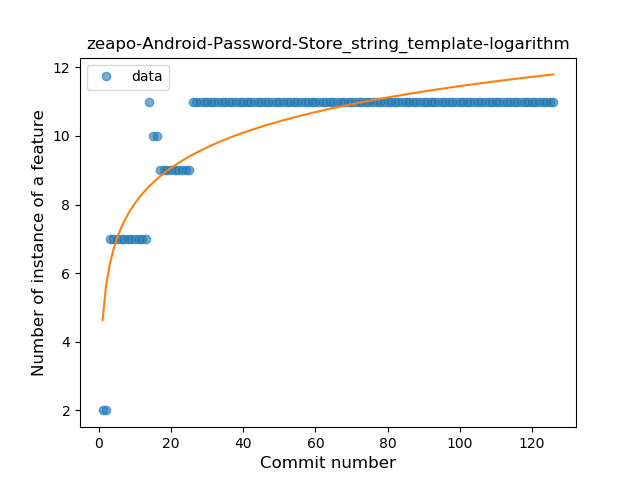

#### ohmae-DmsExplorer
* Feature: Lambda
* Function: 
* R_Squared: 0.74786474
 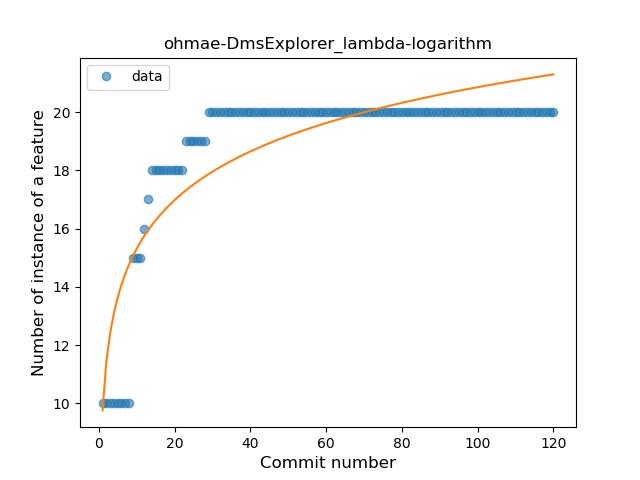

#### LittleLightCz-SheepsGoHome
* Feature: When expression
* Function: 
* R_Squared: 0.74707114
 

#### glodanif-BluetoothChat
* Feature: String Template
* Function: 
* R_Squared: 0.74449544
 

#### sreich-android-count-the-days
* Feature: Function call with Named Argument
* Function: 
* R_Squared: 0.74122644
 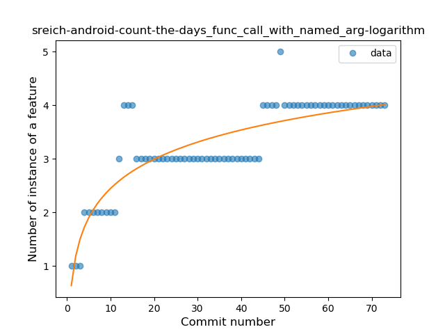

#### Commit451-LabCoat
* Feature: Companion Object
* Function: 
* R_Squared: 0.74038225
 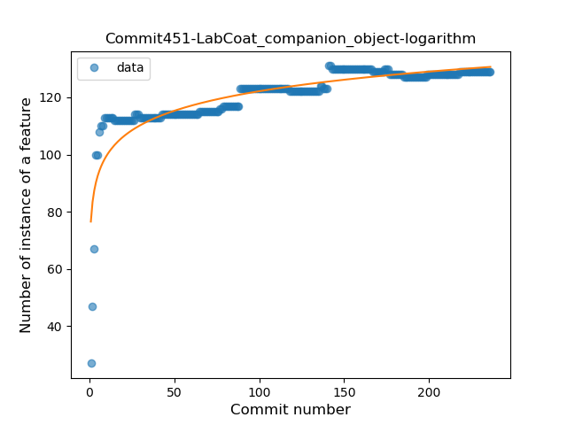

#### emansih-FireflyMobile
* Feature: Property Delegation
* Function: 
* R_Squared: 0.7397301
 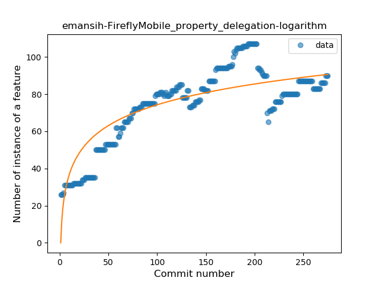

#### erickok-borefts2015
* Feature: Function with Default Value
* Function: 
* R_Squared: 0.73467507
 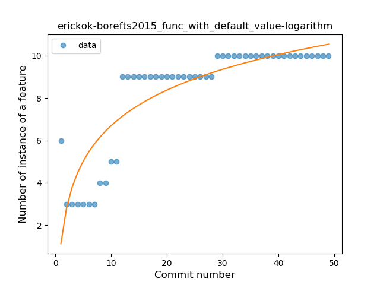

#### LiMium-mini-vector-android
* Feature: Unsafe Call
* Function: 
* R_Squared: 0.73228434
 

#### bubelov-coins-android
* Feature: Function call with Named Argument
* Function: 
* R_Squared: 0.73108441
 

#### syrop-Wiktor-Navigator
* Feature: Type Inference
* Function: 
* R_Squared: 0.72960447
 

#### romannurik-muzei
* Feature: Function with Default Value
* Function: 
* R_Squared: 0.72831155
 

#### MartinStyk-AndroidApkAnalyzer
* Feature: Function with Default Value
* Function: 
* R_Squared: 0.72535883
 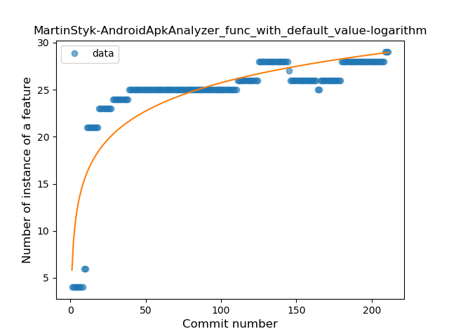

#### klassm-andFHEM
* Feature: Unsafe Call
* Function: 
* R_Squared: 0.72063453
 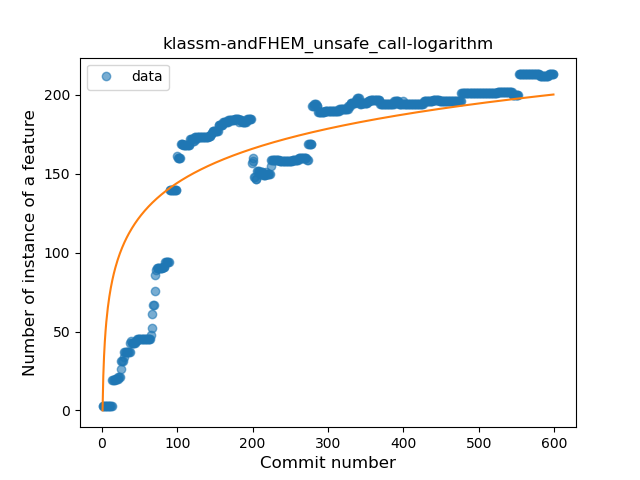

#### ianmcxa-vortaro
* Feature: Safe Call
* Function: 
* R_Squared: 0.71987214
 

#### carlphilipp-chicago-commutes
* Feature: Range Expression
* Function: 
* R_Squared: 0.71575437
 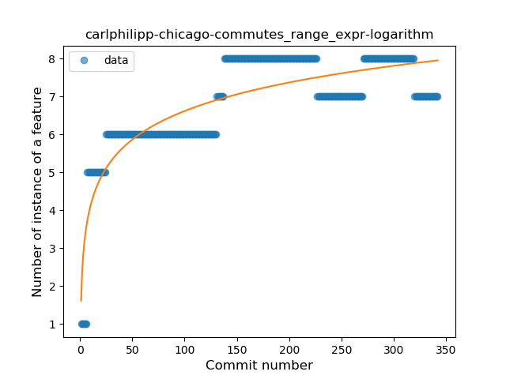

#### juha-h-baresip-studio
* Feature: Lambda
* Function: 
* R_Squared: 0.70794313
 

#### syrop-Wiktor-Navigator
* Feature: Safe Call
* Function: 
* R_Squared: 0.70471749
 

#### PaulWoitaschek-Voice
* Feature: Companion Object
* Function: 
* R_Squared: 0.70226634
 

#### kamgurgul-cpu-info
* Feature: Data Class
* Function: 
* R_Squared: 0.7016786
 

#### hsson-card-balance-app
* Feature: Smart Cast
* Function: 
* R_Squared: 0.6987177
 

#### MartinStyk-AndroidApkAnalyzer
* Feature: Companion Object
* Function: 
* R_Squared: 0.69653346
 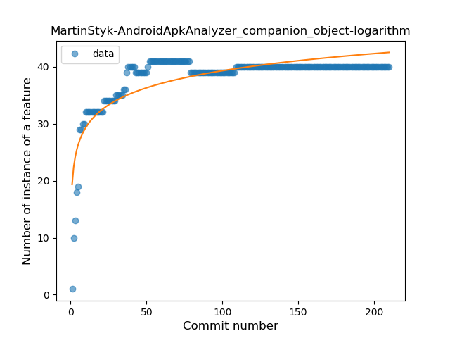

#### devmil-PaperLaunch
* Feature: Singleton
* Function: 
* R_Squared: 0.68779857
 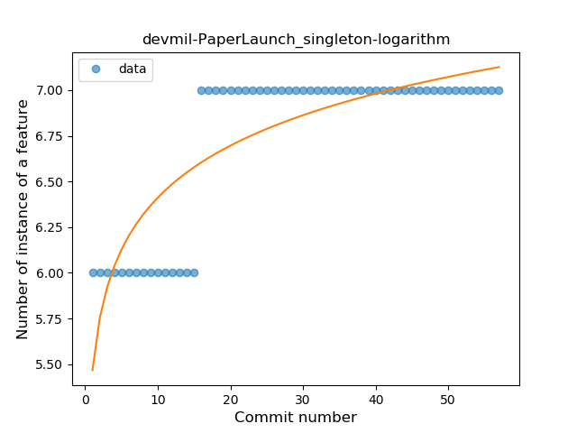

#### citiususc-calendula
* Feature: String Template
* Function: 
* R_Squared: 0.68556744
 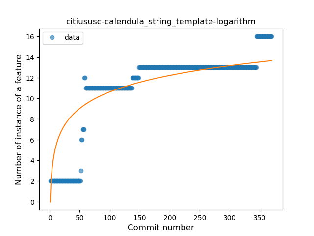

#### emansih-FireflyMobile
* Feature: Safe Call
* Function: 
* R_Squared: 0.68462302
 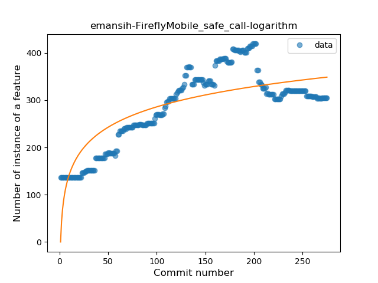

#### wuan-bo-android
* Feature: Range Expression
* Function: 
* R_Squared: 0.68330986
 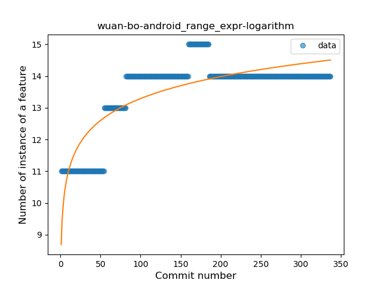

#### arcao-Geocaching4Locus
* Feature: Type Inference
* Function: 
* R_Squared: 0.68224963
 

#### arcao-Geocaching4Locus
* Feature: String Template
* Function: 
* R_Squared: 0.68224963
 

#### danvratil-FBEventSync
* Feature: Smart Cast
* Function: 
* R_Squared: 0.68208396
 

#### iSoron-uhabits
* Feature: Lambda
* Function: 
* R_Squared: 0.67595512
 

#### Commit451-LabCoat
* Feature: When expression
* Function: 
* R_Squared: 0.6739673
 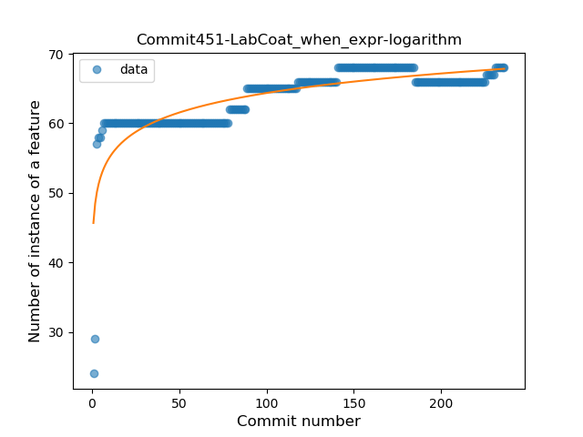

#### pflammertsma-cryptogram
* Feature: Companion Object
* Function: 
* R_Squared: 0.67196177
 

#### orgzly-orgzly-android
* Feature: Destructuring Declaration
* Function: 
* R_Squared: 0.66681739
 

#### EventFahrplan-EventFahrplan
* Feature: Function call with Named Argument
* Function: 
* R_Squared: 0.66527296
 

#### michaelkourlas-voipms-sms-client
* Feature: Type Inference
* Function: 
* R_Squared: 0.66256053
 

#### nicorsm-S3-16-simone
* Feature: Lambda
* Function: 
* R_Squared: 0.66118528
 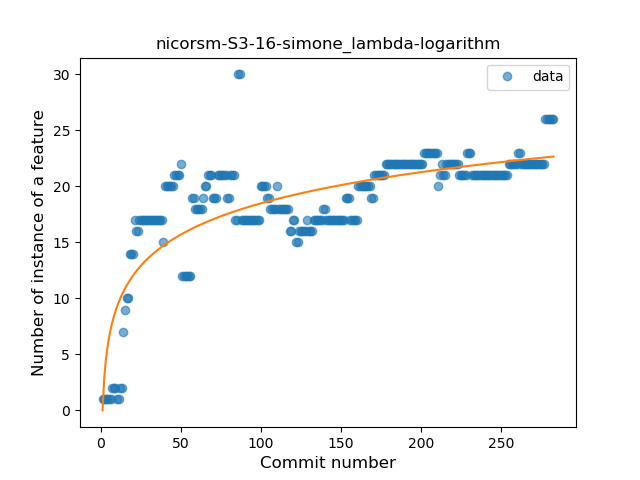

#### ofalvai-BPInfo
* Feature: Range Expression
* Function: 
* R_Squared: 0.6609516
 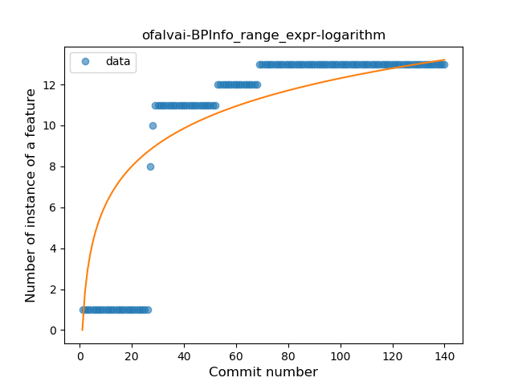

#### hyst329-OpenFool
* Feature: Property Delegation
* Function: 
* R_Squared: 0.65690517
 

#### thaapasa-jalkametri-android
* Feature: String Template
* Function: 
* R_Squared: 0.65669428
 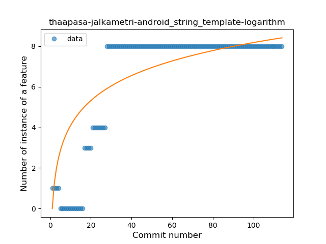

#### MartinStyk-AndroidApkAnalyzer
* Feature: When expression
* Function: 
* R_Squared: 0.65247663
 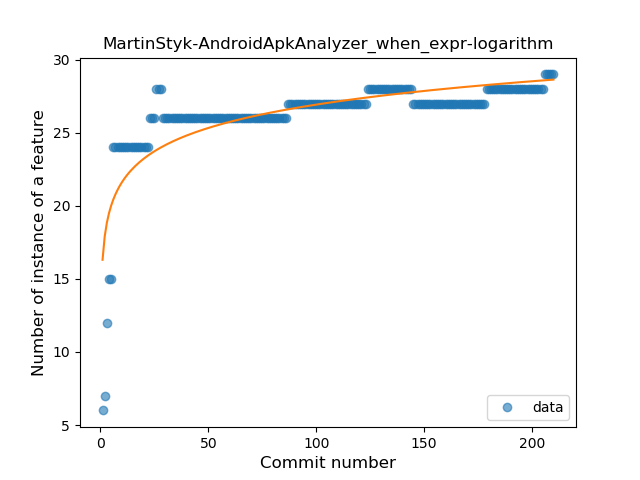

#### mpcjanssen-simpletask-android
* Feature: Type Inference
* Function: 
* R_Squared: 0.6514978
 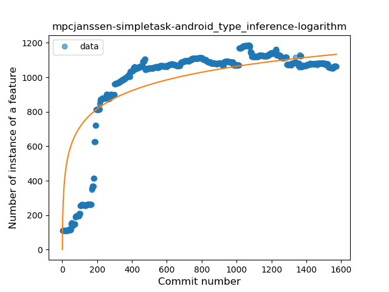

#### PaulWoitaschek-Voice
* Feature: String Template
* Function: 
* R_Squared: 0.64998604
 

#### mpcjanssen-simpletask-android
* Feature: Companion Object
* Function: 
* R_Squared: 0.6483442
 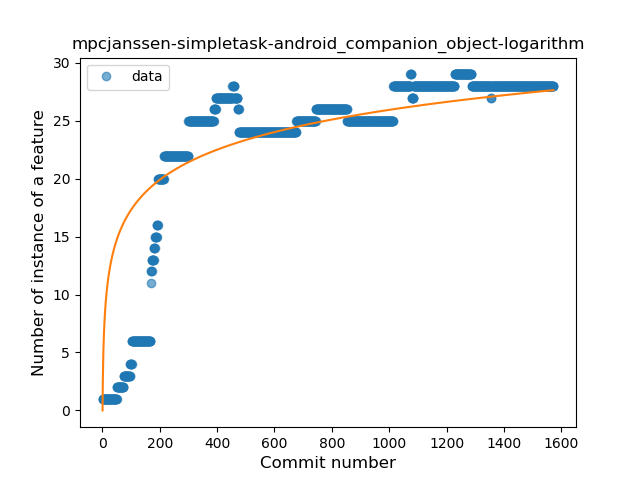

#### mpcjanssen-simpletask-android
* Feature: Function with Default Value
* Function: 
* R_Squared: 0.64494447
 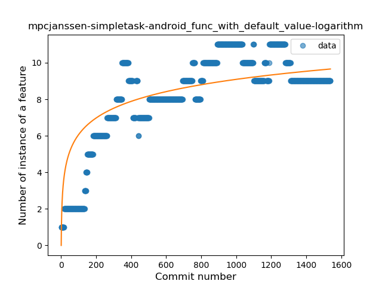

#### alessio-b-zak-myRivers
* Feature: Unsafe Call
* Function: 
* R_Squared: 0.64402947
 

#### kamgurgul-cpu-info
* Feature: When expression
* Function: 
* R_Squared: 0.63061457
 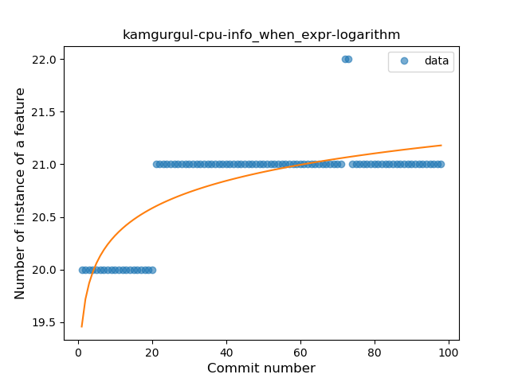

#### darshanparajuli-LogcatReader
* Feature: Extension Function
* Function: 
* R_Squared: 0.62906878
 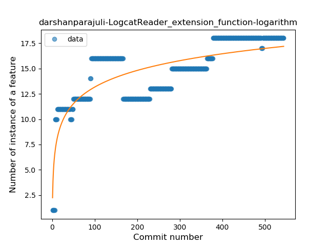

#### yshrsmz-monotweety
* Feature: When expression
* Function: 
* R_Squared: 0.62797303
 

#### blastrock-kaqui
* Feature: Companion Object
* Function: 
* R_Squared: 0.62308383
 

#### MartinStyk-AndroidApkAnalyzer
* Feature: Smart Cast
* Function: 
* R_Squared: 0.62288383
 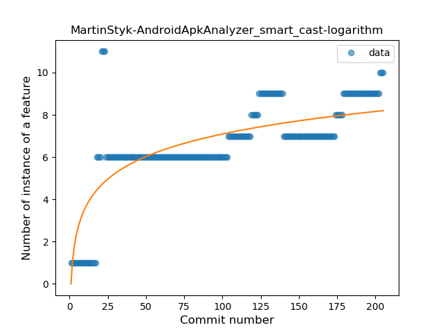

#### iSoron-uhabits
* Feature: Type Inference
* Function: 
* R_Squared: 0.62048177
 

#### walleth-walleth
* Feature: Companion Object
* Function: 
* R_Squared: 0.61435737
 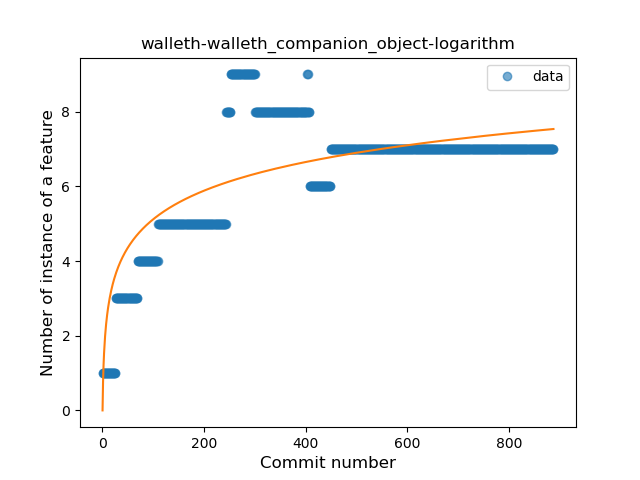

#### glodanif-BluetoothChat
* Feature: Function call with Named Argument
* Function: 
* R_Squared: 0.61298604
 

#### joan-domingo-Podcasts-RAC1-Android
* Feature: Property Delegation
* Function: 
* R_Squared: 0.60073696
 

#### calintat-units
* Feature: Safe Call
* Function: 
* R_Squared: 0.59732605
 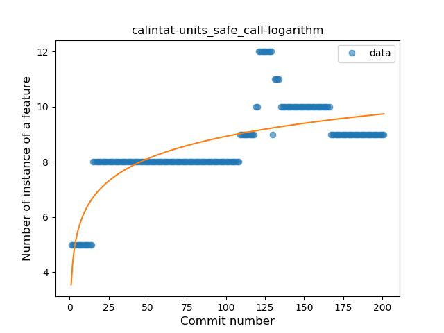

#### charlesmadere-smash-ranks-android
* Feature: Smart Cast
* Function: 
* R_Squared: 0.59472974
 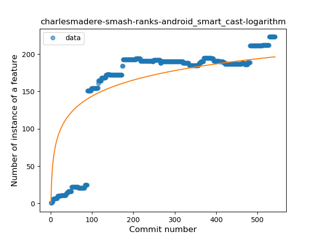

#### ligi-SurvivalManual
* Feature: Safe Call
* Function: 
* R_Squared: 0.59404083
 

#### NyaaPantsu-NyaaPantsu-android-app
* Feature: Unsafe Call
* Function: 
* R_Squared: 0.58352884
 

#### calintat-sensors
* Feature: Safe Call
* Function: 
* R_Squared: 0.58131562
 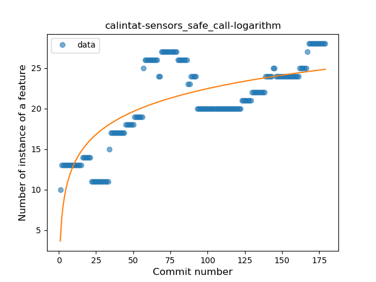

#### romannurik-muzei
* Feature: Range Expression
* Function: 
* R_Squared: 0.58025456
 

#### bubelov-coins-android
* Feature: Safe Call
* Function: 
* R_Squared: 0.56479622
 

#### pacien-tincapp
* Feature: Safe Call
* Function: 
* R_Squared: 0.55699922
 

#### eurofurence-ef-app_android
* Feature: Data Class
* Function: 
* R_Squared: 0.54804821
 

#### apiote-Bimba
* Feature: String Template
* Function: 
* R_Squared: 0.53967307
 

#### ligi-IPFSDroid
* Feature: String Template
* Function: 
* R_Squared: 0.53418097
 

#### vector-im-riot-android
* Feature: Unsafe Call
* Function: 
* R_Squared: 0.53306165
 

#### AllanWang-Frost-for-Facebook
* Feature: Unsafe Call
* Function: 
* R_Squared: 0.52332727
 

#### Streetwalrus-android_usb_msd
* Feature: Unsafe Call
* Function: 
* R_Squared: 0.51324379
 

#### LiMium-mini-vector-android
* Feature: Property Delegation
* Function: 
* R_Squared: 0.51008268
 

#### equeim-tremotesf-android
* Feature: Safe Call
* Function: 
* R_Squared: 0.49370812
 

#### joan-domingo-Podcasts-RAC1-Android
* Feature: Unsafe Call
* Function: 
* R_Squared: 0.48493864
 

#### ronocod-bus
* Feature: Property Delegation
* Function: 
* R_Squared: 0.47505126
 

#### jidogoon-RoundedScreen
* Feature: Safe Call
* Function: 
* R_Squared: 0.4650082
 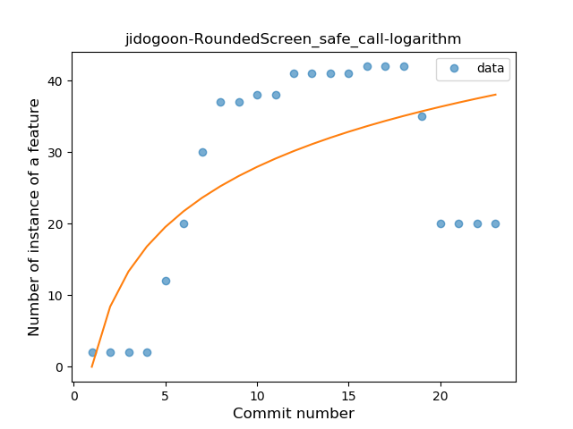

#### bubelov-coins-android
* Feature: Companion Object
* Function: 
* R_Squared: 0.45688475
 

#### SimpleMobileTools-Simple-Calculator
* Feature: When expression
* Function: 
* R_Squared: 0.45330546
 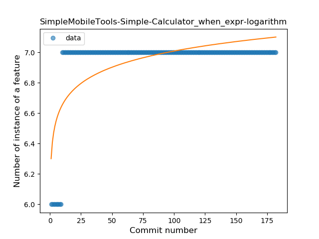

#### iSoron-uhabits
* Feature: When expression
* Function: 
* R_Squared: 0.45082321
 

#### MartinStyk-AndroidApkAnalyzer
* Feature: Type Inference
* Function: 
* R_Squared: 0.44960566
 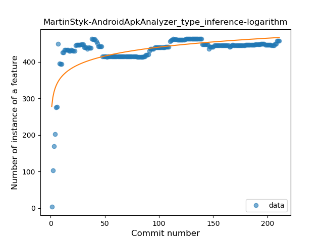

#### kirimin-mitsumine
* Feature: Type Inference
* Function: 
* R_Squared: 0.4455058
 

#### MartinStyk-AndroidApkAnalyzer
* Feature: Singleton
* Function: 
* R_Squared: 0.43456749
 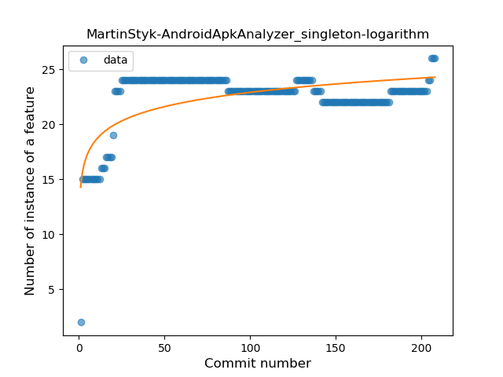

#### Commit451-LabCoat
* Feature: Unsafe Call
* Function: 
* R_Squared: 0.41935683
 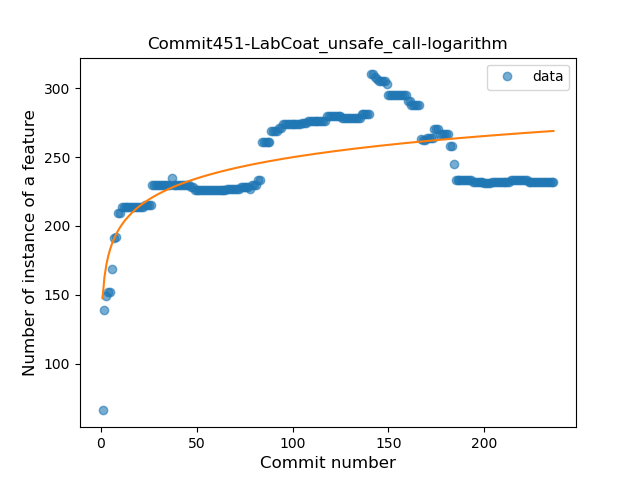

#### bitfireAT-davdroid
* Feature: Singleton
* Function: 
* R_Squared: 0.41037501
 

#### SimpleMobileTools-Simple-File-Manager
* Feature: Function call with Named Argument
* Function: 
* R_Squared: 0.40417118
 

#### MartinStyk-AndroidApkAnalyzer
* Feature: Function call with Named Argument
* Function: 
* R_Squared: 0.3975907
 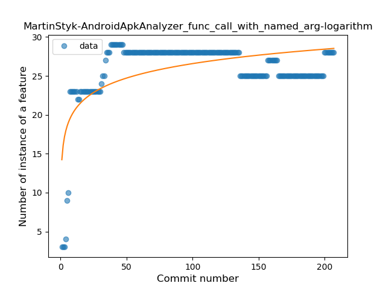

#### walleth-walleth
* Feature: Range Expression
* Function: 
* R_Squared: 0.39341017
 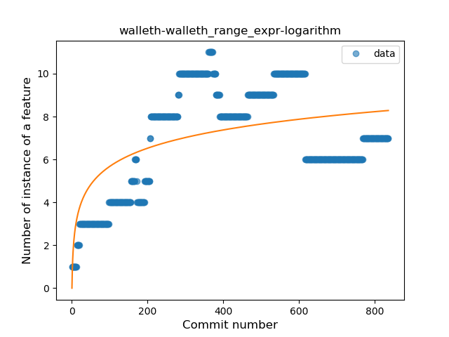

#### ids1024-whitakers-words-android
* Feature: Type Inference
* Function: 
* R_Squared: 0.39218785
 

#### peppercarrot-e-reader
* Feature: Safe Call
* Function: 
* R_Squared: 0.39120261
 

#### romannurik-muzei
* Feature: Singleton
* Function: 
* R_Squared: 0.38648367
 

#### herbeth1u-VNDB-Android
* Feature: Overloaded Operator
* Function: 
* R_Squared: 0.38646888
 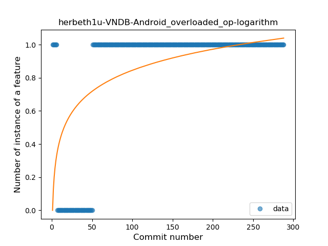

#### mpcjanssen-simpletask-android
* Feature: Range Expression
* Function: 
* R_Squared: 0.36426457
 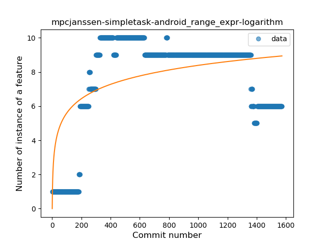

#### carlphilipp-chicago-commutes
* Feature: When expression
* Function: 
* R_Squared: 0.34312703
 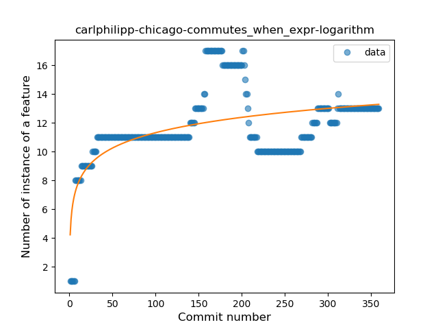

#### SimpleMobileTools-Simple-Music-Player
* Feature: String Template
* Function: 
* R_Squared: 0.33107128
 

#### kirimin-mitsumine
* Feature: Lambda
* Function: 
* R_Squared: 0.32416214
 

#### spacecowboy-Feeder
* Feature: Extension Function
* Function: 
* R_Squared: 0.31669163
 

#### pflammertsma-cryptogram
* Feature: Unsafe Call
* Function: 
* R_Squared: 0.28239789
 

#### ofalvai-BPInfo
* Feature: Unsafe Call
* Function: 
* R_Squared: 0.26568767
 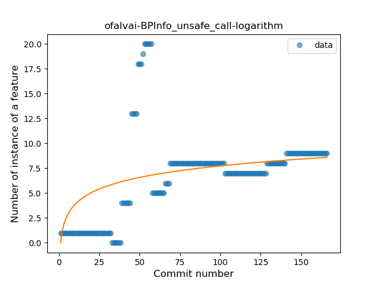

#### SimpleMobileTools-Simple-App-Launcher
* Feature: String Template
* Function: 
* R_Squared: 0.25643575
 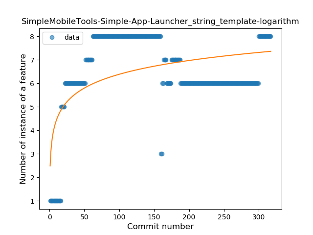

#### pflammertsma-cryptogram
* Feature: String Template
* Function: 
* R_Squared: 0.25375024
 

#### kamgurgul-cpu-info
* Feature: Smart Cast
* Function: 
* R_Squared: 0.24971543
 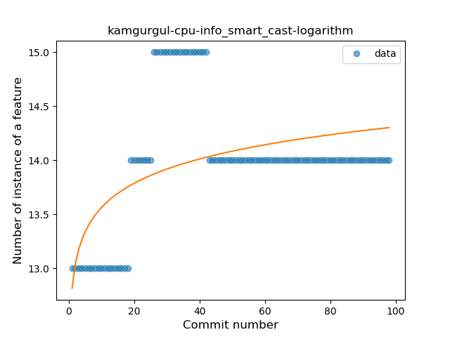

#### exviva-stew
* Feature: Safe Call
* Function: 
* R_Squared: 0.24136864
 

#### bnlrnz-MandelGL
* Feature: Unsafe Call
* Function: 
* R_Squared: 0.2375354
 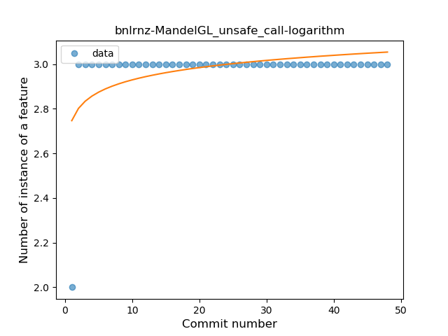

#### ligi-FAST
* Feature: Type Inference
* Function: 
* R_Squared: 0.23486597
 

#### raatmarien-red-moon
* Feature: Companion Object
* Function: 
* R_Squared: 0.20438713
 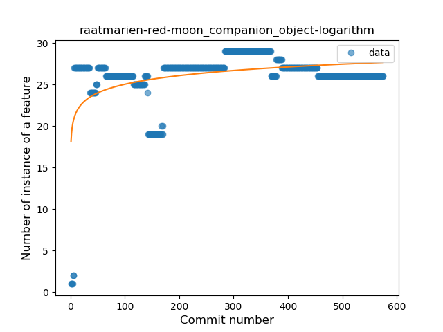

#### LISTEN-moe-android-app
* Feature: Data Class
* Function: 
* R_Squared: 0.18795156
 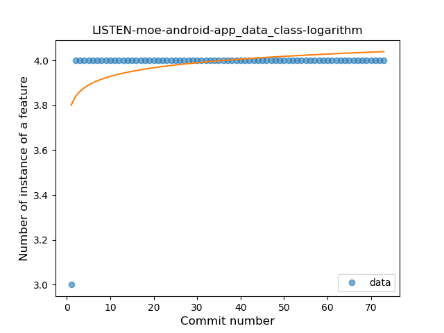

#### raatmarien-red-moon
* Feature: Inline Function
* Function: 
* R_Squared: 0.18550382
 

#### MartinStyk-AndroidApkAnalyzer
* Feature: Data Class
* Function: 
* R_Squared: 0.18506003
 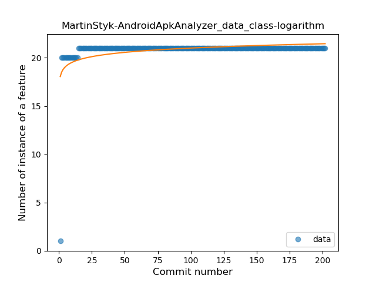

#### zeapo-Android-Password-Store
* Feature: When expression
* Function: 
* R_Squared: 0.17974661
 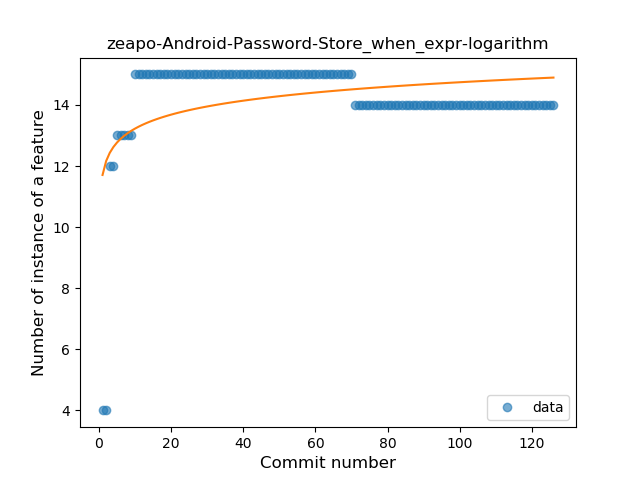

#### LISTEN-moe-android-app
* Feature: Smart Cast
* Function: 
* R_Squared: 0.17585611
 

#### openium-auvergne-webcams-droid
* Feature: Extension Function
* Function: 
* R_Squared: 0.17522967
 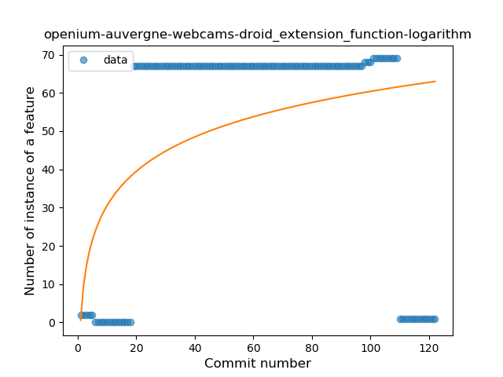

#### ronocod-bus
* Feature: Data Class
* Function: 
* R_Squared: 0.15822756
 

#### WYKCode-WYK-Android
* Feature: Lambda
* Function: 
* R_Squared: 0.14567775
 

#### SimpleMobileTools-Simple-Flashlight
* Feature: When expression
* Function: 
* R_Squared: 0.12782397
 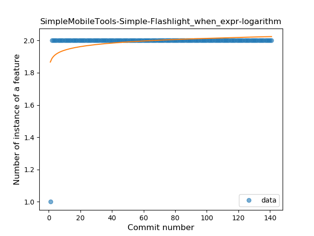

#### dkrivoruchko-ScreenStream
* Feature: Destructuring Declaration
* Function: 
* R_Squared: 0.12736666
 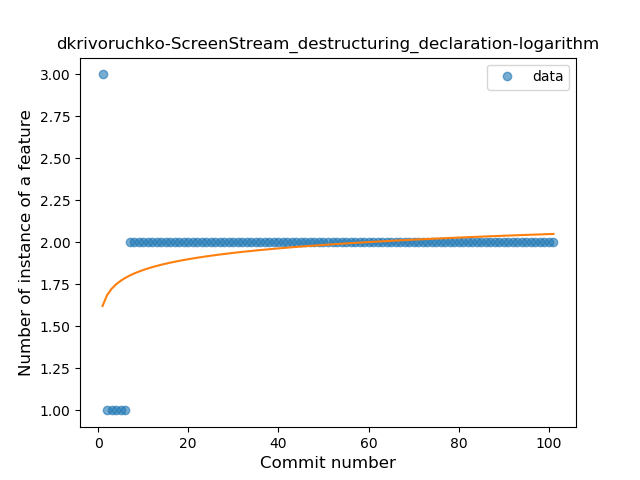

#### apiote-Bimba
* Feature: Safe Call
* Function: 
* R_Squared: 0.12209504
 

#### Waboodoo-HTTP-Shortcuts
* Feature: Range Expression
* Function: 
* R_Squared: 0.11773176
 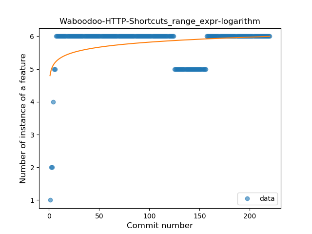

#### openium-auvergne-webcams-droid
* Feature: Inline Function
* Function: 
* R_Squared: 0.09915317
 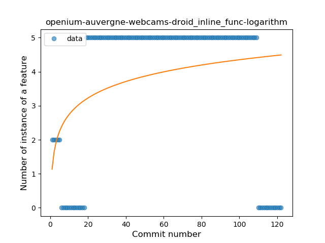

#### ofalvai-BPInfo
* Feature: Function call with Named Argument
* Function: 
* R_Squared: 0.0872357
 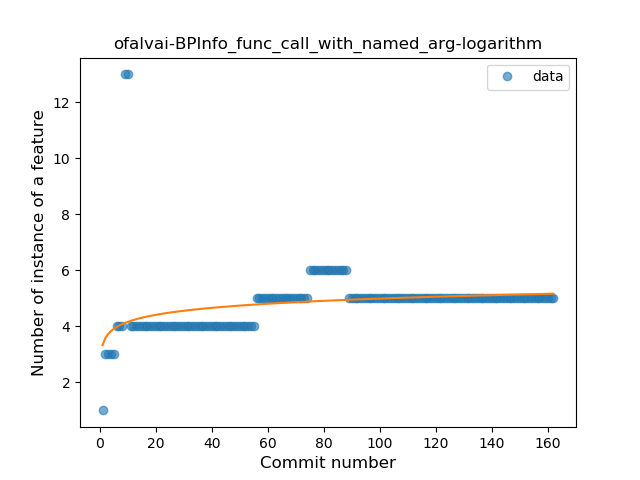

#### Commit451-LabCoat
* Feature: Smart Cast
* Function: 
* R_Squared: 0.06936857
 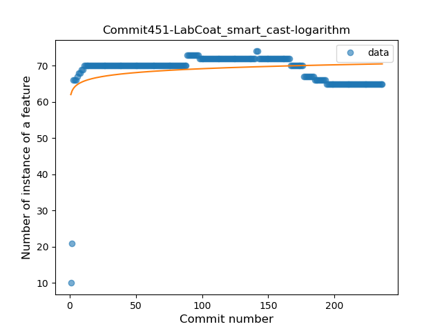

#### thanksmister-androidthings-mqtt-alarm-panel
* Feature: Unsafe Call
* Function: 
* R_Squared: 0.06755931
 

#### carlphilipp-chicago-commutes
* Feature: Unsafe Call
* Function: 
* R_Squared: 0.06089851
 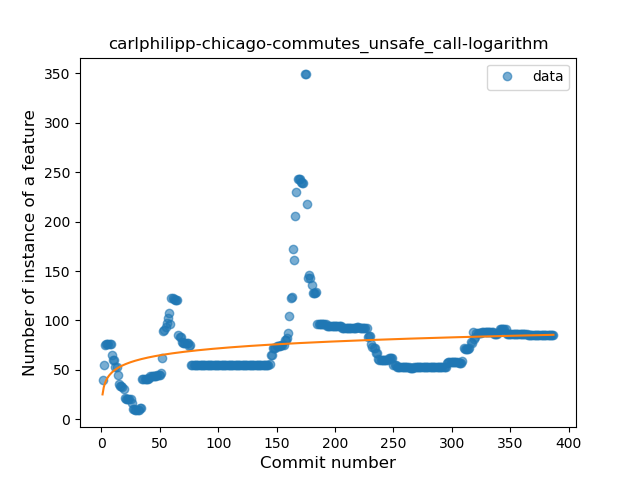

#### NyaaPantsu-NyaaPantsu-android-app
* Feature: Safe Call
* Function: 
* R_Squared: 0.0588925
 

#### LittleLightCz-SheepsGoHome
* Feature: Singleton
* Function: 
* R_Squared: 0.05401663
 

#### WYKCode-WYK-Android
* Feature: Type Inference
* Function: 
* R_Squared: 0.04637488
 

#### SimpleMobileTools-Simple-Notes
* Feature: String Template
* Function: 
* R_Squared: 0.04458909
 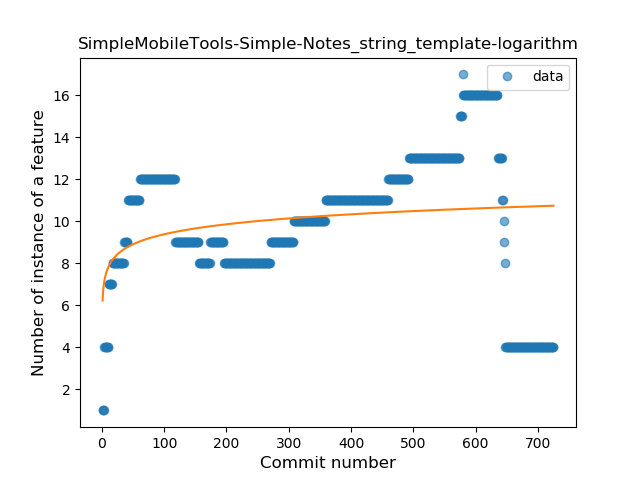

#### impalex-knockonports
* Feature: Extension Function
* Function: 
* R_Squared: 0.0430861
 

#### Waboodoo-HTTP-Shortcuts
* Feature: Smart Cast
* Function: 
* R_Squared: 0.04228338
 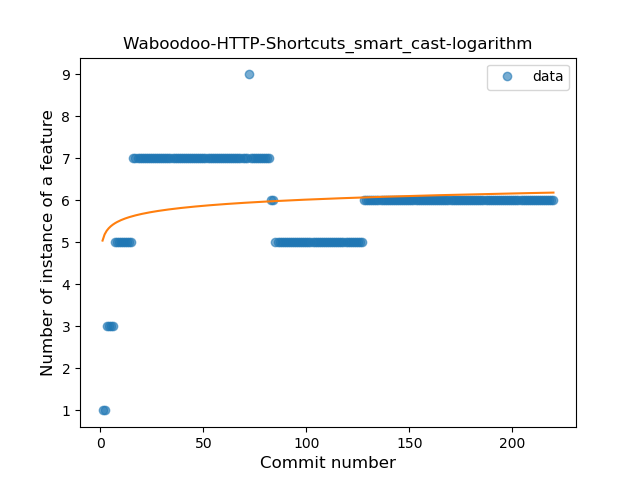

#### fossasia-open-event-android
* Feature: Companion Object
* Function: 
* R_Squared: 0.03110378
 

#### LISTEN-moe-android-app
* Feature: When expression
* Function: 
* R_Squared: 0.03022781
 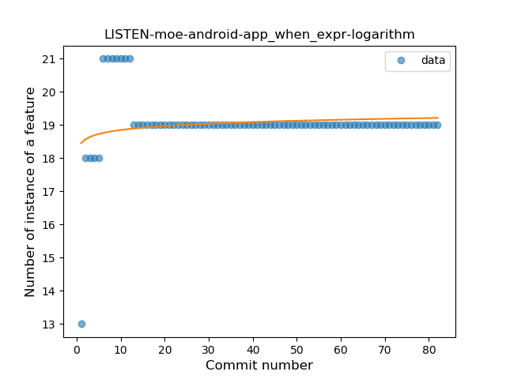

#### glodanif-BluetoothChat
* Feature: Singleton
* Function: 
* R_Squared: 0.01349451
 

