## Sudden Rise Plateau
----
**442** best fit

#### moe-feng-nhentai
* Feature: Lambda
* Function: 
* R_Squared: 0.95278781
 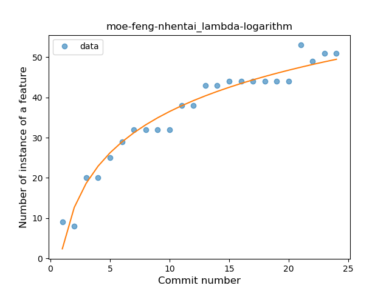

#### com-simplemobiletools-draw
* Feature: Type Inference
* Function: 
* R_Squared: 0.94966829
 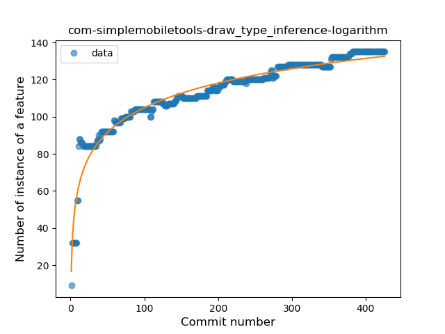

#### com-simplemobiletools-draw-pro
* Feature: Type Inference
* Function: 
* R_Squared: 0.94966829
 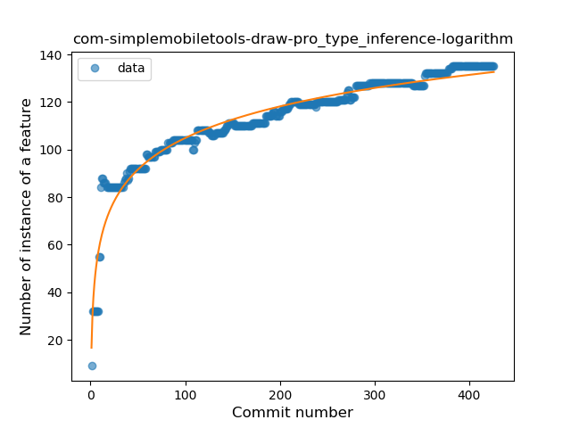

#### de-r4md4c-gamedealz
* Feature: Data Class
* Function: 
* R_Squared: 0.94596433
 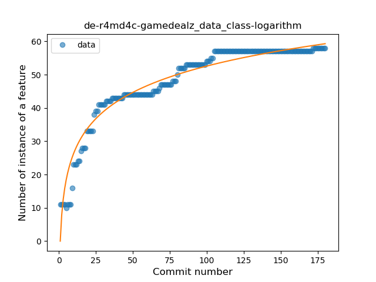

#### com-etesync-syncadapter
* Feature: Lambda
* Function: 
* R_Squared: 0.94394927
 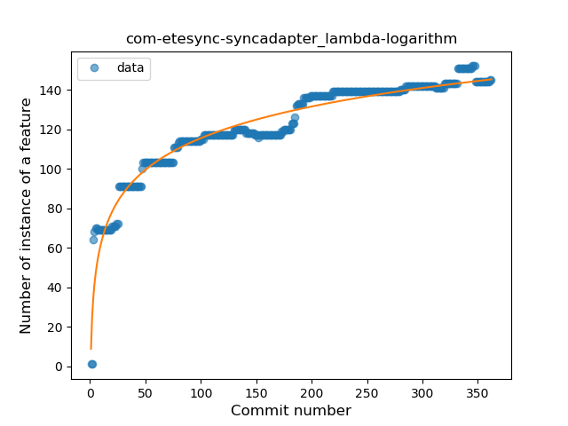

#### nl-brouwerijdemolen-borefts2013
* Feature: Lambda
* Function: 
* R_Squared: 0.94116589
 

#### de-r4md4c-gamedealz
* Feature: Function with Default Value
* Function: 
* R_Squared: 0.93820532
 

#### com-etesync-syncadapter
* Feature: When expression
* Function: 
* R_Squared: 0.93054037
 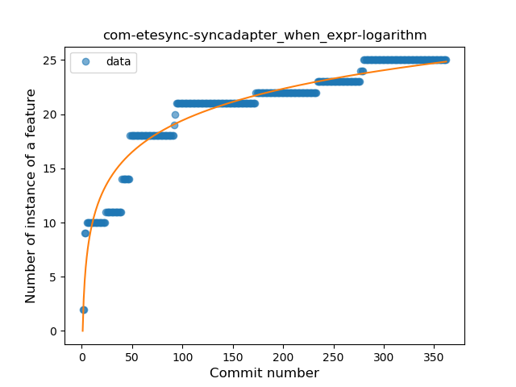

#### com-etesync-syncadapter
* Feature: String Template
* Function: 
* R_Squared: 0.92985984
 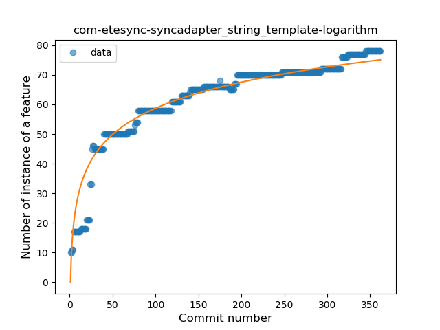

#### io-github-z3r0c00l
* Feature: Lambda
* Function: 
* R_Squared: 0.92971843
 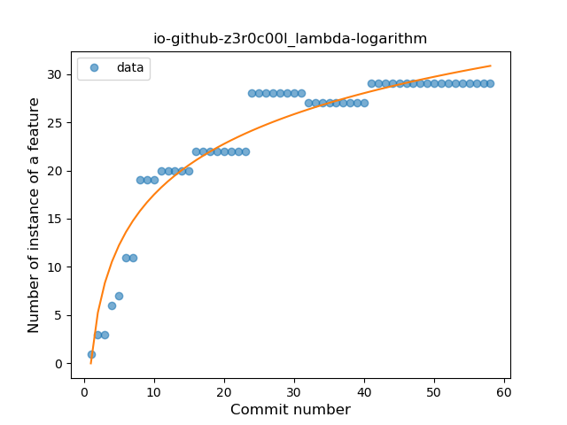

#### se-barsk-park
* Feature: Range Expression
* Function: 
* R_Squared: 0.92967439
 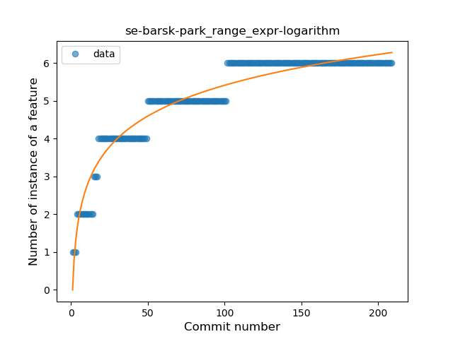

#### com-stevenschoen-putionew
* Feature: When expression
* Function: 
* R_Squared: 0.92955875
 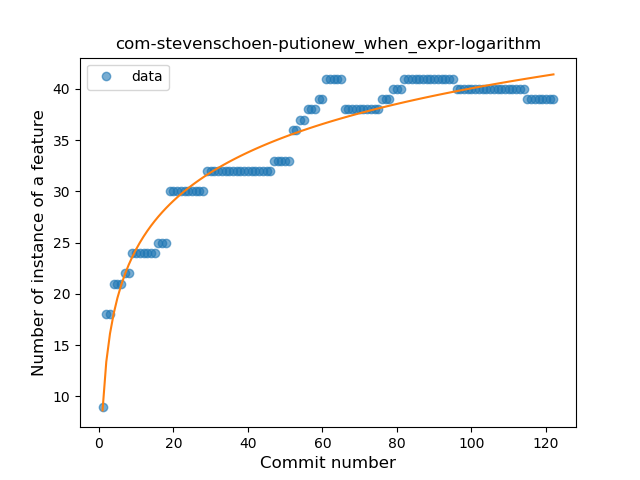

#### de-csicar-mensaplan
* Feature: Safe Call
* Function: 
* R_Squared: 0.92702045
 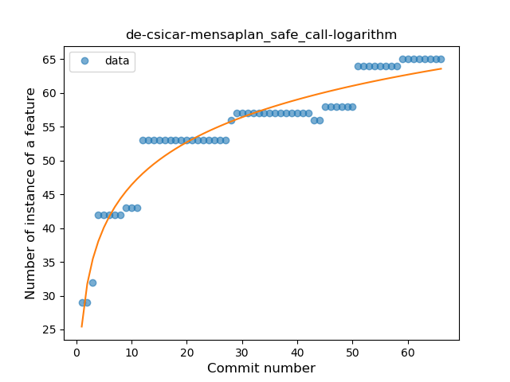

#### io-github-wulkanowy
* Feature: Extension Function
* Function: 
* R_Squared: 0.92503433
 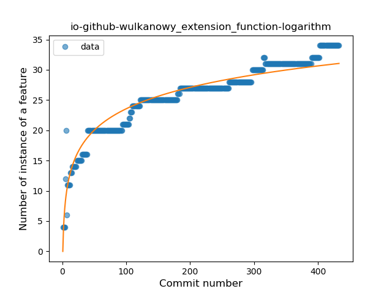

#### io-github-fvasco-pinpoi
* Feature: Lambda
* Function: 
* R_Squared: 0.92468629
 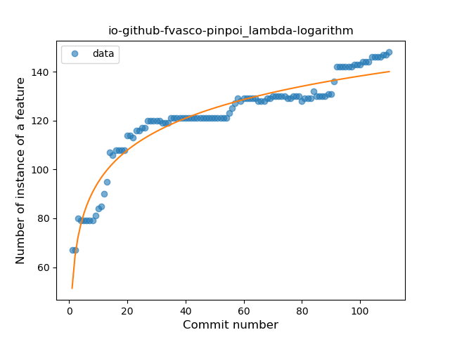

#### io-github-wulkanowy
* Feature: Function with Default Value
* Function: 
* R_Squared: 0.92188084
 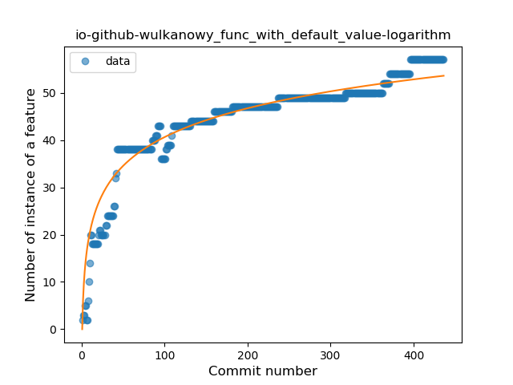

#### eu-depau-etchdroid
* Feature: Type Inference
* Function: 
* R_Squared: 0.92176587
 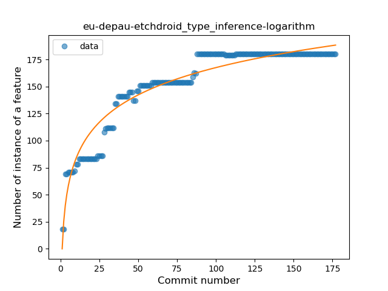

#### com-guardafilme
* Feature: Type Inference
* Function: 
* R_Squared: 0.9208083
 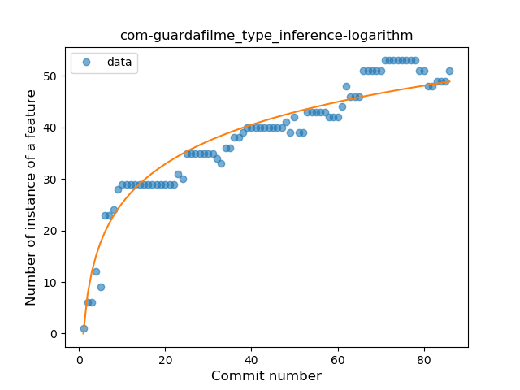

#### me-barta-stayintouch
* Feature: Lambda
* Function: 
* R_Squared: 0.92002637
 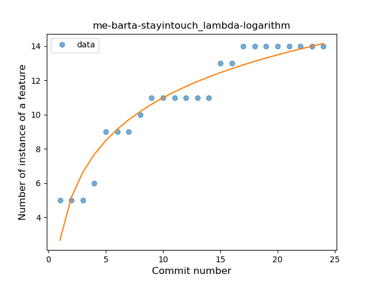

#### com-systemallica-valenbisi
* Feature: Lambda
* Function: 
* R_Squared: 0.91997603
 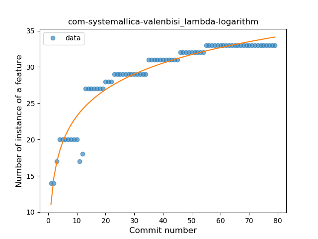

#### net-stew-stew
* Feature: Lambda
* Function: 
* R_Squared: 0.91798956
 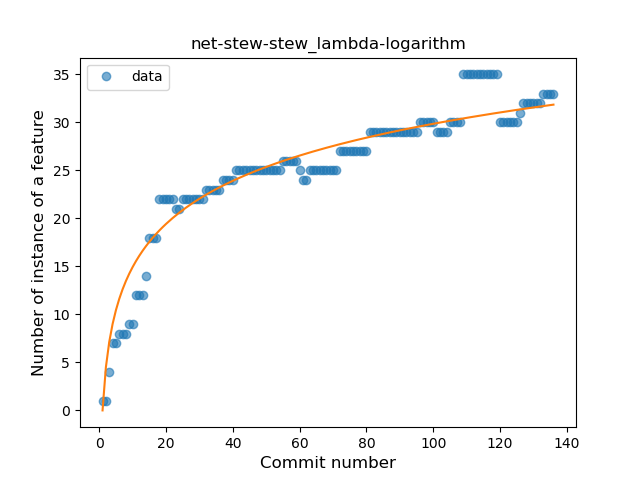

#### moe-feng-nhentai
* Feature: Safe Call
* Function: 
* R_Squared: 0.91796526
 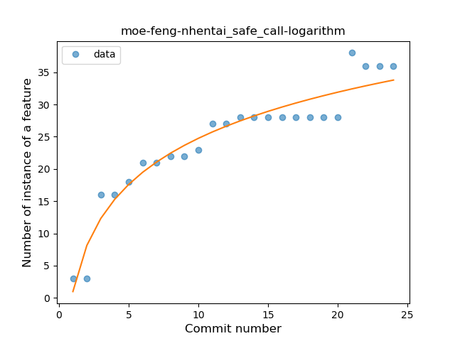

#### com-androidheads-vienna-escalero
* Feature: String Template
* Function: 
* R_Squared: 0.91523438
 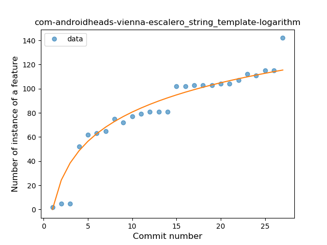

#### es-danirod-rectball-android
* Feature: Lambda
* Function: 
* R_Squared: 0.91400752
 

#### com-androidheads-vienna-escalero
* Feature: Type Inference
* Function: 
* R_Squared: 0.9116435
 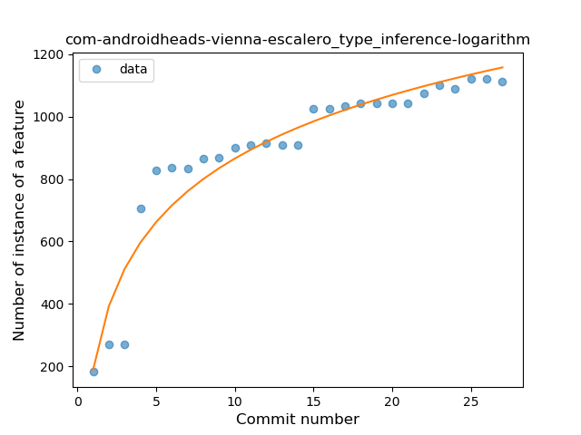

#### com-github-fields-electric
* Feature: Type Inference
* Function: 
* R_Squared: 0.90857602
 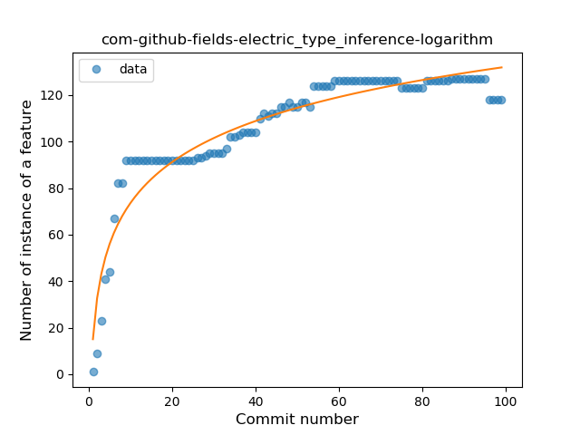

#### cz-dvratil-fbeventsync
* Feature: String Template
* Function: 
* R_Squared: 0.90747554
 

#### com-motion-stage1
* Feature: Singleton
* Function: 
* R_Squared: 0.90565599
 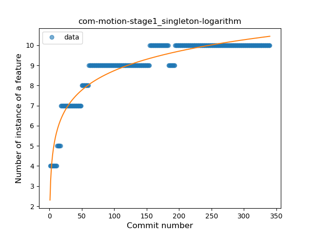

#### com-whiterabbit-pisabike
* Feature: Safe Call
* Function: 
* R_Squared: 0.90543143
 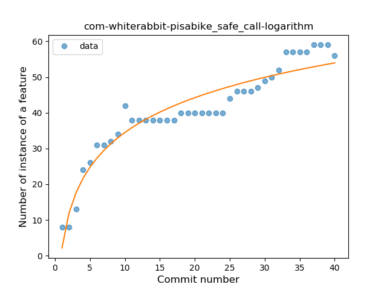

#### org-isoron-uhabits
* Feature: Data Class
* Function: 
* R_Squared: 0.90148259
 

#### ca-rmen-android-poetassistant
* Feature: When expression
* Function: 
* R_Squared: 0.89757571
 

#### com-nao20010128nao-DroidComplex
* Feature: Extension Function
* Function: 
* R_Squared: 0.89740522
 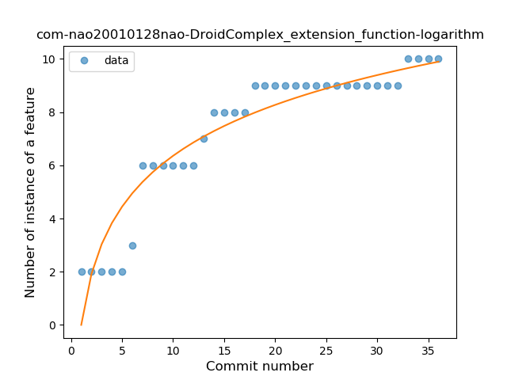

#### info-metadude-android-congress-schedule
* Feature: String Template
* Function: 
* R_Squared: 0.89696257
 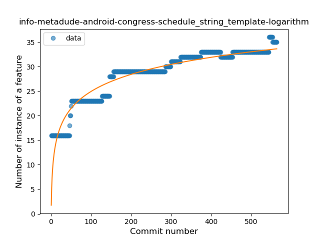

#### de-devmil-paperlaunch
* Feature: Type Inference
* Function: 
* R_Squared: 0.89594467
 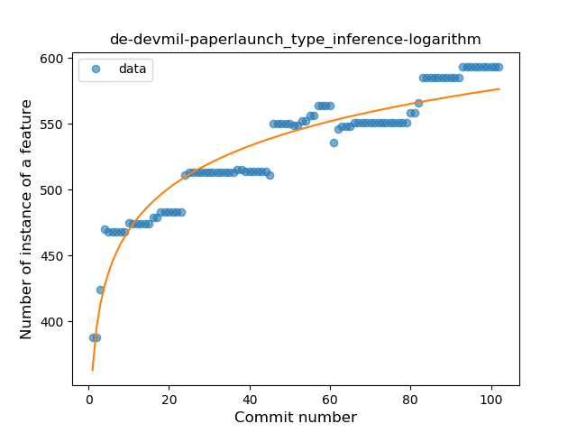

#### org-blitzortung-android-app
* Feature: Lambda
* Function: 
* R_Squared: 0.89424666
 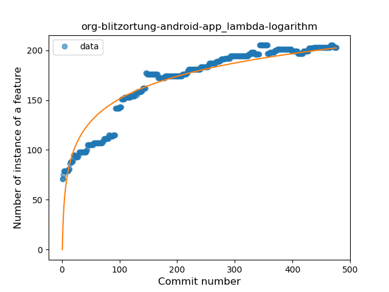

#### com-commit451-gitlab
* Feature: Type Inference
* Function: 
* R_Squared: 0.89207459
 

#### com-arcao-geocaching4locus
* Feature: When expression
* Function: 
* R_Squared: 0.89200481
 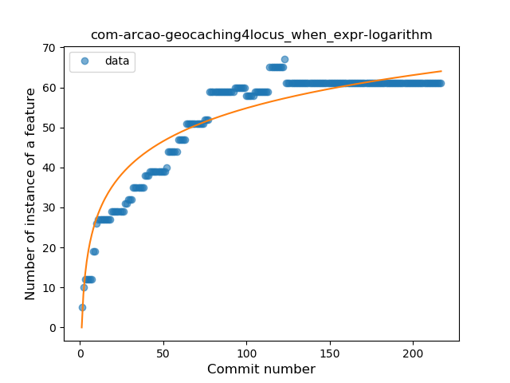

#### fi-tuska-jalkametri
* Feature: Singleton
* Function: 
* R_Squared: 0.89049344
 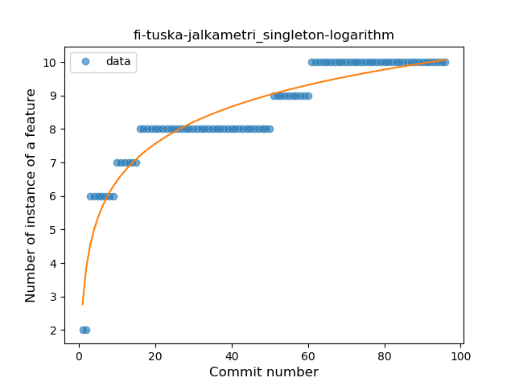

#### com-ianhanniballake-localstorage
* Feature: Safe Call
* Function: 
* R_Squared: 0.88959438
 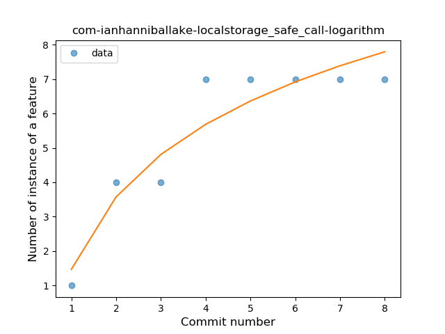

#### org-weilbach-splitbills
* Feature: Lambda
* Function: 
* R_Squared: 0.88883302
 

#### org-weilbach-splitbills
* Feature: Safe Call
* Function: 
* R_Squared: 0.88807343
 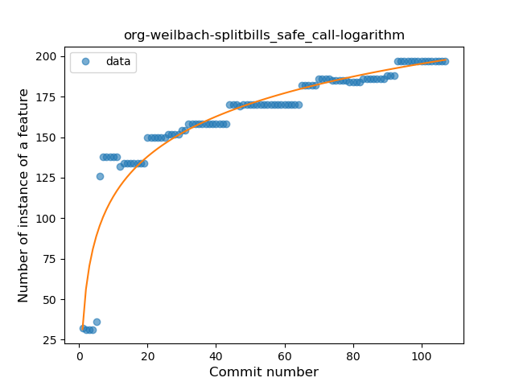

#### com-simplemobiletools-calculator
* Feature: Lambda
* Function: 
* R_Squared: 0.88570487
 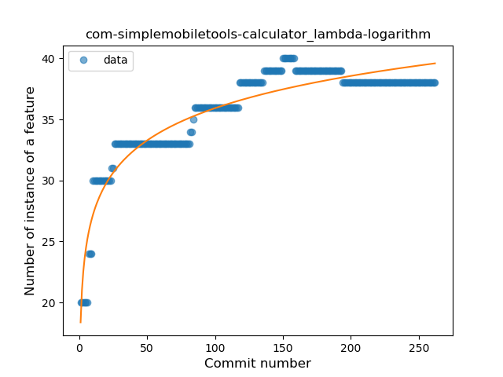

#### at-bitfire-davdroid
* Feature: Lambda
* Function: 
* R_Squared: 0.88476999
 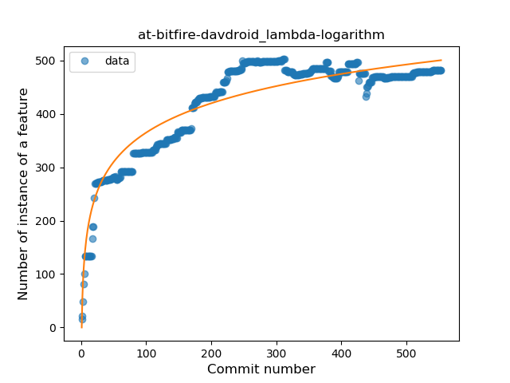

#### fr-insapp-insapp
* Feature: Safe Call
* Function: 
* R_Squared: 0.88378919
 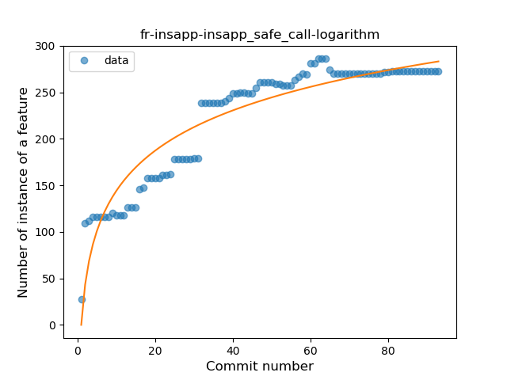

#### jp-org-example-geckour-glyph
* Feature: Extension Function
* Function: 
* R_Squared: 0.88287052
 

#### com-guardafilme
* Feature: Companion Object
* Function: 
* R_Squared: 0.8826398
 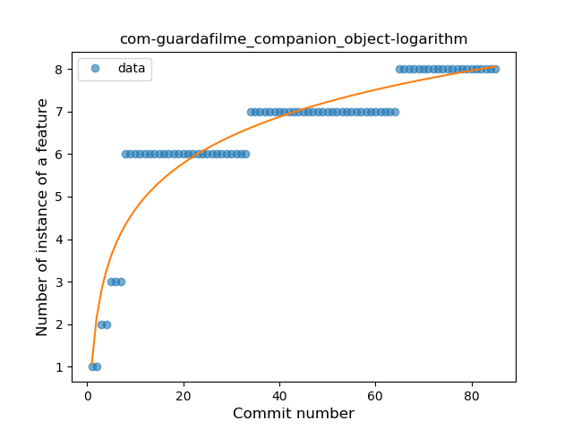

#### xyz-hisname-fireflyiii
* Feature: Data Class
* Function: 
* R_Squared: 0.8822733
 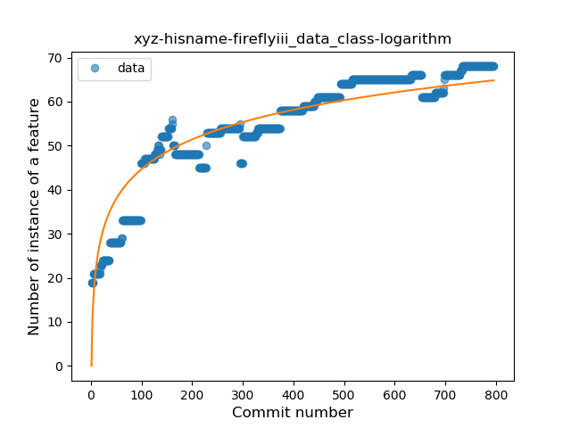

#### net-yslibrary-monotweety
* Feature: Smart Cast
* Function: 
* R_Squared: 0.88083061
 

#### com-ianhanniballake-contractiontimer
* Feature: Safe Call
* Function: 
* R_Squared: 0.88055367
 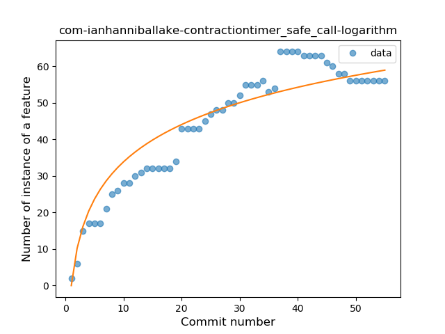

#### com-booboot-vndbandroid
* Feature: String Template
* Function: 
* R_Squared: 0.88039372
 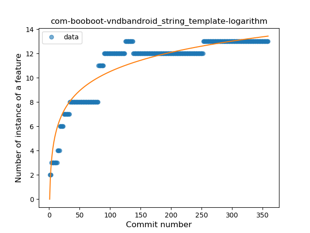

#### eu-kanade-tachiyomi
* Feature: Companion Object
* Function: 
* R_Squared: 0.87987238
 

#### de-thecode-android-tazreader
* Feature: Function with Default Value
* Function: 
* R_Squared: 0.87968441
 

#### net-bible-android-activity
* Feature: Function call with Named Argument
* Function: 
* R_Squared: 0.87836078
 

#### com-nao20010128nao-DroidComplex
* Feature: Lambda
* Function: 
* R_Squared: 0.87779987
 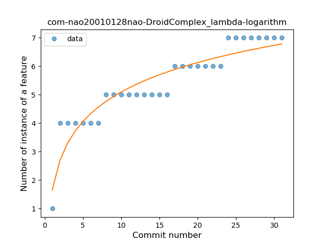

#### nl-brouwerijdemolen-borefts2013
* Feature: Coroutine
* Function: 
* R_Squared: 0.87664243
 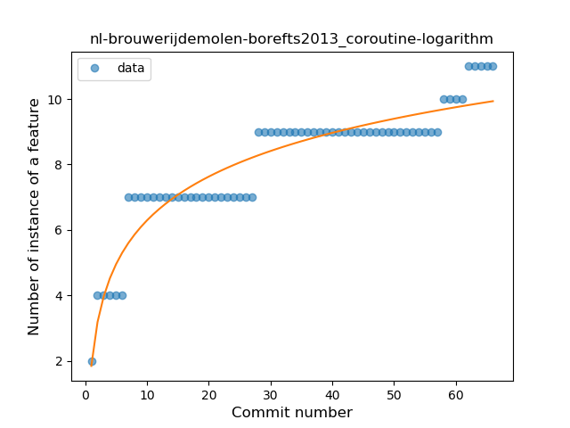

#### org-pacien-tincapp
* Feature: Singleton
* Function: 
* R_Squared: 0.87617956
 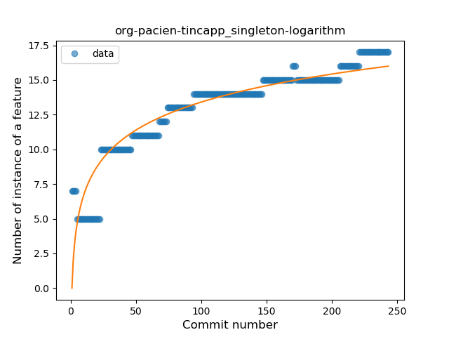

#### eu-depau-etchdroid
* Feature: Extension Function
* Function: 
* R_Squared: 0.87612881
 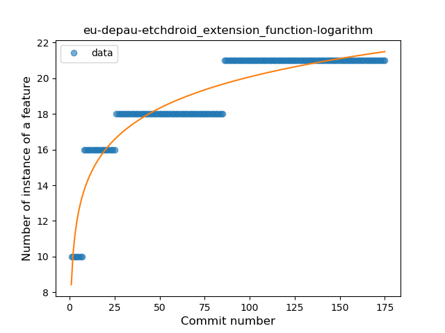

#### fr-xgouchet-packageexplorer
* Feature: Safe Call
* Function: 
* R_Squared: 0.87591369
 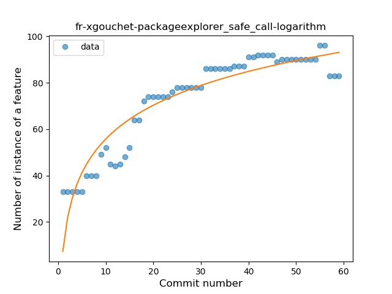

#### com-njlabs-showjava
* Feature: Type Inference
* Function: 
* R_Squared: 0.87469491
 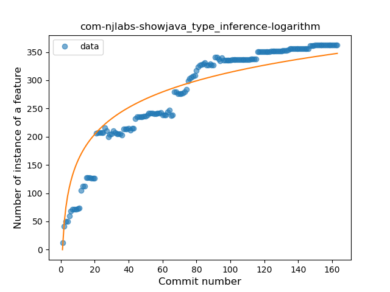

#### org-decsync-cc
* Feature: Type Inference
* Function: 
* R_Squared: 0.87378245
 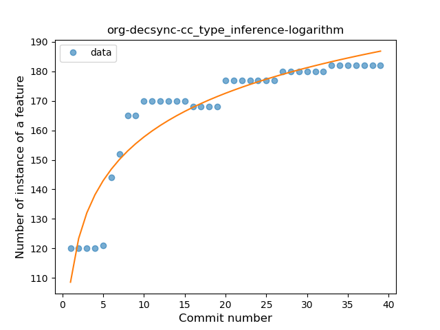

#### apps-amine-bou-readerforselfoss
* Feature: Function call with Named Argument
* Function: 
* R_Squared: 0.87345378
 

#### nl-brouwerijdemolen-borefts2013
* Feature: Type Inference
* Function: 
* R_Squared: 0.87262393
 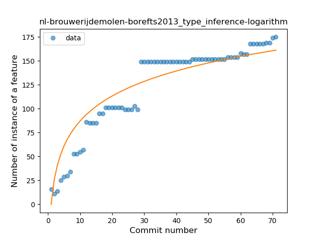

#### io-github-deweyreed-clipboardcleaner
* Feature: Type Inference
* Function: 
* R_Squared: 0.87017017
 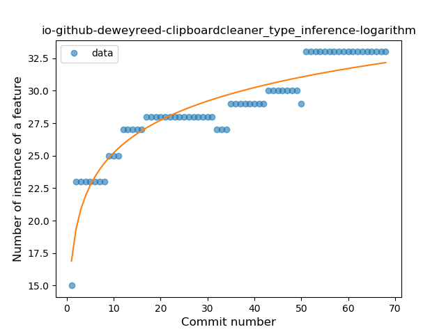

#### com-benoitquenaudon-tvfoot-red
* Feature: Type Inference
* Function: 
* R_Squared: 0.86803727
 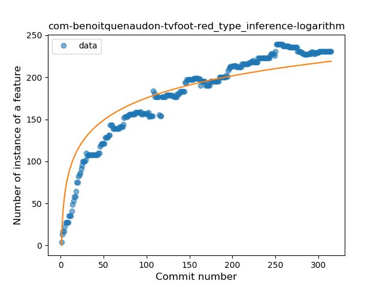

#### fr-chenry-android-freshrss
* Feature: Function with Default Value
* Function: 
* R_Squared: 0.86803585
 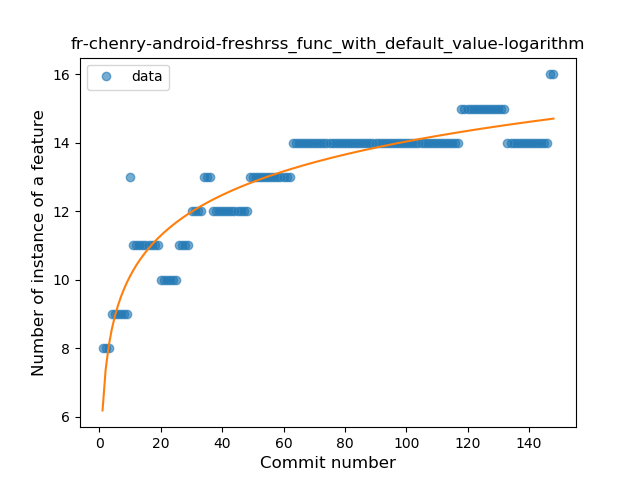

#### com-ofalvai-bpinfo
* Feature: When expression
* Function: 
* R_Squared: 0.86721822
 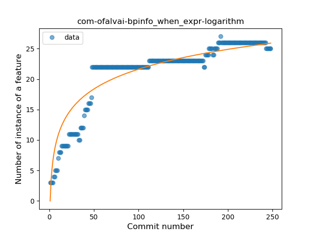

#### com-esafirm-androidplayground
* Feature: Function with Default Value
* Function: 
* R_Squared: 0.86313559
 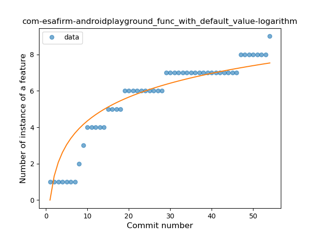

#### ch-rmy-android-statusbar_tacho
* Feature: Singleton
* Function: 
* R_Squared: 0.86019302
 

#### io-github-benoitduffez-cupsprint
* Feature: When expression
* Function: 
* R_Squared: 0.85531704
 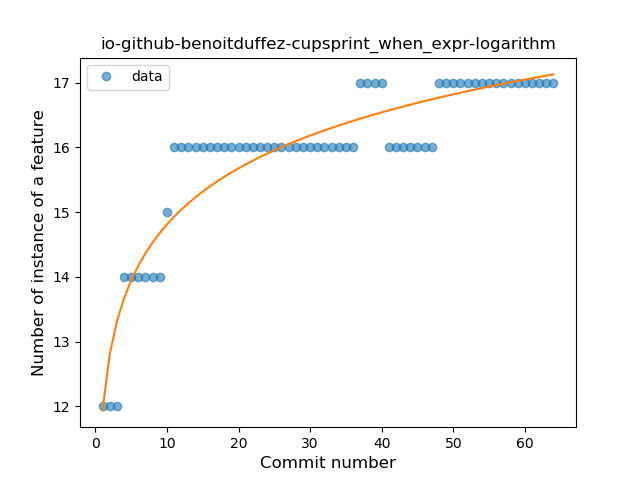

#### com-arcao-geocaching4locus
* Feature: Extension Function
* Function: 
* R_Squared: 0.85467645
 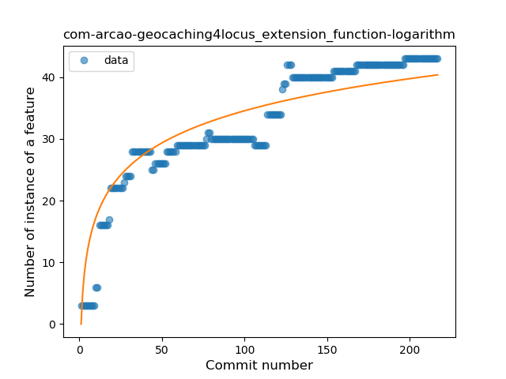

#### com-simplemobiletools-musicplayer
* Feature: Type Inference
* Function: 
* R_Squared: 0.85349347
 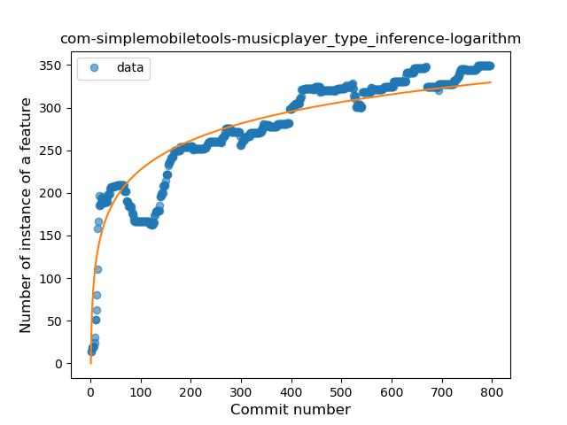

#### eu-depau-etchdroid
* Feature: When expression
* Function: 
* R_Squared: 0.85307016
 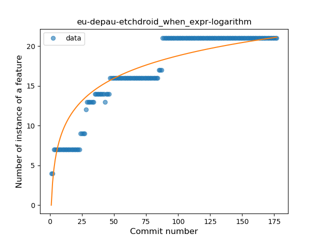

#### org-fossasia-badgemagic
* Feature: Lambda
* Function: 
* R_Squared: 0.85284719
 

#### net-nurik-roman-muzei
* Feature: Companion Object
* Function: 
* R_Squared: 0.85236536
 

#### science-apolline
* Feature: Property Delegation
* Function: 
* R_Squared: 0.85227937
 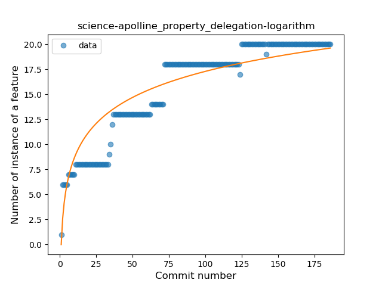

#### com-ids1024-lsdict
* Feature: Type Inference
* Function: 
* R_Squared: 0.8521282
 

#### co-timecrypt-android
* Feature: Type Inference
* Function: 
* R_Squared: 0.85038681
 

#### org-ligi-ipfsdroid
* Feature: Safe Call
* Function: 
* R_Squared: 0.84956946
 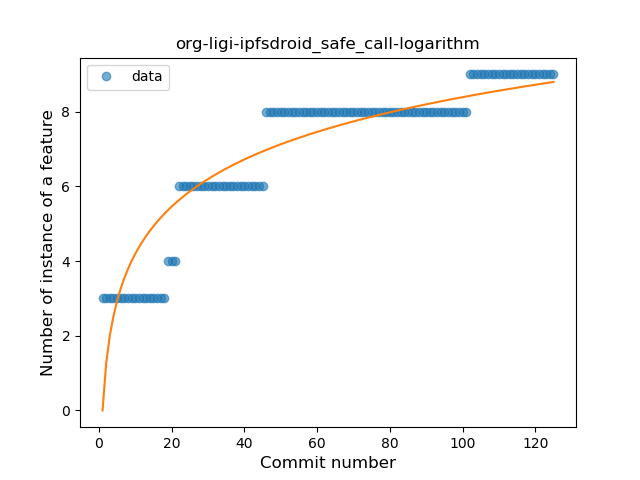

#### xyz-hisname-fireflyiii
* Feature: Property Delegation
* Function: 
* R_Squared: 0.84943641
 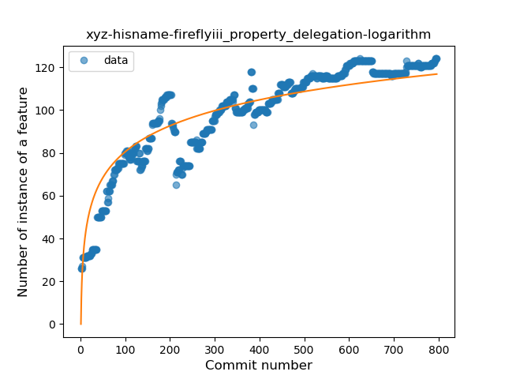

#### fr-chenry-android-freshrss
* Feature: Companion Object
* Function: 
* R_Squared: 0.84939925
 

#### me-murks-feedwatcher
* Feature: Lambda
* Function: 
* R_Squared: 0.84867158
 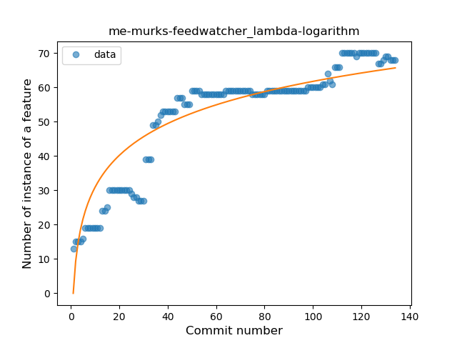

#### com-stevenschoen-putionew
* Feature: Companion Object
* Function: 
* R_Squared: 0.84702357
 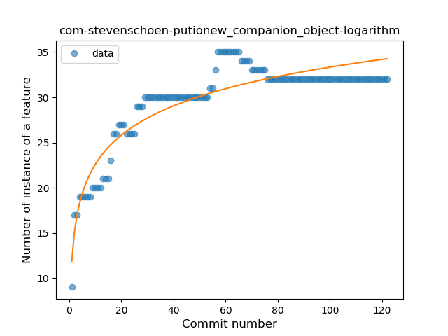

#### pw-janyo-janyoshare
* Feature: When expression
* Function: 
* R_Squared: 0.84610079
 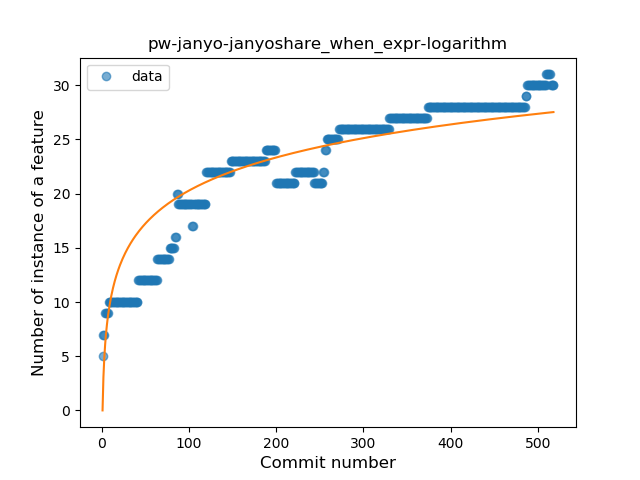

#### de-ironjan-mensaupb
* Feature: When expression
* Function: 
* R_Squared: 0.84496839
 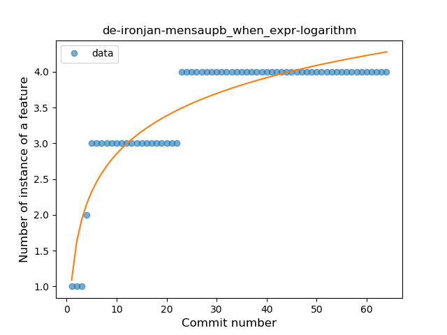

#### org-mattvchandler-progressbars
* Feature: Unsafe Call
* Function: 
* R_Squared: 0.84493731
 

#### fr-insapp-insapp
* Feature: When expression
* Function: 
* R_Squared: 0.84438836
 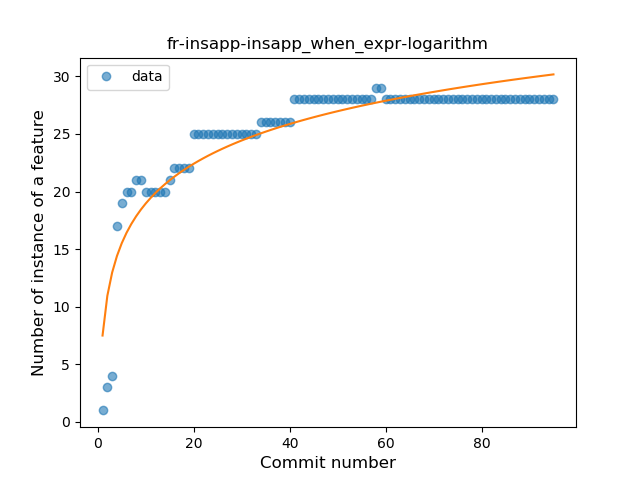

#### fr-xgouchet-packageexplorer
* Feature: Extension Function
* Function: 
* R_Squared: 0.8442374
 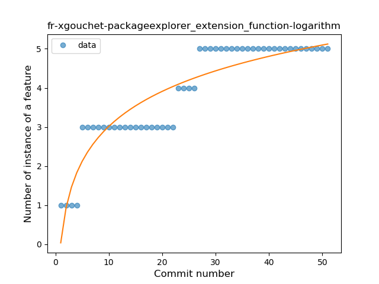

#### it-diab
* Feature: Sealed Class
* Function: 
* R_Squared: 0.84392983
 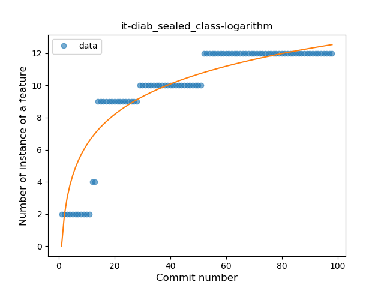

#### com-phicdy-totoanticipation
* Feature: String Template
* Function: 
* R_Squared: 0.84326131
 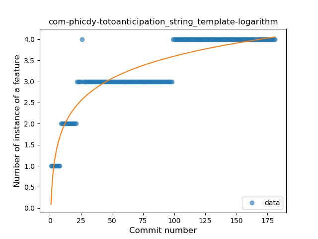

#### com-pluscubed-velociraptor
* Feature: String Template
* Function: 
* R_Squared: 0.84272892
 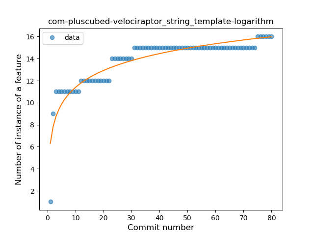

#### horse-amazin-my-stratum0-statuswidget
* Feature: Property Delegation
* Function: 
* R_Squared: 0.84227247
 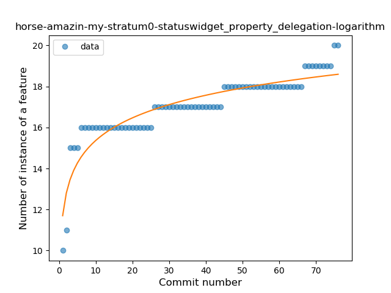

#### com-jmstudios-redmoon
* Feature: Function call with Named Argument
* Function: 
* R_Squared: 0.84209254
 

#### com-jidogoon-roundedscreen
* Feature: Type Inference
* Function: 
* R_Squared: 0.84025426
 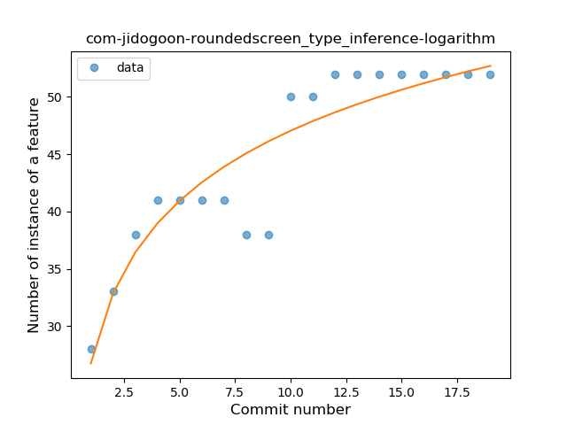

#### com-phicdy-totoanticipation
* Feature: Coroutine
* Function: 
* R_Squared: 0.83883545
 

#### com-yubico-yubioath
* Feature: Property Delegation
* Function: 
* R_Squared: 0.83859767
 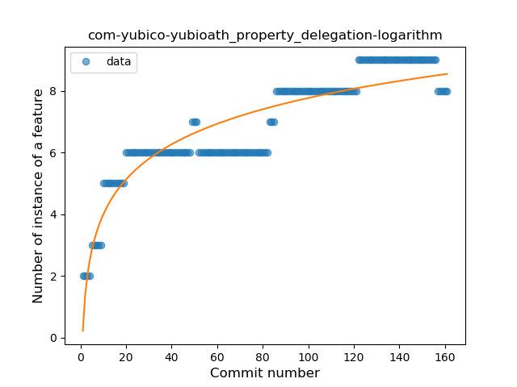

#### net-nurik-roman-muzei
* Feature: Property Delegation
* Function: 
* R_Squared: 0.83842193
 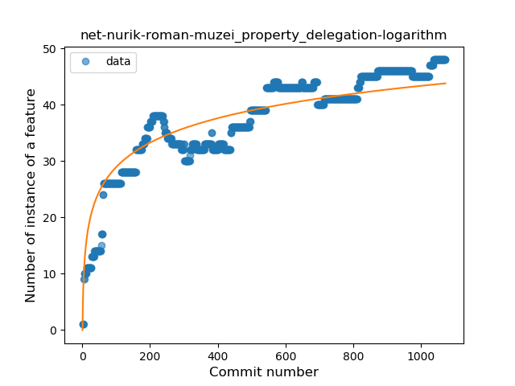

#### com-bubelov-coins
* Feature: Data Class
* Function: 
* R_Squared: 0.83808072
 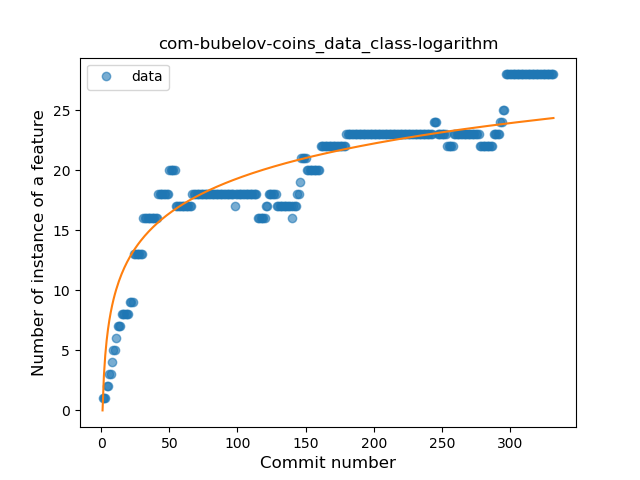

#### io-github-wulkanowy
* Feature: Lambda
* Function: 
* R_Squared: 0.83801329
 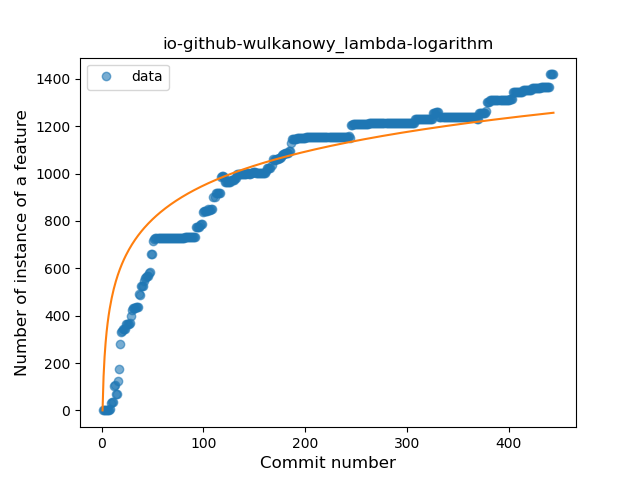

#### org-kaqui
* Feature: Range Expression
* Function: 
* R_Squared: 0.83625607
 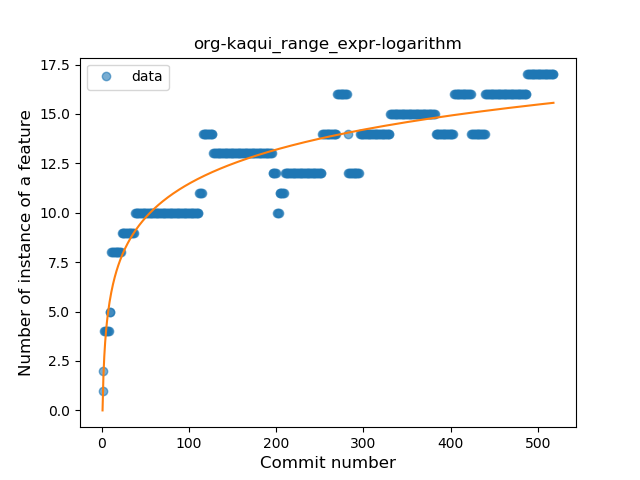

#### org-weilbach-splitbills
* Feature: Smart Cast
* Function: 
* R_Squared: 0.83606853
 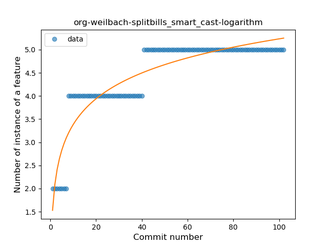

#### com-ianhanniballake-contractiontimer
* Feature: Companion Object
* Function: 
* R_Squared: 0.83571659
 

#### com-loloof64-android-basicchessendgamestrainer
* Feature: Overloaded Operator
* Function: 
* R_Squared: 0.8351353
 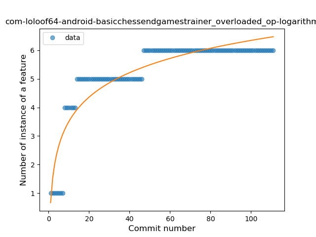

#### com-arcao-geocaching4locus
* Feature: Sealed Class
* Function: 
* R_Squared: 0.83316506
 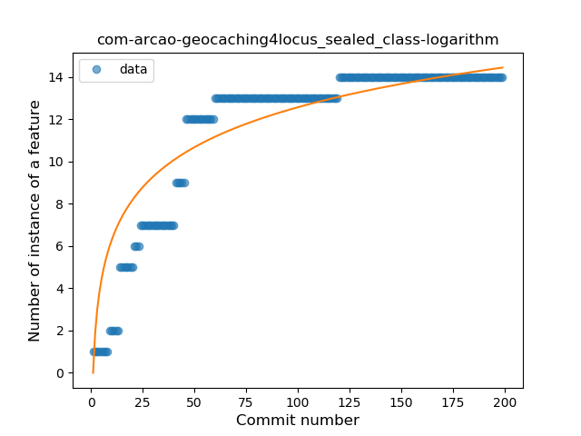

#### com-pixplicity-cryptogram
* Feature: Lambda
* Function: 
* R_Squared: 0.83293355
 

#### com-stevenschoen-putionew
* Feature: Property Delegation
* Function: 
* R_Squared: 0.83236013
 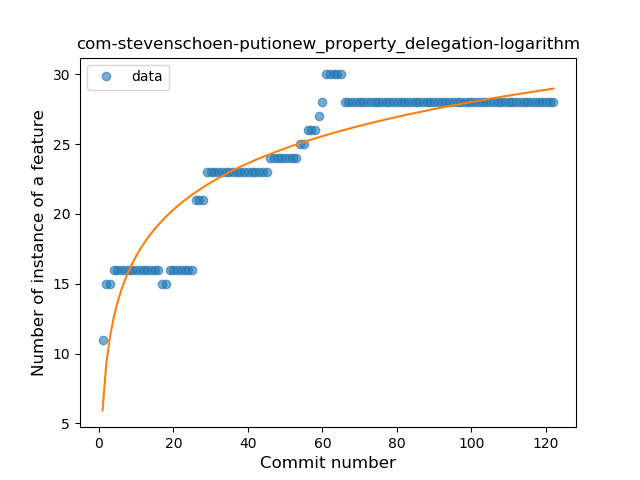

#### com-arcao-geocaching4locus
* Feature: Overloaded Operator
* Function: 
* R_Squared: 0.83226984
 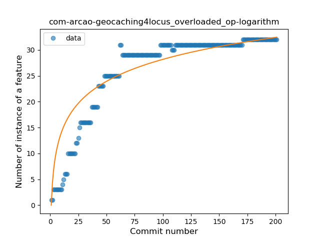

#### fr-corenting-edcompanion
* Feature: Companion Object
* Function: 
* R_Squared: 0.83173741
 

#### com-simplemobiletools-clock
* Feature: Lambda
* Function: 
* R_Squared: 0.83169694
 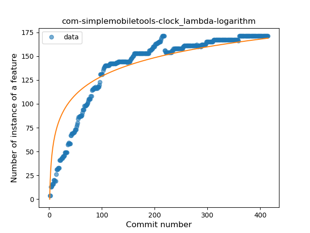

#### com-wilderpereira-lmgtfygen
* Feature: Type Inference
* Function: 
* R_Squared: 0.8316355
 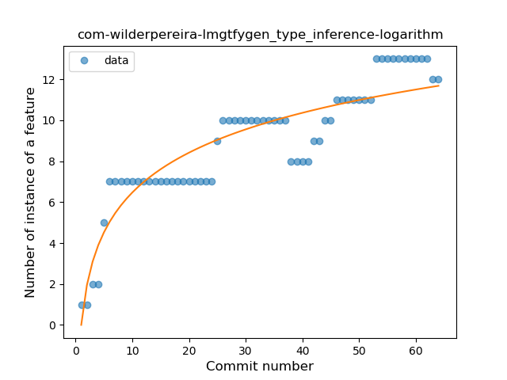

#### com-zacharee1-systemuituner
* Feature: Safe Call
* Function: 
* R_Squared: 0.83138471
 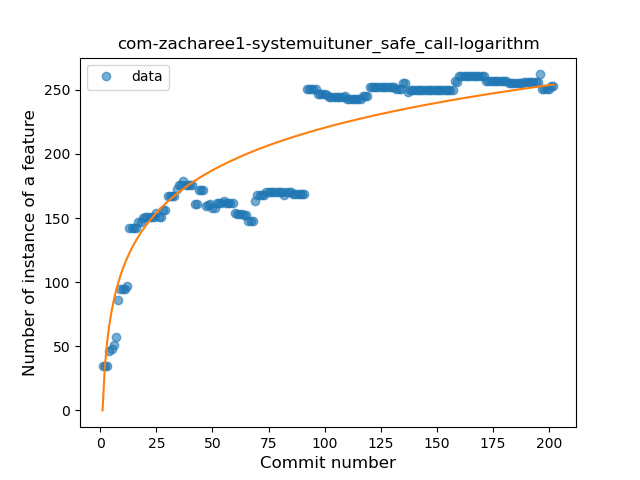

#### co-timecrypt-android
* Feature: String Template
* Function: 
* R_Squared: 0.83106842
 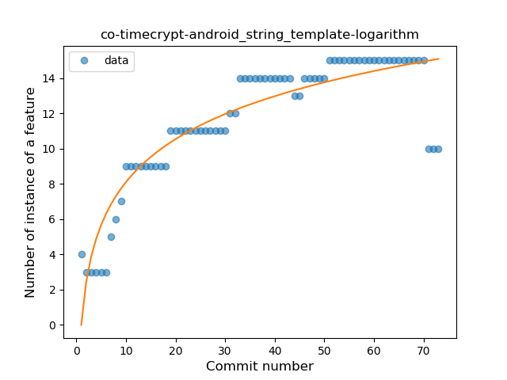

#### com-simplemobiletools-applauncher
* Feature: Type Inference
* Function: 
* R_Squared: 0.83003519
 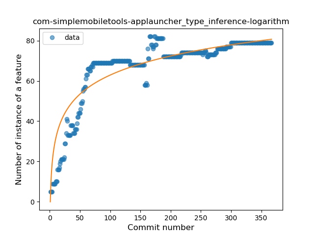

#### org-eurofurence-connavigator
* Feature: Overloaded Operator
* Function: 
* R_Squared: 0.8294391
 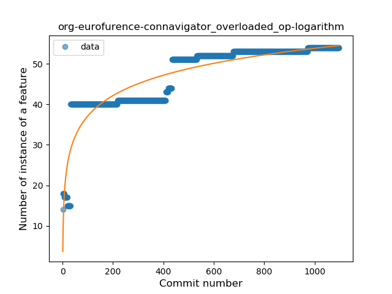

#### de-markusfisch-android-binaryeye
* Feature: Destructuring Declaration
* Function: 
* R_Squared: 0.82889534
 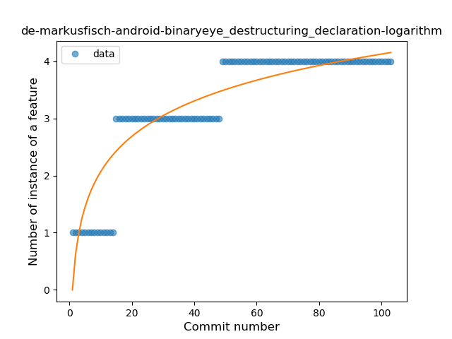

#### com-arcao-geocaching4locus
* Feature: Smart Cast
* Function: 
* R_Squared: 0.82742004
 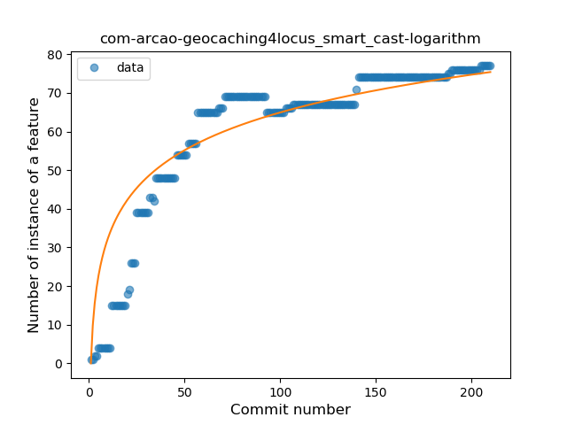

#### com-simplemobiletools-clock
* Feature: String Template
* Function: 
* R_Squared: 0.82631387
 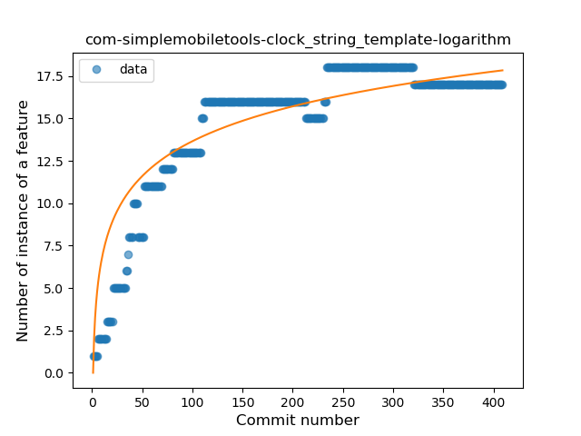

#### com-simplemobiletools-clock
* Feature: Type Inference
* Function: 
* R_Squared: 0.82550325
 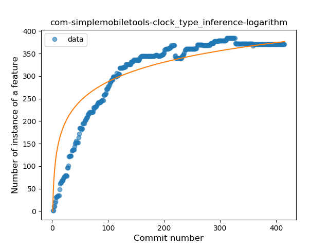

#### com-kgurgul-cpuinfo
* Feature: Unsafe Call
* Function: 
* R_Squared: 0.82546932
 

#### de-thecode-lmd
* Feature: Companion Object
* Function: 
* R_Squared: 0.82467418
 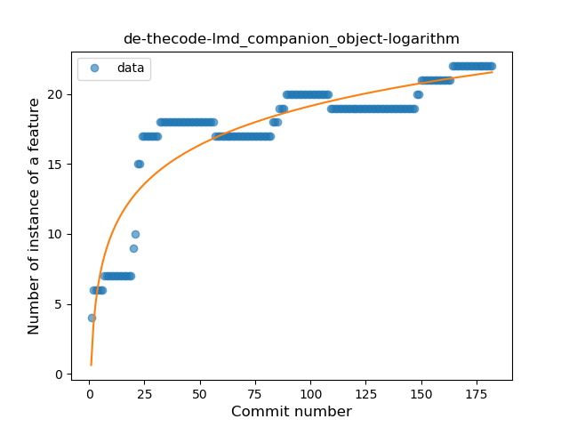

#### com-jmstudios-redmoon
* Feature: Data Class
* Function: 
* R_Squared: 0.82396974
 

#### com-benoitquenaudon-tvfoot-red
* Feature: Singleton
* Function: 
* R_Squared: 0.82308681
 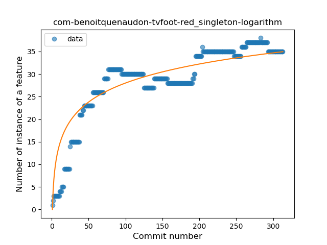

#### com-github-quarck-calnotify
* Feature: Singleton
* Function: 
* R_Squared: 0.82143076
 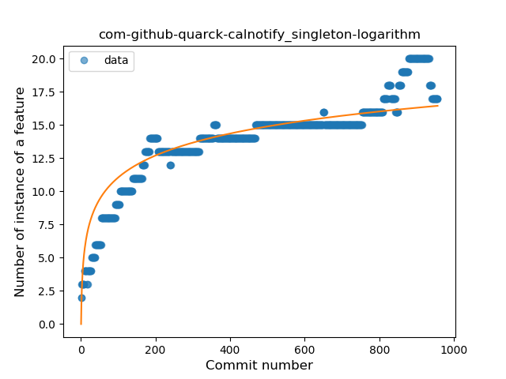

#### org-blitzortung-android-app
* Feature: Smart Cast
* Function: 
* R_Squared: 0.82006816
 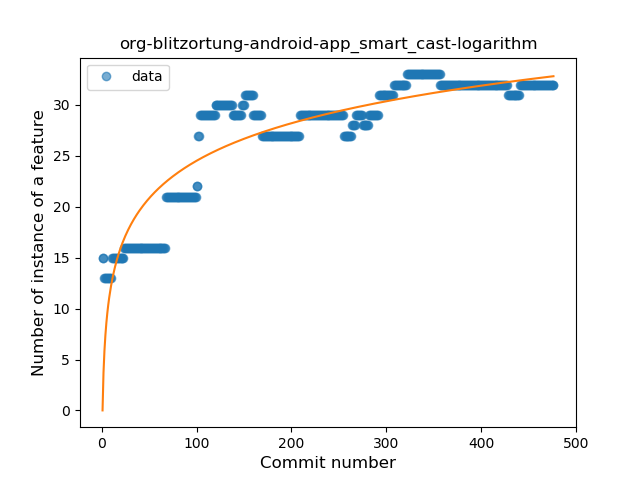

#### de-thecode-lmd
* Feature: Function with Default Value
* Function: 
* R_Squared: 0.81965944
 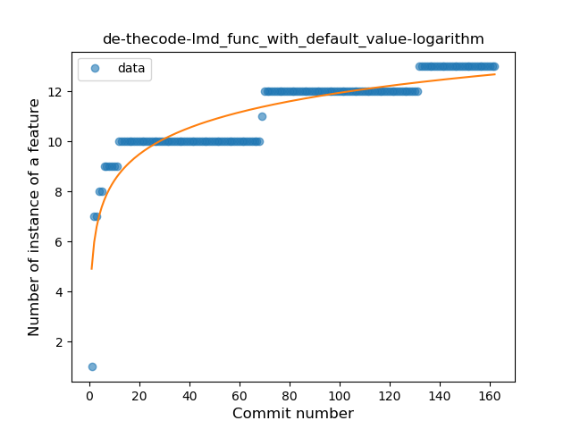

#### com-benoitletondor-easybudgetapp
* Feature: Function call with Named Argument
* Function: 
* R_Squared: 0.81716154
 

#### net-osmand-plus
* Feature: Unsafe Call
* Function: 
* R_Squared: 0.81568783
 

#### de-thecode-lmd
* Feature: Extension Function
* Function: 
* R_Squared: 0.81417209
 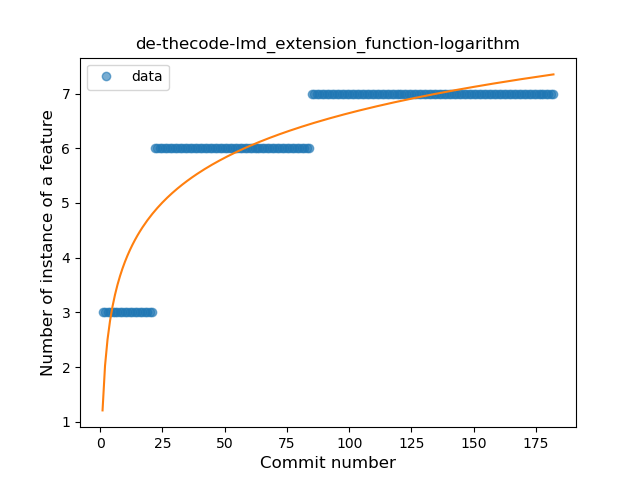

#### com-simplemobiletools-draw
* Feature: String Template
* Function: 
* R_Squared: 0.81343829
 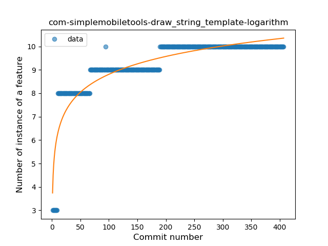

#### com-simplemobiletools-draw-pro
* Feature: String Template
* Function: 
* R_Squared: 0.81343829
 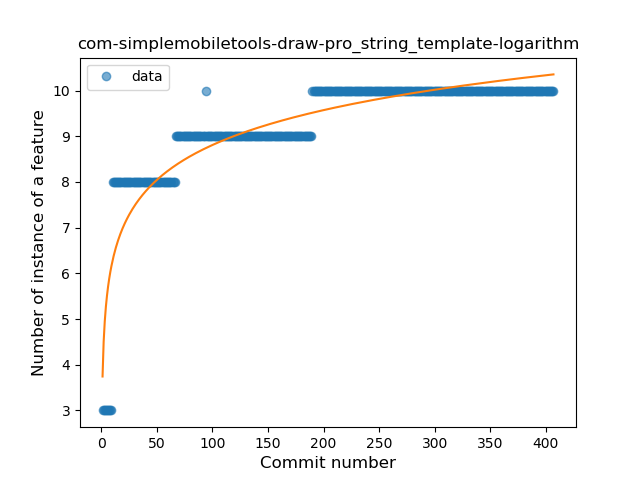

#### com-pitchedapps-frost
* Feature: Destructuring Declaration
* Function: 
* R_Squared: 0.81269057
 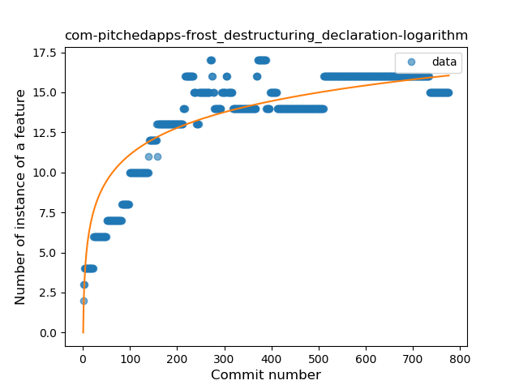

#### com-directdev-portal
* Feature: Safe Call
* Function: 
* R_Squared: 0.81170368
 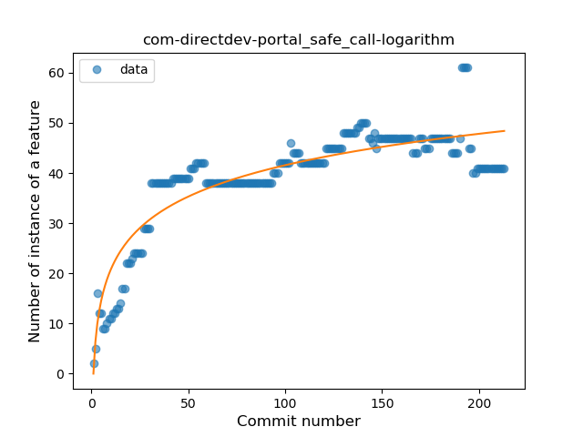

#### com-emmanuelmess-simplecleanup
* Feature: Unsafe Call
* Function: 
* R_Squared: 0.8116831
 

#### net-nurik-roman-muzei
* Feature: Type Inference
* Function: 
* R_Squared: 0.81139657
 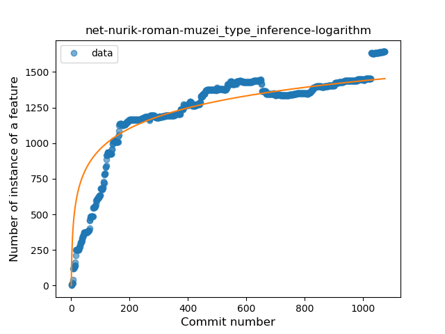

#### com-tumblr-svetylk0-sheepsgohome-android
* Feature: Type Inference
* Function: 
* R_Squared: 0.81088818
 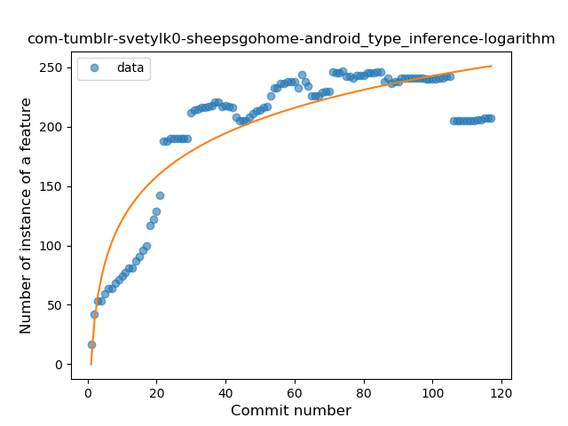

#### com-pennapps-labs-pennmobile
* Feature: Lambda
* Function: 
* R_Squared: 0.81026797
 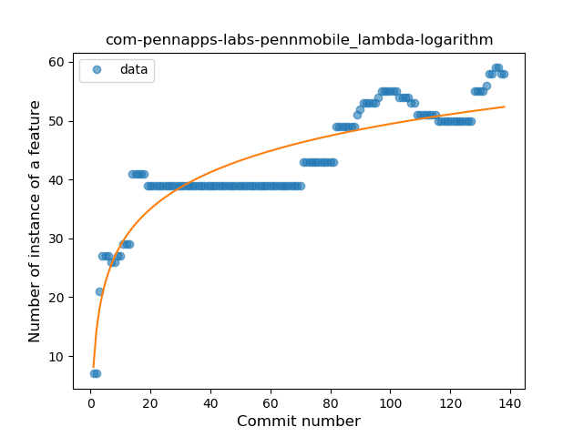

#### de-thecode-android-tazreader
* Feature: Function call with Named Argument
* Function: 
* R_Squared: 0.80949871
 

#### io-github-wulkanowy
* Feature: Companion Object
* Function: 
* R_Squared: 0.80889349
 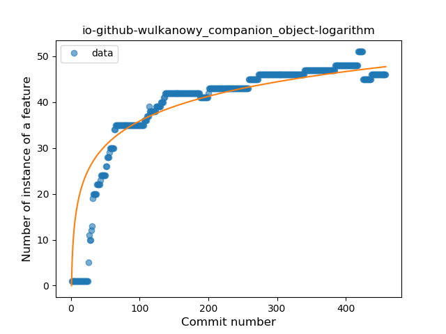

#### cz-dvratil-fbeventsync
* Feature: Companion Object
* Function: 
* R_Squared: 0.80729113
 

#### fr-chenry-android-freshrss
* Feature: Data Class
* Function: 
* R_Squared: 0.80703129
 

#### nl-brouwerijdemolen-borefts2013
* Feature: Property Delegation
* Function: 
* R_Squared: 0.80641037
 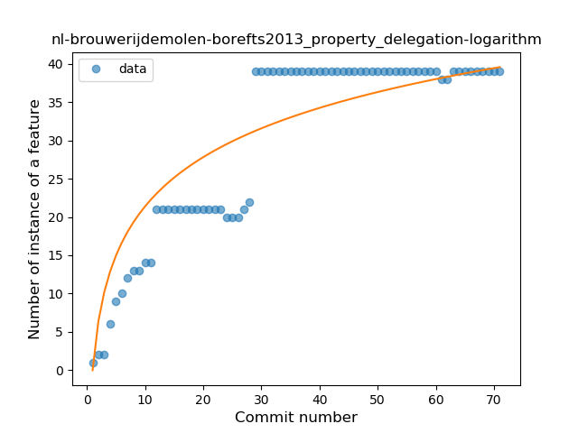

#### de-r4md4c-gamedealz
* Feature: Singleton
* Function: 
* R_Squared: 0.80622245
 

#### com-bubelov-coins
* Feature: Type Inference
* Function: 
* R_Squared: 0.8040491
 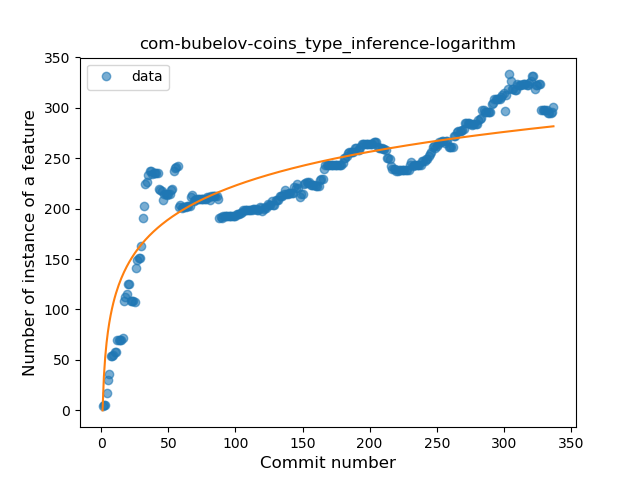

#### com-glodanif-bluetoothchat
* Feature: Safe Call
* Function: 
* R_Squared: 0.80309642
 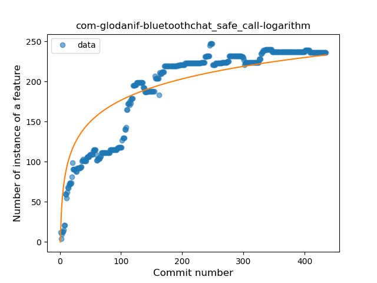

#### de-thecode-lmd
* Feature: Type Inference
* Function: 
* R_Squared: 0.80296299
 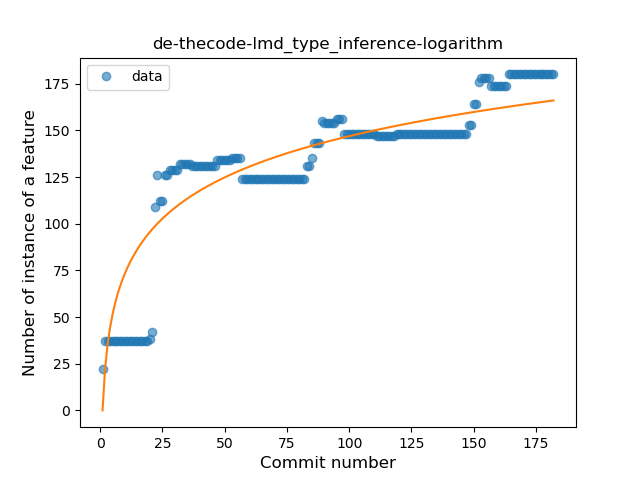

#### net-nurik-roman-muzei
* Feature: Safe Call
* Function: 
* R_Squared: 0.80268703
 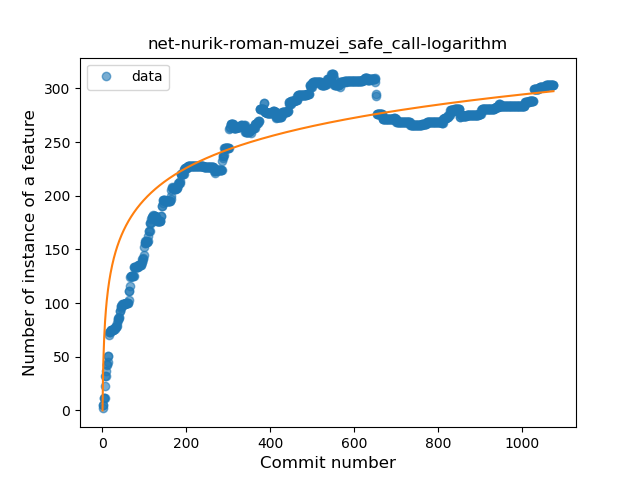

#### com-simplemobiletools-clock
* Feature: Unsafe Call
* Function: 
* R_Squared: 0.80206257
 

#### info-papdt-express-helper
* Feature: Destructuring Declaration
* Function: 
* R_Squared: 0.80189312
 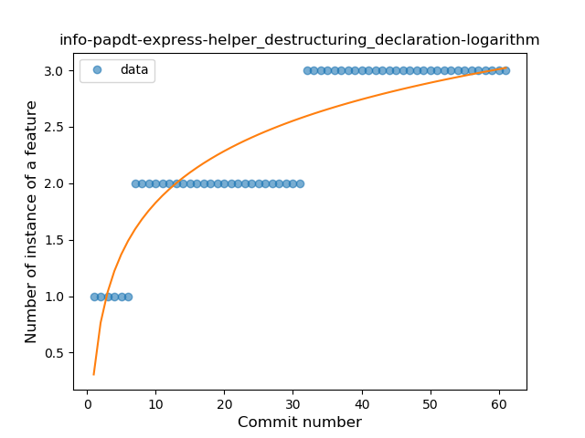

#### at-bitfire-davdroid
* Feature: When expression
* Function: 
* R_Squared: 0.79914544
 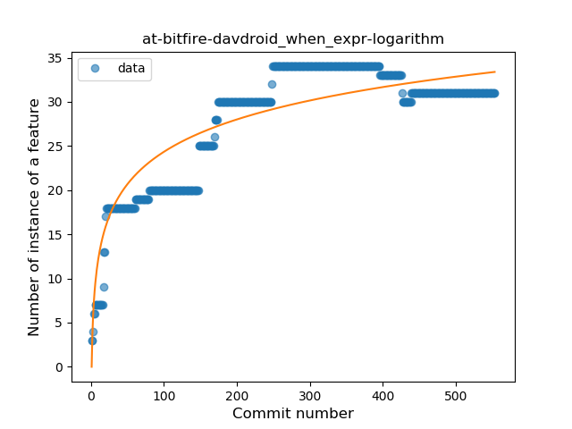

#### io-github-deweyreed-clipboardcleaner
* Feature: Extension Function
* Function: 
* R_Squared: 0.79884749
 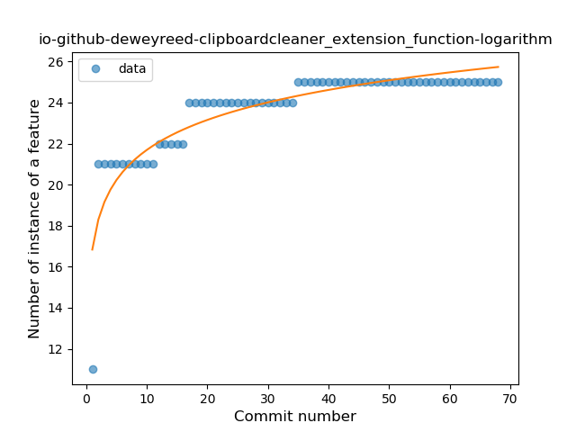

#### com-guerinet-mymartlet
* Feature: String Template
* Function: 
* R_Squared: 0.79640116
 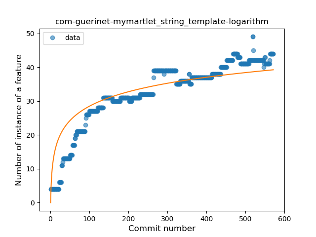

#### info-dvkr-screenstream
* Feature: Extension Function
* Function: 
* R_Squared: 0.7933225
 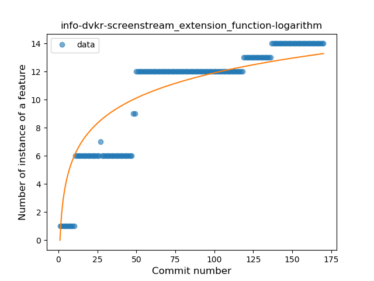

#### com-utazukin-ichaival
* Feature: Unsafe Call
* Function: 
* R_Squared: 0.79269272
 

#### com-glodanif-bluetoothchat
* Feature: Smart Cast
* Function: 
* R_Squared: 0.79173145
 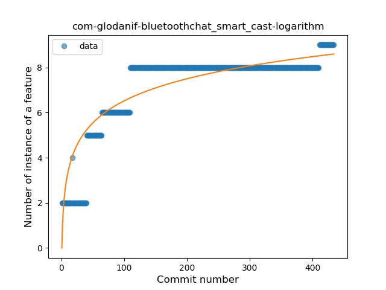

#### fr-cph-chicago-foss
* Feature: Companion Object
* Function: 
* R_Squared: 0.791633
 

#### pl-org-seva-navigator
* Feature: Safe Call
* Function: 
* R_Squared: 0.79023169
 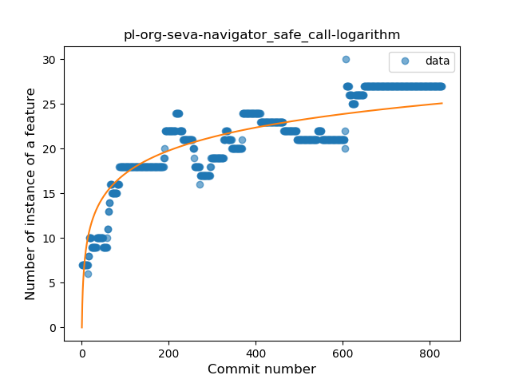

#### com-etesync-syncadapter
* Feature: Safe Call
* Function: 
* R_Squared: 0.78961659
 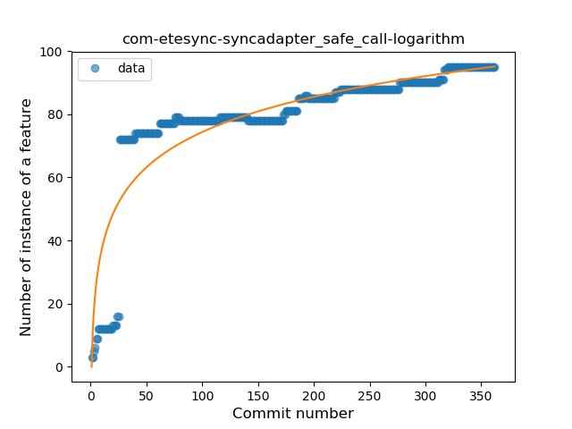

#### pl-org-seva-texter
* Feature: Lambda
* Function: 
* R_Squared: 0.78888221
 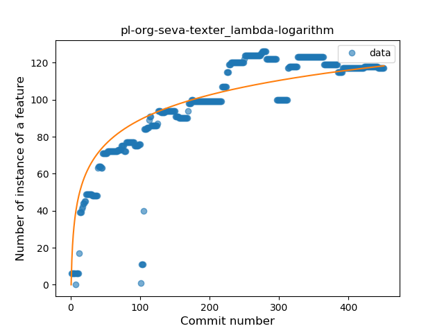

#### ai-susi
* Feature: String Template
* Function: 
* R_Squared: 0.7887712
 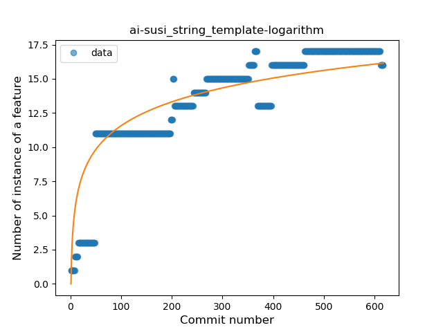

#### jp-toastkid-yobidashi
* Feature: Singleton
* Function: 
* R_Squared: 0.78561824
 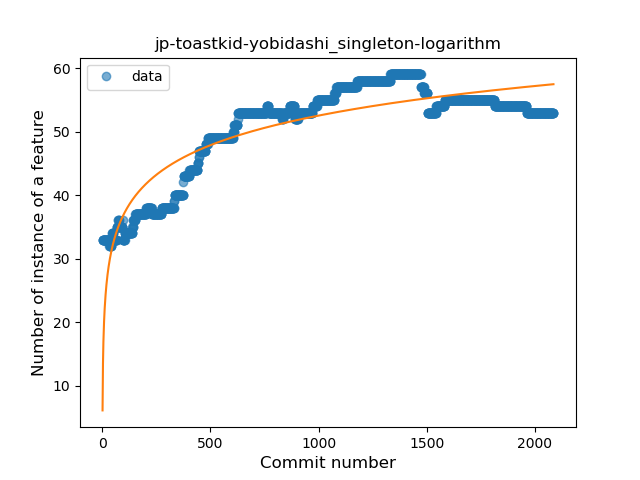

#### net-nurik-roman-muzei
* Feature: Function with Default Value
* Function: 
* R_Squared: 0.7844112
 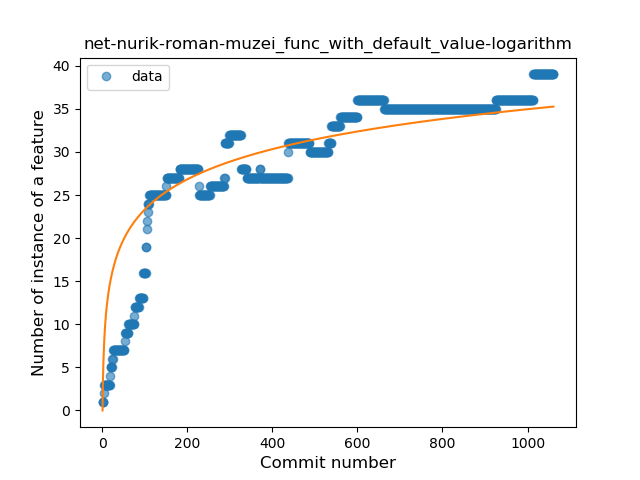

#### org-blitzortung-android-app
* Feature: Safe Call
* Function: 
* R_Squared: 0.78194707
 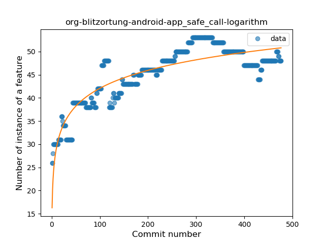

#### de-blankedv-lanbahnpanel
* Feature: Type Inference
* Function: 
* R_Squared: 0.78191144
 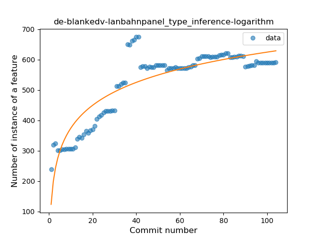

#### com-pitchedapps-frost
* Feature: Coroutine
* Function: 
* R_Squared: 0.78099164
 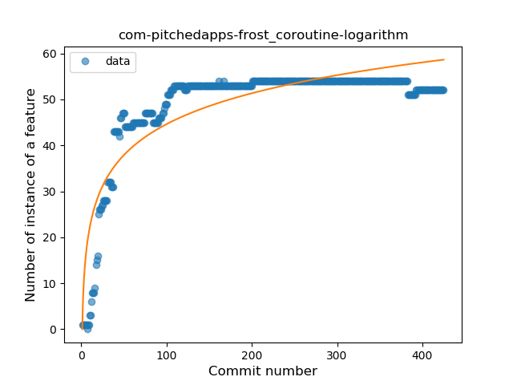

#### com-etesync-syncadapter
* Feature: Singleton
* Function: 
* R_Squared: 0.77989905
 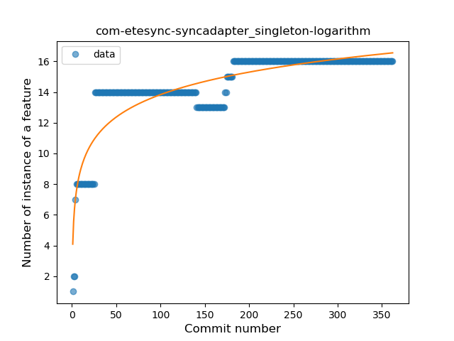

#### com-glodanif-bluetoothchat
* Feature: Companion Object
* Function: 
* R_Squared: 0.77887586
 

#### org-blitzortung-android-app
* Feature: Data Class
* Function: 
* R_Squared: 0.77674238
 

#### info-metadude-android-congress-schedule
* Feature: Function call with Named Argument
* Function: 
* R_Squared: 0.77436463
 

#### com-kgurgul-cpuinfo
* Feature: Data Class
* Function: 
* R_Squared: 0.77383968
 

#### fr-jnda-android-flashalert
* Feature: Unsafe Call
* Function: 
* R_Squared: 0.77373442
 

#### eu-the4thfloor-msync
* Feature: Extension Function
* Function: 
* R_Squared: 0.77316351
 

#### de-cineaste-android
* Feature: Singleton
* Function: 
* R_Squared: 0.77268697
 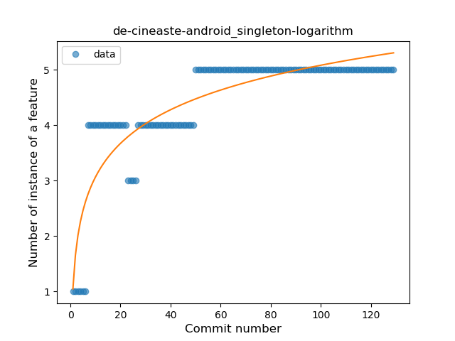

#### com-benoitquenaudon-tvfoot-red
* Feature: Companion Object
* Function: 
* R_Squared: 0.7702045
 

#### jp-toastkid-yobidashi
* Feature: Function with Default Value
* Function: 
* R_Squared: 0.77004408
 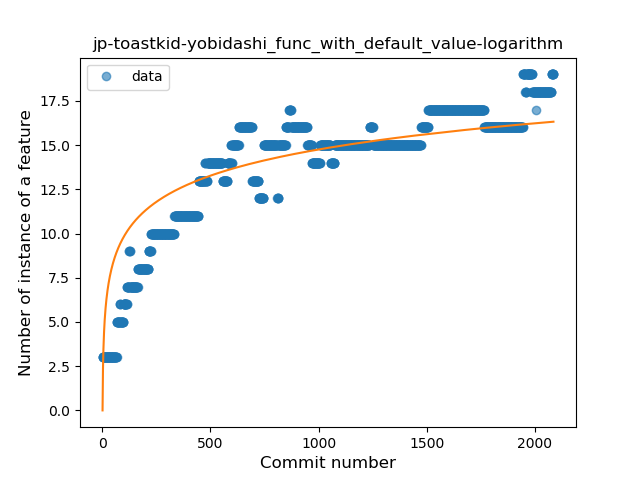

#### de-grobox-liberario
* Feature: Smart Cast
* Function: 
* R_Squared: 0.76911716
 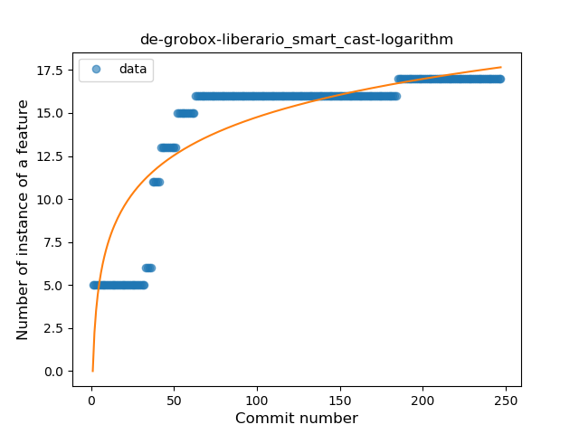

#### com-mgaetan89-showsrage
* Feature: Smart Cast
* Function: 
* R_Squared: 0.76861921
 

#### info-papdt-express-helper
* Feature: Safe Call
* Function: 
* R_Squared: 0.76769739
 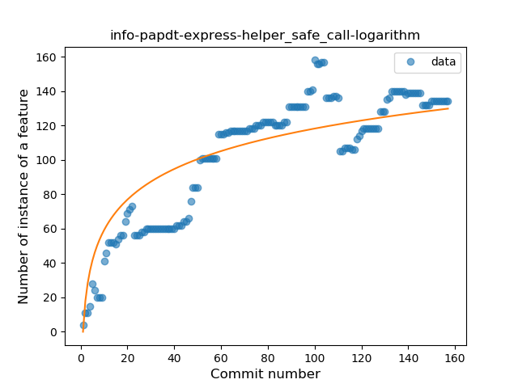

#### net-yslibrary-monotweety
* Feature: Extension Function
* Function: 
* R_Squared: 0.7662568
 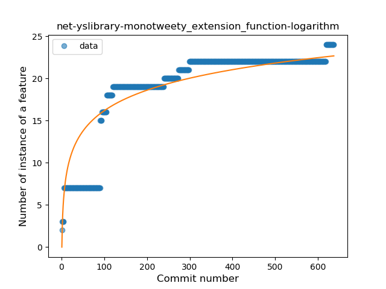

#### net-nurik-roman-muzei
* Feature: When expression
* Function: 
* R_Squared: 0.76469411
 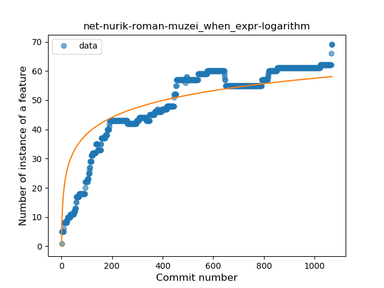

#### nl-mpcjanssen-simpletask
* Feature: Data Class
* Function: 
* R_Squared: 0.76334869
 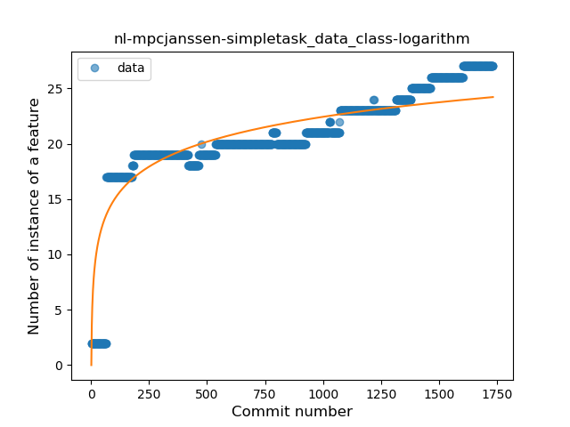

#### sk-styk-martin-apkanalyzer
* Feature: Function with Default Value
* Function: 
* R_Squared: 0.7623544
 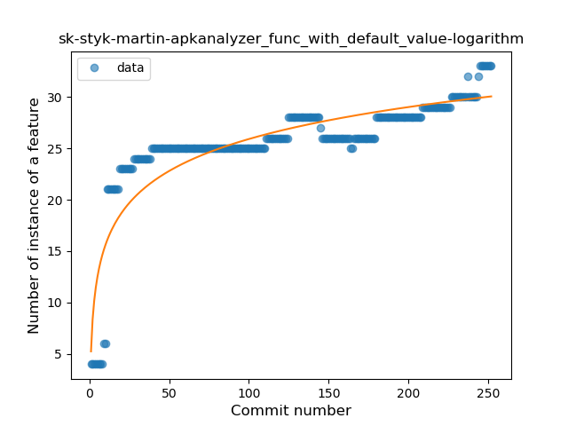

#### com-jereksel-libresubstratum
* Feature: Coroutine
* Function: 
* R_Squared: 0.75956616
 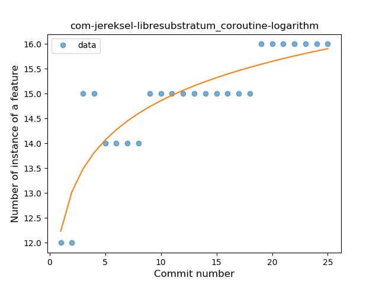

#### com-arcao-geocaching4locus
* Feature: Range Expression
* Function: 
* R_Squared: 0.75891851
 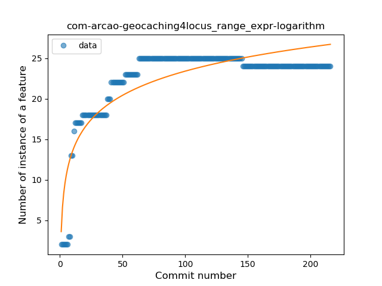

#### com-doctoror-particleswallpaper
* Feature: Smart Cast
* Function: 
* R_Squared: 0.75854364
 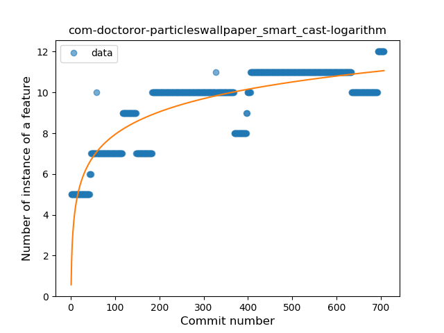

#### com-guerinet-mymartlet
* Feature: Property Delegation
* Function: 
* R_Squared: 0.75800216
 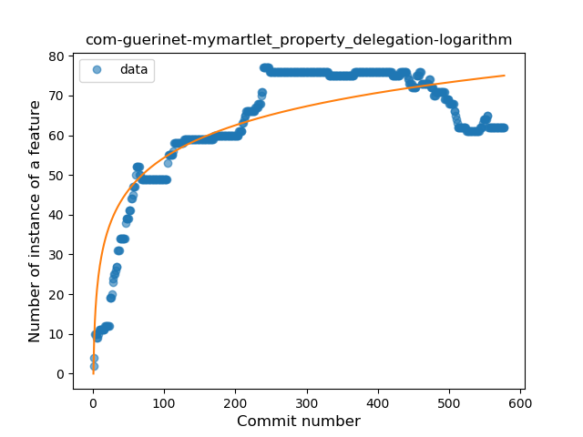

#### at-bitfire-davdroid
* Feature: Unsafe Call
* Function: 
* R_Squared: 0.75618189
 

#### org-weilbach-splitbills
* Feature: When expression
* Function: 
* R_Squared: 0.75486169
 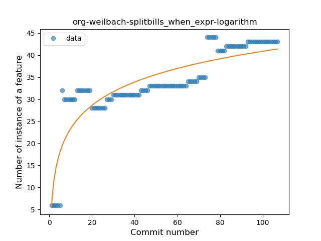

#### cat-xojan-random1
* Feature: Type Inference
* Function: 
* R_Squared: 0.75413331
 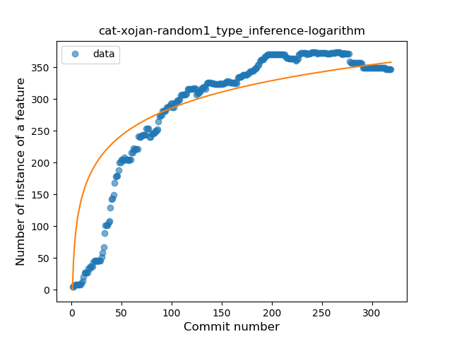

#### com-conorodonnell-bus
* Feature: Lambda
* Function: 
* R_Squared: 0.75398585
 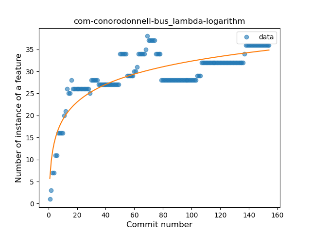

#### de-cineaste-android
* Feature: String Template
* Function: 
* R_Squared: 0.75269223
 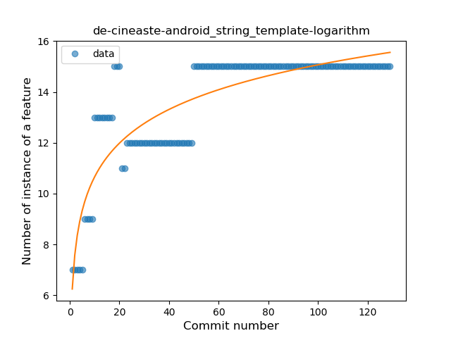

#### com-garpr-android
* Feature: Type Inference
* Function: 
* R_Squared: 0.75216142
 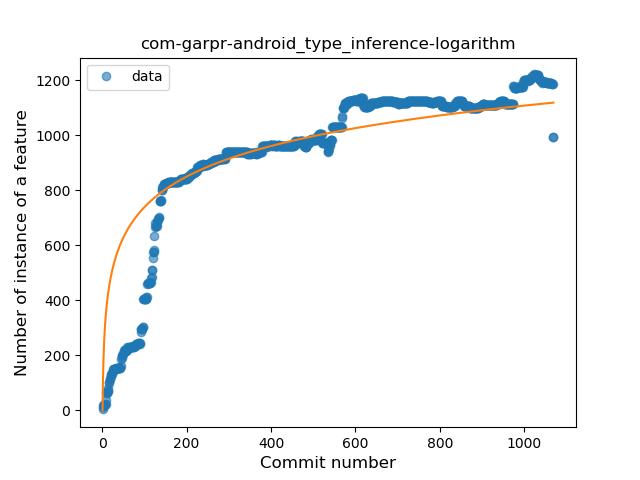

#### li-klass-fhem
* Feature: Smart Cast
* Function: 
* R_Squared: 0.75188197
 

#### com-libopenmw-openmw
* Feature: Safe Call
* Function: 
* R_Squared: 0.75107212
 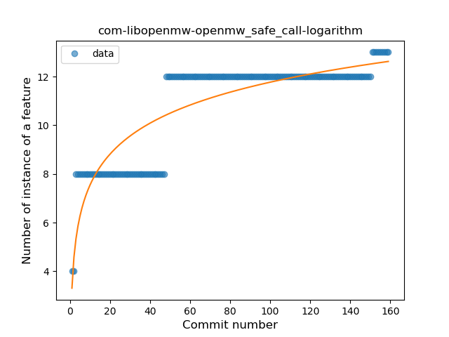

#### me-echeung-moemoekyun-fdroid
* Feature: Lambda
* Function: 
* R_Squared: 0.75066812
 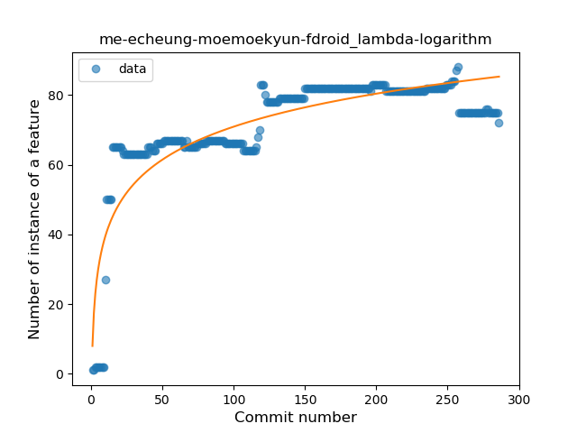

#### com-garpr-android
* Feature: When expression
* Function: 
* R_Squared: 0.7492587
 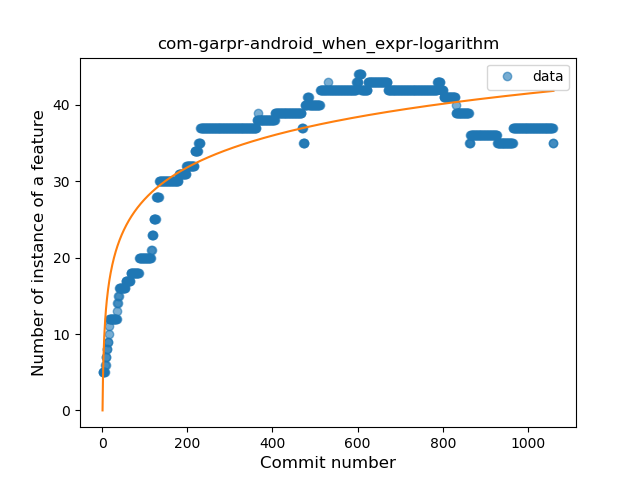

#### fr-cph-chicago-foss
* Feature: Type Inference
* Function: 
* R_Squared: 0.74738579
 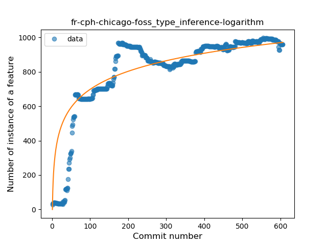

#### com-tumblr-svetylk0-sheepsgohome-android
* Feature: When expression
* Function: 
* R_Squared: 0.74707114
 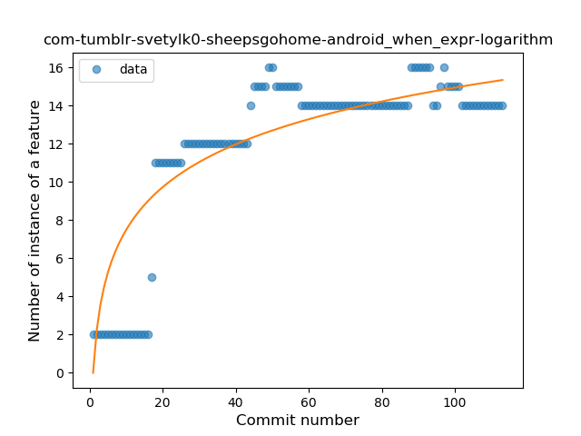

#### com-corphish-nightlight-generic
* Feature: Lambda
* Function: 
* R_Squared: 0.74685247
 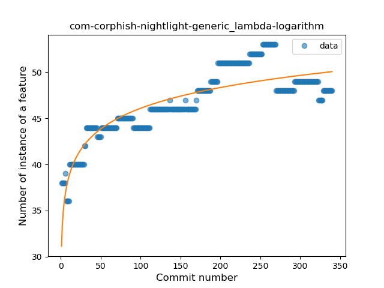

#### com-pixplicity-cryptogram
* Feature: Companion Object
* Function: 
* R_Squared: 0.7464376
 

#### net-yslibrary-monotweety
* Feature: String Template
* Function: 
* R_Squared: 0.74249177
 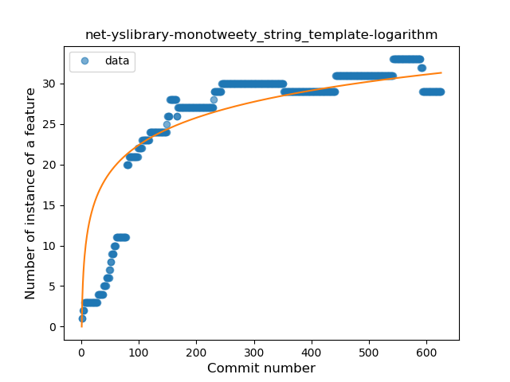

#### com-commit451-gitlab
* Feature: Companion Object
* Function: 
* R_Squared: 0.74221552
 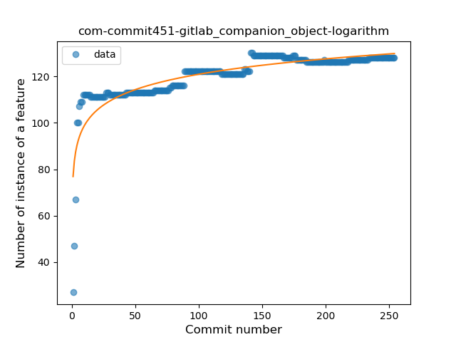

#### org-poul-bits-android
* Feature: Type Inference
* Function: 
* R_Squared: 0.74221014
 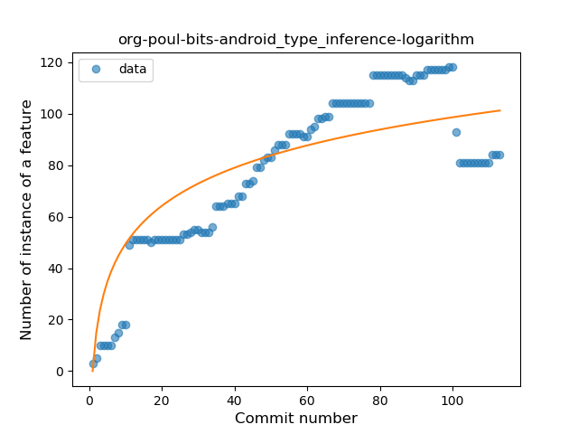

#### com-pitchedapps-frost
* Feature: Super Delegation
* Function: 
* R_Squared: 0.74200517
 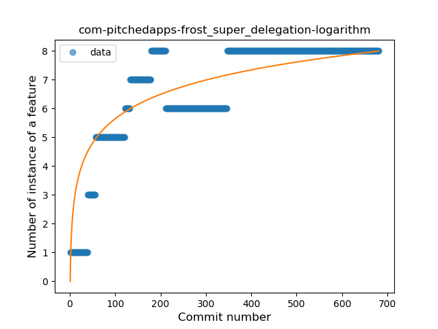

#### com-simplemobiletools-clock
* Feature: When expression
* Function: 
* R_Squared: 0.74193667
 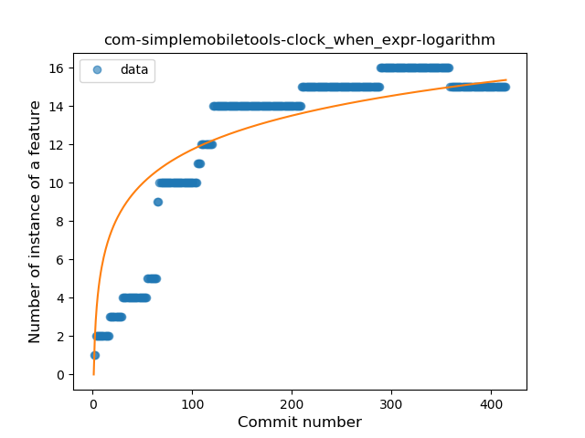

#### sreich-countthedays
* Feature: Function call with Named Argument
* Function: 
* R_Squared: 0.74122644
 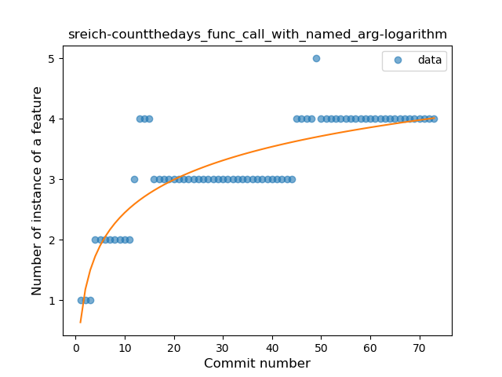

#### li-klass-fhem
* Feature: Unsafe Call
* Function: 
* R_Squared: 0.74043987
 

#### org-pacien-tincapp
* Feature: Companion Object
* Function: 
* R_Squared: 0.73229499
 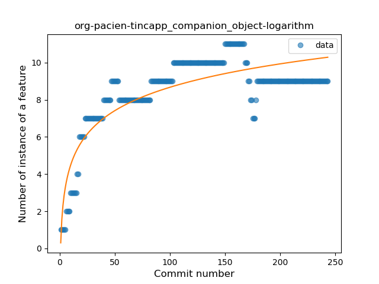

#### com-commit451-gitlab
* Feature: Singleton
* Function: 
* R_Squared: 0.72892422
 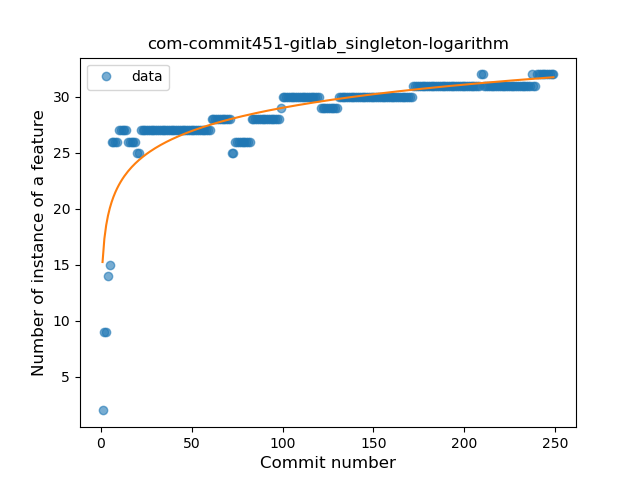

#### com-pitchedapps-frost
* Feature: Function with Default Value
* Function: 
* R_Squared: 0.72695581
 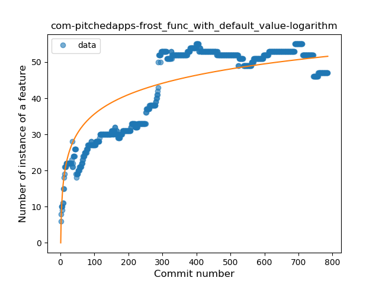

#### me-echeung-moemoekyun-fdroid
* Feature: String Template
* Function: 
* R_Squared: 0.72672833
 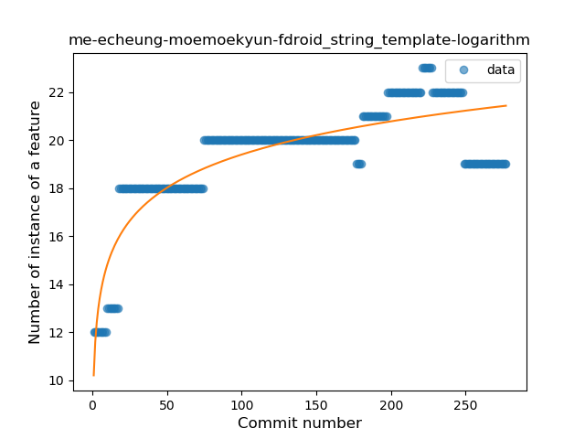

#### com-guerinet-mymartlet
* Feature: Type Inference
* Function: 
* R_Squared: 0.72622064
 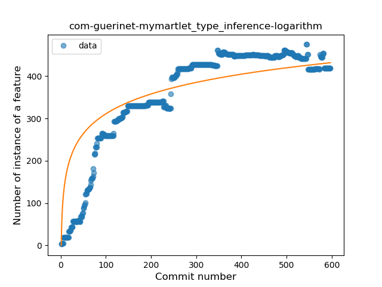

#### com-glodanif-bluetoothchat
* Feature: String Template
* Function: 
* R_Squared: 0.72540442
 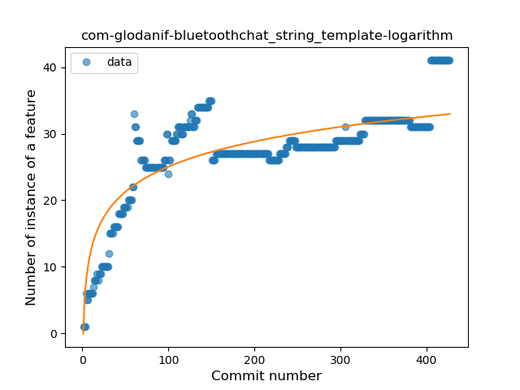

#### org-weilbach-splitbills
* Feature: Extension Function
* Function: 
* R_Squared: 0.72377514
 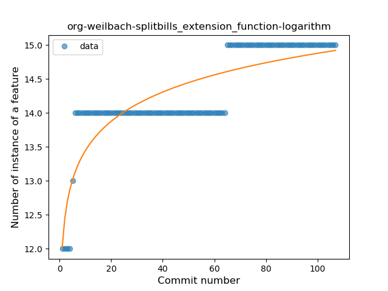

#### fi-kroon-vadret
* Feature: Singleton
* Function: 
* R_Squared: 0.72261769
 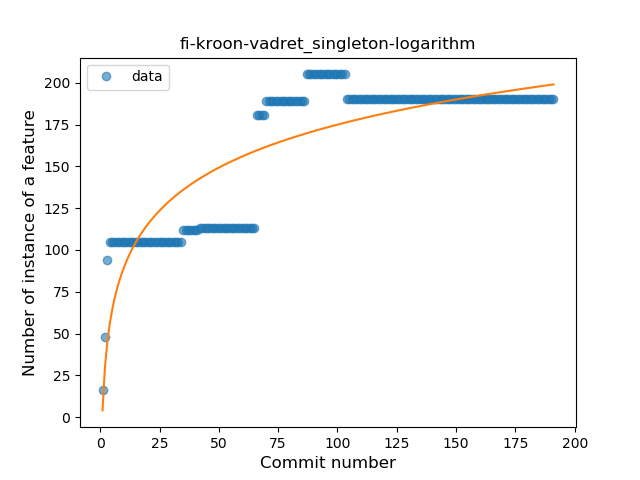

#### org-mcxa-vortaro
* Feature: Safe Call
* Function: 
* R_Squared: 0.71987214
 

#### com-glodanif-bluetoothchat
* Feature: Coroutine
* Function: 
* R_Squared: 0.71964046
 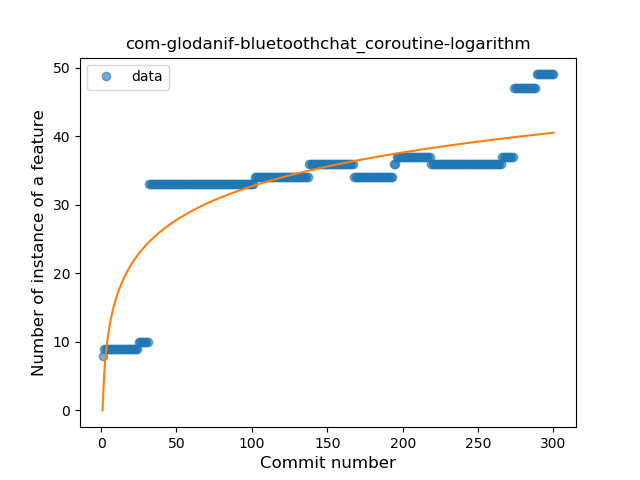

#### net-kourlas-voipms
* Feature: Type Inference
* Function: 
* R_Squared: 0.71952699
 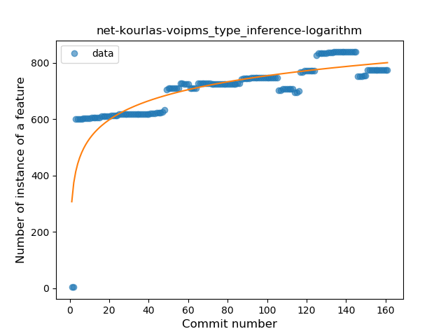

#### me-rei_m-hyakuninisshu
* Feature: Function with Default Value
* Function: 
* R_Squared: 0.71495938
 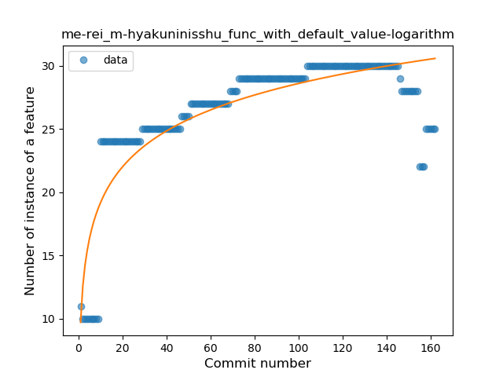

#### com-boardgamegeek
* Feature: Singleton
* Function: 
* R_Squared: 0.71440686
 

#### com-ofalvai-bpinfo
* Feature: Companion Object
* Function: 
* R_Squared: 0.71115255
 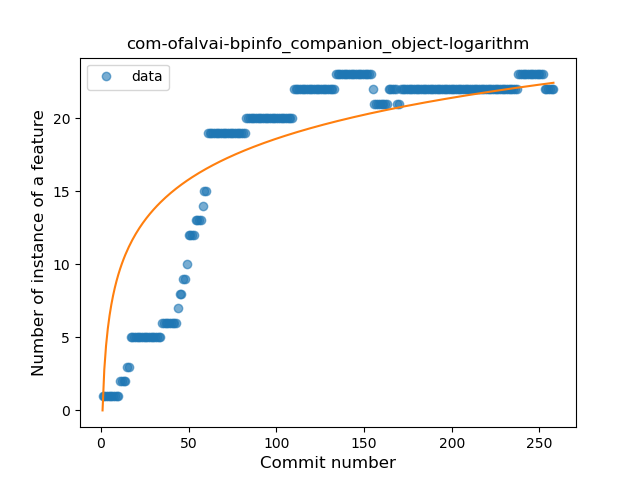

#### com-libopenmw-openmw
* Feature: Type Inference
* Function: 
* R_Squared: 0.70994075
 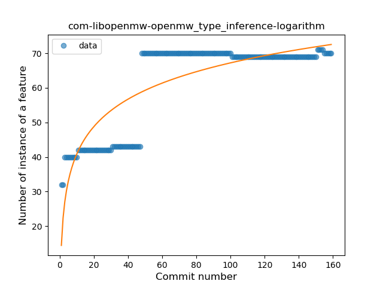

#### com-garpr-android
* Feature: Data Class
* Function: 
* R_Squared: 0.70720882
 

#### de-r4md4c-gamedealz
* Feature: Sealed Class
* Function: 
* R_Squared: 0.70601727
 

#### info-dvkr-screenstream
* Feature: Property Delegation
* Function: 
* R_Squared: 0.70469195
 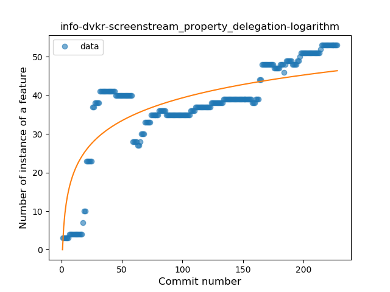

#### org-mattvchandler-a2050
* Feature: Type Inference
* Function: 
* R_Squared: 0.70406893
 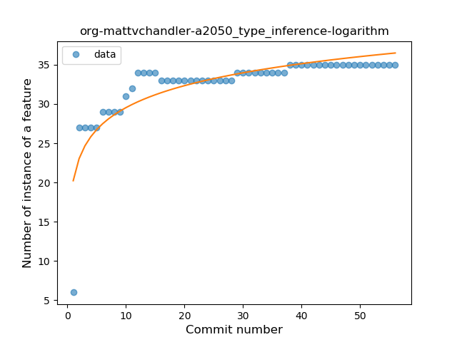

#### tech-ula
* Feature: Property Delegation
* Function: 
* R_Squared: 0.70254242
 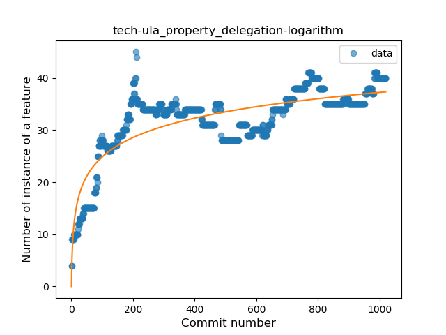

#### eu-depau-etchdroid
* Feature: String Template
* Function: 
* R_Squared: 0.70088327
 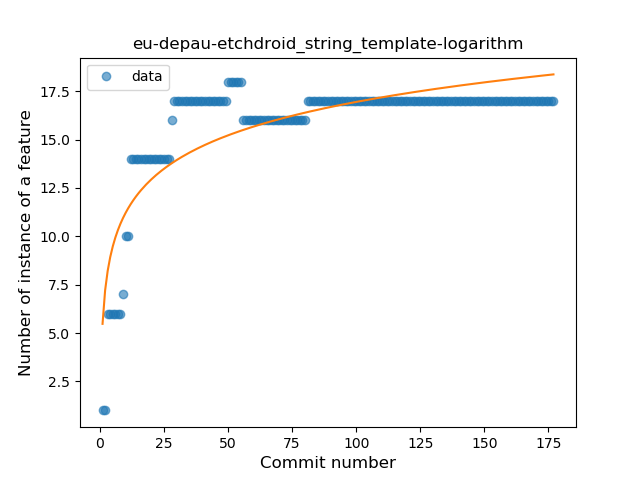

#### ml-adamsprogs-bimba
* Feature: Type Inference
* Function: 
* R_Squared: 0.70042991
 

#### com-guerinet-mymartlet
* Feature: Range Expression
* Function: 
* R_Squared: 0.70013637
 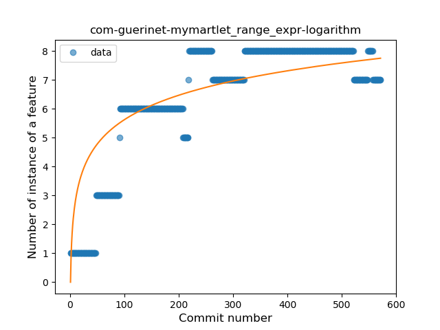

#### acr-browser-lightning
* Feature: Type Inference
* Function: 
* R_Squared: 0.69892533
 

#### com-simplemobiletools-clock
* Feature: Extension Function
* Function: 
* R_Squared: 0.69845978
 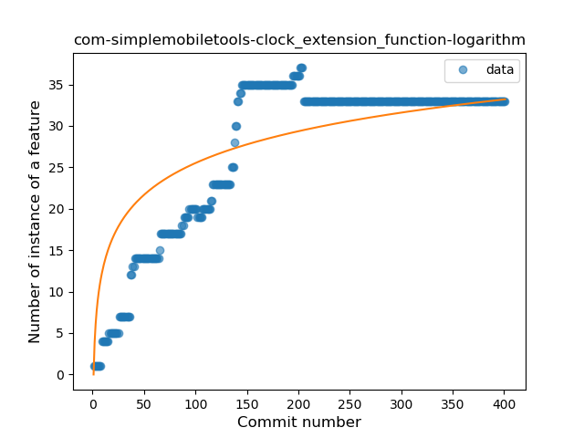

#### com-guerinet-mymartlet
* Feature: Companion Object
* Function: 
* R_Squared: 0.69821742
 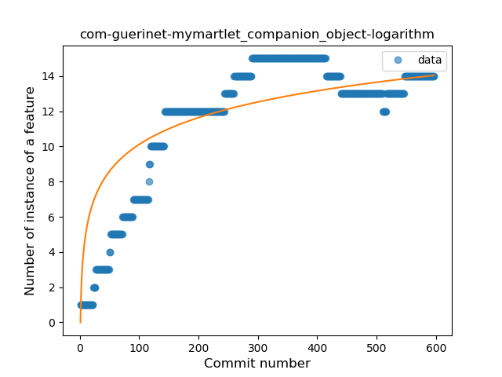

#### org-pacien-tincapp
* Feature: Function with Default Value
* Function: 
* R_Squared: 0.69745373
 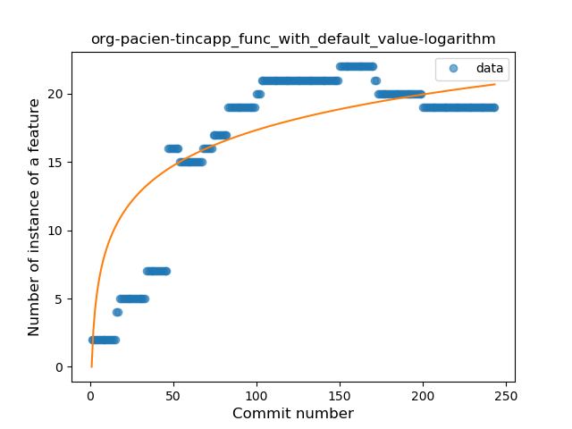

#### org-blitzortung-android-app
* Feature: Function call with Named Argument
* Function: 
* R_Squared: 0.69691695
 

#### com-benoitletondor-easybudgetapp
* Feature: Smart Cast
* Function: 
* R_Squared: 0.69579386
 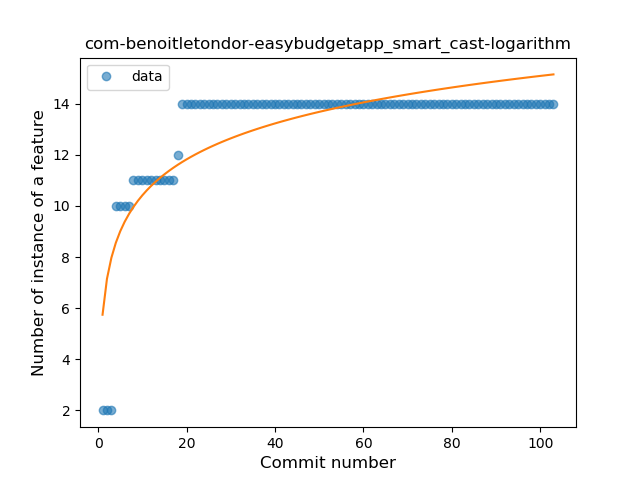

#### jp-toastkid-yobidashi
* Feature: Property Delegation
* Function: 
* R_Squared: 0.69350012
 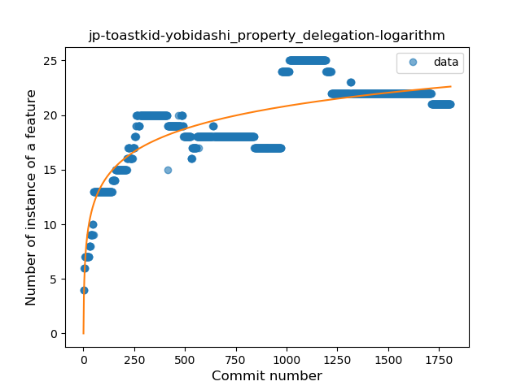

#### me-blog-korn123-easydiary
* Feature: Safe Call
* Function: 
* R_Squared: 0.69160047
 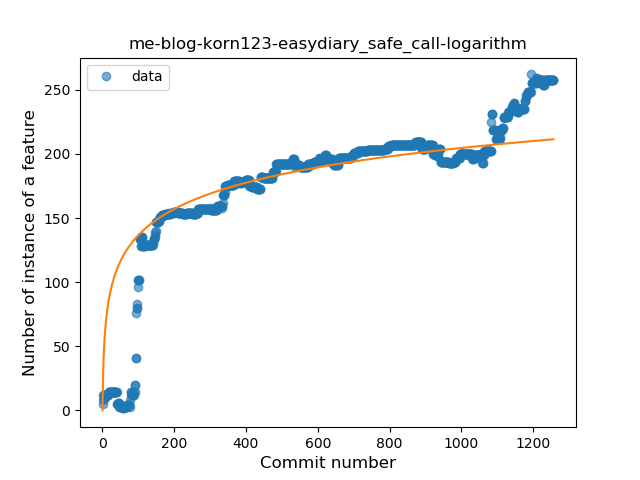

#### com-ofalvai-bpinfo
* Feature: Range Expression
* Function: 
* R_Squared: 0.68871966
 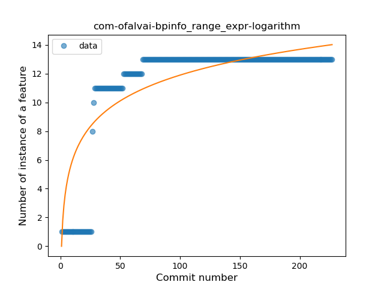

#### com-arcao-geocaching4locus
* Feature: Inline Function
* Function: 
* R_Squared: 0.68718212
 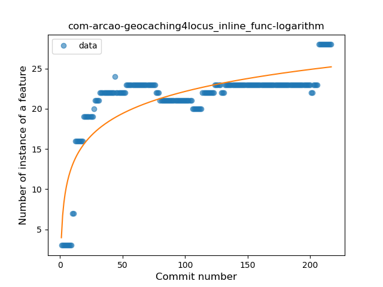

#### es-usc-citius-servando-calendula
* Feature: String Template
* Function: 
* R_Squared: 0.68591946
 

#### info-papdt-express-helper
* Feature: Property Delegation
* Function: 
* R_Squared: 0.68514188
 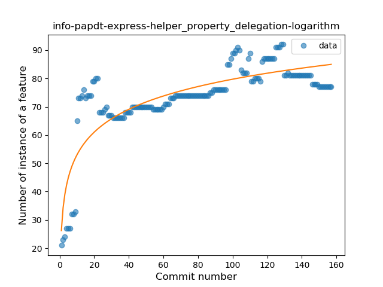

#### cz-dvratil-fbeventsync
* Feature: When expression
* Function: 
* R_Squared: 0.68276422
 

#### nl-mpcjanssen-simpletask
* Feature: Companion Object
* Function: 
* R_Squared: 0.68247573
 

#### pt-ipleiria-mymusicqoe
* Feature: Property Delegation
* Function: 
* R_Squared: 0.68189458
 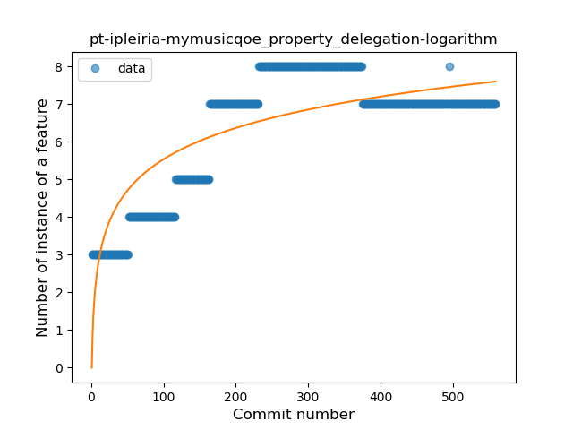

#### com-pluscubed-velociraptor
* Feature: Function call with Named Argument
* Function: 
* R_Squared: 0.68068866
 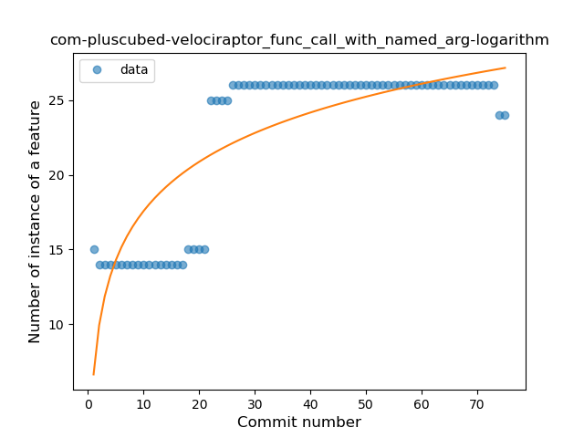

#### com-garpr-android
* Feature: Safe Call
* Function: 
* R_Squared: 0.676825
 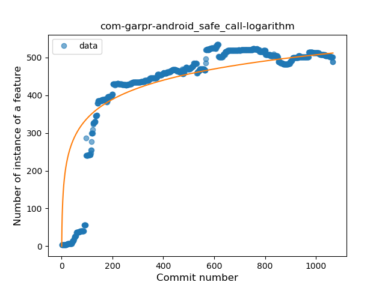

#### com-directdev-portal
* Feature: When expression
* Function: 
* R_Squared: 0.67643571
 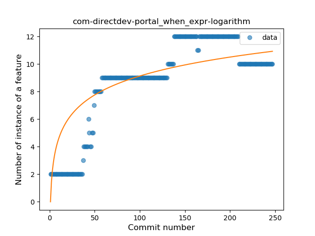

#### com-github-vase4kin-teamcityapp
* Feature: Function call with Named Argument
* Function: 
* R_Squared: 0.67589312
 

#### com-yubico-yubioath
* Feature: Companion Object
* Function: 
* R_Squared: 0.6744532
 

#### de-ph1b-audiobook
* Feature: String Template
* Function: 
* R_Squared: 0.67281471
 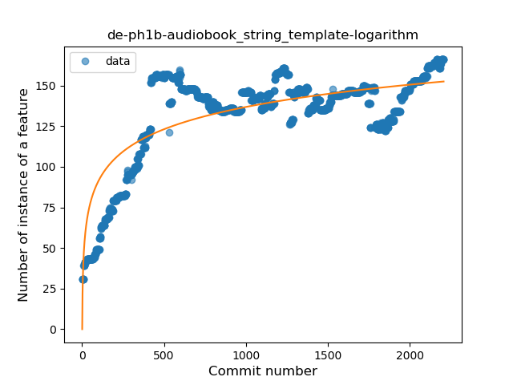

#### com-dp-logcatapp
* Feature: Extension Function
* Function: 
* R_Squared: 0.6695939
 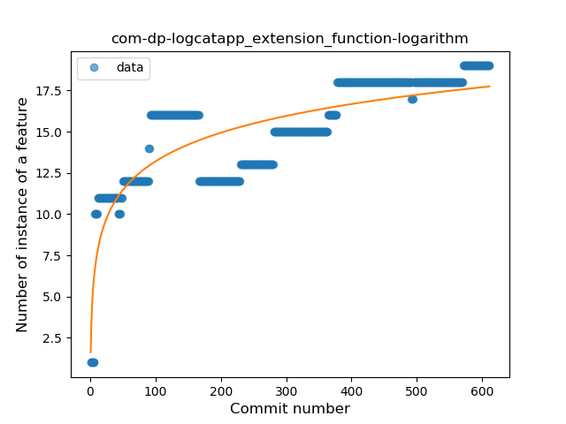

#### nl-mpcjanssen-simpletask
* Feature: Type Inference
* Function: 
* R_Squared: 0.66606576
 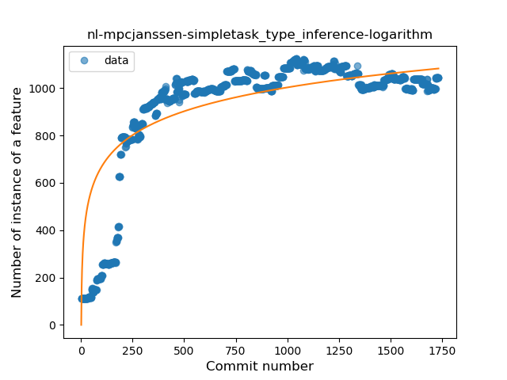

#### com-ofalvai-bpinfo
* Feature: Safe Call
* Function: 
* R_Squared: 0.66313435
 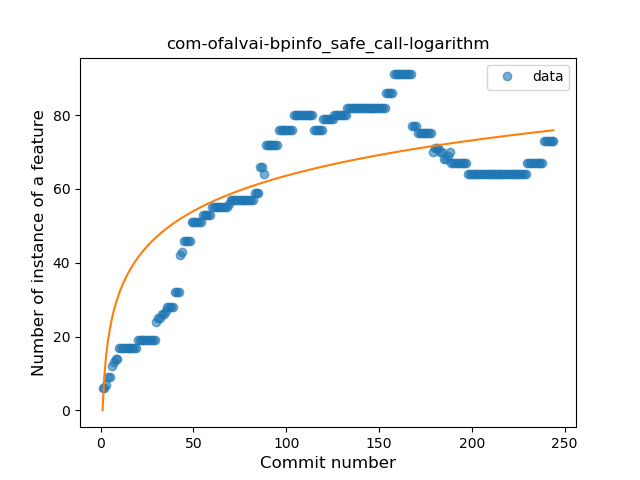

#### app-opass-ccip
* Feature: Function call with Named Argument
* Function: 
* R_Squared: 0.66195117
 

#### me-echeung-moemoekyun-fdroid
* Feature: Safe Call
* Function: 
* R_Squared: 0.66138396
 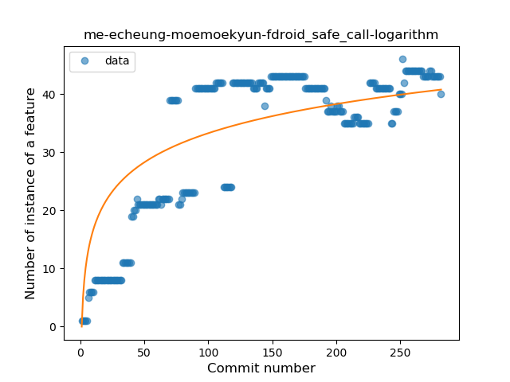

#### nl-mpcjanssen-simpletask
* Feature: Function with Default Value
* Function: 
* R_Squared: 0.65990435
 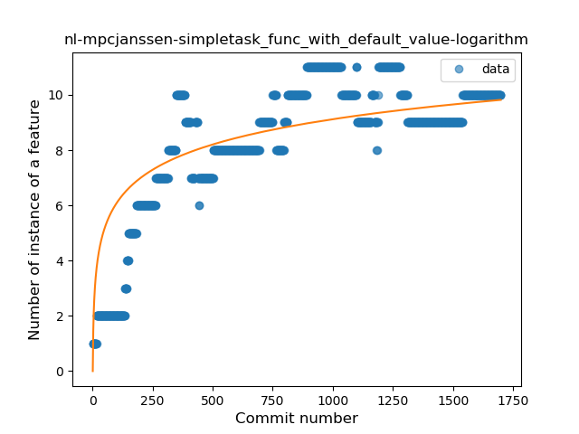

#### fr-cph-chicago-foss
* Feature: Range Expression
* Function: 
* R_Squared: 0.65748064
 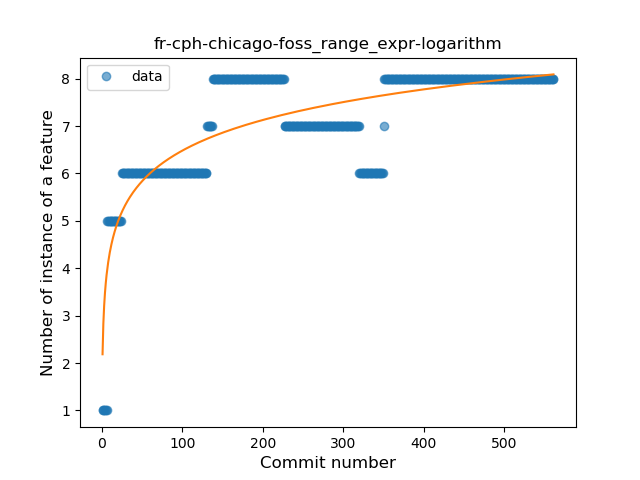

#### fi-tuska-jalkametri
* Feature: String Template
* Function: 
* R_Squared: 0.65669428
 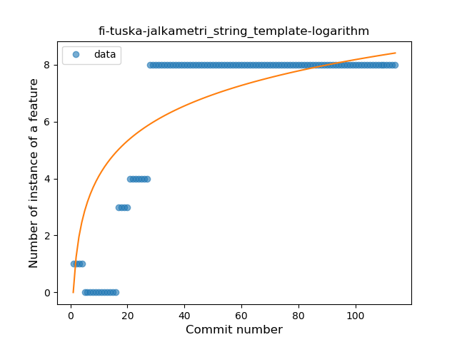

#### acr-browser-lightning
* Feature: Safe Call
* Function: 
* R_Squared: 0.65621476
 

#### de-ph1b-audiobook
* Feature: Companion Object
* Function: 
* R_Squared: 0.65495145
 

#### com-zacharee1-systemuituner
* Feature: Extension Function
* Function: 
* R_Squared: 0.65492629
 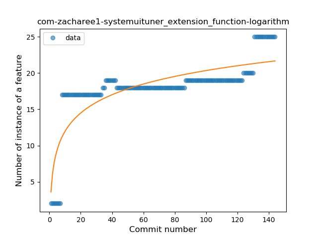

#### org-poul-bits-android
* Feature: Function call with Named Argument
* Function: 
* R_Squared: 0.65237667
 

#### de-geeksfactory-opacclient
* Feature: Unsafe Call
* Function: 
* R_Squared: 0.64909217
 

#### uk-colessoft-android-hilllist
* Feature: String Template
* Function: 
* R_Squared: 0.6490625
 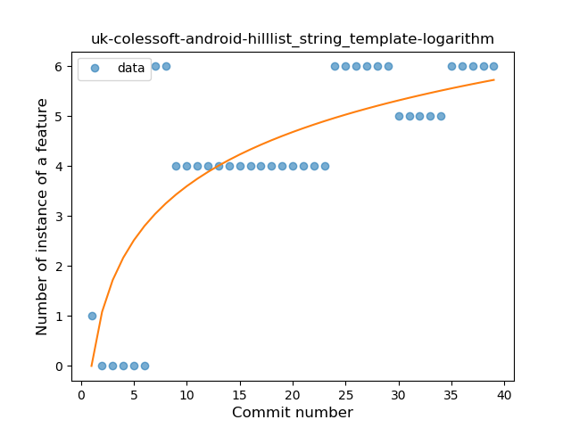

#### com-pennapps-labs-pennmobile
* Feature: Type Inference
* Function: 
* R_Squared: 0.64850236
 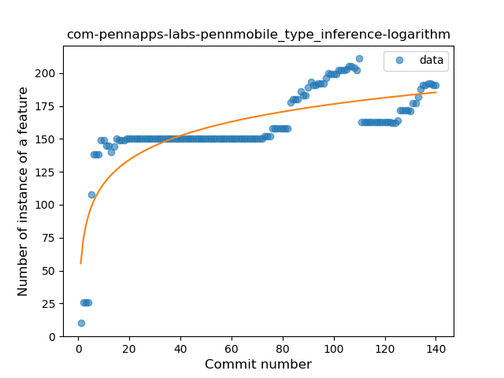

#### pl-org-seva-texter
* Feature: Safe Call
* Function: 
* R_Squared: 0.6483758
 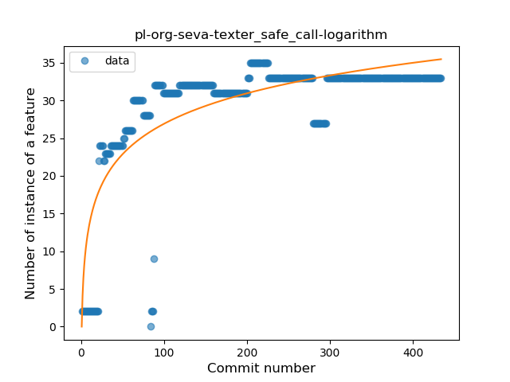

#### de-devmil-paperlaunch
* Feature: Companion Object
* Function: 
* R_Squared: 0.64521201
 

#### com-etesync-syncadapter
* Feature: Type Inference
* Function: 
* R_Squared: 0.64518926
 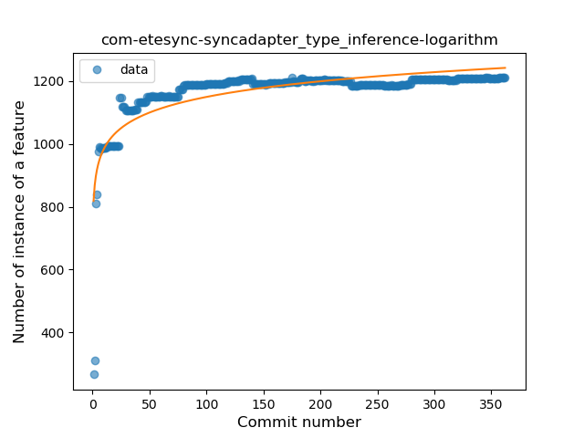

#### ru-hyst329-openfool
* Feature: Property Delegation
* Function: 
* R_Squared: 0.64491444
 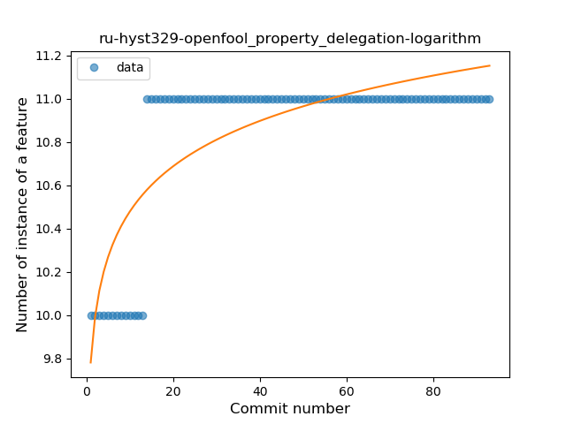

#### com-epimorphics-android-myrivers
* Feature: Unsafe Call
* Function: 
* R_Squared: 0.64402947
 

#### sk-styk-martin-apkanalyzer
* Feature: Companion Object
* Function: 
* R_Squared: 0.63971162
 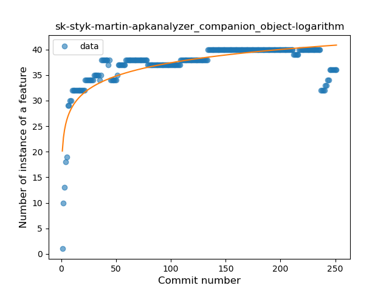

#### net-bible-android-activity
* Feature: Data Class
* Function: 
* R_Squared: 0.63526405
 

#### org-moire-ultrasonic
* Feature: Property Delegation
* Function: 
* R_Squared: 0.63241582
 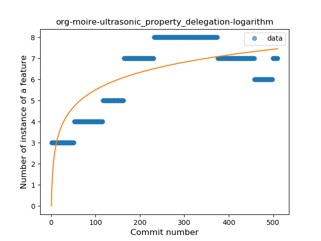

#### net-syncthing-lite
* Feature: Safe Call
* Function: 
* R_Squared: 0.62750171
 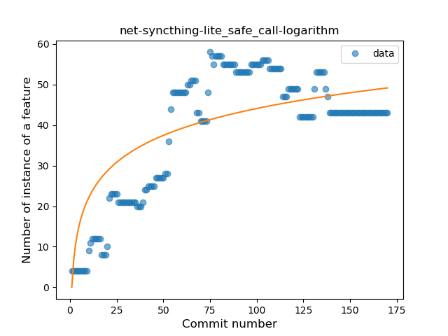

#### eu-depau-etchdroid
* Feature: Unsafe Call
* Function: 
* R_Squared: 0.62496912
 

#### cat-pantsu-nyaapantsu
* Feature: Unsafe Call
* Function: 
* R_Squared: 0.62252053
 

#### com-glodanif-bluetoothchat
* Feature: Function call with Named Argument
* Function: 
* R_Squared: 0.6181184
 

#### eu-the4thfloor-msync
* Feature: Smart Cast
* Function: 
* R_Squared: 0.61651526
 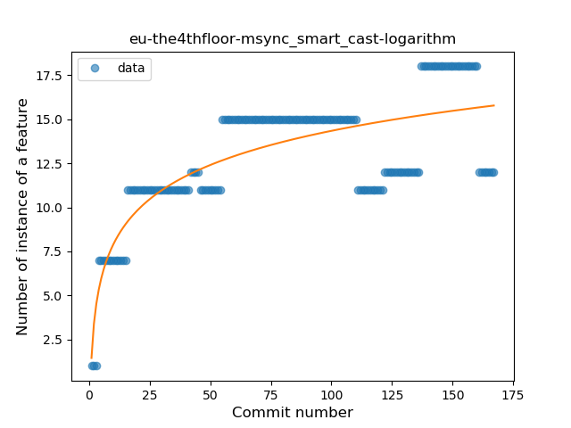

#### net-yslibrary-monotweety
* Feature: When expression
* Function: 
* R_Squared: 0.61626219
 

#### pl-org-seva-texter
* Feature: Companion Object
* Function: 
* R_Squared: 0.61551661
 

#### at-bitfire-davdroid
* Feature: Type Inference
* Function: 
* R_Squared: 0.60914322
 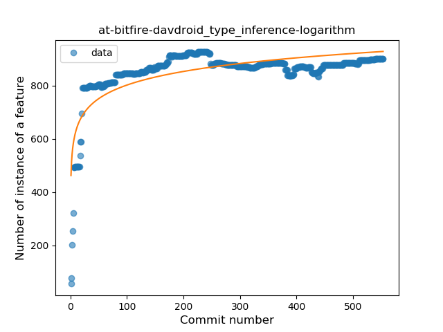

#### io-github-benoitduffez-cupsprint
* Feature: Lambda
* Function: 
* R_Squared: 0.60845899
 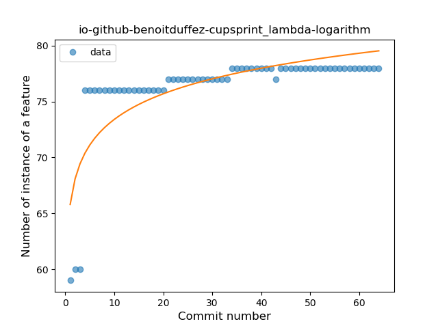

#### at-bitfire-davdroid
* Feature: Companion Object
* Function: 
* R_Squared: 0.60785689
 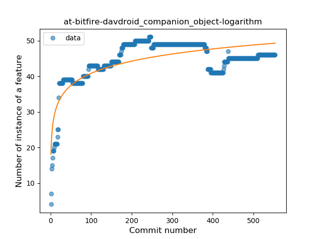

#### com-doctoror-particleswallpaper
* Feature: Property Delegation
* Function: 
* R_Squared: 0.60647111
 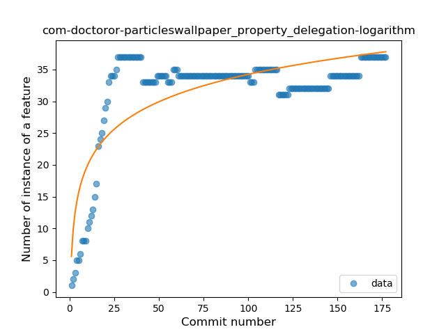

#### cat-xojan-random1
* Feature: Property Delegation
* Function: 
* R_Squared: 0.6034956
 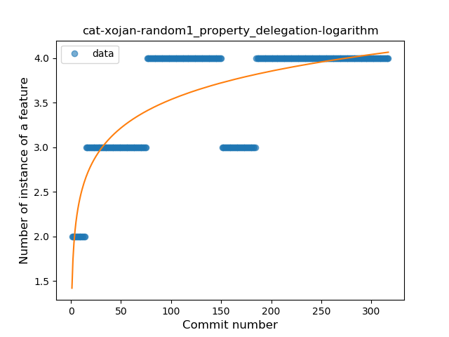

#### org-moire-ultrasonic
* Feature: Extension Function
* Function: 
* R_Squared: 0.60253701
 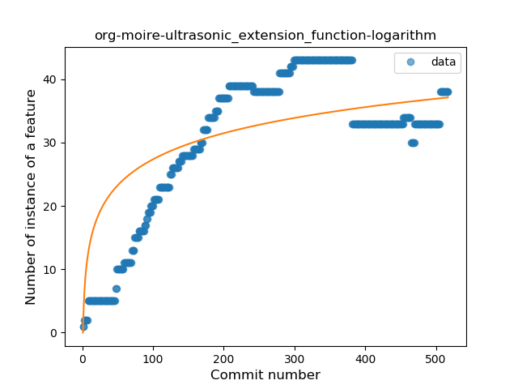

#### sk-styk-martin-apkanalyzer
* Feature: When expression
* Function: 
* R_Squared: 0.60126018
 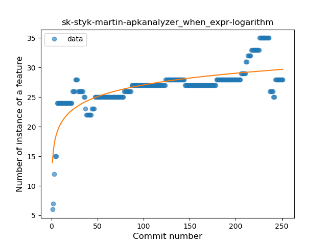

#### se-barsk-park
* Feature: Singleton
* Function: 
* R_Squared: 0.59924169
 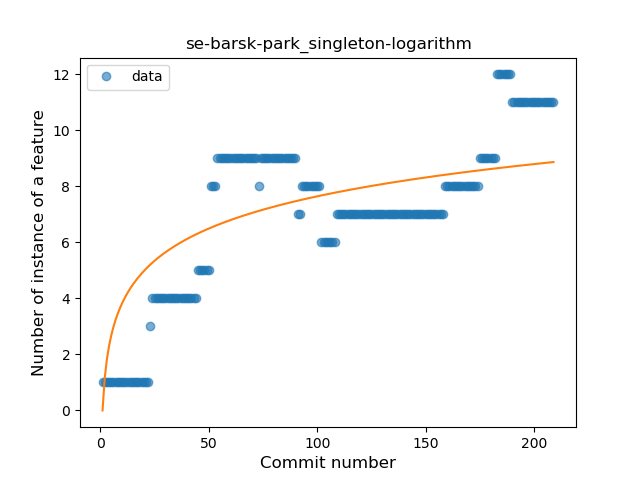

#### app-simone
* Feature: Lambda
* Function: 
* R_Squared: 0.59907534
 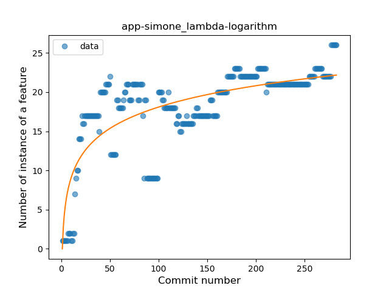

#### com-calintat-units
* Feature: Safe Call
* Function: 
* R_Squared: 0.59732605
 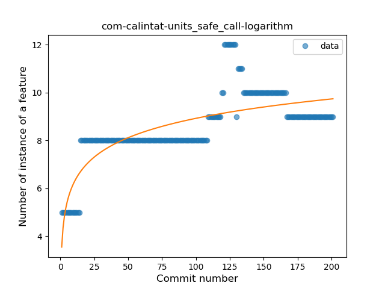

#### com-breadwallet
* Feature: Extension Function
* Function: 
* R_Squared: 0.59648551
 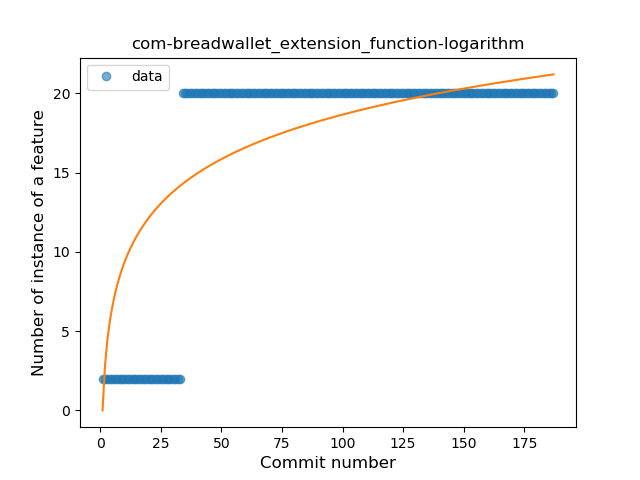

#### ml-adamsprogs-bimba
* Feature: String Template
* Function: 
* R_Squared: 0.5959493
 

#### org-ligi-survivalmanual
* Feature: Safe Call
* Function: 
* R_Squared: 0.59404083
 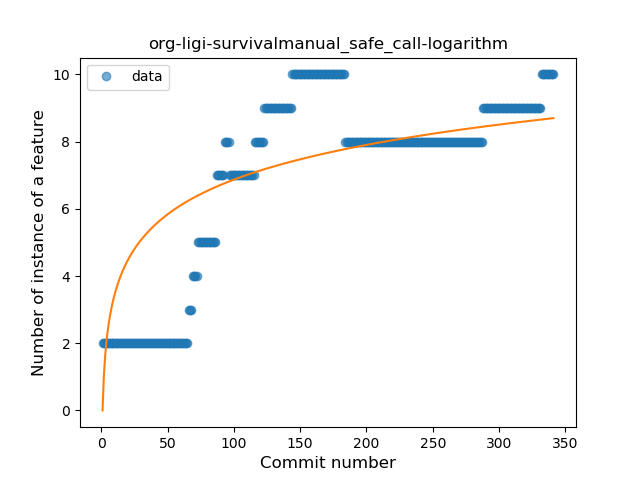

#### org-ligi-ipfsdroid
* Feature: Type Inference
* Function: 
* R_Squared: 0.59325015
 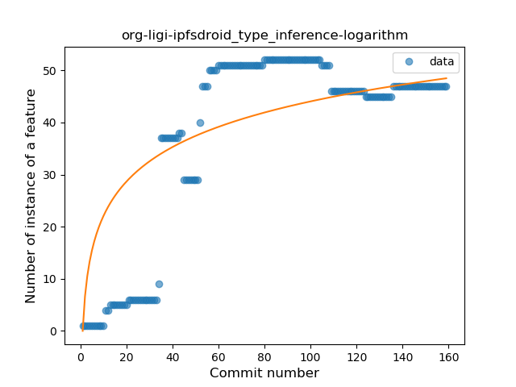

#### info-dvkr-screenstream
* Feature: Function call with Named Argument
* Function: 
* R_Squared: 0.59144537
 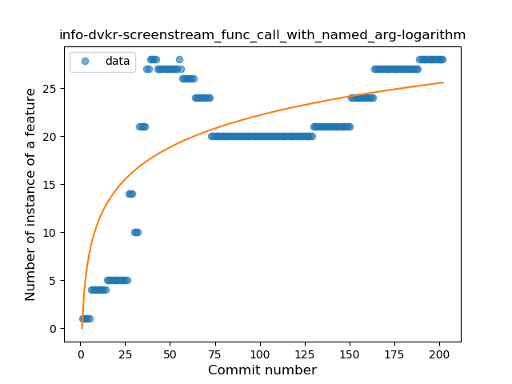

#### com-guerinet-mymartlet
* Feature: When expression
* Function: 
* R_Squared: 0.59127914
 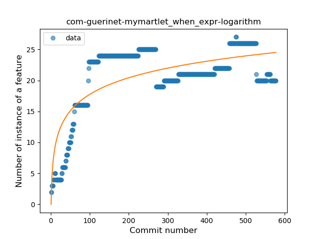

#### is-xyz-mpv
* Feature: Unsafe Call
* Function: 
* R_Squared: 0.59089419
 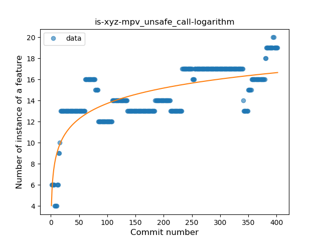

#### com-garpr-android
* Feature: Smart Cast
* Function: 
* R_Squared: 0.59067216
 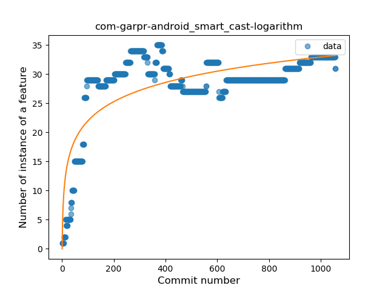

#### at-bitfire-icsdroid
* Feature: Lambda
* Function: 
* R_Squared: 0.58724942
 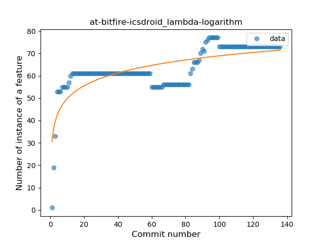

#### app-opass-ccip
* Feature: Coroutine
* Function: 
* R_Squared: 0.58436051
 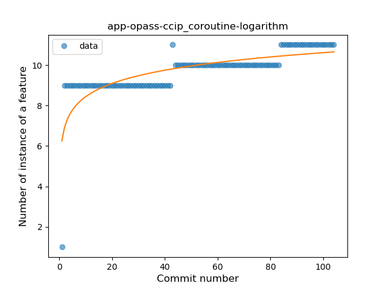

#### is-xyz-mpv
* Feature: Data Class
* Function: 
* R_Squared: 0.58344717
 

#### com-commit451-gitlab
* Feature: When expression
* Function: 
* R_Squared: 0.58214847
 

#### com-calintat-sensors
* Feature: Safe Call
* Function: 
* R_Squared: 0.58131562
 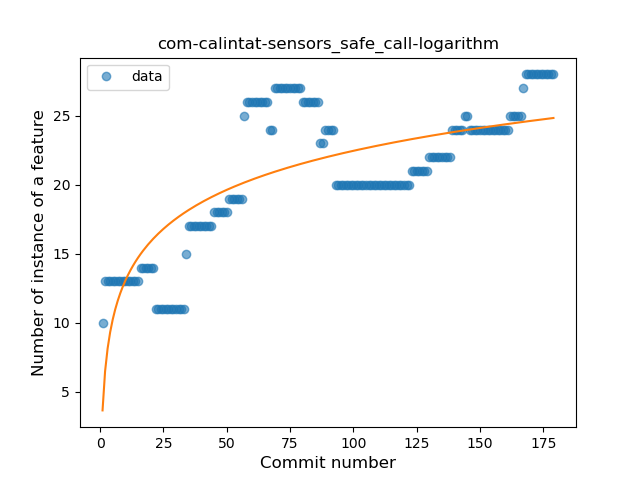

#### org-walleth
* Feature: Companion Object
* Function: 
* R_Squared: 0.58125673
 

#### pl-org-seva-texter
* Feature: When expression
* Function: 
* R_Squared: 0.58066299
 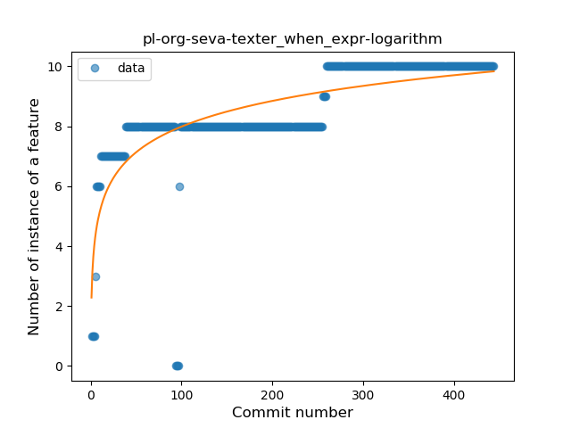

#### com-pitchedapps-frost
* Feature: Overloaded Operator
* Function: 
* R_Squared: 0.58047748
 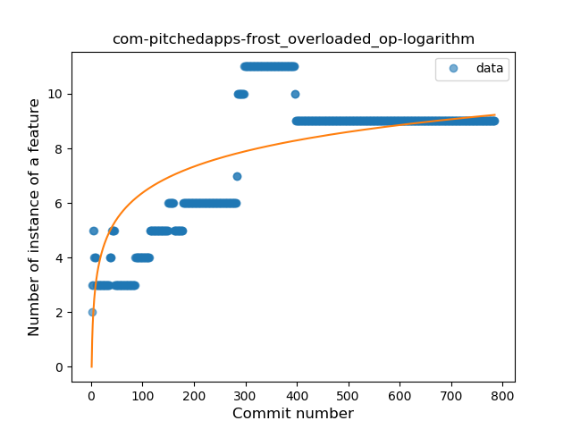

#### com-pluscubed-velociraptor
* Feature: Coroutine
* Function: 
* R_Squared: 0.56974532
 

#### org-mattvchandler-progressbars
* Feature: Companion Object
* Function: 
* R_Squared: 0.56913301
 

#### com-benoitquenaudon-tvfoot-red
* Feature: Property Delegation
* Function: 
* R_Squared: 0.565934
 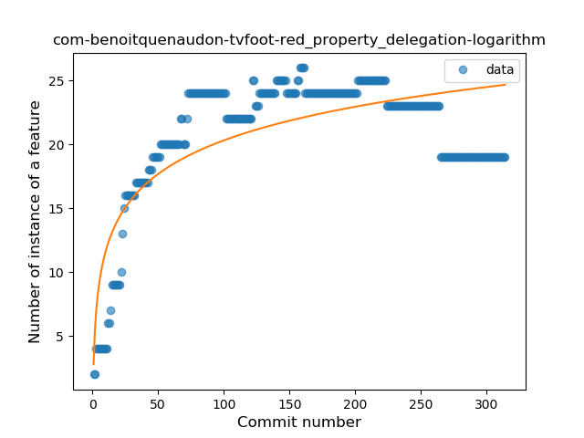

#### org-pacien-tincapp
* Feature: Safe Call
* Function: 
* R_Squared: 0.56147861
 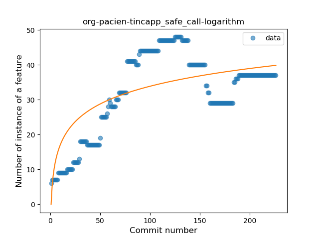

#### org-mattvchandler-a2050
* Feature: Unsafe Call
* Function: 
* R_Squared: 0.55502104
 

#### de-blankedv-lanbahnpanel
* Feature: String Template
* Function: 
* R_Squared: 0.54851165
 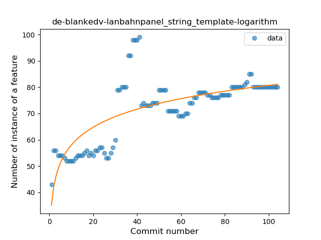

#### org-kiwix-kiwixcustomwikivoyageeurope
* Feature: Type Inference
* Function: 
* R_Squared: 0.54213777
 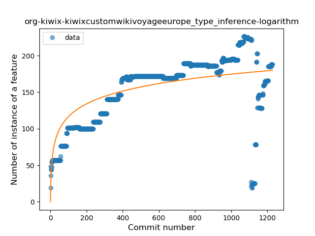

#### com-yubico-yubioath
* Feature: Range Expression
* Function: 
* R_Squared: 0.53881576
 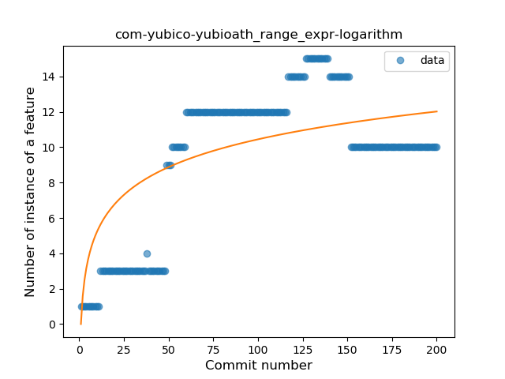

#### org-ligi-ipfsdroid
* Feature: String Template
* Function: 
* R_Squared: 0.53418097
 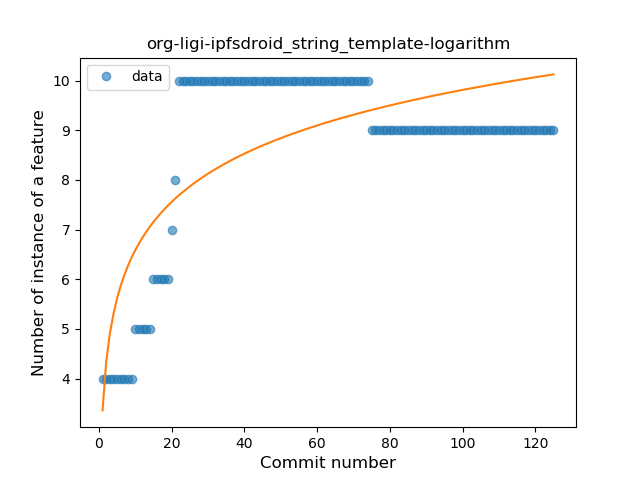

#### com-bijoysingh-quicknote
* Feature: Companion Object
* Function: 
* R_Squared: 0.53259233
 

#### com-booboot-vndbandroid
* Feature: Singleton
* Function: 
* R_Squared: 0.53031917
 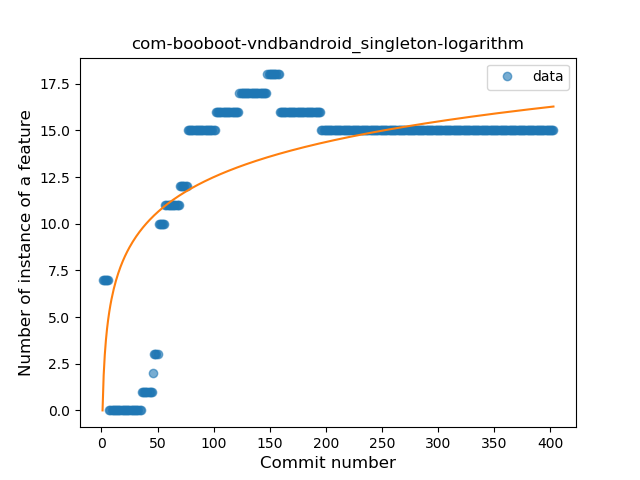

#### org-mattvchandler-progressbars
* Feature: String Template
* Function: 
* R_Squared: 0.52300649
 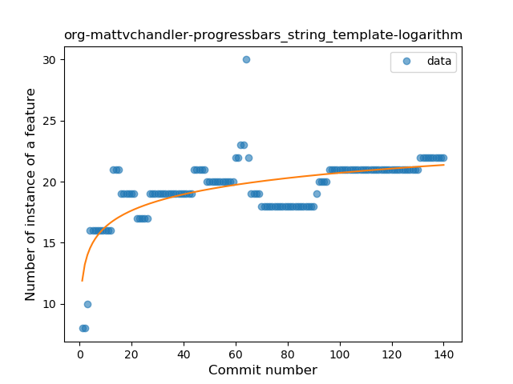

#### net-nurik-roman-muzei
* Feature: Destructuring Declaration
* Function: 
* R_Squared: 0.51857827
 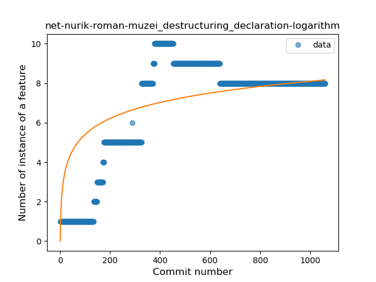

#### org-kiwix-kiwixcustomwikivoyageeurope
* Feature: Extension Function
* Function: 
* R_Squared: 0.51657486
 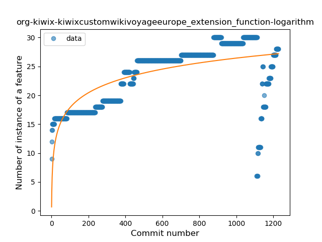

#### streetwalrus-usbmountr
* Feature: Unsafe Call
* Function: 
* R_Squared: 0.5149403
 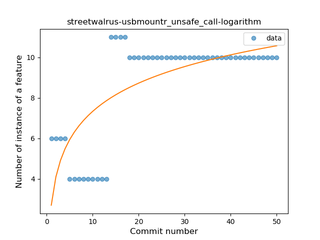

#### com-simplemobiletools-contacts-pro
* Feature: Data Class
* Function: 
* R_Squared: 0.51370152
 

#### com-yubico-yubioath
* Feature: Type Inference
* Function: 
* R_Squared: 0.50102989
 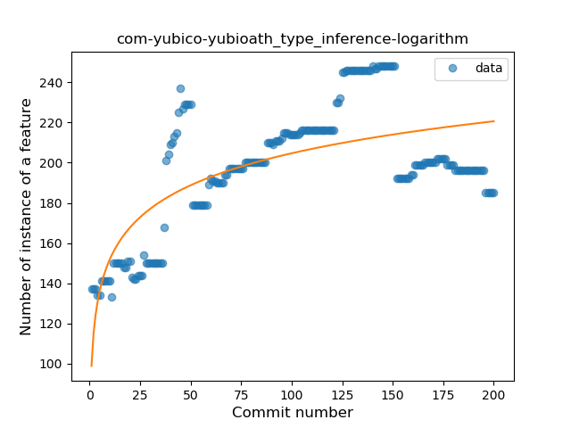

#### net-nurik-roman-muzei
* Feature: Singleton
* Function: 
* R_Squared: 0.49937488
 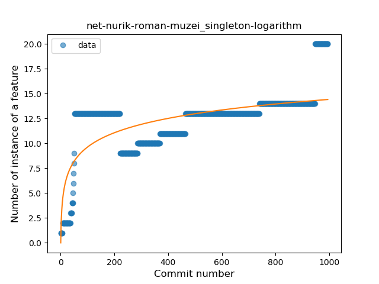

#### com-eventyay-attendee
* Feature: Smart Cast
* Function: 
* R_Squared: 0.49812273
 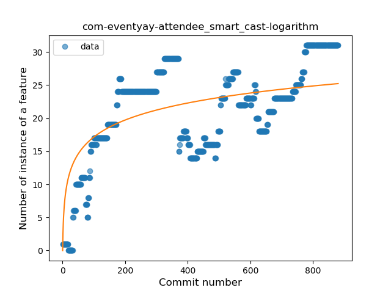

#### ch-rmy-android-http_shortcuts
* Feature: Extension Function
* Function: 
* R_Squared: 0.49724524
 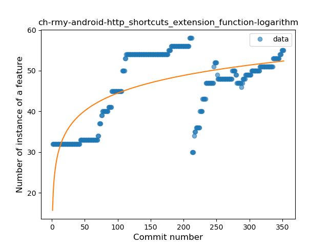

#### org-kiwix-kiwixcustomwikivoyageeurope
* Feature: Function call with Named Argument
* Function: 
* R_Squared: 0.49395696
 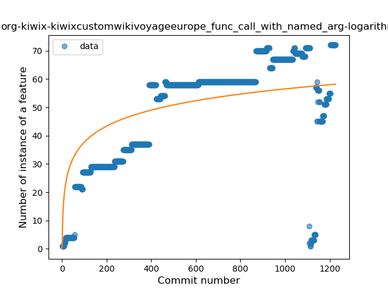

#### com-utazukin-ichaival
* Feature: Smart Cast
* Function: 
* R_Squared: 0.48815894
 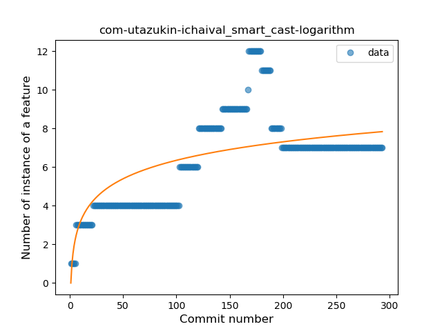

#### com-atanana-sicounter
* Feature: Type Inference
* Function: 
* R_Squared: 0.48666255
 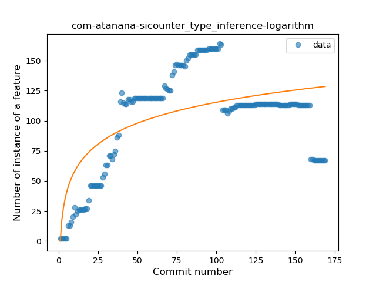

#### com-booboot-vndbandroid
* Feature: Smart Cast
* Function: 
* R_Squared: 0.47221495
 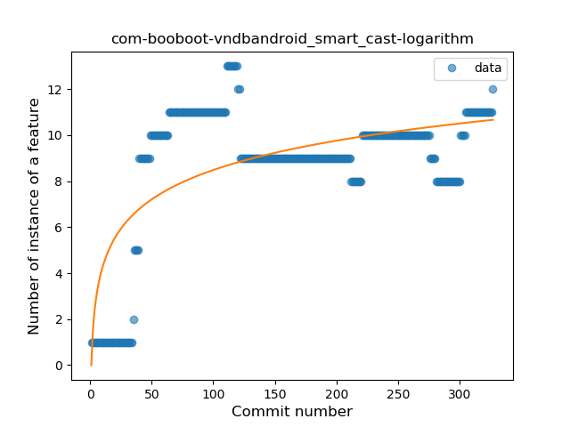

#### com-arcao-geocaching4locus
* Feature: String Template
* Function: 
* R_Squared: 0.46919074
 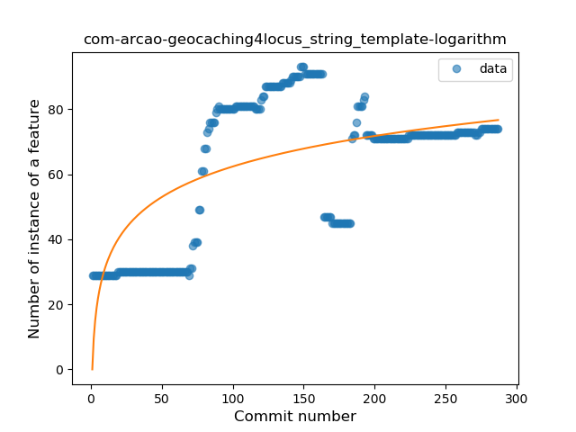

#### sk-styk-martin-apkanalyzer
* Feature: Singleton
* Function: 
* R_Squared: 0.46866101
 

#### com-yubico-yubioath
* Feature: Function with Default Value
* Function: 
* R_Squared: 0.46856849
 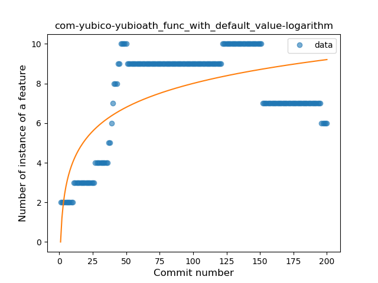

#### com-ids1024-whitakerswords
* Feature: Type Inference
* Function: 
* R_Squared: 0.46546314
 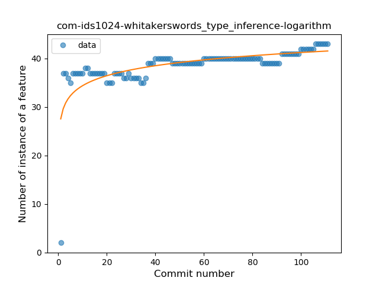

#### com-conorodonnell-bus
* Feature: Property Delegation
* Function: 
* R_Squared: 0.46538255
 

#### com-jidogoon-roundedscreen
* Feature: Safe Call
* Function: 
* R_Squared: 0.4650082
 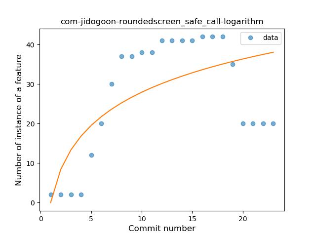

#### com-sduduzog-slimlauncher
* Feature: Lambda
* Function: 
* R_Squared: 0.45962116
 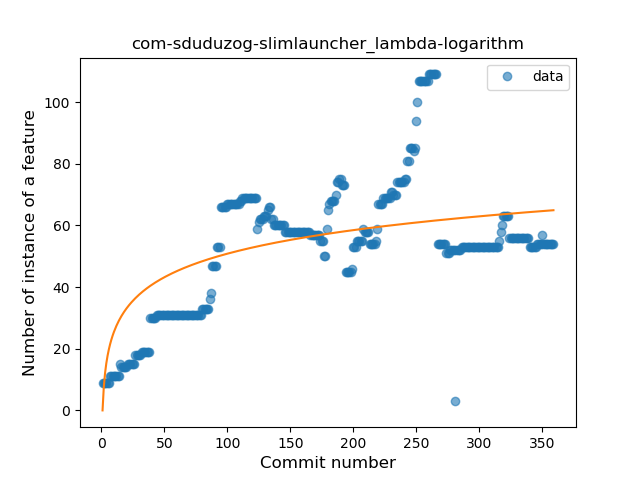

#### at-bitfire-davdroid
* Feature: Safe Call
* Function: 
* R_Squared: 0.45951312
 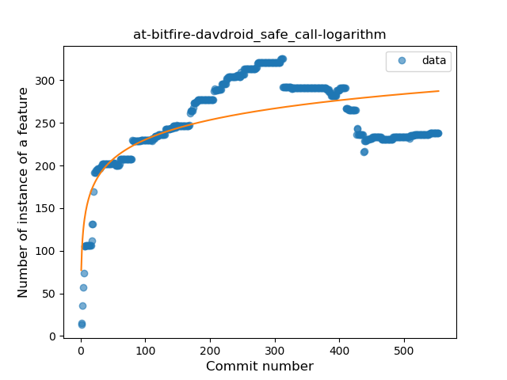

#### eu-the4thfloor-msync
* Feature: Type Inference
* Function: 
* R_Squared: 0.45397518
 

#### sk-styk-martin-apkanalyzer
* Feature: Smart Cast
* Function: 
* R_Squared: 0.45197578
 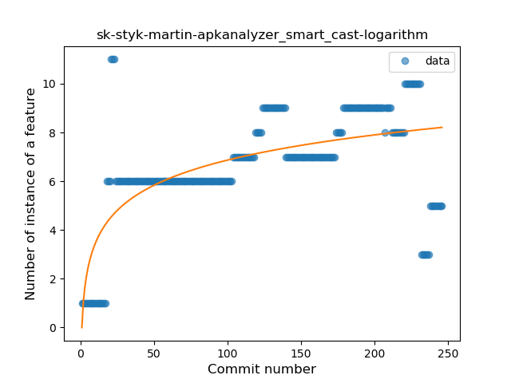

#### org-sanpra-checklist
* Feature: Type Inference
* Function: 
* R_Squared: 0.45044794
 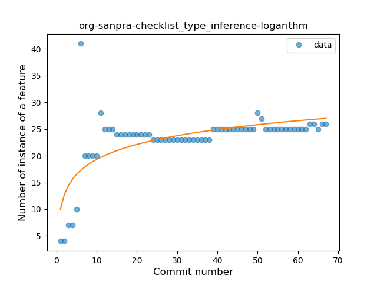

#### sk-styk-martin-apkanalyzer
* Feature: Function call with Named Argument
* Function: 
* R_Squared: 0.44549557
 

#### com-bubelov-coins
* Feature: Safe Call
* Function: 
* R_Squared: 0.43997216
 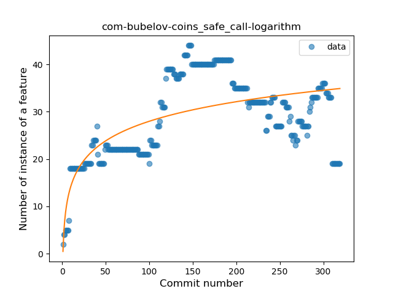

#### ru-nsu-bobrofon-easysshfs
* Feature: Function with Default Value
* Function: 
* R_Squared: 0.42790041
 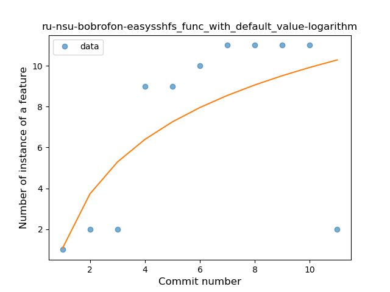

#### net-nurik-roman-muzei
* Feature: Range Expression
* Function: 
* R_Squared: 0.42186017
 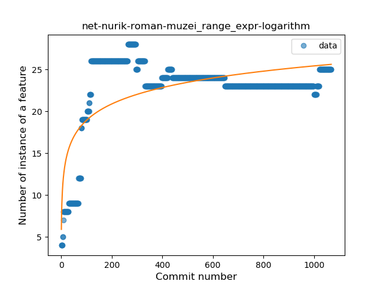

#### sk-styk-martin-apkanalyzer
* Feature: Type Inference
* Function: 
* R_Squared: 0.42002829
 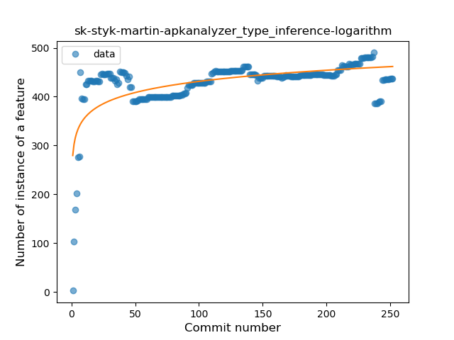

#### com-simplemobiletools-contacts-pro
* Feature: String Template
* Function: 
* R_Squared: 0.41755812
 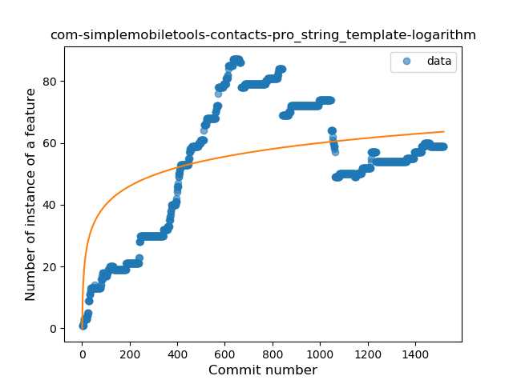

#### im-vector-alpha
* Feature: Super Delegation
* Function: 
* R_Squared: 0.41294738
 

#### org-kiwix-kiwixcustomwikivoyageeurope
* Feature: When expression
* Function: 
* R_Squared: 0.41178176
 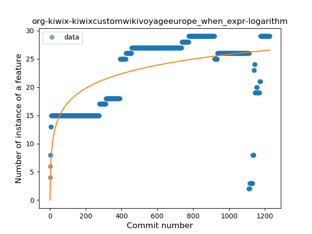

#### com-peterlaurence-trekme
* Feature: Destructuring Declaration
* Function: 
* R_Squared: 0.40569483
 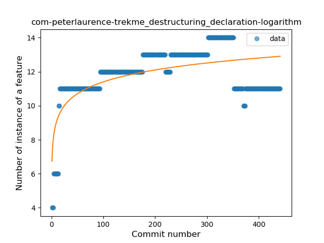

#### com-lavadip-miniVector
* Feature: Super Delegation
* Function: 
* R_Squared: 0.40363578
 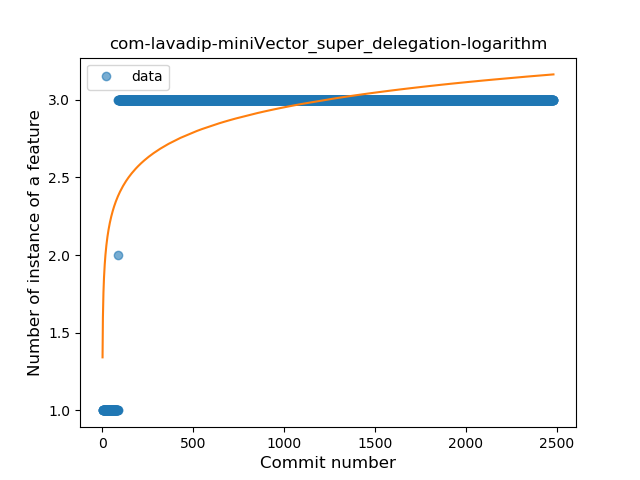

#### pl-org-seva-texter
* Feature: Type Inference
* Function: 
* R_Squared: 0.40227542
 

#### com-moez-QKSMS
* Feature: Property Delegation
* Function: 
* R_Squared: 0.39872031
 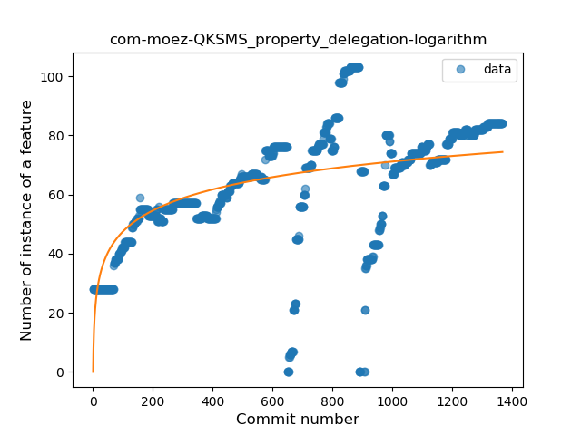

#### com-nononsenseapps-feeder
* Feature: Unsafe Call
* Function: 
* R_Squared: 0.39620207
 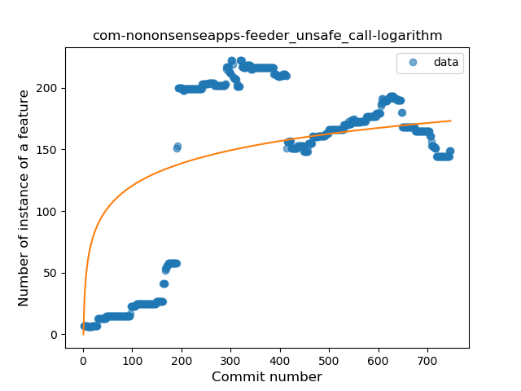

#### superustats-tool-android
* Feature: Lambda
* Function: 
* R_Squared: 0.3898972
 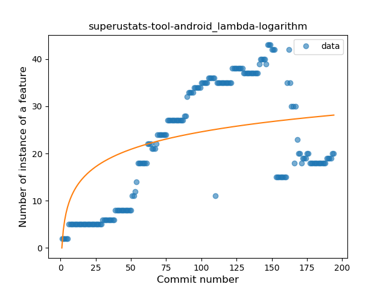

#### com-simplemobiletools-calculator
* Feature: When expression
* Function: 
* R_Squared: 0.38520838
 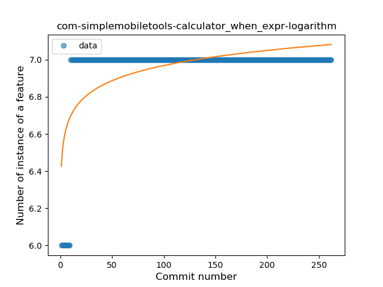

#### eu-the4thfloor-msync
* Feature: Lambda
* Function: 
* R_Squared: 0.38396983
 

#### fr-openium-auvergnewebcams
* Feature: Property Delegation
* Function: 
* R_Squared: 0.37232438
 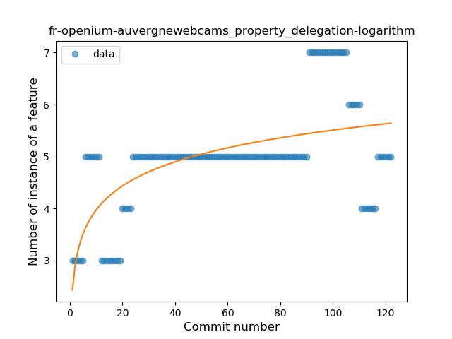

#### org-kiwix-kiwixcustomwikivoyageeurope
* Feature: Sealed Class
* Function: 
* R_Squared: 0.36870292
 

#### com-sduduzog-slimlauncher
* Feature: Unsafe Call
* Function: 
* R_Squared: 0.36545583
 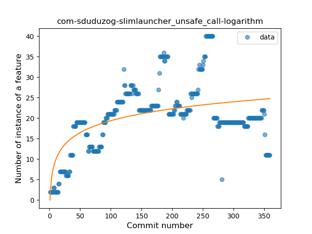

#### com-yubico-yubioath
* Feature: Data Class
* Function: 
* R_Squared: 0.36407616
 

#### quickbeer-android
* Feature: Singleton
* Function: 
* R_Squared: 0.36290151
 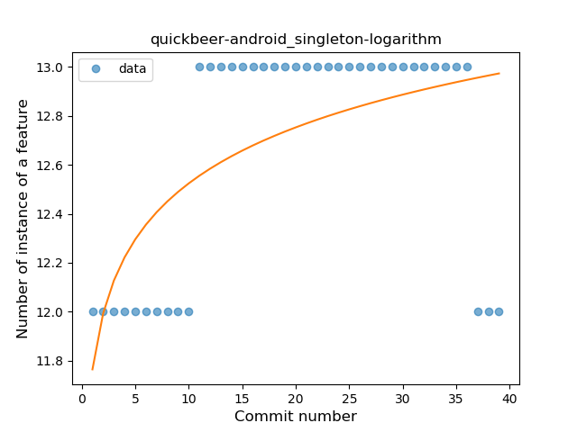

#### pw-janyo-whatanime
* Feature: Singleton
* Function: 
* R_Squared: 0.36052395
 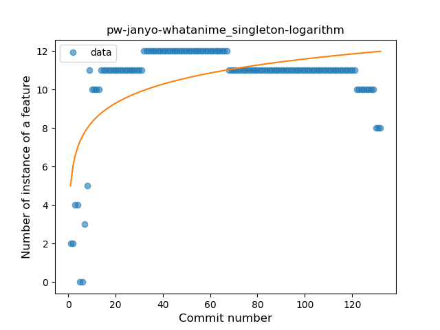

#### net-stew-stew
* Feature: Unsafe Call
* Function: 
* R_Squared: 0.35621674
 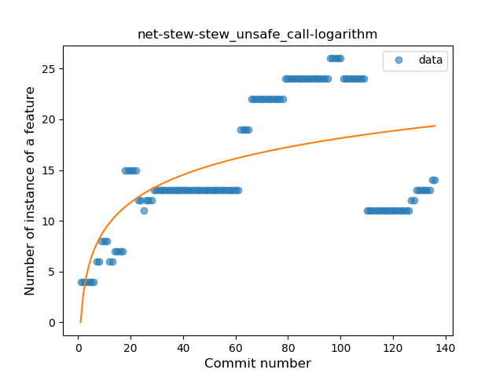

#### io-github-wulkanowy
* Feature: Inline Function
* Function: 
* R_Squared: 0.35188978
 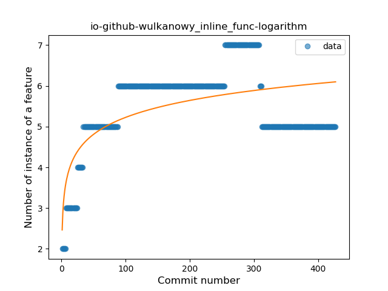

#### com-benoitletondor-easybudgetapp
* Feature: Singleton
* Function: 
* R_Squared: 0.34079239
 

#### com-zeapo-pwdstore
* Feature: Data Class
* Function: 
* R_Squared: 0.33534915
 

#### com-simplemobiletools-calendar-pro
* Feature: String Template
* Function: 
* R_Squared: 0.33427151
 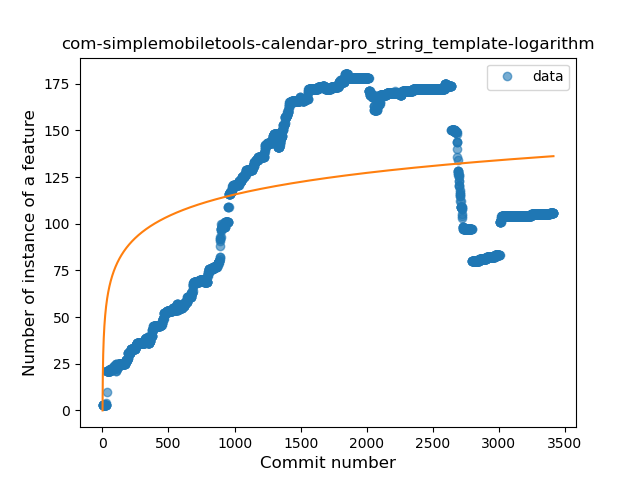

#### org-kiwix-kiwixcustomwikivoyageeurope
* Feature: Data Class
* Function: 
* R_Squared: 0.33101253
 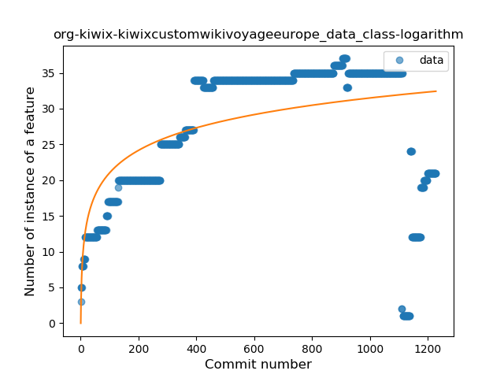

#### org-blitzortung-android-app
* Feature: Range Expression
* Function: 
* R_Squared: 0.3239736
 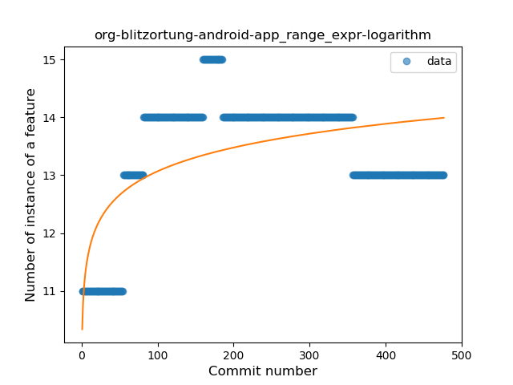

#### com-simplemobiletools-thankyou
* Feature: Type Inference
* Function: 
* R_Squared: 0.32369648
 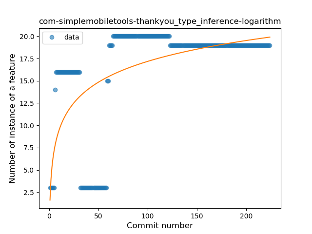

#### com-eventyay-attendee
* Feature: Safe Call
* Function: 
* R_Squared: 0.32240547
 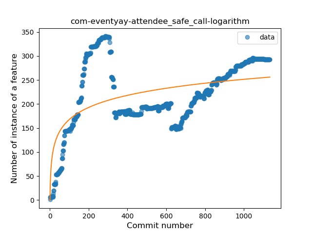

#### com-simplemobiletools-applauncher
* Feature: String Template
* Function: 
* R_Squared: 0.31885408
 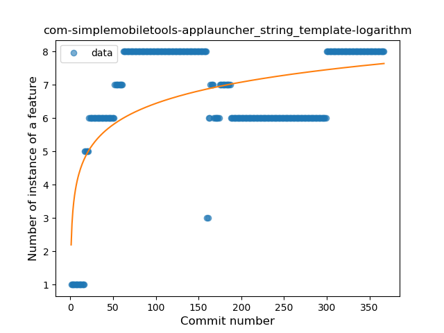

#### com-garpr-android
* Feature: Extension Function
* Function: 
* R_Squared: 0.29610202
 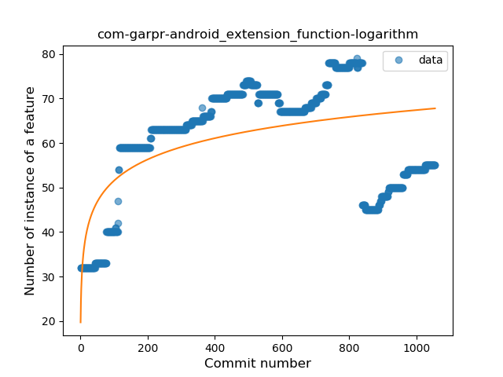

#### com-commit451-gitlab
* Feature: Unsafe Call
* Function: 
* R_Squared: 0.29324264
 

#### com-pennapps-labs-pennmobile
* Feature: Safe Call
* Function: 
* R_Squared: 0.28480416
 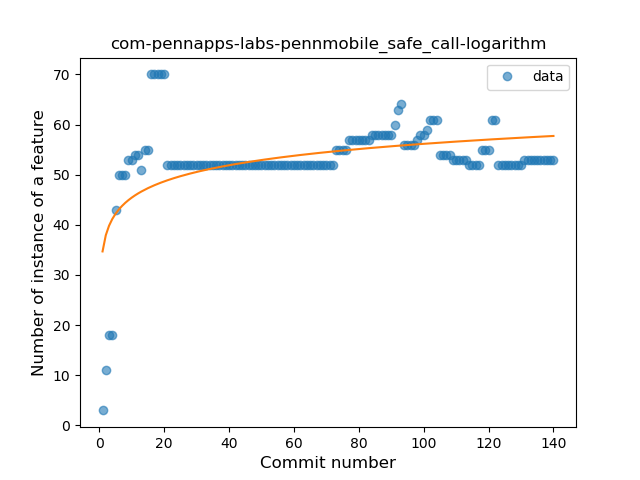

#### me-camsteffen-polite
* Feature: Unsafe Call
* Function: 
* R_Squared: 0.27660026
 

#### me-echeung-moemoekyun-fdroid
* Feature: Type Inference
* Function: 
* R_Squared: 0.27221323
 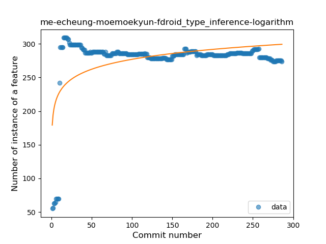

#### apps-jizzu-simpletodo
* Feature: Companion Object
* Function: 
* R_Squared: 0.27192785
 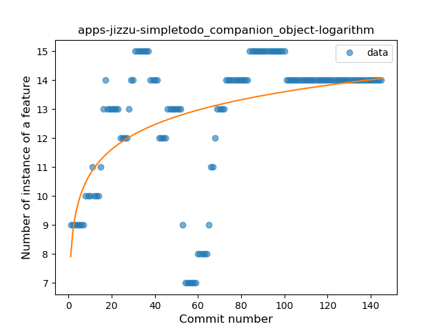

#### at-bitfire-icsdroid
* Feature: Singleton
* Function: 
* R_Squared: 0.26623551
 

#### com-yubico-yubioath
* Feature: Function call with Named Argument
* Function: 
* R_Squared: 0.26109587
 

#### de-ironjan-mensaupb
* Feature: Range Expression
* Function: 
* R_Squared: 0.25543441
 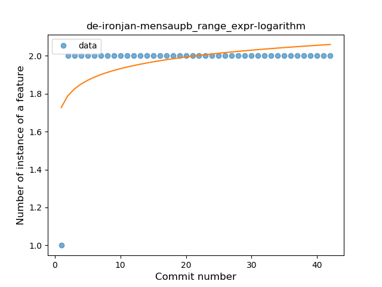

#### de-blankedv-lanbahnpanel
* Feature: Range Expression
* Function: 
* R_Squared: 0.25495682
 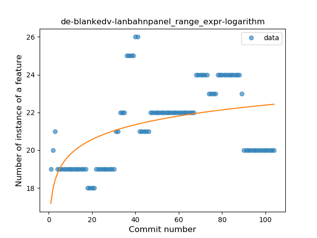

#### com-peterlaurence-trekme
* Feature: Super Delegation
* Function: 
* R_Squared: 0.25481405
 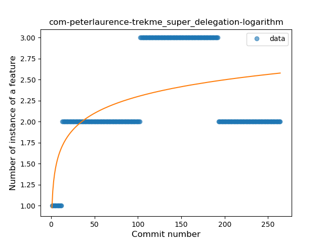

#### com-bubelov-coins
* Feature: Function with Default Value
* Function: 
* R_Squared: 0.25347778
 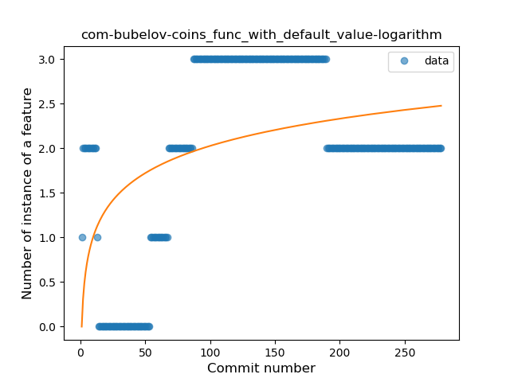

#### fr-cph-chicago-foss
* Feature: Destructuring Declaration
* Function: 
* R_Squared: 0.24976292
 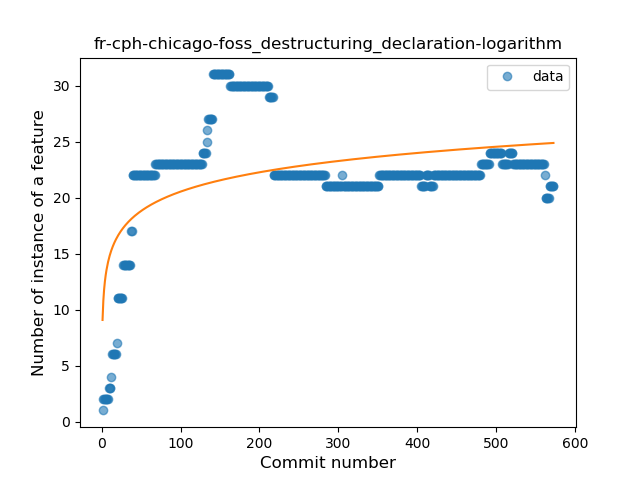

#### org-eurofurence-connavigator
* Feature: Function with Default Value
* Function: 
* R_Squared: 0.24790014
 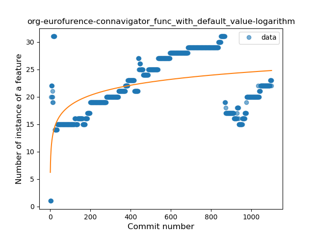

#### me-rei_m-hyakuninisshu
* Feature: Type Inference
* Function: 
* R_Squared: 0.23957912
 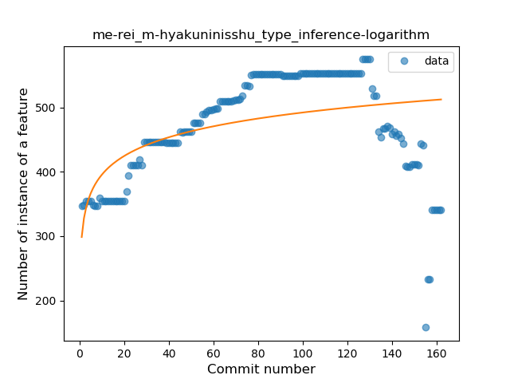

#### de-tubaf-mandelGL
* Feature: Unsafe Call
* Function: 
* R_Squared: 0.2375354
 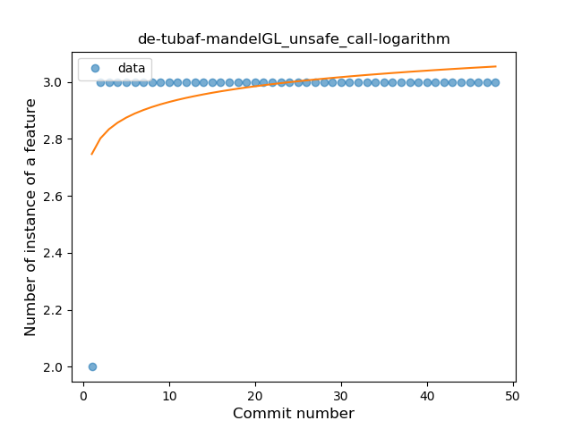

#### me-echeung-moemoekyun-fdroid
* Feature: Function call with Named Argument
* Function: 
* R_Squared: 0.22611197
 

#### org-walleth
* Feature: Range Expression
* Function: 
* R_Squared: 0.22041428
 

#### org-mattvchandler-a2050
* Feature: Companion Object
* Function: 
* R_Squared: 0.21817294
 

#### it-diab
* Feature: Coroutine
* Function: 
* R_Squared: 0.21776995
 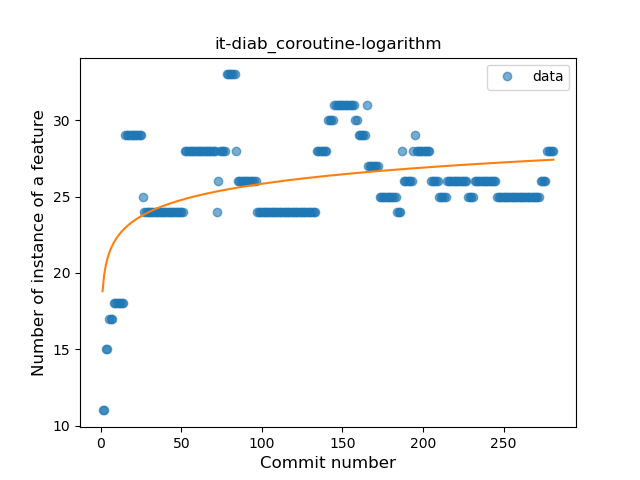

#### com-example-forgottenumbrella-cardboardmuseum
* Feature: Type Inference
* Function: 
* R_Squared: 0.2036467
 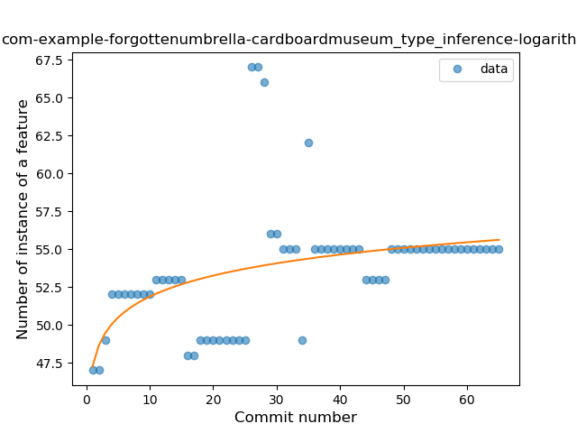

#### com-yubico-yubioath
* Feature: Inline Function
* Function: 
* R_Squared: 0.19899987
 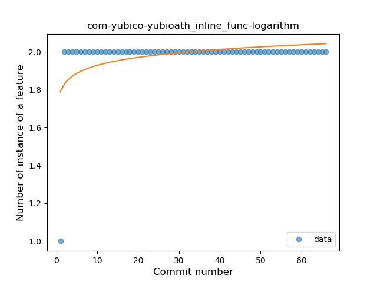

#### org-pacien-tincapp
* Feature: Overloaded Operator
* Function: 
* R_Squared: 0.19899987
 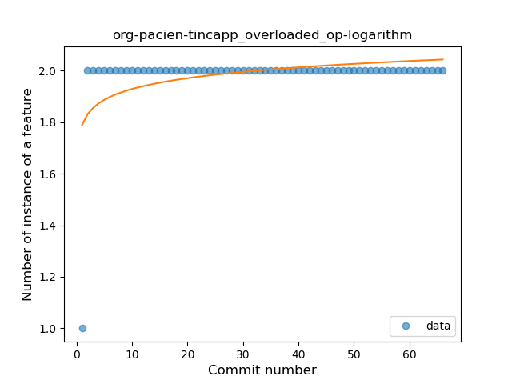

#### nl-mpcjanssen-simpletask
* Feature: Range Expression
* Function: 
* R_Squared: 0.19834801
 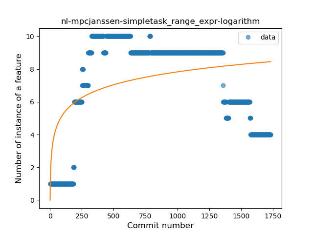

#### com-jmstudios-redmoon
* Feature: Companion Object
* Function: 
* R_Squared: 0.19794228
 

#### io-github-deweyreed-clipboardcleaner
* Feature: Range Expression
* Function: 
* R_Squared: 0.1956725
 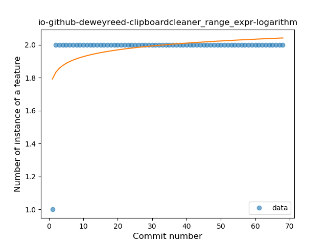

#### net-kourlas-voipms
* Feature: Range Expression
* Function: 
* R_Squared: 0.19480182
 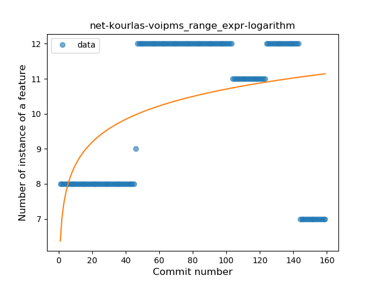

#### com-loloof64-android-basicchessendgamestrainer
* Feature: Sealed Class
* Function: 
* R_Squared: 0.18097581
 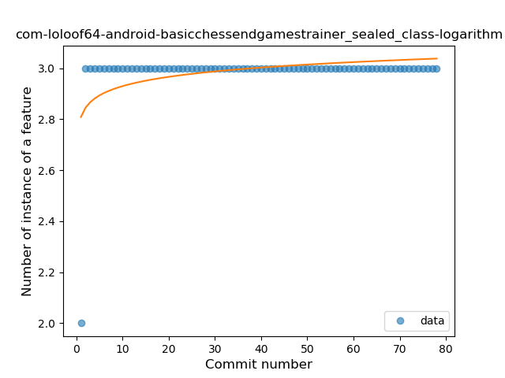

#### io-trewartha-positional
* Feature: When expression
* Function: 
* R_Squared: 0.17704289
 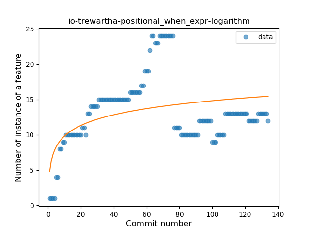

#### fr-openium-auvergnewebcams
* Feature: Extension Function
* Function: 
* R_Squared: 0.17522967
 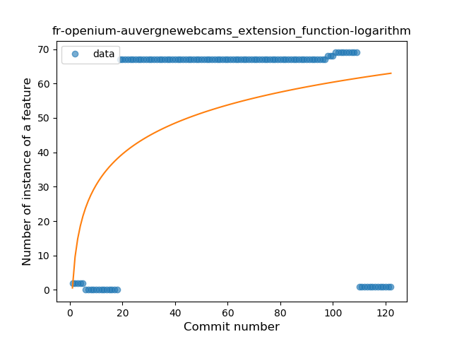

#### com-nononsenseapps-feeder
* Feature: Extension Function
* Function: 
* R_Squared: 0.16797204
 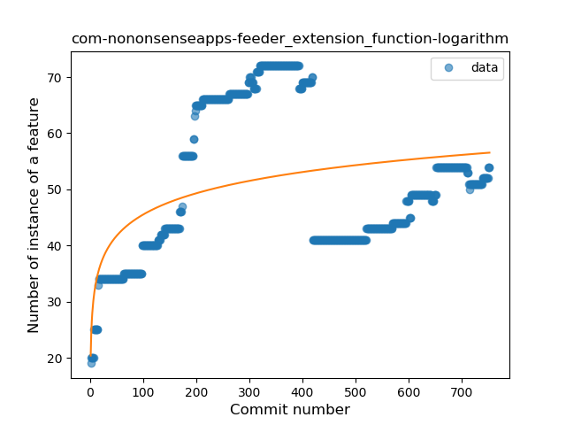

#### de-blankedv-lanbahnpanel
* Feature: Destructuring Declaration
* Function: 
* R_Squared: 0.16773545
 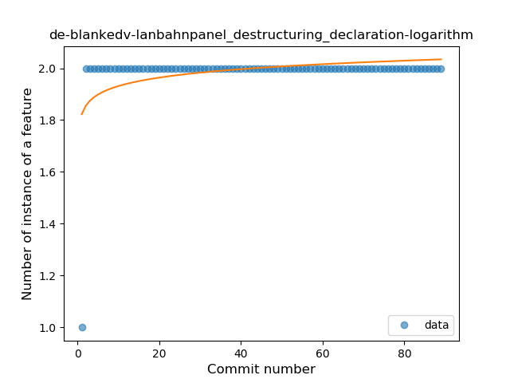

#### io-github-deweyreed-clipboardcleaner
* Feature: Safe Call
* Function: 
* R_Squared: 0.16296909
 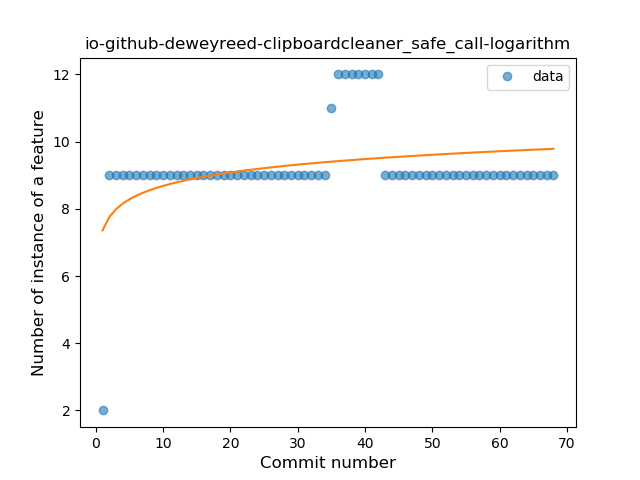

#### org-kiwix-kiwixcustomwikivoyageeurope
* Feature: Singleton
* Function: 
* R_Squared: 0.15737246
 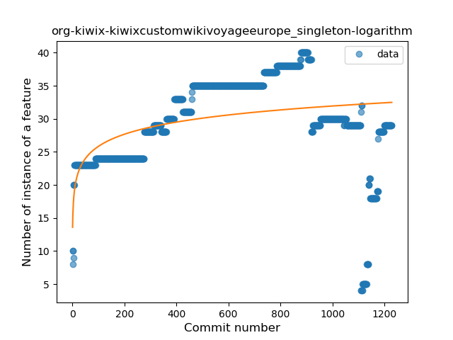

#### com-kgurgul-cpuinfo
* Feature: Smart Cast
* Function: 
* R_Squared: 0.15710188
 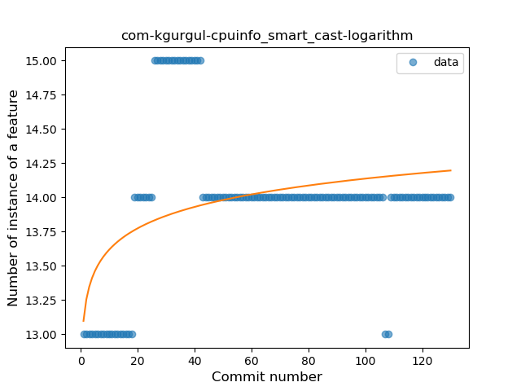

#### jp-cordea-mackerelclient
* Feature: Function with Default Value
* Function: 
* R_Squared: 0.15598702
 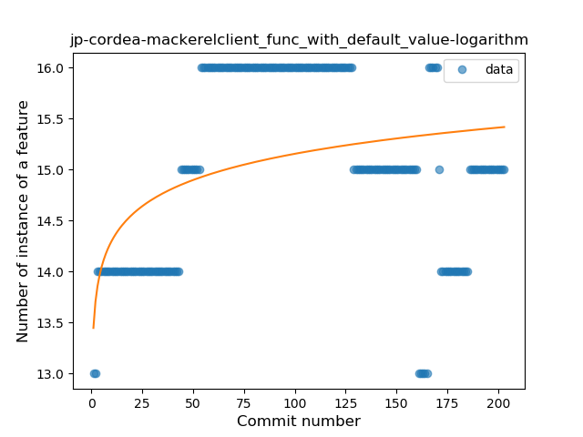

#### com-etesync-syncadapter
* Feature: Companion Object
* Function: 
* R_Squared: 0.15492395
 

#### com-phicdy-totoanticipation
* Feature: Smart Cast
* Function: 
* R_Squared: 0.1514691
 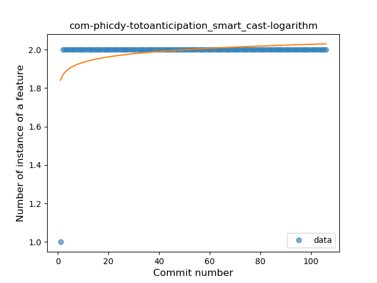

#### com-pixplicity-cryptogram
* Feature: String Template
* Function: 
* R_Squared: 0.14687879
 

#### college-wyk-app
* Feature: Lambda
* Function: 
* R_Squared: 0.14567775
 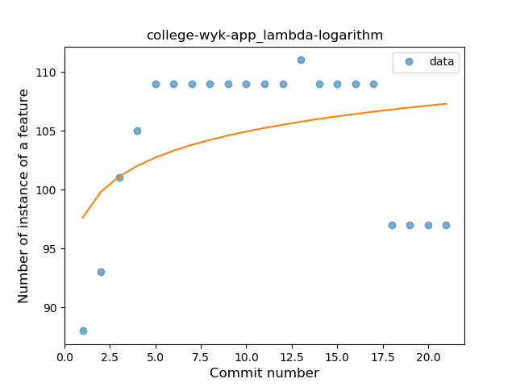

#### com-conorodonnell-bus
* Feature: Data Class
* Function: 
* R_Squared: 0.13787107
 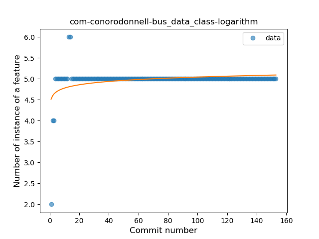

#### com-etesync-syncadapter
* Feature: Unsafe Call
* Function: 
* R_Squared: 0.13614387
 

#### org-blitzortung-android-app
* Feature: Function with Default Value
* Function: 
* R_Squared: 0.13535877
 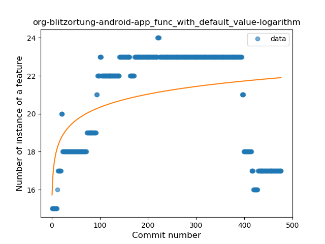

#### at-bitfire-davdroid
* Feature: String Template
* Function: 
* R_Squared: 0.13053944
 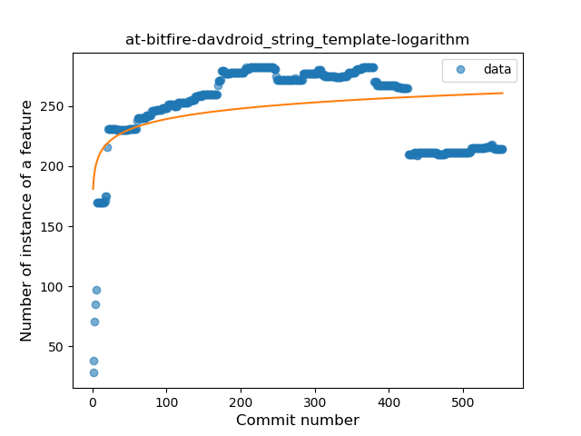

#### sk-styk-martin-apkanalyzer
* Feature: Data Class
* Function: 
* R_Squared: 0.12782393
 

#### sk-styk-martin-apkanalyzer
* Feature: Destructuring Declaration
* Function: 
* R_Squared: 0.11586566
 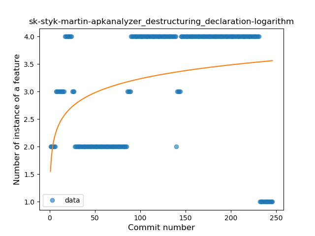

#### com-sduduzog-slimlauncher
* Feature: Companion Object
* Function: 
* R_Squared: 0.11534645
 

#### me-rei_m-hyakuninisshu
* Feature: Unsafe Call
* Function: 
* R_Squared: 0.11033048
 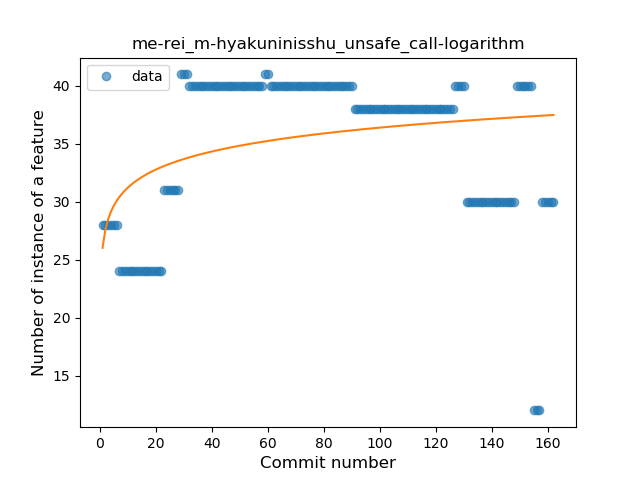

#### cat-pantsu-nyaapantsu
* Feature: Safe Call
* Function: 
* R_Squared: 0.10832765
 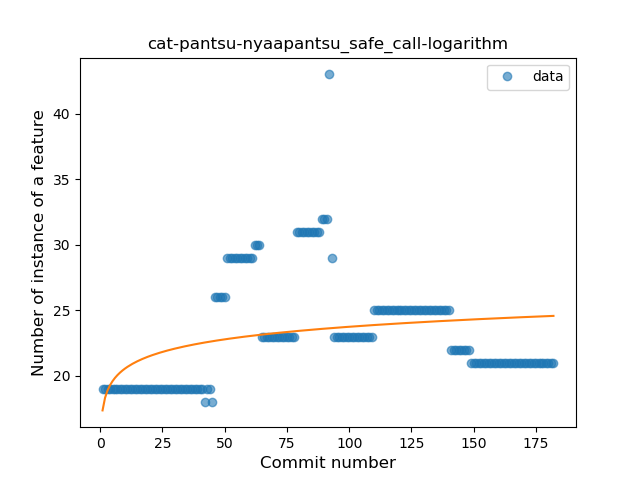

#### info-metadude-android-congress-schedule
* Feature: Inline Function
* Function: 
* R_Squared: 0.10490176
 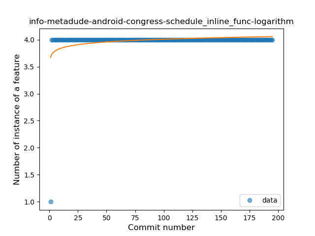

#### com-yubico-yubioath
* Feature: Destructuring Declaration
* Function: 
* R_Squared: 0.10137829
 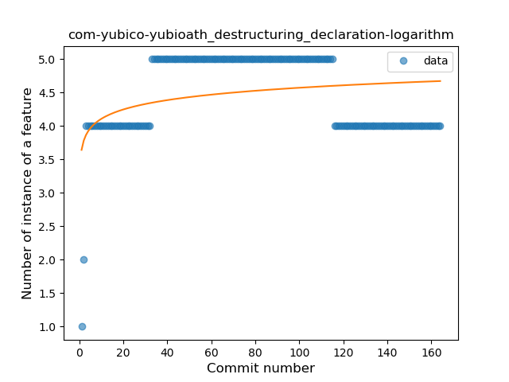

#### com-simplemobiletools-flashlight
* Feature: When expression
* Function: 
* R_Squared: 0.10019913
 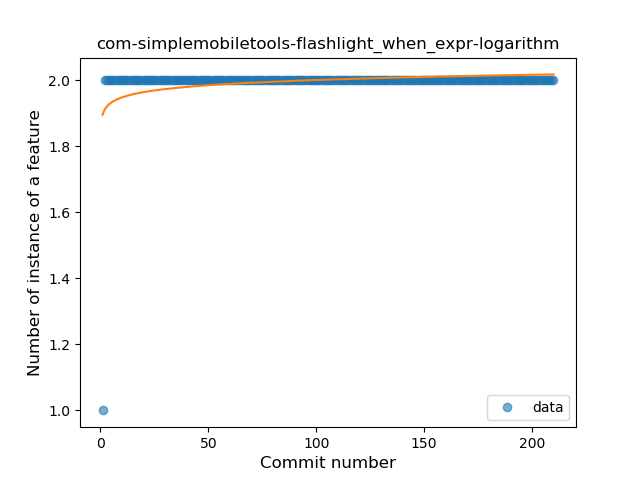

#### fr-openium-auvergnewebcams
* Feature: Inline Function
* Function: 
* R_Squared: 0.09915317
 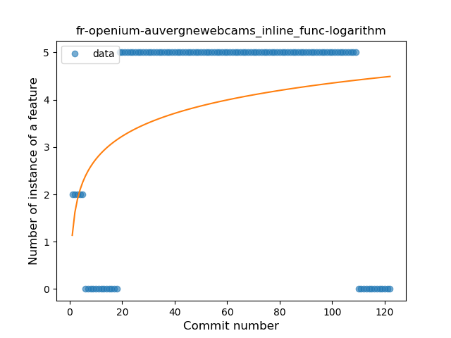

#### me-rei_m-hyakuninisshu
* Feature: Property Delegation
* Function: 
* R_Squared: 0.0985156
 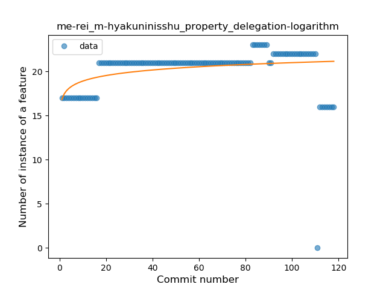

#### danbroid-searchview
* Feature: Safe Call
* Function: 
* R_Squared: 0.08586895
 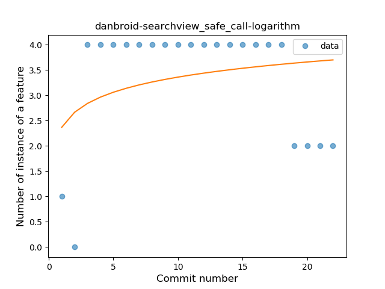

#### de-blankedv-lanbahnpanel
* Feature: Singleton
* Function: 
* R_Squared: 0.0841426
 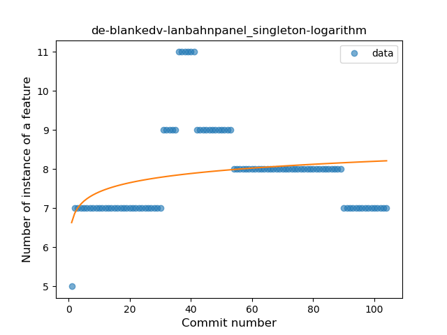

#### org-mattvchandler-progressbars
* Feature: Smart Cast
* Function: 
* R_Squared: 0.08251564
 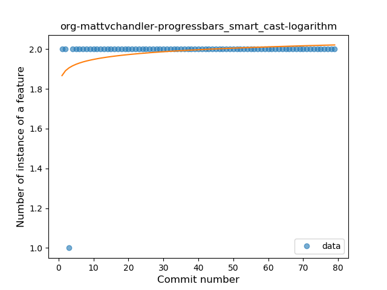

#### com-pyamsoft-homebutton
* Feature: Function call with Named Argument
* Function: 
* R_Squared: 0.07784699
 

#### me-rei_m-hyakuninisshu
* Feature: Smart Cast
* Function: 
* R_Squared: 0.07755599
 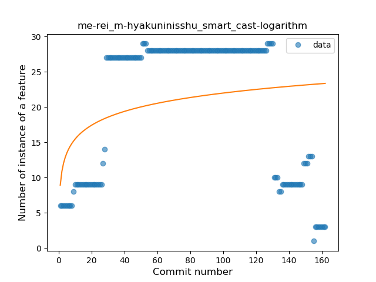

#### com-thanksmister-iot-mqtt-alarmpanel
* Feature: Unsafe Call
* Function: 
* R_Squared: 0.06755931
 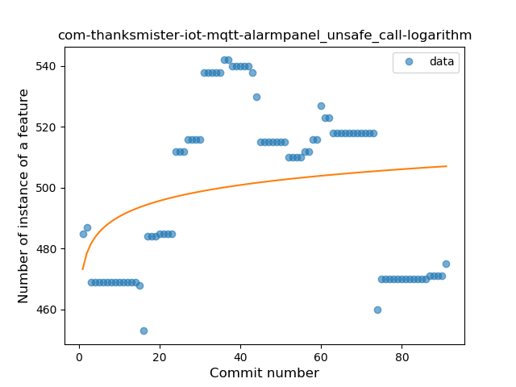

#### de-cineaste-android
* Feature: When expression
* Function: 
* R_Squared: 0.06546265
 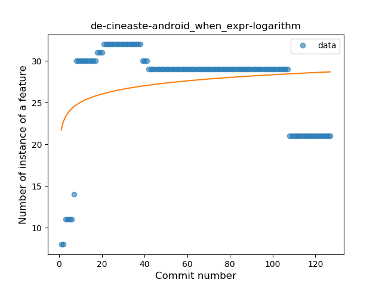

#### com-tumblr-svetylk0-sheepsgohome-android
* Feature: Singleton
* Function: 
* R_Squared: 0.05401663
 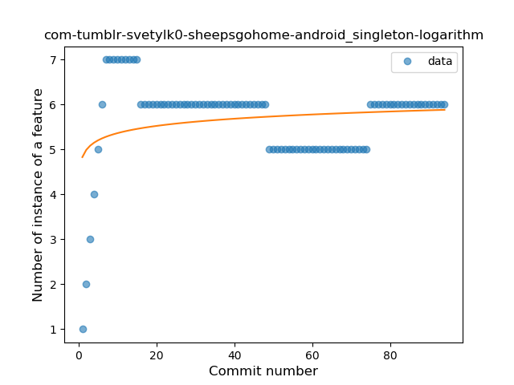

#### org-kiwix-kiwixcustomwikivoyageeurope
* Feature: Inline Class
* Function: 
* R_Squared: 0.04908496
 

#### college-wyk-app
* Feature: Type Inference
* Function: 
* R_Squared: 0.04637488
 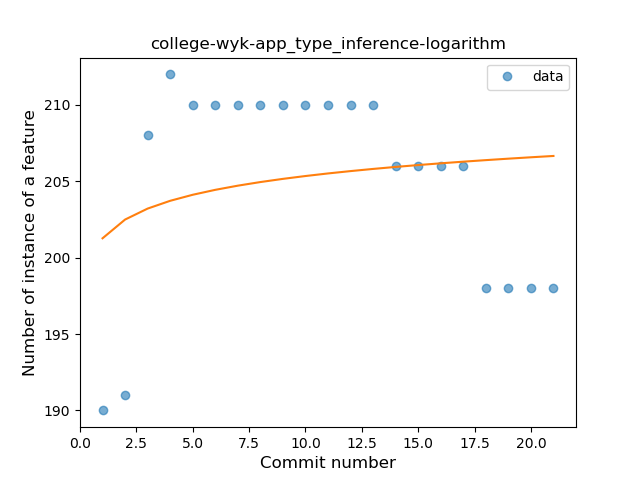

#### com-guerinet-mymartlet
* Feature: Data Class
* Function: 
* R_Squared: 0.04627992
 

#### eu-the4thfloor-msync
* Feature: Singleton
* Function: 
* R_Squared: 0.04611425
 

#### me-rei_m-hyakuninisshu
* Feature: Extension Function
* Function: 
* R_Squared: 0.03038534
 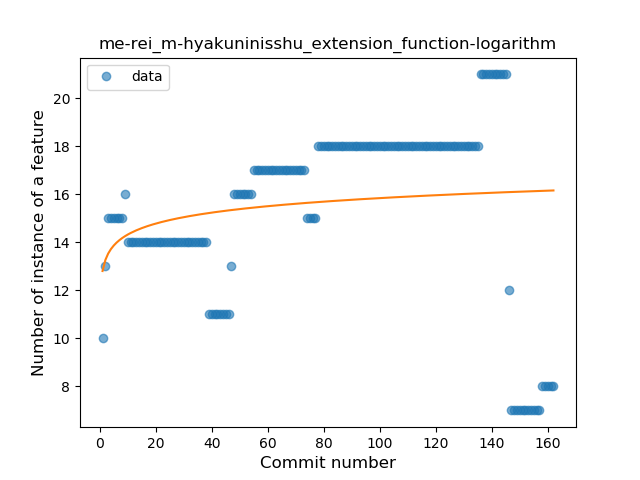

#### com-simplemobiletools-gallery
* Feature: Range Expression
* Function: 
* R_Squared: 0.02814332
 

#### org-equeim-tremotesf
* Feature: Range Expression
* Function: 
* R_Squared: 0.02160563
 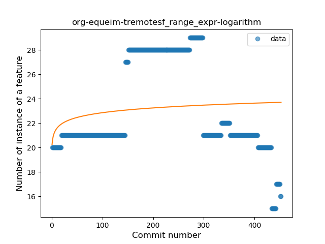

#### uk-colessoft-android-hilllist
* Feature: Function call with Named Argument
* Function: 
* R_Squared: 0.01676436
 

