## Plateau Gradual Rise
----
**471** best fit

#### Maxr1998-MaxLock
* Feature: Companion Object
* Function: 
* R_Squared: 1.0
 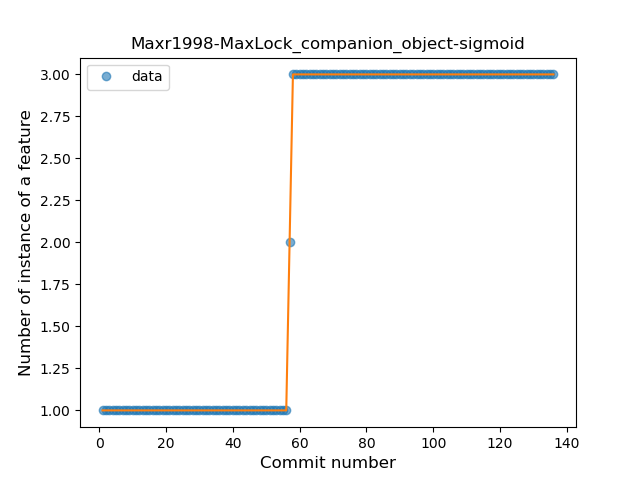

#### umren-Watcher
* Feature: Unsafe Call
* Function: 
* R_Squared: 1.0
 

#### thanksmister-androidthings-mqtt-alarm-panel
* Feature: Singleton
* Function: 
* R_Squared: 1.0
 

#### emansih-FireflyMobile
* Feature: Inline Function
* Function: 
* R_Squared: 1.0
 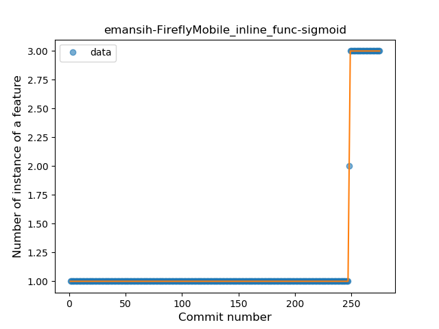

#### ccomeaux-boardgamegeek4android
* Feature: Overloaded Operator
* Function: 
* R_Squared: 1.0
 

#### vector-im-riot-android
* Feature: Super Delegation
* Function: 
* R_Squared: 1.0
 

#### plusCubed-velociraptor
* Feature: Unsafe Call
* Function: 
* R_Squared: 0.99994274
 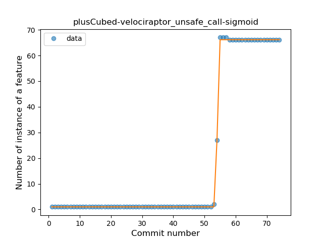

#### MGaetan89-ShowsRage
* Feature: Function call with Named Argument
* Function: 
* R_Squared: 0.99846337
 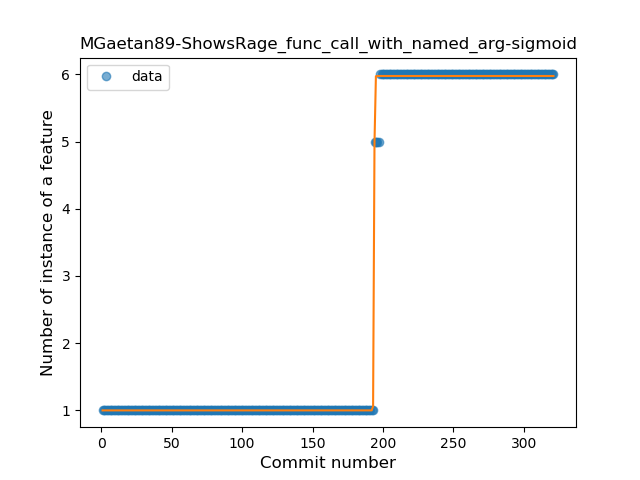

#### esafirm-android-playground
* Feature: Data Class
* Function: 
* R_Squared: 0.99794815
 

#### plusCubed-velociraptor
* Feature: Companion Object
* Function: 
* R_Squared: 0.99788196
 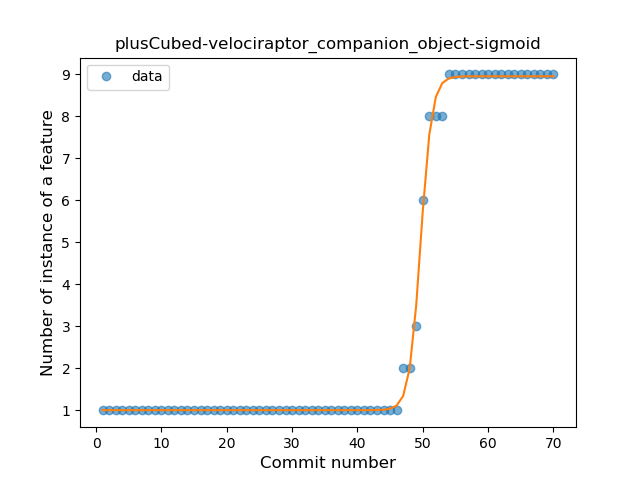

#### ultrasonic-ultrasonic
* Feature: Smart Cast
* Function: 
* R_Squared: 0.99695111
 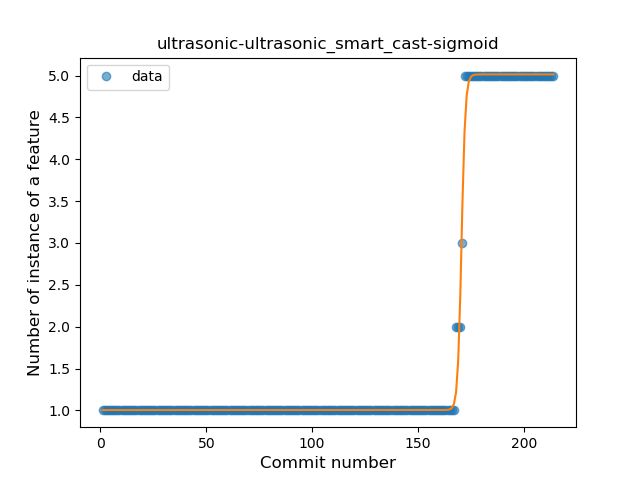

#### LiMium-mini-vector-android
* Feature: Super Delegation
* Function: 
* R_Squared: 0.99670701
 

#### caarmen-poet-assistant
* Feature: Companion Object
* Function: 
* R_Squared: 0.99641441
 

#### syncthing-syncthing-lite
* Feature: String Template
* Function: 
* R_Squared: 0.99594783
 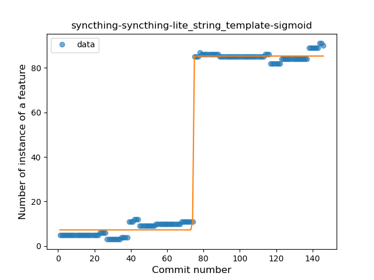

#### ligi-gobandroid
* Feature: Function call with Named Argument
* Function: 
* R_Squared: 0.99473349
 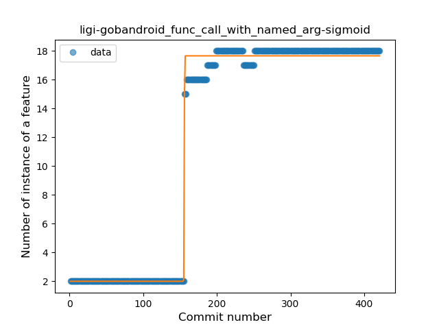

#### klassm-andFHEM
* Feature: Property Delegation
* Function: 
* R_Squared: 0.99456867
 

#### vector-im-riot-android
* Feature: Property Delegation
* Function: 
* R_Squared: 0.99451659
 

#### FredJul-Flym
* Feature: Data Class
* Function: 
* R_Squared: 0.99449188
 

#### stinsonga-GeoQuake
* Feature: Type Inference
* Function: 
* R_Squared: 0.99289139
 

#### pflammertsma-cryptogram
* Feature: Singleton
* Function: 
* R_Squared: 0.99246574
 

#### bnlrnz-MandelGL
* Feature: Lambda
* Function: 
* R_Squared: 0.99184322
 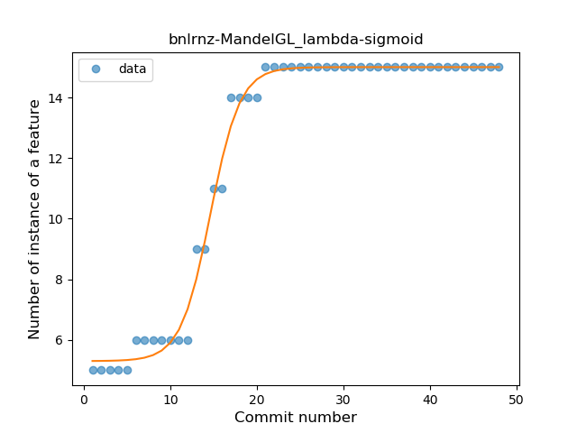

#### plusCubed-velociraptor
* Feature: When expression
* Function: 
* R_Squared: 0.99160301
 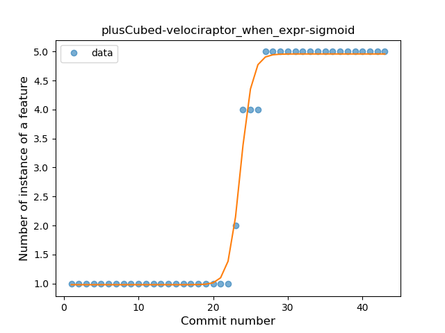

#### peterLaurence-TrekAdvisor
* Feature: Range Expression
* Function: 
* R_Squared: 0.99146833
 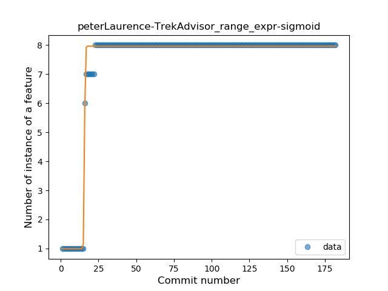

#### mjdenham-and-bible
* Feature: Companion Object
* Function: 
* R_Squared: 0.99122309
 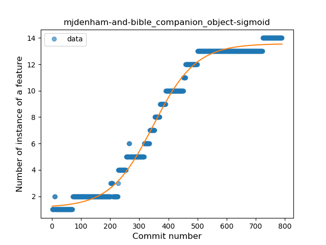

#### LawnchairLauncher-Lawnchair
* Feature: Singleton
* Function: 
* R_Squared: 0.99067467
 

#### calintat-units
* Feature: String Template
* Function: 
* R_Squared: 0.99065159
 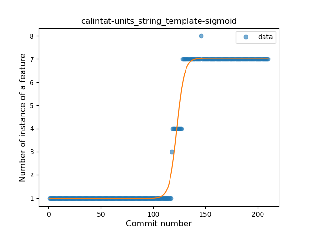

#### darshanparajuli-LogcatReader
* Feature: Data Class
* Function: 
* R_Squared: 0.99038068
 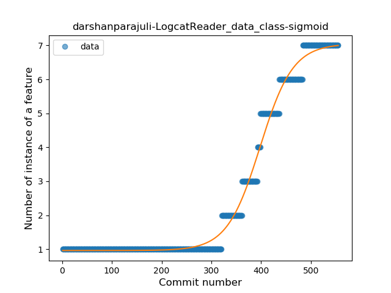

#### mastizada-focus-android
* Feature: Singleton
* Function: 
* R_Squared: 0.98979155
 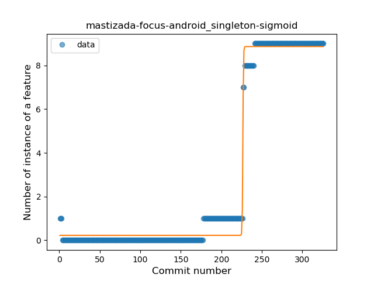

#### mastizada-focus-android
* Feature: Unsafe Call
* Function: 
* R_Squared: 0.9895505
 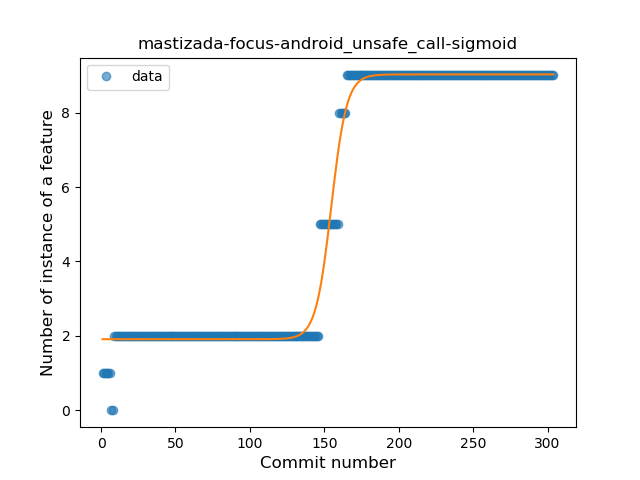

#### Maxr1998-MaxLock
* Feature: Function with Default Value
* Function: 
* R_Squared: 0.98941813
 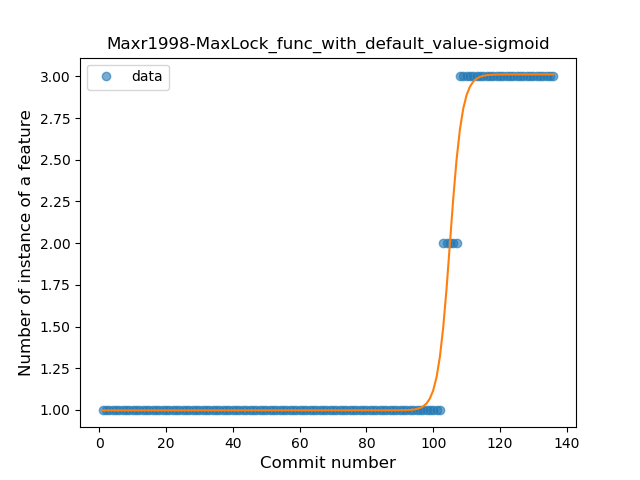

#### SimpleMobileTools-Simple-Draw
* Feature: Smart Cast
* Function: 
* R_Squared: 0.98835649
 

#### shymmq-librus-client-kotlin
* Feature: Safe Call
* Function: 
* R_Squared: 0.98752378
 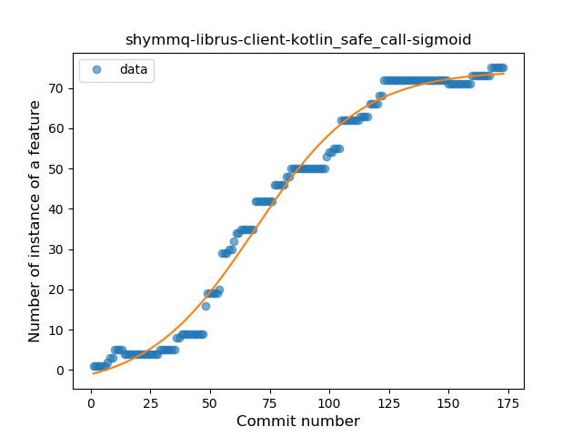

#### EventFahrplan-EventFahrplan
* Feature: When expression
* Function: 
* R_Squared: 0.98752334
 

#### ligi-PassAndroid
* Feature: When expression
* Function: 
* R_Squared: 0.98750553
 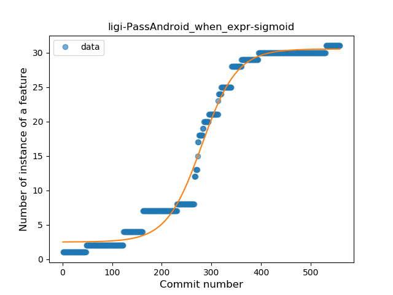

#### grote-Transportr
* Feature: Companion Object
* Function: 
* R_Squared: 0.9873174
 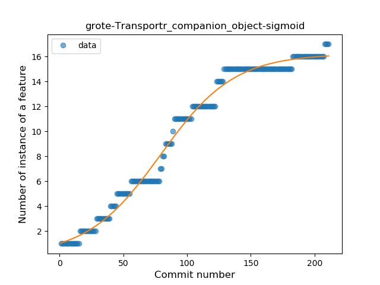

#### darshanparajuli-LogcatReader
* Feature: Range Expression
* Function: 
* R_Squared: 0.98714379
 

#### joan-domingo-Podcasts-RAC1-Android
* Feature: When expression
* Function: 
* R_Squared: 0.98657278
 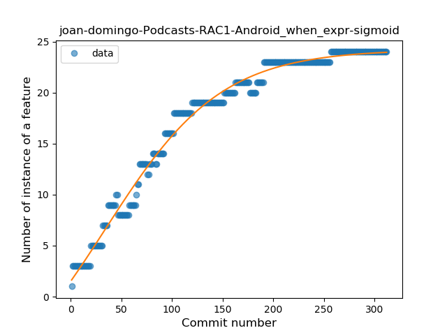

#### ultrasonic-ultrasonic
* Feature: Unsafe Call
* Function: 
* R_Squared: 0.98641395
 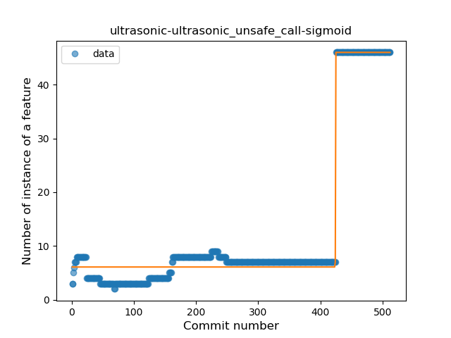

#### herbeth1u-VNDB-Android
* Feature: Smart Cast
* Function: 
* R_Squared: 0.98626087
 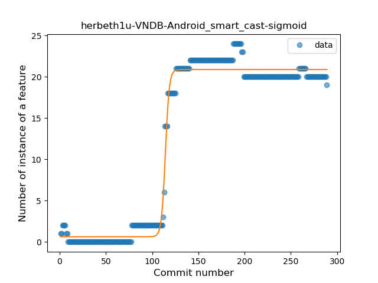

#### SimpleMobileTools-Simple-Clock
* Feature: Unsafe Call
* Function: 
* R_Squared: 0.9855551
 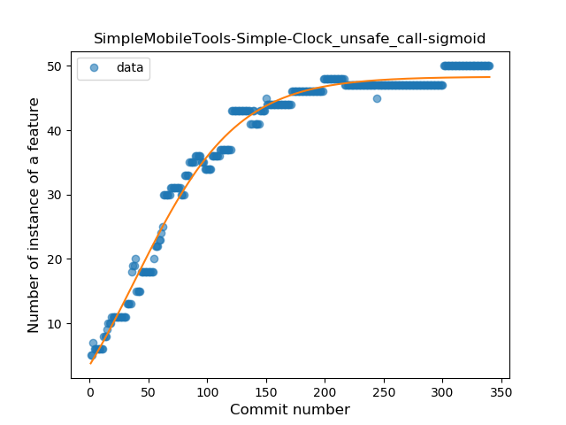

#### hsson-card-balance-app
* Feature: Function with Default Value
* Function: 
* R_Squared: 0.98520726
 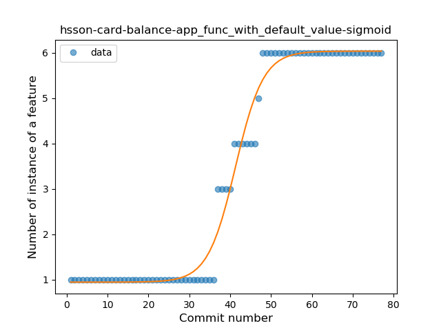

#### jqno-remindermail
* Feature: Unsafe Call
* Function: 
* R_Squared: 0.98512755
 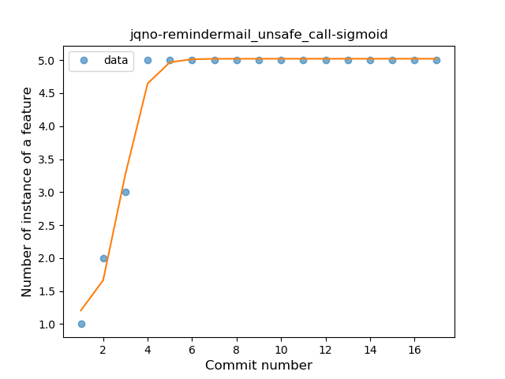

#### mozilla-mobile-focus-android
* Feature: String Template
* Function: 
* R_Squared: 0.98508329
 

#### alessio-b-zak-myRivers
* Feature: Lambda
* Function: 
* R_Squared: 0.98475174
 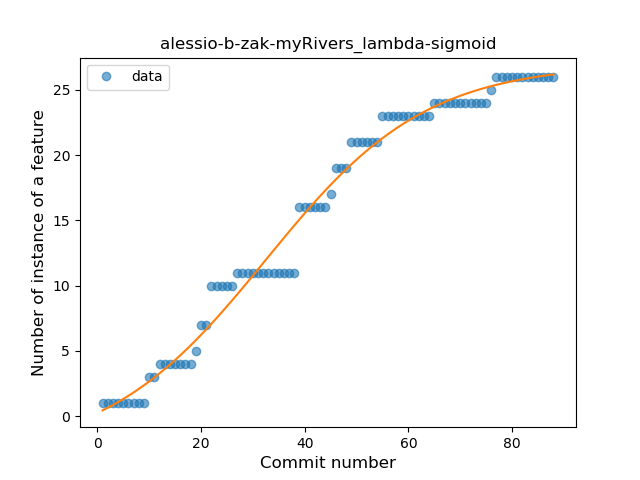

#### joaomneto-TitanCompanion
* Feature: Safe Call
* Function: 
* R_Squared: 0.98455753
 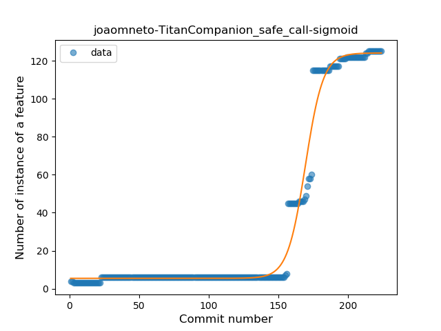

#### hypeapps-episodie
* Feature: Function with Default Value
* Function: 
* R_Squared: 0.98446328
 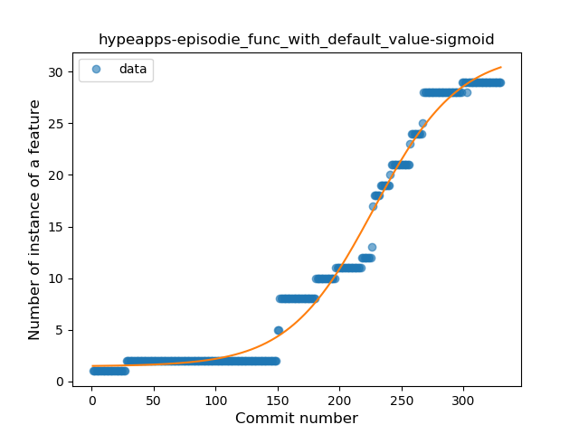

#### nathanj-ogsdroid
* Feature: Function with Default Value
* Function: 
* R_Squared: 0.98412505
 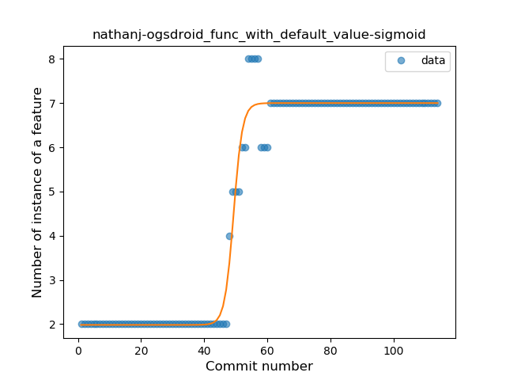

#### Mygod-VPNHotspot
* Feature: Function with Default Value
* Function: 
* R_Squared: 0.98398252
 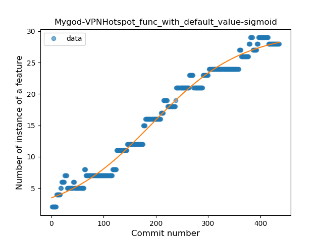

#### ligi-IPFSDroid
* Feature: When expression
* Function: 
* R_Squared: 0.98397894
 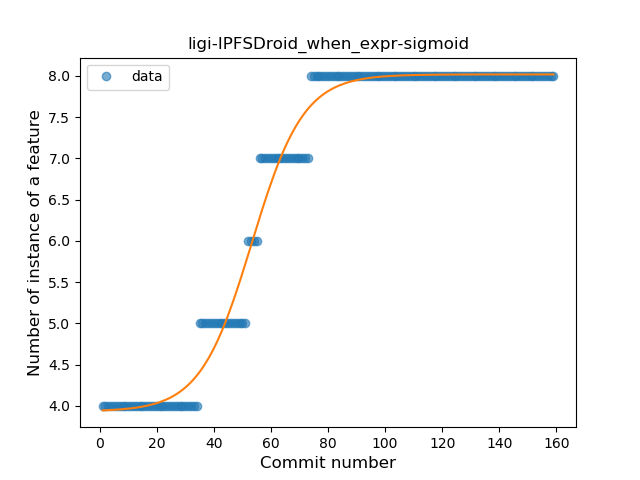

#### ScreamingHawk-phone-saver
* Feature: When expression
* Function: 
* R_Squared: 0.98389296
 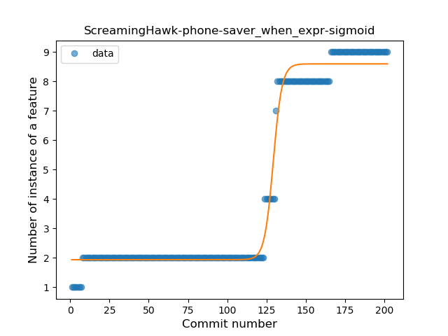

#### maks-MGit
* Feature: Type Inference
* Function: 
* R_Squared: 0.98386939
 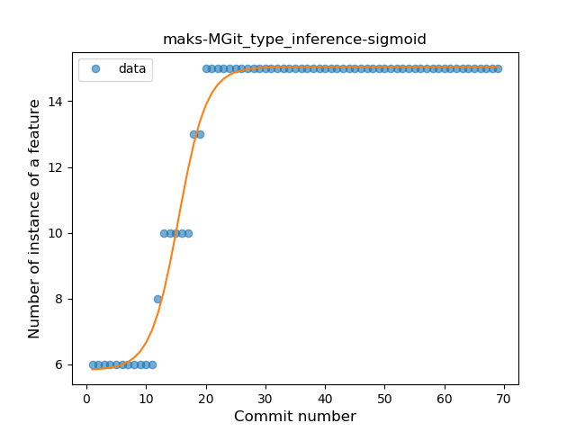

#### glodanif-BluetoothChat
* Feature: When expression
* Function: 
* R_Squared: 0.98381809
 

#### erickok-borefts2015
* Feature: Companion Object
* Function: 
* R_Squared: 0.983652
 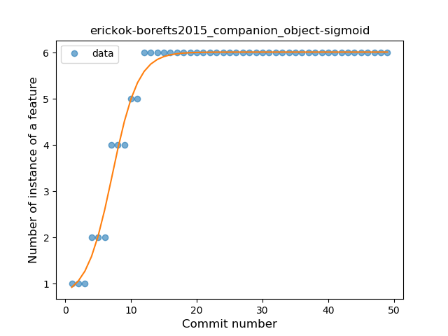

#### RocketChat-Rocket.Chat.Android
* Feature: Type Inference
* Function: 
* R_Squared: 0.9834695
 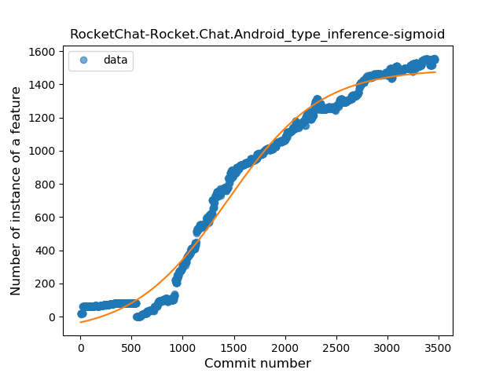

#### Apolline-Lille-apolline-android
* Feature: When expression
* Function: 
* R_Squared: 0.9832174
 

#### Gark-bassblog_kotlin
* Feature: Extension Function
* Function: 
* R_Squared: 0.9830751
 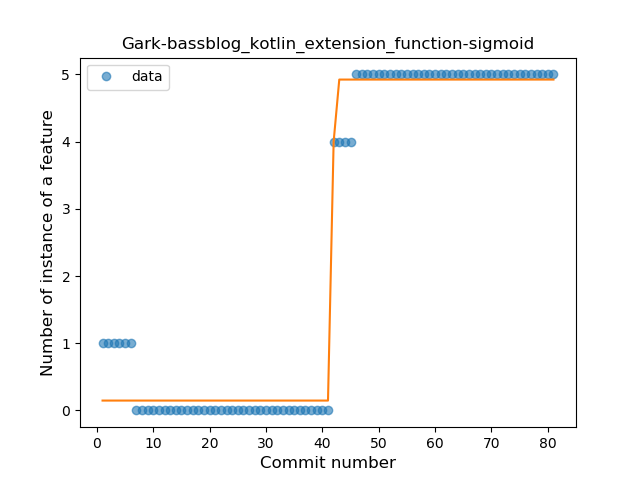

#### Valodim-Stratum0Widget
* Feature: Companion Object
* Function: 
* R_Squared: 0.98275645
 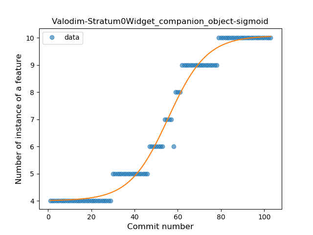

#### Mygod-VPNHotspot
* Feature: Data Class
* Function: 
* R_Squared: 0.9826095
 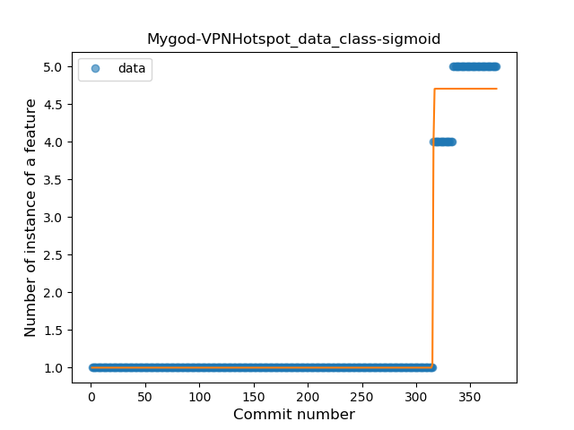

#### loloof64-BasicChessEndGamesTrainer
* Feature: Function with Default Value
* Function: 
* R_Squared: 0.98233567
 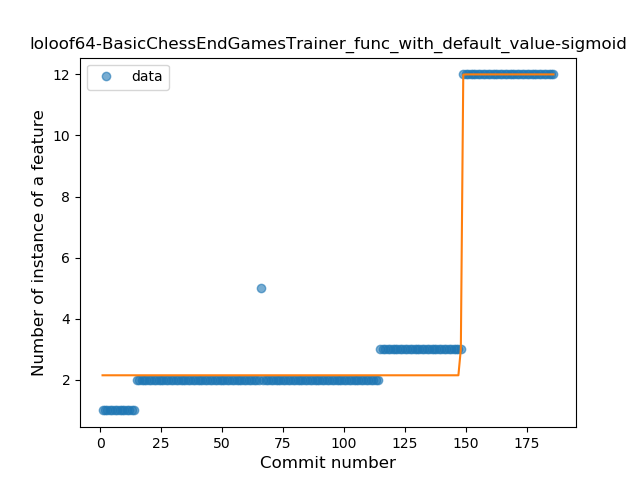

#### fossasia-open-event-android
* Feature: Data Class
* Function: 
* R_Squared: 0.98210388
 

#### exviva-stew
* Feature: String Template
* Function: 
* R_Squared: 0.98207247
 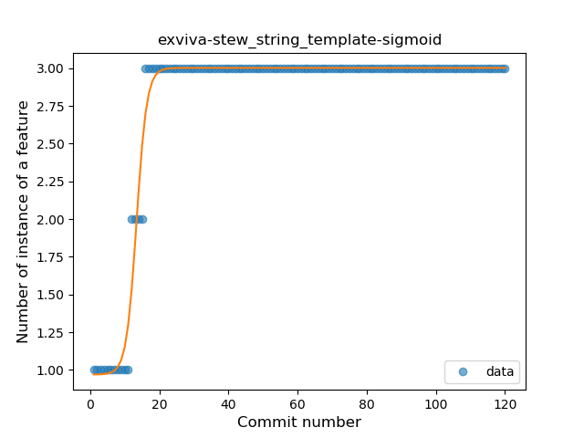

#### caarmen-poet-assistant
* Feature: String Template
* Function: 
* R_Squared: 0.98146197
 

#### caarmen-poet-assistant
* Feature: Range Expression
* Function: 
* R_Squared: 0.98126878
 

#### corphish-NightLight
* Feature: Function call with Named Argument
* Function: 
* R_Squared: 0.9810699
 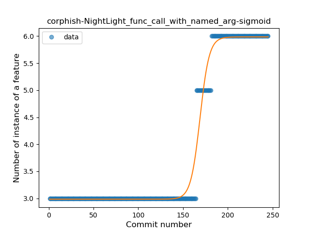

#### rosenpin-QuickDrawEverywhere
* Feature: Function call with Named Argument
* Function: 
* R_Squared: 0.98091354
 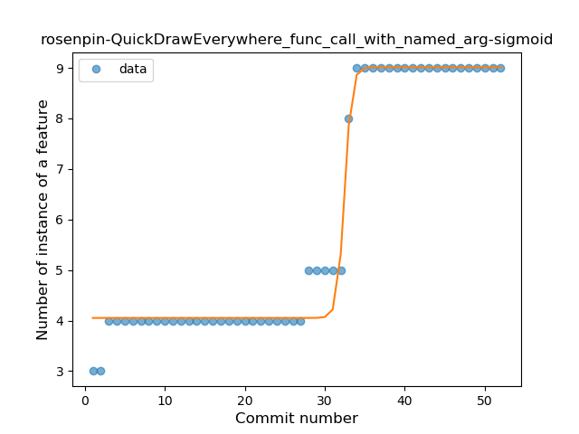

#### SimpleMobileTools-Simple-Notes
* Feature: Function call with Named Argument
* Function: 
* R_Squared: 0.98005524
 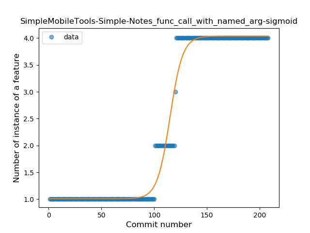

#### raatmarien-red-moon
* Feature: Destructuring Declaration
* Function: 
* R_Squared: 0.97986746
 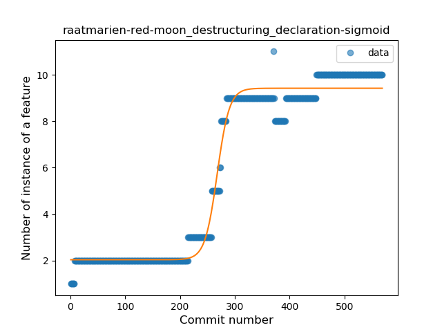

#### sandy-8925-Checklist
* Feature: Lambda
* Function: 
* R_Squared: 0.97944049
 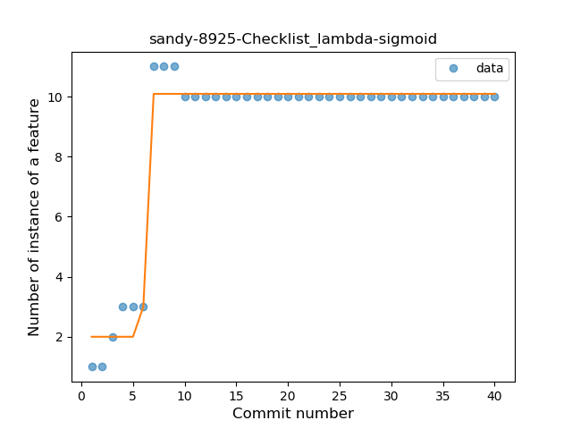

#### mastizada-focus-android
* Feature: Smart Cast
* Function: 
* R_Squared: 0.9793757
 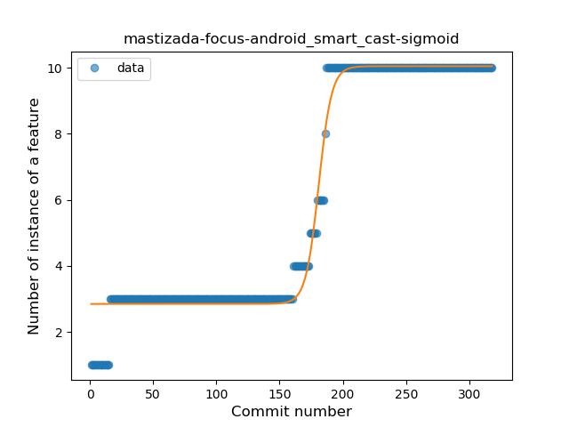

#### orgzly-orgzly-android
* Feature: Singleton
* Function: 
* R_Squared: 0.97930396
 

#### AllanWang-Frost-for-Facebook
* Feature: Inline Function
* Function: 
* R_Squared: 0.97922303
 

#### peterLaurence-TrekAdvisor
* Feature: Singleton
* Function: 
* R_Squared: 0.97892952
 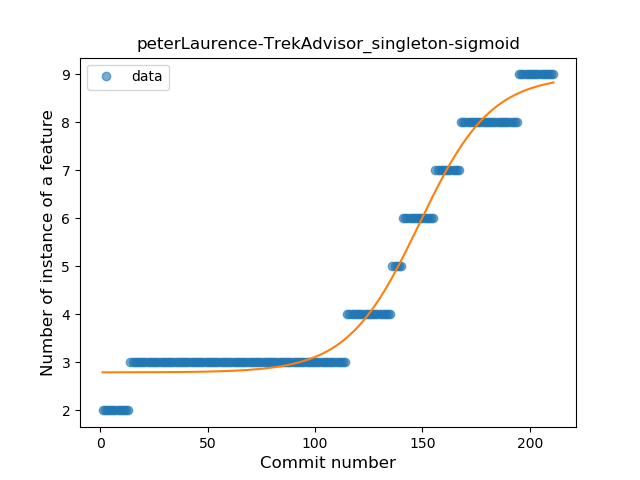

#### Waboodoo-HTTP-Shortcuts
* Feature: Destructuring Declaration
* Function: 
* R_Squared: 0.97887128
 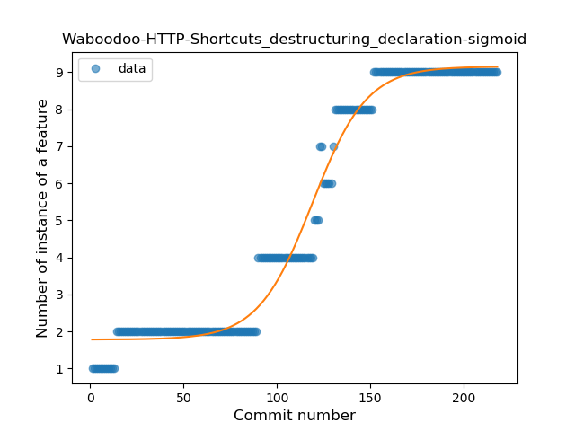

#### Maxr1998-MaxLock
* Feature: Extension Function
* Function: 
* R_Squared: 0.97870289
 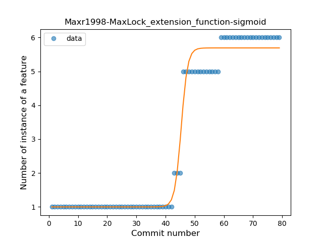

#### wuan-bo-android
* Feature: String Template
* Function: 
* R_Squared: 0.97835092
 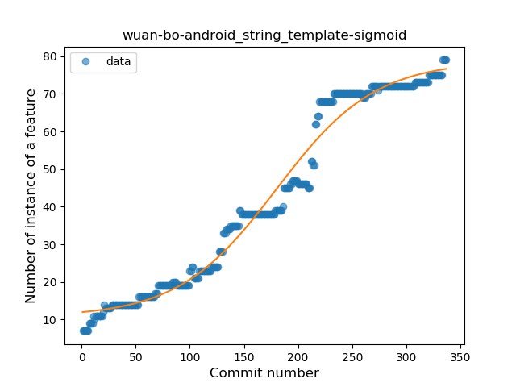

#### tasomaniac-OpenLinkWith
* Feature: Safe Call
* Function: 
* R_Squared: 0.97829857
 

#### alessio-b-zak-myRivers
* Feature: When expression
* Function: 
* R_Squared: 0.97819253
 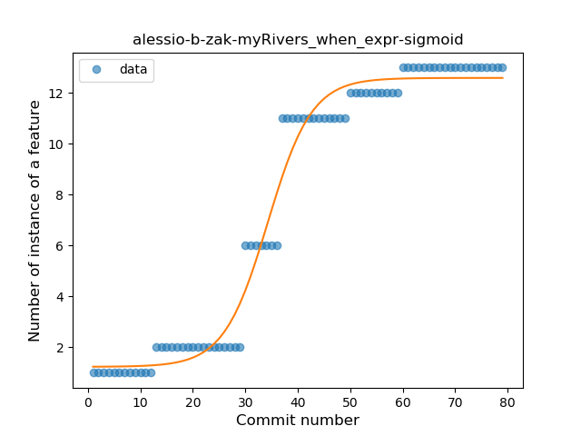

#### apiote-Bimba
* Feature: Companion Object
* Function: 
* R_Squared: 0.97817924
 

#### ofalvai-BPInfo
* Feature: Companion Object
* Function: 
* R_Squared: 0.97802835
 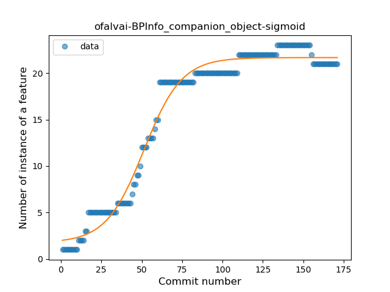

#### ligi-PassAndroid
* Feature: Safe Call
* Function: 
* R_Squared: 0.97789989
 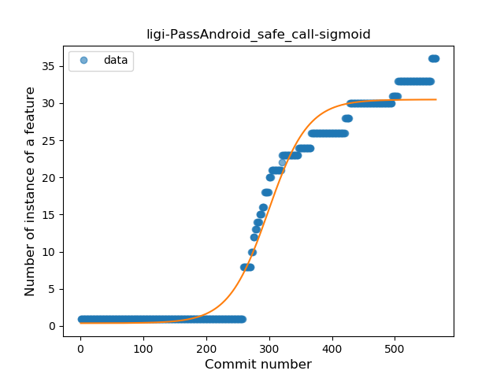

#### SimpleMobileTools-Simple-Gallery
* Feature: Smart Cast
* Function: 
* R_Squared: 0.97771448
 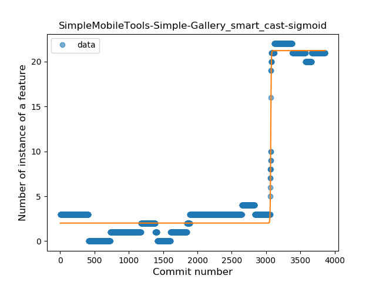

#### k9mail-k-9
* Feature: Function with Default Value
* Function: 
* R_Squared: 0.97763321
 

#### loloof64-BasicChessEndGamesTrainer
* Feature: Singleton
* Function: 
* R_Squared: 0.97762514
 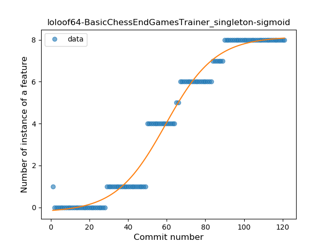

#### orgzly-orgzly-android
* Feature: Range Expression
* Function: 
* R_Squared: 0.97744979
 

#### blokadaorg-blokada
* Feature: String Template
* Function: 
* R_Squared: 0.97704935
 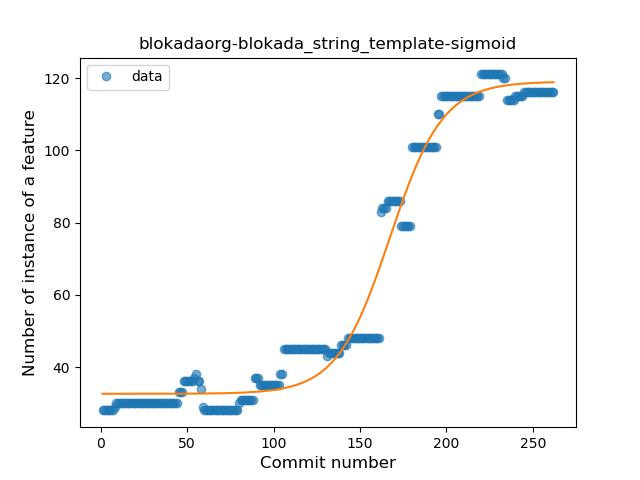

#### Apolline-Lille-apolline-android
* Feature: Companion Object
* Function: 
* R_Squared: 0.97677106
 

#### ligi-PassAndroid
* Feature: Range Expression
* Function: 
* R_Squared: 0.97675762
 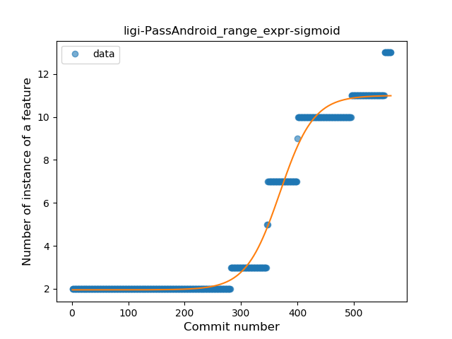

#### klassm-andFHEM
* Feature: Overloaded Operator
* Function: 
* R_Squared: 0.97641133
 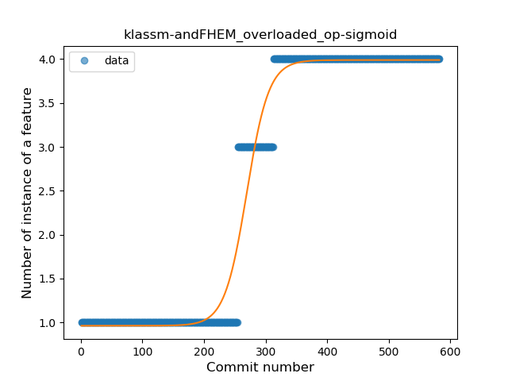

#### tuskyapp-Tusky
* Feature: Extension Function
* Function: 
* R_Squared: 0.97598526
 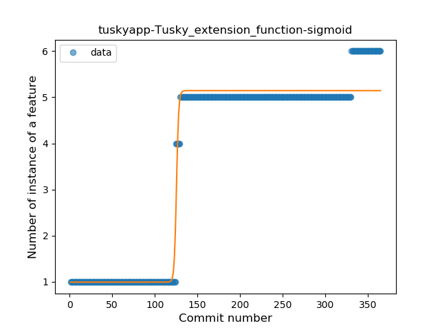

#### nathanj-ogsdroid
* Feature: String Template
* Function: 
* R_Squared: 0.97592177
 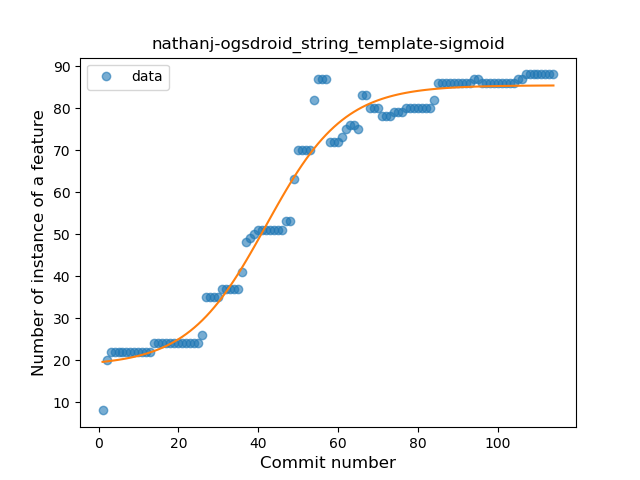

#### NyaaPantsu-NyaaPantsu-android-app
* Feature: Property Delegation
* Function: 
* R_Squared: 0.97589659
 

#### moko256-twitlatte
* Feature: Singleton
* Function: 
* R_Squared: 0.97536623
 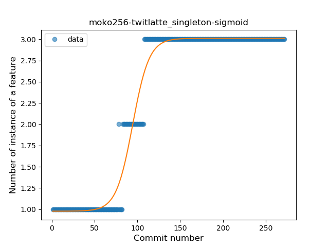

#### pflammertsma-cryptogram
* Feature: Function with Default Value
* Function: 
* R_Squared: 0.97473215
 

#### hyst329-OpenFool
* Feature: When expression
* Function: 
* R_Squared: 0.9745878
 

#### mjdenham-and-bible
* Feature: When expression
* Function: 
* R_Squared: 0.97454371
 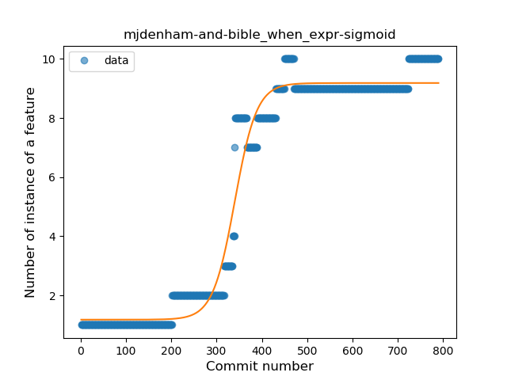

#### jeeb-mpv-android
* Feature: Data Class
* Function: 
* R_Squared: 0.97407084
 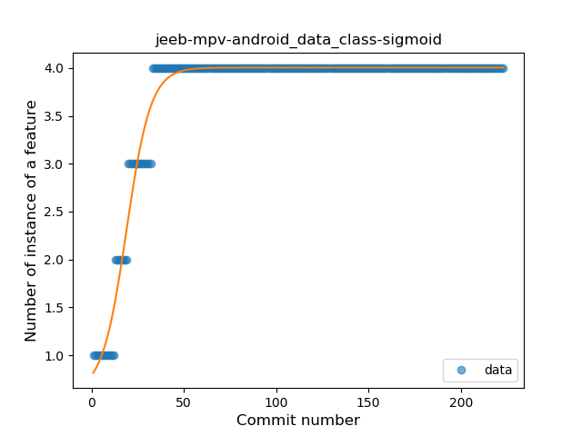

#### danvratil-FBEventSync
* Feature: Singleton
* Function: 
* R_Squared: 0.97404608
 

#### FengMoeTeam-NHentai-android
* Feature: Function call with Named Argument
* Function: 
* R_Squared: 0.97357328
 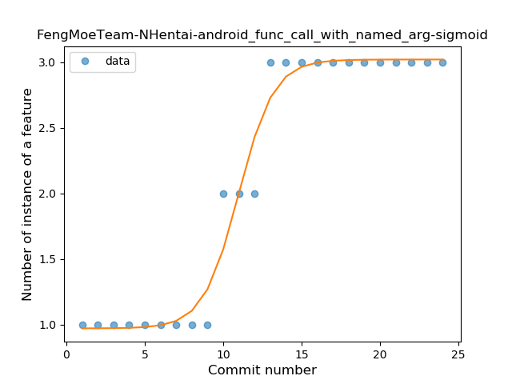

#### moko256-twitlatte
* Feature: Smart Cast
* Function: 
* R_Squared: 0.97355112
 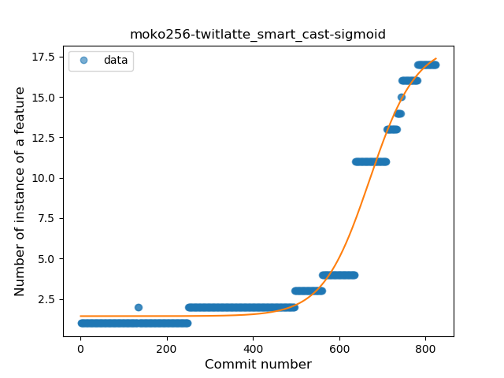

#### joaomneto-TitanCompanion
* Feature: When expression
* Function: 
* R_Squared: 0.9733938
 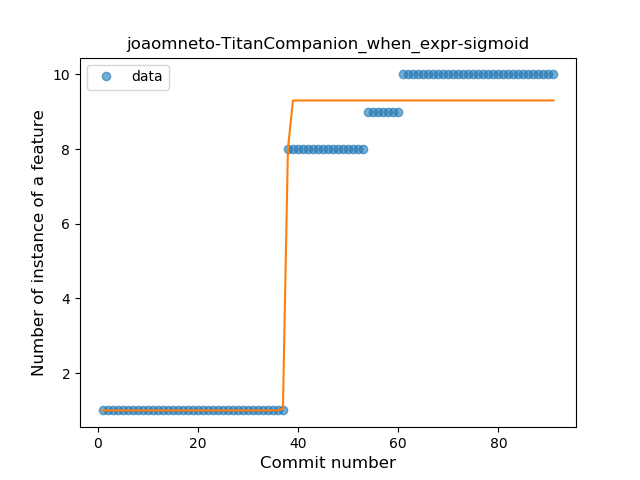

#### ligi-SurvivalManual
* Feature: Extension Function
* Function: 
* R_Squared: 0.97326296
 

#### hsson-card-balance-app
* Feature: Function call with Named Argument
* Function: 
* R_Squared: 0.9732498
 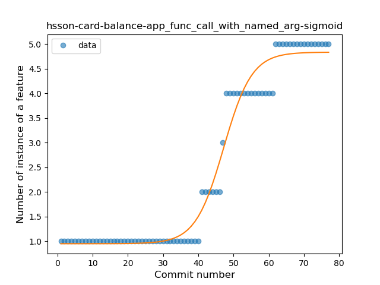

#### mpcjanssen-simpletask-android
* Feature: Extension Function
* Function: 
* R_Squared: 0.9731528
 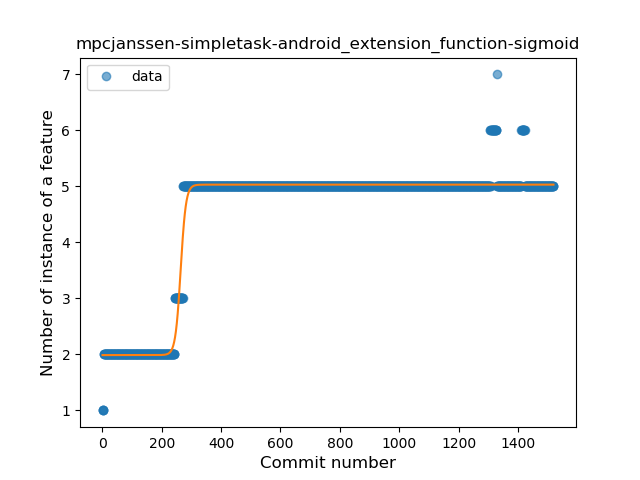

#### mjdenham-and-bible
* Feature: Function with Default Value
* Function: 
* R_Squared: 0.97312827
 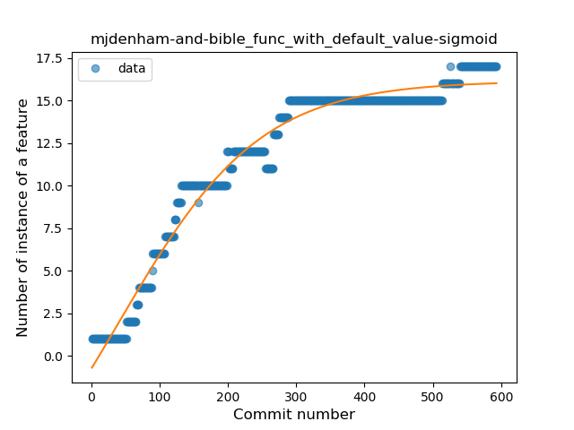

#### blokadaorg-blokada
* Feature: Destructuring Declaration
* Function: 
* R_Squared: 0.97290014
 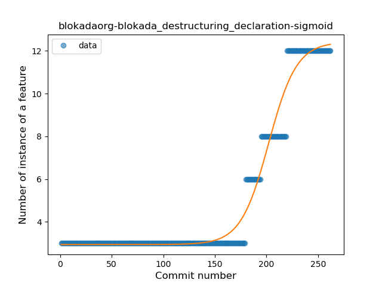

#### klassm-andFHEM
* Feature: Destructuring Declaration
* Function: 
* R_Squared: 0.97268662
 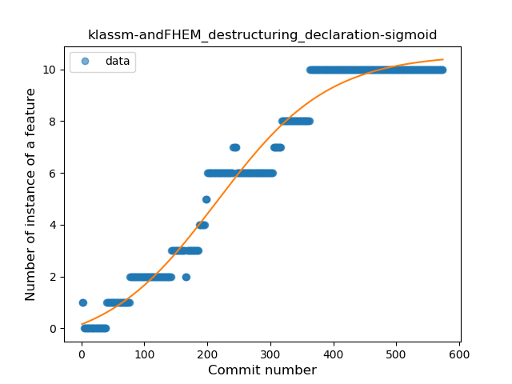

#### bitfireAT-davdroid
* Feature: Function with Default Value
* Function: 
* R_Squared: 0.9726325
 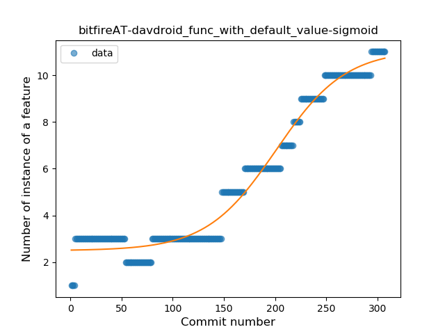

#### syncthing-syncthing-lite
* Feature: Destructuring Declaration
* Function: 
* R_Squared: 0.97245428
 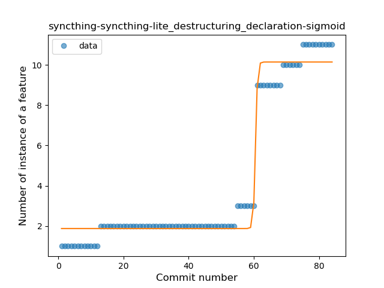

#### apiote-Bimba
* Feature: Extension Function
* Function: 
* R_Squared: 0.97240691
 

#### abertschi-ad-free
* Feature: String Template
* Function: 
* R_Squared: 0.97232518
 

#### AllanWang-Frost-for-Facebook
* Feature: Data Class
* Function: 
* R_Squared: 0.97215939
 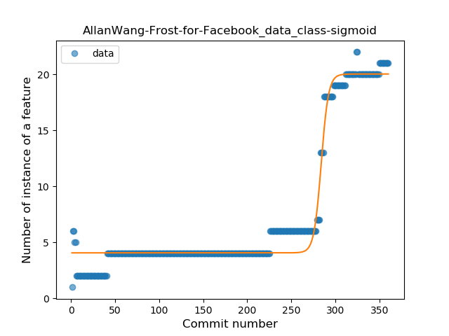

#### erickok-borefts2015
* Feature: Unsafe Call
* Function: 
* R_Squared: 0.97214186
 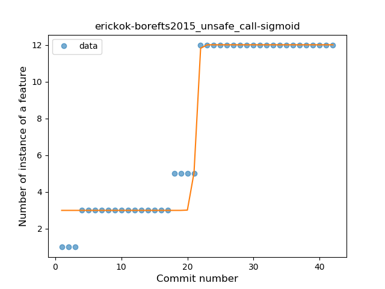

#### joan-domingo-Podcasts-RAC1-Android
* Feature: Function with Default Value
* Function: 
* R_Squared: 0.97202283
 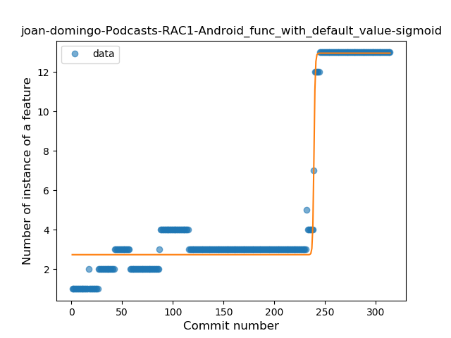

#### AIDEA775-UNCmorfi
* Feature: Extension Function
* Function: 
* R_Squared: 0.97171625
 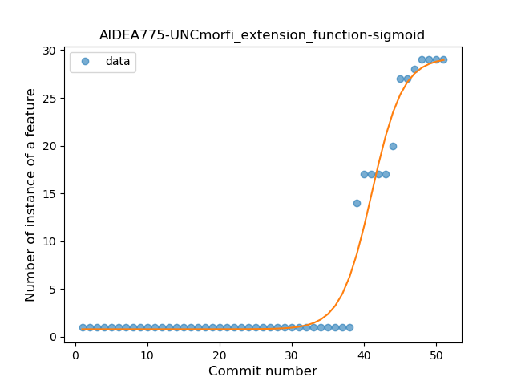

#### SimpleMobileTools-Simple-Contacts
* Feature: Range Expression
* Function: 
* R_Squared: 0.97150598
 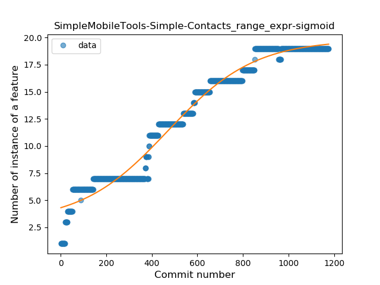

#### pistatium-mahougen
* Feature: Lambda
* Function: 
* R_Squared: 0.97134587
 

#### erickok-borefts2015
* Feature: Overloaded Operator
* Function: 
* R_Squared: 0.97081997
 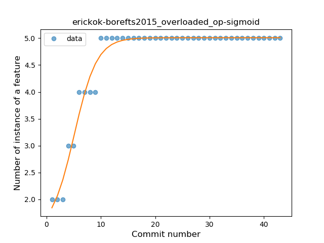

#### peterLaurence-TrekAdvisor
* Feature: Companion Object
* Function: 
* R_Squared: 0.97075136
 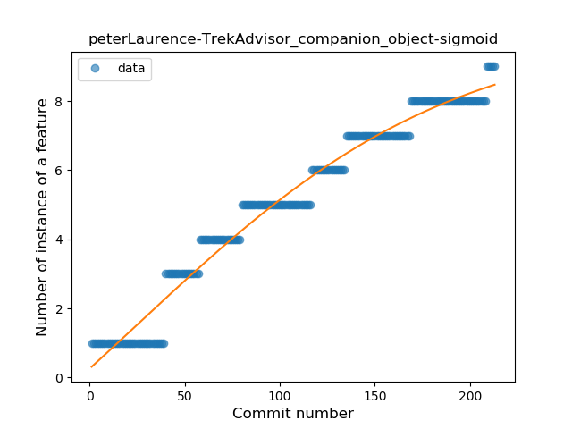

#### SimpleMobileTools-Simple-Clock
* Feature: When expression
* Function: 
* R_Squared: 0.97067537
 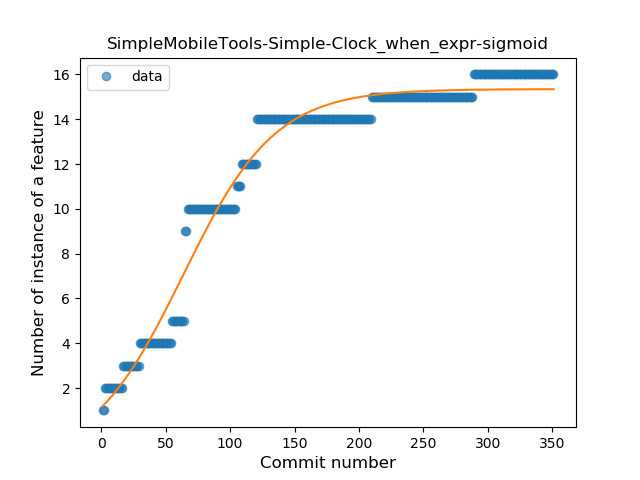

#### kamgurgul-cpu-info
* Feature: Inline Function
* Function: 
* R_Squared: 0.97067253
 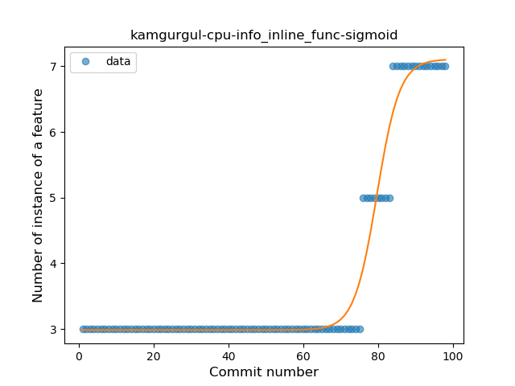

#### shymmq-librus-client-kotlin
* Feature: Data Class
* Function: 
* R_Squared: 0.97054595
 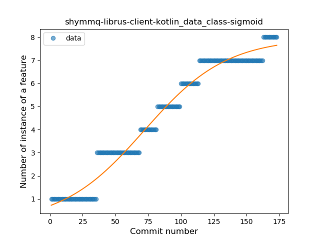

#### peterLaurence-TrekAdvisor
* Feature: Unsafe Call
* Function: 
* R_Squared: 0.97052105
 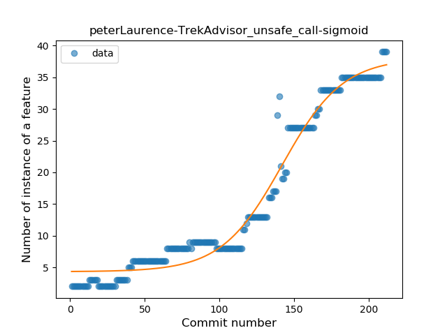

#### loloof64-BasicChessEndGamesTrainer
* Feature: Data Class
* Function: 
* R_Squared: 0.96990864
 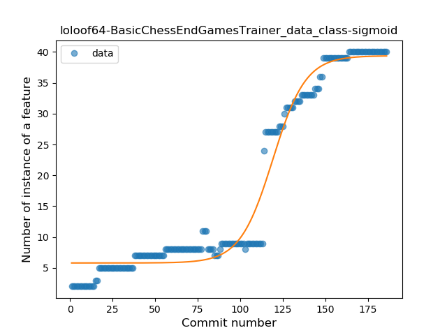

#### openium-auvergne-webcams-droid
* Feature: Data Class
* Function: 
* R_Squared: 0.96933345
 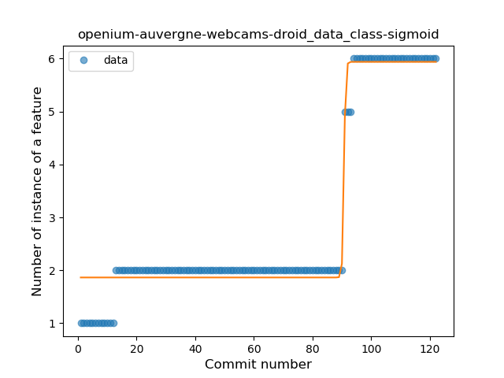

#### joaomneto-TitanCompanion
* Feature: Function call with Named Argument
* Function: 
* R_Squared: 0.96906445
 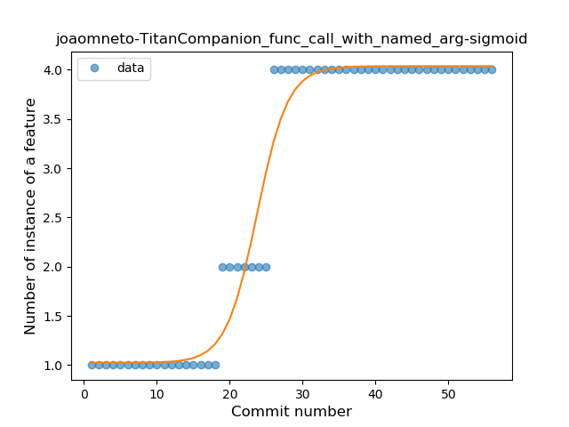

#### Mygod-VPNHotspot
* Feature: String Template
* Function: 
* R_Squared: 0.96886675
 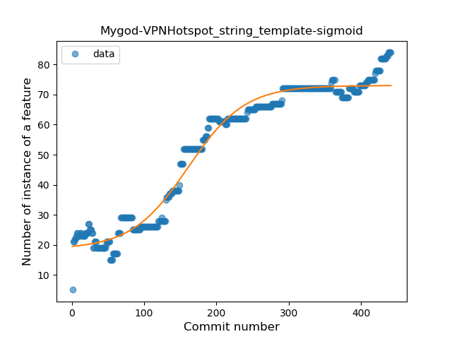

#### grote-Transportr
* Feature: Unsafe Call
* Function: 
* R_Squared: 0.96883381
 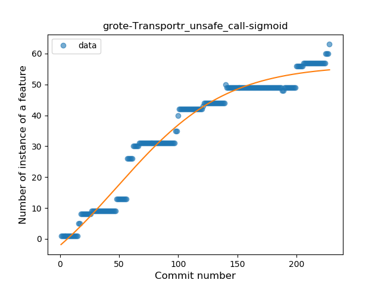

#### FredJul-Flym
* Feature: Extension Function
* Function: 
* R_Squared: 0.96877064
 

#### esafirm-android-playground
* Feature: Safe Call
* Function: 
* R_Squared: 0.96784811
 

#### Agusyc-DayCounter
* Feature: When expression
* Function: 
* R_Squared: 0.96768592
 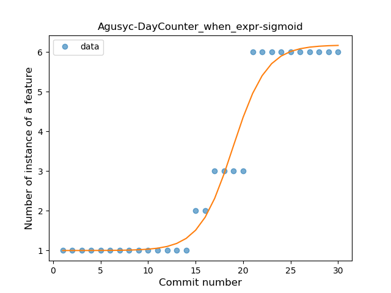

#### joan-domingo-Podcasts-RAC1-Android
* Feature: String Template
* Function: 
* R_Squared: 0.96752369
 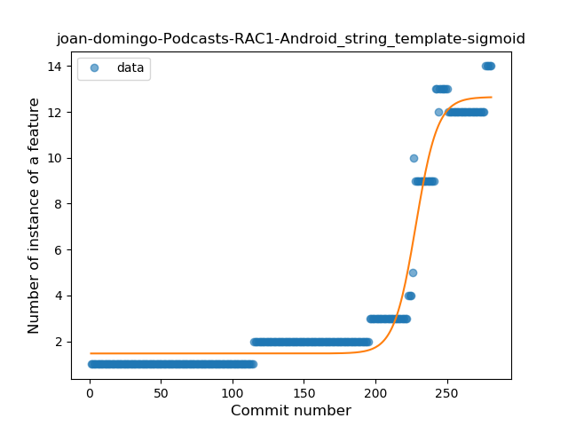

#### blokadaorg-blokada
* Feature: Singleton
* Function: 
* R_Squared: 0.9669039
 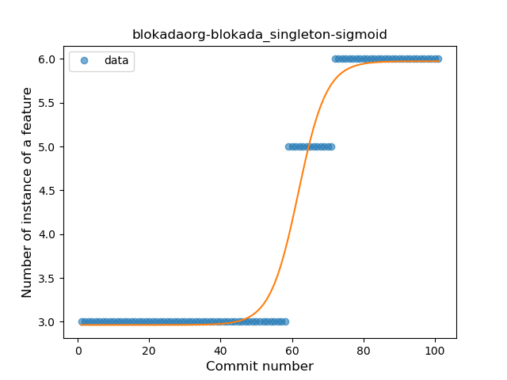

#### ids1024-whitakers-words-android
* Feature: String Template
* Function: 
* R_Squared: 0.96629968
 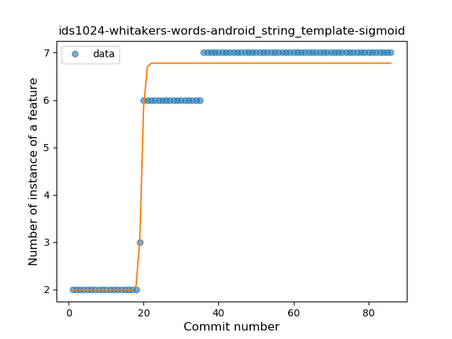

#### CzBiX-v2ex-android
* Feature: Function with Default Value
* Function: 
* R_Squared: 0.96602281
 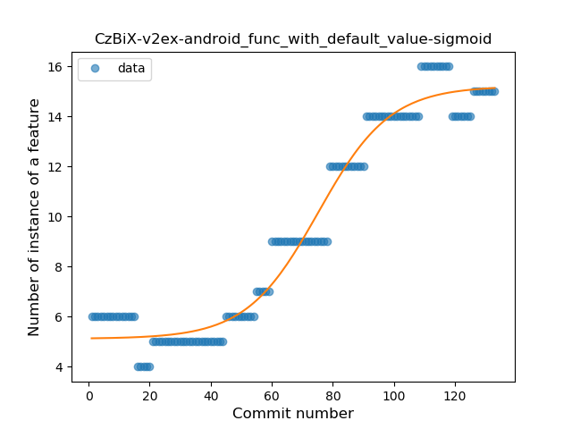

#### caarmen-poet-assistant
* Feature: Safe Call
* Function: 
* R_Squared: 0.96601514
 

#### klassm-andFHEM
* Feature: Singleton
* Function: 
* R_Squared: 0.96548057
 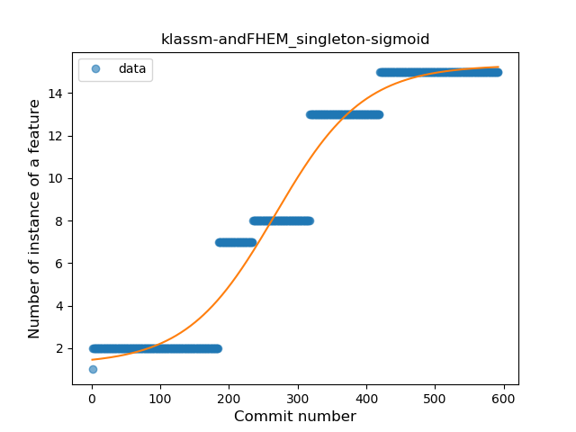

#### ohmae-VoiceMessageBoard
* Feature: When expression
* Function: 
* R_Squared: 0.96547032
 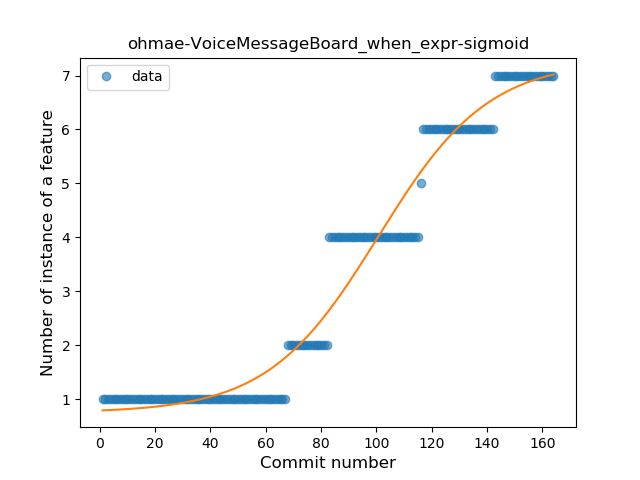

#### FengMoeTeam-NHentai-android
* Feature: Function with Default Value
* Function: 
* R_Squared: 0.96519491
 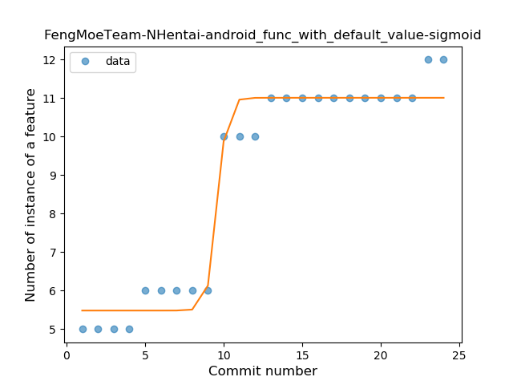

#### mkg20001-aruba-networks-login
* Feature: Unsafe Call
* Function: 
* R_Squared: 0.96513537
 

#### mbarta-scr-redesign
* Feature: Extension Function
* Function: 
* R_Squared: 0.96506593
 

#### erickok-borefts2015
* Feature: Singleton
* Function: 
* R_Squared: 0.96498634
 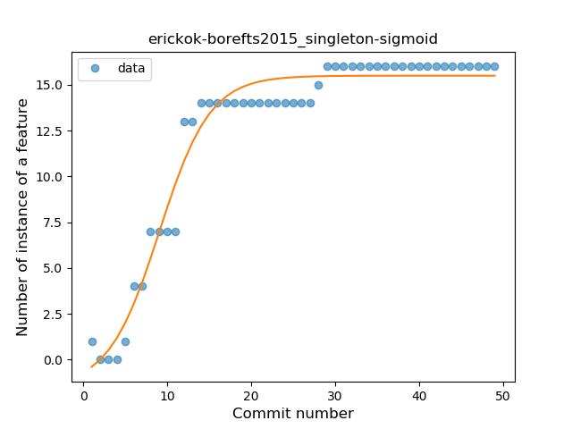

#### corphish-NightLight
* Feature: Function with Default Value
* Function: 
* R_Squared: 0.96487882
 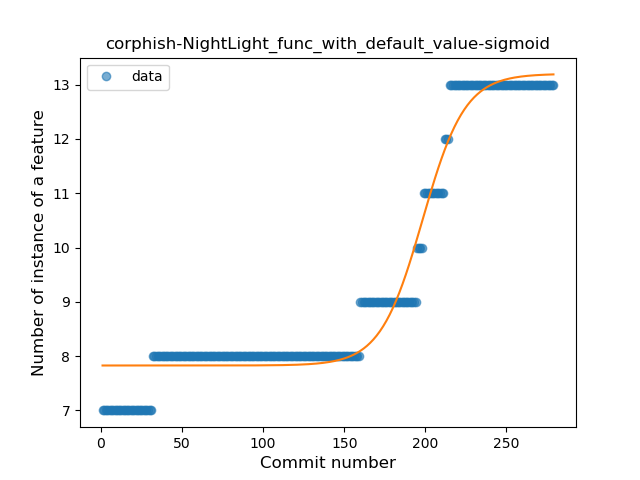

#### zoenb-log28
* Feature: String Template
* Function: 
* R_Squared: 0.96438011
 

#### yshrsmz-monotweety
* Feature: String Template
* Function: 
* R_Squared: 0.96431635
 

#### shymmq-librus-client-kotlin
* Feature: Extension Function
* Function: 
* R_Squared: 0.96429827
 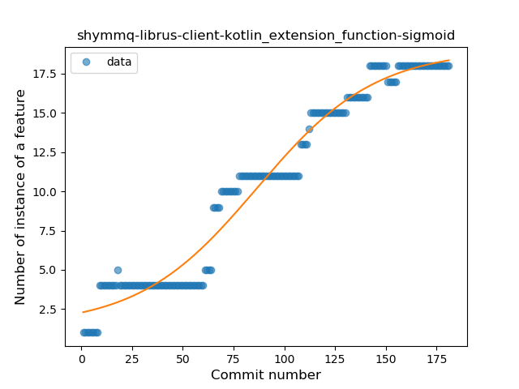

#### esafirm-android-playground
* Feature: Function with Default Value
* Function: 
* R_Squared: 0.96420954
 

#### esafirm-android-playground
* Feature: Function call with Named Argument
* Function: 
* R_Squared: 0.96408621
 

#### raatmarien-red-moon
* Feature: Singleton
* Function: 
* R_Squared: 0.96362623
 

#### jereksel-Bucket
* Feature: Smart Cast
* Function: 
* R_Squared: 0.96347782
 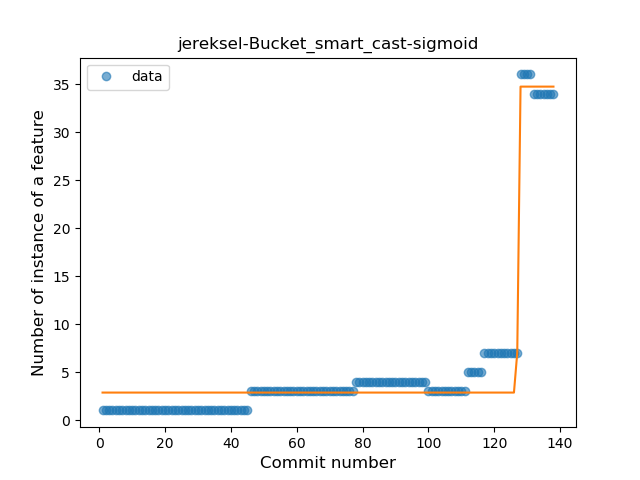

#### kamgurgul-cpu-info
* Feature: Function call with Named Argument
* Function: 
* R_Squared: 0.96341621
 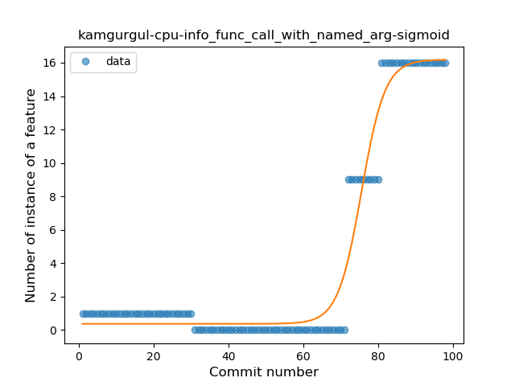

#### aminecmi-ReaderforSelfoss
* Feature: Companion Object
* Function: 
* R_Squared: 0.96278485
 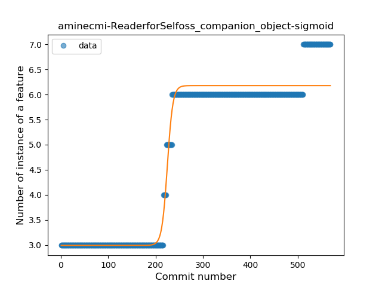

#### pacien-tincapp
* Feature: Function with Default Value
* Function: 
* R_Squared: 0.96206922
 

#### TeMoMuKo-AutoStopRace
* Feature: Lambda
* Function: 
* R_Squared: 0.96193342
 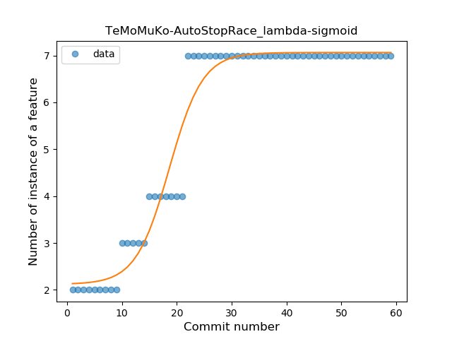

#### mkg20001-aruba-networks-login
* Feature: Companion Object
* Function: 
* R_Squared: 0.96161805
 

#### grote-Transportr
* Feature: Function with Default Value
* Function: 
* R_Squared: 0.96130706
 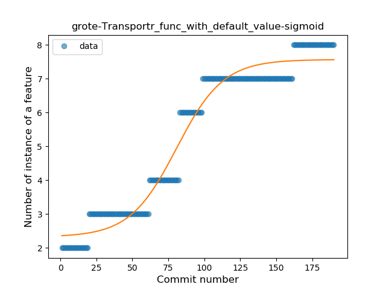

#### juha-h-baresip-studio
* Feature: Companion Object
* Function: 
* R_Squared: 0.96128117
 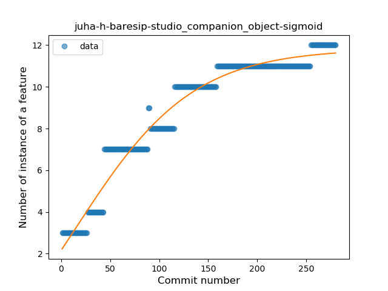

#### raatmarien-red-moon
* Feature: String Template
* Function: 
* R_Squared: 0.96101177
 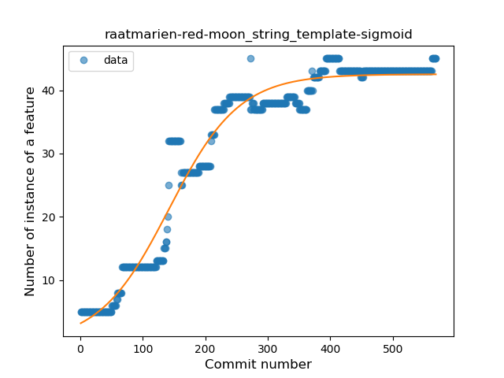

#### inorichi-tachiyomi
* Feature: Inline Function
* Function: 
* R_Squared: 0.96060633
 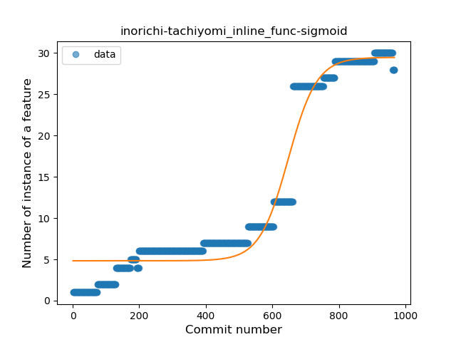

#### NyaaPantsu-NyaaPantsu-android-app
* Feature: Singleton
* Function: 
* R_Squared: 0.96047985
 

#### glodanif-BluetoothChat
* Feature: Companion Object
* Function: 
* R_Squared: 0.96045377
 

#### ligi-IPFSDroid
* Feature: Type Inference
* Function: 
* R_Squared: 0.96025621
 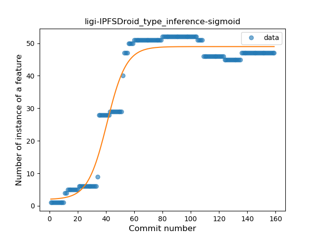

#### fossasia-open-event-android
* Feature: Range Expression
* Function: 
* R_Squared: 0.95984892
 

#### Waboodoo-HTTP-Shortcuts
* Feature: Function call with Named Argument
* Function: 
* R_Squared: 0.95974312
 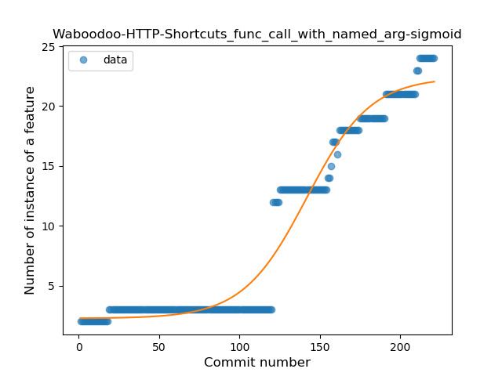

#### iPoli-iPoli-android
* Feature: Inline Function
* Function: 
* R_Squared: 0.95964392
 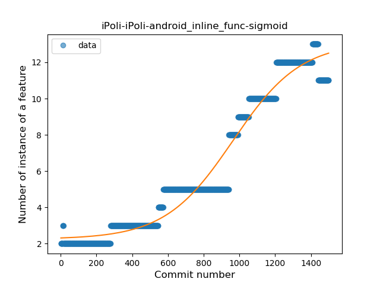

#### kirimin-mitsumine
* Feature: Function call with Named Argument
* Function: 
* R_Squared: 0.959539
 

#### veniosg-JustSearch
* Feature: Property Delegation
* Function: 
* R_Squared: 0.95940074
 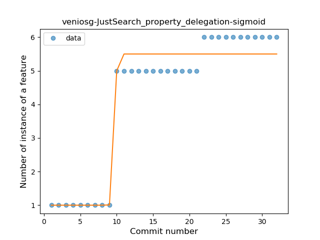

#### Mygod-VPNHotspot
* Feature: Property Delegation
* Function: 
* R_Squared: 0.95888117
 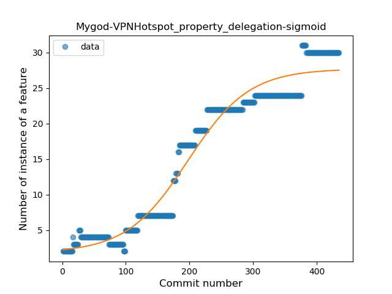

#### dkrivoruchko-ScreenStream
* Feature: Function with Default Value
* Function: 
* R_Squared: 0.95877658
 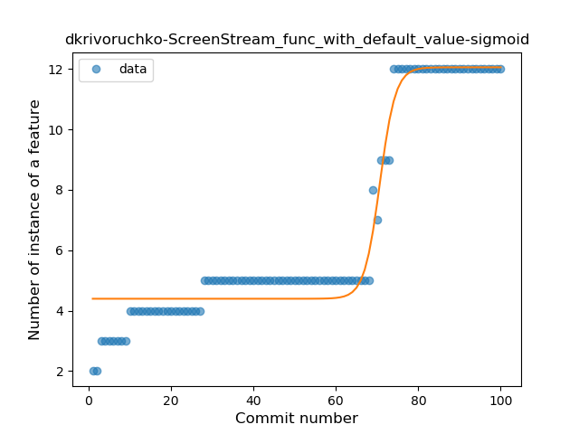

#### MGaetan89-ShowsRage
* Feature: Extension Function
* Function: 
* R_Squared: 0.95869526
 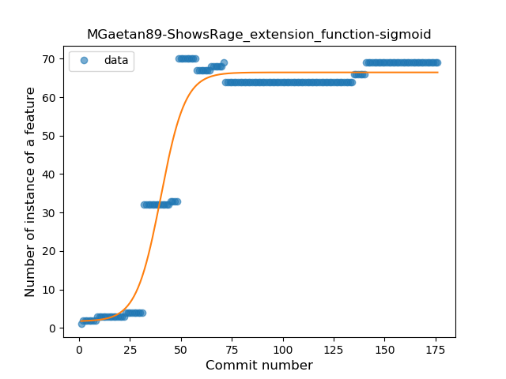

#### anthonycr-Lightning-Browser
* Feature: Data Class
* Function: 
* R_Squared: 0.95809177
 

#### caarmen-poet-assistant
* Feature: Function with Default Value
* Function: 
* R_Squared: 0.95801824
 

#### CzBiX-v2ex-android
* Feature: Companion Object
* Function: 
* R_Squared: 0.95800832
 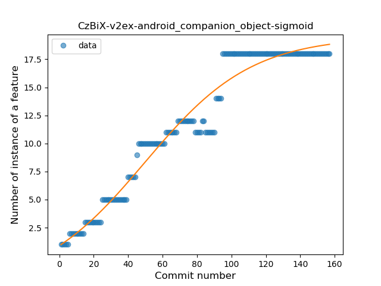

#### RocketChat-Rocket.Chat.Android
* Feature: Inline Function
* Function: 
* R_Squared: 0.9579989
 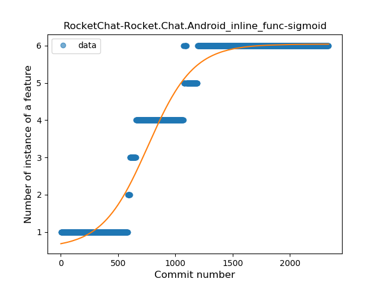

#### albertolalanda-new-ultrasonic-fork-for-MyMusicQoE
* Feature: When expression
* Function: 
* R_Squared: 0.95786431
 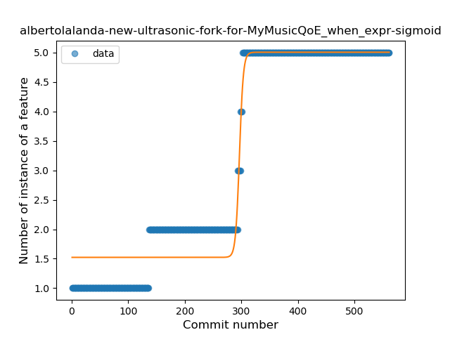

#### loloof64-BasicChessEndGamesTrainer
* Feature: Smart Cast
* Function: 
* R_Squared: 0.95785662
 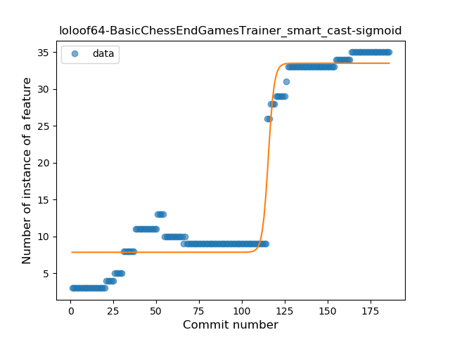

#### caarmen-poet-assistant
* Feature: Smart Cast
* Function: 
* R_Squared: 0.95745122
 

#### EventFahrplan-EventFahrplan
* Feature: Singleton
* Function: 
* R_Squared: 0.95731411
 

#### Apolline-Lille-apolline-android
* Feature: Function call with Named Argument
* Function: 
* R_Squared: 0.95712715
 

#### darshanparajuli-LogcatReader
* Feature: Overloaded Operator
* Function: 
* R_Squared: 0.95707419
 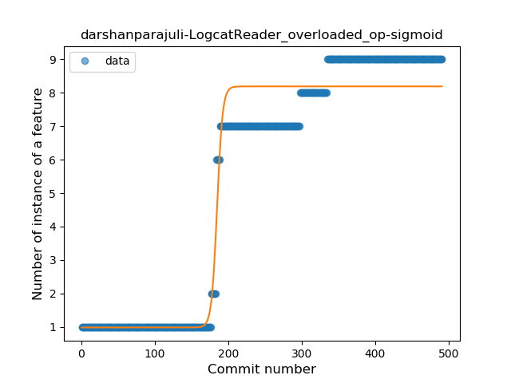

#### mbarta-scr-redesign
* Feature: Safe Call
* Function: 
* R_Squared: 0.95665104
 

#### sjnyag-stamp
* Feature: Range Expression
* Function: 
* R_Squared: 0.95660757
 

#### kirimin-mitsumine
* Feature: When expression
* Function: 
* R_Squared: 0.95656644
 

#### NyaaPantsu-NyaaPantsu-android-app
* Feature: String Template
* Function: 
* R_Squared: 0.95641287
 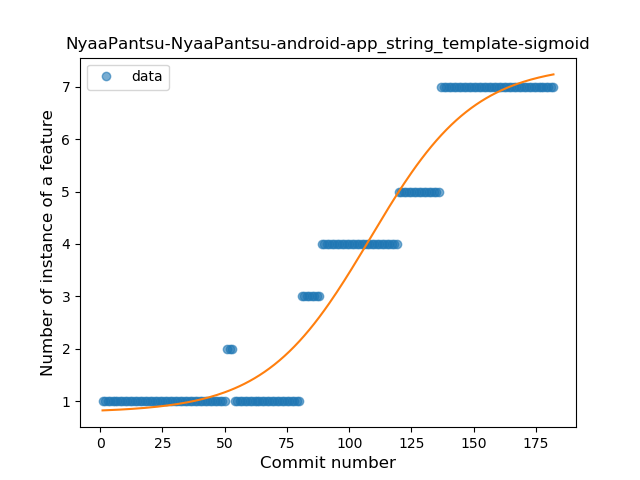

#### eurofurence-ef-app_android
* Feature: When expression
* Function: 
* R_Squared: 0.95606799
 

#### fedepaol-BikeSharing
* Feature: When expression
* Function: 
* R_Squared: 0.9559322
 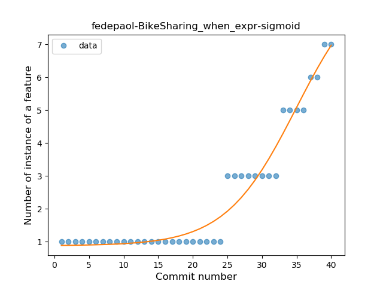

#### fedepaol-BikeSharing
* Feature: Data Class
* Function: 
* R_Squared: 0.95581472
 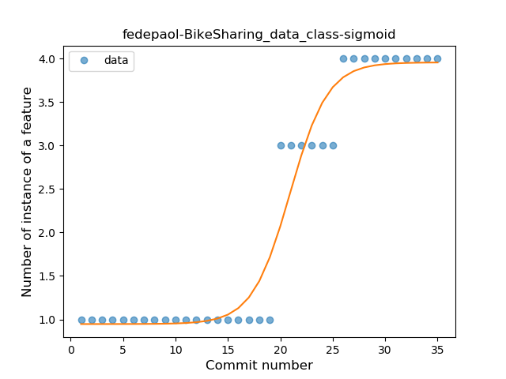

#### SimpleMobileTools-Simple-File-Manager
* Feature: Function with Default Value
* Function: 
* R_Squared: 0.95579718
 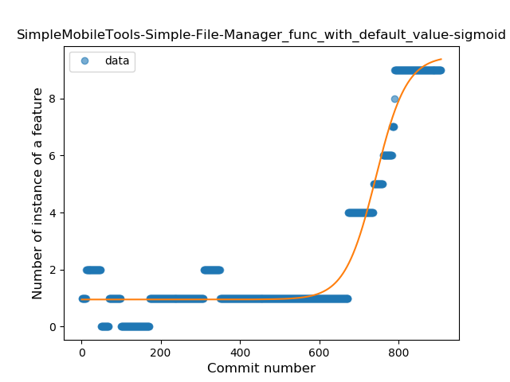

#### bitfireAT-icsdroid
* Feature: When expression
* Function: 
* R_Squared: 0.95573254
 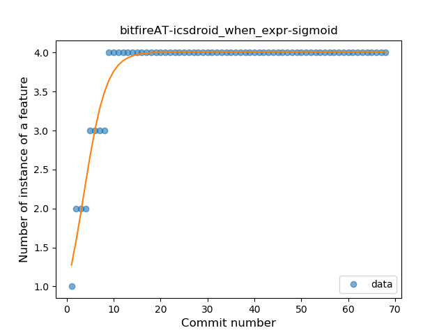

#### CzBiX-v2ex-android
* Feature: Singleton
* Function: 
* R_Squared: 0.95572903
 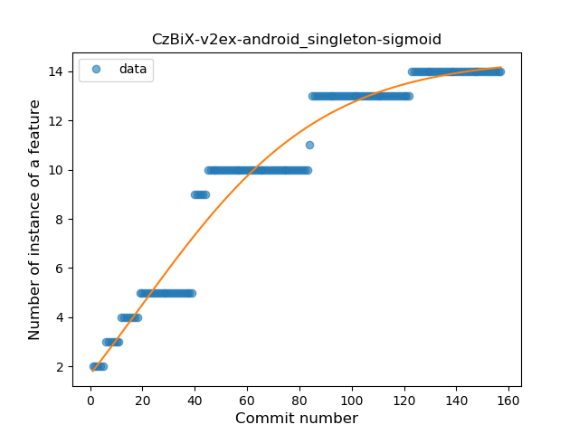

#### AIDEA775-UNCmorfi
* Feature: Companion Object
* Function: 
* R_Squared: 0.95561789
 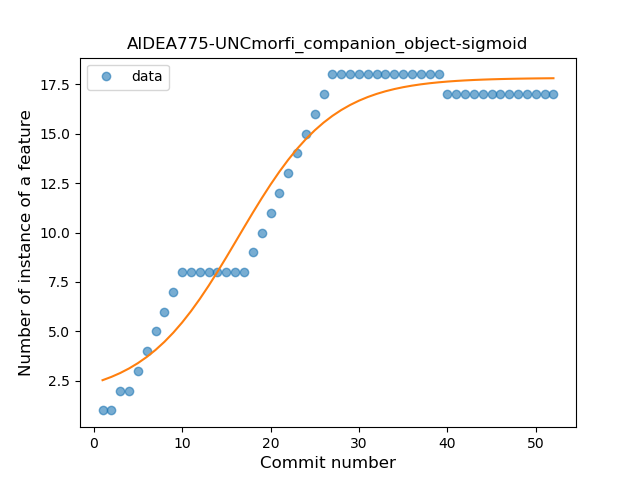

#### fedepaol-BikeSharing
* Feature: Lambda
* Function: 
* R_Squared: 0.95514015
 

#### nibarius-opera-park-android
* Feature: Function call with Named Argument
* Function: 
* R_Squared: 0.95508597
 

#### mjdenham-and-bible
* Feature: Safe Call
* Function: 
* R_Squared: 0.95482236
 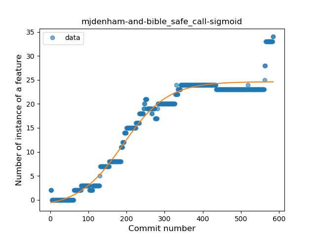

#### ykrank-S1-Next
* Feature: Unsafe Call
* Function: 
* R_Squared: 0.95479947
 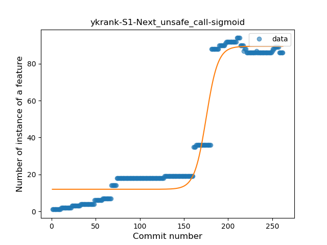

#### rubenwardy-mtmods4android
* Feature: Type Inference
* Function: 
* R_Squared: 0.95467556
 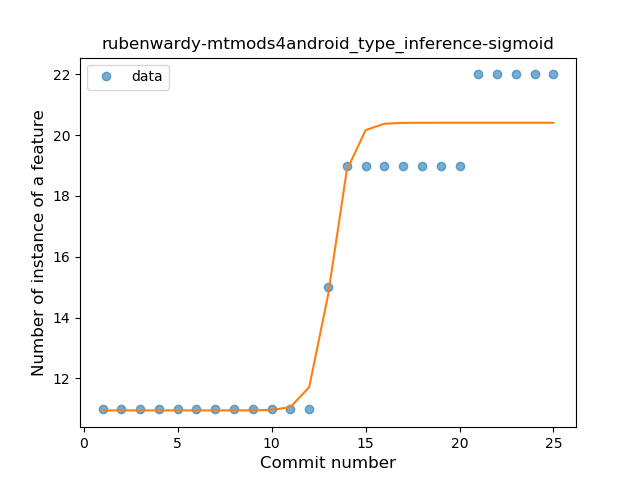

#### k9mail-k-9
* Feature: Property Delegation
* Function: 
* R_Squared: 0.95466638
 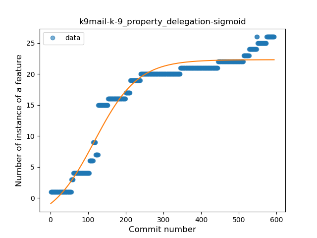

#### mozilla-mobile-focus-android
* Feature: Data Class
* Function: 
* R_Squared: 0.95462319
 

#### LiMium-mini-vector-android
* Feature: Range Expression
* Function: 
* R_Squared: 0.95415942
 

#### hsson-card-balance-app
* Feature: When expression
* Function: 
* R_Squared: 0.95322548
 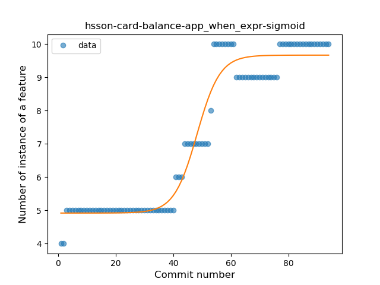

#### LiMium-mini-vector-android
* Feature: Data Class
* Function: 
* R_Squared: 0.95206263
 

#### herbeth1u-VNDB-Android
* Feature: Companion Object
* Function: 
* R_Squared: 0.95206168
 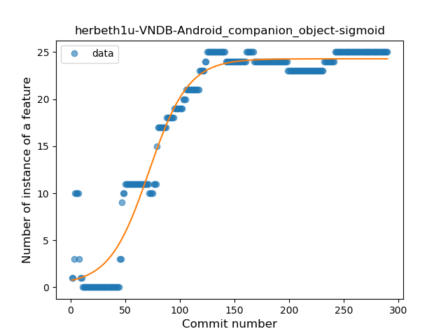

#### hypeapps-episodie
* Feature: Smart Cast
* Function: 
* R_Squared: 0.95197095
 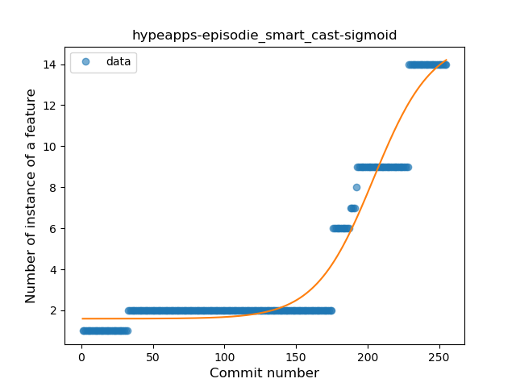

#### sjnyag-stamp
* Feature: Overloaded Operator
* Function: 
* R_Squared: 0.95179675
 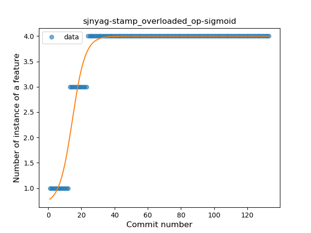

#### tasomaniac-OpenLinkWith
* Feature: Function call with Named Argument
* Function: 
* R_Squared: 0.95144873
 

#### pyamsoft-home-button
* Feature: Lambda
* Function: 
* R_Squared: 0.95132943
 

#### vector-im-riot-android
* Feature: Range Expression
* Function: 
* R_Squared: 0.95111365
 

#### ScreamingHawk-phone-saver
* Feature: Function with Default Value
* Function: 
* R_Squared: 0.95075568
 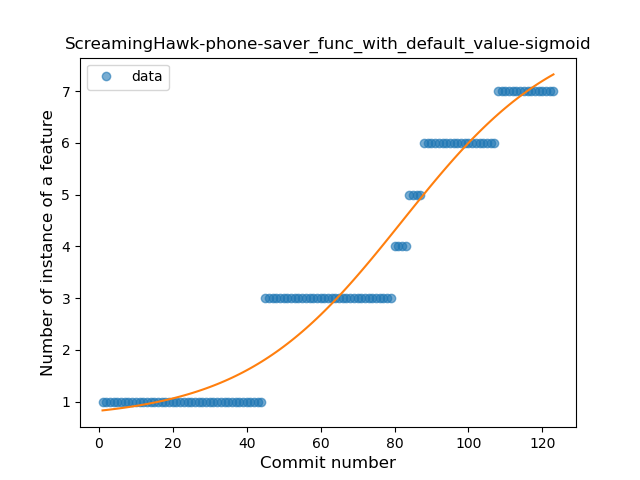

#### ligi-SurvivalManual
* Feature: String Template
* Function: 
* R_Squared: 0.95072192
 

#### apoi-quickbeer-android
* Feature: Data Class
* Function: 
* R_Squared: 0.95029331
 

#### premnirmal-StockTicker
* Feature: Data Class
* Function: 
* R_Squared: 0.94995799
 

#### vector-im-riot-android
* Feature: Data Class
* Function: 
* R_Squared: 0.94990062
 

#### raatmarien-red-moon
* Feature: Extension Function
* Function: 
* R_Squared: 0.94966144
 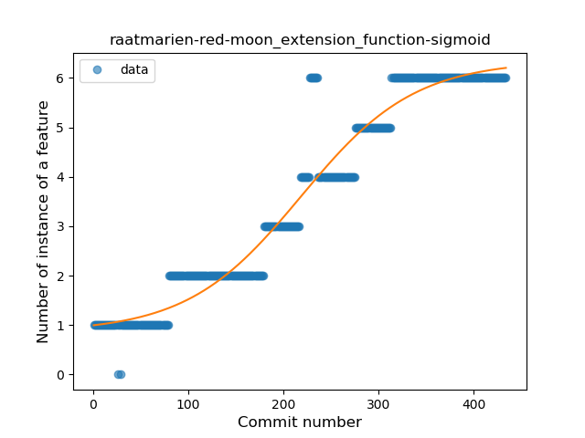

#### nathanj-ogsdroid
* Feature: When expression
* Function: 
* R_Squared: 0.94898724
 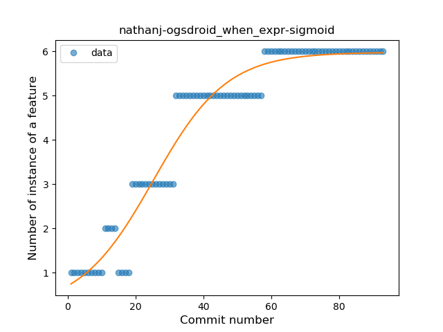

#### tasomaniac-OpenLinkWith
* Feature: Smart Cast
* Function: 
* R_Squared: 0.94889351
 

#### JanYoStudio-WhatAnime
* Feature: Singleton
* Function: 
* R_Squared: 0.94807603
 

#### DSteve595-Put.io
* Feature: String Template
* Function: 
* R_Squared: 0.94777368
 

#### alessio-b-zak-myRivers
* Feature: Data Class
* Function: 
* R_Squared: 0.94776905
 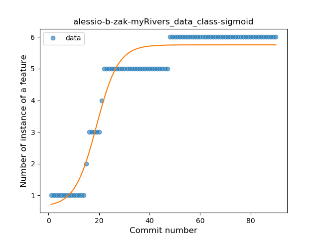

#### RocketChat-Rocket.Chat.Android
* Feature: Destructuring Declaration
* Function: 
* R_Squared: 0.94773922
 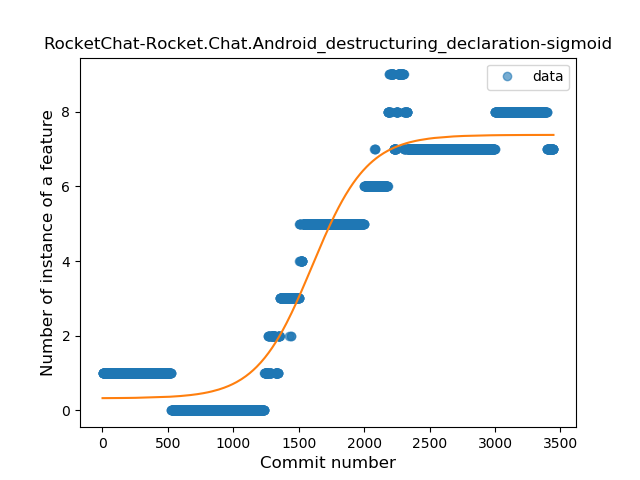

#### albertolalanda-new-ultrasonic-fork-for-MyMusicQoE
* Feature: Companion Object
* Function: 
* R_Squared: 0.94749437
 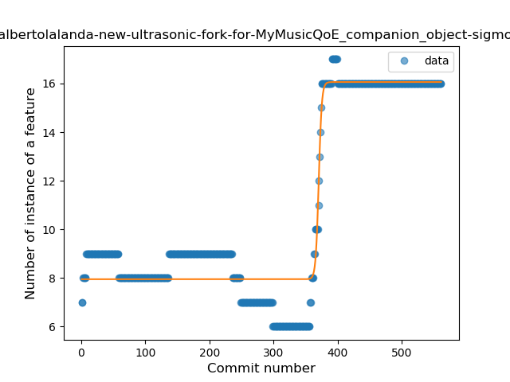

#### SimpleMobileTools-Simple-Notes
* Feature: Data Class
* Function: 
* R_Squared: 0.94713563
 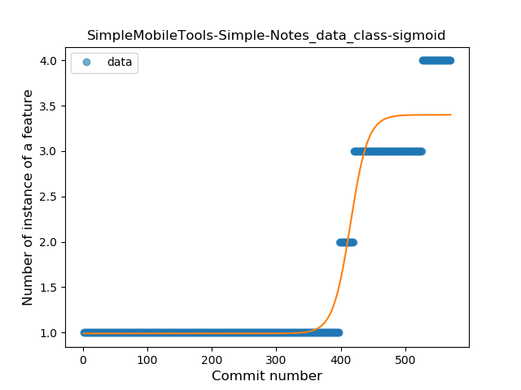

#### fvasco-pinpoi
* Feature: Function call with Named Argument
* Function: 
* R_Squared: 0.94686787
 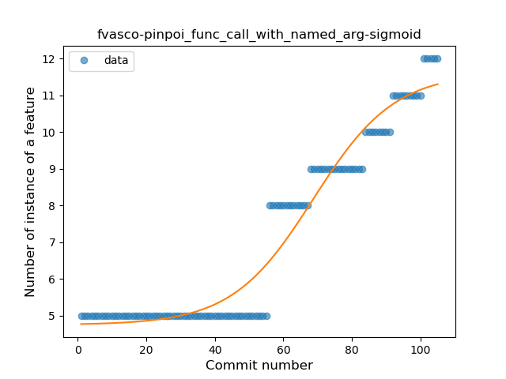

#### aminecmi-ReaderforSelfoss
* Feature: Smart Cast
* Function: 
* R_Squared: 0.94685411
 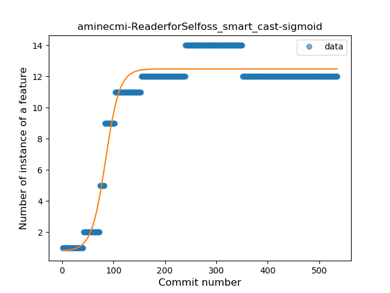

#### openium-auvergne-webcams-droid
* Feature: String Template
* Function: 
* R_Squared: 0.94679812
 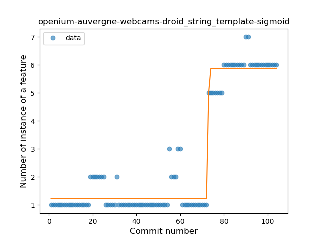

#### iskandergaba-Botanist
* Feature: Lambda
* Function: 
* R_Squared: 0.94555731
 

#### Waboodoo-HTTP-Shortcuts
* Feature: String Template
* Function: 
* R_Squared: 0.94553637
 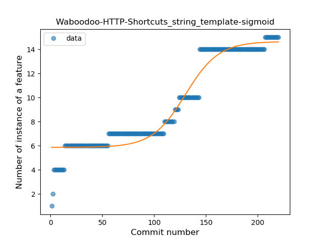

#### mjdenham-and-bible
* Feature: Smart Cast
* Function: 
* R_Squared: 0.94514933
 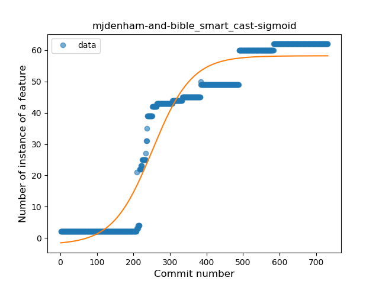

#### hypeapps-episodie
* Feature: Inline Function
* Function: 
* R_Squared: 0.94510928
 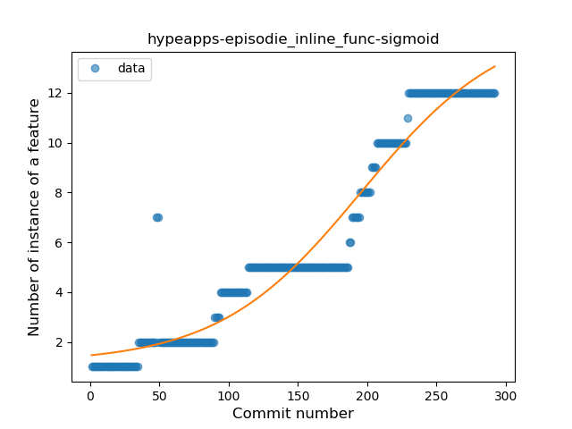

#### esafirm-android-playground
* Feature: Property Delegation
* Function: 
* R_Squared: 0.94386278
 

#### howard-e-just-quotes-kt
* Feature: String Template
* Function: 
* R_Squared: 0.94365549
 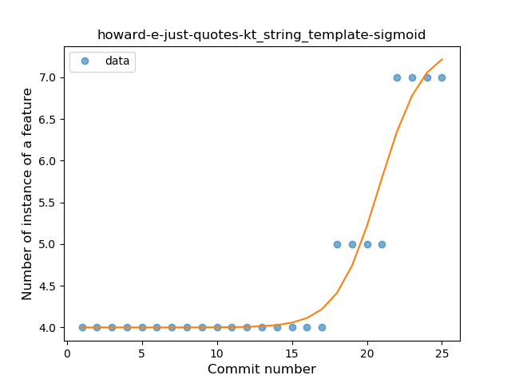

#### mozilla-mobile-focus-android
* Feature: Range Expression
* Function: 
* R_Squared: 0.94304351
 

#### corenting-EDCompanion
* Feature: Type Inference
* Function: 
* R_Squared: 0.9427783
 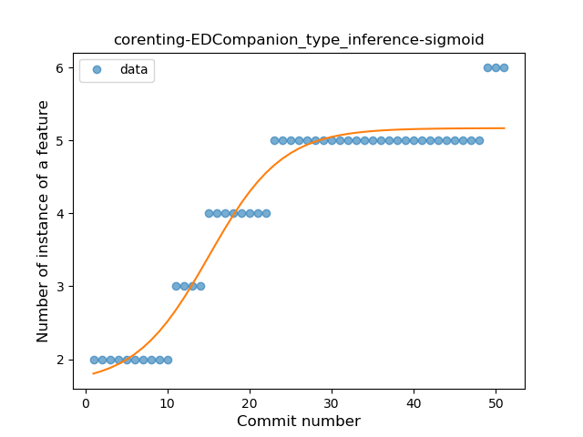

#### tuskyapp-Tusky
* Feature: Function with Default Value
* Function: 
* R_Squared: 0.94249252
 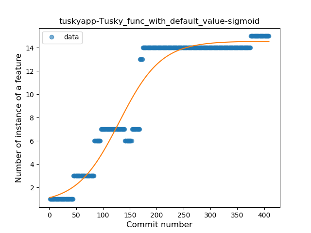

#### thermatk-FastHub-Libre
* Feature: Singleton
* Function: 
* R_Squared: 0.94231992
 

#### Doctoror-ParticleConstellationsLiveWallpaper
* Feature: Destructuring Declaration
* Function: 
* R_Squared: 0.94204772
 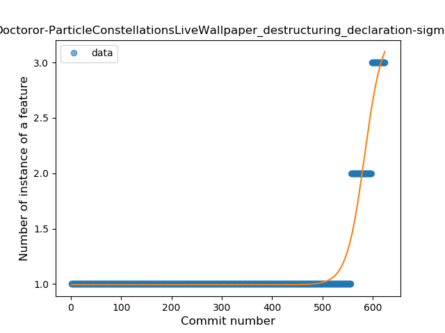

#### herbeth1u-VNDB-Android
* Feature: When expression
* Function: 
* R_Squared: 0.9411539
 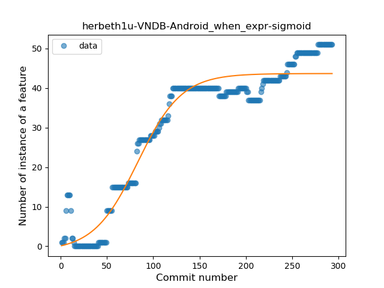

#### osmandapp-Osmand
* Feature: Range Expression
* Function: 
* R_Squared: 0.94101073
 

#### ligi-gobandroid
* Feature: When expression
* Function: 
* R_Squared: 0.9406038
 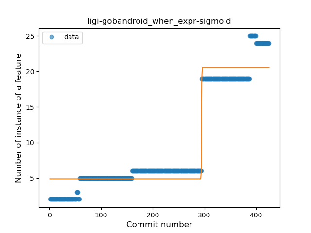

#### zoenb-log28
* Feature: Extension Function
* Function: 
* R_Squared: 0.93981093
 

#### ultrasonic-ultrasonic
* Feature: When expression
* Function: 
* R_Squared: 0.93958595
 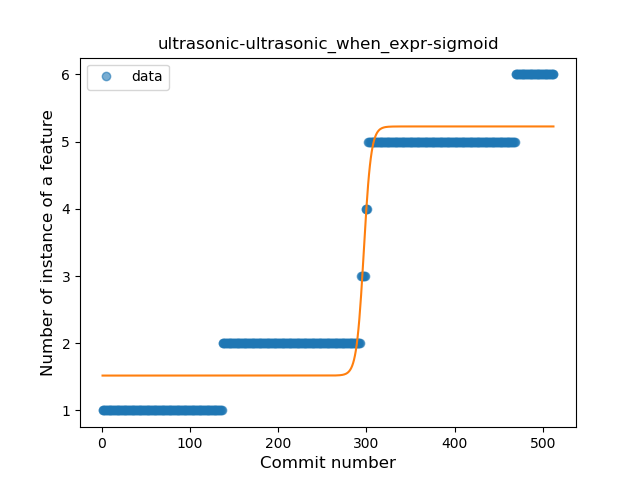

#### SimpleMobileTools-Simple-Calendar
* Feature: When expression
* Function: 
* R_Squared: 0.93930204
 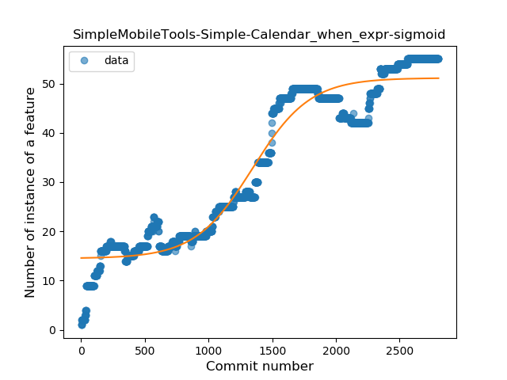

#### SimpleMobileTools-Simple-Clock
* Feature: Companion Object
* Function: 
* R_Squared: 0.93929024
 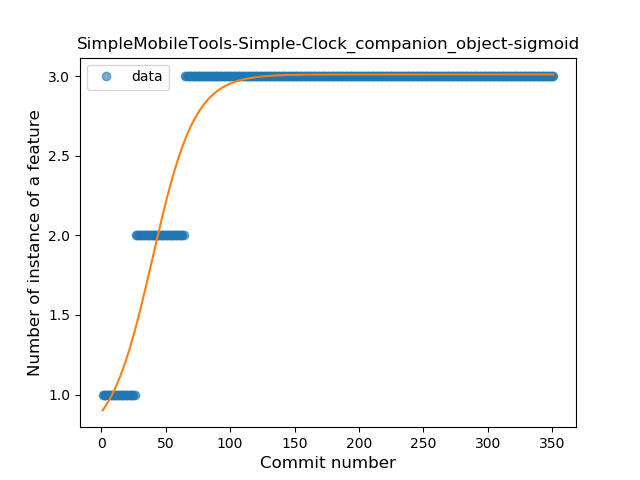

#### LaurentTreguier-deck
* Feature: Companion Object
* Function: 
* R_Squared: 0.93805677
 

#### moko256-twitlatte
* Feature: Function with Default Value
* Function: 
* R_Squared: 0.93800783
 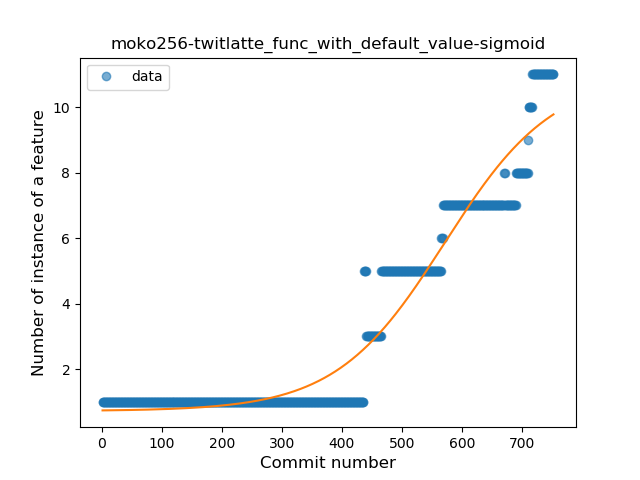

#### nao20010128nao-DroidComplex
* Feature: Inline Function
* Function: 
* R_Squared: 0.93786094
 

#### Doctoror-ParticleConstellationsLiveWallpaper
* Feature: Data Class
* Function: 
* R_Squared: 0.9378608
 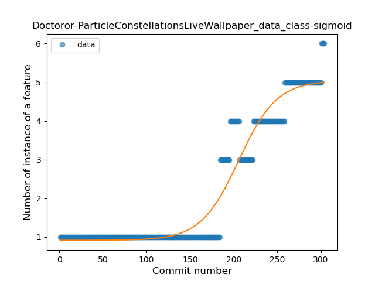

#### Maxr1998-MaxLock
* Feature: When expression
* Function: 
* R_Squared: 0.93785353
 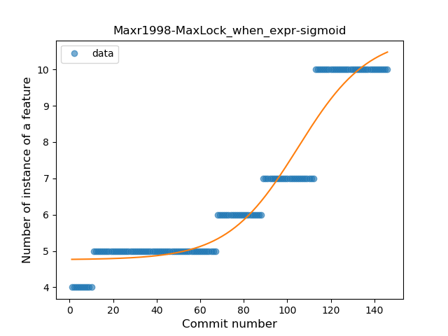

#### shymmq-librus-client-kotlin
* Feature: When expression
* Function: 
* R_Squared: 0.93764236
 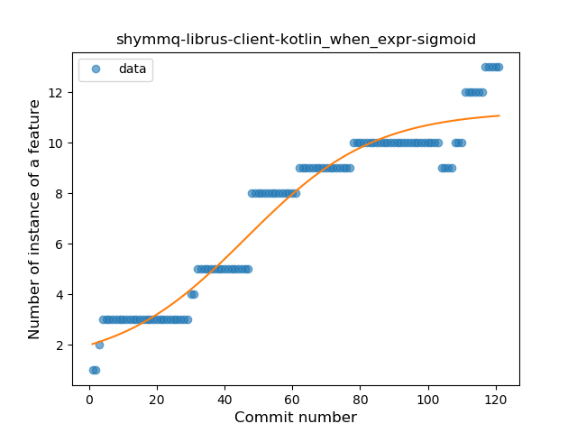

#### ykrank-S1-Next
* Feature: Smart Cast
* Function: 
* R_Squared: 0.93745178
 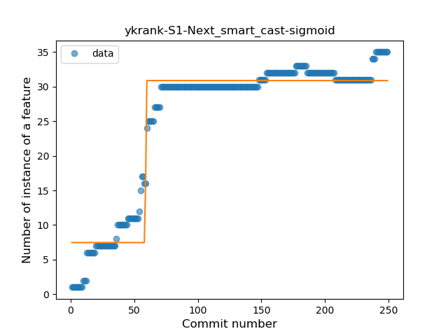

#### LaurentTreguier-deck
* Feature: Unsafe Call
* Function: 
* R_Squared: 0.9367828
 

#### apoi-quickbeer-android
* Feature: String Template
* Function: 
* R_Squared: 0.93638178
 

#### vector-im-riot-android
* Feature: Function call with Named Argument
* Function: 
* R_Squared: 0.93624645
 

#### kirimin-mitsumine
* Feature: Data Class
* Function: 
* R_Squared: 0.93609584
 

#### romannurik-muzei
* Feature: Data Class
* Function: 
* R_Squared: 0.93566836
 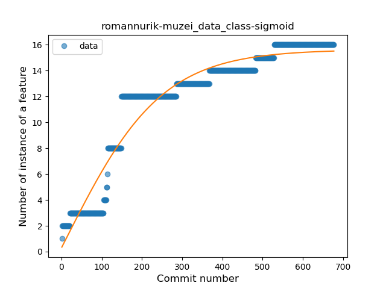

#### LiMium-mini-vector-android
* Feature: Function call with Named Argument
* Function: 
* R_Squared: 0.93530574
 

#### loloof64-BasicChessEndGamesTrainer
* Feature: Companion Object
* Function: 
* R_Squared: 0.93523305
 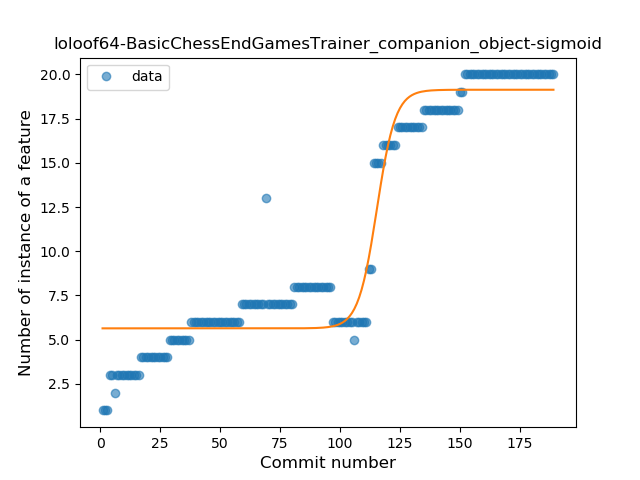

#### alessio-b-zak-myRivers
* Feature: String Template
* Function: 
* R_Squared: 0.93444449
 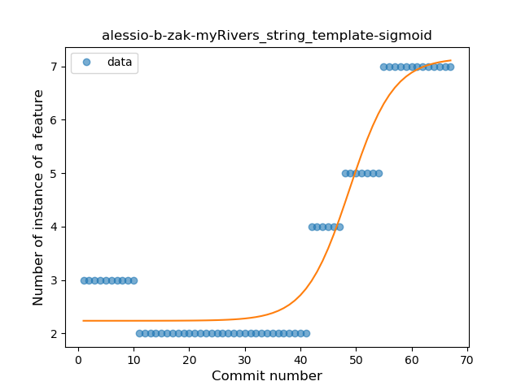

#### tasomaniac-OpenLinkWith
* Feature: Data Class
* Function: 
* R_Squared: 0.93429348
 

#### caarmen-poet-assistant
* Feature: Data Class
* Function: 
* R_Squared: 0.93396412
 

#### aminecmi-ReaderforSelfoss
* Feature: Data Class
* Function: 
* R_Squared: 0.93270062
 

#### EventFahrplan-EventFahrplan
* Feature: Data Class
* Function: 
* R_Squared: 0.9326769
 

#### moko256-twitlatte
* Feature: When expression
* Function: 
* R_Squared: 0.93227437
 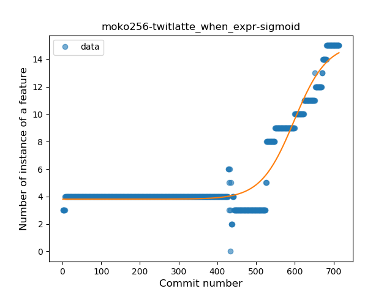

#### quarck-CalendarNotification
* Feature: Range Expression
* Function: 
* R_Squared: 0.93219167
 

#### ligi-PassAndroid
* Feature: Function with Default Value
* Function: 
* R_Squared: 0.93212082
 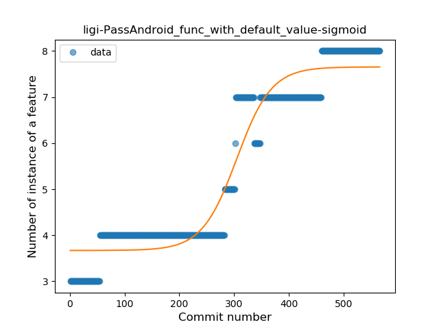

#### charlesmadere-smash-ranks-android
* Feature: Range Expression
* Function: 
* R_Squared: 0.93204268
 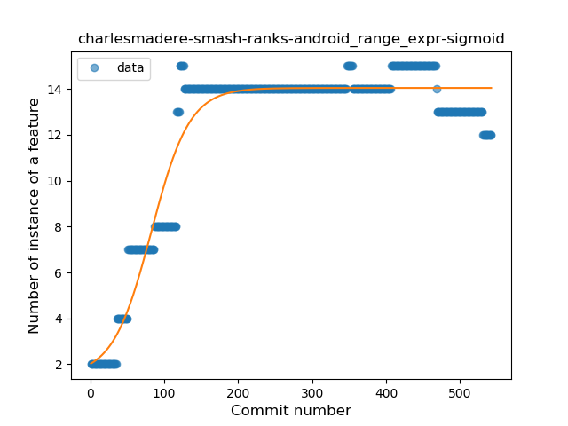

#### herbeth1u-VNDB-Android
* Feature: Inline Function
* Function: 
* R_Squared: 0.93157914
 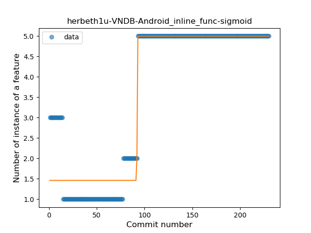

#### SimpleMobileTools-Simple-Camera
* Feature: Function with Default Value
* Function: 
* R_Squared: 0.92916866
 

#### mkg20001-aruba-networks-login
* Feature: Type Inference
* Function: 
* R_Squared: 0.92916366
 

#### nathanj-ogsdroid
* Feature: Smart Cast
* Function: 
* R_Squared: 0.9286615
 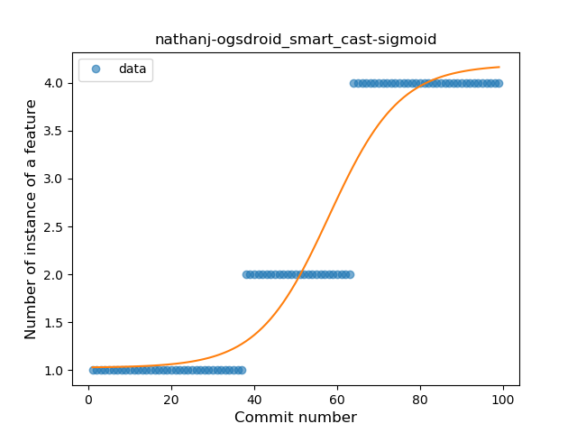

#### romannurik-muzei
* Feature: Destructuring Declaration
* Function: 
* R_Squared: 0.9281853
 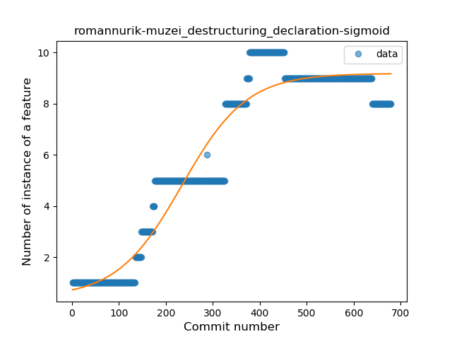

#### CzBiX-v2ex-android
* Feature: Extension Function
* Function: 
* R_Squared: 0.92795648
 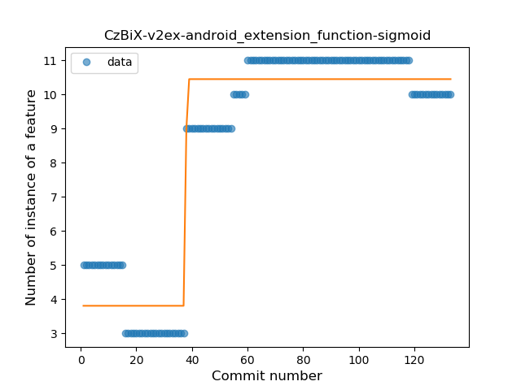

#### charlesmadere-smash-ranks-android
* Feature: Singleton
* Function: 
* R_Squared: 0.92742178
 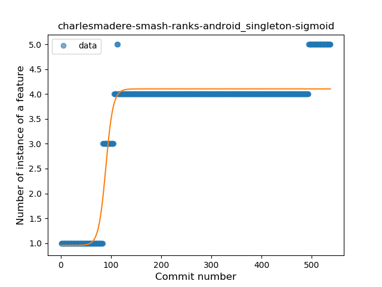

#### yshrsmz-monotweety
* Feature: Function with Default Value
* Function: 
* R_Squared: 0.92717143
 

#### sreich-android-count-the-days
* Feature: Extension Function
* Function: 
* R_Squared: 0.92712249
 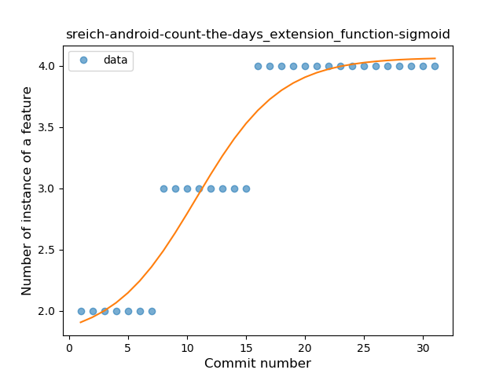

#### calintat-sensors
* Feature: Lambda
* Function: 
* R_Squared: 0.92685036
 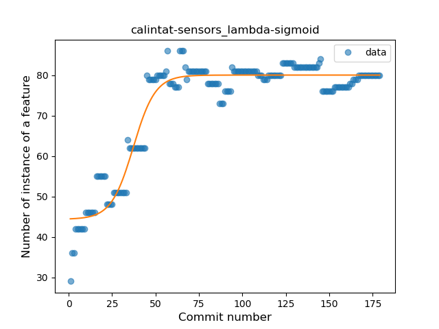

#### PaulWoitaschek-Voice
* Feature: Overloaded Operator
* Function: 
* R_Squared: 0.92667089
 

#### fvasco-pinpoi
* Feature: Function with Default Value
* Function: 
* R_Squared: 0.92597065
 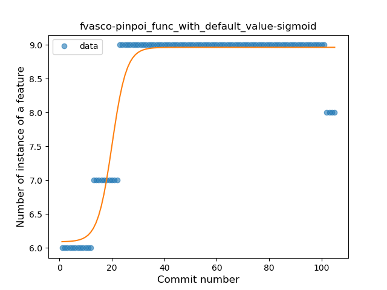

#### spacecowboy-Feeder
* Feature: Singleton
* Function: 
* R_Squared: 0.92510017
 

#### fossasia-open-event-android
* Feature: Smart Cast
* Function: 
* R_Squared: 0.92503852
 

#### SimpleMobileTools-Simple-Music-Player
* Feature: Function with Default Value
* Function: 
* R_Squared: 0.92474298
 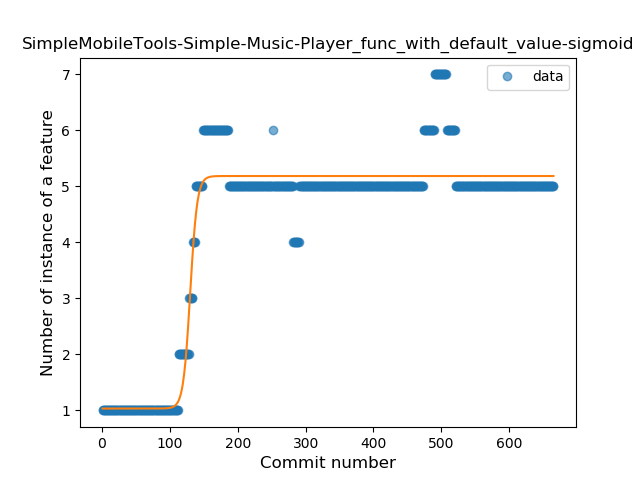

#### tasomaniac-OpenLinkWith
* Feature: String Template
* Function: 
* R_Squared: 0.92433593
 

#### EventFahrplan-EventFahrplan
* Feature: Companion Object
* Function: 
* R_Squared: 0.92432593
 

#### milosmns-Timecrypt
* Feature: When expression
* Function: 
* R_Squared: 0.92408336
 

#### citiususc-calendula
* Feature: Singleton
* Function: 
* R_Squared: 0.9223715
 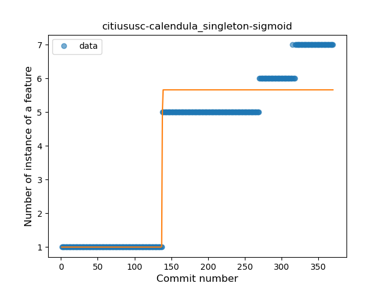

#### mastizada-focus-android
* Feature: Function with Default Value
* Function: 
* R_Squared: 0.92231321
 

#### citiususc-calendula
* Feature: Lambda
* Function: 
* R_Squared: 0.92212285
 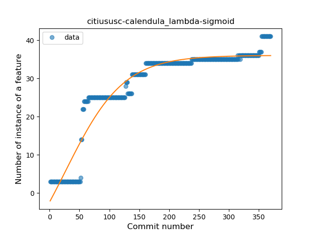

#### nibarius-opera-park-android
* Feature: Function with Default Value
* Function: 
* R_Squared: 0.92187999
 

#### grote-Transportr
* Feature: Data Class
* Function: 
* R_Squared: 0.92042171
 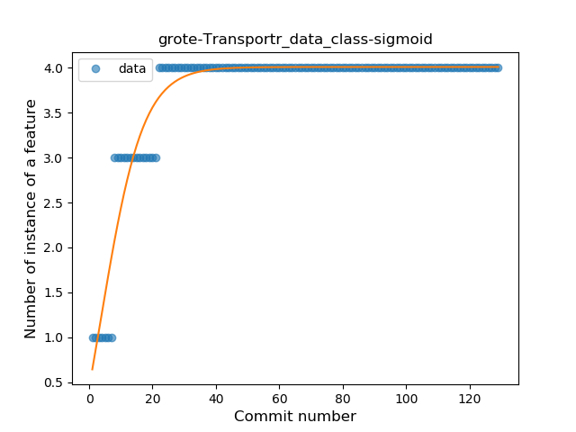

#### Valodim-Stratum0Widget
* Feature: Lambda
* Function: 
* R_Squared: 0.9201981
 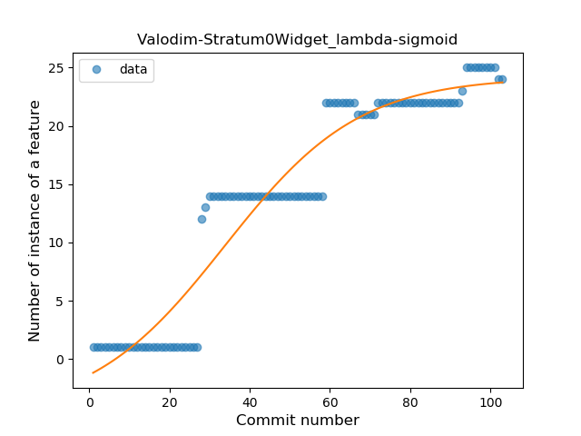

#### premnirmal-StockTicker
* Feature: When expression
* Function: 
* R_Squared: 0.91934066
 

#### apoi-quickbeer-android
* Feature: Function with Default Value
* Function: 
* R_Squared: 0.91905927
 

#### kirimin-mitsumine
* Feature: Smart Cast
* Function: 
* R_Squared: 0.91891329
 

#### k9mail-k-9
* Feature: String Template
* Function: 
* R_Squared: 0.91842706
 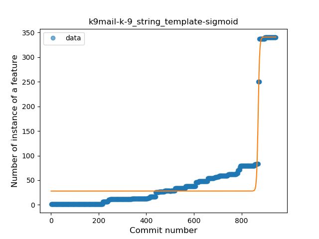

#### Gark-bassblog_kotlin
* Feature: Companion Object
* Function: 
* R_Squared: 0.91768666
 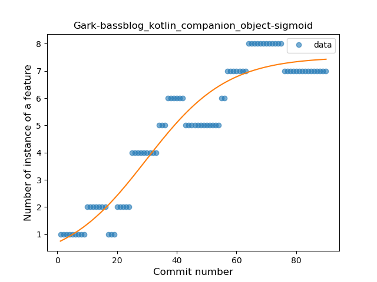

#### pflammertsma-cryptogram
* Feature: Function call with Named Argument
* Function: 
* R_Squared: 0.91713149
 

#### premnirmal-StockTicker
* Feature: Safe Call
* Function: 
* R_Squared: 0.91623033
 

#### tasomaniac-OpenLinkWith
* Feature: Function with Default Value
* Function: 
* R_Squared: 0.91540961
 

#### blastrock-kaqui
* Feature: When expression
* Function: 
* R_Squared: 0.91383535
 

#### abertschi-ad-free
* Feature: Function with Default Value
* Function: 
* R_Squared: 0.91340304
 

#### CypherpunkArmory-UserLAnd
* Feature: Data Class
* Function: 
* R_Squared: 0.91334442
 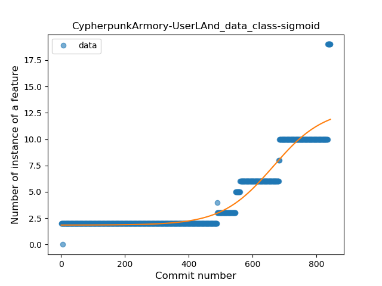

#### mastizada-focus-android
* Feature: When expression
* Function: 
* R_Squared: 0.91271853
 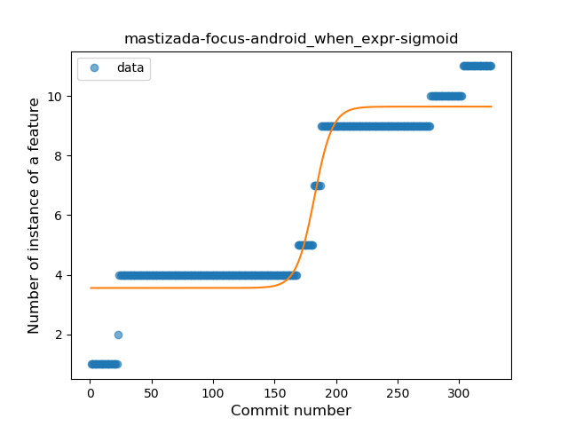

#### peppercarrot-e-reader
* Feature: Range Expression
* Function: 
* R_Squared: 0.91262552
 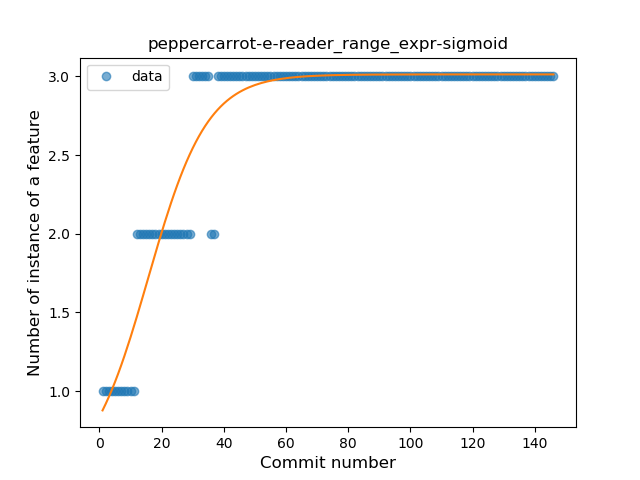

#### joaomneto-TitanCompanion
* Feature: Function with Default Value
* Function: 
* R_Squared: 0.91253196
 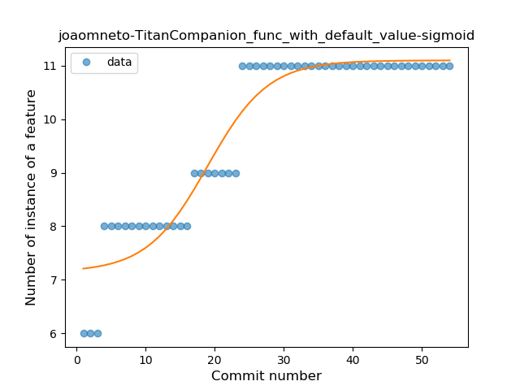

#### qklabs-qksms
* Feature: Destructuring Declaration
* Function: 
* R_Squared: 0.91225976
 

#### commons-app-apps-android-commons
* Feature: Range Expression
* Function: 
* R_Squared: 0.91151426
 

#### osmandapp-Osmand
* Feature: Companion Object
* Function: 
* R_Squared: 0.91041425
 

#### corenting-EDCompanion
* Feature: Lambda
* Function: 
* R_Squared: 0.91019858
 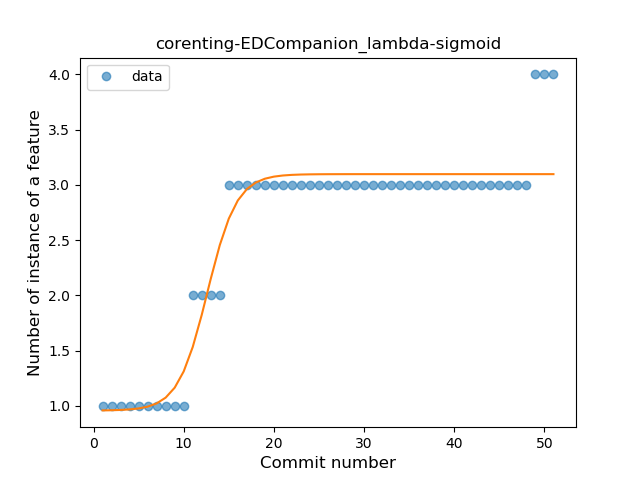

#### blokadaorg-blokada
* Feature: Companion Object
* Function: 
* R_Squared: 0.90964676
 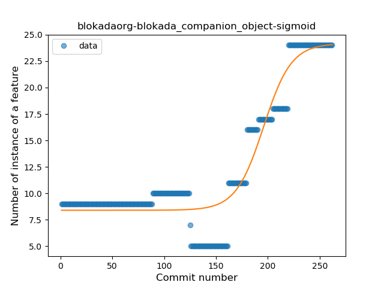

#### mbarta-scr-redesign
* Feature: Companion Object
* Function: 
* R_Squared: 0.90769524
 

#### tasomaniac-OpenLinkWith
* Feature: Singleton
* Function: 
* R_Squared: 0.90753272
 

#### ronocod-bus
* Feature: Safe Call
* Function: 
* R_Squared: 0.90748217
 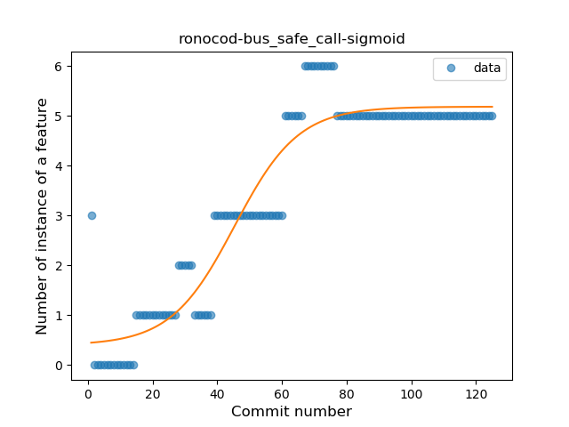

#### aminecmi-ReaderforSelfoss
* Feature: Function with Default Value
* Function: 
* R_Squared: 0.90706391
 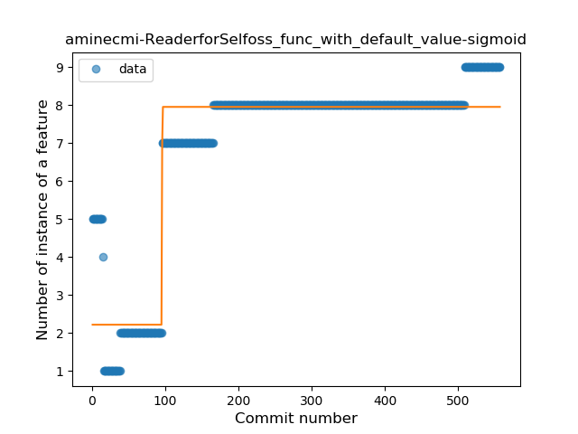

#### ccomeaux-boardgamegeek4android
* Feature: Singleton
* Function: 
* R_Squared: 0.90671925
 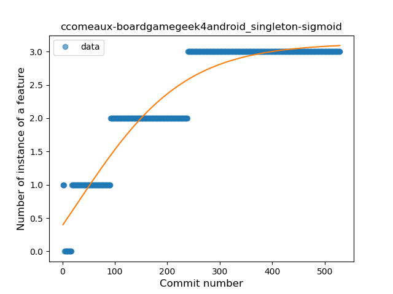

#### nicorsm-S3-16-simone
* Feature: Singleton
* Function: 
* R_Squared: 0.90670086
 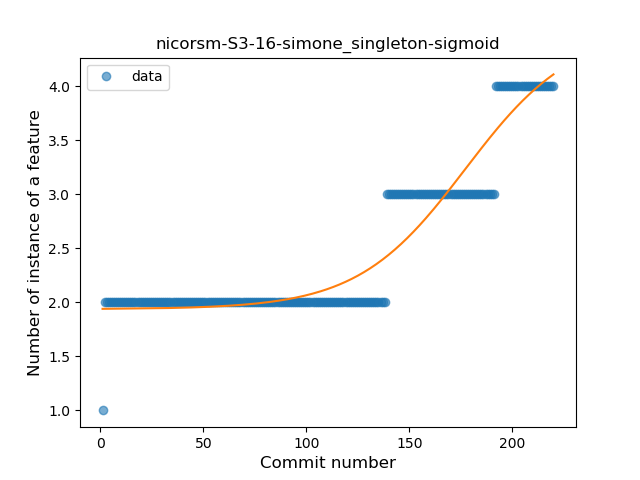

#### Mystery00-JanYoShare
* Feature: Singleton
* Function: 
* R_Squared: 0.90613039
 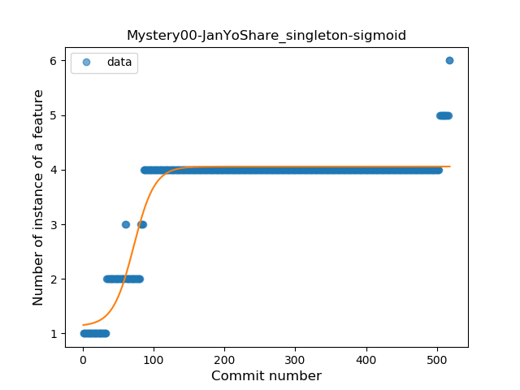

#### SimpleMobileTools-Simple-Clock
* Feature: Function call with Named Argument
* Function: 
* R_Squared: 0.90602633
 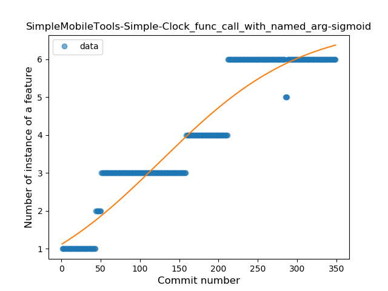

#### freedombox-team-android-app
* Feature: Function call with Named Argument
* Function: 
* R_Squared: 0.90575113
 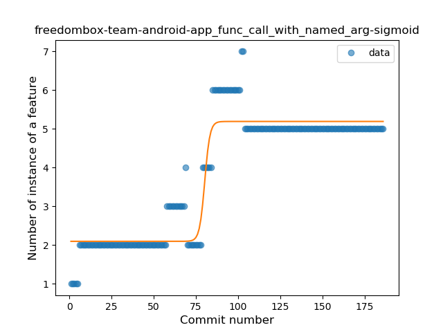

#### MartinStyk-AndroidApkAnalyzer
* Feature: String Template
* Function: 
* R_Squared: 0.90520699
 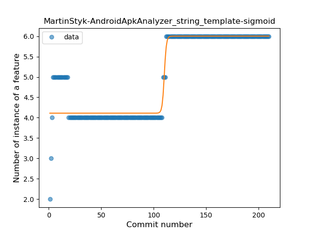

#### Apolline-Lille-apolline-android
* Feature: Unsafe Call
* Function: 
* R_Squared: 0.90426012
 

#### pacien-tincapp
* Feature: When expression
* Function: 
* R_Squared: 0.90327532
 

#### SimpleMobileTools-Simple-Music-Player
* Feature: Safe Call
* Function: 
* R_Squared: 0.90305143
 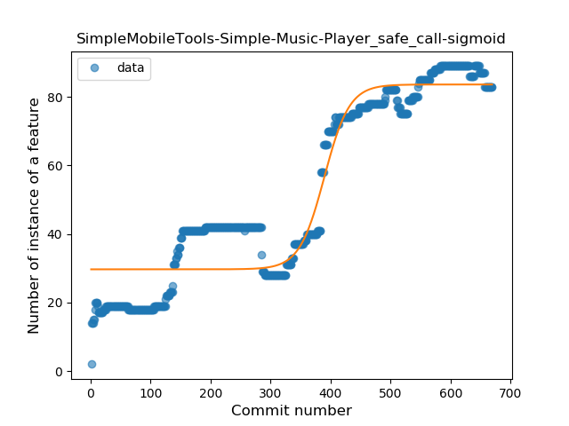

#### eurofurence-ef-app_android
* Feature: Function call with Named Argument
* Function: 
* R_Squared: 0.90263144
 

#### exviva-stew
* Feature: Companion Object
* Function: 
* R_Squared: 0.90237405
 

#### syncthing-syncthing-lite
* Feature: Safe Call
* Function: 
* R_Squared: 0.90201069
 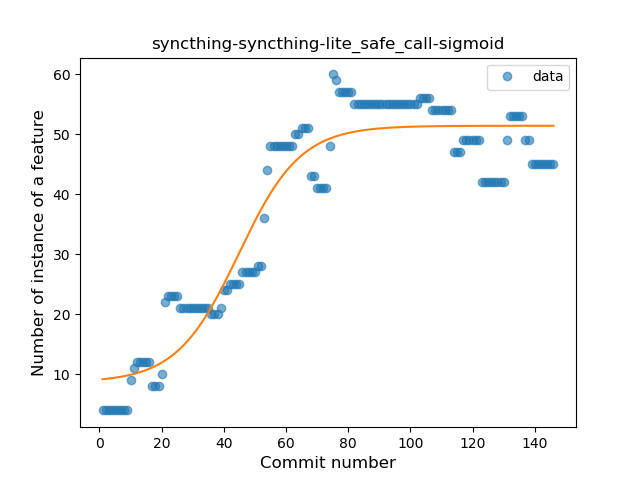

#### NyaaPantsu-NyaaPantsu-android-app
* Feature: Range Expression
* Function: 
* R_Squared: 0.90165857
 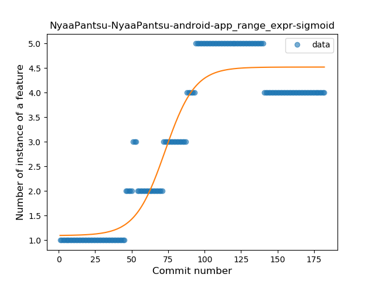

#### peppercarrot-e-reader
* Feature: When expression
* Function: 
* R_Squared: 0.90133949
 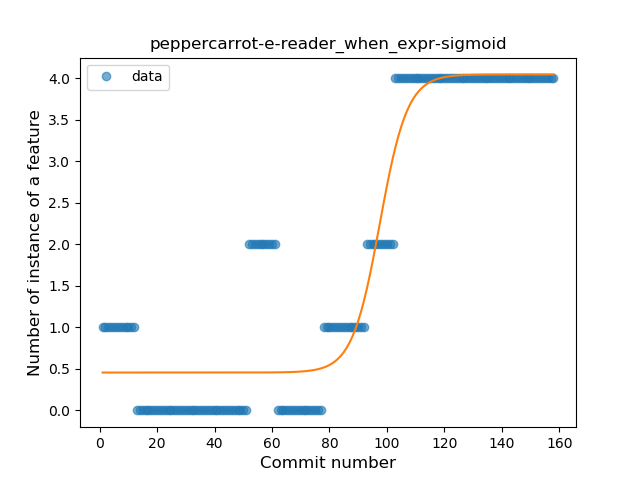

#### milosmns-Timecrypt
* Feature: Companion Object
* Function: 
* R_Squared: 0.90072083
 

#### Gark-bassblog_kotlin
* Feature: Function with Default Value
* Function: 
* R_Squared: 0.90047822
 

#### walleth-walleth
* Feature: Unsafe Call
* Function: 
* R_Squared: 0.90022076
 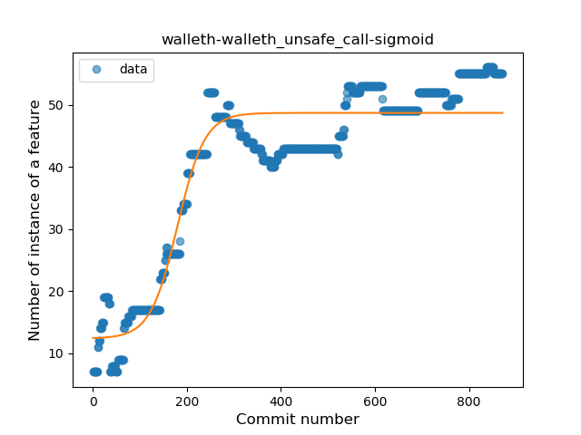

#### openium-auvergne-webcams-droid
* Feature: Function call with Named Argument
* Function: 
* R_Squared: 0.89986437
 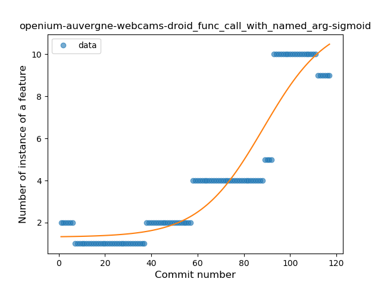

#### alessio-b-zak-myRivers
* Feature: Companion Object
* Function: 
* R_Squared: 0.89973746
 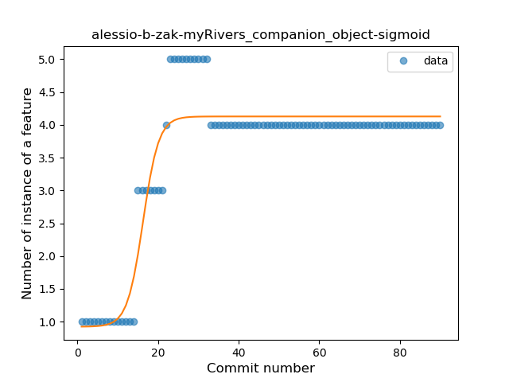

#### citiususc-calendula
* Feature: Property Delegation
* Function: 
* R_Squared: 0.89905795
 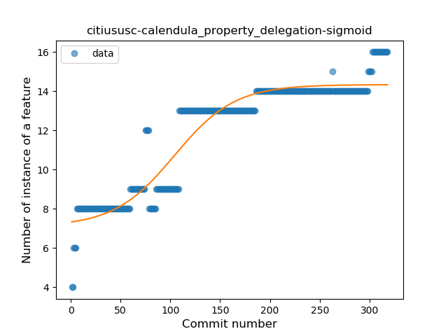

#### commons-app-apps-android-commons
* Feature: String Template
* Function: 
* R_Squared: 0.89783704
 

#### chrsep-Kingfish
* Feature: String Template
* Function: 
* R_Squared: 0.89766592
 

#### peterLaurence-TrekAdvisor
* Feature: Destructuring Declaration
* Function: 
* R_Squared: 0.89748541
 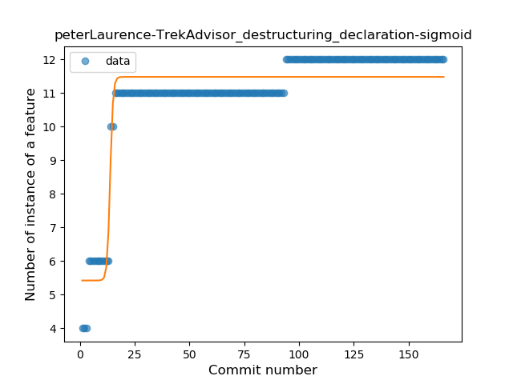

#### BijoySingh-Material-Notes-Android-App
* Feature: String Template
* Function: 
* R_Squared: 0.89706298
 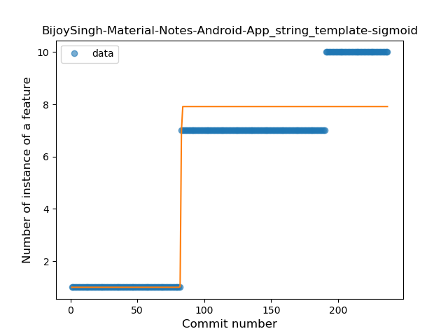

#### zoenb-log28
* Feature: Function with Default Value
* Function: 
* R_Squared: 0.89632241
 

#### PaulWoitaschek-Voice
* Feature: Smart Cast
* Function: 
* R_Squared: 0.8956549
 

#### premnirmal-StockTicker
* Feature: Singleton
* Function: 
* R_Squared: 0.89498175
 

#### LawnchairLauncher-Lawnchair
* Feature: Inline Function
* Function: 
* R_Squared: 0.89492884
 

#### Valodim-Stratum0Widget
* Feature: Safe Call
* Function: 
* R_Squared: 0.89492329
 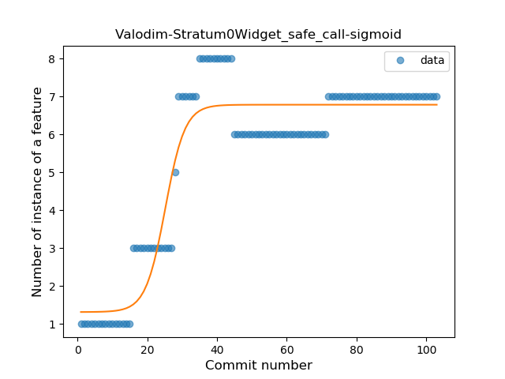

#### DSteve595-Put.io
* Feature: Destructuring Declaration
* Function: 
* R_Squared: 0.89448854
 

#### ianmcxa-vortaro
* Feature: Lambda
* Function: 
* R_Squared: 0.89397015
 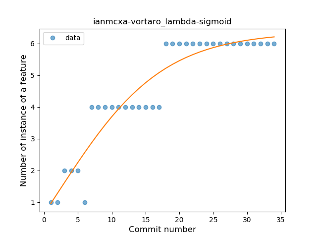

#### Mygod-VPNHotspot
* Feature: Smart Cast
* Function: 
* R_Squared: 0.89167157
 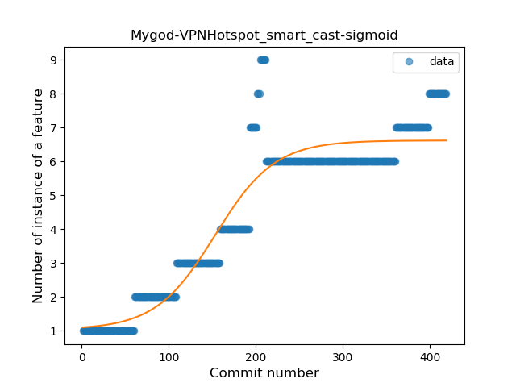

#### kirimin-mitsumine
* Feature: String Template
* Function: 
* R_Squared: 0.89111772
 

#### mjdenham-and-bible
* Feature: Property Delegation
* Function: 
* R_Squared: 0.89108586
 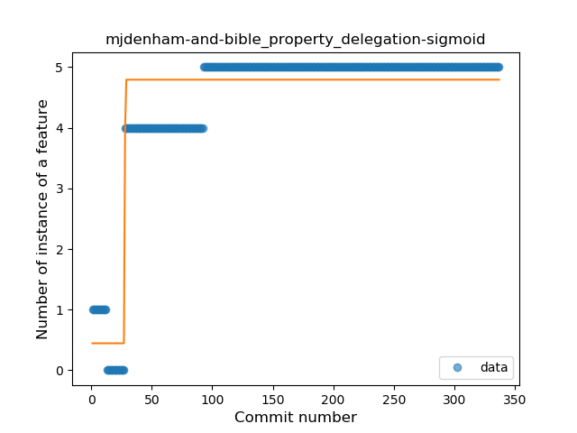

#### kirimin-mitsumine
* Feature: Function with Default Value
* Function: 
* R_Squared: 0.89007893
 

#### Apolline-Lille-apolline-android
* Feature: Singleton
* Function: 
* R_Squared: 0.88857693
 

#### calintat-units
* Feature: Lambda
* Function: 
* R_Squared: 0.88838036
 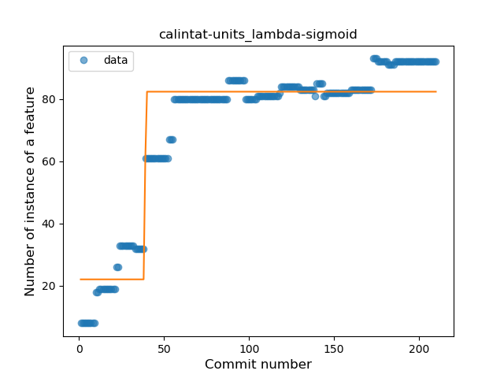

#### peppercarrot-e-reader
* Feature: Lambda
* Function: 
* R_Squared: 0.88813554
 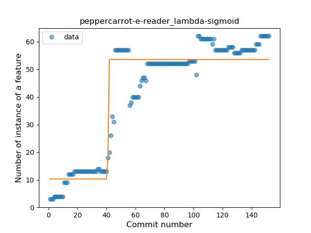

#### teamblueridge-PasteIt
* Feature: String Template
* Function: 
* R_Squared: 0.88753258
 

#### syrop-Wiktor-Navigator
* Feature: Function with Default Value
* Function: 
* R_Squared: 0.88751809
 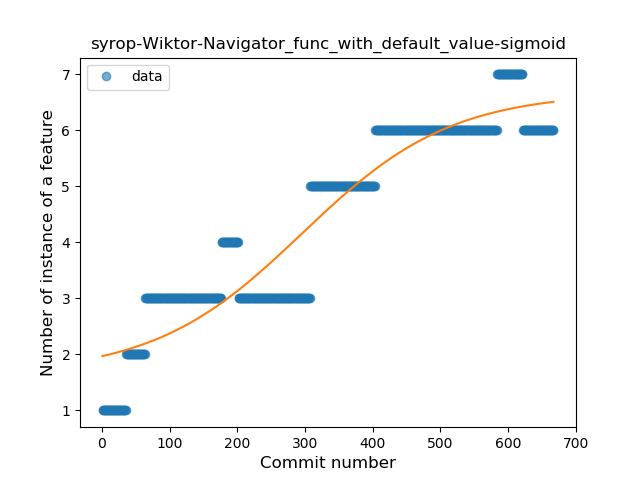

#### corenting-EDCompanion
* Feature: Companion Object
* Function: 
* R_Squared: 0.88577982
 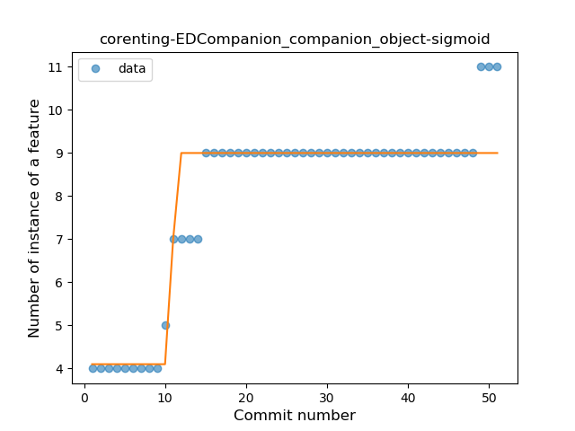

#### apiote-Bimba
* Feature: Range Expression
* Function: 
* R_Squared: 0.88487693
 

#### LawnchairLauncher-Lawnchair
* Feature: Data Class
* Function: 
* R_Squared: 0.88451968
 

#### peppercarrot-e-reader
* Feature: Smart Cast
* Function: 
* R_Squared: 0.88418392
 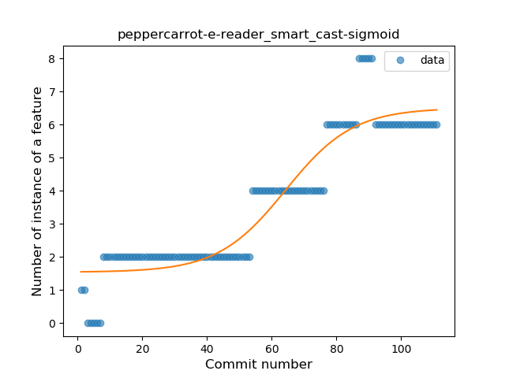

#### nibarius-opera-park-android
* Feature: Singleton
* Function: 
* R_Squared: 0.88410476
 

#### joan-domingo-Podcasts-RAC1-Android
* Feature: Data Class
* Function: 
* R_Squared: 0.88296842
 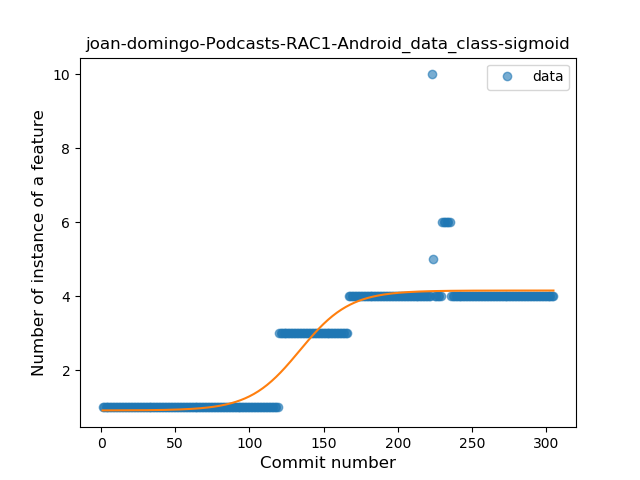

#### mjdenham-and-bible
* Feature: Range Expression
* Function: 
* R_Squared: 0.88169772
 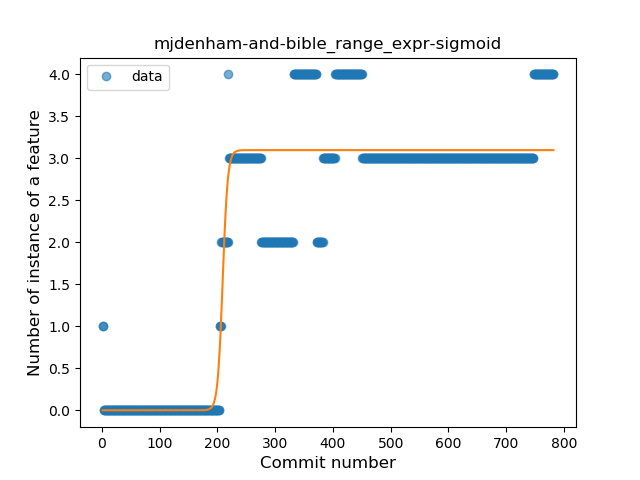

#### calintat-sensors
* Feature: Function call with Named Argument
* Function: 
* R_Squared: 0.88121717
 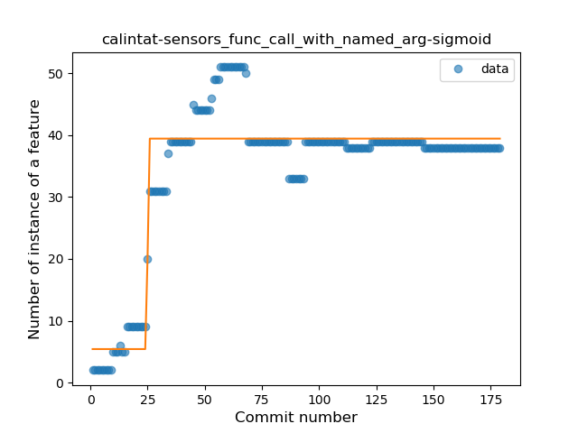

#### LiMium-mini-vector-android
* Feature: Extension Function
* Function: 
* R_Squared: 0.88091154
 

#### CypherpunkArmory-UserLAnd
* Feature: Extension Function
* Function: 
* R_Squared: 0.87970452
 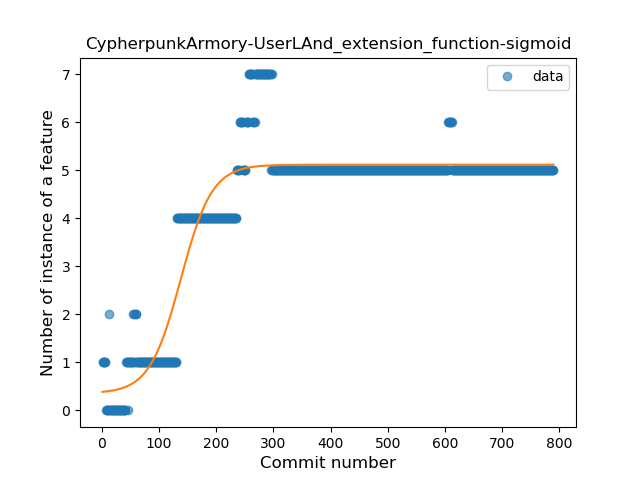

#### AllanWang-Frost-for-Facebook
* Feature: Super Delegation
* Function: 
* R_Squared: 0.87755065
 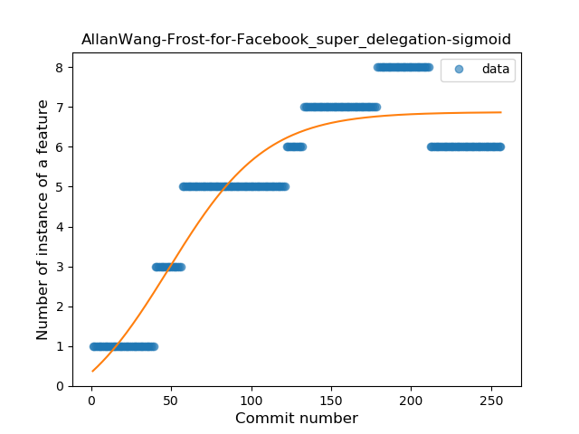

#### freedombox-team-android-app
* Feature: Companion Object
* Function: 
* R_Squared: 0.87629277
 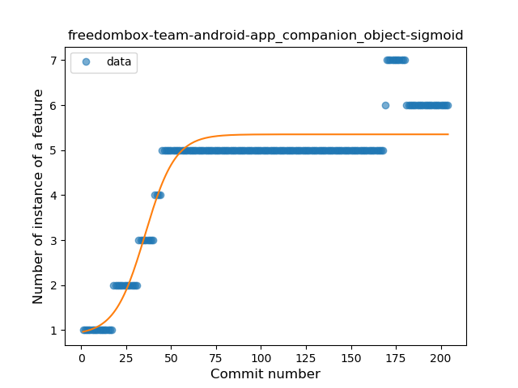

#### Gark-bassblog_kotlin
* Feature: When expression
* Function: 
* R_Squared: 0.87575995
 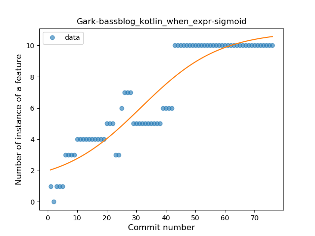

#### iskandergaba-Botanist
* Feature: Safe Call
* Function: 
* R_Squared: 0.87211116
 

#### wanbok-Monger-Android
* Feature: Lambda
* Function: 
* R_Squared: 0.87005537
 

#### pyamsoft-home-button
* Feature: Companion Object
* Function: 
* R_Squared: 0.86960066
 

#### kirimin-mitsumine
* Feature: Safe Call
* Function: 
* R_Squared: 0.86915607
 

#### spacecowboy-Feeder
* Feature: When expression
* Function: 
* R_Squared: 0.86767834
 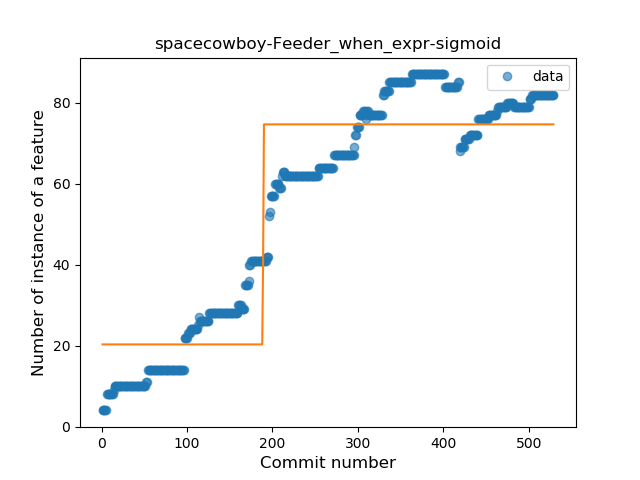

#### Maxr1998-MaxLock
* Feature: Property Delegation
* Function: 
* R_Squared: 0.86685894
 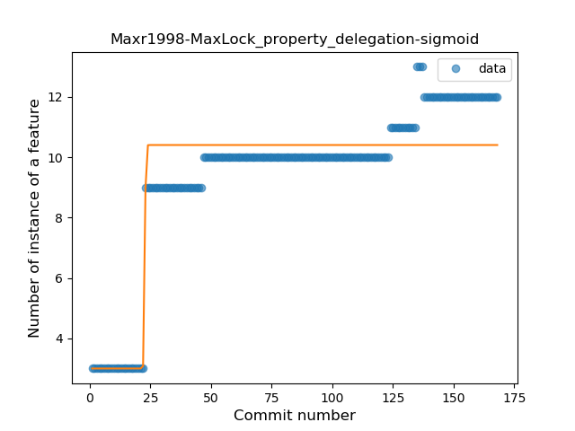

#### SpiritCroc-DarkCroc-Android-theme
* Feature: Lambda
* Function: 
* R_Squared: 0.86662341
 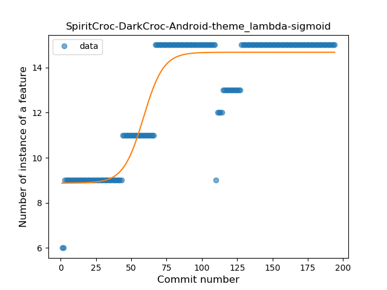

#### charlesmadere-smash-ranks-android
* Feature: Destructuring Declaration
* Function: 
* R_Squared: 0.86596425
 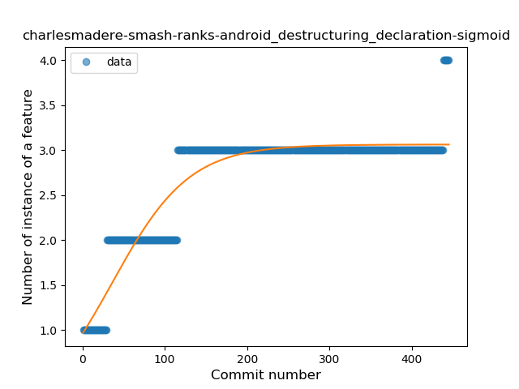

#### SimpleMobileTools-Simple-App-Launcher
* Feature: Unsafe Call
* Function: 
* R_Squared: 0.86371539
 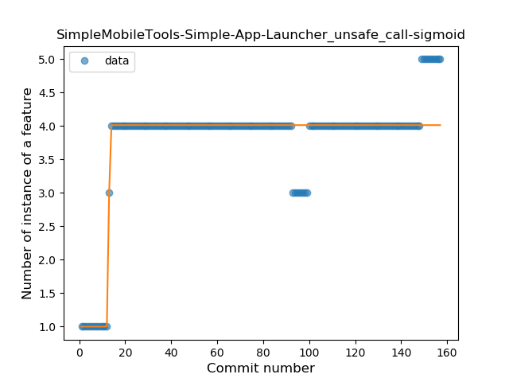

#### calintat-units
* Feature: Singleton
* Function: 
* R_Squared: 0.86363969
 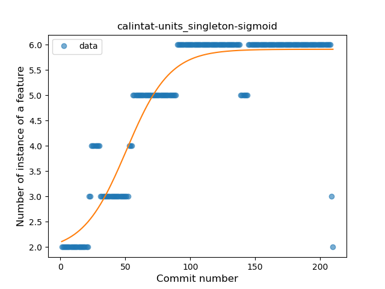

#### ohmae-VoiceMessageBoard
* Feature: Function with Default Value
* Function: 
* R_Squared: 0.86342944
 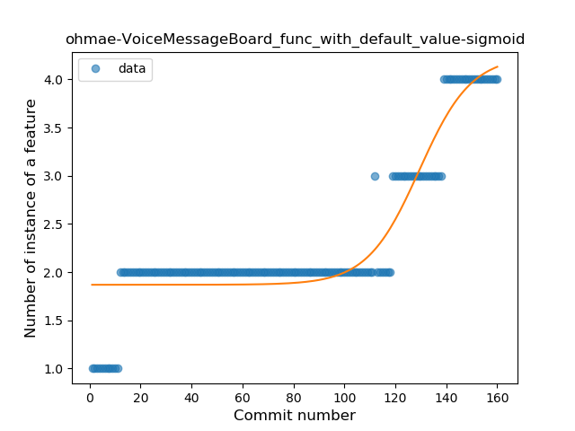

#### bubelov-coins-android
* Feature: Extension Function
* Function: 
* R_Squared: 0.86096591
 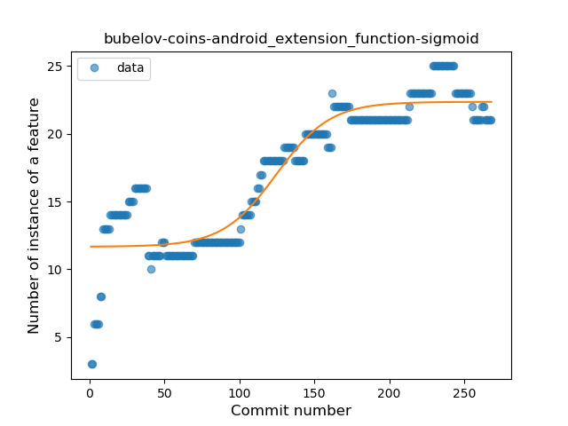

#### ofalvai-BPInfo
* Feature: String Template
* Function: 
* R_Squared: 0.86088351
 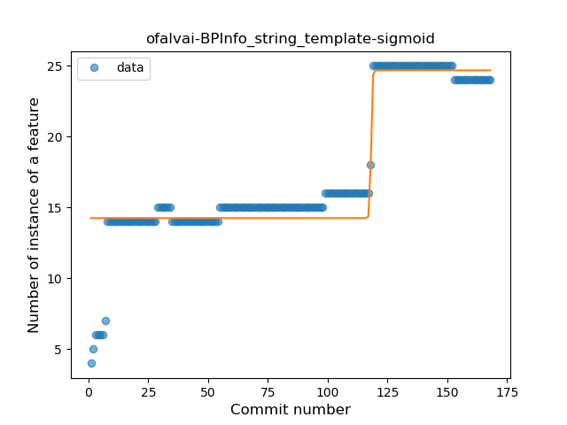

#### NyaaPantsu-NyaaPantsu-android-app
* Feature: Function call with Named Argument
* Function: 
* R_Squared: 0.85818038
 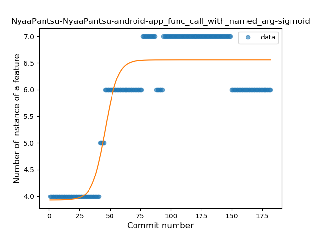

#### nathanj-ogsdroid
* Feature: Range Expression
* Function: 
* R_Squared: 0.85688276
 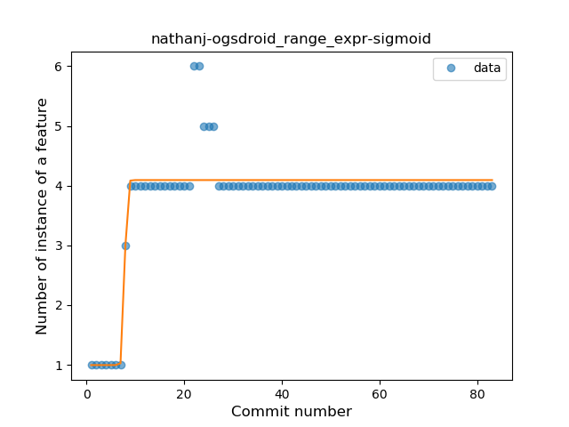

#### tuskyapp-Tusky
* Feature: Singleton
* Function: 
* R_Squared: 0.85673175
 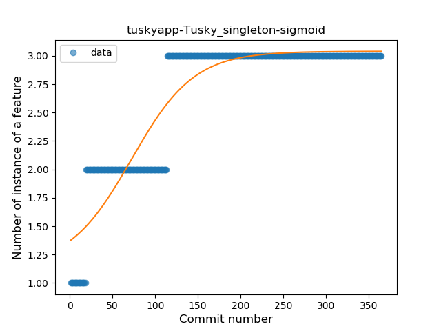

#### chrsep-Kingfish
* Feature: Data Class
* Function: 
* R_Squared: 0.8558947
 

#### LiMium-mini-vector-android
* Feature: Smart Cast
* Function: 
* R_Squared: 0.8546626
 

#### jereksel-Bucket
* Feature: When expression
* Function: 
* R_Squared: 0.85433656
 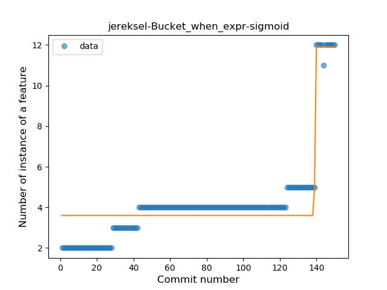

#### nao20010128nao-DroidComplex
* Feature: Type Inference
* Function: 
* R_Squared: 0.85091738
 

#### vector-im-riot-android
* Feature: Type Inference
* Function: 
* R_Squared: 0.85086584
 

#### CzBiX-v2ex-android
* Feature: Inline Function
* Function: 
* R_Squared: 0.84757122
 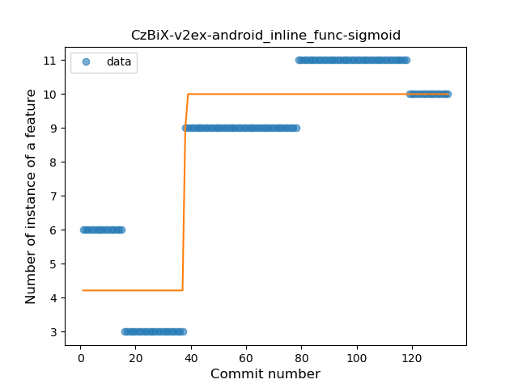

#### syncthing-syncthing-lite
* Feature: Range Expression
* Function: 
* R_Squared: 0.84684931
 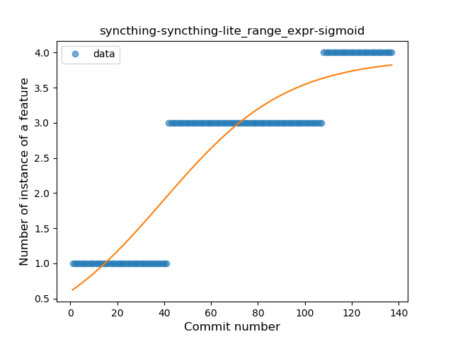

#### Doctoror-ParticleConstellationsLiveWallpaper
* Feature: String Template
* Function: 
* R_Squared: 0.84527731
 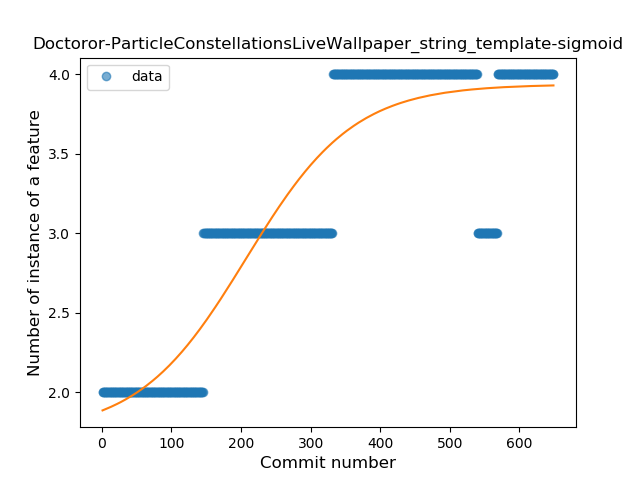

#### SimpleMobileTools-Simple-Music-Player
* Feature: Function call with Named Argument
* Function: 
* R_Squared: 0.84300597
 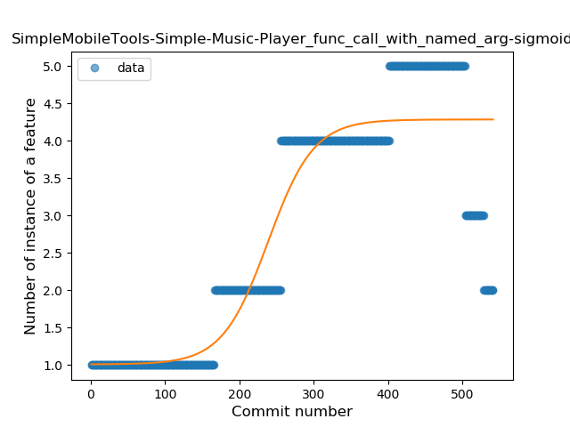

#### joan-domingo-Podcasts-RAC1-Android
* Feature: Smart Cast
* Function: 
* R_Squared: 0.84095574
 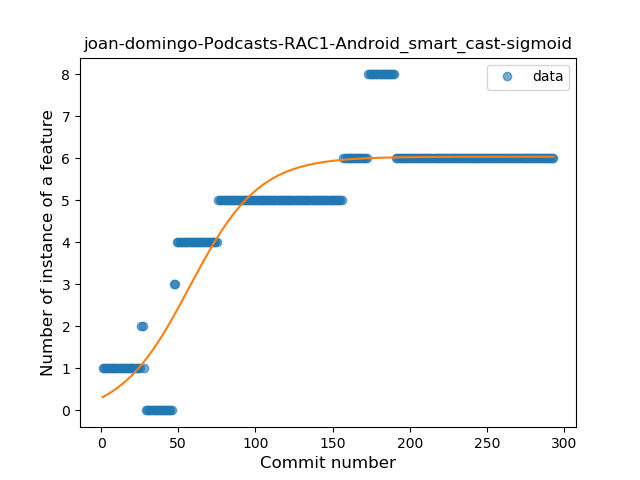

#### jereksel-Bucket
* Feature: Companion Object
* Function: 
* R_Squared: 0.83957058
 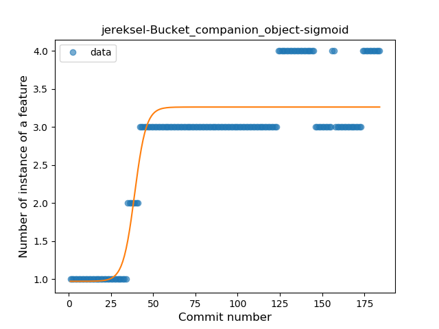

#### AllanWang-Frost-for-Facebook
* Feature: Singleton
* Function: 
* R_Squared: 0.83886169
 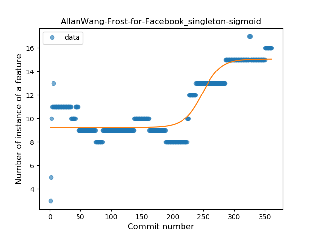

#### mozilla-mobile-focus-android
* Feature: Extension Function
* Function: 
* R_Squared: 0.83783333
 

#### hypeapps-episodie
* Feature: Singleton
* Function: 
* R_Squared: 0.83716097
 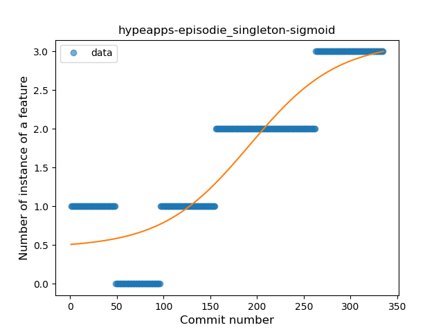

#### peppercarrot-e-reader
* Feature: Property Delegation
* Function: 
* R_Squared: 0.83572698
 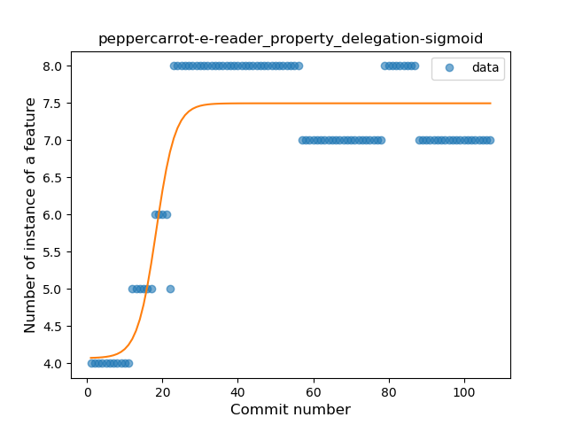

#### SimpleMobileTools-Simple-Contacts
* Feature: Companion Object
* Function: 
* R_Squared: 0.83286217
 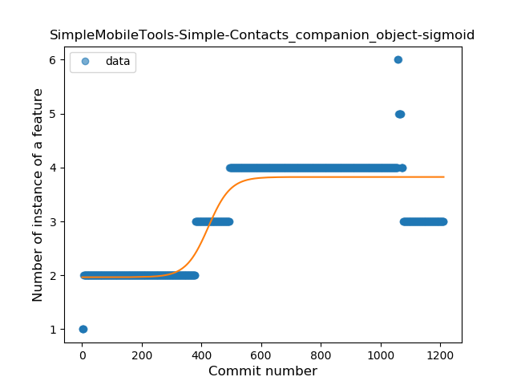

#### enjoyingfoss-om
* Feature: When expression
* Function: 
* R_Squared: 0.83040463
 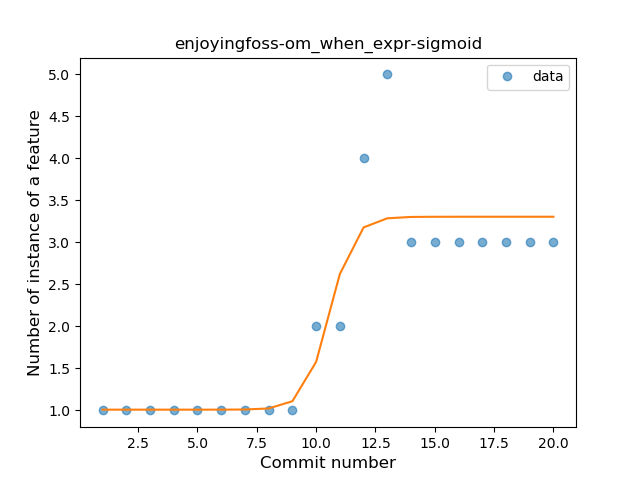

#### iSoron-uhabits
* Feature: Unsafe Call
* Function: 
* R_Squared: 0.83035178
 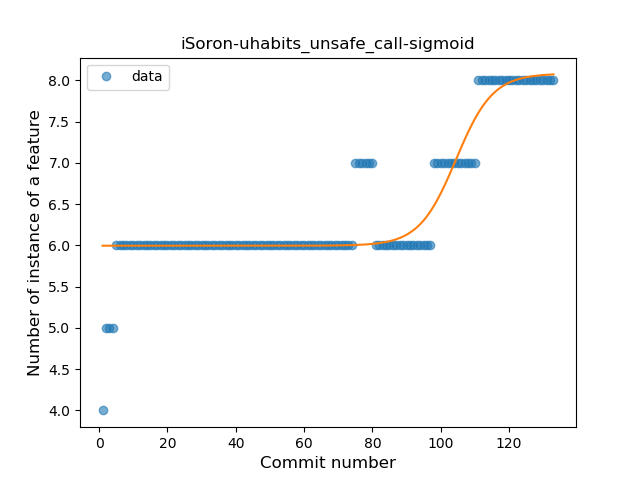

#### spacecowboy-Feeder
* Feature: Companion Object
* Function: 
* R_Squared: 0.82846472
 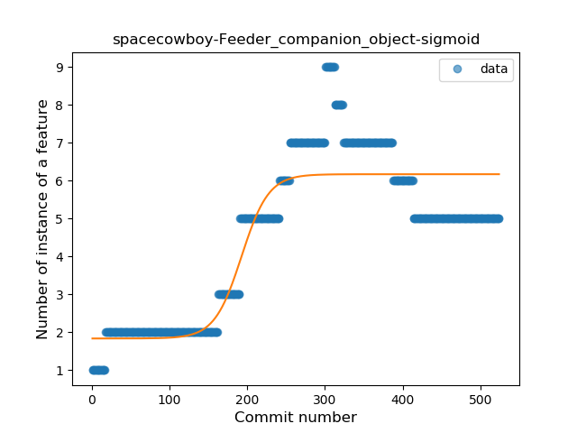

#### ScreamingHawk-phone-saver
* Feature: Companion Object
* Function: 
* R_Squared: 0.8280839
 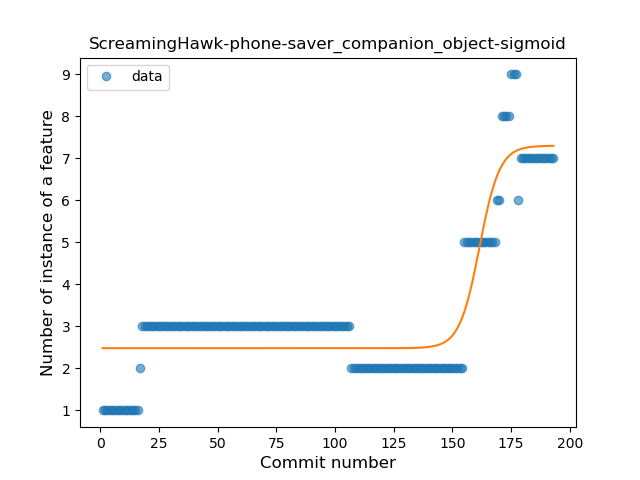

#### LawnchairLauncher-Lawnchair
* Feature: Smart Cast
* Function: 
* R_Squared: 0.81290074
 

#### SimpleMobileTools-Simple-Gallery
* Feature: Destructuring Declaration
* Function: 
* R_Squared: 0.7996114
 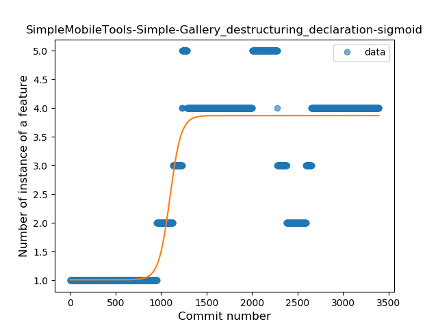

#### alessio-b-zak-myRivers
* Feature: Function with Default Value
* Function: 
* R_Squared: 0.79852873
 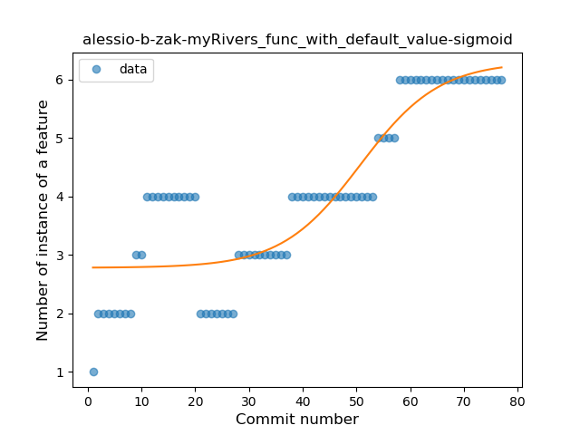

#### CypherpunkArmory-UserLAnd
* Feature: Property Delegation
* Function: 
* R_Squared: 0.79293783
 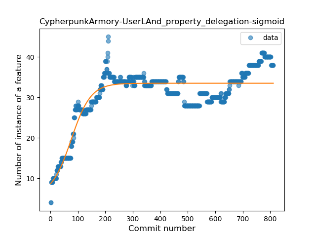

#### SimpleMobileTools-Simple-App-Launcher
* Feature: Safe Call
* Function: 
* R_Squared: 0.79165415
 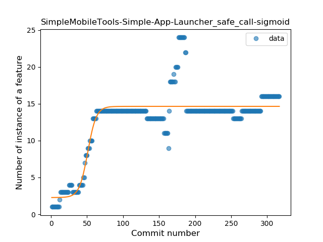

#### eurofurence-ef-app_android
* Feature: Companion Object
* Function: 
* R_Squared: 0.78989146
 

#### caarmen-poet-assistant
* Feature: Function call with Named Argument
* Function: 
* R_Squared: 0.78967717
 

#### SimpleMobileTools-Simple-Thank-You
* Feature: String Template
* Function: 
* R_Squared: 0.78709825
 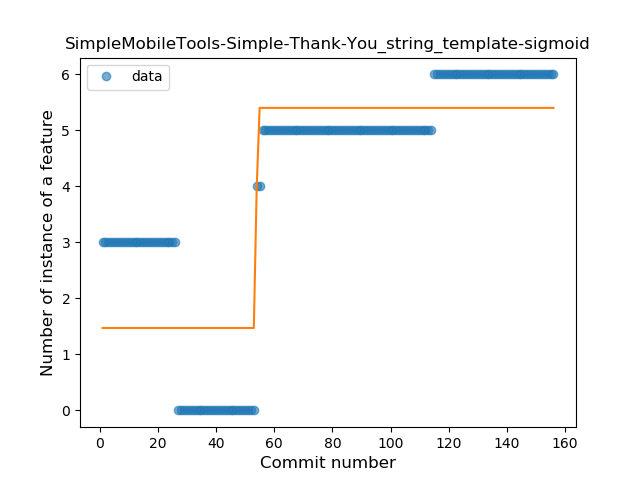

#### syrop-Wiktor-Navigator
* Feature: Inline Function
* Function: 
* R_Squared: 0.77783802
 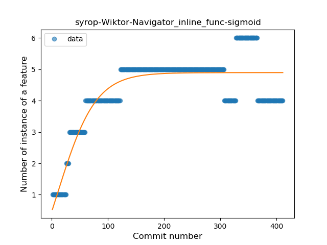

#### BijoySingh-Material-Notes-Android-App
* Feature: Property Delegation
* Function: 
* R_Squared: 0.77234106
 

#### Valodim-Stratum0Widget
* Feature: Singleton
* Function: 
* R_Squared: 0.77143928
 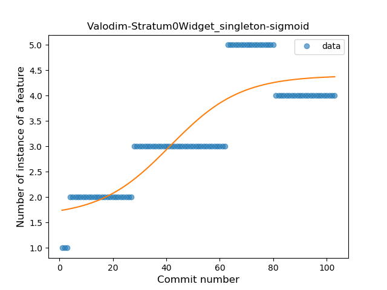

#### kamgurgul-cpu-info
* Feature: Companion Object
* Function: 
* R_Squared: 0.76967296
 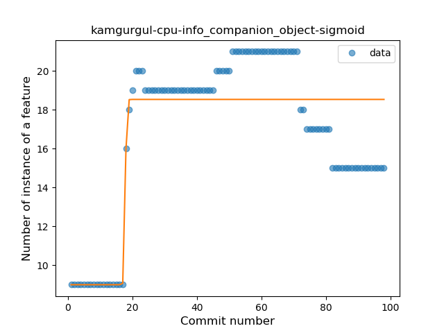

#### spacecowboy-Feeder
* Feature: Range Expression
* Function: 
* R_Squared: 0.76773122
 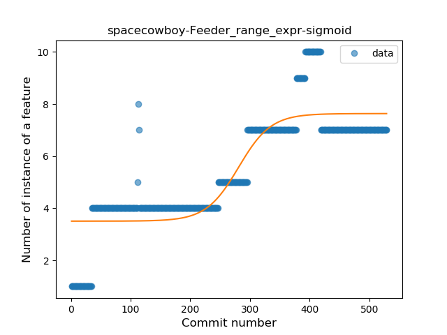

#### SimpleMobileTools-Simple-App-Launcher
* Feature: When expression
* Function: 
* R_Squared: 0.76722527
 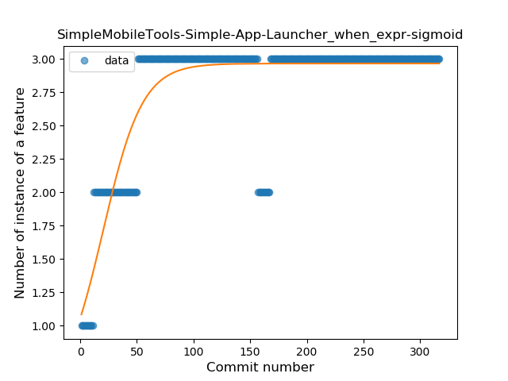

#### jeeb-mpv-android
* Feature: Unsafe Call
* Function: 
* R_Squared: 0.76245729
 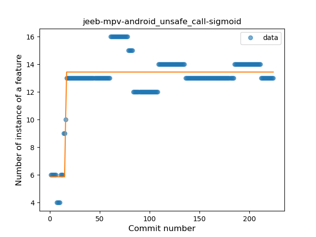

#### spacecowboy-Feeder
* Feature: Smart Cast
* Function: 
* R_Squared: 0.76127364
 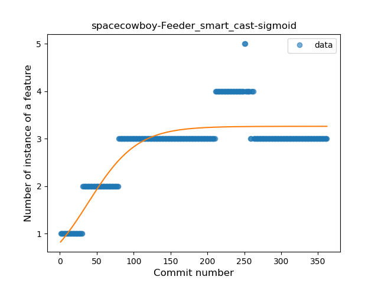

#### NyaaPantsu-NyaaPantsu-android-app
* Feature: Destructuring Declaration
* Function: 
* R_Squared: 0.76031075
 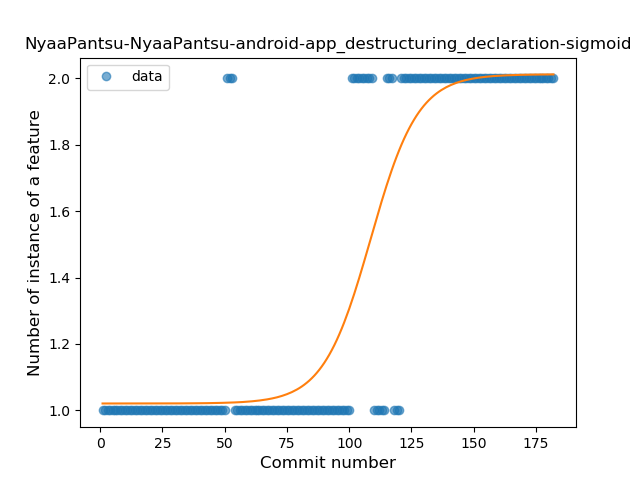

#### zoenb-log28
* Feature: When expression
* Function: 
* R_Squared: 0.75957631
 

#### LittleLightCz-SheepsGoHome
* Feature: Companion Object
* Function: 
* R_Squared: 0.75864688
 

#### Doctoror-ParticleConstellationsLiveWallpaper
* Feature: Inline Function
* Function: 
* R_Squared: 0.75508056
 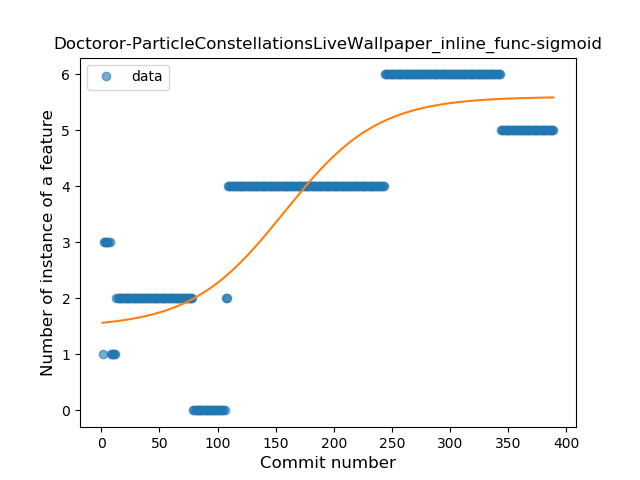

#### AkshayChordiya-gofun-android
* Feature: Safe Call
* Function: 
* R_Squared: 0.75463161
 

#### openium-auvergne-webcams-droid
* Feature: Function with Default Value
* Function: 
* R_Squared: 0.75317831
 

#### equeim-tremotesf-android
* Feature: Function with Default Value
* Function: 
* R_Squared: 0.75000363
 

#### bitfireAT-davdroid
* Feature: Function call with Named Argument
* Function: 
* R_Squared: 0.74538844
 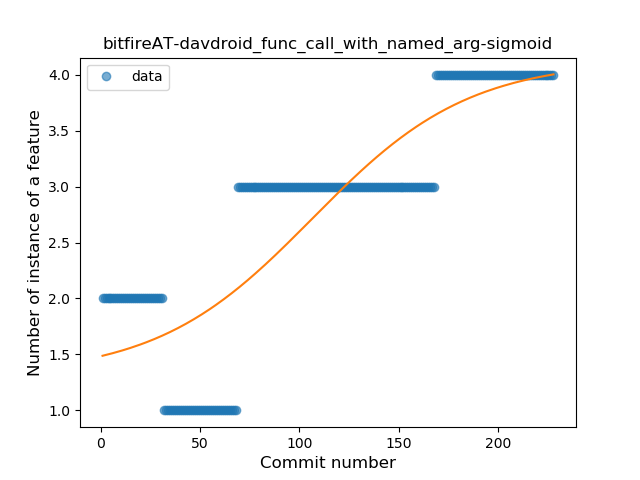

#### MartinStyk-AndroidApkAnalyzer
* Feature: Destructuring Declaration
* Function: 
* R_Squared: 0.74378572
 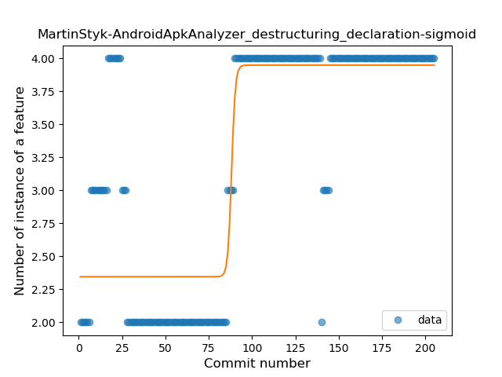

#### ligi-SurvivalManual
* Feature: When expression
* Function: 
* R_Squared: 0.7434655
 

#### jeeb-mpv-android
* Feature: Destructuring Declaration
* Function: 
* R_Squared: 0.73830747
 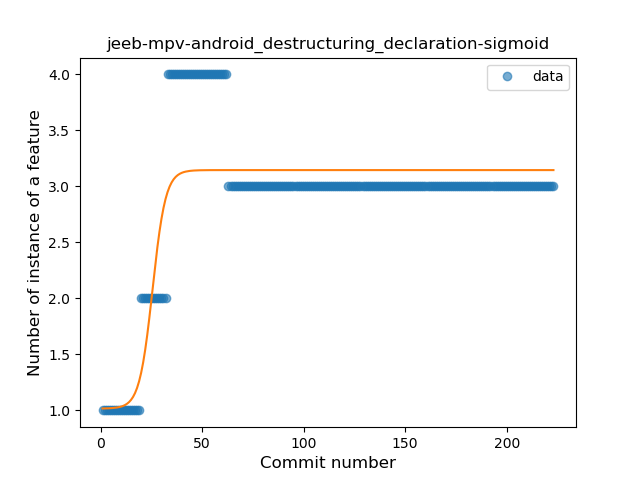

#### spacecowboy-Feeder
* Feature: Property Delegation
* Function: 
* R_Squared: 0.73199913
 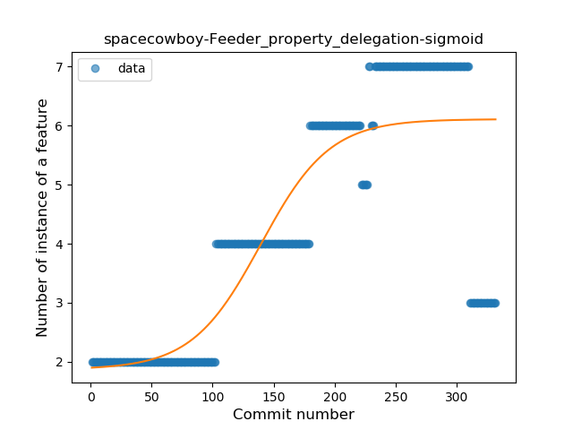

#### AIDEA775-UNCmorfi
* Feature: Range Expression
* Function: 
* R_Squared: 0.71194832
 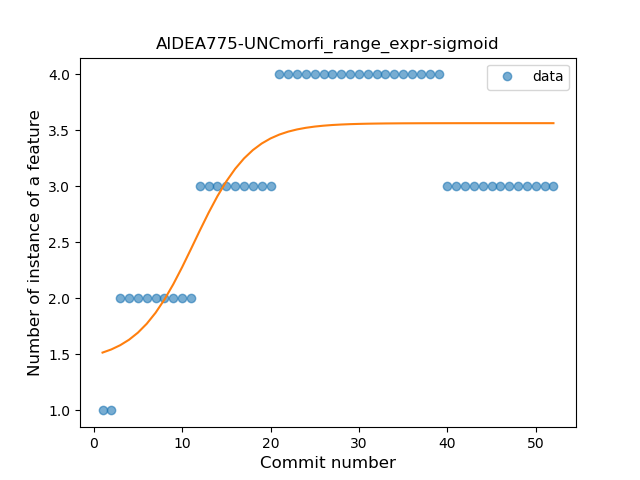

#### iskandergaba-Botanist
* Feature: Unsafe Call
* Function: 
* R_Squared: 0.70779076
 

#### AIDEA775-UNCmorfi
* Feature: Unsafe Call
* Function: 
* R_Squared: 0.69943362
 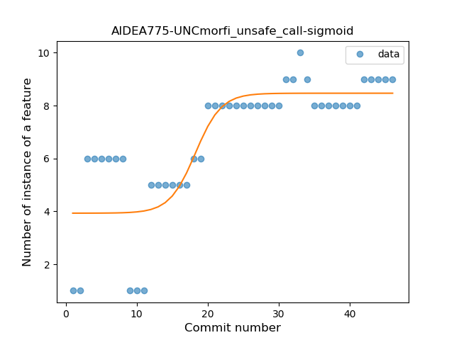

#### ohmae-DmsExplorer
* Feature: Companion Object
* Function: 
* R_Squared: 0.68018598
 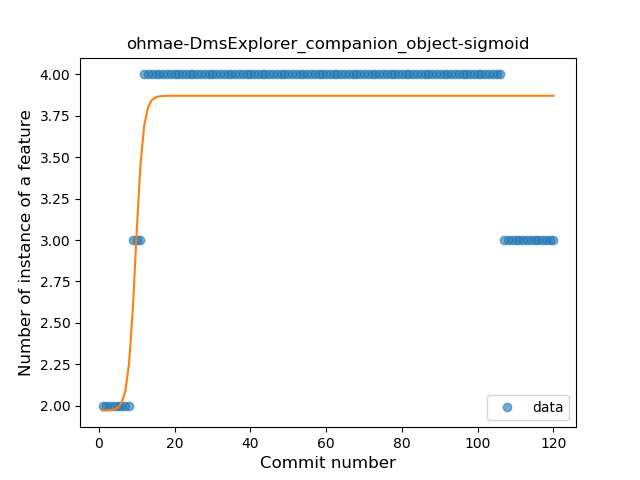

#### veniosg-JustSearch
* Feature: Type Inference
* Function: 
* R_Squared: 0.66318307
 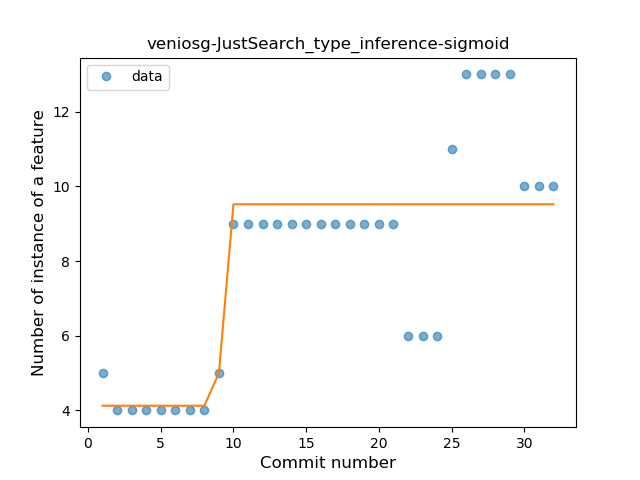

#### SimpleMobileTools-Simple-Camera
* Feature: When expression
* Function: 
* R_Squared: 0.65182372
 

#### peppercarrot-e-reader
* Feature: String Template
* Function: 
* R_Squared: 0.64470605
 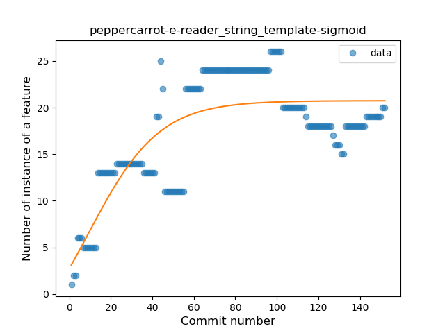

#### carlphilipp-chicago-commutes
* Feature: Destructuring Declaration
* Function: 
* R_Squared: 0.64467429
 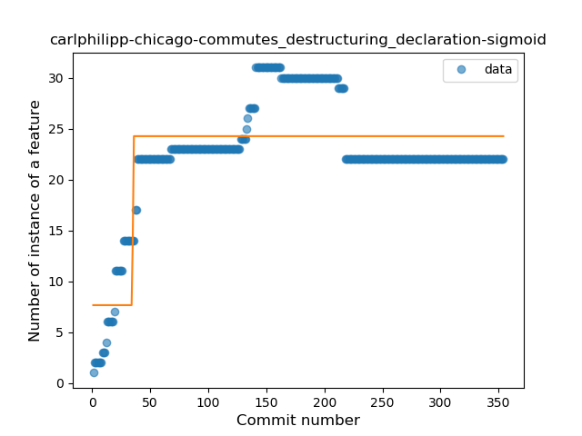

#### teamblueridge-PasteIt
* Feature: When expression
* Function: 
* R_Squared: 0.64213911
 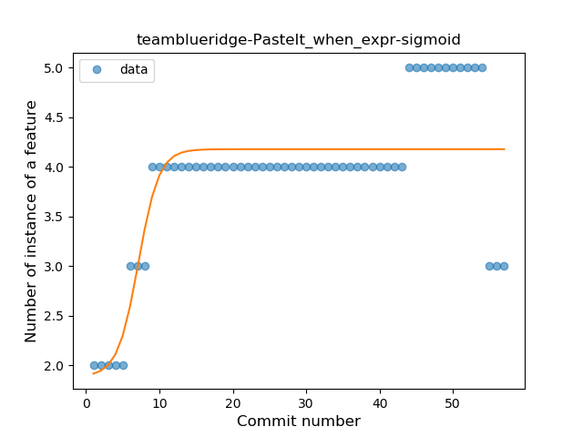

#### SimpleMobileTools-Simple-Clock
* Feature: Data Class
* Function: 
* R_Squared: 0.6253035
 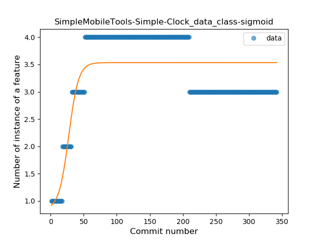

#### bubelov-coins-android
* Feature: String Template
* Function: 
* R_Squared: 0.62068661
 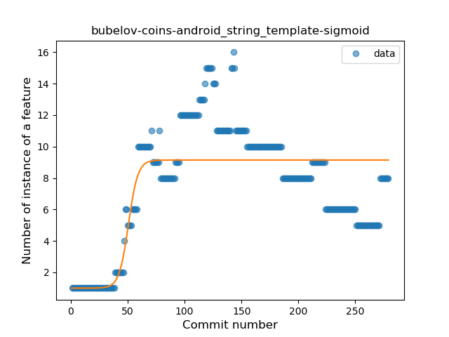

#### MGaetan89-ShowsRage
* Feature: Singleton
* Function: 
* R_Squared: 0.61395832
 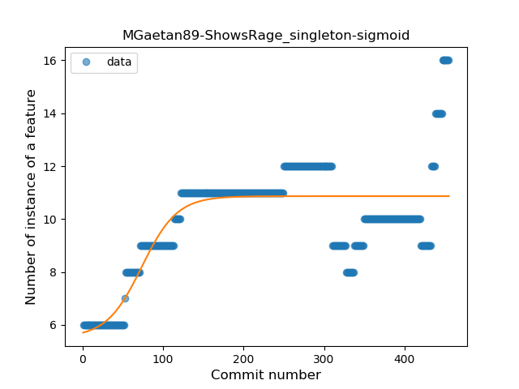

#### spacecowboy-Feeder
* Feature: Unsafe Call
* Function: 
* R_Squared: 0.59229813
 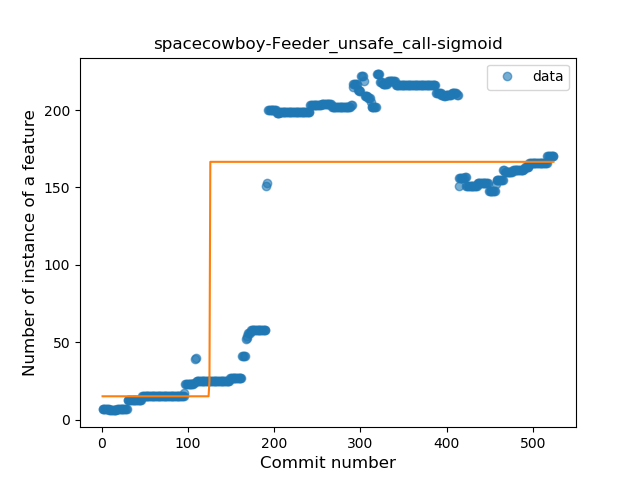

#### chrsep-Kingfish
* Feature: Smart Cast
* Function: 
* R_Squared: 0.5742521
 

#### nibarius-opera-park-android
* Feature: Destructuring Declaration
* Function: 
* R_Squared: 0.56271379
 

#### Mystery00-JanYoShare
* Feature: Range Expression
* Function: 
* R_Squared: 0.53694188
 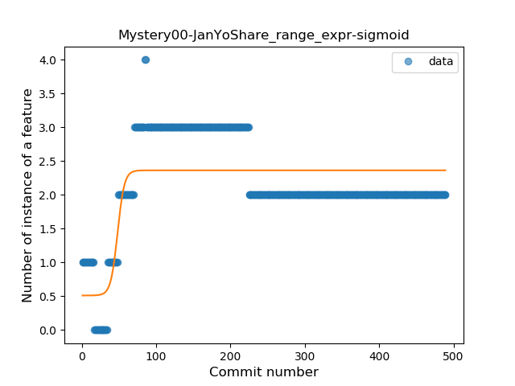

#### kamgurgul-cpu-info
* Feature: Singleton
* Function: 
* R_Squared: 0.53501235
 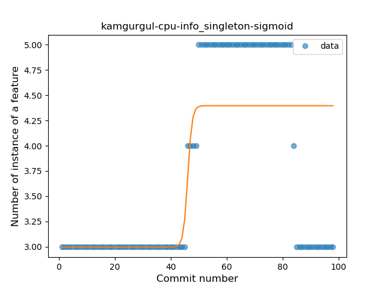

#### calintat-sensors
* Feature: Extension Function
* Function: 
* R_Squared: 0.52416783
 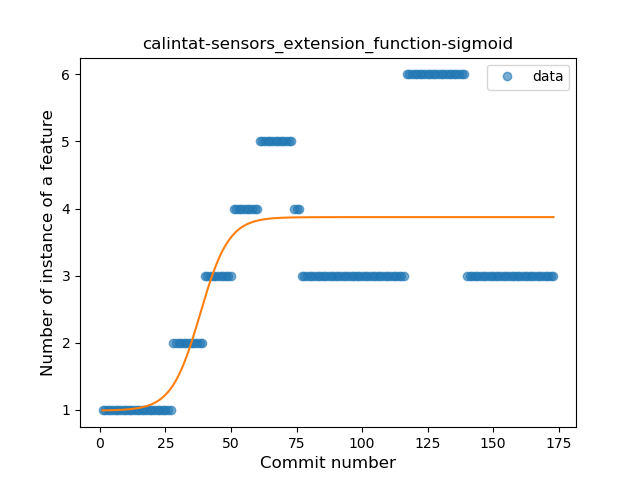

#### quarck-CalendarNotification
* Feature: Smart Cast
* Function: 
* R_Squared: 0.50651624
 

#### ligi-PassAndroid
* Feature: Singleton
* Function: 
* R_Squared: 0.5028458
 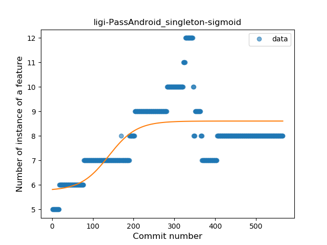

#### WYKCode-WYK-Android
* Feature: String Template
* Function: 
* R_Squared: 0.4875817
 

#### thermatk-FastHub-Libre
* Feature: Function call with Named Argument
* Function: 
* R_Squared: 0.4718866
 

#### fossasia-open-event-android
* Feature: Singleton
* Function: 
* R_Squared: 0.4443667
 

#### emansih-FireflyMobile
* Feature: Function call with Named Argument
* Function: 
* R_Squared: 0.43857227
 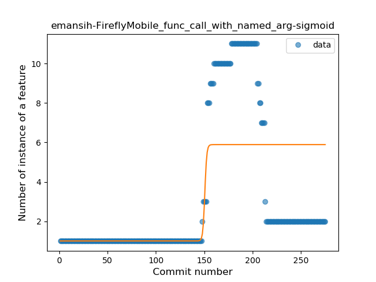

#### Commit451-LabCoat
* Feature: String Template
* Function: 
* R_Squared: 0.43412277
 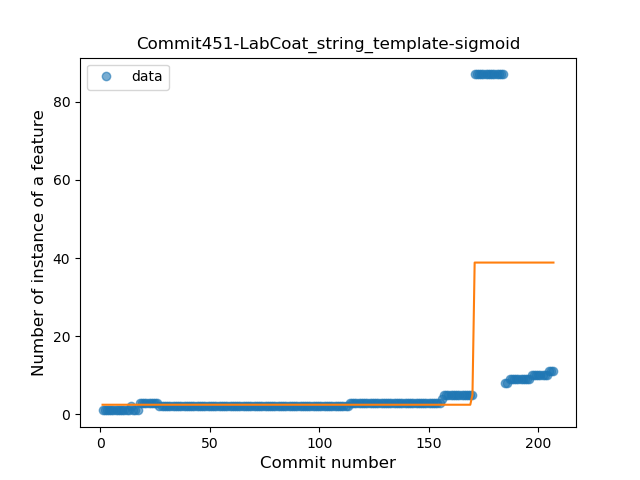

#### ligi-IPFSDroid
* Feature: Unsafe Call
* Function: 
* R_Squared: 0.42271562
 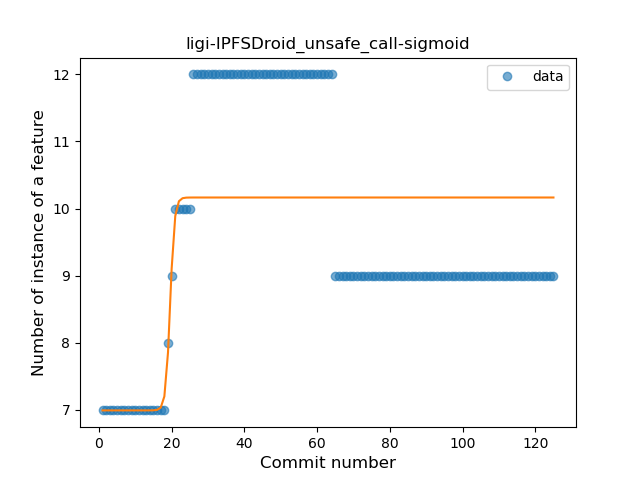

#### ligi-SurvivalManual
* Feature: Singleton
* Function: 
* R_Squared: 0.41946696
 

#### bubelov-coins-android
* Feature: Smart Cast
* Function: 
* R_Squared: 0.41893293
 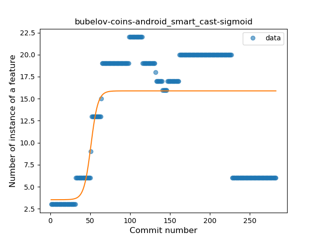

#### ykrank-S1-Next
* Feature: Function with Default Value
* Function: 
* R_Squared: 0.38613717
 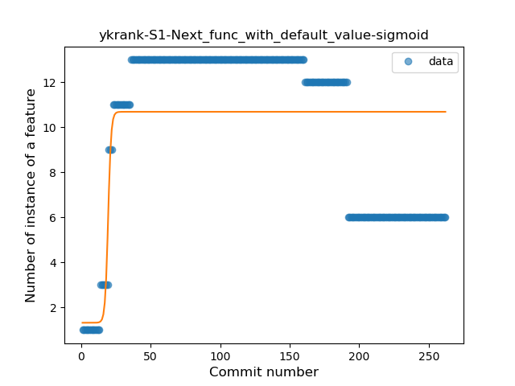

#### ligi-MaterialTeaTimer
* Feature: Singleton
* Function: 
* R_Squared: 0.35295114
 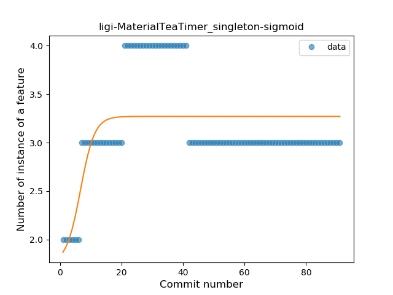

#### SimpleMobileTools-Simple-Camera
* Feature: Extension Function
* Function: 
* R_Squared: 0.3504317
 

#### SimpleMobileTools-Simple-App-Launcher
* Feature: Companion Object
* Function: 
* R_Squared: 0.34848953
 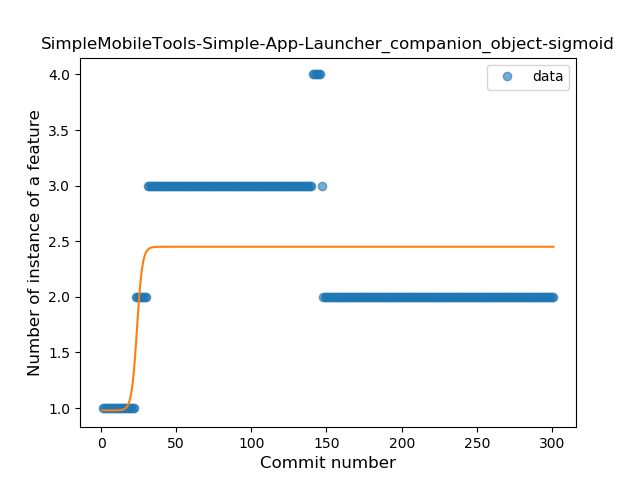

#### ScreamingHawk-phone-saver
* Feature: Unsafe Call
* Function: 
* R_Squared: 0.32952001
 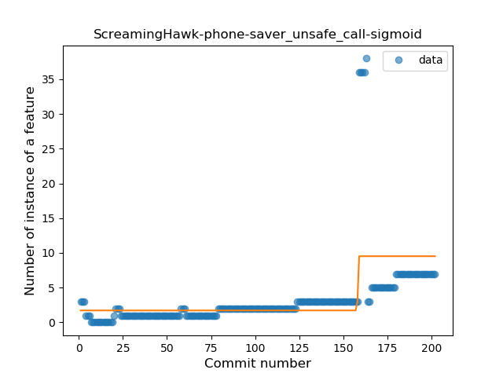

#### MGaetan89-ShowsRage
* Feature: Property Delegation
* Function: 
* R_Squared: 0.28747851
 

#### exviva-stew
* Feature: Function with Default Value
* Function: 
* R_Squared: 0.24601164
 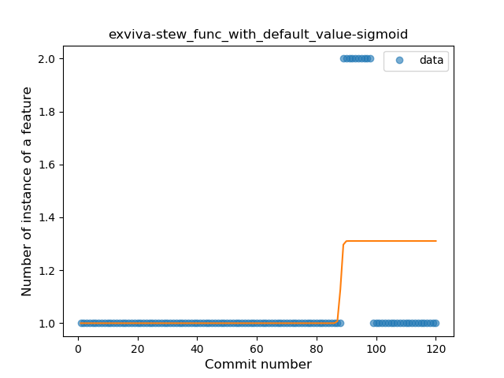

#### nonylene-PhotoLinkViewer
* Feature: Range Expression
* Function: 
* R_Squared: 0.23655903
 

#### calintat-sensors
* Feature: Companion Object
* Function: 
* R_Squared: 0.21748647
 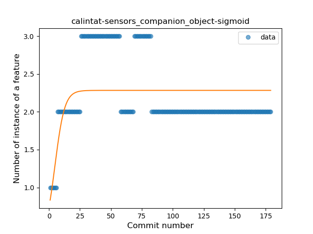

#### iPoli-iPoli-android
* Feature: Super Delegation
* Function: 
* R_Squared: 0.21439415
 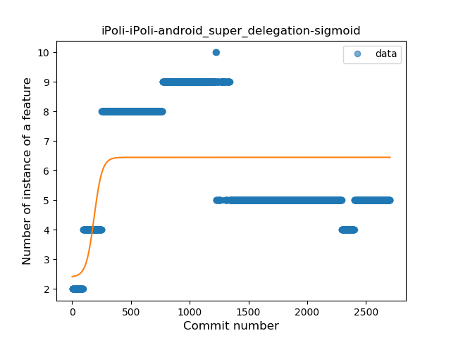

#### SimpleMobileTools-Simple-Music-Player
* Feature: Range Expression
* Function: 
* R_Squared: 0.19979066
 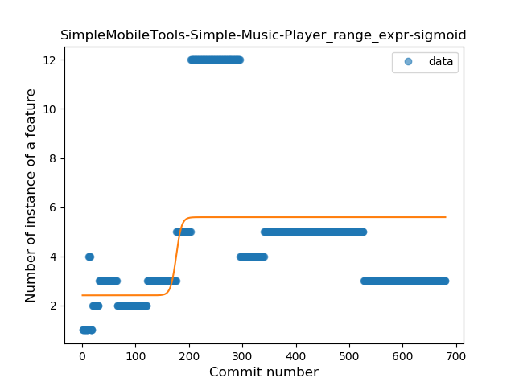

#### moko256-twitlatte
* Feature: Companion Object
* Function: 
* R_Squared: 0.10807099
 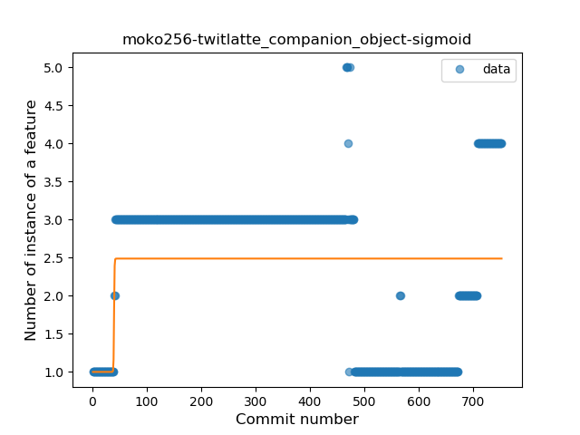

#### SimpleMobileTools-Simple-Clock
* Feature: Smart Cast
* Function: 
* R_Squared: 0.0709319
 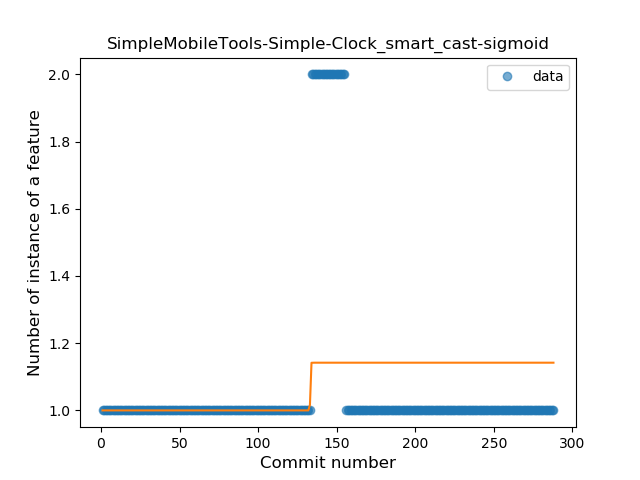

#### erickok-borefts2015
* Feature: Inline Function
* Function: 
* R_Squared: 0.04218529
 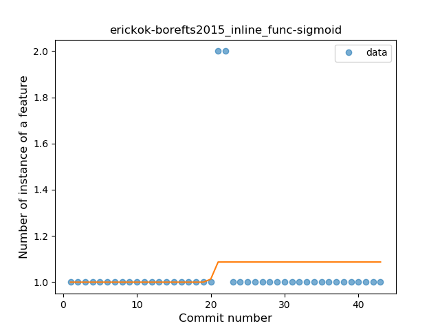

#### SimpleMobileTools-Simple-App-Launcher
* Feature: Range Expression
* Function: 
* R_Squared: 0.03054544
 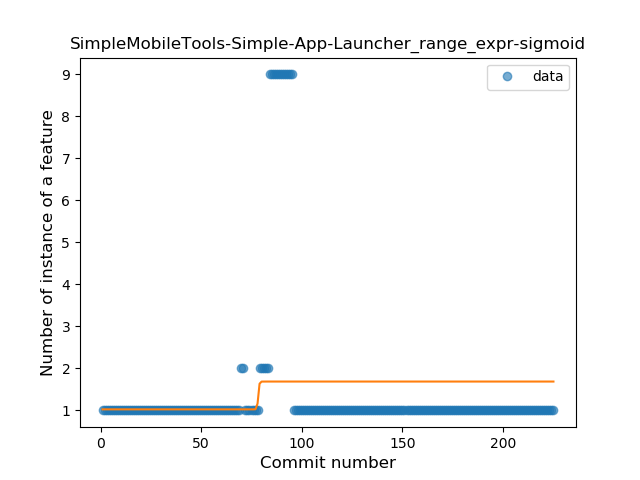

