## Plateau Gradual Rise
----
**765** best fit

#### com-firstrowria-pushnotificationtester
* Feature: Lambda
* Function: 
* R_Squared: 1.0
 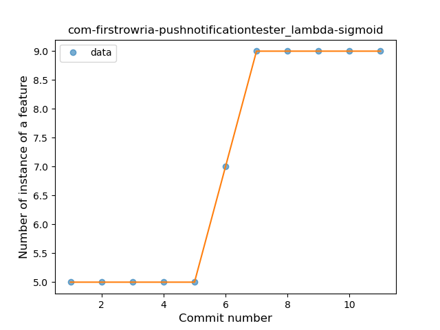

#### io-github-umren-watcher
* Feature: Unsafe Call
* Function: 
* R_Squared: 1.0
 

#### com-thanksmister-iot-mqtt-alarmpanel
* Feature: Singleton
* Function: 
* R_Squared: 1.0
 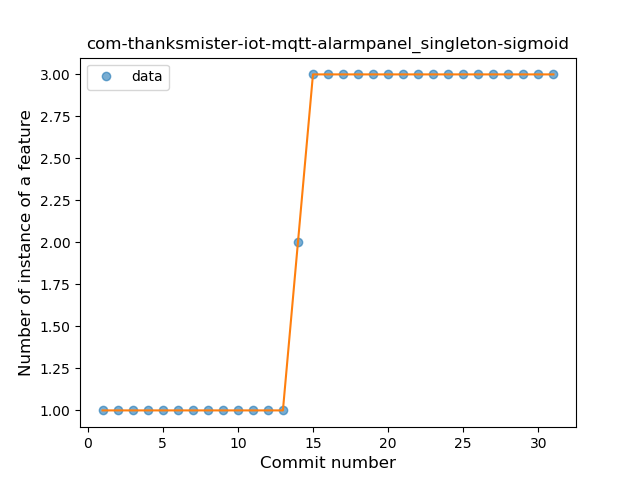

#### org-moire-ultrasonic
* Feature: Smart Cast
* Function: 
* R_Squared: 1.0
 

#### com-boardgamegeek
* Feature: Overloaded Operator
* Function: 
* R_Squared: 1.0
 

#### com-cookiegames-smartcookie
* Feature: Property Delegation
* Function: 
* R_Squared: 0.99988604
 

#### com-mgaetan89-showsrage
* Feature: Function call with Named Argument
* Function: 
* R_Squared: 0.99846337
 

#### tw-shounenwind-kmnbottool
* Feature: Coroutine
* Function: 
* R_Squared: 0.99794872
 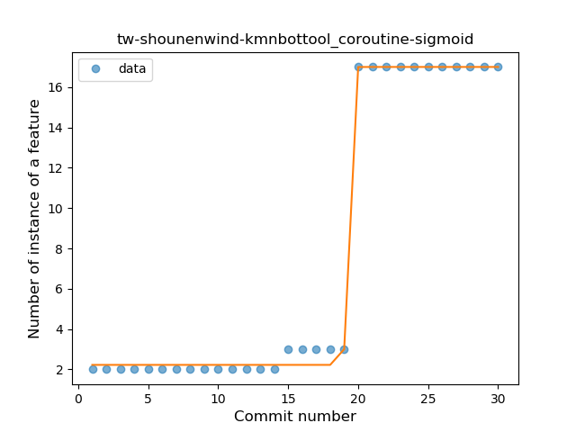

#### com-cookiegames-smartcookie
* Feature: Singleton
* Function: 
* R_Squared: 0.99768265
 

#### com-rhm-pwn
* Feature: Data Class
* Function: 
* R_Squared: 0.99715684
 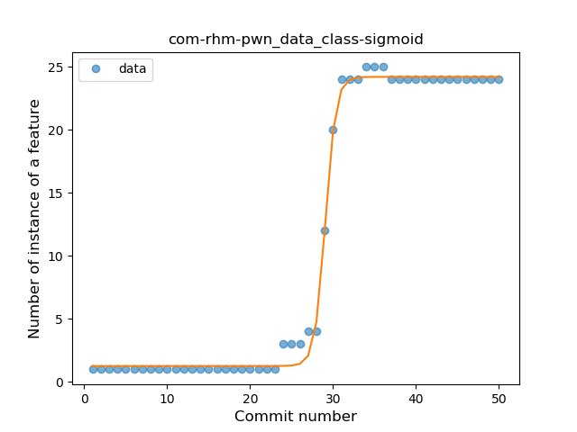

#### net-frju-flym
* Feature: Data Class
* Function: 
* R_Squared: 0.99601643
 

#### org-moire-ultrasonic
* Feature: String Template
* Function: 
* R_Squared: 0.9954708
 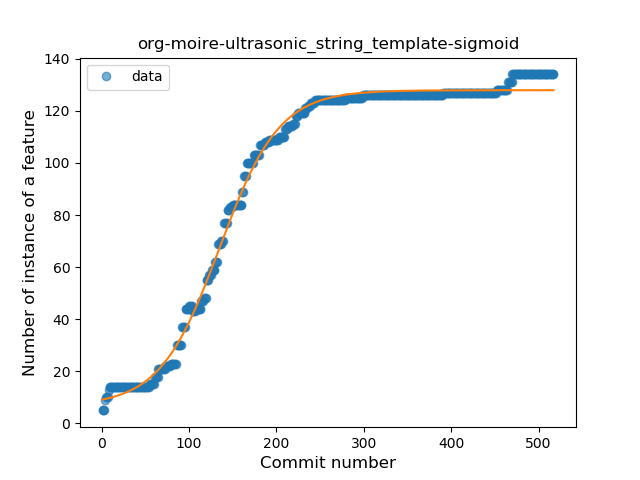

#### org-havenapp-main
* Feature: Companion Object
* Function: 
* R_Squared: 0.9948864
 

#### li-klass-fhem
* Feature: Property Delegation
* Function: 
* R_Squared: 0.99480815
 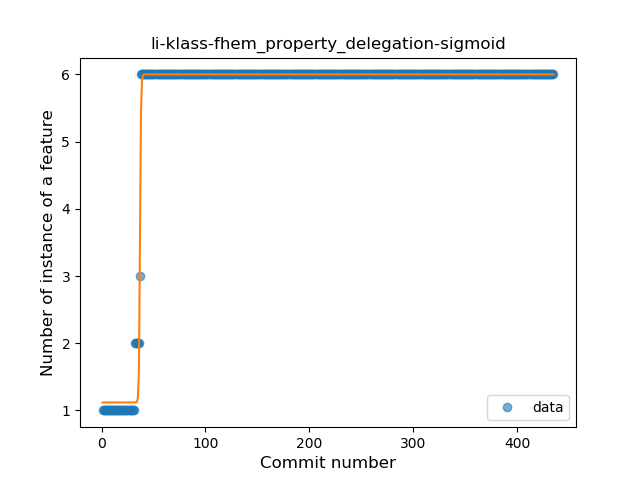

#### net-syncthing-lite
* Feature: String Template
* Function: 
* R_Squared: 0.99479803
 

#### org-ligi-gobandroid
* Feature: Function call with Named Argument
* Function: 
* R_Squared: 0.99473349
 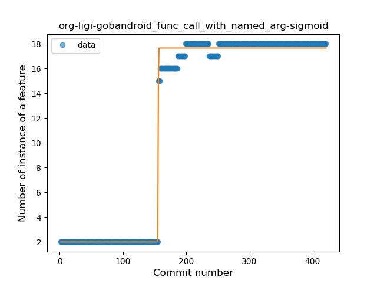

#### info-papdt-express-helper
* Feature: Data Class
* Function: 
* R_Squared: 0.99463345
 

#### com-rhm-pwn
* Feature: Lambda
* Function: 
* R_Squared: 0.99315738
 

#### com-pixplicity-cryptogram
* Feature: Singleton
* Function: 
* R_Squared: 0.9926209
 

#### org-anibyl-slounik
* Feature: Range Expression
* Function: 
* R_Squared: 0.99186468
 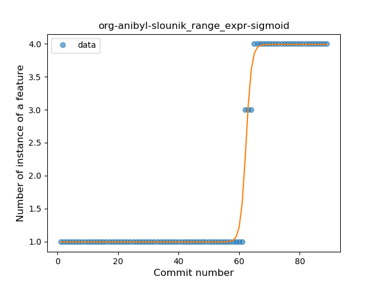

#### de-tubaf-mandelGL
* Feature: Lambda
* Function: 
* R_Squared: 0.99184322
 

#### at-bitfire-davdroid
* Feature: Extension Function
* Function: 
* R_Squared: 0.99183936
 

#### de-geeksfactory-opacclient
* Feature: When expression
* Function: 
* R_Squared: 0.99151383
 

#### com-dozingcatsoftware-vectorcamera
* Feature: Function call with Named Argument
* Function: 
* R_Squared: 0.99150066
 

#### com-phicdy-totoanticipation
* Feature: Data Class
* Function: 
* R_Squared: 0.99142493
 

#### com-rhm-pwn
* Feature: Companion Object
* Function: 
* R_Squared: 0.9912083
 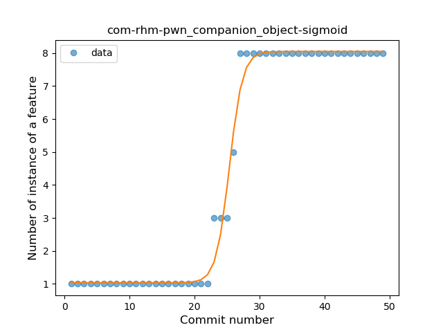

#### com-calintat-units
* Feature: String Template
* Function: 
* R_Squared: 0.99065159
 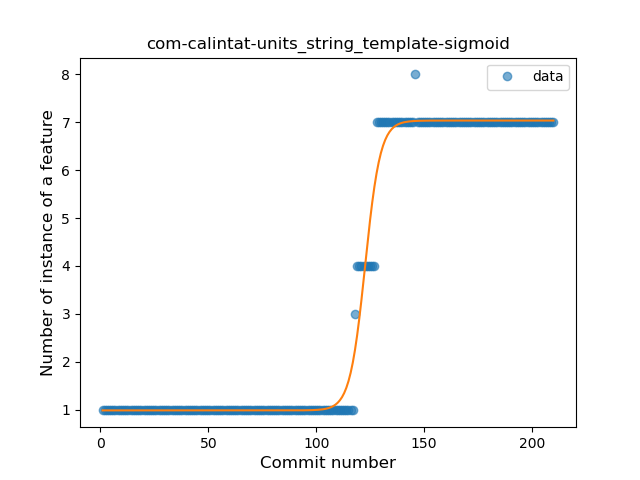

#### org-fossasia-badgemagic
* Feature: Smart Cast
* Function: 
* R_Squared: 0.99056383
 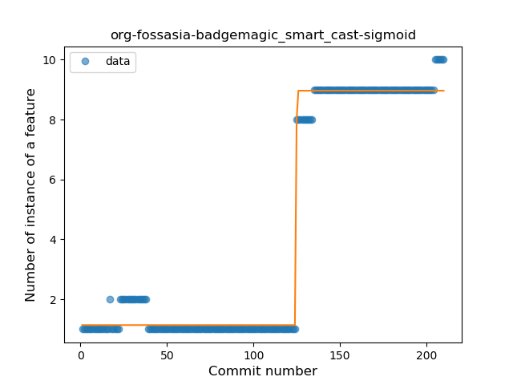

#### com-physphil-android-unitconverterultimate
* Feature: Lambda
* Function: 
* R_Squared: 0.99018779
 

#### ml-adamsprogs-bimba
* Feature: Data Class
* Function: 
* R_Squared: 0.99001523
 

#### com-fallgamlet-dnestrcinema
* Feature: Function with Default Value
* Function: 
* R_Squared: 0.98979345
 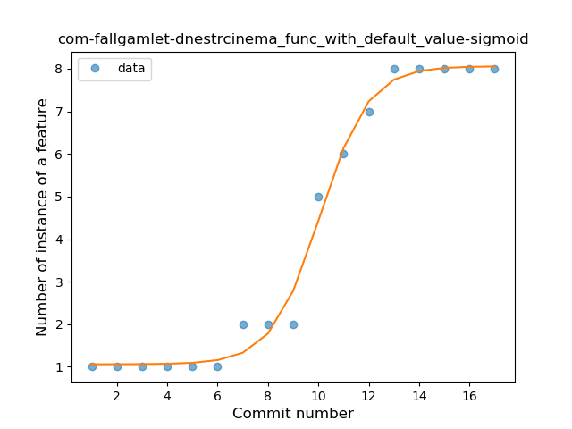

#### com-ianhanniballake-contractiontimer
* Feature: When expression
* Function: 
* R_Squared: 0.98963196
 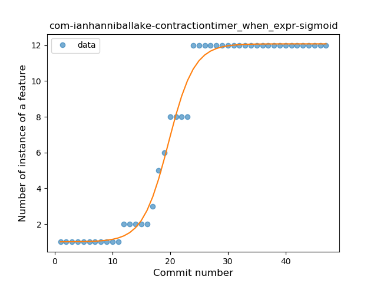

#### net-mm2d-dmsexplorer
* Feature: When expression
* Function: 
* R_Squared: 0.98951958
 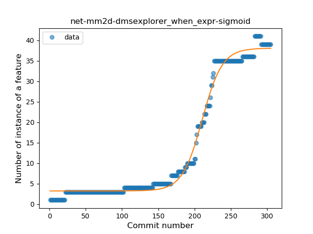

#### de-geeksfactory-opacclient
* Feature: String Template
* Function: 
* R_Squared: 0.9892552
 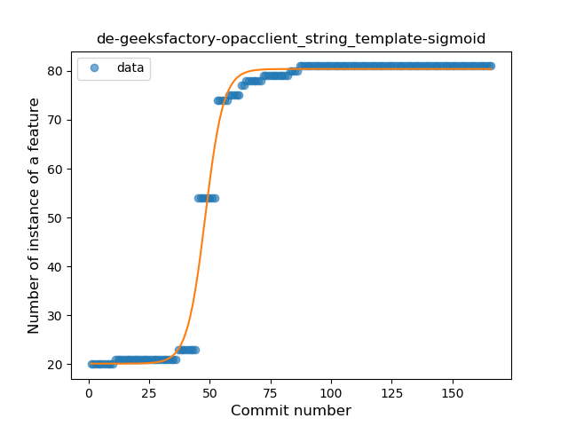

#### org-isoron-uhabits
* Feature: Function call with Named Argument
* Function: 
* R_Squared: 0.98923383
 

#### com-rhm-pwn
* Feature: When expression
* Function: 
* R_Squared: 0.98921433
 

#### com-nextcloud-talk2
* Feature: When expression
* Function: 
* R_Squared: 0.98916231
 

#### de-geeksfactory-opacclient
* Feature: Lambda
* Function: 
* R_Squared: 0.98901598
 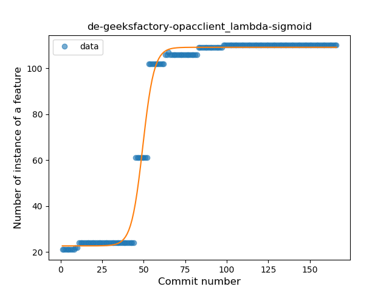

#### org-mariotaku-twidere
* Feature: Singleton
* Function: 
* R_Squared: 0.98885655
 

#### chat-rocket-android
* Feature: Data Class
* Function: 
* R_Squared: 0.98811005
 

#### com-guardafilme
* Feature: Function with Default Value
* Function: 
* R_Squared: 0.98783202
 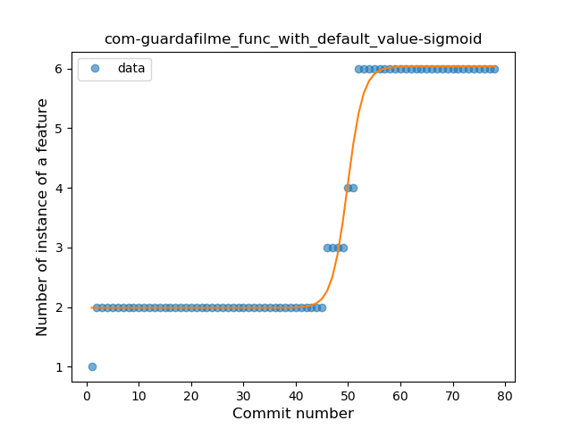

#### de-geeksfactory-opacclient
* Feature: Safe Call
* Function: 
* R_Squared: 0.98770677
 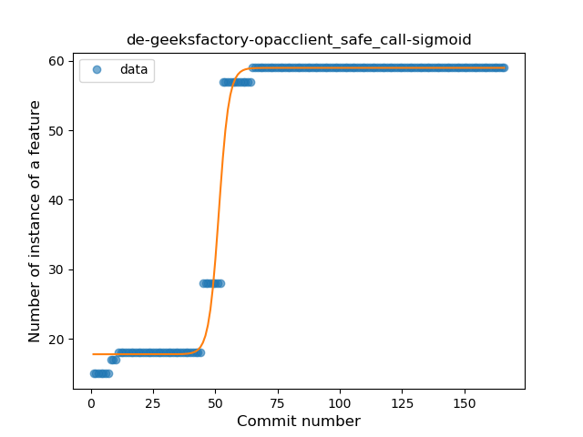

#### org-mozilla-rocket
* Feature: Sealed Class
* Function: 
* R_Squared: 0.98759582
 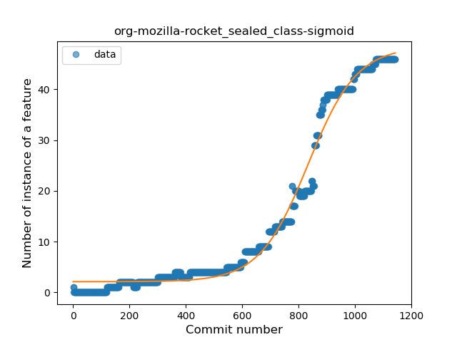

#### com-wabadaba-dziennik
* Feature: Safe Call
* Function: 
* R_Squared: 0.98752378
 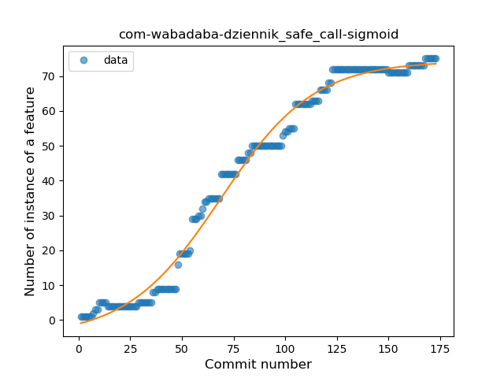

#### com-corphish-nightlight-generic
* Feature: Function call with Named Argument
* Function: 
* R_Squared: 0.9872344
 

#### io-github-feelfreelinux-wykopmobilny
* Feature: Function with Default Value
* Function: 
* R_Squared: 0.98715214
 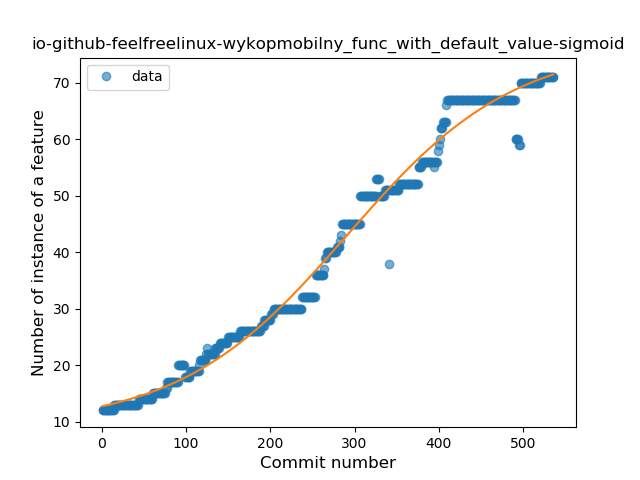

#### com-simplemobiletools-notes-pro
* Feature: Function call with Named Argument
* Function: 
* R_Squared: 0.9871006
 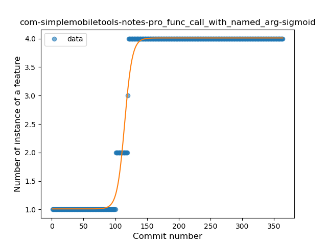

#### de-cineaste-android
* Feature: Function with Default Value
* Function: 
* R_Squared: 0.98700458
 

#### com-uwetrottmann-wpdisplay
* Feature: Unsafe Call
* Function: 
* R_Squared: 0.98650457
 

#### net-frju-flym
* Feature: Extension Function
* Function: 
* R_Squared: 0.98630019
 

#### se-creotec-chscardbalance2
* Feature: Function with Default Value
* Function: 
* R_Squared: 0.98629218
 

#### cat-xojan-random1
* Feature: When expression
* Function: 
* R_Squared: 0.98603437
 

#### be-mygod-vpnhotspot
* Feature: Coroutine
* Function: 
* R_Squared: 0.98599916
 

#### link-standen-michael-phonesaver
* Feature: When expression
* Function: 
* R_Squared: 0.98587494
 

#### org-moire-ultrasonic
* Feature: Unsafe Call
* Function: 
* R_Squared: 0.98565799
 

#### com-github-vase4kin-teamcityapp
* Feature: Function with Default Value
* Function: 
* R_Squared: 0.9855552
 

#### nl-jqno-remindermail
* Feature: Unsafe Call
* Function: 
* R_Squared: 0.98527134
 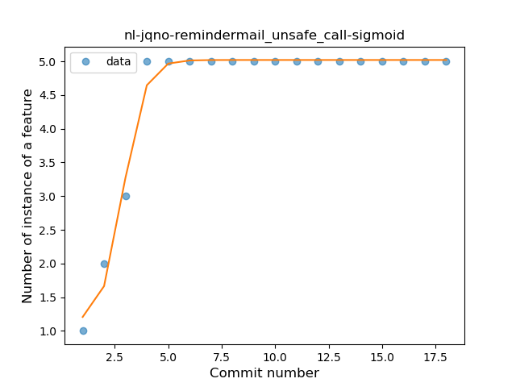

#### ru-hyst329-openfool
* Feature: Smart Cast
* Function: 
* R_Squared: 0.98495614
 

#### com-epimorphics-android-myrivers
* Feature: Lambda
* Function: 
* R_Squared: 0.98475174
 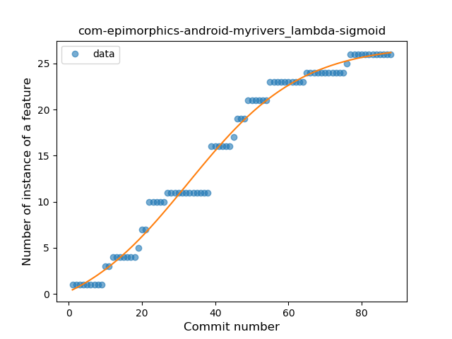

#### nl-brouwerijdemolen-borefts2013
* Feature: Companion Object
* Function: 
* R_Squared: 0.98468265
 

#### de-devmil-muzei-bingimageofthedayartsource
* Feature: String Template
* Function: 
* R_Squared: 0.98460545
 

#### com-nextcloud-talk2
* Feature: Smart Cast
* Function: 
* R_Squared: 0.98458755
 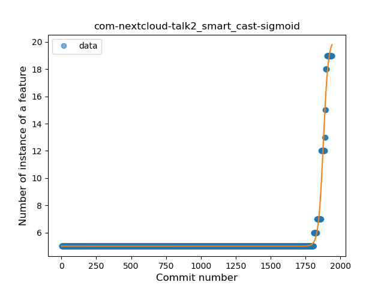

#### science-apolline
* Feature: Lambda
* Function: 
* R_Squared: 0.98422681
 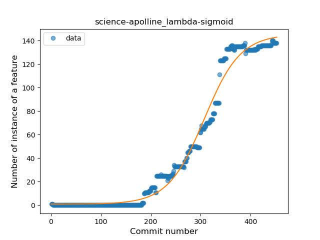

#### com-ogsdroid
* Feature: Function with Default Value
* Function: 
* R_Squared: 0.98412505
 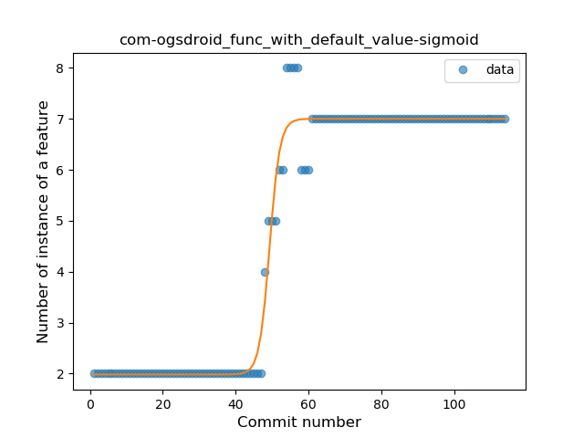

#### org-ligi-ipfsdroid
* Feature: When expression
* Function: 
* R_Squared: 0.98397894
 

#### com-breadwallet
* Feature: Function call with Named Argument
* Function: 
* R_Squared: 0.9839682
 

#### com-loloof64-android-basicchessendgamestrainer
* Feature: Function with Default Value
* Function: 
* R_Squared: 0.98394343
 

#### com-adityakamble49-dcipher
* Feature: When expression
* Function: 
* R_Squared: 0.98369034
 

#### com-github-moko256-twitlatte
* Feature: Data Class
* Function: 
* R_Squared: 0.98367306
 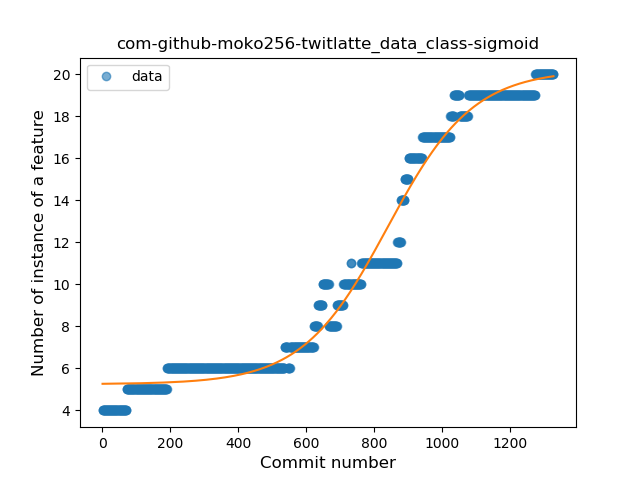

#### com-dp-logcatapp
* Feature: Data Class
* Function: 
* R_Squared: 0.98342171
 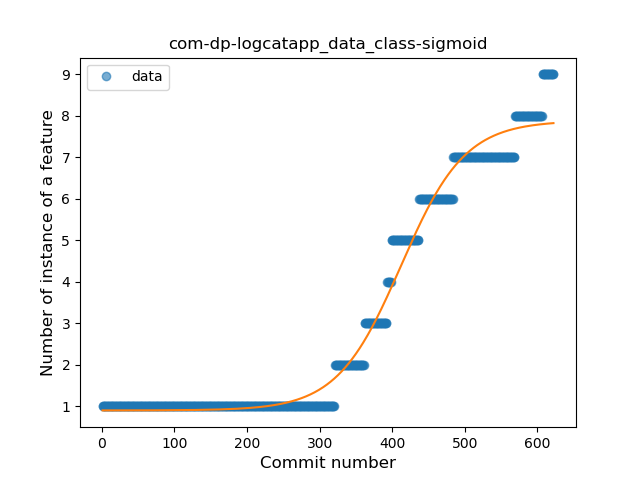

#### tech-ula
* Feature: Singleton
* Function: 
* R_Squared: 0.98341166
 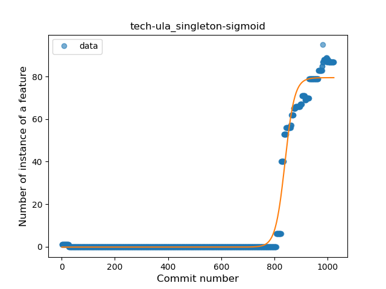

#### de-Maxr1998-xposed-maxlock
* Feature: Overloaded Operator
* Function: 
* R_Squared: 0.98328845
 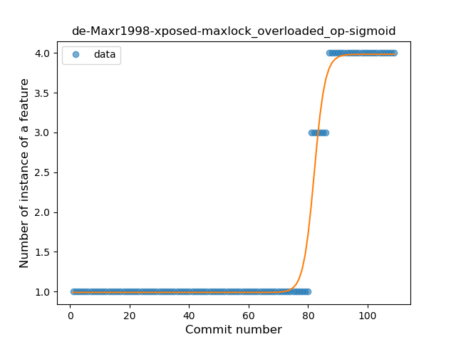

#### pixel-kotlin-bassblog
* Feature: Extension Function
* Function: 
* R_Squared: 0.9830751
 

#### com-adityakamble49-dcipher
* Feature: Data Class
* Function: 
* R_Squared: 0.98284601
 

#### ca-rmen-android-poetassistant
* Feature: Range Expression
* Function: 
* R_Squared: 0.98282404
 

#### horse-amazin-my-stratum0-statuswidget
* Feature: Companion Object
* Function: 
* R_Squared: 0.98275645
 

#### pl-hypeapp-episodie
* Feature: Function with Default Value
* Function: 
* R_Squared: 0.98264172
 

#### org-isoron-uhabits
* Feature: Companion Object
* Function: 
* R_Squared: 0.98233907
 

#### net-stew-stew
* Feature: String Template
* Function: 
* R_Squared: 0.98231627
 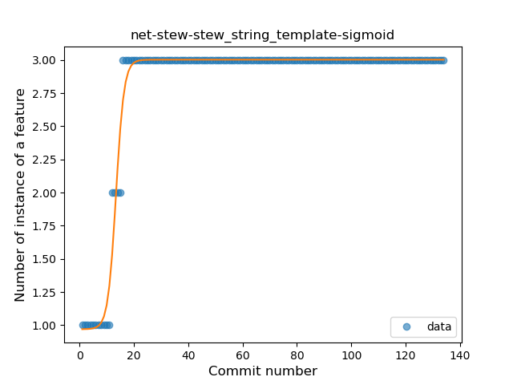

#### ch-rmy-android-http_shortcuts
* Feature: Data Class
* Function: 
* R_Squared: 0.98222489
 

#### com-utazukin-ichaival
* Feature: Type Alias
* Function: 
* R_Squared: 0.98216065
 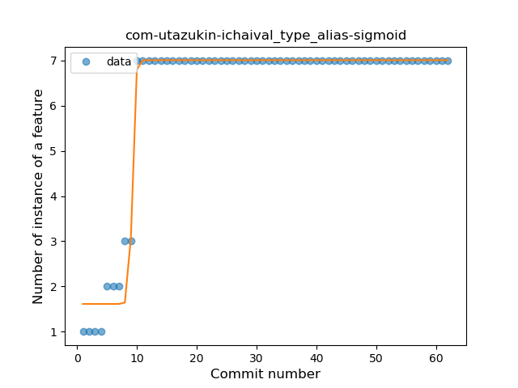

#### com-orgzly
* Feature: Extension Function
* Function: 
* R_Squared: 0.98203078
 

#### com-nextcloud-talk2
* Feature: Property Delegation
* Function: 
* R_Squared: 0.98197807
 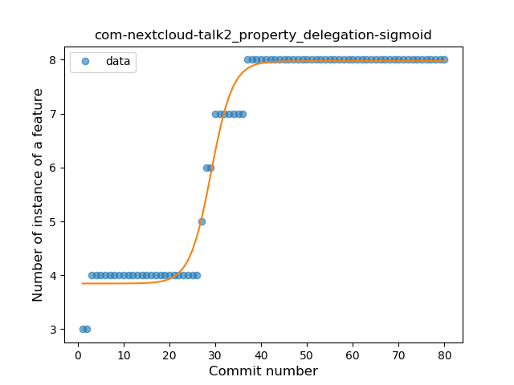

#### com-pyamsoft-homebutton
* Feature: Property Delegation
* Function: 
* R_Squared: 0.98189496
 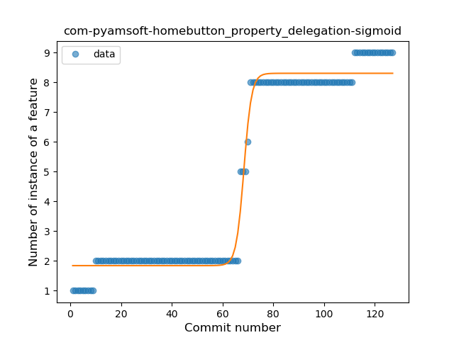

#### org-mariotaku-twidere
* Feature: Inline Function
* Function: 
* R_Squared: 0.98165132
 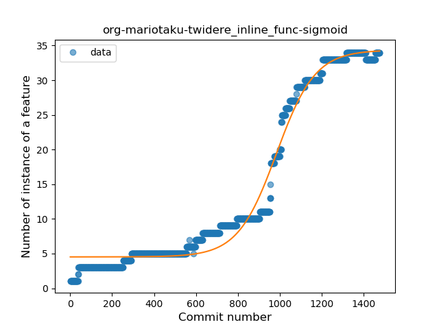

#### org-havenapp-main
* Feature: Unsafe Call
* Function: 
* R_Squared: 0.98163334
 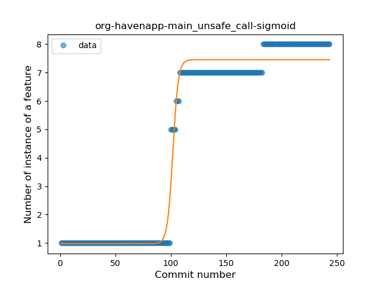

#### xyz-hisname-fireflyiii
* Feature: Companion Object
* Function: 
* R_Squared: 0.98140337
 

#### de-geeksfactory-opacclient
* Feature: Destructuring Declaration
* Function: 
* R_Squared: 0.98119149
 

#### de-markusfisch-android-binaryeye
* Feature: Inline Function
* Function: 
* R_Squared: 0.98118333
 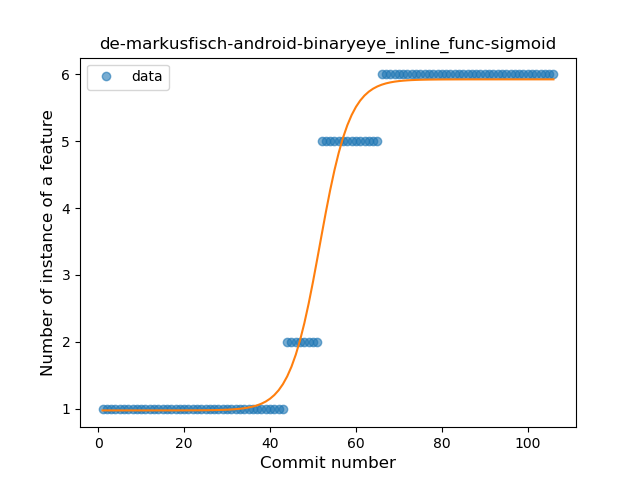

#### com-example-forgottenumbrella-cardboardmuseum
* Feature: Function with Default Value
* Function: 
* R_Squared: 0.98111765
 

#### com-kgurgul-cpuinfo
* Feature: Coroutine
* Function: 
* R_Squared: 0.98098904
 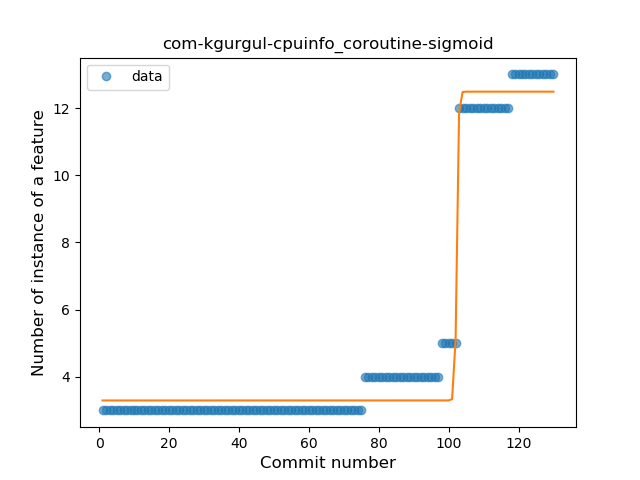

#### com-tomer-draw
* Feature: Function call with Named Argument
* Function: 
* R_Squared: 0.98091354
 

#### com-simplemobiletools-musicplayer
* Feature: When expression
* Function: 
* R_Squared: 0.98085325
 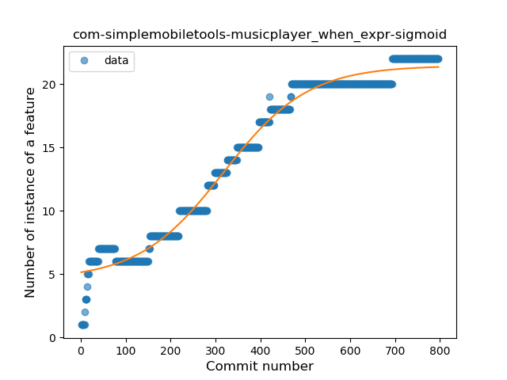

#### chat-rocket-android
* Feature: Sealed Class
* Function: 
* R_Squared: 0.98081089
 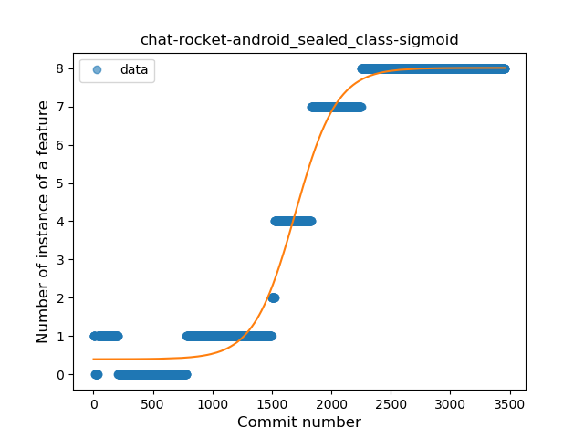

#### com-nextcloud-talk2
* Feature: Extension Function
* Function: 
* R_Squared: 0.98077793
 

#### cz-dvratil-fbeventsync
* Feature: Singleton
* Function: 
* R_Squared: 0.98041089
 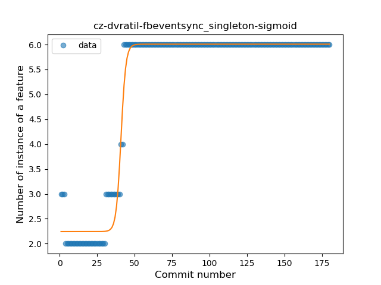

#### ru-hyst329-openfool
* Feature: When expression
* Function: 
* R_Squared: 0.98015401
 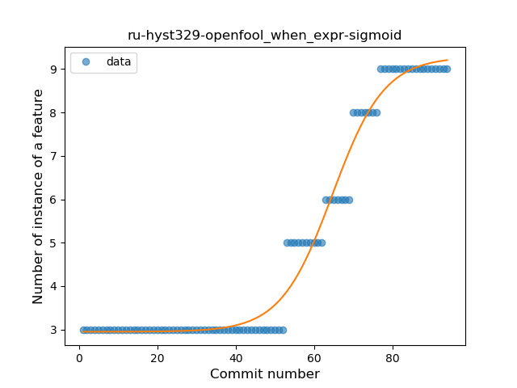

#### pt-joaomneto-titancompanion
* Feature: Companion Object
* Function: 
* R_Squared: 0.98003051
 

#### com-rohitsuratekar-NCBSinfo
* Feature: Range Expression
* Function: 
* R_Squared: 0.97985724
 

#### de-csicar-mensaplan
* Feature: String Template
* Function: 
* R_Squared: 0.97967622
 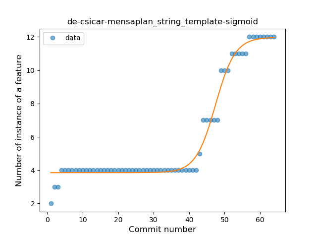

#### com-gimranov-zandy-app
* Feature: Singleton
* Function: 
* R_Squared: 0.97965386
 

#### org-emunix-insteadlauncher
* Feature: Function with Default Value
* Function: 
* R_Squared: 0.97962471
 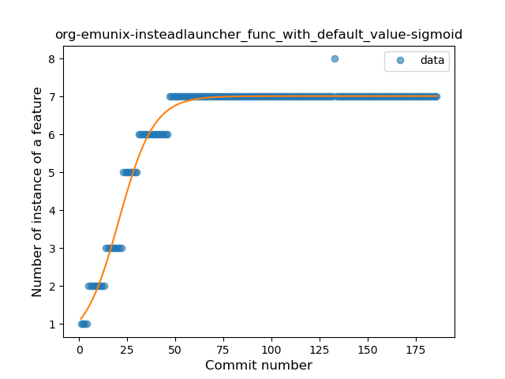

#### com-orgzly
* Feature: Property Delegation
* Function: 
* R_Squared: 0.97956726
 

#### de-markusfisch-android-binaryeye
* Feature: Singleton
* Function: 
* R_Squared: 0.97946328
 

#### one-librem-social
* Feature: Function call with Named Argument
* Function: 
* R_Squared: 0.97916221
 

#### ch-deletescape-lawnchair-plah
* Feature: Infix Function
* Function: 
* R_Squared: 0.97902793
 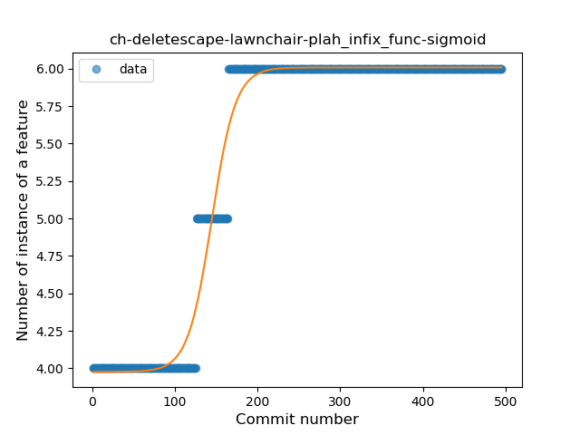

#### com-loloof64-android-basicchessendgamestrainer
* Feature: Singleton
* Function: 
* R_Squared: 0.97883822
 

#### com-zeapo-pwdstore
* Feature: Range Expression
* Function: 
* R_Squared: 0.97882508
 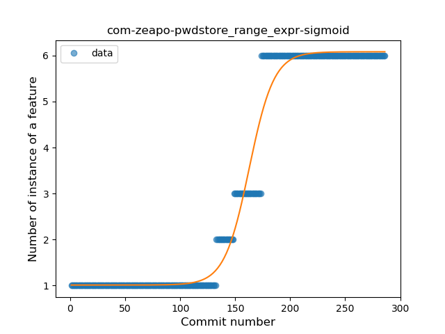

#### com-nextcloud-talk2
* Feature: Companion Object
* Function: 
* R_Squared: 0.97876617
 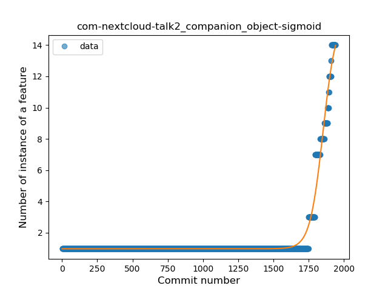

#### ml-adamsprogs-bimba
* Feature: Coroutine
* Function: 
* R_Squared: 0.97873874
 

#### de-thecode-android-tazreader
* Feature: Unsafe Call
* Function: 
* R_Squared: 0.97858583
 

#### tk-superl2-xwifi
* Feature: When expression
* Function: 
* R_Squared: 0.97839735
 

#### com-epimorphics-android-myrivers
* Feature: When expression
* Function: 
* R_Squared: 0.97819253
 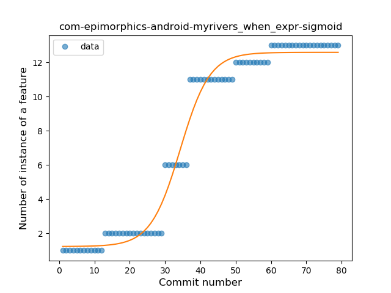

#### com-zacharee1-systemuituner
* Feature: Smart Cast
* Function: 
* R_Squared: 0.97790319
 

#### com-kgurgul-cpuinfo
* Feature: Inline Function
* Function: 
* R_Squared: 0.97746388
 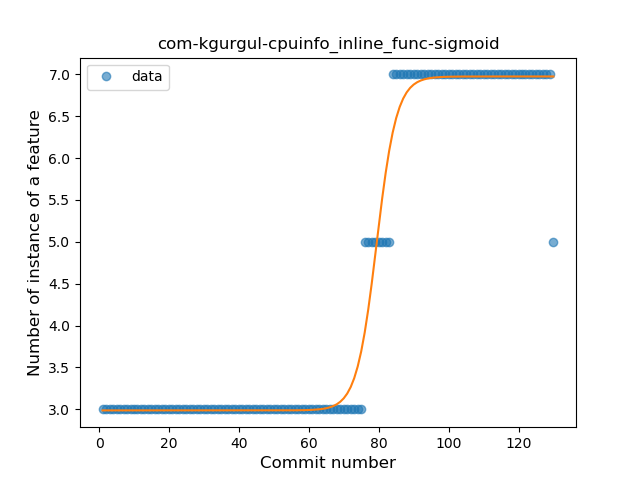

#### tech-ula
* Feature: Data Class
* Function: 
* R_Squared: 0.97745552
 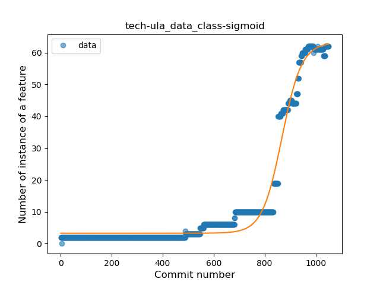

#### net-syncthing-lite
* Feature: Destructuring Declaration
* Function: 
* R_Squared: 0.97730369
 

#### de-markusfisch-android-binaryeye
* Feature: When expression
* Function: 
* R_Squared: 0.97730354
 

#### com-benoitquenaudon-tvfoot-red
* Feature: Sealed Class
* Function: 
* R_Squared: 0.97717652
 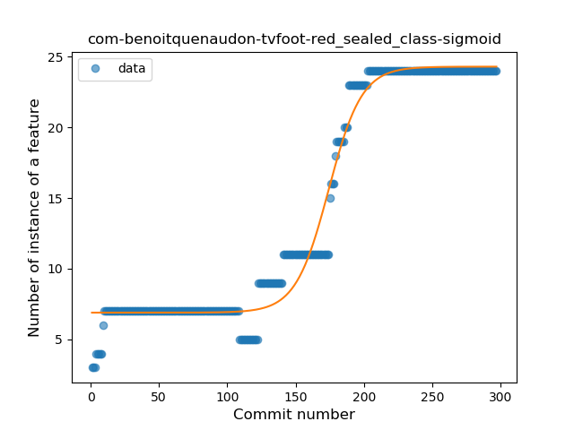

#### com-github-moko256-twitlatte
* Feature: Function with Default Value
* Function: 
* R_Squared: 0.97715051
 

#### com-tasomaniac-openwith-floss
* Feature: Companion Object
* Function: 
* R_Squared: 0.97706784
 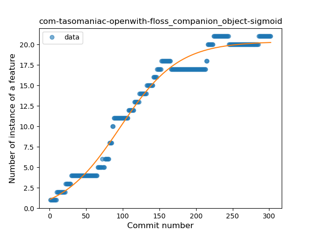

#### tech-ula
* Feature: Smart Cast
* Function: 
* R_Squared: 0.97697754
 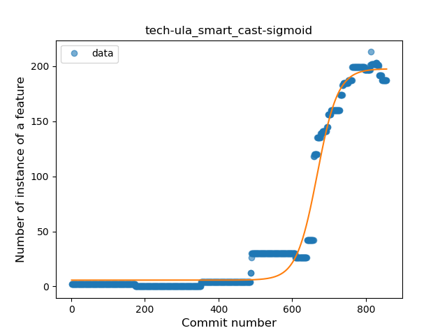

#### com-breadwallet
* Feature: Range Expression
* Function: 
* R_Squared: 0.9768223
 

#### com-simplemobiletools-filemanager-pro
* Feature: Function with Default Value
* Function: 
* R_Squared: 0.97677307
 

#### com-crane-mockappdemo
* Feature: String Template
* Function: 
* R_Squared: 0.97672565
 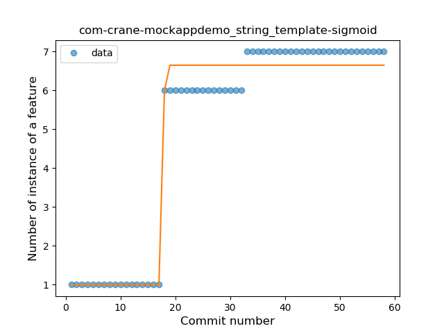

#### com-github-vase4kin-teamcityapp
* Feature: Data Class
* Function: 
* R_Squared: 0.97659375
 

#### com-jereksel-libresubstratum
* Feature: Smart Cast
* Function: 
* R_Squared: 0.97655076
 

#### ca-rmen-android-poetassistant
* Feature: Safe Call
* Function: 
* R_Squared: 0.97642717
 

#### com-arcao-geocaching4locus
* Feature: Destructuring Declaration
* Function: 
* R_Squared: 0.97625465
 

#### se-creotec-chscardbalance2
* Feature: Function call with Named Argument
* Function: 
* R_Squared: 0.9760359
 

#### com-corphish-nightlight-generic
* Feature: Function with Default Value
* Function: 
* R_Squared: 0.97595002
 

#### com-ogsdroid
* Feature: String Template
* Function: 
* R_Squared: 0.97592177
 

#### li-klass-fhem
* Feature: Destructuring Declaration
* Function: 
* R_Squared: 0.97582618
 

#### org-equeim-tremotesf
* Feature: Extension Function
* Function: 
* R_Squared: 0.97576032
 

#### one-librem-social
* Feature: Unsafe Call
* Function: 
* R_Squared: 0.97560806
 

#### com-ruuvi-station
* Feature: Companion Object
* Function: 
* R_Squared: 0.97549384
 

#### com-github-moko256-twitlatte
* Feature: When expression
* Function: 
* R_Squared: 0.97524136
 

#### com-jmstudios-redmoon
* Feature: Safe Call
* Function: 
* R_Squared: 0.97514518
 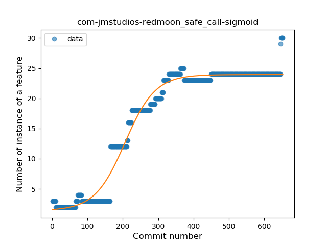

#### org-blokada-alarm
* Feature: Type Alias
* Function: 
* R_Squared: 0.97490726
 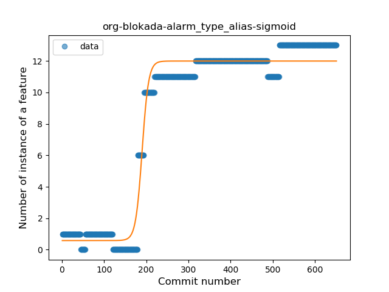

#### ca-rmen-android-poetassistant
* Feature: Function with Default Value
* Function: 
* R_Squared: 0.97425513
 

#### com-rhm-pwn
* Feature: Function with Default Value
* Function: 
* R_Squared: 0.97409963
 

#### it-diab
* Feature: Data Class
* Function: 
* R_Squared: 0.97391274
 

#### com-example-harisont-librery
* Feature: Type Inference
* Function: 
* R_Squared: 0.97367922
 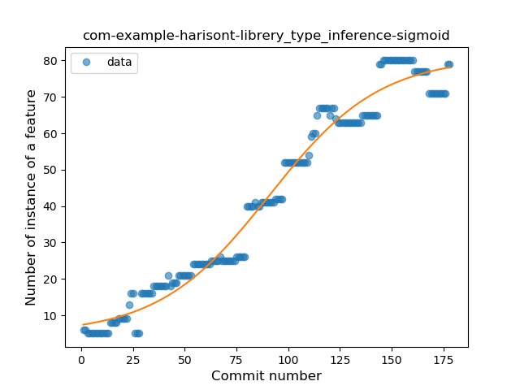

#### moe-feng-nhentai
* Feature: Function call with Named Argument
* Function: 
* R_Squared: 0.97357328
 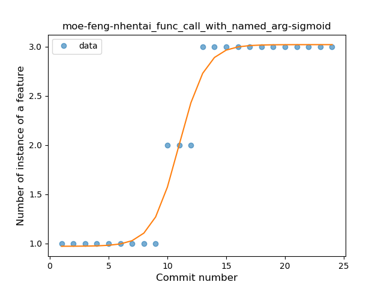

#### com-fallgamlet-dnestrcinema
* Feature: Unsafe Call
* Function: 
* R_Squared: 0.97348624
 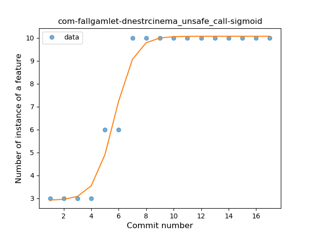

#### com-breadwallet
* Feature: Companion Object
* Function: 
* R_Squared: 0.97335427
 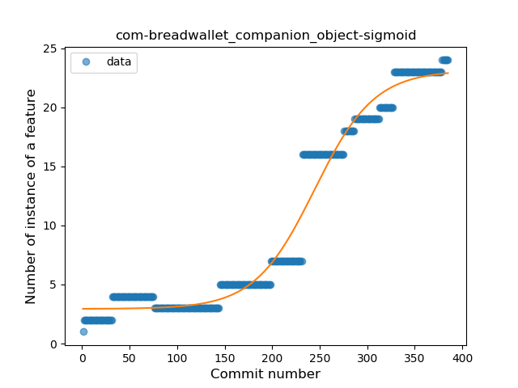

#### org-ligi-survivalmanual
* Feature: Extension Function
* Function: 
* R_Squared: 0.97326296
 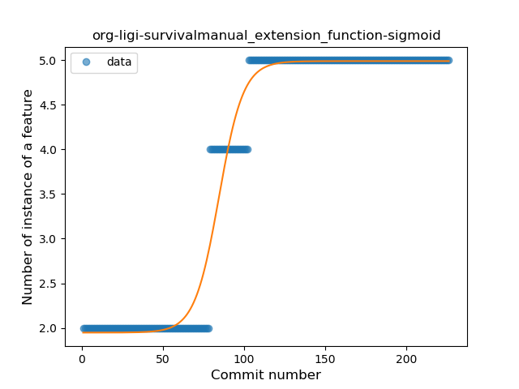

#### xyz-hisname-fireflyiii
* Feature: Coroutine
* Function: 
* R_Squared: 0.97274504
 

#### org-mattvchandler-progressbars
* Feature: Destructuring Declaration
* Function: 
* R_Squared: 0.97274425
 

#### nl-brouwerijdemolen-borefts2013
* Feature: Overloaded Operator
* Function: 
* R_Squared: 0.97270489
 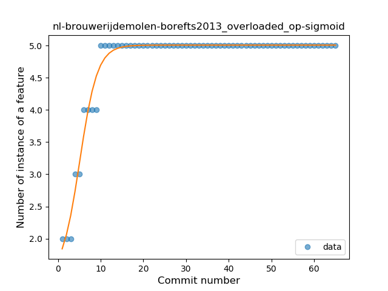

#### com-breadwallet
* Feature: Singleton
* Function: 
* R_Squared: 0.9726953
 

#### io-github-z3r0c00l
* Feature: String Template
* Function: 
* R_Squared: 0.97263878
 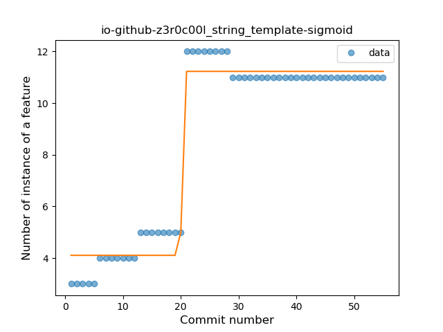

#### app-opass-ccip
* Feature: Function with Default Value
* Function: 
* R_Squared: 0.97261909
 

#### com-simplemobiletools-contacts-pro
* Feature: Range Expression
* Function: 
* R_Squared: 0.97248787
 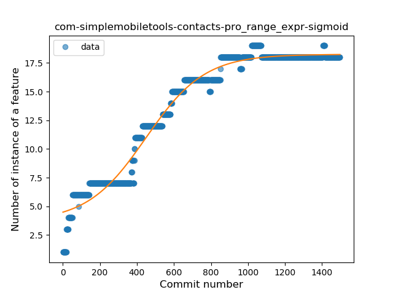

#### org-ligi-passandroid
* Feature: Range Expression
* Function: 
* R_Squared: 0.97248033
 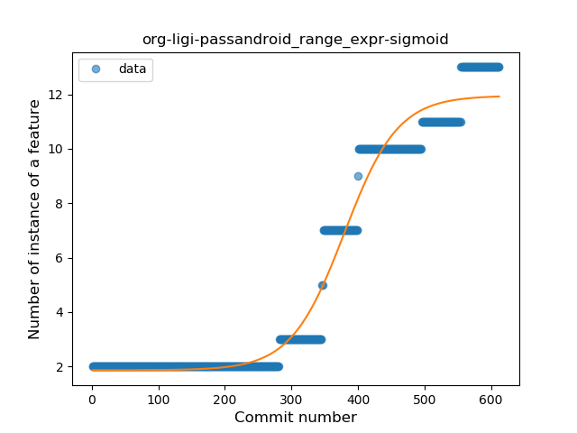

#### me-proxer-app
* Feature: Safe Call
* Function: 
* R_Squared: 0.97230181
 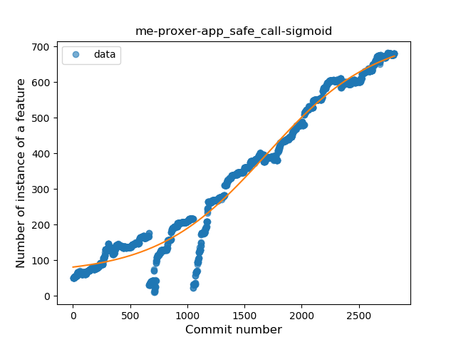

#### com-nextcloud-talk2
* Feature: Coroutine
* Function: 
* R_Squared: 0.97200265
 

#### acr-browser-lightning
* Feature: Data Class
* Function: 
* R_Squared: 0.9716622
 

#### com-eventyay-attendee
* Feature: When expression
* Function: 
* R_Squared: 0.9715524
 

#### org-kaqui
* Feature: Coroutine
* Function: 
* R_Squared: 0.97149787
 

#### ml-adamsprogs-bimba
* Feature: Extension Function
* Function: 
* R_Squared: 0.97144362
 

#### pl-hypeapp-episodie
* Feature: Unsafe Call
* Function: 
* R_Squared: 0.97139709
 

#### com-appspot-pistatium-mahougen
* Feature: Lambda
* Function: 
* R_Squared: 0.97134587
 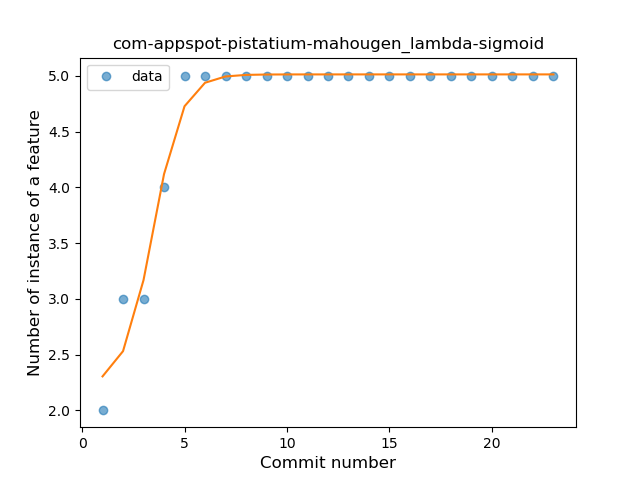

#### com-ofalvai-bpinfo
* Feature: Singleton
* Function: 
* R_Squared: 0.97074455
 

#### com-wabadaba-dziennik
* Feature: Data Class
* Function: 
* R_Squared: 0.97054595
 

#### com-keylesspalace-tusky
* Feature: Function call with Named Argument
* Function: 
* R_Squared: 0.97049234
 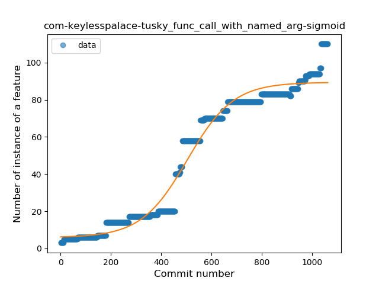

#### com-nextcloud-talk2
* Feature: Range Expression
* Function: 
* R_Squared: 0.97040099
 

#### com-benoitquenaudon-tvfoot-red
* Feature: Overloaded Operator
* Function: 
* R_Squared: 0.97036197
 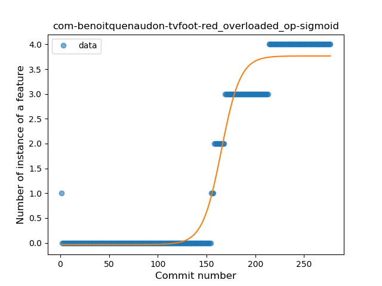

#### org-isoron-uhabits
* Feature: Coroutine
* Function: 
* R_Squared: 0.97035549
 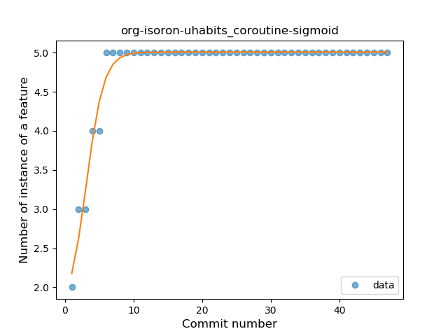

#### com-gimranov-zandy-app
* Feature: When expression
* Function: 
* R_Squared: 0.9702543
 

#### me-kirimin-mitsumine
* Feature: Smart Cast
* Function: 
* R_Squared: 0.97017328
 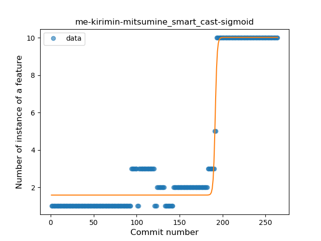

#### com-simplemobiletools-notes-pro
* Feature: Data Class
* Function: 
* R_Squared: 0.97011433
 

#### com-zeapo-pwdstore
* Feature: Function with Default Value
* Function: 
* R_Squared: 0.97005533
 

#### com-github-quarck-calnotify
* Feature: Safe Call
* Function: 
* R_Squared: 0.96955443
 

#### org-isoron-uhabits
* Feature: Unsafe Call
* Function: 
* R_Squared: 0.96953999
 

#### com-nextcloud-talk2
* Feature: Data Class
* Function: 
* R_Squared: 0.96936595
 

#### fr-openium-auvergnewebcams
* Feature: Data Class
* Function: 
* R_Squared: 0.96933345
 

#### com-fsck-k9
* Feature: Safe Call
* Function: 
* R_Squared: 0.96924098
 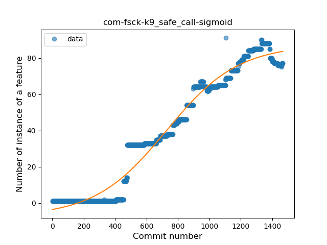

#### com-dp-logcatapp
* Feature: Safe Call
* Function: 
* R_Squared: 0.96918915
 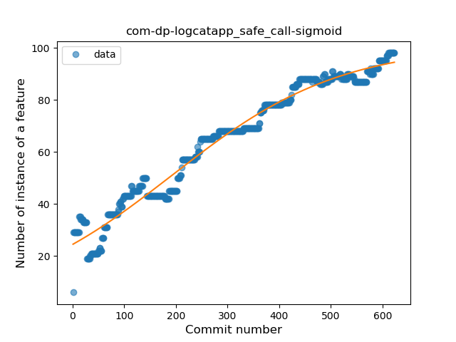

#### io-github-wulkanowy
* Feature: When expression
* Function: 
* R_Squared: 0.96913481
 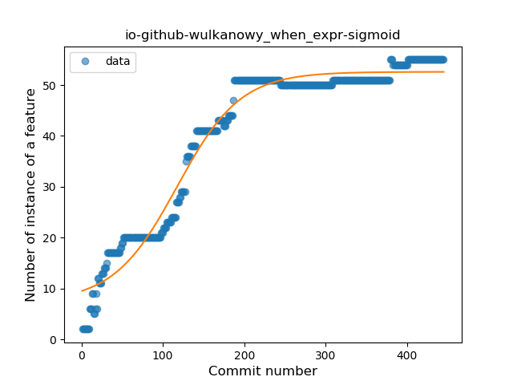

#### com-tasomaniac-openwith-floss
* Feature: When expression
* Function: 
* R_Squared: 0.96907285
 

#### is-xyz-omw
* Feature: When expression
* Function: 
* R_Squared: 0.96893815
 

#### se-barsk-park
* Feature: Smart Cast
* Function: 
* R_Squared: 0.9689188
 

#### acr-browser-lightning
* Feature: Range Expression
* Function: 
* R_Squared: 0.96888426
 

#### me-murks-feedwatcher
* Feature: Singleton
* Function: 
* R_Squared: 0.96884547
 

#### com-peterlaurence-trekme
* Feature: Unsafe Call
* Function: 
* R_Squared: 0.96875536
 

#### com-rhm-pwn
* Feature: String Template
* Function: 
* R_Squared: 0.96836023
 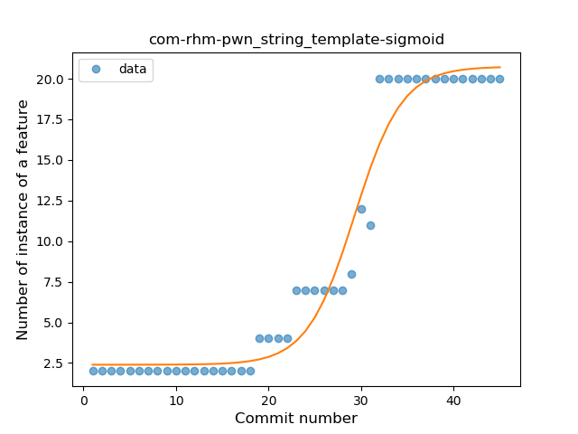

#### xyz-hisname-fireflyiii
* Feature: Range Expression
* Function: 
* R_Squared: 0.96825499
 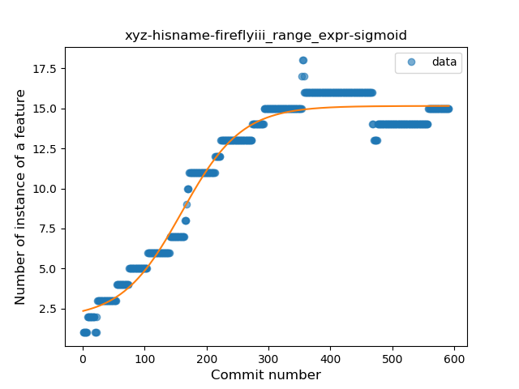

#### cat-xojan-random1
* Feature: String Template
* Function: 
* R_Squared: 0.96799025
 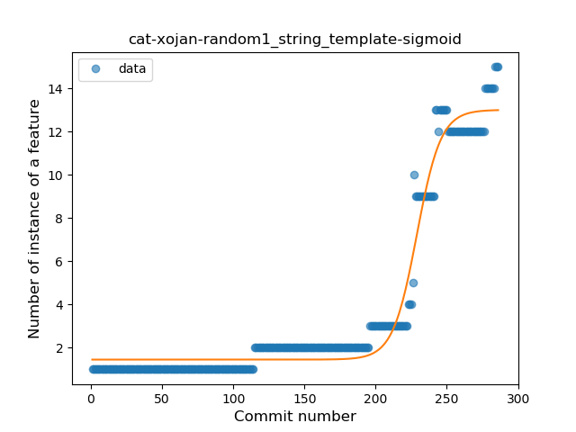

#### com-agusyc-daycounter
* Feature: When expression
* Function: 
* R_Squared: 0.96768592
 

#### com-esafirm-androidplayground
* Feature: Singleton
* Function: 
* R_Squared: 0.96756798
 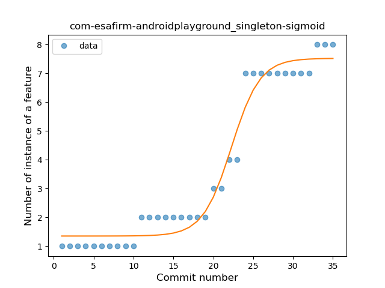

#### acr-browser-lightning
* Feature: Sealed Class
* Function: 
* R_Squared: 0.96754037
 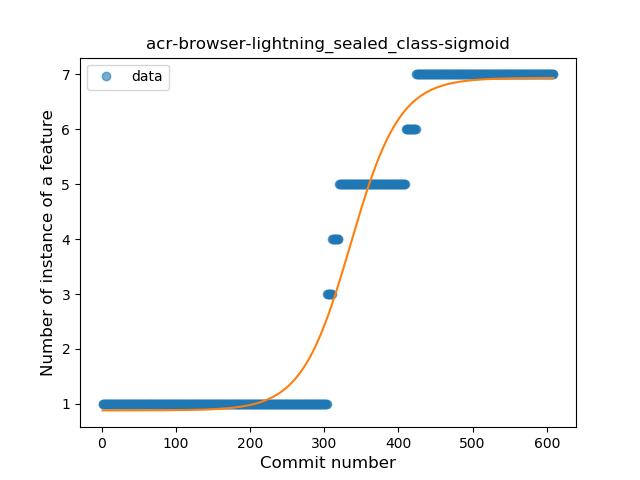

#### ch-rmy-android-http_shortcuts
* Feature: Smart Cast
* Function: 
* R_Squared: 0.96746691
 

#### com-simplemobiletools-contacts-pro
* Feature: Function call with Named Argument
* Function: 
* R_Squared: 0.96741832
 

#### net-mm2d-dmsexplorer
* Feature: Overloaded Operator
* Function: 
* R_Squared: 0.96737571
 

#### com-keylesspalace-tusky
* Feature: Range Expression
* Function: 
* R_Squared: 0.96690558
 

#### de-westnordost-streetcomplete
* Feature: Property Delegation
* Function: 
* R_Squared: 0.96683287
 

#### is-xyz-mpv
* Feature: Range Expression
* Function: 
* R_Squared: 0.96677015
 

#### com-ids1024-whitakerswords
* Feature: String Template
* Function: 
* R_Squared: 0.96671078
 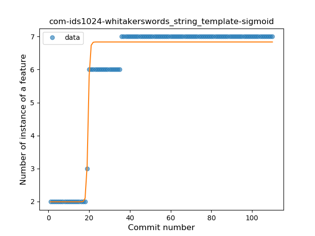

#### ml-adamsprogs-bimba
* Feature: Overloaded Operator
* Function: 
* R_Squared: 0.96663481
 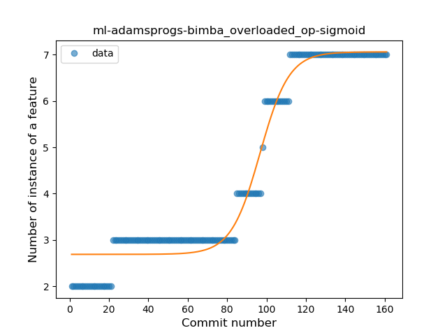

#### com-jmstudios-redmoon
* Feature: Singleton
* Function: 
* R_Squared: 0.9665725
 

#### net-mm2d-android-vmb
* Feature: When expression
* Function: 
* R_Squared: 0.96620386
 

#### com-BibleQuote
* Feature: Lambda
* Function: 
* R_Squared: 0.96618373
 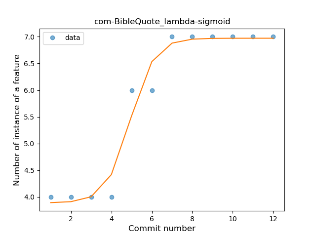

#### link-standen-michael-phonesaver
* Feature: Function with Default Value
* Function: 
* R_Squared: 0.96580856
 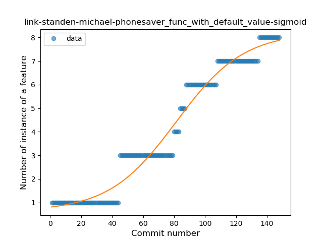

#### com-pluscubed-velociraptor
* Feature: Lambda
* Function: 
* R_Squared: 0.96577017
 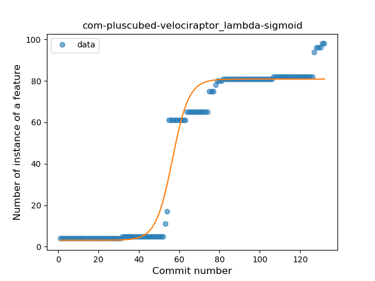

#### de-Maxr1998-xposed-maxlock
* Feature: Inline Function
* Function: 
* R_Squared: 0.96534791
 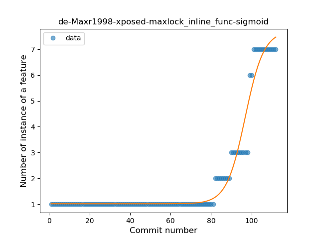

#### moe-feng-nhentai
* Feature: Function with Default Value
* Function: 
* R_Squared: 0.96519491
 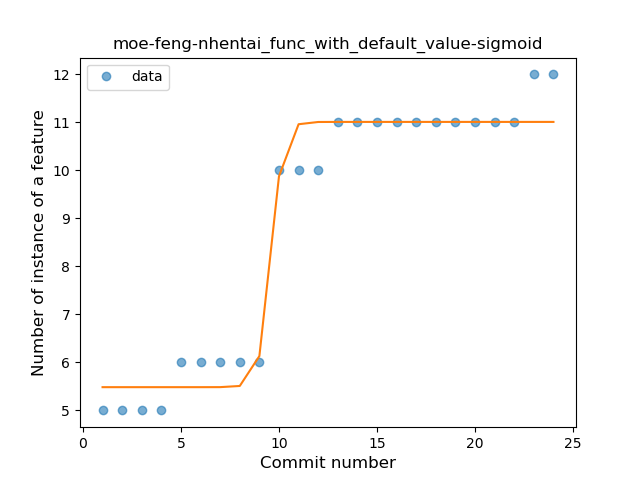

#### com-simplemobiletools-filemanager-pro
* Feature: When expression
* Function: 
* R_Squared: 0.96513743
 

#### io-mkg20001-arubanetworkslogin
* Feature: Unsafe Call
* Function: 
* R_Squared: 0.96513537
 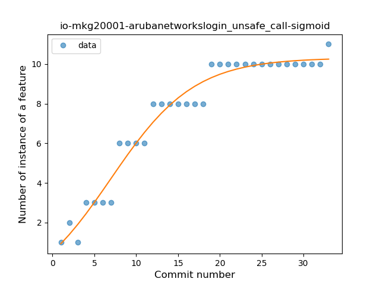

#### me-barta-stayintouch
* Feature: Extension Function
* Function: 
* R_Squared: 0.96506593
 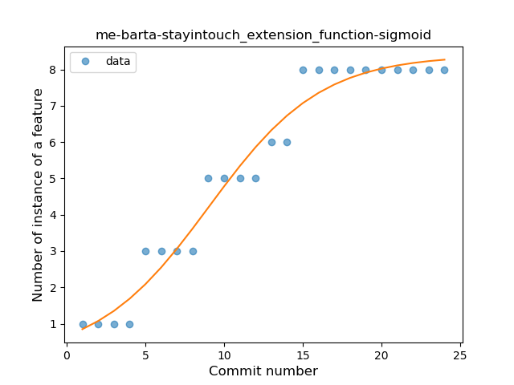

#### com-simplemobiletools-gallery-pro
* Feature: Smart Cast
* Function: 
* R_Squared: 0.96459846
 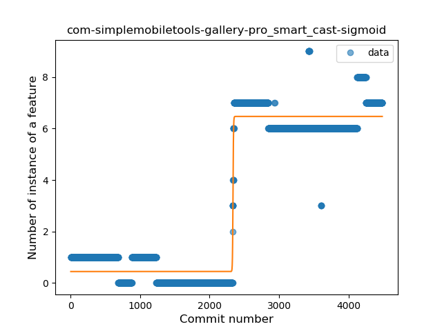

#### sk-styk-martin-apkanalyzer
* Feature: Property Delegation
* Function: 
* R_Squared: 0.96455963
 

#### com-keylesspalace-tusky
* Feature: String Template
* Function: 
* R_Squared: 0.96443924
 

#### com-log28
* Feature: String Template
* Function: 
* R_Squared: 0.96438011
 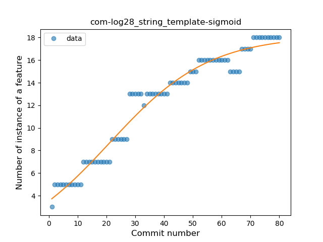

#### com-wabadaba-dziennik
* Feature: Extension Function
* Function: 
* R_Squared: 0.96429827
 

#### me-proxer-app
* Feature: Data Class
* Function: 
* R_Squared: 0.96389123
 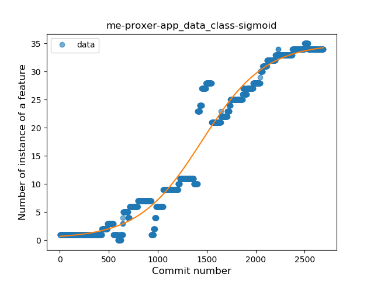

#### io-github-hidroh-materialistic
* Feature: Unsafe Call
* Function: 
* R_Squared: 0.96374728
 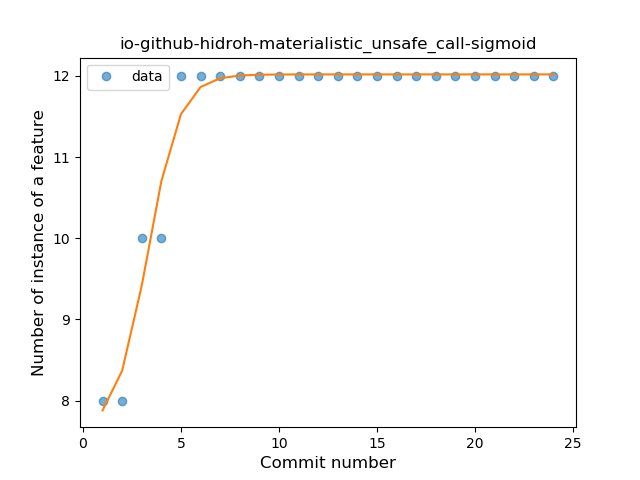

#### com-benoitletondor-easybudgetapp
* Feature: Coroutine
* Function: 
* R_Squared: 0.96364147
 

#### com-bijoysingh-quicknote
* Feature: Data Class
* Function: 
* R_Squared: 0.96358153
 

#### tk-superl2-xwifi
* Feature: String Template
* Function: 
* R_Squared: 0.96345395
 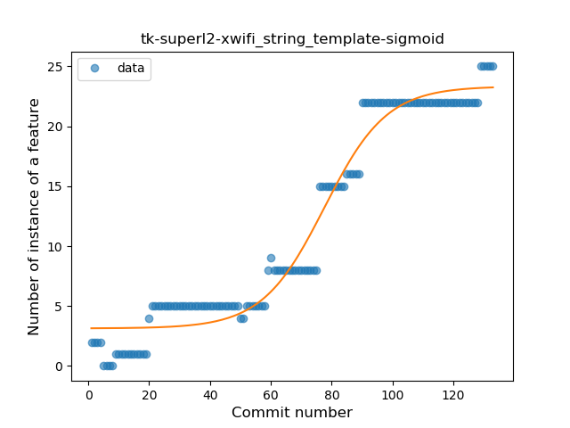

#### org-mozilla-focus
* Feature: Function with Default Value
* Function: 
* R_Squared: 0.96317471
 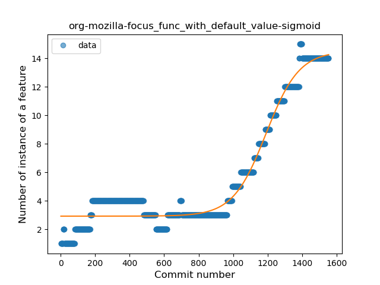

#### org-mozilla-klar
* Feature: Function with Default Value
* Function: 
* R_Squared: 0.96317471
 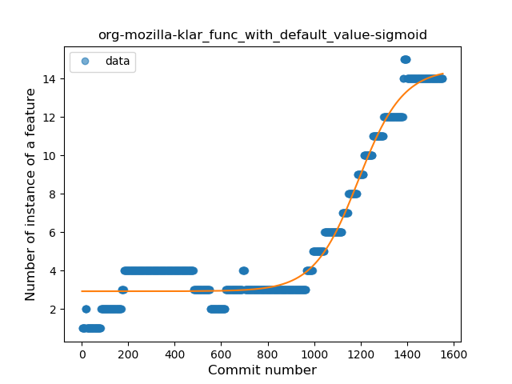

#### one-librem-social
* Feature: Range Expression
* Function: 
* R_Squared: 0.96257243
 

#### com-gimranov-zandy-app
* Feature: Lambda
* Function: 
* R_Squared: 0.96244947
 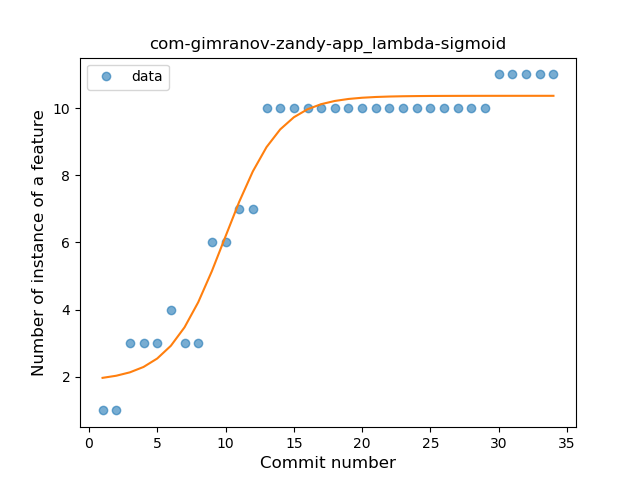

#### com-crane-mockappdemo
* Feature: Lambda
* Function: 
* R_Squared: 0.96235097
 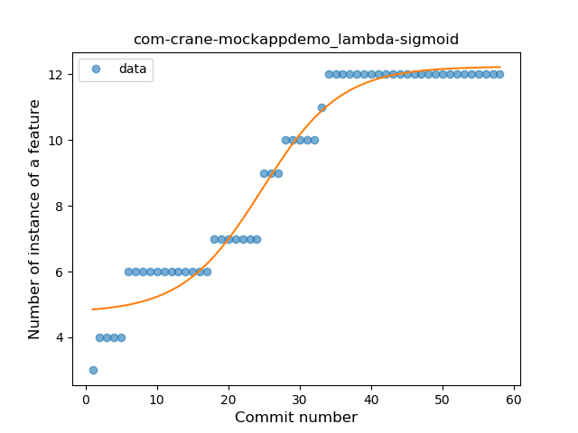

#### com-rhm-pwn
* Feature: Type Inference
* Function: 
* R_Squared: 0.9622561
 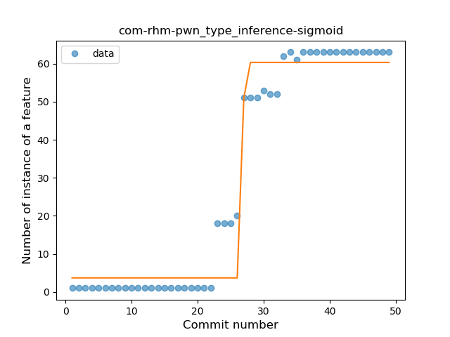

#### com-bijoysingh-quicknote
* Feature: String Template
* Function: 
* R_Squared: 0.96204809
 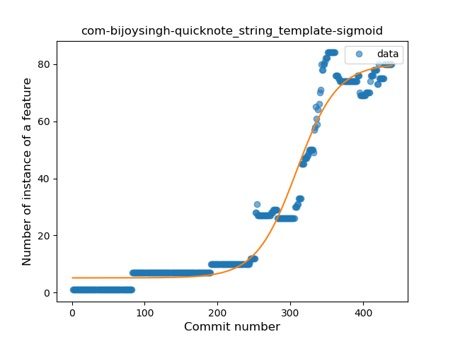

#### com-guerinet-mymartlet
* Feature: Destructuring Declaration
* Function: 
* R_Squared: 0.96199582
 

#### com-kgurgul-cpuinfo
* Feature: Function call with Named Argument
* Function: 
* R_Squared: 0.96190639
 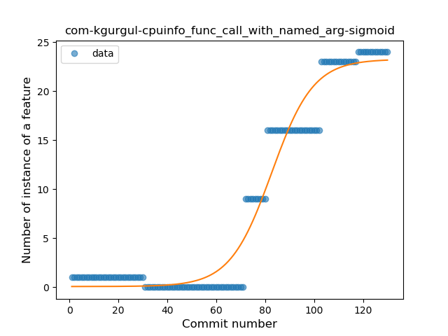

#### de-grobox-liberario
* Feature: Function with Default Value
* Function: 
* R_Squared: 0.96169495
 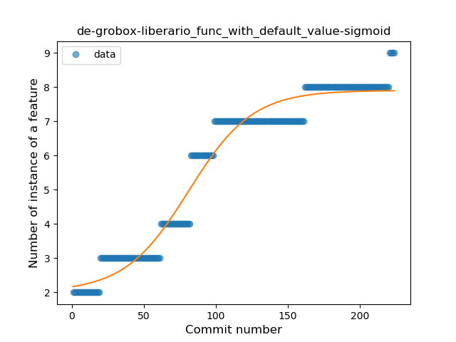

#### it-diab
* Feature: Function with Default Value
* Function: 
* R_Squared: 0.96163691
 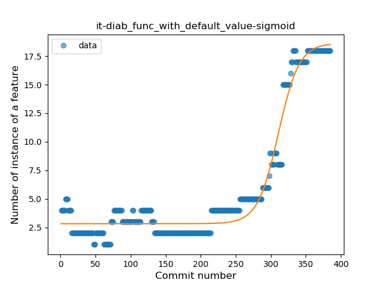

#### io-mkg20001-arubanetworkslogin
* Feature: Companion Object
* Function: 
* R_Squared: 0.96161805
 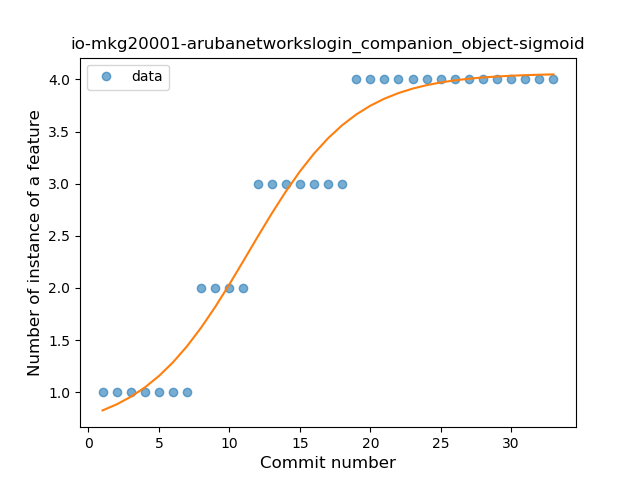

#### com-stevenschoen-putionew
* Feature: String Template
* Function: 
* R_Squared: 0.96141555
 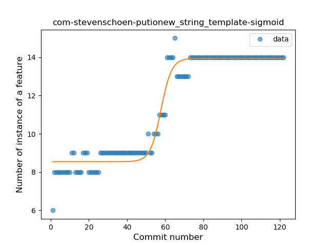

#### fr-cph-chicago-foss
* Feature: Smart Cast
* Function: 
* R_Squared: 0.96125239
 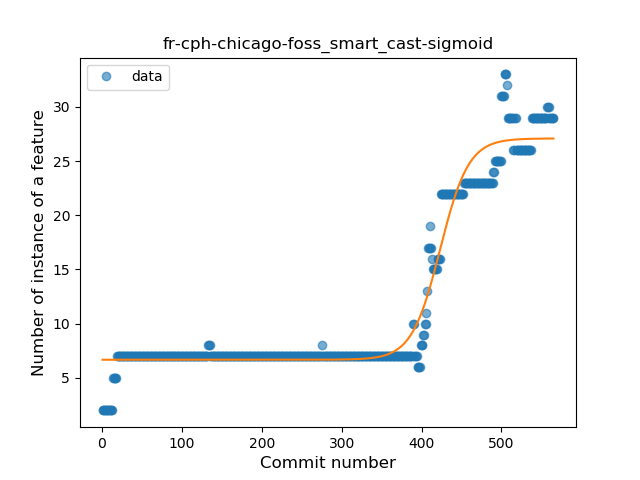

#### com-wbrawner-simplemarkdown
* Feature: String Template
* Function: 
* R_Squared: 0.96118731
 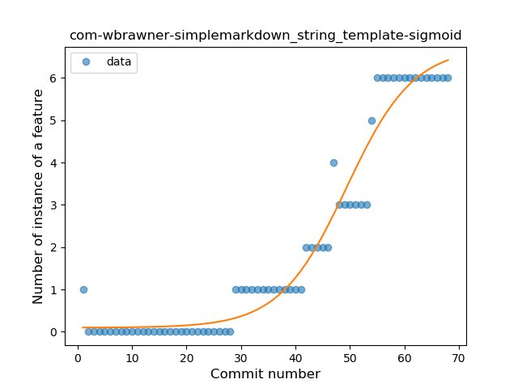

#### org-havenapp-main
* Feature: Lambda
* Function: 
* R_Squared: 0.96106354
 

#### com-rhm-pwn
* Feature: Safe Call
* Function: 
* R_Squared: 0.96095783
 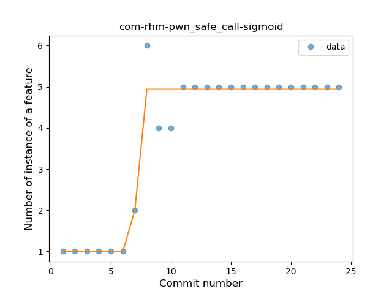

#### de-westnordost-streetcomplete
* Feature: Inline Function
* Function: 
* R_Squared: 0.96057765
 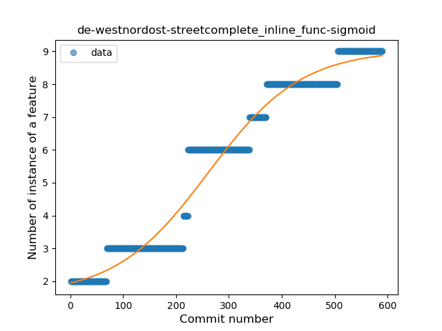

#### tk-superl2-xwifi
* Feature: Function with Default Value
* Function: 
* R_Squared: 0.96026242
 

#### com-zeapo-pwdstore
* Feature: Companion Object
* Function: 
* R_Squared: 0.95998271
 

#### se-barsk-park
* Feature: Function call with Named Argument
* Function: 
* R_Squared: 0.95987085
 

#### com-simplemobiletools-draw
* Feature: Lambda
* Function: 
* R_Squared: 0.95982485
 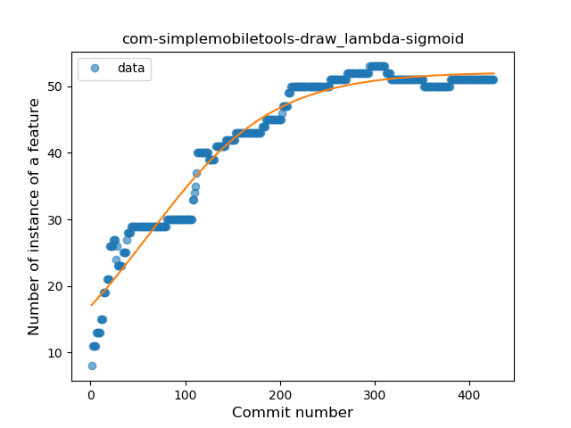

#### com-simplemobiletools-draw-pro
* Feature: Lambda
* Function: 
* R_Squared: 0.95982485
 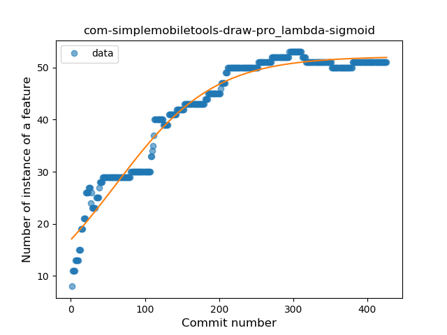

#### net-mm2d-dmsexplorer
* Feature: Smart Cast
* Function: 
* R_Squared: 0.95945971
 

#### nl-brouwerijdemolen-borefts2013
* Feature: Unsafe Call
* Function: 
* R_Squared: 0.95938547
 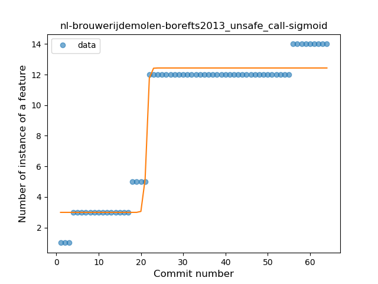

#### com-slash-batterychargelimit
* Feature: Smart Cast
* Function: 
* R_Squared: 0.95932224
 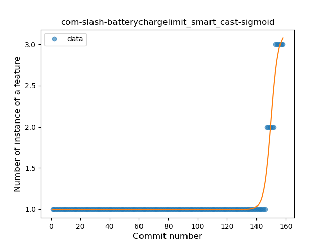

#### de-ironjan-mensaupb
* Feature: Companion Object
* Function: 
* R_Squared: 0.95914747
 

#### com-github-vase4kin-teamcityapp
* Feature: Smart Cast
* Function: 
* R_Squared: 0.95914159
 

#### com-fallgamlet-dnestrcinema
* Feature: Companion Object
* Function: 
* R_Squared: 0.95896662
 

#### com-mgaetan89-showsrage
* Feature: Extension Function
* Function: 
* R_Squared: 0.95869526
 

#### cat-pantsu-nyaapantsu
* Feature: String Template
* Function: 
* R_Squared: 0.95858849
 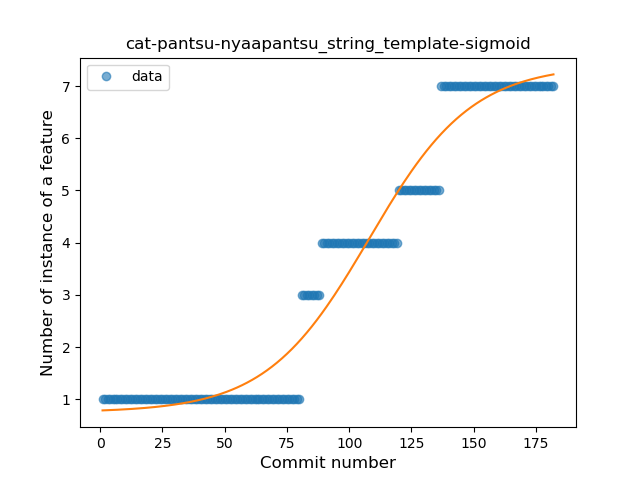

#### info-metadude-android-congress-schedule
* Feature: Lambda
* Function: 
* R_Squared: 0.95854787
 

#### de-blankedv-lanbahnpanel
* Feature: Function with Default Value
* Function: 
* R_Squared: 0.95841447
 

#### pt-ipleiria-mymusicqoe
* Feature: When expression
* Function: 
* R_Squared: 0.95826605
 

#### com-benoitletondor-easybudgetapp
* Feature: Unsafe Call
* Function: 
* R_Squared: 0.95825052
 

#### org-blokada-alarm
* Feature: When expression
* Function: 
* R_Squared: 0.95810987
 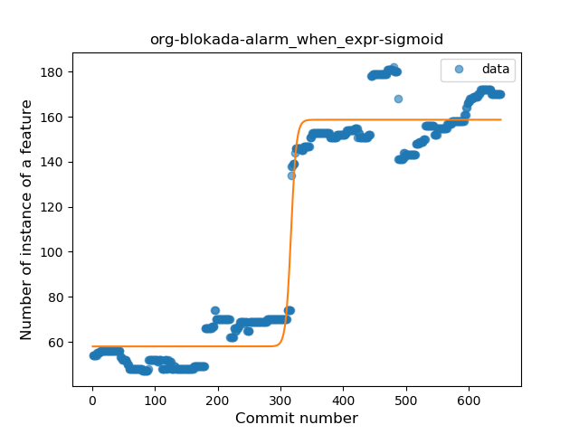

#### co-pxhouse-sas
* Feature: Property Delegation
* Function: 
* R_Squared: 0.95787491
 

#### com-github-premnirmal-tickerwidget
* Feature: When expression
* Function: 
* R_Squared: 0.95785095
 

#### de-markusfisch-android-binaryeye
* Feature: String Template
* Function: 
* R_Squared: 0.95771479
 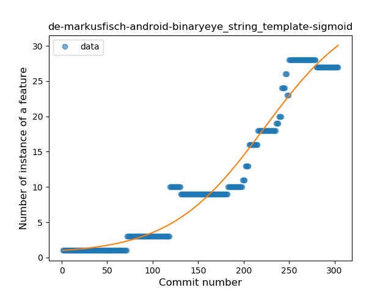

#### com-jmstudios-redmoon
* Feature: Extension Function
* Function: 
* R_Squared: 0.95766936
 

#### com-ninjahoahong-unstoppable
* Feature: Lambda
* Function: 
* R_Squared: 0.95766473
 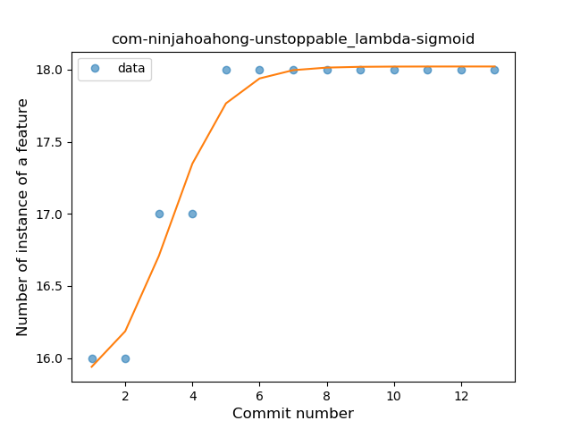

#### com-doctoror-particleswallpaper
* Feature: Destructuring Declaration
* Function: 
* R_Squared: 0.95728799
 

#### com-benoitletondor-easybudgetapp
* Feature: Companion Object
* Function: 
* R_Squared: 0.95705915
 

#### com-keylesspalace-tusky
* Feature: Destructuring Declaration
* Function: 
* R_Squared: 0.95701081
 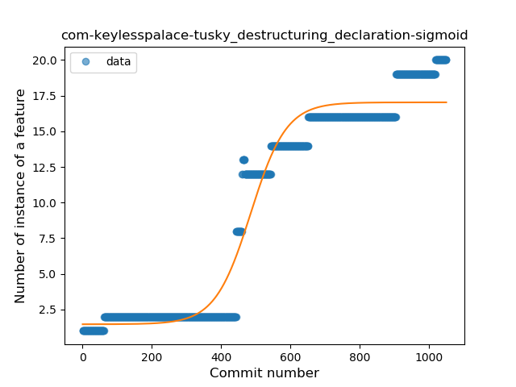

#### de-geeksfactory-opacclient
* Feature: Companion Object
* Function: 
* R_Squared: 0.95699232
 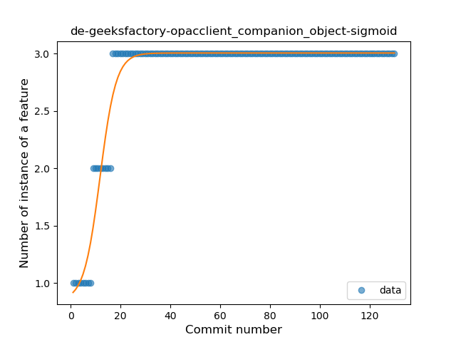

#### one-librem-social
* Feature: Destructuring Declaration
* Function: 
* R_Squared: 0.95679284
 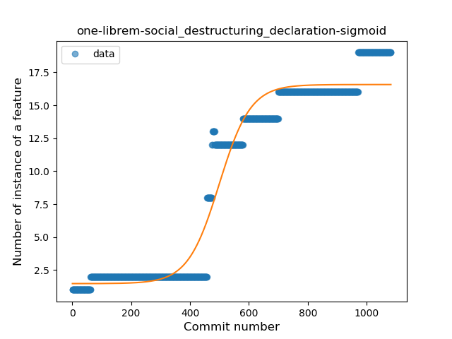

#### me-barta-stayintouch
* Feature: Safe Call
* Function: 
* R_Squared: 0.95665104
 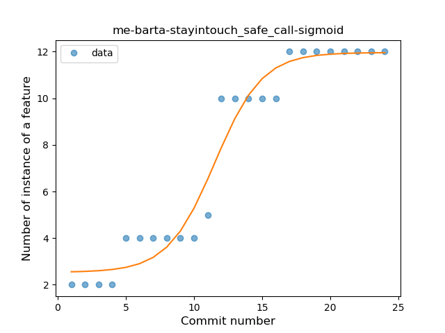

#### me-anon-grow
* Feature: Companion Object
* Function: 
* R_Squared: 0.95661204
 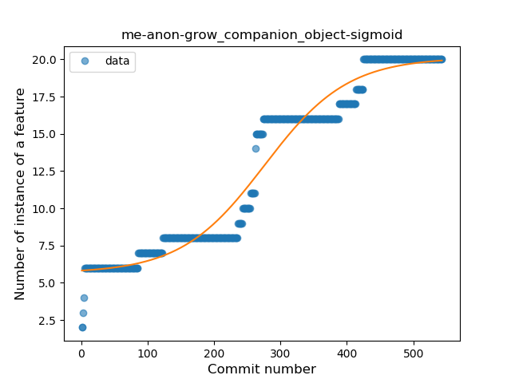

#### com-sjn-stamp
* Feature: Range Expression
* Function: 
* R_Squared: 0.95660757
 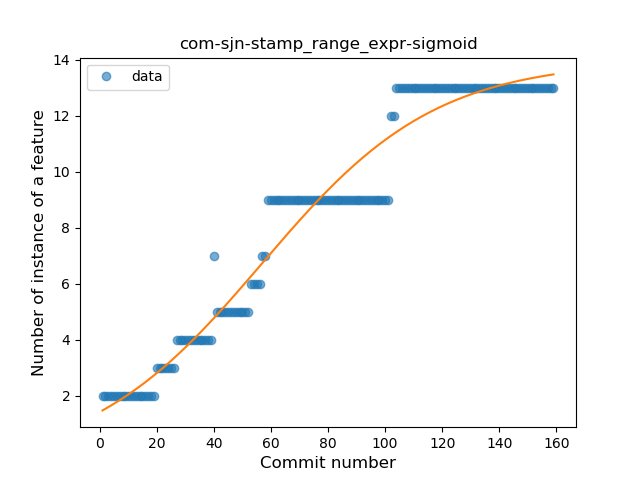

#### com-adityakamble49-dcipher
* Feature: Extension Function
* Function: 
* R_Squared: 0.95654716
 

#### com-benoitquenaudon-tvfoot-red
* Feature: Destructuring Declaration
* Function: 
* R_Squared: 0.95643442
 

#### com-whiterabbit-pisabike
* Feature: When expression
* Function: 
* R_Squared: 0.9559322
 

#### de-avpptr-umweltzone
* Feature: Unsafe Call
* Function: 
* R_Squared: 0.9558945
 

#### com-lavadip-miniVector
* Feature: String Template
* Function: 
* R_Squared: 0.95588307
 

#### com-whiterabbit-pisabike
* Feature: Data Class
* Function: 
* R_Squared: 0.95581472
 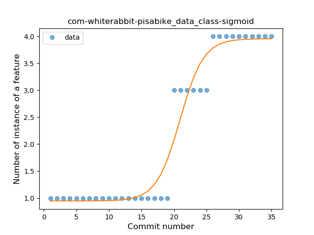

#### se-creotec-chscardbalance2
* Feature: When expression
* Function: 
* R_Squared: 0.95563948
 

#### se-creotec-chscardbalance2
* Feature: Smart Cast
* Function: 
* R_Squared: 0.9554923
 

#### pl-temomuko-autostoprace
* Feature: Safe Call
* Function: 
* R_Squared: 0.95544526
 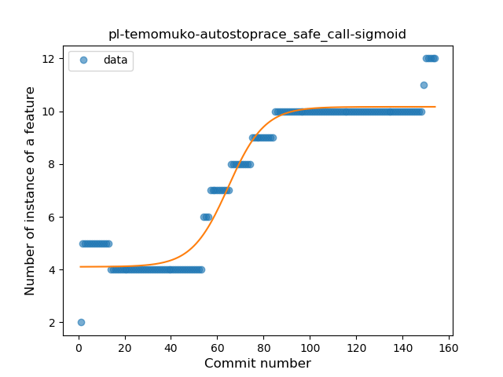

#### im-vector-alpha
* Feature: String Template
* Function: 
* R_Squared: 0.95528513
 

#### pl-temomuko-autostoprace
* Feature: Function call with Named Argument
* Function: 
* R_Squared: 0.95523789
 

#### org-mozilla-focus
* Feature: Data Class
* Function: 
* R_Squared: 0.95522033
 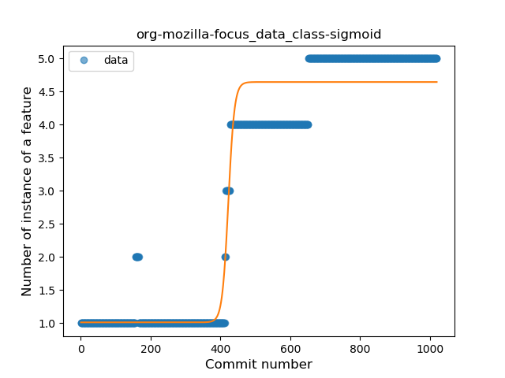

#### org-mozilla-klar
* Feature: Data Class
* Function: 
* R_Squared: 0.95522033
 

#### com-cookiegames-smartcookie
* Feature: Unsafe Call
* Function: 
* R_Squared: 0.95520953
 

#### org-freedombox-freedombox
* Feature: Unsafe Call
* Function: 
* R_Squared: 0.9551842
 

#### net-mm2d-dmsexplorer
* Feature: String Template
* Function: 
* R_Squared: 0.95517105
 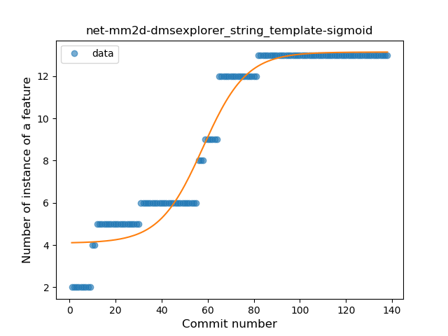

#### com-whiterabbit-pisabike
* Feature: Lambda
* Function: 
* R_Squared: 0.95514015
 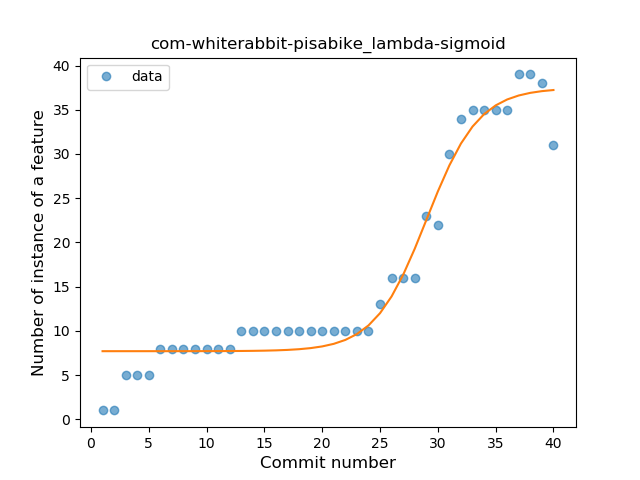

#### fr-chenry-android-freshrss
* Feature: Function call with Named Argument
* Function: 
* R_Squared: 0.95512798
 

#### me-blog-korn123-easydiary
* Feature: Function with Default Value
* Function: 
* R_Squared: 0.95474991
 

#### com-github-cvzi-screenshottile
* Feature: Function with Default Value
* Function: 
* R_Squared: 0.95409648
 

#### org-zimmob-zimlx
* Feature: Inline Function
* Function: 
* R_Squared: 0.95406189
 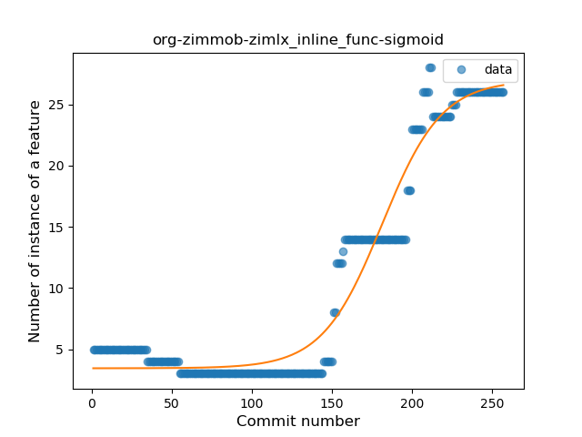

#### com-nononsenseapps-feeder
* Feature: Singleton
* Function: 
* R_Squared: 0.95385564
 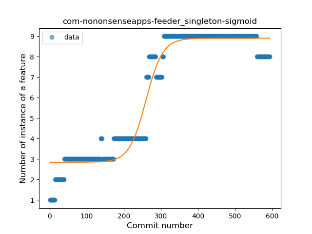

#### io-ipoli-android
* Feature: Inline Function
* Function: 
* R_Squared: 0.95385141
 

#### com-duckduckgo-mobile-android
* Feature: Coroutine
* Function: 
* R_Squared: 0.95383247
 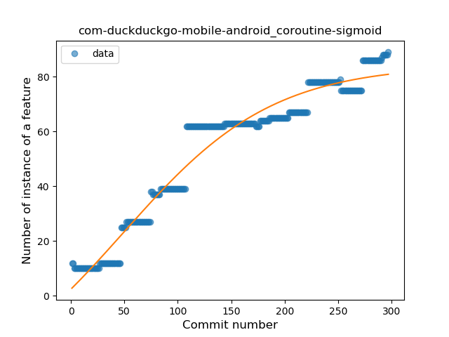

#### com-jim-sharetocomputer
* Feature: Coroutine
* Function: 
* R_Squared: 0.9537628
 

#### is-xyz-omw
* Feature: Range Expression
* Function: 
* R_Squared: 0.95356433
 

#### me-camsteffen-polite
* Feature: Extension Function
* Function: 
* R_Squared: 0.9534691
 

#### io-github-fvasco-pinpoi
* Feature: Function call with Named Argument
* Function: 
* R_Squared: 0.95340947
 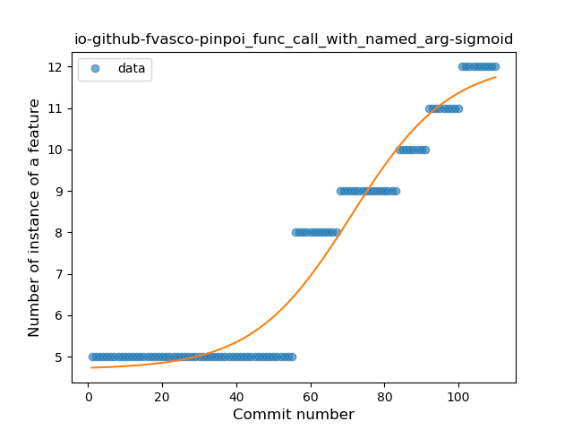

#### com-tasomaniac-openwith-floss
* Feature: Smart Cast
* Function: 
* R_Squared: 0.95333569
 

#### de-r4md4c-gamedealz
* Feature: Companion Object
* Function: 
* R_Squared: 0.95316717
 

#### org-mosad-seil0-projectlaogai
* Feature: Companion Object
* Function: 
* R_Squared: 0.95286719
 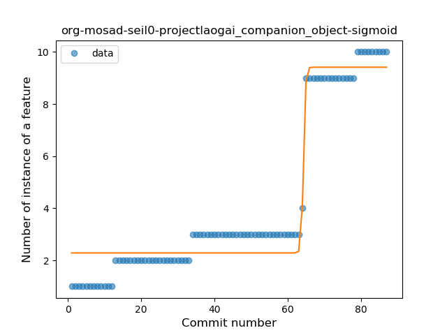

#### org-mozilla-focus
* Feature: Range Expression
* Function: 
* R_Squared: 0.95257877
 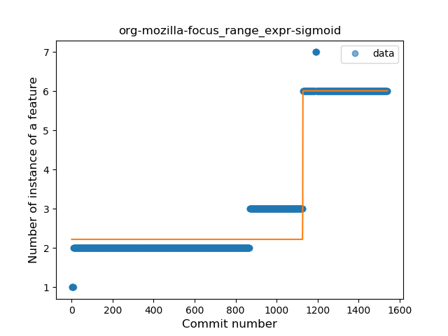

#### org-mozilla-klar
* Feature: Range Expression
* Function: 
* R_Squared: 0.95257877
 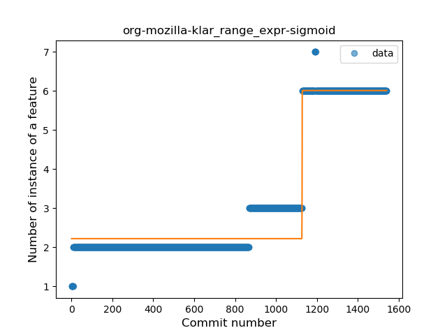

#### com-uncmorfi
* Feature: When expression
* Function: 
* R_Squared: 0.95257607
 

#### de-Maxr1998-xposed-maxlock
* Feature: Function with Default Value
* Function: 
* R_Squared: 0.95239864
 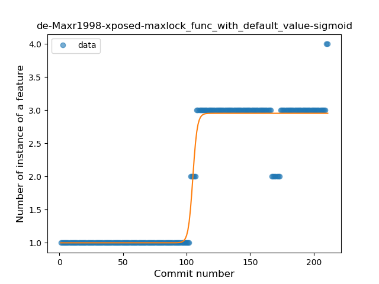

#### com-atanana-sicounter
* Feature: Destructuring Declaration
* Function: 
* R_Squared: 0.95195891
 

#### org-isoron-uhabits
* Feature: Range Expression
* Function: 
* R_Squared: 0.95190791
 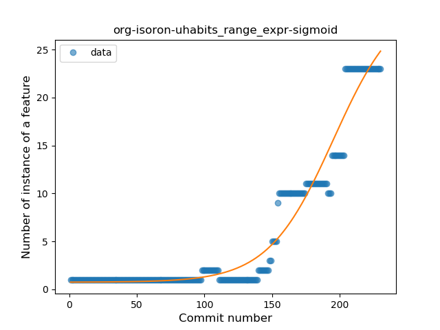

#### com-sjn-stamp
* Feature: Overloaded Operator
* Function: 
* R_Squared: 0.95179675
 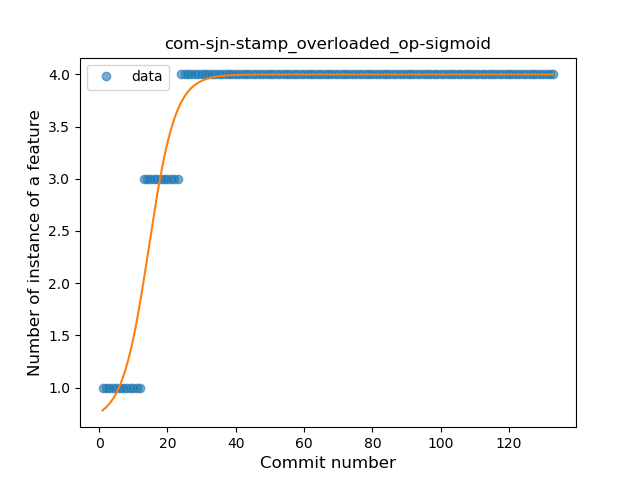

#### be-mygod-vpnhotspot
* Feature: Extension Function
* Function: 
* R_Squared: 0.95179565
 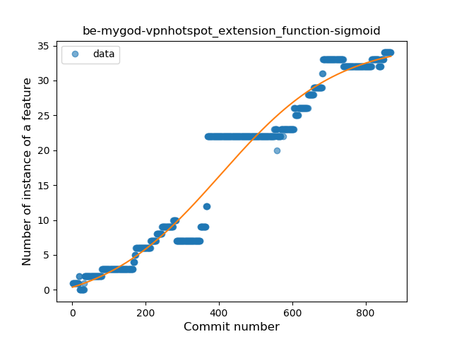

#### com-utazukin-ichaival
* Feature: Property Delegation
* Function: 
* R_Squared: 0.95121864
 

#### de-blankedv-lanbahnpanel
* Feature: When expression
* Function: 
* R_Squared: 0.95118342
 

#### de-Maxr1998-xposed-maxlock
* Feature: Singleton
* Function: 
* R_Squared: 0.95098158
 

#### com-bijoysingh-quicknote
* Feature: Smart Cast
* Function: 
* R_Squared: 0.95097956
 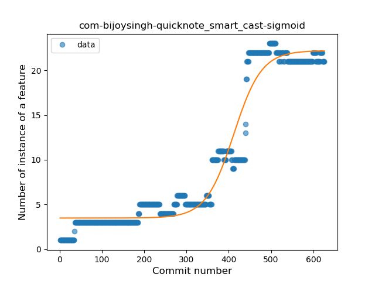

#### apps-amine-bou-readerforselfoss
* Feature: Companion Object
* Function: 
* R_Squared: 0.95090738
 

#### org-ligi-survivalmanual
* Feature: String Template
* Function: 
* R_Squared: 0.95072192
 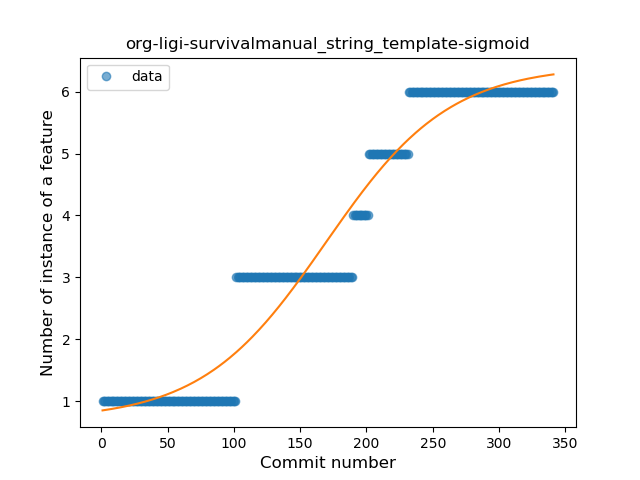

#### com-tutpro-baresip
* Feature: Companion Object
* Function: 
* R_Squared: 0.95068712
 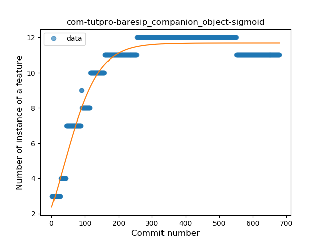

#### it-diab
* Feature: Smart Cast
* Function: 
* R_Squared: 0.95056445
 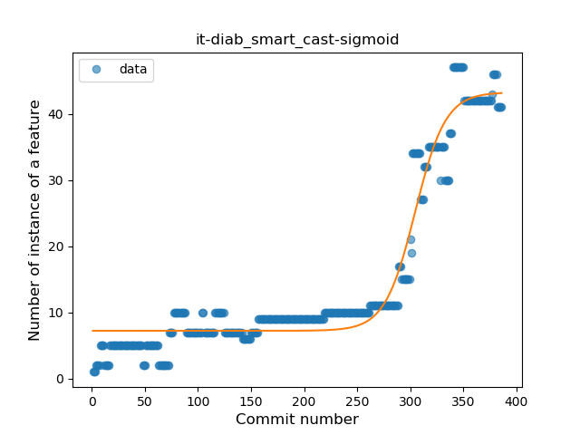

#### org-sanpra-checklist
* Feature: Lambda
* Function: 
* R_Squared: 0.9502496
 

#### chat-rocket-android
* Feature: Destructuring Declaration
* Function: 
* R_Squared: 0.95021141
 

#### com-github-moko256-twitlatte
* Feature: Companion Object
* Function: 
* R_Squared: 0.95009833
 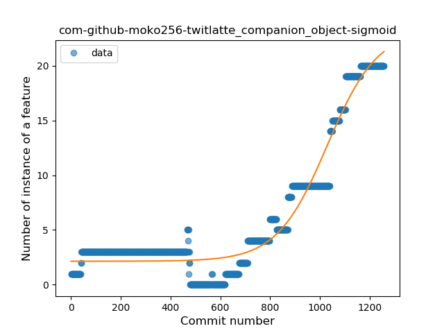

#### de-avpptr-umweltzone
* Feature: Data Class
* Function: 
* R_Squared: 0.94987725
 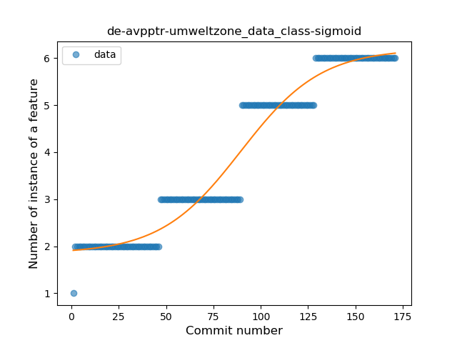

#### org-zimmob-zimlx
* Feature: Super Delegation
* Function: 
* R_Squared: 0.94971365
 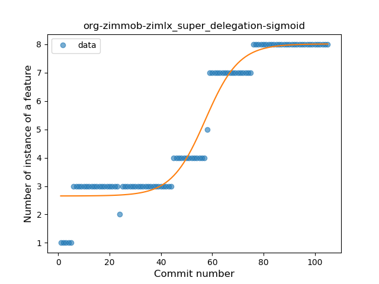

#### apps-amine-bou-readerforselfoss
* Feature: Data Class
* Function: 
* R_Squared: 0.94954704
 

#### info-metadude-android-congress-schedule
* Feature: When expression
* Function: 
* R_Squared: 0.94939343
 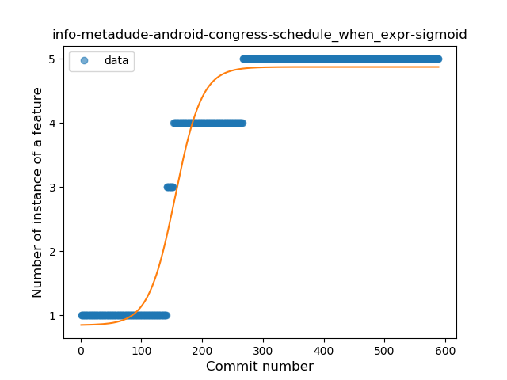

#### app-opass-ccip
* Feature: Destructuring Declaration
* Function: 
* R_Squared: 0.94932475
 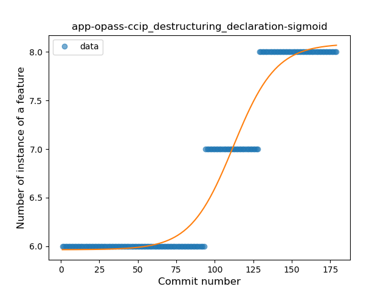

#### com-simplemobiletools-notes-pro
* Feature: Function with Default Value
* Function: 
* R_Squared: 0.94919642
 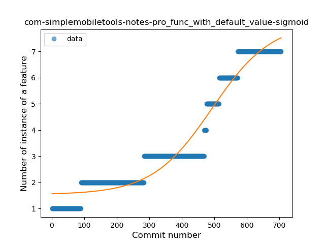

#### com-ogsdroid
* Feature: When expression
* Function: 
* R_Squared: 0.94898724
 

#### net-bible-android-activity
* Feature: When expression
* Function: 
* R_Squared: 0.94879775
 

#### nl-mpcjanssen-simpletask
* Feature: Extension Function
* Function: 
* R_Squared: 0.94876384
 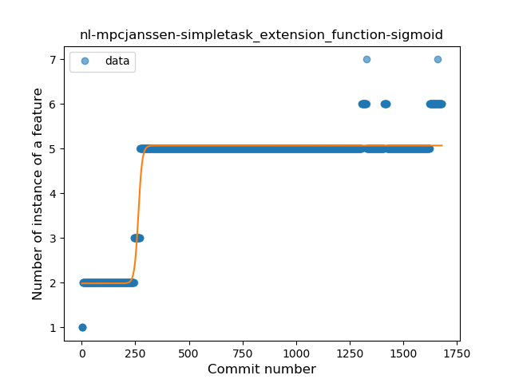

#### info-metadude-android-congress-schedule
* Feature: Unsafe Call
* Function: 
* R_Squared: 0.94873271
 

#### com-doctoror-particleswallpaper
* Feature: Data Class
* Function: 
* R_Squared: 0.94855328
 

#### com-simplemobiletools-filemanager-pro
* Feature: String Template
* Function: 
* R_Squared: 0.94840779
 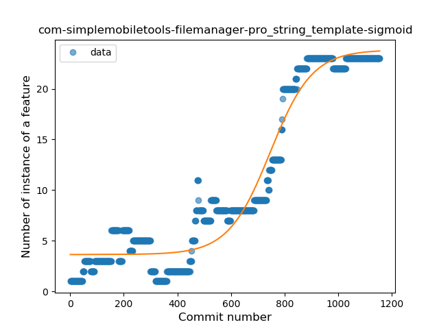

#### com-nextcloud-talk2
* Feature: Function with Default Value
* Function: 
* R_Squared: 0.94810842
 

#### org-blokada-alarm
* Feature: Range Expression
* Function: 
* R_Squared: 0.94783939
 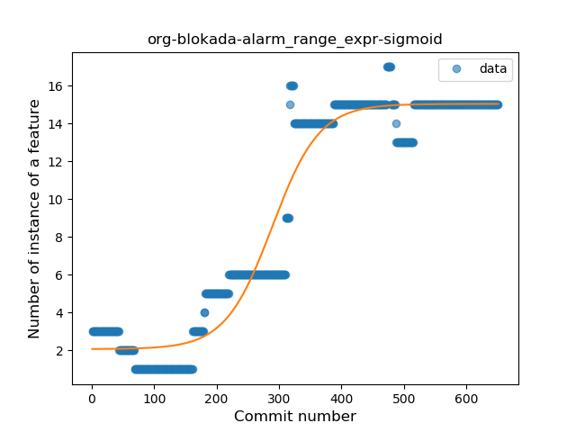

#### com-enjoyingfoss-om
* Feature: Lambda
* Function: 
* R_Squared: 0.94781898
 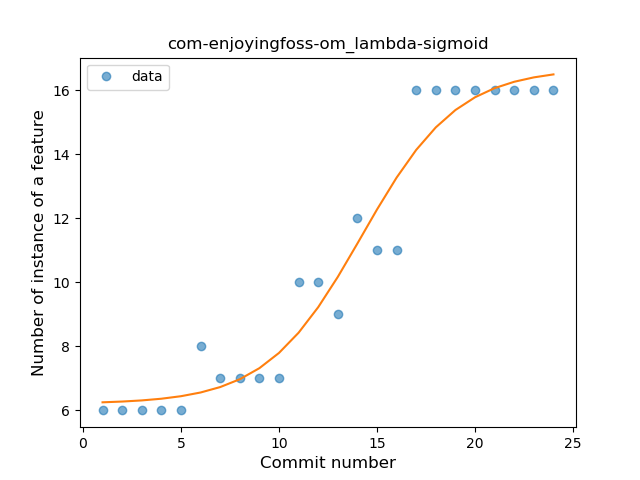

#### com-epimorphics-android-myrivers
* Feature: Data Class
* Function: 
* R_Squared: 0.94776905
 

#### at-bitfire-davdroid
* Feature: Function with Default Value
* Function: 
* R_Squared: 0.947706
 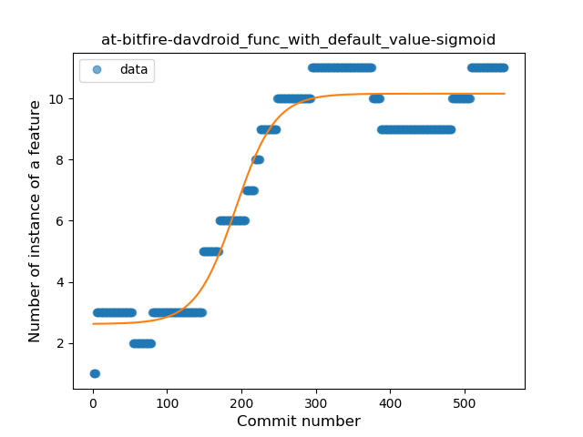

#### com-pluscubed-velociraptor
* Feature: When expression
* Function: 
* R_Squared: 0.94695255
 

#### com-boardgamegeek
* Feature: Sealed Class
* Function: 
* R_Squared: 0.94682931
 

#### fr-openium-auvergnewebcams
* Feature: String Template
* Function: 
* R_Squared: 0.94679812
 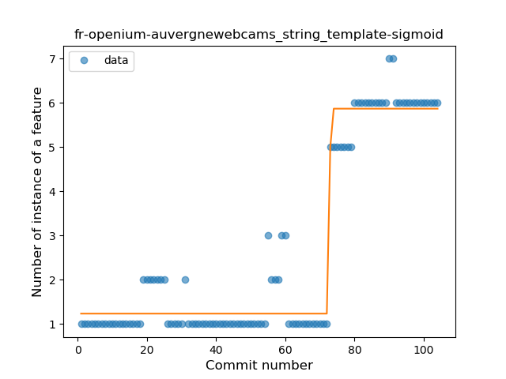

#### pl-org-seva-texter
* Feature: String Template
* Function: 
* R_Squared: 0.9459372
 

#### com-dp-logcatapp
* Feature: Coroutine
* Function: 
* R_Squared: 0.9459107
 

#### com-stevenschoen-putionew
* Feature: Safe Call
* Function: 
* R_Squared: 0.94582186
 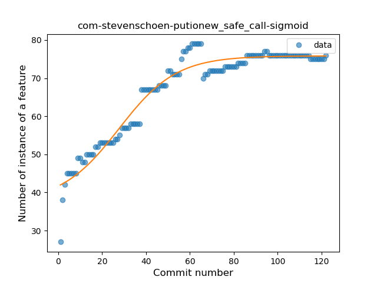

#### com-motion-stage1
* Feature: Range Expression
* Function: 
* R_Squared: 0.94580871
 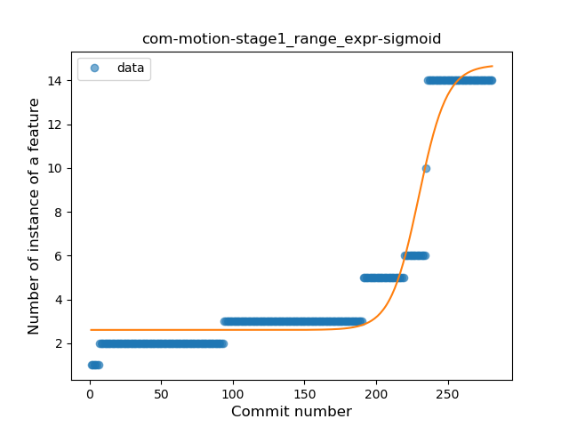

#### im-vector-alpha
* Feature: Range Expression
* Function: 
* R_Squared: 0.94567332
 

#### me-impa-knockonports
* Feature: Singleton
* Function: 
* R_Squared: 0.94561898
 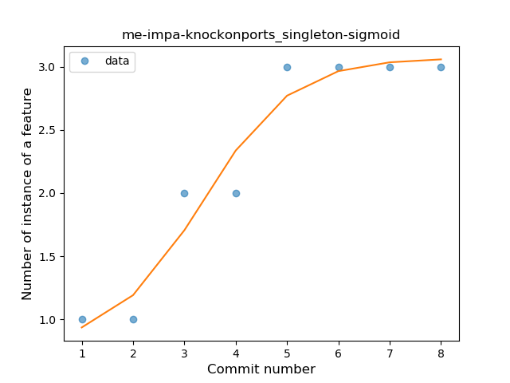

#### com-lavadip-miniVector
* Feature: Range Expression
* Function: 
* R_Squared: 0.9455827
 

#### com-scientists-happy-botanist
* Feature: Lambda
* Function: 
* R_Squared: 0.94555731
 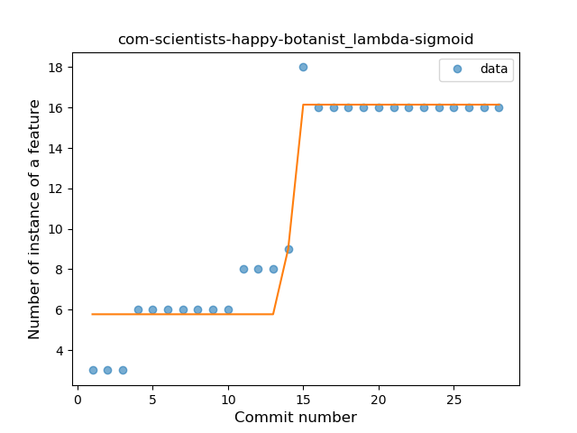

#### net-syncthing-lite
* Feature: Sealed Class
* Function: 
* R_Squared: 0.94513628
 

#### pl-hypeapp-episodie
* Feature: Inline Function
* Function: 
* R_Squared: 0.94510928
 

#### cat-pantsu-nyaapantsu
* Feature: Property Delegation
* Function: 
* R_Squared: 0.94509273
 

#### com-dp-logcatapp
* Feature: Overloaded Operator
* Function: 
* R_Squared: 0.94486798
 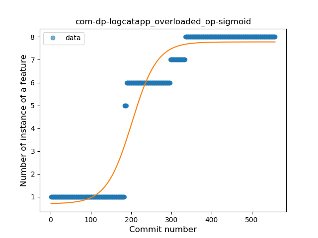

#### fr-cph-chicago-foss
* Feature: Function call with Named Argument
* Function: 
* R_Squared: 0.94453241
 

#### se-creotec-chscardbalance2
* Feature: Companion Object
* Function: 
* R_Squared: 0.94420638
 

#### app-opass-ccip
* Feature: String Template
* Function: 
* R_Squared: 0.94402316
 

#### com-simplemobiletools-draw
* Feature: When expression
* Function: 
* R_Squared: 0.9438784
 

#### com-simplemobiletools-draw-pro
* Feature: When expression
* Function: 
* R_Squared: 0.9438784
 

#### com-heed-justquotes
* Feature: String Template
* Function: 
* R_Squared: 0.94365549
 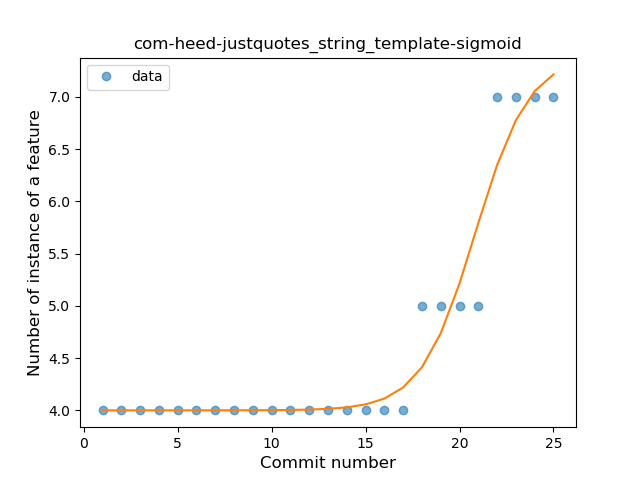

#### com-booboot-vndbandroid
* Feature: Inline Function
* Function: 
* R_Squared: 0.94331006
 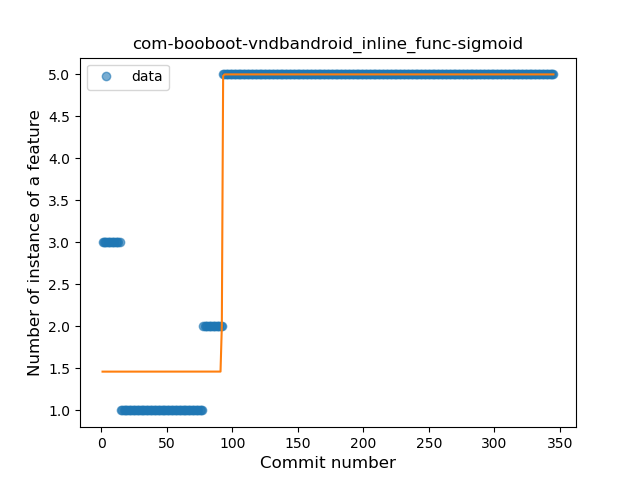

#### com-simplemobiletools-calendar-pro
* Feature: When expression
* Function: 
* R_Squared: 0.94306546
 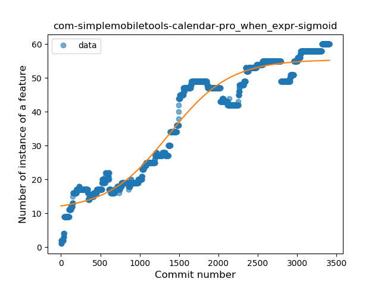

#### com-uncmorfi
* Feature: Companion Object
* Function: 
* R_Squared: 0.94300139
 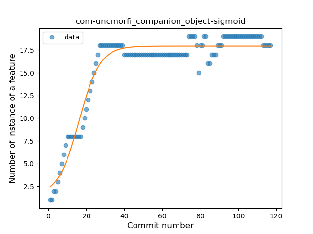

#### com-benoitquenaudon-tvfoot-red
* Feature: Data Class
* Function: 
* R_Squared: 0.94295701
 

#### org-zimmob-zimlx
* Feature: Data Class
* Function: 
* R_Squared: 0.94280693
 

#### de-markusfisch-android-binaryeye
* Feature: Extension Function
* Function: 
* R_Squared: 0.94274447
 

#### com-pitchedapps-frost
* Feature: Range Expression
* Function: 
* R_Squared: 0.94254275
 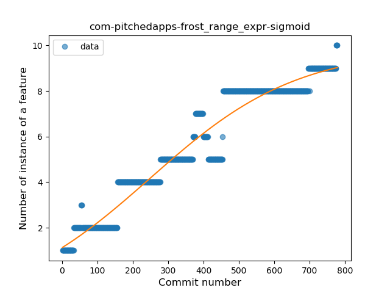

#### com-fastaccess-github-libre
* Feature: Singleton
* Function: 
* R_Squared: 0.94231992
 

#### com-tasomaniac-openwith-floss
* Feature: Data Class
* Function: 
* R_Squared: 0.9420861
 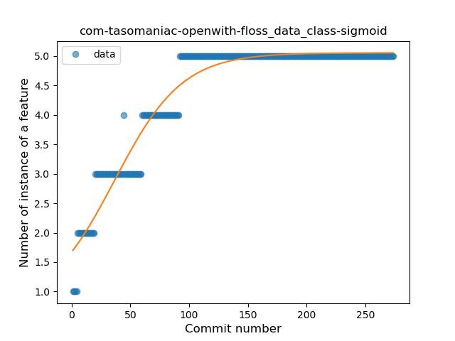

#### com-github-cvzi-screenshottile
* Feature: When expression
* Function: 
* R_Squared: 0.94192818
 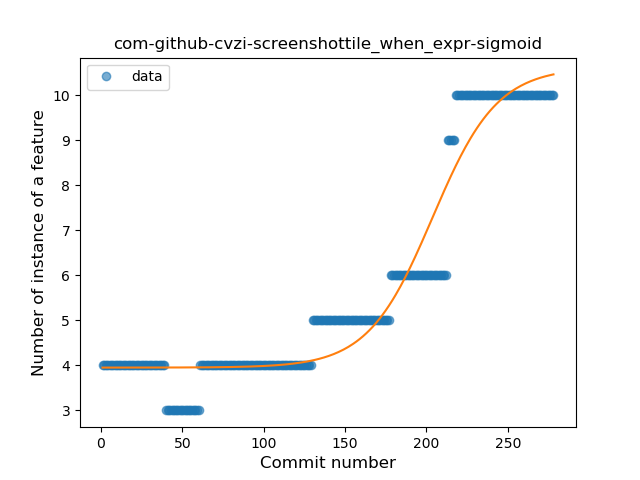

#### com-simplemobiletools-clock
* Feature: Companion Object
* Function: 
* R_Squared: 0.94099734
 

#### de-markusfisch-android-binaryeye
* Feature: Data Class
* Function: 
* R_Squared: 0.94097257
 

#### de-r4md4c-gamedealz
* Feature: Type Alias
* Function: 
* R_Squared: 0.94032994
 

#### net-mm2d-android-vmb
* Feature: Singleton
* Function: 
* R_Squared: 0.93985767
 

#### com-log28
* Feature: Extension Function
* Function: 
* R_Squared: 0.93981093
 

#### org-moire-ultrasonic
* Feature: When expression
* Function: 
* R_Squared: 0.93937981
 

#### org-ligi-passandroid
* Feature: Function with Default Value
* Function: 
* R_Squared: 0.9393536
 

#### li-klass-fhem
* Feature: Overloaded Operator
* Function: 
* R_Squared: 0.93925829
 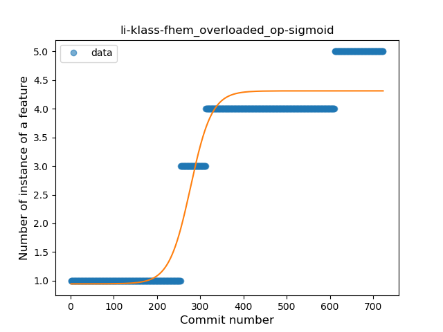

#### be-mygod-vpnhotspot
* Feature: Data Class
* Function: 
* R_Squared: 0.93917345
 

#### fr-cph-chicago-foss
* Feature: When expression
* Function: 
* R_Squared: 0.93887242
 

#### me-kirimin-mitsumine
* Feature: Data Class
* Function: 
* R_Squared: 0.93848789
 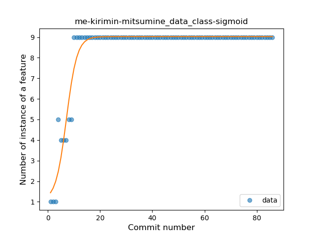

#### com-example-forgottenumbrella-cardboardmuseum
* Feature: Extension Function
* Function: 
* R_Squared: 0.93845735
 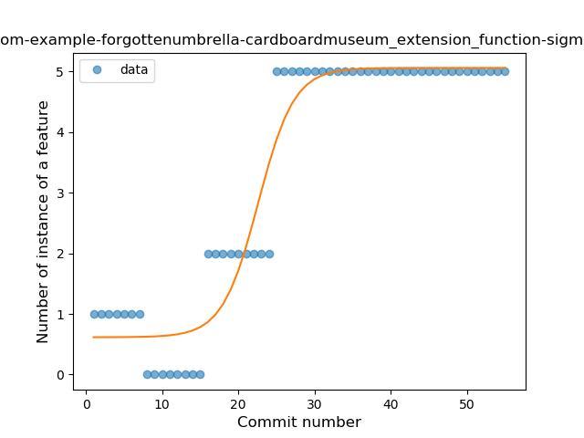

#### com-pitchedapps-frost
* Feature: Smart Cast
* Function: 
* R_Squared: 0.9383665
 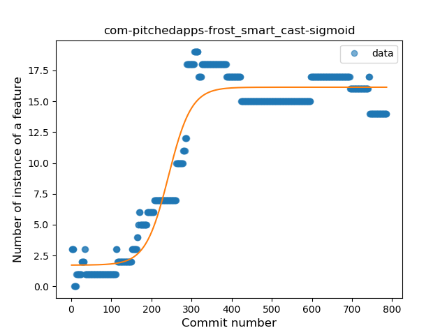

#### com-github-laurenttreguier-deck
* Feature: Companion Object
* Function: 
* R_Squared: 0.93805677
 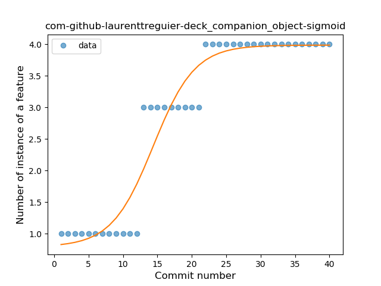

#### com-nao20010128nao-DroidComplex
* Feature: Inline Function
* Function: 
* R_Squared: 0.93786094
 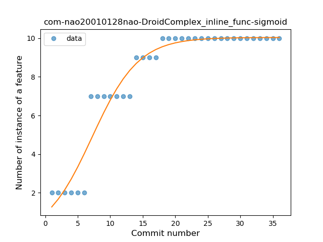

#### com-esafirm-androidplayground
* Feature: Property Delegation
* Function: 
* R_Squared: 0.93771451
 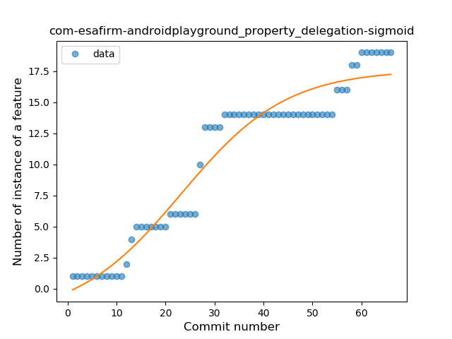

#### com-wabadaba-dziennik
* Feature: When expression
* Function: 
* R_Squared: 0.93764236
 

#### pw-janyo-whatanime
* Feature: String Template
* Function: 
* R_Squared: 0.93692955
 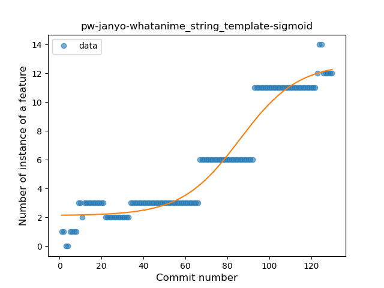

#### ca-rmen-android-poetassistant
* Feature: Data Class
* Function: 
* R_Squared: 0.93679322
 

#### com-github-laurenttreguier-deck
* Feature: Unsafe Call
* Function: 
* R_Squared: 0.9367828
 

#### ai-susi
* Feature: Function call with Named Argument
* Function: 
* R_Squared: 0.9366953
 

#### org-poul-bits-android
* Feature: When expression
* Function: 
* R_Squared: 0.93640611
 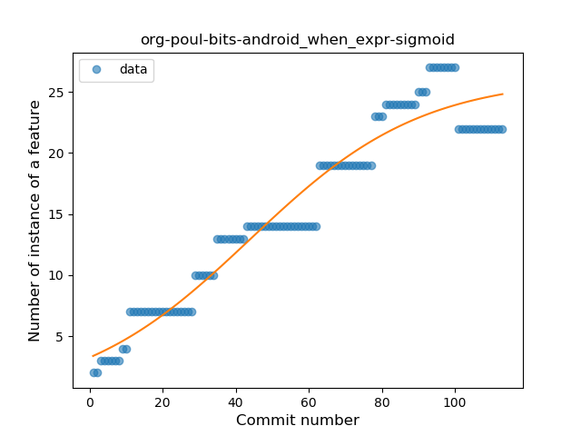

#### org-poul-bits-android
* Feature: Singleton
* Function: 
* R_Squared: 0.93619634
 

#### com-adityakamble49-ttl
* Feature: Extension Function
* Function: 
* R_Squared: 0.93555889
 

#### com-jmstudios-redmoon
* Feature: Destructuring Declaration
* Function: 
* R_Squared: 0.93511467
 

#### org-mozilla-rocket
* Feature: Super Delegation
* Function: 
* R_Squared: 0.93492806
 

#### fr-free-nrw-commons
* Feature: Range Expression
* Function: 
* R_Squared: 0.93475599
 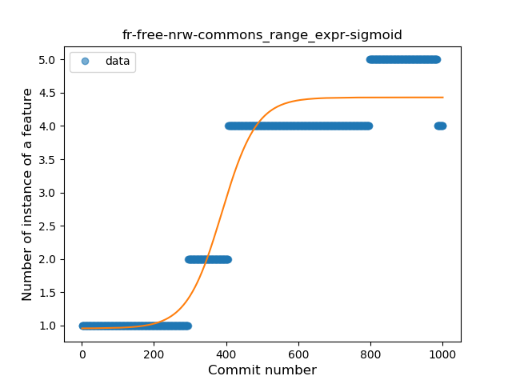

#### net-mm2d-android-vmb
* Feature: Function with Default Value
* Function: 
* R_Squared: 0.93461082
 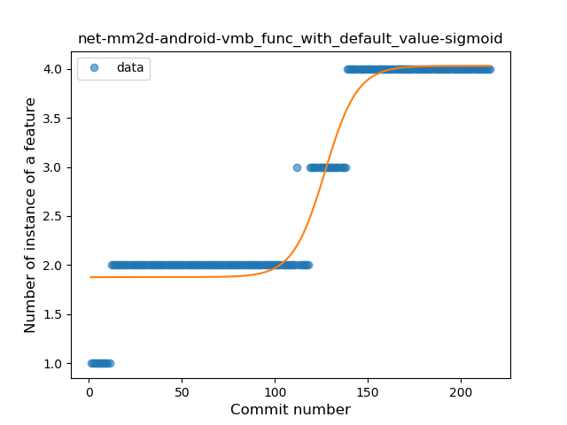

#### com-epimorphics-android-myrivers
* Feature: String Template
* Function: 
* R_Squared: 0.93444449
 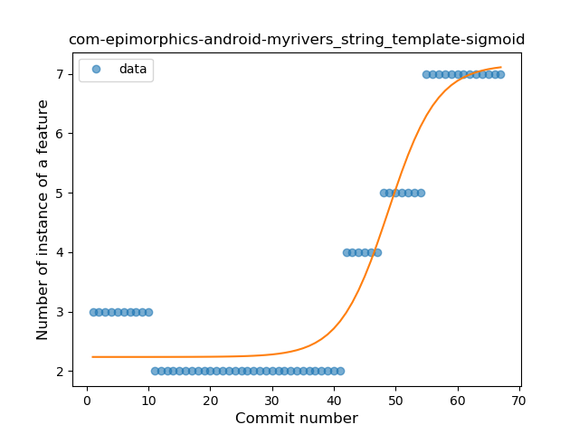

#### pl-temomuko-autostoprace
* Feature: Extension Function
* Function: 
* R_Squared: 0.93415625
 

#### org-pacien-tincapp
* Feature: String Template
* Function: 
* R_Squared: 0.93401177
 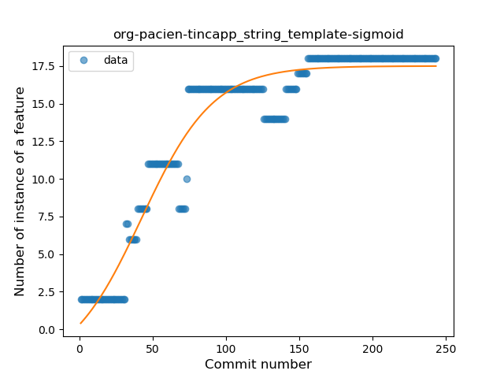

#### de-thecode-android-tazreader
* Feature: Companion Object
* Function: 
* R_Squared: 0.93392404
 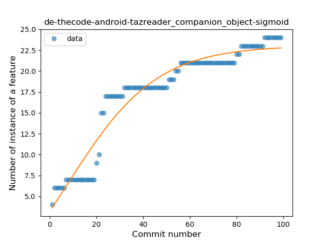

#### net-yslibrary-monotweety
* Feature: Unsafe Call
* Function: 
* R_Squared: 0.93349081
 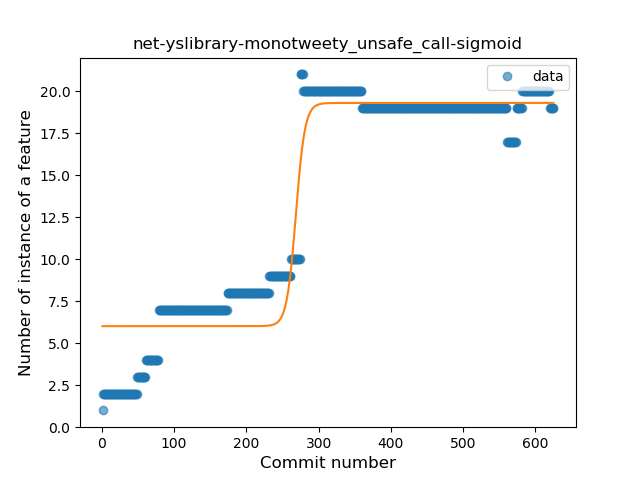

#### nl-brouwerijdemolen-borefts2013
* Feature: Smart Cast
* Function: 
* R_Squared: 0.93307917
 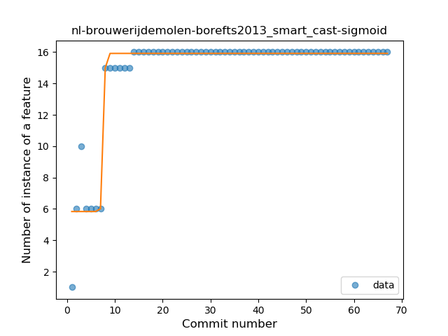

#### de-thecode-android-tazreader
* Feature: When expression
* Function: 
* R_Squared: 0.93212951
 

#### com-guerinet-mymartlet
* Feature: Smart Cast
* Function: 
* R_Squared: 0.93187932
 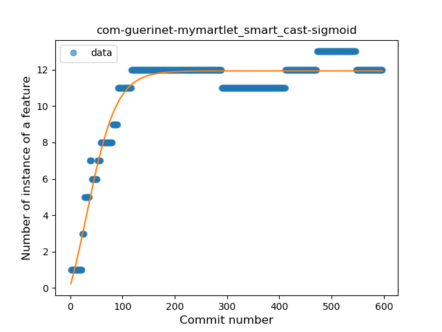

#### com-jim-sharetocomputer
* Feature: Range Expression
* Function: 
* R_Squared: 0.93176469
 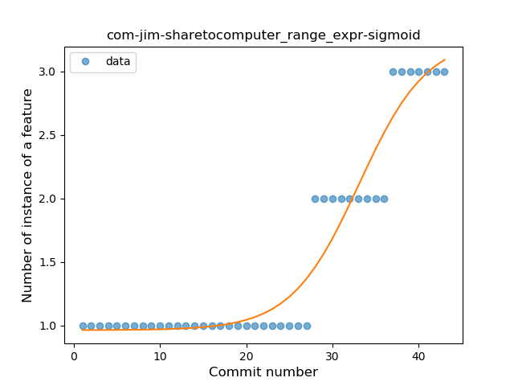

#### pl-temomuko-autostoprace
* Feature: Data Class
* Function: 
* R_Squared: 0.93134481
 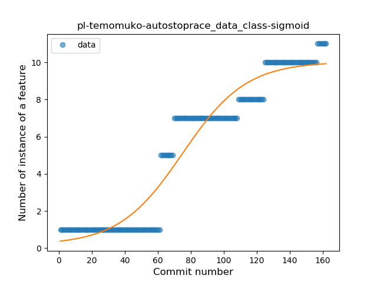

#### com-phicdy-totoanticipation
* Feature: Singleton
* Function: 
* R_Squared: 0.93127979
 

#### info-papdt-express-helper
* Feature: Function call with Named Argument
* Function: 
* R_Squared: 0.93110717
 

#### org-isoron-uhabits
* Feature: Singleton
* Function: 
* R_Squared: 0.93093083
 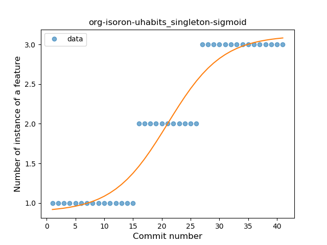

#### pw-janyo-whatanime
* Feature: Property Delegation
* Function: 
* R_Squared: 0.93067622
 

#### com-fallgamlet-dnestrcinema
* Feature: Singleton
* Function: 
* R_Squared: 0.93056246
 

#### jp-cordea-mackerelclient
* Feature: Smart Cast
* Function: 
* R_Squared: 0.93032202
 

#### pl-org-seva-texter
* Feature: Extension Function
* Function: 
* R_Squared: 0.9302344
 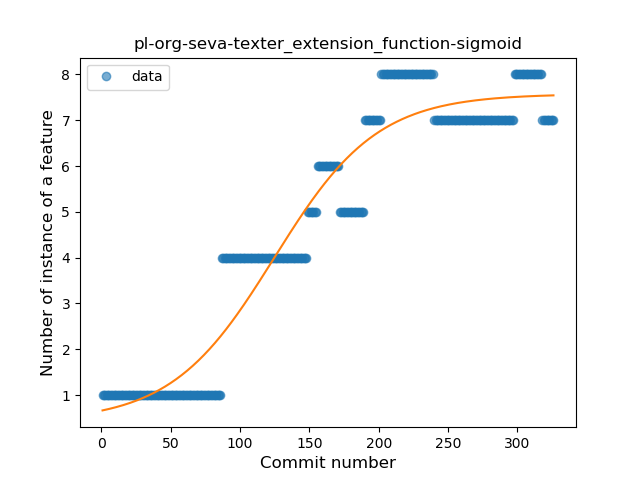

#### com-moez-QKSMS
* Feature: Destructuring Declaration
* Function: 
* R_Squared: 0.93012389
 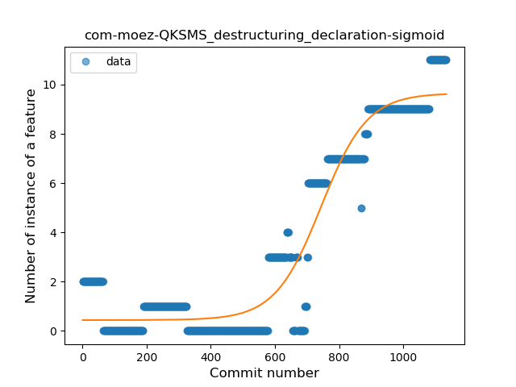

#### net-mm2d-dmsexplorer
* Feature: Extension Function
* Function: 
* R_Squared: 0.92969592
 

#### be-mygod-vpnhotspot
* Feature: Destructuring Declaration
* Function: 
* R_Squared: 0.92940065
 

#### it-diab
* Feature: Type Inference
* Function: 
* R_Squared: 0.92938291
 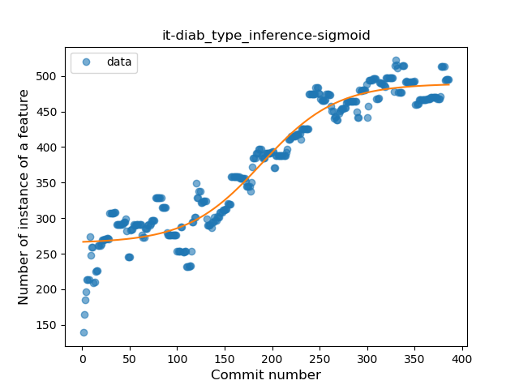

#### org-zimmob-zimlx
* Feature: String Template
* Function: 
* R_Squared: 0.92923621
 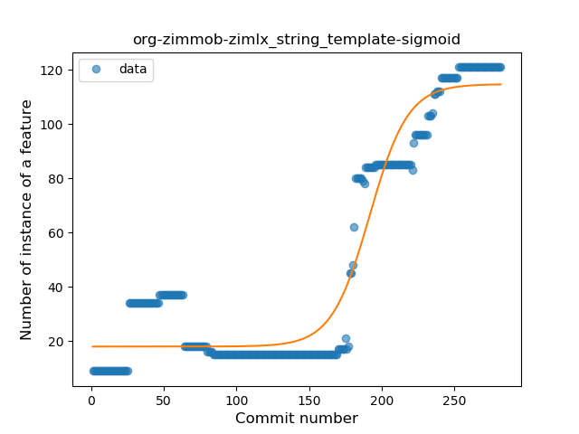

#### io-mkg20001-arubanetworkslogin
* Feature: Type Inference
* Function: 
* R_Squared: 0.92916366
 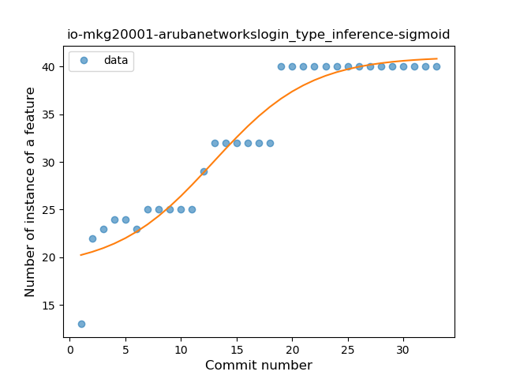

#### pl-org-seva-navigator
* Feature: Function with Default Value
* Function: 
* R_Squared: 0.92914611
 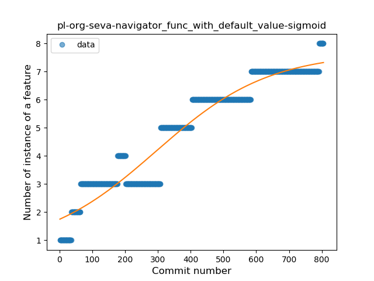

#### com-adityakamble49-dcipher
* Feature: String Template
* Function: 
* R_Squared: 0.9289057
 

#### com-dozingcatsoftware-vectorcamera
* Feature: Safe Call
* Function: 
* R_Squared: 0.92882554
 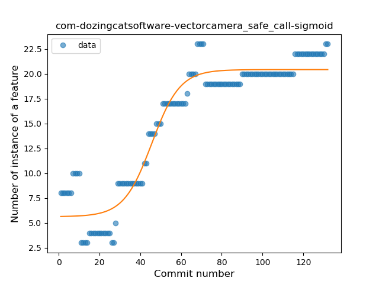

#### com-ogsdroid
* Feature: Smart Cast
* Function: 
* R_Squared: 0.9286615
 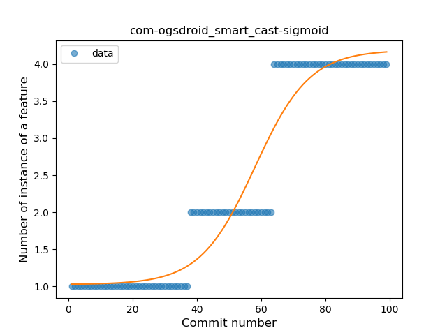

#### com-bubelov-coins
* Feature: Property Delegation
* Function: 
* R_Squared: 0.92846378
 

#### org-ligi-passandroid
* Feature: Function call with Named Argument
* Function: 
* R_Squared: 0.92759957
 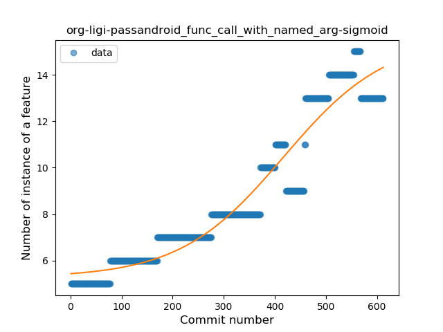

#### org-ligi-gobandroid
* Feature: When expression
* Function: 
* R_Squared: 0.92758762
 

#### sreich-countthedays
* Feature: Extension Function
* Function: 
* R_Squared: 0.92712249
 

#### com-tasomaniac-openwith-floss
* Feature: String Template
* Function: 
* R_Squared: 0.9268808
 

#### com-calintat-sensors
* Feature: Lambda
* Function: 
* R_Squared: 0.92685036
 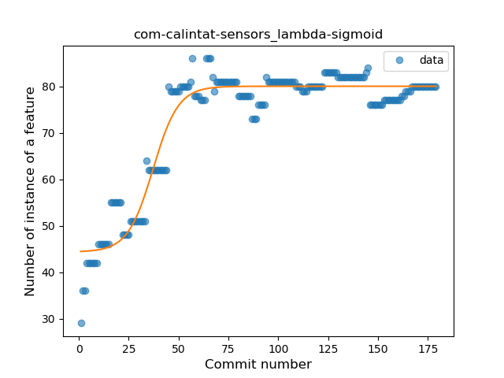

#### com-nextcloud-talk2
* Feature: Function call with Named Argument
* Function: 
* R_Squared: 0.92671399
 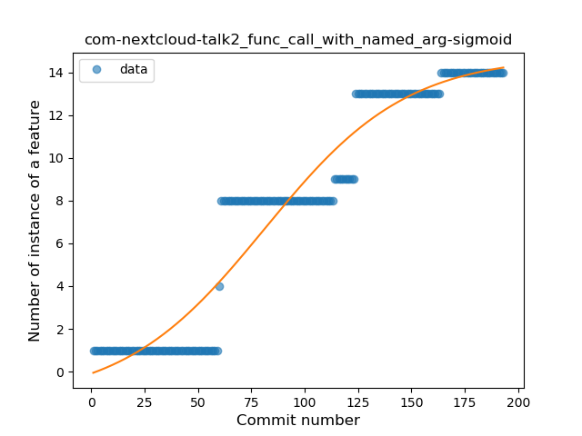

#### com-simplemobiletools-gallery
* Feature: Destructuring Declaration
* Function: 
* R_Squared: 0.92653773
 

#### de-thecode-lmd
* Feature: Safe Call
* Function: 
* R_Squared: 0.92604853
 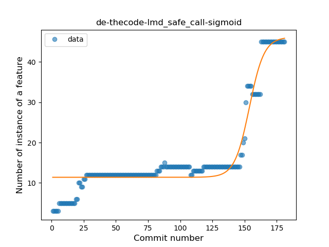

#### de-westnordost-streetcomplete
* Feature: Type Alias
* Function: 
* R_Squared: 0.92604681
 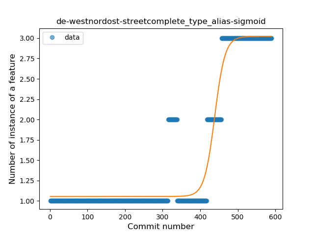

#### me-blog-korn123-easydiary
* Feature: Companion Object
* Function: 
* R_Squared: 0.92594636
 

#### eu-depau-etchdroid
* Feature: Function with Default Value
* Function: 
* R_Squared: 0.92576061
 

#### de-avpptr-umweltzone
* Feature: Lambda
* Function: 
* R_Squared: 0.9252273
 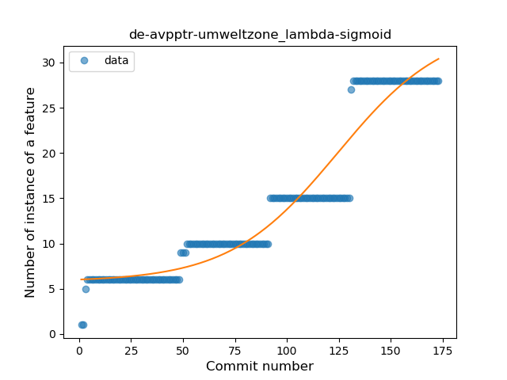

#### com-simplemobiletools-musicplayer
* Feature: Function with Default Value
* Function: 
* R_Squared: 0.92455063
 

#### tk-superl2-xwifi
* Feature: Type Inference
* Function: 
* R_Squared: 0.92446567
 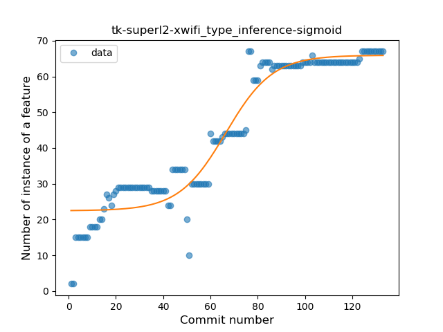

#### com-simplemobiletools-filemanager-pro
* Feature: Unsafe Call
* Function: 
* R_Squared: 0.92423038
 

#### cat-pantsu-nyaapantsu
* Feature: Singleton
* Function: 
* R_Squared: 0.92380805
 

#### net-yslibrary-monotweety
* Feature: Function with Default Value
* Function: 
* R_Squared: 0.92360763
 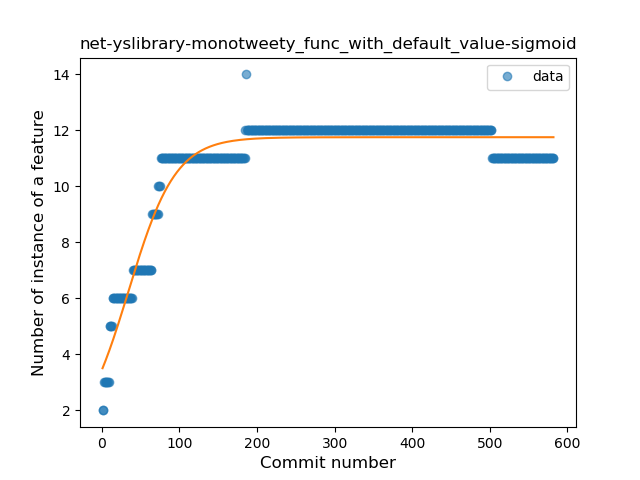

#### org-emunix-insteadlauncher
* Feature: When expression
* Function: 
* R_Squared: 0.92320559
 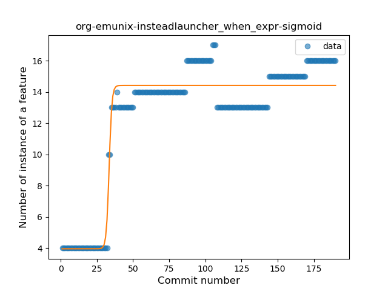

#### org-emunix-insteadlauncher
* Feature: Data Class
* Function: 
* R_Squared: 0.92313893
 

#### org-havenapp-main
* Feature: String Template
* Function: 
* R_Squared: 0.92308819
 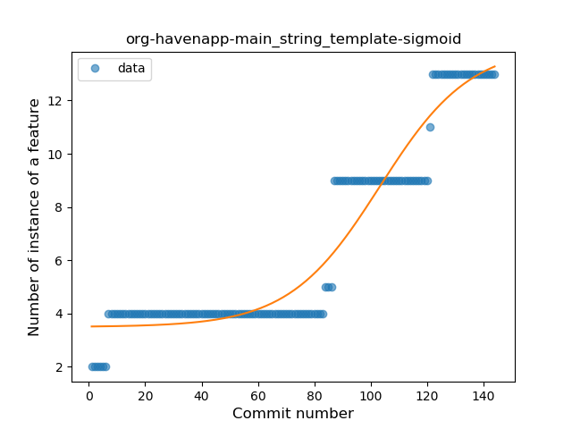

#### nightlock-peppercarrot
* Feature: Companion Object
* Function: 
* R_Squared: 0.92294532
 

#### de-grobox-liberario
* Feature: Data Class
* Function: 
* R_Squared: 0.92266885
 

#### name-cantanima-chineseremainderclock
* Feature: When expression
* Function: 
* R_Squared: 0.92194388
 

#### de-Maxr1998-xposed-maxlock
* Feature: Range Expression
* Function: 
* R_Squared: 0.92190038
 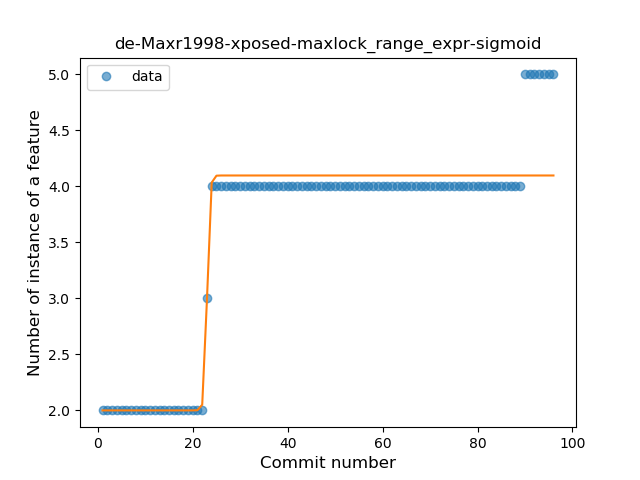

#### es-usc-citius-servando-calendula
* Feature: Singleton
* Function: 
* R_Squared: 0.92185699
 

#### jp-org-example-geckour-glyph
* Feature: Data Class
* Function: 
* R_Squared: 0.92159922
 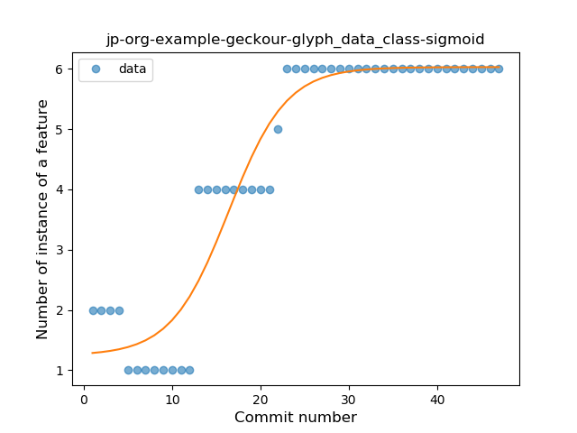

#### se-barsk-park
* Feature: String Template
* Function: 
* R_Squared: 0.92156475
 

#### de-thecode-android-tazreader
* Feature: Extension Function
* Function: 
* R_Squared: 0.92155145
 

#### be-mygod-vpnhotspot
* Feature: Range Expression
* Function: 
* R_Squared: 0.92097429
 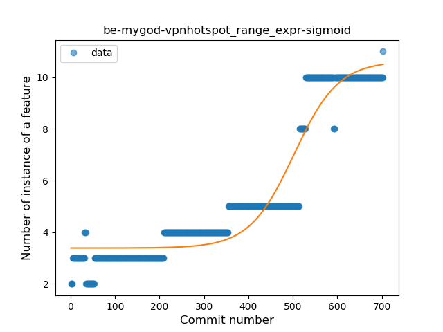

#### com-breadwallet
* Feature: Property Delegation
* Function: 
* R_Squared: 0.92088869
 

#### com-fsck-k9
* Feature: Type Alias
* Function: 
* R_Squared: 0.92053727
 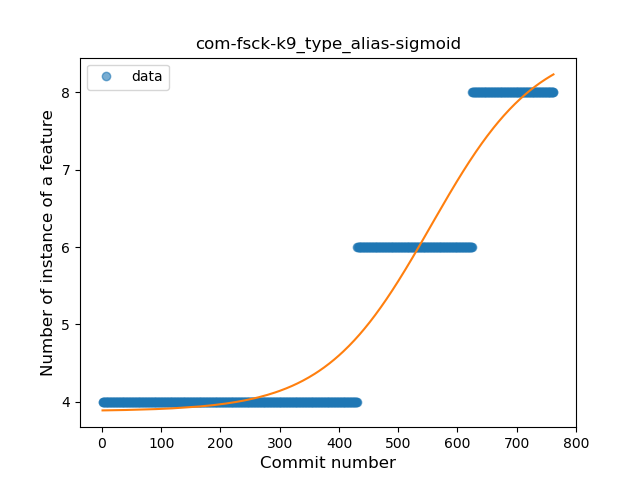

#### horse-amazin-my-stratum0-statuswidget
* Feature: Lambda
* Function: 
* R_Squared: 0.9201981
 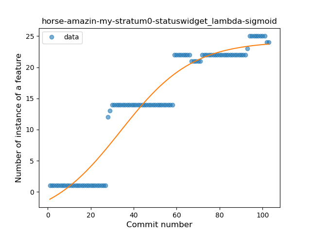

#### ch-abertschi-adfree
* Feature: String Template
* Function: 
* R_Squared: 0.919938
 

#### com-simplemobiletools-musicplayer
* Feature: Safe Call
* Function: 
* R_Squared: 0.91972715
 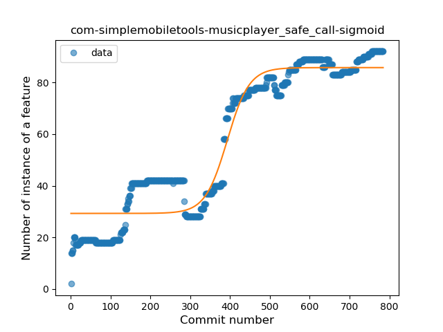

#### be-mygod-vpnhotspot
* Feature: Function call with Named Argument
* Function: 
* R_Squared: 0.91955685
 

#### apps-amine-bou-readerforselfoss
* Feature: Smart Cast
* Function: 
* R_Squared: 0.91882818
 

#### com-peterlaurence-trekme
* Feature: Type Alias
* Function: 
* R_Squared: 0.91866494
 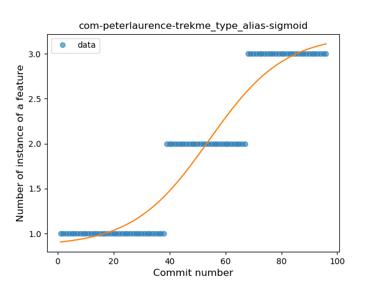

#### pixel-kotlin-bassblog
* Feature: Companion Object
* Function: 
* R_Squared: 0.91768666
 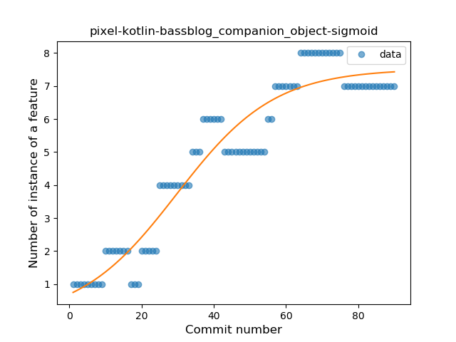

#### org-kaqui
* Feature: Safe Call
* Function: 
* R_Squared: 0.91742487
 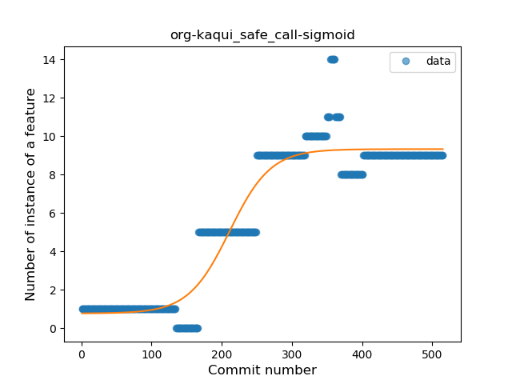

#### de-thecode-lmd
* Feature: When expression
* Function: 
* R_Squared: 0.91731217
 

#### cat-pantsu-nyaapantsu
* Feature: Range Expression
* Function: 
* R_Squared: 0.91686678
 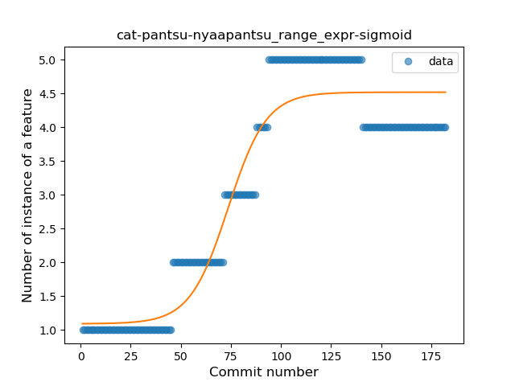

#### com-wbrawner-simplemarkdown
* Feature: When expression
* Function: 
* R_Squared: 0.91684469
 

#### com-github-premnirmal-tickerwidget
* Feature: Safe Call
* Function: 
* R_Squared: 0.91657002
 

#### com-simplemobiletools-clock
* Feature: Function call with Named Argument
* Function: 
* R_Squared: 0.91641597
 

#### com-ninjahoahong-unstoppable
* Feature: Unsafe Call
* Function: 
* R_Squared: 0.91634742
 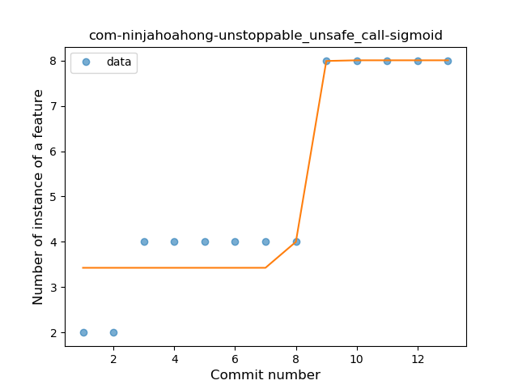

#### com-esafirm-androidplayground
* Feature: When expression
* Function: 
* R_Squared: 0.91610221
 

#### com-tutpro-baresip
* Feature: Singleton
* Function: 
* R_Squared: 0.91591762
 

#### com-bijoysingh-quicknote
* Feature: Range Expression
* Function: 
* R_Squared: 0.91588527
 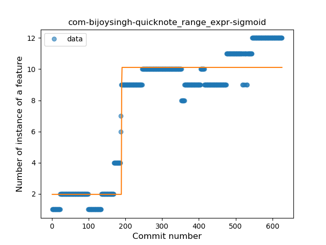

#### com-kgurgul-cpuinfo
* Feature: Function with Default Value
* Function: 
* R_Squared: 0.91486279
 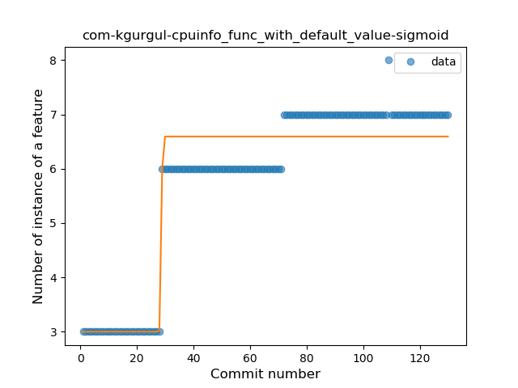

#### nightlock-peppercarrot
* Feature: Range Expression
* Function: 
* R_Squared: 0.91454883
 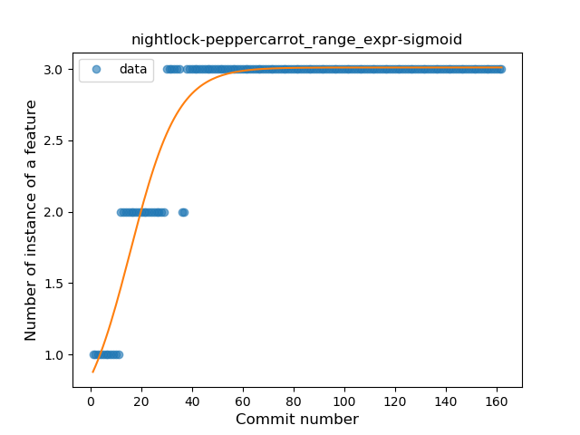

#### com-zeapo-pwdstore
* Feature: Smart Cast
* Function: 
* R_Squared: 0.91409506
 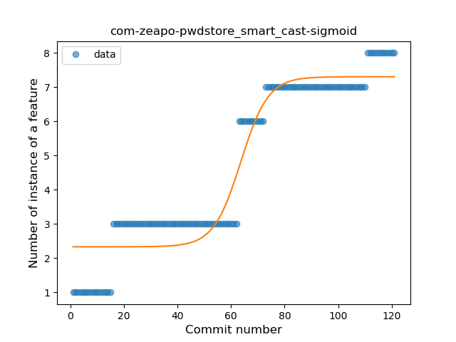

#### li-klass-fhem
* Feature: Coroutine
* Function: 
* R_Squared: 0.91407666
 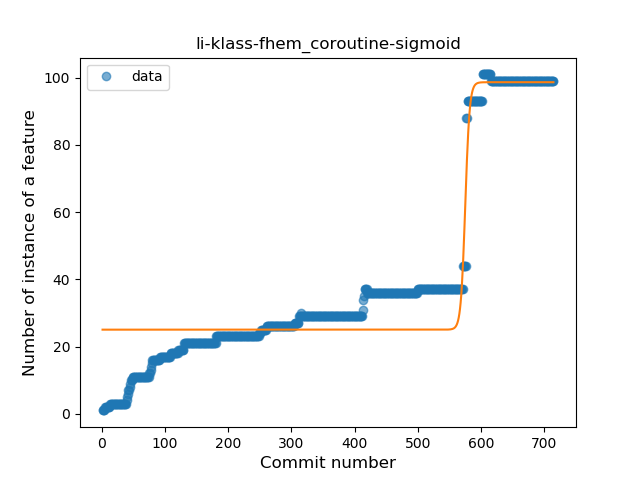

#### cat-xojan-random1
* Feature: Function with Default Value
* Function: 
* R_Squared: 0.91325005
 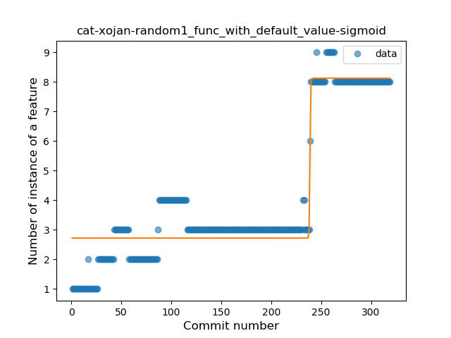

#### com-pennapps-labs-pennmobile
* Feature: Companion Object
* Function: 
* R_Squared: 0.9128691
 

#### com-stevenschoen-putionew
* Feature: Destructuring Declaration
* Function: 
* R_Squared: 0.91285782
 

#### com-benoitletondor-easybudgetapp
* Feature: Sealed Class
* Function: 
* R_Squared: 0.91244487
 

#### info-dvkr-screenstream
* Feature: Singleton
* Function: 
* R_Squared: 0.91200675
 

#### com-uncmorfi
* Feature: Function call with Named Argument
* Function: 
* R_Squared: 0.91184176
 

#### one-librem-social
* Feature: Property Delegation
* Function: 
* R_Squared: 0.91173592
 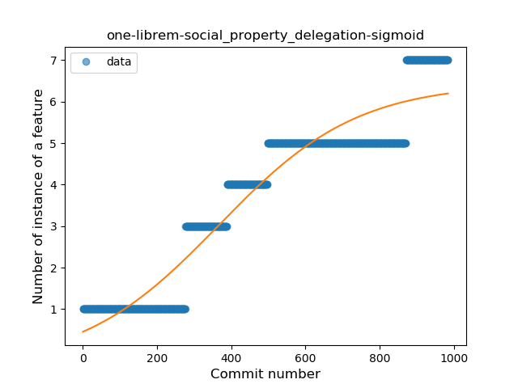

#### info-papdt-express-helper
* Feature: Extension Function
* Function: 
* R_Squared: 0.91090267
 

#### ml-adamsprogs-bimba
* Feature: Range Expression
* Function: 
* R_Squared: 0.91082763
 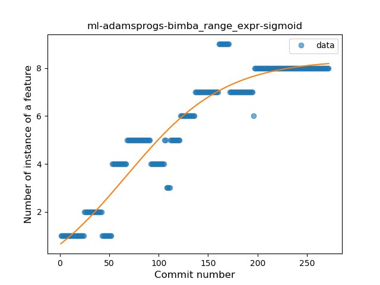

#### net-stew-stew
* Feature: Companion Object
* Function: 
* R_Squared: 0.91008578
 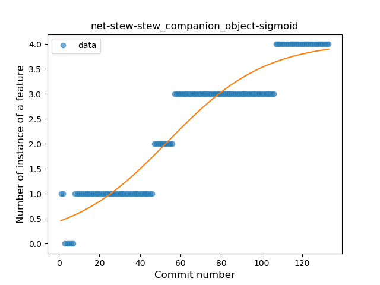

#### org-freedombox-freedombox
* Feature: Function call with Named Argument
* Function: 
* R_Squared: 0.90978111
 

#### com-etesync-syncadapter
* Feature: Function with Default Value
* Function: 
* R_Squared: 0.90966363
 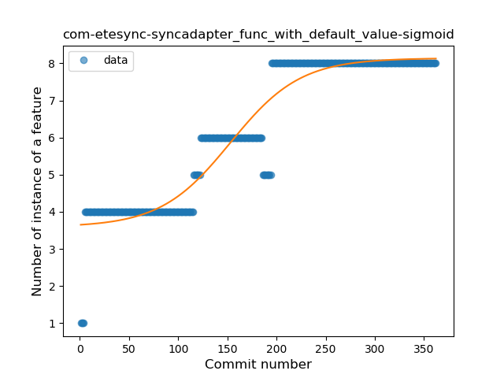

#### com-tasomaniac-openwith-floss
* Feature: Infix Function
* Function: 
* R_Squared: 0.90932199
 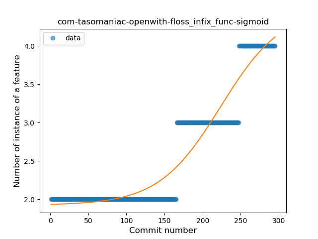

#### at-ac-tuwien-caa-docscan
* Feature: Lambda
* Function: 
* R_Squared: 0.90884415
 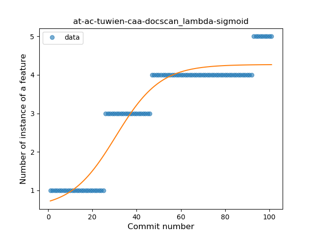

#### is-xyz-omw
* Feature: Function with Default Value
* Function: 
* R_Squared: 0.90832172
 

#### me-kirimin-mitsumine
* Feature: When expression
* Function: 
* R_Squared: 0.90823766
 

#### nightlock-peppercarrot
* Feature: When expression
* Function: 
* R_Squared: 0.90785243
 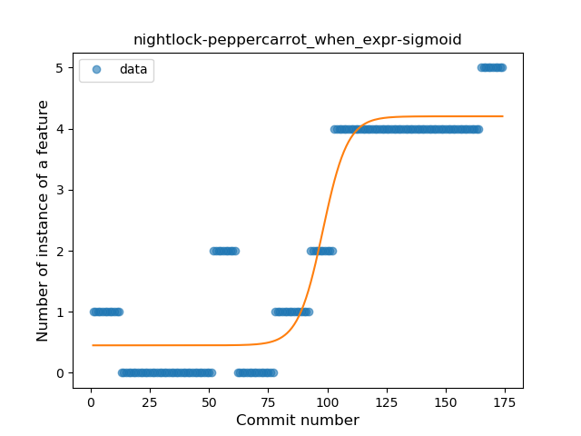

#### me-barta-stayintouch
* Feature: Companion Object
* Function: 
* R_Squared: 0.90769524
 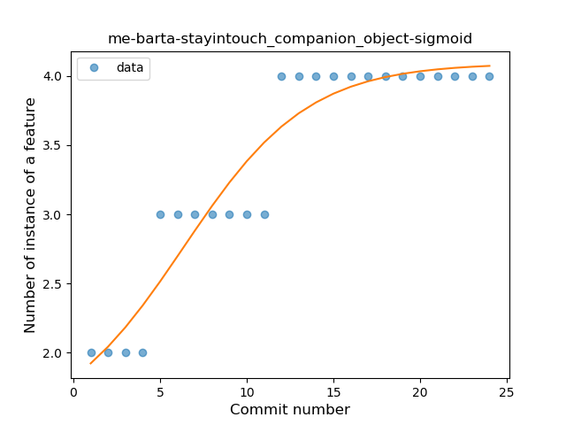

#### com-pennapps-labs-pennmobile
* Feature: Range Expression
* Function: 
* R_Squared: 0.90753118
 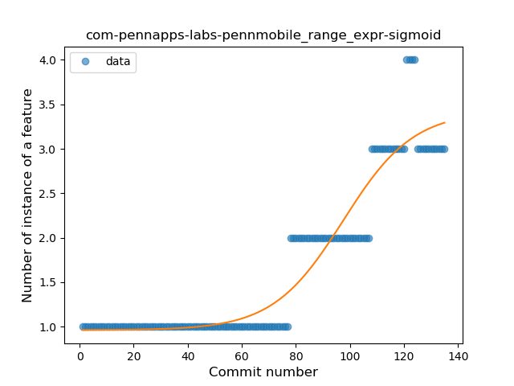

#### com-jim-sharetocomputer
* Feature: Function with Default Value
* Function: 
* R_Squared: 0.90740076
 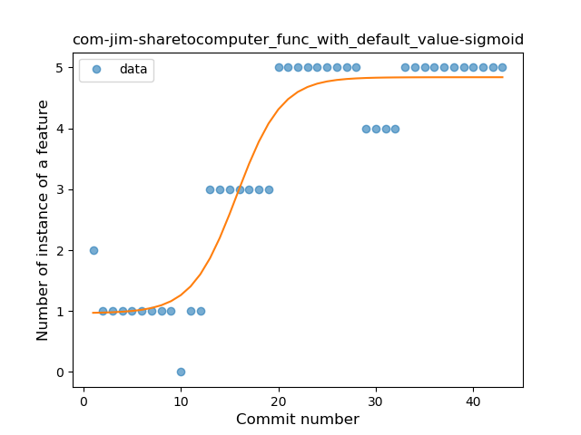

#### org-ligi-materialteatimer
* Feature: Lambda
* Function: 
* R_Squared: 0.90728842
 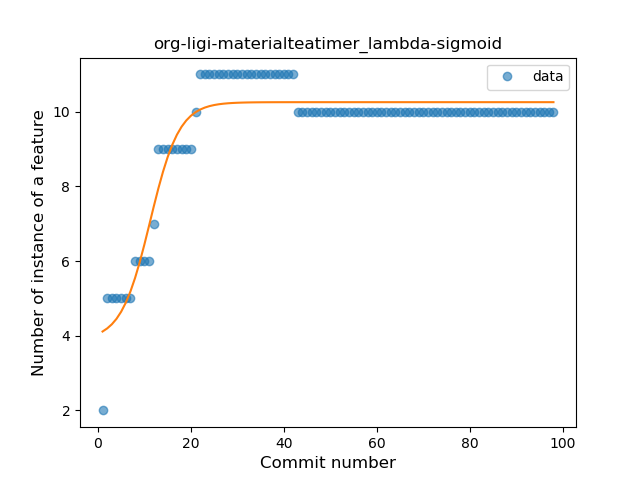

#### ch-abertschi-adfree
* Feature: Function with Default Value
* Function: 
* R_Squared: 0.90699279
 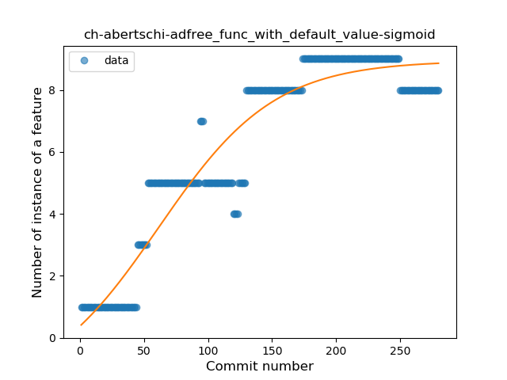

#### app-simone
* Feature: Singleton
* Function: 
* R_Squared: 0.90670086
 

#### pw-janyo-janyoshare
* Feature: Singleton
* Function: 
* R_Squared: 0.90613039
 

#### science-apolline
* Feature: Singleton
* Function: 
* R_Squared: 0.90602644
 

#### nightlock-peppercarrot
* Feature: Lambda
* Function: 
* R_Squared: 0.90546549
 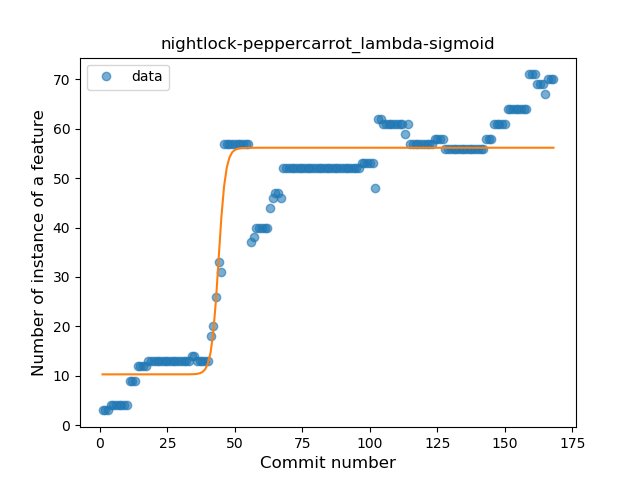

#### org-pacien-tincapp
* Feature: Property Delegation
* Function: 
* R_Squared: 0.90543325
 

#### is-xyz-mpv
* Feature: Companion Object
* Function: 
* R_Squared: 0.904182
 

#### com-guerinet-mymartlet
* Feature: Extension Function
* Function: 
* R_Squared: 0.90398888
 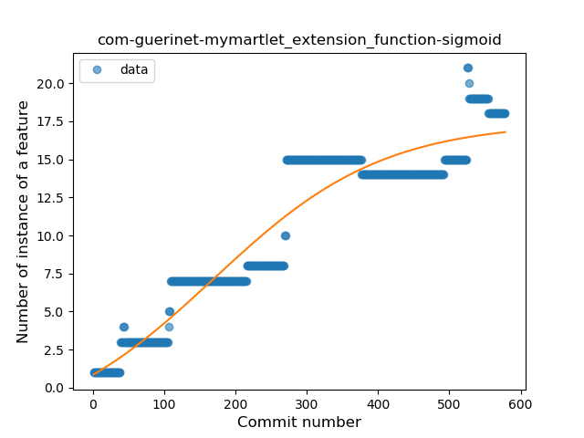

#### com-tasomaniac-openwith-floss
* Feature: Singleton
* Function: 
* R_Squared: 0.90279279
 

#### me-kirimin-mitsumine
* Feature: String Template
* Function: 
* R_Squared: 0.90194863
 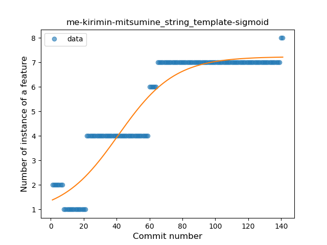

#### de-ph1b-audiobook
* Feature: Overloaded Operator
* Function: 
* R_Squared: 0.90129448
 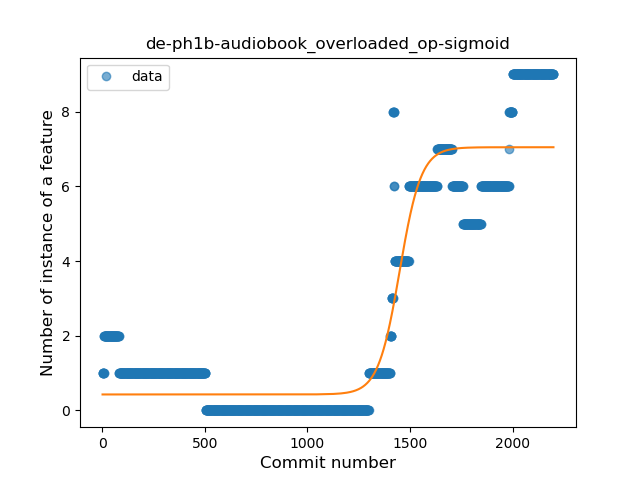

#### de-spiritcroc-defaultdarktheme
* Feature: Lambda
* Function: 
* R_Squared: 0.90078127
 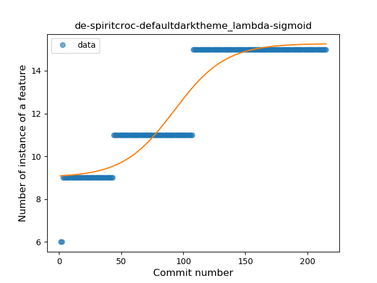

#### info-dvkr-screenstream
* Feature: Function with Default Value
* Function: 
* R_Squared: 0.90063138
 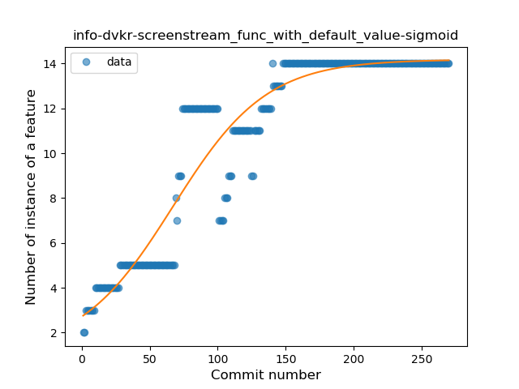

#### pixel-kotlin-bassblog
* Feature: Function with Default Value
* Function: 
* R_Squared: 0.90047822
 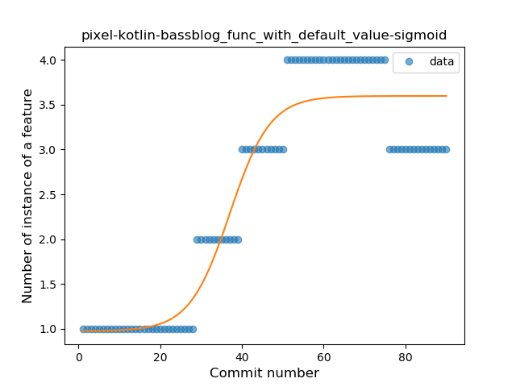

#### com-njlabs-showjava
* Feature: Extension Function
* Function: 
* R_Squared: 0.90039439
 

#### me-anon-grow
* Feature: Singleton
* Function: 
* R_Squared: 0.90010974
 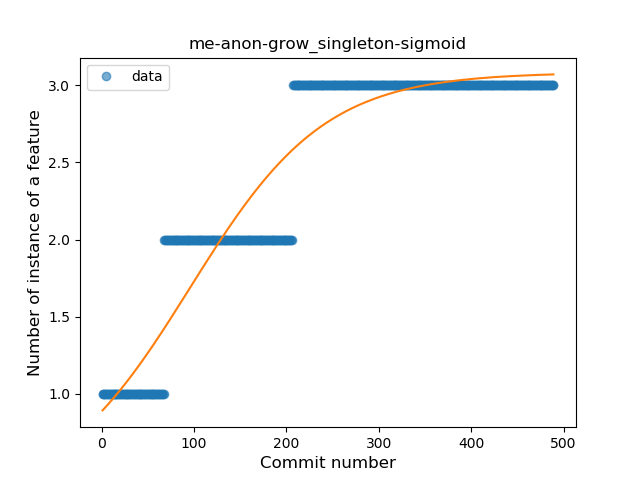

#### fr-openium-auvergnewebcams
* Feature: Function call with Named Argument
* Function: 
* R_Squared: 0.89986437
 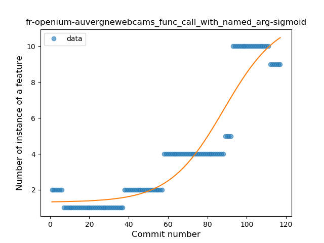

#### org-walleth
* Feature: String Template
* Function: 
* R_Squared: 0.89985452
 

#### com-epimorphics-android-myrivers
* Feature: Companion Object
* Function: 
* R_Squared: 0.89973746
 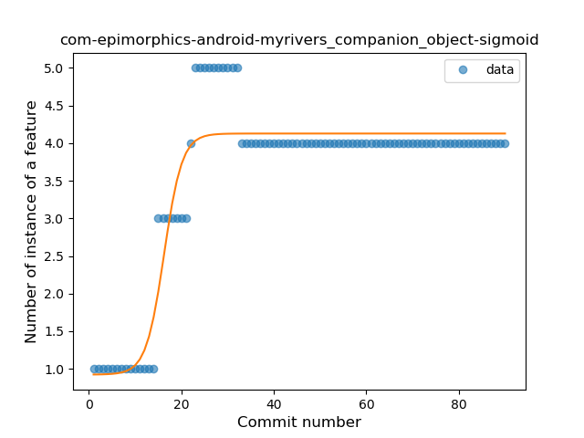

#### com-wbrawner-simplemarkdown
* Feature: Companion Object
* Function: 
* R_Squared: 0.89960758
 

#### com-github-premnirmal-tickerwidget
* Feature: Property Delegation
* Function: 
* R_Squared: 0.89870437
 

#### ffc-app
* Feature: Range Expression
* Function: 
* R_Squared: 0.89860176
 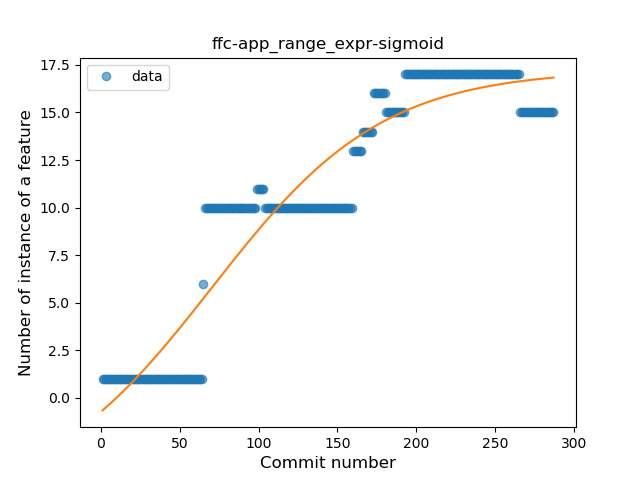

#### pt-joaomneto-titancompanion
* Feature: Safe Call
* Function: 
* R_Squared: 0.89844481
 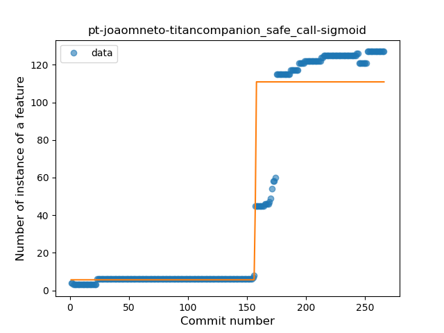

#### apps-amine-bou-readerforselfoss
* Feature: Function with Default Value
* Function: 
* R_Squared: 0.89828228
 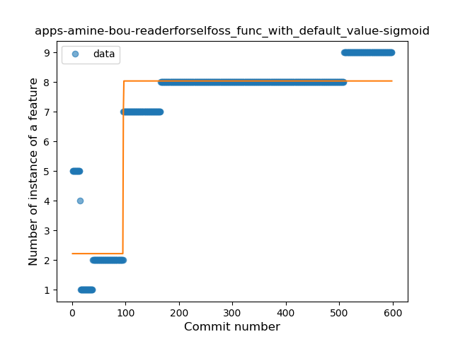

#### com-jim-sharetocomputer
* Feature: Function call with Named Argument
* Function: 
* R_Squared: 0.89740859
 

#### com-esafirm-androidplayground
* Feature: Data Class
* Function: 
* R_Squared: 0.89687884
 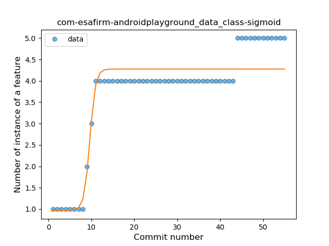

#### com-directdev-portal
* Feature: String Template
* Function: 
* R_Squared: 0.89687342
 

#### com-log28
* Feature: Function with Default Value
* Function: 
* R_Squared: 0.89632241
 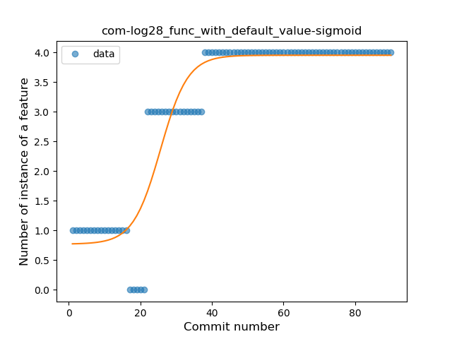

#### com-guerinet-mymartlet
* Feature: Singleton
* Function: 
* R_Squared: 0.89623676
 

#### horse-amazin-my-stratum0-statuswidget
* Feature: Safe Call
* Function: 
* R_Squared: 0.89492329
 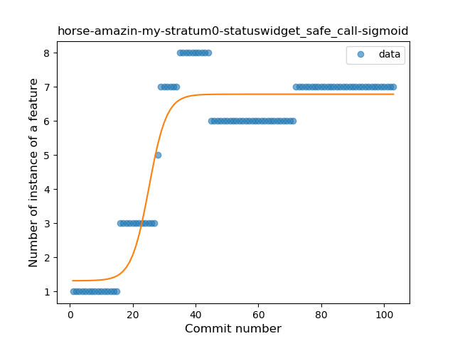

#### com-yubico-yubioath
* Feature: Unsafe Call
* Function: 
* R_Squared: 0.89456958
 

#### com-rohitsuratekar-NCBSinfo
* Feature: Smart Cast
* Function: 
* R_Squared: 0.89423845
 

#### org-mcxa-vortaro
* Feature: Lambda
* Function: 
* R_Squared: 0.89397015
 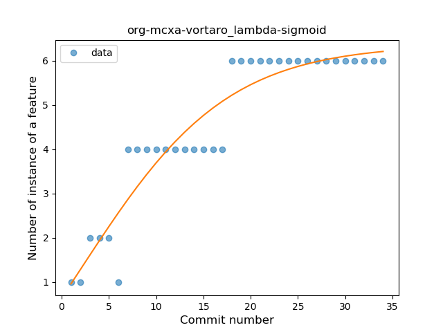

#### fr-cph-chicago-foss
* Feature: String Template
* Function: 
* R_Squared: 0.89392082
 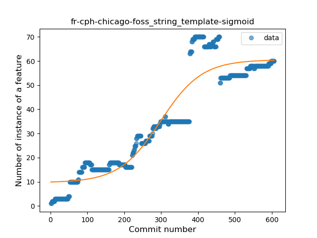

#### net-kourlas-voipms
* Feature: Unsafe Call
* Function: 
* R_Squared: 0.8932548
 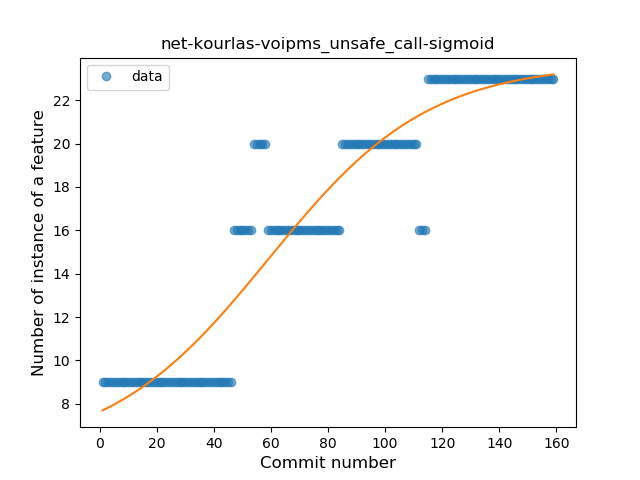

#### org-fossasia-badgemagic
* Feature: Singleton
* Function: 
* R_Squared: 0.89302719
 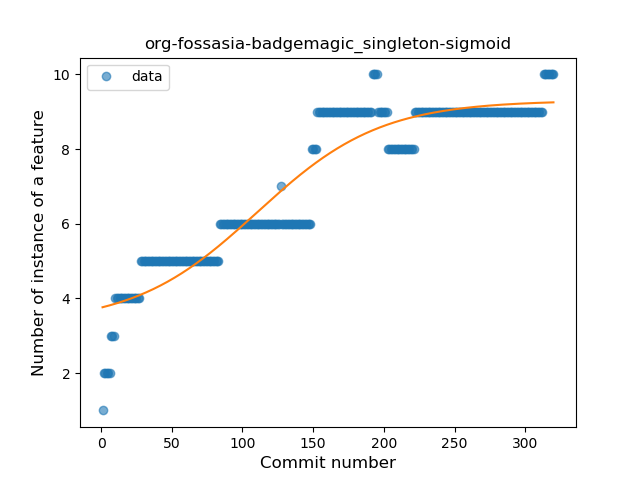

#### de-ironjan-mensaupb
* Feature: Singleton
* Function: 
* R_Squared: 0.89267492
 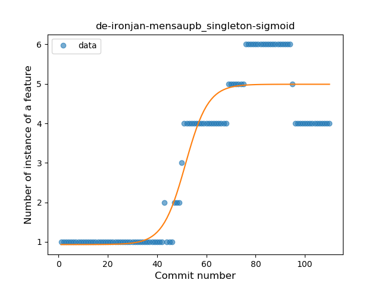

#### io-github-fvasco-pinpoi
* Feature: Function with Default Value
* Function: 
* R_Squared: 0.88963313
 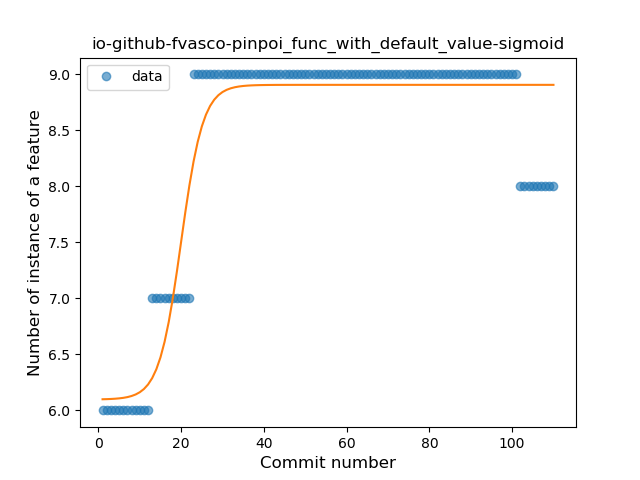

#### de-thecode-lmd
* Feature: Function call with Named Argument
* Function: 
* R_Squared: 0.88917278
 

#### com-calintat-units
* Feature: Lambda
* Function: 
* R_Squared: 0.88838036
 

#### org-teamblueridge-pasteitapp
* Feature: String Template
* Function: 
* R_Squared: 0.88753258
 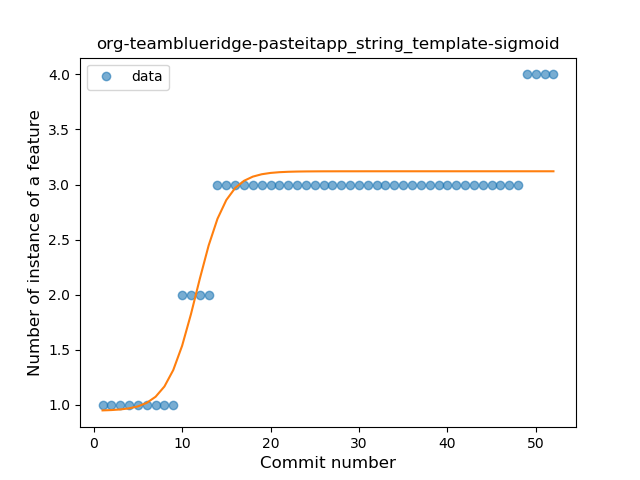

#### com-uwetrottmann-wpdisplay
* Feature: Companion Object
* Function: 
* R_Squared: 0.88739122
 

#### com-github-premnirmal-tickerwidget
* Feature: Singleton
* Function: 
* R_Squared: 0.88712915
 

#### co-timecrypt-android
* Feature: When expression
* Function: 
* R_Squared: 0.88695193
 

#### org-anibyl-slounik
* Feature: When expression
* Function: 
* R_Squared: 0.88662368
 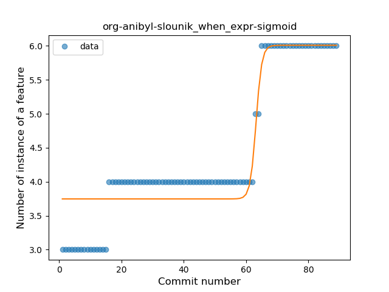

#### com-simplemobiletools-calendar-pro
* Feature: Function with Default Value
* Function: 
* R_Squared: 0.88636047
 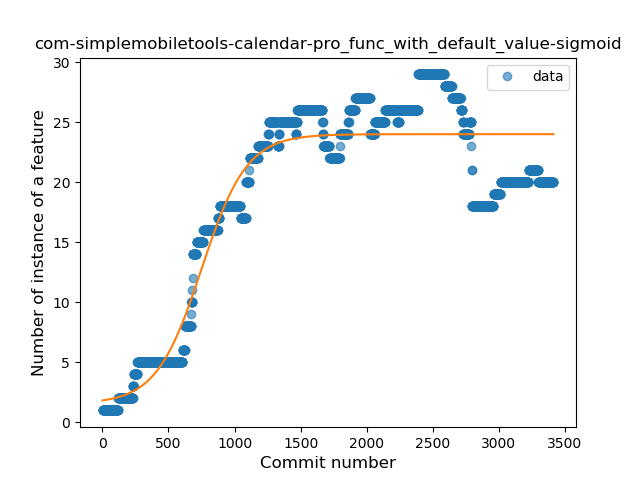

#### jp-cordea-mackerelclient
* Feature: Extension Function
* Function: 
* R_Squared: 0.88634421
 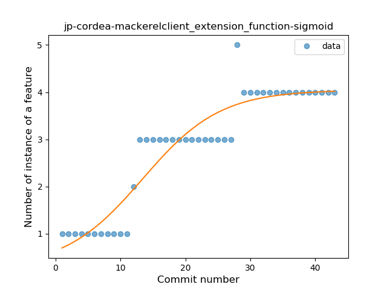

#### de-ph1b-audiobook
* Feature: Smart Cast
* Function: 
* R_Squared: 0.8862955
 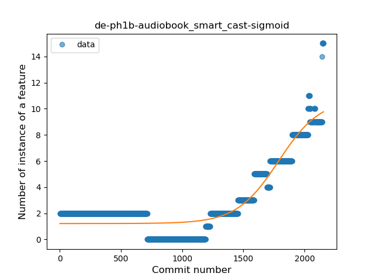

#### ml-adamsprogs-bimba
* Feature: Destructuring Declaration
* Function: 
* R_Squared: 0.88596792
 

#### com-rubenwardy-minetestmodmanager
* Feature: Lambda
* Function: 
* R_Squared: 0.88562323
 

#### com-jim-sharetocomputer
* Feature: Singleton
* Function: 
* R_Squared: 0.88553633
 

#### org-mosad-seil0-projectlaogai
* Feature: When expression
* Function: 
* R_Squared: 0.88465347
 

#### co-pxhouse-sas
* Feature: Lambda
* Function: 
* R_Squared: 0.88422139
 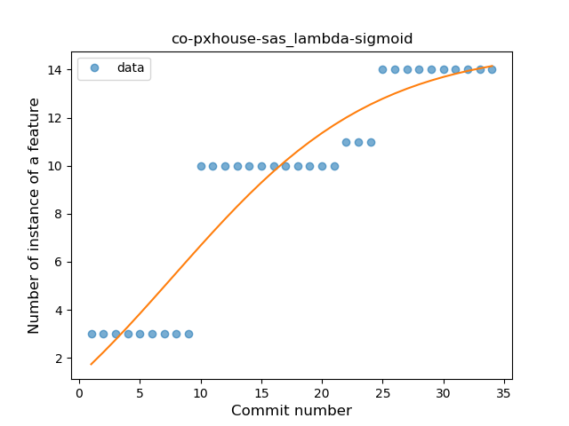

#### link-standen-michael-phonesaver
* Feature: Companion Object
* Function: 
* R_Squared: 0.88337354
 

#### fr-corenting-edcompanion
* Feature: Unsafe Call
* Function: 
* R_Squared: 0.88263897
 

#### com-wanbok-monger
* Feature: Lambda
* Function: 
* R_Squared: 0.88234851
 

#### com-calintat-sensors
* Feature: Function call with Named Argument
* Function: 
* R_Squared: 0.88121717
 

#### org-mozilla-focus
* Feature: Extension Function
* Function: 
* R_Squared: 0.88106319
 

#### org-mozilla-klar
* Feature: Extension Function
* Function: 
* R_Squared: 0.88106319
 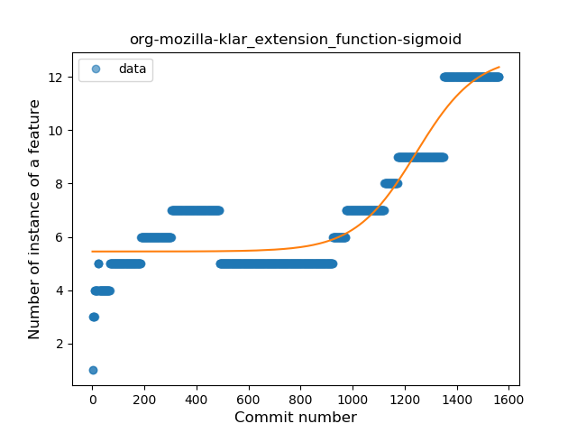

#### com-benoitquenaudon-tvfoot-red
* Feature: Type Alias
* Function: 
* R_Squared: 0.88020503
 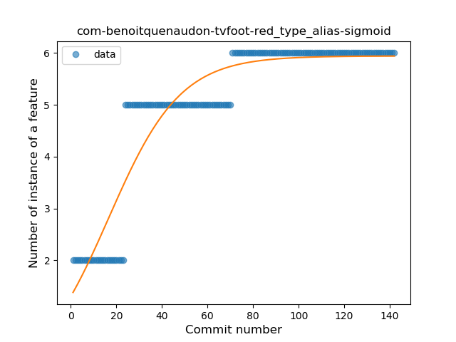

#### fi-kroon-vadret
* Feature: Inline Function
* Function: 
* R_Squared: 0.88006709
 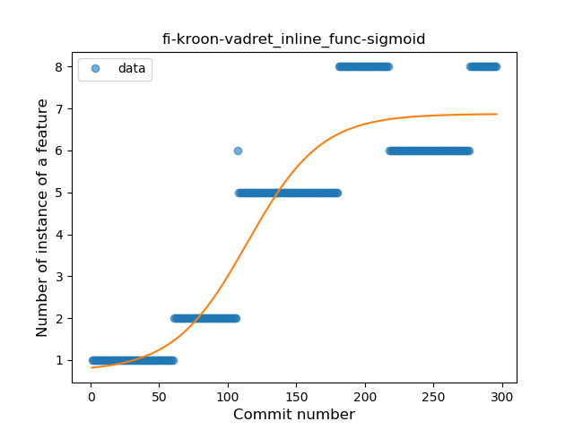

#### com-simplemobiletools-musicplayer
* Feature: Extension Function
* Function: 
* R_Squared: 0.87699607
 

#### pixel-kotlin-bassblog
* Feature: When expression
* Function: 
* R_Squared: 0.87575995
 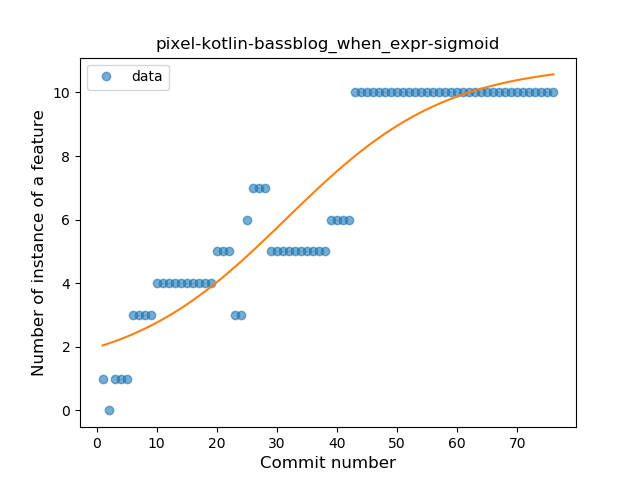

#### de-spiritcroc-darkcroc-substratum
* Feature: Lambda
* Function: 
* R_Squared: 0.87572545
 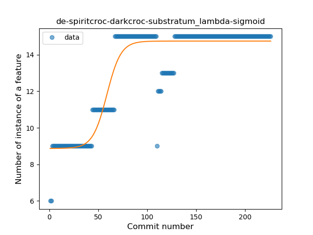

#### fi-kroon-vadret
* Feature: Range Expression
* Function: 
* R_Squared: 0.87551485
 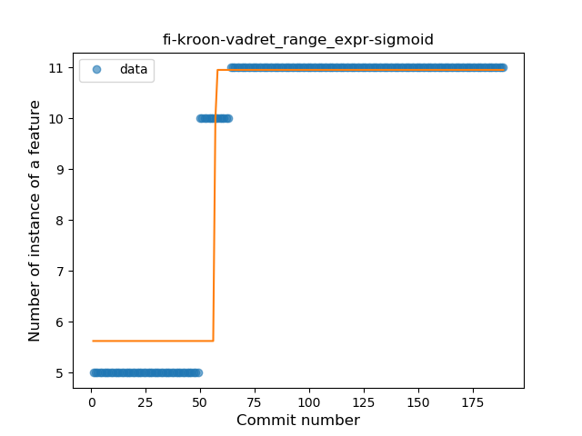

#### org-liberty-android-freeotpplus
* Feature: Companion Object
* Function: 
* R_Squared: 0.87547801
 

#### cat-xojan-random1
* Feature: Data Class
* Function: 
* R_Squared: 0.87504393
 

#### com-pluscubed-velociraptor
* Feature: Function with Default Value
* Function: 
* R_Squared: 0.87493336
 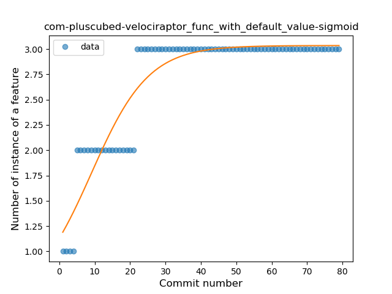

#### org-kaqui
* Feature: Destructuring Declaration
* Function: 
* R_Squared: 0.87486856
 

#### net-syncthing-lite
* Feature: Range Expression
* Function: 
* R_Squared: 0.87431373
 

#### com-example-forgottenumbrella-cardboardmuseum
* Feature: Data Class
* Function: 
* R_Squared: 0.87276416
 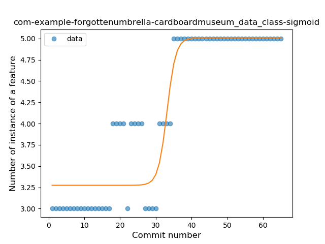

#### cat-pantsu-nyaapantsu
* Feature: Destructuring Declaration
* Function: 
* R_Squared: 0.8722777
 

#### com-scientists-happy-botanist
* Feature: Safe Call
* Function: 
* R_Squared: 0.87211116
 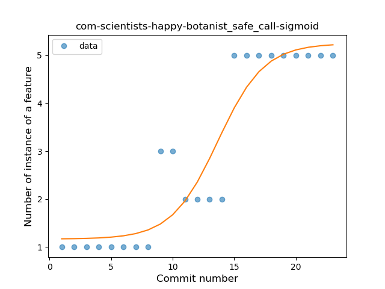

#### acr-browser-lightning
* Feature: Unsafe Call
* Function: 
* R_Squared: 0.87111067
 

#### se-barsk-park
* Feature: Unsafe Call
* Function: 
* R_Squared: 0.8704499
 

#### eu-the4thfloor-msync
* Feature: When expression
* Function: 
* R_Squared: 0.87004118
 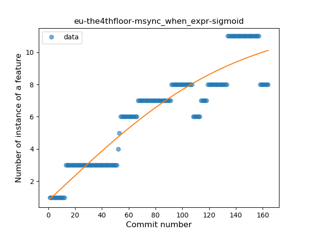

#### org-freedombox-freedombox
* Feature: Companion Object
* Function: 
* R_Squared: 0.86985198
 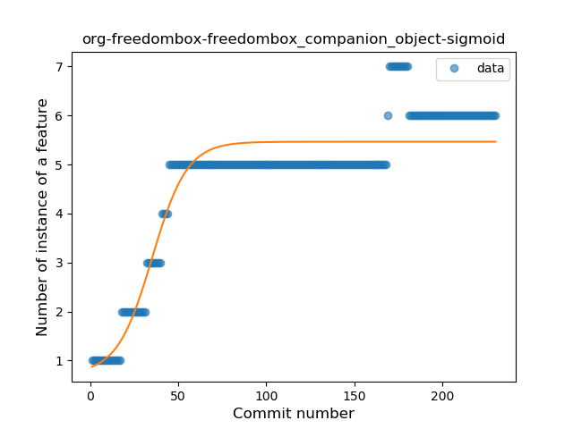

#### com-conorodonnell-bus
* Feature: Safe Call
* Function: 
* R_Squared: 0.86903699
 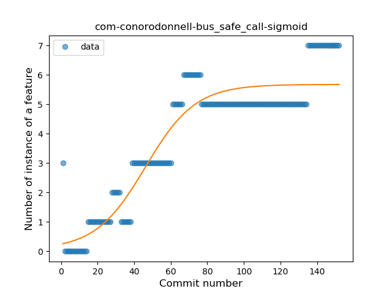

#### com-nextcloud-talk2
* Feature: String Template
* Function: 
* R_Squared: 0.8686304
 

#### org-mosad-seil0-projectlaogai
* Feature: Function call with Named Argument
* Function: 
* R_Squared: 0.86604589
 

#### chat-rocket-android
* Feature: Inline Function
* Function: 
* R_Squared: 0.86380158
 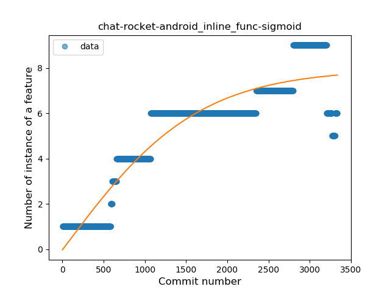

#### com-calintat-units
* Feature: Singleton
* Function: 
* R_Squared: 0.86363969
 

#### nl-mpcjanssen-simpletask
* Feature: Singleton
* Function: 
* R_Squared: 0.86205694
 

#### com-pitchedapps-frost
* Feature: Singleton
* Function: 
* R_Squared: 0.86190119
 

#### info-metadude-android-congress-schedule
* Feature: Data Class
* Function: 
* R_Squared: 0.86168127
 

#### pt-joaomneto-titancompanion
* Feature: Function call with Named Argument
* Function: 
* R_Squared: 0.86074973
 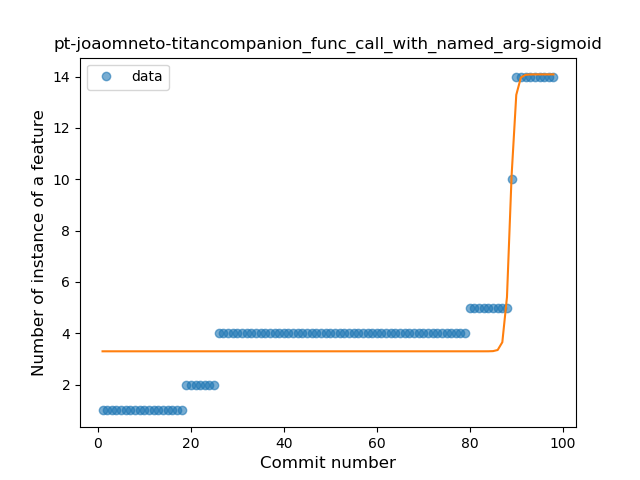

#### net-osmand-plus
* Feature: Data Class
* Function: 
* R_Squared: 0.86066232
 

#### me-echeung-moemoekyun-fdroid
* Feature: Function with Default Value
* Function: 
* R_Squared: 0.8603485
 

#### org-kiwix-kiwixcustomwikivoyageeurope
* Feature: Inline Function
* Function: 
* R_Squared: 0.85990696
 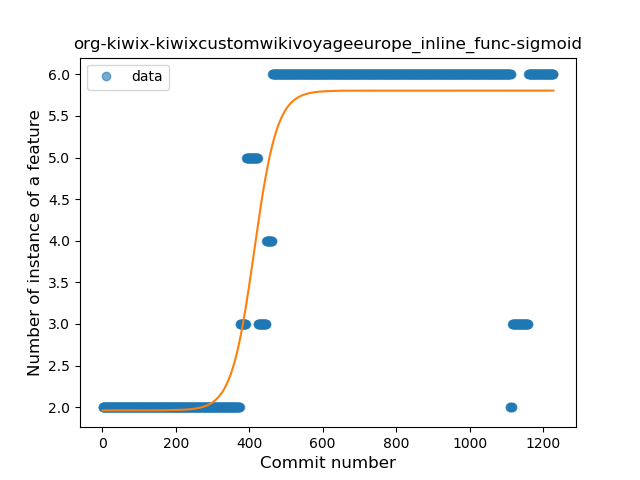

#### com-ogsdroid
* Feature: Range Expression
* Function: 
* R_Squared: 0.85688276
 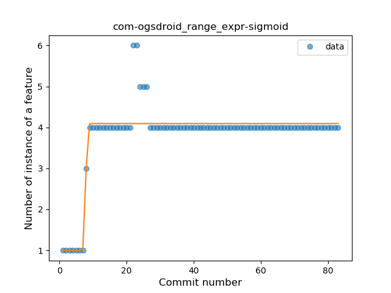

#### org-fossasia-badgemagic
* Feature: Data Class
* Function: 
* R_Squared: 0.85536633
 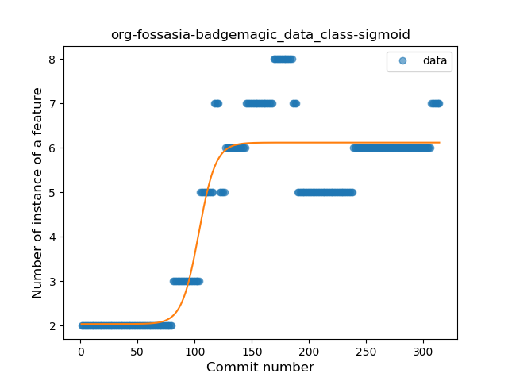

#### com-jereksel-libresubstratum
* Feature: When expression
* Function: 
* R_Squared: 0.85433656
 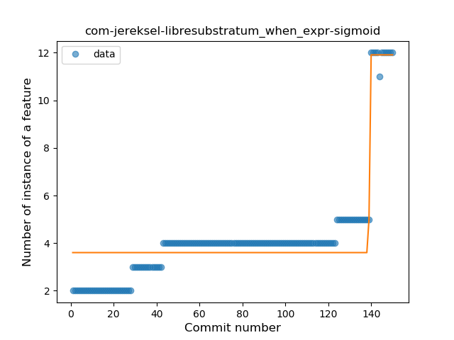

#### it-diab
* Feature: String Template
* Function: 
* R_Squared: 0.85418725
 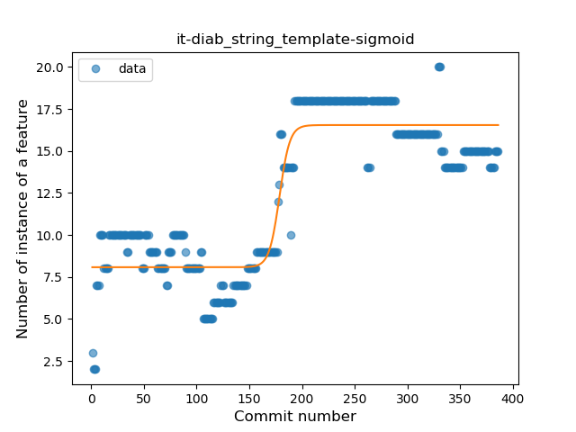

#### ca-rmen-android-poetassistant
* Feature: Singleton
* Function: 
* R_Squared: 0.85386174
 

#### co-pxhouse-sas
* Feature: Type Inference
* Function: 
* R_Squared: 0.85264918
 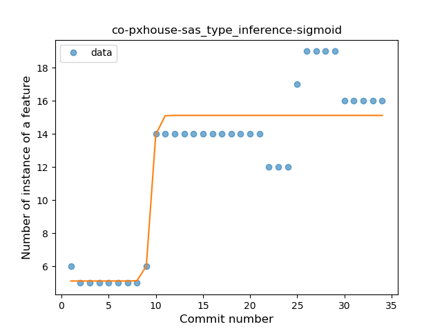

#### com-uncmorfi
* Feature: Function with Default Value
* Function: 
* R_Squared: 0.85154973
 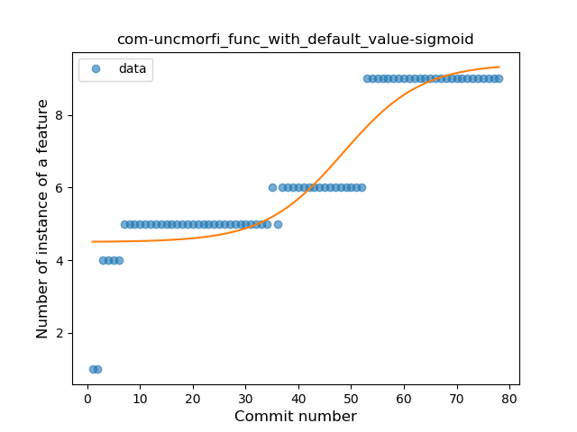

#### com-jmstudios-redmoon
* Feature: Function with Default Value
* Function: 
* R_Squared: 0.85140897
 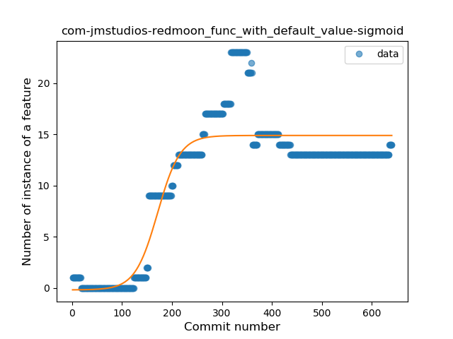

#### com-nao20010128nao-DroidComplex
* Feature: Type Inference
* Function: 
* R_Squared: 0.85091738
 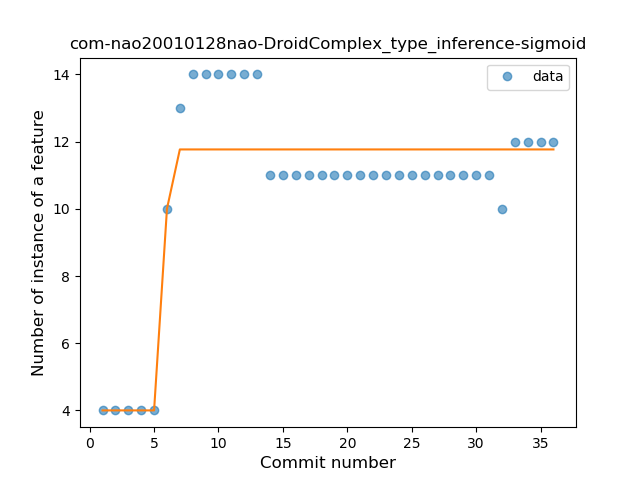

#### me-blog-korn123-easydiary
* Feature: Destructuring Declaration
* Function: 
* R_Squared: 0.84989844
 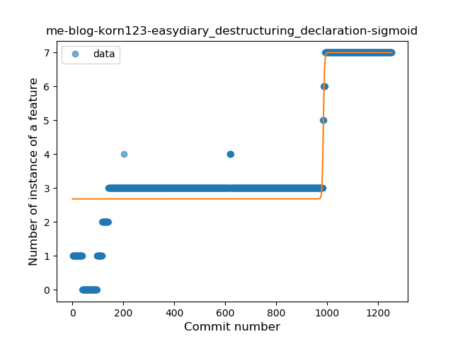

#### com-simplemobiletools-gallery
* Feature: Function with Default Value
* Function: 
* R_Squared: 0.84567428
 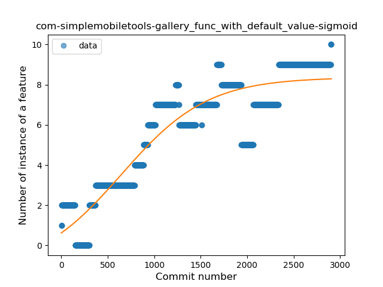

#### com-directdev-portal
* Feature: Extension Function
* Function: 
* R_Squared: 0.84416965
 

#### com-github-fields-electric
* Feature: Range Expression
* Function: 
* R_Squared: 0.84398139
 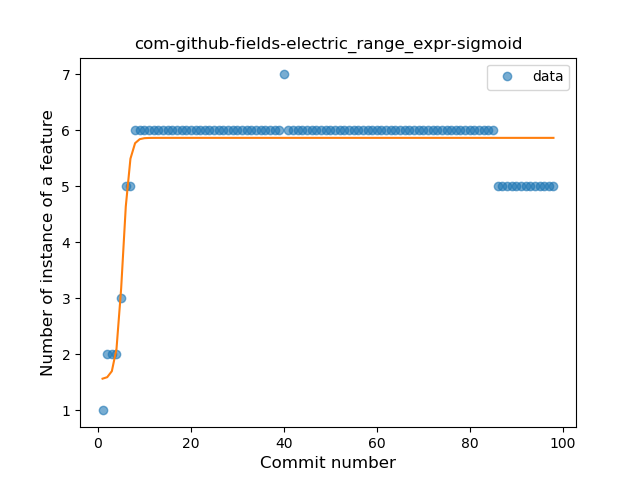

#### net-bible-android-activity
* Feature: Property Delegation
* Function: 
* R_Squared: 0.8436279
 

#### cat-xojan-random1
* Feature: Smart Cast
* Function: 
* R_Squared: 0.84188784
 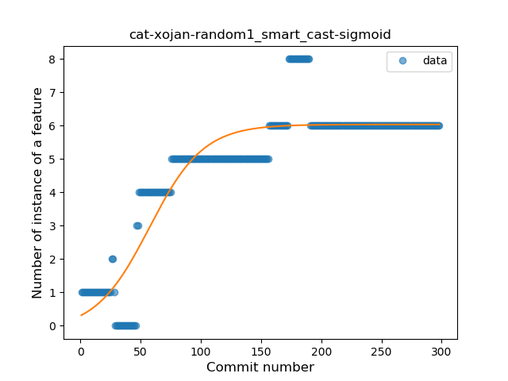

#### org-kiwix-kiwixcustomwikivoyageeurope
* Feature: String Template
* Function: 
* R_Squared: 0.84112531
 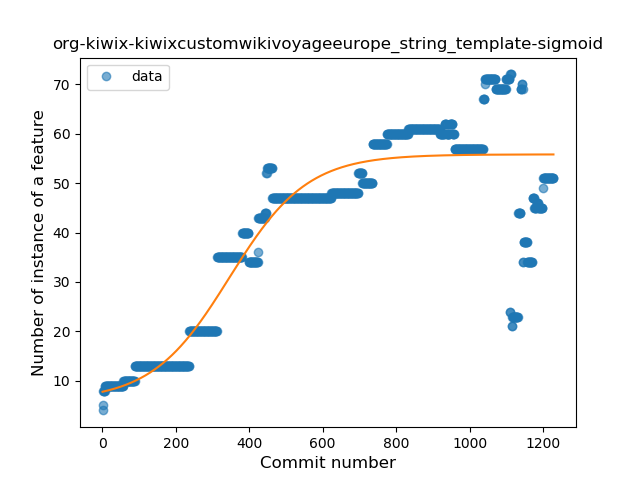

#### fr-chenry-android-freshrss
* Feature: Range Expression
* Function: 
* R_Squared: 0.84103029
 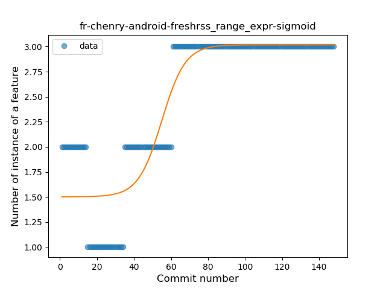

#### com-simplemobiletools-camera
* Feature: Function with Default Value
* Function: 
* R_Squared: 0.84052989
 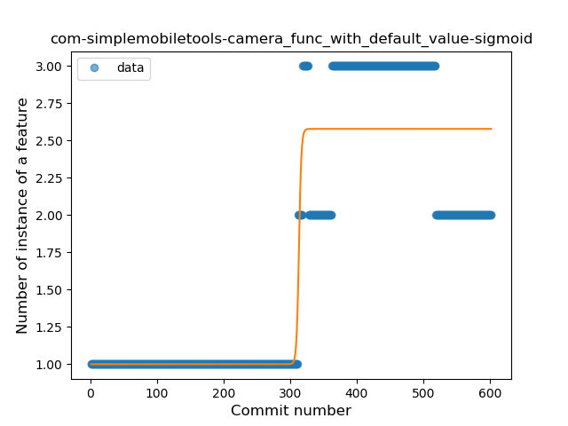

#### com-jereksel-libresubstratum
* Feature: Companion Object
* Function: 
* R_Squared: 0.83957058
 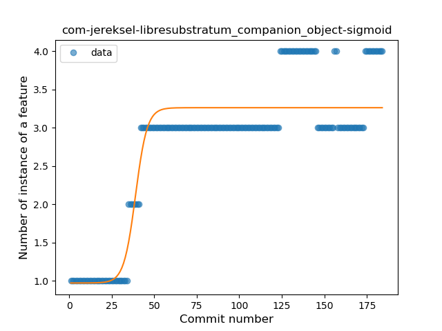

#### com-directdev-portal
* Feature: Data Class
* Function: 
* R_Squared: 0.83901773
 

#### de-ironjan-mensaupb
* Feature: String Template
* Function: 
* R_Squared: 0.83822847
 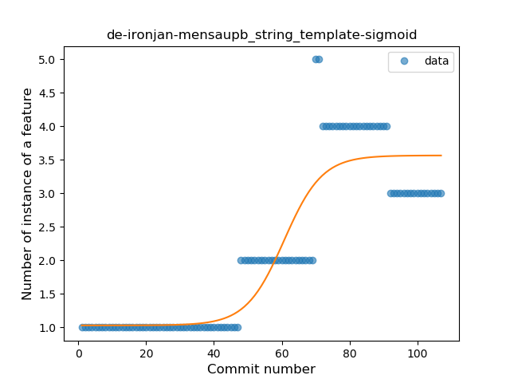

#### com-kgurgul-cpuinfo
* Feature: Extension Function
* Function: 
* R_Squared: 0.83803081
 

#### com-utazukin-ichaival
* Feature: Range Expression
* Function: 
* R_Squared: 0.83787822
 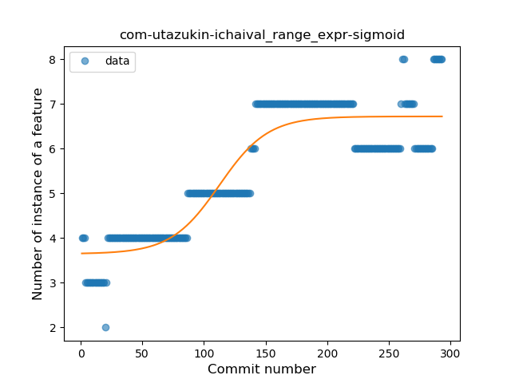

#### org-anibyl-slounik
* Feature: Function call with Named Argument
* Function: 
* R_Squared: 0.8375913
 

#### pl-hypeapp-episodie
* Feature: Singleton
* Function: 
* R_Squared: 0.83716097
 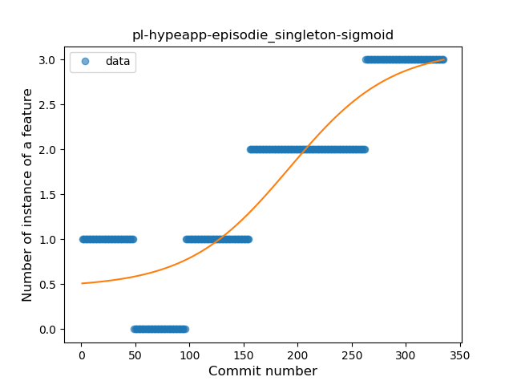

#### com-example-forgottenumbrella-cardboardmuseum
* Feature: Companion Object
* Function: 
* R_Squared: 0.83702249
 

#### org-mozilla-rocket
* Feature: Unsafe Call
* Function: 
* R_Squared: 0.83595468
 

#### nightlock-peppercarrot
* Feature: Property Delegation
* Function: 
* R_Squared: 0.83516081
 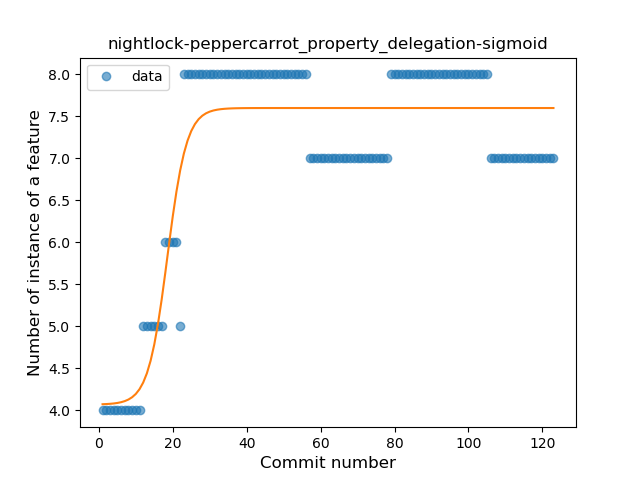

#### com-czbix-v2ex
* Feature: Inline Function
* Function: 
* R_Squared: 0.8344191
 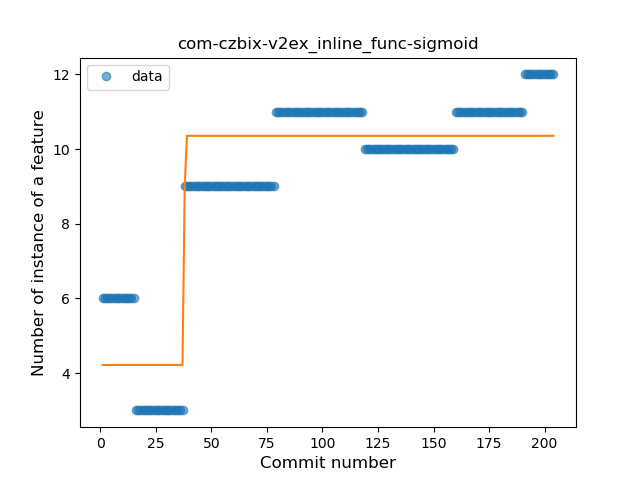

#### com-enjoyingfoss-om
* Feature: When expression
* Function: 
* R_Squared: 0.83411077
 

#### io-github-feelfreelinux-wykopmobilny
* Feature: Extension Function
* Function: 
* R_Squared: 0.83203974
 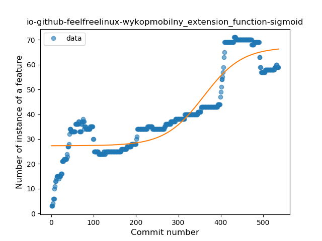

#### com-yubico-yubioath
* Feature: Extension Function
* Function: 
* R_Squared: 0.83125629
 

#### com-doctoror-particleswallpaper
* Feature: String Template
* Function: 
* R_Squared: 0.82887549
 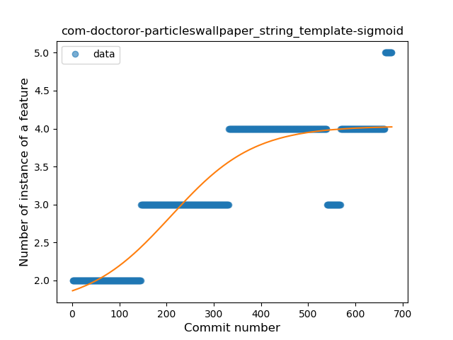

#### com-benoitquenaudon-tvfoot-red
* Feature: Unsafe Call
* Function: 
* R_Squared: 0.82737773
 

#### com-zeapo-pwdstore
* Feature: Extension Function
* Function: 
* R_Squared: 0.82534567
 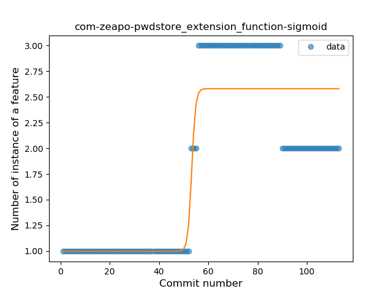

#### de-devmil-paperlaunch
* Feature: When expression
* Function: 
* R_Squared: 0.8252929
 

#### fr-chenry-android-freshrss
* Feature: Type Alias
* Function: 
* R_Squared: 0.82213187
 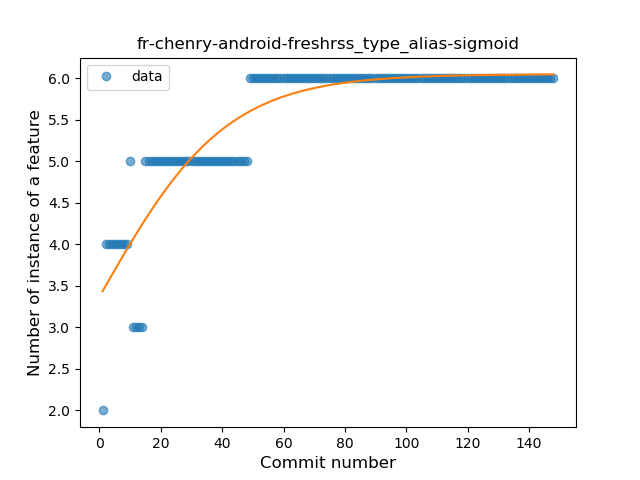

#### sk-styk-martin-apkanalyzer
* Feature: String Template
* Function: 
* R_Squared: 0.82121244
 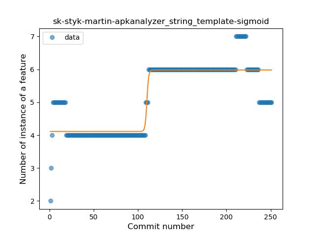

#### de-blankedv-lanbahnpanel
* Feature: Companion Object
* Function: 
* R_Squared: 0.81797032
 

#### ca-fuwafuwa-kaku
* Feature: Destructuring Declaration
* Function: 
* R_Squared: 0.81745753
 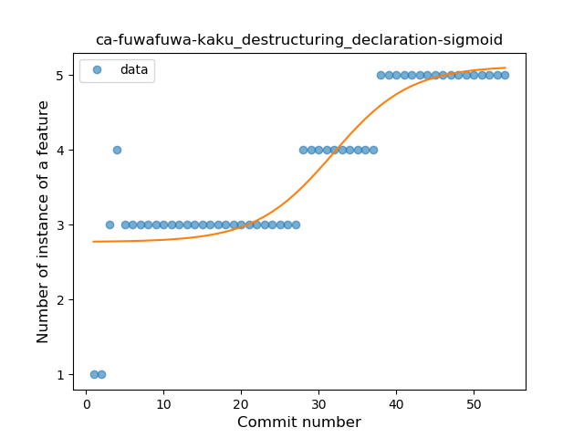

#### me-blog-korn123-easydiary
* Feature: Data Class
* Function: 
* R_Squared: 0.81580217
 

#### com-nononsenseapps-feeder
* Feature: Range Expression
* Function: 
* R_Squared: 0.8131006
 

#### com-moez-QKSMS
* Feature: Data Class
* Function: 
* R_Squared: 0.81290758
 

#### com-nononsenseapps-feeder
* Feature: Smart Cast
* Function: 
* R_Squared: 0.81282288
 

#### com-pyamsoft-homebutton
* Feature: Companion Object
* Function: 
* R_Squared: 0.81268553
 

#### com-adityakamble49-ttl
* Feature: Inline Function
* Function: 
* R_Squared: 0.81029015
 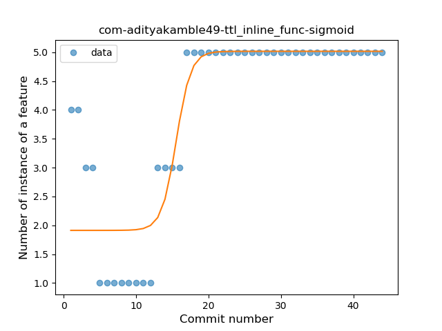

#### org-poul-bits-android
* Feature: Safe Call
* Function: 
* R_Squared: 0.80360741
 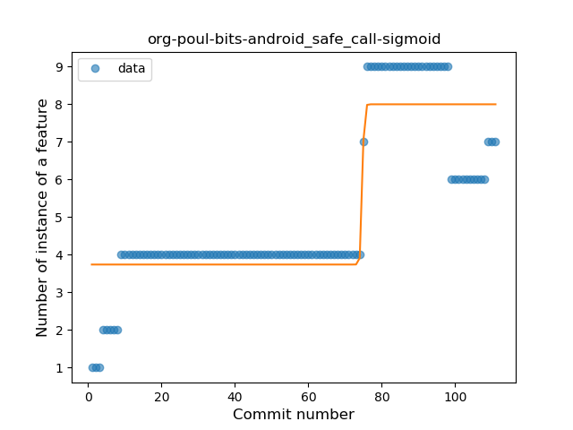

#### me-kirimin-mitsumine
* Feature: Safe Call
* Function: 
* R_Squared: 0.80296988
 

#### jp-takke-cpustats
* Feature: Safe Call
* Function: 
* R_Squared: 0.80143246
 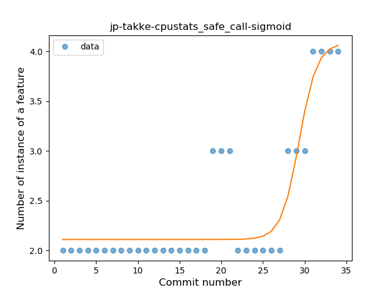

#### net-nurik-roman-muzei
* Feature: Coroutine
* Function: 
* R_Squared: 0.80026058
 

#### com-epimorphics-android-myrivers
* Feature: Function with Default Value
* Function: 
* R_Squared: 0.79852873
 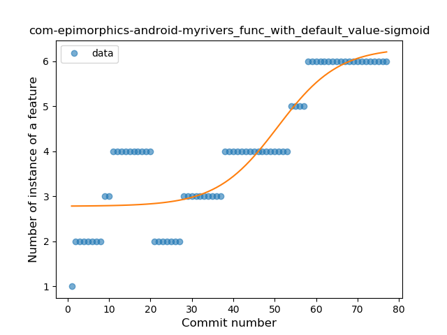

#### com-adityakamble49-ttl
* Feature: Safe Call
* Function: 
* R_Squared: 0.7958883
 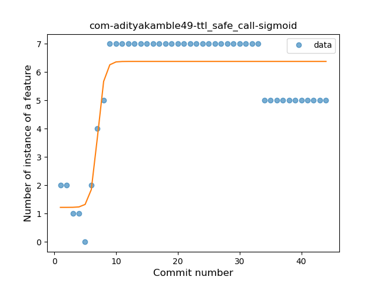

#### danbroid-searchview
* Feature: Unsafe Call
* Function: 
* R_Squared: 0.79208357
 

#### com-gimranov-zandy-app
* Feature: Safe Call
* Function: 
* R_Squared: 0.79142078
 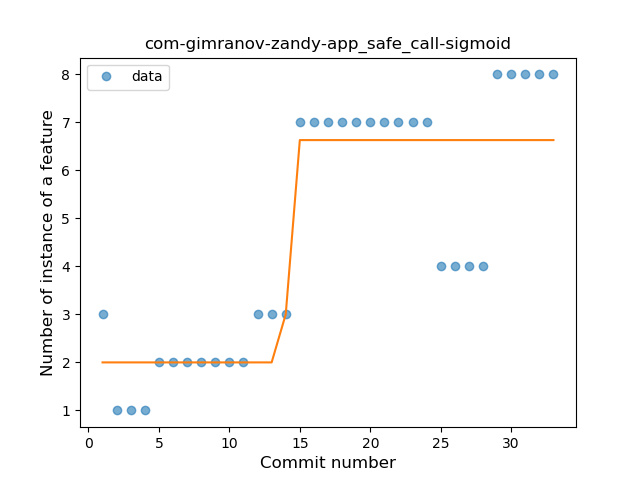

#### com-uncmorfi
* Feature: Range Expression
* Function: 
* R_Squared: 0.79065167
 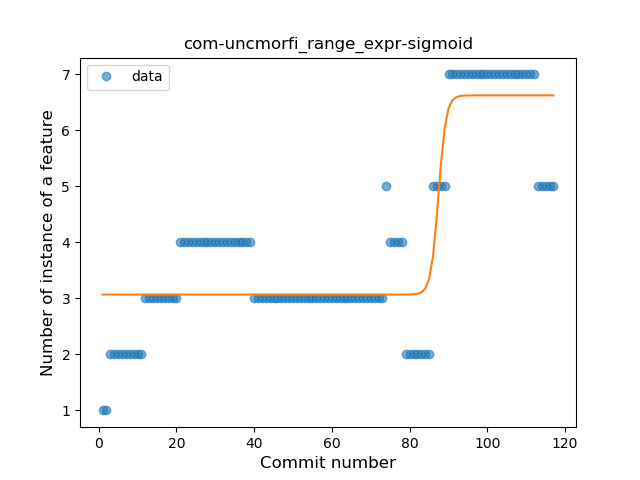

#### com-example-harisont-librery
* Feature: Companion Object
* Function: 
* R_Squared: 0.78657845
 

#### tk-superl2-xwifi
* Feature: Safe Call
* Function: 
* R_Squared: 0.78485891
 

#### chat-rocket-android
* Feature: Companion Object
* Function: 
* R_Squared: 0.78442588
 

#### de-csicar-mensaplan
* Feature: Smart Cast
* Function: 
* R_Squared: 0.78251547
 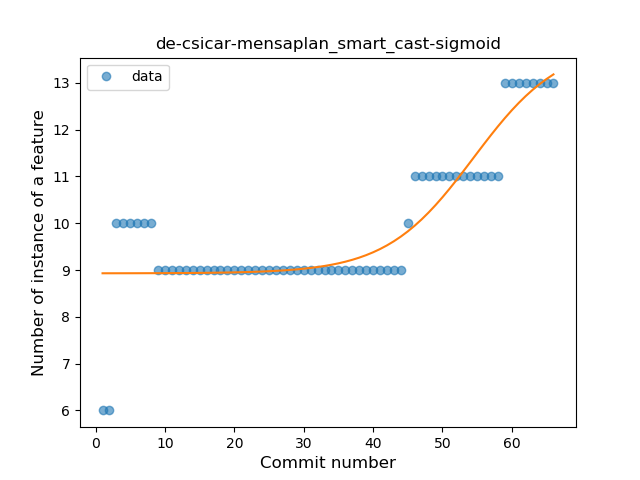

#### org-anibyl-slounik
* Feature: Extension Function
* Function: 
* R_Squared: 0.78213549
 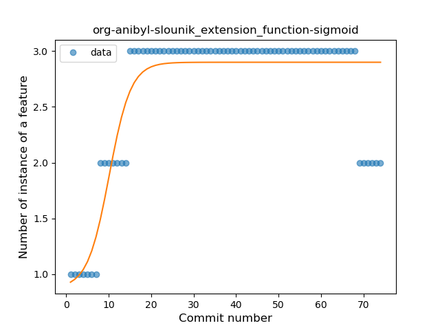

#### fr-chenry-android-freshrss
* Feature: Destructuring Declaration
* Function: 
* R_Squared: 0.77955836
 

#### me-anon-grow
* Feature: Property Delegation
* Function: 
* R_Squared: 0.77632752
 

#### com-simplemobiletools-applauncher
* Feature: When expression
* Function: 
* R_Squared: 0.77315391
 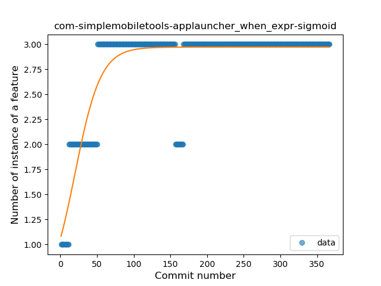

#### pl-org-seva-navigator
* Feature: String Template
* Function: 
* R_Squared: 0.77029116
 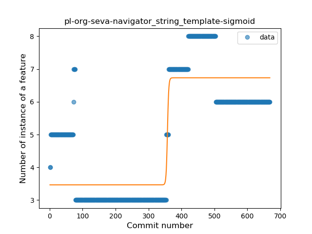

#### me-camsteffen-polite
* Feature: Destructuring Declaration
* Function: 
* R_Squared: 0.76917198
 

#### eu-the4thfloor-msync
* Feature: Coroutine
* Function: 
* R_Squared: 0.76803753
 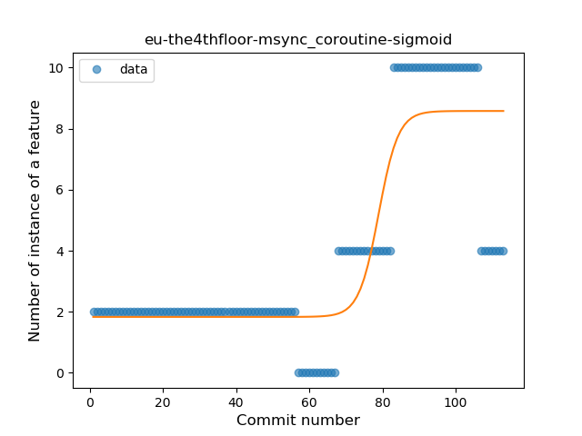

#### org-mattvchandler-progressbars
* Feature: Lambda
* Function: 
* R_Squared: 0.76450886
 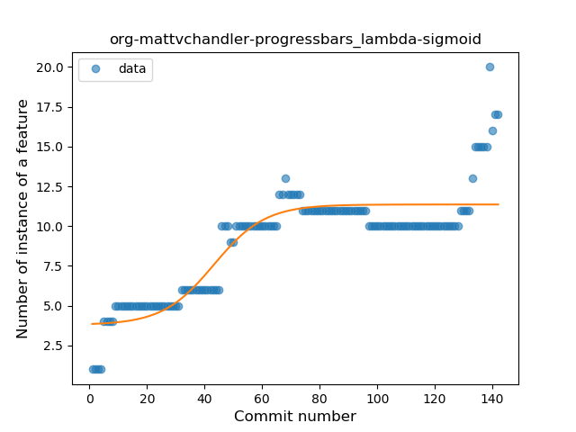

#### at-bitfire-davdroid
* Feature: Smart Cast
* Function: 
* R_Squared: 0.76413169
 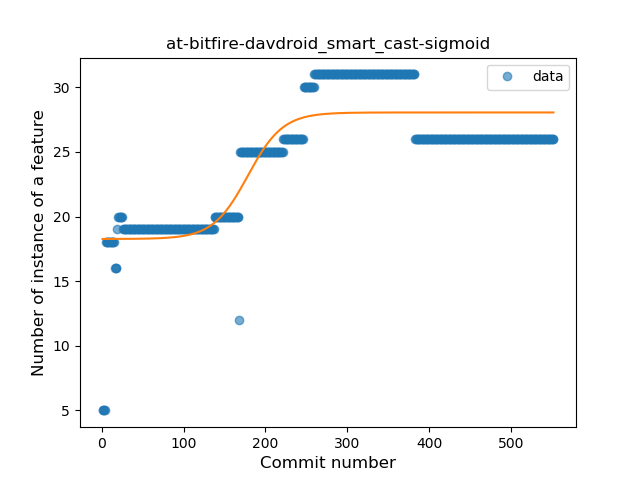

#### pl-temomuko-autostoprace
* Feature: Singleton
* Function: 
* R_Squared: 0.76267265
 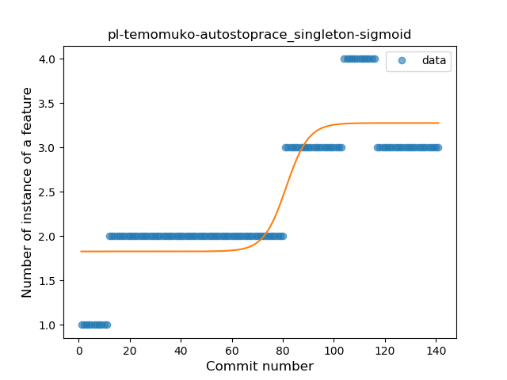

#### pw-janyo-whatanime
* Feature: When expression
* Function: 
* R_Squared: 0.76207183
 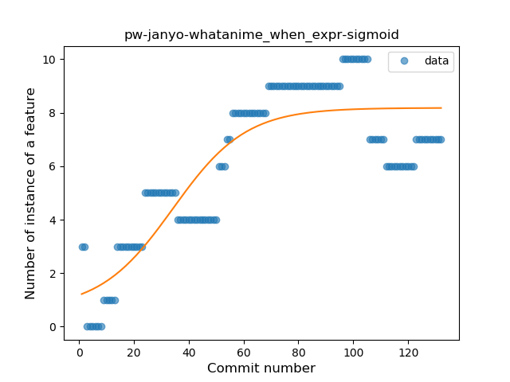

#### com-log28
* Feature: When expression
* Function: 
* R_Squared: 0.75957631
 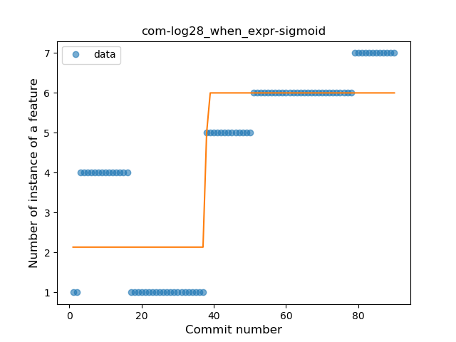

#### com-tumblr-svetylk0-sheepsgohome-android
* Feature: Companion Object
* Function: 
* R_Squared: 0.75864688
 

#### pt-ipleiria-mymusicqoe
* Feature: Extension Function
* Function: 
* R_Squared: 0.75605695
 

#### com-doctoror-particleswallpaper
* Feature: Inline Function
* Function: 
* R_Squared: 0.75488677
 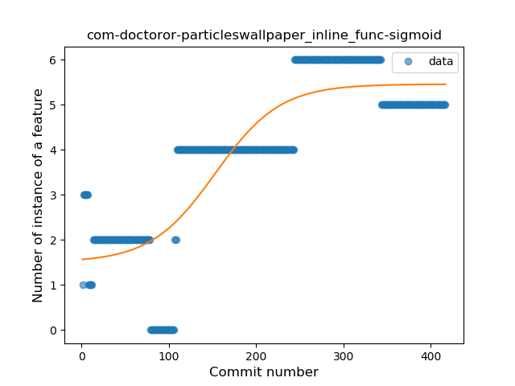

#### uk-colessoft-android-hilllist
* Feature: Function with Default Value
* Function: 
* R_Squared: 0.75423249
 

#### com-pixplicity-cryptogram
* Feature: Function with Default Value
* Function: 
* R_Squared: 0.7532584
 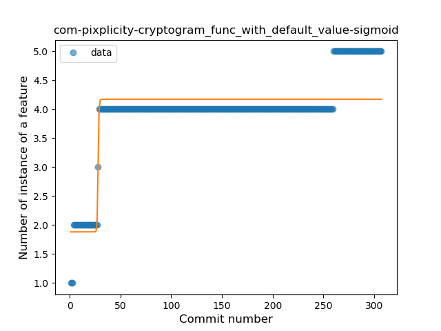

#### fr-openium-auvergnewebcams
* Feature: Function with Default Value
* Function: 
* R_Squared: 0.75317831
 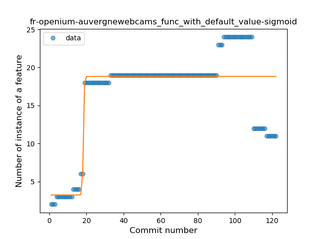

#### superustats-tool-android
* Feature: Type Inference
* Function: 
* R_Squared: 0.74461663
 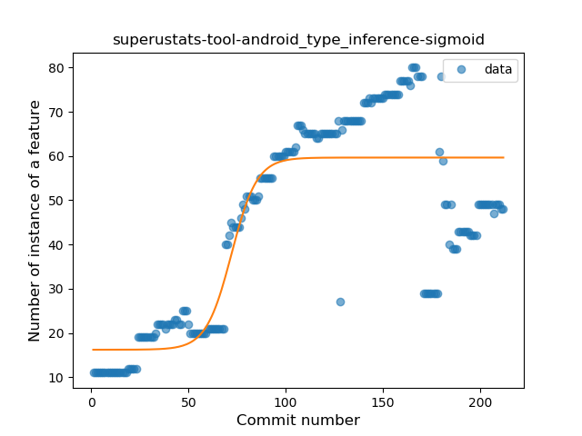

#### com-dozingcatsoftware-vectorcamera
* Feature: Singleton
* Function: 
* R_Squared: 0.74392478
 

#### org-ligi-survivalmanual
* Feature: When expression
* Function: 
* R_Squared: 0.7434655
 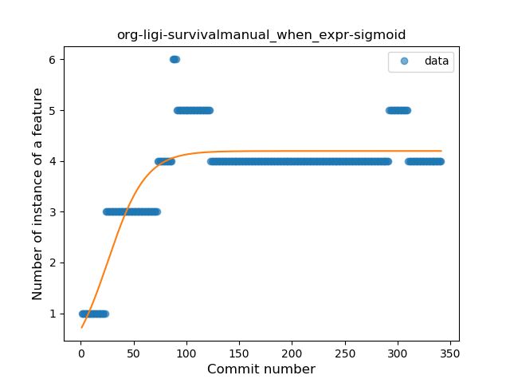

#### nl-brouwerijdemolen-borefts2013
* Feature: Function call with Named Argument
* Function: 
* R_Squared: 0.74235096
 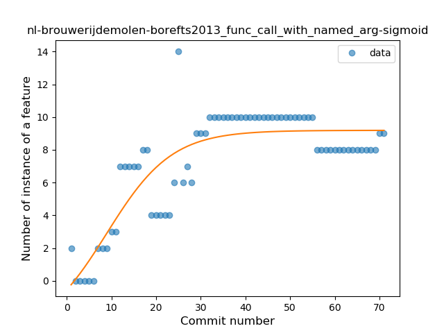

#### com-pyamsoft-homebutton
* Feature: Safe Call
* Function: 
* R_Squared: 0.73789277
 

#### is-xyz-mpv
* Feature: Destructuring Declaration
* Function: 
* R_Squared: 0.72377642
 

#### com-bubelov-coins
* Feature: Companion Object
* Function: 
* R_Squared: 0.72227158
 

#### at-bitfire-davdroid
* Feature: Data Class
* Function: 
* R_Squared: 0.7202077
 

#### com-garpr-android
* Feature: Destructuring Declaration
* Function: 
* R_Squared: 0.71864042
 

#### it-diab
* Feature: Function call with Named Argument
* Function: 
* R_Squared: 0.71555323
 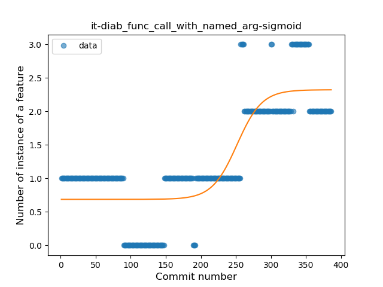

#### org-mosad-seil0-projectlaogai
* Feature: Function with Default Value
* Function: 
* R_Squared: 0.71320217
 

#### com-scientists-happy-botanist
* Feature: Unsafe Call
* Function: 
* R_Squared: 0.70779076
 

#### horse-amazin-my-stratum0-statuswidget
* Feature: Singleton
* Function: 
* R_Squared: 0.70351378
 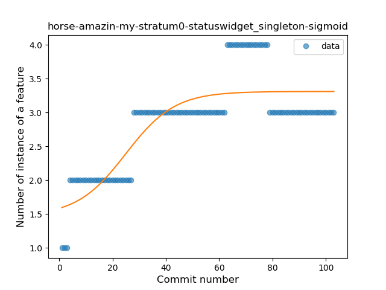

#### tech-ula
* Feature: Companion Object
* Function: 
* R_Squared: 0.70211257
 

#### cat-pantsu-nyaapantsu
* Feature: Function call with Named Argument
* Function: 
* R_Squared: 0.70196878
 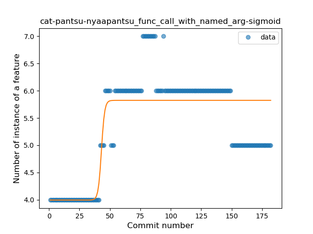

#### com-simplemobiletools-applauncher
* Feature: Unsafe Call
* Function: 
* R_Squared: 0.70071467
 

#### com-pitchedapps-frost
* Feature: Property Delegation
* Function: 
* R_Squared: 0.69856007
 

#### com-pyamsoft-homebutton
* Feature: Smart Cast
* Function: 
* R_Squared: 0.69750561
 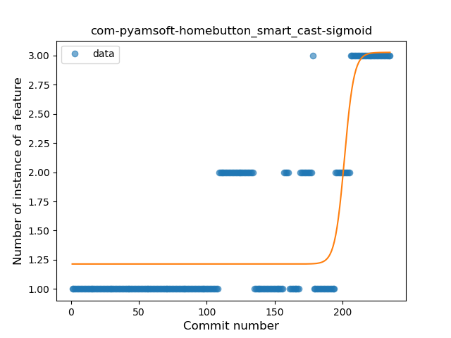

#### tech-ula
* Feature: Destructuring Declaration
* Function: 
* R_Squared: 0.69033045
 

#### com-simplemobiletools-contacts-pro
* Feature: Companion Object
* Function: 
* R_Squared: 0.68603637
 

#### com-atanana-sicounter
* Feature: Data Class
* Function: 
* R_Squared: 0.67746966
 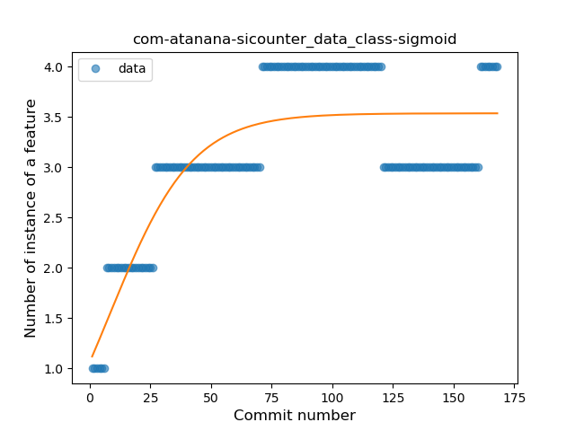

#### com-example-harisont-librery
* Feature: String Template
* Function: 
* R_Squared: 0.66971651
 

#### com-sduduzog-slimlauncher
* Feature: Data Class
* Function: 
* R_Squared: 0.66572805
 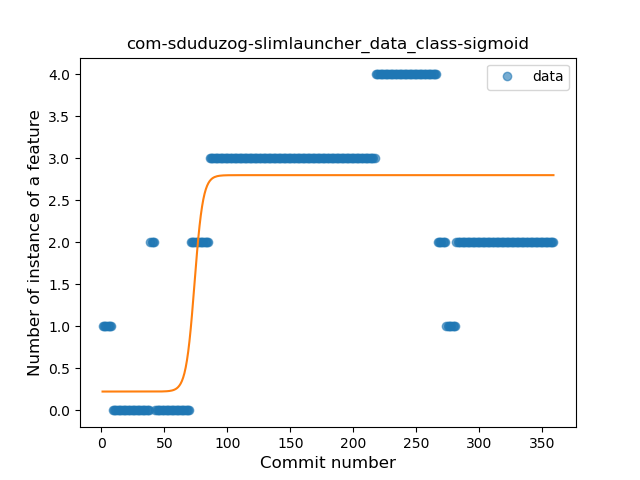

#### pl-temomuko-autostoprace
* Feature: Type Inference
* Function: 
* R_Squared: 0.65582877
 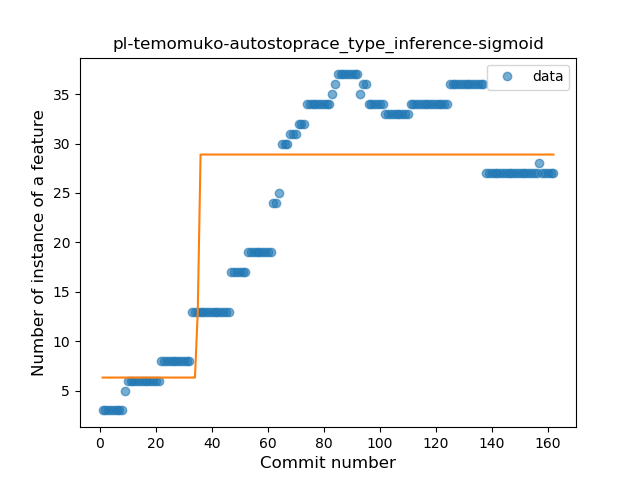

#### me-rei_m-hyakuninisshu
* Feature: String Template
* Function: 
* R_Squared: 0.65026534
 

#### org-teamblueridge-pasteitapp
* Feature: When expression
* Function: 
* R_Squared: 0.64213911
 

#### com-simplemobiletools-camera
* Feature: When expression
* Function: 
* R_Squared: 0.63868308
 

#### org-ligi-gobandroid
* Feature: Smart Cast
* Function: 
* R_Squared: 0.62985827
 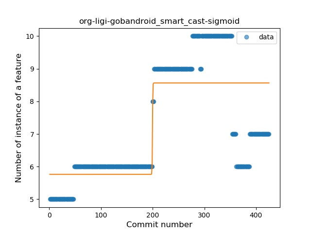

#### me-murks-feedwatcher
* Feature: Function with Default Value
* Function: 
* R_Squared: 0.62871756
 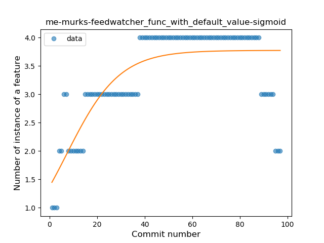

#### com-atanana-sicounter
* Feature: When expression
* Function: 
* R_Squared: 0.61871959
 

#### de-ironjan-mensaupb
* Feature: Lambda
* Function: 
* R_Squared: 0.61477312
 

#### com-mgaetan89-showsrage
* Feature: Singleton
* Function: 
* R_Squared: 0.61395832
 

#### com-simplemobiletools-contacts-pro
* Feature: Smart Cast
* Function: 
* R_Squared: 0.61242322
 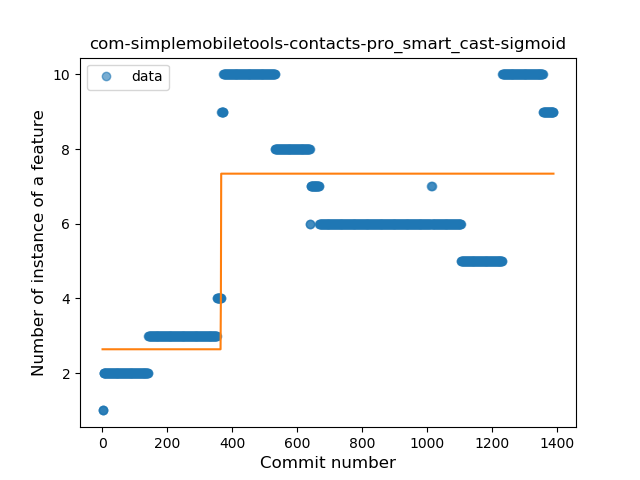

#### com-conorodonnell-bus
* Feature: Type Inference
* Function: 
* R_Squared: 0.6124219
 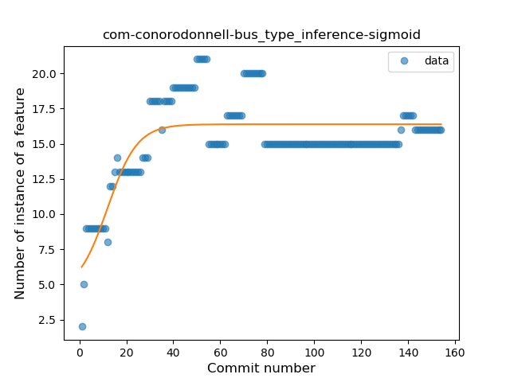

#### nightlock-peppercarrot
* Feature: String Template
* Function: 
* R_Squared: 0.60445047
 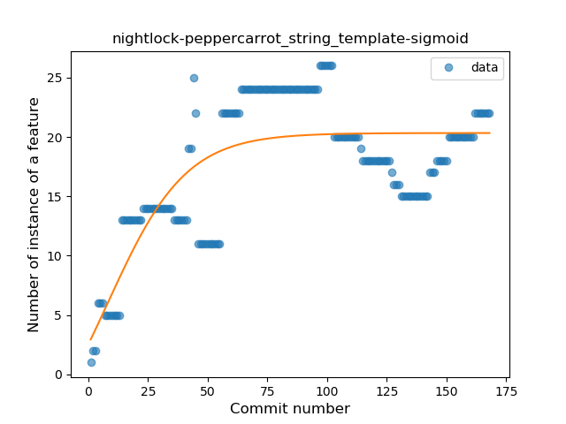

#### net-stew-stew
* Feature: When expression
* Function: 
* R_Squared: 0.59432766
 

#### nightlock-peppercarrot
* Feature: Smart Cast
* Function: 
* R_Squared: 0.57502633
 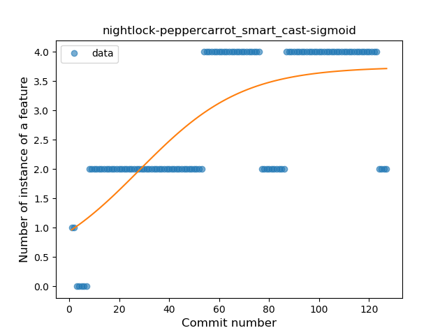

#### com-simplemobiletools-clock
* Feature: Data Class
* Function: 
* R_Squared: 0.56393544
 

#### com-simplemobiletools-musicplayer
* Feature: Function call with Named Argument
* Function: 
* R_Squared: 0.56034696
 

#### nightlock-peppercarrot
* Feature: Safe Call
* Function: 
* R_Squared: 0.55322278
 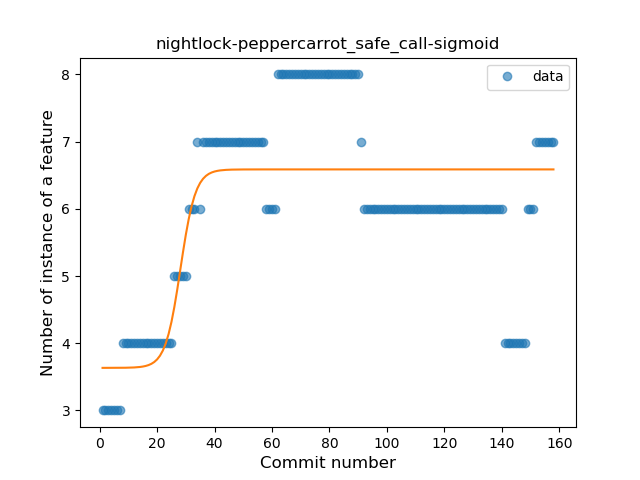

#### com-directdev-portal
* Feature: Smart Cast
* Function: 
* R_Squared: 0.54796986
 

#### com-ofalvai-bpinfo
* Feature: Unsafe Call
* Function: 
* R_Squared: 0.53738226
 

#### pw-janyo-janyoshare
* Feature: Range Expression
* Function: 
* R_Squared: 0.53694188
 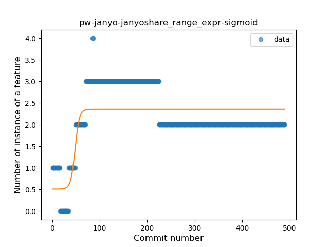

#### com-calintat-sensors
* Feature: Extension Function
* Function: 
* R_Squared: 0.52416783
 

#### com-bubelov-coins
* Feature: When expression
* Function: 
* R_Squared: 0.52360741
 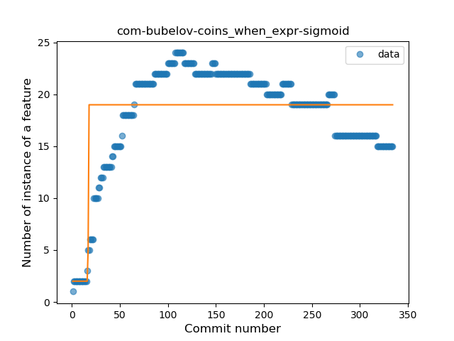

#### com-moez-QKSMS
* Feature: Singleton
* Function: 
* R_Squared: 0.52140008
 

#### com-atanana-sicounter
* Feature: Companion Object
* Function: 
* R_Squared: 0.5206402
 

#### com-nononsenseapps-feeder
* Feature: Companion Object
* Function: 
* R_Squared: 0.50109739
 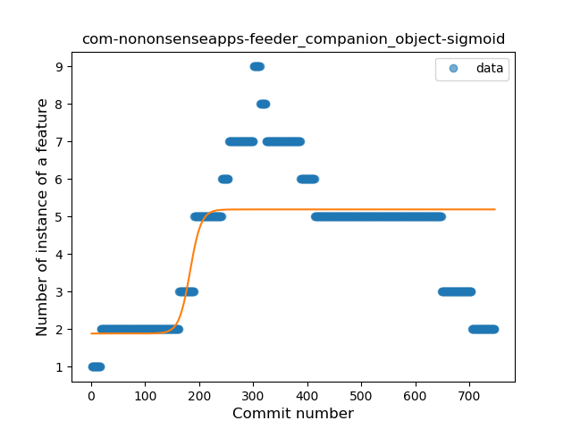

#### com-arcao-geocaching4locus
* Feature: Unsafe Call
* Function: 
* R_Squared: 0.50101083
 

#### com-bubelov-coins
* Feature: String Template
* Function: 
* R_Squared: 0.49556466
 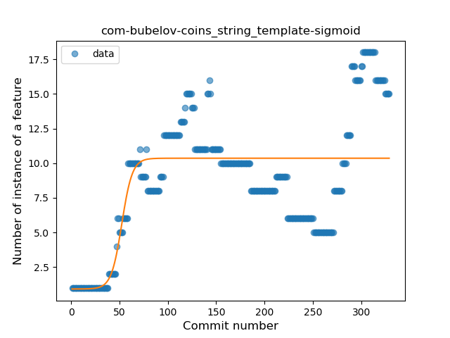

#### org-ligi-passandroid
* Feature: Singleton
* Function: 
* R_Squared: 0.48994346
 

#### college-wyk-app
* Feature: String Template
* Function: 
* R_Squared: 0.4875817
 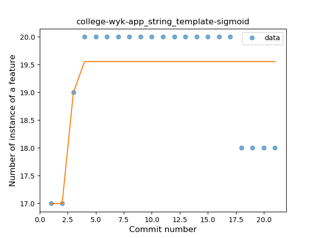

#### se-barsk-park
* Feature: Destructuring Declaration
* Function: 
* R_Squared: 0.48748375
 

#### jp-cordea-mackerelclient
* Feature: Function call with Named Argument
* Function: 
* R_Squared: 0.47923396
 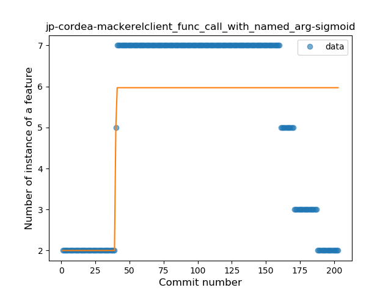

#### org-mosad-seil0-projectlaogai
* Feature: Safe Call
* Function: 
* R_Squared: 0.47916666
 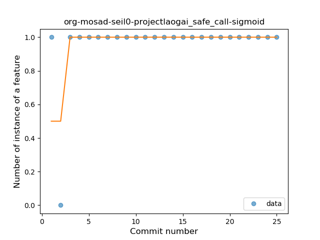

#### com-fastaccess-github-libre
* Feature: Function call with Named Argument
* Function: 
* R_Squared: 0.4718866
 

#### com-garpr-android
* Feature: Range Expression
* Function: 
* R_Squared: 0.46191427
 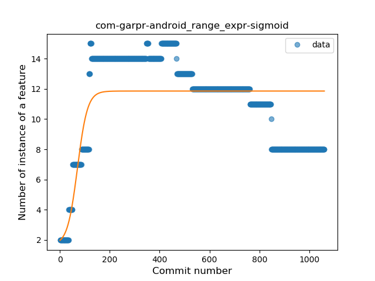

#### org-kiwix-kiwixcustomwikivoyageeurope
* Feature: Safe Call
* Function: 
* R_Squared: 0.45600453
 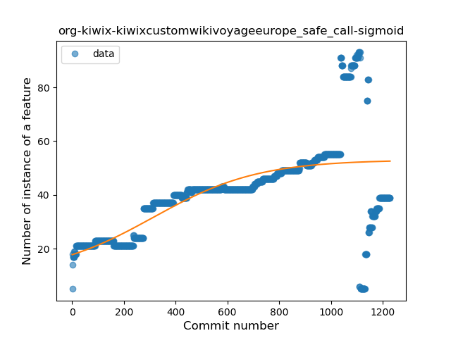

#### pl-poznajapp
* Feature: Unsafe Call
* Function: 
* R_Squared: 0.43837397
 

#### com-uncmorfi
* Feature: Unsafe Call
* Function: 
* R_Squared: 0.43188947
 

#### com-ahorcado
* Feature: When expression
* Function: 
* R_Squared: 0.43031649
 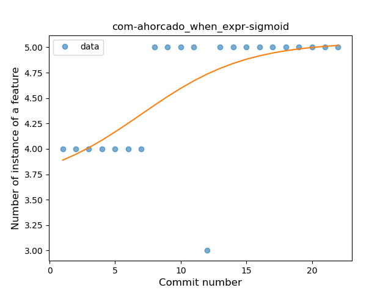

#### it-diab
* Feature: Extension Function
* Function: 
* R_Squared: 0.43017399
 

#### com-njlabs-showjava
* Feature: Singleton
* Function: 
* R_Squared: 0.42329687
 

#### org-ligi-ipfsdroid
* Feature: Unsafe Call
* Function: 
* R_Squared: 0.42271562
 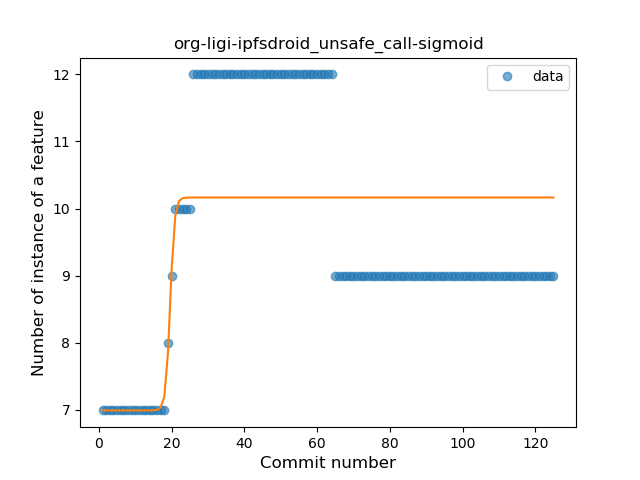

#### com-sduduzog-slimlauncher
* Feature: When expression
* Function: 
* R_Squared: 0.42003007
 

#### org-kiwix-kiwixcustomwikivoyageeurope
* Feature: Property Delegation
* Function: 
* R_Squared: 0.4156977
 

#### com-yubico-yubioath
* Feature: Coroutine
* Function: 
* R_Squared: 0.41057234
 

#### pl-org-seva-texter
* Feature: Infix Function
* Function: 
* R_Squared: 0.40044042
 

#### superustats-tool-android
* Feature: When expression
* Function: 
* R_Squared: 0.38576486
 

#### com-simplemobiletools-musicplayer
* Feature: String Template
* Function: 
* R_Squared: 0.38306676
 

#### org-kiwix-kiwixcustomwikivoyageeurope
* Feature: Function with Default Value
* Function: 
* R_Squared: 0.3642009
 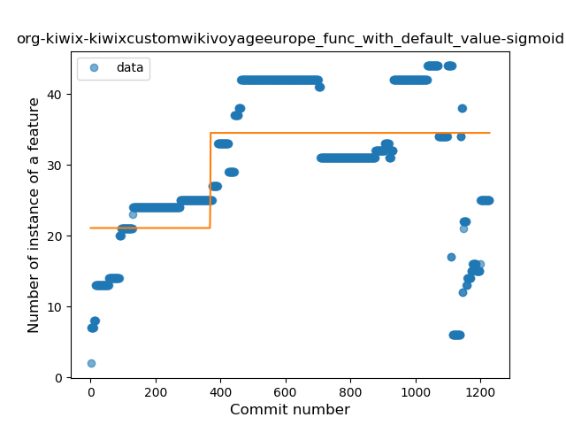

#### com-github-premnirmal-tickerwidget
* Feature: Smart Cast
* Function: 
* R_Squared: 0.36043518
 

#### io-ipoli-android
* Feature: Overloaded Operator
* Function: 
* R_Squared: 0.35508865
 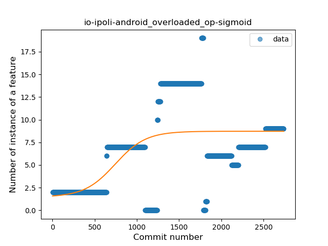

#### org-mosad-seil0-projectlaogai
* Feature: Destructuring Declaration
* Function: 
* R_Squared: 0.34862355
 

#### com-sduduzog-slimlauncher
* Feature: String Template
* Function: 
* R_Squared: 0.34445407
 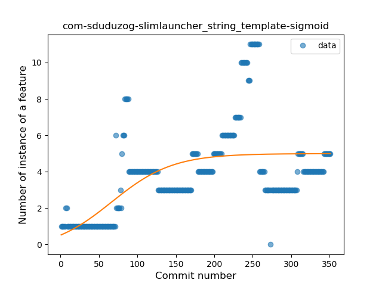

#### eu-the4thfloor-msync
* Feature: Safe Call
* Function: 
* R_Squared: 0.33780934
 

#### superustats-tool-android
* Feature: Companion Object
* Function: 
* R_Squared: 0.33003939
 

#### link-standen-michael-phonesaver
* Feature: Unsafe Call
* Function: 
* R_Squared: 0.32913614
 

#### at-bitfire-icsdroid
* Feature: When expression
* Function: 
* R_Squared: 0.31878496
 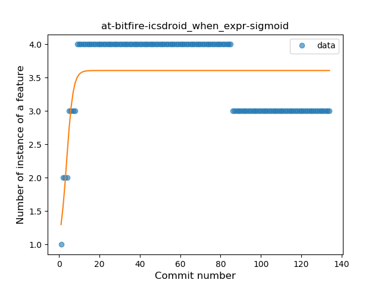

#### com-simplemobiletools-applauncher
* Feature: Companion Object
* Function: 
* R_Squared: 0.30628072
 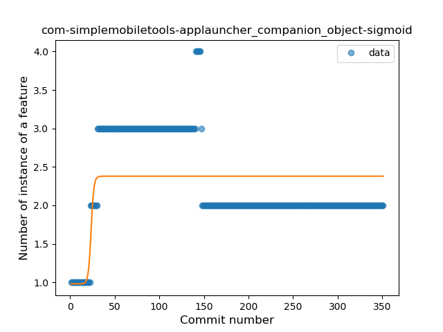

#### de-r4md4c-gamedealz
* Feature: Destructuring Declaration
* Function: 
* R_Squared: 0.29320736
 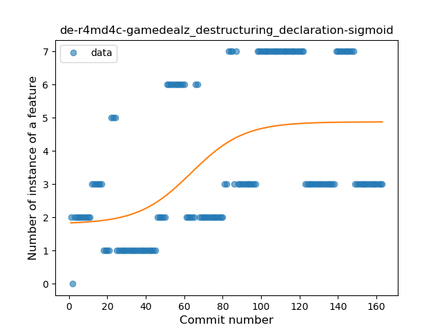

#### com-mgaetan89-showsrage
* Feature: Property Delegation
* Function: 
* R_Squared: 0.28747851
 

#### com-duckduckgo-mobile-android
* Feature: Destructuring Declaration
* Function: 
* R_Squared: 0.27920227
 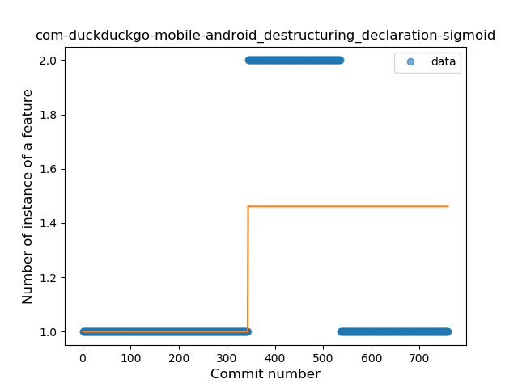

#### org-ligi-survivalmanual
* Feature: Singleton
* Function: 
* R_Squared: 0.27755938
 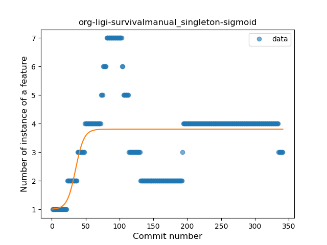

#### org-kiwix-kiwixcustomwikivoyageeurope
* Feature: Companion Object
* Function: 
* R_Squared: 0.268761
 

#### com-bubelov-coins
* Feature: Smart Cast
* Function: 
* R_Squared: 0.26465889
 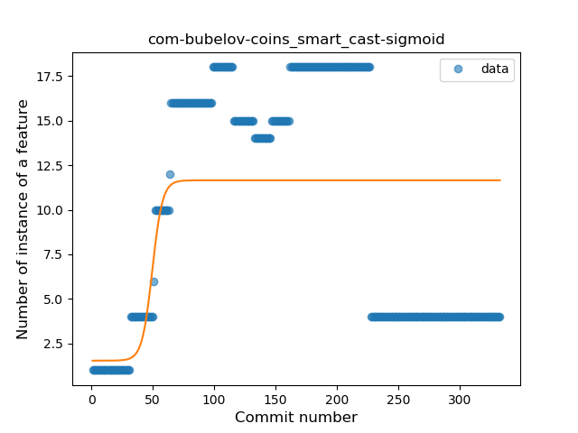

#### com-simplemobiletools-camera
* Feature: Extension Function
* Function: 
* R_Squared: 0.23932055
 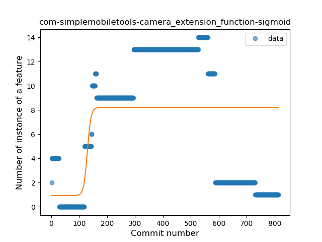

#### net-nonylene-photolinkviewer
* Feature: Range Expression
* Function: 
* R_Squared: 0.23655903
 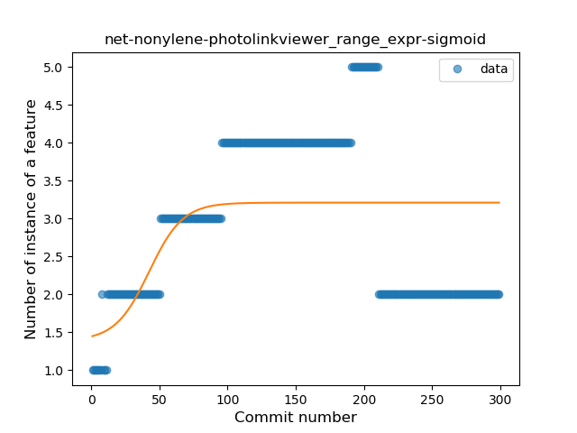

#### io-trewartha-positional
* Feature: String Template
* Function: 
* R_Squared: 0.23650233
 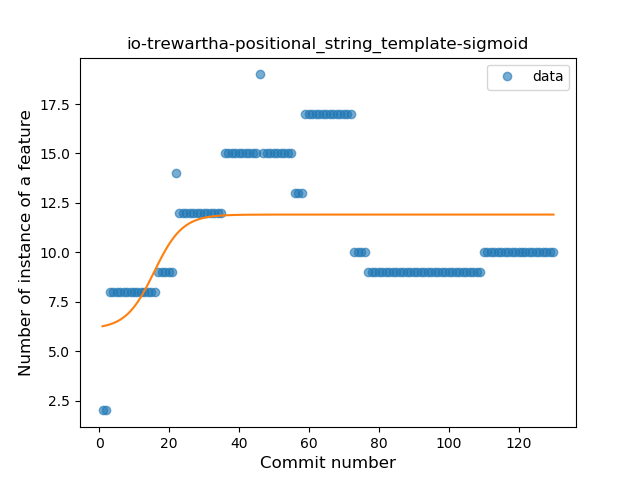

#### me-rei_m-hyakuninisshu
* Feature: Range Expression
* Function: 
* R_Squared: 0.22623807
 

#### com-calintat-sensors
* Feature: Companion Object
* Function: 
* R_Squared: 0.21748647
 

#### org-fossasia-badgemagic
* Feature: Function with Default Value
* Function: 
* R_Squared: 0.21608791
 

#### pl-org-seva-texter
* Feature: Singleton
* Function: 
* R_Squared: 0.2074525
 

#### org-kiwix-kiwixcustomwikivoyageeurope
* Feature: Unsafe Call
* Function: 
* R_Squared: 0.19371688
 

#### com-guerinet-mymartlet
* Feature: Unsafe Call
* Function: 
* R_Squared: 0.18937412
 

#### io-ipoli-android
* Feature: Super Delegation
* Function: 
* R_Squared: 0.18932397
 

#### ai-susi
* Feature: Destructuring Declaration
* Function: 
* R_Squared: 0.18628857
 

#### com-atanana-sicounter
* Feature: Safe Call
* Function: 
* R_Squared: 0.1772252
 

#### org-kaqui
* Feature: Inline Function
* Function: 
* R_Squared: 0.17237628
 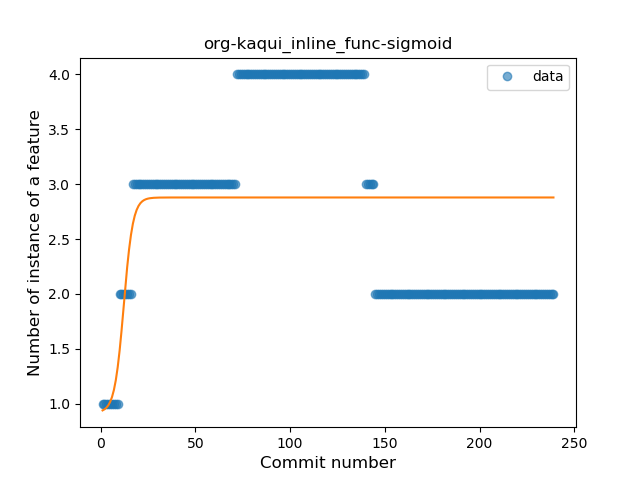

#### at-bitfire-davdroid
* Feature: Range Expression
* Function: 
* R_Squared: 0.15648399
 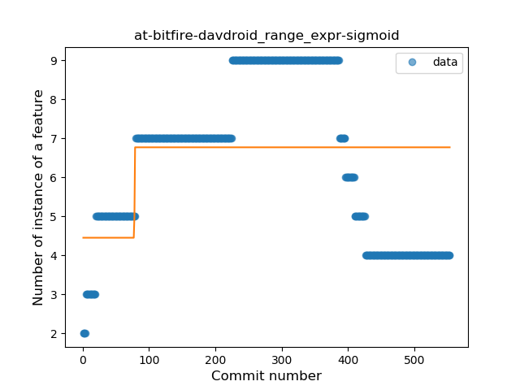

#### com-yubico-yubioath
* Feature: Smart Cast
* Function: 
* R_Squared: 0.1482143
 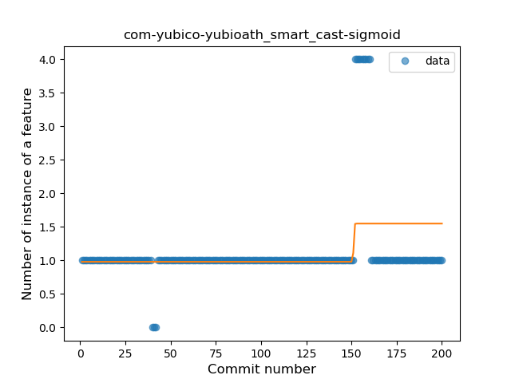

#### com-simplemobiletools-musicplayer
* Feature: Range Expression
* Function: 
* R_Squared: 0.14277078
 

#### com-sduduzog-slimlauncher
* Feature: Function call with Named Argument
* Function: 
* R_Squared: 0.07149816
 

