## Plateau Gradual Decline
----
**20** best fit

#### equeim-tremotesf-android
* Feature: Singleton
* Function: 
* R_Squared: 0.99340592
 

#### enjoyingfoss-om
* Feature: Property Delegation
* Function: 
* R_Squared: 0.92473991
 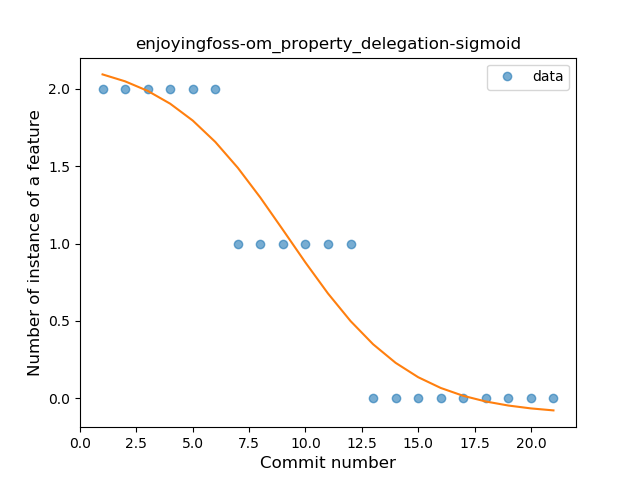

#### calintat-units
* Feature: Function with Default Value
* Function: 
* R_Squared: 0.92085427
 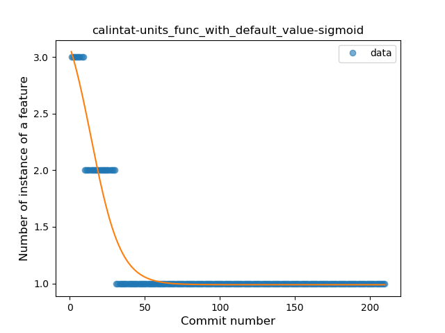

#### ronocod-bus
* Feature: Inline Function
* Function: 
* R_Squared: 0.91864843
 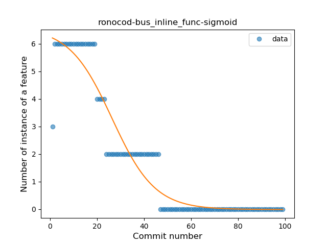

#### kirimin-mitsumine
* Feature: Singleton
* Function: 
* R_Squared: 0.91857751
 

#### OpenLauncherTeam-openlauncher
* Feature: Smart Cast
* Function: 
* R_Squared: 0.88629466
 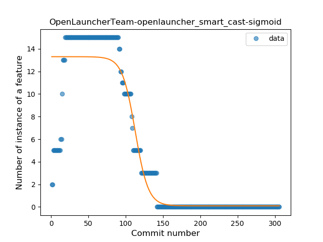

#### fvasco-pinpoi
* Feature: Inline Function
* Function: 
* R_Squared: 0.87982138
 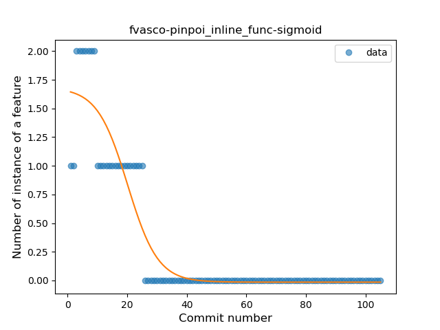

#### calintat-sensors
* Feature: Unsafe Call
* Function: 
* R_Squared: 0.87685748
 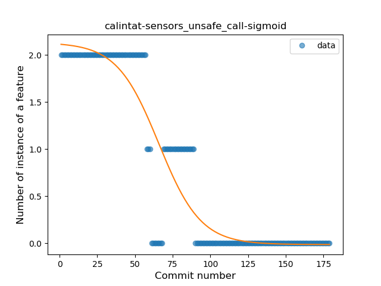

#### OpenLauncherTeam-openlauncher
* Feature: Companion Object
* Function: 
* R_Squared: 0.86951457
 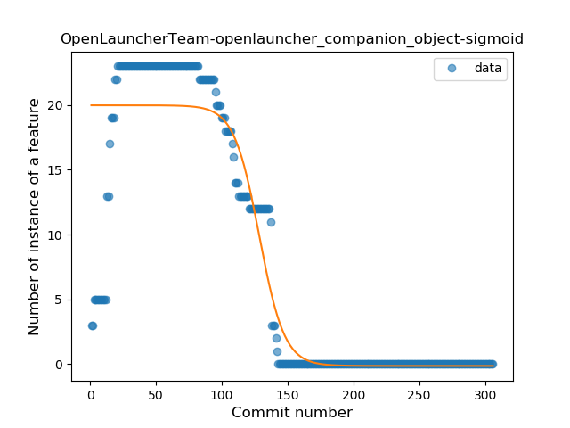

#### OpenLauncherTeam-openlauncher
* Feature: Singleton
* Function: 
* R_Squared: 0.86742802
 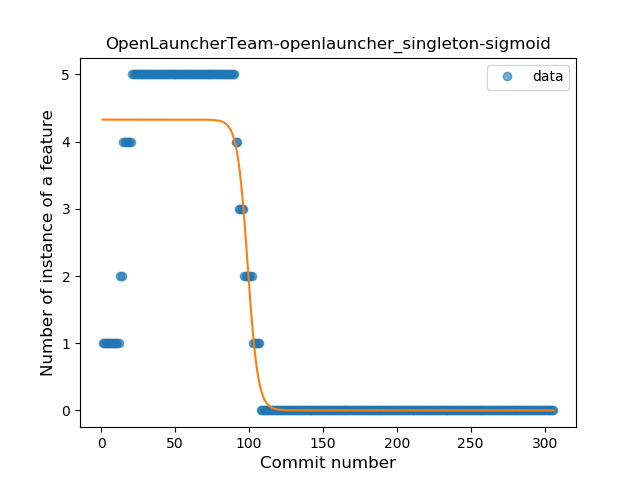

#### calintat-sensors
* Feature: String Template
* Function: 
* R_Squared: 0.84441775
 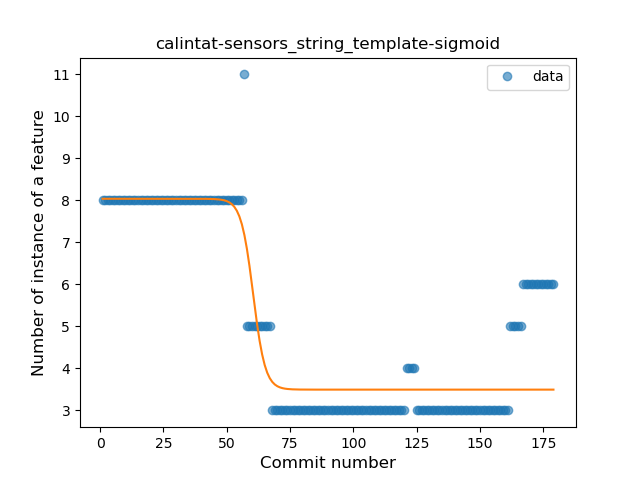

#### Doctoror-ParticleConstellationsLiveWallpaper
* Feature: Companion Object
* Function: 
* R_Squared: 0.79219704
 

#### Depau-EtchDroid
* Feature: Smart Cast
* Function: 
* R_Squared: 0.70158757
 

#### ronocod-bus
* Feature: Extension Function
* Function: 
* R_Squared: 0.60815418
 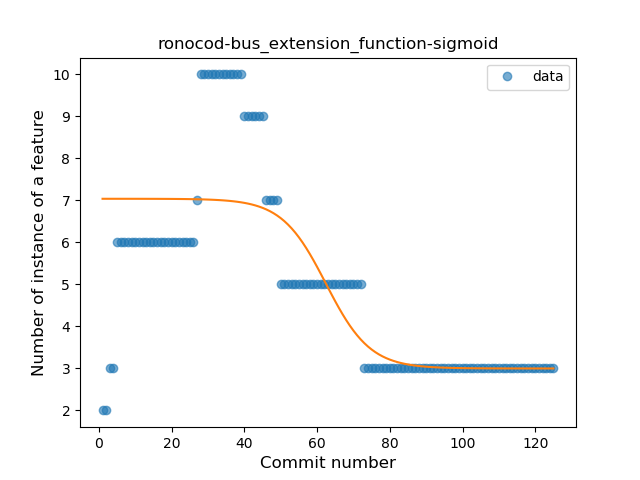

#### abertschi-ad-free
* Feature: Singleton
* Function: 
* R_Squared: 0.39328432
 

#### abertschi-ad-free
* Feature: Property Delegation
* Function: 
* R_Squared: 0.39328432
 

#### SimpleMobileTools-Simple-Camera
* Feature: String Template
* Function: 
* R_Squared: 0.35372491
 

#### nathanj-ogsdroid
* Feature: Destructuring Declaration
* Function: 
* R_Squared: 0.20095368
 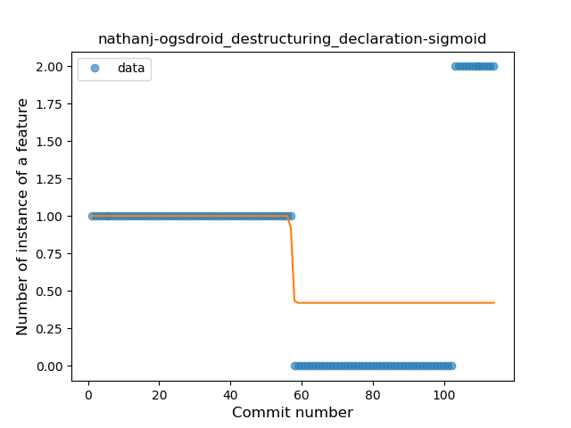

#### tasomaniac-OpenLinkWith
* Feature: Range Expression
* Function: 
* R_Squared: 0.13753327
 

#### PaulWoitaschek-Voice
* Feature: Destructuring Declaration
* Function: 
* R_Squared: 0.04361088
 

