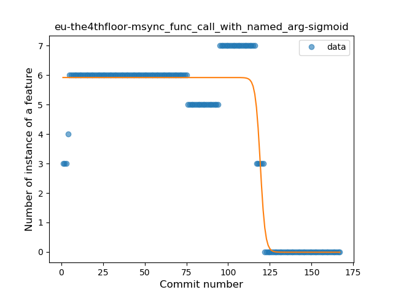
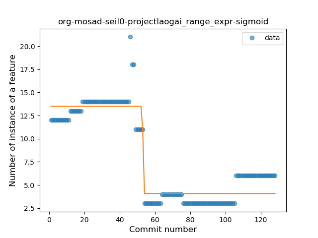
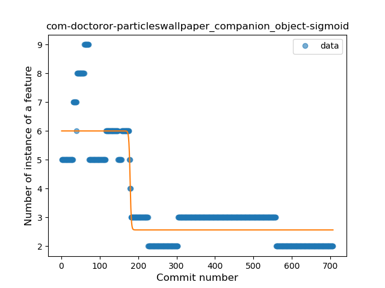
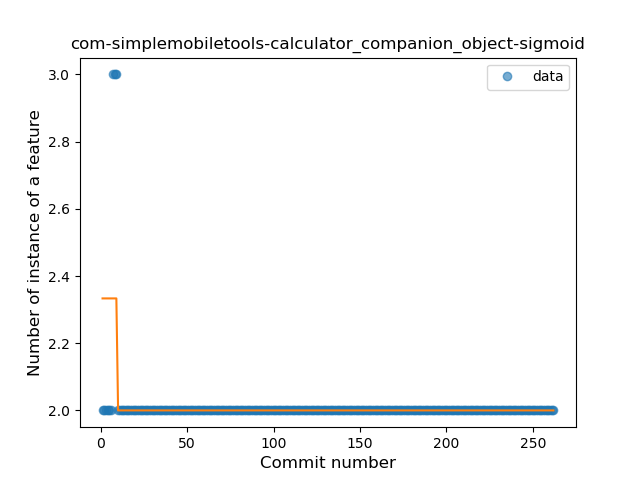
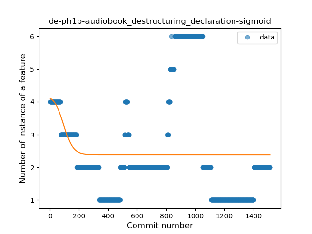

## Plateau Gradual Decline
----
**36** best fit

#### org-kiwix-kiwixcustomwikivoyageeurope
* Feature: Overloaded Operator
* Function: 
* R_Squared: 0.98372727
 

#### me-echeung-moemoekyun-fdroid
* Feature: Range Expression
* Function: 
* R_Squared: 0.9686859
 

#### com-directdev-portal
* Feature: Property Delegation
* Function: 
* R_Squared: 0.96221901
 

#### me-camsteffen-polite
* Feature: Range Expression
* Function: 
* R_Squared: 0.94764597
 

#### org-equeim-tremotesf
* Feature: Singleton
* Function: 
* R_Squared: 0.94412038
 

#### at-bitfire-icsdroid
* Feature: Function with Default Value
* Function: 
* R_Squared: 0.93602652
 

#### com-enjoyingfoss-om
* Feature: Property Delegation
* Function: 
* R_Squared: 0.93263865
 

#### eu-the4thfloor-msync
* Feature: Function call with Named Argument
* Function: 
* R_Squared: 0.93251677
 

#### fr-chenry-android-freshrss
* Feature: Overloaded Operator
* Function: 
* R_Squared: 0.9240728
 

#### com-example-forgottenumbrella-cardboardmuseum
* Feature: Unsafe Call
* Function: 
* R_Squared: 0.92402335
 

#### com-calintat-units
* Feature: Function with Default Value
* Function: 
* R_Squared: 0.92085427
 

#### org-mosad-seil0-projectlaogai
* Feature: Range Expression
* Function: 
* R_Squared: 0.9051511
 

#### com-benny-openlauncher
* Feature: Singleton
* Function: 
* R_Squared: 0.88200112
 

#### io-github-fvasco-pinpoi
* Feature: Inline Function
* Function: 
* R_Squared: 0.88124576
 

#### com-calintat-sensors
* Feature: Unsafe Call
* Function: 
* R_Squared: 0.87685748
 

#### pl-org-seva-texter
* Feature: Smart Cast
* Function: 
* R_Squared: 0.86805359
 

#### com-calintat-sensors
* Feature: String Template
* Function: 
* R_Squared: 0.84441775
 

#### com-github-premnirmal-tickerwidget
* Feature: Destructuring Declaration
* Function: 
* R_Squared: 0.83544346
 

#### com-github-cvzi-screenshottile
* Feature: Unsafe Call
* Function: 
* R_Squared: 0.8242551
 

#### com-ids1024-whitakerswords
* Feature: Safe Call
* Function: 
* R_Squared: 0.80401537
 

#### com-doctoror-particleswallpaper
* Feature: Companion Object
* Function: 
* R_Squared: 0.79371494
 

#### org-equeim-tremotesf
* Feature: Smart Cast
* Function: 
* R_Squared: 0.77168765
 

#### eu-the4thfloor-msync
* Feature: Destructuring Declaration
* Function: 
* R_Squared: 0.76076856
 

#### superustats-tool-android
* Feature: Function with Default Value
* Function: 
* R_Squared: 0.74828258
 

#### org-emunix-insteadlauncher
* Feature: Range Expression
* Function: 
* R_Squared: 0.73888997
 

#### eu-depau-etchdroid
* Feature: Smart Cast
* Function: 
* R_Squared: 0.73859647
 

#### com-dp-logcatapp
* Feature: Inline Function
* Function: 
* R_Squared: 0.72991287
 

#### superustats-tool-android
* Feature: Smart Cast
* Function: 
* R_Squared: 0.71994009
 

#### superustats-tool-android
* Feature: Property Delegation
* Function: 
* R_Squared: 0.6652852
 

#### com-conorodonnell-bus
* Feature: Extension Function
* Function: 
* R_Squared: 0.66388587
 

#### com-yubico-yubioath
* Feature: Singleton
* Function: 
* R_Squared: 0.55567062
 

#### com-simplemobiletools-calculator
* Feature: Companion Object
* Function: 
* R_Squared: 0.32561132
 

#### com-ogsdroid
* Feature: Destructuring Declaration
* Function: 
* R_Squared: 0.20095368
 

#### com-tasomaniac-openwith-floss
* Feature: Range Expression
* Function: 
* R_Squared: 0.13922518
 

#### com-pluscubed-velociraptor
* Feature: Range Expression
* Function: 
* R_Squared: 0.07690447
 

#### de-ph1b-audiobook
* Feature: Destructuring Declaration
* Function: 
* R_Squared: 0.04891508
 

