## Plateau Sudden Rise
----
**299** best fit

#### MyIgel-EH17Fahrplan
* Feature: Type Inference
* Function: 
* R_Squared: 1.0
 

#### BenAlderfer-hand-and-foot-scores
* Feature: Lambda
* Function: 
* R_Squared: 1.0
 

#### baz8080-folkets_android
* Feature: Lambda
* Function: 
* R_Squared: 1.0
 

#### ontherunvaro-adb-awake
* Feature: Lambda
* Function: 
* R_Squared: 1.0
 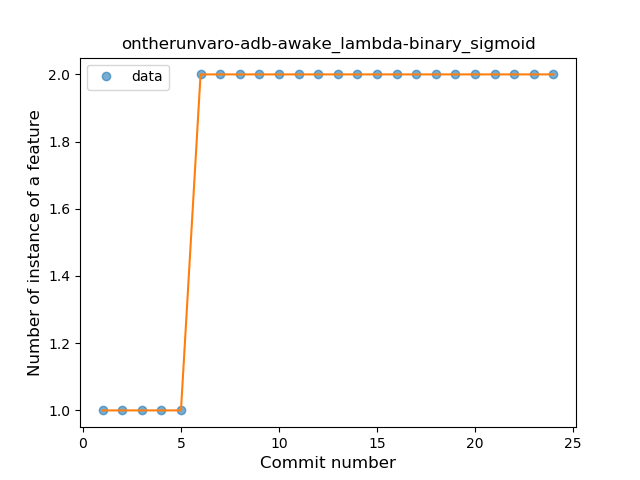

#### physphil-UnitConverterUltimate
* Feature: Lambda
* Function: 
* R_Squared: 1.0
 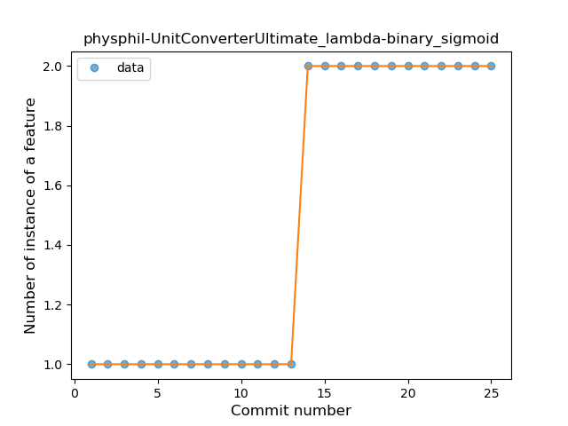

#### rubenwardy-mtmods4android
* Feature: Lambda
* Function: 
* R_Squared: 1.0
 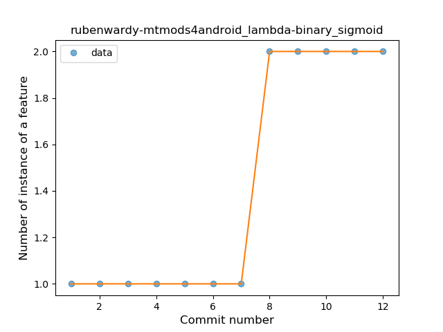

#### EventFahrplan-EventFahrplan
* Feature: Safe Call
* Function: 
* R_Squared: 1.0
 

#### Streetwalrus-android_usb_msd
* Feature: Safe Call
* Function: 
* R_Squared: 1.0
 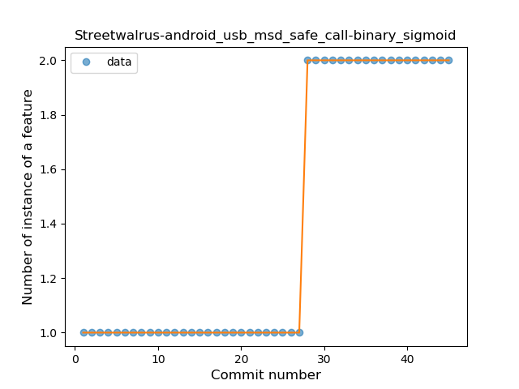

#### commons-app-apps-android-commons
* Feature: Safe Call
* Function: 
* R_Squared: 1.0
 

#### die-tageszeitung-tazapp-android
* Feature: Safe Call
* Function: 
* R_Squared: 1.0
 

#### hidroh-materialistic
* Feature: Safe Call
* Function: 
* R_Squared: 1.0
 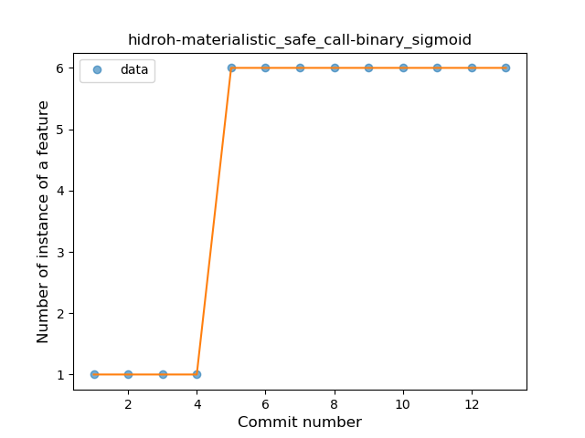

#### howard-e-just-quotes-kt
* Feature: Safe Call
* Function: 
* R_Squared: 1.0
 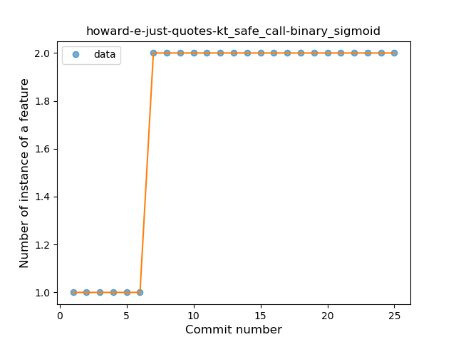

#### jpeddicord-speedofsound
* Feature: Safe Call
* Function: 
* R_Squared: 1.0
 

#### plusCubed-velociraptor
* Feature: Safe Call
* Function: 
* R_Squared: 1.0
 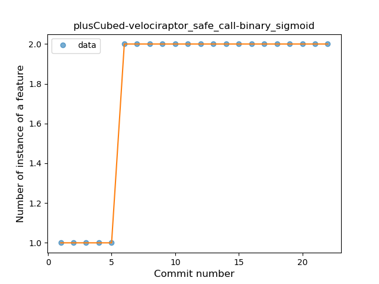

#### sandy-8925-Checklist
* Feature: Safe Call
* Function: 
* R_Squared: 1.0
 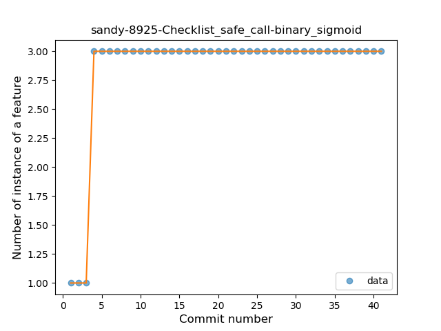

#### saschpe-PlanningPoker
* Feature: Safe Call
* Function: 
* R_Squared: 1.0
 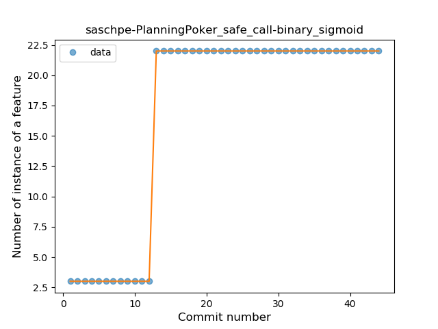

#### systemallica-ValenBisi
* Feature: Safe Call
* Function: 
* R_Squared: 1.0
 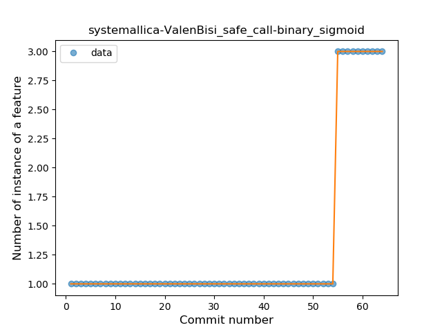

#### umren-Watcher
* Feature: Safe Call
* Function: 
* R_Squared: 1.0
 

#### BenAlderfer-hand-and-foot-scores
* Feature: When expression
* Function: 
* R_Squared: 1.0
 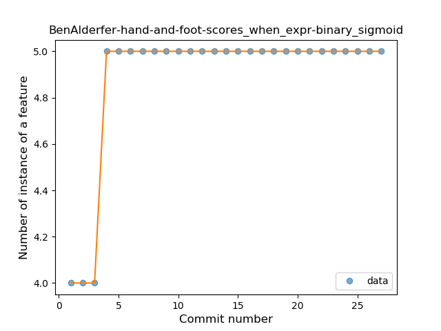

#### Maxr1998-home-assistant-Android
* Feature: When expression
* Function: 
* R_Squared: 1.0
 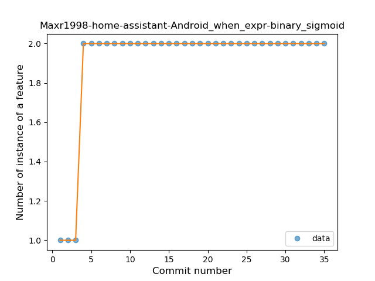

#### MrBIMC-RunInBackgroundPermissionSetter
* Feature: When expression
* Function: 
* R_Squared: 1.0
 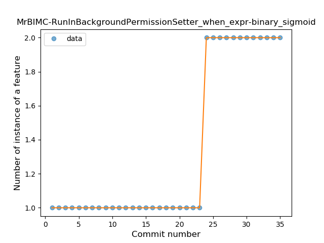

#### freedombox-team-android-app
* Feature: When expression
* Function: 
* R_Squared: 1.0
 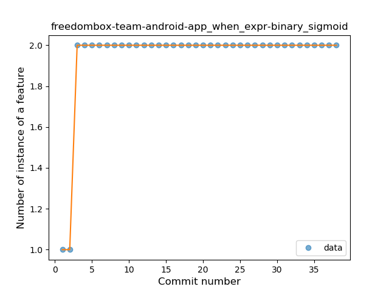

#### ianmcxa-vortaro
* Feature: When expression
* Function: 
* R_Squared: 1.0
 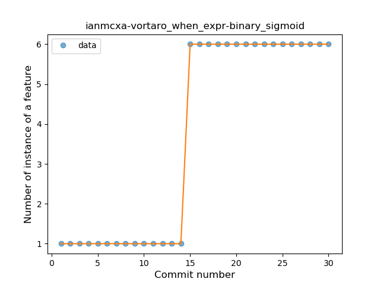

#### ids1024-lsdict-android
* Feature: When expression
* Function: 
* R_Squared: 1.0
 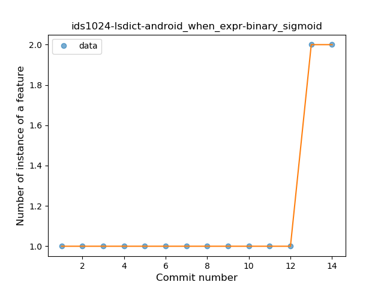

#### ids1024-whitakers-words-android
* Feature: When expression
* Function: 
* R_Squared: 1.0
 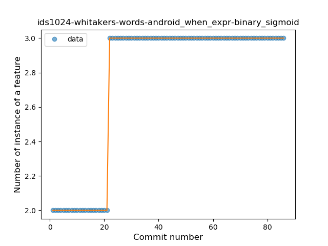

#### jpeddicord-speedofsound
* Feature: When expression
* Function: 
* R_Squared: 1.0
 

#### ligi-MaterialTeaTimer
* Feature: When expression
* Function: 
* R_Squared: 1.0
 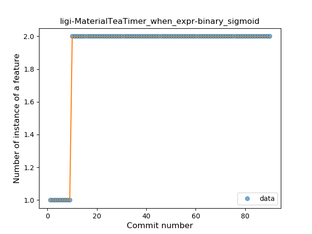

#### openium-auvergne-webcams-droid
* Feature: When expression
* Function: 
* R_Squared: 1.0
 

#### sriharshaarangi-BatteryChargeLimit
* Feature: When expression
* Function: 
* R_Squared: 1.0
 

#### stinsonga-GeoQuake
* Feature: When expression
* Function: 
* R_Squared: 1.0
 

#### systemallica-ValenBisi
* Feature: When expression
* Function: 
* R_Squared: 1.0
 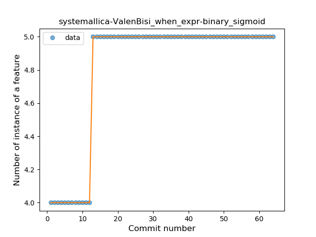

#### Agusyc-DayCounter
* Feature: Companion Object
* Function: 
* R_Squared: 1.0
 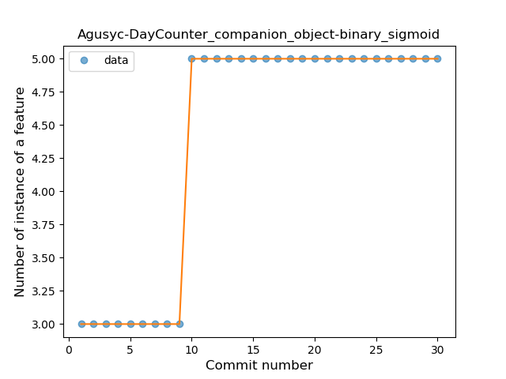

#### BenAlderfer-hand-and-foot-scores
* Feature: Companion Object
* Function: 
* R_Squared: 1.0
 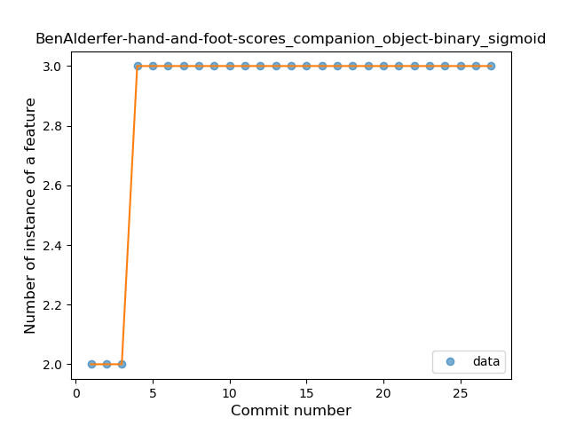

#### SimpleMobileTools-Simple-Thank-You
* Feature: Companion Object
* Function: 
* R_Squared: 1.0
 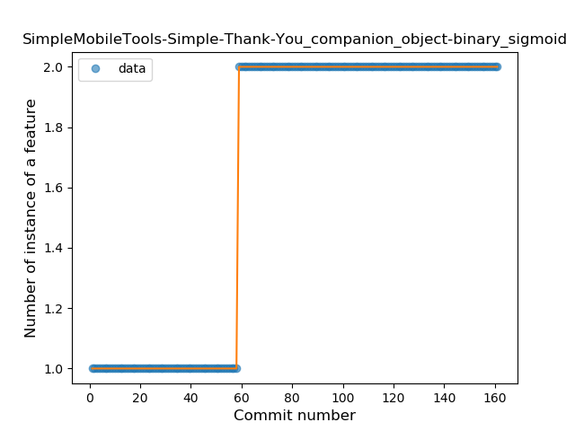

#### danirod-rectball
* Feature: Companion Object
* Function: 
* R_Squared: 1.0
 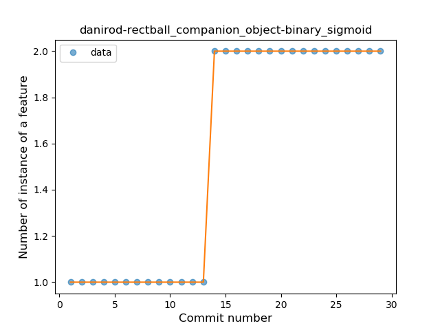

#### hidroh-materialistic
* Feature: Companion Object
* Function: 
* R_Squared: 1.0
 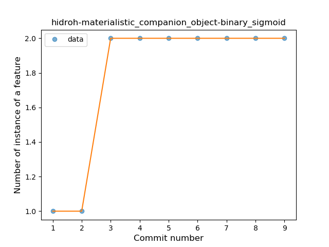

#### hyst329-OpenFool
* Feature: Companion Object
* Function: 
* R_Squared: 1.0
 

#### jeeb-mpv-android
* Feature: Companion Object
* Function: 
* R_Squared: 1.0
 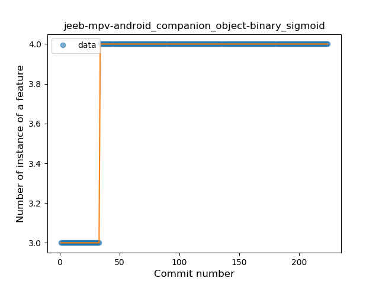

#### nao20010128nao-DroidComplex
* Feature: Companion Object
* Function: 
* R_Squared: 1.0
 

#### pennlabs-penn-mobile-android
* Feature: Companion Object
* Function: 
* R_Squared: 1.0
 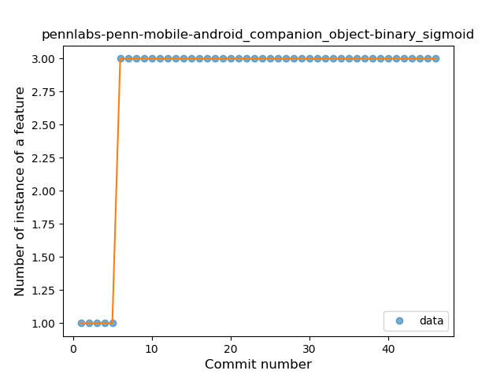

#### rosenpin-QuickDrawEverywhere
* Feature: Companion Object
* Function: 
* R_Squared: 1.0
 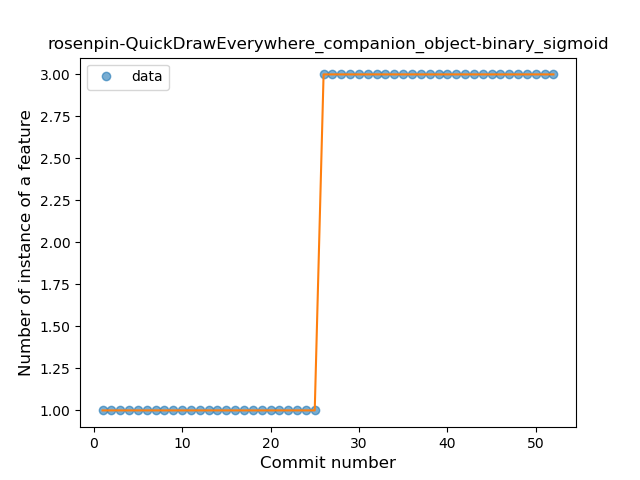

#### sreich-android-count-the-days
* Feature: Companion Object
* Function: 
* R_Squared: 1.0
 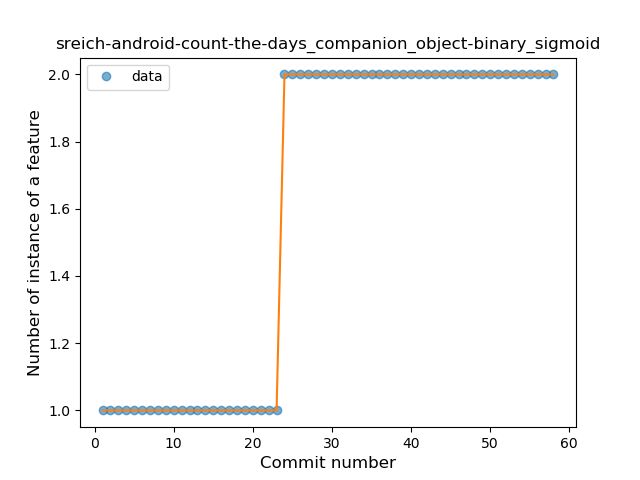

#### BenAlderfer-hand-and-foot-scores
* Feature: Unsafe Call
* Function: 
* R_Squared: 1.0
 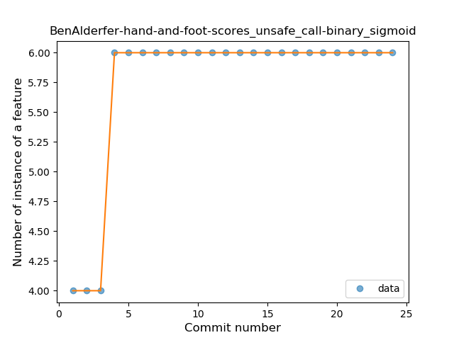

#### hsson-card-balance-app
* Feature: Unsafe Call
* Function: 
* R_Squared: 1.0
 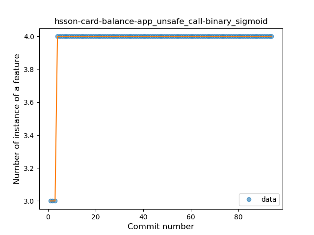

#### ironjan-MensaUPB
* Feature: Unsafe Call
* Function: 
* R_Squared: 1.0
 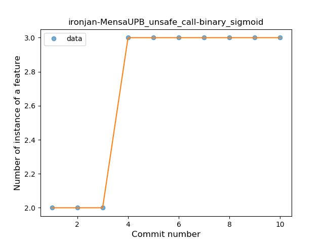

#### rosenpin-QuickDrawEverywhere
* Feature: Unsafe Call
* Function: 
* R_Squared: 1.0
 

#### rubenwardy-mtmods4android
* Feature: Unsafe Call
* Function: 
* R_Squared: 1.0
 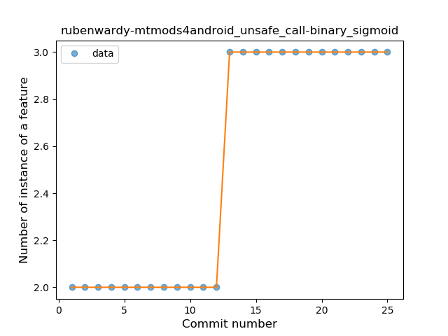

#### xgouchet-Stanley
* Feature: Unsafe Call
* Function: 
* R_Squared: 1.0
 

#### GreenLionSoft-madrid-pollution-android-app
* Feature: String Template
* Function: 
* R_Squared: 1.0
 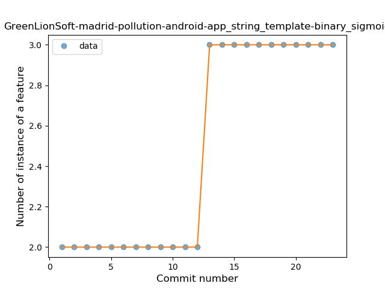

#### LittleLightCz-SheepsGoHome
* Feature: String Template
* Function: 
* R_Squared: 1.0
 

#### SpiritCroc-DarkCroc-Android-theme
* Feature: String Template
* Function: 
* R_Squared: 1.0
 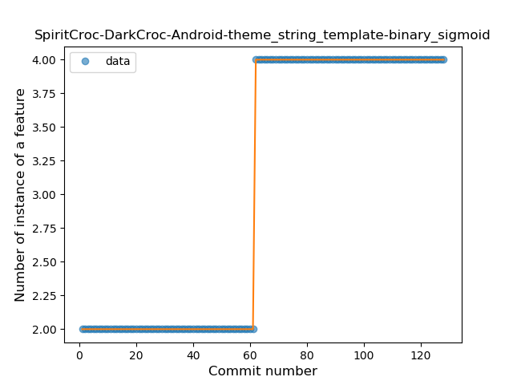

#### bassph-bassph-app-android
* Feature: String Template
* Function: 
* R_Squared: 1.0
 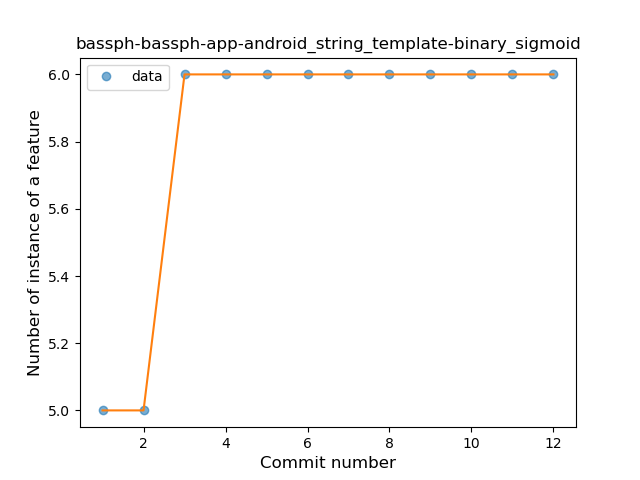

#### dbrant-unitconverter-android
* Feature: String Template
* Function: 
* R_Squared: 1.0
 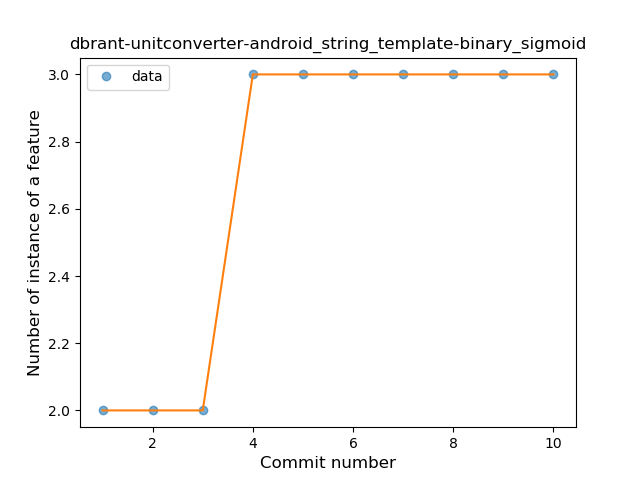

#### devmil-muzei-bingimageoftheday
* Feature: String Template
* Function: 
* R_Squared: 1.0
 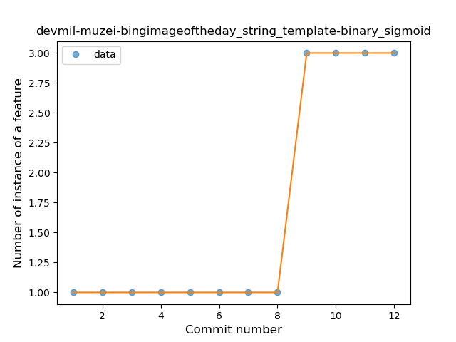

#### jqno-remindermail
* Feature: String Template
* Function: 
* R_Squared: 1.0
 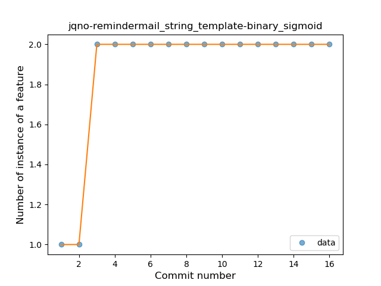

#### kaeptmblaubaer1000-android-torchlight
* Feature: String Template
* Function: 
* R_Squared: 1.0
 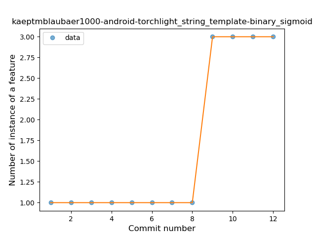

#### lenchan139-NCBookmark
* Feature: String Template
* Function: 
* R_Squared: 1.0
 

#### pistatium-mahougen
* Feature: String Template
* Function: 
* R_Squared: 1.0
 

#### systemallica-ValenBisi
* Feature: String Template
* Function: 
* R_Squared: 1.0
 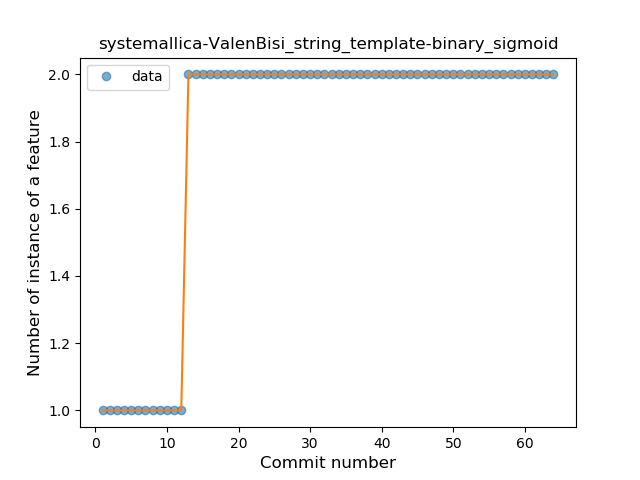

#### LittleLightCz-SheepsGoHome
* Feature: Function with Default Value
* Function: 
* R_Squared: 1.0
 

#### bassph-bassph-app-android
* Feature: Function with Default Value
* Function: 
* R_Squared: 1.0
 

#### bitfireAT-icsdroid
* Feature: Function with Default Value
* Function: 
* R_Squared: 1.0
 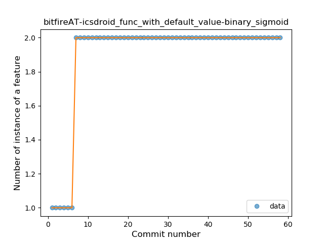

#### ligi-SurvivalManual
* Feature: Function with Default Value
* Function: 
* R_Squared: 1.0
 

#### pistatium-mahougen
* Feature: Function with Default Value
* Function: 
* R_Squared: 1.0
 

#### plusCubed-velociraptor
* Feature: Function with Default Value
* Function: 
* R_Squared: 1.0
 

#### sriharshaarangi-BatteryChargeLimit
* Feature: Function with Default Value
* Function: 
* R_Squared: 1.0
 

#### teamblueridge-PasteIt
* Feature: Function with Default Value
* Function: 
* R_Squared: 1.0
 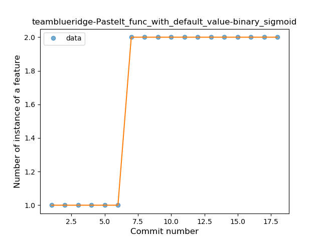

#### thaapasa-jalkametri-android
* Feature: Function with Default Value
* Function: 
* R_Squared: 1.0
 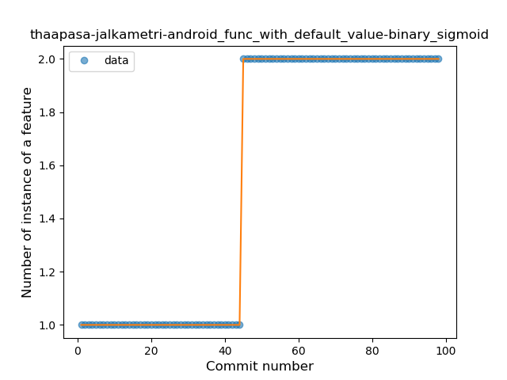

#### BijoySingh-Material-Notes-Android-App
* Feature: Singleton
* Function: 
* R_Squared: 1.0
 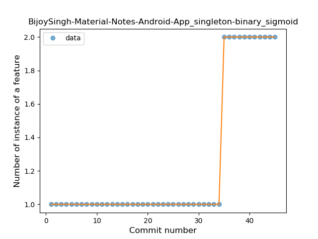

#### ScreamingHawk-phone-saver
* Feature: Singleton
* Function: 
* R_Squared: 1.0
 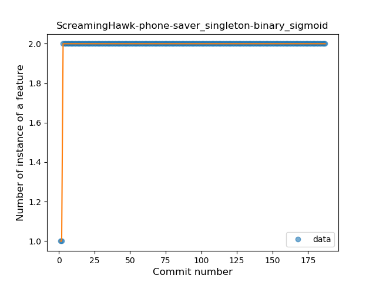

#### TeMoMuKo-AutoStopRace
* Feature: Singleton
* Function: 
* R_Squared: 1.0
 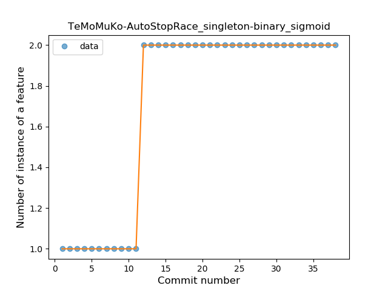

#### WYKCode-WYK-Android
* Feature: Singleton
* Function: 
* R_Squared: 1.0
 

#### emansih-FireflyMobile
* Feature: Singleton
* Function: 
* R_Squared: 1.0
 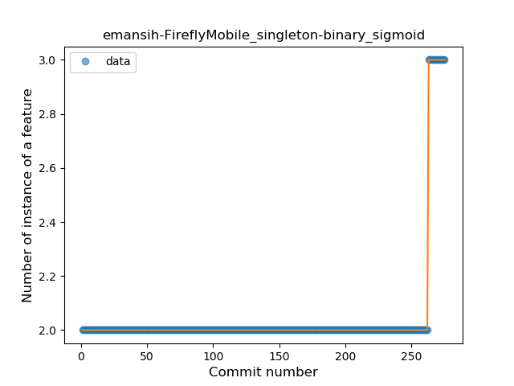

#### hsson-card-balance-app
* Feature: Singleton
* Function: 
* R_Squared: 1.0
 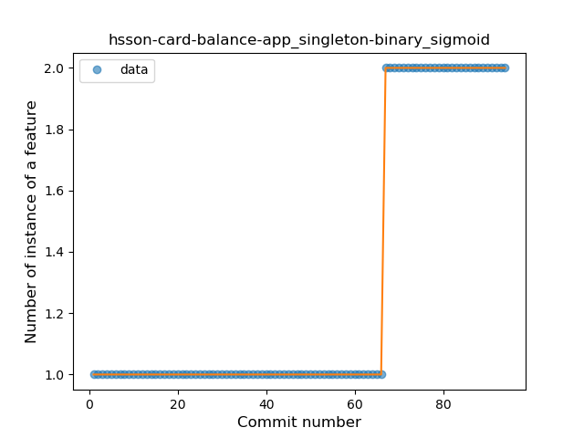

#### joaomneto-TitanCompanion
* Feature: Singleton
* Function: 
* R_Squared: 1.0
 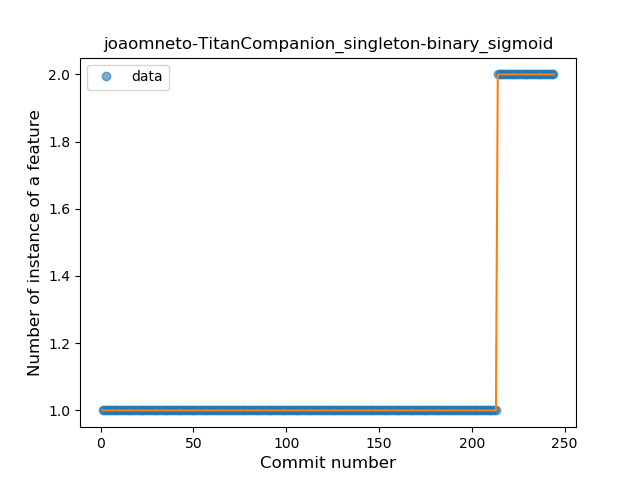

#### juha-h-baresip-studio
* Feature: Singleton
* Function: 
* R_Squared: 1.0
 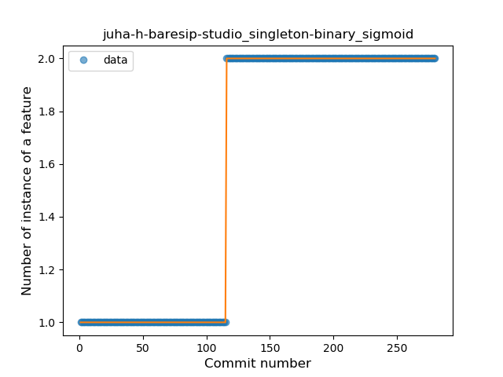

#### ligi-IPFSDroid
* Feature: Singleton
* Function: 
* R_Squared: 1.0
 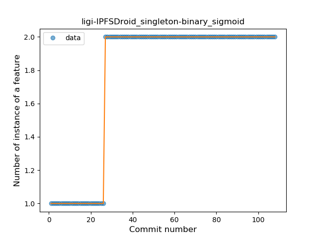

#### mkg20001-aruba-networks-login
* Feature: Singleton
* Function: 
* R_Squared: 1.0
 

#### nathanj-ogsdroid
* Feature: Singleton
* Function: 
* R_Squared: 1.0
 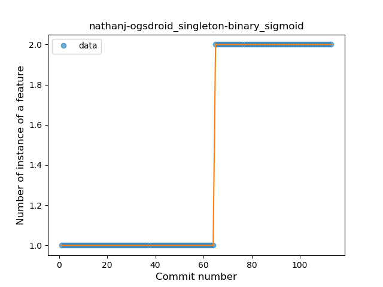

#### saschpe-PlanningPoker
* Feature: Singleton
* Function: 
* R_Squared: 1.0
 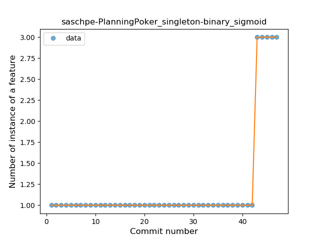

#### Apolline-Lille-apolline-android
* Feature: Smart Cast
* Function: 
* R_Squared: 1.0
 

#### Maxr1998-MaxLock
* Feature: Smart Cast
* Function: 
* R_Squared: 1.0
 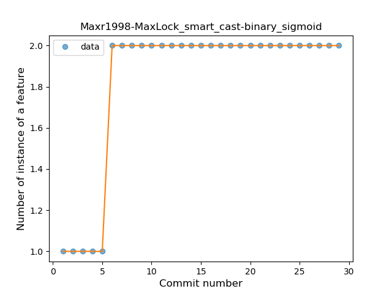

#### Maxr1998-home-assistant-Android
* Feature: Smart Cast
* Function: 
* R_Squared: 1.0
 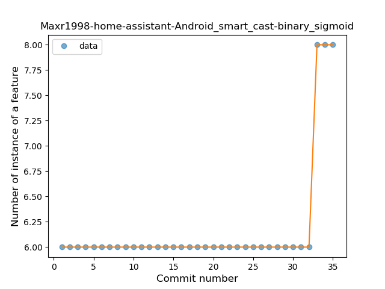

#### Valodim-Stratum0Widget
* Feature: Smart Cast
* Function: 
* R_Squared: 1.0
 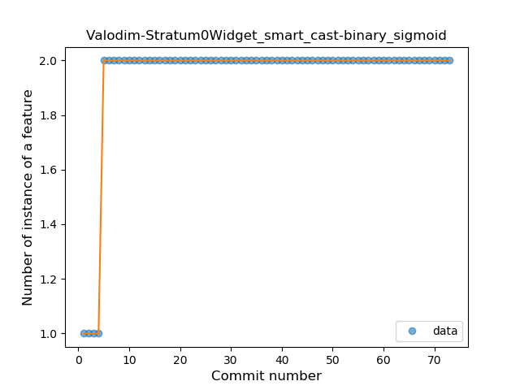

#### fvasco-pinpoi
* Feature: Smart Cast
* Function: 
* R_Squared: 1.0
 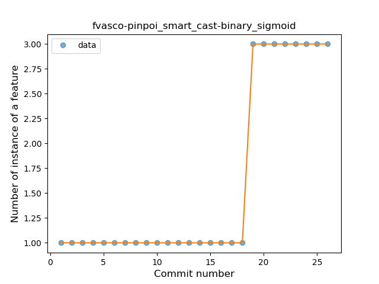

#### ligi-PassAndroid
* Feature: Smart Cast
* Function: 
* R_Squared: 1.0
 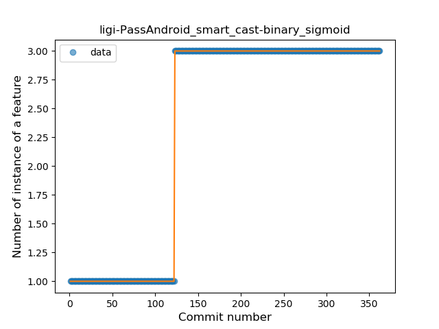

#### ligi-SurvivalManual
* Feature: Smart Cast
* Function: 
* R_Squared: 1.0
 

#### mbarta-scr-redesign
* Feature: Smart Cast
* Function: 
* R_Squared: 1.0
 

#### ontherunvaro-adb-awake
* Feature: Smart Cast
* Function: 
* R_Squared: 1.0
 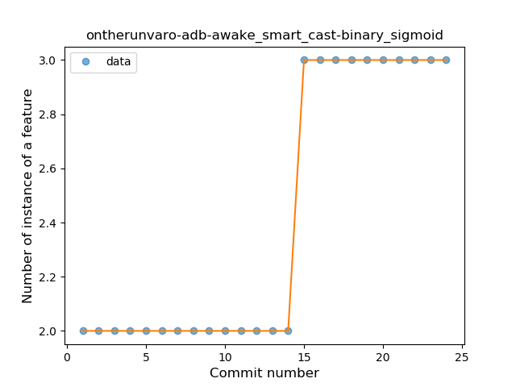

#### thanksmister-androidthings-mqtt-alarm-panel
* Feature: Smart Cast
* Function: 
* R_Squared: 1.0
 

#### Agusyc-DayCounter
* Feature: Range Expression
* Function: 
* R_Squared: 1.0
 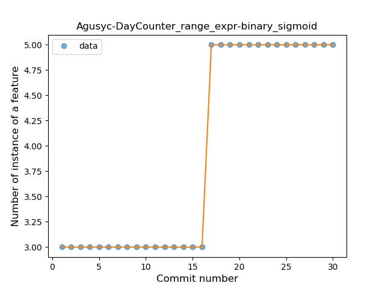

#### DSteve595-Put.io
* Feature: Range Expression
* Function: 
* R_Squared: 1.0
 

#### FengMoeTeam-NHentai-android
* Feature: Range Expression
* Function: 
* R_Squared: 1.0
 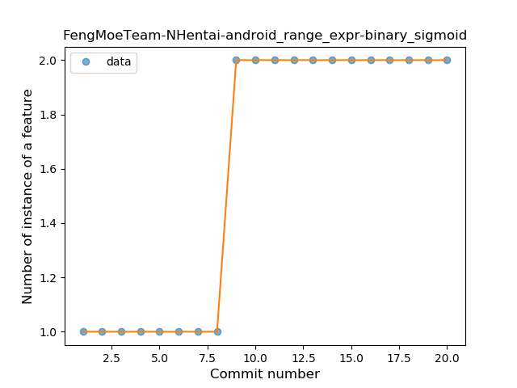

#### LISTEN-moe-android-app
* Feature: Range Expression
* Function: 
* R_Squared: 1.0
 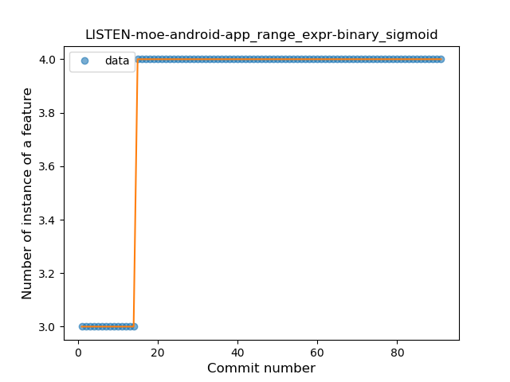

#### SimpleMobileTools-Simple-Calculator
* Feature: Range Expression
* Function: 
* R_Squared: 1.0
 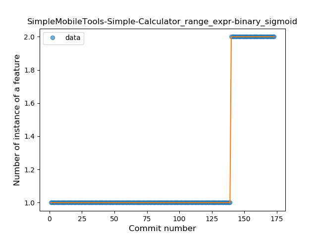

#### Waboodoo-Status-Bar-Tachometer
* Feature: Range Expression
* Function: 
* R_Squared: 1.0
 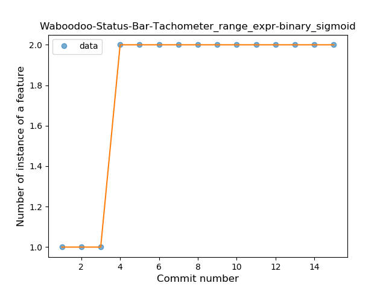

#### albertolalanda-new-ultrasonic-fork-for-MyMusicQoE
* Feature: Range Expression
* Function: 
* R_Squared: 1.0
 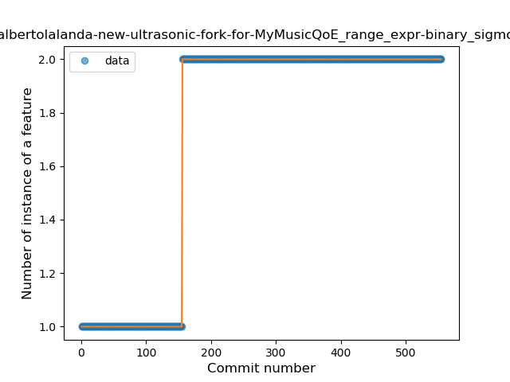

#### bottiger-SoundWaves
* Feature: Range Expression
* Function: 
* R_Squared: 1.0
 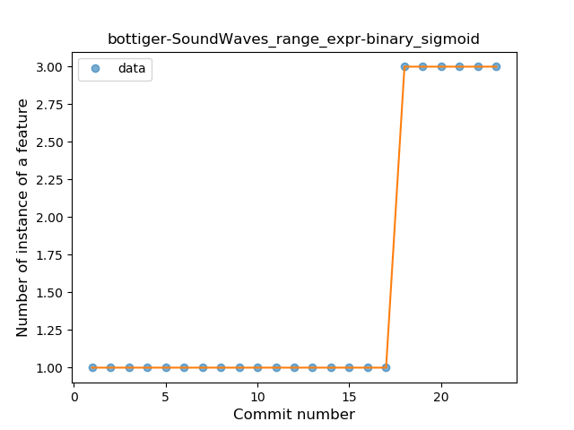

#### devmil-PaperLaunch
* Feature: Range Expression
* Function: 
* R_Squared: 1.0
 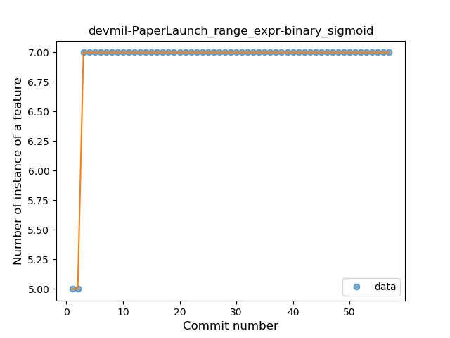

#### esafirm-android-playground
* Feature: Range Expression
* Function: 
* R_Squared: 1.0
 

#### hsson-card-balance-app
* Feature: Range Expression
* Function: 
* R_Squared: 1.0
 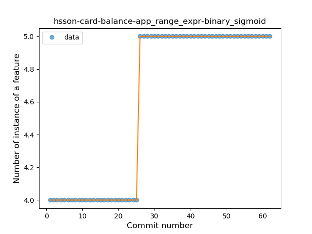

#### impalex-knockonports
* Feature: Range Expression
* Function: 
* R_Squared: 1.0
 

#### ligi-SurvivalManual
* Feature: Range Expression
* Function: 
* R_Squared: 1.0
 

#### mastizada-focus-android
* Feature: Range Expression
* Function: 
* R_Squared: 1.0
 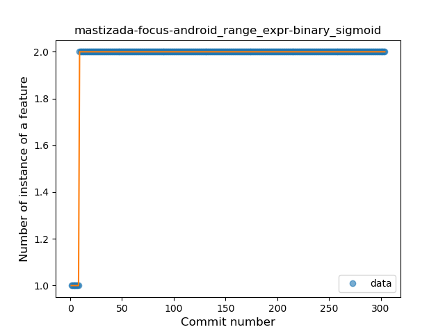

#### ohmae-DmsExplorer
* Feature: Range Expression
* Function: 
* R_Squared: 1.0
 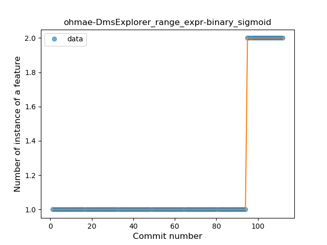

#### ohmae-VoiceMessageBoard
* Feature: Range Expression
* Function: 
* R_Squared: 1.0
 

#### thanksmister-androidthings-mqtt-alarm-panel
* Feature: Range Expression
* Function: 
* R_Squared: 1.0
 

#### tuskyapp-Tusky
* Feature: Range Expression
* Function: 
* R_Squared: 1.0
 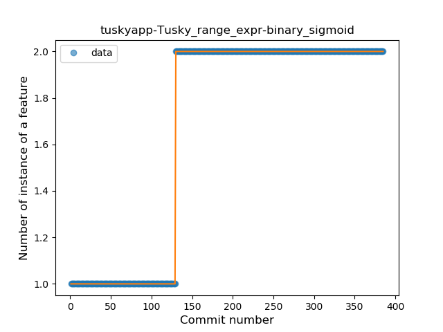

#### ultrasonic-ultrasonic
* Feature: Range Expression
* Function: 
* R_Squared: 1.0
 

#### zoenb-log28
* Feature: Range Expression
* Function: 
* R_Squared: 1.0
 

#### Depau-EtchDroid
* Feature: Function call with Named Argument
* Function: 
* R_Squared: 1.0
 

#### LittleLightCz-SheepsGoHome
* Feature: Function call with Named Argument
* Function: 
* R_Squared: 1.0
 

#### SpiritCroc-DarkCroc-Android-theme
* Feature: Function call with Named Argument
* Function: 
* R_Squared: 1.0
 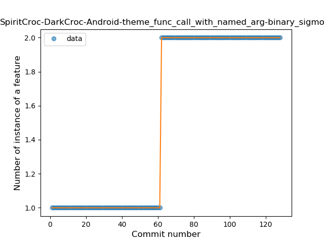

#### WYKCode-WYK-Android
* Feature: Function call with Named Argument
* Function: 
* R_Squared: 1.0
 

#### juha-h-baresip-studio
* Feature: Function call with Named Argument
* Function: 
* R_Squared: 1.0
 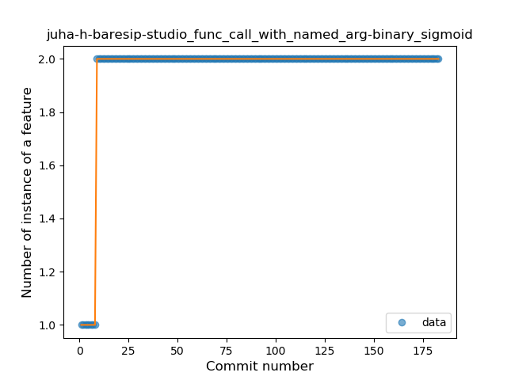

#### ligi-IPFSDroid
* Feature: Function call with Named Argument
* Function: 
* R_Squared: 1.0
 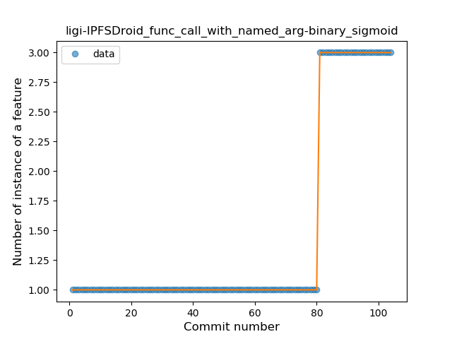

#### marcelgross90-Cineaste
* Feature: Function call with Named Argument
* Function: 
* R_Squared: 1.0
 

#### ohmae-DmsExplorer
* Feature: Function call with Named Argument
* Function: 
* R_Squared: 1.0
 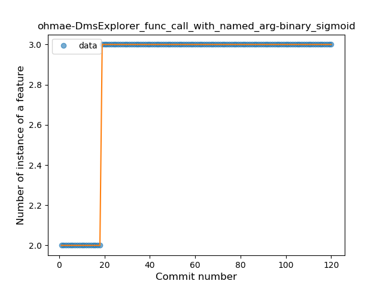

#### zeapo-Android-Password-Store
* Feature: Function call with Named Argument
* Function: 
* R_Squared: 1.0
 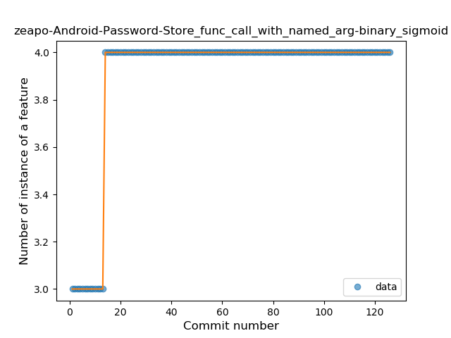

#### Depau-EtchDroid
* Feature: Data Class
* Function: 
* R_Squared: 1.0
 

#### FengMoeTeam-NHentai-android
* Feature: Data Class
* Function: 
* R_Squared: 1.0
 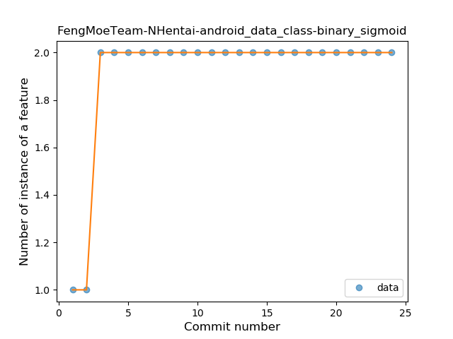

#### Mystery00-JanYoShare
* Feature: Data Class
* Function: 
* R_Squared: 1.0
 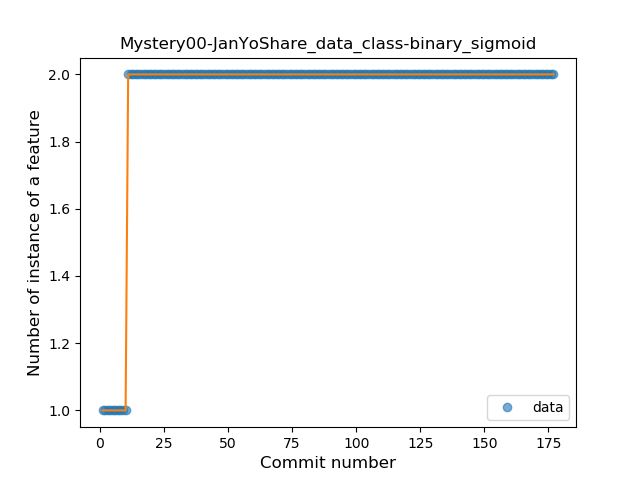

#### ScreamingHawk-phone-saver
* Feature: Data Class
* Function: 
* R_Squared: 1.0
 

#### SimpleMobileTools-Simple-Camera
* Feature: Data Class
* Function: 
* R_Squared: 1.0
 

#### SimpleMobileTools-Simple-Music-Player
* Feature: Data Class
* Function: 
* R_Squared: 1.0
 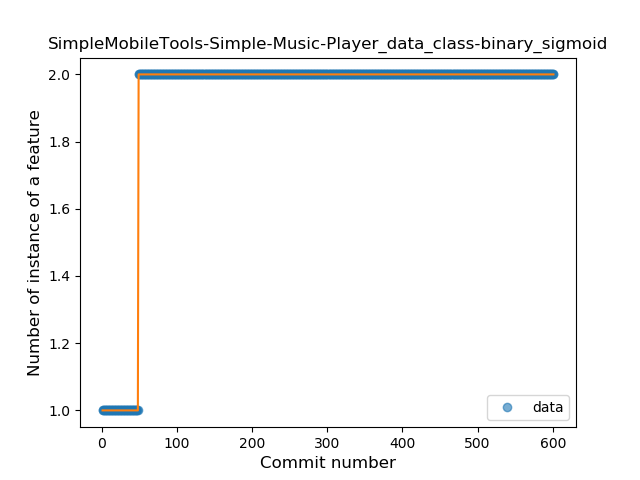

#### colesadam-hill-lists
* Feature: Data Class
* Function: 
* R_Squared: 1.0
 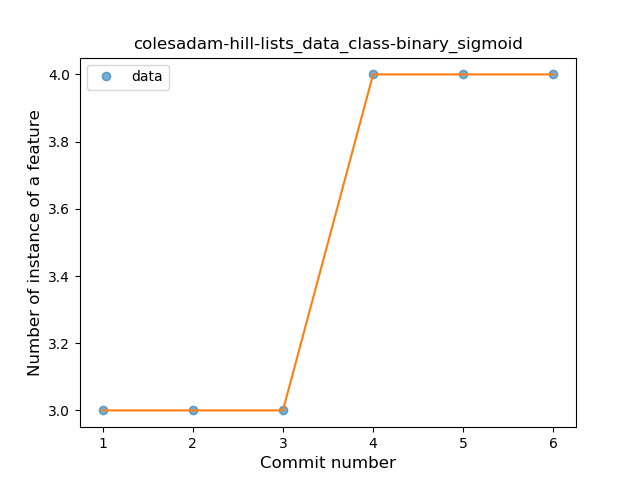

#### corphish-NightLight
* Feature: Data Class
* Function: 
* R_Squared: 1.0
 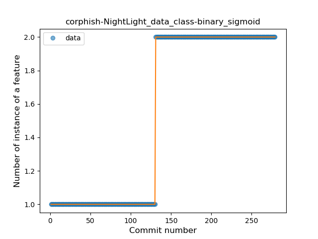

#### danvratil-FBEventSync
* Feature: Data Class
* Function: 
* R_Squared: 1.0
 

#### enjoyingfoss-om
* Feature: Data Class
* Function: 
* R_Squared: 1.0
 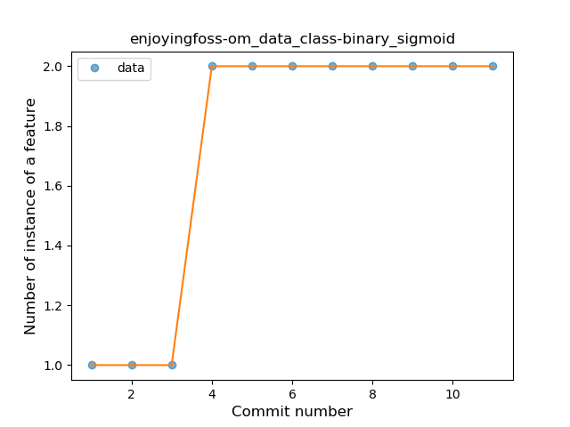

#### freedombox-team-android-app
* Feature: Data Class
* Function: 
* R_Squared: 1.0
 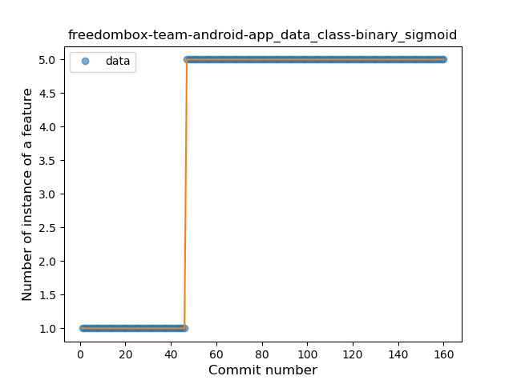

#### fvasco-pinpoi
* Feature: Data Class
* Function: 
* R_Squared: 1.0
 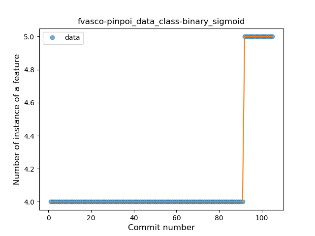

#### ligi-SurvivalManual
* Feature: Data Class
* Function: 
* R_Squared: 1.0
 

#### ligi-gobandroid
* Feature: Data Class
* Function: 
* R_Squared: 1.0
 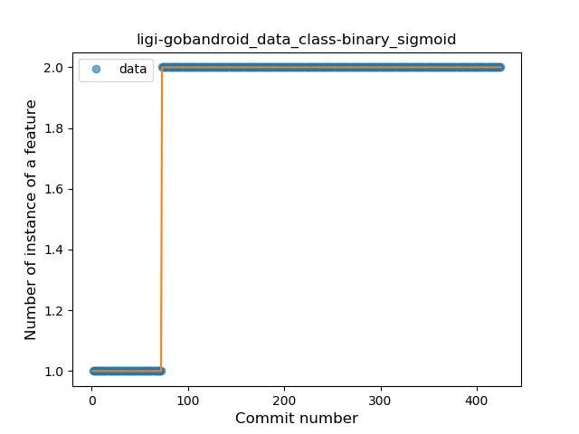

#### ofalvai-BPInfo
* Feature: Data Class
* Function: 
* R_Squared: 1.0
 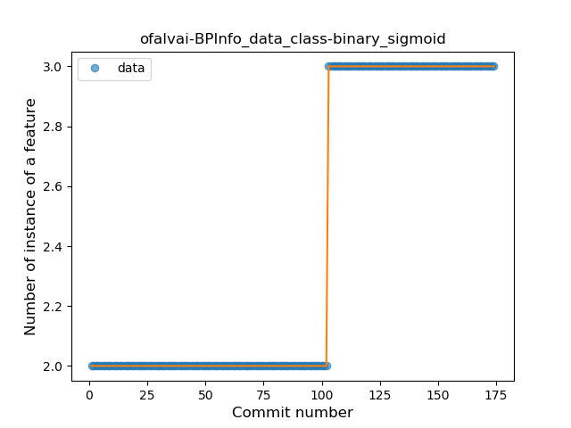

#### peppercarrot-e-reader
* Feature: Data Class
* Function: 
* R_Squared: 1.0
 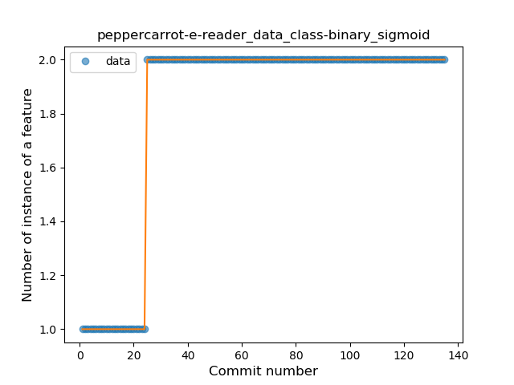

#### plusCubed-velociraptor
* Feature: Data Class
* Function: 
* R_Squared: 1.0
 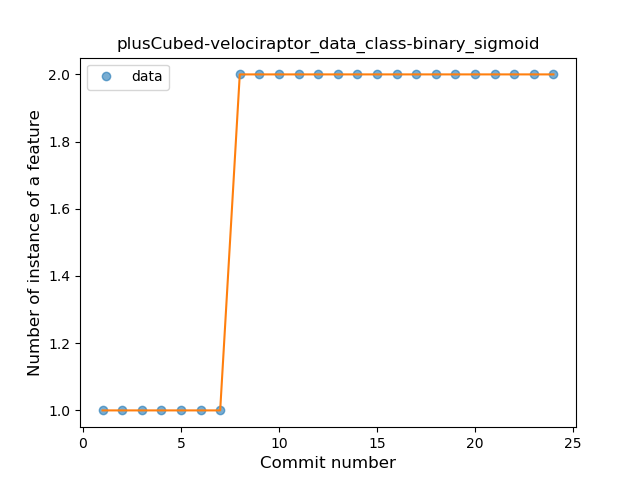

#### syrop-Wiktor-Navigator
* Feature: Data Class
* Function: 
* R_Squared: 1.0
 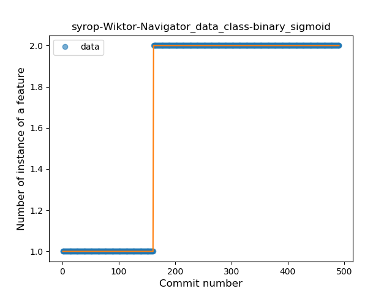

#### SimpleMobileTools-Simple-Flashlight
* Feature: Extension Function
* Function: 
* R_Squared: 1.0
 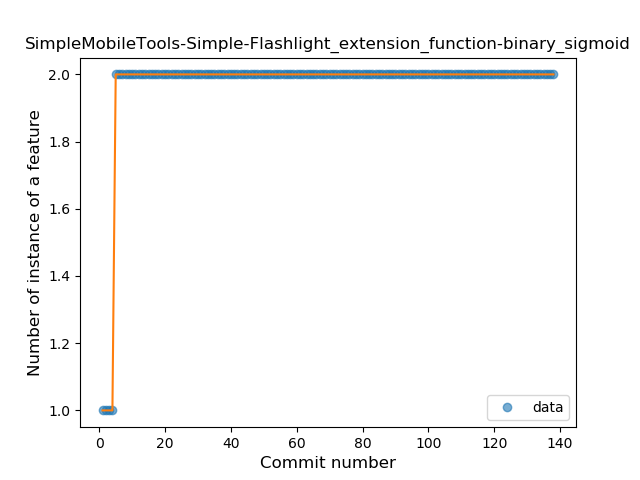

#### apoi-quickbeer-android
* Feature: Extension Function
* Function: 
* R_Squared: 1.0
 

#### johnjohndoe-Umweltzone
* Feature: Extension Function
* Function: 
* R_Squared: 1.0
 

#### klassm-andFHEM
* Feature: Extension Function
* Function: 
* R_Squared: 1.0
 

#### nibarius-opera-park-android
* Feature: Extension Function
* Function: 
* R_Squared: 1.0
 

#### ohmae-VoiceMessageBoard
* Feature: Extension Function
* Function: 
* R_Squared: 1.0
 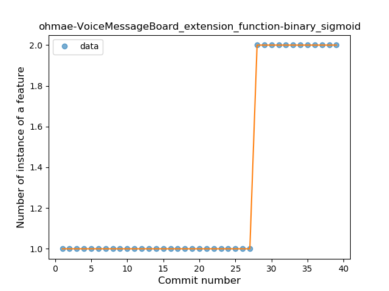

#### rosenpin-QuickDrawEverywhere
* Feature: Extension Function
* Function: 
* R_Squared: 1.0
 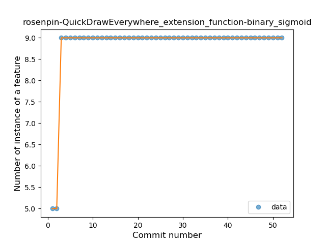

#### wuan-bo-android
* Feature: Extension Function
* Function: 
* R_Squared: 1.0
 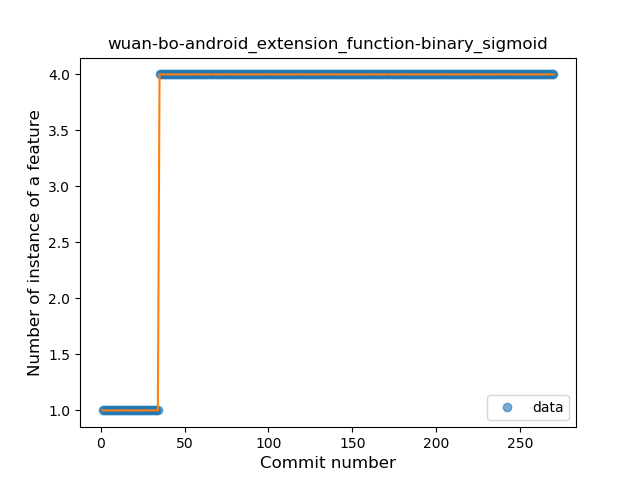

#### jqno-remindermail
* Feature: Property Delegation
* Function: 
* R_Squared: 1.0
 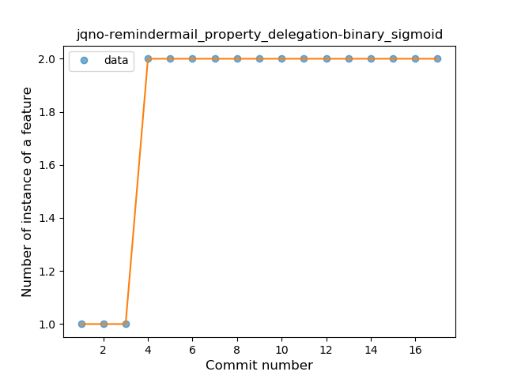

#### ligi-MaterialTeaTimer
* Feature: Property Delegation
* Function: 
* R_Squared: 1.0
 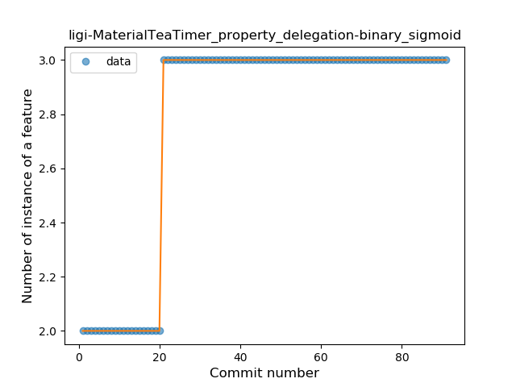

#### mecid-BakuBus
* Feature: Property Delegation
* Function: 
* R_Squared: 1.0
 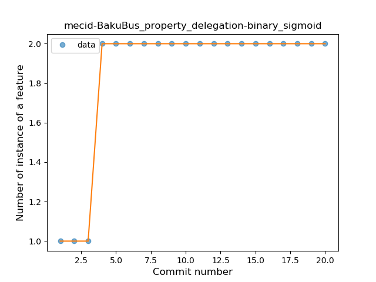

#### moko256-twitlatte
* Feature: Property Delegation
* Function: 
* R_Squared: 1.0
 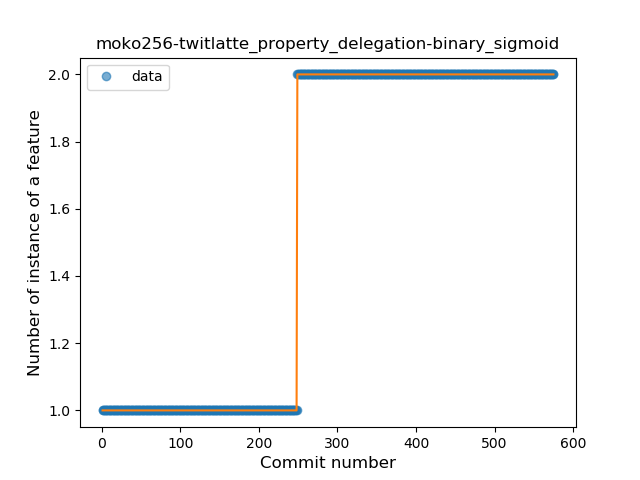

#### ohmae-DmsExplorer
* Feature: Property Delegation
* Function: 
* R_Squared: 1.0
 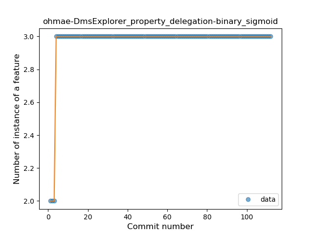

#### pyamsoft-home-button
* Feature: Property Delegation
* Function: 
* R_Squared: 1.0
 

#### sriharshaarangi-BatteryChargeLimit
* Feature: Property Delegation
* Function: 
* R_Squared: 1.0
 

#### tuskyapp-Tusky
* Feature: Property Delegation
* Function: 
* R_Squared: 1.0
 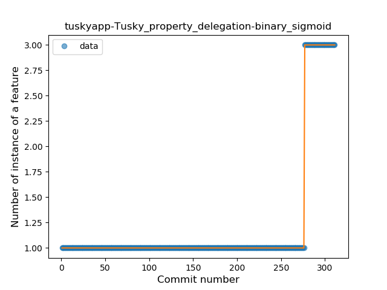

#### wuan-bo-android
* Feature: Property Delegation
* Function: 
* R_Squared: 1.0
 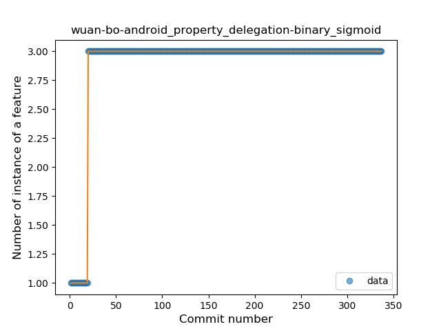

#### CzBiX-v2ex-android
* Feature: Destructuring Declaration
* Function: 
* R_Squared: 1.0
 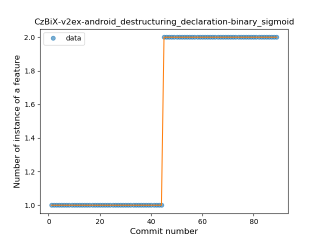

#### Depau-EtchDroid
* Feature: Destructuring Declaration
* Function: 
* R_Squared: 1.0
 

#### SimpleMobileTools-Simple-Contacts
* Feature: Destructuring Declaration
* Function: 
* R_Squared: 1.0
 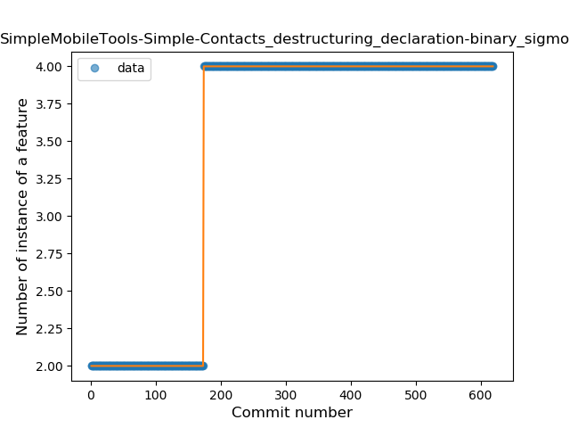

#### SimpleMobileTools-Simple-Draw
* Feature: Destructuring Declaration
* Function: 
* R_Squared: 1.0
 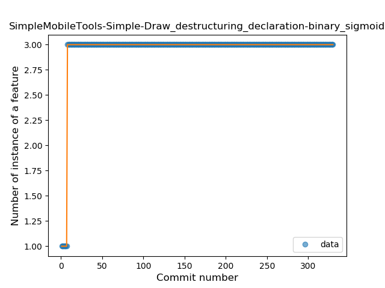

#### apoi-quickbeer-android
* Feature: Destructuring Declaration
* Function: 
* R_Squared: 1.0
 

#### duckduckgo-Android
* Feature: Destructuring Declaration
* Function: 
* R_Squared: 1.0
 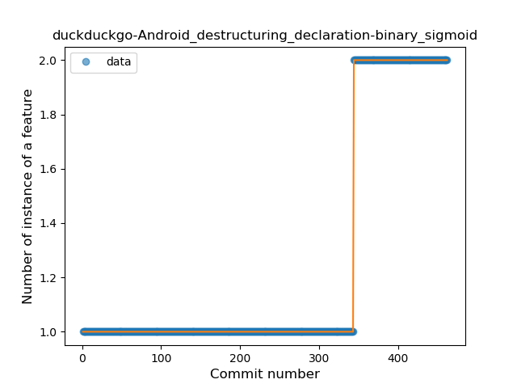

#### fvasco-pinpoi
* Feature: Destructuring Declaration
* Function: 
* R_Squared: 1.0
 

#### ids1024-whitakers-words-android
* Feature: Destructuring Declaration
* Function: 
* R_Squared: 1.0
 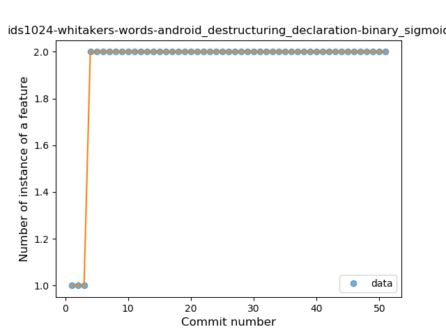

#### ironjan-MensaUPB
* Feature: Destructuring Declaration
* Function: 
* R_Squared: 1.0
 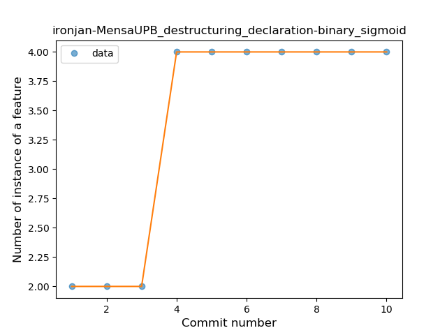

#### ligi-PassAndroid
* Feature: Destructuring Declaration
* Function: 
* R_Squared: 1.0
 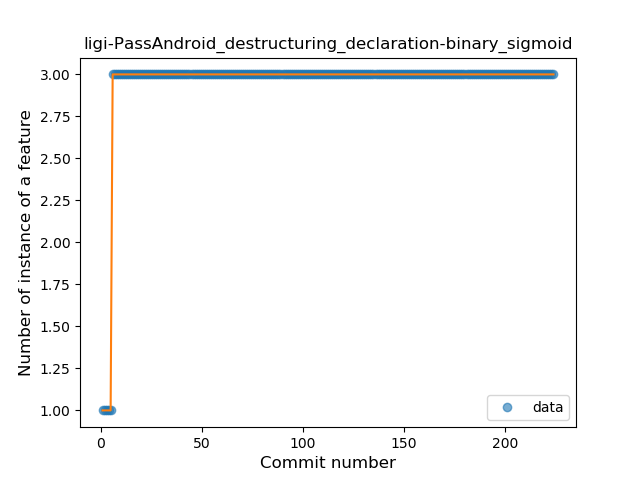

#### milosmns-Timecrypt
* Feature: Destructuring Declaration
* Function: 
* R_Squared: 1.0
 

#### ofalvai-BPInfo
* Feature: Destructuring Declaration
* Function: 
* R_Squared: 1.0
 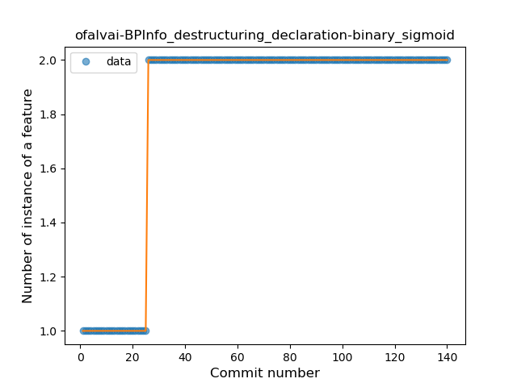

#### tuskyapp-Tusky
* Feature: Destructuring Declaration
* Function: 
* R_Squared: 1.0
 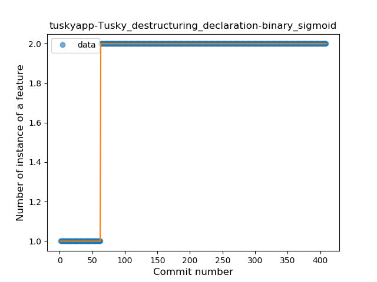

#### FengMoeTeam-NHentai-android
* Feature: Inline Function
* Function: 
* R_Squared: 1.0
 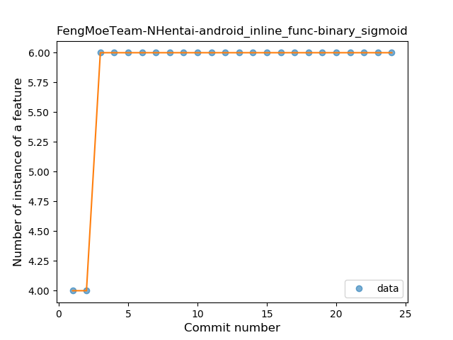

#### Waboodoo-HTTP-Shortcuts
* Feature: Inline Function
* Function: 
* R_Squared: 1.0
 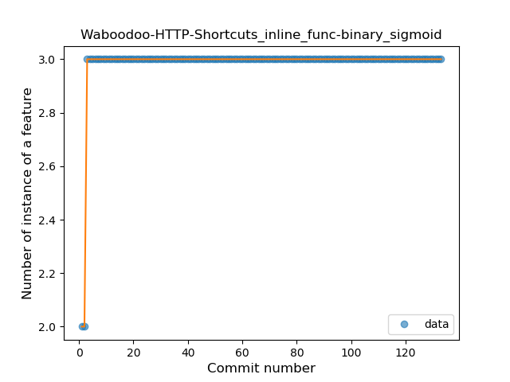

#### joaomneto-TitanCompanion
* Feature: Inline Function
* Function: 
* R_Squared: 1.0
 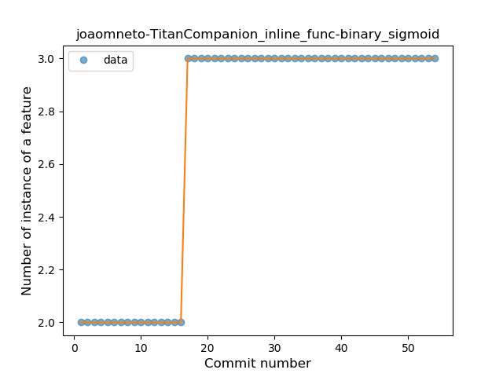

#### mpcjanssen-simpletask-android
* Feature: Inline Function
* Function: 
* R_Squared: 1.0
 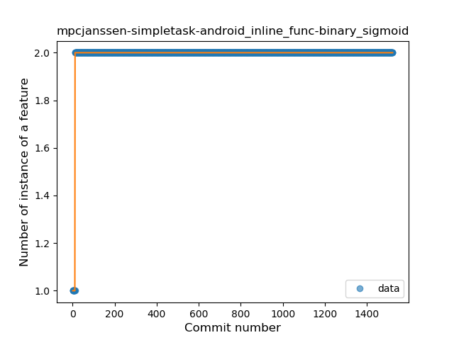

#### quarck-CalendarNotification
* Feature: Inline Function
* Function: 
* R_Squared: 1.0
 

#### sjnyag-stamp
* Feature: Inline Function
* Function: 
* R_Squared: 1.0
 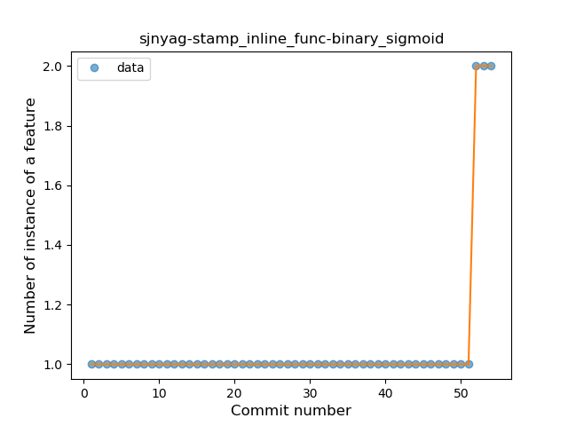

#### syncthing-syncthing-lite
* Feature: Inline Function
* Function: 
* R_Squared: 1.0
 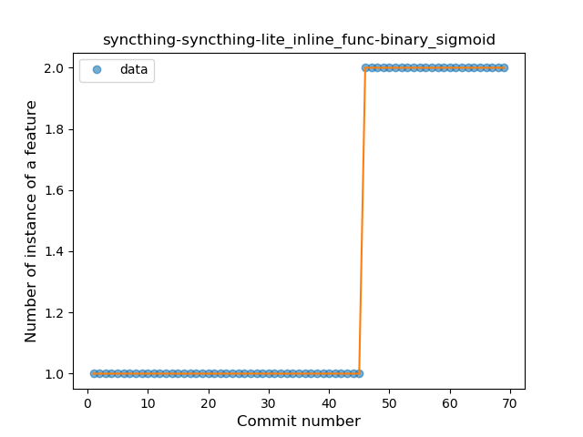

#### wuan-bo-android
* Feature: Inline Function
* Function: 
* R_Squared: 1.0
 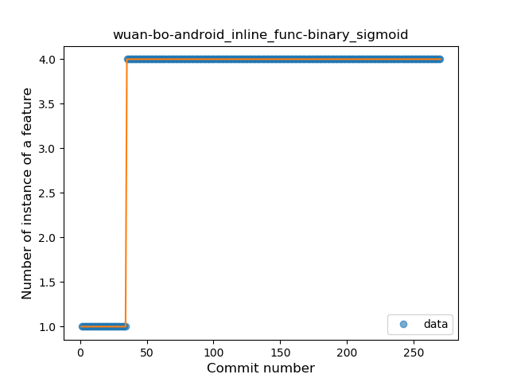

#### CypherpunkArmory-UserLAnd
* Feature: Overloaded Operator
* Function: 
* R_Squared: 1.0
 

#### FengMoeTeam-NHentai-android
* Feature: Overloaded Operator
* Function: 
* R_Squared: 1.0
 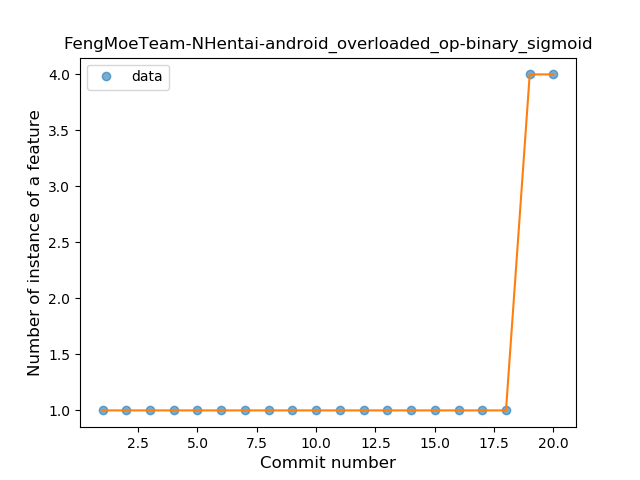

#### LawnchairLauncher-Lawnchair
* Feature: Overloaded Operator
* Function: 
* R_Squared: 1.0
 

#### Mygod-VPNHotspot
* Feature: Overloaded Operator
* Function: 
* R_Squared: 1.0
 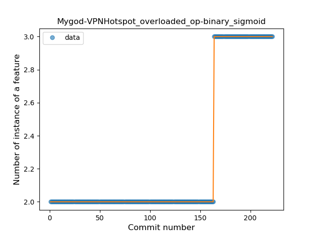

#### albertolalanda-new-ultrasonic-fork-for-MyMusicQoE
* Feature: Overloaded Operator
* Function: 
* R_Squared: 1.0
 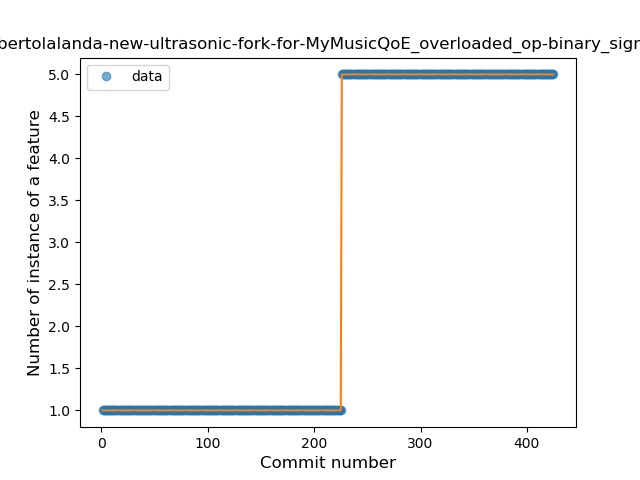

#### orgzly-orgzly-android
* Feature: Overloaded Operator
* Function: 
* R_Squared: 1.0
 

#### spacecowboy-Feeder
* Feature: Overloaded Operator
* Function: 
* R_Squared: 1.0
 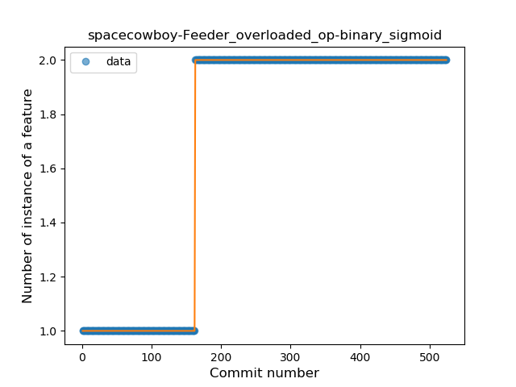

#### syrop-Wiktor-Navigator
* Feature: Overloaded Operator
* Function: 
* R_Squared: 1.0
 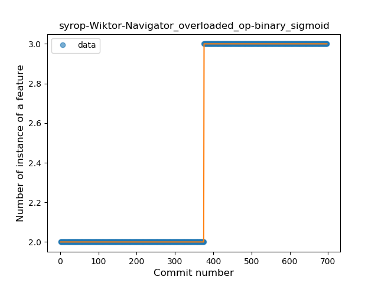

#### ultrasonic-ultrasonic
* Feature: Overloaded Operator
* Function: 
* R_Squared: 1.0
 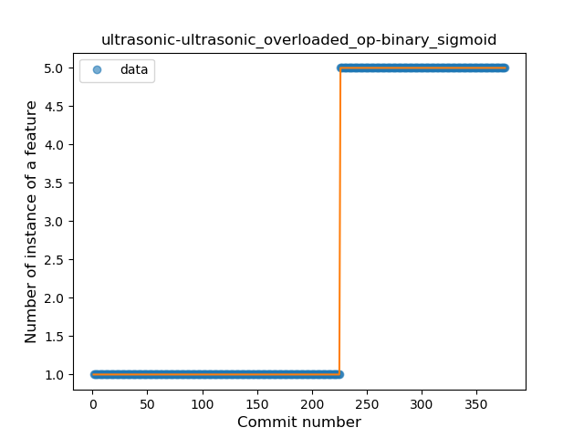

#### PaulWoitaschek-Voice
* Feature: Super Delegation
* Function: 
* R_Squared: 1.0
 

#### blokadaorg-blokada
* Feature: Super Delegation
* Function: 
* R_Squared: 1.0
 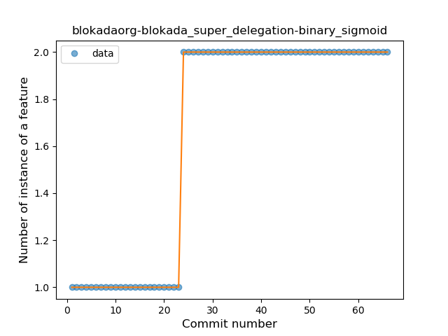

#### ligi-gobandroid
* Feature: Super Delegation
* Function: 
* R_Squared: 1.0
 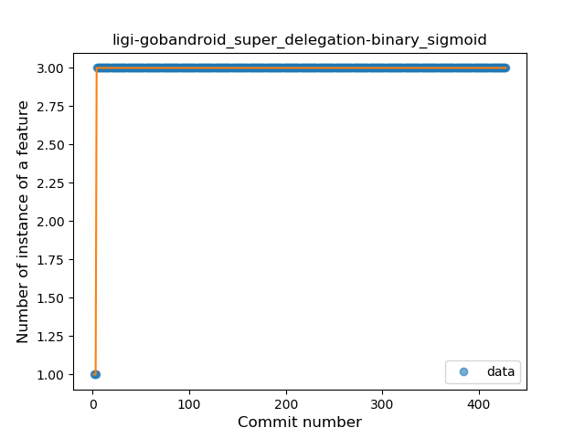

#### ultrasonic-ultrasonic
* Feature: Super Delegation
* Function: 
* R_Squared: 1.0
 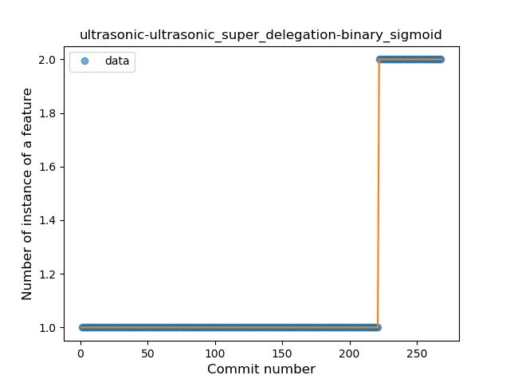

#### ykrank-S1-Next
* Feature: Super Delegation
* Function: 
* R_Squared: 1.0
 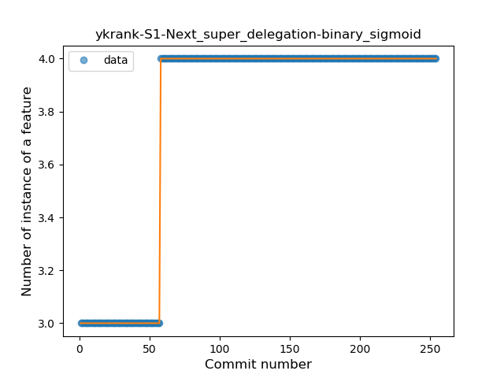

#### mozilla-mobile-focus-android
* Feature: Destructuring Declaration
* Function: 
* R_Squared: 0.99166742
 

#### abertschi-ad-free
* Feature: When expression
* Function: 
* R_Squared: 0.98974442
 

#### mbarta-scr-redesign
* Feature: Function with Default Value
* Function: 
* R_Squared: 0.98512002
 

#### nicorsm-S3-16-simone
* Feature: Property Delegation
* Function: 
* R_Squared: 0.98133224
 

#### impalex-knockonports
* Feature: Companion Object
* Function: 
* R_Squared: 0.97921663
 

#### danirod-rectball
* Feature: Destructuring Declaration
* Function: 
* R_Squared: 0.97838556
 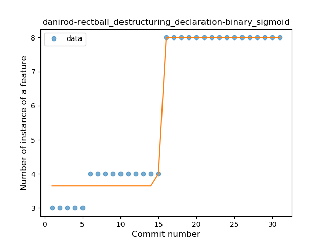

#### fossasia-open-event-android
* Feature: Unsafe Call
* Function: 
* R_Squared: 0.97804271
 

#### MartinStyk-AndroidApkAnalyzer
* Feature: Range Expression
* Function: 
* R_Squared: 0.9767855
 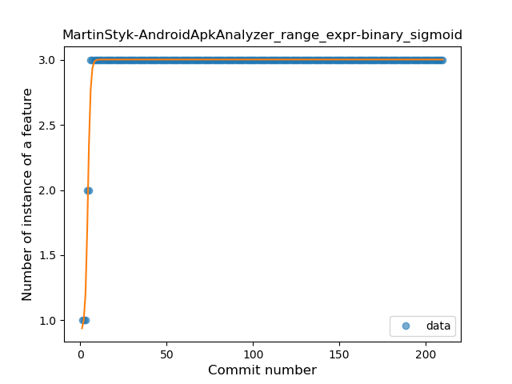

#### blastrock-kaqui
* Feature: Safe Call
* Function: 
* R_Squared: 0.97305556
 

#### ykrank-S1-Next
* Feature: Data Class
* Function: 
* R_Squared: 0.97141956
 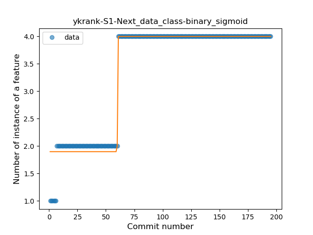

#### exviva-stew
* Feature: Smart Cast
* Function: 
* R_Squared: 0.96817509
 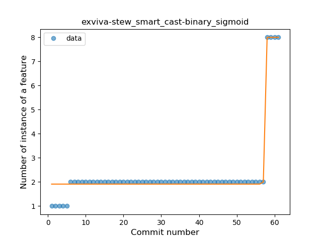

#### nibarius-opera-park-android
* Feature: Smart Cast
* Function: 
* R_Squared: 0.96617217
 

#### freedombox-team-android-app
* Feature: Function with Default Value
* Function: 
* R_Squared: 0.96492493
 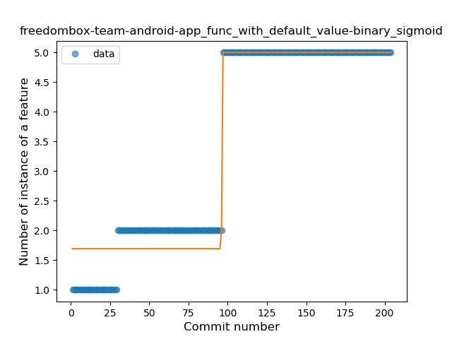

#### corphish-NightLight
* Feature: When expression
* Function: 
* R_Squared: 0.9643201
 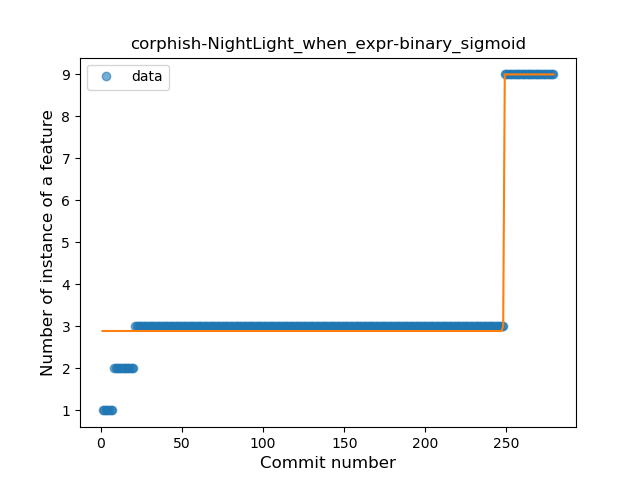

#### AkshayChordiya-gofun-android
* Feature: When expression
* Function: 
* R_Squared: 0.96388847
 

#### pacien-tincapp
* Feature: Smart Cast
* Function: 
* R_Squared: 0.96327358
 

#### ligi-PassAndroid
* Feature: Extension Function
* Function: 
* R_Squared: 0.96119903
 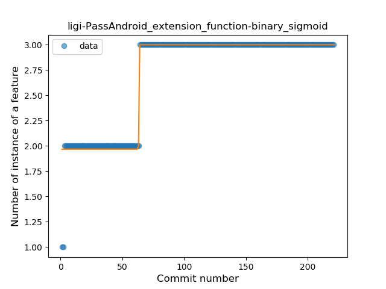

#### LISTEN-moe-android-app
* Feature: Function with Default Value
* Function: 
* R_Squared: 0.96060221
 

#### abertschi-ad-free
* Feature: Function call with Named Argument
* Function: 
* R_Squared: 0.95925846
 

#### danvratil-FBEventSync
* Feature: Function call with Named Argument
* Function: 
* R_Squared: 0.95906433
 

#### CzBiX-v2ex-android
* Feature: Function call with Named Argument
* Function: 
* R_Squared: 0.95503508
 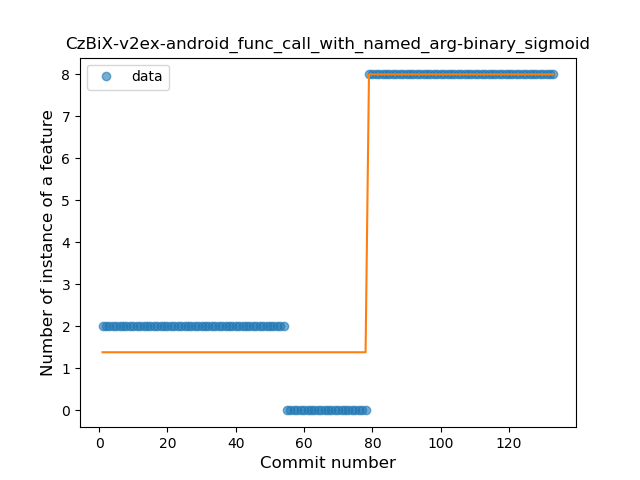

#### AkshayChordiya-gofun-android
* Feature: Inline Function
* Function: 
* R_Squared: 0.95338983
 

#### shymmq-librus-client-kotlin
* Feature: Function with Default Value
* Function: 
* R_Squared: 0.94818763
 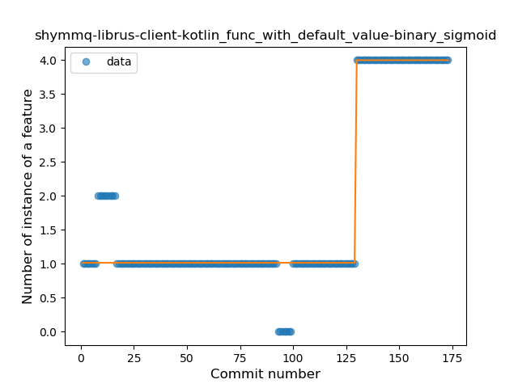

#### bubelov-coins-android
* Feature: Inline Function
* Function: 
* R_Squared: 0.93591328
 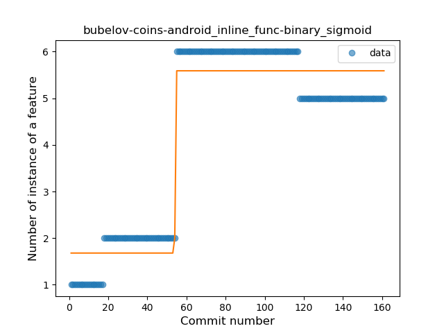

#### kamgurgul-cpu-info
* Feature: Function with Default Value
* Function: 
* R_Squared: 0.93315053
 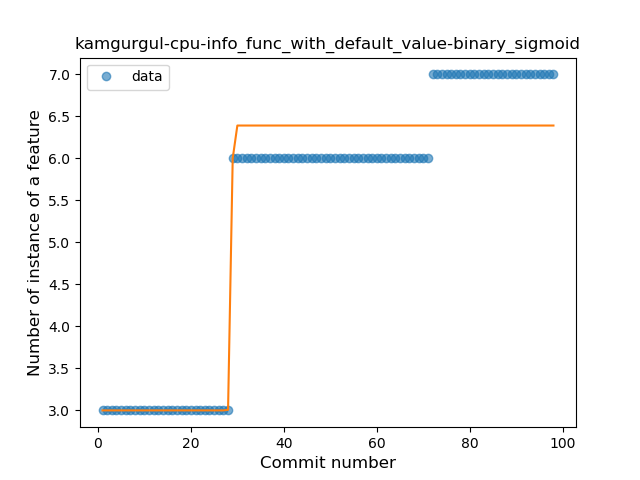

#### ofalvai-BPInfo
* Feature: Property Delegation
* Function: 
* R_Squared: 0.92925714
 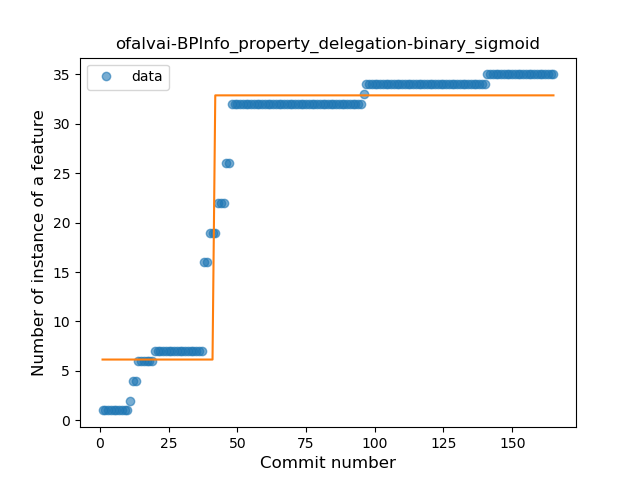

#### Depau-EtchDroid
* Feature: Range Expression
* Function: 
* R_Squared: 0.92738375
 

#### glodanif-BluetoothChat
* Feature: Inline Function
* Function: 
* R_Squared: 0.92638678
 

#### grote-Transportr
* Feature: Singleton
* Function: 
* R_Squared: 0.92061246
 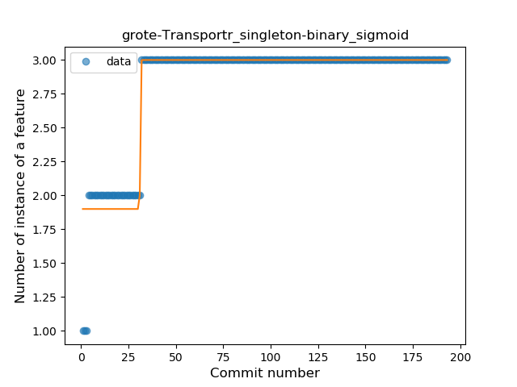

#### nathanj-ogsdroid
* Feature: Function call with Named Argument
* Function: 
* R_Squared: 0.9202454
 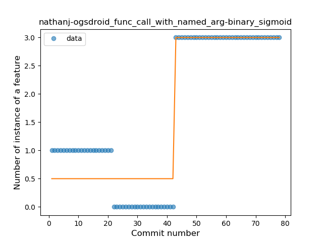

#### wuan-bo-android
* Feature: Singleton
* Function: 
* R_Squared: 0.91494502
 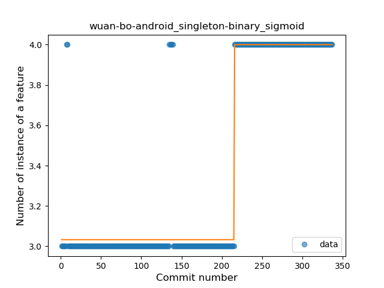

#### charlesmadere-smash-ranks-android
* Feature: Type Inference
* Function: 
* R_Squared: 0.91038706
 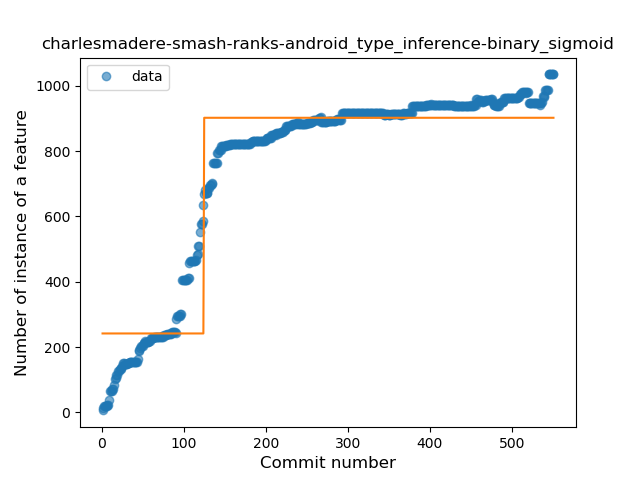

#### ligi-MaterialTeaTimer
* Feature: Lambda
* Function: 
* R_Squared: 0.90833391
 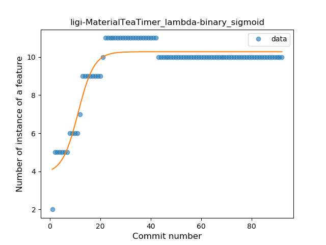

#### teamblueridge-PasteIt
* Feature: Lambda
* Function: 
* R_Squared: 0.90328634
 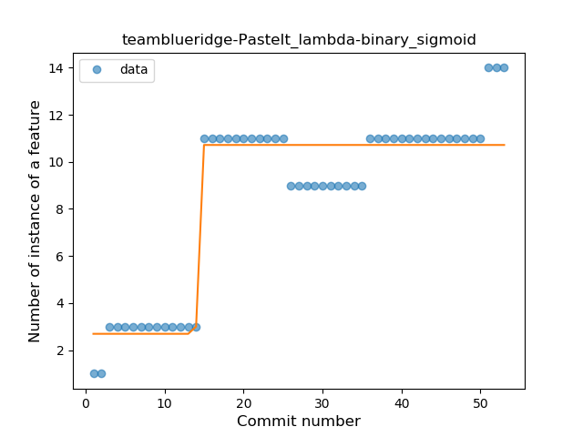

#### zeapo-Android-Password-Store
* Feature: Companion Object
* Function: 
* R_Squared: 0.90318246
 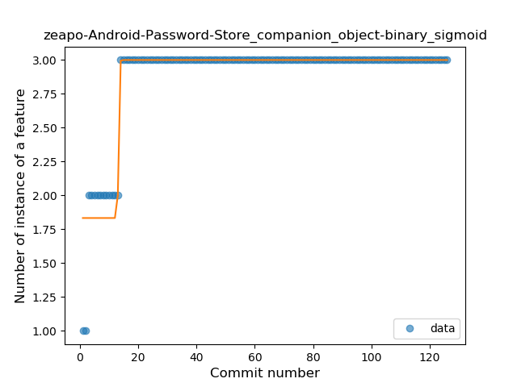

#### SimpleMobileTools-Simple-Camera
* Feature: Range Expression
* Function: 
* R_Squared: 0.89977174
 

#### DSteve595-Put.io
* Feature: Extension Function
* Function: 
* R_Squared: 0.89628427
 

#### CzBiX-v2ex-android
* Feature: Data Class
* Function: 
* R_Squared: 0.89586642
 

#### LawnchairLauncher-Lawnchair
* Feature: Function call with Named Argument
* Function: 
* R_Squared: 0.89403805
 

#### openium-auvergne-webcams-droid
* Feature: Companion Object
* Function: 
* R_Squared: 0.89134632
 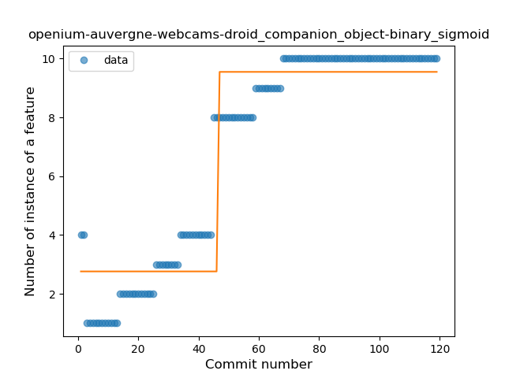

#### Maxr1998-home-assistant-Android
* Feature: Singleton
* Function: 
* R_Squared: 0.87547893
 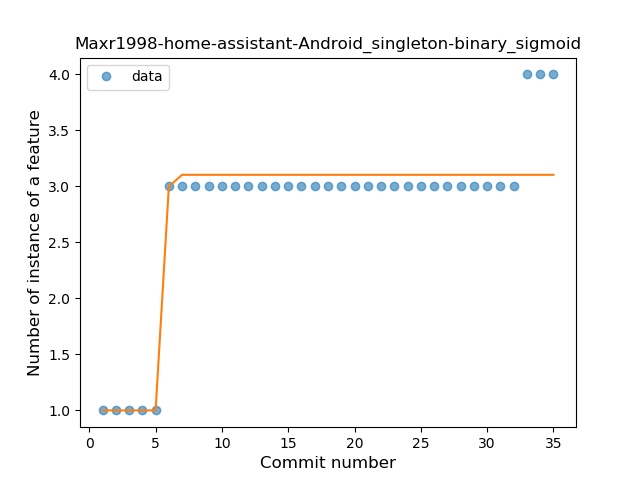

#### MGaetan89-ShowsRage
* Feature: Data Class
* Function: 
* R_Squared: 0.87122548
 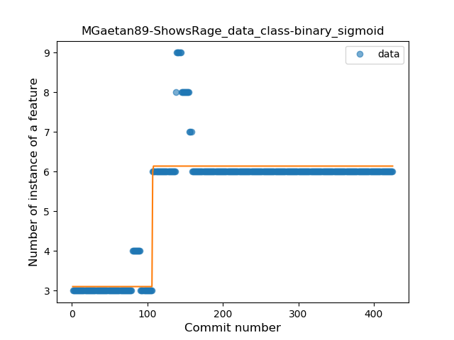

#### danvratil-FBEventSync
* Feature: Range Expression
* Function: 
* R_Squared: 0.86898396
 

#### MartinStyk-AndroidApkAnalyzer
* Feature: Extension Function
* Function: 
* R_Squared: 0.86788939
 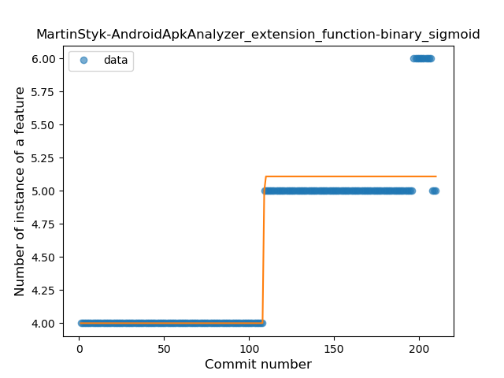

#### blastrock-kaqui
* Feature: Extension Function
* Function: 
* R_Squared: 0.86086637
 

#### MartinStyk-AndroidApkAnalyzer
* Feature: Property Delegation
* Function: 
* R_Squared: 0.85780886
 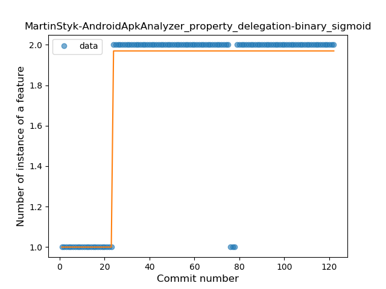

#### apoi-quickbeer-android
* Feature: Function call with Named Argument
* Function: 
* R_Squared: 0.85199102
 

#### LiMium-mini-vector-android
* Feature: Lambda
* Function: 
* R_Squared: 0.85066349
 

#### ligi-IPFSDroid
* Feature: Lambda
* Function: 
* R_Squared: 0.84948833
 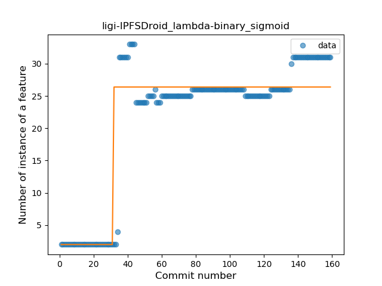

#### ohmae-DmsExplorer
* Feature: When expression
* Function: 
* R_Squared: 0.84882845
 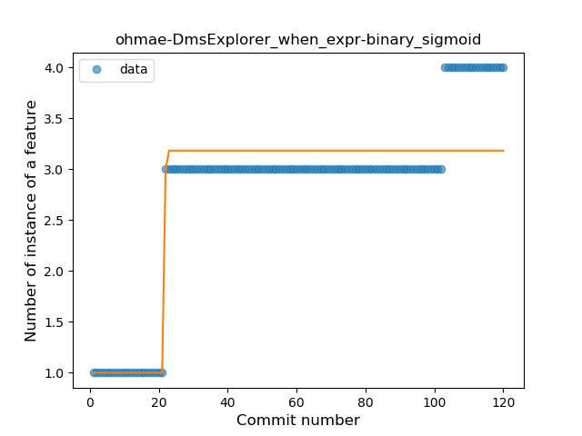

#### AkshayChordiya-gofun-android
* Feature: Function with Default Value
* Function: 
* R_Squared: 0.84848485
 

#### openium-auvergne-webcams-droid
* Feature: Range Expression
* Function: 
* R_Squared: 0.84802758
 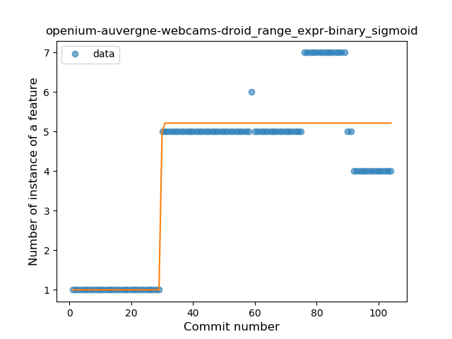

#### jeeb-mpv-android
* Feature: Smart Cast
* Function: 
* R_Squared: 0.83738541
 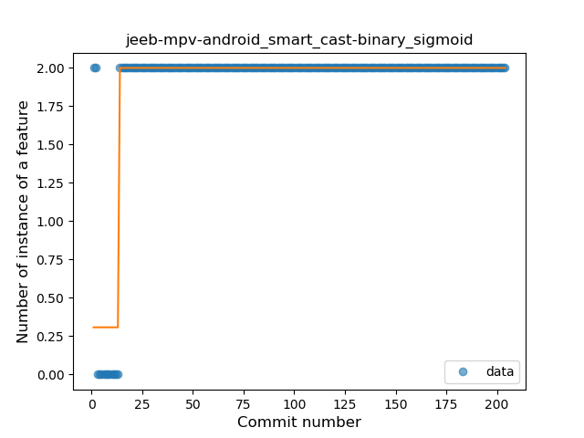

#### pflammertsma-cryptogram
* Feature: When expression
* Function: 
* R_Squared: 0.83433025
 

#### duckduckgo-Android
* Feature: Range Expression
* Function: 
* R_Squared: 0.82448197
 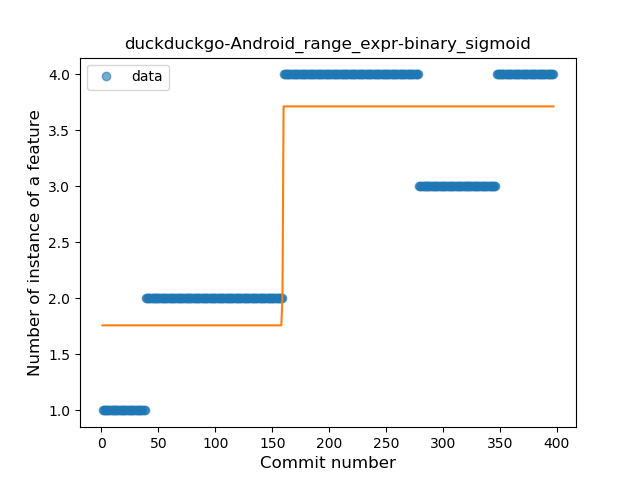

#### Mystery00-JanYoShare
* Feature: Smart Cast
* Function: 
* R_Squared: 0.82344374
 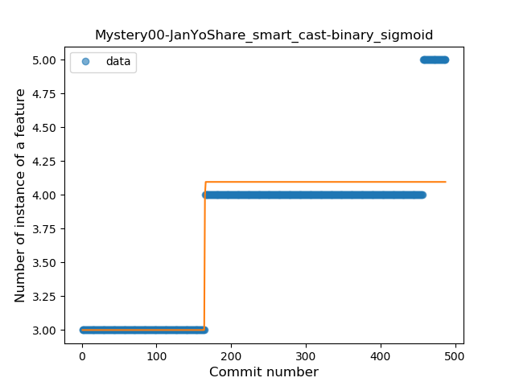

#### vector-im-riot-android
* Feature: Lambda
* Function: 
* R_Squared: 0.81991435
 

#### marcelgross90-Cineaste
* Feature: Singleton
* Function: 
* R_Squared: 0.79701297
 

#### apiote-Bimba
* Feature: Lambda
* Function: 
* R_Squared: 0.79350673
 

#### Agusyc-DayCounter
* Feature: String Template
* Function: 
* R_Squared: 0.78835472
 

#### albertolalanda-new-ultrasonic-fork-for-MyMusicQoE
* Feature: String Template
* Function: 
* R_Squared: 0.78827405
 

#### maks-MGit
* Feature: Lambda
* Function: 
* R_Squared: 0.77352518
 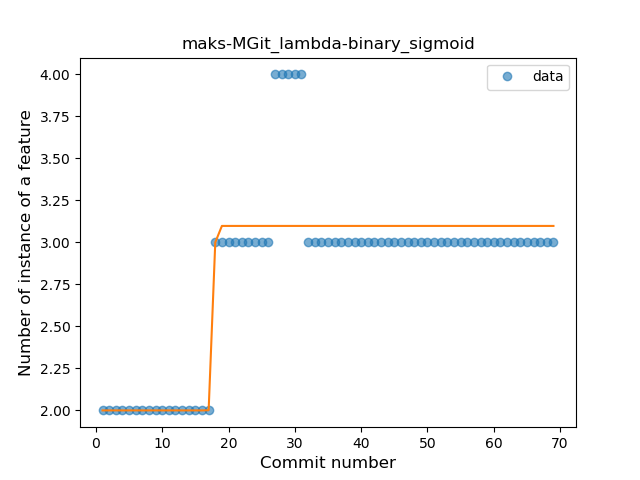

#### pflammertsma-cryptogram
* Feature: Range Expression
* Function: 
* R_Squared: 0.76871055
 

#### duckduckgo-Android
* Feature: Unsafe Call
* Function: 
* R_Squared: 0.76046316
 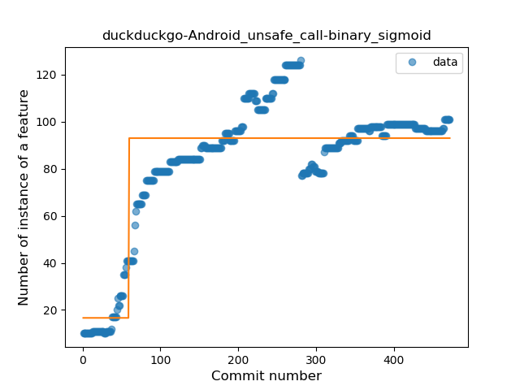

#### FengMoeTeam-NHentai-android
* Feature: Singleton
* Function: 
* R_Squared: 0.73770492
 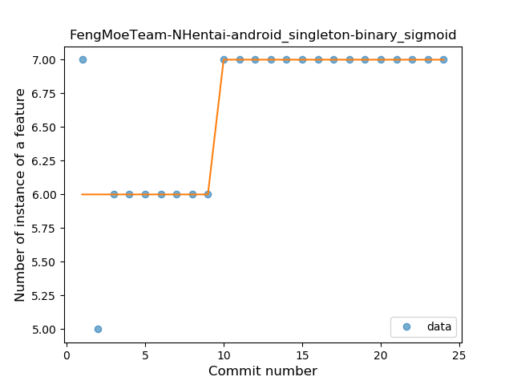

#### Apolline-Lille-apolline-android
* Feature: Data Class
* Function: 
* R_Squared: 0.73695652
 

#### CypherpunkArmory-UserLAnd
* Feature: Range Expression
* Function: 
* R_Squared: 0.72674589
 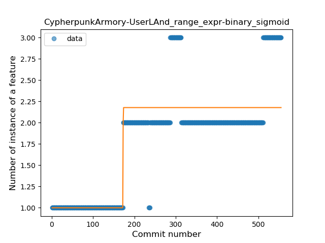

#### caarmen-poet-assistant
* Feature: Singleton
* Function: 
* R_Squared: 0.72183059
 

#### xgouchet-Stanley
* Feature: Function call with Named Argument
* Function: 
* R_Squared: 0.72040192
 

#### premnirmal-StockTicker
* Feature: Range Expression
* Function: 
* R_Squared: 0.71597194
 

#### iSoron-uhabits
* Feature: Range Expression
* Function: 
* R_Squared: 0.68632075
 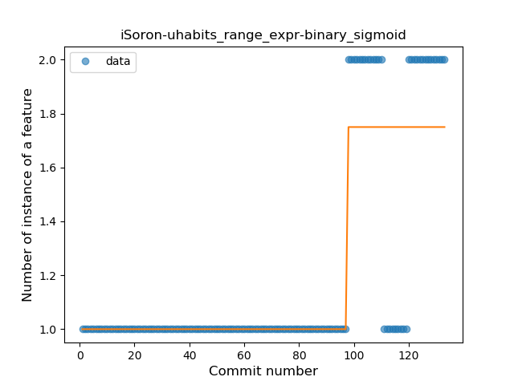

#### corphish-NightLight
* Feature: Singleton
* Function: 
* R_Squared: 0.68504078
 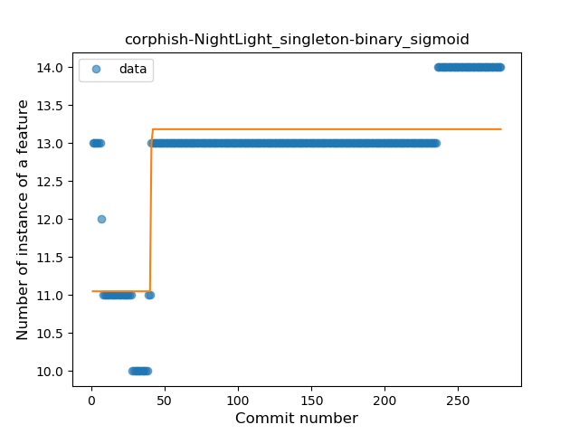

#### shymmq-librus-client-kotlin
* Feature: Singleton
* Function: 
* R_Squared: 0.66792777
 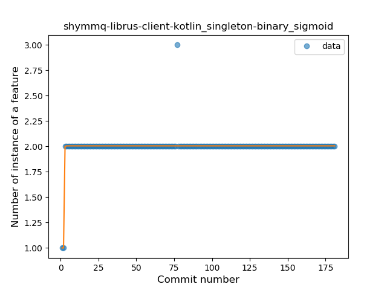

#### bubelov-coins-android
* Feature: When expression
* Function: 
* R_Squared: 0.64868393
 

#### exviva-stew
* Feature: Function call with Named Argument
* Function: 
* R_Squared: 0.61406553
 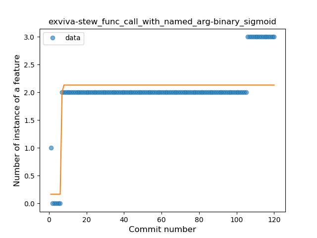

#### apiote-Bimba
* Feature: Unsafe Call
* Function: 
* R_Squared: 0.60978051
 

#### teamblueridge-PasteIt
* Feature: Companion Object
* Function: 
* R_Squared: 0.60232558
 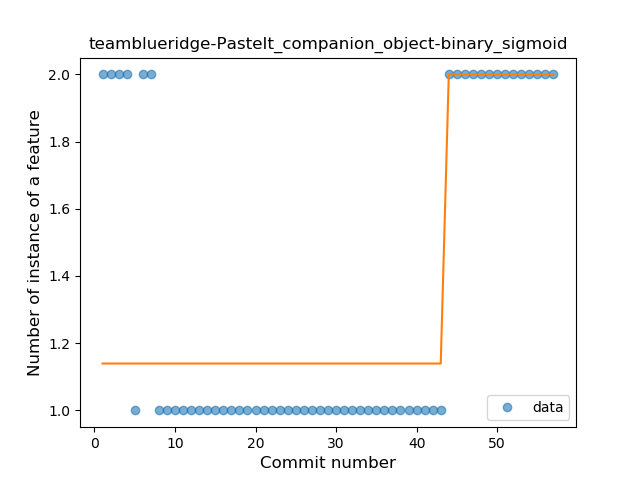

#### herbeth1u-VNDB-Android
* Feature: Singleton
* Function: 
* R_Squared: 0.55586598
 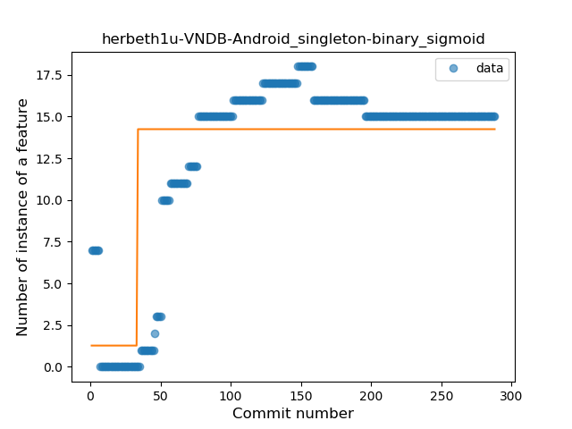

#### MGaetan89-ShowsRage
* Feature: Unsafe Call
* Function: 
* R_Squared: 0.54590148
 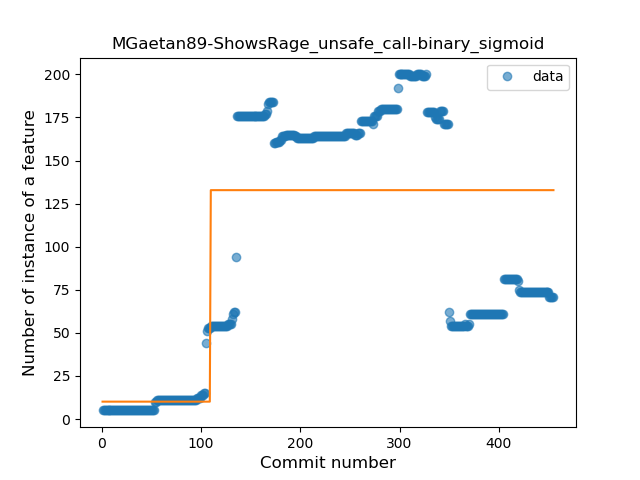

#### shymmq-librus-client-kotlin
* Feature: Function call with Named Argument
* Function: 
* R_Squared: 0.5341615
 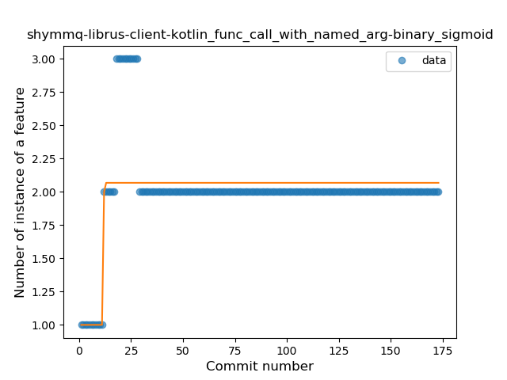

#### ohmae-VoiceMessageBoard
* Feature: Property Delegation
* Function: 
* R_Squared: 0.52936956
 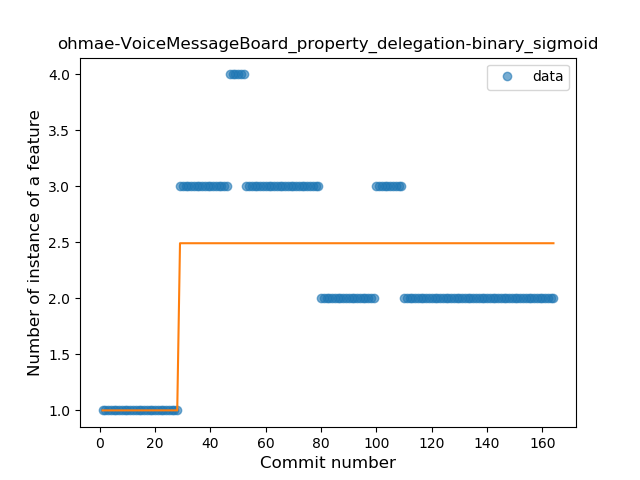

#### premnirmal-StockTicker
* Feature: Smart Cast
* Function: 
* R_Squared: 0.52154808
 

#### corphish-NightLight
* Feature: Smart Cast
* Function: 
* R_Squared: 0.52144602
 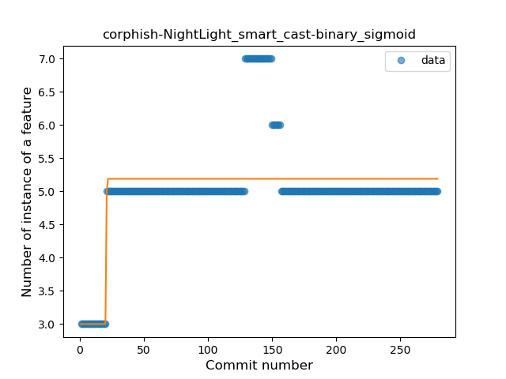

#### calintat-units
* Feature: Data Class
* Function: 
* R_Squared: 0.50716713
 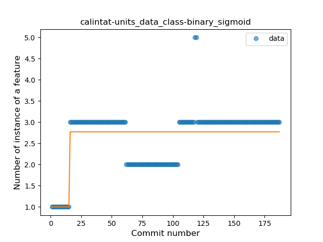

#### emansih-FireflyMobile
* Feature: Smart Cast
* Function: 
* R_Squared: 0.50454077
 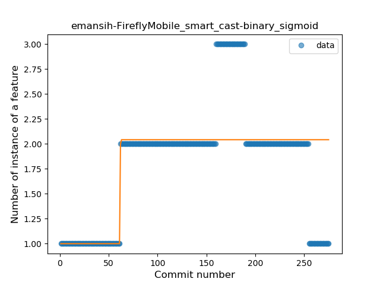

#### LawnchairLauncher-Lawnchair
* Feature: Extension Function
* Function: 
* R_Squared: 0.4745168
 

#### pyamsoft-home-button
* Feature: Smart Cast
* Function: 
* R_Squared: 0.45454545
 

#### xgouchet-Stanley
* Feature: Property Delegation
* Function: 
* R_Squared: 0.43712465
 

#### sandy-8925-Checklist
* Feature: Companion Object
* Function: 
* R_Squared: 0.42060988
 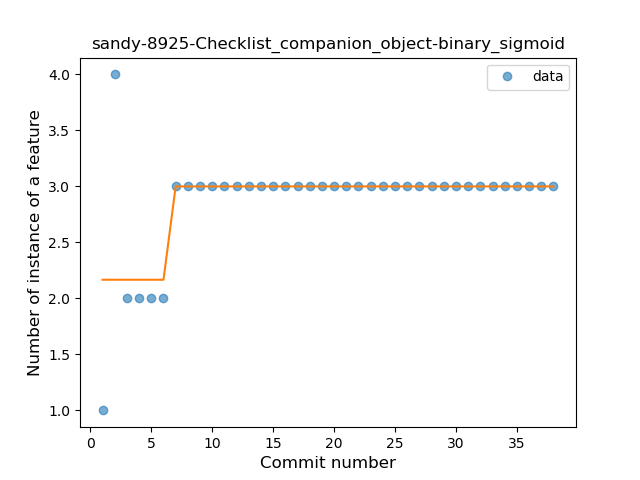

#### abertschi-ad-free
* Feature: Companion Object
* Function: 
* R_Squared: 0.40901913
 

#### abertschi-ad-free
* Feature: Data Class
* Function: 
* R_Squared: 0.37858812
 

#### BenAlderfer-hand-and-foot-scores
* Feature: String Template
* Function: 
* R_Squared: 0.35714286
 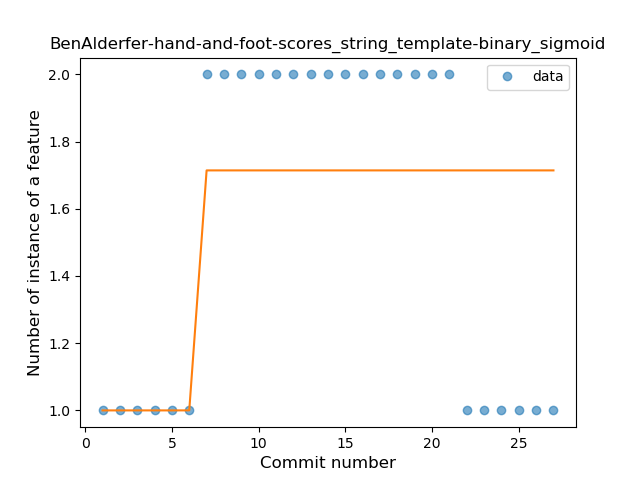

#### nonylene-PhotoLinkViewer
* Feature: Lambda
* Function: 
* R_Squared: 0.32689238
 

#### charlesmadere-smash-ranks-android
* Feature: Overloaded Operator
* Function: 
* R_Squared: 0.31068624
 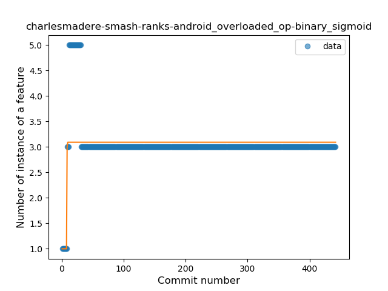

#### mpcjanssen-simpletask-android
* Feature: Unsafe Call
* Function: 
* R_Squared: 0.29552882
 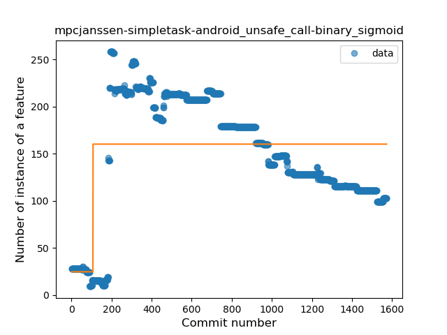

#### mjdenham-and-bible
* Feature: Destructuring Declaration
* Function: 
* R_Squared: 0.29257265
 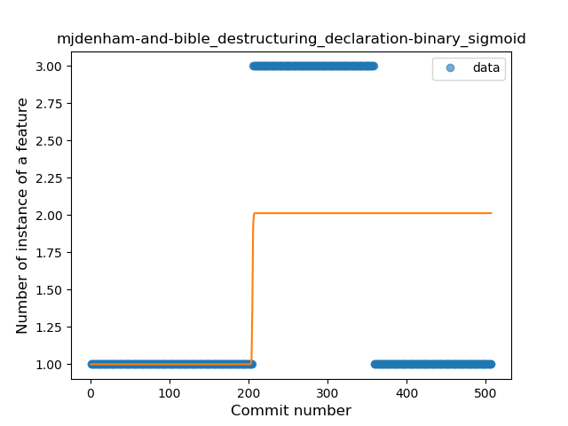

#### inorichi-tachiyomi
* Feature: Super Delegation
* Function: 
* R_Squared: 0.28744891
 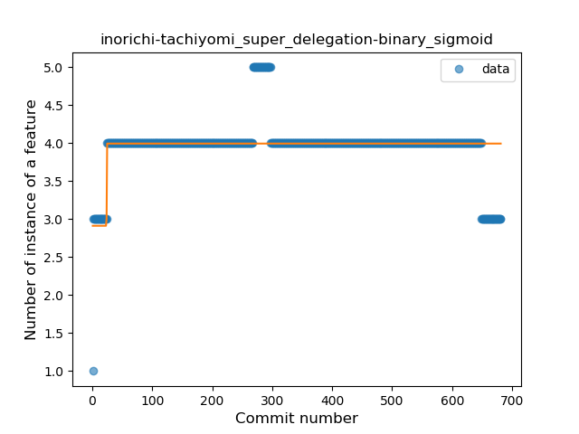

#### herbeth1u-VNDB-Android
* Feature: Unsafe Call
* Function: 
* R_Squared: 0.27060187
 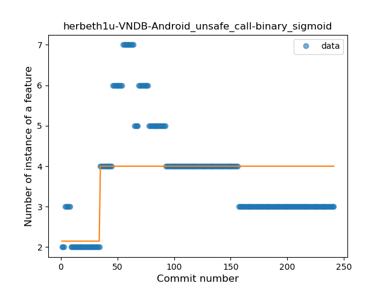

#### nonylene-PhotoLinkViewer
* Feature: Extension Function
* Function: 
* R_Squared: 0.26429771
 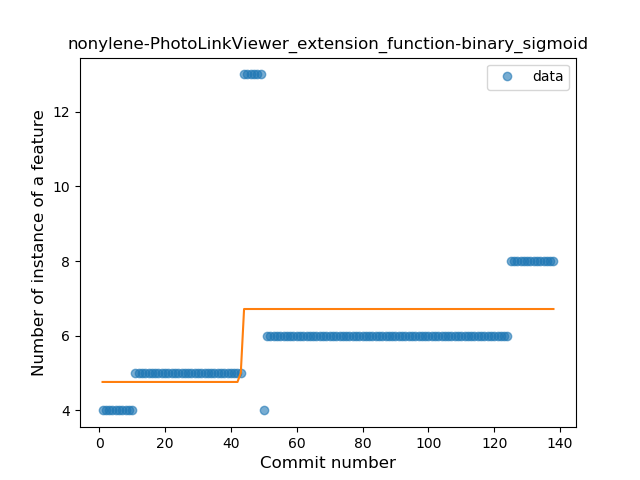

#### LawnchairLauncher-Lawnchair
* Feature: Function with Default Value
* Function: 
* R_Squared: 0.26093178
 

#### SimpleMobileTools-Simple-Draw
* Feature: Companion Object
* Function: 
* R_Squared: 0.23263683
 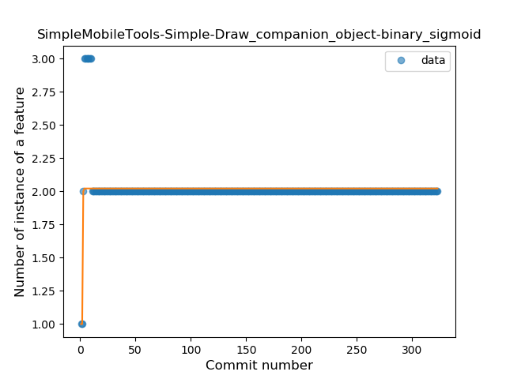

#### ronocod-bus
* Feature: String Template
* Function: 
* R_Squared: 0.21807805
 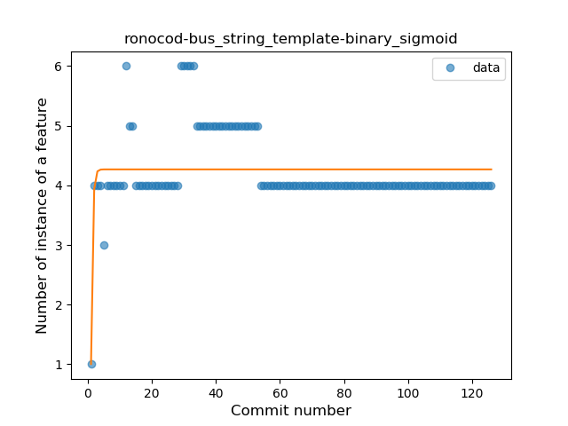

#### juha-h-baresip-studio
* Feature: Range Expression
* Function: 
* R_Squared: 0.19612591
 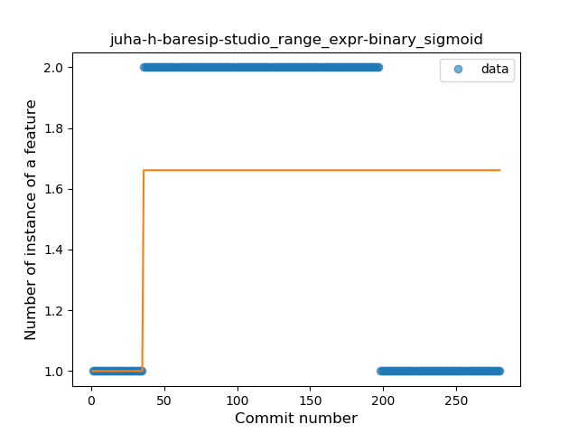

#### bitfireAT-davdroid
* Feature: Destructuring Declaration
* Function: 
* R_Squared: 0.18130577
 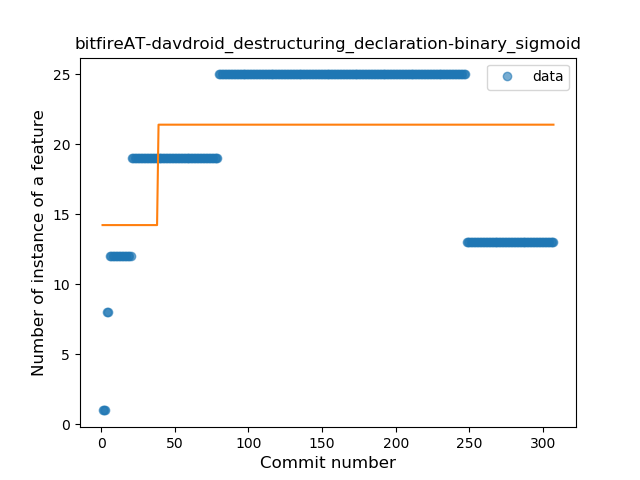

#### SimpleMobileTools-Simple-App-Launcher
* Feature: Extension Function
* Function: 
* R_Squared: 0.17472089
 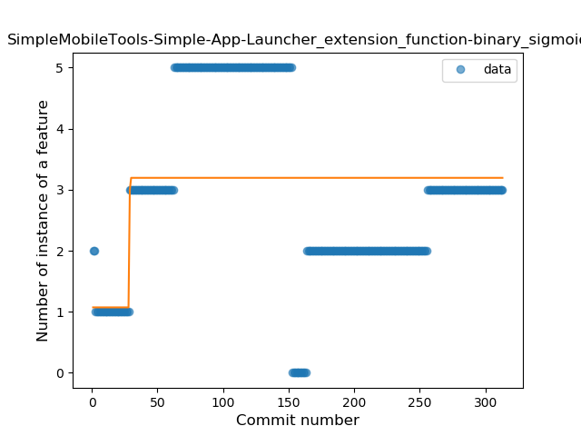

#### nonylene-PhotoLinkViewer
* Feature: Singleton
* Function: 
* R_Squared: 0.15189799
 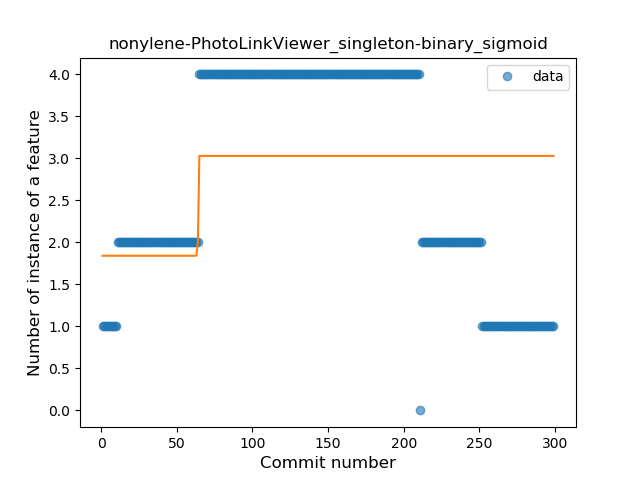

#### aminecmi-ReaderforSelfoss
* Feature: Destructuring Declaration
* Function: 
* R_Squared: 0.10363385
 

#### anthonycr-Lightning-Browser
* Feature: Unsafe Call
* Function: 
* R_Squared: 0.09205619
 

#### nonylene-PhotoLinkViewer
* Feature: Safe Call
* Function: 
* R_Squared: 0.06894885
 

#### walleth-walleth
* Feature: Singleton
* Function: 
* R_Squared: 0.03395579
 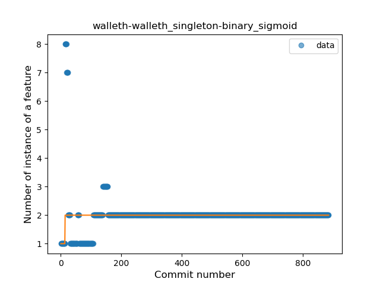

