## Plateau Sudden Rise
----
**494** best fit

#### com-james-status
* Feature: Type Inference
* Function: 
* R_Squared: 1.0
 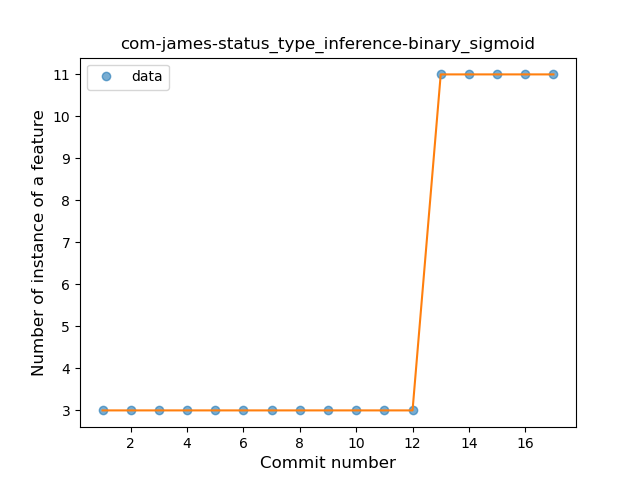

#### io-github-project
* Feature: Type Inference
* Function: 
* R_Squared: 1.0
 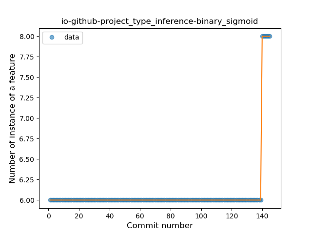

#### io-github-project_travel_mate
* Feature: Type Inference
* Function: 
* R_Squared: 1.0
 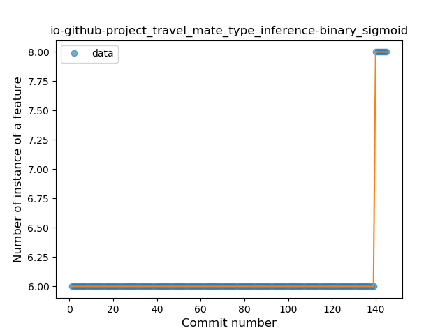

#### name-myigel-fahrplan-eh17
* Feature: Type Inference
* Function: 
* R_Squared: 1.0
 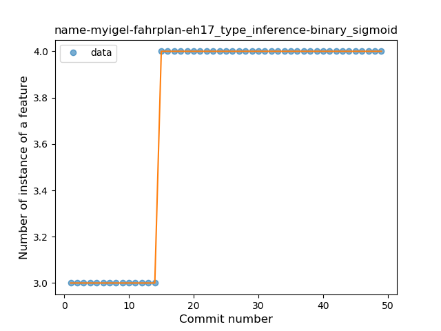

#### com-alderferstudios-handandfootscores
* Feature: Lambda
* Function: 
* R_Squared: 1.0
 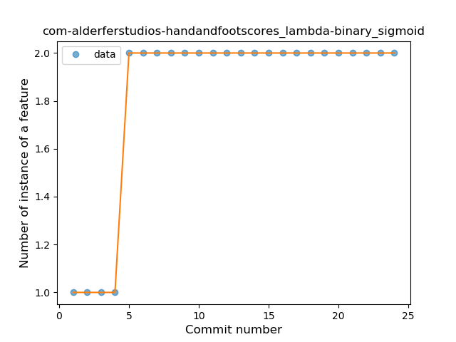

#### com-james-status
* Feature: Lambda
* Function: 
* R_Squared: 1.0
 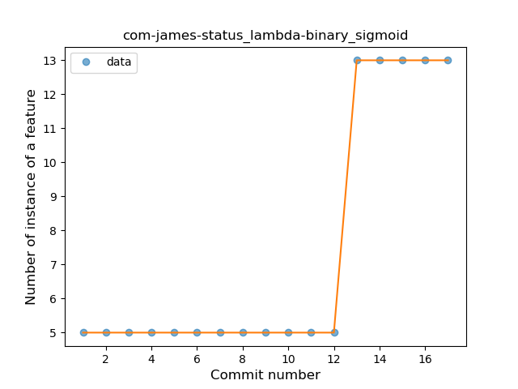

#### com-mbcdev-folkets
* Feature: Lambda
* Function: 
* R_Squared: 1.0
 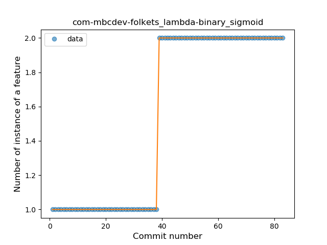

#### de-msal-muzei-nationalgeographic
* Feature: Lambda
* Function: 
* R_Squared: 1.0
 

#### fr-jnda-android-ipcalc
* Feature: Lambda
* Function: 
* R_Squared: 1.0
 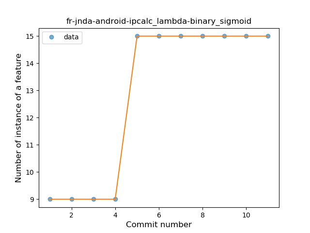

#### name-cantanima-chineseremainderclock
* Feature: Lambda
* Function: 
* R_Squared: 1.0
 

#### nl-renedegroot-android-adbawake
* Feature: Lambda
* Function: 
* R_Squared: 1.0
 

#### at-ac-tuwien-caa-docscan
* Feature: Safe Call
* Function: 
* R_Squared: 1.0
 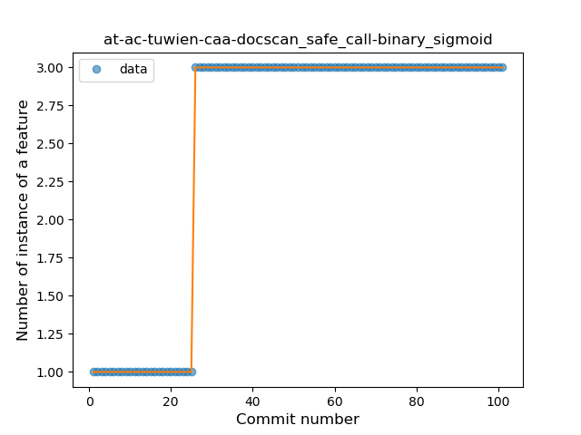

#### com-BibleQuote
* Feature: Safe Call
* Function: 
* R_Squared: 1.0
 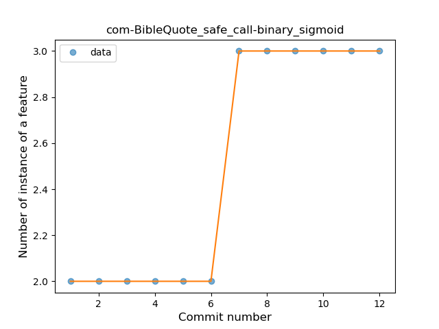

#### com-heed-justquotes
* Feature: Safe Call
* Function: 
* R_Squared: 1.0
 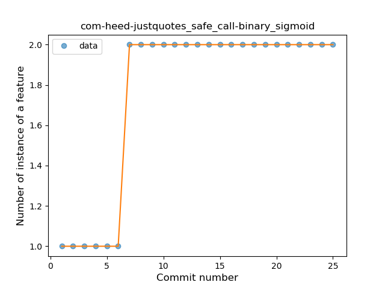

#### com-james-status
* Feature: Safe Call
* Function: 
* R_Squared: 1.0
 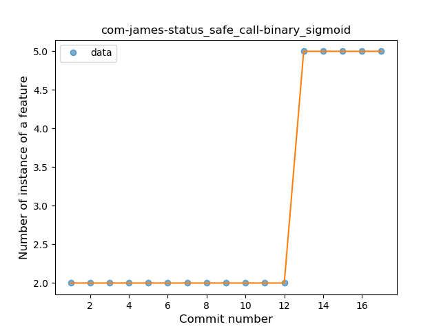

#### com-systemallica-valenbisi
* Feature: Safe Call
* Function: 
* R_Squared: 1.0
 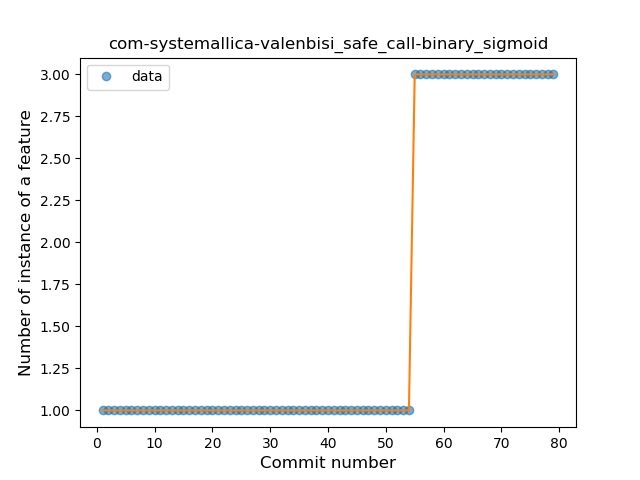

#### de-spiritcroc-darkcroc-substratum
* Feature: Safe Call
* Function: 
* R_Squared: 1.0
 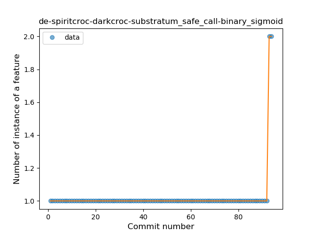

#### fr-corenting-edcompanion
* Feature: Safe Call
* Function: 
* R_Squared: 1.0
 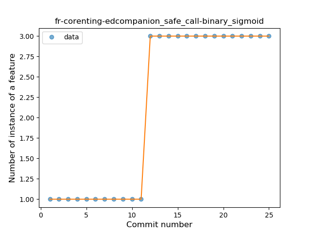

#### io-github-hidroh-materialistic
* Feature: Safe Call
* Function: 
* R_Squared: 1.0
 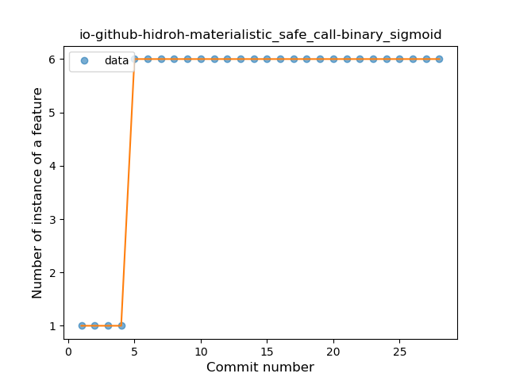

#### io-github-umren-watcher
* Feature: Safe Call
* Function: 
* R_Squared: 1.0
 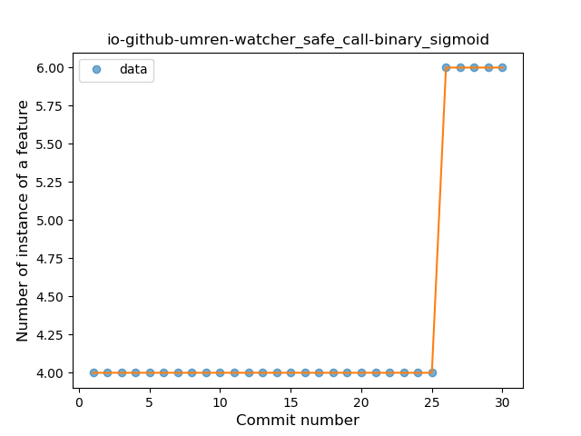

#### io-github-z3r0c00l
* Feature: Safe Call
* Function: 
* R_Squared: 1.0
 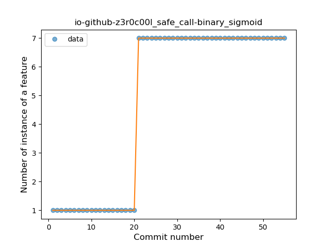

#### net-codechunk-speedofsound
* Feature: Safe Call
* Function: 
* R_Squared: 1.0
 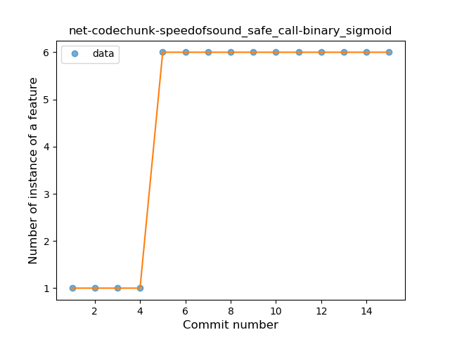

#### org-decsync-sparss-floss
* Feature: Safe Call
* Function: 
* R_Squared: 1.0
 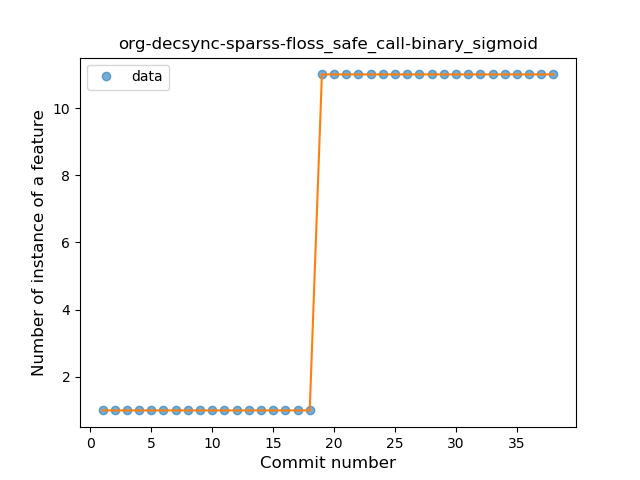

#### streetwalrus-usbmountr
* Feature: Safe Call
* Function: 
* R_Squared: 1.0
 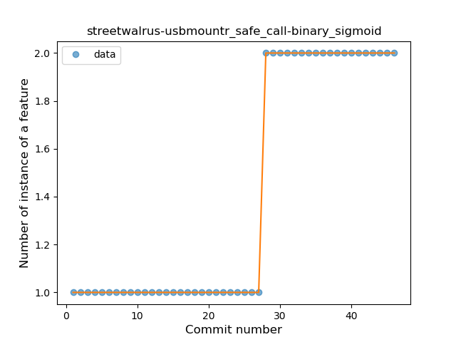

#### at-ac-tuwien-caa-docscan
* Feature: When expression
* Function: 
* R_Squared: 1.0
 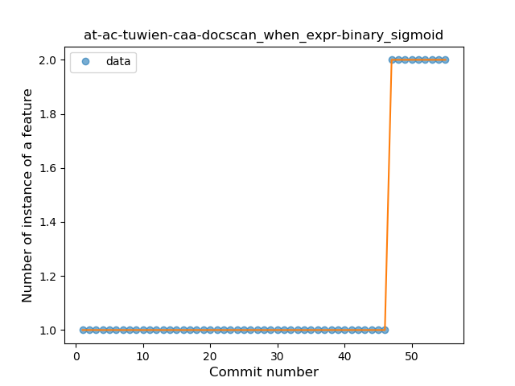

#### com-alderferstudios-handandfootscores
* Feature: When expression
* Function: 
* R_Squared: 1.0
 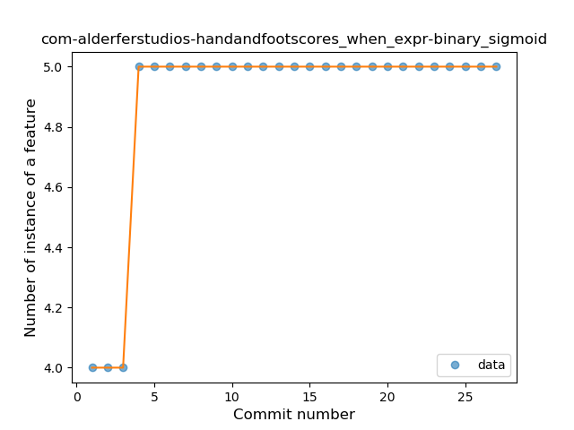

#### com-example-harisont-librery
* Feature: When expression
* Function: 
* R_Squared: 1.0
 

#### com-geo-GeoQuake
* Feature: When expression
* Function: 
* R_Squared: 1.0
 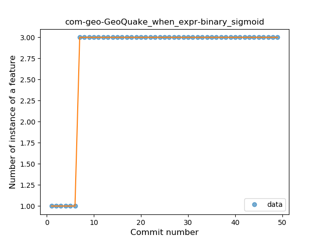

#### com-guardafilme
* Feature: When expression
* Function: 
* R_Squared: 1.0
 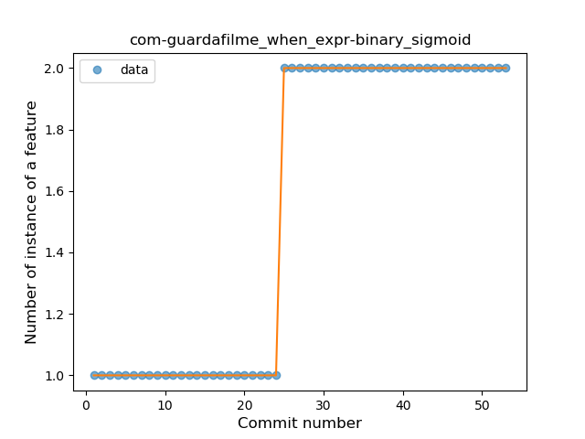

#### com-ids1024-lsdict
* Feature: When expression
* Function: 
* R_Squared: 1.0
 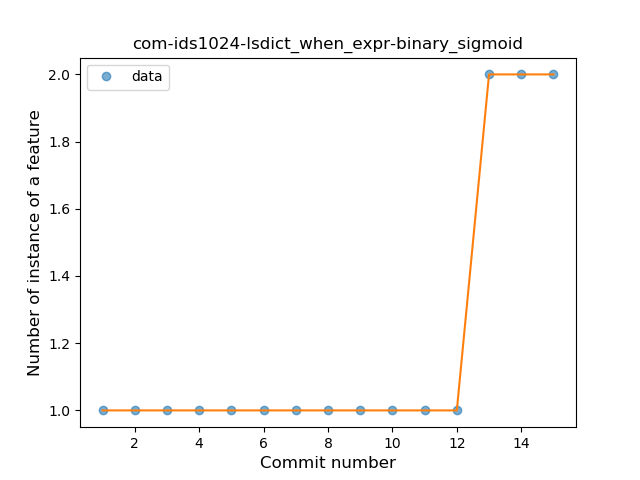

#### com-ids1024-whitakerswords
* Feature: When expression
* Function: 
* R_Squared: 1.0
 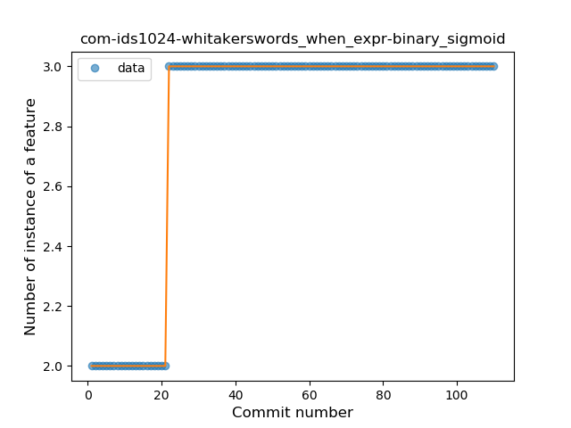

#### com-libopenmw-openmw
* Feature: When expression
* Function: 
* R_Squared: 1.0
 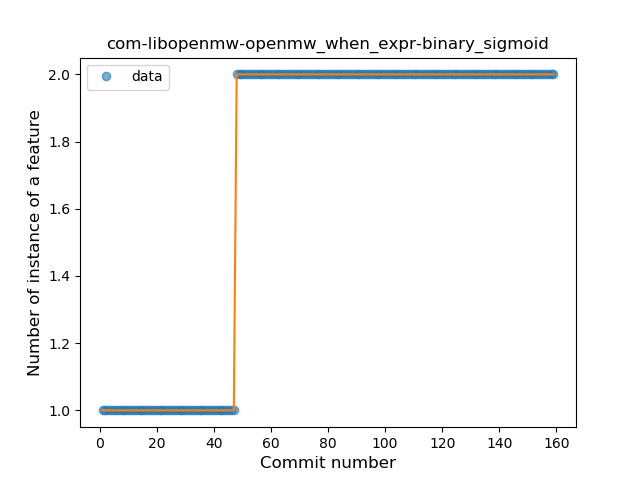

#### com-pavelsikun-runinbackgroundpermissionsetter
* Feature: When expression
* Function: 
* R_Squared: 1.0
 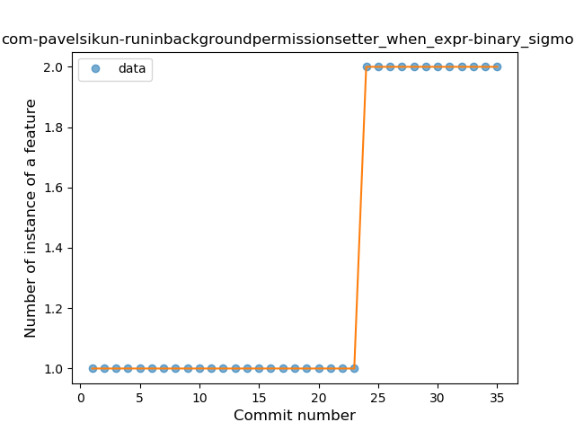

#### com-physphil-android-unitconverterultimate
* Feature: When expression
* Function: 
* R_Squared: 1.0
 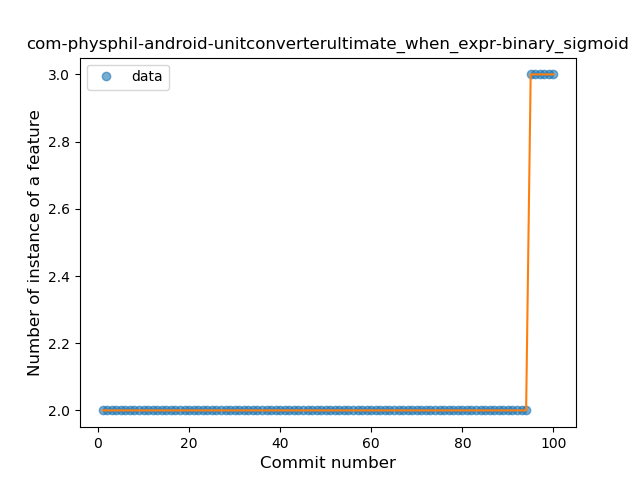

#### com-systemallica-valenbisi
* Feature: When expression
* Function: 
* R_Squared: 1.0
 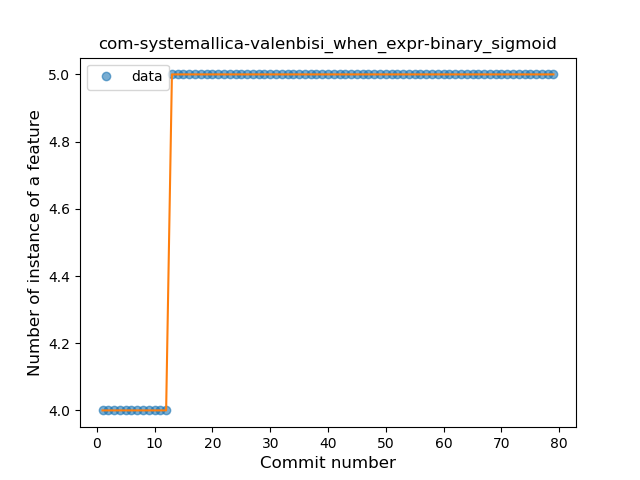

#### fr-openium-auvergnewebcams
* Feature: When expression
* Function: 
* R_Squared: 1.0
 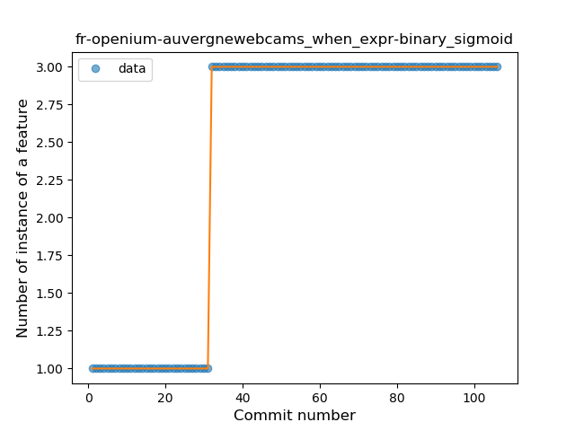

#### io-github-deweyreed-clipboardcleaner
* Feature: When expression
* Function: 
* R_Squared: 1.0
 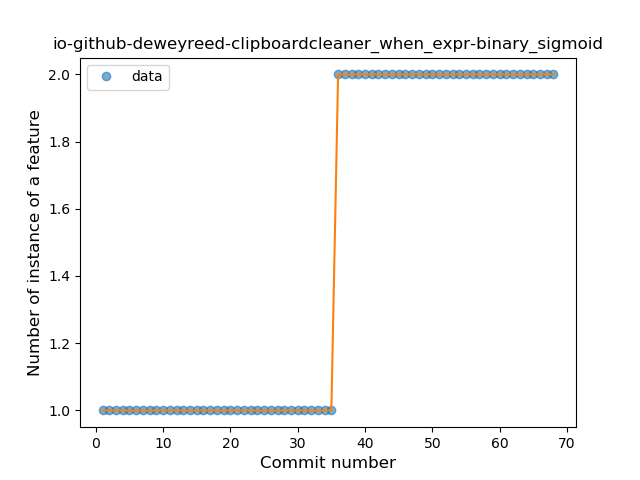

#### io-homeassistant-android
* Feature: When expression
* Function: 
* R_Squared: 1.0
 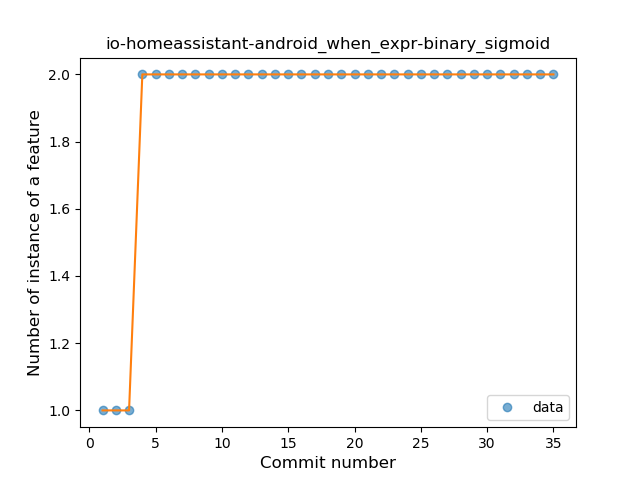

#### net-codechunk-speedofsound
* Feature: When expression
* Function: 
* R_Squared: 1.0
 

#### org-freedombox-freedombox
* Feature: When expression
* Function: 
* R_Squared: 1.0
 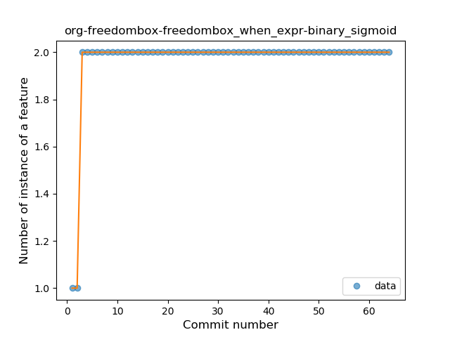

#### org-havenapp-main
* Feature: When expression
* Function: 
* R_Squared: 1.0
 

#### org-ligi-materialteatimer
* Feature: When expression
* Function: 
* R_Squared: 1.0
 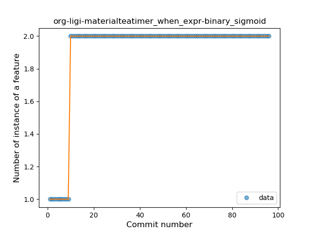

#### org-mcxa-vortaro
* Feature: When expression
* Function: 
* R_Squared: 1.0
 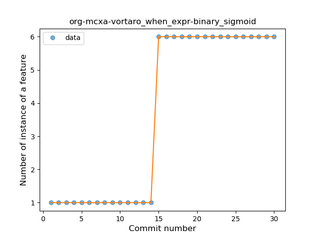

#### at-ac-tuwien-caa-docscan
* Feature: Unsafe Call
* Function: 
* R_Squared: 1.0
 

#### com-alderferstudios-handandfootscores
* Feature: Unsafe Call
* Function: 
* R_Squared: 1.0
 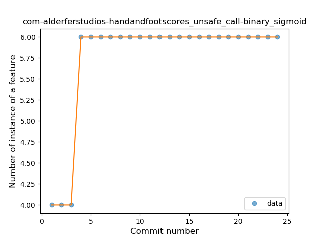

#### com-example-harisont-librery
* Feature: Unsafe Call
* Function: 
* R_Squared: 1.0
 

#### com-kanedias-vanilla-metadata
* Feature: Unsafe Call
* Function: 
* R_Squared: 1.0
 

#### com-rubenwardy-minetestmodmanager
* Feature: Unsafe Call
* Function: 
* R_Squared: 1.0
 

#### de-csicar-mensaplan
* Feature: Unsafe Call
* Function: 
* R_Squared: 1.0
 

#### fr-xgouchet-packageexplorer
* Feature: Unsafe Call
* Function: 
* R_Squared: 1.0
 

#### pl-temomuko-autostoprace
* Feature: Unsafe Call
* Function: 
* R_Squared: 1.0
 

#### se-creotec-chscardbalance2
* Feature: Unsafe Call
* Function: 
* R_Squared: 1.0
 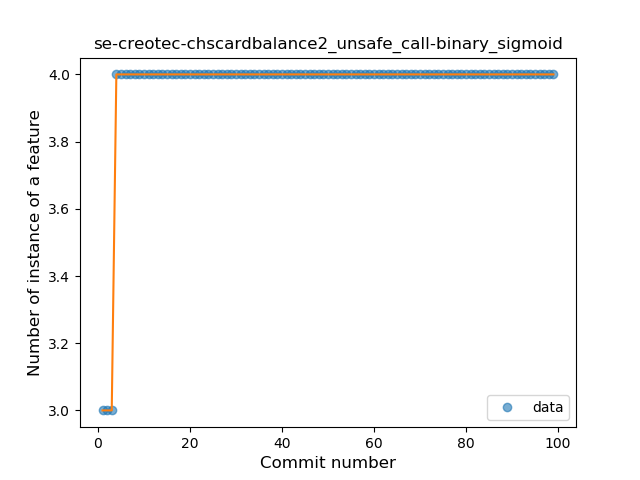

#### com-agusyc-daycounter
* Feature: Companion Object
* Function: 
* R_Squared: 1.0
 

#### com-alderferstudios-handandfootscores
* Feature: Companion Object
* Function: 
* R_Squared: 1.0
 

#### com-android-gpstest-osmdroid
* Feature: Companion Object
* Function: 
* R_Squared: 1.0
 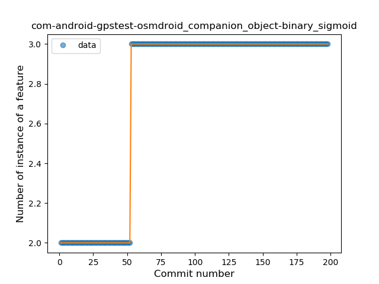

#### com-crane-mockappdemo
* Feature: Companion Object
* Function: 
* R_Squared: 1.0
 

#### com-geo-GeoQuake
* Feature: Companion Object
* Function: 
* R_Squared: 1.0
 

#### com-nao20010128nao-DroidComplex
* Feature: Companion Object
* Function: 
* R_Squared: 1.0
 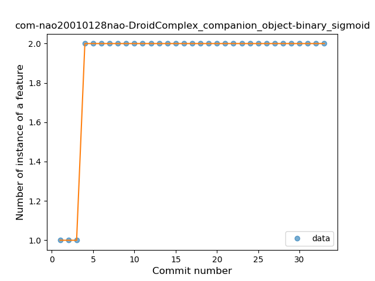

#### com-rohitsuratekar-NCBSinfo
* Feature: Companion Object
* Function: 
* R_Squared: 1.0
 

#### com-simplemobiletools-thankyou
* Feature: Companion Object
* Function: 
* R_Squared: 1.0
 

#### com-skydoves-waterdays
* Feature: Companion Object
* Function: 
* R_Squared: 1.0
 

#### es-danirod-rectball-android
* Feature: Companion Object
* Function: 
* R_Squared: 1.0
 

#### io-github-hidroh-materialistic
* Feature: Companion Object
* Function: 
* R_Squared: 1.0
 

#### io-github-project
* Feature: Companion Object
* Function: 
* R_Squared: 1.0
 

#### io-github-project_travel_mate
* Feature: Companion Object
* Function: 
* R_Squared: 1.0
 

#### io-github-z3r0c00l
* Feature: Companion Object
* Function: 
* R_Squared: 1.0
 

#### pl-temomuko-autostoprace
* Feature: Companion Object
* Function: 
* R_Squared: 1.0
 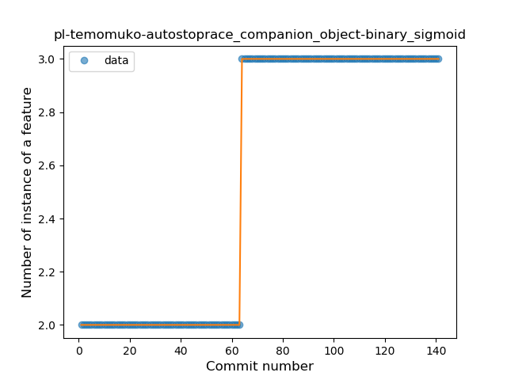

#### ru-hyst329-openfool
* Feature: Companion Object
* Function: 
* R_Squared: 1.0
 

#### sreich-countthedays
* Feature: Companion Object
* Function: 
* R_Squared: 1.0
 

#### xyz-koleno-sunwidget
* Feature: Companion Object
* Function: 
* R_Squared: 1.0
 

#### com-BibleQuote
* Feature: String Template
* Function: 
* R_Squared: 1.0
 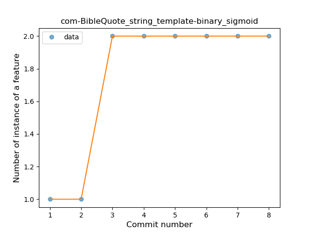

#### com-defianttech-convertme
* Feature: String Template
* Function: 
* R_Squared: 1.0
 

#### com-fake-android-torchlight
* Feature: String Template
* Function: 
* R_Squared: 1.0
 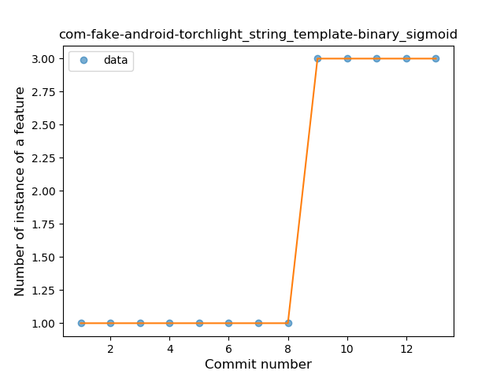

#### com-firstrowria-pushnotificationtester
* Feature: String Template
* Function: 
* R_Squared: 1.0
 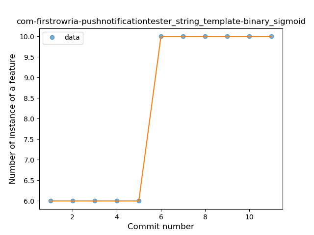

#### com-github-fields-electric
* Feature: String Template
* Function: 
* R_Squared: 1.0
 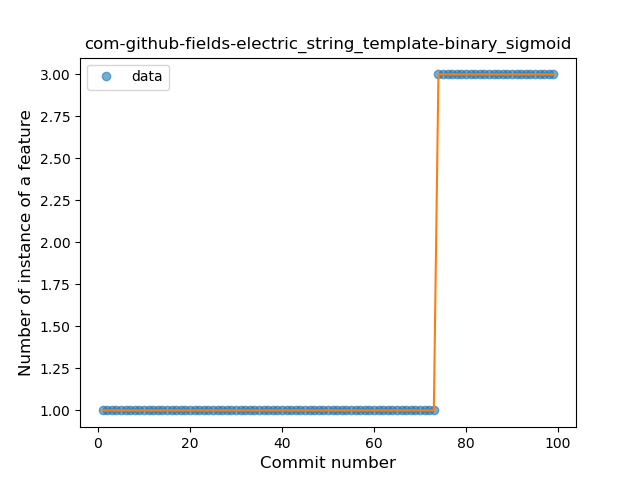

#### com-greenlionsoft-pollution-madrid
* Feature: String Template
* Function: 
* R_Squared: 1.0
 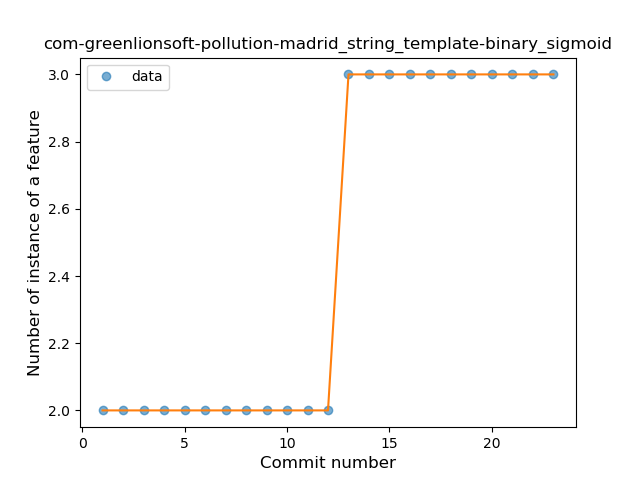

#### com-kanedias-vanilla-metadata
* Feature: String Template
* Function: 
* R_Squared: 1.0
 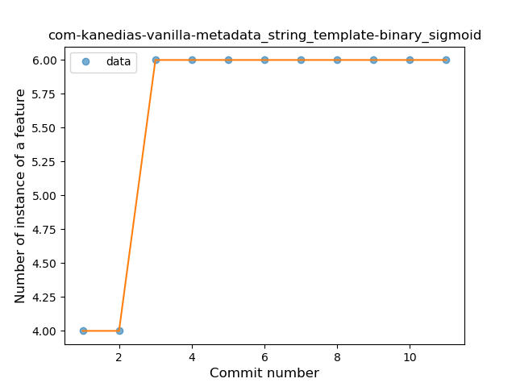

#### com-ninjahoahong-unstoppable
* Feature: String Template
* Function: 
* R_Squared: 1.0
 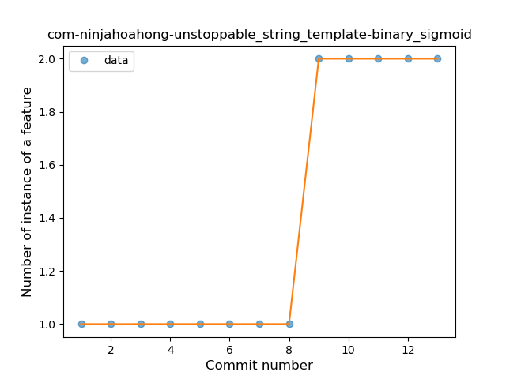

#### com-systemallica-valenbisi
* Feature: String Template
* Function: 
* R_Squared: 1.0
 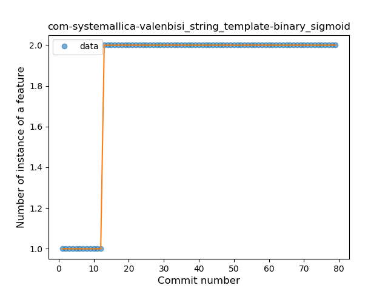

#### com-tumblr-svetylk0-sheepsgohome-android
* Feature: String Template
* Function: 
* R_Squared: 1.0
 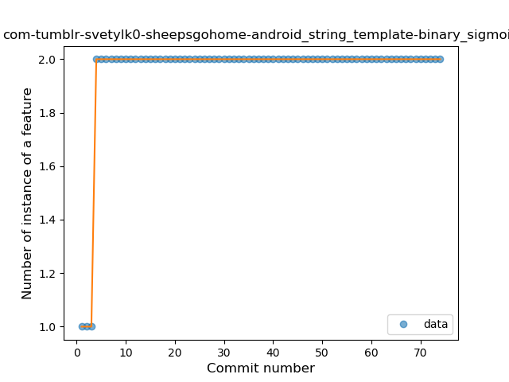

#### de-spiritcroc-darkcroc-substratum
* Feature: String Template
* Function: 
* R_Squared: 1.0
 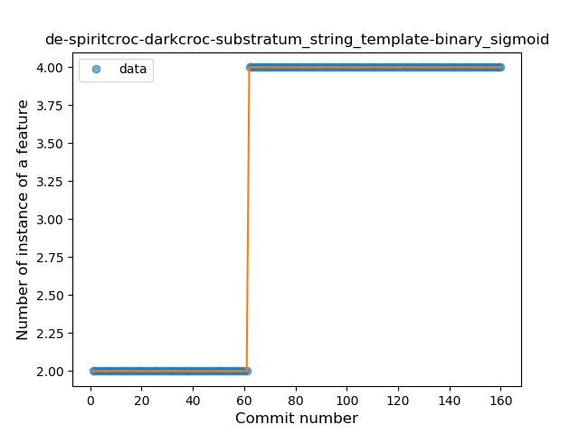

#### nl-jqno-remindermail
* Feature: String Template
* Function: 
* R_Squared: 1.0
 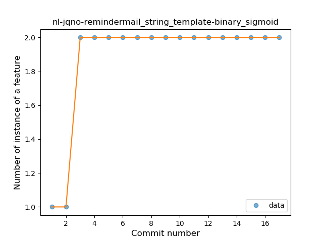

#### org-lenchan139-ncbookmark
* Feature: String Template
* Function: 
* R_Squared: 1.0
 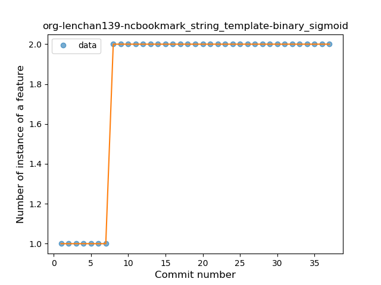

#### org-projectbass-bass
* Feature: String Template
* Function: 
* R_Squared: 1.0
 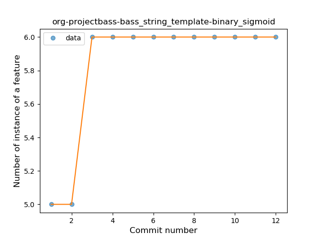

#### apps-jizzu-simpletodo
* Feature: Function with Default Value
* Function: 
* R_Squared: 1.0
 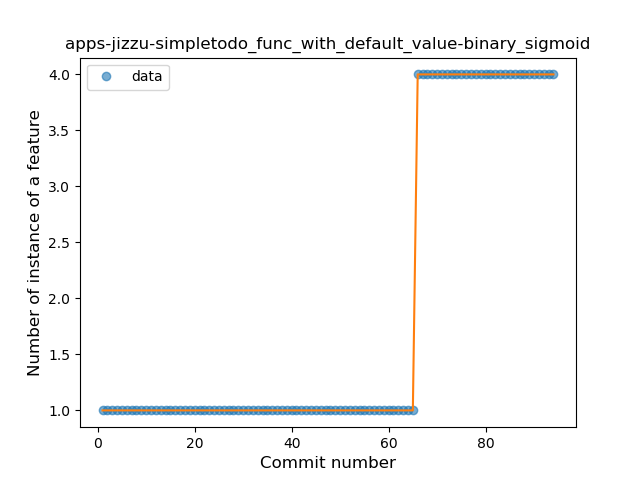

#### com-adityakamble49-dcipher
* Feature: Function with Default Value
* Function: 
* R_Squared: 1.0
 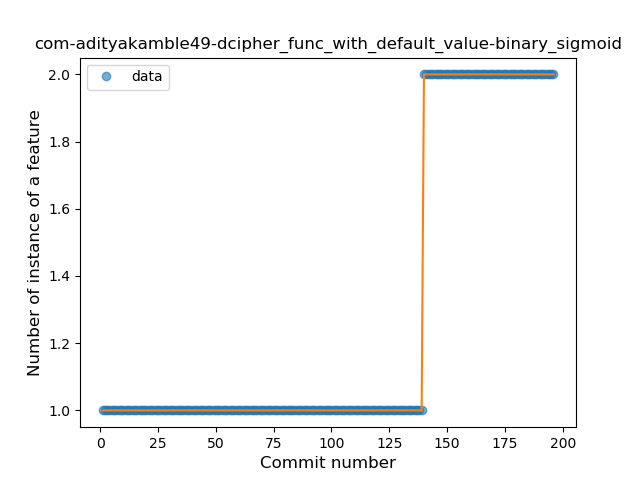

#### com-appspot-pistatium-mahougen
* Feature: Function with Default Value
* Function: 
* R_Squared: 1.0
 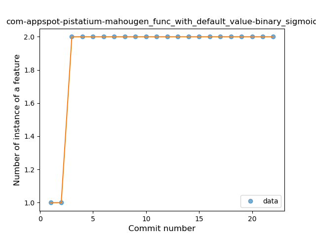

#### com-ofalvai-bpinfo
* Feature: Function with Default Value
* Function: 
* R_Squared: 1.0
 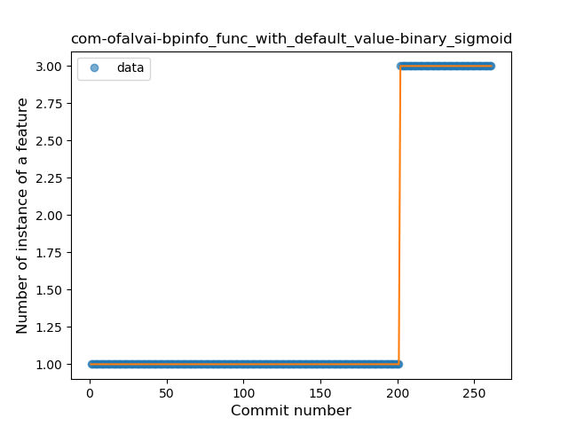

#### com-rohitsuratekar-NCBSinfo
* Feature: Function with Default Value
* Function: 
* R_Squared: 1.0
 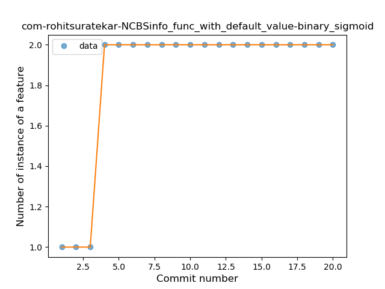

#### com-slash-batterychargelimit
* Feature: Function with Default Value
* Function: 
* R_Squared: 1.0
 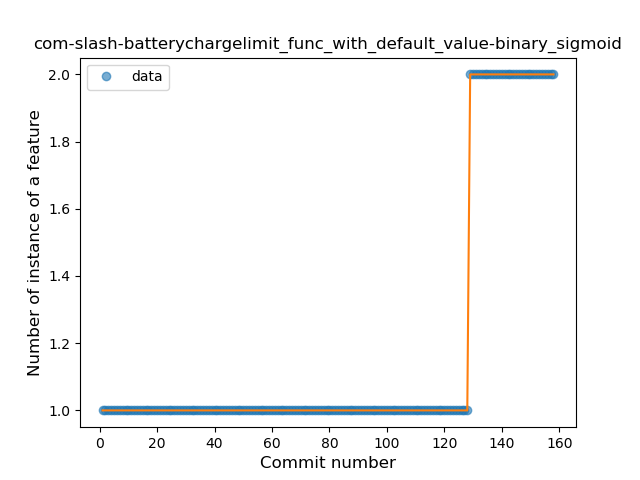

#### com-tumblr-svetylk0-sheepsgohome-android
* Feature: Function with Default Value
* Function: 
* R_Squared: 1.0
 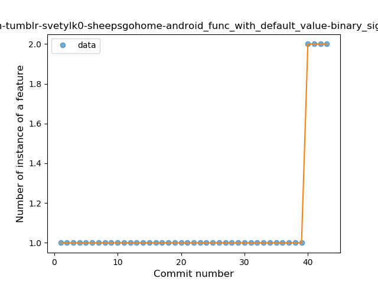

#### de-geeksfactory-opacclient
* Feature: Function with Default Value
* Function: 
* R_Squared: 1.0
 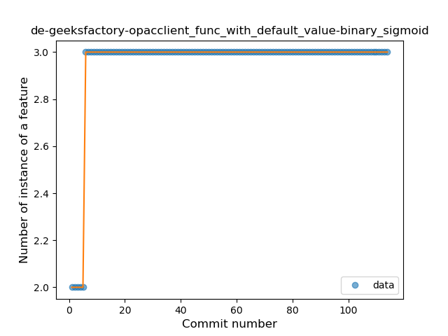

#### fi-tuska-jalkametri
* Feature: Function with Default Value
* Function: 
* R_Squared: 1.0
 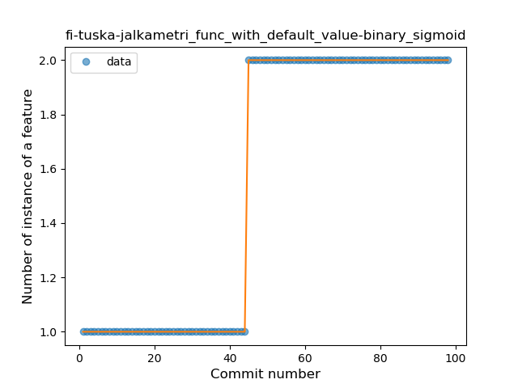

#### fr-corenting-edcompanion
* Feature: Function with Default Value
* Function: 
* R_Squared: 1.0
 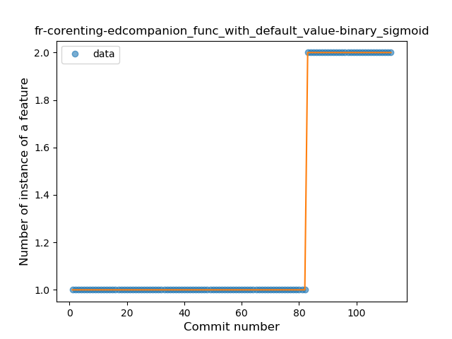

#### fr-insapp-insapp
* Feature: Function with Default Value
* Function: 
* R_Squared: 1.0
 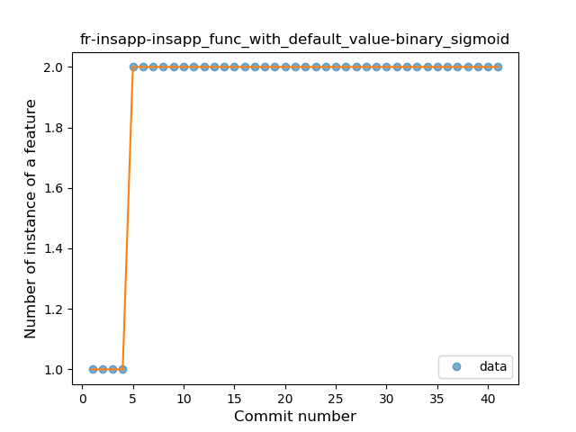

#### org-ligi-survivalmanual
* Feature: Function with Default Value
* Function: 
* R_Squared: 1.0
 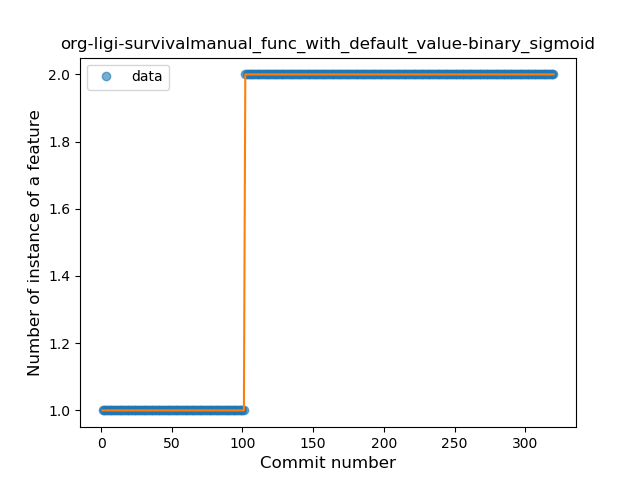

#### org-projectbass-bass
* Feature: Function with Default Value
* Function: 
* R_Squared: 1.0
 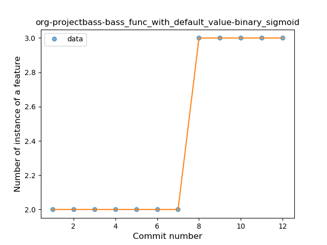

#### org-teamblueridge-pasteitapp
* Feature: Function with Default Value
* Function: 
* R_Squared: 1.0
 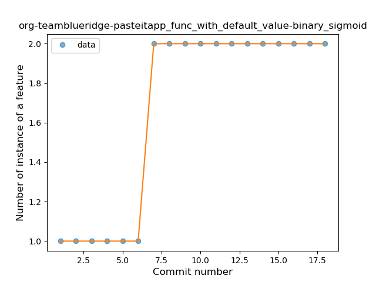

#### college-wyk-app
* Feature: Singleton
* Function: 
* R_Squared: 1.0
 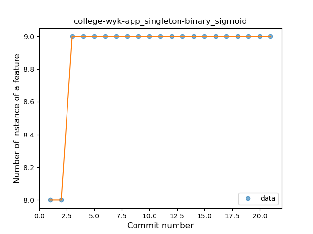

#### com-emmanuelmess-simplecleanup
* Feature: Singleton
* Function: 
* R_Squared: 1.0
 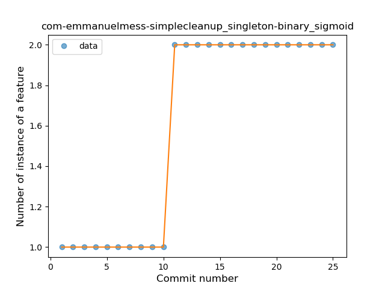

#### com-ianhanniballake-contractiontimer
* Feature: Singleton
* Function: 
* R_Squared: 1.0
 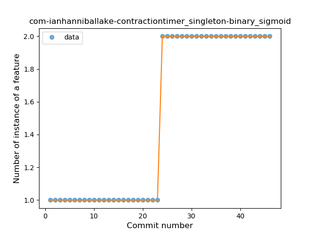

#### com-ogsdroid
* Feature: Singleton
* Function: 
* R_Squared: 1.0
 

#### com-pluscubed-velociraptor
* Feature: Singleton
* Function: 
* R_Squared: 1.0
 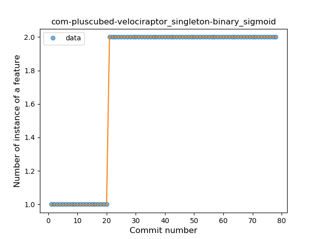

#### com-rohitsuratekar-NCBSinfo
* Feature: Singleton
* Function: 
* R_Squared: 1.0
 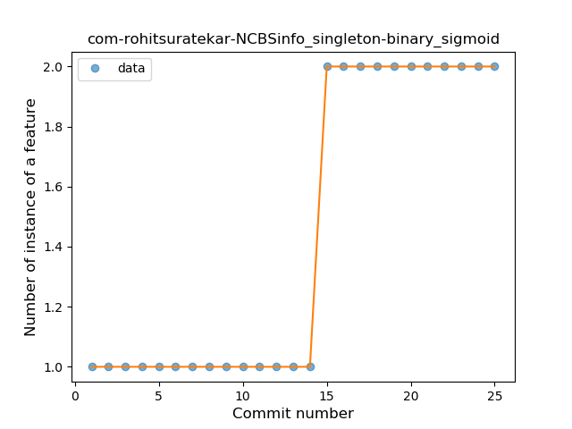

#### fr-insapp-insapp
* Feature: Singleton
* Function: 
* R_Squared: 1.0
 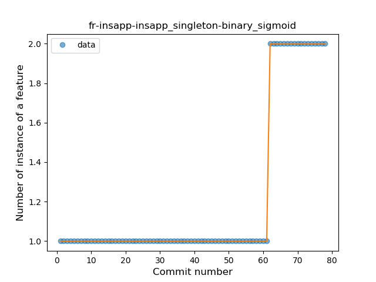

#### io-mkg20001-arubanetworkslogin
* Feature: Singleton
* Function: 
* R_Squared: 1.0
 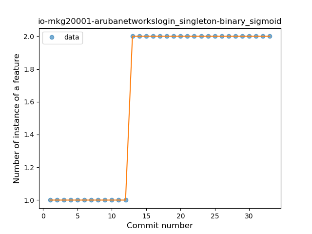

#### org-ligi-ipfsdroid
* Feature: Singleton
* Function: 
* R_Squared: 1.0
 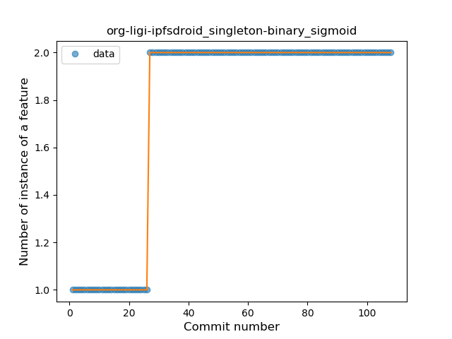

#### saschpe-poker
* Feature: Singleton
* Function: 
* R_Squared: 1.0
 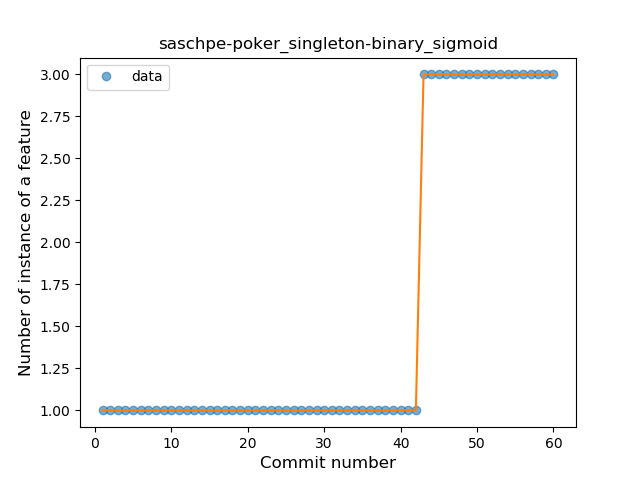

#### se-creotec-chscardbalance2
* Feature: Singleton
* Function: 
* R_Squared: 1.0
 

#### uk-co-richyhbm-monochromatic
* Feature: Singleton
* Function: 
* R_Squared: 1.0
 

#### app-opass-ccip
* Feature: Range Expression
* Function: 
* R_Squared: 1.0
 

#### ch-rmy-android-statusbar_tacho
* Feature: Range Expression
* Function: 
* R_Squared: 1.0
 

#### com-agusyc-daycounter
* Feature: Range Expression
* Function: 
* R_Squared: 1.0
 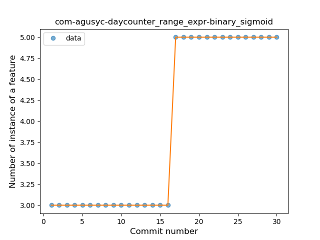

#### com-ahorcado
* Feature: Range Expression
* Function: 
* R_Squared: 1.0
 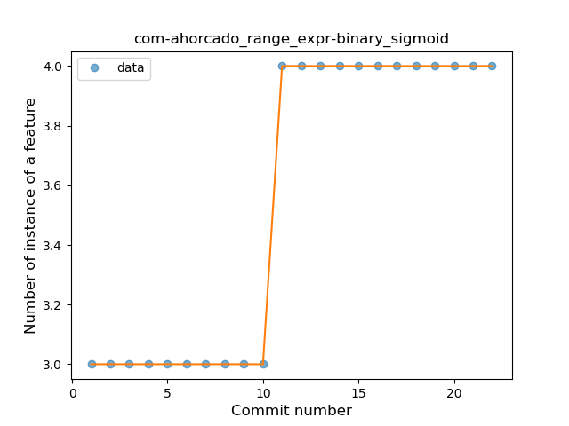

#### com-cookiegames-smartcookie
* Feature: Range Expression
* Function: 
* R_Squared: 1.0
 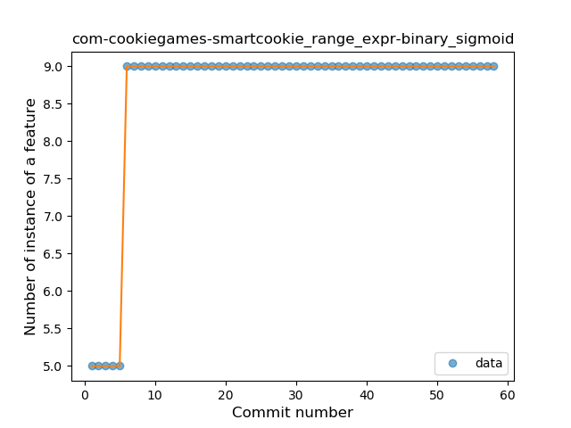

#### com-czbix-v2ex
* Feature: Range Expression
* Function: 
* R_Squared: 1.0
 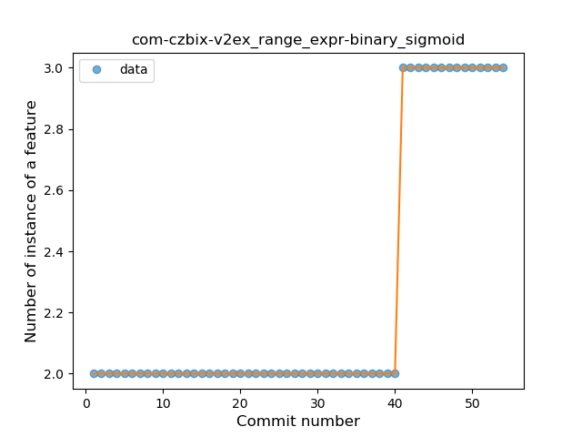

#### com-ianhanniballake-contractiontimer
* Feature: Range Expression
* Function: 
* R_Squared: 1.0
 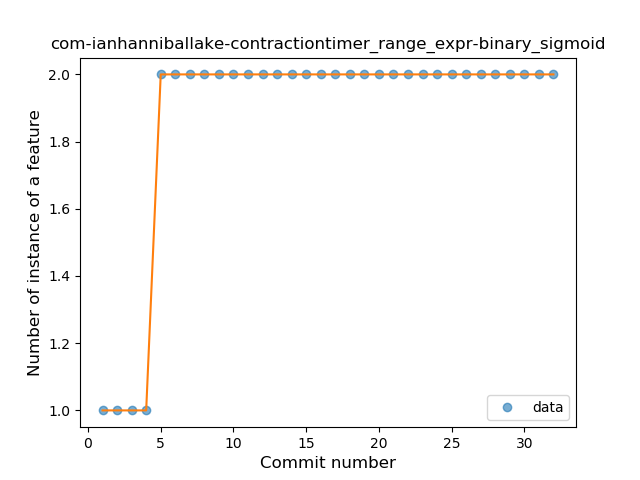

#### com-libopenmw-openmw
* Feature: Range Expression
* Function: 
* R_Squared: 1.0
 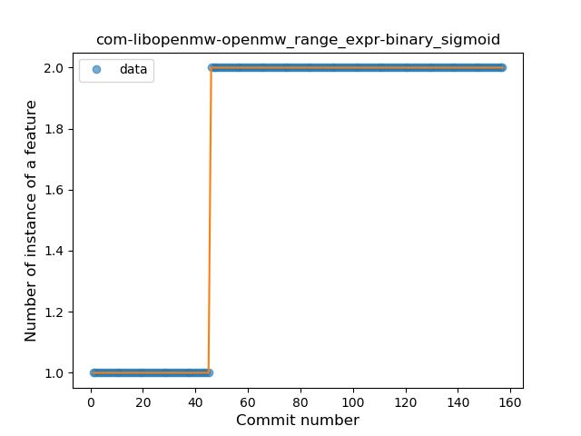

#### com-log28
* Feature: Range Expression
* Function: 
* R_Squared: 1.0
 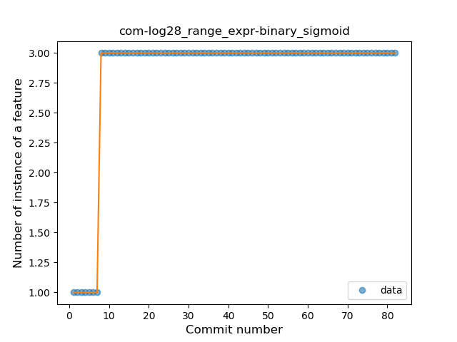

#### com-ruuvi-station
* Feature: Range Expression
* Function: 
* R_Squared: 1.0
 

#### com-simplemobiletools-calculator
* Feature: Range Expression
* Function: 
* R_Squared: 1.0
 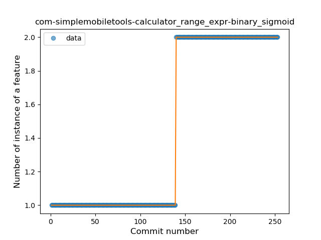

#### com-slash-batterychargelimit
* Feature: Range Expression
* Function: 
* R_Squared: 1.0
 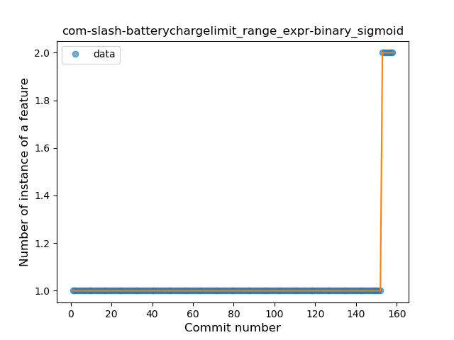

#### com-stevenschoen-putionew
* Feature: Range Expression
* Function: 
* R_Squared: 1.0
 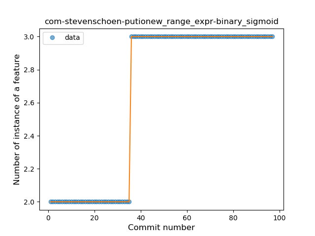

#### com-thanksmister-iot-mqtt-alarmpanel
* Feature: Range Expression
* Function: 
* R_Squared: 1.0
 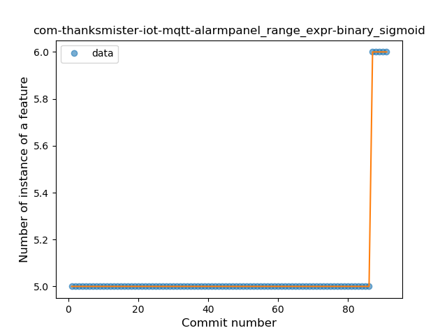

#### de-devmil-paperlaunch
* Feature: Range Expression
* Function: 
* R_Squared: 1.0
 

#### me-jfenn-alarmio
* Feature: Range Expression
* Function: 
* R_Squared: 1.0
 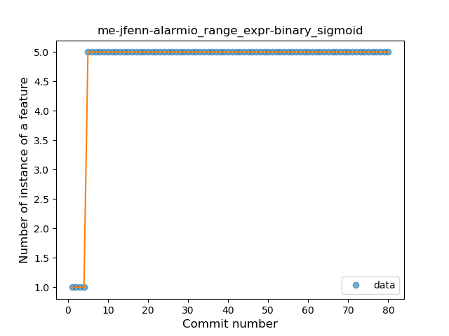

#### moe-feng-nhentai
* Feature: Range Expression
* Function: 
* R_Squared: 1.0
 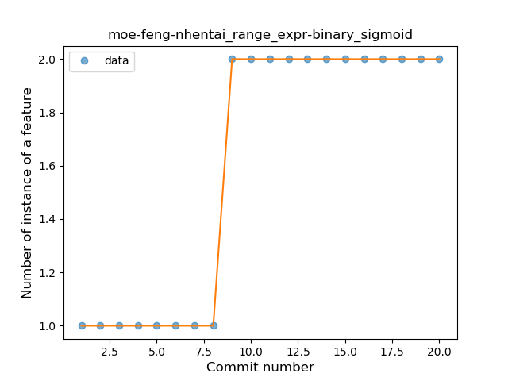

#### net-mm2d-android-vmb
* Feature: Range Expression
* Function: 
* R_Squared: 1.0
 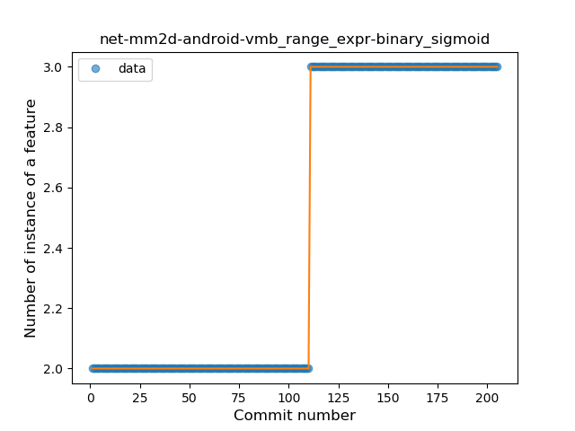

#### org-bottiger-podcast
* Feature: Range Expression
* Function: 
* R_Squared: 1.0
 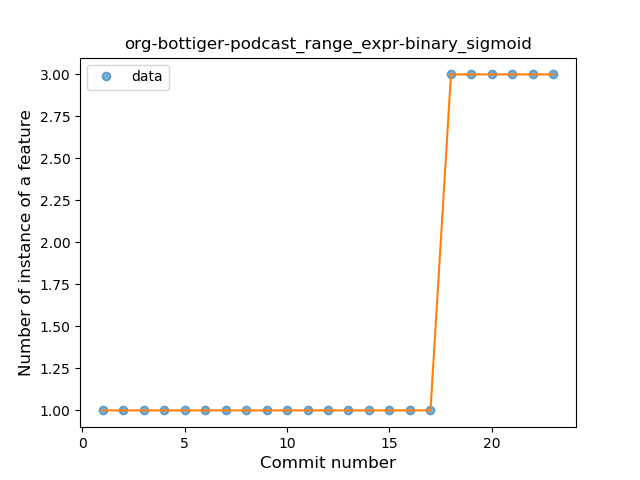

#### org-ligi-survivalmanual
* Feature: Range Expression
* Function: 
* R_Squared: 1.0
 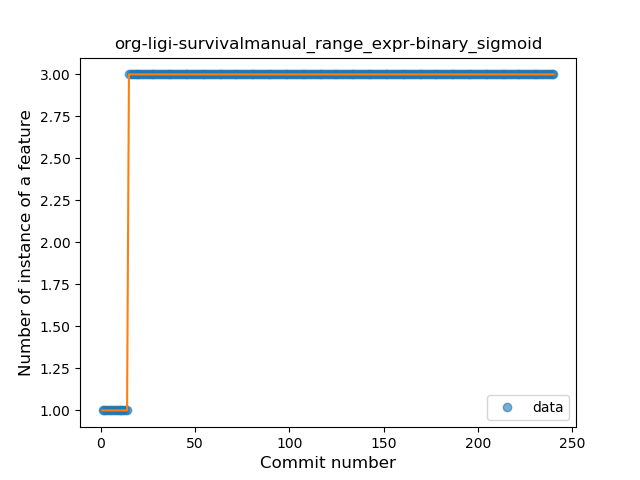

#### org-moire-ultrasonic
* Feature: Range Expression
* Function: 
* R_Squared: 1.0
 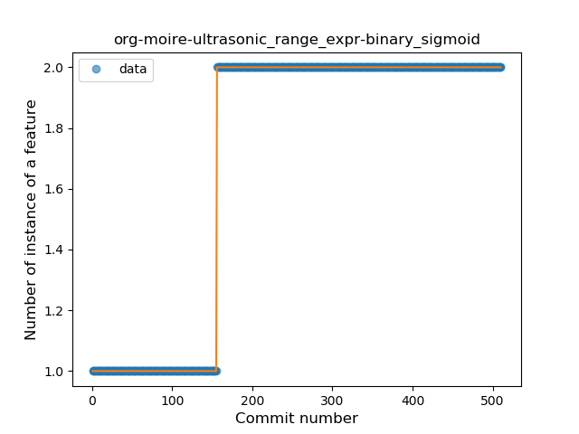

#### pt-ipleiria-mymusicqoe
* Feature: Range Expression
* Function: 
* R_Squared: 1.0
 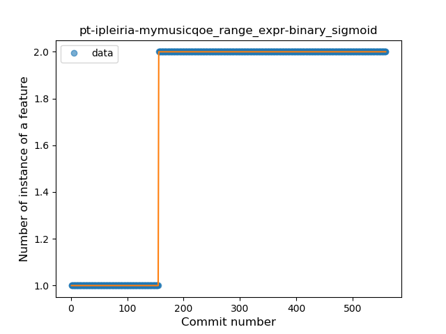

#### quickbeer-android
* Feature: Range Expression
* Function: 
* R_Squared: 1.0
 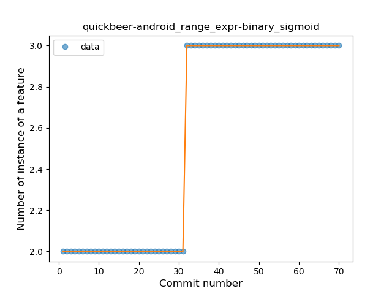

#### se-creotec-chscardbalance2
* Feature: Range Expression
* Function: 
* R_Squared: 1.0
 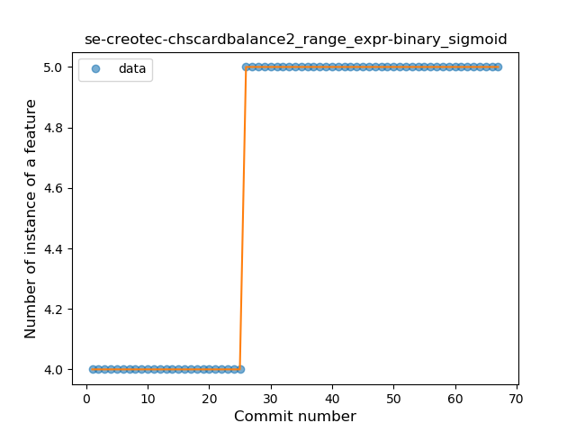

#### com-gimranov-zandy-app
* Feature: Smart Cast
* Function: 
* R_Squared: 1.0
 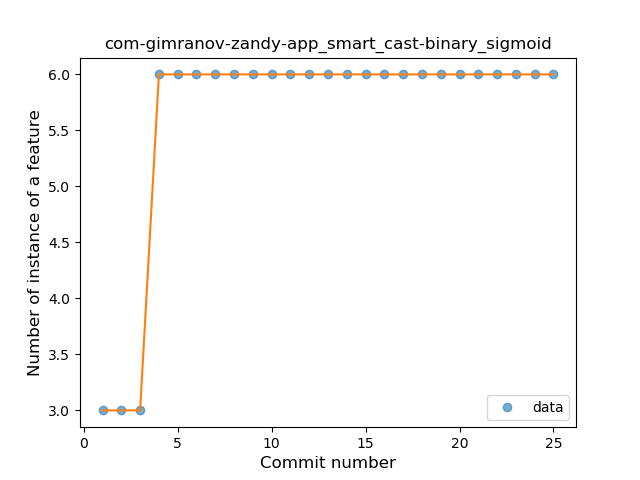

#### com-thanksmister-iot-mqtt-alarmpanel
* Feature: Smart Cast
* Function: 
* R_Squared: 1.0
 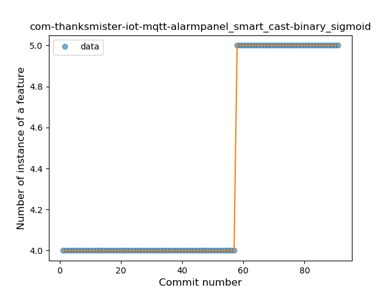

#### com-uwetrottmann-wpdisplay
* Feature: Smart Cast
* Function: 
* R_Squared: 1.0
 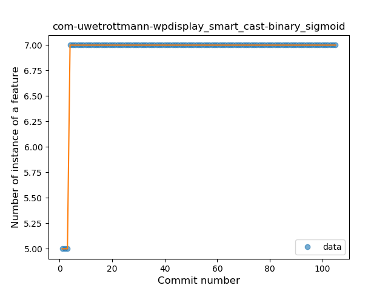

#### de-Maxr1998-xposed-maxlock
* Feature: Smart Cast
* Function: 
* R_Squared: 1.0
 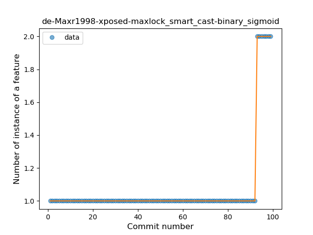

#### de-avpptr-umweltzone
* Feature: Smart Cast
* Function: 
* R_Squared: 1.0
 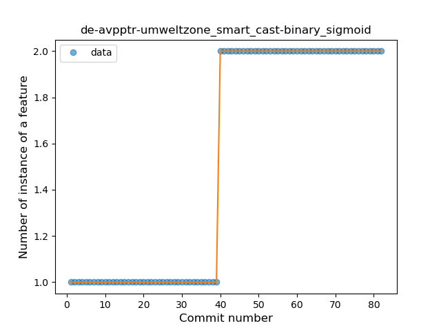

#### de-micmun-android-deufeitage
* Feature: Smart Cast
* Function: 
* R_Squared: 1.0
 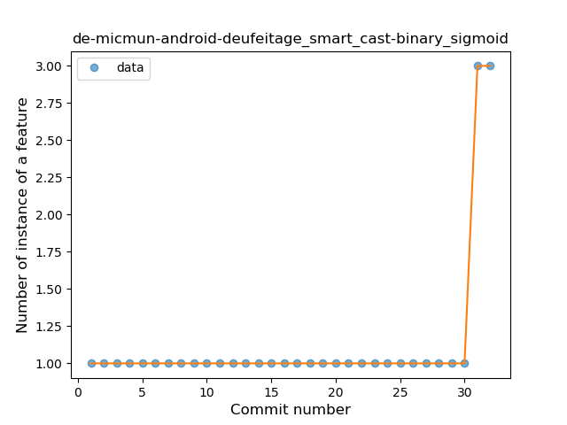

#### fr-openium-auvergnewebcams
* Feature: Smart Cast
* Function: 
* R_Squared: 1.0
 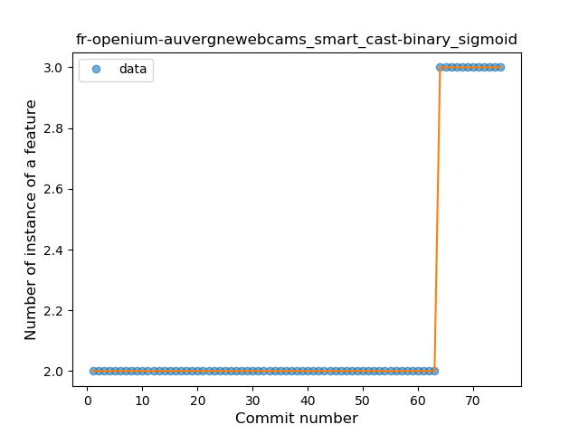

#### horse-amazin-my-stratum0-statuswidget
* Feature: Smart Cast
* Function: 
* R_Squared: 1.0
 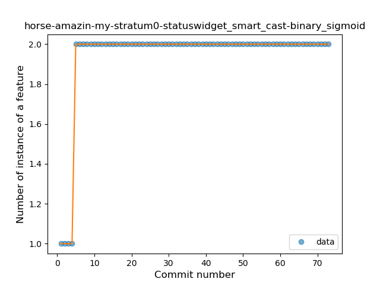

#### io-homeassistant-android
* Feature: Smart Cast
* Function: 
* R_Squared: 1.0
 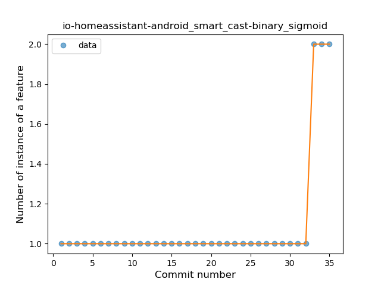

#### is-xyz-omw
* Feature: Smart Cast
* Function: 
* R_Squared: 1.0
 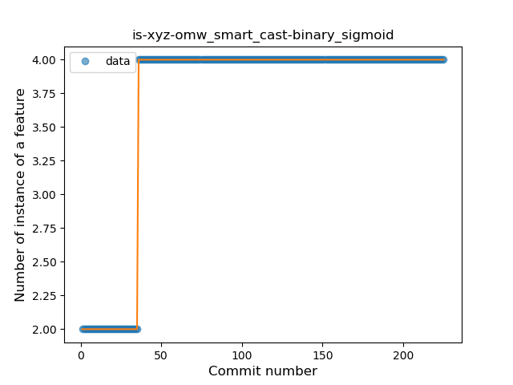

#### nl-renedegroot-android-adbawake
* Feature: Smart Cast
* Function: 
* R_Squared: 1.0
 

#### org-ligi-survivalmanual
* Feature: Smart Cast
* Function: 
* R_Squared: 1.0
 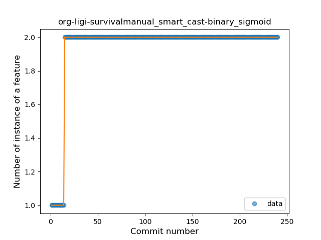

#### org-mosad-seil0-projectlaogai
* Feature: Smart Cast
* Function: 
* R_Squared: 1.0
 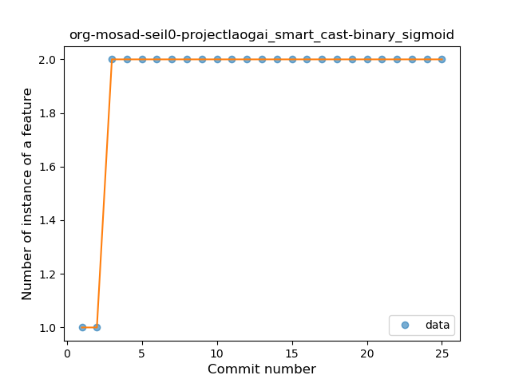

#### science-apolline
* Feature: Smart Cast
* Function: 
* R_Squared: 1.0
 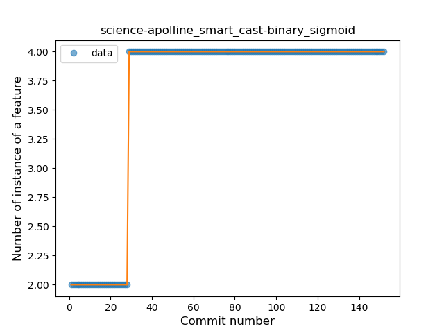

#### com-android-gpstest-osmdroid
* Feature: Data Class
* Function: 
* R_Squared: 1.0
 

#### com-corphish-nightlight-generic
* Feature: Data Class
* Function: 
* R_Squared: 1.0
 

#### com-emmanuelmess-simplecleanup
* Feature: Data Class
* Function: 
* R_Squared: 1.0
 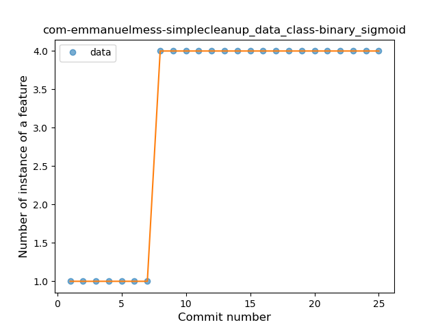

#### com-enjoyingfoss-om
* Feature: Data Class
* Function: 
* R_Squared: 1.0
 

#### com-github-cvzi-screenshottile
* Feature: Data Class
* Function: 
* R_Squared: 1.0
 

#### com-guardafilme
* Feature: Data Class
* Function: 
* R_Squared: 1.0
 

#### com-kanedias-vanilla-metadata
* Feature: Data Class
* Function: 
* R_Squared: 1.0
 

#### com-ofalvai-bpinfo
* Feature: Data Class
* Function: 
* R_Squared: 1.0
 

#### com-pluscubed-velociraptor
* Feature: Data Class
* Function: 
* R_Squared: 1.0
 

#### com-simplemobiletools-camera
* Feature: Data Class
* Function: 
* R_Squared: 1.0
 

#### com-simplemobiletools-gallery
* Feature: Data Class
* Function: 
* R_Squared: 1.0
 

#### com-simplemobiletools-musicplayer
* Feature: Data Class
* Function: 
* R_Squared: 1.0
 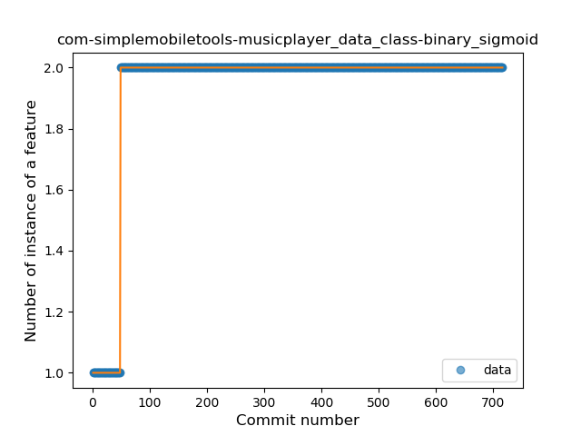

#### com-utazukin-ichaival
* Feature: Data Class
* Function: 
* R_Squared: 1.0
 

#### com-zacharee1-systemuituner
* Feature: Data Class
* Function: 
* R_Squared: 1.0
 

#### de-csicar-mensaplan
* Feature: Data Class
* Function: 
* R_Squared: 1.0
 

#### de-micmun-android-deufeitage
* Feature: Data Class
* Function: 
* R_Squared: 1.0
 

#### eu-depau-etchdroid
* Feature: Data Class
* Function: 
* R_Squared: 1.0
 

#### io-github-fvasco-pinpoi
* Feature: Data Class
* Function: 
* R_Squared: 1.0
 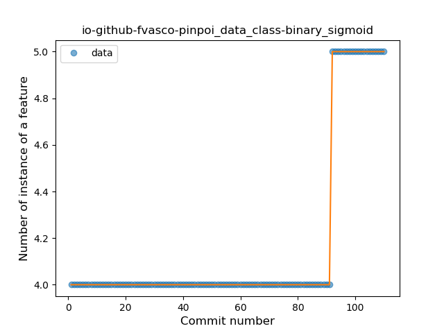

#### moe-feng-nhentai
* Feature: Data Class
* Function: 
* R_Squared: 1.0
 

#### nightlock-peppercarrot
* Feature: Data Class
* Function: 
* R_Squared: 1.0
 

#### org-freedombox-freedombox
* Feature: Data Class
* Function: 
* R_Squared: 1.0
 

#### org-ligi-gobandroid
* Feature: Data Class
* Function: 
* R_Squared: 1.0
 

#### org-ligi-survivalmanual
* Feature: Data Class
* Function: 
* R_Squared: 1.0
 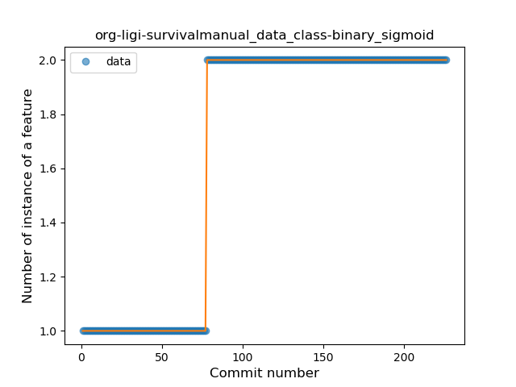

#### pl-org-seva-navigator
* Feature: Data Class
* Function: 
* R_Squared: 1.0
 

#### pw-janyo-janyoshare
* Feature: Data Class
* Function: 
* R_Squared: 1.0
 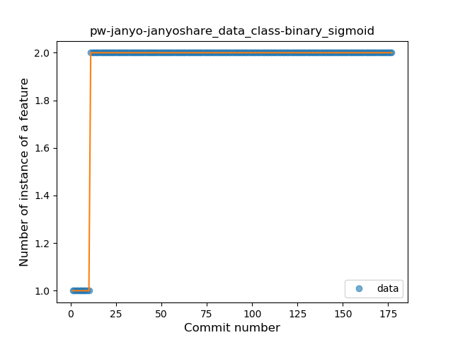

#### college-wyk-app
* Feature: Function call with Named Argument
* Function: 
* R_Squared: 1.0
 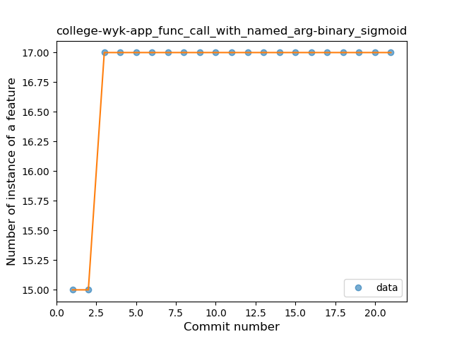

#### com-fallgamlet-dnestrcinema
* Feature: Function call with Named Argument
* Function: 
* R_Squared: 1.0
 

#### com-github-cvzi-screenshottile
* Feature: Function call with Named Argument
* Function: 
* R_Squared: 1.0
 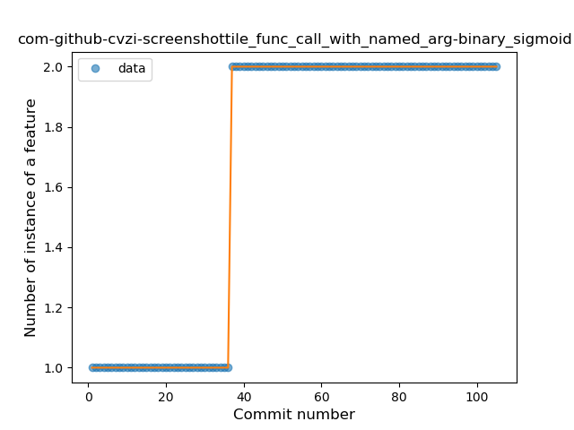

#### com-motion-stage1
* Feature: Function call with Named Argument
* Function: 
* R_Squared: 1.0
 

#### com-phicdy-totoanticipation
* Feature: Function call with Named Argument
* Function: 
* R_Squared: 1.0
 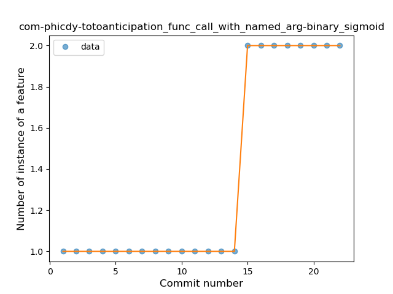

#### com-tumblr-svetylk0-sheepsgohome-android
* Feature: Function call with Named Argument
* Function: 
* R_Squared: 1.0
 

#### com-tutpro-baresip
* Feature: Function call with Named Argument
* Function: 
* R_Squared: 1.0
 

#### de-markusfisch-android-binaryeye
* Feature: Function call with Named Argument
* Function: 
* R_Squared: 1.0
 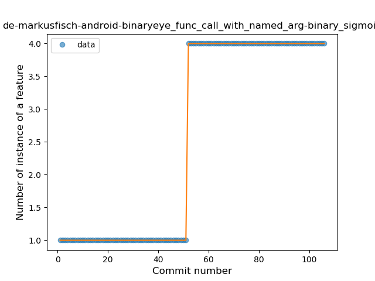

#### de-spiritcroc-darkcroc-substratum
* Feature: Function call with Named Argument
* Function: 
* R_Squared: 1.0
 

#### eu-depau-etchdroid
* Feature: Function call with Named Argument
* Function: 
* R_Squared: 1.0
 

#### is-xyz-mpv
* Feature: Function call with Named Argument
* Function: 
* R_Squared: 1.0
 

#### org-ligi-ipfsdroid
* Feature: Function call with Named Argument
* Function: 
* R_Squared: 1.0
 

#### app-opass-ccip
* Feature: Extension Function
* Function: 
* R_Squared: 1.0
 

#### com-atanana-sicounter
* Feature: Extension Function
* Function: 
* R_Squared: 1.0
 

#### com-fallgamlet-dnestrcinema
* Feature: Extension Function
* Function: 
* R_Squared: 1.0
 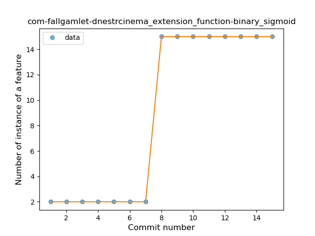

#### com-ianhanniballake-contractiontimer
* Feature: Extension Function
* Function: 
* R_Squared: 1.0
 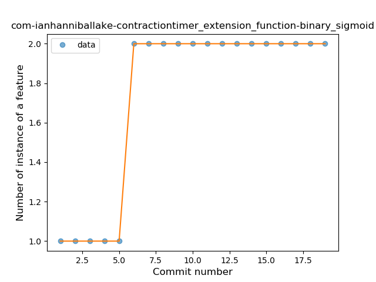

#### com-rohitsuratekar-NCBSinfo
* Feature: Extension Function
* Function: 
* R_Squared: 1.0
 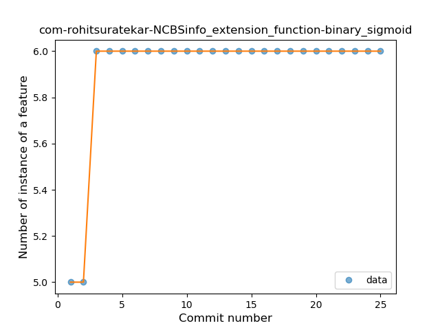

#### com-simplemobiletools-flashlight
* Feature: Extension Function
* Function: 
* R_Squared: 1.0
 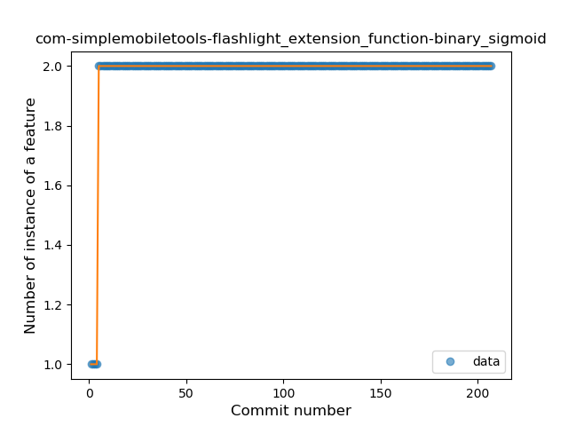

#### com-tomer-draw
* Feature: Extension Function
* Function: 
* R_Squared: 1.0
 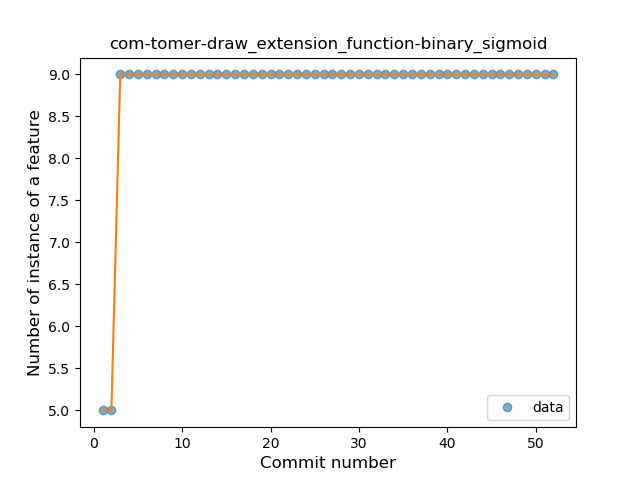

#### com-wbrawner-simplemarkdown
* Feature: Extension Function
* Function: 
* R_Squared: 1.0
 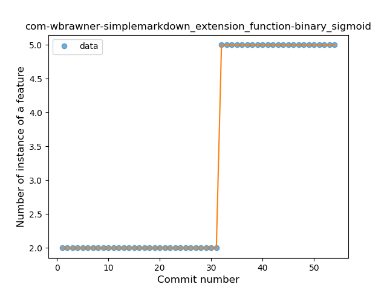

#### fr-insapp-insapp
* Feature: Extension Function
* Function: 
* R_Squared: 1.0
 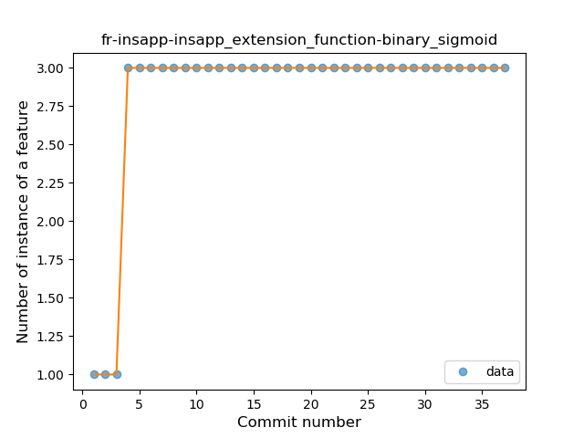

#### net-mm2d-android-vmb
* Feature: Extension Function
* Function: 
* R_Squared: 1.0
 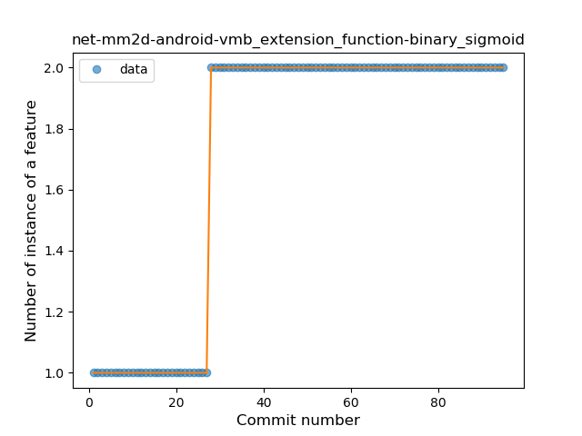

#### org-blitzortung-android-app
* Feature: Extension Function
* Function: 
* R_Squared: 1.0
 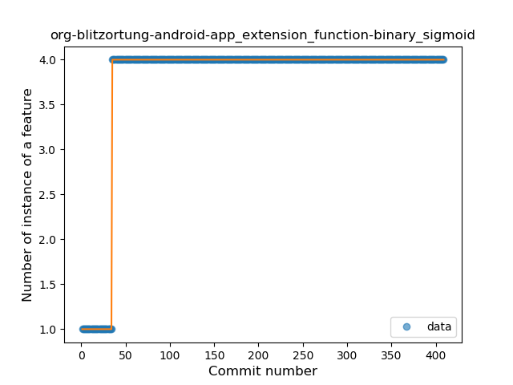

#### pt-joaomneto-titancompanion
* Feature: Extension Function
* Function: 
* R_Squared: 1.0
 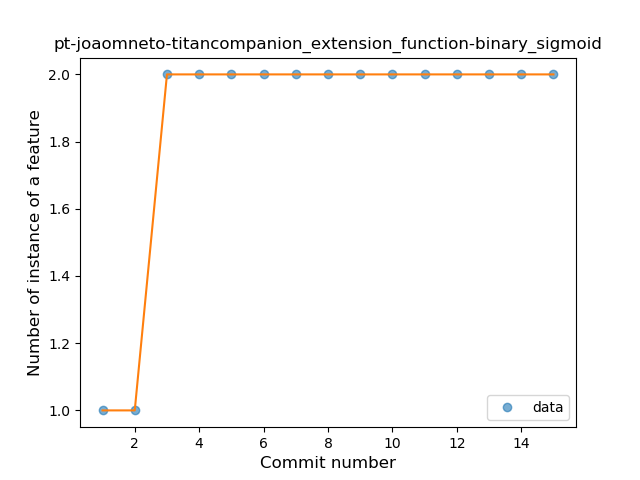

#### se-barsk-park
* Feature: Extension Function
* Function: 
* R_Squared: 1.0
 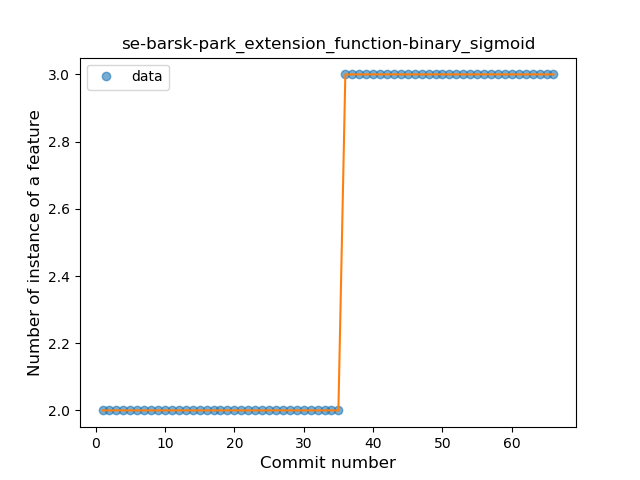

#### com-aaplab-bakubus
* Feature: Property Delegation
* Function: 
* R_Squared: 1.0
 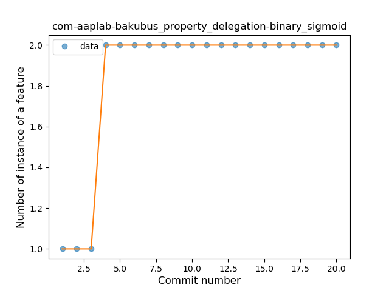

#### com-fallgamlet-dnestrcinema
* Feature: Property Delegation
* Function: 
* R_Squared: 1.0
 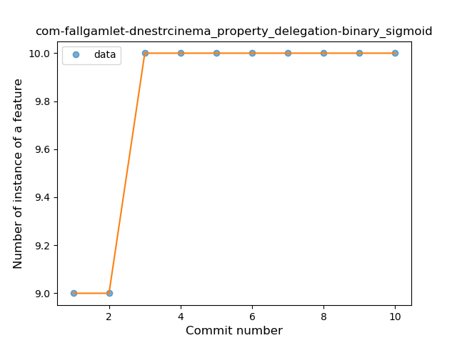

#### com-github-moko256-twitlatte
* Feature: Property Delegation
* Function: 
* R_Squared: 1.0
 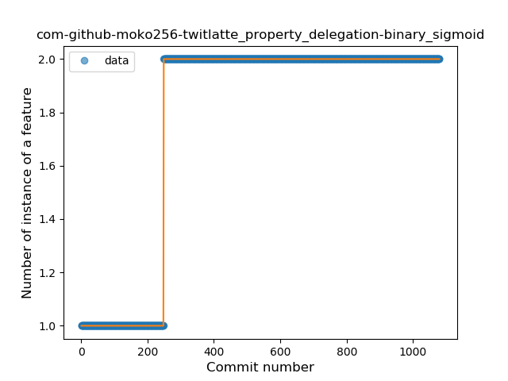

#### com-phicdy-totoanticipation
* Feature: Property Delegation
* Function: 
* R_Squared: 1.0
 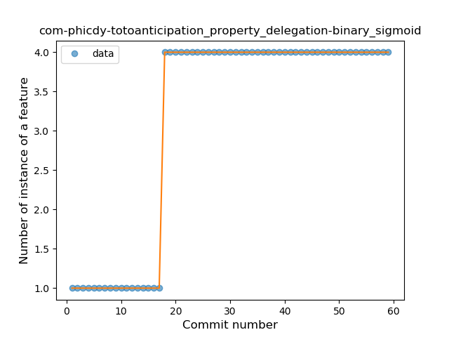

#### de-avpptr-umweltzone
* Feature: Property Delegation
* Function: 
* R_Squared: 1.0
 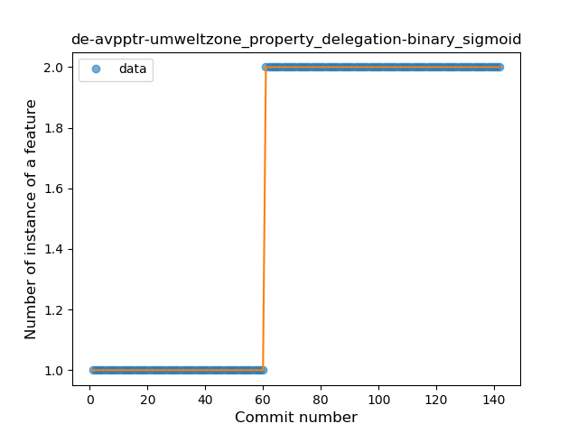

#### eu-the4thfloor-msync
* Feature: Property Delegation
* Function: 
* R_Squared: 1.0
 

#### info-metadude-android-congress-schedule
* Feature: Property Delegation
* Function: 
* R_Squared: 1.0
 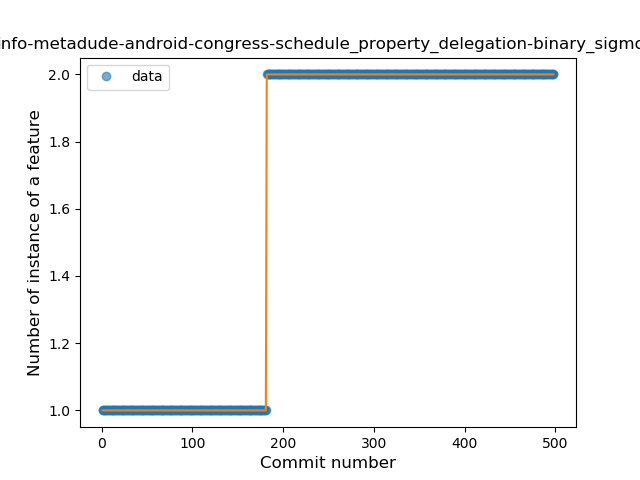

#### me-blog-korn123-easydiary
* Feature: Property Delegation
* Function: 
* R_Squared: 1.0
 

#### nl-jqno-remindermail
* Feature: Property Delegation
* Function: 
* R_Squared: 1.0
 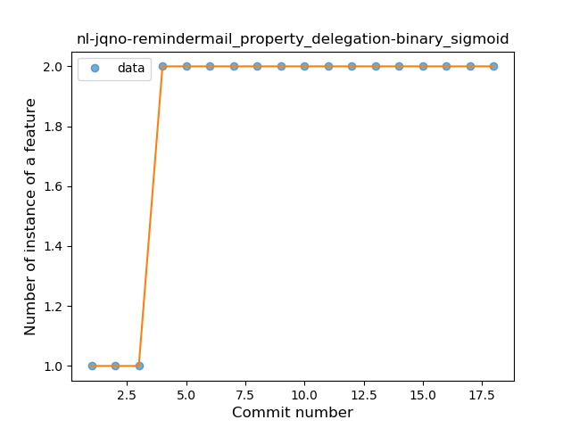

#### org-blitzortung-android-app
* Feature: Property Delegation
* Function: 
* R_Squared: 1.0
 

#### org-ligi-materialteatimer
* Feature: Property Delegation
* Function: 
* R_Squared: 1.0
 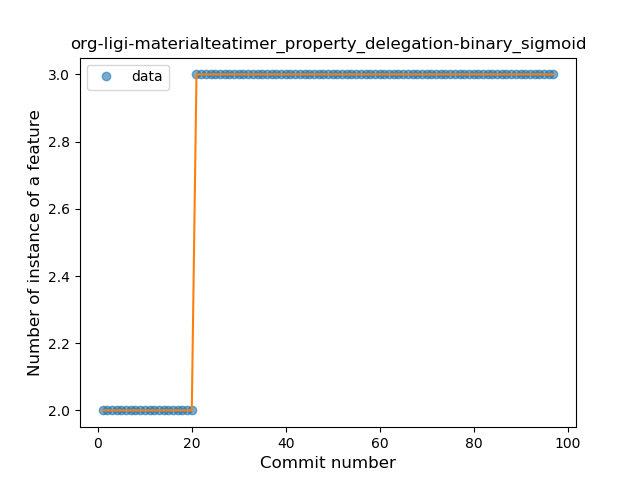

#### ch-abertschi-adfree
* Feature: Destructuring Declaration
* Function: 
* R_Squared: 1.0
 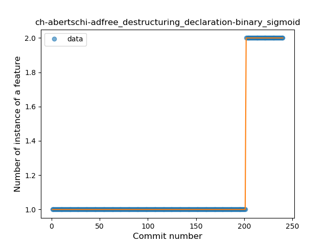

#### co-timecrypt-android
* Feature: Destructuring Declaration
* Function: 
* R_Squared: 1.0
 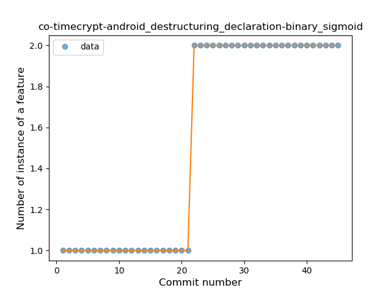

#### com-cookiegames-smartcookie
* Feature: Destructuring Declaration
* Function: 
* R_Squared: 1.0
 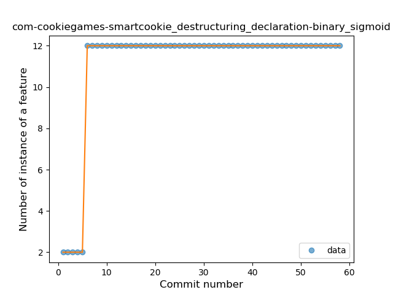

#### com-esafirm-androidplayground
* Feature: Destructuring Declaration
* Function: 
* R_Squared: 1.0
 

#### com-etesync-syncadapter
* Feature: Destructuring Declaration
* Function: 
* R_Squared: 1.0
 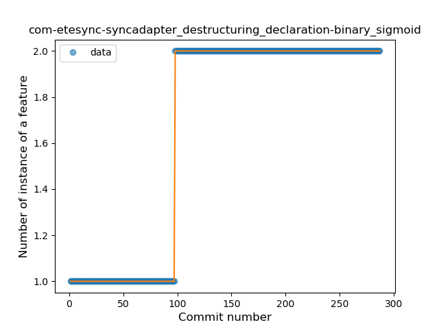

#### com-ids1024-whitakerswords
* Feature: Destructuring Declaration
* Function: 
* R_Squared: 1.0
 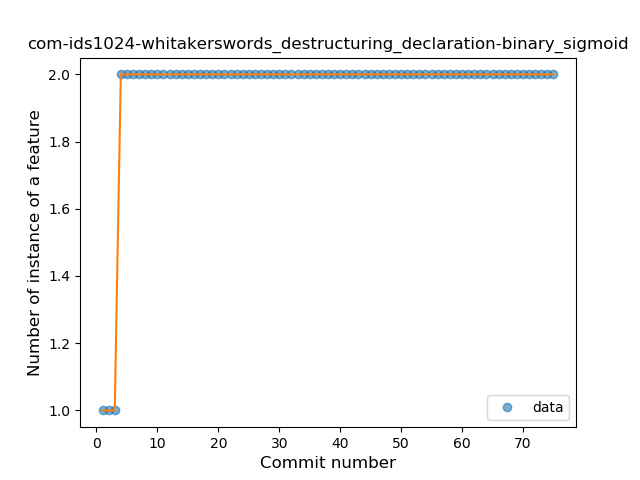

#### com-simplemobiletools-draw
* Feature: Destructuring Declaration
* Function: 
* R_Squared: 1.0
 

#### com-simplemobiletools-draw-pro
* Feature: Destructuring Declaration
* Function: 
* R_Squared: 1.0
 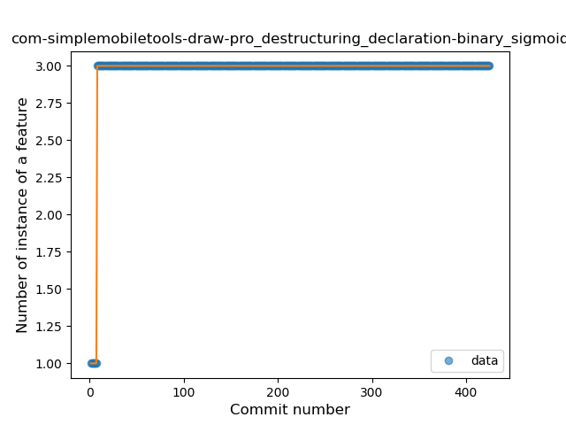

#### com-tasomaniac-openwith-floss
* Feature: Destructuring Declaration
* Function: 
* R_Squared: 1.0
 

#### eu-depau-etchdroid
* Feature: Destructuring Declaration
* Function: 
* R_Squared: 1.0
 

#### fr-insapp-insapp
* Feature: Destructuring Declaration
* Function: 
* R_Squared: 1.0
 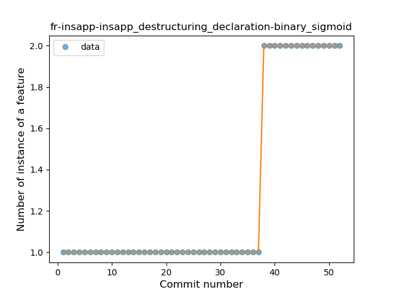

#### io-github-fvasco-pinpoi
* Feature: Destructuring Declaration
* Function: 
* R_Squared: 1.0
 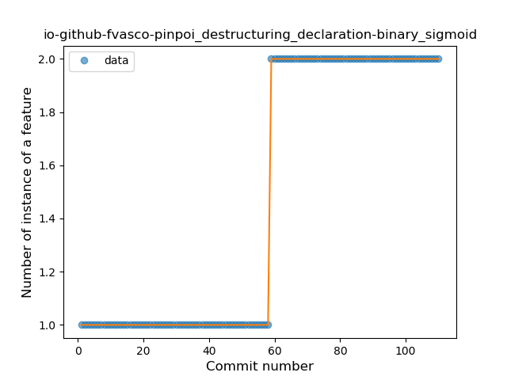

#### me-anon-grow
* Feature: Destructuring Declaration
* Function: 
* R_Squared: 1.0
 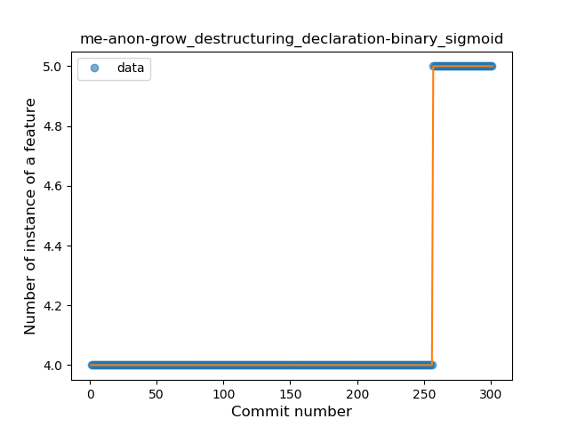

#### org-ligi-passandroid
* Feature: Destructuring Declaration
* Function: 
* R_Squared: 1.0
 

#### quickbeer-android
* Feature: Destructuring Declaration
* Function: 
* R_Squared: 1.0
 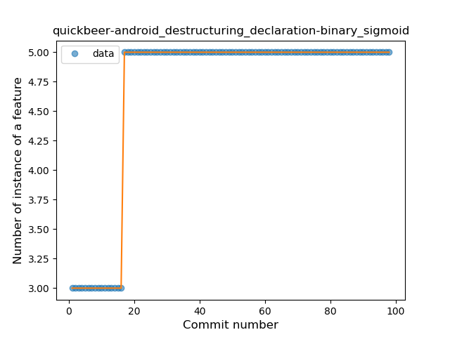

#### com-breadwallet
* Feature: Inline Function
* Function: 
* R_Squared: 1.0
 

#### com-github-premnirmal-tickerwidget
* Feature: Inline Function
* Function: 
* R_Squared: 1.0
 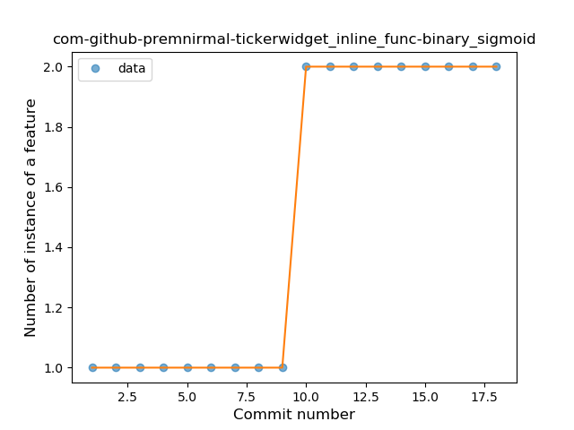

#### com-guardafilme
* Feature: Inline Function
* Function: 
* R_Squared: 1.0
 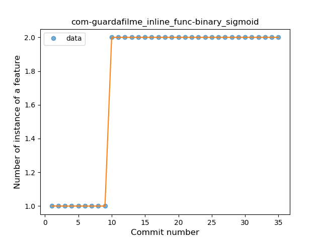

#### com-lavadip-miniVector
* Feature: Inline Function
* Function: 
* R_Squared: 1.0
 

#### com-sjn-stamp
* Feature: Inline Function
* Function: 
* R_Squared: 1.0
 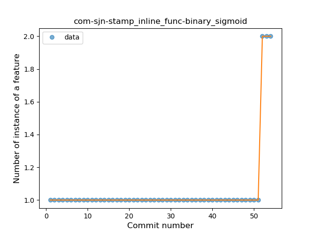

#### im-vector-alpha
* Feature: Inline Function
* Function: 
* R_Squared: 1.0
 

#### info-papdt-express-helper
* Feature: Inline Function
* Function: 
* R_Squared: 1.0
 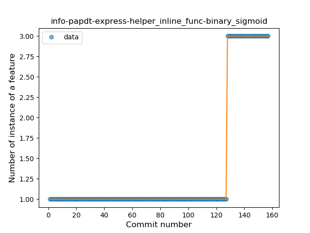

#### it-diab
* Feature: Inline Function
* Function: 
* R_Squared: 1.0
 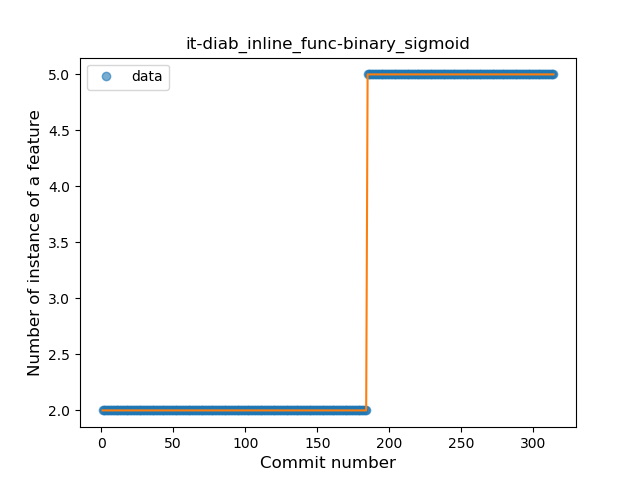

#### me-camsteffen-polite
* Feature: Inline Function
* Function: 
* R_Squared: 1.0
 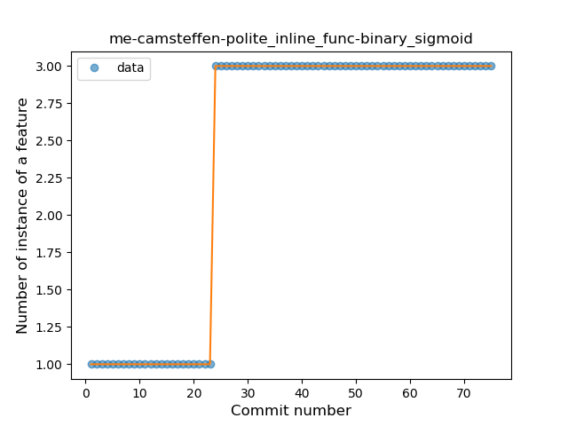

#### moe-feng-nhentai
* Feature: Inline Function
* Function: 
* R_Squared: 1.0
 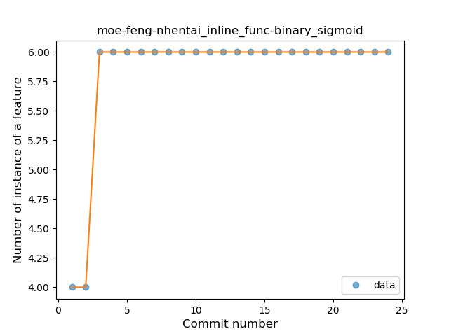

#### net-syncthing-lite
* Feature: Inline Function
* Function: 
* R_Squared: 1.0
 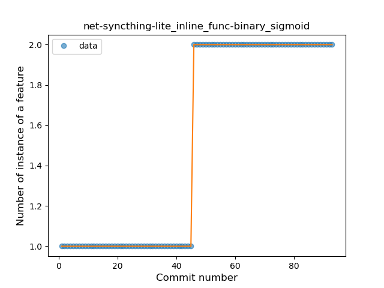

#### nl-mpcjanssen-simpletask
* Feature: Inline Function
* Function: 
* R_Squared: 1.0
 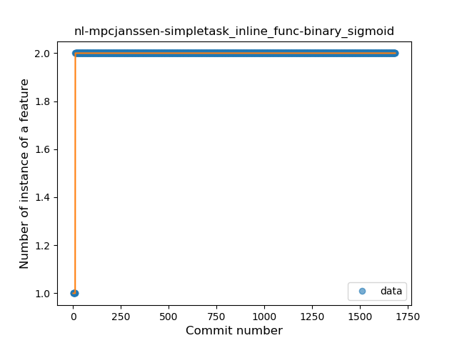

#### org-blitzortung-android-app
* Feature: Inline Function
* Function: 
* R_Squared: 1.0
 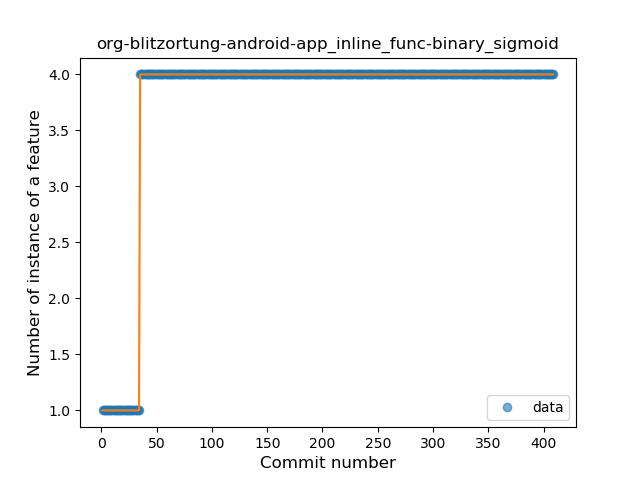

#### be-mygod-vpnhotspot
* Feature: Overloaded Operator
* Function: 
* R_Squared: 1.0
 

#### com-bernaferrari-changedetection
* Feature: Overloaded Operator
* Function: 
* R_Squared: 1.0
 

#### com-lavadip-miniVector
* Feature: Overloaded Operator
* Function: 
* R_Squared: 1.0
 

#### com-nononsenseapps-feeder
* Feature: Overloaded Operator
* Function: 
* R_Squared: 1.0
 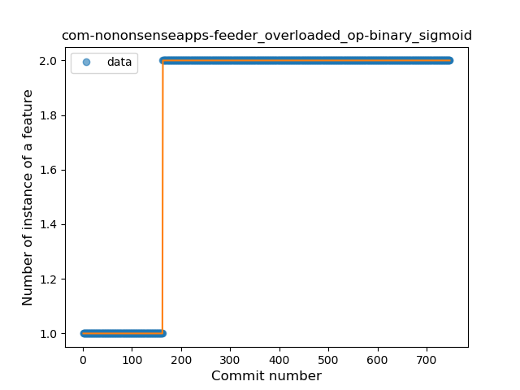

#### com-orgzly
* Feature: Overloaded Operator
* Function: 
* R_Squared: 1.0
 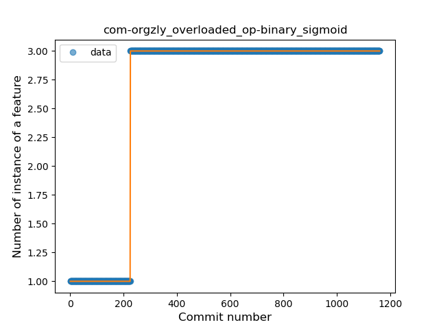

#### im-vector-alpha
* Feature: Overloaded Operator
* Function: 
* R_Squared: 1.0
 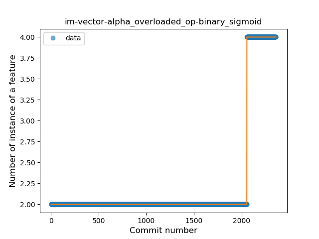

#### info-papdt-express-helper
* Feature: Overloaded Operator
* Function: 
* R_Squared: 1.0
 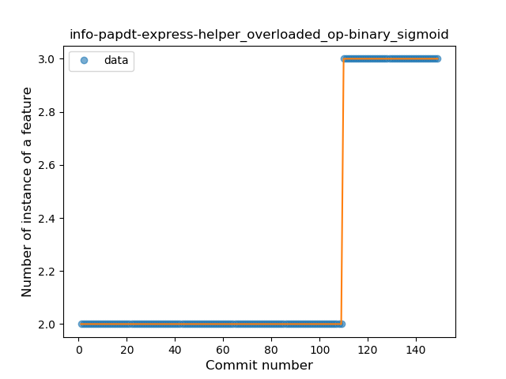

#### moe-feng-nhentai
* Feature: Overloaded Operator
* Function: 
* R_Squared: 1.0
 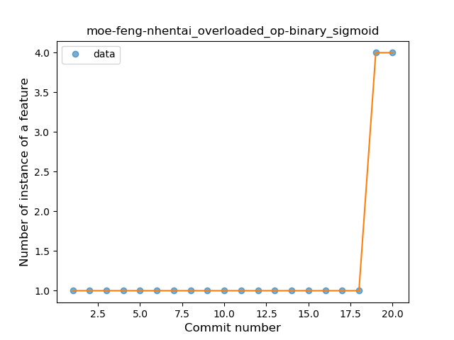

#### net-bible-android-activity
* Feature: Overloaded Operator
* Function: 
* R_Squared: 1.0
 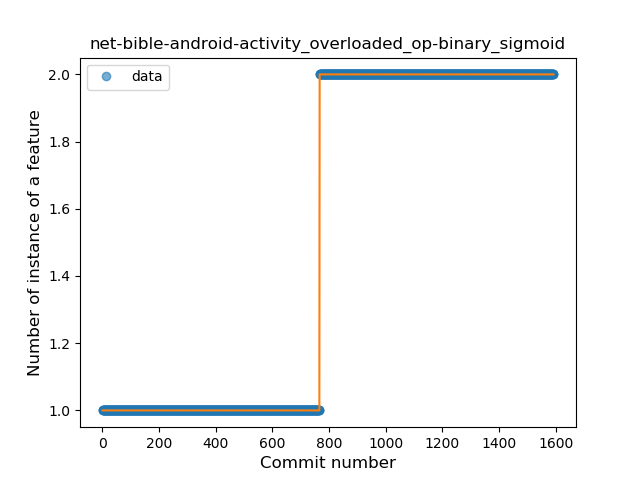

#### org-moire-ultrasonic
* Feature: Overloaded Operator
* Function: 
* R_Squared: 1.0
 

#### pl-org-seva-navigator
* Feature: Overloaded Operator
* Function: 
* R_Squared: 1.0
 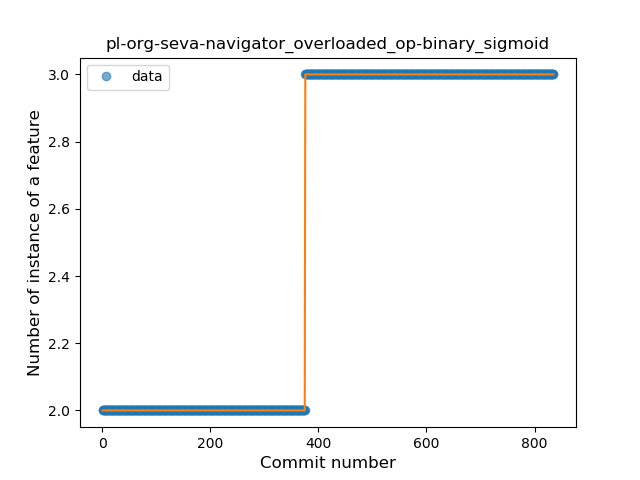

#### pt-ipleiria-mymusicqoe
* Feature: Overloaded Operator
* Function: 
* R_Squared: 1.0
 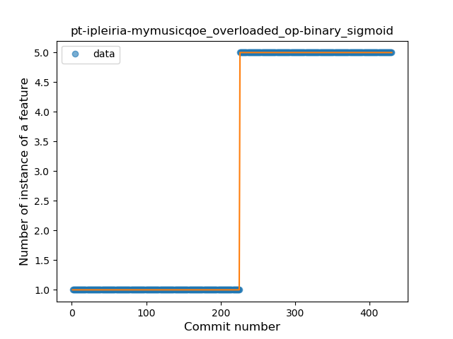

#### tech-ula
* Feature: Overloaded Operator
* Function: 
* R_Squared: 1.0
 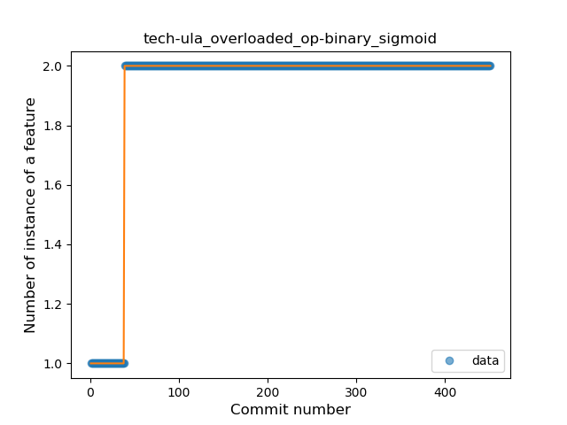

#### com-czbix-v2ex
* Feature: Coroutine
* Function: 
* R_Squared: 1.0
 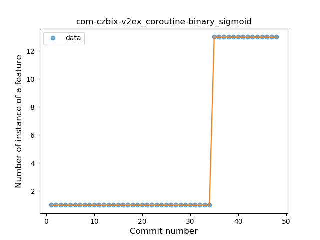

#### com-dozingcatsoftware-vectorcamera
* Feature: Coroutine
* Function: 
* R_Squared: 1.0
 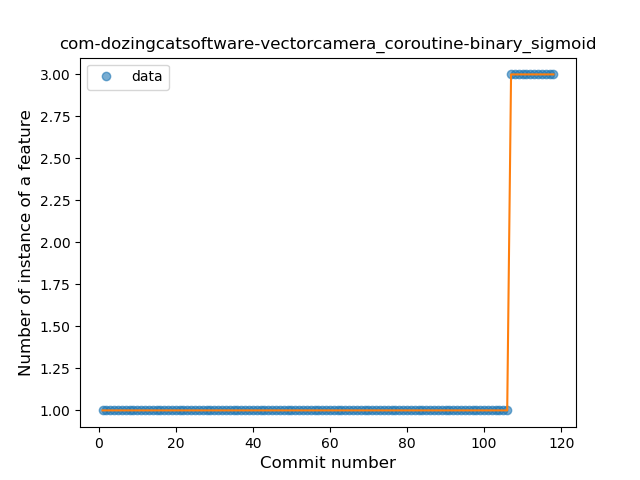

#### com-github-premnirmal-tickerwidget
* Feature: Coroutine
* Function: 
* R_Squared: 1.0
 

#### com-moez-QKSMS
* Feature: Coroutine
* Function: 
* R_Squared: 1.0
 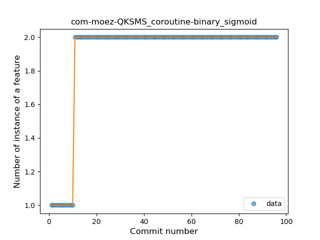

#### org-emunix-insteadlauncher
* Feature: Coroutine
* Function: 
* R_Squared: 1.0
 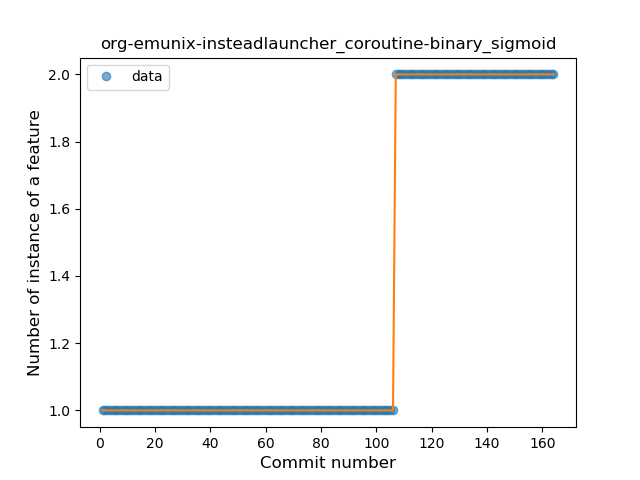

#### app-opass-ccip
* Feature: Sealed Class
* Function: 
* R_Squared: 1.0
 

#### com-bracketcove-postrainer
* Feature: Sealed Class
* Function: 
* R_Squared: 1.0
 

#### com-cookiegames-smartcookie
* Feature: Sealed Class
* Function: 
* R_Squared: 1.0
 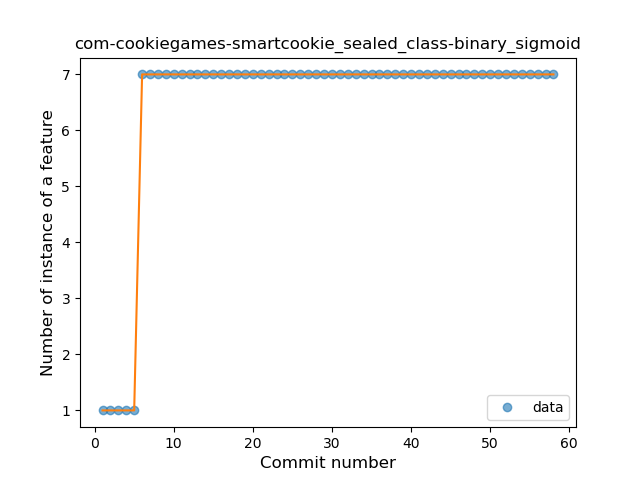

#### com-github-premnirmal-tickerwidget
* Feature: Sealed Class
* Function: 
* R_Squared: 1.0
 

#### com-keylesspalace-tusky
* Feature: Sealed Class
* Function: 
* R_Squared: 1.0
 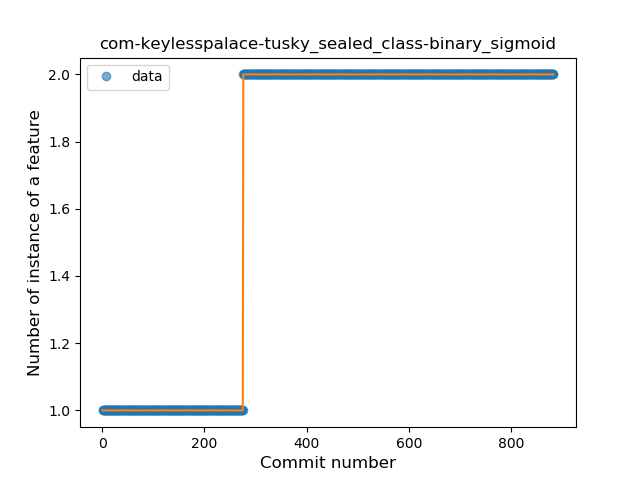

#### com-ofalvai-bpinfo
* Feature: Sealed Class
* Function: 
* R_Squared: 1.0
 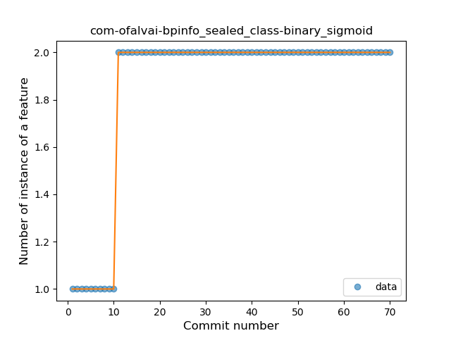

#### com-peterlaurence-trekme
* Feature: Sealed Class
* Function: 
* R_Squared: 1.0
 

#### com-stevenschoen-putionew
* Feature: Sealed Class
* Function: 
* R_Squared: 1.0
 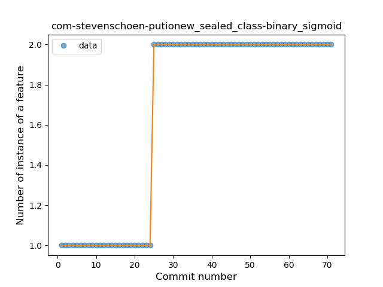

#### com-tasomaniac-openwith-floss
* Feature: Sealed Class
* Function: 
* R_Squared: 1.0
 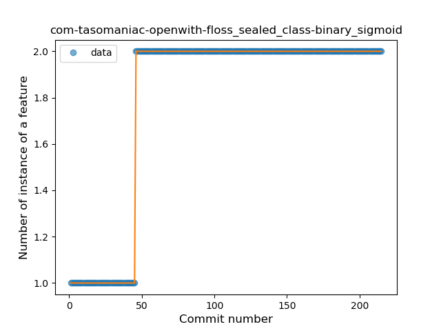

#### de-avpptr-umweltzone
* Feature: Sealed Class
* Function: 
* R_Squared: 1.0
 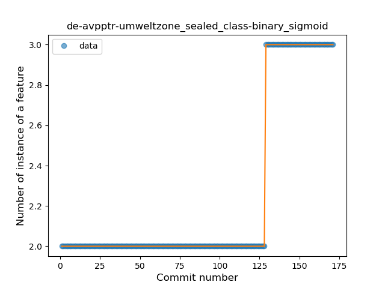

#### de-csicar-mensaplan
* Feature: Sealed Class
* Function: 
* R_Squared: 1.0
 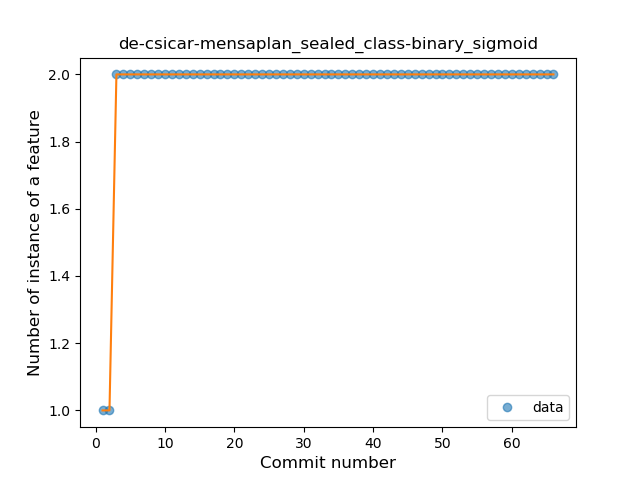

#### me-camsteffen-polite
* Feature: Sealed Class
* Function: 
* R_Squared: 1.0
 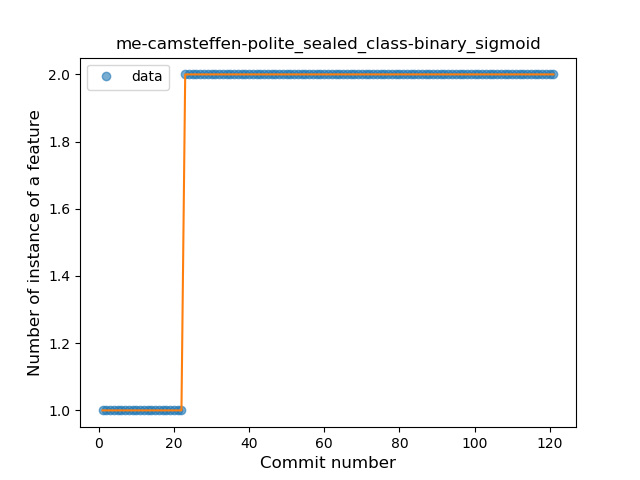

#### one-librem-social
* Feature: Sealed Class
* Function: 
* R_Squared: 1.0
 

#### org-moire-ultrasonic
* Feature: Sealed Class
* Function: 
* R_Squared: 1.0
 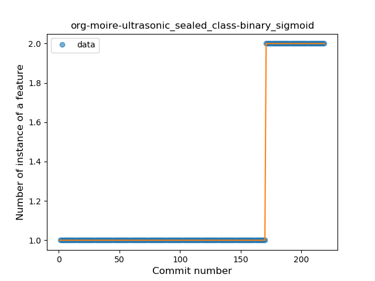

#### org-mozilla-focus
* Feature: Sealed Class
* Function: 
* R_Squared: 1.0
 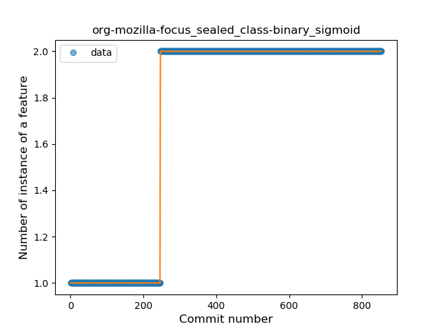

#### org-mozilla-klar
* Feature: Sealed Class
* Function: 
* R_Squared: 1.0
 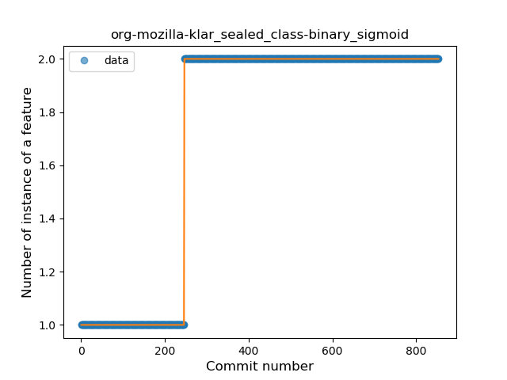

#### org-zimmob-zimlx
* Feature: Sealed Class
* Function: 
* R_Squared: 1.0
 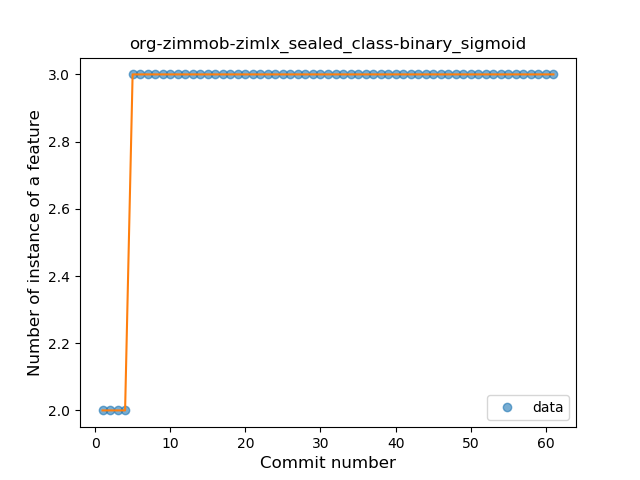

#### se-barsk-park
* Feature: Sealed Class
* Function: 
* R_Squared: 1.0
 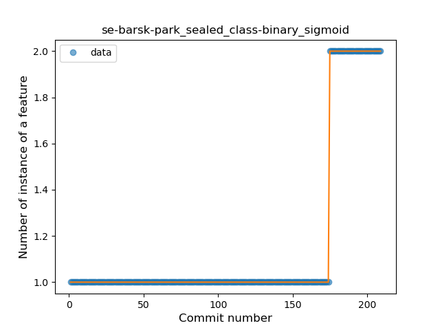

#### ch-deletescape-lawnchair-plah
* Feature: Type Alias
* Function: 
* R_Squared: 1.0
 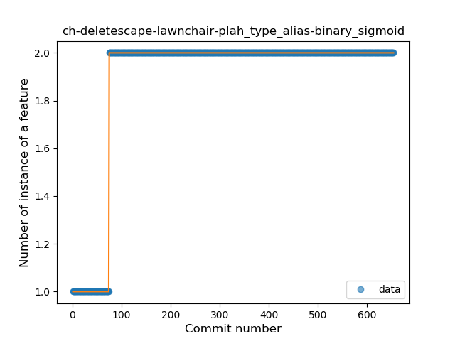

#### com-lavadip-miniVector
* Feature: Type Alias
* Function: 
* R_Squared: 1.0
 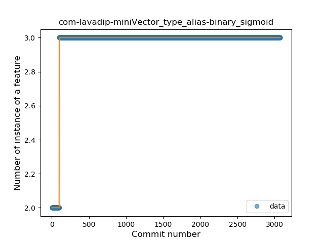

#### de-ph1b-audiobook
* Feature: Type Alias
* Function: 
* R_Squared: 1.0
 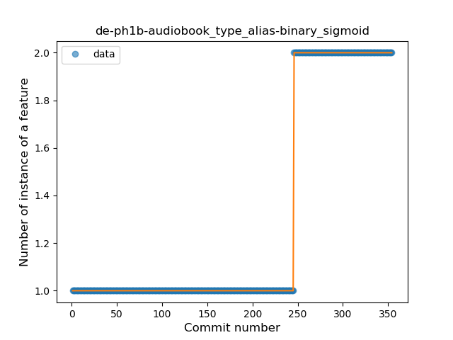

#### eu-kanade-tachiyomi
* Feature: Type Alias
* Function: 
* R_Squared: 1.0
 

#### im-vector-alpha
* Feature: Type Alias
* Function: 
* R_Squared: 1.0
 

#### me-camsteffen-polite
* Feature: Type Alias
* Function: 
* R_Squared: 1.0
 

#### com-czbix-v2ex
* Feature: Super Delegation
* Function: 
* R_Squared: 1.0
 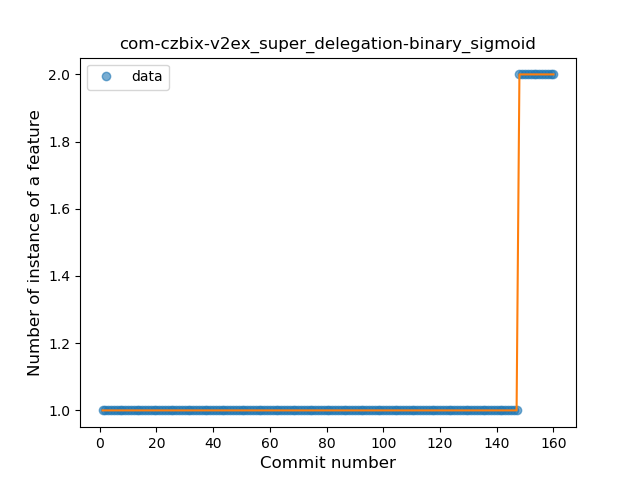

#### com-motion-stage1
* Feature: Super Delegation
* Function: 
* R_Squared: 1.0
 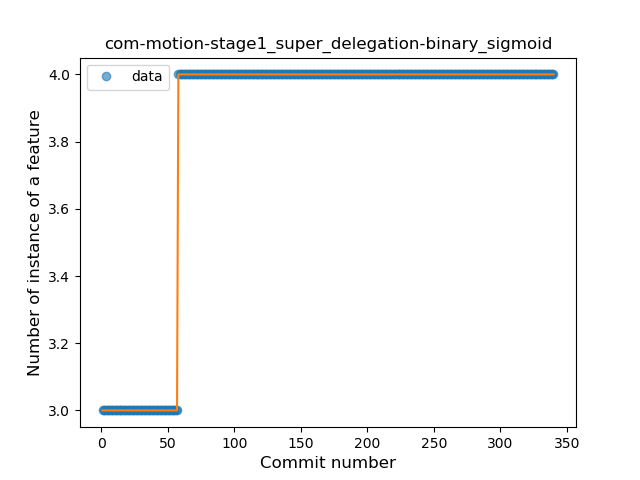

#### fr-cph-chicago-foss
* Feature: Super Delegation
* Function: 
* R_Squared: 1.0
 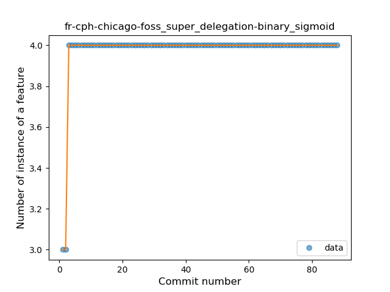

#### org-blokada-alarm
* Feature: Super Delegation
* Function: 
* R_Squared: 1.0
 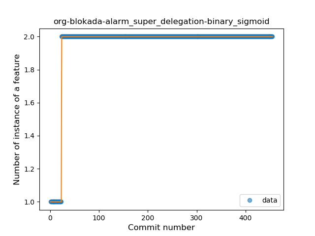

#### org-ligi-gobandroid
* Feature: Super Delegation
* Function: 
* R_Squared: 1.0
 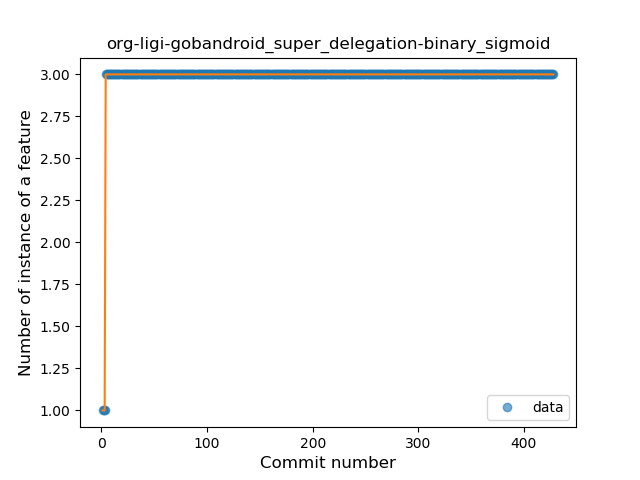

#### org-moire-ultrasonic
* Feature: Super Delegation
* Function: 
* R_Squared: 1.0
 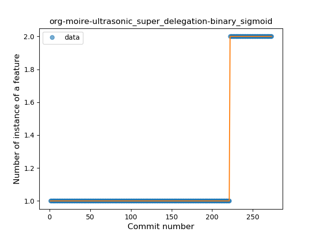

#### org-kiwix-kiwixcustomwikivoyageeurope
* Feature: Infix Function
* Function: 
* R_Squared: 1.0
 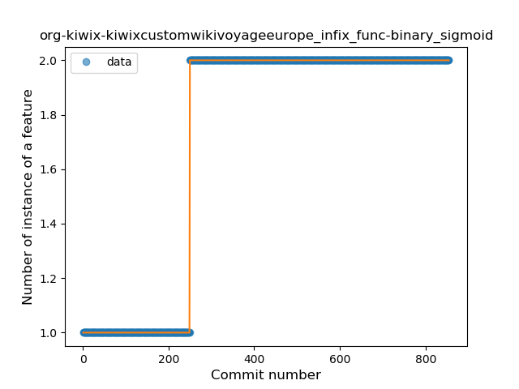

#### com-arcao-geocaching4locus
* Feature: Contract
* Function: 
* R_Squared: 1.0
 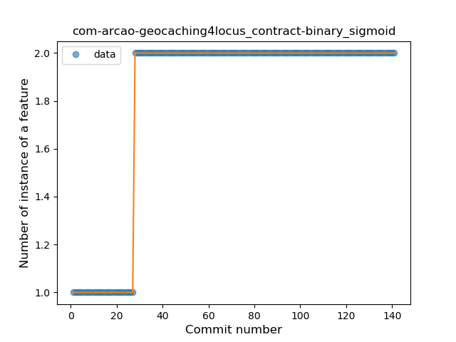

#### rectangledbmi-com-pittsburghrealtimetracker
* Feature: Function call with Named Argument
* Function: 
* R_Squared: 0.99992422
 

#### org-sanpra-checklist
* Feature: String Template
* Function: 
* R_Squared: 0.99960856
 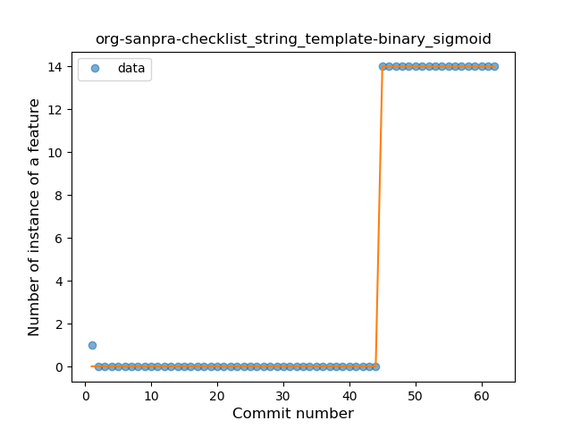

#### pl-org-seva-texter
* Feature: Function call with Named Argument
* Function: 
* R_Squared: 0.99837212
 

#### org-decsync-sparss-floss
* Feature: Unsafe Call
* Function: 
* R_Squared: 0.99582672
 

#### ch-rmy-android-http_shortcuts
* Feature: Inline Function
* Function: 
* R_Squared: 0.99300121
 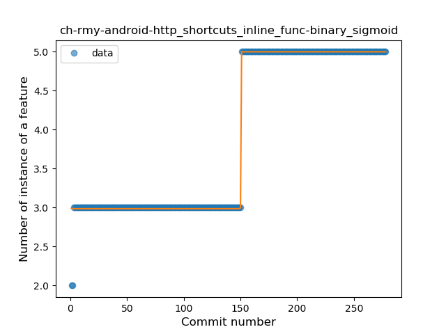

#### de-avpptr-umweltzone
* Feature: Singleton
* Function: 
* R_Squared: 0.99241195
 

#### org-mozilla-focus
* Feature: Destructuring Declaration
* Function: 
* R_Squared: 0.99229461
 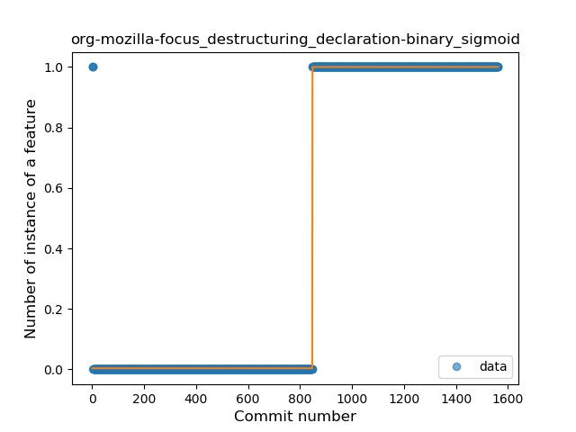

#### org-mozilla-klar
* Feature: Destructuring Declaration
* Function: 
* R_Squared: 0.99229461
 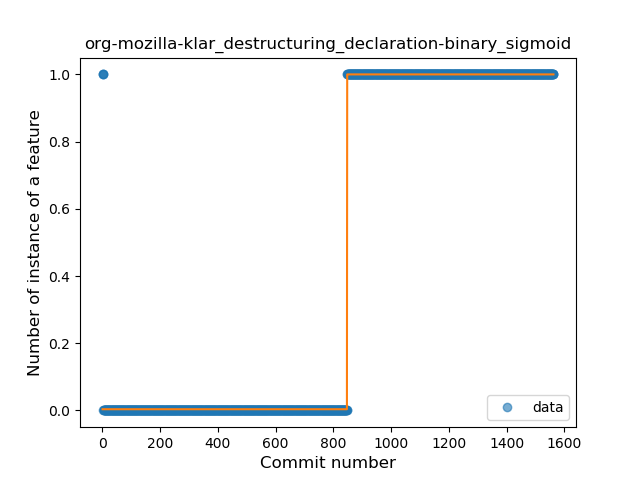

#### eu-the4thfloor-msync
* Feature: Data Class
* Function: 
* R_Squared: 0.99173006
 

#### ch-abertschi-adfree
* Feature: When expression
* Function: 
* R_Squared: 0.9915175
 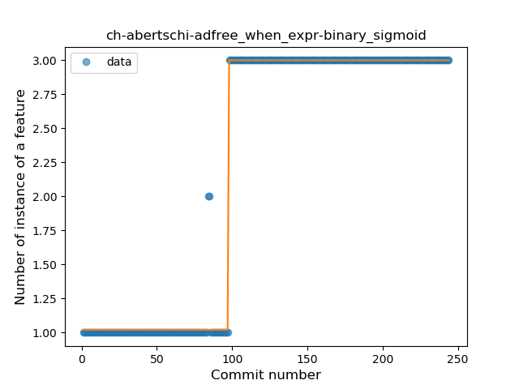

#### fr-xgouchet-packageexplorer
* Feature: Singleton
* Function: 
* R_Squared: 0.99139741
 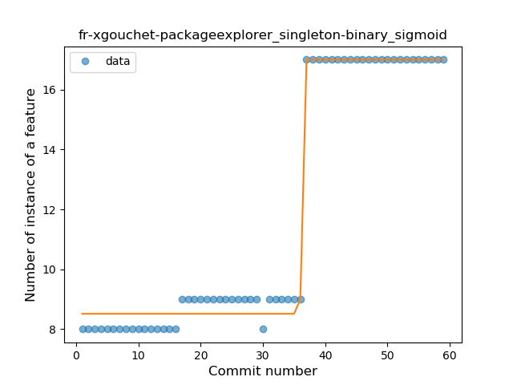

#### com-esafirm-androidplayground
* Feature: Infix Function
* Function: 
* R_Squared: 0.99058701
 

#### com-gimranov-zandy-app
* Feature: String Template
* Function: 
* R_Squared: 0.99047658
 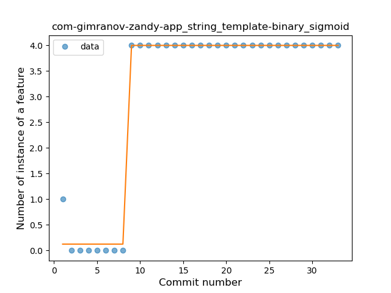

#### com-jereksel-libresubstratum
* Feature: Sealed Class
* Function: 
* R_Squared: 0.99044924
 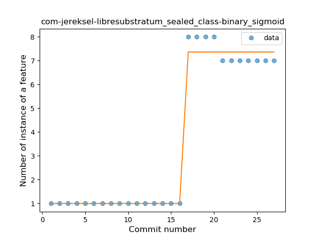

#### de-thecode-lmd
* Feature: Smart Cast
* Function: 
* R_Squared: 0.98672905
 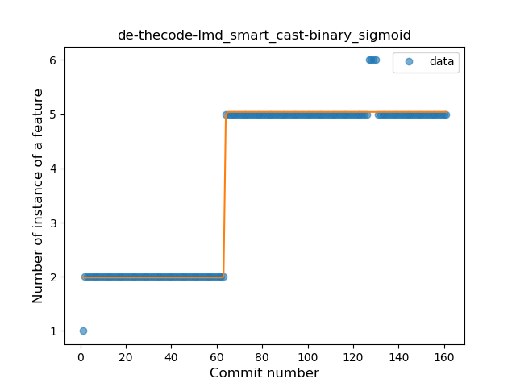

#### me-barta-stayintouch
* Feature: Function with Default Value
* Function: 
* R_Squared: 0.98512002
 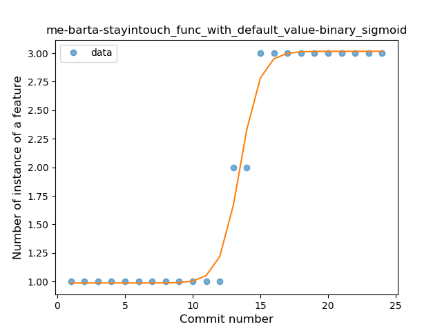

#### com-corphish-nightlight-generic
* Feature: When expression
* Function: 
* R_Squared: 0.98503402
 

#### com-enjoyingfoss-om
* Feature: Companion Object
* Function: 
* R_Squared: 0.98476282
 

#### pl-poznajapp
* Feature: Companion Object
* Function: 
* R_Squared: 0.98163845
 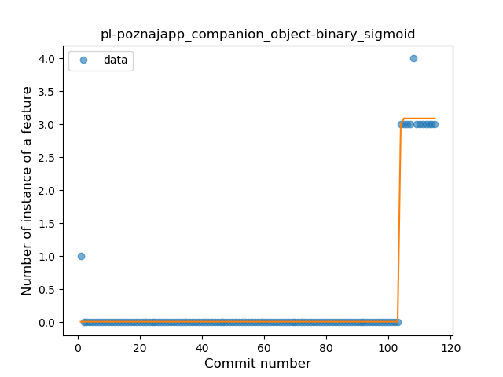

#### app-simone
* Feature: Property Delegation
* Function: 
* R_Squared: 0.98133224
 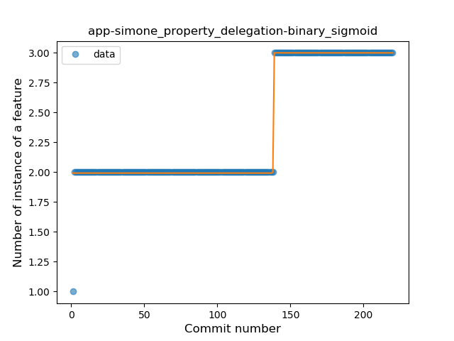

#### com-simplemobiletools-draw
* Feature: Smart Cast
* Function: 
* R_Squared: 0.9792921
 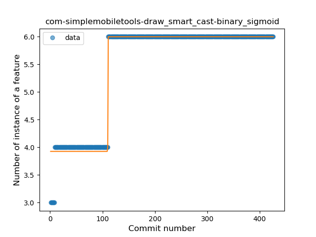

#### com-simplemobiletools-draw-pro
* Feature: Smart Cast
* Function: 
* R_Squared: 0.9792921
 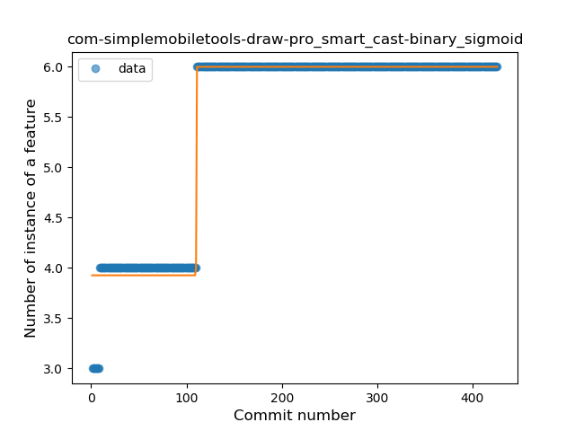

#### ryey-easer-beta
* Feature: Function with Default Value
* Function: 
* R_Squared: 0.97863496
 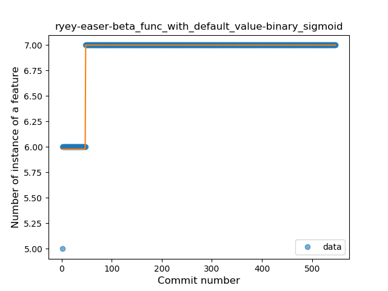

#### com-zeapo-pwdstore
* Feature: Function call with Named Argument
* Function: 
* R_Squared: 0.97759641
 

#### org-isoron-uhabits
* Feature: Function with Default Value
* Function: 
* R_Squared: 0.97707916
 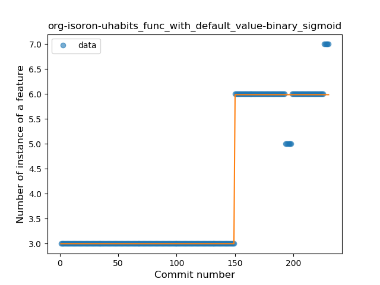

#### de-thecode-android-tazreader
* Feature: Smart Cast
* Function: 
* R_Squared: 0.97518808
 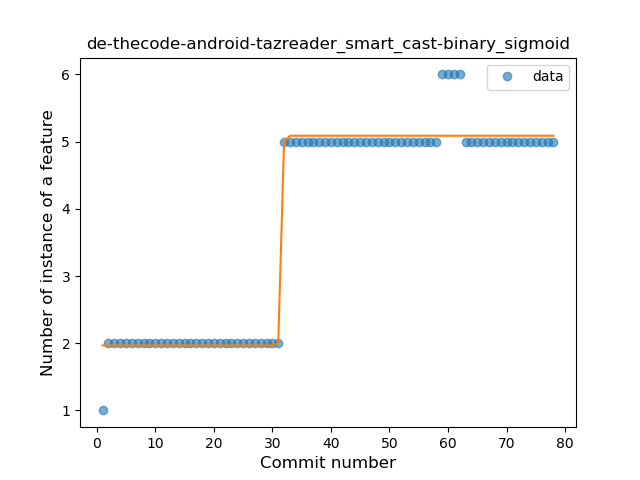

#### com-motion-stage1
* Feature: Data Class
* Function: 
* R_Squared: 0.9747551
 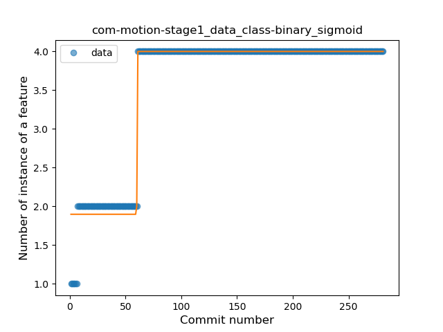

#### de-r4md4c-gamedealz
* Feature: Overloaded Operator
* Function: 
* R_Squared: 0.97370398
 

#### org-isoron-uhabits
* Feature: Destructuring Declaration
* Function: 
* R_Squared: 0.97185372
 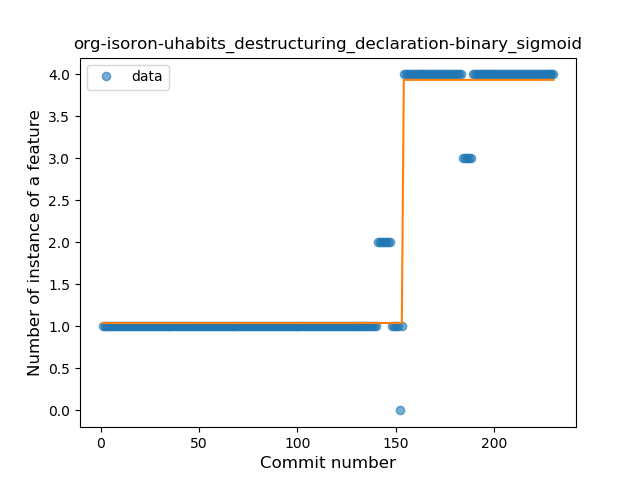

#### com-simplemobiletools-calendar-pro
* Feature: Singleton
* Function: 
* R_Squared: 0.9709605
 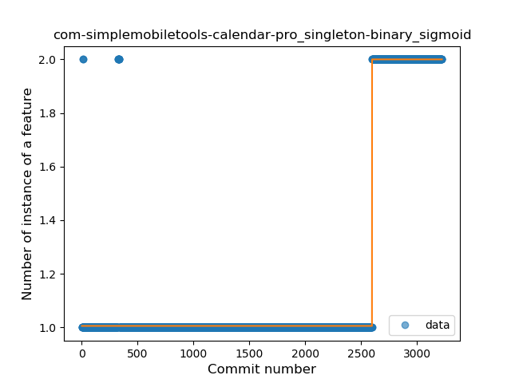

#### com-simplemobiletools-flashlight
* Feature: Safe Call
* Function: 
* R_Squared: 0.96980251
 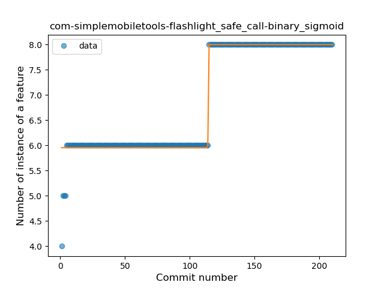

#### com-bernaferrari-changedetection
* Feature: Super Delegation
* Function: 
* R_Squared: 0.96842772
 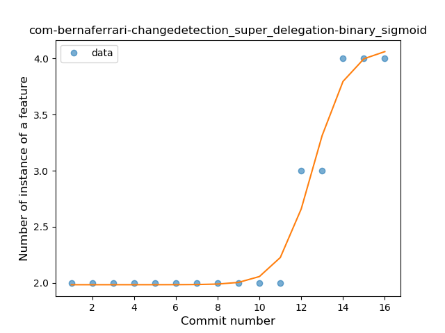

#### org-freedombox-freedombox
* Feature: Function with Default Value
* Function: 
* R_Squared: 0.9680247
 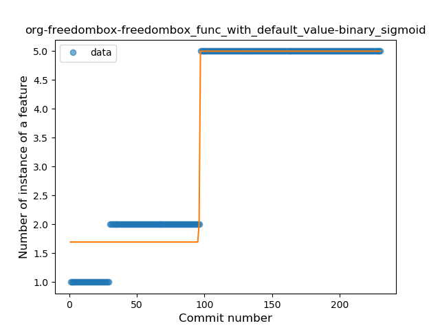

#### org-pacien-tincapp
* Feature: Smart Cast
* Function: 
* R_Squared: 0.96710855
 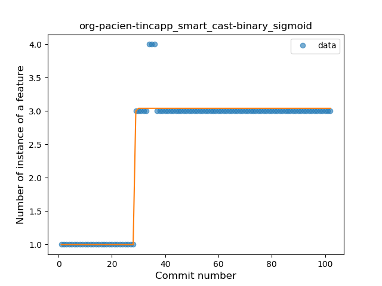

#### ch-abertschi-adfree
* Feature: Function call with Named Argument
* Function: 
* R_Squared: 0.96551476
 

#### pl-poznajapp
* Feature: Singleton
* Function: 
* R_Squared: 0.96453901
 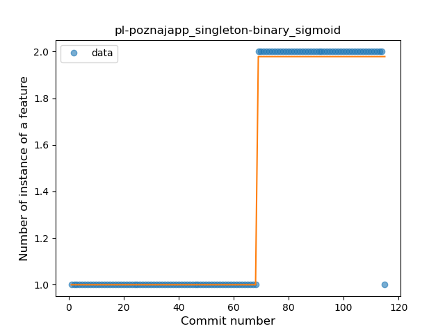

#### org-ligi-passandroid
* Feature: Extension Function
* Function: 
* R_Squared: 0.96360232
 

#### com-benoitletondor-easybudgetapp
* Feature: Range Expression
* Function: 
* R_Squared: 0.96187911
 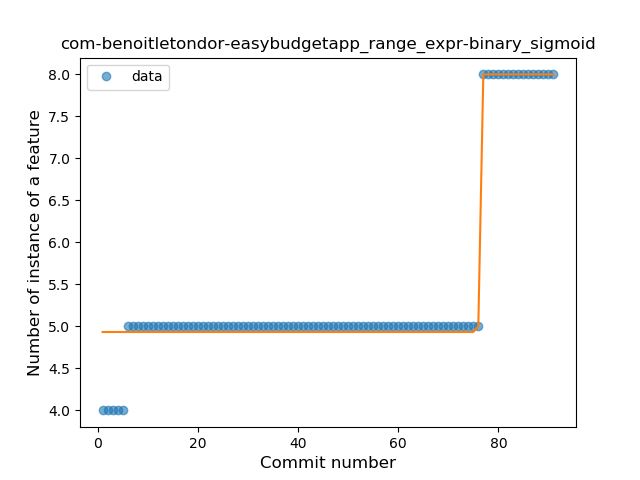

#### com-esafirm-androidplayground
* Feature: Range Expression
* Function: 
* R_Squared: 0.95563952
 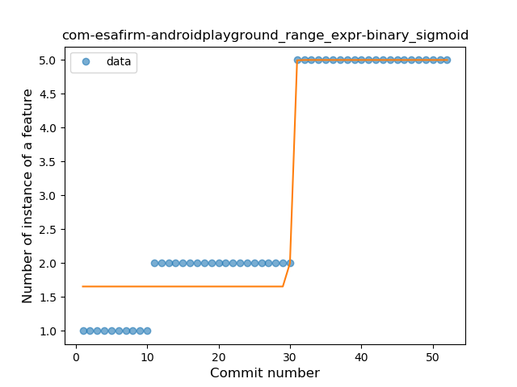

#### com-corphish-nightlight-generic
* Feature: Extension Function
* Function: 
* R_Squared: 0.95553658
 

#### com-physphil-android-unitconverterultimate
* Feature: Data Class
* Function: 
* R_Squared: 0.95334745
 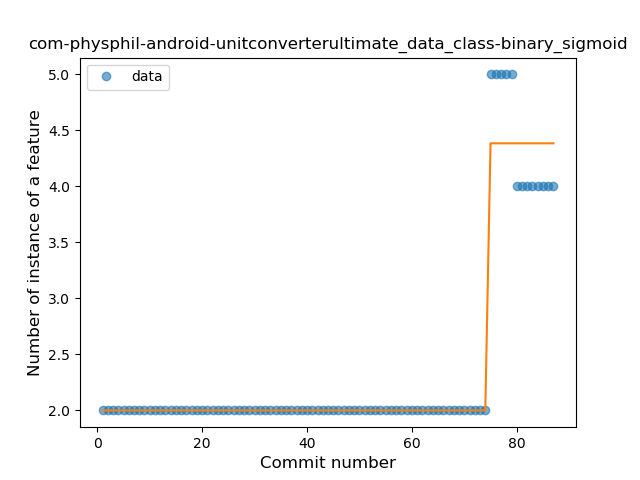

#### jp-cordea-mackerelclient
* Feature: String Template
* Function: 
* R_Squared: 0.95235473
 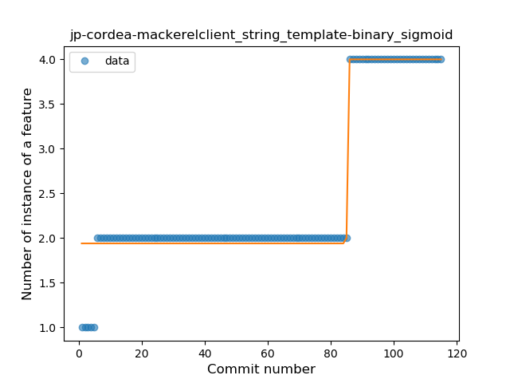

#### com-benoitquenaudon-tvfoot-red
* Feature: Range Expression
* Function: 
* R_Squared: 0.95119633
 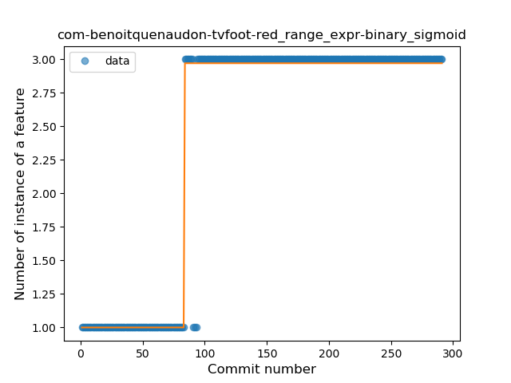

#### com-wabadaba-dziennik
* Feature: Function with Default Value
* Function: 
* R_Squared: 0.94818763
 

#### org-mattvchandler-progressbars
* Feature: Extension Function
* Function: 
* R_Squared: 0.9479697
 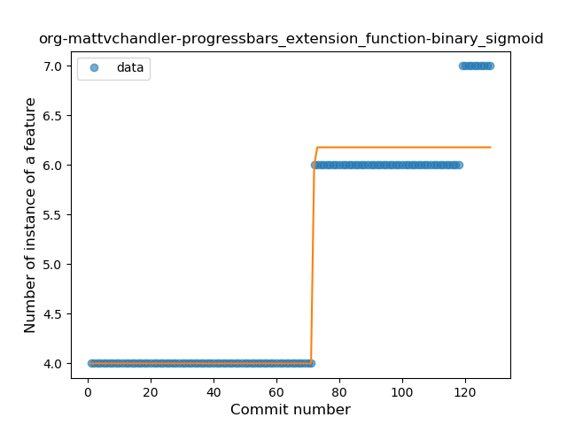

#### org-sanpra-checklist
* Feature: When expression
* Function: 
* R_Squared: 0.94768029
 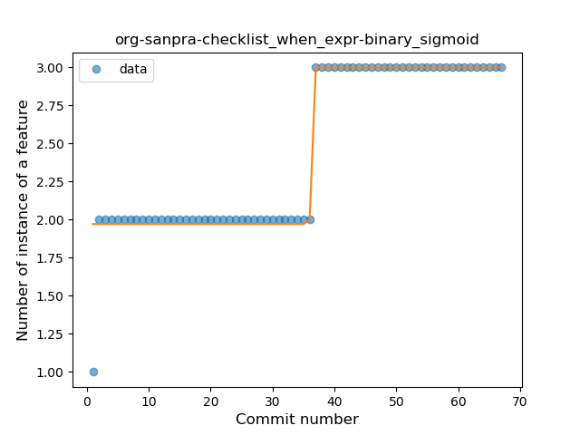

#### nl-brouwerijdemolen-borefts2013
* Feature: Sealed Class
* Function: 
* R_Squared: 0.94711918
 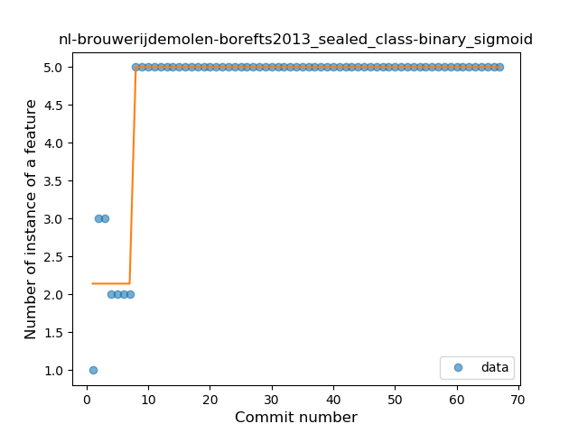

#### cz-dvratil-fbeventsync
* Feature: Data Class
* Function: 
* R_Squared: 0.94689671
 

#### net-mm2d-dmsexplorer
* Feature: Function call with Named Argument
* Function: 
* R_Squared: 0.94391438
 

#### org-blitzortung-android-app
* Feature: Singleton
* Function: 
* R_Squared: 0.94217286
 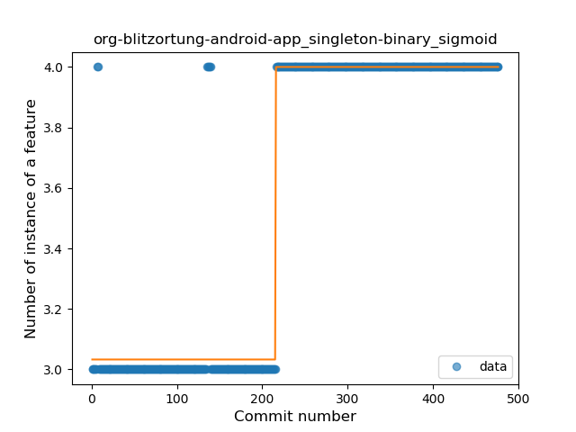

#### com-benoitletondor-easybudgetapp
* Feature: Data Class
* Function: 
* R_Squared: 0.93722668
 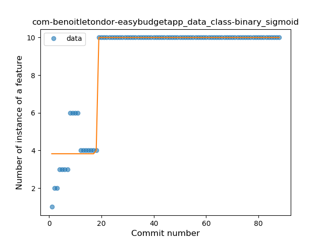

#### ca-josephroque-bowlingcompanion
* Feature: Function call with Named Argument
* Function: 
* R_Squared: 0.93585119
 

#### me-rei_m-hyakuninisshu
* Feature: Destructuring Declaration
* Function: 
* R_Squared: 0.93546497
 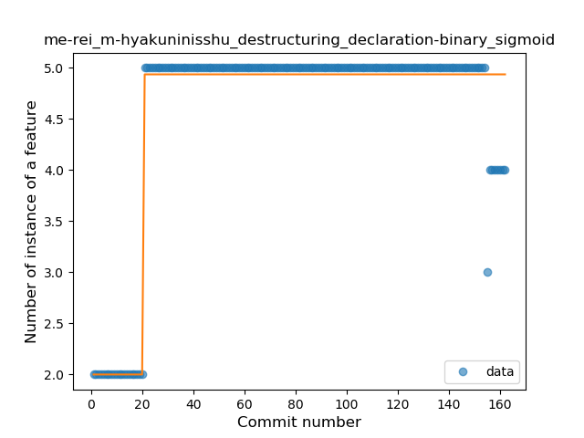

#### ca-fuwafuwa-kaku
* Feature: Smart Cast
* Function: 
* R_Squared: 0.93436799
 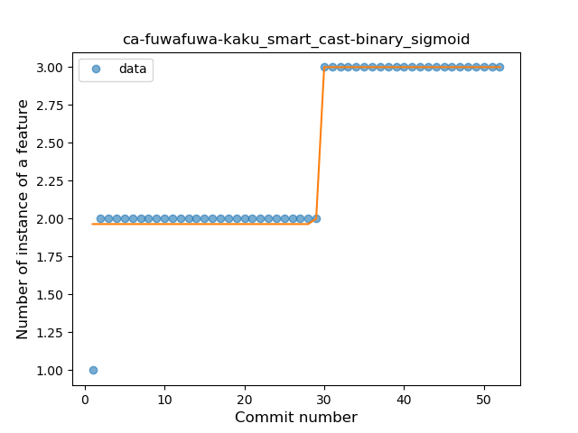

#### eu-depau-etchdroid
* Feature: Range Expression
* Function: 
* R_Squared: 0.93419037
 

#### com-glodanif-bluetoothchat
* Feature: Inline Function
* Function: 
* R_Squared: 0.93150191
 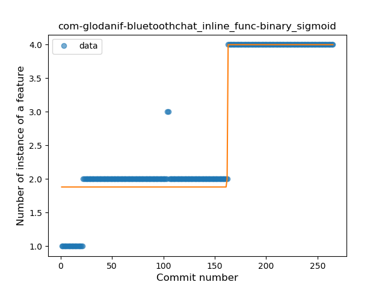

#### org-equeim-tremotesf
* Feature: Function call with Named Argument
* Function: 
* R_Squared: 0.93142247
 

#### saschpe-poker
* Feature: Companion Object
* Function: 
* R_Squared: 0.93010076
 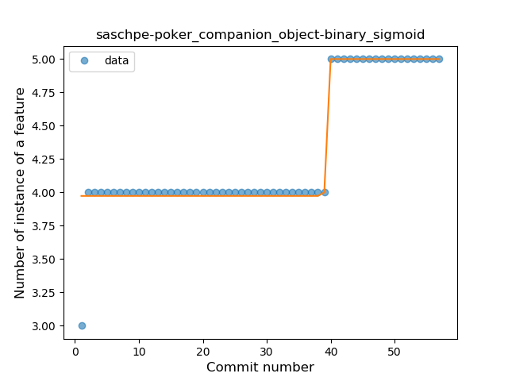

#### com-tomer-draw
* Feature: Unsafe Call
* Function: 
* R_Squared: 0.9288984
 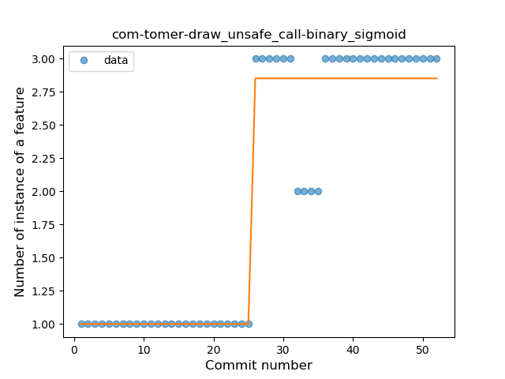

#### com-tomer-draw
* Feature: Companion Object
* Function: 
* R_Squared: 0.9288984
 

#### com-adityakamble49-dcipher
* Feature: Smart Cast
* Function: 
* R_Squared: 0.9269682
 

#### com-loloof64-android-basicchessendgamestrainer
* Feature: Infix Function
* Function: 
* R_Squared: 0.92483431
 

#### com-fallgamlet-dnestrcinema
* Feature: When expression
* Function: 
* R_Squared: 0.92348362
 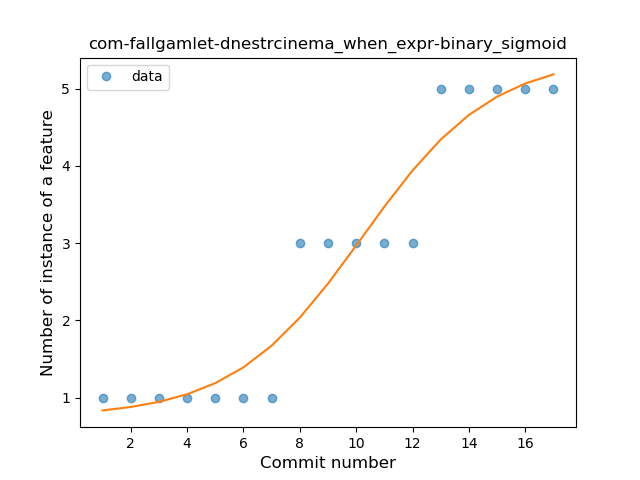

#### ai-susi
* Feature: Property Delegation
* Function: 
* R_Squared: 0.92322987
 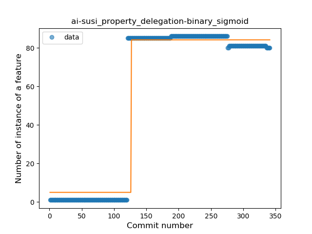

#### ch-deletescape-lawnchair-plah
* Feature: Sealed Class
* Function: 
* R_Squared: 0.92301583
 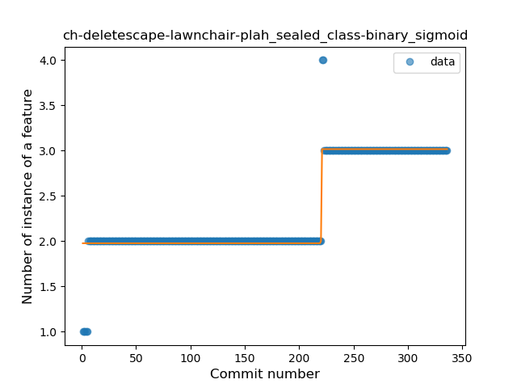

#### de-grobox-liberario
* Feature: Singleton
* Function: 
* R_Squared: 0.92265273
 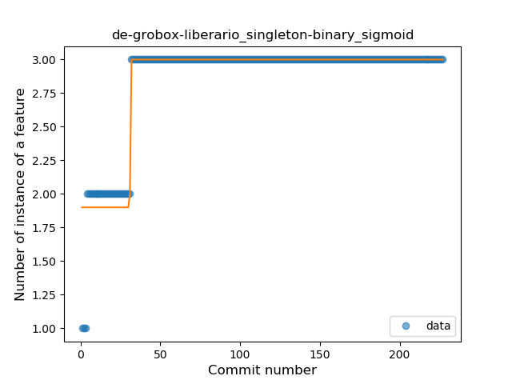

#### de-devmil-paperlaunch
* Feature: Smart Cast
* Function: 
* R_Squared: 0.92093211
 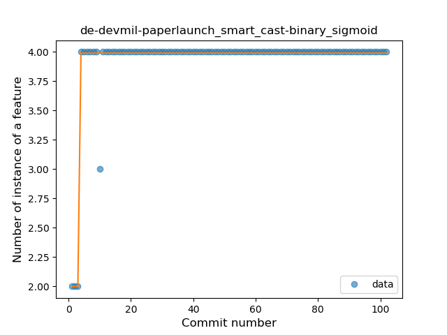

#### com-ogsdroid
* Feature: Function call with Named Argument
* Function: 
* R_Squared: 0.9202454
 

#### com-bubelov-coins
* Feature: Inline Function
* Function: 
* R_Squared: 0.91846297
 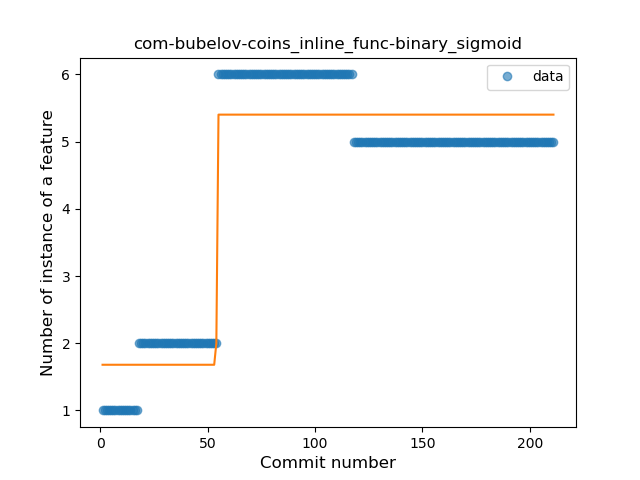

#### de-markusfisch-android-binaryeye
* Feature: Range Expression
* Function: 
* R_Squared: 0.91826693
 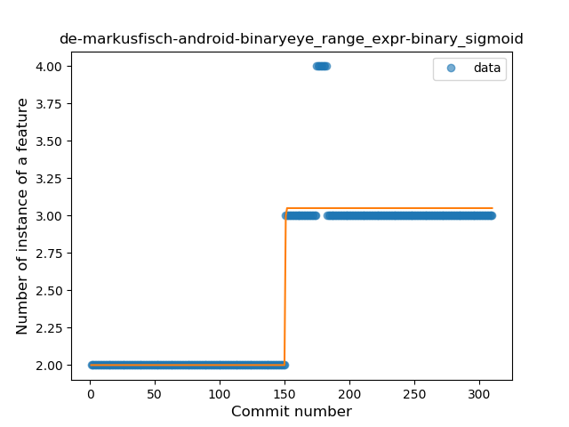

#### com-pennapps-labs-pennmobile
* Feature: When expression
* Function: 
* R_Squared: 0.91714667
 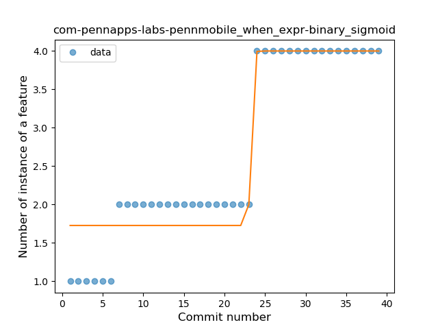

#### com-wbrawner-simplemarkdown
* Feature: Function call with Named Argument
* Function: 
* R_Squared: 0.91167278
 

#### ca-rmen-android-poetassistant
* Feature: String Template
* Function: 
* R_Squared: 0.9079279
 

#### com-pixplicity-cryptogram
* Feature: When expression
* Function: 
* R_Squared: 0.90342213
 

#### org-teamblueridge-pasteitapp
* Feature: Lambda
* Function: 
* R_Squared: 0.90328634
 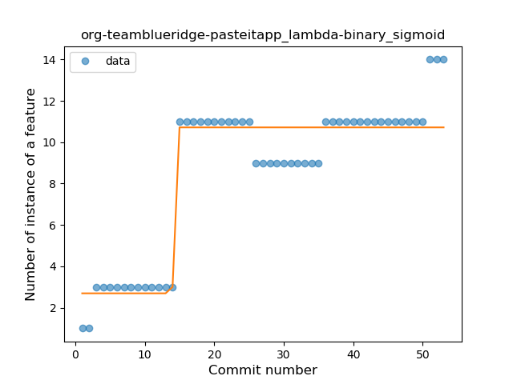

#### com-zeapo-pwdstore
* Feature: Singleton
* Function: 
* R_Squared: 0.90262019
 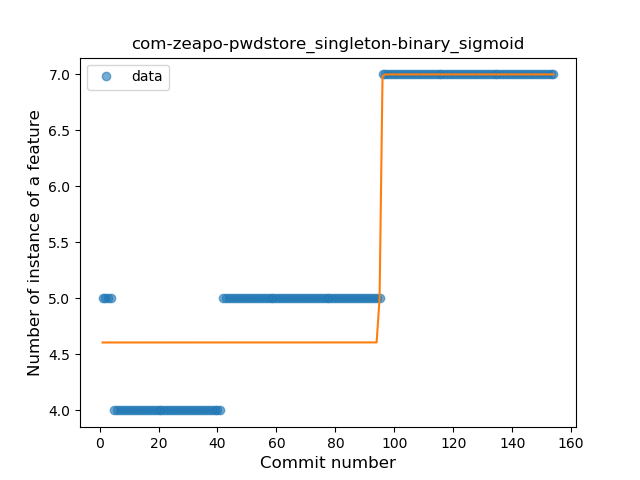

#### com-stevenschoen-putionew
* Feature: Extension Function
* Function: 
* R_Squared: 0.90123457
 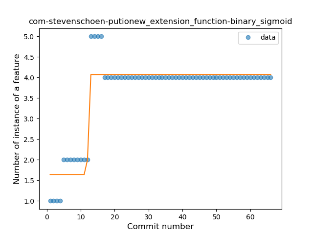

#### chat-rocket-android
* Feature: Type Alias
* Function: 
* R_Squared: 0.8984592
 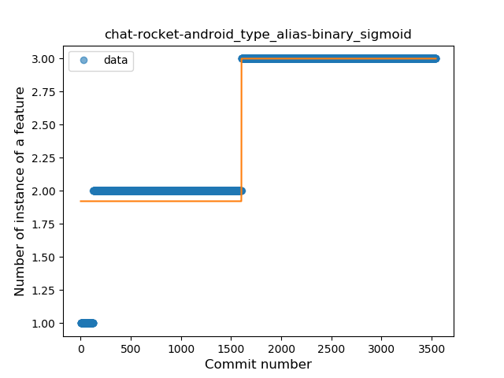

#### org-emunix-insteadlauncher
* Feature: Destructuring Declaration
* Function: 
* R_Squared: 0.89372795
 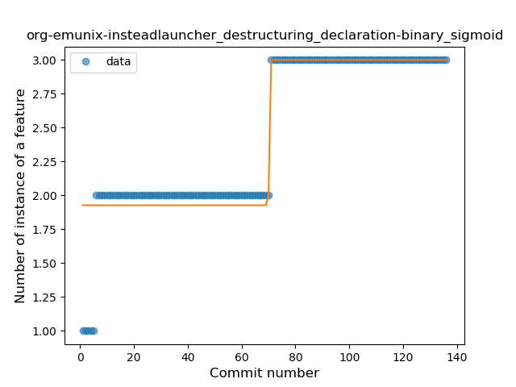

#### fr-openium-auvergnewebcams
* Feature: Companion Object
* Function: 
* R_Squared: 0.89134632
 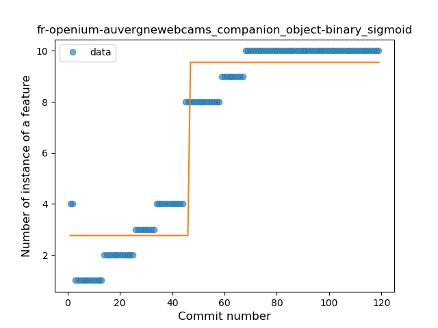

#### danbroid-searchview
* Feature: Companion Object
* Function: 
* R_Squared: 0.89108911
 

#### pt-joaomneto-titancompanion
* Feature: Singleton
* Function: 
* R_Squared: 0.89087794
 

#### net-nurik-roman-muzei
* Feature: Sealed Class
* Function: 
* R_Squared: 0.88738772
 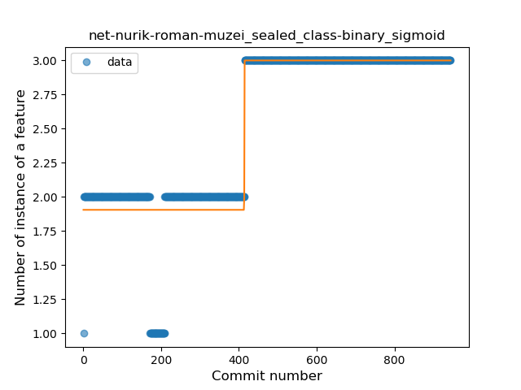

#### com-pitchedapps-frost
* Feature: Safe Call
* Function: 
* R_Squared: 0.88447636
 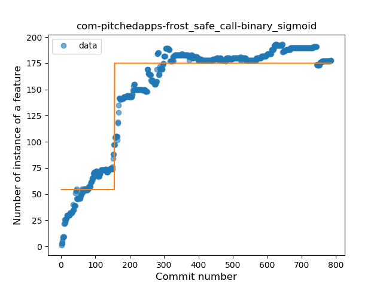

#### com-adityakamble49-ttl
* Feature: When expression
* Function: 
* R_Squared: 0.88081988
 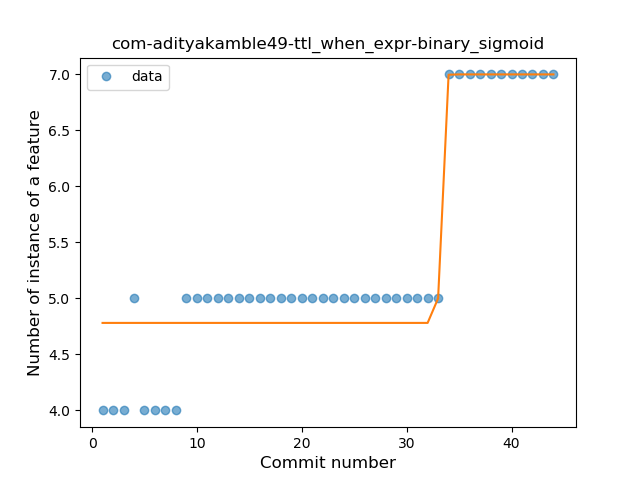

#### com-benoitquenaudon-tvfoot-red
* Feature: Function with Default Value
* Function: 
* R_Squared: 0.87980794
 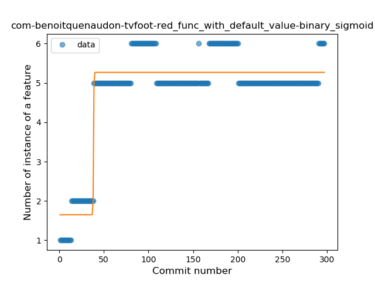

#### science-apolline
* Feature: Range Expression
* Function: 
* R_Squared: 0.87516526
 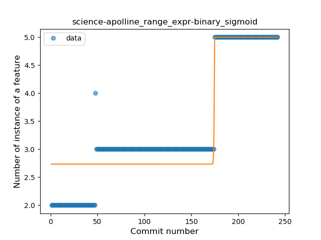

#### com-jmstudios-redmoon
* Feature: Tail-recursive Function
* Function: 
* R_Squared: 0.87132649
 

#### com-mgaetan89-showsrage
* Feature: Data Class
* Function: 
* R_Squared: 0.87122548
 

#### com-utazukin-ichaival
* Feature: Function call with Named Argument
* Function: 
* R_Squared: 0.87097545
 

#### uk-co-richyhbm-monochromatic
* Feature: Safe Call
* Function: 
* R_Squared: 0.86826386
 

#### es-danirod-rectball-android
* Feature: Property Delegation
* Function: 
* R_Squared: 0.86246673
 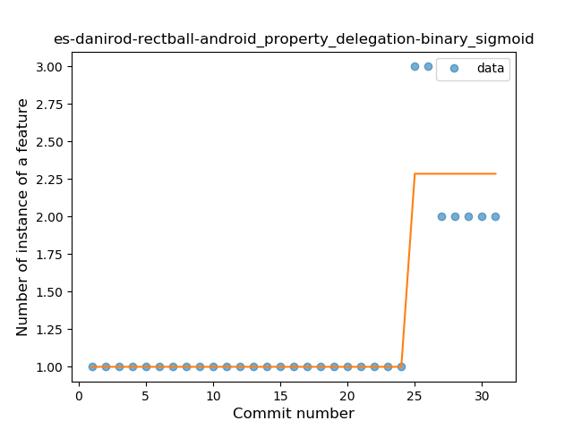

#### fr-chenry-android-freshrss
* Feature: Sealed Class
* Function: 
* R_Squared: 0.86060055
 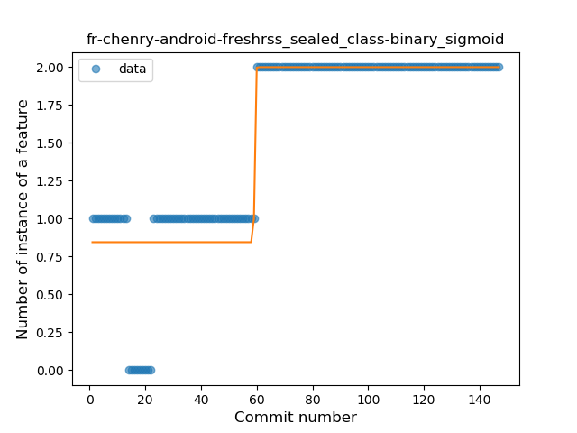

#### cz-dvratil-fbeventsync
* Feature: Range Expression
* Function: 
* R_Squared: 0.85501454
 

#### org-ligi-ipfsdroid
* Feature: Lambda
* Function: 
* R_Squared: 0.84948833
 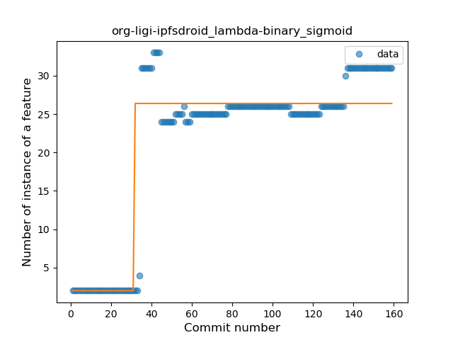

#### com-adityakamble49-ttl
* Feature: Function with Default Value
* Function: 
* R_Squared: 0.84848485
 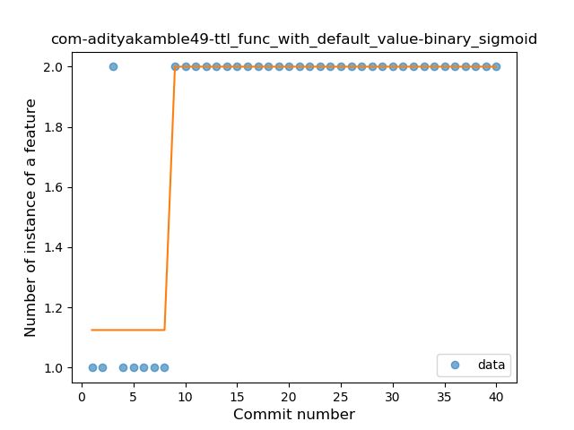

#### fr-openium-auvergnewebcams
* Feature: Range Expression
* Function: 
* R_Squared: 0.84802758
 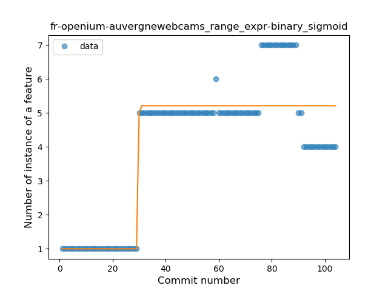

#### org-liberty-android-freeotpplus
* Feature: When expression
* Function: 
* R_Squared: 0.84736718
 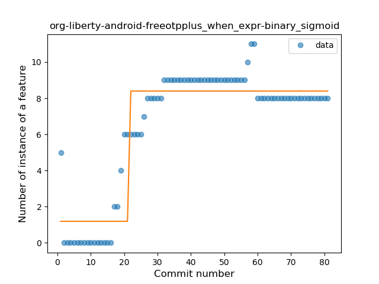

#### me-murks-feedwatcher
* Feature: Extension Function
* Function: 
* R_Squared: 0.8471271
 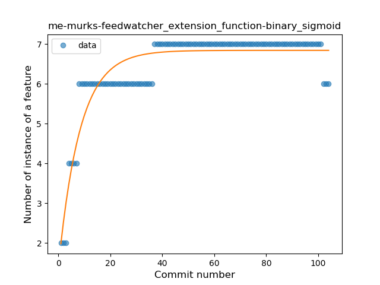

#### org-weilbach-splitbills
* Feature: Companion Object
* Function: 
* R_Squared: 0.84265367
 

#### io-github-z3r0c00l
* Feature: When expression
* Function: 
* R_Squared: 0.84185073
 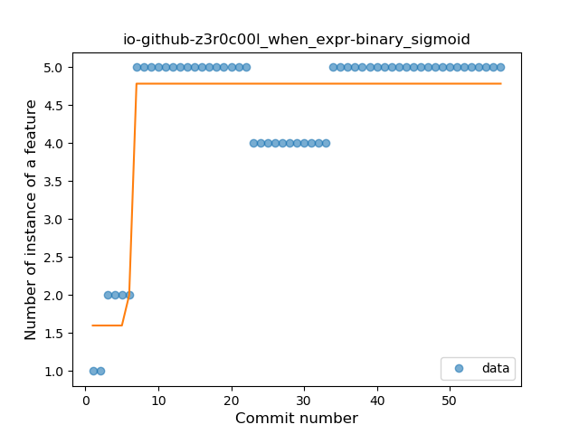

#### is-xyz-mpv
* Feature: Smart Cast
* Function: 
* R_Squared: 0.84159237
 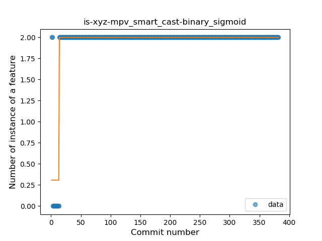

#### de-cineaste-android
* Feature: Function call with Named Argument
* Function: 
* R_Squared: 0.8402512
 

#### xyz-hisname-fireflyiii
* Feature: Inline Function
* Function: 
* R_Squared: 0.8383709
 

#### com-physphil-android-unitconverterultimate
* Feature: Companion Object
* Function: 
* R_Squared: 0.83559288
 

#### com-yubico-yubioath
* Feature: Lambda
* Function: 
* R_Squared: 0.8171574
 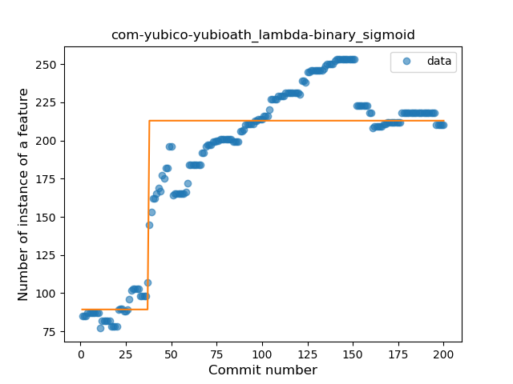

#### io-github-deweyreed-clipboardcleaner
* Feature: Function with Default Value
* Function: 
* R_Squared: 0.81241341
 

#### com-guerinet-mymartlet
* Feature: Safe Call
* Function: 
* R_Squared: 0.81100119
 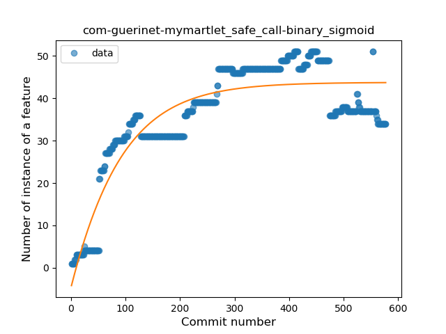

#### com-pixplicity-cryptogram
* Feature: Function call with Named Argument
* Function: 
* R_Squared: 0.80874768
 

#### com-simplemobiletools-applauncher
* Feature: Safe Call
* Function: 
* R_Squared: 0.79482451
 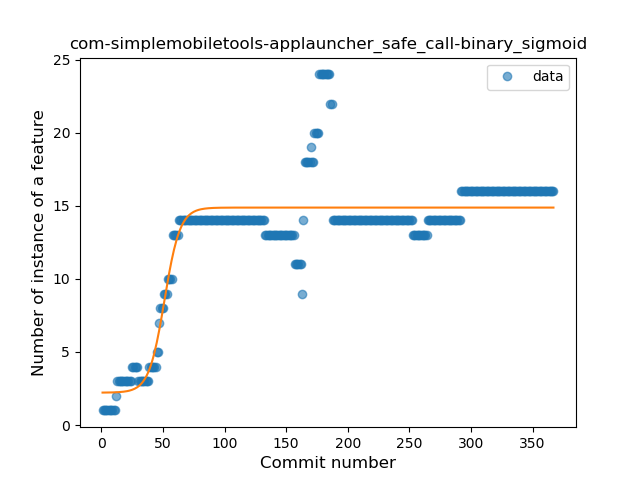

#### pt-joaomneto-titancompanion
* Feature: Range Expression
* Function: 
* R_Squared: 0.79144776
 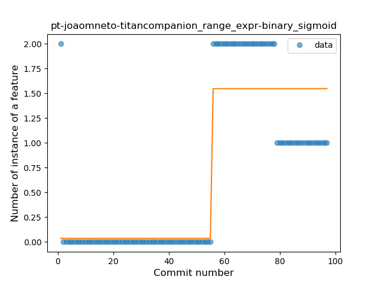

#### fi-kroon-vadret
* Feature: Destructuring Declaration
* Function: 
* R_Squared: 0.78866228
 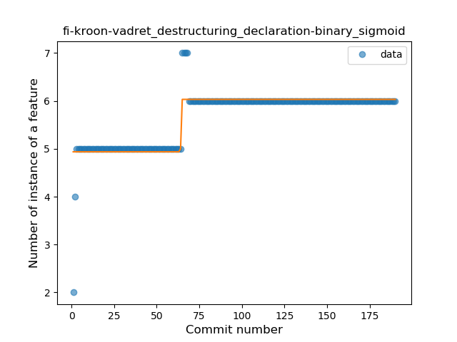

#### pt-ipleiria-mymusicqoe
* Feature: String Template
* Function: 
* R_Squared: 0.7885409
 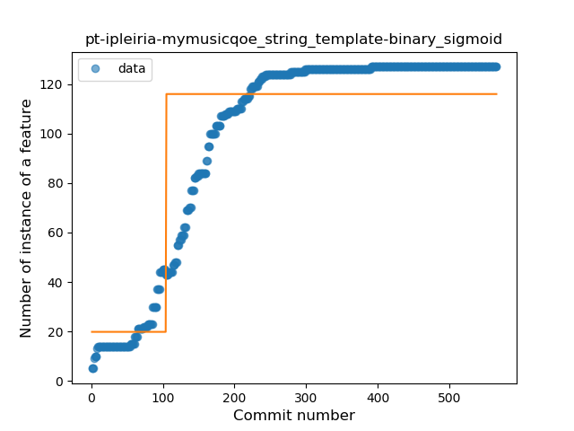

#### com-agusyc-daycounter
* Feature: String Template
* Function: 
* R_Squared: 0.78835472
 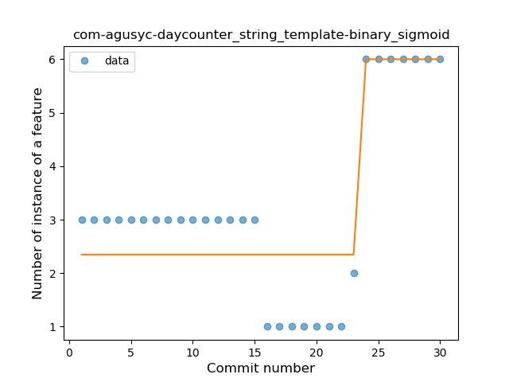

#### com-garpr-android
* Feature: Companion Object
* Function: 
* R_Squared: 0.78522761
 

#### de-micmun-android-deufeitage
* Feature: Companion Object
* Function: 
* R_Squared: 0.77676474
 

#### acr-browser-lightning
* Feature: Destructuring Declaration
* Function: 
* R_Squared: 0.76471748
 

#### de-ph1b-audiobook
* Feature: Super Delegation
* Function: 
* R_Squared: 0.75592259
 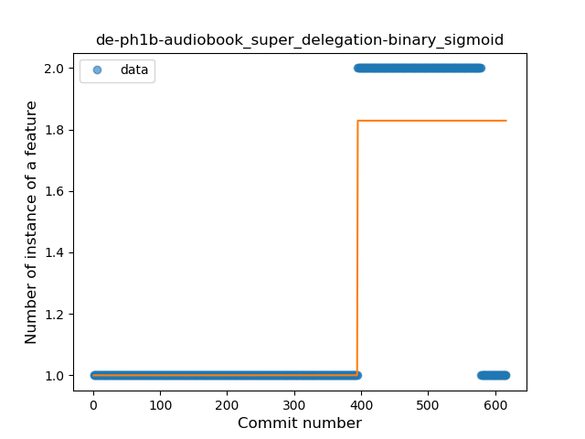

#### com-directdev-portal
* Feature: Function with Default Value
* Function: 
* R_Squared: 0.75349616
 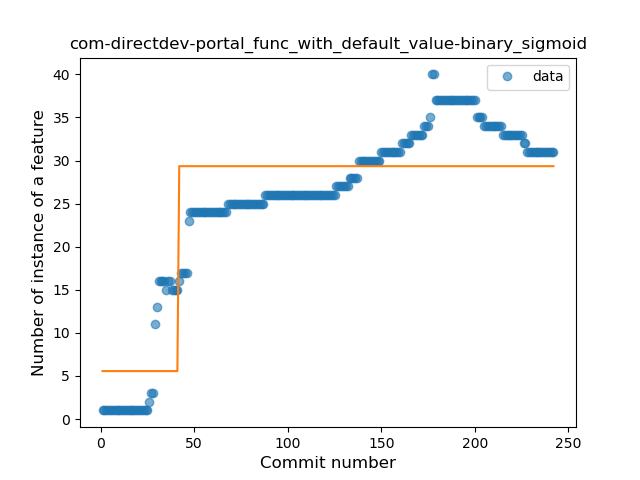

#### com-njlabs-showjava
* Feature: Unsafe Call
* Function: 
* R_Squared: 0.74692967
 

#### moe-feng-nhentai
* Feature: Coroutine
* Function: 
* R_Squared: 0.73809524
 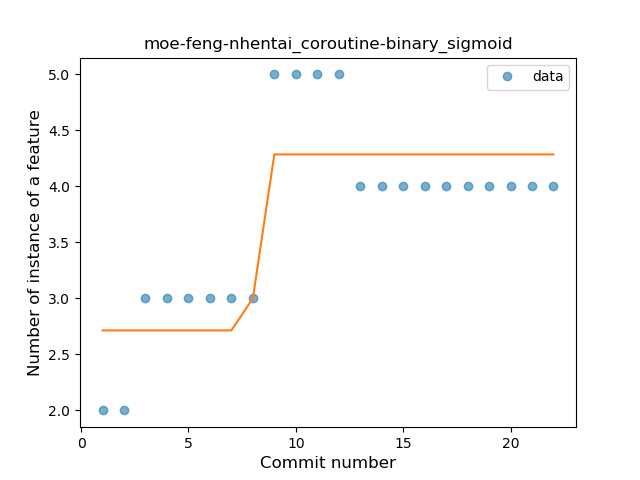

#### moe-feng-nhentai
* Feature: Singleton
* Function: 
* R_Squared: 0.73770492
 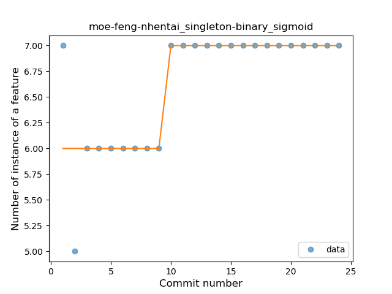

#### com-github-premnirmal-tickerwidget
* Feature: Range Expression
* Function: 
* R_Squared: 0.7314753
 

#### science-apolline
* Feature: Data Class
* Function: 
* R_Squared: 0.72946833
 

#### ml-adamsprogs-bimba
* Feature: Lambda
* Function: 
* R_Squared: 0.72817247
 

#### me-echeung-moemoekyun-fdroid
* Feature: Companion Object
* Function: 
* R_Squared: 0.72407706
 

#### ca-rmen-android-poetassistant
* Feature: Function call with Named Argument
* Function: 
* R_Squared: 0.72073326
 

#### com-garpr-android
* Feature: Singleton
* Function: 
* R_Squared: 0.71598355
 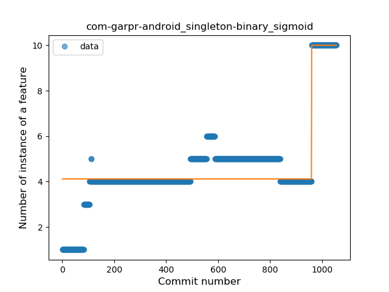

#### com-github-quarck-calnotify
* Feature: Inline Function
* Function: 
* R_Squared: 0.71006174
 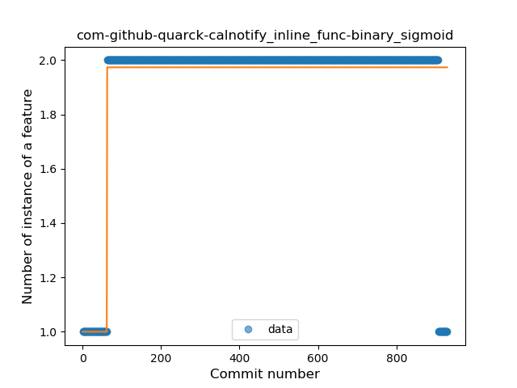

#### com-github-fields-electric
* Feature: Function with Default Value
* Function: 
* R_Squared: 0.7020664
 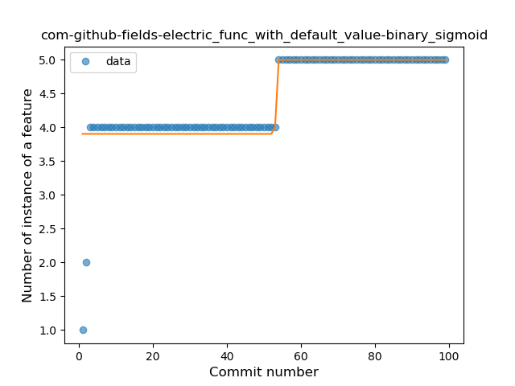

#### jp-org-example-geckour-glyph
* Feature: Function call with Named Argument
* Function: 
* R_Squared: 0.68792568
 

#### com-phicdy-totoanticipation
* Feature: Range Expression
* Function: 
* R_Squared: 0.6759348
 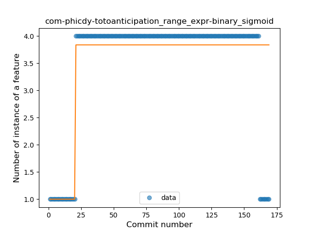

#### com-atanana-sicounter
* Feature: String Template
* Function: 
* R_Squared: 0.67132423
 

#### org-liberty-android-freeotpplus
* Feature: String Template
* Function: 
* R_Squared: 0.66911765
 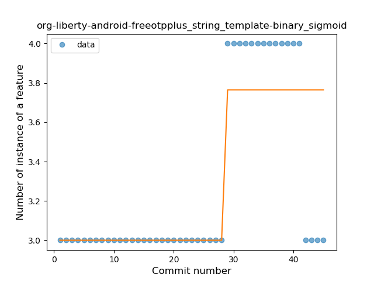

#### com-wabadaba-dziennik
* Feature: Singleton
* Function: 
* R_Squared: 0.66792777
 

#### ml-adamsprogs-bimba
* Feature: Unsafe Call
* Function: 
* R_Squared: 0.66601627
 

#### com-manichord-mgit
* Feature: Lambda
* Function: 
* R_Squared: 0.66569607
 

#### com-ofalvai-bpinfo
* Feature: Destructuring Declaration
* Function: 
* R_Squared: 0.66140097
 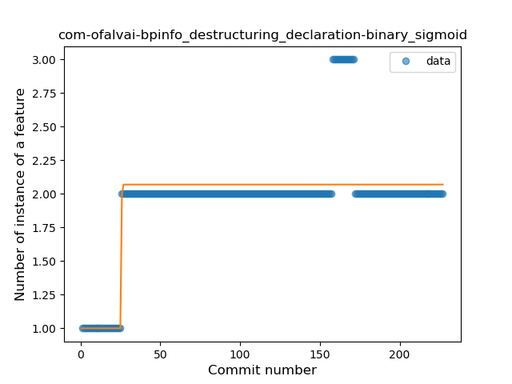

#### ca-josephroque-bowlingcompanion
* Feature: Sealed Class
* Function: 
* R_Squared: 0.66022753
 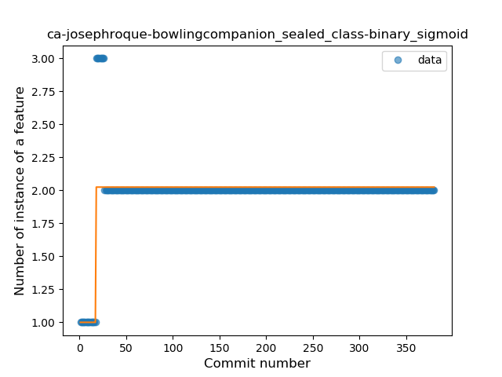

#### com-benoitletondor-easybudgetapp
* Feature: Super Delegation
* Function: 
* R_Squared: 0.65822785
 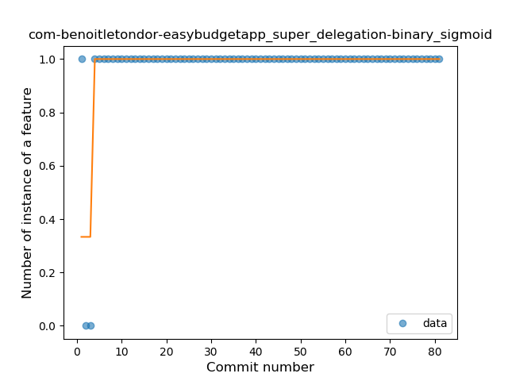

#### cat-xojan-random1
* Feature: Unsafe Call
* Function: 
* R_Squared: 0.64682445
 

#### com-booboot-vndbandroid
* Feature: Companion Object
* Function: 
* R_Squared: 0.63286393
 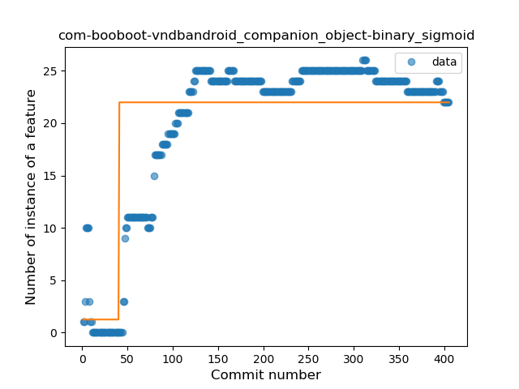

#### me-echeung-moemoekyun-fdroid
* Feature: Data Class
* Function: 
* R_Squared: 0.62804228
 

#### com-jereksel-libresubstratum
* Feature: Type Alias
* Function: 
* R_Squared: 0.61233482
 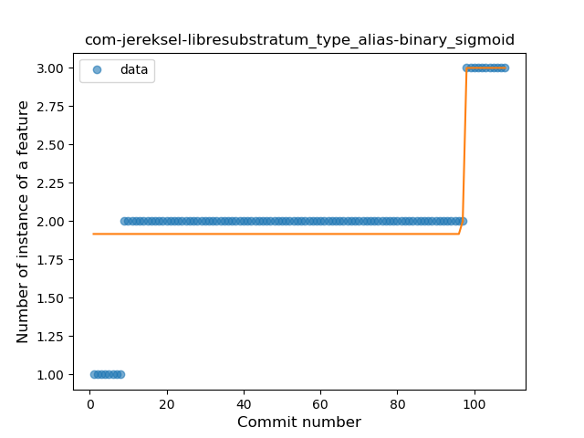

#### it-diab
* Feature: Property Delegation
* Function: 
* R_Squared: 0.61196748
 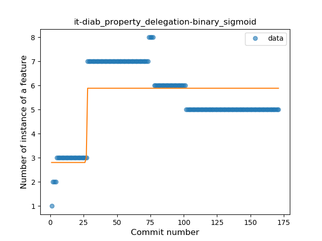

#### sk-styk-martin-apkanalyzer
* Feature: Range Expression
* Function: 
* R_Squared: 0.60968618
 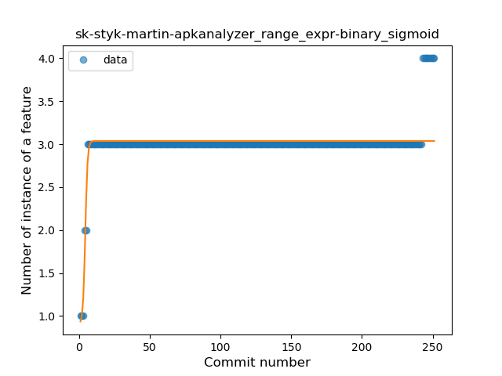

#### net-stew-stew
* Feature: Function with Default Value
* Function: 
* R_Squared: 0.60856865
 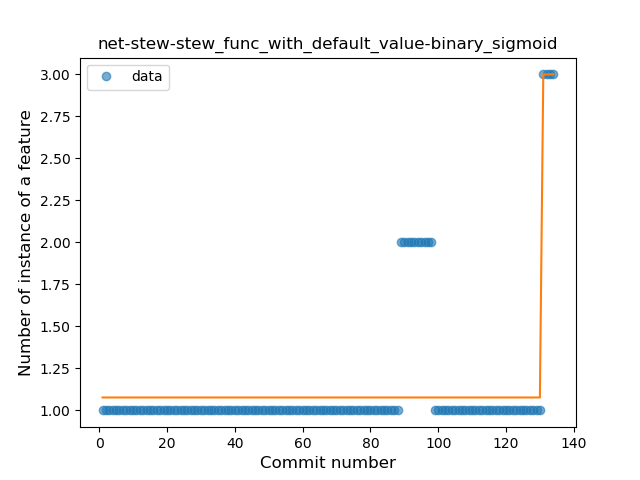

#### me-rei_m-hyakuninisshu
* Feature: Function call with Named Argument
* Function: 
* R_Squared: 0.60431608
 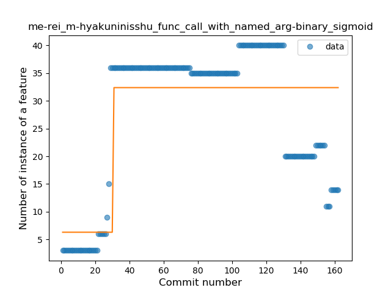

#### org-teamblueridge-pasteitapp
* Feature: Companion Object
* Function: 
* R_Squared: 0.60232558
 

#### me-proxer-app
* Feature: Type Alias
* Function: 
* R_Squared: 0.59829984
 

#### org-sanpra-checklist
* Feature: Singleton
* Function: 
* R_Squared: 0.58832325
 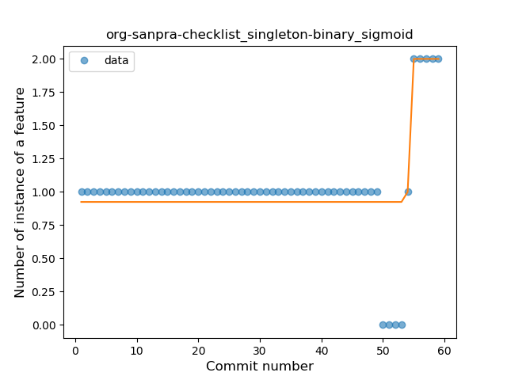

#### org-mariotaku-twidere
* Feature: Type Alias
* Function: 
* R_Squared: 0.57403126
 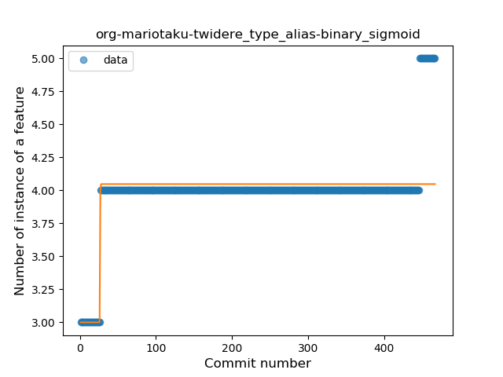

#### com-sduduzog-slimlauncher
* Feature: Safe Call
* Function: 
* R_Squared: 0.57090066
 

#### com-atanana-sicounter
* Feature: Function call with Named Argument
* Function: 
* R_Squared: 0.56581583
 

#### superustats-tool-android
* Feature: Extension Function
* Function: 
* R_Squared: 0.56490833
 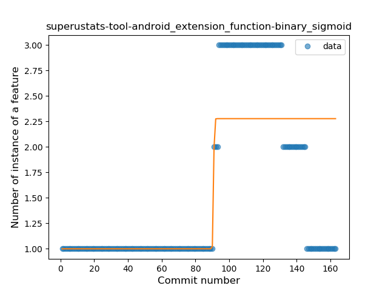

#### de-cineaste-android
* Feature: Companion Object
* Function: 
* R_Squared: 0.55873268
 

#### com-mgaetan89-showsrage
* Feature: Unsafe Call
* Function: 
* R_Squared: 0.54590148
 

#### com-wabadaba-dziennik
* Feature: Function call with Named Argument
* Function: 
* R_Squared: 0.5341615
 

#### com-booboot-vndbandroid
* Feature: Destructuring Declaration
* Function: 
* R_Squared: 0.53063049
 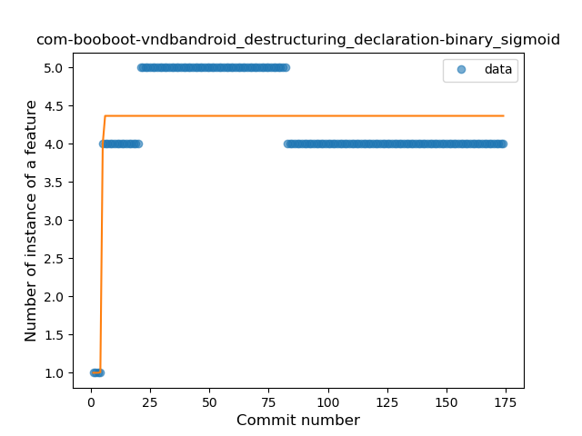

#### name-cantanima-chineseremainderclock
* Feature: Range Expression
* Function: 
* R_Squared: 0.52777777
 

#### com-calintat-units
* Feature: Data Class
* Function: 
* R_Squared: 0.50716713
 

#### org-anibyl-slounik
* Feature: Function with Default Value
* Function: 
* R_Squared: 0.50707869
 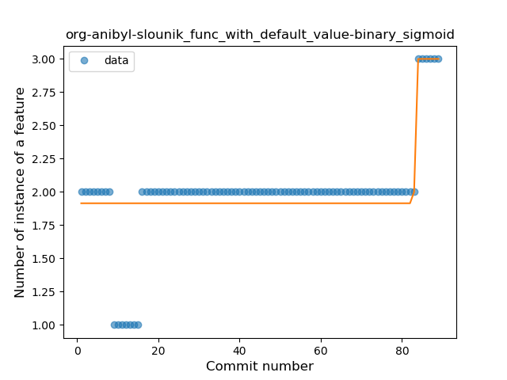

#### li-klass-fhem
* Feature: Sealed Class
* Function: 
* R_Squared: 0.47866685
 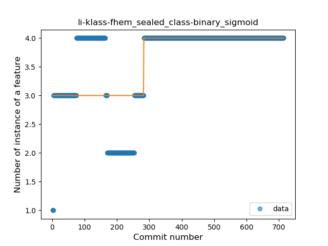

#### com-sduduzog-slimlauncher
* Feature: Type Inference
* Function: 
* R_Squared: 0.4679746
 

#### tech-ula
* Feature: Inline Function
* Function: 
* R_Squared: 0.4656127
 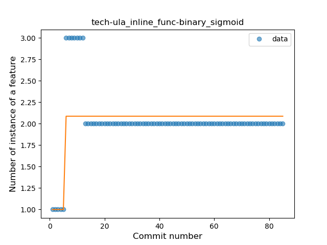

#### net-mm2d-android-vmb
* Feature: Property Delegation
* Function: 
* R_Squared: 0.44428202
 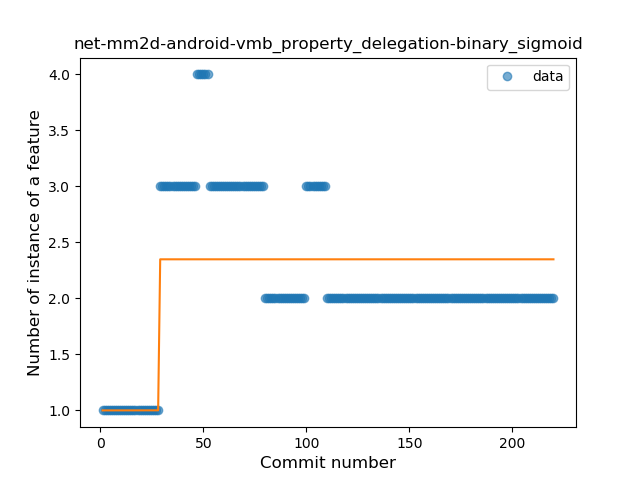

#### com-kgurgul-cpuinfo
* Feature: Singleton
* Function: 
* R_Squared: 0.43873783
 

#### tw-shounenwind-kmnbottool
* Feature: Property Delegation
* Function: 
* R_Squared: 0.41070223
 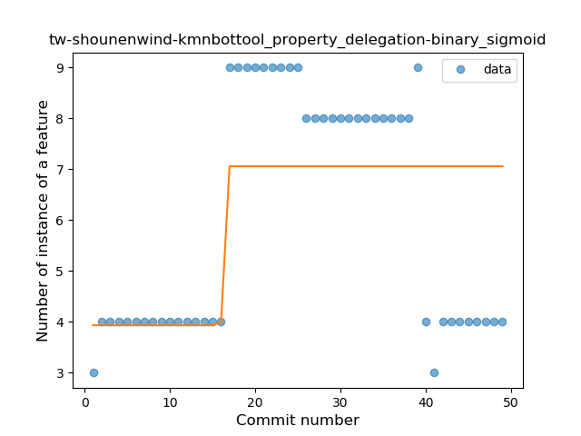

#### org-kiwix-kiwixcustomwikivoyageeurope
* Feature: Lambda
* Function: 
* R_Squared: 0.4096281
 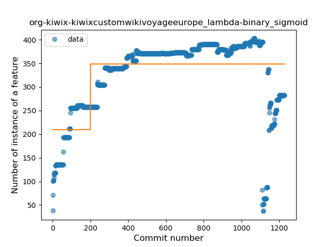

#### com-simplemobiletools-camera
* Feature: Range Expression
* Function: 
* R_Squared: 0.39960678
 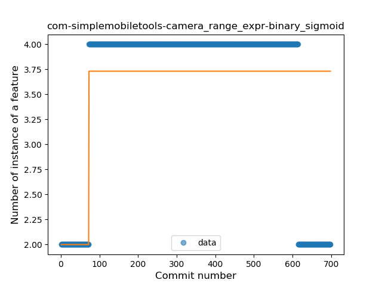

#### ch-abertschi-adfree
* Feature: Companion Object
* Function: 
* R_Squared: 0.38613012
 

#### com-bubelov-coins
* Feature: Sealed Class
* Function: 
* R_Squared: 0.3706965
 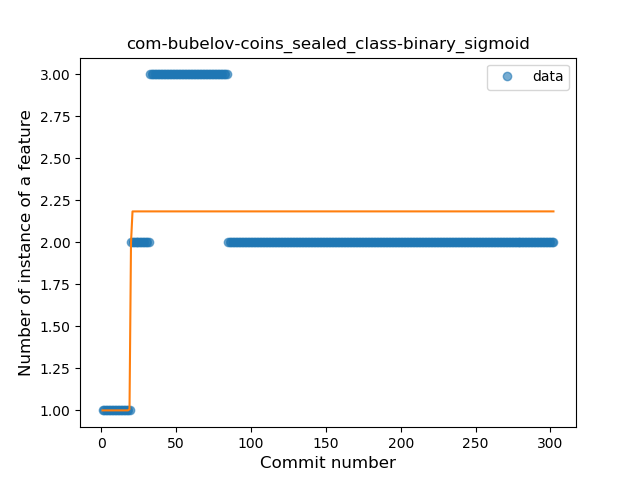

#### com-jmstudios-redmoon
* Feature: Inline Function
* Function: 
* R_Squared: 0.35842027
 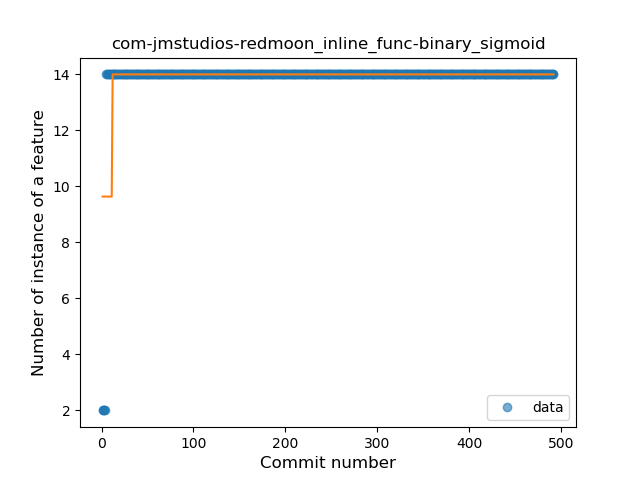

#### com-alderferstudios-handandfootscores
* Feature: String Template
* Function: 
* R_Squared: 0.35714286
 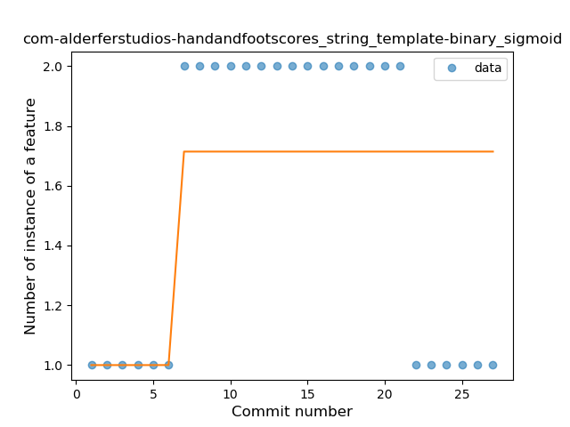

#### org-ligi-materialteatimer
* Feature: Singleton
* Function: 
* R_Squared: 0.34766899
 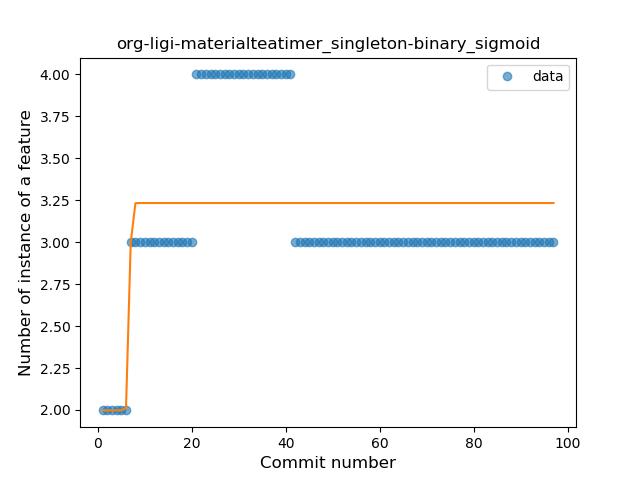

#### org-weilbach-splitbills
* Feature: String Template
* Function: 
* R_Squared: 0.34098833
 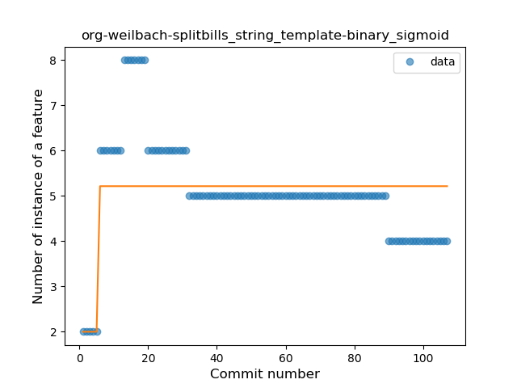

#### eu-the4thfloor-msync
* Feature: Function with Default Value
* Function: 
* R_Squared: 0.33258263
 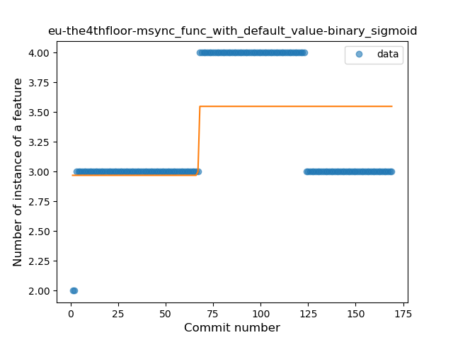

#### ch-abertschi-adfree
* Feature: Data Class
* Function: 
* R_Squared: 0.33145811
 

#### net-nonylene-photolinkviewer
* Feature: Lambda
* Function: 
* R_Squared: 0.32689238
 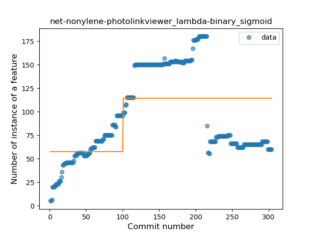

#### com-garpr-android
* Feature: Overloaded Operator
* Function: 
* R_Squared: 0.29696983
 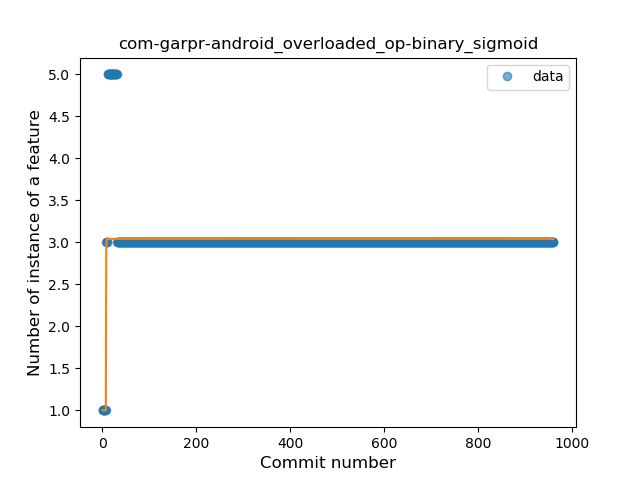

#### pw-janyo-whatanime
* Feature: Companion Object
* Function: 
* R_Squared: 0.2873909
 

#### me-echeung-moemoekyun-fdroid
* Feature: Singleton
* Function: 
* R_Squared: 0.27823373
 

#### com-github-quarck-calnotify
* Feature: Smart Cast
* Function: 
* R_Squared: 0.26546712
 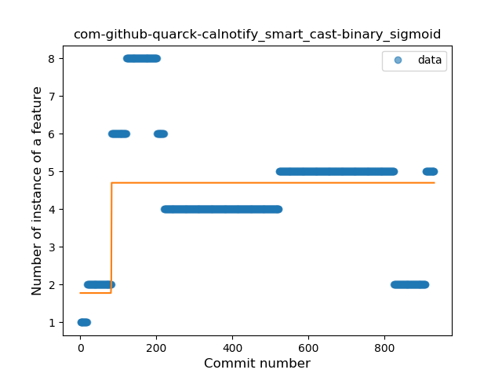

#### net-nonylene-photolinkviewer
* Feature: Extension Function
* Function: 
* R_Squared: 0.26429771
 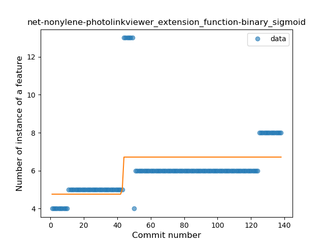

#### ml-adamsprogs-bimba
* Feature: Safe Call
* Function: 
* R_Squared: 0.24790931
 

#### me-rei_m-hyakuninisshu
* Feature: When expression
* Function: 
* R_Squared: 0.23915982
 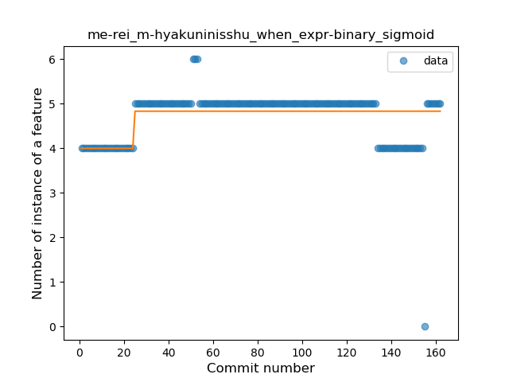

#### com-bernaferrari-changedetection
* Feature: Companion Object
* Function: 
* R_Squared: 0.23366796
 

#### nl-mpcjanssen-simpletask
* Feature: Unsafe Call
* Function: 
* R_Squared: 0.2318304
 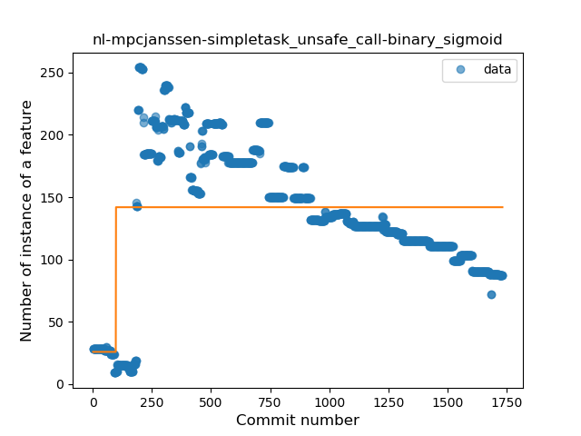

#### com-simplemobiletools-draw
* Feature: Companion Object
* Function: 
* R_Squared: 0.2302259
 

#### com-simplemobiletools-draw-pro
* Feature: Companion Object
* Function: 
* R_Squared: 0.2302259
 

#### com-libopenmw-openmw
* Feature: String Template
* Function: 
* R_Squared: 0.21231423
 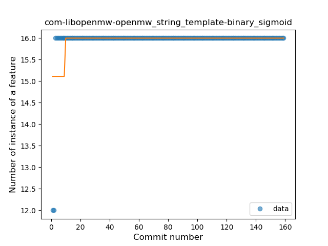

#### com-conorodonnell-bus
* Feature: String Template
* Function: 
* R_Squared: 0.20626784
 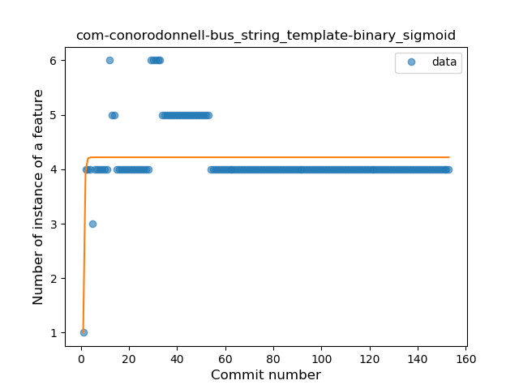

#### eu-the4thfloor-msync
* Feature: Unsafe Call
* Function: 
* R_Squared: 0.20004795
 

#### com-simplemobiletools-notes-pro
* Feature: Companion Object
* Function: 
* R_Squared: 0.19665609
 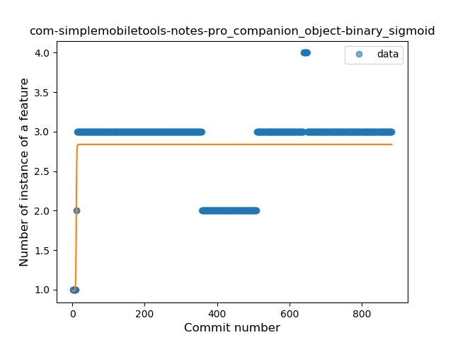

#### com-simplemobiletools-applauncher
* Feature: Extension Function
* Function: 
* R_Squared: 0.17229446
 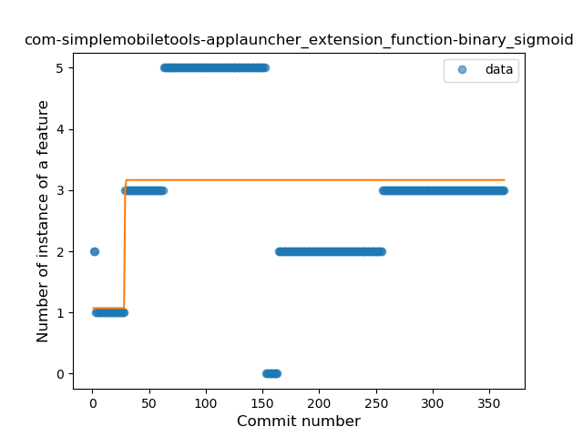

#### net-nonylene-photolinkviewer
* Feature: Singleton
* Function: 
* R_Squared: 0.15189799
 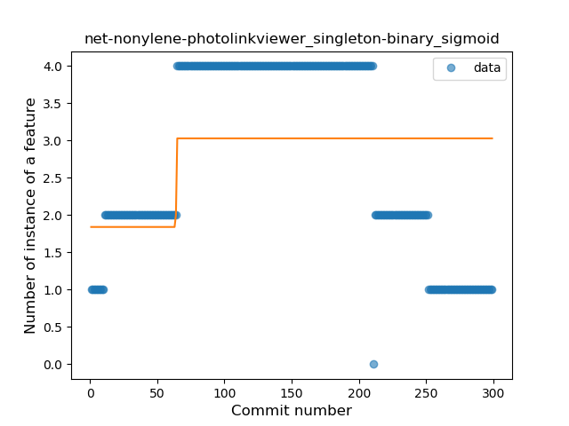

#### fr-insapp-insapp
* Feature: Smart Cast
* Function: 
* R_Squared: 0.14814815
 

#### eu-kanade-tachiyomi
* Feature: Super Delegation
* Function: 
* R_Squared: 0.14667783
 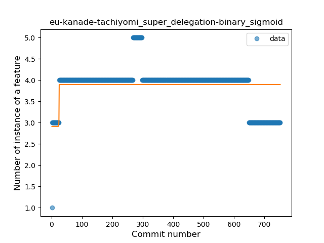

#### superustats-tool-android
* Feature: Function call with Named Argument
* Function: 
* R_Squared: 0.1466651
 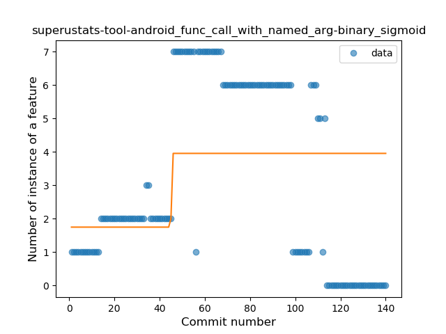

#### io-trewartha-positional
* Feature: Singleton
* Function: 
* R_Squared: 0.12840467
 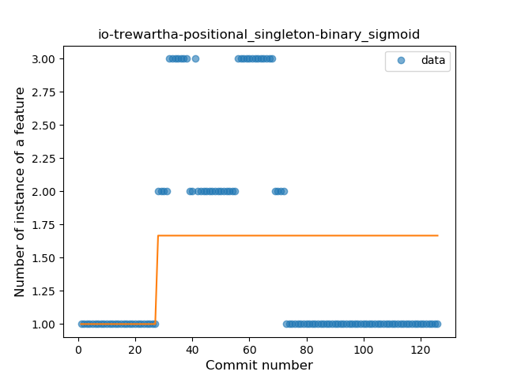

#### at-bitfire-icsdroid
* Feature: String Template
* Function: 
* R_Squared: 0.12107526
 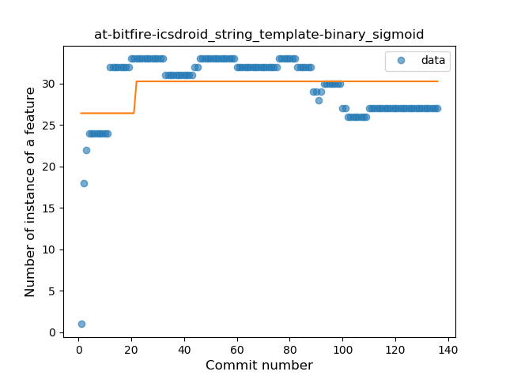

#### org-poul-bits-android
* Feature: Extension Function
* Function: 
* R_Squared: 0.09857383
 

#### apps-amine-bou-readerforselfoss
* Feature: Destructuring Declaration
* Function: 
* R_Squared: 0.08470347
 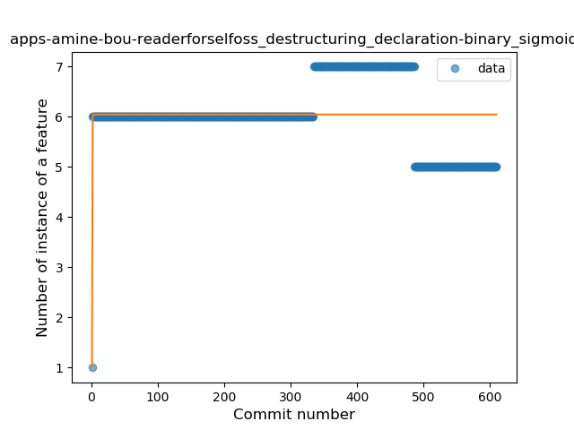

#### net-nonylene-photolinkviewer
* Feature: Safe Call
* Function: 
* R_Squared: 0.06894885
 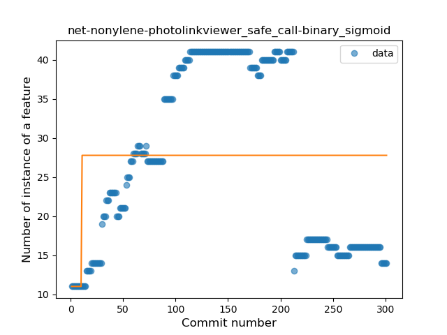

#### com-adityakamble49-dcipher
* Feature: Companion Object
* Function: 
* R_Squared: 0.05619536
 

#### com-garpr-android
* Feature: Property Delegation
* Function: 
* R_Squared: 0.05349767
 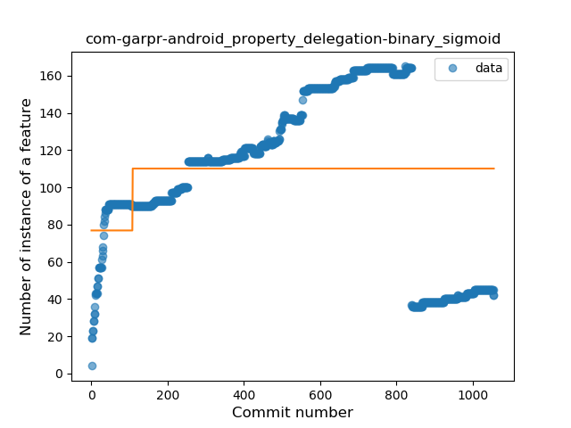

#### superustats-tool-android
* Feature: String Template
* Function: 
* R_Squared: 0.04542792
 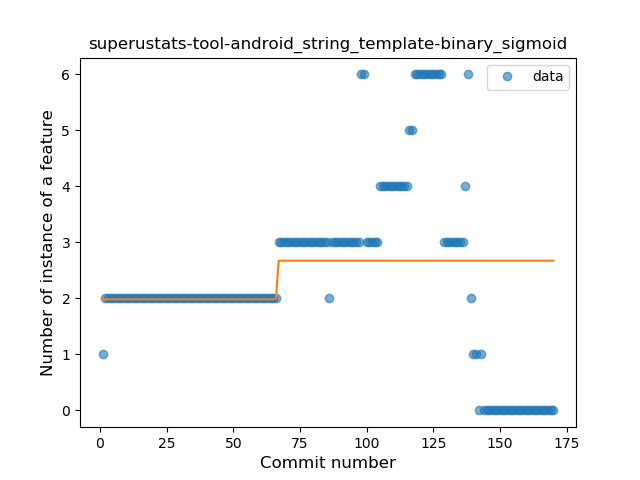

